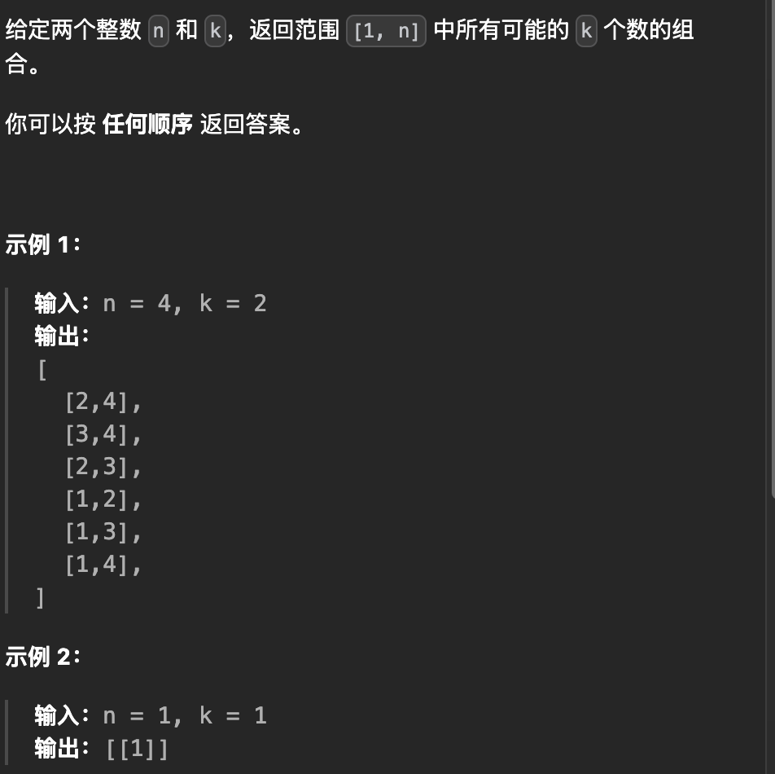
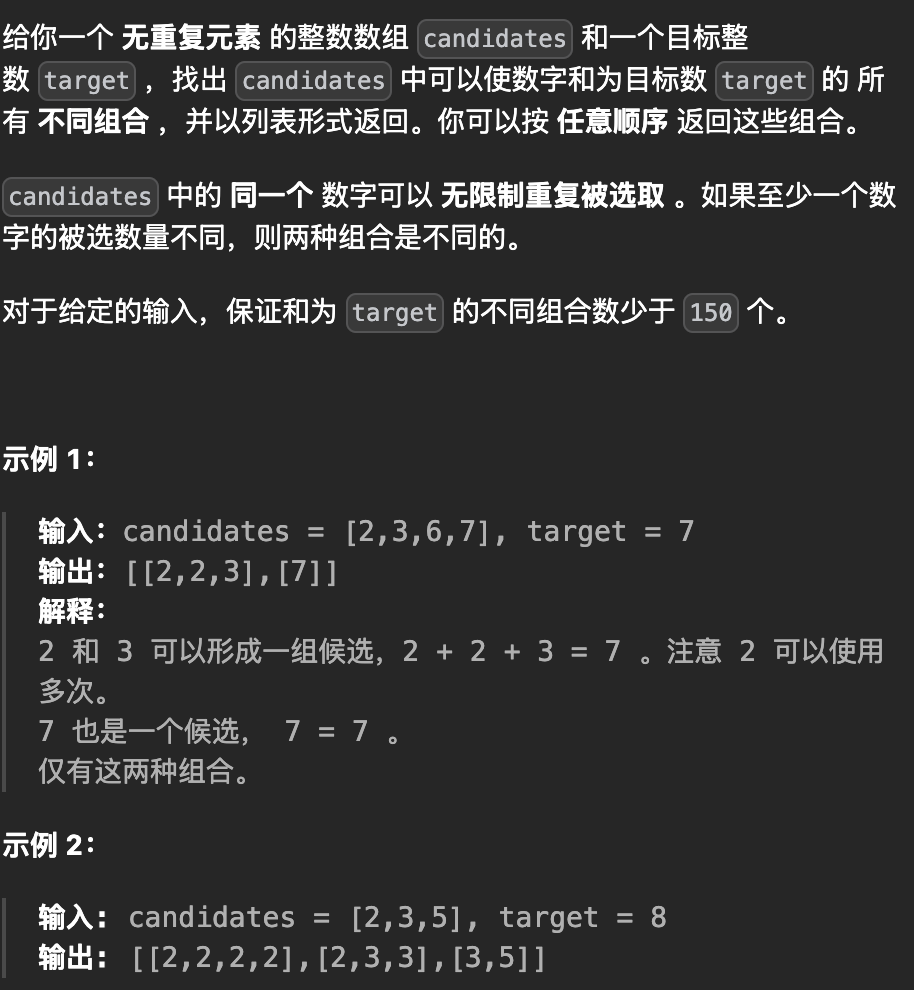
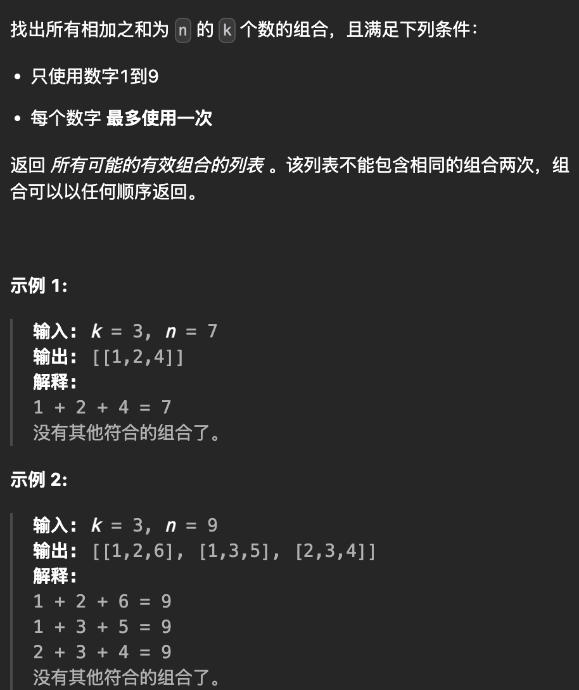
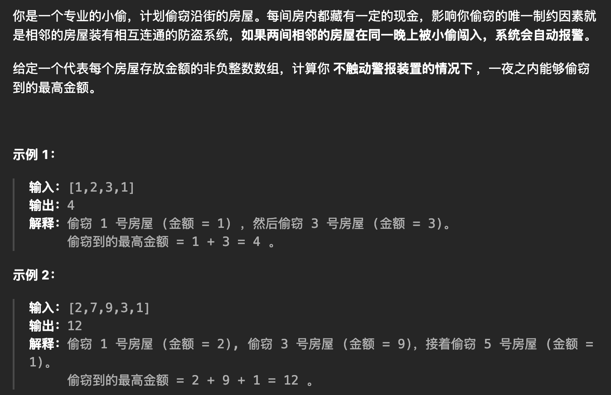
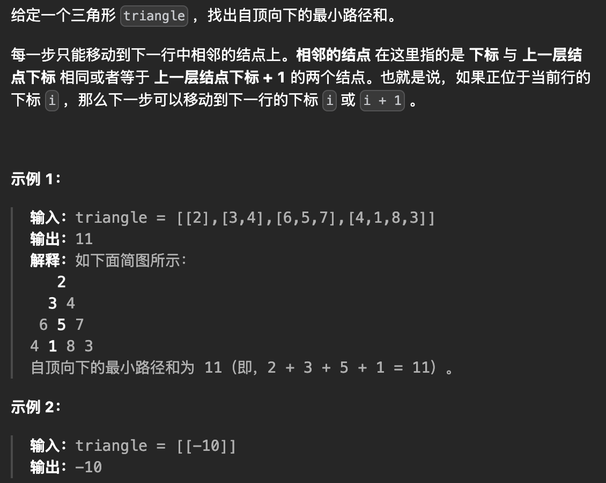
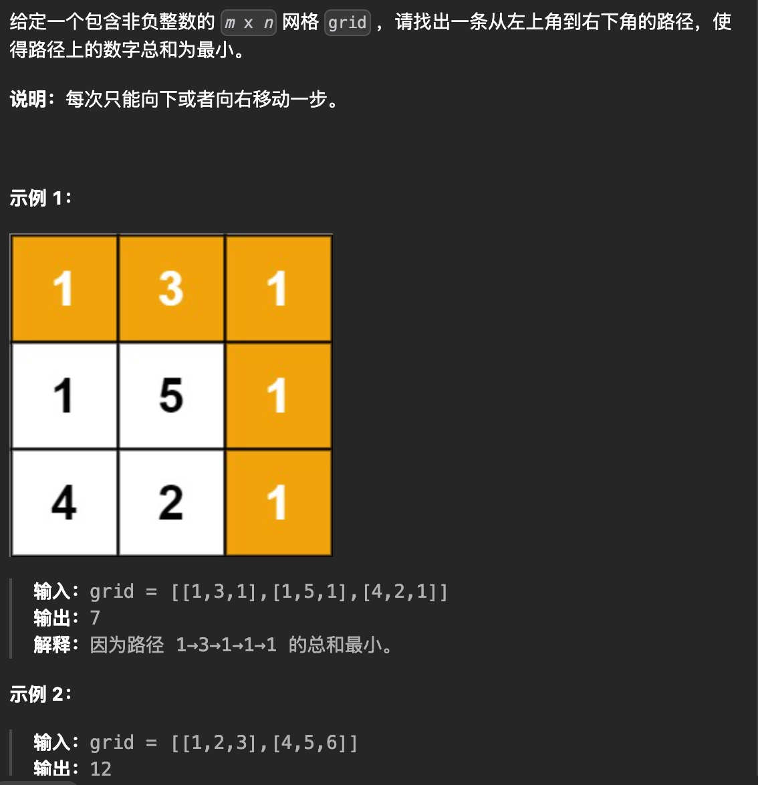
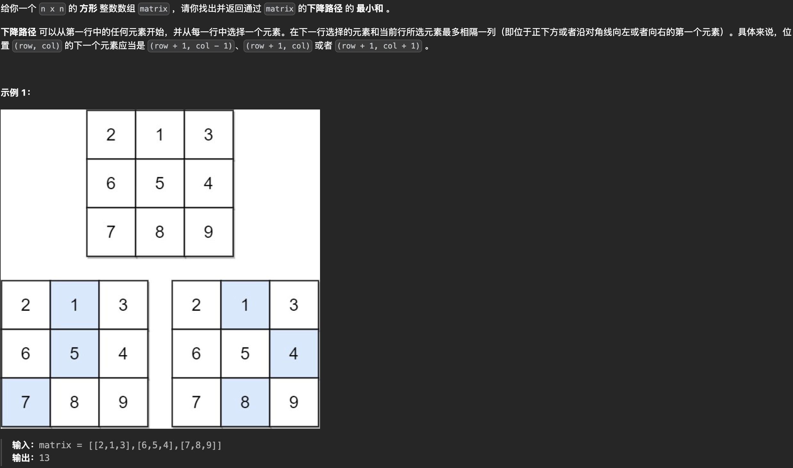
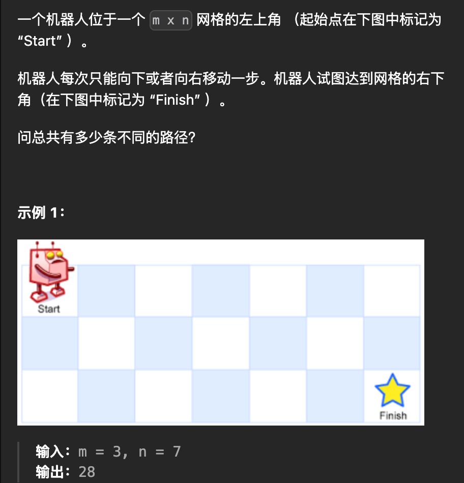
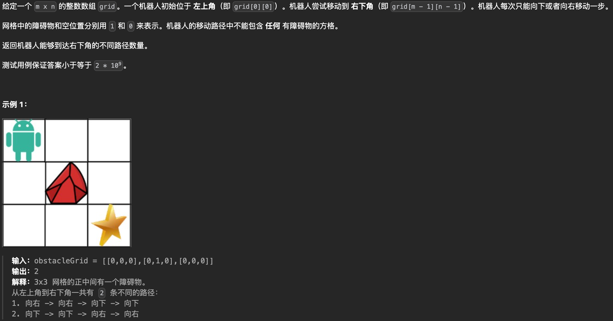
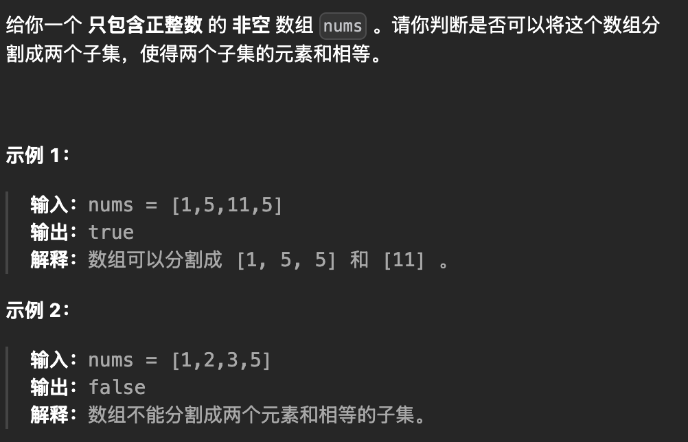

# 算法

## 双指针

[977. 有序数组的平方 - 力扣（LeetCode）](https://leetcode.cn/problems/squares-of-a-sorted-array/description/)

 

```java
public int[] sortedSquares(int[] nums) {
    int result[] = new int[nums.length];
    //首尾指针
    int startIndex = 0;
    int endIndex = nums.length - 1;
    int size = nums.length - 1;

    while (size >= 0) {
        //因为nums是有序数组,所以左右两边的平方一定比中间大,从两边往中间遍历，把最大的放在新数组右边
        //判断首尾谁的绝对值大就把它放在新数组末尾
        if (Math.abs(nums[startIndex]) > Math.abs(nums[endIndex])) {
            result[size--] = nums[startIndex] * nums[startIndex];
            startIndex++;
        } else {
            result[size--] = nums[endIndex] * nums[endIndex];
            endIndex--;
        }
    }
    return result;
}
```


## 回溯算法

### 模版代码

```java
//先写backtracking的for循环代码
//再写终止条件
//最后确定递归参数（需要什么补充什么）
void backtracking(参数) {
    if (终止条件) {
        存放结果;		//添加结果的时候,注意集合要用new的方式，因为Java是值传递，集合传递的是内存地址值,会在原基础上修改
        return;
    }

    for (选择：本层集合中元素（树中节点孩子的数量就是集合的大小）) {
        处理当前节点;
        backtracking(路径，选择列表); // 递归选择下一个
        回溯，撤销刚才选择的结果
    }
}
```


### 组合问题

https://leetcode.cn/problems/combinations/

 

```java
List<List<Integer>> result = new ArrayList<>();
List<Integer> cur = new ArrayList<>();

public List<List<Integer>> combine(int n, int k) {
    backtracking(n, k, 1);
    return result;
}

void backtracking(int n, int k, int startIndex) {
    if (cur.size() == k) {
        result.add(new ArrayList<>(cur));
        return;
    }

    for (int i = startIndex; i <= n; i++) {
        //选择当前的值
        cur.add(i);
        //递归选择下一次的值（这里i+1,因为不能重复选）
        backtracking1(n, k, i + 1);
        //撤销刚刚选择的值，eg：1 2 如果不弹出，cur则会变成1 2 3 4，只有弹出上一次的最后一个c
        cur.remove(cur.size() - 1);
    }
}
```


### 组合总和

https://leetcode.cn/problems/combination-sum/description/

 

```java
List<List<Integer>> result = new ArrayList<>();
List<Integer> cur = new ArrayList<>();

public List<List<Integer>> combinationSum(int[] candidates, int target) {
    back(candidates,target, 0, 0 );
    return result;
}

void back(int[] candidates,int target, int startIndex, int curSum ) {
		//如果总和等于目标,那么就放入并返回
    if (curSum == target) {
        result.add(new ArrayList<>(cur));
        return;
    }
    //如果当前总和超过了目标,也返回
    if (curSum > target) {
        return;
    }

    for (int i = startIndex; i < candidates.length; i++) {
      	//选择当前值
        cur.add(candidates[i]);
       //当前总和放入
        curSum += candidates[i];
        //因为可以重复选,所以递归选择
        back(candidates, i, curSum, target);
      	//撤销上一次选择的
        curSum -= cur.get(cur.size() - 1);
        cur.remove(cur.size() - 1);
    }

}
```


### 组合总和III

https://leetcode.cn/problems/combination-sum-iii/

 

```java
List<List<Integer>> result = new ArrayList<>();
List<Integer> cur = new ArrayList<>();

public List<List<Integer>> combinationSum3(int k, int n) {
    backtracking(k, n, 1, 0);
    return result;
}

void backtracking(int k, int n, int startIndex, int curSum) {
		//如果当前大小等于k
    if (cur.size() == k) {
      	//并且当前的总和等于n,就放入结果
        if (curSum == n) {
            result.add(new ArrayList<>(cur));
        }
      	//否则全都返回
        return;
    }

    for (int i = startIndex; i <= 9; i++) {
      	//放入当前的值、总和
        cur.add(i);
        curSum += i;
			
      	//选择下一次的,因为不能重复
        backtracking(k, n, i + 1, curSum);

      	//撤销刚刚选择的
        curSum -= cur.get(cur.size() - 1);
        cur.remove(cur.size() - 1);

    }

}
```


## 动态规划

### 打家劫舍

[198. 打家劫舍](https://leetcode.cn/problems/house-robber/)

 

```java
public int rob(int[] nums) {
      if (nums.length == 1)
          return nums[0];

      //定义dp：偷走前i个房间的最大值
      int dp[] = new int[nums.length];

      //偷前面1个房间，本身就最大
      dp[0] = nums[0];
      //偷前2个,看第1个和第2个谁最大，因为不能连续偷
      dp[1] = Math.max(nums[1], nums[0]);
		
  		//转移方程:从第3个开始偷
      for (int i = 2; i < nums.length; i++) {
          //判断是自己的价值+前面隔1个的大，还是前1个的大
          dp[i] = Math.max(nums[i] + dp[i - 2], dp[i - 1]);
      }

      return dp[nums.length - 1];
}
```


### 三角形最小路径和

https://leetcode.cn/problems/triangle/description/?envType=study-plan-v2&envId=dynamic-programming

 


```java
//工具类:将集合转为数组
private static int[][] convertListToArray(List<List<Integer>> triangle) {
    //获取最大的行、列
    int row = triangle.size();
    int col = 0;
    for (List<Integer> list : triangle) {
        col = Math.max(col, list.size());
    }
    int matrix[][] = new int[row][col];
    //初始化每行数据
    for (int i = 0; i < row; i++) {
        for (int j = 0; j < col; j++) {
            try {
                //下标一旦越界,那么就默认初始化为最大值
                matrix[i][j] = triangle.get(i).get(j);
            } catch (Exception e) {
                matrix[i][j] = 9999;
            }

        }
    }
    return matrix;
}

//核心算法
public static int minimumTotal(List<List<Integer>> triangle) {
        /**
         *          2
         *         3 4
         *        6 5 7            即 2 + 3 + 5 + 1 = 11 最短
         *       4 1 8 3
         * 
         *    2 ∞ ∞ ∞  -->  2   ∞   ∞  ∞
         *    3 4 ∞ ∞       5   6   ∞  ∞
         *    6 5 7 ∞       11  10  13 ∞
         *    4 1 8 3       14  11  18 16
         */
  
  			//这里可以优化：可以不用转换，直接使用集合来操作,这里为了简单易懂用了转换
        int matrix[][] = convertListToArray(triangle);
        int row = matrix.length;
        int col = matrix[0].length;

        if (row == col && row == 1) return triangle.get(0).get(0);

        //定义dp为从左上角的点到最下面一行每个点的最短路径
        int dp[][] = new int[row][col];
        dp[0][0] = matrix[0][0];

        //初始化dp数组第一行
        for (int i = 1; i < col; i++) {
            dp[0][i] = matrix[0][i];
        }
        //初始化第一列
        for (int i = 1; i < row; i++) {
            dp[i][0] = matrix[i][0] + dp[i - 1][0];
        }

        //状态转移方程
        for (int i = 1; i < row; i++) {
            for (int j = 1; j < col; j++) {
                //当前的点的路径值=min(本身的值+上面一行的值 或 上一行的左边一个值)
                dp[i][j] = matrix[i][j] + Math.min(dp[i - 1][j], dp[i - 1][j - 1]);
            }
        }

        //获取最后一行的最小值
        int min = 9999;
        for (int i = 0; i < col; i++) {
            min = Math.min(min, dp[row - 1][i]);
        }
        return min;
    }
```


### 最小路径和

https://leetcode.cn/problems/minimum-path-sum/description/?envType=study-plan-v2&envId=dynamic-programming

 

```java
public static int minPathSum(int[][] grid) {
        int row = grid.length;
        int col = grid[0].length;
  
        //定义dp为从m行到j列的最小花费总和
        int dp[][] = new int[row][col];
        dp[0][0] = grid[0][0];

        //第一行
        for (int i = 1; i < col; i++) {
            dp[0][i] = grid[0][i] + dp[0][i - 1];
        }
        //第一列
        for (int i = 1; i < row; i++) {
            dp[i][0] = grid[i][0] + dp[i - 1][0];
        }
        //转移方程
        for (int i = 1; i < row; i++) {
            for (int j = 1; j < col; j++) {
                //当前的cost=min(grid自身的值+当前上面或当前左边的值）
                dp[i][j] = grid[i][j] + Math.min(dp[i - 1][j], dp[i][j - 1]);
            }
        }
        return dp[row - 1][col - 1];
    }
```


### 下降路径最小和

https://leetcode.cn/problems/minimum-falling-path-sum/description/?envType=study-plan-v2&envId=dynamic-programming

 

```java
 public static int minFallingPathSum(int[][] matrix) {
        int row = matrix.length;
        int col = row;

        //定义dp为从左上角的点到最下面一行每个点的最小路径和
        int dp[][] = new int[row][col];
        dp[0][0] = matrix[0][0];

        //只能初始化第一行的每列,不能初始化第一列的每行,因为从第二行开始，可以有三个方向得到值
        for (int i = 1; i < col; i++) {
            dp[0][i] = matrix[0][i];
        }

        //状体转移方程:当前的数据=min（本身的值+ 当前行的左上、正上、右上的值）
        for (int i = 1; i < row; i++) {
            for (int j = 0; j < col; j++) {
                int value;
                //如果是列的左边缘,那么就没有左上
                if (j == 0) {
                    value = Math.min(dp[i - 1][j + 1], dp[i - 1][j]);
                }
                //如果是列的右边缘,那么就没有右上
                else if (j == col - 1) {
                    value = Math.min(dp[i - 1][j - 1], dp[i - 1][j]);
                } else {
                    value = Math.min(Math.min(dp[i - 1][j - 1], dp[i - 1][j + 1]), dp[i - 1][j]);
                }
                dp[i][j] = matrix[i][j] + value;
            }
        }

        //获取最后一行的最小值
        int min = Integer.MAX_VALUE;
        for (int i = 0; i < col; i++) {
            min = Math.min(min, dp[row - 1][i]);
        }
        return min;
    }
```


### 不同路径1️⃣

> https://programmercarl.com/0062.%E4%B8%8D%E5%90%8C%E8%B7%AF%E5%BE%84.html

 

```java
//        dp[0][0] = 1;
//        dp[0][1] = dp[0][0];
//        dp[1][0] = dp[0][0];
//        dp[0][2] = dp[0][1]= dp[0][0];

//        dp[1][2] = dp[1][1] + dp[0][2];  //2+1=3  我可以从11过来，也可以从02过来
//        dp[2][1] = dp[2][0] + dp[1][1];  //1+2=3  我可以从20过来，也可以从11过来
//
//        dp[1][1] = dp[1][0] + dp[0][1];   //2			我可以从10过来，也可以从01过来
//        dp[2][2] = dp[2][1] + dp[1][2];  //3+3=6  我可以从21过来，也可以从12过来
//        dp[3][3] = dp[3][2] + dp[2][3];

public int uniquePaths(int m, int n) {
        //dp：机器人到m行n列有几种方式
        int[][] dp = new int[m][n];
       //初始化自己到自己只有一种方式（符合测试用例）
        dp[0][0] = 1;
  
       //初始化往下走i行都只有一种方式
        for (int i = 1; i < m; i++) {
            dp[i][0] = 1;
        }
  		 //初始化往右走i列都只有一种方式
        for (int i = 1; i < n; i++) {
            dp[0][i] = 1;
        }

   		 //转移方程
        for (int i = 1; i < m; i++) {
            for (int j = 1; j < n; j++) {
                dp[i][j] = dp[i][j - 1] + dp[i - 1][j];
            }
        }
        return dp[m-1][n-1];
    }
```


### 不同路径2️⃣

> https://programmercarl.com/0063.%E4%B8%8D%E5%90%8C%E8%B7%AF%E5%BE%84II.html#%E7%AE%97%E6%B3%95%E5%85%AC%E5%BC%80%E8%AF%BE



```java
public int uniquePathsWithObstacles(int[][] obstacleGrid) {
        int m = obstacleGrid.length;
        int n = obstacleGrid[0].length;
  
        //dp：机器人到m行n列有几种方式
        int[][] dp = new int[m][n];

        //如果只有一行，里面只要有障碍就直接返回0
        if (m == 1) {
            for (int i = 0; i < n; i++) {
                if (obstacleGrid[0][i] == 1) {
                    return 0;
                }
            }
        }

        //左上角的robot如果是障碍，那么直接返回0
        if (obstacleGrid[0][0] != 1) {
            dp[0][0] = 1;
        } else {
            dp[0][0] = 0;
            return dp[0][0];
        }
  
        //初始化外层下边路:
        for (int i = 1; i < m; i++) {
            // 如果下面边路只要有1个0，那么它的下边边路全部过不去了，全是0
            if (obstacleGrid[i][0] == 1)
                break;
            dp[i][0] = 1;
        }
       //初始化外层右边路:
        for (int i = 1; i < n; i++) {
            // 如果右边边路只要有1个0，那么它的右边所有全部过不去了，全是0
            if (obstacleGrid[0][i] == 1)
                break;
            dp[0][i] = 1;
        }

  			//转移方程
        for (int i = 1; i < m; i++) {
            for (int j = 1; j < n; j++) {
                //如果不是障碍,那么就等于左边和上边的路径总和
                if (obstacleGrid[i][j] != 1) {
                    dp[i][j] = dp[i][j - 1] + dp[i - 1][j];
                }
            }
        }

        return dp[m - 1][n - 1];
    }
```


### 分隔等和子集

> **这道题本质还是将指定物品放进容量为所有元素总和一半的背包中，怎么装才能让它的价值正好等于元素总和的一半**

 

```java
//[1，5，5，11]
//       0 1 2 3 4 5 6 7 8 9 10 11
// 1（1） 0 1 1 1 1 1 1 1 1 1 1  1
// 2（5） 0 1 1 1 1 5 6 6 6 6 6  6
// 3（5） 0 1 1 1 1 5 6 6 6 6 6  6
// 4（11）0 1 1 1 1 5 6 6 6 6 6  11

//[3,3,3,4,5]
/**         0 1 2 3 4 5 6 7 8 9
 * 商品   3 0 0 0 3 3  3 3 3 3 3
 *       3 0 0 0 3 3  3 6 6 6 6
 *       3 0 0 0 3 3  3 6 6 6 9
 *       4 0 0 0 3 4  4 6 7 7 9
 *       5 0 0 0 3 4  5 6 7 8 9
 */

public boolean canPartition(int[] nums) {
        int sum = 0;
        for (int i = 0; i < nums.length; i++) {
            sum += nums[i];
        }
        //如果是奇数,说明不能平分
        if (sum % 2 != 0)
            return false;

        //nums本身类似于价值和重量
        //nums:[1,2,5]
        //nums的数量类似于物品数量
        int goodsSize = nums.length;
        //类似于背包重量
        int weight = sum / 2;

        //定义dp为任取商品数量在0～重量下的最大价值(此时的最大价值必须是2/sum)
        int dp[][] = new int[goodsSize][weight + 1];
        dp[0][0] = 0;
        //如果背包容量是0,价值也是0
        for (int i = 1; i < dp.length; i++) {
            dp[i][0] = 0;
        }
        //初始化价值
        for (int i = 1; i < dp[0].length; i++) {
            //如果第一个商品的重量小于背包重量的话，那么就默认变为0
            if (i < nums[0]) {
                dp[0][i] = 0;
            } else {
                //否则就是自己的重量
                dp[0][i] = nums[0];
            }
        }

        for (int i = 1; i < dp.length; i++) {
            for (int j = 1; j < dp[0].length; j++) {
                //当前的背包容量<自身重量，就用上一行的
                if (j < nums[i]) {
                    dp[i][j] = dp[i - 1][j];
                } else {
                  //否则说明背包容量够
                    dp[i][j] = Integer.max(dp[i - 1][j], nums[i] + dp[i - 1][j - nums[i]]);
                }
            }
        }

        return dp[goodsSize - 1][weight] == weight ? true : false;
    }
```

