# GAN

## 基础概念

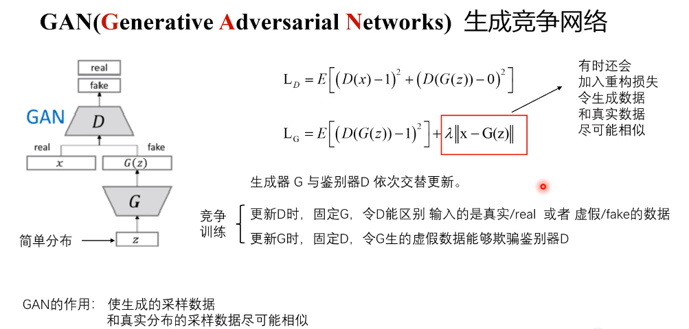

> **样本近似**


### 概念

* **隐含向量**

> **生成网络输入的是服从正态分布的随机数，提供了生成器网络需要的随机性和变化性，生成器网络利用这些隐向量来生成逼真的数据样本**


* **隐含空间**

> **指生成器网络的输入空间由生成器接收的随机向量构成的多维空间，在训练过程中，生成器从隐含空间中的随机向量中生成样本数据，这些向量通常服从某种概率分布（高斯），通过调整隐含向量的取值，可以在隐含空间中探索不同的特征属性，进而生成具有不同风格的数据样本**


### 基本架构

* **传统神经网络**

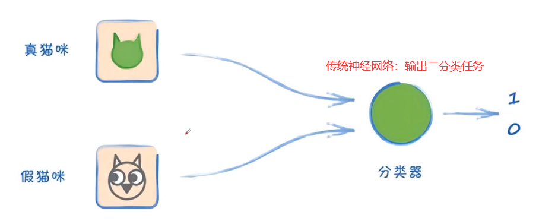


* **GAN架构**

  >  **在训练过程中，生成器努力地让生成的图像更加的真实，而判别器则努力地识别生成器图片的真假，这是一个相互博弈的过程，互相提升自己，也就是不断的进行对抗的过程。随着训练的进行，生成模型产生的样本和真实样本几乎没有什么差别，判别模型也无法准确的判别一个样本的真假，此时的分类错误率为0.5`（纳什均衡）`**

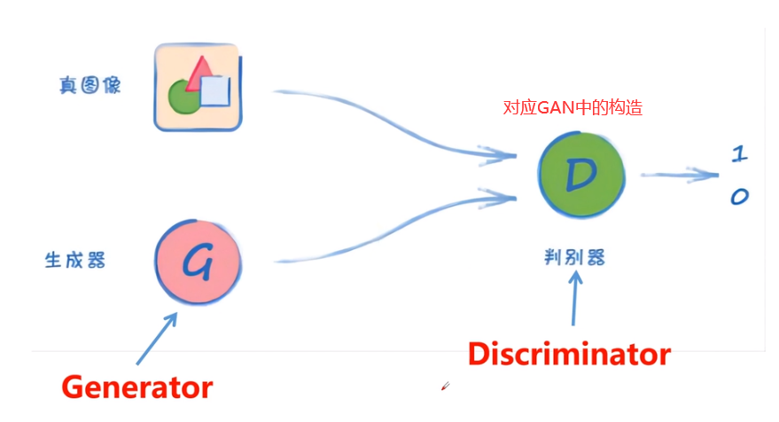

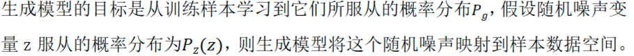


* **G vs D**

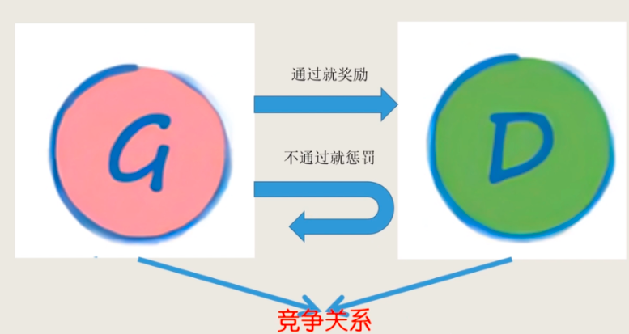

* **若生成器G骗过了判别器D，则奖励生成器G**
* **若生成器G没有骗过判别器D，则惩罚生成器G**

> **如果生成器G的表现不好，则判别器D很容易就可以识别生成图片；如果生成器G的表现越来越好，生成的图像越来越逼真，判别器D也要不断提升才能识别生成的图像。**
>
> **`生成器只有不断的进步才能骗过判别器，判别器只有不断的进步才能识别生成图片，双方都试图逐渐超越对方，这种架构称之为对抗生成网络`**


### 基本步骤

> **总体步骤分为三步：1. 用真实的数据训练判别器  2. 用生成的数据训练判别器  3. 训练生成器生成数据，并使判别器以为它是真实数据**

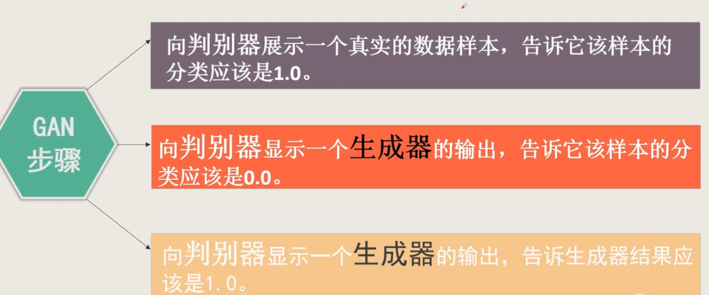

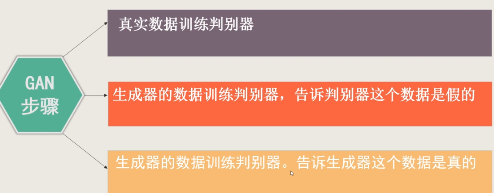


**第一步：用真实的数据去训练判别器**

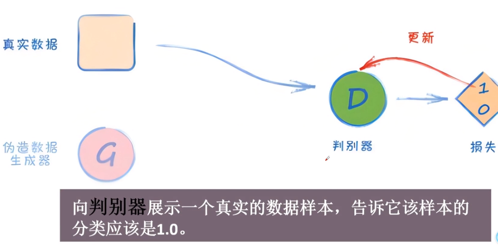


**第二步：生成器没有骗过判别器，不更新生成器，更新判别器**

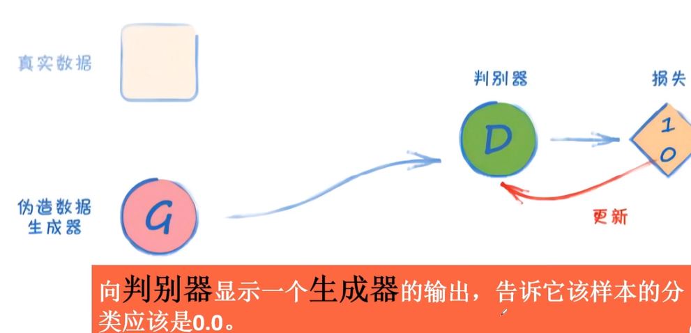


**第三步：生成器骗过判别器，不更新判别器，更新生成器**

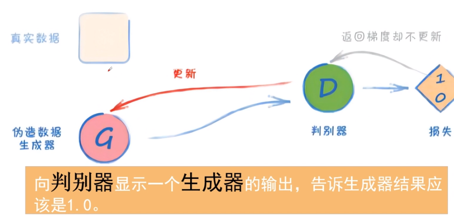


### 损失函数

#### 总损失函数理解

> **最原始的GAN中，生成器接收一个随机噪声向量作为输入，通过对抗训练和反向传播算法 ，不断的从生成器的潜在空间采样，可以获得不同的随机噪声向量，从而生成多样化的与原x相似的图像。**

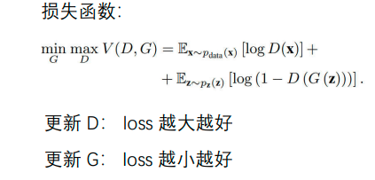 


#### 判别器损失函数

> **判别器的最后会接一层sigmoid激活，将值限定在0~1之间；通常1对应real，0对应fake**

 

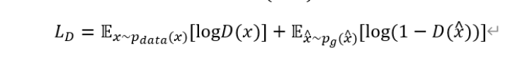   

* **对于D来说，我们希望它能够准确地区分真实数据，即第一项D(x)输出1；希望它能够更好的区分生成的数据，即第二项D(x') 输出0。当判别器能够更好地区分真实数据和假数据时，它的损失越大越好**


#### 生成器损失函数

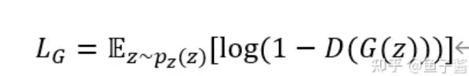 

**对于G来说，我们希望生成的假数据能够骗过判别器，即让判别器 D(G(z)) 输出为真的概率逐渐靠近1，即生成器的损失越小越好。**


### 传统GAN存在的问题

​				**`传统GAN中生成器难以训练的原因之一是判别器输出的二元分类器（Binary Classifier）无法直接评估生成器的效果。通常情况下，判别器只能判断输入数据是真实的还是虚假的，而无法直接量化生成器的质量和多样性。如果需要知道生成器的生成效果，则每隔一段时间后需要显示出生成的图片效果，不好则需要重新调整超参数，再次训练。`**

​				**由于这种限制，生成器很难获得有效的反馈信号来指导其训练。如果判别器太强大，或者生成器的初始参数设置不合理，可能导致生成器无法生成足够多样化和真实的样本，从而使得GAN的训练变得困难。**


### 训练GAN注意的问题

1. **若d_loss趋向0，则说明判别器太好了，此时的生成器完全骗不了判别器；`若d_loss趋近0.5，则说明判别器无法判断生成器生成的图片真假`**
2. **当批处理大小过大时，每次更新的梯度将基于大量的样本，这可能会导致梯度方向不稳定，`使得生成器难以生成逼真的图像，还可能导致模型出现过拟合现象，使得生成器的损失值增加，判别器的损失值降低。 较小的批处理大小还可以帮助模型避免过拟合现象，使得生成器更容易生成逼真的图像`**

​			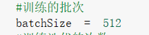

​			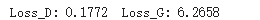		

​			==批次为512时，生成器生成的图片：==

​		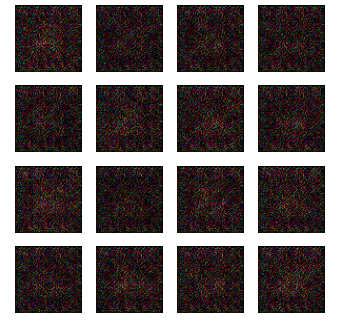


### Model Colapse

> **模式崩溃指在GAN中，`生成器只能生成有限种类的图像，而不是多样化的图像。`这通常发生在训练GAN时，由于某些原因，生成器学会了过多的复制相同或相似的图像，而不是生成多样化的图像。`模式崩溃可能会导致生成器失去原始数据的丰富性和多样性，从而影响GAN的整体效果和性能。`**

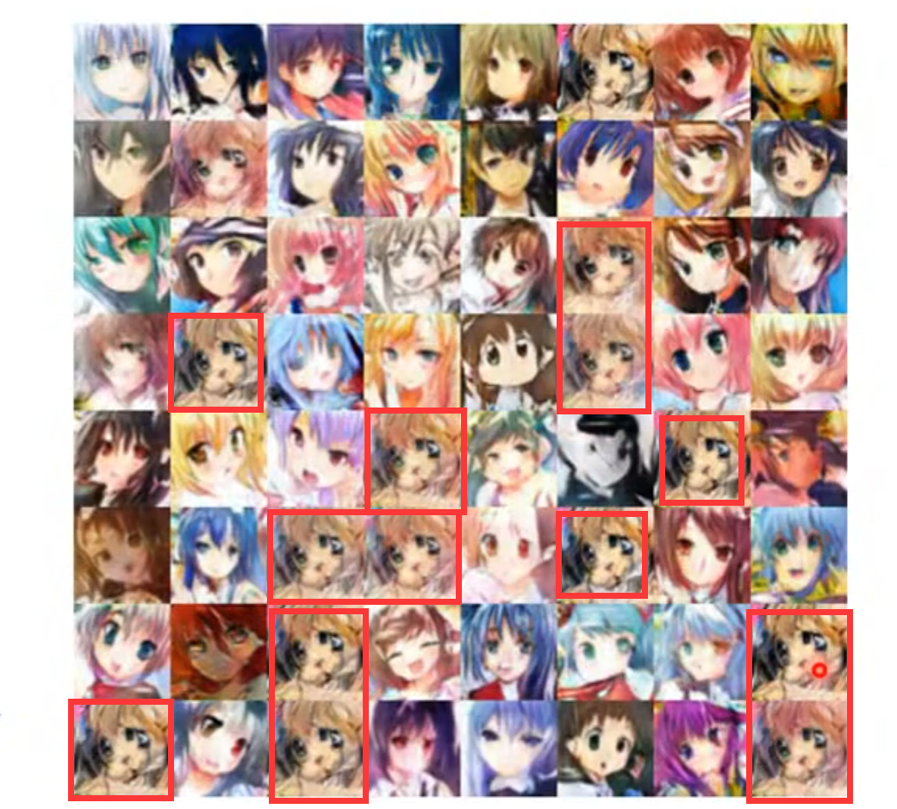 

**注意：为避免模式崩溃，训练GAN时可以使用一些技巧，如增加数据集大小、调整学习率、使用更复杂的生成器和判别器模型等。此外，还可以使用一些正则化方法，如Batch Normalization等，以提高模型的稳定性和泛化性能。**


### CGAN

> **将真实样本和真实标签作为信息输入生成器和判别器，为生成和判别行为做出更好的指导或约束。更具体地说，生成器的随机向量z的作用是提供噪声和多样性，而附加条件xc则提供了额外的约束和指导。通过结合随机向量和附加条件，生成器能够生成符合要求的多样化图像，并且这些图像能够与附加条件相匹配。**

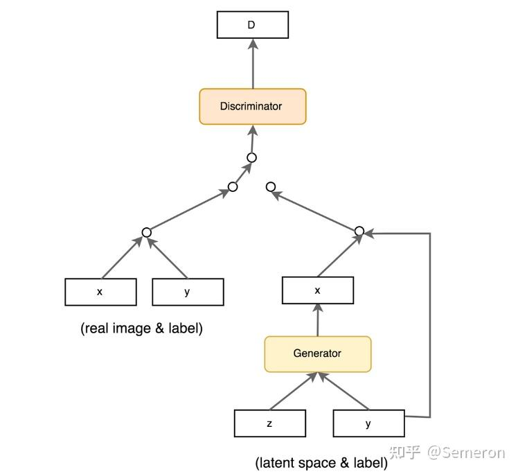


#### 损失函数

> **在CGAN中，`生成器的随机向量z的确是为了更好地生成接近图像的真实数据x`，而附加条件xc则提供了额外的信息和指导，使生成器能够生成满足特定条件的图像。**

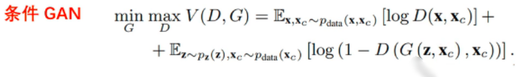


### WGAN-bp

#### 损失函数

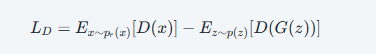 

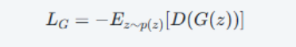 

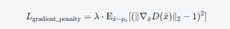 

 


#### CGAN+WGAN的例子

`Speech Enhancement GAN`：https://github.com/leftthomas/SEGAN

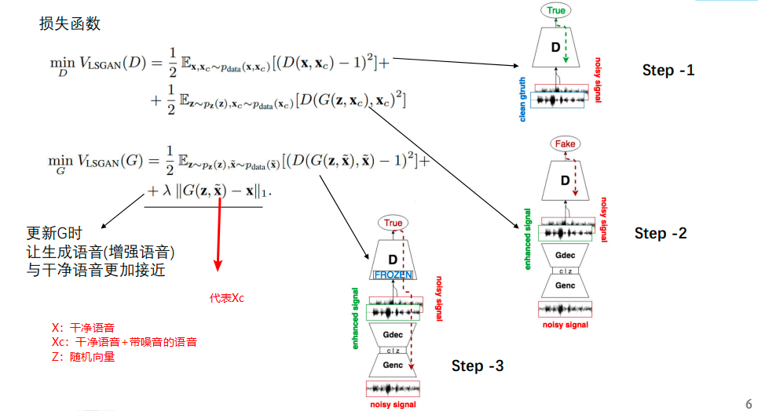

**效果：通过不断的对抗训练，使得生成器能够尽可能的生成同X一样的干净语音**


## 实战项目

### 生成1010格式

#### `1.数据集`

```python
import torch
import torch.nn as nn
import pandas
import matplotlib
matplotlib.use("TkAgg")
import matplotlib.pyplot as plt
import numpy
import random


# 生成真实数据
def generate_real():
    return torch.FloatTensor([
        random.uniform(0.8, 1.0),
        random.uniform(0.0, 0.2),
        random.uniform(0.8, 1.0),
        random.uniform(0.0, 0.2)
    ])

# 生成虚假数据
def generate_random(size=4):
    return torch.rand(size)
```


#### `2.判别器`

```PYTHON
# 判别器
class Discriminator(nn.Module):
    def __init__(self):
        super(Discriminator, self).__init__()

        # 定义模型的层
        self.s1 = nn.Sequential(
            # 全连接：输入的是4个数据：1010，0101这种格式
            nn.Linear(4, 3),
            # sigmoid激活
            nn.Sigmoid(),
            # 输出1分类
            nn.Linear(3, 1),
            nn.Sigmoid()
        )

        # 均方误差损失函数
        self.loss_fn=nn.MSELoss()
        # 随机梯度下降优化器,学习率0.01
        self.optimizer=torch.optim.SGD(self.parameters(),lr=1e-2)

        # 画图参数
        self.counter=0
        self.progress=[]

    # 前向传播
    def forward(self,input):
        return self.s1(input)

    # 训练方法
    def train(self,input,target):
        # 前向传播
        output=self.forward(input)
        # 计算损失
        loss = self.loss_fn(output, target)

        # 每到10次取loss
        self.counter+=1
        if self.counter%10==0:
            self.progress.append(loss.item())

        # 梯度归0
        self.optimizer.zero_grad()
        # 反向传播
        loss.backward()
        # 更新权重
        self.optimizer.step()

    def draw(self):
        # 画图
        df = pandas.DataFrame(self.progress, columns=["loss"])
        df.plot(ylim=(0,1.0),figsize=(16,6),alpha=0.1,marker=".",grid=True,yticks=(0,0.125,0.25))
        plt.show()
```


#### `3.生成器`

```python
# 生成器:没有损失函数
class Generator(nn.Module):
    def __init__(self):
        super(Generator, self).__init__()

        # 定义模型的层
        self.s1 = nn.Sequential(
            # 全连接：输入的是1个数据
            nn.Linear(1, 3),
            # sigmoid激活
            nn.Sigmoid(),
            # 输出4分类：1010、0101
            nn.Linear(3, 4),
            nn.Sigmoid()
        )

        # 随机梯度下降优化器,学习率0.01
        self.optimizer = torch.optim.SGD(self.parameters(), lr=1e-2)

        # 画图参数
        self.counter = 0
        self.progress = []

    # 前向传播
    def forward(self,x):
        return self.s1(x)

    # 训练
    def train(self,D,input,target):
        # 传入生成器前向传播结果 到 判别器前向传播
        d_output=D(input)
        # 计算 生成器经过判别器前向传播的结果 与 标签的损失
        loss = D.loss_fn(d_output, target)

        # 每到10次取loss
        self.counter += 1
        if self.counter % 10 == 0:
            self.progress.append(loss.item())

        # 梯度归0
        self.optimizer.zero_grad()
        # 反向传播
        loss.backward()
        # 更新权重
        self.optimizer.step()

    def draw(self):
        # 画图
        df = pandas.DataFrame(self.progress, columns=["loss"])
        df.plot(ylim=(0, 1.0), figsize=(16, 6), alpha=0.1, marker=".", grid=True, yticks=(0, 0.25, 0.5))
        plt.show()
```


#### `4.训练`

```python
# 训练判别器
def train_D(D):
    epochs = 10000
    real = generate_real()
    fake = generate_random(4)

    # 训练判别器
    for epoch in range(epochs):
        # 训练判别器：输入为随机生成的真实数据,标签都是1.0
        D.train(input=real, target=torch.FloatTensor([1.0]))
        # 训练判别器：输入假的数据,标签都是0.0
        D.train(input=fake, target=torch.FloatTensor([0.0]))
    # 画图
    D.draw()
    # 根据训练好的判别器传入 真实数据和伪造数据 获取预测结果
    print("判别器 判别真实数据的预测结果：", D(generate_real()).item())
    print("判别器 判别伪造数据的预测结果：", D(generate_random(4)).item())

# 训练生成器
def train_G(G,D):
    result=[]
    epochs=10000

    real = generate_real()

    for epoch in range(epochs):
        # 训练判别器：输入为随机生成的真实数据,标签都是1.0
        D.train(input=real,target=torch.FloatTensor([1.0]))
        # 训练判别器：输入为生成器生成的数据，标签都是0.0
        # 这里将G前向传播的结果梯度切断,防止BP（反向传播）更新参数,因为生成器没骗过判别器,不需要BP更新G的梯度
        D.train(input=G(torch.FloatTensor([0.5])).detach(), target=torch.FloatTensor([0.0]))
        # 训练生成器：输入为生成器生成的数据，标签都是1.0
        G.train(D=D,input=G(torch.FloatTensor([0.5])),target=torch.FloatTensor([1.0]))

        # 每1000次训练,添加绘图结果
        if epoch %1000==0:
            result.append(G(torch.FloatTensor([0.5])).detach().numpy())

    G.draw()

    # 绘图
    plt.rcParams["font.family"]=["SimHei"]
    plt.figure(figsize=(16,6))
    plt.title("颜色越深越接近1,颜色越浅越接近0",fontsize=20)
    plt.xlabel("epoch 轮数",fontsize=20)
    plt.ylabel("对应位置数据",fontsize=20)
    plt.xticks([0,1,2,3,4,5,6,7,8,9],fontsize=20)
    plt.yticks([0,1,2,3],fontsize=20)
    plt.imshow(numpy.array(result).T,interpolation="none",cmap="Blues")
    plt.show()
    print("生成器经过训练完以后的生成结果:",G(torch.FloatTensor([0.5])))


if __name__ == '__main__':
    # 初始化判别器
    D = Discriminator()
    train_D(D)

    # 初始化生成器
    G=Generator()
    train_G(G=G,D=D)
```


* **判别器运行结果**

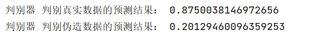 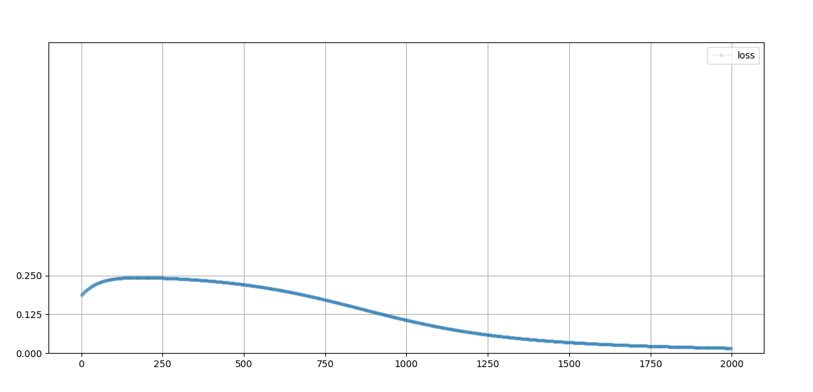

> **注意：刚开始判别器无法判断生成的数据的真假，输出的预测结果为0.5，不管生成的数据是否为真还是假，均方误差都接近0.25；随着训练轮次的增加，判别器越来越容易判别数据的真假，loss值逐渐接近0**


* **生成器运行结果**

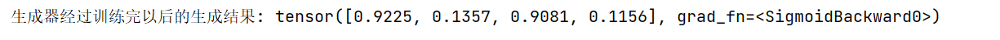


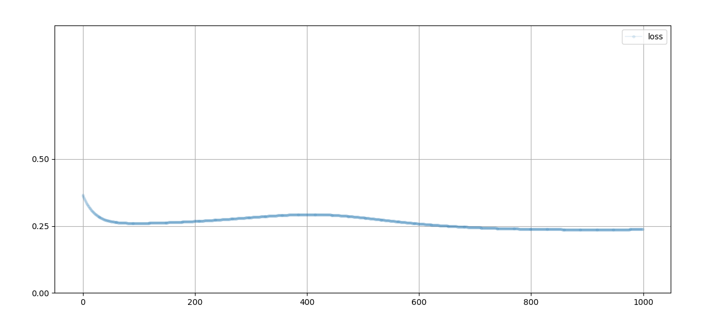

> **注意：刚开始生成器没有骗过判别器，loss值高；随着训练轮数的增加，判别器无法判断生成器的数据真假，预测结果为0.5，均方误差接近0.25**


### MINST

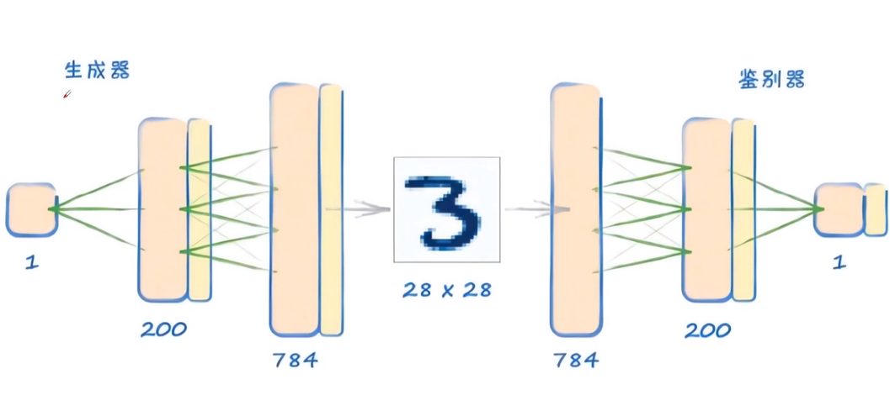

#### `1.数据集`

```python
import torch
import torch.nn as nn
import matplotlib
matplotlib.use("TkAgg")
import matplotlib.pyplot as plt
from torch.utils.data import DataLoader
from torchvision import datasets
from torchvision import transforms
import time

# 生成器的随机函数
def generate_random_seed(size,gpu=False):
    if gpu:
        return torch.randn(size).cuda()
    return torch.randn(size)

# 加载mnist数据集
def load_dataset(batch_size):
    # 读取训练数据
    train_data = datasets.MNIST(root="./mnist/",
                                train=True,
                                transform=transforms.ToTensor(),
                                download=True)
    # 使用4个线程,随机打乱
    data_loader = DataLoader(dataset=train_data, batch_size=batch_size, shuffle=True,num_workers=4)
    return data_loader
```


#### `2.判别器`

```python
# 判别器
class Discriminator(nn.Module):
    def __init__(self):
        super(Discriminator, self).__init__()

        # 定义模型的层
        self.s1 = nn.Sequential(
            # 全连接：输入的是28*28(784)的minst一张图片
            nn.Linear(784, 200),
            # LeakyReLU激活:解决ReLU激活函数可能出现的神经元死亡问题,提高模型的稳定性和泛化能力
            nn.LeakyReLU(),
            # LayerNorm层对输出的200个神经元进行归一化处理
            nn.LayerNorm(200),
            # 输出1分类
            nn.Linear(200, 1),
            nn.Sigmoid()
        )

        # 均二元交叉熵损失函数
        self.loss_fn = nn.BCELoss()
        # Adam优化器,学习率0.0001
        self.optimizer = torch.optim.Adam(self.parameters(), lr=1e-4)

        # 画图参数
        self.counter = 0
        self.progress = []

    # 前向传播
    def forward(self, input):
        return self.s1(input)

    # 训练方法
    def train(self, input, target):
        # 前向传播
        output = self.forward(input)
        # 计算损失
        loss = self.loss_fn(output, target)

        # 每到10次取loss
        self.counter += 1
        if self.counter % 10 == 0:
            self.progress.append(loss.item())

        # 梯度归0
        self.optimizer.zero_grad()
        # 反向传播
        loss.backward()
        # 更新权重
        self.optimizer.step()

    # 画图
    def draw(self):
        plt.figure(figsize=(16, 6))
        plt.plot(range(len(self.progress)), self.progress)
        plt.show()
```


#### `3.生成器`

```python
# 生成器:没有损失函数
class Generator(nn.Module):
    def __init__(self):
        super(Generator, self).__init__()

        # 定义模型的层
        self.s1 = nn.Sequential(
            # 全连接：输入的是100个节点
            nn.Linear(100, 200),
            # LeakyReLU激活:解决ReLU激活函数可能出现的神经元死亡问题,提高模型的稳定性和泛化能力
            nn.LeakyReLU(),
            # LayerNorm层对输出的200个神经元进行归一化处理
            nn.LayerNorm(200),
            # 输出28*28(784)的一张mnist的图片
            nn.Linear(200, 784),
            nn.Sigmoid()
        )

        # Adam优化器,学习率0.0001
        self.optimizer = torch.optim.Adam(self.parameters(), lr=1e-4)

        # 画图参数
        self.counter = 0
        self.progress = []

    # 前向传播
    def forward(self, input):
        return self.s1(input)

    # 训练
    def train(self, D: Discriminator, input, target):
        # 传入生成器前向传播结果 到 判别器前向传播
        d_output = D(input)
        # 计算 生成器经过判别器前向传播的结果 与 标签的损失
        loss = D.loss_fn(d_output, target)

        # 每到10次取loss
        self.counter += 1
        if self.counter % 10 == 0:
            self.progress.append(loss.item())

        # 梯度归0
        self.optimizer.zero_grad()
        # 反向传播
        loss.backward()
        # 更新权重
        self.optimizer.step()

    # 画图
    def draw(self):
        plt.figure(figsize=(16, 6))
        plt.plot(range(len(self.progress)), self.progress)
        plt.show()
```


#### `4.训练`

```python
# 展示生成器生成的图片
def show_generate_img(G:Generator):
    f,axarr=plt.subplots(3,6,figsize=(16,6))
    for i in range(3):
        for j in range(6):
            # 生成器前向传播生成结果
            output = G(generate_random_seed((1, 100),gpu=True))
            img=output.detach().cpu().numpy().reshape(28,28)
            axarr[i,j].imshow(img,interpolation="none",cmap="Blues")
    plt.show()

# 训练
def train_mnist_GAN():
    device=torch.device("cuda" if torch.cuda.is_available() else "cpu")

    # 实例化生成器和判别器
    generator = Generator().to(device)
    discriminator = Discriminator().to(device)

    BATCH_SIZE = 96
    epochs = 50

    # 加载数据
    data_loader = load_dataset(BATCH_SIZE)

    total_time=0.0
    for epoch in range(epochs):
        start=time.time()
        print("*"*16)
        print(f"epoch:{epoch} start training,batch_size:{BATCH_SIZE}")
        for (img, target) in data_loader:                # img:[batch,1,28,28]
            b_x = img.view(-1, 28, 28)                   # [batch,28,28]
            image=b_x.view(BATCH_SIZE,28*28).to(device)  # [batch,28*28]

            #  真实数据训练D:输入为mnist图片,标签为batch_size(行)*1(列)个 全1 tensor
            discriminator.train(input=image,target=torch.ones(BATCH_SIZE,1).to(device))
            # 生成数据训练D:输入为G的生成图片,标签为batch_size(行)*1(列)个 全0 tensor
            # 将G前向传播的结果梯度切断,防止BP（反向传播）更新参数,因为生成器没骗过判别器,不需要BP更新G的梯度
            discriminator.train(input=generator(generate_random_seed((BATCH_SIZE,100),gpu=True)).detach(),
                                target=torch.zeros(BATCH_SIZE,1).to(device))
            # 训练生成器:输入为生成器生成的数据,标签为batch_size(行)*1(列)个 全1 tensor
            generator.train(D=discriminator,input=generator(generate_random_seed((BATCH_SIZE,100),gpu=True)),target=torch.ones(BATCH_SIZE,1).to(device))

        end=time.time()-start
        total_time+=end
        print(f"epoch:{epoch} done,current epoch use: {end} seconds,total use:{total_time} seconds")

    # 判别器损失图
    discriminator.draw()
    # 生成器损失图
    generator.draw()
    # 展示生成器的生成的图片
    show_generate_img(generator)

if __name__ == '__main__':
    train_mnist_GAN()
```


* **判别器loss**

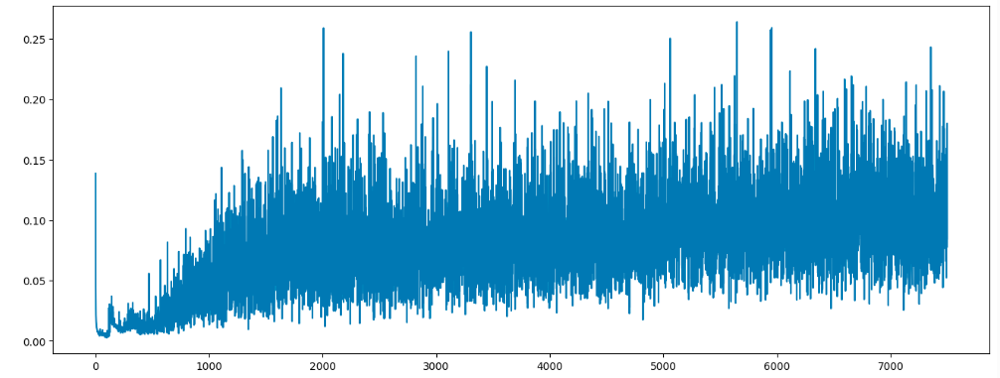


* **生成器loss**

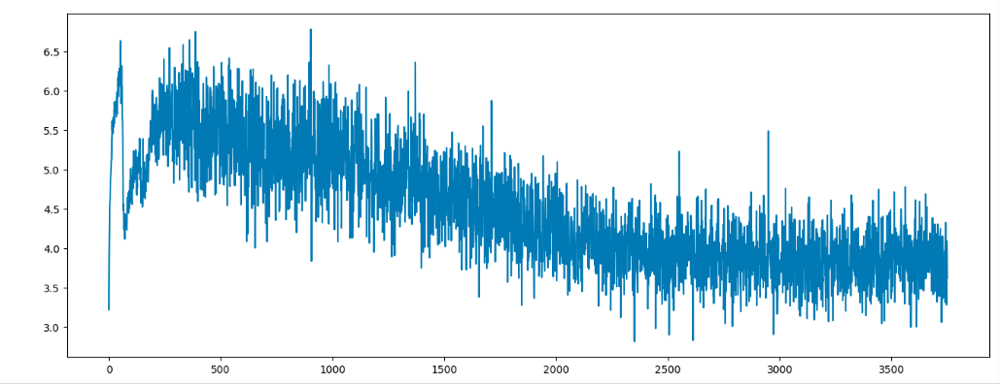


* **生成器生成的图片**

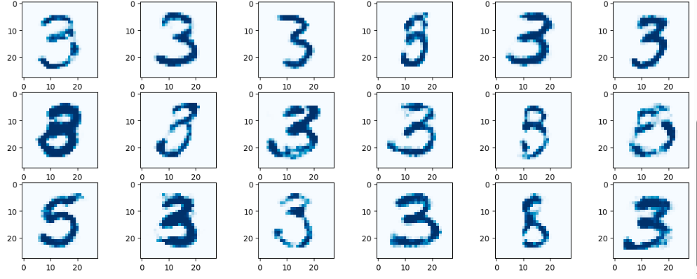


### 全连接网络生成人脸

#### `工具类(可选)`

```python
# 批量重命名文件
def rename(path):
    image_files=[f for f in os.listdir(path) if f.endswith((".png",".jpg",".jpeg"))]
    i=0
    for image_file in image_files:
        old = os.path.join(path, image_file)
        new_name=f"{i}.png"
        new=os.path.join(path,new_name)
        shutil.move(old,new)
        i+=1

# 将数据集保存为h5py格式
def save_image_to_h5py(path):
    img_list=[]  #初始化
    for dir_image in os.listdir(path):
        #读取文件
        img=cv2.imread(os.path.join(path,dir_image))
        img_list.append(img)  #追加到img_list列表中

    img_np = np.array(img_list)  #转为numpy的ndarray类型

    f = h5py.File('dataset.h5py', 'w')  #写入文件
    f['image'] = img_np  #名称为image
    f.close()  #关闭文件
```


#### 数据集下载

​	CelebA人脸数据集图片HDF5数据集 

* 链接：https://pan.baidu.com/s/1J6xLwMvtD_7laok7ahzVlg 提取码：ppvu

```python
import torch
import torch.nn as nn
from torch.utils.data import Dataset
import matplotlib
# matplotlib.use("TkAgg")
import matplotlib.pyplot as plt
import time
import h5py
import pandas as pd
import numpy as np
import random

# 生成器的随机函数
def generate_random_seed(size,gpu=False):
    if gpu:
        return torch.randn(size).cuda()
    return torch.randn(size)


# CelebA数据集
class CelebADataset(Dataset):
    def __init__(self,file):
        self.file_obj=h5py.File(file,"r")
        # 获取h5py文件的指定K
        self.dataset=self.file_obj["img_align_celeba"]

    def __len__(self):
        return len(self.dataset)

    def __getitem__(self, index):
        if(index >= len(self.dataset)):
            raise IndexError()
        # 打开数据集的指定索引文件
        img =np.array(self.dataset[str(index)+".jpg"])
        # 将张量归一化
        return (torch.FloatTensor(img)/255.0).cuda()

    def show_img(self,index):
        plt.imshow(np.array(self.dataset[str(index)+".jpg"]),interpolation="nearest")
```


#### `1.判别器`

```python
# 判别器
class Discriminator(nn.Module):
    def __init__(self):
        super(Discriminator, self).__init__()
        # 定义模型的层
        self.s1 = nn.Sequential(
            # 全连接：输入的是3*218*178的一张图片
            nn.Linear(3*218*178, 100),
            # LeakyReLU激活:解决ReLU激活函数可能出现的神经元死亡问题,提高模型的稳定性和泛化能力
            nn.LeakyReLU(),
            # LayerNorm层对输出的100个神经元进行归一化处理
            nn.LayerNorm(100),
            # 输出1分类
            nn.Linear(100, 1),
            nn.Sigmoid()
        )

        # 二元交叉熵损失函数
        self.loss_fn = nn.BCELoss()
        # Adam优化器,学习率0.0001
        self.optimizer = torch.optim.Adam(self.parameters(), lr=1e-4)

        # 画图参数
        self.counter = 0
        self.progress = []

    # 前向传播
    def forward(self, input):
        return self.s1(input.view(218*178*3))

    # 训练方法
    def train(self, input, target):
        # 前向传播
        output = self.forward(input)
        # 计算损失
        loss = self.loss_fn(output, target)

        # 每到10次取loss
        self.counter += 1
        if self.counter % 10 == 0:
            self.progress.append(loss.item())

        # 梯度归0
        self.optimizer.zero_grad()
        # 反向传播
        loss.backward()
        # 更新权重
        self.optimizer.step()

    # 画图
    def draw(self):
        plt.figure(figsize=(16, 6))
        plt.plot(range(len(self.progress)), self.progress)
        plt.show()
```


#### `2.生成器`

```python
# 生成器:没有损失函数
class Generator(nn.Module):
    def __init__(self):
        super(Generator, self).__init__()

        # 定义模型的层
        self.s1 = nn.Sequential(
            # 全连接：输入的是100个节点
            nn.Linear(100, 3*10*10),
            # LeakyReLU激活:解决ReLU激活函数可能出现的神经元死亡问题,提高模型的稳定性和泛化能力
            nn.LeakyReLU(),
            # LayerNorm层对输出的300个神经元进行归一化处理
            nn.LayerNorm(3*10*10),
            # 输出的是3*218*178一张图片
            nn.Linear(3*10*10, 3*218*178),
            nn.Sigmoid(),
        )

        # Adam优化器,学习率0.0001
        self.optimizer = torch.optim.Adam(self.parameters(), lr=1e-4)

        # 画图参数
        self.counter = 0
        self.progress = []

    # 前向传播
    def forward(self, input):
        return self.s1(input).view((218,178,3))

    # 训练
    def train(self, D: Discriminator, input, target):
        # 传入生成器前向传播结果 到 判别器前向传播
        d_output = D(input)
        # 计算 生成器经过判别器前向传播的结果 与 标签的损失
        loss = D.loss_fn(d_output, target)

        # 每到10次取loss
        self.counter += 1
        if self.counter % 10 == 0:
            self.progress.append(loss.item())

        # 梯度归0
        self.optimizer.zero_grad()
        # 反向传播
        loss.backward()
        # 更新权重
        self.optimizer.step()

    # 画图
    def draw(self):
        plt.figure(figsize=(16, 6))
        plt.plot(range(len(self.progress)), self.progress)
        plt.show()
```


#### `3.训练`

```python
# 展示生成器生成的图片
def show_generate_img(G:Generator):
    f,axarr=plt.subplots(3,6,figsize=(16,6))
    for i in range(3):
        for j in range(6):
            # 生成器前向传播生成结果
            output = G(generate_random_seed((100),gpu=True))
            img=output.detach().cpu().numpy()
            axarr[i,j].imshow(img,interpolation="none",cmap="Blues")
    plt.show()

# 训练代码
def train_faceGAN(dataset):
    total_time = 0.0
    epochs = 8
    batch_size = 256
    device = torch.device("cuda" if torch.cuda.is_available() else "cpu")
    # 实例化对象
    D=Discriminator().to(device)
    G=Generator().to(device)

    for epoch in range(epochs):
        start = time.time()
        print("*" * 16)
        print(f"epoch:{epoch} start training,batch_size:{batch_size}")

        for image_data in dataset:
            # 真实数据训练判别器
            D.train(image_data,torch.FloatTensor([1.0]).cuda())
            # 生成器没有骗过判别器
            D.train(G(generate_random_seed(100,gpu=True)).detach(),torch.FloatTensor([0.0]).cuda())
            # 生成器骗过了判别器
            G.train(D,G(generate_random_seed(100,gpu=True)),torch.FloatTensor([1.0]).cuda())

        end = time.time() - start
        total_time += end
        print(f"epoch:{epoch} done,current epoch use: {end} seconds,total use:{total_time} seconds")

    # 判别器损失图
    D.draw()
    # 生成器损失图
    G.draw()
    # 展示生成器生成的图片
    show_generate_img(G)

if __name__ == '__main__':
    dataset=CelebADataset("celeba_aligned_small.h5py")
    train_faceGAN(dataset)
```


* **判别器损失图**

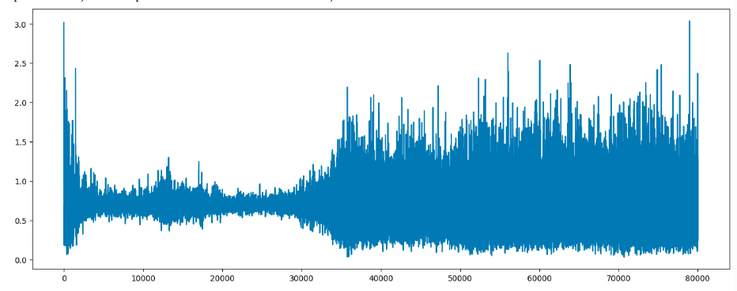


* **生成器损失图**

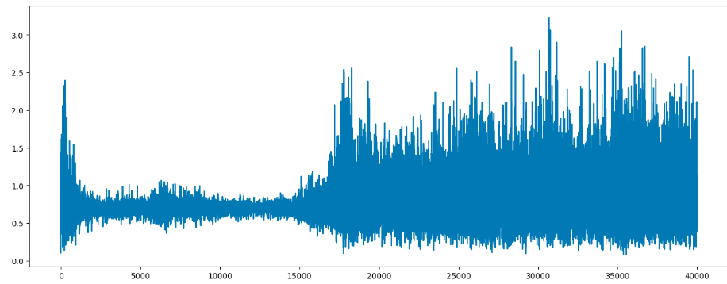


* **生成器生成的图片**

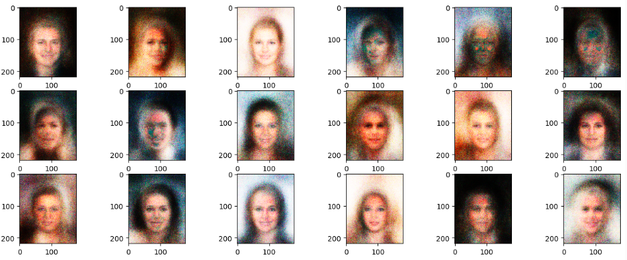


### DCGAN生成人脸

> - **最初的GAN网络主要基于全连接层实现生成器G和判别器D，由于图片的维度比较高，网络参数量巨大，训练的效果不是很优秀。**
> - **DCGAN提出使用转置卷积（Transpose Convolution）实现生成网络，普通卷积来实现判别网络，大大降低了网络参数量，同时图片的生成效果也大幅度的提升，展现了GAN模型在图片生成效果上远远超过VAE模型的潜质。**

#### `1.数据集`

```python
import torch
import torch.nn as nn
from torch.utils.data import Dataset
import matplotlib
# matplotlib.use("TkAgg")
import matplotlib.pyplot as plt
import time
import h5py
import pandas as pd
import numpy as np

# 生成器的随机函数
def generate_random_seed(size,gpu=False):
    if gpu:
        return torch.randn(size).cuda()
    return torch.randn(size)

# 沿着图像中心开始裁剪
def crop_centre(img, new_width, new_height):
    height, width, _ = img.shape
    # 获取图片的中心点
    startx = width//2 - new_width//2
    starty = height//2 - new_height//2
    return img[ starty:starty + new_height, startx:startx + new_width, :]

# CelebA数据集
class CelebADataset(Dataset):
    def __init__(self,file):
        self.file_obj=h5py.File(file,"r")
        # 获取h5py文件的指定K
        self.dataset=self.file_obj["img_align_celeba"]

    def __len__(self):
        return len(self.dataset)

    def __getitem__(self, index):
        if(index >= len(self.dataset)):
            raise IndexError()
        # 打开数据集的指定索引文件
        img =np.array(self.dataset[str(index)+".jpg"])
        # 将图片切割为128*128的图片:(128,128,3)
        img = crop_centre(img, 128, 128)
        # 将RGB图像的维度重排为(3,128,128)、改变tensor形状(1,3,128,128)、张量归一化
        return (torch.FloatTensor(img).permute(2,0,1).view(1,3,128,128)/255.0).cuda()
```


#### `2.判别器`

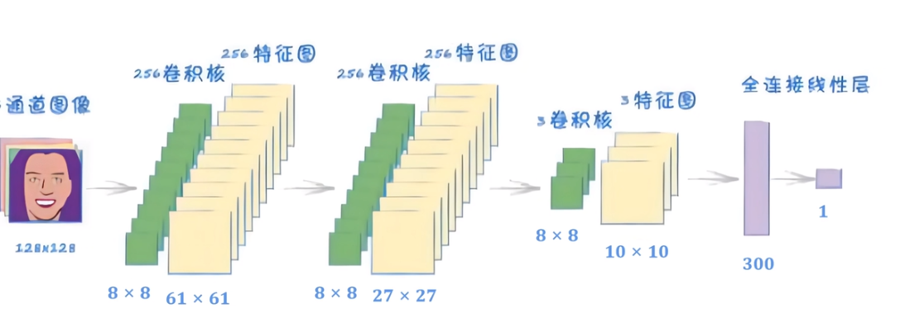

```python
# 判别器
class Discriminator(nn.Module):
    def __init__(self):
        super(Discriminator, self).__init__()

        self.s1 = nn.Sequential(
            # inputs:(3,128,128),outputs:(256,61,61)
            nn.Conv2d(in_channels=3, out_channels=256, kernel_size=8, stride=2),
            # 对每个图层通道进行标准化
            nn.BatchNorm2d(256),
            # 激活函数，高斯误差线性函数
            nn.GELU(),
            # inputs:(256,61,61),outputs:(256,27,27)
            nn.Conv2d(in_channels=256, out_channels=256, kernel_size=8, stride=2),
            nn.BatchNorm2d(256),
            nn.GELU(),
            # inputs:(256,27,27),outputs:(3,10,10)
            nn.Conv2d(in_channels=256, out_channels=3, kernel_size=8, stride=2),
            nn.GELU(),
        )

        self.s2=nn.Sequential(
            # 全连接层
            nn.Linear(3 * 10 * 10, 1),
            nn.Sigmoid()
        )

        # 二元交叉熵损失函数
        self.loss_fn = nn.BCELoss()
        # Adam优化器,学习率0.0001
        self.optimizer = torch.optim.Adam(self.parameters(), lr=1e-4)

        # 画图参数
        self.counter = 0
        self.progress = []

    # 前向传播
    def forward(self, input):
        return self.s2(self.s1(input).view(3 * 10 * 10) )

    # 训练方法
    def train(self, input, target):
        # 前向传播
        output = self.forward(input)
        # 计算损失
        loss = self.loss_fn(output, target)

        # 每到10次取loss
        self.counter += 1
        if self.counter % 10 == 0:
            self.progress.append(loss.item())

        # 梯度归0
        self.optimizer.zero_grad()
        # 反向传播
        loss.backward()
        # 更新权重
        self.optimizer.step()

    # 画图
    def draw(self):
        plt.figure(figsize=(16, 6))
        plt.plot(range(len(self.progress)), self.progress)
        plt.show()
```


#### `3.生成器`

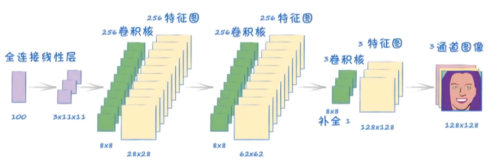

```python
# 生成器:没有损失函数
class Generator(nn.Module):
    def __init__(self):
        super(Generator, self).__init__()

        # 定义模型的层
        self.s1 = nn.Sequential(
            nn.Linear(100, 3 * 11 * 11),
            nn.GELU(),
        )

        self.s2=nn.Sequential(
            # 转置卷积计算公式：(H,W)out=[ (H,W)in -1 ] * stride - 2*padding + kernel_size
            # inputs:(3,11,11),outputs:(256,28,28)
            nn.ConvTranspose2d(in_channels=3, out_channels=256, kernel_size=8, stride=2),
            nn.BatchNorm2d(256),
            nn.GELU(),
        	# inputs:(256,28,28),outputs:(256,62,62)
            nn.ConvTranspose2d(in_channels=256, out_channels=256, kernel_size=8, stride=2),
            nn.BatchNorm2d(256),
            nn.GELU(),
            # inputs:(256,62,62),outputs:(3,128,128)
            nn.ConvTranspose2d(in_channels=256, out_channels=3, kernel_size=8, stride=2, padding=1),
            nn.BatchNorm2d(3),
            nn.Sigmoid()
        )

        # Adam优化器,学习率0.0001
        self.optimizer = torch.optim.Adam(self.parameters(), lr=1e-4)

        # 画图参数
        self.counter = 0
        self.progress = []

    # 前向传播
    def forward(self, input):
        return self.s2( self.s1(input).view((1, 3, 11, 11)) )

    # 训练
    def train(self, D: Discriminator, input, target):
        # 传入生成器前向传播结果 到 判别器前向传播
        d_output = D(input)
        # 计算 生成器经过判别器前向传播的结果 与 标签的损失
        loss = D.loss_fn(d_output, target)

        # 每到10次取loss
        self.counter += 1
        if self.counter % 10 == 0:
            self.progress.append(loss.item())

        # 梯度归0
        self.optimizer.zero_grad()
        # 反向传播
        loss.backward()
        # 更新权重
        self.optimizer.step()

    # 画图
    def draw(self):
        plt.figure(figsize=(16, 6))
        plt.plot(range(len(self.progress)), self.progress)
        plt.show()
```


#### `4.训练`

```python
# 展示生成器生成的图片
def show_generate_img(G:Generator):
    f,axarr=plt.subplots(3,6,figsize=(16,6))
    for i in range(3):
        for j in range(6):
            # 生成器前向传播生成结果：（1，3，128，128）
            output = G(generate_random_seed((100),gpu=True))
            # 対生成张量通道数重排（1，128，128，3）
            img = output.detach().permute(0, 2, 3, 1).view(128, 128, 3).cpu().numpy()
            axarr[i,j].imshow(img,interpolation="none",cmap="Blues")
    plt.show()

# 训练代码
def train_faceGAN(dataset):
    total_time = 0.0
    epochs = 8
    batch_size = 2048
    device = torch.device("cuda" if torch.cuda.is_available() else "cpu")
    # 实例化对象
    D=Discriminator().to(device)
    G=Generator().to(device)

    for epoch in range(epochs):
        start = time.time()
        print("*" * 16)
        print(f"epoch:{epoch} start training,batch_size:{batch_size}")

        for image_data in dataset:
            # 真实数据训练判别器
            D.train(image_data,torch.FloatTensor([1.0]).cuda())
            # 生成器没有骗过判别器
            D.train(G(generate_random_seed(100,gpu=True)).detach(),torch.FloatTensor([0.0]).cuda())
            # 生成器骗过了判别器
            G.train(D,G(generate_random_seed(100,gpu=True)),torch.FloatTensor([1.0]).cuda())

        end = time.time() - start
        total_time += end
        print(f"epoch:{epoch} done,current epoch use: {end} seconds,total use:{total_time} seconds")

    # 判别器损失图
    D.draw()
    # 生成器损失图
    G.draw()
    # 展示生成器生成的图片
    show_generate_img(G)

if __name__ == '__main__':
    dataset=CelebADataset("celeba_aligned_small.h5py")
    train_faceGAN(dataset)
```


* **判别器loss**

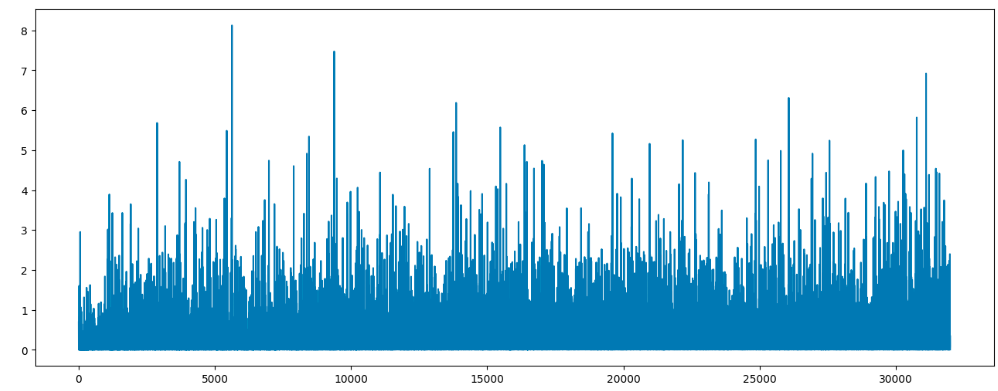


* **生成器loss**

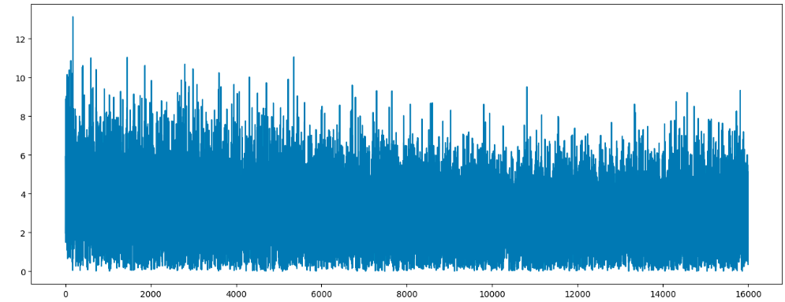


* **生成器生成的图片**

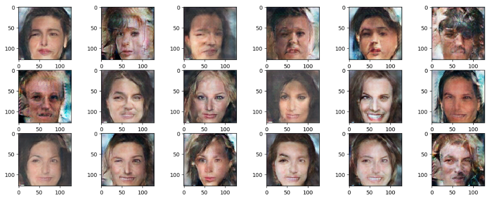


### DCGAN生成动漫

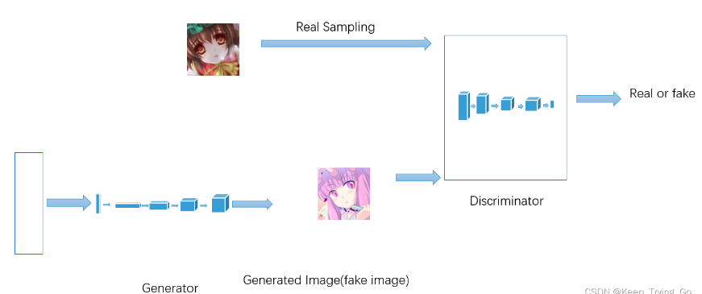


#### `1.数据集`

链接：https://pan.baidu.com/s/1i_VU3aQpLkCx4Z5fhDVKHA  提取码：79y3

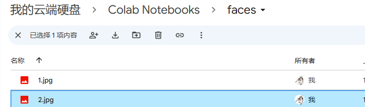

```python
import torch
from torch import nn
import time
from PIL import Image
import torchvision.datasets
import numpy as np
import matplotlib.pyplot as  plt
from torchvision import transforms
import torchvision.utils as vutils
from torch.utils.data import DataLoader, Dataset
from torchvision.datasets.folder import default_loader
from torchsummary import summary

class CustomImageDataset(Dataset):
    def __init__(self, root_dir, transform=None):
        self.root_dir = root_dir
        self.transform = transform
        self.images = self._load_images()

    def _load_images(self):
        images = []
        for file in os.listdir(self.root_dir):
            file_path = os.path.join(self.root_dir, file)
            if os.path.isfile(file_path) and self._is_image_file(file):
                images.append(file_path)
        return images

    def _is_image_file(self, file):
        extensions = ['.jpg', '.jpeg', '.png', '.gif']
        return any(file.lower().endswith(ext) for ext in extensions)

    def __len__(self):
        return len(self.images)

    def __getitem__(self, idx):
        img_path = self.images[idx]
        image = Image.open(img_path)
        if self.transform:
            image = self.transform(image)
        return image

# 获取数据集
def load_dataset(trainPath,batchSize,num_workers=0):
    # 预处理图片
    transform = transforms.Compose([
        transforms.Resize(size=(64, 64)),
        transforms.CenterCrop(size=(64, 64)),
        transforms.ToTensor(),
        transforms.Normalize(mean=[0.5, 0.5, 0.5], std=[0.5, 0.5, 0.5]),
    ])
    # 创建自定义数据集
    custom_dataset = CustomImageDataset(root_dir=trainPath, transform=transform)
    dataLoader = DataLoader(dataset=custom_dataset, batch_size=batchSize, shuffle=True, num_workers=num_workers)
    print('dataSize : {}'.format(len(dataLoader.dataset)))
    return dataLoader
```


#### `2.判别器`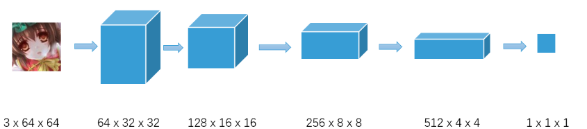

```python
# 判别器
class Discriminator(nn.Module):
    def __init__(self):
        super(Discriminator, self).__init__()
        # 不需要设置偏置,因为自定义了weights_init()去初始化
        self.main = nn.Sequential(
            # input: 3*64*64  output:64*32*32
            nn.Conv2d(in_channels=3, out_channels=64, kernel_size=4, stride=2, padding=1, bias=False),
            nn.BatchNorm2d(64),
            nn.LeakyReLU(0.2, inplace=True),
            # input: 64*32*32 output:128*16*16
            nn.Conv2d(in_channels=64, out_channels=128, kernel_size=4, stride=2, padding=1, bias=False),
            nn.BatchNorm2d(128),
            nn.LeakyReLU(0.2, inplace=True),
            # input: 128*16*16 output:256*8*8
            nn.Conv2d(in_channels=128, out_channels=256, kernel_size=4, stride=2, padding=1, bias=False),
            nn.BatchNorm2d(256),
            nn.LeakyReLU(0.2, inplace=True),
            # input: 256*8*8  output:512*4*4
            nn.Conv2d(in_channels=256, out_channels=512, kernel_size=4, stride=2, padding=1, bias=False),
            nn.BatchNorm2d(512),
            nn.LeakyReLU(0.2, inplace=True),
            # input: 512*4*4  output:1*1*1
            nn.Conv2d(in_channels=512, out_channels=1, kernel_size=4, stride=1, padding=0, bias=False),
            nn.Sigmoid()
        )

    def forward(self, input):
        return self.main(input)

   
if __name__ == '__main__':
    summary(Discriminator(),(3,64,64),device="cpu")
```

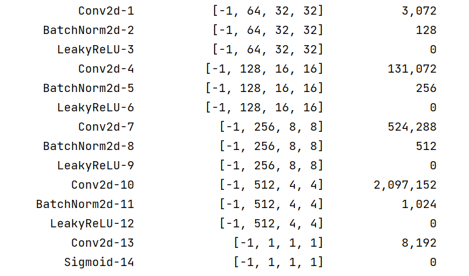


#### `3.生成器`

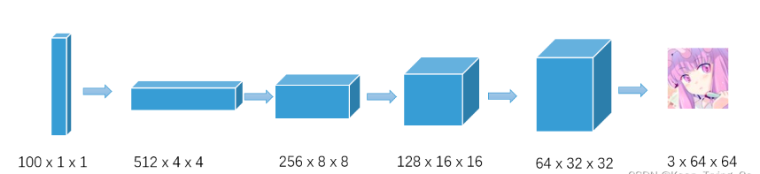

```python
# 生成器
class Generator(nn.Module):
    def __init__(self,latent_dim=100):
        super(Generator, self).__init__()
        # 潜向量维度
        self.latent_dim=latent_dim
        # 不需要设置偏置,因为自定义了weights_init()去初始化
        self.main = nn.Sequential(
            # H,W(out)=[H,W(in)-1] *s -2p +k
            # input:100*1*1  output:512*4*4
            nn.ConvTranspose2d(in_channels=latent_dim, out_channels=512, kernel_size=4, stride=1, padding=0,bias=False),
            nn.BatchNorm2d(512),
            nn.ReLU(inplace=True),
            # input: 512*4*4  output: 256*8*8
            nn.ConvTranspose2d(in_channels=512, out_channels=256, kernel_size=4, stride=2, padding=1, bias=False),
            nn.BatchNorm2d(256),
            nn.ReLU(inplace=True),
            # input: 256*8*8  output: 128*16*16
            nn.ConvTranspose2d(in_channels=256, out_channels=128, kernel_size=4, stride=2, padding=1, bias=False),
            nn.BatchNorm2d(128),
            nn.ReLU(inplace=True),
            # input: 128*16*16  output: 64*32*32
            nn.ConvTranspose2d(in_channels=128, out_channels=64, kernel_size=4, stride=2, padding=1, bias=False),
            nn.BatchNorm2d(64),
            nn.ReLU(inplace=True),
            # input: 64*32*32  output: 3*64*64
            nn.ConvTranspose2d(in_channels=64, out_channels=3, kernel_size=4, stride=2, padding=1, bias=False),
            # 使用 tanh 函数作为生成器的最后一层激活函数，可以更好地控制生成器的输出范围，并提高训练的稳定性
            nn.Tanh()
        )

    def forward(self, input):
        return self.main(input)
    
if __name__ == '__main__':
    summary(Generator(),(100,1,1),device="cpu")
```

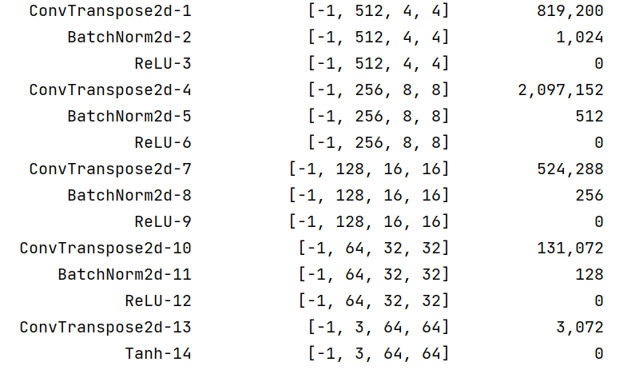


#### `4.训练`

```python
#绘图函数:绘制16张图片
def DrawGen(G:Generator,test_input):
    result = G(test_input).detach().cpu()
    result = np.squeeze(result.numpy())
    fig = plt.figure(figsize=(4,4))
    for i in range(16):
        plt.subplot(4, 4, i + 1)
        plt.imshow(np.transpose(result[i],(1,2,0)))
        plt.axis('off')
        
# 训练函数
def train_DCGAN(D:Discriminator,G:Generator,epoches,dataLoader):
    total_time=0.0
    G_losses = []
    D_losses = []
    device = 'cuda' if torch.cuda.is_available() else 'cpu'
    D.to(device)
    G.to(device)
    # Adam优化器,betas:用于计算梯度和梯度平方的指数加权平均数的系数
    optimizerD = torch.optim.Adam(D.parameters(), lr=0.0001, betas=(0.5, 0.999))
    optimizerG = torch.optim.Adam(G.parameters(), lr=0.0001, betas=(0.5, 0.999))

    # 二元交叉熵损失函数
    loss_fn = nn.BCELoss()

    for epoch in range(epoches):
        start = time.time()
        print(f"epoch:{epoch} start training")
        for step, imgs in enumerate(dataLoader):
            # 真实图片
            real_Imgs = imgs.to(device)
            # 返回torch.Size([batch, 3, 64, 64])
            size = real_Imgs.shape
            # 噪音
            fake_Imgs = torch.randn(size = (size[0],100,1,1),device=device)
            """1.将真实图像传入判别器训练"""
            # 判别器梯度清0
            optimizerD.zero_grad()
            #  Size([batch, 1, 1, 1]) ->  D(real_Imgs).view(-1):Size([batch])
            real_ouput = D(real_Imgs).view(-1)
            d_real_loos = loss_fn(real_ouput, torch.ones_like(real_ouput))

            """2.生成器没骗过判别器:用生成器生成的图像传入判别器训练"""
            gen_img = G(fake_Imgs)
            # Size([batch, 1, 1, 1]) ->  D(gen_img.detach()).view(-1):Size([batch])
            fake_output = D(gen_img.detach()).view(-1)
            d_fake_loss = loss_fn(fake_output, torch.zeros_like(fake_output))

            # 判别器损失值 = 真实图片上的损失值 + 假图像上的损失值
            d_loss = d_fake_loss + d_real_loos
            # 反向传播
            d_loss.backward()
            # 梯度更新
            optimizerD.step()

            """生成器骗过了判别器:用生成器生成的图像传入判别器训练"""
            # 生成器梯度清0
            optimizerG.zero_grad()
            #  Size([batch, 1, 1, 1]) ->  D(gen_img).view(-1):Size([batch])
            fake_output = D(gen_img).view(-1)
            g_loss = loss_fn(fake_output, torch.ones_like(fake_output))
            # 反向传播
            g_loss.backward()
            # 梯度更新
            optimizerG.step()

            G_losses.append(g_loss.item())
            D_losses.append(d_loss.item())

            if step % 200 == 0:
                print('[%d/%d][%d/%d]\tLoss_D: %.4f\tLoss_G: %.4f\t'
                      % (epoch, epoches, step, len(dataLoader), d_loss.item(), g_loss.item()))

        end = time.time() - start
        total_time += end
        print("epoch:[%d] done,current epoch use: [%.2f] minutes,total use:[%.2f] minutes" % (
            epoch, end / 60, total_time / 60))

    # 画图
    with torch.no_grad():
        # 噪音
        noise_input = torch.randn(size=(16, 100, 1, 1), device=device)
        DrawGen(G, noise_input)

    # 保存生成器和判别器模型
    # torch.save(obj=D, f='model_results/dis.pth')
    # torch.save(obj=G, f='model_results/gen.pth')

    # 画图
    plt.figure(figsize=(10, 5))
    plt.title("Generator and Discriminator Loss During Training")
    plt.plot(G_losses, label="G")
    plt.plot(D_losses, label="D")
    plt.xlabel("iterations")
    plt.ylabel("Loss")
    plt.legend()
    plt.show()

# 初始化DCGAN中的卷积层和批归一化层中的权重和偏置
def weights_init(m: nn.Module):
    # 获取神经网络的类型
    classname = m.__class__.__name__
    # 卷积层:使用均值为0、标准差为0.02的正态分布随机初始化权重,这种方式在DCGAN中被证明是比较有效的
    if classname.find('Conv') != -1:
        nn.init.normal_(m.weight.data, mean=0.0, std=0.02)
    # 批归一化层:使用均值为1、标准差为0.02、偏置为0的正态分布随机初始化权重,这是批归一化的一般做法
    elif classname.find('BatchNorm') != -1:
        nn.init.normal_(m.weight.data, mean=1.0, std=0.02)
        nn.init.constant_(m.bias.data, 0)


if __name__ == '__main__':
    import os
    os.chdir('/content/drive/MyDrive/Colab Notebooks/')

    #训练图片的路径
    trainPath = 'faces/'
    #训练的批次
    batchSize = 8
    #训练迭代的次数
    epoches = 40

    G=Generator()
    G.apply(weights_init)
    D=Discriminator()
    D.apply(weights_init)

    # 获取数据集
    dataLoader = load_dataset(trainPath, batchSize, 4)

    # 训练
    train_DCGAN(D,G,epoches,dataLoader)
```

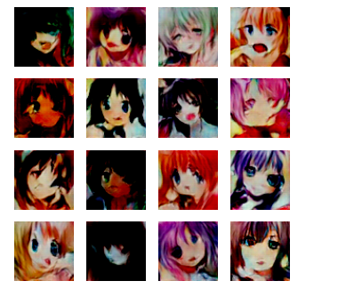 

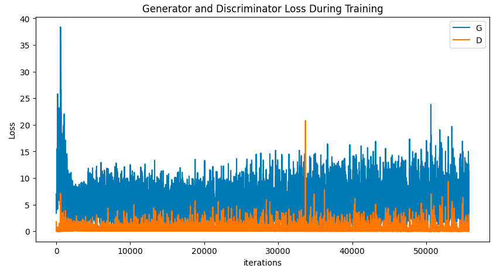
