# 数据结构

## 一. 顺序表

### 静态分配

```c++
#include <stdio.h>
#include <stdlib.h>

#define SIZE 50 //定义顺序表的大小为50

typedef  int ElemType; //定义顺序表的类型为int，取别名为ElemType

//定义顺序表
typedef struct {
	ElemType data[SIZE];    //顺序表的数据
	int length;				//顺序表的元素大小
}SqList;


//初始化顺序表:设置顺序表的元素为0个
void initList(SqList &list){
    list.length=0;				//必须设置
}

//格式化打印结果
void printData(SqList &list) {
	for (int i = 0; i < list.length; i++)
	{
		printf("%4d", list.data[i]);
	}
	printf("\n");
}

```


#### 1.1 插入数据

```c++
//插入数据
bool insertData(SqList &list, int position, ElemType e) {

	if (position<1 || position>SIZE) {
		printf("输入有误");//若输入的位置小于1或大于长度
		return false;
	}
	//顺序表满了，不允许插入
	if (list.length == SIZE) {
		printf("顺序表已满,不可插入");
		return false;
	}
	//将插入位置后面的数据依次从右到左 往后移动，只需要移动 顺序表长度-位置 次
	for (int j = list.length; j >= position; j--) {
		list.data[j] = list.data[j - 1];
	}
	list.data[position - 1] = e; //将插入位置赋值，因为插入位置和数组的索引不一致
	list.length++;
	return true;
}
```


#### 1.2 删除数据

```C++
//删除数据
int delData(SqList &list, int position) {
	if (position<1 || position>list.length) {
		printf("输入有误");//若输入的位置小于1或大于长度
		return -1;
	}
	//顺序表满了，不允许插入
	if (list.length == 0) {
		printf("不可删除");
		return -1;
	}
	//获取删除元素位置的值
	int data = list.data[position - 1];

	//将删除元素的位置的右边依次向左边移动一个单位，只需要移动 顺序表长度-位置 次
	for (int i = position; i < list.length; i++) {
		list.data[i - 1] = list.data[i];
	}
	list.length--; 
	return data;
}
```


#### 1.3 查询数据

```c++
//查询数据
int findData(SqList list, ElemType e) {
	for (int i = 0; i < list.length; i++)
	{
		if (list.data[i] == e) {
			return i + 1; //实际位置要在索引+1
		}
	}
	return -1;//未查询到！
}

```


#### 1.4 main方法

```c++
int main() {
	SqList list;
    initList(list);
	list.data[0] = 1;
	list.data[1] = 2;
	list.data[2] = 3;
	list.length = 3;
	insertData(list, 3, 23);
	printData(list);
	int data=delData(list, 1);
	printData(list);
	printf("%d\n", findData(list,3));


	system("pause");//需要引入#include <stdlib.h>，防止一闪而过
}
```


### 动态分配

```cpp
#include <stdlib.h>
#include <stdio.h>

#define SIZE 3		//线性表默认长度 

typedef struct {
	int *data;		//数据区域 
	int length; 	//线性表长度 
	int maxSize;	//线性表最大容量 
}SqList;

//初始化线性表 
void initList(SqList & l) {
	//将顺序表申请10个元素
	l.data = (int *)malloc(sizeof(int)*SIZE);
	//线性表长度为0 
	l.length = 0;
	//线性表的最大容量默认为初始长度 
	l.maxSize = SIZE;
}

//打印顺序表 
void printList(SqList l) {
	for (int i = 0; i < l.length; i++)
	{
		printf("%4d ", l.data[i]);
	}
	printf("\n");
}
```


#### 2.1 扩容顺序表数组

```c++
//扩容顺序表
void increaseList(SqList &l, int size) {
	//获取扩容之前动态数组的数据区域
	int *oldList = l.data;
	//扩容size个大小,则现在动态数组的最大容量size+maxSize个数据 
	l.data = (int *)malloc(sizeof(int)*(size + l.maxSize));
	//将旧动态数组的数据区域拷贝至新动态数组的数据区域
	for (int i = 0; i<l.length; i++) {
		l.data[i] = oldList[i];
	}
	//设置此时的线性表最大容量
	l.maxSize = l.maxSize + size;
	//释放旧动态数组的空间
	free(oldList);
}
```


#### 2.2 main方法

```cpp
int main() {
	SqList l;
	initList(l);
	l.data[0] = 1;l.data[1] = 2;
	l.data[2] = 3;
	l.length = 3;
	printList(l);

	//扩容
	increaseList(l,4);
	l.data[3]=4444;
	l.data[4] = 555;
	l.data[5] = 666;
	l.data[6] = 777;
	l.data[7] = 888;
	l.length=7;
	printList(l);
	system("pause");
	return 0;
}
```


### 顺序表的原地逆转

```cPP
void reverseList(SqList & list)
{
    //n个数只需要交换n/2次
    for (int i = 0; i < list.length / 2; i++)
    {
        int temp = list.data[i];
        //eg:6个元素下标只能是0~5
        //所以让i=0和6-1-i的元素交换
        list.data[i] = list.data[list.length - 1 - i];
        list.data[list.length - 1 - i] = temp;
    }
}
```


### 原地颠倒顺序表前后两部分元素 

```cpp
//原地颠倒顺序表的前后两部分元素 
//		eg：将(a1,a2,a3...an,b1,b2,b3...bn)颠倒为(b1,b2,b3...bn,a1,a2,a3...an)
void reverseTwoList(list & l,int start,int end){
	//获取(start~end)中间元素下标 :因为原地逆序只需要执行 (start+end)/2次即可 
	int mid=(start+end)/2;
	for(int i =start,j=end;i<=mid;i++,j--){
		//将start和end序号的元素交换 
		int temp=l.data[i];
		l.data[i]=l.data[j];
		l.data[j]=temp;
	}
}

//首先整体逆序一次变为:(bn...b3,b2,b1,an....a3,a2,a1); 
reverseTwoList(l,0,11);
//再次将前半段逆序:(b1,b2,b3...bn,an....a3,a2,a1);
reverseTwoList(l,0,5);
//再次将后半段逆序:(b1,b2,b3...bn,a1,a2,a3...an) 
reverseTwoList(l,6,11);
```


### 顺序表的二路归并

```CPp
//归并两个顺序表
void mergeTwoList(SqList A, SqList B)
{
    int i = 0, j = 0, k = 0;
 	int result[(A.length)+(B.length)] = {};
    while (i < A.length && j < B.length)
    {
        //判断A B两个顺序表中最小的一个元素，放入新顺序表中
        if (A.data[i] < B.data[j])
        {
            result[k++] = A.data[i++];
        }
        else
        {
            result[k++] = B.data[j++];
        }
    }
    //若i<A.length,说明A还有剩余元素没有合并
    while (i < A.length)
    {
        result[k++] = A.data[i++];
    }
    //若i<B.length,说明B还有剩余元素没有合并
    while (j < B.length)
    {
        result[k++] = B.data[j++];
    }

    //输出归并后的数据
    cout << "" << endl;
    for (int i = 0; i < 20; i++)
    {
        cout << result[i] << " ";
    }
}
```


###  插入数据，顺序表仍有序

```Cpp
//获取插入数据的位置
int findElem(int target ,SqList l){
    int position=0;
    for (position; position < l.length; position++)
    {
        if(target<l.data[position]){
            return position;
        }
    }
    return position;
}

void insertElme(int data,SqList & l){
    int pos=findElem(data,l);

    //判断条件必须取等号：若在下标为1插入,还需要将下标为1的元素往后面挪动,所以必须取=
    for (int i = l.length-1; i >= pos; i--)
    {
        l.data[i+1]=l.data[i];
    }
    l.data[pos]=data;
    l.length++;
}
```


### 删除`有序`顺序表区间元素

```Cpp
//删除有序顺序表中(min,max)区间的元素
void delRange(SqList &l, int min, int max)
{
    //范围开始、结束索引、区间元素大小
    int start,end,num=0;
    //开始索引的标识
    bool flag=true;
    if (l.length == 0 || min > max || min == max)
        return;

    for (int i = 0; i < l.length; i++)
    {
        //获取第一个开始元素的下标
        if(l.data[i]>min && flag==true ){
            start=i;flag=false;
        }
        //获取max元素的下标
        if (l.data[i]>min &&l.data[i]<max)
        {
            end=i;
            num++;
        }
    }

    //end的下标小于顺序表大小
    while (end<l.length)
    {
        //若end后一个元素存在:将end后面元素依次往前面移动到start的位置
        if(end+1<l.length){
            l.data[start++]=l.data[end+1];
        }
        end++;
    }
    l.length-=num;
}
```


### 删除无序表区间元素

```Cpp
//删除无序顺序表中(min,max)区间的值
void delUnSortRange(SqList& l, int min, int max) {
    if (l.len == 0 || min > max || min == max)return;

    //表示在(min,max)中有多少个符合条件的元素
    int num=0;
    for (int i = 0; i < l.len; i++)
    {
        //在里面就让num+1
        if (l.data[i] > min && l.data[i] < max) {
            num++;
        }
        else
        {
            //元素不在区间里,就让后面元素往前移动i-num个位置
            //eg:全部不在里面,则a[i - 0] = a[i],相当于不移动
            l.data[i - num] = l.data[i];
        }
    }
    //减去区间里面的元素;
    l.len -= num;

}
```


### 删除有序顺序表所有重复元素

```Cpp
//删除有序表的重复元素
void delRepeatData(SqList& l) {
    //i类似看成一个新的数组的下标
    int i = 0;
    //j看成当前l数组的第二个元素
    int j = 1;
    for ( j;j < l.len;j++)
    {
        //若原始j数组后一个元素和i的当前下标元素不相等,就把j数组当前下标放在i的后面一个
        if (l.data[i]!=l.data[j])
        {
            l.data[++i] = l.data[j];
        }
    }
    //i的取值代表索引,所以总长度=i的最大索引+1
    l.len = i+1;
}
```


## 二. 链表实现顺序表

### 带头节点

```C++
#include <stdio.h>
#include<stdlib.h>

typedef int ElemType;

typedef struct LNode {
	ElemType data;			//数据区域
	struct LNode *next;		//下一个节点地址引用：类似于java：  类变量 next
};

//打印出结果
void printData(LNode *l) {
	l=l->next;
	while (l!=NULL)
	{
		printf("%3d", l->data);
		l = l->next;
	}
	printf("\n");
}
```


#### 1.1 头插法

​			头插法插入的数据是相反的，例如插入1 2 3 4 5 6，则实际输出的是6 5 4 3 2 1

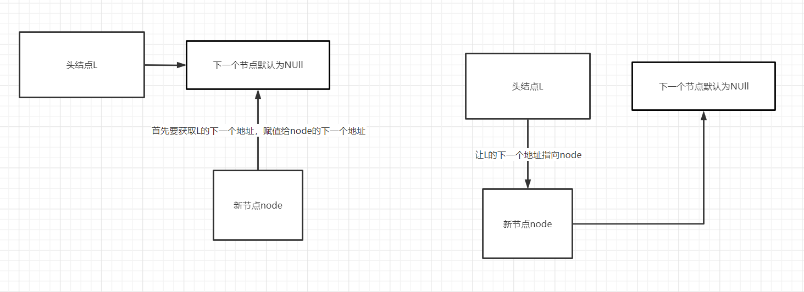

```c++
//头插法：会将新的节点放在头部的下一个节点上
void headInsert(LNode* &L){
	
	L = (LNode*)malloc(sizeof(LNode));	//先将头节点开辟空间：类似于java的new对象
	L->next = NULL;						//让头节点的下一个节点地址为NULL

	int input;//数据值
	scanf("%d", &input);

	LNode *node;	//新的节点
	while(input!=0){
		node = (LNode*)malloc(sizeof(LNode));	//给新节点开辟空间：给新对象new出来
		node->next = L->next;	//让新节点的下一个节点地址变为前一个节点的下一个地址
		L->next = node;			//让前一个节点的下一个地址指向新节点
		node->data = input;		//给新节点赋值
		scanf("%d", &input);
	}
}
```

> **注意：头插法的应用是将链表逆置**


#### 1.2 尾插法

​			尾插法插入的顺序是正常的，例如插入 9 8 7 6 5 4 3 2 1 则输出9 8 7 6 5 4 3 2 1

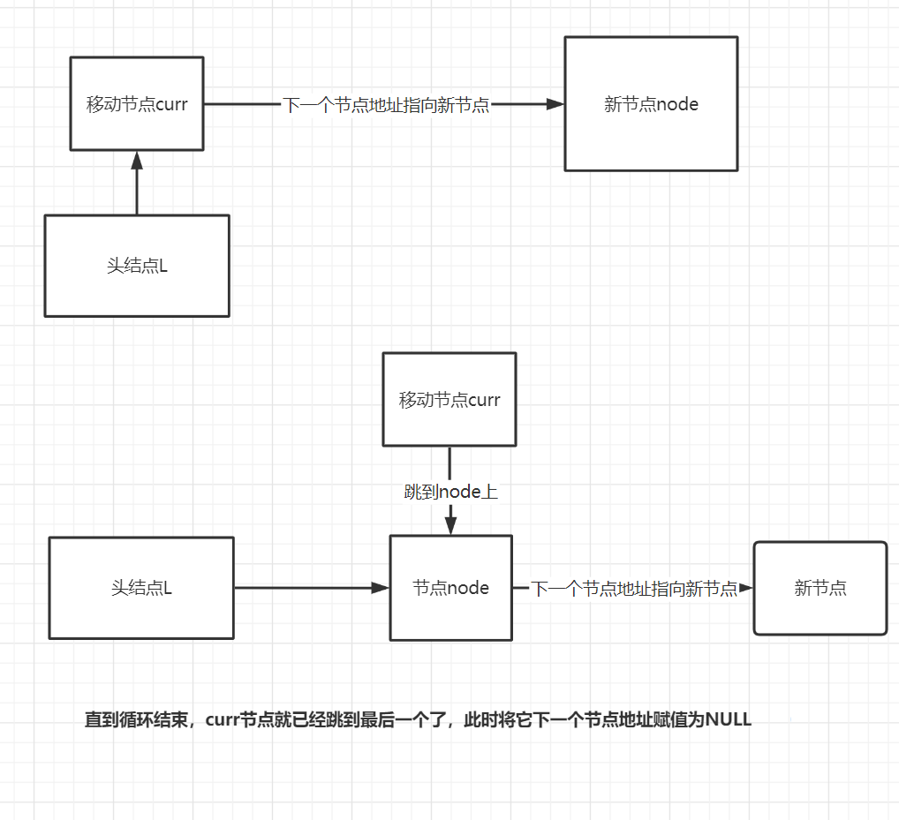

```C++
//尾插法：将新的节点顺序往下放
void tailInsert(LNode* &L) {
	L = (LNode*)malloc(sizeof(LNode));	//先将头节点开辟空间：类似于java的new对象

	LNode *curr = L;//将头节点赋值给新的当前结点，便于移动(或者说 当前节点指向了头节点！！)
	int input;
	scanf("%d", &input);
	LNode *node;//新节点
	while (input != 0) {
		node= (LNode*)malloc(sizeof(LNode));//给新节点开辟空间：给新对象new出来
		node->data = input;
		curr->next = node;	//将当前结点的下一个节点地址赋值给新节点
		curr = node;		//当前结点跳到下一个节点去，往后移动
		scanf("%d", &input);
	}
	
	//循环完毕后，当前节点已经跳到最后一个节点了，只需要把它的下一个地址置空
	curr->next = NULL;	
}
```


#### 1.3 查找指定位置节点

```c++
LNode* findNodeById(LNode* L, int position) {
	//先让链表指向头节点
	LNode * curr = L->next;	

	//序号等于0说明是头节点
	if (position == 0) {
		return L;
	}
	if (position < 1) {
		return NULL;
	}

	int i = 1;  
	//当下一个节点不为空且序号小于要的位置
	while (curr!=NULL && i < position) {
		curr=curr->next;//往下面移动
		i++;
	}
	return curr;
}
```


#### 1.4 根据值查找节点

```c++
//通过值查询节点
LNode* findNodeByValue(LNode* L, int data) {
	//先让链表指向头节点
	LNode* curr = L->next;
	//值的位置
	int i = 1;
	while (curr!=NULL)
	{
		if (curr->data == data) {
			break;
		}
		curr = curr->next;
		i++;
	}
	printf("位置在%d的值为：", i);
	return curr;
}
```


#### 1.5 删除指定位置节点

```C++
//删除指定节点
bool deleteById(LNode * &L, int position) {
	//查询删除节点的前一个节点;
	LNode* pre = findNodeById(L, position - 1); 

	if (pre == NULL) {
		return false;	//说明删除的位置有问题
	}

	LNode* curr=pre->next;	//指向要删除的节点
	pre->next= curr->next;	//让当前要删除的节点的下一个地址赋值给上一个节点
	free(curr);				//清空删除数据的内存
	curr = NULL;
    return true;
}
```


#### 1.6 指定位置插入节点

```c++
//在指定位置插入节点
bool inertNode(LNode* &L, int position, ElemType data) {
	LNode* curr=findNodeById(L, position-1);	//查询出插入位置的上一个节点
	
	//说明插入的位置有问题
	if (curr == NULL) {
		return false;	
	}

	LNode * node=(LNode*)malloc(sizeof(LNode));	//给新节点开辟空间：给新对象new出来
	node->next=curr->next;	//让新节点的下一个节点地址变为前一个节点的下一个地址
	curr->next = node;		//让上一个节点的下一个地址指向新节点
	node->data = data;		//给新节点赋值
	return true;
}
```


#### 1. 7 main方法

```c++
int main() {
	//3 4 5 6 7 8 9 0
	LNode*  l;
	headInsert(l);
	printData(l);
	tailInsert(l);
	printData(l);

	LNode* curr=findNodeById(l, 3);
	printf("位置在3的数据为：");
	printf("%d\n", curr->data);

	LNode* curr2=findNodeByValue(l, 4);
	printf("%d\n", curr2->data);

	inertNode(l, 7, 56);
	printData(l);

	printf("删除之后的数据：\n");
	deleteById(l, 8);
	printData(l);
	system("pause");
}
```


### 不带头节点

```cPP
#include <stdlib.h>
#include <stdio.h>

typedef struct LNode{
	int data;
	LNode *next;
}LNode,*LinkedList;

//初始化不带头节点的单链表
void initLinkedList(LinkedList & l){
	l=NULL;
}

//判断不带头结点的单链表是否为空
bool isEmptyLinkedList(LinkedList l){
	return l==NULL;
}

 
int main(){
	LinkedList l;
	initLinkedList(l);
	if(isEmptyLinkedList(l)){
		printf("1");
	}else
	{
		printf("2");
	}
	
	return 0;
} 
```


### 单链表选择排序

```Cpp
void selectSort(LinkedList & list){
    LNode * curr=list->next;
    while (curr!=null)
    {
        bool flag=false;	//是否交换过
        LNode * min=curr;
        LNode * p=curr->next;	//p节点指向curr后一个节点
        while (p!=null)
        {
            if(p->data<min->data){	//如果p节点小于min节点，则min为新的p节点
                min=p;
                flag=true;
            }
            p=p->next;
        }
        if(flag==true){	//交换了就需要把min节点和当前节点互换data即可
            int tmp=curr->data;
            curr->data=min->data;
            min->data=tmp;
        }
        curr=curr->next;
    }
}
```


### 单链表原地逆序


```cpp
//反转链表
void reverseList(LinkleList & l){
	LNode * first;	//指向单链表所有相对位置的第一个节点
	LNode * second;	//指向单链表所有相对位置的第二个节点
	LNode * last;	//指向单链表所有相对位置的后面所有剩余节点

	//让第一个节点指向头节点
	first=l->next;	
	//空链表,不能反转
	if(first==NULL){
		return;
	}
	//只有一个节点则不用反转
	if(first->next==NULL){
		return;
	}

	//先将第二个节点跳到第一个节点的位置
	second=first;
	//再让第二个节点跳到下一个节点去
	second=second->next;
	//预处理:先将头的下一个节点设为空(★★★★)
	first->next=NULL;

	while (second!=NULL)
	{
		//将第二个节点往后的所有保存到剩余节点中
		last=second->next;	
		
		//第二个节点往回指向第一个节点
		second->next=first;

		//让第一个节点跳到第二个节点
		first=second;
		//让第二个节点跳到暂存起来的剩余节点
		second=last;
	}
	//当第二个节点指向NULL时跳出循环
	//按相对位置的顺序来看,前面一个节点是first且是单链表的末尾节点
	//此时只需要将头节点指向末尾节点first即可
	l->next=first;
}
```


### 单链表的顺序合并

```Cpp
//参数1：单链表A的头节点  参数2：单链表B的头节点  参数3：合并单链表的头节点
void mergeTwoLinkedList(LinkedList aHead, LinkedList bHead, LinkedList &resultHead)
{
    //将单链表A跳入第一个数据节点
    LNode *currA = aHead->next;
    //将单链表B跳入第一个数据节点
    LNode *currB = bHead->next;
    //将最终节点头节点的下一个节点设为NULL
    resultHead->next = NULL;

    //p始终指向最终单链表的尾节点
    LNode *p = resultHead;
    //若单链表A和单链表B为空,则不能合并
    if (currA == NULL || currB == NULL)
    {
        return;
    }
    
    while (currA != NULL && currB != NULL)
    {
        //若A的数据小于B的数据,将A的数据合并到最终单链表中
        if (currA->data < currB->data)
        {
            LNode *tmp = new LNode;
            tmp->data = currA->data;
            p->next = tmp;
            p = tmp;
            currA = currA->next;
        }
        else
        {
            LNode *tmp = new LNode;
            tmp->data = currB->data;
            p->next = tmp;
            p = tmp;
            currB = currB->next;
        }
    }

    //方式一：直接将p的后一个节点接入剩余元素的开始地址，节约空间
    
    //说明A还有剩余元素,直接将p的下一个地址接入单链表A剩下的节点
    if (currA != NULL)
    {
        p->next = currA;
    }
    //说明B还有剩余元素,直接将p的下一个地址接入单链表B剩下的节点
    if (currB != NULL)
    {
        p->next = currB;
    }
}
```

> **`注意：上述拼接剩余元素还有以下方法`**

```Cpp
    //方式二：逐个将剩余元素malloc出来通过尾插法拼在后面
      while (currA != NULL)
    {
        LNode *tmp = new LNode;
        tmp->data = currA->data;
        p->next = tmp;
        p = tmp;
        currA = currA->next;
    }
    while (currB != NULL)
    {
        LNode *tmp = new LNode;
        tmp->data = currB->data;
        p->next = tmp;
        p = tmp;
        currB = currB->next;
    }

	//将p的尾节点设为空！
	p->next = NULL;
```


#### 其它api

```Cpp
void initAB(LinkedList &A, LinkedList &B)
{
    A = new LNode;   B = new LNode;
    LNode *currA;   LNode *currB;
    A->next = NULL; B->next = NULL;
    currA = A; currB = B;

    for (int i = 1; i < 5; i++)
    {
        LNode *tmp = new LNode;
        tmp->data = i * 2;
        currA->next = tmp;
        currA = tmp;
    }
    for (int i = 1; i < 5; i++)
    {
        LNode *tmp2 = new LNode;
        tmp2->data = i * 2 + 1;
        currB->next = tmp2;
        currB = tmp2;
    }
    currA->next = NULL;
    currB->next = NULL;
}

void printLinkedList(LinkedList l)
{
    l = l->next;
    while (l != NULL)
    {
        std::cout << l->data << " ";
        l = l->next;
    }
}

int main(int argc, char const *argv[])
{
    LinkedList a;
    LinkedList b;
    LinkedList result = new LNode;
    initAB(a, b);
    std::cout << "单链表a :\n";
    printLinkedList(a);
    std::cout << "\n 单链表b ：\n";
    printLinkedList(b);
    mergeTwoLinkedList(a, b, result);
    std::cout << " \n合并的最终单链表：\n";
    printLinkedList(result);
    return 0;
}
```

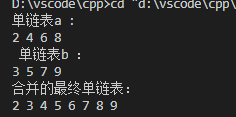 


### 单链表的逆序合并

> **`注意：其实将两个从小到大有序链表合并成逆序的过程就是用头插法接入就行了`**

```cPP
void mergeTwoLinkedListReverse(LinkedList aHead, LinkedList bHead, LinkedList &resultHead)
{
    //将单链表A跳入第一个数据节点
    LNode *currA = aHead->next;
    //将单链表B跳入第一个数据节点
    LNode *currB = bHead->next;
    //将最终节点头节点的下一个节点设为NULL
    resultHead->next = NULL;

    // //p始终指向最终单链表的尾节点
    // LNode *p = resultHead;
    //若单链表A和单链表B为空,则不能合并
    if (currA == NULL || currB == NULL)
    {
        return;
    }
    while (currA != NULL && currB != NULL)
    {
        //若A的数据小于B的数据,将A的数据合并到最终单链表中
        if (currA->data < currB->data)
        {
            LNode *tmp = new LNode;
            tmp->data = currA->data;
            tmp->next=resultHead->next;
            resultHead->next=tmp;
            currA = currA->next;
        }
        else
        {
            LNode *tmp = new LNode;
            tmp->data = currB->data;
            tmp->next=resultHead->next;
            resultHead->next=tmp;
            currB = currB->next;
        }
    }

    while (currA != NULL)
    {
        LNode *tmp = new LNode;
        tmp->data = currA->data;
        tmp->next=resultHead->next;
        resultHead->next=tmp;
        currA = currA->next;
    }
    while (currB != NULL)
    {
        LNode *tmp = new LNode;
        tmp->data = currB->data;
        tmp->next=resultHead->next;
        resultHead->next=tmp;
        currB = currB->next;
    }
}
```


### 合并两个有序单链表的公共节点

```Cpp
//将A、B有序单链表中的公共节点放入C中
void mergeCommonNode(LinkleList A, LinkleList B, LinkleList &C)
{
	LNode *currA = A->next; //指向A的第一个
	LNode *currB = B->next; //指向B的第一个
	if (currA==NULL || currB==NULL)
	{
		return;
	}

	C = new LNode;		//创建头节点
	LNode *tail = C;	//尾插法

	while (currA && currB)
	{
		//如果两个节点值相同说明公共节点
		if (currA->data == currB->data)
		{
			LNode *tmp = new LNode;
			tmp->data = currA->data;
			tail->next = tmp;
			tail = tmp;
			currA = currA->next;
			currB = currB->next;
		}
		//若节点A的值小于节点B的值,就让A往后跳一个
		else if (currA->data < currB->data)
		{
			currA = currA->next;
		}
		//否则让B往后跳一个
		else
		{
			currB = currB->next;
		}
	}
	tail->next = NULL;
}
```


### 删除有序单链表的所有重复元素

```Cpp
//在递增有序单链表删除重复的元素
void delRepeatData(LinkleList & l){
	//第一个节点自然不重复
	LNode * pre=l->next;
	//当前节点:从第二个节点开始
	LNode * curr=pre->next;

	while (curr!=NULL)
	{
		//若后继和前驱值相同,则删除后继
		if(curr->data==pre->data){
			LNode * tmp=curr;
			curr=curr->next;
			pre->next=curr;
			free(tmp);
		}else
		{
			pre=curr;
			curr=curr->next;
		}
	}
}
```


### 删除链表所有值为X的节点

```Cpp
void delData(LinkleList & l,int data){
	//删除节点的前一个节点
	LNode* pre=l;
	//当前节点
	LNode* curr=pre->next;
	//需要删除的临时节点
	LNode* tmp=NULL;

	while (curr!=NULL)
	{
		if(curr->data==data){
			//将要删除的节点保存下来
			tmp=curr;
			//一定要curr跳入下一个节点
			curr=curr->next;
			//前一个节点指向删除节点的下一个节点
			pre->next=curr;
			free(tmp);
		}else
		{
			//将前驱跳入当前节点
			pre=curr;
			//当前节点跳入下一个节点
			curr=curr->next;
		}
	}	
}
```


### 删除链表的唯一最小值

```cPP
//删除链表中的最小一个节点
void delMinNode(LinkleList & l,int data){
    //初始化最小节点的前一个节点为头节点
	LNode * pre=l;
    
	//当前节点用于遍历整个链表
	LNode* curr=pre->next;
    
    //初始化最小节点为第一个节点
	LNode * minNode=curr;
	
    //初始化第一个节点为最小节点值
    int min=curr->data;
	while (curr!=NULL)
	{
        //如果当前节点的后一个节点不空&&后一个节点的值比最小值小
		if(curr->next!=NULL&&curr->next->data<min){
            //因为curr的下一个节点比min小,说明curr是前驱
			pre=curr;
            //将min重新赋值为curr的下一个节点的data
			min=curr->next->data;
            //将最小节点跳入curr的下一个节点
			minNode=curr->next;
		}
		curr=curr->next;
	}
	
    //因为pre是指向minNode的前驱,所以删除时直接指向最小节点后继即可
	pre->next=minNode->next;
	free(minNode);
}
```


### 删除单链表区间范围元素

```Cpp
//删除链表中(min,max)的值
void delRangeData(LinkleList & l,int min,int max){
	//初始化前驱
	LNode * pre=l;
	//初始化后继
	LNode* curr=pre->next;
	while (curr!=NULL)
	{
		if(curr->data>min && curr->data<max){
			LNode * tmp=curr;
			curr=curr->next;
			pre->next=curr;
			free(tmp);
		}else
		{
			pre=curr;
			curr=curr->next;
		}
	}
}
```


### 删除单链表值相同的多余节点

```Cpp
//eg： 1 3 5 3 7 4 5 8 7 6 4 -> 1 3 5 4 8 7 6 
void delRepeatDataNode(LinkedList head)
{
    //从头节点开始循环依次到尾节点
    LNode *curr = head->next; 
    while (curr != NULL)    
    {
        //p每次初始化指向当前curr节点,n指向p的后一个节点
        LNode *p = curr; 
        LNode *n = curr->next;
        //每一轮curr开始都再次从头到尾遍历一遍
        while (n != NULL)
        {
            //若存在和curr相同的节点,就删除
            if (n->data == curr->data)
            {
                LNode *tmp = n;
                //让p的next指向n的下一个
                p->next = n->next;
                //n调向下一个
                n = n->next;
                free(tmp);
            }
            else
            {
                //否则依次从p跳到n
                p = n;
                //n跳到下一个
                n = n->next;
            }
        }
        curr = curr->next;
    }
}
```


### 划分单链表为两个奇偶数序列链表

```Cpp
//划分有序单链表:A为原单链表奇数序号的有序数据,B为原单链表偶数序号的有序数据
void splitLinkList(LinkleList l,LinkleList & A,LinkleList & B){
	//初始化奇数序号单链表和偶数序号单链表,采用尾插法
	A=new LNode;
	B=new LNode;
	LNode* tailA=A;
	LNode* tailB=B;
	//从第一个数据开始
	int i=1;
	LNode* curr= l->next;
	if(curr==NULL){return;}


	while (curr!=NULL)
	{
		LNode *tmp=new LNode;
		tmp->data=curr->data;
		//l单链表奇数序号插入A中
		if(i%2!=0){
		
			tailA->next=tmp;
			tailA=tmp;
		}else
		{
			//偶数序号插入B中
			tailB->next=tmp;
			tailB=tmp;
		}
		curr=curr->next;
		i++;
	}
	tailA->next=tailB->next=NULL;
}
```


### 求递增A链表和B链表的交集并放入A中

```Cpp
void isInterSection(LinkleList & parent,LinkleList sub){
    LNode * currA=parent->next;
    LNode * currB=sub->next;
    LNode * c=new LNode;
    LNode * r=c;
    while (currA!=NULL&&currB!=NULL)
    {
        if(currA->data>currB->data){
            currB=currB->next;
        }else if(currA->data<currB->data){
            currA=currA->next;
        }else{
            LNode * tmp=new LNode;
            tmp->data=currA->data;
            r->next=tmp;
            r=tmp;
			currA=currA->next;
			currB=currB->next;
        }
    }
    r->next=NULL;
    //直接让parent头节点的下一个节点指向c的下一个节点
    parent->next=c->next;   
}
```


### 判定带头结点的循环双链表是否对称

```Cpp
void isSimilar(DLinkList dLinkList){
    //p从头节点开始的第一个元素开始往后扫描
	DLNode * p=dLinkList->next;
    //q从尾节点往前扫描
	DLNode * q=dLinkList->pre;
    //标识是否是对称
	bool flag=false;

	//当p和q不相等 && 两个位置没有错位(p跨域了q,q跨越了p)
	while (p!=q && p->pre!=q)
	{
		if(p->data==q->data){
			p=p->next;
			q=q->pre;
			flag=true;
		}else
		{
			flag=false;
			break;
		}
	}
	flag==true?cout<<"循环双链表是对称的"<<endl:cout<<"循环双链表不是对称的"<<endl;
}
```


### 循环链表尾插法

```Cpp
void insertDLinkListByTail(DLinkList& linkList) {
    //头结点为空,则创建头结点
    if (linkList == NULL) {
        linkList= new DoubleLinkNode;
        linkList->pre = NULL;
        linkList->next = NULL;
    }
    //尾指针指向头结点
    DLinkList r = linkList;

    for (int i = 0; i < 4; i++)
    {
        DNode * tmp=new DoubleLinkNode;
        tmp->data = i + 1;
        //当前节点的下一个节点为NULL
        tmp->next = NULL;
        //当前节点的前一个节点为之前的尾结点r
        tmp->pre = r;
       //之前的尾结点r的下一个节点为当前节点
        r->next = tmp;
        //之前的尾结点r跳入新的节点去
        r = tmp;
    }
}
```


## 三.栈

### 3.1 栈的顺序存储

#### 3.1.1 思想

​			用顺序表来实现栈，首先有`数据区域`和`栈顶下标`两个属性

1. 初始化栈：让栈顶下标默认为-1
2. 判断为空栈：栈顶下标为-1，说明为空栈
3. 入栈：首先判断不是满栈，其次，将元素根据栈顶下标来放入对应的数据区域，而不是自己控制数据区域的下标，放进去之后，让栈顶下标自增，指向下一个位置
4. 出栈：首先判断不是空栈，其次，栈的下标应该>=0，这样，根据栈顶下标来弹出对应的数据区域；弹出一个数据，栈顶下标应该减一


#### 3.1.2 详细代码

```c++
#define  _CRT_SECURE_NO_WARNINGS
#include <stdio.h>
#include<stdlib.h>

#define MAX_SIZE 50
typedef int ElemType;

//FILO: First In Last Out 
typedef struct Stack {
	ElemType data[MAX_SIZE];	//栈元素
	int top;				    //通过top变量来表示栈顶下标
};

//初始化栈
void initStack(Stack &s) {
	s.top = -1;		//栈顶下表默认为-1
}

//判断是否为空栈
bool isEmpty(Stack s){
	return s.top == -1 ? true : false;
	//return s.top <= -1 ? true : false;
}


//进栈
bool push(Stack &s, int data) {
	//如果栈是满的，则不能push: 即栈顶下标在最后最后一个位置
	if (s.top + 1 == MAX_SIZE) {
		return false;
	}
	//栈顶下标+1并赋值
	s.data[++s.top] = data;
	return true;
}

//出栈
bool pop(Stack &s) {
	//如果是空栈，则不能出栈
	if (isEmpty(s)) {
		return false;
	}

	//栈顶下标>0，说明栈里有元素，一旦变为-1，说明为空栈
	if (s.top >= 0) {
		//获取栈顶下标对应的元素
		s.data[s.top] = NULL;
		//让栈顶下标减少
		s.top--;
		return true;
	}
	return false;
}

//获取栈顶元素
ElemType getStackClimax(Stack s) {
	//空栈说明没有元素
	if (isEmpty(s)) {
		return -1;
	}
	return s.data[s.top];
}
```


#### 3.1.3 main方法

```C++
int main() {
	Stack s;
	initStack(s);
	bool flag=isEmpty(s);
	if (flag) {
		printf("当前是空栈！\n");
	}

	push(s, 1);
	push(s, 2);
	push(s, 3);
	push(s, 4);
	ElemType data=getStackClimax(s);
	printf("栈顶元素为：%d\n",data);
	pop(s);
	pop(s);
	pop(s);
	pop(s);
	pop(s);
	system("pause");
}
```


### 3.2 栈的链式存储

#### 3.2.1 思想

​				用链表来实现栈，同单链表一样的思想，需要`数据区域`和`下一个节点指针`

1. 入栈：用单链表的带有节点的头插法实现
2. 出栈：将单链表每次都从头节点的下一个节点删除
3. 获取栈顶元素：直接获取头节点的下一个地址
4. 判断栈为空：如果初始化的时候，则栈是为NULL的；**如果是出栈出完了元素，栈是不为空的，因为有头节点，因此需要判断头节点的下一个地址是为NULL的**


#### 3.2.2 详细代码

```cpp
#include <stdlib.h>
#include <stdio.h>

typedef struct LNode
{
    int data;
    struct LNode *next;
} * LinkStack, LNode;

//初始化栈
void initLinkStack(LinkStack &l)
{
    l = NULL;
}

//判断是否为空栈
bool isEmptyStack(LinkStack l)
{
    //若是出栈完所有元素：出栈完了所有元素，LinkStack是不为空的,需要判断头节点是为空的
    if (l != NULL)
    {
        return l->next == NULL ? true : false;
    }
    else
    {
        //初始化时的时候，栈内没有元素也是为NULL
        return true;
    }
}

//入栈
bool push(LinkStack &l, int data)
{
    //开辟头节点
    if (l == NULL)
    {
        l = (LNode *)malloc(sizeof(LNode));
        l->next = NULL;
    }

    //插入的新节点
    LNode *node = (LNode *)malloc(sizeof(LNode));
    node->data = data;
    node->next = l->next;
    l->next = node;
    return true;
}

//获取栈顶元素
LNode *getStackTop(LinkStack l)
{
    if (l->next != NULL)
    {
        return l->next;
    }
    return NULL;
}

//出栈
bool pop(LinkStack &l, int &data)
{
    //空栈
    if (l == NULL)
    {
        return false;
    }

    //获取栈顶元素
    LNode *top = getStackTop(l);
    if (top != NULL)
    {
        data = top->data;
        l->next = top->next;
        free(top);
        return true;
    }
    else
    {
        return false;
    }
}

//打印栈
void showStack(LinkStack l)
{
    while (l->next != NULL)
    {
        l = l->next;
        printf("%3d", l->data);
    }
}

```


#### 3.2.3 main方法

```cPP
int main(int argc, char const *argv[])
{
    //入栈
    LinkStack l;
    initLinkStack(l);
	
    //判断是否为空栈
    if (isEmptyStack(l))
    {
        printf("当前为空栈！\n");
    }
    
    //入栈
    push(l, 1);
    push(l, 2);
    push(l, 3);

    printf("当前链栈的元素为：");
    showStack(l);

    //出栈
    int data;
    for (int i = 0; i < 3; i++)
    {
        bool flag = pop(l, data);
        //获取栈顶元素
        printf("\n出栈一个元素:%3d   ", data);

        //获取栈顶元素
        LNode *top = getStackTop(l);
        if (top != NULL)
        {
            printf("\n栈顶元素为：%d\n", top->data);
        }

        if (!flag)
        {
            printf("当前栈中没有元素");
        }
    }

    printf("\n当前链栈的元素为：");
    push(l, 4);
    showStack(l);

    
    if (isEmptyStack(l))
    {
        printf("\n当前为空栈！\n");
    }
    else
    {
        printf("\n栈中还有数据！\n");
    }

    return 0;
}
```


## 四.队列

### 4.1 循环队列

#### 4.1.1 图解

>  **循环队列：循环队列只存放 MAX_SIZE-1 个数据、队尾(rear)入队、队头(front)出队**


#### 4.1.2 思想

​			用顺序表来实现循环队列，首先有`数据区域`和`队尾下标`和`队头下标`三个属性

1. 初始化循环队列：让队头和队尾下标都指向0
2. 判断循环队列是否为空：当队头和队尾的下标相同时，说明为空
3. 入队列：**首先通过`(队尾+1)%SIZE==队头`判断循环队列是否满了，满了就不能入队**；若循环队列没满，通过队头下标来控制元素放入对应的数据区域，这时候**让队尾`(rear + 1)%SIZE`往前移动一格**
4. 出队列：首先判断是否为空循环队列；若不为空队列，则通过队头下标来弹出对应的数据区域元素，**弹出后让队头`(front+ 1)%SIZE`往前移动一格**


#### 4.1.3 详细代码

```c++
#define  _CRT_SECURE_NO_WARNINGS
#include <stdio.h>
#include<stdlib.h>

#define MAX_SIZE 6

//FIFO: First In First Out
typedef int ElemType;

typedef struct CircuQueue {
	ElemType data[MAX_SIZE];	//数据区域：循环队列只存放 MAX_SIZE-1 个数据
	int front;	//队头下标
	int rear;   //队尾下标
};

//初始化循环队列
void initQueue(CircuQueue & queue) {
	//让队头和队尾下标都指向0
	queue.front = queue.rear = 0;
}

//判断循环队列是否为空
bool isEmpty(CircuQueue queue){
	//若队头下标和队尾下标相等，说明循环队列不为空
	return queue.rear == queue.front ? true : false;
}

//判断循环队列是否已满
bool isFull(CircuQueue queue){
    //若队尾下标往前移动一格 % 数据大小 正好等于队头下标，说明循环队列满了
    return (queue.rear+1)%MAX_SIZE==queue.front?true:false;
}

//入队列
bool enQueue(CircuQueue & queue,int data) {
	
	if (isFull(queue)) {
		return false;
	}
	queue.data[queue.rear] = data;	//数据从队尾进
	queue.rear = (queue.rear + 1) % MAX_SIZE;//让队尾下标往前移动一格
	return true;
}

//出队列
bool deQueue(CircuQueue & queue) {
	//若队头下标和队尾下标相等，说明为空的循环队列
	if (isEmpty(queue)) {
		return false;
	}

	queue.data[queue.front] = NULL;	//数据从队头出
	queue.front= (queue.front + 1) % MAX_SIZE;//让队头下标往前移动一格
	return true;
}


//获取队列长度
int getCircuQueue(CircuQueue queue){
    return (queue.rear-queue.front+MAX_SIZE)%MAX_SIZE;
}
```


#### 4.1.4 main方法

```c++
int main() {
	CircuQueue queue;
	initQueue(queue);
	if(isEmpty(queue)){
		printf("循环队列为空！\n");
	}

	enQueue(queue, 1);
	enQueue(queue, 2);
	enQueue(queue, 3);
	enQueue(queue, 4);
	enQueue(queue, 5);
	if (!enQueue(queue, 6)) {
		printf("入队失败，循环队列已满！\n");
	}

	deQueue(queue);
	deQueue(queue);
	deQueue(queue);
	deQueue(queue);
	deQueue(queue);
	if (!deQueue(queue)) {
		printf("出队失败，循环队列为空！\n");
	}

	enQueue(queue, 6);
	deQueue(queue);
	system("pause");
}
```


### 4.2 队列的链式存储

#### 4.2.1 思想

​						用链表实现队列，**`队头始终指向头节点`**，初始化时需要将队头指针和队尾指针都指向头节点

1. 入队：从队尾入队，将之前的队尾指针的下一个地址指向新节点，然后让队尾节点移动到新节点
2. 出队：空队列不允许出队；首先获取队头元素，将出队元素的下一个地址赋值给队头的头节点下一个地址；如果队头元素就是队尾元素，则需要将队尾元素的指针指向队头元素
3. 队列为空：队头指针和队尾指针指向同一个地方
4. 获取队头元素：获取**`头节点（就是队头指针指向的地方）`**的下一个地址


#### 4.2.2 详细代码

```cpp
#include <stdio.h>
#include <stdlib.h>

//链队列
typedef struct LinkQueueNode
{
	int data;
	LinkQueueNode *next;
}LinkQueueNode;

//链队列的对头和队尾
typedef struct LinkQueue{
	LinkQueueNode * front;
	LinkQueueNode * rear;
}LinkQueue;


//初始化队列
void initLinkQueue(LinkQueue & queue)
{
	//将队列的队头和队尾都指向单链表的头节点
	queue.front= queue.rear = (LinkQueueNode *)malloc(sizeof(LinkQueueNode));

	//让队头和队尾的下一个节点指向NULL
	queue.front->next = NULL;
	queue.rear->next = NULL;
}

//入队
bool enQueue(LinkQueue &queue, int data)
{
	//创立新节点
	LinkQueueNode *node = (LinkQueueNode *)malloc(sizeof(LinkQueueNode));
	node->data = data;
	node->next = NULL;

	//让之前的队尾节点的下一个地址指向新的节点
	queue.rear->next = node;
	//将队尾节点移动到新的节点
	queue.rear = node;

	return true;
}

//是否为空队列
bool isEmpty(LinkQueue queue)
{
	return queue.front == queue.rear ? true : false;
}


//打印队列元素
void printQueue(LinkQueue queue)
{
	if (isEmpty(queue))
	{
		printf("队列为空！");
		return;
	}

	while (queue.front->next != NULL)
	{
		printf("%3d", queue.front->next->data);
		queue.front = queue.front->next;
	}
	printf("\n");
}

//获取对头元素
LinkQueueNode * getQueueHead(LinkQueue queue) {
	if (isEmpty(queue)) {
		return NULL;
	}
	return queue.front->next;
}

//出队
bool deQueue(LinkQueue &queue, int &tmp)
{
	//队列为空不允许出队
	if (isEmpty(queue))
	{
		return false;
	}

	//从队头元素出队
	LinkQueueNode *curr =getQueueHead(queue);
	tmp = curr->data;

	//将队头的头节点下一个节点指向当前删除的下一个节点地址
	queue.front->next = curr->next;

	//若队列就一个节点,则说明队头和队尾指向同一个地方
	if (queue.rear == curr)
	{
		//重新将队尾指针指向队头
		queue.rear = queue.front;
	}

	free(curr);
	return true;
}


```


#### 4.2.3 main方法

```cPP
int main(int argc, char const *argv[])
{
	LinkQueue queue;
	LinkQueueNode *head;
	initLinkQueue(queue);
	for (int i = 0; i < 6; i++)
	{
		enQueue(queue, i);
	}
	printQueue(queue);
	int tmp;
	
	for (int i = 0; i < 2; i++)
	{
		deQueue(queue, tmp);
		printf("当前%d元素出队列,",tmp);
		head = getQueueHead(queue);
		printf("当前对头为:%2d\n", head->data);
	}
	printQueue(queue);

	return 0;
}
```


## 五.树

### 5.1 二叉树的层次遍历

#### 定义二叉树

```cPP
/**
 * 二叉树结构体
 */
typedef struct TreeNode
{
    char data;        //数据区域
    TreeNode *lchild; //左孩子
    TreeNode *rchild; //右孩子
} * BiTree, TreeNode;
```


#### 思想

* 初始化一个辅助的链式队列
* 先将根节点入队
* while循环队列不为空，将队头元素出队并访问该元素，将其左右孩子（如果存在）插入队尾
* 直至队列为空


#### 层次遍历

```cPP
#include <stdio.h>

/**
 * 辅助队列 
 */
typedef struct LinkQueueNode
{
    TreeNode *data; 	//存的是树的节点指针,出队的时候便于访问及其左孩子和右孩子
    LinkQueueNode *next;
};

typedef struct LinkQueue
{
    LinkQueueNode *front;//队头指针
    LinkQueueNode *rear;//队尾指针
};

/**
 * 层次遍历:从上到下，从左到右
 */
void levelOrder(BiTree tree)
{
    LinkQueue q;
    initLinkQueue(q); //初始化队列

    enQueue(q, tree);//将根节点入队

    //如果队列不为空,则将队头元素出队,并将队头元素的左右孩子入队
    while (!isEmpty(q))
    { 
        //获取出队的队头元素
        TreeNode *head = deQueue(q);
        //访问出队元素：打印队头元素值
        cout<<head->data<<endl;

        //左孩子不为空,入队左孩子
        if (head->lchild != NULL)
        {
            enQueue(q, head->lchild);
        }
        //右孩子不为空,入队右孩子
        if (head->rchild != NULL)
        {
            enQueue(q, head->rchild);
        }
    }
}
```


### 5.2 二叉树的非递归算法

#### 中序非递归思想

* 初始化一个栈：类比于递归的`运行时栈`
* 先将根节点入栈，遍历左子树
* 根节点出栈，输出根节点，遍历右子树


#### 非递归算法

```Cpp
void InOrderTraverse(BiTree tree){
    //新建栈：类比作为递归运行时栈
    Stack s;
    initStack(s);
    
    //获取当前的根节点
    BiTree curr=tree;
    
    while(curr!=NULL || !isEmpty(s)  ){
        if(curr!=NULL){
            //根节点不为空，就将根节点入栈，往下访问左子树
        	push(s,curr);
            //将根节点跳到左子树
            curr=curr->lchild;
        }
        else{
        	//根节点为空,就要将根节点出栈,并输出值,并且往下访问右子树
            curr=pop(s);
            //输出当前根节点
            cout<<curr->data<<endl;
            //将根节点跳到右子树
            curr=curr->rchild;
        }
    }
}
```

> **`同理：如果要写出前序的非递归算法，只需要将输出的位置变一下：只需要将输出放在入栈前即可`**


### 5.3 由前序遍历建立二叉树

```Cpp
#include <stdio.h>
#include <stdlib.h>
#include <iostream>
using namespace std;

typedef struct TreeNode
{
    char data;        //数据区域
    TreeNode *lchild; //左孩子
    TreeNode *rchild; //右孩子
} * BiTree, TreeNode;

//根据前序遍历生成一颗树
TreeNode * createTreeByPreOrder(TreeNode* & curr){
    char data;
    cin>>data;
    //若输入的是#,代表当前节点为空
    if(data=='#'){
      return NULL;
    }else
    {
        //c++的写法等同于之前的malloc
        curr=new TreeNode;
        //赋值
        curr->data=data;
        //将当前curr的左孩子递归生成孩子节点
        curr->lchild=createTreeByPreOrder(curr->lchild);
        //将当前curr的右孩子递归生成孩子节点
        curr->rchild= createTreeByPreOrder(curr->rchild);
    }
    return curr;
}

int main(int argc, char const *argv[])
{
    BiTree tree;
    tree=createTreeByPreOrder(tree);
    return 0;
}
```


### 5.4 复制二叉树

```Cpp
void copyTree(BiTree oldTree,BiTree & newTree){
     //若老树的某个节点为空,则新树对应的某个节点也为空
    if(oldTree==NULL){
        newTree=NULL;
    }else
    {
       //从当前根节点开始依次递归复制元素值和左右孩子
        newTree=new TreeNode;
        //复制值
        newTree->data=oldTree->data;
        //复制左孩子
        copyTree(oldTree->lchild,newTree->lchild);
        //复制右孩子
        copyTree(oldTree->rchild,newTree->rchild);
    }
}
```

> **`该算法和树的前序递归遍历是一个思想：树不为空，则先从根节点开始复制-> 左子树开始复制-> 右子树开始复制；树为空，对应的新树也为空`**


### 5.5 获取二叉树深度

```Cpp
int getTreeDepth(BiTree tree)
{
    int m, n;
    //若当前树为空则树的高度为0
    if (tree == NULL)
    {
        return 0;
    }
    else
    {
        //获取以当前树为根节点的左子树的高度
        m = getTreeDepth(tree->lchild);
        //获取以当前树为根节点的右子树的高度
        n = getTreeDepth(tree->rchild);
        //获取最大的一个子树高度+当前根节点一层=总的高度
        return m > n ? m + 1 : n + 1;
    }
}
```


### 5.6 获取二叉树节点个数

```Cpp
int countTreeNode(BiTree tree)
{
    //如果当前树为空,则0个节点
    if (tree == NULL)
    {
        return 0;
    }
    else
    {
        //获取以当前树为根节点的左孩子的个数+右孩子的个数+本身根节点一个
        return countTreeNode(tree->lchild) + countTreeNode(tree->rchild) + 1;
    }
}

```


### 5.7 获取叶子节点个数

```Cpp
int countLeafNode(BiTree tree)
{
    //如果当前树为空,则0个叶子节点
    if (tree == NULL)
    {
        return 0;
    } //若以当前树为根节点的左子树和右子树都为空：说明当前节点是叶子节点
    else if (tree->lchild == NULL && tree->rchild == NULL)
    {
        return 1;
    } //否则说明以当前树为根节点的是分支节点:需要继续往下递归找到叶子节点为止
    else
    {
        return countLeafNode(tree->lchild) + countLeafNode(tree->rchild);
    }
}
```


### 5.8 二叉树相似判定

```Cpp
//判断二叉树的相似
bool isAlike(Tree treeA,Tree treeB) {
    //二叉树A和B其中一个不为空,不相似
    if (treeA == NULL || treeB == NULL)
    { 
        return false; 
    }
    //二叉树A和B都为空才相似
    else if(treeA == NULL && treeB == NULL)
    {
        return true;
    }
    else
    {
        //递归判断二叉树A的的左子树和二叉树B的左子树是否相等
        bool flagA = isAlike(treeA->left,treeB->left);
        //递归判断二叉树A的的右子树和二叉树B的右子树是否相等
        bool flagB = isAlike(treeA->right, treeB->right);
        //当前仅当两颗二叉树的左右子树都相等才相似
        return flagA == flagB ? true : false;
    }
}
```


### 5.9 二叉排序树

- 任意节点的左子树不空，则左子树上所有结点的值均小于它的根结点的值；
- 任意节点的右子树不空，则右子树上所有结点的值均大于它的根结点的值；
- 任意节点的左、右子树也分别为二叉排序树
- 没有键值相等的节点。


####  思想

* 插入：插入的值大于当前节点的值，放右边；小于该节点的值，放左边


* 查找：查询的值大于当前节点的值，从右边查询；小于当前节点的值，从左边查询


####  定义二叉排序树

```C++
typedef int ElemType;

//二叉排序树
typedef struct BinarySearchTree {
	ElemType data;	//数据区域
	struct BinarySearchTree* lchild;	//左节点
	struct BinarySearchTree* rchild;	//右节点
}BST;
```


####  插入节点

```C++
//二叉查找树插入数据：大于该节点的值，放右边；小于该节点的值，放左边
bool initBST(BST* &tree, int data) {
	//当前节点为空：开辟新空间，并初始化
	if (tree == NULL) {
		tree = (BST*)malloc(sizeof(BST));
		tree->data = data;
		tree->lchild = NULL;
		tree->rchild = NULL;
		return true;
	}
	//插入的数据不能重复
	if (tree->data == data) {
		return false;
	}
	//如果插入数据大于当前节点的数据：从右边递归插入
	else if (data>tree->data) {
		return initBST(tree->rchild, data);
	}
	//如果插入数据小于当前节点的数据：从左边递归插入
	else {
		return initBST(tree->lchild, data);
	}
}
```


####  查找节点

```C++
//二叉查找树查找:非递归思想
BST* findData(BST* tree, int data) {
	while (tree != NULL && data!=tree->data) {
		if (tree->data > data) {
			tree=tree->lchild;
		}else{
			tree = tree->rchild;
		}
	}
	BST* curr=tree;
	return curr;
}

//二叉查找树查找:递归思想
BST *findData(BST *tree, ElemType key)
{
    //树为空说明未找到
    if (tree == NULL)
        return NULL;
    //当前根节点为查询的值:直接返回根
    if (tree->data == key)
    {
        return tree;
    }
    //否则从当前根的左边找
    else if (tree->data > key)
    {
     return  findData(tree->lchild, key);
    }
    else
    {
        //否则从当前根的右边找
      return  findData(tree->rchild, key);
    }
}
```


####  中序遍历

```C++
//递归中序遍历:二叉查找树的中序遍历就是从小到大的顺序
void printBST(BST* tree) {
	if (tree != NULL) {
		printBST(tree->lchild);
		printf("%3d", tree->data);
		printBST(tree->rchild);
	}
}
```


#### 判断是否为二叉排序树

```Cpp
int preData=-9999;

int judgeBST(BST* tree){
    int left,int right;
    if(tree==NULL){
        return 1;
    }else{
        left=judgeBST(left->lchild);	//判断左子树是否为二叉排序树
        if(left==0||preData>=left->data){	//若左子树返回值为0或前驱大于等于当前节点
            return 0;	//则不是二叉排序树
        }
        preData=left->data;		//保存当前节点值
        right=judgeBST(right->rchild);	//判断右子树
        return right;					//返回右子树结果
    }
}
```


#### 获取指定节点层次

```Cpp
int level(BST* tree,BST* p){
    int n=0;
    BST* curr=tree;
    if(tree!=NULL){
        n++;	//有根节点，加1层
        while(curr->data!=p->data){
            if(p->data<curr->data){
                curr=curr->rchild; 	//从右边找
            }else{
                curr=curr->lchild;  //从左边找
            }
            n++;//层次加1
        }
    }
}
```


#### 二叉排序树最大、小值

```Cpp
BST* minKey(BST* tree){
    if(tree!=NULL){
         while(tree->lchild!=NULL){
     			tree=tree->lchild;   
    	}
        return tree;
    }
    return NULL;
}

BST* maxKey(BST* tree){
    if(tree!=NULL){
         while(tree->rchild!=NULL){
     			tree=tree->rchild;   
    	}
        return tree;
    }
    return NULL;
}
```


#### 从大到小输出大于K的关键字

>  思想同前序遍历，只是从右子树开始遍历再到左子树

```Cpp
void outPut(BST* tree,int k){
    if(tree==NULL){
        return NULL;
    }
    
    if(tree->rchild!=NULL){
        outPut(tree->rchild,k);	//递归到最右下最大节点
    }
    if(tree->data>k){
        cout<<tree->data;		//依次从右下最大节点往回判断,只要大于k就输出
    }
    
    if(tree->lchild!=NULL){
          outPut(tree->lchild,k);	//递归输出左子树
    }
}
```


####  main方法

```C++
//构造BST
void insertData(BST* &tree, int data[], int len) {
	for (int i = 0; i < len; i++) {
		initBST(tree, data[i]);
	}
}

int main() {
    //一定要将树置空,因为插入有非空判断
	BST* tree = NULL;
	int data[] = { 40,25,63,54,85,13 };
	int len = 6;
	insertData(tree, data, len);
    //中序遍历
	printBST(tree);

    //查找节点
	BST* node=findData(tree, 85);
	printf("\n%d\n", node->data);
	system("pause");
}
```


## 六. 查找

### 6.1 顺序查找

```Cpp
typedef int ElemType;

typedef struct SSTable
{
    ElemType *elem;
    int length;
} SSTable;

//初始化
void init(SSTable &table)
{
    table.elem = (ElemType *)malloc(sizeof(ElemType) * 5); //将数组申请为[5]
    table.length = 4;                                     //索引为0是哨兵,所以实际数据只能存4个
}


//优化的顺序查找:无需考虑数组越界的问题
int Search_Seq(SSTable table, ElemType key)
{
    table.elem[0] = key; //数组元素0是哨兵:查找的数据

    int i = table.length;
    for (i; table.elem[i] != key; i--);
    
    return i;
}
```


### 6.2 二分查找

```cPP
	/**
     *  二分查找: 必须是有序数组,时间复杂度log2n
     */
int Binary_Search(SSTable table, ElemType key)
{
    //低位元素的索引下标=0
    //最高位元素的索引下标=数组大小-1
    int low = 0, high = table.length-1, mid;
    while (low <= high)
    {
        //中间元素位置的下标
        mid = (low + high) / 2;
        //中间位置是否就是要查的数据
        if (table.elem[mid] == key)
        {
            return mid;
        }
        else
        {
           //中间位置大于查找的数,从前面找
           if (table.elem[mid]>key)
           {
               high = mid - 1;
           }else
           {
               //中间位置小于查找的数,从后面找
               low = mid + 1;
           }
        }
    }
     //未找到数
    return -1;
}
```

```cPP
	/**
     *  递归二分查找
     */
int binarySearch(SSTable table, ElemType key, int low, int high)
{
    if (low > high)
        return -1;
    
     //中间元素位置的下标
    int mid = (low + high) / 2;
     //中间位置是否就是要查的数据
    if (table.elem[mid] == key)
    {
        return mid;
    }
    else if (table.elem[mid] > key)
    {
        //中间位置大于查找的数,从前面找
       return  binarySearch(table, key, low, mid - 1);
    }
    else
    {
        //中间位置小于查找的数,从后面找
       return binarySearch(table, key, mid + 1, high);
    }
}
```


## 七. 排序

> **以下是顺序表的结构体定义**

```Cpp
#include <stdio.h>
#include <iostream>
using namespace std;

//顺序表定义
typedef struct SqList
{
    int data[9];    //data[0]存哨兵
    int length;     //实际大小为8个
}SqList;

//初始化顺序表
void initSqList(SqList & l){
    l.length=8; 
    for (int i = 1; i <= l.length; i++)
    {
        l.data[i]=(rand()%99)+1;	//取1-100的随机数
    }
}

//打印排序结果
void printSqList(SqList l){
    for (int i = 1; i <=l.length ; i++)
    {
        printf("%2d ",l.data[i]);
    }
    
}
```


### 7.1 冒泡排序

```cpp
void bubbleSort(SqList & l){
    //n个元素总共需要n-1趟
    for (int i = 1; i <= l.length; i++)
    {
        //n个元素,排完一趟还剩n-i个元素没有比
        for (int j = 1; j <=l.length-i ; j++)
        {
            if(l.data[j]>l.data[j+1]){
                int tmp=l.data[j];
                l.data[j]=l.data[j+1];
                l.data[j+1]=tmp;
            }
        }
    }
}
```


### 7.2 冒泡排序改进版

```cpp
void bubbleSortPlus(SqList &l)
{
    //n个元素总共需要n-1趟
    for (int i = 1; i <= l.length; i++)
    {
        //标志是否交换过顺序，如果没交换，说明已经排序好了
        bool flag = false;

        //n个元素,排完一趟还剩n-i个元素没有比
        for (int j = 1; j <= l.length - i; j++)
        {
            if (l.data[j] > l.data[j + 1])
            {
                int tmp = l.data[j];
                l.data[j] = l.data[j + 1];
                l.data[j + 1] = tmp;
                //说明发生过交换
                flag = true;
            }
        }
        //如果为!false，说明已经排序好;如果是!true，说明还没排序好
        if (!flag)
        {
            break;
        }
    }
}
```


### 7.2 选择排序

#### 7.2.1 思想


1. 首先第一次遍历代表当前元素，假设当前元素就是最小的元素，min=i
2. 此时再次循环查询数组是否有比a[min]更小的元素，若存在就把更小的元素的下标重新赋给min
3. 内层循环完一次，找完最小的元素下标要判断：
   1. 最小的元素就是自己，没有变过，那么就不用交换
   2. 最小的元素是其它，那么就让对应下标的元素和当前元素交换


#### 7.2.2 详细代码

```java
//简单选择排序
void selectSort(SqList &l){
    //n个元素,只需要找n-1次,最后一个元素自然有序
    for (int i = 1; i < l.length; i++)
    {
        //假设最小元素就是当前元素
        int min = i;
        //从当前元素后一个开始找
        for (int j = i+1; j <= l.length; j++)
        {
            //如果后面的元素有比min元素还小的,就保存它的下标
            if(l.data[j]<l.data[min]){
                min = j;
            }
        }

        //如果下标变化了,说明有比当前min还小的元素
        if(min!=i){
            int temp = l.data[i];
            l.data[i] = l.data[min];
            l.data[min] = temp;
        }
    }
}
```


### 7.3 插入排序

#### 7.3.1 直接插入排序

```Cpp
//直接插入排序
void insertSort(SqList & l){
     int i,j;
    //第一个元素规定为有序,所以需要从第二个元素开始比
    for ( i = 2; i <=l.length; i++)
    {
        /**
         *  若前一个数比后一个数大,说明需要将后面的数往前面移动
         *  若前一个数比后一个数小,说明后一个数不需要移动,就待在后面
         */
        if(l.data[i-1]>l.data[i]){  
            //将当前的元素暂时存放到哨兵位置
            l.data[0]=l.data[i];
            
            //首先往后挪动,再判断,最后插入
                //2.判断是否大于哨兵位置大小
            for ( j = i-1;l.data[j] >l.data[0];j--)
            {
                //1.先将j位置的元素移动到j+1的位置
                l.data[j+1]=l.data[j];
            }
            //3.j的位置比实际需要插入的位置多减了一次,所以需要将哨兵的数据插入到j+1的位置
            l.data[j+1]=l.data[0];
            //见下图分析
        }
    }   
}
```


#### 7.3.2 二分插入排序

```Cpp
//二分插入排序
void binaryInsertSort(SqList & l)
{
     int low, high, middle;
    //第一个元素规定有序,所以需要从第二个开始比
    for (int i = 2; i <= l.length; i++)
    {
        /**
         *  若前一个数比后一个数大,说明需要将后面的数往前面移动
         *  若前一个数比后一个数小,说明后一个数不需要移动,就待在后面
         */
        if (l.data[i - 1] > l.data[i])
        {
            //将当前的元素暂时存放到哨兵位置
            l.data[0] = l.data[i];
            //二分查找需要插入的位置:low从1开始,high从i结束
            low=1;high=i;
            while (low <= high)
            {
                middle = (low + high) / 2;
                if (l.data[middle] > l.data[0])
                {
                    high = middle - 1;
                }
                else
                {
                    low = middle + 1;
                }
            } //循环结束,high+1就是需要插入的位置
           //需要将 high+1 ~ j 的位置都后移,其中j是当前i-1的位置,因为i的位置赋给了哨兵
            for (int j = i - 1; j >= high + 1; --j)
            {
                l.data[j + 1] = l.data[j];
            }
            //high+1就是需要插入的位置
            l.data[high + 1] = l.data[0];
        }
    }
}
```


#### 7.3.3 希尔排序

```Cpp
//希尔排序
void shellSort(SqList &l)
{
    //希尔建议:每次将dk增量缩减为数组大小一半
    for (int dk = l.length / 2; dk >= 1; dk--)
    {
        /**
         * 希尔排序算法四部曲:
         *      1. 外层套dk增量循环减少
         *      2. 写出直接插入排序的算法
         *      3. 将直接插入排序与 +1/-1 有关的全换为dk
         *      4. 换直接插入排序外层for的开始条件i=dk+1,换内层for的递减条件j-=dk
         */
        for (int i = dk + 1; i <= l.length; i++)
        {
            if (l.data[i - dk] > l.data[i])
            {
                l.data[0] = l.data[i];
                int j;
                for (j = i - dk; l.data[j] >= l.data[0]; j-=dk)
                {
                    l.data[j + dk] = l.data[j];
                }
                l.data[j + dk] = l.data[0];
            }
        }
    }
}
```


### 7.4 快速排序(重中之重)

```cpp
//快排的区域划分算法
int partition(SqList & l,int low ,int high){
    //获取基准值
    int pivotKey=l.data[low];
    //将基准值保存到哨兵位置
    l.data[0]=l.data[low];

    while (low<high)
    {
        //先从右半区子表找一个小于等于基准值的数,将它放在low的位置
        while (low<high && l.data[high]>=pivotKey)
        {
            high--;
        }
        //找到了右半区子表比基准值更小的元素
        l.data[low]=l.data[high];

        //再从左半区子表找一个大于等于基准值的数,将它放在high的位置
        while (low<high&& l.data[low]<=pivotKey)
        {
            low++;
        }
        //找到了左半区子表比基准值更大的元素
        l.data[high]=l.data[low];
    }

    //若low==high,说明已经找完了所有元素,需要将哨兵的位置填补到空的位置
    l.data[low]=l.data[0];
    return low;
}


//快速排序
void quickSort(SqList & l,int low,int high){
    if(low<high){
        //先划分左右区域,以position为分割点
        int position=partition(l,low,high); 
        //对左半区子表递归进行快排
        quickSort(l,low,position-1);
        //对右半区子表递归进行快排
        quickSort(l,position+1,high);
    }
}

int main(int argc, char const *argv[])
{
    SqList l;  initSqList(l);  printSqList(l);
    cout<<"\n quick sort\n"<<endl;
    //快排:以第一个位置为基准值也是low值,末尾位置为high
    quickSort(l,1,l.length);
    printSqList(l);
    return 0;
}
```


### 7.5 堆排序

#### 7.5.1 调整大顶堆

```Cpp
//调整大顶堆
void heapAdjust(SqList & l, int fatherNode, int len)
{
    //先将当前非终端根节点的值保存到哨兵位置
   l.data[0] = l.data[fatherNode];
    //获取当前非终端根节点的孩子节点（sonNode=2*fatherNode）
    for (int i = fatherNode * 2; i <= len; i *= 2)
    {
        //获取孩子节点最大的那一个
        //这里的i<len必须加上,确保当前非终端根节点有右孩子
        if (i < len && l.data[i] < l.data[i + 1])
        {
            //若左孩子小于小孩子,则获取右孩子的索引
            i++;
        }

        //如果当前非终端根节点大于最大的一个孩子节点:则不需要重构大顶堆
        if (l.data[0] >= l.data[i])
        {
            break;
        }
        else
        {
            //否则需要将当前非终端根节点和最大的一个孩子节点交换
            l.data[fatherNode] = l.data[i];
            //将当前非终端根节点跳入当前孩子节点上,往下面继续筛选重新构建大顶堆,防止出现根节点和孩子节点交换后不是大顶堆的情况!!!
            fatherNode = i;
        }
    }
    //全部都排好之后,将哨兵位置的数据插入到当前非终端根节点
    l.data[fatherNode] = l.data[0];
}

```


#### 7.5.2 构建大顶堆

```cPP
//构建大顶堆
void bulidBigHeap(SqList & l, int len)
{
    //将非终端节点(i=len/2)开始由下往上构建大顶堆:i~1
    for (int i = len / 2; i > 0; i--)
    {
        heapAdjust(l, i, len);
    }
}
```


#### 7.5.3 堆排序

```Cpp
//交换元素
void swap(int &a, int &b)
{
    int temp = a;
    a = b;
    b = temp;
}

//堆排序
void heapSort(SqList & l)
{
    //初始化将所有数据构建大顶堆
    bulidBigHeap(l, l.length);

    //堆排序真正开始:从后往前遍历,将堆顶最大的元素放在最后(即按从小到大的顺序)
    for (int i = l.length; i > 0; i--)
    {
        //让大顶堆的堆顶和最后一个元素对调
        swap(l.data[1], l.data[i]);
        //将大顶堆的堆顶放往末尾后,堆顶最大的元素位置确定了,只需对剩下的（1到i-1个元素）再次调整大顶堆
        heapAdjust(l, 1, i - 1);
    }
   
}
```


### 7.6 归并排序

#### 7.6.1 二路归并

```cPP
//辅助数组：暂存原始数据
int *assitArray = (int *)malloc(9 * sizeof(int));

//二路归并：让low~middle的元素有序、middle+1~high的元素有序
void merge(SqList &l, int low, int middle, int high)
{
    //先将l.data的low位置到high位置的数据拷贝至辅助数组上
    for (int i = low; i <= high; i++)
    {
        assitArray[i] = l.data[i];
    }

   
    //i指向low的位置
    int i = low;
    //j指向middle+1的位置
    int j = middle + 1;
     //k指向low的位置,即指向l.data的开始位置
    int k = low;

    for (; i <= middle && j <= high; k++)
    {
        //如果左边表i的元素小于右边表j的元素,将它放入l.data的开始位置上(k)
        if (assitArray[i] < assitArray[j])
        {
            l.data[k] = assitArray[i];
            //i往后移动
            i++;
        }
        //否则,将右边表j的元素放入l.data的开始位置上(k)
        else
        {
            l.data[k] = assitArray[j];
            //j往后移动
            j++;
        }
    }
    //i小于等于middle,说明左边表还有剩余元素,将左边表的剩余有序元素全部赋值
    while (i <= middle)
    {
        l.data[k] = assitArray[i];
        k++;
        i++;
    }
    //j小于等于high,说明右边表还有剩余元素,将右边表的剩余有序元素全部赋值
    while (j <= high)
    {
        l.data[k] = assitArray[j];
        k++;
        j++;
    }
}

```


#### 7.6.2 归并排序

```cPP
//归并排序
void mergeSort(SqList &l, int low, int high)
{
    if (low < high)
    {
        //获取中间元素的位置
        int middle = (low + high) / 2;
        //对左边表low~middle进行二路归并排序
        mergeSort(l, low, middle);
        //对右边表middle+1~high进行二路归并排序
        mergeSort(l, middle + 1, high);
        //归并
        merge(l, low, middle, high);
    }
}
```


### 7.7 排序算法比较

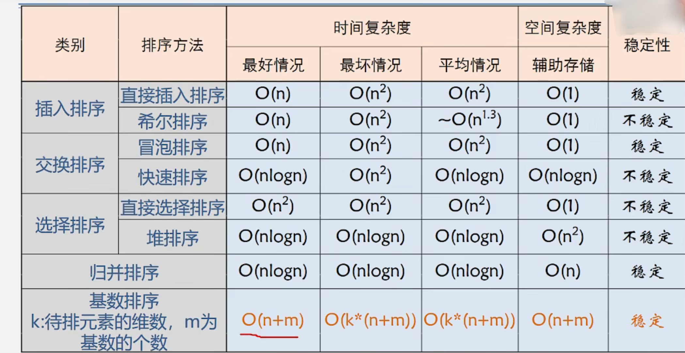


## 九. 串

### 9.1 朴素模式匹配

​			将主串中所有长度为m的子串与模式串比对，直到找到或不匹配为止


#### 9.1.1 详细代码

```cPP
#include <stdio.h>

typedef struct String
{
	char data[15];
	int length;
} string;

/**
*  朴素模式匹配
*/
int indexOfSubString(string parent, string child)
{
	//两个下标都指向0
	int i = 0, j = 0;

	while (i < parent.length && j < child.length)
	{
		//如果相等,依次往后面比较
		if (parent.data[i] == child.data[j])
		{
			i++;
			j++;
		}
		else
		{
			//否则让下标依次退回到开始的地方
			//eg: i=j=0, i-j回到0
			//	  因为第一次i的下标就是0，所以0+1移动到起始下标的下一个地址
			i = i - j + 1;
			j = 0;
		}
	}
	//如果j的位置大于或等于自身的大小,说明已经找到了
	if (j >= child.length)
	{
		//子串的起始下标=将目前主串的i的位置-子串的长度
		return i - child.length;
	}
	else
	{
		//说明没找到
		return -1;
	}
}
```


#### 9.1.2 main方法

```Cpp
int main(int argc, char const *argv[])
{
	string s1 = { "this is a text", 14 };
	string s2 = { "i", 1 };
	int pos = indexOfSubString(s1, s2);
	printf("子串%s在主串的下标位置是:%d", s2.data, pos);
	return 0;
}
```


#### 9.2.1 王道代码

```cPP
#include <stdio.h>
typedef struct String
{
	char data[15];
	int length;
} string;

//初始化串:数组下标从1开始存储数据
void initString(string & str,char res[],int length){
    str.length = 0;
    str.data[0] = length;
    for (int i = 1; i <= length; i++)    
    {
        str.data[i] = res[i-1];
        str.length++;
    }
}

/**
*  朴素模式匹配
*/
int indexOfSubString(string parent, string child)
{
	//两个下标都指向1
	int i = 1, j = 1;
    
	while (i <= parent.length && j <= child.length)
	{
		//如果相等,依次往后面比较
		if (parent.data[i] == child.data[j])
		{
			i++;
			j++;
		}
		else
		{
			//否则让下标依次回退到开始的地方
			//eg: i=j=1, i-j回到0
			//	  因为第一次i的下标就是1，所以0+2移动到起始下标的下一个地址
			i = i - j + 2;
			j = 1;
		}
	}
	//如果j的位置大于自身的大小,说明已经找到了
	if (j > child.length)
	{
		//子串的起始下标=将目前主串的i的位置-子串的长度
		return i - child.length;
	}
	else
	{
		//说明没找到
		return -1;
	}
}
```


#### 9.2.2 main方法

```Cpp
int main(int argc, char const *argv[])
{
    string s1,s2;
    char parent[] = "hello";
    char child[] = "llo";
    initString(s1, parent, 5);
    initString(s2, child, 3);
    int pos=indexOfSubString(s1, s2);
    printf("子串%s在主串的下标位置是:%d", child, pos);
    return 0;
}
```


## 十. 图

### 10.1 邻接矩阵法

#### 10.1.1 具体步骤

1. 输入总顶点数、总边数
2. 依次输入顶点信息存入顶点数组中
3. 初始化邻接矩阵，使每个权值初始化为无穷
4. 输入对应的两个顶点之间的权值，构造邻接矩阵


#### 10.1.2 构造无向网

> **注意：**
>
> ​			**1. 若要构造无向图，只需要修改无穷和权值即可：`将有权值的修改为1，无权值的修改为0`**
>
> ​			**2. 若要构造有向网，只需要将对称位置的 `g.archs[v2Index][v1Index] = g.archs[v1Index][v2Index]`删除即可**
>
> ​			**3. 若要构造有向图，`只需结合1和2两个步骤即可`**

eg：构造以下无向网


* A——B的权为13
* C——A的权为10
* B——D的权为8
* D——E的权为9
* E——C的权为6


##### 结构体

```c++
#include <stdio.h>
#include <iostream>
using namespace std;

#define Infinite 32767 //无穷大

typedef struct AdjacencyMatrixGraph
{
    char vexs[100];        //所有顶点数组
    int archs[100][100];   //邻接矩阵： 顶点数*顶点数 大小的方阵
    int vexsNum, archsNum; //图的顶点数、边数
} AMGraph;
```


##### 初始化图

```c++
//定位输入顶点的位置
int LocateVex(AMGraph g, char vex)
{
    for (int i = 0; i < g.vexsNum; i++)
    {
        if (g.vexs[i] == vex)
        {
            return i;
        }
    }
    return -1;
}

//初始化无向图
void initAMGraph(AMGraph &g)
{
    //输入无向图总顶点数和总边数
    cout << "input vexsNum:" << endl;
    cin >> g.vexsNum;

    cout << "input archsNum:" << endl;
    cin >> g.archsNum;

    cout << "input vexs:" << endl;
    //依次输入顶点数
    for (int i = 0; i < g.vexsNum; i++)
    {
        cin >> g.vexs[i];
    }

    //将邻接矩阵所有边的权值设置为∞
    for (int i = 0; i < g.vexsNum; i++)
    {
        for (int j = 0; j < g.vexsNum; j++)
        {
            g.archs[i][j] = Infinite;	//若想要构造无向图,则将这里的Infinite改为0
        }
    }

    //构造邻接矩阵
    for (int i = 0; i < g.archsNum; i++)
    {
        char v1, v2;
        int weight;

        cout << "input v1 v2" << endl;
        cin >> v1>> v2;

        int v1Index = LocateVex(g, v1); //获取v1顶点的下标位置
        int v2Index = LocateVex(g, v2); //获取v2顶点的下标位置

        //若是无向图,需要将以下两句删除
        cout << "input weight:" << endl;
        cin >> weight;

        if (v1Index != -1 && v2Index != -1)//输入的是正确顶点数
        {
            g.archs[v1Index][v2Index] = weight;   //v1到v2的权重;若是无向图,将weight改为1
            g.archs[v2Index][v1Index] = g.archs[v1Index][v2Index]; //因为是无向网,所以是一个实对称矩阵
        }else
        {
            cout << "you have a wrong vex" << endl;
        }
        
    }
}
```


##### main方法

```c++
int main(int argc, char const *argv[])
{
    AMGraph g;
    initAMGraph(g);
    cout << "\nthe graph is \n"
         << endl;

    for (int i = 0; i < g.vexsNum; i++)
    {
        for (int j = 0; j < g.vexsNum; j++)
        {
            if (g.archs[i][j] == Infinite)
            {
                //为了美化输出效果,如果是无穷大,就将它变为0再次输出
                printf("%2d",0);
            }
            else
            {
                printf("%2d", g.archs[i][j]);
            }
        }
        printf("\n");
    }

    return 0;
}
```


##### 运行结果

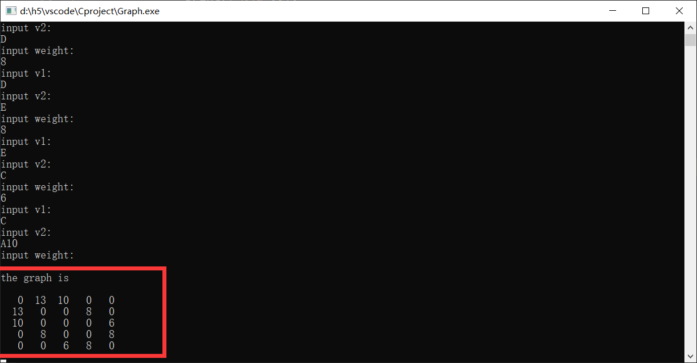


### 10.2 邻接表法

#### 10.2.1 具体步骤

1. 输入总顶点数、总边数
2. 建立顶点表：
   * 将顶点依次放入顶点表中
   * 将顶点表的每个顶点的firstArch置为NULL
3. 创建邻接表：
   * 输入两个顶点v1和v2，获取v1和v2对应顶点表的下标位置
   * 创建边节点，并将边节点v2设置对应顶点表数组的adjVex下标位置
   * 使用头插法，将边节点v2插入到v1上
   * 因为是无向图，使用头插法，再次将边节点v1插入到v2上


#### 10.2.2 构造无向图

eg：若要构造以下无向图

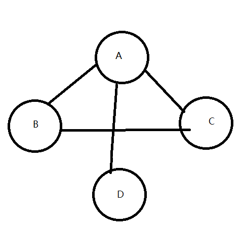

##### 结构体

```Cpp
#include <stdio.h>
#include <iostream>
using namespace std;

//顶点表节点信息
typedef struct VexsNode
{
    char data;                  //顶点信息
    struct ArchNode *firstArch; //指向第一条边的指针
} VexsNode;

//边节点信息
typedef struct ArchNode
{
    int adjVex;                //指向当前边的下标位置
    struct ArchNode *nextArch; //指向下一条边的指针
    int weight;                //权值
};

//领接表信息
typedef struct AdjacencyListGraph
{
    VexsNode vertices[100]; //顶点数组最多100个顶点
    int vexsNum, archsNum;  //图的顶点数、边数
} ALGraph;
```


##### 初始化图

```Cpp
//定位顶点的下标位置
int LocateVex(ALGraph g, char vex)
{
    for (int i = 0; i < g.vexsNum; i++)
    {
        if (g.vertices[i].data == vex)
        {
            return i;
        }
    }
    return -1;
}

//初始化领接表：无向网
void initALGraph(ALGraph &g)
{

    //输入无向图总顶点数和总边数
    cout << "input vexsNum:" << endl;
    cin >> g.vexsNum;

    cout << "input archsNum:" << endl;
    cin >> g.archsNum;

    cout << "input vexs:" << endl;
    //构造顶点表
    for (int i = 0; i < g.vexsNum; i++)
    {
        //依次输入顶点信息
        cin >> g.vertices[i].data;
        //将各个顶点的第一条边置为空
        g.vertices[i].firstArch = NULL;
    }

    //构造领接表
    for (int i = 0; i < g.archsNum; i++)
    {
        char v1, v2;

        cout << "input v1 v2" << endl;
        cin >> v1>> v2;

        int v1Index = LocateVex(g, v1); //获取v1顶点的下标位置
        int v2Index = LocateVex(g, v2); //获取v2顶点的下标位置

        //v1顶点到v2顶点有边:此时边节点为v2,下标为v2Index
        ArchNode *archNode = (ArchNode *)malloc(sizeof(ArchNode));
        archNode->adjVex = v2Index;
        //头插法:将v2节点的下一个指针域设置为v1顶点的第一条边的指针域
        archNode->nextArch = g.vertices[v1Index].firstArch;
        //让v1顶点的下一条边指向v2节点
        g.vertices[v1Index].firstArch = archNode;

        //v2顶点到v1顶点也有边:此时边节点为v1,下标为v1Index
        ArchNode *archNode2 = (ArchNode *)malloc(sizeof(ArchNode));
        archNode2->adjVex = v1Index;
        //头插法:将v1节点的下一个指针域设置为v2顶点的第一条边的指针域
        archNode2->nextArch = g.vertices[v2Index].firstArch;
        //让v2顶点的下一条边指向v1节点
        g.vertices[v2Index].firstArch = archNode2;
    }
}
```


##### 递归打印图

```Cpp
//递归打印
void printGraph(ArchNode *archNode,  ALGraph g)
{
    if (archNode != NULL)
    {
        printGraph(archNode->nextArch,  g);
        printf("=>%3c", g.vertices[archNode->adjVex].data);
    }
   
}
```

>  **递归思想：以 A => B => C => NULL 为例**


##### main方法

```Cpp
int main(int argc, char const *argv[])
{
    ALGraph g;
    initALGraph(g);
    for (int i = 0; i < g.vexsNum; i++)
    {
        printf("%3c", g.vertices[i].data);

        if (g.vertices[i].firstArch != NULL)
        {
            printGraph(g.vertices[i].firstArch, g);
        }
        printf("\n");
    }

    return 0;
}
```

 


##### 运行结果


### 10.3  DFS深层优先遍历

> **注意：这里是图的DFS，不是网的DFS，`10.1`的邻接矩阵法是网，需要将网改为图再来进行DFS（将`10.1.2的初始化图`的权重设为0即可）**

eg：遍历下列图的DFS


#### 邻接矩阵的DFS

##### 1.邻接矩阵

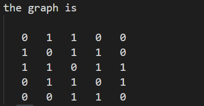


##### 2.关键代码

```cPP
//全局变量:将访问过的顶点设为1,没访问过的为0
int visited[100] = {0};

void DFS(AMGraph g, int vex)
{
    cout << g.vexs[vex]; //打印当前节点
    visited[vex] = 1;    //设置当前节点已访问
    for (int i = 0; i < g.vexsNum; i++)
    {
        //从邻接矩阵的当前行开始遍历: 若当前顶点与其它顶点有边 && 有边的那个顶点没有被访问
        if ((g.archs[vex][i] != 0) && visited[i] != 1)
        {
            //递归调用:就让当前节点跳往第一条有边的顶点
            DFS(g, i);
        }
    }
}
```


##### 3.  main方法

```cPP
int main(int argc, char const *argv[])
{ 	
	AMGraph g1;
    g1.vexsNum = 5;
    g1.archsNum = 7;
    char ves[] = {'a', 'b', 'c', 'd', 'e'};
    for (int i = 0; i < g1.vexsNum; i++)
    {
        g1.vexs[i] = ves[i];
    }

    g1.archs[0][1] = 1;
    g1.archs[0][2] = 1;
    g1.archs[1][0] = 1;
    g1.archs[1][2] = 1;
    g1.archs[1][3] = 1;
    g1.archs[2][0] = 1;
    g1.archs[2][1] = 1;
    g1.archs[2][3] = 1;
    g1.archs[2][4] = 1;
    g1.archs[3][1] = 1;
    g1.archs[3][2] = 1;
    g1.archs[3][4] = 1;
    g1.archs[4][2] = 1;
    g1.archs[4][3] = 1;
    cout << "the graph is \n"
         << endl;
    for (int i = 0; i < g1.vexsNum; i++)
    {
        for (int j = 0; j < g1.vexsNum; j++)
        {
            printf("%4d", g1.archs[i][j]);
        }
        printf("\n");
    }

    cout << "dfs is:\n";
    DFS(g1, 2);
}
```


##### 4. 遍历结果

* 从顶点a开始

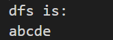 

* 从顶点b开始

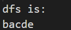 

* 从顶点c开始

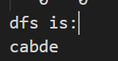 

* 从顶点d开始

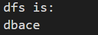 

* 从顶点e开始

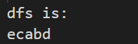 


> **总结：该DFS适用于流通图的遍历；若图是由流通图+非连通图构成，则遍历完连通图后，还要再次循环判断visited数组是否还有没遍历完的顶点，若有则继续对其DFS**


### 10.4 BFS广度优先遍历

eg：遍历下列图的BFS


#### 邻接表的BFS

##### 1.邻接表

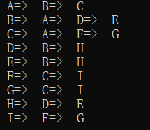


##### 2.  关键代码

```Cpp
//定位顶点的下标位置
int LocateVex(ALGraph g, char vex)
{
    for (int i = 0; i < g.vexsNum; i++)
    {
        if (g.vertices[i].data == vex)
        {
            return i;
        }
    }
    return -1;
}

//第一条边的索引
int firstAdjVex(ALGraph g, int vex)
{
    if (g.vertices[vex].firstArch != NULL)
    {
       struct ArchNode *first = g.vertices[vex].firstArch;
        return first->adjVex;
    }
    return -1;
}

//下一条边的索引
int nextAdjVex(ALGraph g, int u)
{
    if(g.vertices[u].firstArch->nextArch!=NULL){
       struct ArchNode* next= g.vertices[u].firstArch->nextArch;
       return next->adjVex;
    }
    return -1;
}


//全局变量:将访问过的顶点设为1,没访问过的为0
int visted[100] = {0};

void BFS(ALGraph g,int vex){
    //环形队列
    CircuQueue q;
    //初始化环形队列
    initQueue(q);

    //打印当前顶点
    cout << g.vertices[vex].data;
    //设置当前顶点已访问
    visted[vex] = 1;
    //当前顶点索引下标入队
    enQueue(q, vex);

    //队列不为空则入队
    while(!isEmpty(q)){
        int u;
        //对头元素出队
        deQueue(q, u);
        
        //获取当前顶点的第一条边和第二条边
        for (int w = firstAdjVex(g,u); w >=0; w=nextAdjVex(g,u))
        {
            if(visted[w]!=1){
                //打印当前顶点的边的值
                cout << g.vertices[w].data;
                //设置边顶点已访问
                visted[w] = 1;
                //将边顶点索引下标入队
                enQueue(q, w);
            }else
            {
                break;
            }         
        }        
    }
}
```


##### 3. 遍历结果

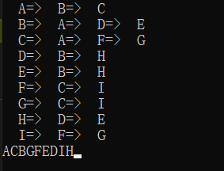


> **总结：该BFS适用于流通图的遍历；若图是由流通图+非连通图构成，则遍历完连通图后，还要再次循环判断visited数组是否还有没遍历完的顶点，若有则继续对其BFS**


##### 4. 详细代码

```cPP
#include <stdio.h>
#include <iostream>
using namespace std;

//顶点表节点信息
typedef struct VexsNode
{
    char data;                  //顶点信息
    struct ArchNode *firstArch; //指向第一条边的指针
} VexsNode, AdjList[100];

//边节点信息
typedef struct ArchNode
{
    int adjVex;                //指向当前边的下标位置
    struct ArchNode *nextArch; //指向下一条边的指针
    int weight;                //权值
};

//领接表信息
typedef struct AdjacencyListGraph
{
    // AdjList vertices;        //邻接表
    VexsNode vertices[100]; //顶点最多100个
    int vexsNum, archsNum;  //图的顶点数、边数
} ALGraph;

#pragma region 队列定义
#define MAX_SIZE 10

//FIFO: First In First Out
typedef int ElemType;

typedef struct CircuQueue {
	ElemType data[MAX_SIZE];	//数据区域：循环队列只存放 MAX_SIZE-1 个数据
	int front;	//队头下标
	int rear;   //队尾下标
};

//初始化循环队列
void initQueue(CircuQueue & queue) {
	//让队头和队尾下标都指向0
	queue.front = queue.rear = 0;
   
}

//判断循环队列是否为空
bool isEmpty(CircuQueue queue){
	//若队头下标和队尾下标相等，说明循环队列不为空
	return queue.rear == queue.front ? true : false;
}

//判断循环队列是否已满
bool isFull(CircuQueue queue){
    //若队尾下标往前移动一格 % 数据大小 正好等于队头下标，说明循环队列满了
    return (queue.rear+1)%MAX_SIZE==queue.front?true:false;
}

//入队列
bool enQueue(CircuQueue & queue,int data) {
	
	if (isFull(queue)) {
		return false;
	}
	queue.data[queue.rear] = data;	//数据从队尾进
	queue.rear = (queue.rear + 1) % MAX_SIZE;//让队尾下标往前移动一格
	return true;
}

//出队列
bool deQueue(CircuQueue & queue,int & tmp) {
	//若队头下标和队尾下标相等，说明为空的循环队列
	if (isEmpty(queue)) {
		return false;
	}
    tmp = queue.data[queue.front];
    queue.data[queue.front] = NULL;	//数据从队头出
	queue.front= (queue.front + 1) % MAX_SIZE;//让队头下标往前移动一格
	return true;
}

#pragma endregion 队列结束


//定位顶点的下标位置
int LocateVex(ALGraph g, char vex)
{
    for (int i = 0; i < g.vexsNum; i++)
    {
        if (g.vertices[i].data == vex)
        {
            return i;
        }
    }
    return -1;
}

//初始化领接表：无向网
void initALGraph(ALGraph &g)
{

    //输入无向图总顶点数和总边数
    cout << "input vexsNum:" << endl;
    cin >> g.vexsNum;

    cout << "input archsNum:" << endl;
    cin >> g.archsNum;

    cout << "input vexs:" << endl;
    //构造顶点表
    for (int i = 0; i < g.vexsNum; i++)
    {
        //依次输入顶点信息
        cin >> g.vertices[i].data;
        //将各个顶点的第一条边置为空
        g.vertices[i].firstArch = NULL;
    }

    //构造领接表
    for (int i = 0; i < g.archsNum; i++)
    {
        char v1, v2;

        cout << "input v1 v2" << endl;
        cin >> v1 >> v2;

        int v1Index = LocateVex(g, v1); //获取v1顶点的下标位置
        int v2Index = LocateVex(g, v2); //获取v2顶点的下标位置

        //v1顶点到v2顶点有边:此时边节点为v2,下标为v2Index
        ArchNode *archNode = (ArchNode *)malloc(sizeof(ArchNode));
        archNode->adjVex = v2Index;
        //头插法:将v2节点的下一个指针域设置为v1顶点的第一条边的指针域
        archNode->nextArch = g.vertices[v1Index].firstArch;
        //让v1顶点的下一条边指向v2节点
        g.vertices[v1Index].firstArch = archNode;

        //v2顶点到v1顶点也有边:此时边节点为v1,下标为v1Index
        ArchNode *archNode2 = (ArchNode *)malloc(sizeof(ArchNode));
        archNode2->adjVex = v1Index;
        //头插法:将v1节点的下一个指针域设置为v2顶点的第一条边的指针域
        archNode2->nextArch = g.vertices[v2Index].firstArch;
        //让v2顶点的下一条边指向v1节点
        g.vertices[v2Index].firstArch = archNode2;
    }
}

//递归打印
void printGraph(ArchNode *archNode, ALGraph g)
{
    if (archNode != NULL)
    {
        printGraph(archNode->nextArch, g);
        printf("=>%3c", g.vertices[archNode->adjVex].data);
    }
}

//第一条边的索引
int firstAdjVex(ALGraph g, int vex)
{
    if (g.vertices[vex].firstArch != NULL)
    {
       struct ArchNode *first = g.vertices[vex].firstArch;
        return first->adjVex;
    }
    return -1;
}

//下一条边的索引
int nextAdjVex(ALGraph g, int u)
{
    if(g.vertices[u].firstArch->nextArch!=NULL){
       struct ArchNode* next= g.vertices[u].firstArch->nextArch;
       return next->adjVex;
    }
    return -1;
}


//BFS
int visted[100] = {0};

void BFS(ALGraph g,int vex){
    CircuQueue q;
    initQueue(q);

    cout << g.vertices[vex].data;
    visted[vex] = 1;
    enQueue(q, vex);

    while(!isEmpty(q)){
        int u;
        deQueue(q, u);
        for (int w = firstAdjVex(g,u); w >=0; w=nextAdjVex(g,u))
        {
            if(visted[w]!=1){
                cout << g.vertices[w].data;
                visted[w] = 1;
                enQueue(q, w);
            }else
            {
                break;
            }
            
        }
        
    }
}


int main(int argc, char const *argv[])
{
    ALGraph g;
    initALGraph(g);
    for (int i = 0; i < g.vexsNum; i++)
    {
        printf("%3c", g.vertices[i].data);

        if (g.vertices[i].firstArch != NULL)
        {
            printGraph(g.vertices[i].firstArch, g);
        }
        printf("\n");
    }

    cout << "the bfs is\n";
    BFS(g, 0);

    return 0;
}
```


