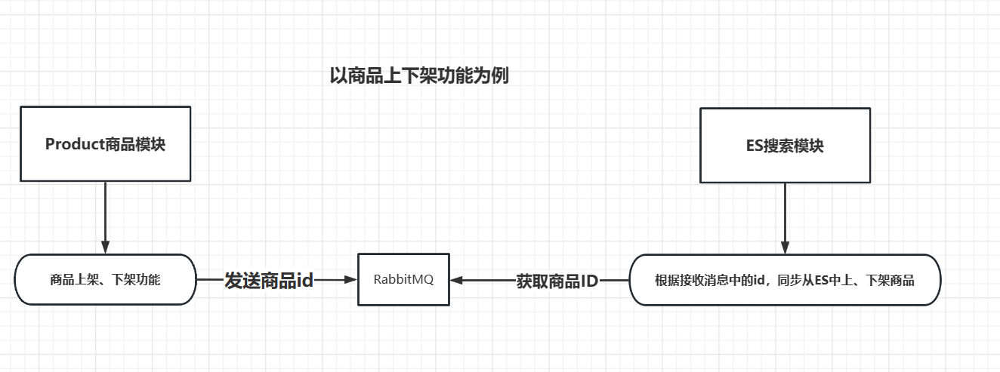
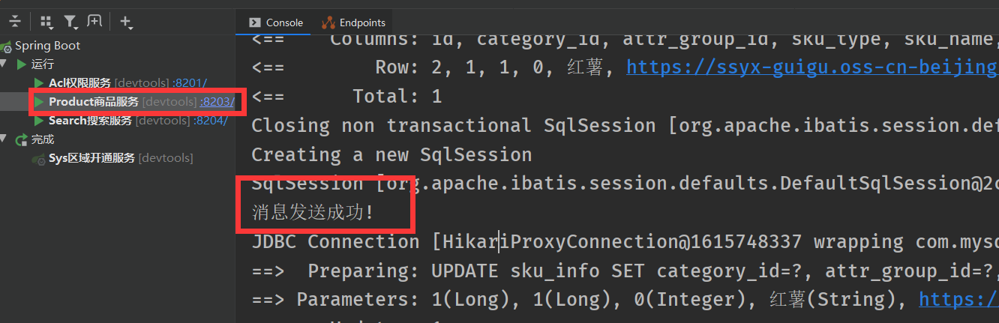
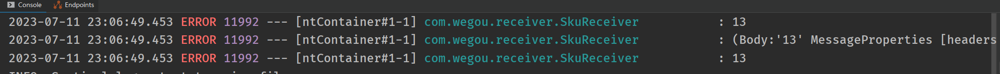

# RabbitMQ实战

## 案例：商品上下架

> **管理员点击上传商品后，商品模块向rabbitmq中发送一条对应商品id的消息；搜索模块监听消息队列的消息，获取商品id，远程调用获取对应商品信息，上传至ES中**




### rabbitmq公共服务配置

#### 导入依赖

```xml
  <!--rabbitmq消息队列-->
        <dependency>
            <groupId>org.springframework.cloud</groupId>
            <artifactId>spring-cloud-starter-bus-amqp</artifactId>
        </dependency>
```


#### 配置rabbitmq消息转换器

```java
//rabbitmq消息转换器,rabbitmq默认发消息只能发字符串,配置转换器后可以发送Object类型
@Configuration
public class RabbitMQConfig {

    @Bean
    public MessageConverter messageConverter(){
        //将发送的消息都转为JSON格式
        return new Jackson2JsonMessageConverter();
    }
}
```


#### 封装消息发送服务

```java
//rabbitmq发送消息服务
@Service
public class RabbitService {

    //注入rabbitmq模版
    @Resource
    private RabbitTemplate rabbitTemplate;

    /**
     * 发送消息
     * @param exchange      交换机
     * @param routingKey    路由key
     * @param message       消息
     * @return
     */
    public boolean sendMessage(String exchange,String routingKey,Object message){
        rabbitTemplate.convertAndSend(exchange,routingKey,message);
        return true;
    }

}
```


#### 生产者消息的确认配置

```java
//添加 生产者消息的确认配置
@Component
public class MQProducerAckConfig implements RabbitTemplate.ReturnCallback,RabbitTemplate.ConfirmCallback {

    //  我们发送消息使用的是 private RabbitTemplate rabbitTemplate; 对象
    //  如果不做设置的话 当前的rabbitTemplate 与当前的配置类没有任何关系！
    @Autowired
    private RabbitTemplate rabbitTemplate;

    //  设置 表示修饰一个非静态的void方法，在服务器加载Servlet的时候运行。并且只执行一次！
    @PostConstruct
    public void init(){
        rabbitTemplate.setReturnCallback(this);
        rabbitTemplate.setConfirmCallback(this);
    }

    /**
     * 表示消息是否正确发送到了交换机上
     * @param correlationData   消息的载体
     * @param ack   判断是否发送到交换机上
     * @param cause 原因
     */
    @Override
    public void confirm(CorrelationData correlationData, boolean ack, String cause) {
        if(ack){
            System.out.println("消息发送成功!");
        }else {
            System.out.println("消息发送失败!原因:"+cause);
        }
    }

    /**
     * 消息如果没有正确发送到队列中，则会走这个方法！如果消息被正常处理，则这个方法不会走！
     * @param message
     * @param replyCode
     * @param replyText
     * @param exchange
     * @param routingKey
     */
    @Override
    public void returnedMessage(Message message, int replyCode, String replyText, String exchange, String routingKey) {
        System.out.println("消息主体: " + new String(message.getBody()));
        System.out.println("应答码: " + replyCode);
        System.out.println("描述：" + replyText);
        System.out.println("消息使用的交换器 exchange : " + exchange);
        System.out.println("消息使用的路由键 routing : " + routingKey);
    }
}
```


#### MQ常量

```java
//mq常量:队列、交换机、路由
public interface MQConstant {
    /**
     * 商品上下架
     */
    //交换机
    public static final String EXCHANGE_GOODS_DIRECT = "wegou.goods.direct";
    //路由:上架路由、下架路由
    public static final String ROUTING_GOODS_UPPER = "wegou.goods.upper";
    public static final String ROUTING_GOODS_LOWER = "wegou.goods.lower";
    //队列
    public static final String QUEUE_GOODS_UPPER = "wegou.goods.upper";
    public static final String QUEUE_GOODS_LOWER = "wegou.goods.lower";
}
```


### 商品微服务端

#### 全局配置文件

```yaml
spring:
  # rabbitmq配置相关
  rabbitmq:
    host: 192.168.2.103                 # RabbitMQ服务器地址
    port: 5672                          # RabbitMQ连接端口号
    username: admin                     # RabbitMQ用户名
    password: 123456                    # RabbitMQ密码
    publisher-confirm-type: CORRELATED # 确认消息的类型:SIMPLE同步等待confirm结果,直到超时; CORRELATED异步回调
    publisher-returns: true            # 是否启用【发布确认模式】，默认false
    listener:
      simple:
        prefetch: 1                   # 限制消费者 每次只处理一条消息，处理完毕后再处理下一条消息
        concurrency: 3                # 最小的消费者数量
        acknowledge-mode: manual      # 消息确认方式：分别是none、manual手动确认和auto；默认auto
```


#### 生产者伪代码

```java
    @Resource
    private RabbitService rabbitService;

    //根据商品id上下架商品
    public void publish(Long skuId, Integer status) {
     	//省略其它代码
        
        if (status == 1) {
            //商品上架操作
            
            //发送消息到RabbitMQ中
            rabbitService.sendMessage(
                    MQConstant.EXCHANGE_GOODS_DIRECT,   //交换机
                    MQConstant.ROUTING_GOODS_UPPER,     //路由key
                    skuId);                             //消息内容:13

        } else {
            //商品下架操作
            
            //发送消息到RabbitMQ中
            rabbitService.sendMessage(
                    MQConstant.EXCHANGE_GOODS_DIRECT,   //交换机
                    MQConstant.ROUTING_GOODS_LOWER,     //路由key
                    skuId);                             //消息
        }
    }
```


#### 测试结果




### ES搜索微服务端

#### 全局配置文件

```yaml
spring:
  # rabbitmq配置相关
  rabbitmq:
    host: 192.168.2.103                 # RabbitMQ服务器地址
    port: 5672                          # RabbitMQ连接端口号
    username: admin                     # RabbitMQ用户名
    password: 123456                    # RabbitMQ密码
    publisher-confirm-type: CORRELATED # 确认消息的类型:SIMPLE同步等待confirm结果,直到超时; CORRELATED异步回调
    publisher-returns: true            # 是否启用【发布确认模式】，默认false
    listener:
      simple:
        prefetch: 1                   # 限制消费者 每次只处理一条消息，处理完毕后再处理下一条消息
        concurrency: 3                # 最小的消费者数量
        acknowledge-mode: manual      # 消息确认方式：分别是none、manual手动确认和auto；默认auto
```


#### 消费者伪代码

```java
//包别导错
import com.rabbitmq.client.Channel;
import org.springframework.amqp.core.Message;

@Component
public class SkuReceiver {

    //上架商品
    //监听消息:要与生产者对应
    @RabbitListener(bindings = @QueueBinding(
            //绑定队列,并对消息进行持久化
            value = @Queue(value = MQConstant.QUEUE_GOODS_UPPER, durable = "true"),
            //绑定交换机
            exchange = @Exchange(value = MQConstant.EXCHANGE_GOODS_DIRECT),
            //绑定路由Kye
            key = {MQConstant.ROUTING_GOODS_UPPER}
    ))
    public void upperSku(Long id, Message message, Channel channel) throws IOException {
        //省略其他操作
        
        log.error("{}",id);			//通过形参,直接获取队列的值
        log.error("{}",message);
        //通过从消息体转换为字符串:获取队列的消息,按UTF-8编码转为字符串
        log.error("{}",new String(message.getBody(),"UTF-8") );
        
        //消费端手动确认消息:参数1消息标识,参数2是否签收多个消息
        channel.basicAck(message.getMessageProperties().getDeliveryTag(), false);
    }


    //下架商品
    @RabbitListener(bindings = @QueueBinding(
            //绑定队列,并对消息进行持久化
            value = @Queue(value = MQConstant.QUEUE_GOODS_LOWER, durable = "true"),
            //绑定交换机
            exchange = @Exchange(value = MQConstant.EXCHANGE_GOODS_DIRECT),
            //绑定路由Kye
            key = {MQConstant.ROUTING_GOODS_LOWER}
    ))
    public void lowerSku(Long skuId, Message message, Channel channel) throws IOException {
         //省略其他操作
        
        log.error("{}",id);
        log.error("{}",message);
        //获取队列的消息,按UTF-8编码转为字符串
        log.error("{}",new String(message.getBody(),"UTF-8") );
        
        //消费端手动确认消息:参数1消息标识,参数2是否签收多个消息
        channel.basicAck(message.getMessageProperties().getDeliveryTag(), false);
    }
}
```


#### 测试结果




### 注意

* **生产者发送`基本类型、类类型、集合等`，消费者监听方法形参直接用对应的类型接收即可获取队列的消息**

```java
//生产者发送基本类型
String xxx="" 或 Integer xxx=1 或 User xxx=null 或 List<User> xxx=null

rabbitService.sendMessage(
                    MQConstant.EXCHANGE_GOODS_DIRECT,   //交换机
                    MQConstant.ROUTING_GOODS_UPPER,     //路由key
                    xxx);                               //消息内容


//消费者监听方法形参直接用对应的基本类型接收
    @RabbitListener(bindings = @QueueBinding(
            //绑定队列,并对消息进行持久化
            value = @Queue(value = MQConstant.QUEUE_GOODS_LOWER, durable = "true"),
            //绑定交换机
            exchange = @Exchange(value = MQConstant.EXCHANGE_GOODS_DIRECT),
            //绑定路由Kye
            key = {MQConstant.ROUTING_GOODS_LOWER}
    ))
    public void lowerSku(
        				 对应的类型(String 或 Integer 或 类类型 或 集合类型) args, 
                         Message message, 
                         Channel channel)
```


* **消费者获取消息有两种方法**

1. 在消费者监听方法上直接用对应的类型接收即可（同上）
2. 从Message对象中获取，先将消息转为字符串，然后强制转换为对应的类型

```java
//消费者监听方法
@RabbitListener//省略其它
public void lowerSku(Message message, Channel channel){
    //按UTF-8编码将消息转为字符串
    String data=new String(message.getBody(),"UTF-8");
    
    //强制转为你想要的类型或可以通过JSON转
    Object obj=(Object)data;
}	
```

