# Kafka

## 快速上手

### 特点

> **Kafka的核心作用就是用来收集并处理庞大复杂的应用日志**

1. 数据吞吐量很大：能够快速收集各个渠道的海量日志
2. 集群容错性高：允许集群中少量节点崩溃
3. **功能不需要太复杂：Kafka的设计目标是高吞吐、低延迟和可扩展性，主要关注消息传递而不是消息处理。所以，Kafka并没有死信队列、顺序消息等高级功能**


### 搭建单机版

#### jdk配置

> **注意：Kafka和zookeeper都需要有Java的环境，所以安装前，需要确保存在Java环境**

```bash
# 下面的环境需要jdk17的支持
wget https://download.oracle.com/java/17/archive/jdk-17.0.12_linux-x64_bin.tar.gz 
```

```bash
# 解压文件然后执行配置
vim /etc/profile
```

```bash
#这里是刚刚解压缩的位置,后期要更改jdk版本，只需要改这里即可
JAVA_HOME=/root/jdk-17.0.12
PATH=$JAVA_HOME/bin:$PATH
CLASSPATH=.:$JAVA_HOME/lib/dt.jar:$JAVA_HOME/lib/tools.jar
export JAVA_HOME
export PATH
export CLASSPATH
```

```BASH
# 刷新配置
source /etc/profile
```


#### 安装kafaka

官方地址：[Apache Kafka](https://kafka.apache.org/downloads)

```bash
# 下载源码包
wget https://mirrors.dotsrc.org/apache/kafka/3.8.0/kafka_2.13-3.8.0.tgz

# 解压
tar -zxvf kafka_2.13-3.8.0.tgz
```

```bash
# 后台启动
nohup bin/kafka-server-start.sh config/server.properties &

# 查看jps
jps
```

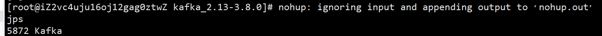


#### 其它命令

##### **创建topic**

```BASH
bin/kafka-topics.sh --bootstrap-server localhost:9092  --create --topic  test
```

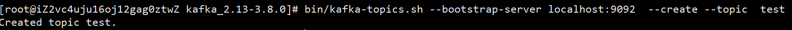


##### **查看topic列表**

```bash
bin/kafka-topics.sh --bootstrap-server localhost:9092 --list
```

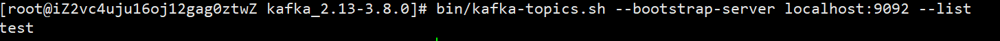


##### **创建生产者**

```bash
#创建一个基于控制台的生产者，往kafka指定topic发消息
bin/kafka-console-producer.sh --bootstrap-server localhost:9092 --topic test
```

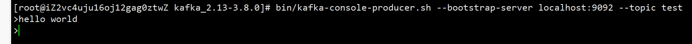


##### **创建消费者**

```bash
# 创建一个基于控制台的消费者，在test的topic中消费消息（默认从队列的最后消费）
bin/kafka-console-consumer.sh --bootstrap-server localhost:9092  --topic test
```

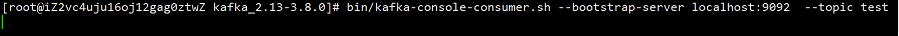

> **这里没有打印到生产者的消息，是因为如果没有指定 offset，当前消费者只会消费本身进程启动后，生产者发送的最新消息；可以使用`--from-beginning`消费topic中已有的全部消息**


##### **从头开始消费**

```bash
# 创建一个基于控制台的消费者，在test的topic中，从头开始消费消息
bin/kafka-console-consumer.sh --bootstrap-server localhost:9092  --topic test  --from-beginning
```

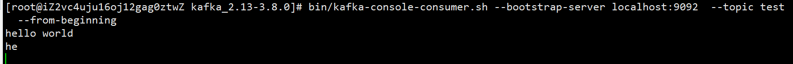


##### **指定位置消费**

```bash
#  创建一个基于控制台的消费者，在指定topic中从第二条消息（下标默认从0开始）开始消费
bin/kafka-console-consumer.sh --bootstrap-server localhost:9092  --topic test  --partition 0 --offset 1
```

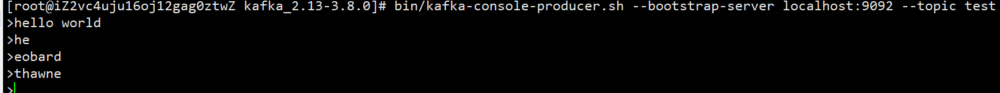

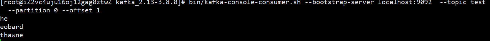


##### **不同消费者组消费**

```bash
# 创建testGroup的消费者组
bin/kafka-console-consumer.sh --bootstrap-server localhost:9092  --topic test  --group testGroup --from-beginning
```

```bash
# 创建testGroup2的消费者组
bin/kafka-console-consumer.sh --bootstrap-server localhost:9092  --topic test  --group testGroup --from-beginning
```

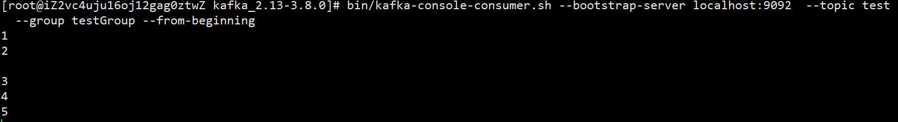

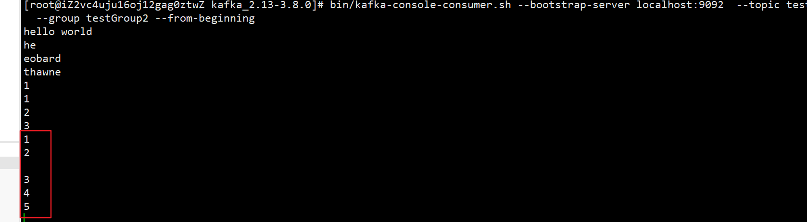


##### **查看消费者组里消费情况**

```bash
bin/kafka-consumer-groups.sh --bootstrap-server localhost:9092  --describe --group testGroup
```

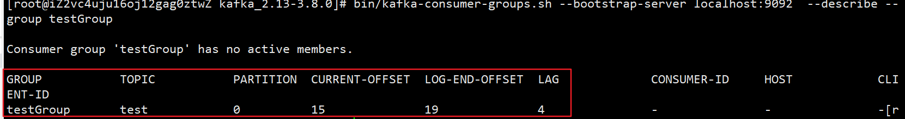

* **GROUP：消费者组名称**
* **TOPIC：主题名称**
* **PARTITION：分区编号**
* **CURRENT-OFFSET：当前消费消息的offset位置**
* **LOG-END-OFFSET：总共的offset位置**
* **LAG：还有多少条没消费**


### 搭建集群版

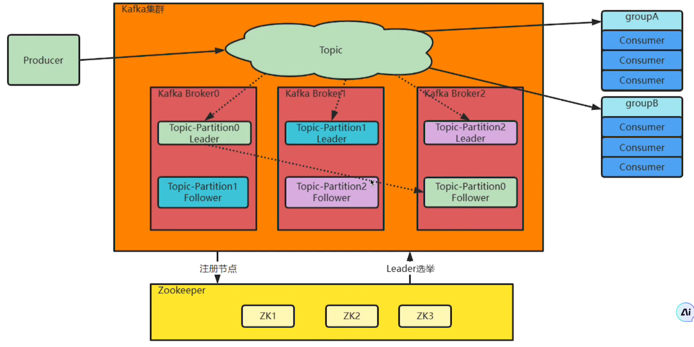

> **为什么需要集群？**
>
> **单机服务下，Kafka已经具备非常高的性能，但是单机版的Kafka会有很大的局限性，因此需要集群**
>
> * **单机磁盘有限，Broker的Topic消息不断增多难以承载。集群就可以把这些消息会分成不同的Partition，分布到不同的Broker上，从而突破单机限制**
> * **如果单机服务崩溃，数据容易丢失，服务不稳定。为了保证数据安全，集群给每个Partition配置一个或多个副本，通过Zookeeper选举主节点Leader，其它节点就是从节点Follower。主节点负责响应客户端业务，从节点负责同步主节点数据**
> * **Zookeeper会保存Kafka的Broker信息、Partition选举信息，当某些Broker服务崩溃时会自动选举，确保系统高可用**


#### 安装zookeeper

官方地址：[Apache ZooKeeper](https://zookeeper.apache.org/releases.html)

```bash
# 下载包
wget https://mirrors.aliyun.com/apache/zookeeper/zookeeper-3.8.5/apache-zookeeper-3.8.5-bin.tar.gz
#解压
tar -zxf apache-zookeeper-3.8.5-bin.tar.gz
```

```bash
# 进入解压后的conf文件夹，复制一份配置文件
cp zoo_sample.cfg  zoo.cfg
```

```bash
# 后台启动
nohup bin/zkServer.sh start &

# 使用jps查看是否启动成功 或者查看输出日志
jps

# 启动成功就不用管了，这里暂时先退出Zookeeper
kill -9 2150
```

 

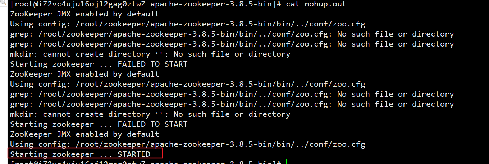


#### 部署Zookeeper集群

> **这里以1个集群为例，如果有多个，直接按照对应的步骤配置启动即可**

* **修改每个服务器的Zookeeper的配置文件**

```bash
# 找到自己安装Zookeeper的位置，更改conf配置文件的zoo.cfg
#  		如果没有这个文件，可以cp zoo_sample.cfg zoo.cfg然后编辑
vim  zoo.cfg
```

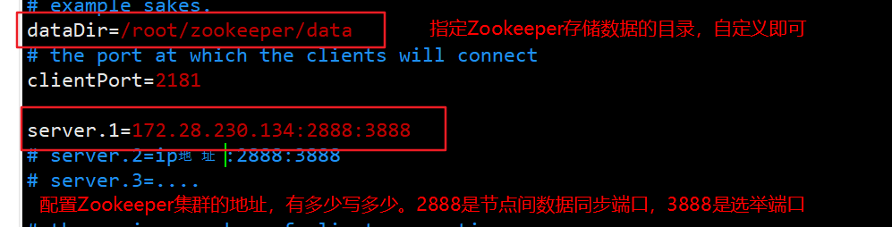

**注意：每个服务器上的`server.x`配置要一致，这样才能知道哪些服务器上可以进行通信**


* **设置当前地址的myid**

> **注意：这里的myid要和配置文件中`server.`序号对应上（eg：我这里模拟只有1个，并且本机的ip地址就是`server.1`后面的地址，那么本机的myid就是`1`；如果有多个服务器，那么在其它服务器上按照IP地址配置`server.`后面的数字即可）**

```bash
# 在刚刚dataDir里面配置myid
mkdir /root/zookeeper/data
cd /root/zookeeper/data
# 写入当前的编号
echo 1 > myid
```


* **依次启动每个服务器的各个Zookeeper节点**

```bash
bin/zkServer.sh start
```

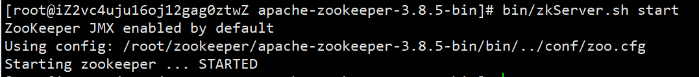


#### 部署Kafka集群

* **修改每个服务器上Kafka的配置文件**

```bash
# 找到自己安装Kafka的根目录，然后修改配置文件
vim config/server.properties
```

```bash
# 当前服务器的broker在集群中的id是多少,全局唯一，不能重复，只能是数字
broker.id=1

# 监听的本机Kafka地址
listeners=PLAINTEXT://172.28.230.134:9092


# 自定义配置数据文件的地址
log.dirs=/root/kafka_2.13-3.8.0/kafka-logs


# 配置Zookeeper的连接地址
zookeeper.connect=172.28.230.134:2181
```

> **注意：这里我只用了1个Zookeeper集群，所以这里的地址只有一个；如果你上面搭建了多个Zookeeper集群，那么这里就要把所有的集群都配置上，以逗号分开**
>
> ```BASH
> # eg：三个Zookeeper集群，默认情况下所有的Zookeeper数据会被保存到Zookeeper的根路径下,如果不想注册到根路径下，可以设置指定路径(eg：172.28.230.132:2181/my)
> zookeeper.connect=172.28.230.134:2181,172.28.230.133:2181,172.28.230.132:2181
> ```


* **启动每个服务器的Kafka节点**

```bash
nohup bin/kafka-server-start.sh config/server.properties &
cat hup.out
```

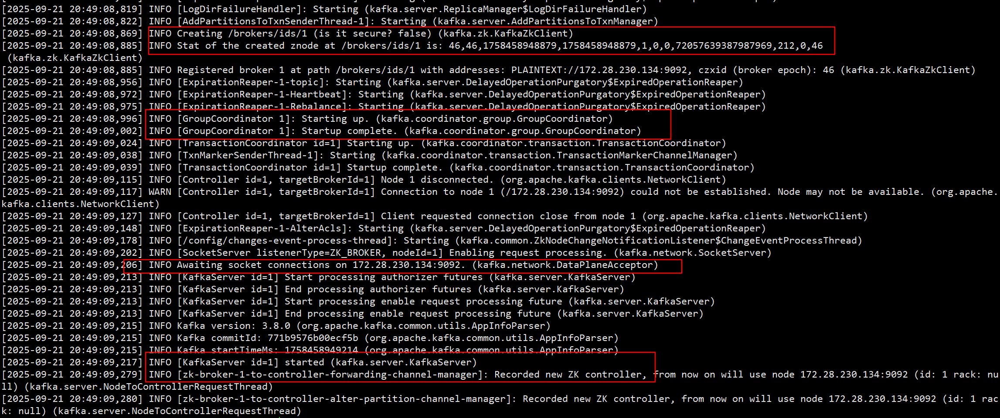


#### 测试

> **假设有三台服务器：`worker1:9092、worker2:9092、worker3:9092`，它们对应的broker的id和myid是`1、2、3`**

```bash
# 在worker1:9092这个服务器上创建disTopic主题，其中副本数量为2，分区为4
bin/kafka-topics.sh  --bootstrap-server worker1:9092 --create  --replication-factor 2 --partitions 4  --topic disTopic
```

```bash
# 查看disTopic主题的信息
bin/kafka-topics.sh  --bootstrap-server worker1:9092 --describe  --topic disTopic
```

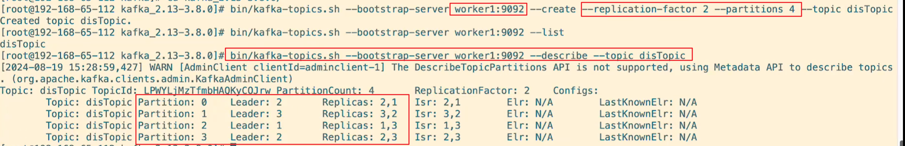

* **replication-factor 2 ：每个分区总共有2个副本，1个Leader+1个follower（eg：分区0的Leader是broker 2，follower是broker 1保存副本）**
* **partitions 4：当前topic会有4个分区，0~3**
* **Leader：表示主节点的broker id（eg：分区0的主节点是broker 2）**


#### 注意

> **1. Kafka 中的 Topic 是集群共享的，不管你在哪个 Broker 上创建 Topic，Kafka 会自动把分区和副本分散到集群里的不同 Broker 上，保证负载均衡和高可用性。**
>
> **2.当你向集群中的Follower收、发消息时，Kafka内部会找到Leader并往内部读、写消息，随后Leader会发送消息给Follower去同步消息（eg：上面的分区0，Leader是broker 2，我指定向broker1发送消息，内部还是会发送给broker2，然后会同步给broker1）**


## 基本概念

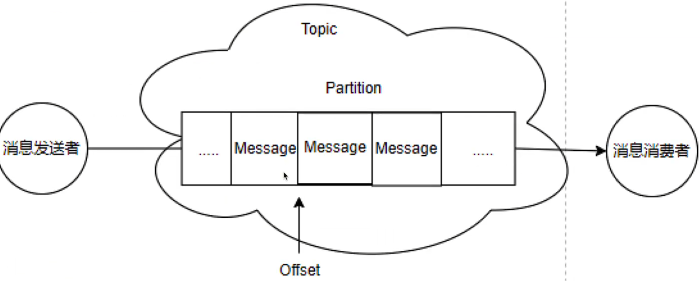

### Broker

* **一个Kafka服务器就是一个Broker**


### Topic（主题）

* 每条发布到Kafka中的消息都有一个类别，这个类别就是Topic，**这是一个逻辑概念**
* **Topic并不是一个单一的消息队列，而是可以创建多个Partition**


### Partition（分区）

* **当发送消息给Topic时，消息真正存放在Partition中。默认情况创建1个Partition（编号从0开始）**
* **Partition内的消息有序（FIFO）**，但全局顺序不保证
* **不同消费者可以同时消费不同Partition，实现负载均衡**


### offset（偏移量）

* **每条消息在Partition内都有一个递增的offset（从0开始，顺序递增），用来标识消息的唯一位置**
* **每个Partition的offset独立，可以指定从Partition的哪个offset开始消费**
* **同一消费者组里的消费者共享offset（即组内最新的消费位置）；不同消费者组的offset独立**


### Consumer Group（消费者组）

* 每个消费者可以指定所属消费者组

* **同一消费者组：组件消费者都共享Partition，每条消息只会被组内任意一个消费者处理一次**
* **不同消费者组：不同组独立消费，同一条消息可以被不同组的任意消费者各消费一次（即不同组可以消费同一条消息）**