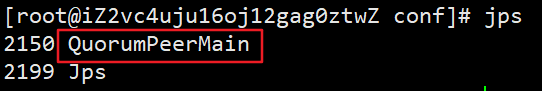

# Kafka

## 快速上手

### 特点

> **Kafka的核心作用就是用来收集并处理庞大复杂的应用日志**

1. 数据吞吐量很大：能够快速收集各个渠道的海量日志
2. 集群容错性高：允许集群中少量节点崩溃
3. **功能不需要太复杂：Kafka的设计目标是高吞吐、低延迟和可扩展性，主要关注消息传递而不是消息处理。所以，Kafka并没有死信队列、顺序消息等高级功能**


### 下载

#### jdk配置

> **注意：Kafka和zookeeper都需要有Java的环境，所以安装前，需要确保存在Java环境**

```bash
# 下面的环境需要jdk17的支持
wget https://download.oracle.com/java/17/archive/jdk-17.0.12_linux-x64_bin.tar.gz 
```

```bash
# 解压文件然后执行配置
vim /etc/profile
```

```bash
#这里是刚刚解压缩的位置,后期要更改jdk版本，只需要改这里即可
JAVA_HOME=/root/jdk-17.0.12
PATH=$JAVA_HOME/bin:$PATH
CLASSPATH=.:$JAVA_HOME/lib/dt.jar:$JAVA_HOME/lib/tools.jar
export JAVA_HOME
export PATH
export CLASSPATH
```

```BASH
# 刷新配置
source /etc/profile
```


#### 单机版下载

##### 安装zookeeper

官方地址：[Apache ZooKeeper](https://zookeeper.apache.org/releases.html)

```bash
# 下载包
wget https://mirrors.aliyun.com/apache/zookeeper/zookeeper-3.8.5/apache-zookeeper-3.8.5-bin.tar.gz
#解压
tar -zxf apache-zookeeper-3.8.5-bin.tar.gz
```

```bash
# 进入解压后的conf文件夹，复制一份配置文件
cp zoo_sample.cfg  zoo.cfg
```

```bash
# 后台启动
nohup bin/zkServer.sh start &

# 使用jps查看是否启动成功 或者查看输出日志
jps
```

 

 


##### 安装kafaka

官方地址：[Apache Kafka](https://kafka.apache.org/downloads)

```bash
# 下载源码包
wget https://mirrors.dotsrc.org/apache/kafka/3.8.0/kafka_2.13-3.8.0.tgz

# 解压
tar -zxvf kafka_2.13-3.8.0.tgz
```

```bash
# 后台启动
nohup bin/kafka-server-start.sh config/server.properties &

# 查看jps
jps
```


##### 其它命令

###### **创建topic**

```BASH
bin/kafka-topics.sh --bootstrap-server localhost:9092  --create --topic  test
```


###### **查看topic列表**

```bash
bin/kafka-topics.sh --bootstrap-server localhost:9092 --list
```


###### **创建生产者**

```bash
#创建一个基于控制台的生产者，往kafka指定topic发消息
bin/kafka-console-producer.sh --bootstrap-server localhost:9092 --topic test
```


###### **创建消费者**

```bash
# 创建一个基于控制台的消费者，在test的topic中消费消息（默认从队列的最后消费）
bin/kafka-console-consumer.sh --bootstrap-server localhost:9092  --topic test
```


> **这里没有打印到生产者的消息，是因为如果没有指定 offset，当前消费者只会消费本身进程启动后，生产者发送的最新消息；可以使用`--from-beginning`消费topic中已有的全部消息**


###### **从头开始消费**

```bash
# 创建一个基于控制台的消费者，在test的topic中，从头开始消费消息
bin/kafka-console-consumer.sh --bootstrap-server localhost:9092  --topic test  --from-beginning
```


###### **指定位置消费**

```bash
#  创建一个基于控制台的消费者，在指定topic中从第二条消息（下标默认从0开始）开始消费
bin/kafka-console-consumer.sh --bootstrap-server localhost:9092  --topic test  --partition 0 --offset 1
```


###### **不同消费者组消费**

```bash
# 创建testGroup的消费者组
bin/kafka-console-consumer.sh --bootstrap-server localhost:9092  --topic test  --group testGroup --from-beginning
```

```bash
# 创建testGroup2的消费者组
bin/kafka-console-consumer.sh --bootstrap-server localhost:9092  --topic test  --group testGroup --from-beginning
```


###### **查看消费者组里消费情况**

```bash
bin/kafka-consumer-groups.sh --bootstrap-server localhost:9092  --describe --group testGroup
```


* **GROUP：消费者组名称**
* **TOPIC：主题名称**
* **PARTITION：分区编号**
* **CURRENT-OFFSET：当前消费消息的offset位置**
* **LOG-END-OFFSET：总共的offset位置**
* **LAG：还有多少条没消费**


## 基本概念


### Broker

* **一个Kafka服务器就是一个Broker**


### Topic（主题）

* 每条发布到Kafka中的消息都有一个类别，这个类别就是Topic，**这是一个逻辑概念**
* **Topic并不是一个单一的消息队列，而是可以创建多个Partition**


### Partition（分区）

* **当发送消息给Topic时，消息真正存放在Partition中。默认情况创建1个Partition（编号从0开始）**
* **Partition内的消息有序（FIFO）**，但全局顺序不保证
* **不同消费者可以同时消费不同Partition，实现负载均衡**


### offset（偏移量）

* **每条消息在Partition内都有一个递增的offset（从0开始，顺序递增），用来标识消息的唯一位置**
* **每个Partition的offset独立，可以指定从Partition的哪个offset开始消费**
* **同一消费者组里的消费者共享offset（即组内最新的消费位置）；不同消费者组的offset独立**


### Consumer Group（消费者组）

* 每个消费者可以指定所属消费者组

* **同一消费者组：组件消费者都共享Partition，每条消息只会被组内任意一个消费者处理一次**
* **不同消费者组：不同组独立消费，同一条消息可以被不同组的任意消费者各消费一次（即不同组可以消费同一条消息）**