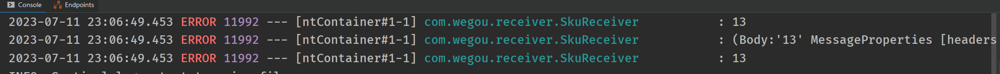
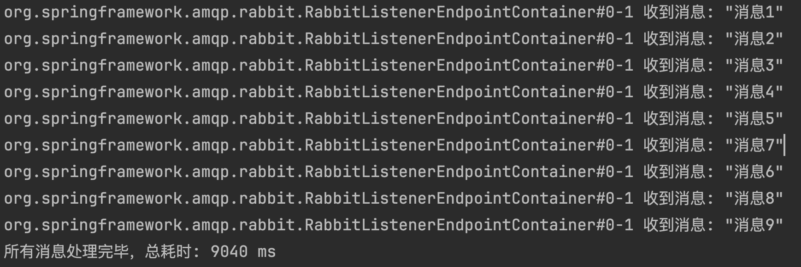

# RabbitMQ实战

## 案例：商品上下架

> **管理员点击上传商品后，商品模块向rabbitmq中发送一条对应商品id的消息；搜索模块监听消息队列的消息，获取商品id，远程调用获取对应商品信息，上传至ES中**


### rabbitmq公共服务配置

#### 导入依赖

```xml
  <!--rabbitmq消息队列-->
        <dependency>
            <groupId>org.springframework.cloud</groupId>
            <artifactId>spring-cloud-starter-bus-amqp</artifactId>
        </dependency>
```


#### 配置rabbitmq消息转换器

```java
//rabbitmq消息转换器,rabbitmq默认发消息只能发字符串,配置转换器后可以发送Object类型
@Configuration
public class RabbitMQConfig {

    @Bean
    public MessageConverter messageConverter(){
        //将发送的消息都转为JSON格式
        return new Jackson2JsonMessageConverter();
    }
}
```


#### 封装消息发送服务

```java
//rabbitmq发送消息服务
@Service
public class RabbitService {

    //注入rabbitmq模版
    @Resource
    private RabbitTemplate rabbitTemplate;

    /**
     * 发送消息
     * @param exchange      交换机
     * @param routingKey    路由key
     * @param message       消息
     * @return
     */
    public boolean sendMessage(String exchange,String routingKey,Object message){
        rabbitTemplate.convertAndSend(exchange,routingKey,message);
        return true;
    }

}
```


#### 生产者消息的确认配置

```java
//添加 生产者消息的确认配置
@Component
public class MQProducerAckConfig implements RabbitTemplate.ReturnCallback,RabbitTemplate.ConfirmCallback {

    //  我们发送消息使用的是 private RabbitTemplate rabbitTemplate; 对象
    //  如果不做设置的话 当前的rabbitTemplate 与当前的配置类没有任何关系！
    @Autowired
    private RabbitTemplate rabbitTemplate;

    //  设置 表示修饰一个非静态的void方法，在服务器加载Servlet的时候运行。并且只执行一次！
    @PostConstruct
    public void init(){
        rabbitTemplate.setReturnCallback(this);
        rabbitTemplate.setConfirmCallback(this);
    }

    /**
     * 表示消息是否正确发送到了交换机上
     * @param correlationData   消息的载体
     * @param ack   判断是否发送到交换机上
     * @param cause 原因
     */
    @Override
    public void confirm(CorrelationData correlationData, boolean ack, String cause) {
        if(ack){
            System.out.println("消息发送成功!");
        }else {
            System.out.println("消息发送失败!原因:"+cause);
        }
    }

    /**
     * 消息如果没有正确发送到队列中，则会走这个方法！如果消息被正常处理，则这个方法不会走！
     * @param message
     * @param replyCode
     * @param replyText
     * @param exchange
     * @param routingKey
     */
    @Override
    public void returnedMessage(Message message, int replyCode, String replyText, String exchange, String routingKey) {
        System.out.println("消息主体: " + new String(message.getBody()));
        System.out.println("应答码: " + replyCode);
        System.out.println("描述：" + replyText);
        System.out.println("消息使用的交换器 exchange : " + exchange);
        System.out.println("消息使用的路由键 routing : " + routingKey);
    }
}
```


#### MQ常量

```java
//mq常量:队列、交换机、路由
public interface MQConstant {
    /**
     * 商品上下架
     */
    //交换机
    public static final String EXCHANGE_GOODS_DIRECT = "wegou.goods.direct";
    //路由:上架路由、下架路由
    public static final String ROUTING_GOODS_UPPER = "wegou.goods.upper";
    public static final String ROUTING_GOODS_LOWER = "wegou.goods.lower";
    //队列
    public static final String QUEUE_GOODS_UPPER = "wegou.goods.upper";
    public static final String QUEUE_GOODS_LOWER = "wegou.goods.lower";
}
```


### 商品微服务端

#### 全局配置文件

```yaml
spring:
  # rabbitmq配置相关
  rabbitmq:
    host: 192.168.2.103                 # RabbitMQ服务器地址
    port: 5672                          # RabbitMQ连接端口号
    username: admin                     # RabbitMQ用户名
    password: 123456                    # RabbitMQ密码
    publisher-confirm-type: CORRELATED # 确认消息的类型:SIMPLE同步等待confirm结果,直到超时; CORRELATED异步回调
    publisher-returns: true            # 是否启用【发布确认模式】，默认false
    listener:
      simple:
        prefetch: 1                   # 限制消费者 每次只处理一条消息，处理完毕后再处理下一条消息
        concurrency: 3                # 最小的消费者数量
        acknowledge-mode: manual      # 消息确认方式：分别是none、manual手动确认和auto；默认auto
```


#### 生产者伪代码

```java
    @Resource
    private RabbitService rabbitService;

    //根据商品id上下架商品
    public void publish(Long skuId, Integer status) {
     	//省略其它代码
        
        if (status == 1) {
            //商品上架操作
            
            //发送消息到RabbitMQ中
            rabbitService.sendMessage(
                    MQConstant.EXCHANGE_GOODS_DIRECT,   //交换机
                    MQConstant.ROUTING_GOODS_UPPER,     //路由key
                    skuId);                             //消息内容:13

        } else {
            //商品下架操作
            
            //发送消息到RabbitMQ中
            rabbitService.sendMessage(
                    MQConstant.EXCHANGE_GOODS_DIRECT,   //交换机
                    MQConstant.ROUTING_GOODS_LOWER,     //路由key
                    skuId);                             //消息
        }
    }
```


#### 测试结果


### ES搜索微服务端

#### 全局配置文件

```yaml
spring:
  # rabbitmq配置相关
  rabbitmq:
    host: 192.168.2.103                 # RabbitMQ服务器地址
    port: 5672                          # RabbitMQ连接端口号
    username: admin                     # RabbitMQ用户名
    password: 123456                    # RabbitMQ密码
    publisher-confirm-type: CORRELATED # 确认消息的类型:SIMPLE同步等待confirm结果,直到超时; CORRELATED异步回调
    publisher-returns: true            # 是否启用【发布确认模式】，默认false
    listener:
      simple:
        prefetch: 1                   # 限制消费者 每次只处理一条消息，处理完毕后再处理下一条消息
        concurrency: 3                # 最小的消费者数量
        acknowledge-mode: manual      # 消息确认方式：分别是none、manual手动确认和auto；默认auto
```


#### 消费者伪代码

```java
//包别导错
import com.rabbitmq.client.Channel;
import org.springframework.amqp.core.Message;

@Component
public class SkuReceiver {

    //上架商品
    //监听消息:要与生产者对应
    @RabbitListener(bindings = @QueueBinding(
            //绑定队列,并对消息进行持久化
            value = @Queue(value = MQConstant.QUEUE_GOODS_UPPER, durable = "true"),
            //绑定交换机
            exchange = @Exchange(value = MQConstant.EXCHANGE_GOODS_DIRECT),
            //绑定路由Kye
            key = {MQConstant.ROUTING_GOODS_UPPER}
    ))
    public void upperSku(Long id, Message message, Channel channel) throws IOException {
        //省略其他操作
        
        log.error("{}",id);			//通过形参,直接获取队列的值
        log.error("{}",message);
        //通过从消息体转换为字符串:获取队列的消息,按UTF-8编码转为字符串
        log.error("{}",new String(message.getBody(),"UTF-8") );
        
        //消费端手动确认消息:参数1消息标识,参数2是否签收多个消息
        channel.basicAck(message.getMessageProperties().getDeliveryTag(), false);
    }


    //下架商品
    @RabbitListener(bindings = @QueueBinding(
            //绑定队列,并对消息进行持久化
            value = @Queue(value = MQConstant.QUEUE_GOODS_LOWER, durable = "true"),
            //绑定交换机
            exchange = @Exchange(value = MQConstant.EXCHANGE_GOODS_DIRECT),
            //绑定路由Kye
            key = {MQConstant.ROUTING_GOODS_LOWER}
    ))
    public void lowerSku(Long skuId, Message message, Channel channel) throws IOException {
         //省略其他操作
        
        log.error("{}",id);
        log.error("{}",message);
        //获取队列的消息,按UTF-8编码转为字符串
        log.error("{}",new String(message.getBody(),"UTF-8") );
        
        //消费端手动确认消息:参数1消息标识,参数2是否签收多个消息
        channel.basicAck(message.getMessageProperties().getDeliveryTag(), false);
    }
}
```


#### 测试结果




### 注意

* **生产者发送`基本类型、类类型、集合等`，消费者监听方法形参直接用对应的类型接收即可获取队列的消息**

```java
//生产者发送基本类型
String xxx="" 或 Integer xxx=1 或 User xxx=null 或 List<User> xxx=null

rabbitService.sendMessage(
                    MQConstant.EXCHANGE_GOODS_DIRECT,   //交换机
                    MQConstant.ROUTING_GOODS_UPPER,     //路由key
                    xxx);                               //消息内容


//消费者监听方法形参直接用对应的基本类型接收
    @RabbitListener(bindings = @QueueBinding(
            //绑定队列,并对消息进行持久化
            value = @Queue(value = MQConstant.QUEUE_GOODS_LOWER, durable = "true"),
            //绑定交换机
            exchange = @Exchange(value = MQConstant.EXCHANGE_GOODS_DIRECT),
            //绑定路由Kye
            key = {MQConstant.ROUTING_GOODS_LOWER}
    ))
    public void lowerSku(
        				 对应的类型(String 或 Integer 或 类类型 或 集合类型) args, 
                         Message message, 
                         Channel channel)
```


* **消费者获取消息有两种方法**

1. 在消费者监听方法上直接用对应的类型接收即可（同上）
2. 从Message对象中获取，先将消息转为字符串，然后强制转换为对应的类型

```java
//消费者监听方法
@RabbitListener//省略其它
public void lowerSku(Message message, Channel channel){
    //按UTF-8编码将消息转为字符串
    String data=new String(message.getBody(),"UTF-8");
    
    //强制转为你想要的类型或可以通过JSON转
    Object obj=(Object)data;
}	
```


## RabbitMQ消息丢失处理

> **持久化配置可以和生产者确认机制配合起来，只有当消息持久化到磁盘后才会ack**

* 队列持久化：创建队列的时候，将其设置为持久化，这样可以保证队列的元数据

  ```java
  @Queue(value = "xxx", durable = "true"）

* 消息持久化：发送消息的时候将消息持久化

  ```java
   messageProperties.setDeliveryMode(MessageDeliveryMode.PERSISTENT);  // 设置消息持久化


## 生产者相关


### 消息可靠性投递（生产者确认机制）

#### 解决方案

> **利用消息确认机制+消息持久化+定时任务**
>
> ​	**当我们开启消息确认机制后，生产者发送消息时我们将消息进行DB持久化处理，当成功到达MQ后会在Confirm回调函数中返回ack信息，此时我们更新对应DB消息的状态；若因为网络波动未能到达MQ时，我们在Confirm回调函数先去执行一次手动重发，只有等拿到ack为true时我们才会去更新DB的消息状态，如果在手动重发还是失败时，我们可以开启定时任务去定时扫描DB中消息状态为失败的记录去执行**

* 交换机不存在:  如果不存在这个交换机,则删除对应发送的DB持久化记录(可考虑将这条消息保存到消息日志中)
* 交换机存在，路由不存在: 判断回应码如果不存在路由,则删除对应发送的DB持久化记录(可考虑将这条消息保存到消息日志中)
* 交换机和路由都存在但网络问题导致未送达MQ： 回调手动重试+定时任务扫库重试任务
* 成功送达:  修改对应发送消息的DB记录状态


#### 具体代码

**开启消息确认机制**

```yaml
spring:
  # MQ
  rabbitmq:
    publisher-confirm-type: correlated  # 开启消息确认机制（交换机确认）
    publisher-returns: true  		# 启用消息未路由时的返回机制
```


**消息持久化类**

```java
@Data
@NoArgsConstructor
@TableName("t_mq_message")
public class MqMessage {
    @TableId
    private Long id;
    private String messageId;           //消息业务唯一id
    private String lastCorrelationId;   //最后一次消息发送id(默认情况下与messageId一致)
    private String exchangeName;
    private String routingKey;
    private String messageBody;
    private boolean status;
    @TableLogic(value = "0", delval = "1")   // 1表示已删除，0表示未删除
    private boolean deleted;

    public MqMessage(String messageId, String lastCorrelationId, String exchangeName, String routingKey, String messageBody, boolean status) {
        this.messageId = messageId;
        this.lastCorrelationId = lastCorrelationId;
        this.exchangeName = exchangeName;
        this.routingKey = routingKey;
        this.messageBody = messageBody;
        this.status = status;
    }
}
```


**生产者确认机制配置类**

```java
@Component
@Slf4j
public class MQProducerAckConfig implements RabbitTemplate.ReturnsCallback, RabbitTemplate.ConfirmCallback {

    @Autowired
    private RabbitTemplate rabbitTemplate;

    @Autowired
    private MqMessageService mqMessageService;

    @PostConstruct
    public void init() {
        rabbitTemplate.setConfirmCallback(this);    //设置Confirm回调函数(交换机是否收到)
        rabbitTemplate.setReturnsCallback(this);    //启用Return回调(队列是否收到)
        rabbitTemplate.setMandatory(true);  				//开启消息退回机制:消息发送到了交换机但路由不到任何队列,把消息退回给生产者
    }


    /**
     * 表示消息是否正确发送到了交换机上
     *
     * @param correlationData 消息的载体
     * @param ack             判断是否发送到交换机上
     * @param cause           原因
     */
    @Override
    public void confirm(CorrelationData correlationData, boolean ack, String cause) {
        MqMessage mqMessage = null;
        if (!ObjectUtils.isEmpty(correlationData)) {
            String correlationId = correlationData.getId();
            //根据最后一次发送id查询消息
            mqMessage = mqMessageService.getOne(new LambdaQueryWrapper<MqMessage>().eq(MqMessage::getLastCorrelationId, correlationId));
        }
      
        //回调返回ack
        if (ack) {
            if (null != mqMessage) {
                //如果不存在路由则删去消息这条记录
                if (checkNotExistRoutingKey(correlationData.getReturned())) {
                    log.error("路由:【{}】不存在,正在删除DB记录,correlationId:【{}】", mqMessage.getRoutingKey(), correlationData.getId());
                    mqMessageService.removeById(mqMessage.getId());
                } else {
                    //更新状态
                    mqMessage.setStatus(true);
                    mqMessageService.updateById(mqMessage);
                    log.info("\n" +
                                    "================Confirm-Callback:⬇️=====================\n\n" +
                                    "生产者:{} 消息发送成功!\n" +
                                    "exchange: {},        routingKey: {},\n" +
                                    "message:  {}\n\n" +
                                    "================Confirm-Callback:⬆️=====================",
                            mqMessage.getLastCorrelationId(),
                            mqMessage.getExchangeName(),
                            mqMessage.getRoutingKey(),
                            new String(mqMessage.getMessageBody().getBytes(), StandardCharsets.UTF_8));
                }
            }
        }
        //回调没有返回ack
        else {
            log.error("消息发送失败!原因:{}", cause);
            //如果不存在交换机则删去消息这条记录
            if (checkNotExistExchange(cause)) {
                log.error("交换机:【{}】不存在,正在删除DB记录,correlationId:【{}】", mqMessage.getExchangeName(), correlationData.getId());
                mqMessageService.remove(new LambdaQueryWrapper<MqMessage>().eq(MqMessage::getLastCorrelationId, correlationData.getId()));
            } else {
                if (null != mqMessage) {
                    //重新发送消息id
                    String lastCorrelationId = UUID.randomUUID().toString();
                    //更新correlationId和状态
                    mqMessage.setLastCorrelationId(lastCorrelationId);
                    mqMessage.setStatus(false);
                    mqMessageService.updateById(mqMessage);
                    //手动补偿:再次发送消息
                    rabbitTemplate.convertAndSend(mqMessage.getExchangeName(),
                            mqMessage.getRoutingKey(),
                            mqMessage.getMessageBody(),
                            new CorrelationData(lastCorrelationId)
                    );
                }
            }
        }
    }

    /**
     * 消息如果没有正确发送到队列中，则会走这个方法！如果消息被正常处理，则这个方法不会走！
     *
     * @param returnedMessage
     */
    @Override
    public void returnedMessage(ReturnedMessage returnedMessage) {
        String exchange = returnedMessage.getExchange();
        String routingKey = returnedMessage.getRoutingKey();
        String message = new String(returnedMessage.getMessage().getBody(), StandardCharsets.UTF_8);
        log.info("\n" +
                        "================Returned-Callback:⬇️===============\n\n" +
                        "路由不存在:\n" +
                        "exchange: {},\t\troutingKey: {},\n" +
                        "replyCode:{},\t\treplyText: {},\n" +
                        "message:  {}\n\n" +
                        "================Returned-Callback:⬆️===============",
                exchange, routingKey, returnedMessage.getReplyCode(), returnedMessage.getReplyText(), message);
    }


    //检查交换机是否存在
    private boolean checkNotExistExchange(String cause) {
        cause = cause.toLowerCase();
        return (cause.contains("reply-code=404") && cause.contains("reply-text=NOT_FOUND".toLowerCase()))
                ||
                (cause.contains("404") && cause.contains("NOT_FOUND".toLowerCase()))
                ||
                (cause.contains("no exchange"));
    }

    //检查路由是否存在
    private boolean checkNotExistRoutingKey(ReturnedMessage returned) {
        //ReturnedMessage只有在路由或者交换机有问题时才不会为null
        if (ObjectUtils.isEmpty(returned)) return false;
        int replyCode = returned.getReplyCode();
        String replyText = returned.getReplyText();
        return replyCode == 312 && replyText.toUpperCase().contains("NO_ROUTE");
    }
}
```

> **注意:这里的Return回调比Confirm回调先执行；如果再次手动发送失败可以利用定时任务去查询status=false并且deleted=false的记录去补偿消息,可以在数据库中设置重试次数等**


**消息发送工具类**

```java
@Service
public class RabbitService {

    @Autowired
    private RabbitTemplate rabbitTemplate;

    @Autowired
    private MqMessageService mqMessageService;

    /**
     * 发送消息
     *
     * @param exchange   交换机
     * @param routingKey 路由key
     * @param message    消息
     * @return
     */
    public boolean sendMessage(String exchange, String routingKey, Object message) {
        //创建CorrelationData对象:每条消息绑定一个“唯一标识”,用于生产者Confirm回调追踪
        CorrelationData data = new CorrelationData();

        //消息持久化:默认情况下消息业务id和最后一次发送id一致
        MqMessage mqMessage = new MqMessage(data.getId(), data.getId(), exchange, routingKey, message.toString(), false);
        mqMessageService.save(mqMessage);

        //发送消息
        rabbitTemplate.convertAndSend(exchange, routingKey, message, data);

        return true;
    }

}
```

> **注意：这里持久化一定要在发送消息之前,否则这条sql会在回调函数中提交事务！！**


**测试**

* 交换机存在，路由不存在


* 交换机不存在


* 正常情况


## 消费者相关

### 消费者如何处理大量消息、消息积压问题

>  **创建多个消费者实例并行监听同一个队列，RabbitMQ内部会按照负载均衡的方式轮询或公平调度的方式处理，不会存在同时消费同一条消息，`但是多个消费者的消费顺序不保证有序`**

```tex
                                    RabbitMQ Queue: test-queue
                                                │
                           ┌────────────────────┴────────────────────┐
                           │                  │                      │
                          Consumer#1       Consumer#2            Consumer#3
                          (Thread-1)       (Thread-2)            (Thread-3)
                           │                  │                      │
                          调用相同方法       调用相同方法           调用相同方法
                      receiveMessage()   receiveMessage()       receiveMessage()
```


* 使用rabbitmq内置线程池

  > **如果不配置concurrency = "3"，默认为单线程串行化消费，假设9条消息，则需要9秒时间；如果设置了并发消费者线程则只需要3秒时间**

  ```java
  private static final AtomicInteger counter = new AtomicInteger(0);
  private static long startTime = 0;
  
  @RabbitListener(
      bindings = @QueueBinding(
              //绑定队列
              value = @Queue(value = "test-queue", durable = "true"),
              //绑定交换机
              exchange = @Exchange(value = "test-exchange"),
              //绑定路由Kye
              key = {"test-key"}
      )
  //设置并发消费者数量(可设置区间形式;eg:3-10,等同于设置setConcurrentConsumers和setMaxConcurrentConsumers)
      , concurrency = "3"
  )
  public void receiveMessage1(Message message, Channel channel) throws IOException, InterruptedException {
      // 第一次收到消息时，记录开始时间
      if (counter.get() == 0) {
          startTime = System.currentTimeMillis();
      }
  
      System.out.println(Thread.currentThread().getName() + " 收到消息: " + new String(message.getBody()));
      Thread.sleep(1000); // 模拟每条消息处理耗时 1 秒
  
      channel.basicAck(message.getMessageProperties().getDeliveryTag(), false);
  
      int finished = counter.incrementAndGet();
    
      if (finished == 9) {
          long total = System.currentTimeMillis() - startTime;
          System.out.println("所有消息处理完毕，总耗时: " + total + " ms");
      }
  }
  ```

  <table>
      <tr>
          <td></td>
          <td></td>
      </tr>
  </table>

  

* 使用自定义线程池

```java
@Bean
public Executor threadPoolExecutor() {
    //自定义自己的线程池
    ThreadPoolTaskExecutor executor = new ThreadPoolTaskExecutor();
    executor.setCorePoolSize(5);
    executor.setMaxPoolSize(10);
    executor.setQueueCapacity(10);
    executor.setThreadNamePrefix("custom-consumer-");
    executor.initialize();
    return executor;
}

@Bean
public SimpleRabbitListenerContainerFactory container(ConnectionFactory connectionFactory, Executor threadPoolExecutor) {
    SimpleRabbitListenerContainerFactory factory = new SimpleRabbitListenerContainerFactory();
    factory.setConnectionFactory(connectionFactory);
    factory.setTaskExecutor(threadPoolExecutor);    //使用自定义的线程池
    factory.setConcurrentConsumers(5);           //最小并发消费者线程数（启动时创建几个消费者线程）
    factory.setMaxConcurrentConsumers(10);       //最大并发消费者线程数（动态扩容上限）
    //每个消费者预取数量(每个消费者每次最多拿10条消息,prefetch越小,分配越公平),
    //  如果不设置,如果有线程处理的慢,那么消息在这个线程就会堆积,而其它线程则处于空闲状态
    //  设置了之后,就算有线程处理慢,它上限是10条,其它快的线程可以继续处理其它消息
    factory.setPrefetchCount(10);
    factory.setAcknowledgeMode(AcknowledgeMode.MANUAL); //设置为手动ack
    return factory;
}

//================================================================================================//

private static final AtomicInteger counter = new AtomicInteger(0);
private static long startTime = 0;

@RabbitListener(
        bindings = @QueueBinding(
                //绑定队列,并对消息进行持久化
                value = @Queue(value = "test-queue", durable = "true"),
                //绑定交换机
                exchange = @Exchange(value = "test-exchange"),
                //绑定路由Kye
                key = {"test-key"}
        )
          //绑定自定义容器工厂Bean的name
        , containerFactory = "container"
)
public void receiveMessage1(Message message, Channel channel) throws IOException, InterruptedException {
    // 第一次收到消息时，记录开始时间
    if (counter.get() == 0) {
        startTime = System.currentTimeMillis();
    }
    System.out.println(Thread.currentThread().getName() + " 收到消息: " + new String(message.getBody()));
    Thread.sleep(1000); // 模拟每条消息处理耗时 1 秒
  
    channel.basicAck(message.getMessageProperties().getDeliveryTag(), false);
  
    int finished = counter.incrementAndGet();
    if (finished == 19) {
        long total = System.currentTimeMillis() - startTime;
        System.out.println("所有消息处理完毕，总耗时: " + total + " ms");
    }
}
```

 


### 如何保证消息顺序消费

* 场景1：生产者发送多条消息到MQ，存在多个消费者监听，由于MQ的轮询或公平分配方式，如何保证顺序？
  * 创建多个队列，确保每个消费者只消费一个队列，单个消费者消费消息天然有序
* 场景2：生产者发送多条消息到MQ，配置一个消费者由多个线程执行，如何保证顺序？
  * 放弃多线程处理，使用单线程保证天然有序
  * 多线程并不立即消费消息，而是将消息放入新的共享缓冲区去排序，然后再开线程去执行


### 消息幂等性消费

> **幂等性指同一操作（或消息）无论执行多少次，产生的结果都相同，如果消费者没有及时手动ack或处理失败重新入队，消息会被多次传递，如果业务不具备幂等性就会造成多次重复扣款等后果。**

利用Redis去重

1. 当生产者发送消息时可以设置CorrelationData的id来配置消息的唯一id，在消费者消费消息的时候，可以通过setnx写入redis中并配置一定时间内，如果返回1，说明第一次消费；否则表示已消费

   ```java
   @RabbitListener(queues = "order.queue")
   public void handleOrderMessage(OrderMessage message, Channel channel, 
                                @Header(AmqpHeaders.DELIVERY_TAG) long deliveryTag) {
       // 检查消息是否已处理
       String messageId = message.getMessageId();
   
       Boolean isNew = redisTemplate.opsForValue().setIfAbsent("msg:" + messageId, "processed", 24, TimeUnit.HOURS);
   
       if (Boolean.TRUE.equals(isNew)) {
           try {
               // 处理业务逻辑
               processOrder(message);
               // 手动确认消息
               channel.basicAck(deliveryTag, false);
           } catch (Exception e) {
               // 处理异常，拒绝消息并重新入队
               channel.basicNack(deliveryTag, false, true);
           }
       } else {
           // 消息已处理，直接确认
           channel.basicAck(deliveryTag, false);
           log.info("消息 {} 已处理，跳过重复消费", messageId);
       }
   }
   }

利用DB设置唯一索引

2. 在消费者消费消息时，同样根据生产者发送的唯一消息id查询，如果存在这条消息记录，则表示已消费；否则将这条消息插入到DB中


### 消费者重试机制

```yaml
# MQ:配置消费者的重试机制
spring:
  rabbitmq:
    listener:
      simple:
        acknowledge-mode: manual  # 消费者手动确认模式
        retry:
          enabled: true     # 开启消费者自动重试机制
          max-attempts: 3   # 最大重试次数(原始1次,最多重试2次,1+2=3次)
          initial-interval: 1000  # 第一次初始重试间隔（ms）
          multiplier: 2.0         # 重试间隔乘数：1s->2s->4s->8s
          max-interval: 10000  		# 最大重试间隔（ms）,如果上面的倍数超过10s,会被限制为10s
```

> 当所有重试都失败之后，默认的处理方式是将消息直接丢弃并不重新入队，可以使用**自定义消息恢复器**


**自定义消息恢复器**

```java
//rabbitmq配置类
//定义消息恢复器
@Bean
public MessageRecoverer messageRecoverer(RabbitTemplate rabbitTemplate) {
    return new RepublishMessageRecoverer(rabbitTemplate, "dlx.exchange", "dlx.routing.key");
}

// 死信交换机和队列绑定
@Bean
public Declarables dlxBindings() {
    Queue dlxQueue = new Queue("dlx.queue", true);
    DirectExchange dlxExchange = new DirectExchange("dlx.exchange");
    return new Declarables(
            dlxQueue,
            dlxExchange,
            BindingBuilder.bind(dlxQueue).to(dlxExchange).with("dlx.routing.key")
    );
}
```

```java
//模拟消费的时候出现异常等情况
@RabbitListener(...)
public void testNormal(Object msg, Message message, Channel channel) throws IOException {
        DateTimeFormatter df=DateTimeFormatter.ofPattern("yyyy-MM-dd HH:mm:ss");
        String time = df.format(LocalDateTime.now());
        log.info("normal queue:{}", time);

        int count = RetrySynchronizationManager.getContext() != null ?
                RetrySynchronizationManager.getContext().getRetryCount() : 0;
        log.info("当前重试次数：{}" , count);
        //其它的逻辑,遇到特殊情况直接将消息交给死信队列处理
        throw new RuntimeException("模拟异常");
  
}
```


## 延迟队列

### nack或reject

> **如果队列直接拒绝消息并且不重新入队，默认会将这条消息丢弃**；可以配置队列的死信队列交换机和路由将消息交给死信队列处理

```java
@RabbitListener(bindings = @QueueBinding(
    value = @Queue(value = "normal.queue", durable = "true",
                   //如果不配置死信队列,Nack的时候默认丢弃这条消息
   arguments = {
       				//正常队列绑定死信队列的交换机
       		@Argument(name = "x-dead-letter-exchange", value = "dead.exchange"),
       				//正常队列绑定死信队列的路由key
       		@Argument(name = "x-dead-letter-routing-key", value = "dead.key")
                   }),
    exchange = @Exchange(value = "normal.exchange"),
    key = {"normal.key"}
))
public void testNormal(ProductSeckillDto seckillDto, Message message, Channel channel)    throws IOException {
      DateTimeFormatter df=DateTimeFormatter.ofPattern("yyyy-MM-dd HH:mm:ss");
      String time = df.format(LocalDateTime.now());
      log.info("normal queue:{}", time);

			//遇到特殊情况直接将消息交给死信队列处理

      //直接拒绝消息并且不重新入队
      channel.basicNack(message.getMessageProperties().getDeliveryTag(), false, false);
      //或使用下面的方法拒绝一条消息
      //channel.basicReject(message.getMessageProperties().getDeliveryTag(), false);
}


//监听订单取消死信队列
@RabbitListener(bindings = @QueueBinding(
    value = @Queue(value = "dead.queue", durable = "true"),
    exchange = @Exchange(value = "dead.exchange"),
    key = {"dead.key"}
))
public void testDeadLetterQueue(ProductSeckillDto seckillDto, Message message, Channel channel) throws IOException {
        try {
            DateTimeFormatter df = DateTimeFormatter.ofPattern("yyyy-MM-dd HH:mm:ss");
            String time = df.format(LocalDateTime.now());
            log.info("dead letter queue:{}", time);
            log.info("{}", seckillDto);
            //手动ack
            channel.basicAck(message.getMessageProperties().getDeliveryTag(), false);
        } catch (Exception e) {
            //出现异常直接丢弃
            channel.basicNack(message.getMessageProperties().getDeliveryTag(), false, false);
        }
    }
```


**测试**

```java
@GetMapping("test")
public void test() {
    DateTimeFormatter df=DateTimeFormatter.ofPattern("yyyy-MM-dd HH:mm:ss");
    String time = df.format(LocalDateTime.now());
    log.info("send to normal queue:{}", time);
    rabbitService.sendMessage("normal.exchange","normal.key", new ProductSeckillDto(
        UUID.randomUUID().toString().replace("-", ""),
        new Random().nextLong(10000), "测试死信队列"
    ));
}
```


### TTL

> 如果是手动(MANUL) ack，当设置了队列级 TTL(x-message-ttl)后，不能监听延迟队列的消费者，否则TTL会失效。==**因此不能让消费者监听“延迟处理”的队列，否则 TTL 不起作用。**==
>

```java
//==========================常量字符串==================================//
// 延迟订单队列（30分钟后未支付则进入死信队列）
public static final String ORDER_DELAY_QUEUE = "order.delay.queue";
public static final String ORDER_DELAY_EXCHANGE = "order.delay.exchange";
public static final String ORDER_DELAY_ROUTING_KEY = "order.delay.key";

// 订单取消死信队列（真正处理订单取消）
public static final String ORDER_CANCEL_QUEUE = "order.cancel.queue";
public static final String ORDER_CANCEL_EXCHANGE = "order.cancel.exchange";
public static final String ORDER_CANCEL_ROUTING_KEY = "order.cancel.key";
```

````java
//==========================RabbitMQ配置类==================================//
/**
 * 延迟队列（5秒未支付则进入死信队列）
 */
@Bean
public Queue orderDelayQueue() {
  return QueueBuilder.durable(SecKillConstant.ORDER_DELAY_QUEUE)
    .withArgument("x-dead-letter-exchange", ORDER_CANCEL_EXCHANGE)// 死信交换机
    .withArgument("x-dead-letter-routing-key", ORDER_CANCEL_ROUTING_KEY) // 死信路由键
    .withArgument("x-message-ttl", 5000) // TTL:单位ms,模拟5秒取消订单
    .build();
}

/**
 * 延迟队列交换机
 */
@Bean
public DirectExchange orderDelayExchange() {
    return new DirectExchange(ORDER_DELAY_EXCHANGE);
}

/**
 * 延迟队列绑定延迟交换机的路由key
 */
@Bean
public Binding orderDelayBinding() {
    return BindingBuilder.bind(orderDelayQueue())
            .to(orderDelayExchange())
            .with(ORDER_DELAY_ROUTING_KEY);
}
````

**注意：这里只需要使用@Bean声明并注入交换机、队列等信息即可，无需监听具体逻辑，如果使用@RabbitListener注解方式监听TTL会失效**


```JAVA
//监听订单取消死信队列
@RabbitListener(bindings = @QueueBinding(
        value = @Queue(value = ORDER_CANCEL_QUEUE, durable = "true"),
        exchange = @Exchange(value = ORDER_CANCEL_EXCHANGE),
        key = {ORDER_CANCEL_ROUTING_KEY}
))
public void testDeadLetterQueue(ProductSeckillDto seckillDto, Message message, Channel channel) throws IOException {
    try {
        DateTimeFormatter df=DateTimeFormatter.ofPattern("yyyy-MM-dd hh:mm:ss");
        String time = df.format(LocalDateTime.now());
        log.info("dead letter queue:{}", time);
        log.info("{}", seckillDto);
        //手动ack
        channel.basicAck(message.getMessageProperties().getDeliveryTag(), false);
    } catch (Exception e) {
        //出现异常直接丢弃
        channel.basicNack(message.getMessageProperties().getDeliveryTag(), false, false);
    }
}
```


**测试**

```java
@GetMapping("test")
public void test() {
    DateTimeFormatter df=DateTimeFormatter.ofPattern("yyyy-MM-dd hh:mm:ss");
    String time = df.format(LocalDateTime.now());
    log.info("send to delay queue:{}", time);
    rabbitService.sendMessage(SecKillConstant.ORDER_DELAY_EXCHANGE, SecKillConstant.ORDER_DELAY_ROUTING_KEY, new ProductSeckillDto(
            UUID.randomUUID().toString().replace("-", ""),
            new Random().nextLong(10000), "测试死信队列"
    ));
}
```


