# RabbitMQ消息队列

## 一.消息服务概念

​			MQ（Message Queue——消息队列），是消息传输过程中保存消息的容器，本质是一个队列，以**`先入先出`**的顺序进行消息传递。提供**`异步提速、应用解耦、流量削峰`**等特点

### 1.1 应用解耦

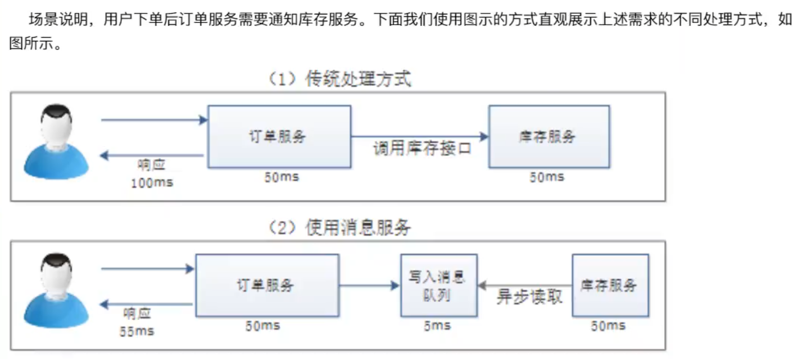

​			如果使用传统方式处理订单业务，用户下单后，订单服务会直接调用库存服务接口进行库存更新，这种方式有一个很大的问题是，一旦库存系统出现异常，订单服务会失败，导致订单丢失。

​			如果使用消息服务模式，订单服务的下订单消息会快速写入消息队列，库存服务会监听并读取到订单，从而修改库存。相对于传统方式，消息服务模式显得更高效可靠。


### 1.2 异步提速

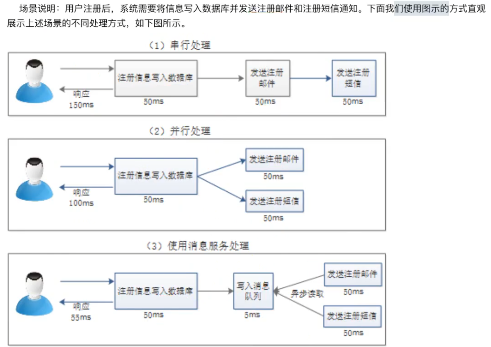

* 串行处理方式：用户发送注册请求后，服务器会先将注册信息写入到数据库，依次发送注册邮件和短信消息，服务器只有在消息处理完毕后才会将处理结果返回给客户端。这种串行处理消息的方式非常耗时，用户体验不友好。
* 并行处理方式：用户发送请注册请求后，将注册信息写入到数据库，同时发送注册邮件和短信，最后返回给客户端。这种并行处理的方式在一定程度上提高了后台业务处理的效率，但如果遇到较为耗时的业务处理，仍显得不够完善。
* 消息服务处理方式：可以在业务中嵌入消息服务中间件进行业务处理，这种方式先将注册信息写入到数据库,在极短的时间内将注册信息写入消息队列后，即可返回响应信息。此时，前端业务不需要理会不相干的后台业务处理，而发送邮件和短信的业务会自动读取消息队列中的相关消息，进行后续业务处理。


### 1.3流量削峰

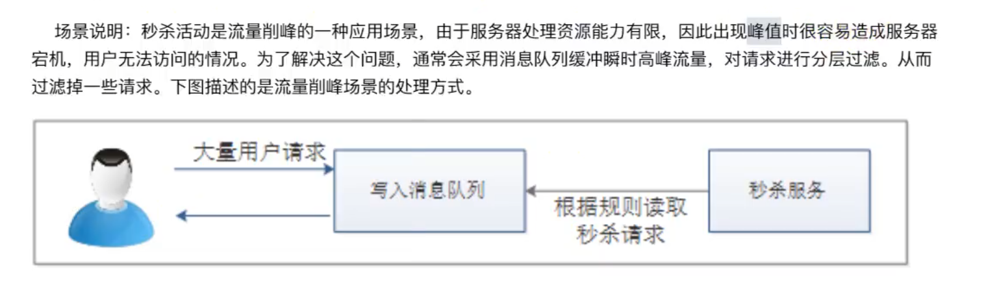

针对上述秒杀业务的场景需求，如果专门增设服务器来应对秒杀活动期间的请求瞬时高峰的话，在非秒杀活动期间，这些多余的服务器和配置显得有些浪费；如果不进行有效处理的话，秒杀活动瞬时高峰流量请求有可能压垮服务，因此在秒杀活动中加入消息服务是较为理想的解决方案。**`通过在前端加入消息服务，先将所有请求写入到消息队列，并限定一定的阈值，多余的请求直接返回秒杀失败，秒杀服务会根据秒杀规则从消息队列中读取并处理有限的秒杀请求。`**


## 二.RabbitMQ

### 2.1 RabbitMQ四大核心

（1）生产者：产生数据、发送消息的程序

（2）交换机：是RabbitMQ非常重要的一个组件，用于**`接收生产者的消息、将消息推送到队列`**；交换机明确的知道如何处理接收到的消息，通过交换机类型来决定推送到特定队列还是丢弃消息

（3）队列：RabbitMQ内部使用的一种数据结构，将消息存储在队列中，仅受内存和磁盘限制，本质上是一个大的消息缓冲区

（4）消费者：大多时候是一个等待接收消息的程序。

> 注意：生产者、消费者、消息中间件并不一定在同一个机器上


#### 2.1.1 队列模式

​			简单模式、工作队列模式、发布订阅模式、路由模式、通配主题模式、RPC模式、发布确认模式

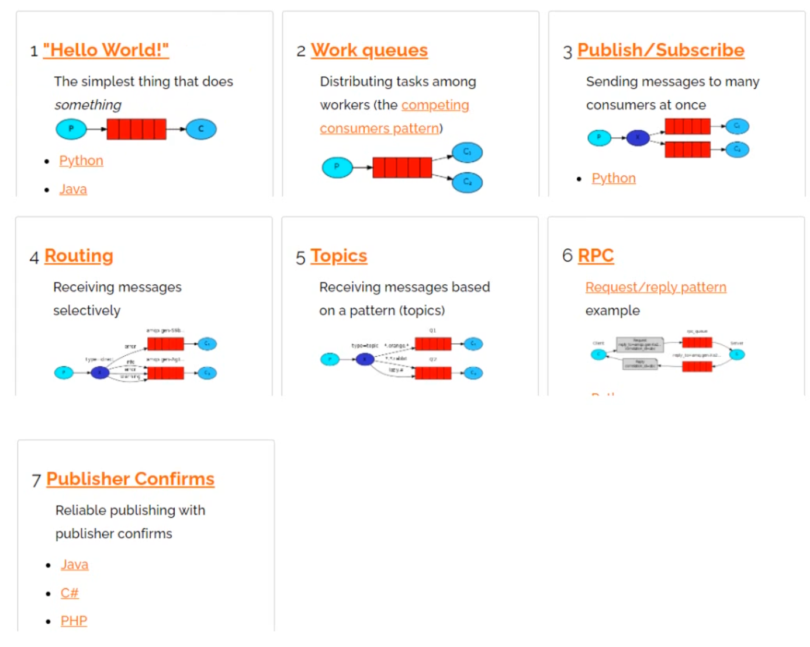


#### 2.1.2 RabbitMQ架构

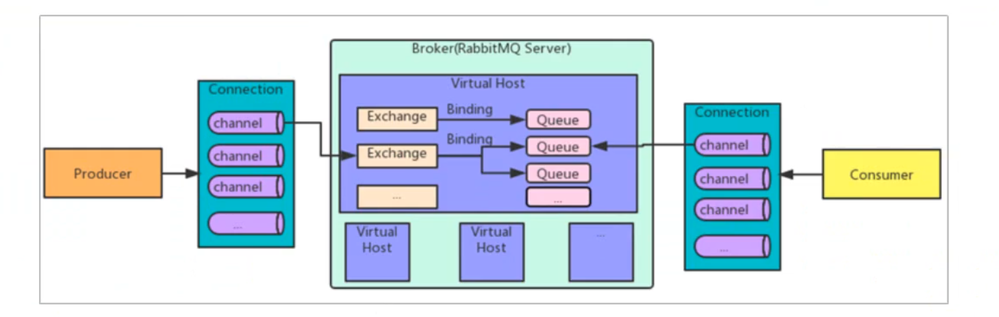


### 2.2 RabbitMQ安装

（1）将下载好的`Erlang`和`RabbitMQ`上传到`/usr/local/software/rabbitmq`目录下（目录不存在则新建）

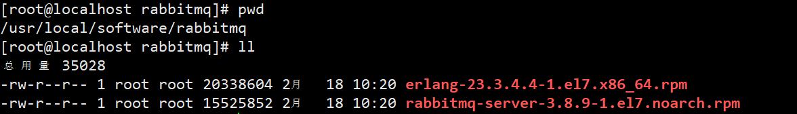


（2）安装Erlang

```bash
cd /usr/local/software/rabbitmq

#安装Erlang
rpm -ivh erlang-23.3.4.4-1.el7.x86_64.rpm --nodeps --force
#查看版本
erl -v
```

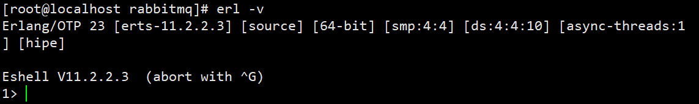


（3）安装RabbitMQ服务依赖

```BASH
yum -y install socat
```


（4）安装RabbitMQ服务

```BASH
rpm -ivh rabbitmq-server-3.8.9-1.el7.noarch.rpm  --nodeps --force
```


### 2.3 RabbitMQ服务命令

#### 2.3.1 启动RabbitMQ服务

```BASH
systemctl start rabbitmq-server
```


#### 2.3.2 关闭RabbitMQ服务

```bash
systemctl stop rabbitmq-server
```


#### 2.3.3 查看RabbitMQ状态

```bash
systemctl status rabbitmq-server
```


#### 2.3.4 重启RabbitMQ服务

```bash
systemctl restart rabbitmq-server
```


#### 2.3.5 开机自启动

```bash
systemctl enable rabbitmq-server
```


#### 2.3.6 关闭服务

```BASH
systemctl stop_app	
```


#### 2.3.7 开启服务

```BASH
systemctl start_app	
```


### 2.4 开启web界面

​			默认情况，RabbitMQ没有安装客户端插件，需要自行安装

（1）安装web管理界面

```BASH
rabbitmq-plugins enable rabbitmq_management
```

（2）重启rabbitmq

```BASH
systemctl restart rabbitmq-server
```

（3）开放端口、访问rabbitmq

```bash
#查看防火墙是否开启,没开启则开启防火墙
#systemctl status firewalld.service 
#systemctl status firewalld.service 

#开放web连接端口
firewall-cmd --zone=public --add-port=15672/tcp --permanent
#开放编码连接端口
firewall-cmd --zone=public --add-port=5672/tcp --permanent
firewall-cmd --reload
```

（4）浏览器输入: linux的IP地址:15672即可

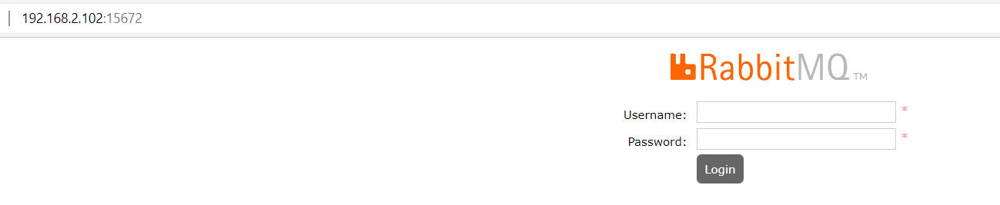 

（5）授权配置

​			RabbitMQ默认情况只有`guest`用户且不支持远程登录，所以需要新增用户进行授权操作

```bash
#新增用户
rabbitmqctl add_user 账号 密码

#设置用户权限
#   administrator:可以登录控制台、查看所有信息、对rabbitmq进行管理
# 	monitoring:可以登录控制台、查看所有信息
# 	policymaker:可以登录控制台、指定策略
# 	management:可以登录控制台
rabbitmqctl set_user_tags 账号 角色权限
```


#### 2.4.1 修改用户密码

```bash
rabbitmqctl change_password 用户名 新密码
```


#### 2.4.2 删除用户

```bash
rabbitmqctl delete_user 用户名
```


#### 2.4.3 查询用户列表

```bash
rabbitmqctl list_user
```


#### 2.4.4 Virtual Hosts管理

​				类似于mysql有数据库的概念并且可以指定用户对库和表等操作的权限。RabbitMQ也有类似的权限管理。在RabbitMQ中有虚拟消息服务器VirtualHost，**`每个VirtualHost相当于一个相对独立的RabbitMQ服务器`**，每个VirtualHost之间是相互隔离的。exchange、queue、message不能互通。 


### 2.5 基于Docker安装

（1）首先查看系统是否启动了rabbitmq服务

```bash
#查看rabbitmq状态
systemctl status rabbitmq-server.service
#如果启动了,则关闭服务;若没有启动就不用执行
systemctl stop rabbitmq-server.service
```


（2）获取rabbitmq镜像

```bash
docker pull  rabbitmq:management
```


（3）创建并运行容器

```bash
docker run -id --name=docker_rabbitmq \
-e RABBITMQ_DEFAULT_USER=admin \
-e RABBITMQ_DEFAULT_PASS=123456 \
-p 15672:15672 \
-p 5672:5672 \
-p 61613:61613 \
-p 1883:1883 \
rabbitmq:management
```


## 三. 队列模式实战（了解）

### 3.1 简单模式

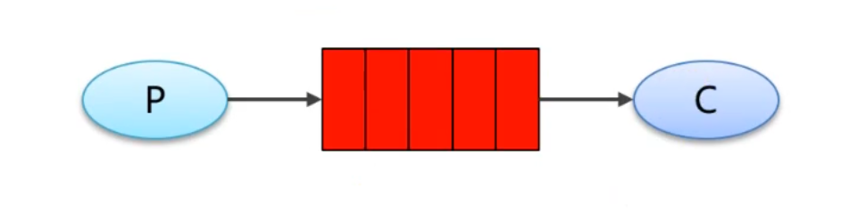

* P：生产者，也就是我们要发送消息的程序
* C：消费者，消息的接收者，会一直等待消息的到来
* Queue：消息队列为红色部分，可以缓存消息；生产者向其中投递消息，消费者从中取出消息


**`简单模式实例`**

#### （1）创建maven项目

```xml
 <!--RabbitMQ依赖-->
        <dependency>
            <groupId>com.rabbitmq</groupId>
            <artifactId>amqp-client</artifactId>
            <version>5.10.0</version>
        </dependency>
```


#### （2）编写生产者

```JAVA
//生产者
public class HelloProducer {

    //队列名称
    public static final String QUEUE_NAME="hello-queue";


    public static void main(String[] args) throws Exception{
        //1.创建工厂对象
        ConnectionFactory factory=new ConnectionFactory();
        //2.设置连接参数
        factory.setHost("192.168.2.102");//服务器IP地址
        factory.setPort(5672);//服务器连接端口
        factory.setVirtualHost("/eobard");//虚拟主机名称
        factory.setUsername("admin");//用户名
        factory.setPassword("123456");//密码

        //3.创建connection对象
        Connection connection = factory.newConnection();

        //4.创建Channel信道对象
        Channel channel = connection.createChannel();

        /**
         * 5.声明队列
         * 参数1:队列名称
         * 参数2:是否持久化队列
         * 参数3:是否独占本次连接
         * 参数4:是否在不使用队列时自动删除
         * 参数5:队列其它参数
         queueDeclare(String queue, boolean durable, boolean exclusive, boolean autoDelete,Map<String, Object> arguments) throws IOException;
         */
        channel.queueDeclare(QUEUE_NAME,true,false,false,null);

        String message="hello rabbitmq~~~";
        /**
         *	6.发送信息
         *   参数1:交换机名称(不填写则使用默认的交换机)
         *   参数2:队列名称(Routing Key,路由key)
         *   参数3:消息持久化
         *   参数4:消息内容
         void basicPublish(String exchange, String routingKey, BasicProperties props, byte[] body) throws IOException;
         */
        channel.basicPublish("",QUEUE_NAME,null,message.getBytes());
    }
}
```


#### （3）编写消费者

```JAVA
//消费者
public class HelloConsumer {
    //队列名称
    public static final String QUEUE_NAME="hello-queue";

    public static void main(String[] args) throws Exception {
        //1.创建工厂对象
        ConnectionFactory factory = new ConnectionFactory();
        //2.设置连接参数
        factory.setHost("192.168.2.102");//服务器IP地址
        factory.setPort(5672);//服务器连接端口
        factory.setVirtualHost("/eobard");//虚拟主机名称
        factory.setUsername("admin");//用户名
        factory.setPassword("123456");//密码

        //3.创建connection对象
        Connection connection = factory.newConnection();

        //4.创建Channel信道对象
        Channel channel = connection.createChannel();

        /**
         * 5.声明队列
         * 参数1:队列名称
         * 参数2:是否持久化队列
         * 参数3:是否独占本次连接
         * 参数4:是否在不使用队列时自动删除
         * 参数5:队列其它参数
         */
        channel.queueDeclare(QUEUE_NAME, true, false, false, null);

        //6.接收消息
        DefaultConsumer consumer=new DefaultConsumer(channel){
            /**
             * 消费回调函数,收到消息后,会自动执行该方法
             * @param consumerTag 消费者标识
             * @param envelope     消息包的内容
             * @param properties   属性信息
             * @param body          消息数据
             */
            @Override
            public void handleDelivery(String consumerTag, Envelope envelope, AMQP.BasicProperties properties, byte[] body) throws IOException {
                System.out.println("路由key = " + envelope.getRoutingKey());
                System.out.println("交换机 = " + envelope.getExchange());
                System.out.println("消息id = " + envelope.getDeliveryTag());
                System.out.println("消息内容 = " + new String(body,"UTF-8"));
            }
        };
        /**
         * 监听消息
         * 参数1:队列名称  
         * 参数2:是否自动确认消息:true表示自动回复MQ接收到了,MQ接收到后会删除消息;false表示手动确认
         * 参数3:消费对象
         String basicConsume(String queue, boolean autoAck, Consumer callback) throws IOException;
         */
        channel.basicConsume(QUEUE_NAME,true,consumer);
    }
}
```

>    **注意：消费者不能释放资源，应该一直监听资源**


#### （4）运行结果

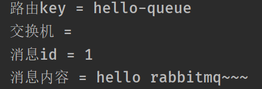


### 3.2 工作队列模式

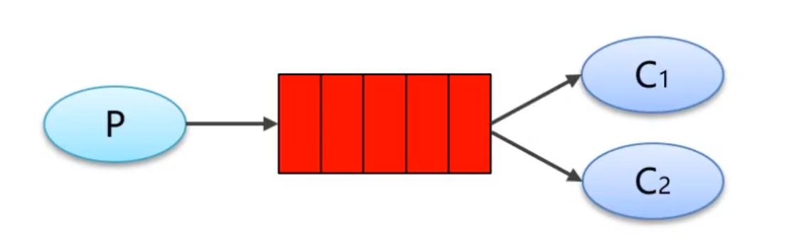

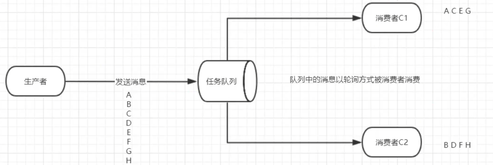


​				在这种模式下，多个消息消费者通过**`轮询的方式依次接收消息队列中存储的消息并且对同一个消息是竞争关系`**，一旦消息被某一个消费者接收，消息队列会将消息移除，而接收并处理消息的消费者必须在消费完一条消息后再准备接收下一条消息。主要应用于**`任务过重或任务较多情况使用工作队列可以提高任务处理的速度`**。


**`工作队列模式实例`**

#### （1）RabbitMQ工具类

```JAVA
//rabbitmq连接工具类
public class RabbitMQUtils {
    //创建工厂对象
    private static ConnectionFactory factory=new ConnectionFactory();

    //服务器端口
    private static final int PORT=5672;

    //服务器IP地址
    private static final String HOST="192.168.2.102";

    //虚拟主机名称
    private static final String VIRTUAL_HOST="/eobard";

    //用户名
    private static final String USER_NAME="admin";

    //密码
    private static final String PASSWORD="123456";

    //获取信道对象
    public static Channel getChannel() throws Exception{
        //设置连接参数
        factory.setHost(HOST);
        factory.setPort(PORT);
        factory.setVirtualHost(VIRTUAL_HOST);
        factory.setUsername(USER_NAME);
        factory.setPassword(PASSWORD);
        //创建connection对象
        Connection connection = factory.newConnection();
        //返回Channel信道对象
       return connection.createChannel();
    }

}
```


#### （2）编写生产者

```JAVA
public class WorkProducer {

   public static final String QUEUE_NAME="work_queue";

    public static void main(String[] args) throws Exception{
        //获取信道对象
        Channel channel = RabbitMQUtils.getChannel();
        //声明队列
        channel.queueDeclare(QUEUE_NAME,true,false,false,null);
        //发送消息
        for (int i = 1; i <11; i++) {
            String message="hello rabbitmq~~~,这是消息"+i;
            channel.basicPublish("",QUEUE_NAME,null,message.getBytes());
        }
        System.out.println("发送完毕");

    }
}
```


#### （3）编写消费者

```java
//消费者1
public class WorkConsumer1 {

    public static void main(String[] args) throws Exception{
        Channel channel = RabbitMQUtils.getChannel();
        /**
         * 声明队列
         * 参数1:队列名称
         * 参数2:是否持久化队列
         * 参数3:是否独占本次连接
         * 参数4:是否在不使用队列时自动删除
         * 参数5:队列其它参数
         */
        channel.queueDeclare(WorkProducer.QUEUE_NAME, true, false, false, null);

        //接收消息
        DefaultConsumer consumer=new DefaultConsumer(channel){
            /**
             * 消费回调函数,收到消息后,会自动执行该方法
             * @param consumerTag 消费者标识
             * @param envelope     消息包的内容
             * @param properties   属性信息
             * @param body          消息数据
             */
            @Override
            public void handleDelivery(String consumerTag, Envelope envelope, AMQP.BasicProperties properties, byte[] body) throws IOException {
                System.out.println("消费者1接收消息: " + new String(body,"UTF-8"));
            }
        };
        /**
         * 监听消息
         * 参数1:队列名称 
         * 参数2:是否自动确认消息:true表示自动回复MQ接收到了,MQ接收到后会删除消息;false表示手动确认
         * 参数3:消费对象
         */
        channel.basicConsume(WorkProducer.QUEUE_NAME,true,consumer);

    }
}
```

```JAVA
//消费者2
public class WorkConsumer2 {

    public static void main(String[] args) throws Exception{
        Channel channel = RabbitMQUtils.getChannel();
        /**
         * 声明队列
         * 参数1:队列名称
         * 参数2:是否持久化队列
         * 参数3:是否独占本次连接
         * 参数4:是否在不使用队列时自动删除
         * 参数5:队列其它参数
         */
        channel.queueDeclare(WorkProducer.QUEUE_NAME, true, false, false, null);

        //接收消息
        DefaultConsumer consumer=new DefaultConsumer(channel){
            /**
             * 消费回调函数,收到消息后,会自动执行该方法
             * @param consumerTag 消费者标识
             * @param envelope     消息包的内容
             * @param properties   属性信息
             * @param body          消息数据
             */
            @Override
            public void handleDelivery(String consumerTag, Envelope envelope, AMQP.BasicProperties properties, byte[] body) throws IOException {
                System.out.println("消费者2接收消息: " + new String(body,"UTF-8"));
            }
        };
        /**
         * 监听消息
         * 参数1:队列名称  
         * 参数2:是否自动确认消息:true表示自动回复MQ接收到了,MQ接收到后会删除消息;false表示手动确认
         * 参数3:消费对象
         */
        channel.basicConsume(WorkProducer.QUEUE_NAME,true,consumer);

    }
}
```


#### （4）运行结果

> **注意：`首先要运行两个消费者的程序，然后再运行生产者`；如果首先运行生产者，再运行其中一个消费者会让该消费者接收全部消息！**

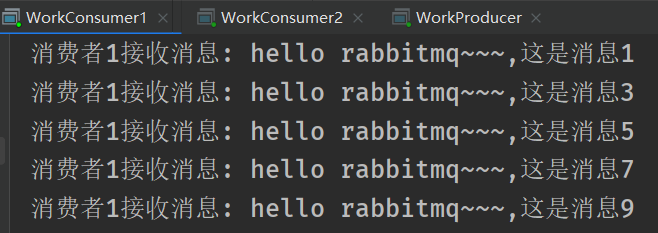

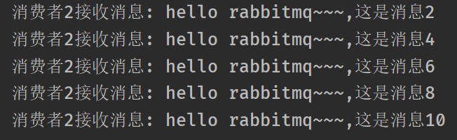


### 3.3 发布/订阅模式

​				——广播模式

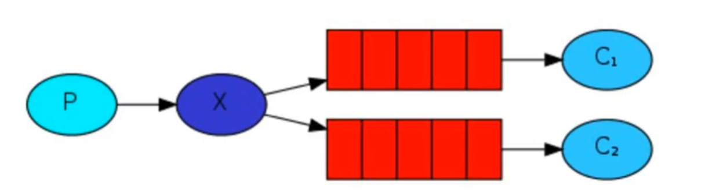

* P：生产者，也就是要发送消息的程序，但是不再发送到队列中，而是发给X (交换机)
* C：消费者，消息的接受者，会一直等待消息到来。
* Queue：消息队列，接收消息、缓存消息。
* Exchange： 交换机，图中的X。**`一方面，接收生产者发送的消息；另一方面，知道如何处理消息`**，例如递交给某个特别队列、递交给所有队列、或是将消息丢弃。到底如何操作，取决于Exchange的类型。
  * Fanout：广播，将消息交给所有绑定到交换机的队列
  * Direct:：定向，把消息交给符合指定routing key的队列
  * Topic:：通配符，把消息交给符合routing pattern (路由模式)的队列

> **该工作模式适用于进行相同业务功能处理的场合。例如，用户注册成功后，需要同时发送邮件通知和短信通知，那么邮件服务消费者和短信服务消费者需要共同消费“用户注册成功”这一条消息。**


#### （1）编写生产者

```java
public class Producer {

    //交换机名称
    public static final String fanout_exchange="fanout_exchange";

    //队列名称
    public static final String fanout_queue1="fanout_queue1";
    public static final String fanout_queue2="fanout_queue2";


    public static void main(String[] args) throws Exception {
        //获取信道
        Channel channel = RabbitMQUtils.getChannel();
        //声明交换机(交换机名称、交换机类型)
        channel.exchangeDeclare(fanout_exchange, BuiltinExchangeType.FANOUT);
        //声明两个队列
        channel.queueDeclare(fanout_queue1,true,false,false,null);
        channel.queueDeclare(fanout_queue2,true,false,false,null);
        //将两个队列和交换机绑定
        channel.queueBind(fanout_queue1,fanout_exchange,"");
        channel.queueBind(fanout_queue2,fanout_exchange,"");
        //发送消息
        for (int i = 1; i <=10; i++) {
            String message="你好,mq-"+i;
            channel.basicPublish(fanout_exchange,"",null,message.getBytes());
        }
        System.out.println("sending os");
    }
}
```


#### （2）编写消费者

```java
//消费者1
public class Consumer1 {

    public static void main(String[] args) throws Exception {
        //获取信道对象
        Channel channel= RabbitMQUtils.getChannel();
        //声明交换机(交换机名称、交换机类型)
        channel.exchangeDeclare(Producer.fanout_exchange, BuiltinExchangeType.FANOUT);
        //声明队列
        channel.queueDeclare(Producer.fanout_queue1,true,false,false,null);
        //将队列和交换机绑定
        channel.queueBind(Producer.fanout_queue1,Producer.fanout_exchange,"");
        //接收消息
        DefaultConsumer consumer=new DefaultConsumer(channel){
            @Override
            public void handleDelivery(String consumerTag, Envelope envelope, AMQP.BasicProperties properties, byte[] body) throws IOException {
                System.out.println("消费者1接收消息: " + new String(body,"UTF-8"));
            }
        };
         //监听消息
        channel.basicConsume(Producer.fanout_queue1,true,consumer);
    }
}
```

```java
//消费者2
public class Consumer2 {

    public static void main(String[] args) throws Exception {
        //获取信道对象
        Channel channel= RabbitMQUtils.getChannel();
        //声明交换机(交换机名称、交换机类型)
        channel.exchangeDeclare(Producer.fanout_exchange, BuiltinExchangeType.FANOUT);
        //声明队列
        channel.queueDeclare(Producer.fanout_queue2,true,false,false,null);
        //将队列和交换机绑定
        channel.queueBind(Producer.fanout_queue2,Producer.fanout_exchange,"");
        //接收消息
        DefaultConsumer consumer=new DefaultConsumer(channel){
            @Override
            public void handleDelivery(String consumerTag, Envelope envelope, AMQP.BasicProperties properties, byte[] body) throws IOException {
                System.out.println("消费者2接收消息: " + new String(body,"UTF-8"));
            }
        };
         //监听消息
        channel.basicConsume(Producer.fanout_queue2,true,consumer);
    }
}
```


#### （3）运行结果

 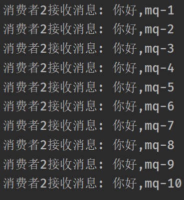 


### 3.4 路由模式

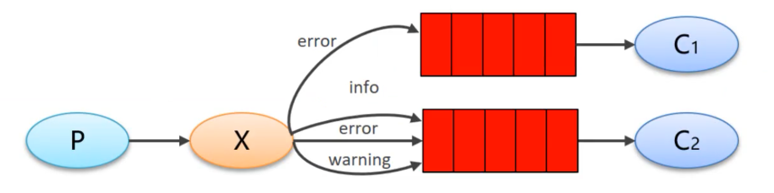

​				从上面的分析可以发现，工作模式适用于进行不同类型消息分类处理的场合。例如，日志收集处理可以配置不同的路由键值，分别对不同级别的日志信息进行分类处理。

> Routing 模式要求队列在绑定交换机时要指定routing key，消息会转发到符合routing key的队列。


#### （1）编写生产者

```JAVA
public class Producer {

    public static final String DIRECT_QUEUE_1="direct_queue1";
    public static final String DIRECT_QUEUE_2="direct_queue2";
    public static final String DIRECT_EXCHANGE="direct_exchange";

    public static void main(String[] args)  throws Exception{
        Channel channel = RabbitMQUtils.getChannel();
        //声明交换机(交换机名称、交换机类型、是否持久化)
        channel.exchangeDeclare(DIRECT_EXCHANGE, BuiltinExchangeType.DIRECT,true);
        //声明两个队列
        channel.queueDeclare(DIRECT_QUEUE_1,true,false,false,null);
        channel.queueDeclare(DIRECT_QUEUE_2,true,false,false,null);

        //将交换机与队列进行绑定
        //队列1绑定交换机
        channel.queueBind(DIRECT_QUEUE_1,DIRECT_EXCHANGE,"error");
        //队列2绑定交换机
        channel.queueBind(DIRECT_QUEUE_2,DIRECT_EXCHANGE,"info");
        channel.queueBind(DIRECT_QUEUE_2,DIRECT_EXCHANGE,"error");
        channel.queueBind(DIRECT_QUEUE_2,DIRECT_EXCHANGE,"warning");

        //准备消息
        String message="日志信息：xxxxx调用了xxxx(),日志级别:error";
        //发送消息
        channel.basicPublish(DIRECT_EXCHANGE,"error",null,message.getBytes());
        System.out.println("sending ok");
    }
}
```


#### （2）编写消费者

```JAVA
public class Consumer1 {
    public static void main(String[] args) throws Exception{
        //获取信道对象
        Channel channel= RabbitMQUtils.getChannel();
        //接收消息
        DefaultConsumer consumer=new DefaultConsumer(channel){
            @Override
            public void handleDelivery(String consumerTag, Envelope envelope, AMQP.BasicProperties properties, byte[] body) throws IOException {
                System.out.println("消费者1接收消息: " + new String(body,"UTF-8"));
                System.out.println("消费者1保存到DB");
            }
        };
        //监听消息
        channel.basicConsume(Producer.DIRECT_QUEUE_1,true,consumer);
    }
}
```

```JAVA
public class Consumer2 {
    public static void main(String[] args) throws Exception{
        //获取信道对象
        Channel channel= RabbitMQUtils.getChannel();
        //接收消息
        DefaultConsumer consumer=new DefaultConsumer(channel){
            @Override
            public void handleDelivery(String consumerTag, Envelope envelope, AMQP.BasicProperties properties, byte[] body) throws IOException {
                System.out.println("消费者2接收消息: " + new String(body,"UTF-8"));
                System.out.println("消费者2输出到console");
            }
        };
        //监听消息
        channel.basicConsume(Producer.DIRECT_QUEUE_2,true,consumer);
    }
}
```


#### （3）运行结果

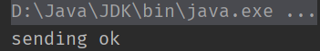 

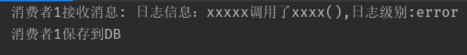 

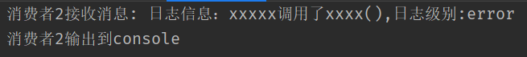 


### 3.5 主题/通配符模式

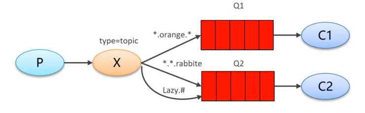

​				Topics模式和Routing模式的主要不同在于：Topics模式设置的路由键是包含通配符的，其中`#`表示匹配0 ~ n个词，`*`表示匹配0 ~ 1个词，与其他字符一起使用`.`进行连接，从而组成动态路由键，在发送消息时可以根据需求设置不同的路由键，从而将消息路由到不同的消息队列。
​				通常情况下，Topics工作模式适合用于根据不同需求动态传递处理业务的场合。例如，一些订阅客户只接收邮件消息，一些订阅客户只接收短信消息，那么可以根据客户需求进行动态路由匹配，从而将订阅消息分发到不同的消息队列中。


#### （1）编写生产者

```JAVA
public class Producer {

    public static final String TOPIC_QUEUE_1="topic_queue1";
    public static final String TOPIC_QUEUE_2="topic_queue2";
    public static final String TOPIC_EXCHANGE="topic_exchange";

    public static void main(String[] args)  throws Exception{
        Channel channel = RabbitMQUtils.getChannel();
        //声明交换机(交换机名称、交换机类型、是否持久化)
        channel.exchangeDeclare(TOPIC_EXCHANGE, BuiltinExchangeType.TOPIC,true);
        //声明两个队列
        channel.queueDeclare(TOPIC_QUEUE_1,true,false,false,null);
        channel.queueDeclare(TOPIC_QUEUE_2,true,false,false,null);

        //将交换机与队列进行绑定
        //队列1绑定交换机
        channel.queueBind(TOPIC_QUEUE_1,TOPIC_EXCHANGE,"#.mq");
        //队列2绑定交换机
        channel.queueBind(TOPIC_QUEUE_2,TOPIC_EXCHANGE,"rabbit.*");
        channel.queueBind(TOPIC_QUEUE_2,TOPIC_EXCHANGE,"*.*");

        //准备消息
        String message="日志信息：xxxxx调用了xxxx(),日志级别:error";
        //发送消息
        channel.basicPublish(TOPIC_EXCHANGE,"test.rabbit.mq",null,message.getBytes());
        System.out.println("sending ok");
    }
}
```


#### （2）编写消费者

```java
public class Consumer1 {
    public static void main(String[] args) throws Exception{
        //获取信道对象
        Channel channel= RabbitMQUtils.getChannel();
        //接收消息
        DefaultConsumer consumer=new DefaultConsumer(channel){
            @Override
            public void handleDelivery(String consumerTag, Envelope envelope, AMQP.BasicProperties properties, byte[] body) throws IOException {
                System.out.println("消费者1接收消息: " + new String(body,"UTF-8"));
            }
        };
        //监听消息
        channel.basicConsume(Producer.TOPIC_QUEUE_1,true,consumer);
    }
}
```

```JAVA
public class Consumer2 {
    public static void main(String[] args) throws Exception{
        //获取信道对象
        Channel channel= RabbitMQUtils.getChannel();
        //接收消息
        DefaultConsumer consumer=new DefaultConsumer(channel){
            @Override
            public void handleDelivery(String consumerTag, Envelope envelope, AMQP.BasicProperties properties, byte[] body) throws IOException {
                System.out.println("消费者2接收消息: " + new String(body,"UTF-8"));
            }
        };
        //监听消息
        channel.basicConsume(Producer.TOPIC_QUEUE_2,true,consumer);
    }
}
```


#### （3）运行结果

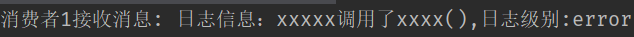 

> 发现`test.rabbit.mq`只匹配到了队列1的`#.mq`，所以只有队列1可以消费信息


### 3.6 发布、确认模式

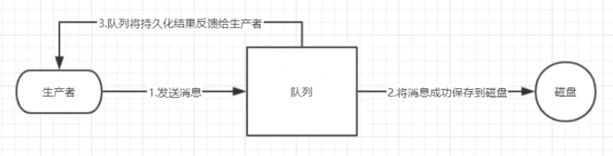

​			生产者将信道(channel)设置成confrm模式，一旦信道进入confirm模式，所有在该信道上面发布的消息都将会被指派一个唯一的ID(从1开始)，一旦消息被投递到所有匹配的队列之后，broker就会发送一个确认给生产者(包含消息的唯一ID)，这就使得生产者知道消息已经正确到达目的队列了，如果消息和队列是可持久化的，那么确认消息会在将消息写入磁盘之后发出，broker回传给生产者的确认消息中delivery-tag 域包含了确认消息的序列号，此外broker也可以设置basic.ack的 multiple域，表示到这个序列号之前的所有消息都已经得到了处理。

> **三大条件：声明队列必须持久化、队列消息必须持久化、发布确认**


#### 3.6.1 单个确认发布

​				单个确认发布是一种简单的确认方式，它是一种`同步确认发布`的方式且`发布速度特别慢`，也就是发布一个消息之后，只有它被确认发布，后续的消息才能继续发布;如果在指定时间范围内这个消息没有被确认那么它将抛出异常。**这种方案是同步的，一样阻塞消息的发布**

```JAVA
public class SingleConfirm {
    public static void main(String[] args)throws Exception {
        //获取信道对象
        Channel channel = RabbitMQUtils.getChannel();
        //开启发布确认模式
        channel.confirmSelect();
        //声明队列
        String queueName = UUID.randomUUID().toString();
        channel.queueDeclare(queueName,true,false,false,null);
        //记录开始时间
        long start = System.currentTimeMillis();
        //发送消息
        for (int i = 0; i < 1000; i++) {
            channel.basicPublish("",queueName, MessageProperties.PERSISTENT_TEXT_PLAIN,("消息"+i).getBytes());
            
            //进行确认
            if(channel.waitForConfirms()){
                System.out.println("消息"+i+" 发送成功");
            } else {
                System.out.println("===消息"+i+"发送失败===");
            }
        }
        //结束时间
        long end = System.currentTimeMillis();
        System.out.println("耗时"+(end-start));
    }
}
```

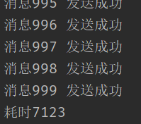


#### 3.6.2 批量确认发布

​				单个确认发布方式非常慢，与单个确认相比，先发布一批消息然后一起确认可以极大地提高吞吐量，这种方式的缺点就是: `当发生故障导致发布出现问题时，无法得知是哪个消息出现问题了`，我们必须将整个批处理保存在内存中，以记录重要的信息后重新发布消息。**当然这种方案仍然是同步的，也一样阻塞消息的发布。**

```JAVA
public class BatchConfirm {
    public static void main(String[] args)throws Exception {
        //获取信道对象
        Channel channel = RabbitMQUtils.getChannel();
        //开启发布确认模式
        channel.confirmSelect();
        //声明队列
        String queueName = UUID.randomUUID().toString();
        channel.queueDeclare(queueName,true,false,false,null);
        //批量确认消息数量
        int batchSize=100;
        //未确认消息数量
        int nackMessageCount=0;
        //记录开始时间
        long start = System.currentTimeMillis();
        //发送消息
        for (int i = 0; i < 1000; i++) {
            channel.basicPublish("",queueName, MessageProperties.PERSISTENT_TEXT_PLAIN,("消息"+i).getBytes());
            //累加未确认消息数量
            nackMessageCount++;
            //判断未确认消息数量和批量数量是否一致
            if(nackMessageCount==batchSize){
                if(channel.waitForConfirms()){
                    System.out.println("消息"+i+" 发送成功");
                } else {
                    System.out.println("===消息"+i+"发送失败===");
                }
            }
            //清空未确认发布个数
            nackMessageCount=0;
        }
        //为了确保剩余没有消息,进行再次确认
        if(nackMessageCount>0){
            //再次确认
            channel.waitForConfirms();
        }
        //结束时间
        long end = System.currentTimeMillis();
        System.out.println("耗时"+(end-start));
    }
}
```

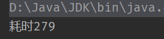


#### 3.6.3 异步确认发布(重点)

​				异步确认虽然编程逻辑比上两个要复杂，但是`性价比最高，无论是可靠性还是效率方面，它是利用回调函数来达到消息可靠性传递的`，这个中间件也是通过函数回调来保证是否投递成功。

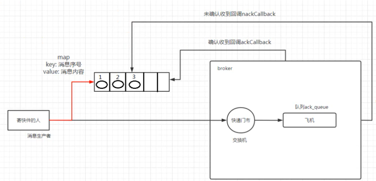

```JAVA
public class AsyncConfirm {
    public static void main(String[] args) throws Exception{
        //获取信道对象
        Channel channel = RabbitMQUtils.getChannel();
        //开启发布确认模式
        channel.confirmSelect();
        //声明队列
        String queueName = UUID.randomUUID().toString();
        channel.queueDeclare(queueName,true,false,false,null);

        //创建跳表集合
        ConcurrentSkipListMap<Long,String> concurrentSkipListMap=new ConcurrentSkipListMap<>();

        //确认回调函数
        ConfirmCallback ackCallBack=(deliveryTag, multiple)->{
            //判断是否为批量操作
            if(multiple){
                //将集合中未确认的消息id添加到集合中
                ConcurrentNavigableMap<Long, String> confirmMap = concurrentSkipListMap.headMap(deliveryTag, true);
                //将未确认的消息清除
                confirmMap.clear();
            }else {
                //不是批量确认，只清除当前未被确认消息即可
                concurrentSkipListMap.remove(deliveryTag);
            }
        };
        //未确认回调函数
        ConfirmCallback nackCallBack= (deliveryTag, multiple) -> {
            //获取未被确认的消息
            String message = concurrentSkipListMap.get(deliveryTag);
            System.out.println(message+"未被确认");
            try {
                //再次进行确认
                channel.waitForConfirms();
            } catch (InterruptedException e) {
                e.printStackTrace();
            }
        };

        //添加异步确认监听器(确认回调函数，未确认回调函数)
        channel.addConfirmListener(ackCallBack,nackCallBack);

        //记录开始时间
        long start=System.currentTimeMillis();
        for (int i = 0; i < 1000; i++) {
            //准备消息
            String message="消息"+i;
            //将未确认的消息放到集合中，通过序列号与消息关联
            concurrentSkipListMap.put(channel.getNextPublishSeqNo(),message);
            //发送消息
            channel.basicPublish("",queueName, MessageProperties.PERSISTENT_TEXT_PLAIN,message.getBytes("UTF-8"));
        }
        long end=System.currentTimeMillis();
        System.out.println("耗时："+(end-start));
    }
}
```


## 四.消息应答

​				消费者完成一个任务可能需要一 段时间， 如果其中一个消费者处理一个长的任务并且只完成 了部分突然它挂掉了，会发生什么情况？RabbitMQ 一旦向消费者传递了一条消息，便立即将该消息标记为删除。在这种情况下，突然有个消费者挂掉了，我们将丢失正在处理的消息。以及后续发送给该消费者的消息，因为它无法接收到。为了保证消息在发送过程中不丢失，RabbitMQ引入消息应答机制，==消息应答就是消费者在接收到消息并且处理该消息之后，告诉RabbitMQ它已经处理了，RabbitMQ可以把该消息从队列中删除了==。


### 4.1 手动应答

​			消费者从队列中消费消息可以采用手动应答，自动应答可能会导致消息未完全消费从而导致消息失效。使用手动应答的好处是可以批量应答并且减少网络拥堵。以下3个方法用于手动应答消息:

* `Channel.basicAck(long deliveryTag, boolean multiple):` 用于肯定确认，即RabbitMQ已经知道该消息被消费且成功处理消息，可以将其丢弃
* `Channel.basicNack():` 用于否定确认。
* `Channel.basicReject(long deliveryTag, boolean requeue):` 用于否定确认，与Channel.basicNack( )方法相比少一个参数，即不处理该消息直接拒绝，随后将消息丢弃。

> 注意：开发中最好使用手动应答比较好！


### 4.2 消息自动重新入队机制

​			如果消费者由于某些原因失去连接(其通道已关闭，连接已关闭或TCP连接丢失)，导致消息未发送`ACK确认`,
RabbitMQ将了解到消息末完全处理，并将对其重新排队。如果此时其它消费者可以处理，它将很快将其重新分发给另一个消费者。这样，即使某个消费者偶尔死亡，也可以确保不会丢失任何消息。

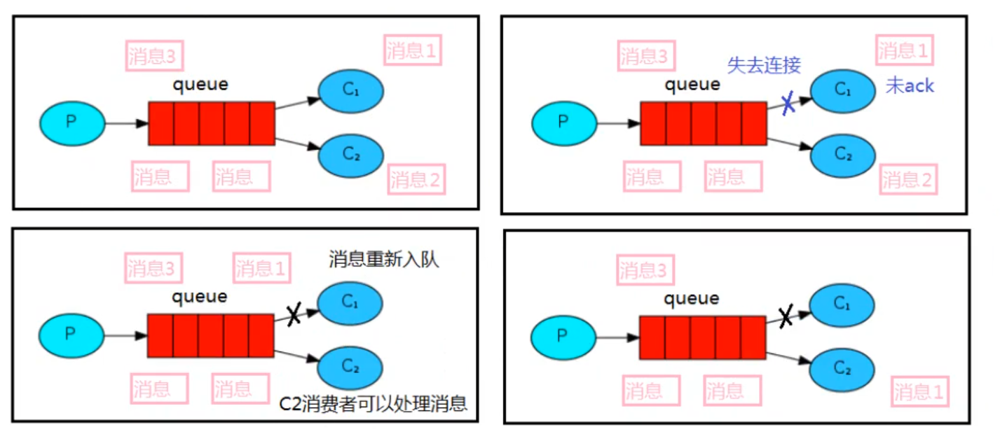


#### （1）编写生产者

```JAVA
public class WorkProducer1 {

   public static final String QUEUE_NAME="ack-work_queue";

    public static void main(String[] args) throws Exception{
        Channel channel = RabbitMQUtils.getChannel();
        channel.queueDeclare(QUEUE_NAME,true,false,false,null);
        for (int i = 1; i <11; i++) {
            String message="hello rabbitmq~~~,这是消息"+i;
            channel.basicPublish("",QUEUE_NAME,null,message.getBytes());
        }
        System.out.println("发送完毕");

    }
}
```


#### （2）编写消费者

```JAVA
//消费者1
public class WorkConsumer3 {

    public static void main(String[] args) throws Exception{
        final Channel channel = RabbitMQUtils.getChannel();
        channel.queueDeclare(WorkProducer1.QUEUE_NAME, true, false, false, null);

        //接收消息
        DefaultConsumer consumer=new DefaultConsumer(channel){
            @Override
            public void handleDelivery(String consumerTag, Envelope envelope, AMQP.BasicProperties properties, byte[] body) throws IOException {
                try {
                    //线程睡眠1s
                    Thread.sleep(1000);
                } catch (InterruptedException e) {
                    e.printStackTrace();
                }

                System.out.println("消费者1接收消息: " + new String(body,"UTF-8"));
                //开启手动应答
                //参数1:消息的id,参数2:是否批量手动确认
                channel.basicAck(envelope.getDeliveryTag(),false);
            }
        };
        /**
         * 监听消息
         * 参数1:队列名称  
         * 参数2:是否自动确认消息:true表示自动回复MQ接收到了,MQ接收到后会删除消息;false表示手动确认
         * 参数3:消费对象
         */
        channel.basicConsume(WorkProducer1.QUEUE_NAME,false,consumer);

    }
}
```

```JAVA
//消费者2
public class WorkConsumer4 {

    public static void main(String[] args) throws Exception{
        final Channel channel = RabbitMQUtils.getChannel();
        channel.queueDeclare(WorkProducer1.QUEUE_NAME, true, false, false, null);

        //接收消息
        DefaultConsumer consumer=new DefaultConsumer(channel){
            @Override
            public void handleDelivery(String consumerTag, Envelope envelope, AMQP.BasicProperties properties, byte[] body) throws IOException {
                try {
                    //线程睡眠30s
                    Thread.sleep(30000);
                } catch (InterruptedException e) {
                    e.printStackTrace();
                }

                System.out.println("消费者1接收消息: " + new String(body,"UTF-8"));
                 //开启手动应答
                //参数1:消息的id,参数2:是否批量手动确认
                channel.basicAck(envelope.getDeliveryTag(),false);
            }
        };
        /**
         * 监听消息
         * 参数1:队列名称  
         * 参数2:是否自动确认消息:true表示自动回复MQ接收到了,MQ接收到后会删除消息;false表示手动确认
         * 参数3:消费对象
         */
        channel.basicConsume(WorkProducer1.QUEUE_NAME,false,consumer);

    }
}
```


#### （3）运行结果

> 注意：首先将两个消费者运行，然后再运行生产者；**`并且让消费者2接收一条消息后立即强制关闭它的线程`**，再次查看消费者1的结果


## 五.RabbitMQ持久化

### 5.1 队列持久化	

​			前面我们已经学习了如何处理任务不丢失的情况，但是如何保障RabbitMQ服务停掉后消息生产者发送过来的消息不丢失呢？默认情况下，RabbitMQ服务宕机或由于某种原因崩溃时，它会忽略队列中的消息。如果要确保消息不会丢失，则需要将队列和消息都标识为持久化。

```JAVA
  /**
	* 声明队列
	* 参数1:队列名称
 	* 参数2:是否持久化队列
    * 参数3:是否独占本次连接
    * 参数4:是否在不使用队列时自动删除
    * 参数5:队列其它参数
   */  
Channel queueDeclare(String,Boolean,Boolean,Boolean,Map);
```


### 5.2 消息持久化

​		 如果要实现消息持久化，需要在消息生产者发送消息时设置`MessageProperties.PERSISTENT_TEXT_PLAIN`属性，如下代码所示:

```JAVA
 /**
   *   参数1:交换机名称(不填写则使用默认的交换机)
   *   参数2:队列名称(Routing Key,路由key)
   *   参数3:消息持久化
   *   参数4:消息内容
   */
channel.basicPublish();
```

​			将消息标记为持久化并不能完全保证不会丢失消息，尽管它告诉RabbitMQ将消息保存到磁盘，但是依然存在当消息刚准备存储在磁盘的时候没有真正写入磁盘。持久性保证并不强，但是对于我们的简单任务队列而言，这已经绰绰有余了。如果需要更强有力的持久化策略,则可以使用发布确认模式。


### 5.3 不公平分发

​			最开始的时候学习到RabbitMQ分发消息采用的轮询分发，但是在某种场景下这种策略并不是很好，例如:有两个消费者在处理任务，其中有个消费者1处理任务的速度非常快，而另外一个消费者2处理速度却很慢，此时采用轮询分发的话，处理速度快的这个消费者很大一部分时间处于空闲状态，而处理慢的那个消费者一直在干活，这种分配方式在这种情况下其实就不太好，但是RabbitMQ并不知道这种情况它依然很公平的进行分发。为了避免这种情况，我们可以在两个消费者消费消息前都设置参数`channel. basicQos(1)`。

```java
  		//省略其它代码
		//设置不公平分发
        channel.basicQos(1);
        channel.basicConsume(WorkProducer1.QUEUE_NAME,false,consumer);
```


## 六. 死信队列

​			队列中无法被消费的消息称为死信队列，一般来说，producer(生产者)将消息投递到broker或者直接到queue(队列)中，consumer(消费者)从queue取出消息进行消费，但某些时候由于特定的原因导致queue中的某些消息无法被消费，该队列中无法被消费的消息后期没有进行处理，就变死信队列，死信队列中的消息称为了死信。

​			应用场景：为了保证订单业务的消息数据不丢失，需要使用到RabbitMQ的死信队列机制，当消息消费发生异常时，将消息投入死信队列中。例如:用户在商城下单成功并点击去支付后在指定时间未支付时自动失效

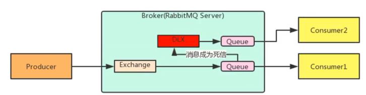


队列中的消息成为死信消息的三种情况：

* 队列消息长度到达限制
* 消费者拒绝消费消息，basicNack / basicReject ，并且不把消息重新放入原目标队列(requeue=false)
* 原队列存在消息过期设置(TTL，time to live)，消息到达超时时间未被消费。

> **注意: 只要符合上述三种情况的任何一种，队列就会变成死信队列。**


### 6.1 TTL过期

#### （1）编写生产者

```JAVA
public class Producer {

    public static final String normal_exchange="normal_exchange";

    public static void main(String[] args) throws Exception{
        //获取信道
        Channel channel = RabbitMQUtils.getChannel();
        //声明交换机和队列
        channel.exchangeDeclare(normal_exchange, BuiltinExchangeType.DIRECT);
        //设置TTL有效期:10s
        AMQP.BasicProperties properties = new AMQP.BasicProperties()
                                            .builder()
                                            .expiration("10000")
                                            .build();
        //发送消息
        for (int i = 0; i < 10; i++) {
            String message="消息"+i;
            //发送消息
            channel.basicPublish(normal_exchange,"normal",properties,message.getBytes("UTF-8"));
        }
    }
}
```


#### （2）编写消费者

```java
public class Consumer1 {

    //声明正常交换机、死信交换机
    public static final String normal_exchange="normal_exchange";
    public static final String dead_exchange="dead_exchange";

    //声明正常队列、死信队列
    public static final String normal_queue="normal_queue";
    public static final String dead_queue="dead_queue";

    public static void main(String[] args) throws Exception{
        //获取信道
        Channel channel = RabbitMQUtils.getChannel();
        //声明交换机
        channel.exchangeDeclare(normal_exchange, BuiltinExchangeType.DIRECT);
        channel.exchangeDeclare(dead_exchange,BuiltinExchangeType.DIRECT);

        Map<String,Object> map=new HashMap();
        //设置正常队列与死信交换机绑定,K不可改
        map.put("x-dead-letter-exchange",dead_exchange);
        //设置路由key,K不可改
        map.put("x-dead-letter-routing-key","dead");

        //声明正常队列、绑定死信交换机相关信息
        channel.queueDeclare(normal_queue,true,false,false,map);
        channel.queueBind(normal_queue,normal_exchange,"normal");

        //声明死信队列
        channel.queueDeclare(dead_queue,true,false,false,null);
        channel.queueBind(dead_queue,dead_exchange,"dead");


        //正常消费消息
        DefaultConsumer consumer=new DefaultConsumer(channel){
            @Override
            public void handleDelivery(String consumerTag, Envelope envelope, AMQP.BasicProperties properties, byte[] body) throws IOException {
                System.out.println("正常消费者1接收消息: " + new String(body,"UTF-8"));
            }
        };

        //监听消息
        channel.basicConsume(normal_queue,true,consumer);
    }
}
```

```JAVA
public class Consumer2 {

     //声明死信交换机、死信队列
    public static final String dead_exchange="dead_exchange";
    public static final String dead_queue="dead_queue";

    public static void main(String[] args) throws Exception{
        //获取信道
        Channel channel = RabbitMQUtils.getChannel();
        //声明死信交换机
        channel.exchangeDeclare(dead_exchange,BuiltinExchangeType.DIRECT);
        //声明死信队列
        channel.queueDeclare(dead_queue,true,false,false,null);
        channel.queueBind(dead_queue,dead_exchange,"dead");


        //消费消息
        DefaultConsumer consumer=new DefaultConsumer(channel){
            @Override
            public void handleDelivery(String consumerTag, Envelope envelope, AMQP.BasicProperties properties, byte[] body) throws IOException {
                System.out.println("死信队列接收消息: " + new String(body,"UTF-8"));
            }
        };

        //监听消息
        channel.basicConsume(dead_queue,true,consumer);
    }
}
```


#### （3）运行结果

* **首先运行消费者1，之后关闭进程**
* 运行生产者，查看效果，发现正常队列有10条信息，等待10s后再次观看

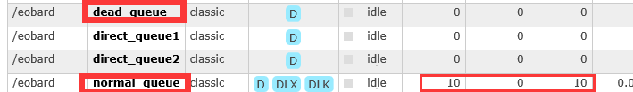

* 10s后发现正常队列的消息进入死信队列

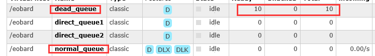

* 运行消费者2，让消费者2消费死信队列的消息


### 6.2 限制队列长度

#### （1）编写生产者

```JAVA
public class Producer {

    public static final String normal_exchange="normal_exchange";

    public static void main(String[] args) throws Exception{
        //获取信道
        Channel channel = RabbitMQUtils.getChannel();
        //声明交换机和队列
        channel.exchangeDeclare(normal_exchange, BuiltinExchangeType.DIRECT);
        //发送消息
        for (int i = 0; i < 10; i++) {
            String message="消息"+i;
            //发送消息
            channel.basicPublish(normal_exchange,"normal",null,message.getBytes("UTF-8"));
        }
    }
}
```


#### （2）编写消费者

```java
public class Consumer1 {

    public static final String normal_exchange="normal_exchange";
    public static final String dead_exchange="dead_exchange";

    public static final String normal_queue="normal_queue";
    public static final String dead_queue="dead_queue";

    public static void main(String[] args) throws Exception{
        Channel channel = RabbitMQUtils.getChannel();
        channel.exchangeDeclare(normal_exchange, BuiltinExchangeType.DIRECT);
        channel.exchangeDeclare(dead_exchange,BuiltinExchangeType.DIRECT);

        Map<String,Object> map=new HashMap();
        //设置正常队列与死信交换机绑定,K不可改
        map.put("x-dead-letter-exchange",dead_exchange);
        //设置路由key,K不可改
        map.put("x-dead-letter-routing-key","dead");
        //设置队列最大长度
        map.put("x-max-length",6);

        channel.queueDeclare(normal_queue,true,false,false,map);
        channel.queueBind(normal_queue,normal_exchange,"normal");

        channel.queueDeclare(dead_queue,true,false,false,null);
        channel.queueBind(dead_queue,dead_exchange,"dead");


        //消费消息
        DefaultConsumer consumer=new DefaultConsumer(channel){
            @Override
            public void handleDelivery(String consumerTag, Envelope envelope, AMQP.BasicProperties properties, byte[] body) throws IOException {
                System.out.println("消费者1接收消息: " + new String(body,"UTF-8"));
            }
        };

        //监听消息
        channel.basicConsume(normal_queue,true,consumer);
    }
}
```

```JAVA
public class Consumer2 {

    public static final String dead_exchange="dead_exchange";
    public static final String dead_queue="dead_queue";

    public static void main(String[] args) throws Exception{
        Channel channel = RabbitMQUtils.getChannel();
        channel.exchangeDeclare(dead_exchange,BuiltinExchangeType.DIRECT);

        channel.queueDeclare(dead_queue,true,false,false,null);
        channel.queueBind(dead_queue,dead_exchange,"dead");


        //消费消息
        DefaultConsumer consumer=new DefaultConsumer(channel){
            @Override
            public void handleDelivery(String consumerTag, Envelope envelope, AMQP.BasicProperties properties, byte[] body) throws IOException {
                System.out.println("死信队列接收消息: " + new String(body,"UTF-8"));
            }
        };

        //监听消息
        channel.basicConsume(dead_queue,true,consumer);
    }
}
```


#### （3）运行结果

* **首先运行消费者1，之后关闭进程**

* 运行生产者，查看效果，发现正常队列有6条信息，剩余的4条进入死信队列

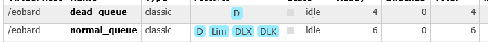

* 运行消费者1和消费者2，查看效果

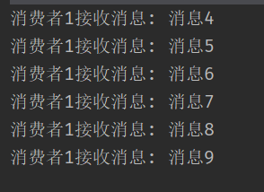 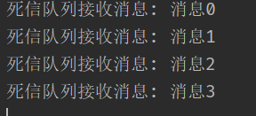 


### 6.3 消费者拒绝消息

#### （1）编写生产者

```JAVA
public class Producer {

    public static final String normal_exchange="normal_exchange";

    public static void main(String[] args) throws Exception{
        //获取信道
        Channel channel = RabbitMQUtils.getChannel();
        //声明交换机和队列
        channel.exchangeDeclare(normal_exchange, BuiltinExchangeType.DIRECT);
        //发送消息
        for (int i = 0; i < 10; i++) {
            String message="消息"+i;
            //发送消息
            channel.basicPublish(normal_exchange,"normal",null,message.getBytes("UTF-8"));
        }
    }
}
```


#### （2）编写消费者

```JAVA
public class Consumer1_Rej {

    public static final String normal_exchange="normal_exchange";
    public static final String dead_exchange="dead_exchange";

    public static final String normal_queue="normal_queue";
    public static final String dead_queue="dead_queue";

    public static void main(String[] args) throws Exception{
        Channel channel = RabbitMQUtils.getChannel();
        channel.exchangeDeclare(normal_exchange, BuiltinExchangeType.DIRECT);
        channel.exchangeDeclare(dead_exchange,BuiltinExchangeType.DIRECT);

        Map<String,Object> map=new HashMap();
        //设置正常队列与死信交换机绑定,K不可改
        map.put("x-dead-letter-exchange",dead_exchange);
        //设置路由key,K不可改
        map.put("x-dead-letter-routing-key","dead");

        channel.queueDeclare(normal_queue,true,false,false,map);
        channel.queueBind(normal_queue,normal_exchange,"normal");

        channel.queueDeclare(dead_queue,true,false,false,null);
        channel.queueBind(dead_queue,dead_exchange,"dead");


        //消费消息
        DefaultConsumer consumer=new DefaultConsumer(channel){
            @Override
            public void handleDelivery(String consumerTag, Envelope envelope, AMQP.BasicProperties properties, byte[] body) throws IOException {
                String msg = new String(body, "UTF-8");
                //判断消息为...时,拒绝消息
                if(msg.equals("消息5")){
                    //拒绝消息且拒绝重新入队
                    //void basicReject(long deliveryTag, boolean requeue)
                    channel.basicReject(envelope.getDeliveryTag(),false);
                }else {
                    System.out.println("消费者1接收消息: " + msg);
                    channel.basicAck(envelope.getDeliveryTag(),false);
                }
            }
        };

        //监听消息
        channel.basicConsume(normal_queue,false,consumer);
    }
}
```

```java
public class Consumer2_Rej {

    public static final String dead_exchange="dead_exchange";
    public static final String dead_queue="dead_queue";

    public static void main(String[] args) throws Exception{
        Channel channel = RabbitMQUtils.getChannel();
        channel.exchangeDeclare(dead_exchange,BuiltinExchangeType.DIRECT);

        channel.queueDeclare(dead_queue,true,false,false,null);
        channel.queueBind(dead_queue,dead_exchange,"dead");


        //消费消息
        DefaultConsumer consumer=new DefaultConsumer(channel){
            @Override
            public void handleDelivery(String consumerTag, Envelope envelope, AMQP.BasicProperties properties, byte[] body) throws IOException {
                System.out.println("死信队列接收拒绝消息: " + new String(body,"UTF-8"));
            }
        };

        //监听消息
        channel.basicConsume(dead_queue,true,consumer);
    }
}
```


#### （3）运行结果

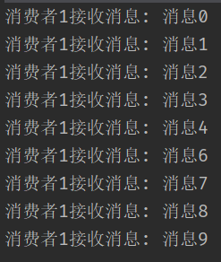 


## 七. 延迟队列

​			延迟队列中的元素希望在指定时间得到取出和处理，所以延迟队列中的元素是都是带时间属性的，通常来说是需要被处理的消息或者任务。简单来说，`延迟队列就是用来存放需要在指定时间被处理的元素的队列。`


### **7.1 使用场景**

1. 订单在十分钟之内未支付则自动取消。
2. 新创建的店铺，如果在十天内都没有上传过商品，则自动发送消息提醒。
3. 账单在一周内未支付，则自动结算。
4. 用户注册成功后，如果三天内没有登陆则进行短信提醒。
5. 用户发起退款，如果三天内没有得到处理则通知相关运营人员。
6. 预定会议后，需要在预定的时间点前十分钟通知各个与会人员参加会议。


### 7.2 简单延迟队列(了解)

> **该项目只适用于固定时间的延迟队列，若对于不固定的时间则不适合**

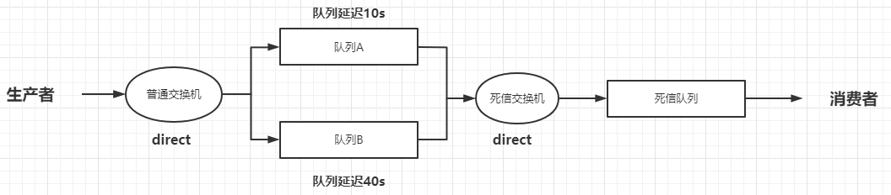

（1）创建SpringBoot项目，导入依赖

```xml-dtd
  	<!--消息队列-->
        <dependency>
            <groupId>org.springframework.boot</groupId>
            <artifactId>spring-boot-starter-amqp</artifactId>
        </dependency>
        <!--rabbitmq测试-->
        <dependency>
            <groupId>org.springframework.amqp</groupId>
            <artifactId>spring-rabbit-test</artifactId>
            <scope>test</scope>
        </dependency>
        <dependency>
            <groupId>org.springframework.boot</groupId>
            <artifactId>spring-boot-starter-web</artifactId>
        </dependency>
        <dependency>
            <groupId>org.projectlombok</groupId>
            <artifactId>lombok</artifactId>
            <optional>true</optional>
        </dependency>
```


（2）application.properties配置文件

```properties
#RabbitMQ服务器地址
spring.rabbitmq.host=192.168.2.102
#RabbitMQ连接端口号
spring.rabbitmq.port=5672
#RabbitMQ虚拟主机名称
spring.rabbitmq.virtual-host=/eobard
#RabbitMQ用户名
spring.rabbitmq.username=root
#RabbitMQ密码
spring.rabbitmq.password=123456
```


（3）编写配置类

```JAVA
@Configuration
public class TtlQueueConfig {
    //普通交换机
    public static final String normal_exchange="normal_exchange";
    //死信交换机
    public static final String dead_exchange="dead_exchange";

    //普通队列
    public static final String queueA="queueA";
    public static final String queueB="queueB";

    //死信队列
    public static final String queueDead="queueDead";

    //Routing_key
    public static final String routing_key="dead";

    //声明普通交换机
    @Bean
    public DirectExchange normalExchange(){
        return new DirectExchange(normal_exchange);
    }

    //声明队列A
    @Bean
    public Queue queueA(){
        Map<String,Object> args=new HashMap();
        //设置正常队列与死信交换机绑定,K不可改
        args.put("x-dead-letter-exchange",dead_exchange);
        //设置路由key,K不可改
        args.put("x-dead-letter-routing-key",routing_key);
        //设置队列延迟时间:10s
        args.put("x-message-ttl",10000);
        return QueueBuilder.durable(queueA)
                            .withArguments(args)
                            .build();
    }

    //队列A和交换机绑定
    @Bean
    public Binding queueABindingNormalExchange(@Qualifier("queueA") Queue queue,
                                               @Qualifier("normalExchange") DirectExchange exchange){
        return BindingBuilder.bind(queue)
                                .to(exchange)
                                .with("normal_a");
    }

    //声明队列B
    @Bean
    public Queue queueB(){
        Map<String,Object> args=new HashMap();
        //设置正常队列与死信交换机绑定,K不可改
        args.put("x-dead-letter-exchange",dead_exchange);
        //设置路由key,K不可改
        args.put("x-dead-letter-routing-key",routing_key);
        //设置队列延迟时间:40s
        args.put("x-message-ttl",40000);
        return QueueBuilder.durable(queueB)
                .withArguments(args)
                .build();
    }

    //队列B和交换机绑定
    @Bean
    public Binding queueBBindingNormalExchange(@Qualifier("queueB") Queue queue,
                                               @Qualifier("normalExchange") DirectExchange exchange){
        return BindingBuilder.bind(queue)
                .to(exchange)
                .with("normal_b");
    }

    //死信交换机
    @Bean
    public DirectExchange deadExchange(){
        return new DirectExchange(dead_exchange);
    }

    //声明死信队列
    @Bean
    public Queue queueDead(){
        return new Queue(queueDead);
    }

    //将死信队列和死信交换机绑定
    @Bean
    public Binding queueDeadBindingDeadExchange(@Qualifier("queueDead") Queue queue,
                                                @Qualifier("deadExchange") DirectExchange exchange){
        return BindingBuilder.bind(queue)
                .to(exchange)
                .with(routing_key);
    }
}
```


（4）编写生产者

```JAVA
@Slf4j
@RestController
public class SendMsgController {

    @Resource
    private RabbitTemplate rabbitTemplate;

    //生产者发送消息
    @GetMapping("sendMsg/{msg}")
    public void sendMsg(@PathVariable String msg){
        //记录日志
        log.error("当前时间：{},发送一条消息给队列:{}",  new Date().toString(),msg);
        //给队列发送消息
        rabbitTemplate.convertSendAndReceive("normal_exchange","normal_a","消息来自TTL为10s的队列----"+msg);
        rabbitTemplate.convertSendAndReceive("normal_exchange","normal_b","消息来自TTL为40s的队列----"+msg);
    }
}
```


（5）编写消费者

```JAVA
import com.eobard.config.TtlQueueConfig;
import com.rabbitmq.client.Channel;
import lombok.extern.slf4j.Slf4j;
import org.springframework.amqp.core.Message;
import org.springframework.amqp.rabbit.annotation.RabbitListener;
import org.springframework.stereotype.Component;
import java.util.Date;

@Slf4j
@Component
public class DeadQueueConsumer {

    //消费者监听消息
    @RabbitListener(queues = TtlQueueConfig.queueDead)
    public void receive(Message message, Channel channel){
        //获取消息
        String msg = new String(message.getBody());
        log.error("当前时间：{}，收到死信队列消息：{}", new Date().toString(),msg);
    }
}
```

（6）运行结果

 

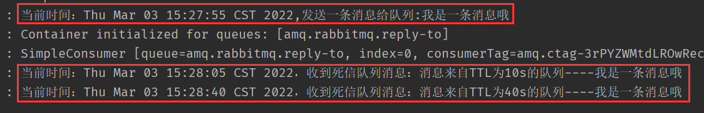


### 7.3 指定时间延迟队列(了解)

>  **`注意：RabbitMQ只会检查第一个消息是否过期，如果过期则丢到死信队列；如果第一个消息的延时时长很长，而第二个消息的延时时长很短，第二个消息并不会优先得到执行。`**

（1）编写配置类

```JAVA
@Configuration
public class MessageTtlQueueConfig {
    //普通交换机
    public static final String NORMAL_EXCHANGE="normalExchange";

    //普通队列
    public static final String NORMAL_QUEUE="normalQueue";

    //正常Routing key
    public static final String NORMAL_ROUTING_KEY="normal_queue_exchange";

    //死信Routing Key
    public static final String DEAD_ROUTING_KEY="dead_queue_exchange";

    //死信交换机
    public static final String DEAD_EXCHANGE="deadExchange";

    //死信队列
    public static final String DEAD_QUEUE="deadQueue";


    //声明普通交换机
    @Bean
    public DirectExchange normalExchange(){
        return new DirectExchange(NORMAL_EXCHANGE);
    }

    //声明普通队列并绑定死信交换机
    @Bean
    public Queue normalQueue(){
        Map<String,Object> args=new HashMap();
        //设置正常队列与死信交换机绑定,K不可改
        args.put("x-dead-letter-exchange",DEAD_EXCHANGE);
        //设置路由key,K不可改
        args.put("x-dead-letter-routing-key",DEAD_ROUTING_KEY);
        return QueueBuilder.durable(NORMAL_QUEUE)
                            .withArguments(args)
                            .build();
    }

    //绑定普通队列和普通交换机
    @Bean
    public Binding normalQueueBindingNormalExchange(@Qualifier("normalQueue")Queue queue,
                                                    @Qualifier("normalExchange")DirectExchange exchange){
        return BindingBuilder.bind(queue)
                                .to(exchange)
                                .with(NORMAL_ROUTING_KEY);
    }

    //死信交换机
    @Bean
    public DirectExchange deadExchange(){
        return new DirectExchange(DEAD_EXCHANGE);
    }

    //声明死信队列
    @Bean
    public Queue deadQueue(){
        return new Queue(DEAD_QUEUE);
    }

    //将死信队列和死信交换机绑定
    @Bean
    public Binding queueDeadBindingDeadExchange(@Qualifier("deadQueue") Queue queue,
                                                @Qualifier("deadExchange") DirectExchange exchange){
        return BindingBuilder.bind(queue)
                .to(exchange)
                .with(DEAD_ROUTING_KEY);
    }
}
```


（2）编写生产者

```JAVA
@Slf4j
@RestController
public class SendMsgController {

    @Resource
    private RabbitTemplate rabbitTemplate;
    
    /**
     * 生产者发送消息
     * @param msg 消息内容
     * @param seconds 延迟队列时间
     */
    @GetMapping("sendMsg/{msg}/{seconds}")
    public void sendMsg(@PathVariable String msg,@PathVariable Integer seconds){
        //发送消息
        //convertAndSend(String exchange, String routingKey, Object message, MessagePostProcessor messagePostProcessor)
        rabbitTemplate.convertAndSend(MessageTtlQueueConfig.NORMAL_EXCHANGE,MessageTtlQueueConfig.NORMAL_ROUTING_KEY, msg,
                                        message ->
                                        {
                                            //设置延迟队列TTL
                                            message.getMessageProperties()
                                                    .setExpiration(String.valueOf(seconds*1000));
                                            return message;}
                                            );
        log.info("当前时间：{},发送一条{}秒的消息给延迟队列,内容为：{}",new Date(),seconds,msg);

    }

}
```


（3）编写消费者

```JAVA
import com.eobard.config.MessageTtlQueueConfig;
import com.rabbitmq.client.Channel;
import lombok.extern.slf4j.Slf4j;
import org.springframework.amqp.core.Message;
import org.springframework.amqp.rabbit.annotation.RabbitListener;
import org.springframework.stereotype.Component;
import java.util.Date;

@Slf4j
@Component
public class DeadQueueConsumer {

    //消费者监听消息
    @RabbitListener(queues = MessageTtlQueueConfig.DEAD_QUEUE)
    public void receive(Message message, Channel channel){
        //获取消息
        String msg = new String(message.getBody());
        log.error("当前时间：{}，收到死信队列消息：{}", new Date().toString(),msg);
    }
}

```


（4）运行结果

* 依次输入 [localhost:8080/sendMsg/我是一条消息哦/10](http://localhost:8080/sendMsg/我是一条消息哦/10) 和  [localhost:8080/sendMsg/我是一条消息2/3](http://localhost:8080/sendMsg/我是一条消息2/3)
* 查看控制台输出

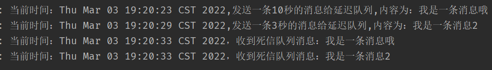

* 发现结果和预想的一致：第一个消息延迟时间 > 第二个消息延迟时间，但第二个消息不会优先执行

==**注意：所以需要通过延迟队列插件完善功能！**==


### 7.4 安装延迟队列插件

* 查看自己版本下载对应的插件

```bash
ls /usr/lib/rabbitmq/lib/
```

* 插件下载地址：https://www.rabbitmq.com/community-plugins.html

* 找到`rabbitmq_delayed_message_exchange`选择`Releases`，下载对应版本插件

  [Releases · rabbitmq/rabbitmq-delayed-message-exchange · GitHub](https://github.com/rabbitmq/rabbitmq-delayed-message-exchange/releases)

* 将下载后的插件上传到`/usr/lib/rabbitmq/lib/rabbitmq_server-3.8.9/plugins`里面

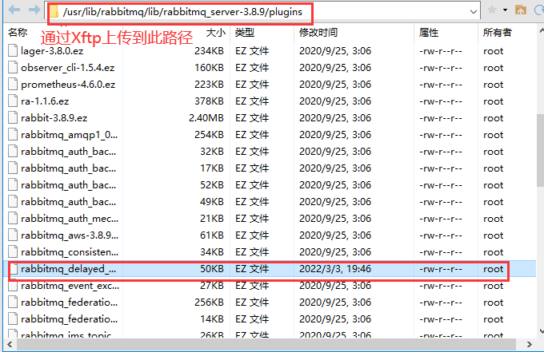

* 启用插件

```bash
#进入rabbitmq插件目录
cd /usr/lib/rabbitmq/lib/rabbitmq_server-3.8.9/plugins

#赋予权限
chmod 777  rabbitmq_delayed_message_exchange-3.8.9-0199d11c.ez

#启用延迟插件
rabbitmq-plugins enable rabbitmq_delayed_message_exchange
```

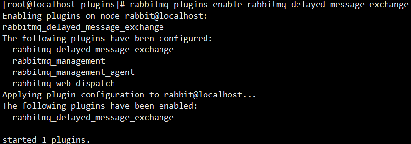


### 7.5 基于插件实现延迟队列(重点)

> **`通过7.3节可以看出，若第一个消息延迟时间大于第二个消息，不会让时间短的先消费，通过该插件可以弥补这个缺点！`**

（1）编写配置类

```JAVA
@Configuration
public class DelayQueueConfig {

    //延迟交换机名称
    public static final String DELAY_EXCHANGE="delayExchange";

    //队列名称
    public static final String DELAY_QUEUE="delayQueue";

    //routing key
    public static final String DELAY_ROUTING_KEY="delayRoutingKey";


    //声明自定义延迟交换机
    @Bean
    public CustomExchange customExchange(){
        Map<String,Object> args=new HashMap();
        //设置交换机,k值不能改
        args.put("x-delayed-type","direct");
        return new CustomExchange(DELAY_EXCHANGE,"x-delayed-message",true,false,args);
    }

    //声明队列
    @Bean
    public Queue queue(){
        return new Queue(DELAY_QUEUE);
    }

    //将队列和延迟交换机绑定
    @Bean
    public Binding queueBindingDelayExchange(@Qualifier("queue") Queue queue,
                                             @Qualifier("customExchange") CustomExchange customExchange){
        return BindingBuilder.bind(queue)
                                .to(customExchange)
                                .with(DELAY_ROUTING_KEY)
                                .noargs();
    }


}
```


（2）编写生产者

```java
@Slf4j
@RestController
public class SendMsgController {

    @Resource
    private RabbitTemplate rabbitTemplate;

    /**
     * 生产者发送消息
     * @param msg 消息内容
     * @param seconds 延迟队列时间
     */
    @GetMapping("sendMsg/{msg}/{seconds}")
    public void sendMsg(@PathVariable String msg,@PathVariable Integer seconds){
        //发送消息
        //convertAndSend(String exchange, String routingKey, Object message, MessagePostProcessor messagePostProcessor)
        rabbitTemplate.convertAndSend(DelayQueueConfig.DELAY_EXCHANGE,
                                      DelayQueueConfig.DELAY_ROUTING_KEY, msg,
                            message ->
                            {
                                //设置延迟队列TTL
                                message.getMessageProperties()
                                        .setDelay(seconds*1000);
                                return message;}
        );
        log.info("当前时间：{},发送一条{}秒的消息给延迟队列,内容为：{}",new Date(),seconds,msg);
    }
}
```


（3）编写消费者

```JAVA
import com.eobard.config.DelayQueueConfig;
import com.rabbitmq.client.Channel;
import lombok.extern.slf4j.Slf4j;
import org.springframework.amqp.core.Message;
import org.springframework.amqp.rabbit.annotation.RabbitListener;
import org.springframework.stereotype.Component;
import java.util.Date;

@Slf4j
@Component
public class DeadQueueConsumer {

    //消费者监听消息
    @RabbitListener(queues = DelayQueueConfig.DELAY_QUEUE)
    public void receive(Message message,Channel channel){
        //获取消息
        String msg = new String(message.getBody());
        log.error("当前时间：{}，收到死信队列消息：{}", new Date().toString(),msg);
    }
}
```


（4）运行结果

* 依次输入 [localhost:8080/sendMsg/我是第1条消息，耗时20秒/20](http://localhost:8080/sendMsg/我是第1条消息，耗时20秒/20) 和  [localhost:8080/sendMsg/我是第2条消息，耗时5秒/5](http://localhost:8080/sendMsg/我是第2条消息，耗时5秒/5)
* 查看控制台输出

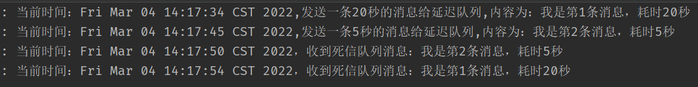

* 发现第二条消息到达时间后会自动消费，不用等待第一条消费完，符合预期效果


## 八. 高级特性

### 8.1 消息回退

​		生产者生产的消息没有正确的到达队列或`不可路由(发送的Routing Key不存在的情况)`时就会触发回退模式，**可以在该模式下进行二次发送**。

（1）修改全局配置文件

```properties
#开启消息回退
spring.rabbitmq.publisher-returns=true
```


（2）编写配置类

```JAVA
@Slf4j
@Component
public class CustomRabbitCallBack implements RabbitTemplate.ReturnsCallback {

    @Resource
    private RabbitTemplate rabbitTemplate;

    //依赖注入rabbitTemplate后再设置回调对象
    @PostConstruct
    public void init(){
        rabbitTemplate.setReturnsCallback(this);
    }

    @Override
    public void returnedMessage(ReturnedMessage returnedMessage) {
        log.error("消息:{}---->被交换机{}退回,退回原因:{},路由key:{}",
                new String(returnedMessage.getMessage().getBody()),
                returnedMessage.getExchange(),
                returnedMessage.getReplyText(),
                returnedMessage.getRoutingKey()
                );

        //第一次发送的消息不会到达queue,会调用到 ReturnCallback 方法,会再次进行发送,保证消息的可靠性,不会丢失
        //rabbitTemplate.send("交换机名","Routing Key",returnedMessage.getMessage());
    }
}
```


（3）运行结果

* 在发送消息的时候故意写错Routing Key查看效果


### 8.2 备份交换机

​		在RabbitMQ中，有一种备份交换机的机制存在；备份交换机可以理解为RabbitMQ中交换机的“备胎"，当我们为某一个交换机声明一个对应的备份交换机时，就是为它创建一个备胎，当交换机接收到一条不可路由消息时，将会把这条消息转发到备份交换机中，由备份交换机来进行转发和处理，通常备份交换机的类型为Fanout，这样就能把所有消息都投递到与其绑定的队列中，然后我们在备份交换机下绑定一个队列，这样所有那些原交换机无法被路由的消息，就会都进入这个队列了。当然，我们还可以建立一个报警队列，用独立的消费者来进行监测和报警。

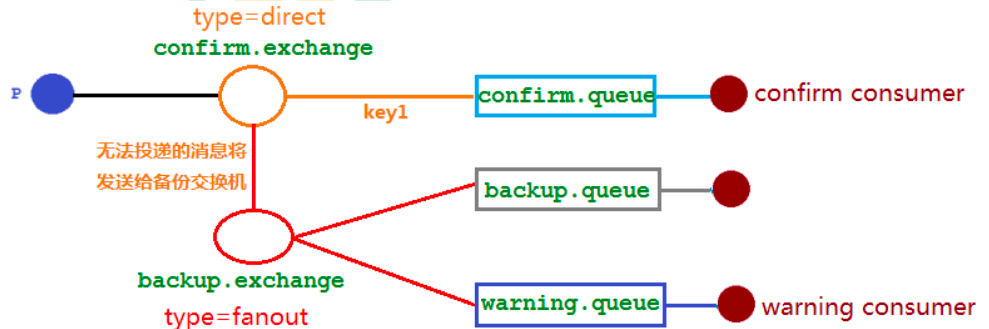


（1）编写配置类

```JAVA
@Configuration
public class BackUpExchangeConfig {

    public static final String NORMAL_EXCHANGE="normal.exchange";

    public static final String NORMAL_QUEUE="normal.queue";

    public static final String NORMAL_ROUTING_KEY ="normal.RoutingKey" ;

    //备份交换机
    public static final String BACKUP_EXCHANGE="backup.exchange";

    //备份队列
    public static final String BACKUP_QUEUE="backup_queue";

    //警告队列
    public static final String WARN_QUEUE="warn_queue";


    //正常交换机
    @Bean
    public DirectExchange directExchange(){
        return  ExchangeBuilder.directExchange(NORMAL_EXCHANGE)
                                .durable(true)
                                //备份交换机,将正常交换机和备份进行绑定
                                .withArgument("alternate-exchange",BACKUP_EXCHANGE)
                                .build();
    }

    //正常队列
    @Bean
    public Queue normalQueue(){
        return new Queue(NORMAL_QUEUE);
    }

    //正常绑定交换机和队列
    @Bean
    public Binding normalQueueBindingExchange(@Qualifier("normalQueue") Queue queue,
                                              @Qualifier("directExchange") DirectExchange exchange){
        return BindingBuilder
                            .bind(queue)
                            .to(exchange)
                            .with(NORMAL_ROUTING_KEY);
    }


    //备份交换机
    @Bean
    public FanoutExchange fanoutExchange(){
        return new FanoutExchange(BACKUP_EXCHANGE);
    }

    //备份队列
    @Bean
    public Queue backUpQueue(){
        return QueueBuilder.durable(BACKUP_QUEUE).build();
    }

    //警告队列
    @Bean
    public Queue warningQueue(){
        return QueueBuilder.durable(WARN_QUEUE).build();
    }

    //备份队列和备份交换机绑定
    @Bean
    public Binding backUpQueueBindingExchange(@Qualifier("backUpQueue") Queue queue,
                                              @Qualifier("fanoutExchange") FanoutExchange fanoutExchange){
        return BindingBuilder.bind(queue).to(fanoutExchange);
    }

    //告警队列和备份交换机绑定
    @Bean
    public Binding warningQueueBindingExchange(@Qualifier("warningQueue") Queue queue,
                                              @Qualifier("fanoutExchange") FanoutExchange fanoutExchange){
        return BindingBuilder.bind(queue).to(fanoutExchange);
    }

}
```


（2）生产者

```java
@Slf4j
@RestController
public class SendMsgController {

    @Resource
    private RabbitTemplate rabbitTemplate;

    @GetMapping("send/{msg}")
    public void send(@PathVariable String msg){
        //发送消息
        rabbitTemplate.convertAndSend(BackUpExchangeConfig.NORMAL_EXCHANGE,
                BackUpExchangeConfig.NORMAL_ROUTING_KEY, msg,
                message ->
                {
                    message.getMessageProperties();
                    return message;}
        );
        
        //模拟发送错误Routing key
        rabbitTemplate.convertAndSend(BackUpExchangeConfig.NORMAL_EXCHANGE,
                "123123", msg,
                message ->
                {
                    message.getMessageProperties();
                    return message;}
        );
        log.info("当前时间：{},发送一条消息给队列,内容为：{}",new Date(),msg);

    }
}
```


（3）消费者

```JAVA
@Slf4j
@Component
public class WarningConsumer {

    @RabbitListener(queues = BackUpExchangeConfig.WARN_QUEUE)
    public void receive(Message message, Channel channel){
        //告警消费者获取消息
        String msg = new String(message.getBody());
        log.info("当前时间：{}，告警队列收到不可路由消息：{}", new Date().toString(),msg);
    }

    @RabbitListener(queues = BackUpExchangeConfig.NORMAL_QUEUE)
    public void receive1(Message message, Channel channel){
        //正常消费者获取消息
        String msg = new String(message.getBody());
        log.info("获取正常消息：{}",msg);
    }
}
```


（4）运行结果

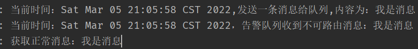

> **`注意：备份交换机和消息回退同时存在的时候，备份交换机的优先级更高`**


### 8.3 幂等性

​				`用户对于同一操作发起的一次请求或者多次请求的结果是一致的，不会因为多次点击而产生了副作用`。例如︰用户购买商品后支付，支付扣款成功，但是返回结果的时候网络异常，此时钱已经扣了，用户再次点击按钮，此时会进行第二次扣款，返回结果成功，用户查询余额发现多扣钱了，流水记录也变成了两条。在以前的单应用系统中，我们只需要把数据操作放入事务中即可，发生错误立即回滚，但是再响应客户端的时候也有可能出现网络中断或者异常等等。


#### 8.3.1消费重复消息

​			消费者在消费MQ中的消息时，MQ已把消息发送给消费者，消费者在给MQ返回ack时网络中断，MQ未收到确认信息，该条消息会重新发给其他的消费者，或者在网络重连后再次发送给该消费者，但实际上该消费者已成功消费了该条消息，造成消费者消费了重复的消息。


#### 8.3.2 解决方法

* 唯一ID+指纹码机制

  ​			根据消息生成一个全局唯一的ID，然后还需要加上一个指纹码。这个指纹码它并不一定是系统去生成的，而是一些外部的规则或者内部的业务规则去拼接，它的目的就是为了保障这次操作是绝对唯一的。

  ​			将ID + 指纹码拼接好的值作为数据库主键，就可以进行去重了。即在消费消息前，先去数据库查询这条消息的指纹码标识是否存在，没有就执行insert操作，如果有就代表已经被消费了，就不需要管了。

  > **高并发下有数据库写入的性能瓶颈，跟进ID进行分库分表进行算法路由**

* Redis的原子性

  ​         在接收到消息后将消息ID作为key执行 setnx命令，如果执行成功就表示没有处理过这条消息，可以进行消费了，执行失败表示消息已经被消费了。


### 8.4 优先队列

​				拥有高优先级的队列具有高的优先权，优先级高的消息具备优先被消费的权力。

（1）编写配置类

```JAVA
@Configuration
public class PriorityQueueConfig {

    public static final String QUEUE_NAME="priority.queue";

    public static final String EXCHANGE_NAME="priority.exchange";

    public static final String ROUTING_KEY="priority.key";

    @Bean
    public DirectExchange priorityExchange(){
        return new DirectExchange(EXCHANGE_NAME);
    }
    @Bean
    public Queue priorityQueue(){
        Map<String,Object> args = new HashMap<>();
        //设置最大的优先级(0~255,设置越大越占内存和CPU)
        args.put("x-max-priority",10);
        return new Queue(QUEUE_NAME,true,false,false,args);
    }
    @Bean
    public Binding priorityQueueBindingExchange(@Qualifier("priorityQueue") Queue queue,
                                                @Qualifier("priorityExchange") DirectExchange exchange){
        return BindingBuilder.bind(queue).to(exchange).with(ROUTING_KEY);
    }
}
```


（2）编写生产者

```java
@Slf4j
@RestController
public class SendMsgController {

    @Resource
    private RabbitTemplate rabbitTemplate;

    @GetMapping("/se")
    public void se(){
        Message message =null;
        //发送消息
        for (int i = 1; i <10; i++) {
            String msg="消息："+i;
            if(i==5){
                message=MessageBuilder.withBody(msg.getBytes()).setPriority(8).build() ;
                rabbitTemplate.convertAndSend(PriorityQueueConfig.EXCHANGE_NAME,PriorityQueueConfig.ROUTING_KEY, message) ;
            }else {
                message=MessageBuilder.withBody(msg.getBytes()).build() ;
                rabbitTemplate.convertAndSend(PriorityQueueConfig.EXCHANGE_NAME,PriorityQueueConfig.ROUTING_KEY, message) ;
            }
        }
        log.info("当前时间：{},发送10条消息给队列",new Date());

    }
}

```


（3）运行生产者发送消息

（4）编写消费者

> **消费者需要等待消息已经发送到队列中才去消费，这样才有机会对消息进行排序**

```JAVA
@Slf4j
@Component
public class PriorityConsumer {

        @RabbitListener(queues = PriorityQueueConfig.QUEUE_NAME)
        public void receive(Message message, Channel channel){
            //获取消息
            String msg = new String(message.getBody());
            log.info("当前时间：{}，队列消息：{}", new Date().toString(),msg);
        }
}
```


（5）运行结果

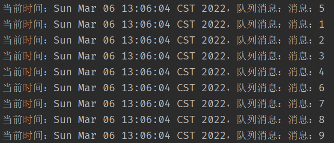 


### 8.5 惰性队列

​				惰性队列会尽可能的将消息存入磁盘中，而在消费者消费到相应的消息时才会被加载到内存中，它的一个重要的设计目标是能够支持更长的队列，即支持更多的消息存储。**惰性队列是将消息保存在磁盘上的。普通的队列消息在内存中。**

```JAVA
Map<String, Object> args = new HashMap<String, Object>();
args.put("x-queue-mode", "lazy");//设置惰性队列
channel.queueDeclare("myqueue", false, false, false, args);
```


## 九. RabbitMQ集群

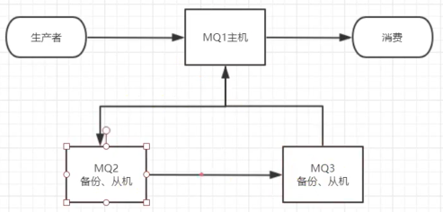


### 9.1 克隆两个虚拟机

>  **将linux关机，右键选择管理—克隆，克隆另外两个虚拟机；克隆完毕后，将三个虚拟机都开机**

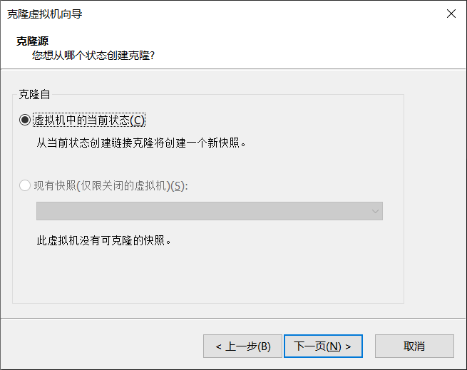


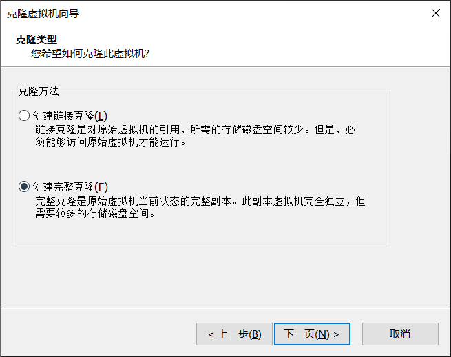

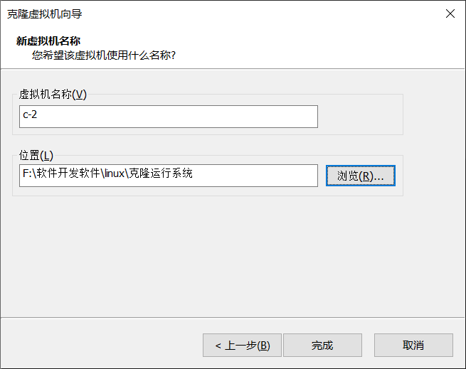


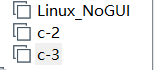


### 9.2 修改两个IP地址

* 将C2、C3分别生成新的mac地址


* 启动两个系统，并将生成的新mac地址和配置文件保持一致

```BASH
vim /etc/sysconfig/network-scripts/ifc...
```

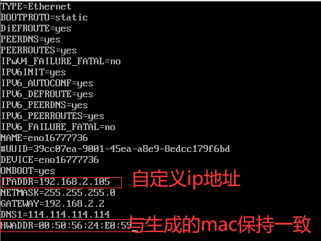


* 删除70-persistent-net.rules文件

```BASH
rm -rf /etc/udev/rules.d/70-persistent-net.rules
```


* 重启

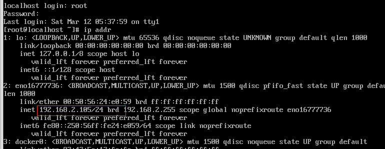


### 9.3 修改克隆机主机名

* 分别使用远程工具登录

  


* 修改克隆机主机名，断开远程工具再次连接查看效果

  ```BASH
  #将三个机器分别改主机名
  hostnamectl set-hostname 主机名
  ```

  

  


### 9.4 配置主机节点

>  **配置各个节点的hosts文件，让各个节点都能互相识别对方**

```BASH
#分别在3个机器上执行以下命令，添加彼此的节点信息
vim /etc/hosts

#在/etc/hosts文件的最下方配置
192.168.2.103 node1
192.168.2.104 node2
192.168.2.105 node3
```


### 9.5 修改cookie值

```BASH
#在三个机器分别执行以下命令，确保cookie值为同一个
cat /var/lib/rabbitmq/.erlang.cookie 

#在主节点(node1)执行以下两句命令，遇到提示输入yes即可
scp /var/lib/rabbitmq/.erlang.cookie root@node2:/var/lib/rabbitmq/.erlang.cookie
scp /var/lib/rabbitmq/.erlang.cookie root@node3:/var/lib/rabbitmq/.erlang.cookie
```

> 其中的node2和node3代表克隆机的主机名，以后只需要改这里的名字即可


==注意：完成上述操作后，将三个机器重启==


### 9.6 搭建集群环境

```BASH
#在主节点和节点2分别开放端口
firewall-cmd --zone=public --add-port=4369/tcp --permanent
firewall-cmd --zone=public --add-port=25672 /tcp --permanent
firewall-cmd --reload


#三台机器分别执行RabbitMQ服务
rabbitmq-server -detached

#在节点2执行以下命令
rabbitmqctl stop_app   
rabbitmqctl reset		
	#node1代表的是主节点的主机名
rabbitmqctl join_cluster rabbit@node1
rabbitmqctl start_app 

#在节点3执行以下命令
rabbitmqctl stop_app   
rabbitmqctl reset		
	#node2代表的是节点2的主机名
rabbitmqctl join_cluster rabbit@node2
rabbitmqctl start_app 


#在任意节点查看集群状态
rabbitmqctl cluster_status
```

> 注意：如果出现两个节点搭建好了，第三个节点一直没反应，可能是因为内存不够的原因，可以关闭一台虚拟机，再次重试


### 9.7 添加集群用户

```BASH
#在三个任意节点创建用户
rabbitmqctl add_user cluster 123456
#设置用户权限
rabbitmqctl set_user_tags cluster administrator
rabbitmqctl set_permissions -p / cluster ".*" ".*" ".*"

#重启rabbitmq服务
systemctl restart rabbitmq-server
```

访问http://192.168.2.103:15672/，使用集群账号登录


### 9.8 搭建镜像队列

​			前面搭建了3个机器的RabbitMQ集群，但是该集群存在一些问题，例如：集群间的消息无法同步、某个集群宕机导致消息丢失等。如果发送消息到队列中，只有node1可以接收，若node1突然宕机，则消息全部丢失，这时候需要用到镜像队列：

​			**`引入镜像队列(Mirror Queue)的机制，可以将队列镜像到集群中的其他Broker节点之上，如果集群中的一个节点失效了，队列能自动地切换到镜像中的另一个节点上以保证服务的可用性。`**


（1）打开web管理界面，添加policy


（2）修改队列名称发送消息

```JAVA
//生产者
public class HelloProducer {

    //队列名称
    public static final String QUEUE_NAME="mirror-queue";


    public static void main(String[] args) throws Exception{
        //1.创建工厂对象
        ConnectionFactory factory=new ConnectionFactory();
        //2.设置连接参数
        factory.setHost("192.168.2.103");//服务器IP地址
        factory.setPort(5672);//服务器连接端口
        factory.setVirtualHost("/eobard");//虚拟主机名称
        factory.setUsername("cluster");//用户名
        factory.setPassword("123456");//密码

        //3.创建connection对象
        Connection connection = factory.newConnection();

        //4.创建Channel信道对象
        Channel channel = connection.createChannel();

        /**
         * 5.声明队列
         * 参数1:队列名称
         * 参数2:是否持久化队列
         * 参数3:是否独占本次连接
         * 参数4:是否在不使用队列时自动删除
         * 参数5:队列其它参数
         */
        channel.queueDeclare(QUEUE_NAME,true,false,false,null);

        //6.发送信息
        String message="hello rabbitmq~~~";
        /**
         *   参数1:交换机名称(不填写则使用默认的交换机)
         *   参数2:队列名称(Routing Key,路由key)
         *   参数3:其它参数
         *   参数4:消息内容
         */
        channel.basicPublish("",QUEUE_NAME,null,message.getBytes());
    }
}
```


（3）查看web管理界面


（4）将node1节点关闭，模拟宕机

```BASH
rabbitmqctl stop_app
```


（5）启动消费者，查看是否可以消费\

> 注意：需要更改ip地址，因为node1节点已经宕机了，我们使用node2的IP地址查看是否可以消费

```JAVA
//消费者
public class HelloConsumer {
    //队列名称
    public static final String QUEUE_NAME="mirror-queue";

    public static void main(String[] args) throws Exception {
        //1.创建工厂对象
        ConnectionFactory factory = new ConnectionFactory();
        //2.设置连接参数
        factory.setHost("192.168.2.104");//服务器IP地址
        factory.setPort(5672);//服务器连接端口
        factory.setVirtualHost("/eobard");//虚拟主机名称
        factory.setUsername("cluster");//用户名
        factory.setPassword("123456");//密码

        //3.创建connection对象
        Connection connection = factory.newConnection();

        //4.创建Channel信道对象
        Channel channel = connection.createChannel();

        /**
         * 5.声明队列
         * 参数1:队列名称
         * 参数2:是否持久化队列
         * 参数3:是否独占本次连接
         * 参数4:是否在不使用队列时自动删除
         * 参数5:队列其它参数
         */
        channel.queueDeclare(QUEUE_NAME, true, false, false, null);

        //6.接收消息
        DefaultConsumer consumer=new DefaultConsumer(channel){
            /**
             * 消费回调函数,收到消息后,会自动执行该方法
             * @param consumerTag 消费者标识
             * @param envelope     消息包的内容
             * @param properties   属性信息
             * @param body          消息数据
             */
            @Override
            public void handleDelivery(String consumerTag, Envelope envelope, AMQP.BasicProperties properties, byte[] body) throws IOException {
                System.out.println("路由key = " + envelope.getRoutingKey());
                System.out.println("交换机 = " + envelope.getExchange());
                System.out.println("消息id = " + envelope.getDeliveryTag());
                System.out.println("消息内容 = " + new String(body,"UTF-8"));
            }
        };
        /**
         * 监听消息
         * 参数1:队列名称  true表示自动回复MQ接收到了,MQ接收到后会删除消息;false表示手动确认
         * 参数2:是否自动确认消息
         * 参数3:消费对象
         */
        channel.basicConsume(QUEUE_NAME,true,consumer);

        //注意:消费者不能释放资源,应该一直监听资源

    }
}
```


（6）运行结果


> **可以得出：当node1节点宕机后，消息自动迁移到node2节点，并且可以正常消费；若集群中的节点其它全宕机，仅剩一台存在时，仍然可以正常消费！**

