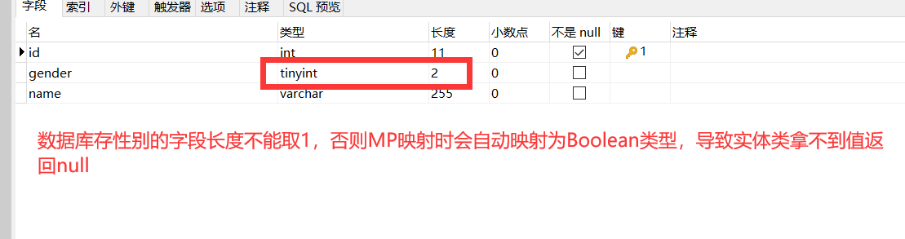
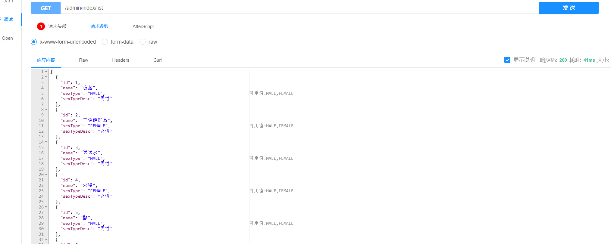
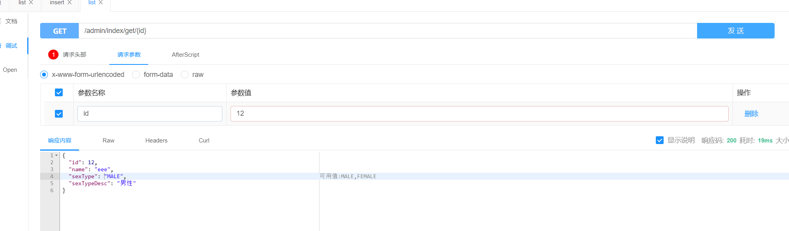

# Mybatis-Plus

## 1. 项目搭建		

> ​		环境准备：Spring + Mybatis-plus+Maven 


导入相关依赖

```xml
<dependencies>

		<!-- MyBatis Plus -->
		<dependency>
			<groupId>com.baomidou</groupId>
			<artifactId>mybatis-plus</artifactId>
			<version>3.4.1</version>
		</dependency> 

		<!--junit -->
		<dependency>
			<groupId>junit</groupId>
			<artifactId>junit</artifactId>
			<version>4.12</version>
		</dependency>

		<!-- log4j -->
		<dependency>
			<groupId>log4j</groupId>
			<artifactId>log4j</artifactId>
			<version>1.2.17</version>
		</dependency>

		<!-- c3p0 -->
		<dependency>
			<groupId>com.mchange</groupId>
			<artifactId>c3p0</artifactId>
			<version>0.9.5.2</version>
		</dependency>

		<!-- mysql -->
		<dependency>
			<groupId>mysql</groupId>
			<artifactId>mysql-connector-java</artifactId>
			<version>5.1.37</version>
		</dependency>

		<!-- spring -->
		<dependency>
			<groupId>org.springframework</groupId>
			<artifactId>spring-context</artifactId>
			<version>4.3.8.RELEASE</version>
		</dependency>
		<dependency>
			<groupId>org.springframework</groupId>
			<artifactId>spring-orm</artifactId>
			<version>4.3.8.RELEASE</version>
		</dependency>
		<dependency>
			<groupId>org.springframework</groupId>
			<artifactId>spring-test</artifactId>
			<version>4.3.8.RELEASE</version>
		</dependency>

	</dependencies>
```


创建四个核心配置文件

```XML
<!--applicationContext.xml-->
<?xml version="1.0" encoding="UTF-8"?>
<beans 
	xmlns:xsi="http://www.w3.org/2001/XMLSchema-instance" 
	xmlns="http://www.springframework.org/schema/beans" 
	xmlns:aop="http://www.springframework.org/schema/aop" 
	xmlns:context="http://www.springframework.org/schema/context" 
	xmlns:tx="http://www.springframework.org/schema/tx" 
	xmlns:util="http://www.springframework.org/schema/util" 
	xsi:schemaLocation="http://www.springframework.org/schema/beans 
	http://www.springframework.org/schema/beans/spring-beans.xsd 
	http://www.springframework.org/schema/aop http://www.springframework.org/schema/aop/spring-aop.xsd 
	http://www.springframework.org/schema/context http://www.springframework.org/schema/context/spring-context.xsd 
	http://www.springframework.org/schema/tx http://www.springframework.org/schema/tx/spring-tx.xsd 
	http://www.springframework.org/schema/util http://www.springframework.org/schema/util/spring-util.xsd ">
	
		<!--开启注解 -->
	<context:component-scan base-package="com.eobard" />
	
	<!-- 读取db.properties -->
	<context:property-placeholder location="db.properties"/>
	
	<!-- 配置c3p0连接池 -->
	<bean name="dataSource" class="com.mchange.v2.c3p0.ComboPooledDataSource">
		<property name="driverClass" value="${jdbc.class}"/>
		<property name="jdbcUrl" value="${jdbc.url}"/>
		<property name="user" value="${jdbc.user}"/>
		<property name="password" value="${jdbc.password}"/>
	</bean>
	
	<!-- 配置事务管理器  -->
	<bean id="transactionManager" class="org.springframework.jdbc.datasource.DataSourceTransactionManager">
		<property name="dataSource" ref="dataSource"></property>
	</bean>
	<tx:annotation-driven transaction-manager="transactionManager"/>
	
	
	<!-- 配置mybatis-plus  sqlSessionFactory -->
	<bean id="sqlSessionFactory" class="com.baomidou.mybatisplus.extension.spring.MybatisSqlSessionFactoryBean">
		<property name="dataSource" ref="dataSource"/>
		<property name="configLocation" value="classpath:mybatis-config.xml"/>
		<property name="typeAliasesPackage" value="com.eobard.entity"></property>
		<property name="mapperLocations" value="classpath:com/eobard/mappers/**/*.xml" />
	</bean> 
	
		<!-- mapper动态扫描开发(☆☆☆☆推荐使用)
		  获取bean的时候就不能通过id来获取了，通过接口类型获取即可
	 -->
 	<bean class="org.mybatis.spring.mapper.MapperScannerConfigurer">
 			<!--以包的形式直接扫描全部动态mapper接口  -->
		<property name="basePackage" value="com.eobard.mappers"/>
	</bean> 
	
	
</beans>

```


```properties
#db.properties
jdbc.user=root
jdbc.password=123456
jdbc.url=jdbc:mysql://localhost:3306/mybatis?useUnicode=true&characterEncoding=utf-8&autoReconnect=true&rewriteBatchedStatements=TRUE
jdbc.class=com.mysql.jdbc.Driver
```


```properties
#Log4j.properties
log4j.rootLogger=DEBUG,Console
log4j.appender.Console=org.apache.log4j.ConsoleAppender
log4j.appender.Console.layout=org.apache.log4j.PatternLayout
log4j.appender.Console.layout.ConversionPattern=%d [%t] %-5p [%c] - %m%n
log4j.logger.org.apache=INFO
```


```xml-dtd
<!--mybatis-config.xml-->
<?xml version="1.0" encoding="UTF-8"?>
<!DOCTYPE configuration  PUBLIC "-//mybatis.org//DTD Config 3.0//EN"  
"http://mybatis.org/dtd/mybatis-3-config.dtd">

<configuration>
	<settings>
		<setting name="logImpl" value="LOG4J"/>
	</settings>
	
</configuration>

```


---


## 2. Mybatis-Plus中使用Mybatis

### 2.1 基于XML形式自定义SQL

```
student表：
			id 主键
			name
			age
```

```JAVA
//实体类
public class Student {

	private int id;
	private String name;
	private int age;

    //省略getter，setter
}
```

```JAVA
//StudentMapper接口，需要实现BaseMapper<T>接口：内置了简单的crud
public interface StudentMapper extends BaseMapper<Student> {

	Student getOne(int id);
}
```

```xml-dtd
<!--在src/main/resources资源文件下创建StudentMapper.xml文件-->
<?xml version="1.0" encoding="UTF-8"?>
<!DOCTYPE mapper PUBLIC "-//mybatis.org//DTD Mapper 3.0//EN"
        "http://mybatis.org/dtd/mybatis-3-mapper.dtd">
<mapper namespace="com.eobard.mappers.StudentMapper">

		<select id="getOne" resultType="student">
			select *from student where id=#{id}
		</select>
</mapper>
```

```JAVA
		//同样能够像mybatis一样用Mapper动态代理的方式查询
		ApplicationContext context = new ClassPathXmlApplicationContext("applicationContext.xml");
		StudentMapper mapper = context.getBean("studentMapper",StudentMapper.class);
		Student one = mapper.getOne(2);
		System.out.println(one);
```

==注意：用Mybatis-Plus完成Mapper动态代理的时候要让接口继承BaseMapper，然后通过Ioc容器获取Mapper操作数据库，**记得要在IOC容器中扫描Mapper.xml文件的位置**==


### 2.2 基于注解形式自定义SQL

```
student表：
			id 主键
			name
			age
```

```JAVA
//实体类
public class Student {

	private int id;
	private String name;
	private int age;

    //省略getter，setter
}
```

```java
//StudentMapper接口，需要实现BaseMapper<T>接口：内置了简单的crud

public interface StudentMapper extends BaseMapper<Student> {

  	 @Select("select * from student where id=#{id}")
	Student queryByMyId(int id);
}
```

```JAVA
//同样能够像mybatis一样用Mapper动态代理的方式查询

		ApplicationContext context = new ClassPathXmlApplicationContext("applicationContext.xml");
		StudentMapper mapper = context.getBean("studentMapper",StudentMapper.class);
		Student student = mapper.queryByMyId(2);
		System.out.println(student);
```


---


## 3. 通用Dao API

### 3.1 主键查询

```
student表：
			id 主键
			name
			age
```

```java
//实体类

public class Student {

	private int id;
	private String name;
	private int age;

    //省略getter，setter
}
```

```JAVA
//StudentMapper接口，需要实现BaseMapper<T>接口：内置了简单的crud

public interface StudentMapper extends BaseMapper<Student> {
    
}
```

```java
//测试

	public void test(){
		ApplicationContext ac = new ClassPathXmlApplicationContext("applicationContext.xml");
		StudentMapper mapper = ac.getBean("studentMapper", StudentMapper.class);
		Student student = mapper.selectById(2);
		System.out.println(student);
}
```


### 3.2 主键批量查询

```
student表：
			id 主键
			name
			age
```

```java
//实体类

public class Student {

	private int id;
	private String name;
	private int age;

    //省略getter，setter
}
```

```JAVA
//StudentMapper接口，需要实现BaseMapper<T>接口：内置了简单的crud

public interface StudentMapper extends BaseMapper<Student> {
    
}
```

```java
public void test(){
    
    		ApplicationContext ac = new ClassPathXmlApplicationContext("applicationContext.xml");
			StudentMapper mapper = ac.getBean("studentMapper", StudentMapper.class);
			List<Integer> ids=new ArrayList();
			ids.add(1);
			ids.add(2);
			List<Student> students = mapper.selectBatchIds(ids);
			System.out.println(students);
}
```

### 3.3 Count数量查询

```JAVA
/**
	student表：
			id 主键
			name
			age
*/

//实体类

public class Student {

	private int id;
	private String name;
	private int age;

    //省略getter，setter
}
```

```JAVA
//StudentMapper接口，需要实现BaseMapper<T>接口：内置了简单的crud

public interface StudentMapper extends BaseMapper<Student> {
    
}
```

```java

public static void getStuCount() {
		ApplicationContext ac = new ClassPathXmlApplicationContext("applicationContext.xml");
		StudentMapper mapper = ac.getBean("studentMapper", StudentMapper.class);
		int count=mapper.selectCount(null);
		System.out.println(count);
	}
```

==注意：selectCount(Wrapper)里面是Wrapper条件对象，如果为null表示查询全部==


### 3.4 selectList的动态SQL查询(重点)

```JAVA
/**
	student表：
			id 主键
			name
			age
*/

//实体类

public class Student {

	private int id;
	private String name;
	private int age;

    //省略getter，setter
}
```

```JAVA
//StudentMapper接口，需要实现BaseMapper<T>接口：内置了简单的crud

public interface StudentMapper extends BaseMapper<Student> {
    
}
```

```java
public static void getStu_Dynamic() {
		ApplicationContext ac = new ClassPathXmlApplicationContext("applicationContext.xml");
		StudentMapper mapper = ac.getBean("studentMapper", StudentMapper.class);
		
    	Student stu=new Student();
    	stu.setName("t");
    
    	//创建条件对象
    	QueryWrapper<Student> wrapper=new QueryWrapper<>();
    
		//参数1判断stu是否存在姓名：若存在，则查询；若不存在，则查询所有
    	//参数2为数据表的列名
    	//参数3为值
    
		wrapper.like(!StringUtils.isEmpty(stu.getName()),"name",stu.getName());
		List<Student> list = mapper.selectList(wrapper);
		System.out.println(list);
	}
```

==注意：wrapper.like(Boolean condition，String column,  String value)只有当condition条件为true，才会追加where条件，否则会查询所有==


### 3.5 Map集合查询(了解)

```JAVA
/**
	student表：
			id 主键
			name
			age
*/

//实体类

public class Student {

	private int id;
	private String name;
	private int age;

    //省略getter，setter
}
```

```JAVA
//StudentMapper接口，需要实现BaseMapper<T>接口：内置了简单的crud

public interface StudentMapper extends BaseMapper<Student> {
    
}
```

```JAVA
public static void getMap_stu() {
		ApplicationContext ac = new ClassPathXmlApplicationContext("applicationContext.xml");
		StudentMapper mapper = ac.getBean("studentMapper", StudentMapper.class);
		Map<String, Object> map=new HashMap<String, Object>();
		map.put("name", "ls");
    
		map.put("age", "21"); 
    	//根据 name为ls且age为21 的条件查询
    
		List<Student> list = mapper.selectByMap(map);
		System.out.println(list);
	}
```

==注意：根据Map查询,**put的K为数据表中的列名，多个put为且的关系**==


### 3.6 增加

```JAVA
/**
	student表：
			id 主键
			name
			age
*/

//实体类

public class Student {

	private int id;
	private String name;
	private int age;

    //省略getter，setter
}
```

```JAVA
//StudentMapper接口，需要实现BaseMapper<T>接口：内置了简单的crud

public interface StudentMapper extends BaseMapper<Student> {
    
}
```

```java

public static void add_stu() {
		ApplicationContext ac = new ClassPathXmlApplicationContext("applicationContext.xml");
		StudentMapper mapper = ac.getBean("studentMapper", StudentMapper.class);
		Student s=new Student(5, "ls", 21);
		mapper.insert(s);
		System.out.println(s);
	}
```

​	==注意：mybatis-plus在增加的时候，如果表的主键是自增的，那么在执行完增加之后， 会将新增的主键信息传回给之前的实体类的主键属性值==

```
eg: 	
		Student s=new Student("ls", '男');	//这个时候没有id值
	  	xxxMapper.insert(s);  
	  	System.out.println(s); 		//执行完增加方法后，mybatis-plus会将主键的值回显给当前Student
```


### 3.7 主键删除

```JAVA
/**
	student表：
			id 主键
			name
			age
*/

//实体类

public class Student {

	private int id;
	private String name;
	private int age;

    //省略getter，setter
}
```

```JAVA
//StudentMapper接口，需要实现BaseMapper<T>接口：内置了简单的crud

public interface StudentMapper extends BaseMapper<Student> {
    
}
```

```JAVA
public static void del_stu() {
    
		ApplicationContext ac = new ClassPathXmlApplicationContext("applicationContext.xml");
		StudentMapper mapper = ac.getBean("studentMapper", StudentMapper.class);
		mapper.deleteById(1);
	}
```


### 3.8 批量删除

```java
/**
	student表：
			id 主键
			name
			age
*/

//实体类

public class Student {

	private int id;
	private String name;
	private int age;

    //省略getter，setter
}
```

```JAVA
//StudentMapper接口，需要实现BaseMapper<T>接口：内置了简单的crud

public interface StudentMapper extends BaseMapper<Student> {
    
}
```

```java
public static void delBatch_stu() {
    
		ApplicationContext ac = new ClassPathXmlApplicationContext("applicationContext.xml");
		StudentMapper mapper = ac.getBean("studentMapper", StudentMapper.class);
		List<Integer> ids=new ArrayList();
		ids.add(2);
		ids.add(3);
		mapper.deleteBatchIds(ids);
	}
```


### 3.9 Map集合删除(了解)

```JAVA
/**
	student表：
			id 主键
			name
			age
*/

//实体类

public class Student {

	private int id;
	private String name;
	private int age;

    //省略getter，setter
}
```

```JAVA
//StudentMapper接口，需要实现BaseMapper<T>接口：内置了简单的crud

public interface StudentMapper extends BaseMapper<Student> {
    
}
```

```java
public static void delMap_stu() {
		ApplicationContext ac = new ClassPathXmlApplicationContext("applicationContext.xml");
		StudentMapper mapper = ac.getBean("studentMapper", StudentMapper.class);
		Map<String, Object> map=new HashMap<String, Object>();
		map.put("name", "ls");
		map.put("age", "21"); 
    	//根据 name为ls且age为21 的条件删除
		mapper.deleteByMap(map);
	}
```

==注意：根据Map删除,**put的K为数据表中的列名，多个put为且的关系**==


### 3.10 主键修改

```JAVA
/**
	student表：
			id 主键
			name
			age
*/

//实体类

public class Student {

	private int id;
	private String name;
	private int age;

    //省略getter，setter
}
```

```JAVA
//StudentMapper接口，需要实现BaseMapper<T>接口：内置了简单的crud

public interface StudentMapper extends BaseMapper<Student> {
    
}
```

```java
public static void upd_stu() {
    
			ApplicationContext ac = new ClassPathXmlApplicationContext("applicationContext.xml");
			StudentMapper mapper = ac.getBean("studentMapper", StudentMapper.class);
			Student student =new Student(2,"ww",19);
			mapper.updateById(student);
		}
```


---

## 4. 相关注解

### 4.1 @TableName

​			当数据表名与实体类类名不一致时，需要手动指定，**Mybatis-Plus默认按照类名映射数据表**

```
teacher_info表
			teacher_Id 主键
			teacher_name
```

```JAVA

@TableName("teacher_info")
public class Teacher {
	private int teacher_Id;
    private String teacher_name;
    
    //省略getter，setter
    
}
```

==通过@TableName注解手动指定数据表==


### 4.2 @TableId、@TableField

​			当数据库的列名与实体类属性名不一致时，需要手动指定，**Mybatis-Plus默认按照属性名映射值**

```
teacher_info表
			teacher_Id 主键
			teacher_name
```

```JAVA
@TableName("teacher_info")
public class Teacher {
	
	//通过注解指定绑定数据库的列名，主键需要指定要么自增,要么指定
    
	@TableId(value = "teacher_id",type = IdType.INPUT)	
	private int id;
    
	@TableField(value ="teacher_name",exist =true )
	private String name;

	 //省略getter，setter
}
```

==注意：1.指定主键属性时，用@TableId；指定其它属性时，用@TableField==

```

2.  IdType指定主键生成策略：   
						IdType.ASSIGN_ID (默认雪花算法,实体类用Long形,对应MySQL的表字段为BIGINT和VARCHAR)
						IdType.ASSIGN_UUID (排除中划线的UUID)
						IdType.AUTO  (数据库ID自增)
						IdType.INPUT (插入前自行设置主键值)
						IdType.UUID (UUID)

3. 如果数据库中没有实体类的某个字段，Mybatis-Plus默认会查询类中所有字段,所以需要设置不查询
		exist =true表示要查询
		exist =false表示不查询
```

​																				

### 4.3 @TableLogic

​				用于配置逻辑删除

```

student表：
			id 主键
			name
			age
			is_exist  int   逻辑删除字段
```

```JAVA
public class Student {

	private int id;
	private String name;
	private int age;
	
	@TableLogic
	@TableField("is_exist")
	private int is_exist;

     //省略getter，setter
}
```


### 4.4 @Version

​				用于配置乐观锁

```
optimistic表：
			id 主键
			name
			version int  乐观锁字段
```

```JAVA

public class Optimistic {

	@TableId(type = IdType.AUTO)
	private int id;
	private String name;
	@Version
	private int version;

    //省略getter，setter
}
```


### 4.5 驼峰命名注意事项

​				MP会默认开启驼峰命名映射

```
在mybatis-config中设置<setting  name="mapUnderscoreToCamelCase" value="true或false"/>
	如果数据库的属性名为stu_name,则在实体类的属性名就可以写为stuName，它会自动映射成驼峰命名
	如果数据库的属性名就位stuname，实体类的属性名就不能写为stuName，则需要改为false，不然myabtis默认会驼峰命名映射				
```


---

## 5. Wrapper相关API

​				==Wrapper动态条件查询(重点!)：==<font color="green">**wrapper. xxxAPI (Boolean condition，String column,  String value)只有当condition条件为true，才会追加where条件，否则不会追加当前条件**</font>


### 5.1 QueryWrapper(查询)

```JAVA
/**
	student表：
			id 主键
			name
			age
*/

//实体类

public class Student {

	private int id;
	private String name;
	private int age;

    //省略getter，setter
}
```

```java
//StudentMapper接口，需要实现BaseMapper<T>接口：内置了简单的crud

public interface StudentMapper extends BaseMapper<Student> {
    
}
```

#### 			<font color="green">示例1：查询id在1~3且年龄>=19</font>

```JAVA
public static void queryCondition() {
		ApplicationContext ac = new ClassPathXmlApplicationContext("applicationContext.xml");
		StudentMapper mapper = ac.getBean("studentMapper", StudentMapper.class);
    
		//创建条件对象
		QueryWrapper<Student> wrapper=new QueryWrapper<>();
    
		//这句话对应成sql就是 select * from student where id between 1 and 3  and age>=19
		wrapper.between("id", 1, 3).ge("age", 19);
    
		List<Student> list = mapper.selectList(wrapper);
		System.out.println(list);
	}
```

​			

#### 			<font color="green">示例2：查询id在1~3或年龄>=19</font>

```java
public static void queryCondition2() {
		ApplicationContext ac = new ClassPathXmlApplicationContext("applicationContext.xml");
		StudentMapper mapper = ac.getBean("studentMapper", StudentMapper.class);
    
		//创建条件对象
		QueryWrapper<Student> wrapper=new QueryWrapper<>();
    
		//这句话对应成sql就是  select * from student where id between 1 and 3   or  age>=21
		wrapper.between("id", 1, 3).or().ge("age", 21); 
		List<Student> list = mapper.selectList(wrapper);
		System.out.println(list);
	}
```


#### <font color="green">示例3：首先查询年龄>=21且id<=3的人 或者id在1~3</font>

```JAVA
	public static void queryCondition3() {
		ApplicationContext ac = new ClassPathXmlApplicationContext("applicationContext.xml");
		StudentMapper mapper = ac.getBean("studentMapper", StudentMapper.class);
        
		//创建条件对象
		QueryWrapper<Student> wrapper=new QueryWrapper<>();
        
		//这句话对应成sql就是  select * from student where id between 1 and 3  or  (age>=21 and id<=3) 
		wrapper.between("id", 1, 3).or(i->i.ge("age", 21).le("id",3));
		List<Student> list = mapper.selectList(wrapper);
		System.out.println(list);
	}
```

==注意：如果想让后面的or条件加上括号有个优先级先执行就把条件放入or里面==


#### 			<font color="green">示例4：模糊查询</font>

```JAVA
	public static void queryCondition4() {
		ApplicationContext ac = new ClassPathXmlApplicationContext("applicationContext.xml");
		StudentMapper mapper = ac.getBean("studentMapper", StudentMapper.class);
        
		//创建条件对象
		QueryWrapper<Student> wrapper=new QueryWrapper<>();
        
		//这句话对应成sql就是  select * from student where name like "%s%"
        
		wrapper.like("name", "s");
		List<Student> list = mapper.selectList(wrapper);
		System.out.println(list);
	}
```

==注意：MP的like不需要加%%，默认给我们加上了%%，我们只需要写值即可==


#### 				<font color="green">示例5：右模糊查询</font>

```JAVA
public static void queryCondition5() {
		ApplicationContext ac = new ClassPathXmlApplicationContext("applicationContext.xml");
		StudentMapper mapper = ac.getBean("studentMapper", StudentMapper.class);
		//创建条件对象
		QueryWrapper<Student> wrapper=new QueryWrapper<>();
    
		//这句话对应成sql就是  select * from student where name like "s%"
		wrapper.likeRight("name", "s");
		List<Student> list = mapper.selectList(wrapper);
		System.out.println(list);
	}
```


#### 				<font color="green">示例6：lambda模糊查询</font>

```JAVA
	public static void queryCondition6() {
			ApplicationContext ac = new ClassPathXmlApplicationContext("applicationContext.xml");
			StudentMapper mapper = ac.getBean("studentMapper", StudentMapper.class);
			//创建条件对象
			QueryWrapper<Student> wrapper=new QueryWrapper<Student>();
			//方法引用Student::getName
			wrapper.lambda().like(Student::getName, "l");
			mapper.selectList(wrapper).forEach(System.out::println);
		}
```

==注意：根据lambda表达式创造wrapper==


### 5.2  LambdaQueryWrapper(查询)

```java
    @GetMapping("lambda")
    public C lambda() {
        return cMapper.selectOne(
                new LambdaQueryWrapper<C>()
                        .eq(C::getId, 2)
                        .eq(C::getName, "王企鹅群翁")
        );
    }
```


### 5.3 UpdateWrapper(增删改)

```JAVA
/**
	student表：
			id 主键
			name
			age
*/

//实体类

public class Student {

	private int id;
	private String name;
	private int age;

    //省略getter，setter
}
```

```java
//StudentMapper接口，需要实现BaseMapper<T>接口：内置了简单的crud

public interface StudentMapper extends BaseMapper<Student> {
    
}
```

```JAVA
public static void queryCondition5() {
		ApplicationContext ac = new ClassPathXmlApplicationContext("applicationContext.xml");
		StudentMapper mapper = ac.getBean("studentMapper", StudentMapper.class);
		//创建条件对象
		UpdateWrapper<Student> wrapper=new UpdateWrapper<Student>();
		Student s=new Student();
		s.setAge(100);
		s.setName("郭富城");
		//这句话对应成sql就是update student set age=100,name="郭富城" where id=2  
		wrapper.eq("id", 2);
		mapper.update(s, wrapper);
	}
```

==注意：用Wrapper相关API需要创建它的对应子类，增删改用UpdateWrapper，查询用QueryWrapper==


---

## 6. 通用Service API

### 6.1 创建相应类

<font color="darkblue">Entity层</font>

```JAVA
/**
	student表：
			id 主键
			name
			age
			is_exist int 逻辑删除字段  0表示存在，1表示删除
*/

//实体类

public class Student {

	private int id;
	private String name;
	private int age;
    
    @TableLogic
	@TableField("is_exist")
    private int is_exist;

    //省略getter，setter
}
```

<font color="darkblue">Dao层</font>

```java
//StudentMapper接口，需要实现BaseMapper<T>接口：内置了简单的crud

public interface StudentMapper extends BaseMapper<Student> {
    
}
```

<font color="darkblue">Service层</font>

```JAVA
//StudentService接口，需要继承IService<T>：内置了Dao层的API

public interface StudentService extends IService<Student> {

}
```

<font color="darkblue">ServiceImp层</font>

```JAVA
//StudentServiceImp接口实现类，必须extends ServiceImpl<参数1, 参数2> implements 参数3
/**
 *  参数1代表dao层Student的Mapper类，参数2 代表实体类，参数3代表接口
 * 
 */

@Service("studentService")
public class StudentServiceImp extends ServiceImpl<StudentMapper, Student> implements StudentService  {

}
```

==注意：Service. Imp层  **继承+实现 特定类** 的好处：这样可以不用重写MP内置的方法，可以重写自定义的Service方法==


### 6.2 相关API

#### 6.2.1查询

```
T  getById(int id);				//根据主键查询单个

List<T> list();					//无条件查询所有
List<T> list(Wrapper wrapper);	 //根据条件查询所有

List<T> listByIds(Collection ids);//根据主键批量查询
```

<font color="green">eg: 根据主键查询</font>

```JAVA
public static void get() {
        ApplicationContext ac = new ClassPathXmlApplicationContext("applicationContext.xml");
       	StudentService service = ac.getBean(StudentService.class);
		//查询单个
		Student stu = service.getById(1);
 }
```


#### 6.2.2 增加(重点)

```java
save(T t);						//单个增加

saveBatch(Collection entityList);//批量增加
```

> **MP调用自带save方法后可以返回主键**
> eg： 
>
> ​	 blogService.save(blogVo);
> ​	 blogVo.getId()


<font color="green">eg: 批量增加</font>

```JAVA
public static void add() {
      	ApplicationContext ac = new ClassPathXmlApplicationContext("applicationContext.xml");
       	StudentService service = ac.getBean(StudentService.class);
    
		List<Student> studentList=new ArrayList<Student>();
		studentList.add(new Student(8, "test2", 11));
		studentList.add(new Student(6, "test1", 12));
		studentList.add(new Student(7, "test3", 13));
		service.saveBatch(studentList);
	}
```


#### 6.2.3 删除

```
removeById(int id);			//根据主键删除单个

removeByIds(Collection ids);////根据主键批量删除
```

<font color="green">eg: 批量删除</font>

```JAVA
public static void del() {
    
      	ApplicationContext ac = new ClassPathXmlApplicationContext("applicationContext.xml");
       	StudentService service = ac.getBean(StudentService.class);
    
		List<Integer> ids=new ArrayList<Integer>();
		ids.add(6);
		ids.add(7);
		service.removeByIds(ids);
	}
```


#### 6.2.4 修改

```
updateById(T t); 			//根据主键修改(实体类中需要提供主键)

update(T t,Wrapper wrapper);//根据条件修改
```

<font color="green">eg: 修改</font>

```JAVA
public static void upd() {
    	ApplicationContext ac = new ClassPathXmlApplicationContext("applicationContext.xml");
       	StudentService service = ac.getBean(StudentService.class);
    
    	//根据主键修改
		Student s = new Student(5, "test", 112321);
		service.updateById(s);
		
    	//根据条件修改
		Student stu = new Student();
		stu.setAge(989);
		UpdateWrapper<Student> up=new UpdateWrapper<Student>();
		up.eq("id", 8);
		service.update(stu, up);
	}
```

==注意：MP不能修改逻辑删除的字段(若需要修改，则要自定义SQL)，可以修改其他字段==


#### 6.2.5 分页

```
page(Page page);				//无条件的分页

page(Page page,Wrapper wrapper); //有条件的分页
```

<font color="green">eg: 分页</font>

```JAVA
	//分页
	public static void page() {
        ApplicationContext ac = new ClassPathXmlApplicationContext("applicationContext.xml");
       	StudentService service = ac.getBean(StudentService.class);
        
		//无条件的分页
		service.page(new Page<Student>(1, 4)).getRecords().forEach(System.out::println);
        
		//有条件的分页
		QueryWrapper<Student> queryWrapper=new QueryWrapper<Student>();
		queryWrapper.eq("is_exist", 0);
		service.page(new Page<Student>(1, 4), queryWrapper).getRecords().forEach(System.out::println);
}
```


#### 6.2.6 Count数量查询

```
count();				//统计所有
	
count(Wrapper wrapper);	 //根据条件统计
```

<font color="green">eg: 统计</font>

```JAVA
	//统计
	public static void count() {
        ApplicationContext ac = new ClassPathXmlApplicationContext("applicationContext.xml");
       	StudentService service = ac.getBean(StudentService.class);
        
		//查询全部
		int count = service.count();
		System.out.println(count);
        
		//有条件的统计
		QueryWrapper<Student> qw=new QueryWrapper<>();
		qw.eq("is_exist", 0);
		int count2 = service.count(qw);
		System.out.println(count2);
	}
```


#### 6.2.7 last手动拼接

```java
return baseMapper.selectList(
        new LambdaQueryWrapper<SkuInfo>()
                .orderByDesc(SkuInfo::getStock)
                //取三个数据
                //这里的last表示手动拼接sql语句在最后
                .last("limit 3")

);
```


#### 6.2.8  lambdaQuery

```java
@Service
public class AttrServiceImpl extends ServiceImpl<AttrMapper, Attr> implements AttrService {

   
    public List<Attr> getAttrListByGroupId(Long groupId){
		
        //使用lambdaQuery()可以链式调用点下去
        return this.lambdaQuery()
            			.eq(Attr::getAttrGroupId,groupId)
            			.list();
    }

}
```


---

## 7. ActiveRecord编程模式

### 7.1 AR注意事项

​					**ActiveRecord ：通过实体类来直接进行CRUD，不需要借助于Mapper对象**


​	<font color="red">注意：</font>1. 实体类需要继承`Model<T>`类

​				2.该实体类要有对应的Mapper接口

​				3.需要在IoC容器下才能完成一系列的CRUD，否则会出现Not Found TableInfoCache异常

```
   4.AR里面有ById的方法有两个重载：  
		 			XXXById(Serialize id); //如果实体类没有设置id，这里可以手动设置
					XXXById();			  //实体类设置了id，就不用手动设置了
```


### 7.2 AR使用

```
	c表：
				id 主键
				gender
```

```JAVA

//实体类，需要继承 Model<T>
public class C  extends Model<C>{

	@TableId(type = IdType.AUTO)
	private int c;
	private byte gender;
	
    //省略getter，setter
}
```

```JAVA

//CMapper接口，需要实现BaseMapper<T>接口：内置了简单的crud
public interface CMapper  extends BaseMapper<C>{

}
```

```JAVA
	
public static void main(String[] args) {
		 new ClassPathXmlApplicationContext("applicationContext.xml");
		 C c=new C((byte)1);
		 c.insert();
	}
```

==注意：实体类继承了 `Model<T>`之后，实体类会自带CRUD的方法，用实体类调用即可，不需要Mapper接口对象==

---

## 8. Mybatis-Plus相关插件使用

### 8.1 分页插件

```xml-dtd

<!--applicationContext.xml-->
<?xml version="1.0" encoding="UTF-8"?>
<beans 
	xmlns:xsi="http://www.w3.org/2001/XMLSchema-instance" 
	xmlns="http://www.springframework.org/schema/beans" 
	xmlns:aop="http://www.springframework.org/schema/aop" 
	xmlns:context="http://www.springframework.org/schema/context" 
	xmlns:tx="http://www.springframework.org/schema/tx" 
	xmlns:util="http://www.springframework.org/schema/util" 
	xsi:schemaLocation="http://www.springframework.org/schema/beans 
	http://www.springframework.org/schema/beans/spring-beans.xsd 
	http://www.springframework.org/schema/aop http://www.springframework.org/schema/aop/spring-aop.xsd 
	http://www.springframework.org/schema/context http://www.springframework.org/schema/context/spring-context.xsd 
	http://www.springframework.org/schema/tx http://www.springframework.org/schema/tx/spring-tx.xsd 
	http://www.springframework.org/schema/util http://www.springframework.org/schema/util/spring-util.xsd ">
	
		<!--开启注解 -->
	<context:component-scan base-package="com.eobard" />
	
	<!-- 读取db.properties -->
	<context:property-placeholder location="db.properties"/>
	
	<!-- 配置c3p0连接池 -->
	<bean name="dataSource" class="com.mchange.v2.c3p0.ComboPooledDataSource">
		<property name="driverClass" value="${jdbc.class}"/>
		<property name="jdbcUrl" value="${jdbc.url}"/>
		<property name="user" value="${jdbc.user}"/>
		<property name="password" value="${jdbc.password}"/>
	</bean>
	
	<!-- 配置事务管理器  -->
	<bean id="transactionManager" class="org.springframework.jdbc.datasource.DataSourceTransactionManager">
		<property name="dataSource" ref="dataSource"></property>
	</bean>
	<tx:annotation-driven transaction-manager="transactionManager"/>
	
	
	<!-- 配置mybatis-plus  sqlSessionFactory -->
	<bean id="sqlSessionFactory" class="com.baomidou.mybatisplus.extension.spring.MybatisSqlSessionFactoryBean">
		<property name="dataSource" ref="dataSource"/>
		<property name="configLocation" value="classpath:mybatis-config.xml"/>
		<property name="typeAliasesPackage" value="com.eobard.entity"></property>
		<property name="mapperLocations" value="classpath:com/eobard/mappers/**/*.xml" />
			<!--设置插件  -->
		<property name="plugins">
			<list>	
				<!-- MP分页插件拦截器 -->
				<bean class="com.baomidou.mybatisplus.extension.plugins.PaginationInterceptor">
					<!--以下是配置 SQL阻断解析器：防止用户恶意全表更新与删除  -->
						<property name="sqlParserList">
							<list>
								<bean class="com.baomidou.mybatisplus.extension.parsers.BlockAttackSqlParser" />
							</list>
						</property>
				</bean>
			</list>
		</property>
	</bean> 
	
		<!-- mapper动态扫描开发(☆☆☆☆推荐使用)
		  获取bean的时候就不能通过id来获取了，通过接口类型获取即可
	 -->
 	<bean class="org.mybatis.spring.mapper.MapperScannerConfigurer">
 			<!--以包的形式直接扫描全部动态mapper接口  -->
		<property name="basePackage" value="com.eobard.mappers"/>
	</bean> 
	
	
</beans>
```

#### 8.1.1 自定义接口中调用(重点)

```JAVA

//StudentMapper接口，需要实现BaseMapper<T>接口：内置了简单的crud
public interface StudentMapper extends BaseMapper<Student> {

    @Select("select * from student")
	Page<Student> getPageInfo(Page<Student> page);
}
```

```JAVA

//其它层调用即可	
public static void page() {
		ApplicationContext context = new ClassPathXmlApplicationContext("applicationContext.xml");
		StudentMapper mapper = context.getBean("studentMapper", StudentMapper.class);
		mapper.getPage(new Page<Student>(1, 2)).getRecords().forEach(System.out::println);
	}
```

==注意：一定要在StudentMapper接口中写上@Select注解或者在对应Mapper.xml上添加sql语句，不然会出现Invalid bound statement (not found)异常，**因为这是在接口中自定义的方法，所以必须要提供SQL语句**==


#### 8.1.2 在测试类中使用

```JAVA

//StudentMapper接口，需要实现BaseMapper<T>接口：内置了简单的crud
public interface StudentMapper extends BaseMapper<Student> {

}
```

```JAVA
	
//分页：首先要在IOC容器中配置MP分页的拦截器
	public static  void page() {
		ApplicationContext ac = new ClassPathXmlApplicationContext("applicationContext.xml");
		StudentMapper mapper = ac.getBean("studentMapper", StudentMapper.class);
        
		//表示从第一页开始读取两个数据，后面的参数为Wraaper条件对象，没有条件直接写null
		Page<Student> page = mapper.selectPage(new Page<Student>(1,2), null);
        
		System.out.println("当前页的数据："+page.getRecords());
		System.out.println("当前页码："+page.getCurrent());
		System.out.println("当前页面大小："+page.getSize());
		System.out.println("数据总数："+page.getTotal());
		System.out.println("分页数量："+page.getPages());
		System.out.println("是否有下一页："+page.hasNext());
		System.out.println("是否有上一页："+page.hasPrevious());
	}
```

==注意：`new Page<T>(parm1, parm2，wrapper)`，**参数1代表第几页**，**参数2代表读取几条数据**，**参数3代表wrapper条件对象**==


### 8.2 拦截阻断器

​				防止恶意全表删除和更新操作

```xml-dtd

<!--applicationContext.xml-->
<?xml version="1.0" encoding="UTF-8"?>
<beans 
	xmlns:xsi="http://www.w3.org/2001/XMLSchema-instance" 
	xmlns="http://www.springframework.org/schema/beans" 
	xmlns:aop="http://www.springframework.org/schema/aop" 
	xmlns:context="http://www.springframework.org/schema/context" 
	xmlns:tx="http://www.springframework.org/schema/tx" 
	xmlns:util="http://www.springframework.org/schema/util" 
	xsi:schemaLocation="http://www.springframework.org/schema/beans 
	http://www.springframework.org/schema/beans/spring-beans.xsd 
	http://www.springframework.org/schema/aop http://www.springframework.org/schema/aop/spring-aop.xsd 
	http://www.springframework.org/schema/context http://www.springframework.org/schema/context/spring-context.xsd 
	http://www.springframework.org/schema/tx http://www.springframework.org/schema/tx/spring-tx.xsd 
	http://www.springframework.org/schema/util http://www.springframework.org/schema/util/spring-util.xsd ">
	
		<!--开启注解 -->
	<context:component-scan base-package="com.eobard" />
	
	<!-- 读取db.properties -->
	<context:property-placeholder location="db.properties"/>
	
	<!-- 配置c3p0连接池 -->
	<bean name="dataSource" class="com.mchange.v2.c3p0.ComboPooledDataSource">
		<property name="driverClass" value="${jdbc.class}"/>
		<property name="jdbcUrl" value="${jdbc.url}"/>
		<property name="user" value="${jdbc.user}"/>
		<property name="password" value="${jdbc.password}"/>
	</bean>
	
	<!-- 配置事务管理器  -->
	<bean id="transactionManager" class="org.springframework.jdbc.datasource.DataSourceTransactionManager">
		<property name="dataSource" ref="dataSource"></property>
	</bean>
	<tx:annotation-driven transaction-manager="transactionManager"/>
	
	
	<!-- 配置mybatis-plus  sqlSessionFactory -->
	<bean id="sqlSessionFactory" class="com.baomidou.mybatisplus.extension.spring.MybatisSqlSessionFactoryBean">
		<property name="dataSource" ref="dataSource"/>
		<property name="configLocation" value="classpath:mybatis-config.xml"/>
		<property name="typeAliasesPackage" value="com.eobard.entity"></property>
		<property name="mapperLocations" value="classpath:com/eobard/mappers/**/*.xml" />
			<!--设置插件  -->
		<property name="plugins">
			<list>	
				<!-- MP分页插件拦截器 -->
				<bean class="com.baomidou.mybatisplus.extension.plugins.PaginationInterceptor">
					<!--以下是配置 SQL阻断解析器：防止用户恶意全表更新与删除  -->
						<property name="sqlParserList">
							<list>
								<bean class="com.baomidou.mybatisplus.extension.parsers.BlockAttackSqlParser" />
							</list>
						</property>
				</bean>
			</list>
		</property>
	</bean> 
	
		<!-- mapper动态扫描开发(☆☆☆☆推荐使用)
		  获取bean的时候就不能通过id来获取了，通过接口类型获取即可
	 -->
 	<bean class="org.mybatis.spring.mapper.MapperScannerConfigurer">
 			<!--以包的形式直接扫描全部动态mapper接口  -->
		<property name="basePackage" value="com.eobard.mappers"/>
	</bean> 
	
</beans>
```

```JAVA

//StudentMapper接口，需要实现BaseMapper<T>接口：内置了简单的crud
public interface StudentMapper extends BaseMapper<Student> {

}
```

```JAVA
	
public static  void stopInterceptor() {
		ApplicationContext ac = new ClassPathXmlApplicationContext("applicationContext.xml");
		StudentMapper mapper = ac.getBean("studentMapper", StudentMapper.class);
		//wrapper不加条件，表示删除所有
		mapper.delete(null);
	}
```

==注意：控制台出现Prohibition of full table deletion异常 ，表示正常拦截了恶意操作==


### 8.3 乐观锁

​	  	 乐观锁： 完成每次操作不会觉得有其它操作影响 
​	 					在每次提交操作的时候对比现在的version值与之前的version值      CVS算法
​	 
  		 悲观锁： 完成每次操作总觉得会有其它情况影响本次操作 
 						 syncronized,lock上锁      **缺点：影响性能，将并发->串行**
​	

```xml-dtd

<!--applicationContext.xml-->
<?xml version="1.0" encoding="UTF-8"?>
<beans 
	xmlns:xsi="http://www.w3.org/2001/XMLSchema-instance" 
	xmlns="http://www.springframework.org/schema/beans" 
	xmlns:aop="http://www.springframework.org/schema/aop" 
	xmlns:context="http://www.springframework.org/schema/context" 
	xmlns:tx="http://www.springframework.org/schema/tx" 
	xmlns:util="http://www.springframework.org/schema/util" 
	xsi:schemaLocation="http://www.springframework.org/schema/beans 
	http://www.springframework.org/schema/beans/spring-beans.xsd 
	http://www.springframework.org/schema/aop http://www.springframework.org/schema/aop/spring-aop.xsd 
	http://www.springframework.org/schema/context http://www.springframework.org/schema/context/spring-context.xsd 
	http://www.springframework.org/schema/tx http://www.springframework.org/schema/tx/spring-tx.xsd 
	http://www.springframework.org/schema/util http://www.springframework.org/schema/util/spring-util.xsd ">
	
		<!--开启注解 -->
	<context:component-scan base-package="com.eobard" />
	
	<!-- 读取db.properties -->
	<context:property-placeholder location="db.properties"/>
	
	<!-- 配置c3p0连接池 -->
	<bean name="dataSource" class="com.mchange.v2.c3p0.ComboPooledDataSource">
		<property name="driverClass" value="${jdbc.class}"/>
		<property name="jdbcUrl" value="${jdbc.url}"/>
		<property name="user" value="${jdbc.user}"/>
		<property name="password" value="${jdbc.password}"/>
	</bean>
	
	<!-- 配置事务管理器  -->
	<bean id="transactionManager" class="org.springframework.jdbc.datasource.DataSourceTransactionManager">
		<property name="dataSource" ref="dataSource"></property>
	</bean>
	<tx:annotation-driven transaction-manager="transactionManager"/>
	
	
	<!-- 配置mybatis-plus  sqlSessionFactory -->
	<bean id="sqlSessionFactory" class="com.baomidou.mybatisplus.extension.spring.MybatisSqlSessionFactoryBean">
		<property name="dataSource" ref="dataSource"/>
		<property name="configLocation" value="classpath:mybatis-config.xml"/>
		<property name="typeAliasesPackage" value="com.eobard.entity"></property>
		<property name="mapperLocations" value="classpath:com/eobard/mappers/**/*.xml" />
			<!--设置插件  -->
		<property name="plugins">
			<list>
			
				<!-- 乐观锁插件  -->
				<bean class="com.baomidou.mybatisplus.extension.plugins.OptimisticLockerInterceptor" />
				
				<!-- MP分页插件拦截器 -->
				<bean class="com.baomidou.mybatisplus.extension.plugins.PaginationInterceptor">
					<!--以下是配置 SQL阻断解析器：防止用户恶意全表更新与删除  -->
						<property name="sqlParserList">
							<list>
								<bean class="com.baomidou.mybatisplus.extension.parsers.BlockAttackSqlParser" />
							</list>
						</property>
				</bean>
			</list>
		</property>
	</bean> 
			
		<!-- mapper动态扫描开发(☆☆☆☆推荐使用)
		  获取bean的时候就不能通过id来获取了，通过接口类型获取即可
	 -->
 	<bean class="org.mybatis.spring.mapper.MapperScannerConfigurer">
 			<!--以包的形式直接扫描全部动态mapper接口  -->
		<property name="basePackage" value="com.eobard.mappers"/>
	</bean> 
	
	
</beans>

```


```java

/*   Optimistic表：
 *					id 主键
 *					name
 *					version  int 乐观锁字段
 */
//实体类
public class Optimistic {

	@TableId(type = IdType.AUTO)
	private int id;
	private String name;
    
	@Version
	private int version;

    //省略getter，setter
}
```

```JAVA

//OptimisticMapper接口，需要实现BaseMapper<T>接口：内置了简单的crud
public interface OptimisticMapper  extends BaseMapper<Optimistic>{

}
```

```JAVA

public static void main(String[] args) {
		ApplicationContext ac = new ClassPathXmlApplicationContext("applicationContext.xml");
		OptimisticMapper mapper = ac.getBean("optimisticMapper", OptimisticMapper.class);
    
		Optimistic o=new Optimistic(1,"李四");
		o.setVersion(1);
   		 //提交操作的时候对比之前的version值与现在的version值
		int i = mapper.updateById(o);
    
		if(i<1)
		{
            //不一样：说明有并发操作，其他人已经改过了
			System.out.println("并发操作，请重新查询再修改");
		}
    	else{
            System.out.println("修改成功");
        }
	}
```


### 8.4 自动填充功能(重点)

#### 8.4.1 前置知识

​				根据阿里巴巴开发手册，数据库的每个表都应该有  **version(乐观锁)字段**、**is_exist(逻辑删除)字段**、

**create_time(创建时间)**、**modified_time(修改时间)**字段，并且**这几个字段都应该是自动填充**


#### 8.4.2 实现自动填充功能

```JAVA

数据表    test：	
    			id 主键
    			//省略其他字段
    			create_time  datetime  创建时间
    			modified_time datetime 修改时间
```

```JAVA

//Test实体类
public class Test {

	@TableId(type = IdType.AUTO)
	private int id;
	
	@TableField(fill = FieldFill.INSERT)  		//表示在新增时自动填充
	private Date createTime;
    
	@TableField(fill = FieldFill.INSERT_UPDATE) //表示在新增或修改时自动填充
	private Date updateTime;

    //省略getter、settter
}
```

```JAVA

//创建自定义自动填充类：需要实现MetaObjectHandler接口
public class DateTimeMetaObjectHandler implements MetaObjectHandler {

    //新增时触发
	@Override
	public void insertFill(MetaObject metaObject) {
		   this.setFieldValByName("create_time",new Date(),metaObject);
	        this.setFieldValByName("update_time",new Date(),metaObject);
	    }

    //修改时触发
	@Override
	public void updateFill(MetaObject metaObject) {
		 this.setFieldValByName("update_time",new Date(),metaObject);
	}

}
```

>  注意： this.setFieldValByName(参数1，参数2，参数3)
>
> ​							参数1：实体类需要自动填充的属性名
>
> ​							参数2：需要注入自动填充的属性值
>
> ​							参数3：MetaObject对象

```xml-dtd

<!--applicationContext.xml中配置自定义自动填充类-->
<?xml version="1.0" encoding="UTF-8"?>
<beans 
	xmlns:xsi="http://www.w3.org/2001/XMLSchema-instance" 
	xmlns="http://www.springframework.org/schema/beans" 
	xmlns:aop="http://www.springframework.org/schema/aop" 
	xmlns:context="http://www.springframework.org/schema/context" 
	xmlns:tx="http://www.springframework.org/schema/tx" 
	xmlns:util="http://www.springframework.org/schema/util" 
	xsi:schemaLocation="http://www.springframework.org/schema/beans 
	http://www.springframework.org/schema/beans/spring-beans.xsd 
	http://www.springframework.org/schema/aop http://www.springframework.org/schema/aop/spring-aop.xsd 
	http://www.springframework.org/schema/context http://www.springframework.org/schema/context/spring-context.xsd 
	http://www.springframework.org/schema/tx http://www.springframework.org/schema/tx/spring-tx.xsd 
	http://www.springframework.org/schema/util http://www.springframework.org/schema/util/spring-util.xsd ">
	
		<!--开启注解 -->
	<context:component-scan base-package="com.eobard" />
	
	<!-- 读取db.properties -->
	<context:property-placeholder location="db.properties"/>
	
	<!-- 配置c3p0连接池 -->
	<bean name="dataSource" class="com.mchange.v2.c3p0.ComboPooledDataSource">
		<property name="driverClass" value="${jdbc.class}"/>
		<property name="jdbcUrl" value="${jdbc.url}"/>
		<property name="user" value="${jdbc.user}"/>
		<property name="password" value="${jdbc.password}"/>
	</bean>
	
	<!-- 配置事务管理器  -->
	<bean id="transactionManager" class="org.springframework.jdbc.datasource.DataSourceTransactionManager">
		<property name="dataSource" ref="dataSource"></property>
	</bean>
	<tx:annotation-driven transaction-manager="transactionManager"/>
	
	
	<!-- 配置mybatis-plus  sqlSessionFactory -->
	<bean id="sqlSessionFactory" class="com.baomidou.mybatisplus.extension.spring.MybatisSqlSessionFactoryBean">
		<property name="dataSource" ref="dataSource"/>
		<property name="configLocation" value="classpath:mybatis-config.xml"/>
		<property name="typeAliasesPackage" value="com.eobard.entity"></property>
		<property name="mapperLocations" value="classpath:com/eobard/mappers/**/*.xml" />
			<!--设置插件  -->
		<property name="plugins">
			<list>
			
				<!-- 乐观锁插件  -->
				<bean class="com.baomidou.mybatisplus.extension.plugins.OptimisticLockerInterceptor" />
				
				<!-- MP分页插件拦截器 -->
				<bean class="com.baomidou.mybatisplus.extension.plugins.PaginationInterceptor">
					<!--以下是配置 SQL阻断解析器：防止用户恶意全表更新与删除  -->
						<property name="sqlParserList">
							<list>
								<bean class="com.baomidou.mybatisplus.extension.parsers.BlockAttackSqlParser" />
							</list>
						</property>
				</bean>
			</list>
		</property>
		
		<!-- sqlSessionFactory注入全局配置  -->
		<property name="globalConfig" ref="globalConfig" />
	</bean> 
	
	<!--  全局配置 -->
	 <bean id="globalConfig" class="com.baomidou.mybatisplus.core.config.GlobalConfig">
		 
		 <!-- 逻辑删除,在数据表中添加标识字段，0表示未删除，1表示删除了  -->
            <property name="dbConfig">
                    <bean class="com.baomidou.mybatisplus.core.config.GlobalConfig$DbConfig">
                        <property name="logicDeleteValue" value="1"/>
                        <property name="logicNotDeleteValue" value="0"/>
                    </bean>                    
            </property>
            
           <!-- 自动填充功能 -->
         <property name="metaObjectHandler">
         		<bean class="com.eobard.metaObjectHandler.DateTimeMetaObjectHandler" />
         </property>
     </bean>
			
	
		<!-- mapper动态扫描开发(☆☆☆☆推荐使用)
		  获取bean的时候就不能通过id来获取了，通过接口类型获取即可
	 -->
 	<bean class="org.mybatis.spring.mapper.MapperScannerConfigurer">
 			<!--以包的形式直接扫描全部动态mapper接口  -->
		<property name="basePackage" value="com.eobard.mappers"/>
	</bean> 
	
	
</beans>
```

>  	实现步骤：
>  		  1.在实体类中添加自动填充注解
>  		  2.创建自定义填充功能实体类
>  		  3.将自定义自动填充注入到IOC容器，并注入到GlobalConfig全局配置
>  		  4.MybatisSqlSessionFactoryBean注入GlobalConfig全局配置Bean

---

## 9. 逻辑删除

​			逻辑删除:**对于一些重要的表数据来说都不应该删除，应该让他隐藏起来**， 查询只需要根据这个标识来显示即可

​			

```xml-dtd

<!--applicationContext.xml-->
<?xml version="1.0" encoding="UTF-8"?>
<beans 
	xmlns:xsi="http://www.w3.org/2001/XMLSchema-instance" 
	xmlns="http://www.springframework.org/schema/beans" 
	xmlns:aop="http://www.springframework.org/schema/aop" 
	xmlns:context="http://www.springframework.org/schema/context" 
	xmlns:tx="http://www.springframework.org/schema/tx" 
	xmlns:util="http://www.springframework.org/schema/util" 
	xsi:schemaLocation="http://www.springframework.org/schema/beans 
	http://www.springframework.org/schema/beans/spring-beans.xsd 
	http://www.springframework.org/schema/aop http://www.springframework.org/schema/aop/spring-aop.xsd 
	http://www.springframework.org/schema/context http://www.springframework.org/schema/context/spring-context.xsd 
	http://www.springframework.org/schema/tx http://www.springframework.org/schema/tx/spring-tx.xsd 
	http://www.springframework.org/schema/util http://www.springframework.org/schema/util/spring-util.xsd ">
	
		<!--开启注解 -->
	<context:component-scan base-package="com.eobard" />
	
	<!-- 读取db.properties -->
	<context:property-placeholder location="db.properties"/>
	
	<!-- 配置c3p0连接池 -->
	<bean name="dataSource" class="com.mchange.v2.c3p0.ComboPooledDataSource">
		<property name="driverClass" value="${jdbc.class}"/>
		<property name="jdbcUrl" value="${jdbc.url}"/>
		<property name="user" value="${jdbc.user}"/>
		<property name="password" value="${jdbc.password}"/>
	</bean>
	
	<!-- 配置事务管理器  -->
	<bean id="transactionManager" class="org.springframework.jdbc.datasource.DataSourceTransactionManager">
		<property name="dataSource" ref="dataSource"></property>
	</bean>
	<tx:annotation-driven transaction-manager="transactionManager"/>
	
	
	<!-- 配置mybatis-plus  sqlSessionFactory -->
	<bean id="sqlSessionFactory" class="com.baomidou.mybatisplus.extension.spring.MybatisSqlSessionFactoryBean">
		<property name="dataSource" ref="dataSource"/>
		<property name="configLocation" value="classpath:mybatis-config.xml"/>
		<property name="typeAliasesPackage" value="com.eobard.entity"></property>
		<property name="mapperLocations" value="classpath:com/eobard/mappers/**/*.xml" />
			<!--设置插件  -->
		<property name="plugins">
			<list>
			
				<!-- 乐观锁插件  -->
				<bean class="com.baomidou.mybatisplus.extension.plugins.OptimisticLockerInterceptor" />
				
				<!-- MP分页插件拦截器 -->
				<bean class="com.baomidou.mybatisplus.extension.plugins.PaginationInterceptor">
					<!--以下是配置 SQL阻断解析器：防止用户恶意全表更新与删除  -->
						<property name="sqlParserList">
							<list>
								<bean class="com.baomidou.mybatisplus.extension.parsers.BlockAttackSqlParser" />
							</list>
						</property>
				</bean>
			</list>
		</property>
	</bean> 
	
	<!--  全局配置 -->
	 <bean id="globalConfig" class="com.baomidou.mybatisplus.core.config.GlobalConfig">
		 
		 <!-- 逻辑删除,在数据表中添加标识字段，0表示未删除，1表示删除了  -->
            <property name="dbConfig">
                    <bean class="com.baomidou.mybatisplus.core.config.GlobalConfig$DbConfig">
                        <property name="logicDeleteValue" value="1"/>
                        <property name="logicNotDeleteValue" value="0"/>
                    </bean>                    
            </property>
            
         
     </bean>
			
	
		<!-- mapper动态扫描开发(☆☆☆☆推荐使用)
		  获取bean的时候就不能通过id来获取了，通过接口类型获取即可
	 -->
 	<bean class="org.mybatis.spring.mapper.MapperScannerConfigurer">
 			<!--以包的形式直接扫描全部动态mapper接口  -->
		<property name="basePackage" value="com.eobard.mappers"/>
	</bean> 
	
	
</beans>
```

```JAVA

/**
 *  student表：
 *  			id 主键
 *  			name
 *  			age 
 *  			is_exist  int 逻辑删除：0表示不删除，1表示删除
 */
//实体类
public class Student {

	private int id;
	private String name;
	private int age;
	
	@TableLogic
	@TableField("is_exist")
	private int is_exist;
    
    //省略getter，settter
}
```

```JAVA

//StudentMapper接口，需要实现BaseMapper<T>接口：内置了简单的crud
public interface StudentMapper extends BaseMapper<Student> {

}
```

```JAVA
	
//逻辑删除
	public static void logic_delete() {
		ApplicationContext ac = new ClassPathXmlApplicationContext("applicationContext.xml");
		StudentMapper mapper = ac.getBean(StudentMapper.class);
		mapper.deleteById(2);
	}

	//逻辑查询
	public static void logic_query() {
		ApplicationContext ac = new ClassPathXmlApplicationContext("applicationContext.xml");
		StudentMapper mapper = ac.getBean(StudentMapper.class);
		mapper.selectList(null).forEach(System.out::println);
	}
```

==注意：1.配置了逻辑删除都不会直接删除,下一次自定义SQL查询的时候应该根据是否存在的条件标识符来查询==

​			==2.**在调用Mybatis-Plus的API增加时，会自动给逻辑删除字段赋相应的值，我们不需要手动赋值**==

​			==3.**在调用Mybatis-Plus相关API查询逻辑删除时，MP会根据条件默认查询未删除的值**==

---

## 10. 代码生成器

​				Mybatis-Plus Generator 会帮我们生成**Entity、Mapper、Mapper.xml、Service、ServiceImpl、Controller**

```xml-dtd

<!-- 在pom.xml文件中添加依赖 -->

	<!-- MyBatis Plus 代码生成器 -->
		<dependency>
			<groupId>com.baomidou</groupId>
			<artifactId>mybatis-plus-generator</artifactId>
			<version>3.4.1</version>
		</dependency>
		<!-- MyBatis Plus 代码生成器所需要的模板 -->
		<dependency>
			<groupId>org.apache.velocity</groupId>
			<artifactId>velocity</artifactId>
			<version>1.7</version>
		</dependency>

		<dependency>
			<groupId>org.slf4j</groupId>
			<artifactId>slf4j-api</artifactId>
			<version>1.7.25</version>
		</dependency>
```

### 10.1 推荐方式(★)

```JAVA

import org.junit.Test;
import org.junit.runner.RunWith;
import org.springframework.test.context.ContextConfiguration;
import org.springframework.test.context.junit4.SpringJUnit4ClassRunner;

import com.baomidou.mybatisplus.annotation.DbType;
import com.baomidou.mybatisplus.annotation.IdType;
import com.baomidou.mybatisplus.generator.AutoGenerator;
import com.baomidou.mybatisplus.generator.config.DataSourceConfig;
import com.baomidou.mybatisplus.generator.config.GlobalConfig;
import com.baomidou.mybatisplus.generator.config.PackageConfig;
import com.baomidou.mybatisplus.generator.config.StrategyConfig;
import com.baomidou.mybatisplus.generator.config.rules.NamingStrategy;

@RunWith(SpringJUnit4ClassRunner.class)
@ContextConfiguration("classpath:applicationContext.xml")
public class Ge {
	private static String author = "Eobard";	// 作者名称
    
    //生成在当前maven项目路径下
    //private static String outputDir= System.getProperty("user.dir")+"\\src\\main\\java";
    
    //// 生成的位置在E盘根路径下
	private static String outputDir = "E:\\";	
    
	private static String driver = "com.mysql.jdbc.Driver";// 驱动，注意版本
	// 连接路径,注意修改数据库名称
	private static String url = "jdbc:mysql://localhost:3306/mybatis?useUnicode=true&characterEncoding=UTF-8&serverTimezone=UTC";
	private static String username = "root";// 数据库用户名
	private static String password = "123456";// 数据库密码
	private static String[] tables = { "student" }; // 生成的表
	private static String parentPackage = "com.eobard";// 顶级包结构
	private static String dao = "dao";// 数据访问层包名称
	private static String service = "service";// 业务逻辑层包名称
	private static String entity = "entity";// 实体层包名称
	private static String controller = "controller";// 控制器层包名称
	private static String mapperxml = "mapper";// mapper映射文件包名称

	@Test
	public void testGenerator() {
		// 1. 全局配置
		GlobalConfig config = new GlobalConfig();
		config.setAuthor(author) // 作者
				.setOutputDir(outputDir) // 生成路径
				.setFileOverride(true) // 文件覆盖
				.setIdType(IdType.AUTO) // 主键策略
				.setServiceName("%sService") // 设置生成的service接口的名字的首字母是否为I，加%s则不生成I
				.setBaseResultMap(true) // 映射文件中是否生成ResultMap配置
				.setBaseColumnList(true); // 生成通用sql字段
		// 2. 数据源配置
		DataSourceConfig dsConfig = new DataSourceConfig();
		dsConfig.setDbType(DbType.MYSQL) // 设置数据库类型
				.setDriverName(driver) // 设置驱动
				.setUrl(url) // 设置连接路径
				.setUsername(username) // 设置用户名
				.setPassword(password); // 设置密码
		// 3. 策略配置
		StrategyConfig stConfig = new StrategyConfig();
		stConfig.setCapitalMode(true) // 全局大写命名
				.setNaming(NamingStrategy.underline_to_camel) // 数据库表映射到实体的命名策略
				.setInclude(tables); // 生成的表
		// 4. 包名策略配置
		PackageConfig pkConfig = new PackageConfig();
		pkConfig.setParent(parentPackage)// 顶级包结构
				.setMapper(dao) // 数据访问层
				.setService(service) // 业务逻辑层
				.setController(controller) // 控制器
				.setEntity(entity) // 实体类
				.setXml(mapperxml); // mapper映射文件
		// 5. 整合配置
		AutoGenerator ag = new AutoGenerator();
		ag.setGlobalConfig(config).setDataSource(dsConfig).setStrategy(stConfig).setPackageInfo(pkConfig);
		// 6. 执行
		ag.execute();
	}
}

```

==注意：根据上面的代码更改相应的参数值即可运行==


### 10.2 官网方式

```JAVA

import java.util.ArrayList;
import java.util.List;
import java.util.Scanner;

import com.baomidou.mybatisplus.core.exceptions.MybatisPlusException;
import com.baomidou.mybatisplus.core.toolkit.StringPool;
import com.baomidou.mybatisplus.core.toolkit.StringUtils;
import com.baomidou.mybatisplus.generator.AutoGenerator;
import com.baomidou.mybatisplus.generator.InjectionConfig;
import com.baomidou.mybatisplus.generator.config.DataSourceConfig;
import com.baomidou.mybatisplus.generator.config.FileOutConfig;
import com.baomidou.mybatisplus.generator.config.GlobalConfig;
import com.baomidou.mybatisplus.generator.config.PackageConfig;
import com.baomidou.mybatisplus.generator.config.StrategyConfig;
import com.baomidou.mybatisplus.generator.config.TemplateConfig;
import com.baomidou.mybatisplus.generator.config.po.TableInfo;
import com.baomidou.mybatisplus.generator.config.rules.NamingStrategy;

public class CodeGenerator {

	//mp自动生成器
 public static String scanner(String tip) {
     Scanner scanner = new Scanner(System.in);
     StringBuilder help = new StringBuilder();
     help.append("请输入" + tip + "：");
     System.out.println(help.toString());
     if (scanner.hasNext()) {
         String ipt = scanner.next();
         if (StringUtils.isNotBlank(ipt)) {
             return ipt;
         }
     }
     throw new MybatisPlusException("请输入正确的" + tip + "！");
 }

 public static void main(String[] args) {
     // 代码生成器
     AutoGenerator mpg = new AutoGenerator();

     // 全局配置
     GlobalConfig gc = new GlobalConfig();
     String projectPath = System.getProperty("user.dir");
     gc.setOutputDir(projectPath + "/src/main/java");
     gc.setAuthor("Eobard-Thawne");
     gc.setFileOverride(true);
     gc.setServiceName("%sService");
     gc.setOpen(false);
     mpg.setGlobalConfig(gc);

     // 数据源配置
     DataSourceConfig dsc = new DataSourceConfig();
     dsc.setUrl("jdbc:mysql://localhost:3306/mybatis");
     dsc.setDriverName("com.mysql.jdbc.Driver");
     dsc.setUsername("root");
     dsc.setPassword("123456");
     mpg.setDataSource(dsc);

     // 包配置
     PackageConfig pc = new PackageConfig();
     pc.setParent("com.eobard.generator");
     mpg.setPackageInfo(pc);

     // 自定义配置
     InjectionConfig cfg = new InjectionConfig() {
         @Override
         public void initMap() {
             // to do nothing
         }
     };

     // 如果模板引擎是 velocity
      String templatePath = "/templates/mapper.xml.vm";

     // 自定义输出配置
     List<FileOutConfig> focList = new ArrayList<>();
     // 自定义配置会被优先输出
     focList.add(new FileOutConfig(templatePath) {
         @Override
         public String outputFile(TableInfo tableInfo) {
             // 自定义输出文件名 ， 如果你 Entity 设置了前后缀、此处注意 xml 的名称会跟着发生变化！！
             return projectPath + "/src/main/resources/com/eobard/mappers" + pc.getModuleName()
                     + "/" + tableInfo.getEntityName() + "Mapper" + StringPool.DOT_XML;
         }
     });

     cfg.setFileOutConfigList(focList);
     mpg.setCfg(cfg);

     // 配置模板
     TemplateConfig templateConfig = new TemplateConfig();


     templateConfig.setXml(null);
     mpg.setTemplate(templateConfig);

     // 策略配置
     StrategyConfig strategy = new StrategyConfig();
     strategy.setNaming(NamingStrategy.underline_to_camel);
     strategy.setColumnNaming(NamingStrategy.underline_to_camel);
     strategy.setSuperEntityClass("com.baomidou.mybatisplus.extension.activerecord.Model");
     strategy.setEntityLombokModel(false);
     strategy.setRestControllerStyle(false);
     strategy.setInclude(scanner("输入数据库表名，多个英文逗号分割").split(","));
     strategy.setControllerMappingHyphenStyle(false);
     strategy.setTablePrefix(pc.getModuleName() + "_");
     mpg.setStrategy(strategy);
     mpg.execute();
 }

}
```

==注意：直接运行并根据提示输入数据表名(多个表用逗号隔开)即可生成代码==


## SpringBoot 2.0整合

### 1.1 快速入门

`1.导入pom.xml坐标`

```xml-dtd
  <!-- MyBatis Plus -->
        <dependency>
            <groupId>com.baomidou</groupId>
            <artifactId>mybatis-plus-boot-starter</artifactId>
            <version>3.4.1</version>
        </dependency>
	 <!-- mysql -->
        <dependency>
            <groupId>mysql</groupId>
            <artifactId>mysql-connector-java</artifactId>
            <version>5.1.37</version>
        </dependency>
        <!--lombox-->
        <dependency>
            <groupId>org.projectlombok</groupId>
            <artifactId>lombok</artifactId>
            <version>1.18.20</version>
        </dependency>
```


`2.全局配置文件`

```properties
spring.datasource.driver-class-name=com.mysql.jdbc.Driver
spring.datasource.url=jdbc:mysql://localhost:3306/mybatis
spring.datasource.username=root
spring.datasource.password=123456
#打印sql语句
mybatis-plus.configuration.log-impl=org.apache.ibatis.logging.stdout.StdOutImpl
```


`3.启动类`

```JAVA
@SpringBootApplication
@MapperScan({"com.eobard.mapper"})//扫描包
public class MpApplication {

    public static void main(String[] args) {
        SpringApplication.run(MpApplication.class, args);
    }

}
```


`4.dao层`

```JAVA
public interface StudentMapper extends BaseMapper<Student> {

}
```


`5.实体类`

```JAVA
@Data
@NoArgsConstructor
@AllArgsConstructor
public class Student  {
  
  	private Integer id;

    private String name;

    private Integer age;
  
}
```


`6.测试`

```JAVA
 	@Resource
    private StudentMapper studentMapper;

    @Test
    void contextLoads() {
        System.out.println(studentMapper.selectById(2));
    }
```


### 1.2 自定义SQL

#### 1.2.1 xml形式

`1.创建dao层对应的mapper文件`

```xml-dtd
<?xml version="1.0" encoding="UTF-8"?>
<!DOCTYPE mapper PUBLIC "-//mybatis.org//DTD Mapper 3.0//EN" "http://mybatis.org/dtd/mybatis-3-mapper.dtd">
<mapper namespace="com.eobard.mapper.StudentMapper">

    <!-- 通用查询映射结果 -->
    <resultMap id="BaseResultMap" type="com.eobard.entity.Student">
        <id column="id" property="id" />
        <result column="name" property="name" />
        <result column="age" property="age" />   
    </resultMap>

    <!-- 通用查询结果列 -->
    <sql id="Base_Column_List">
        id, name, age
    </sql>

	<select id="customSelect" resultMap="BaseResultMap">
        select <include refid="Base_Column_List" /> from student
    </select>

</mapper>
```


`2.dao层`

```JAVA
public interface StudentMapper extends BaseMapper<Student> {

    List<Student> customSelect();
}
```


`3.测试`

```JAVA
	@Resource
    private StudentMapper studentMapper;

    @Test
    void contextLoads() {
        studentMapper.customSelect();
    }
```


==注意：若mapper映射文件不在resources文件夹下，则要在pom.xml中过滤==

```xml-dtd
 <build>
            <resources>
                <resource>
                    <directory>src/main/java</directory>
                    <includes>
                        <include>**/*.xml</include>
                    </includes>
                </resource>
            </resources>
</build>
```


#### 1.2.2 注解形式

`1.dao层`

```JAVA
public interface StudentMapper extends BaseMapper<Student> {

    @Select("select * from student where id=#{id}")
    Student queryByMyId(int id);
}

```


`2.测试`

```JAVA
    @Resource
    private StudentMapper studentMapper;

    @Test
    void contextLoads() {
        studentMapper.queryByMyId(2);
    }
```


### 1.3 分页插件

`1.配置分页插件`

```JAVA
@Configuration
public class MPConfig {
    
    //分页bean
    @Bean
    public PaginationInterceptor paginationInterceptor() {
        PaginationInterceptor paginationInterceptor = new PaginationInterceptor();
        // 设置请求的页面大于最大页后操作， true调回到首页，false 继续请求  默认false
        // paginationInterceptor.setOverflow(false);
        // 设置最大单页限制数量，默认 500 条，-1 不受限制s
        // paginationInterceptor.setLimit(500);
        // 开启 count 的 join 优化,只针对部分 left join
        paginationInterceptor.setCountSqlParser(new JsqlParserCountOptimize(true));
        return paginationInterceptor;
    }

}
```


`2.dao层`

```java
public interface StudentMapper extends BaseMapper<Student> {

    @Select("select * from student")
    Page<Student> getPageInfo(Page<Student> page);
}
```


`3.测试`

```JAVA
    @Resource
    private StudentMapper studentMapper;

	@Test
    public void test1(){
        //表示从第一页开始读取两个数据，后面的参数为Wraaper条件对象，没有条件直接写null
        Page<Student> page = studentMapper.selectPage(new Page<Student>(1,2), null);
        System.out.println("当前页的数据："+page.getRecords());
        System.out.println("当前页码："+page.getCurrent());
        System.out.println("当前页面大小："+page.getSize());
        System.out.println("数据总数："+page.getTotal());
        System.out.println("分页数量："+page.getPages());
        System.out.println("是否有下一页："+page.hasNext());
        System.out.println("是否有上一页："+page.hasPrevious());

    }
```


### 1.4 乐观锁插件

`1.配置乐观锁插件`

```JAVA
@Configuration
public class MPConfig {

    //分页bean
    @Bean
    public PaginationInterceptor paginationInterceptor() {
        PaginationInterceptor paginationInterceptor = new PaginationInterceptor();
        // 设置请求的页面大于最大页后操作， true调回到首页，false 继续请求  默认false
        // paginationInterceptor.setOverflow(false);
        // 设置最大单页限制数量，默认 500 条，-1 不受限制s
        // paginationInterceptor.setLimit(500);
        // 开启 count 的 join 优化,只针对部分 left join
        paginationInterceptor.setCountSqlParser(new JsqlParserCountOptimize(true));
        return paginationInterceptor;
    }


    //乐观锁bean
    @Bean
    public MybatisPlusInterceptor mybatisPlusInterceptor() {
        MybatisPlusInterceptor interceptor = new MybatisPlusInterceptor();
        interceptor.addInnerInterceptor(new OptimisticLockerInnerInterceptor());
        return interceptor;
    }
}
```


`2.新增数据库列结构,修改实体类`

```JAVA
@Data
@NoArgsConstructor
@AllArgsConstructor
public class Student  {

   private Integer id;

    private String name;

    private Integer age;

    private Integer isExist;

    @Version//乐观锁
    private Integer version;

}
```


`3.测试`

```JAVA
 	@Resource
    private StudentMapper studentMapper;

	@Test
    public void test2(){
        Student student = studentMapper.selectById(1);
        student.setName("九龙坡长春高新");
        studentMapper.updateById(student);
    }
```


### 1.5 SQL阻断器

​					防止恶意全表删除和更新操作

`1.配置阻断器插件`

```JAVA
@Configuration
public class MPConfig {

    //分页bean
    @Bean
    public PaginationInterceptor paginationInterceptor() {
        PaginationInterceptor paginationInterceptor = new PaginationInterceptor();
        // 设置请求的页面大于最大页后操作， true调回到首页，false 继续请求  默认false
        // paginationInterceptor.setOverflow(false);
        // 设置最大单页限制数量，默认 500 条，-1 不受限制s
        // paginationInterceptor.setLimit(500);
        // 开启 count 的 join 优化,只针对部分 left join
        paginationInterceptor.setCountSqlParser(new JsqlParserCountOptimize(true));

        //SQL阻断器
        BlockAttackSqlParser blockAttackSqlParser=new BlockAttackSqlParser();
        List list=new ArrayList();
        list.add(blockAttackSqlParser);

        paginationInterceptor.setSqlParserList(list);
        return paginationInterceptor;
    }


    //乐观锁bean
    @Bean
    public MybatisPlusInterceptor mybatisPlusInterceptor() {
        MybatisPlusInterceptor interceptor = new MybatisPlusInterceptor();
        interceptor.addInnerInterceptor(new OptimisticLockerInnerInterceptor());
        return interceptor;
    }
}
```

==注意：若执行删除全表数据，控制台出现Prohibition of full table deletion异常 ，表示正常拦截了恶意操作==


### 1.6 自动填充功能

`1.新增数据库列结构,修改实体类`

```JAVA
@Data
@NoArgsConstructor
@AllArgsConstructor
public class Student  {
    
    private Integer id;

    private String name;

    private Integer age;

    private Integer isExist;

    @Version//乐观锁
    private Integer version;

    @TableField(value = "create_time",fill = FieldFill.INSERT) //表示在新增时自动填充
    private LocalDateTime createTime;

@TableField(value = "update_time",fill = FieldFill.INSERT_UPDATE) //表示在新增或修改时自动填充
    private LocalDateTime updateTime;


}
```


`2.自动填充功能配置类`

```JAVA
@Component
public class DateTimeMetaObjectHandler implements MetaObjectHandler {

    //新增时触发
    @Override
    public void insertFill(MetaObject metaObject) {
        	//实体类的属性名
        if (metaObject.hasSetter("createTime")) {
            this.setFieldValByName("createTime", LocalDateTime.now(), metaObject);
            this.setFieldValByName("updateTime",  LocalDateTime.now(), metaObject);
        }
    }

    //修改时触发
    @Override
    public void updateFill(MetaObject metaObject) {
        //实体类的属性名
        if(metaObject.hasSetter("updateTime")){
            this.setFieldValByName("updateTime",  LocalDateTime.now(), metaObject);
        }
    }
}
```


### 1.7 逻辑删除

`1.全局配置文件`

```properties
# 逻辑已删除值(默认为 1)
mybatis-plus.global-config.db-config.logic-delete-value=1
# 逻辑未删除值(默认为 0)
mybatis-plus.global-config.db-config.logic-not-delete-value=0
```


`2.修改实体类`

```JAVA
@Data
@NoArgsConstructor
@AllArgsConstructor
public class Student  {
  
  	private Integer id;

    private String name;

    private Integer age;

    @TableLogic //逻辑删除字段
    private Integer isExist;

    @Version//乐观锁
    private Integer version;

    @TableField(value = "create_time",fill = FieldFill.INSERT) //表示在新增时自动填充
    private LocalDateTime createTime;

    @TableField(value = "update_time",fill = FieldFill.INSERT_UPDATE) //表示在新增或修改时自动填充
    private LocalDateTime updateTime;


}
```

==**注意：1. 在调用Mybatis-Plus的API增加时，会自动给逻辑删除字段赋相应的值，我们不需要手动赋值**==

​				==**2.在调用Mybatis-Plus相关API查询逻辑删除时，MP会根据条件默认查询未删除的值**==


### 1.8 代码生成器	

`1.导入pom.xml`

```xml-dtd
  		<!--MBG-->
        <dependency>
            <groupId>com.baomidou</groupId>
            <artifactId>mybatis-plus-generator</artifactId>
            <version>3.4.1</version>
        </dependency>
        <!--MBG模板引擎-->
        <dependency>
            <groupId>org.apache.velocity</groupId>
            <artifactId>velocity</artifactId>
            <version>1.7</version>
        </dependency>
```


`2.代码生成`

```JAVA
 	// 作者名称
    private static String author = "Eobard Thawne";
    //生成在当前maven项目路径下,若不想生成在项目路径下,则直接写本地盘符路径即可:"D://xxx"
    private static String outputDir = System.getProperty("user.dir") + "\\src\\main\\java";
    // 驱动，注意版本
    private static String driver = "com.mysql.jdbc.Driver";
    // 连接路径,注意修改数据库名称
    private static String url = "jdbc:mysql://localhost:3306/mybatis?useUnicode=true&characterEncoding=UTF-8&serverTimezone=UTC";
    // 数据库用户名
    private static String username = "root";
    // 数据库密码
    private static String password = "123456";
    // 生成的表
    private static String[] tables = {"student"};
    // 顶级包结构
    private static String parentPackage = "com.eobard";
    // 数据访问层包名称
    private static String dao = "mapper";
    // 业务逻辑层包名称
    private static String service = "service";
    // 实体层包名称
    private static String entity = "entity";
    // 控制器层包名称
    private static String controller = "controller";
    // mapper映射文件包名称
    private static String mapperxml = "mapper";

    @Test
    public void test() {
        // 1. 全局配置
        GlobalConfig config = new GlobalConfig();
        config.setAuthor(author) // 作者
                .setOutputDir(outputDir) // 生成路径
                .setFileOverride(true) // 文件覆盖
                .setIdType(IdType.AUTO) // 主键策略
                .setServiceName("%sService") // 设置生成的service接口的名字的首字母是否为I，加%s则不生成I
                .setBaseResultMap(true) // 映射文件中是否生成ResultMap配置
                .setBaseColumnList(true); // 生成通用sql字段
        // 2. 数据源配置
        DataSourceConfig dsConfig = new DataSourceConfig();
        dsConfig.setDbType(DbType.MYSQL) // 设置数据库类型
                .setDriverName(driver) // 设置驱动
                .setUrl(url) // 设置连接路径
                .setUsername(username) // 设置用户名
                .setPassword(password); // 设置密码
        // 3. 策略配置
        StrategyConfig stConfig = new StrategyConfig();
        stConfig.setCapitalMode(true) // 全局大写命名
                .setNaming(NamingStrategy.underline_to_camel) // 数据库表映射到实体的命名策略
                .setInclude(tables); // 生成的表
        // 4. 包名策略配置
        PackageConfig pkConfig = new PackageConfig();
        pkConfig.setParent(parentPackage)// 顶级包结构
                .setMapper(dao) // 数据访问层
                .setService(service) // 业务逻辑层
                .setController(controller) // 控制器
                .setEntity(entity) // 实体类
                .setXml(mapperxml); // mapper映射文件
        // 5. 整合配置
        AutoGenerator ag = new AutoGenerator();
        ag.setGlobalConfig(config).setDataSource(dsConfig).setStrategy(stConfig).setPackageInfo(pkConfig);
        // 6. 执行
        ag.execute();

    }
```


### 1.9 通用枚举插件

> **使用枚举字段来填充数据库的值**

1. 数据库




2. 实体类

```java
@Data
@TableName("c")
public class C {

    @TableId(type = IdType.AUTO)
    private Integer id;

    @TableField("name")
    private String name;

    //使用枚举类作为属性
    @TableField("gender")
    private SexType sexType;

    //可以使用一个字段来接收枚举字段的描述值
    @TableField(exist = false)
    private String sexTypeDesc;
}
```


3. 枚举类

```java
@Getter
public enum SexType {
    MALE(0, "男性"),
    FEMALE(1, "女性");

    @EnumValue  //标记数据库存放的值是code
    private Integer code;
    private String desc;


    SexType(Integer code, String desc) {
        this.code = code;
        this.desc = desc;

    }
}
```


4. mapper

```java
public interface CMapper extends BaseMapper<C> {
}
```


5. 全局配置文件

```properties
spring.datasource.driver-class-name=com.mysql.jdbc.Driver
spring.datasource.url=jdbc:mysql://localhost:3306/mybatis
spring.datasource.username=root
spring.datasource.password=123456
mybatis-plus.configuration.log-impl=org.apache.ibatis.logging.stdout.StdOutImpl

# 加载枚举包
mybatis-plus.type-enums-package=com.eobard.enums
```


6. 控制器

```java
 @Resource
    private CMapper cMapper;


    @GetMapping("get/{id}")
    public C list(@PathVariable Integer id) {
        C c = cMapper.selectOne(
                new LambdaQueryWrapper<C>()
                        .eq(C::getId, id)
        );
        
        //拿到数据库的枚举值后需要设置描述值
        c.setSexTypeDesc(c.getSexType().getDesc());
        return c;
    }

    @GetMapping("list")
    public List<C> list() {
        return cMapper.selectList(null)
                .stream()
                .map(c -> {
                     //拿到数据库的枚举值后需要设置描述值
                    c.setSexTypeDesc(c.getSexType().getDesc());
                    return c;
                })
                .collect(Collectors.toList());
    }

    @GetMapping("insert")
    public void insert() {
        C c = new C();
        c.setName("eee");
        //直接设置枚举值
        c.setSexType(SexType.MALE);
        cMapper.insert(c);
    }
```


7. 运行效果




