# SpringBoot模块化开发

## 一. 项目搭建

| 模块名  | 功能                                                 | 依赖关系               |
| ------- | ---------------------------------------------------- | ---------------------- |
| api     | 相当于三层架构中的controller层，用于处理和前端的交互 | 依赖于service(commons) |
| service | 相当于三层架构中的service层，逻辑代码主要写在这里    | 依赖于dao(commons)     |
| dao     | 相当于三层架构中的dao层，主要用来操作数据库          | 依赖于(commons)        |
| commons | 封装了一些供其他模块调用的一些工具类                 |                        |


### 1.1 搭建父项目

1. 新建一个Springboot项目，删除不必要的文件

2. 修改pom依赖

```xml-dtd
<?xml version="1.0" encoding="UTF-8"?>
<project xmlns="http://maven.apache.org/POM/4.0.0" xmlns:xsi="http://www.w3.org/2001/XMLSchema-instance"
         xsi:schemaLocation="http://maven.apache.org/POM/4.0.0 https://maven.apache.org/xsd/maven-4.0.0.xsd">
    <modelVersion>4.0.0</modelVersion>

    <!--当前父maven项目的坐标-->
    <groupId>com.eobard.parent</groupId>
    <artifactId>MultiProject</artifactId>
    <version>0.0.1-SNAPSHOT</version>

    <!--
        以后公司开发可以使用parent去继承公司自定义的父maven项目
           <parent>
           </parent>
       -->

    <!--以pom文件打包-->
    <packaging>pom</packaging>

    <!--统一管理maven依赖版本号-->
    <properties>
        <java.version>1.8</java.version>
        <spring.boot.version>2.3.7.RELEASE</spring.boot.version>
    </properties>


    <!--可以将子模块共同的依赖放入父模块中-->
    <dependencies>
        <dependency>
            <groupId>org.springframework.boot</groupId>
            <artifactId>spring-boot-starter-web</artifactId>
        </dependency>

        <dependency>
            <groupId>org.springframework.boot</groupId>
            <artifactId>spring-boot-starter-test</artifactId>
        </dependency>
    </dependencies>

    <dependencyManagement>
        <dependencies>
            <!--Spring Boot的版本管理-->
            <dependency>
                <groupId>org.springframework.boot</groupId>
                <artifactId>spring-boot-starter-parent</artifactId>
                <version>${spring.boot.version}</version>
                <type>pom</type>
                <scope>import</scope>
            </dependency>
        </dependencies>
    </dependencyManagement>


    <build>
        <plugins>
            <plugin>
                <groupId>org.springframework.boot</groupId>
                <artifactId>spring-boot-maven-plugin</artifactId>
            </plugin>
        </plugins>
    </build>

</project>
```


### 1.2 搭建Commons模块

==注意：为了统一，模块里面的包名以com.eobard.xxx开头，便于启动类对包的扫描==

1. 在父项目下新建一个模块，并新建一个Springboot项目
2. 修改pom依赖

```xml
<?xml version="1.0" encoding="UTF-8"?>
<project xmlns="http://maven.apache.org/POM/4.0.0" xmlns:xsi="http://www.w3.org/2001/XMLSchema-instance"
         xsi:schemaLocation="http://maven.apache.org/POM/4.0.0 https://maven.apache.org/xsd/maven-4.0.0.xsd">
    <modelVersion>4.0.0</modelVersion>

    <!--引入父模块-->
    <parent>
        <groupId>com.eobard.parent</groupId>
        <artifactId>MultiProject</artifactId>
        <version>0.0.1-SNAPSHOT</version>
    </parent>

    <!--commons模块的坐标-->
    <groupId>com.eobard.commons</groupId>
    <artifactId>commons</artifactId>
    <version>0.0.1-SNAPSHOT</version>

</project>
```


3. 修改父maven项目的依赖

```xml
 <!--以pom文件打包-->
    <packaging>pom</packaging>

    <!--引入子模块-->
    <modules>
        <module>Commons</module>
    </modules>
```


4. 创建效果

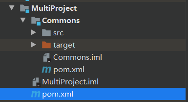 


5. 删掉相应文件(不需要启动类)

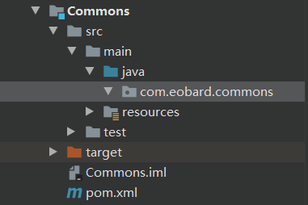 


6. 创建一个工具类

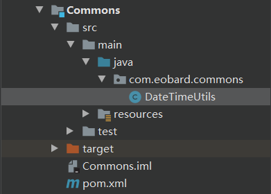 

```java
@Component
public class DateTimeUtils {

    //返回当前时间
    public  String getTime(){
        System.err.println("Commons模块执行了");
        LocalDateTime ldt=LocalDateTime.now();
        DateTimeFormatter dtf=DateTimeFormatter.ofPattern("yyyy-MM-dd HH:mm:ss");
        return dtf.format(ldt);
    }
}
```


### 1.3 搭建Dao层模块

==注意：为了统一，模块里面的包名以com.eobard.xxx开头，便于启动类对包的扫描==

1. 在父项目下新建一个模块，并新建一个Springboot项目

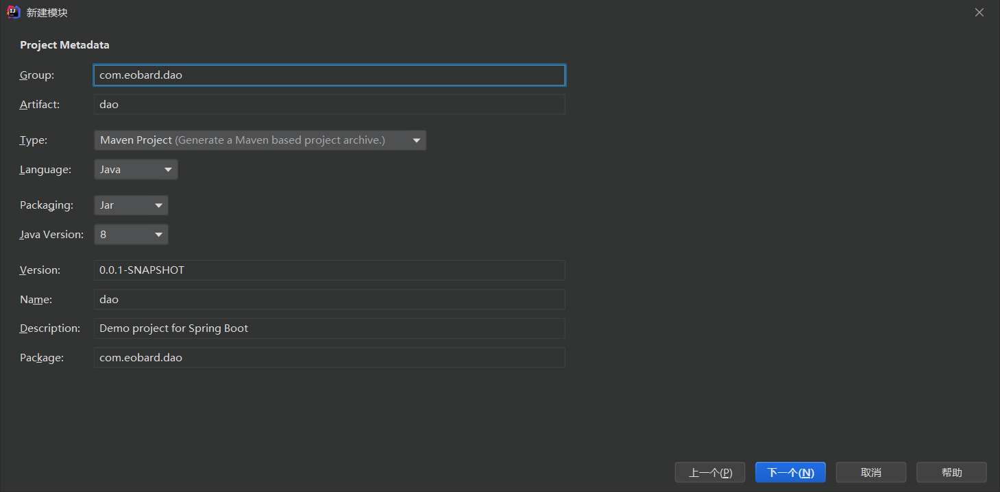

 


2. 修改pom依赖

```xml
<?xml version="1.0" encoding="UTF-8"?>
<project xmlns="http://maven.apache.org/POM/4.0.0" xmlns:xsi="http://www.w3.org/2001/XMLSchema-instance"
         xsi:schemaLocation="http://maven.apache.org/POM/4.0.0 https://maven.apache.org/xsd/maven-4.0.0.xsd">
    <modelVersion>4.0.0</modelVersion>


    <!--引入父模块-->
    <parent>
        <groupId>com.eobard.parent</groupId>
        <artifactId>MultiProject</artifactId>
        <version>0.0.1-SNAPSHOT</version>
    </parent>

    <!--Dao层需要引用Commons层依赖-->
    <dependencies>
        <dependency>
            <groupId>com.eobard.commons</groupId>
            <artifactId>commons</artifactId>
            <version>0.0.1-SNAPSHOT</version>
        </dependency>
    </dependencies>
    
    <groupId>com.eobard.dao</groupId>
    <artifactId>dao</artifactId>
    <version>0.0.1-SNAPSHOT</version>


</project>
```


3. 修改父maven项目的依赖

```xml
 	<!--以pom文件打包-->
    <packaging>pom</packaging>

    <!--引入子模块-->
    <modules>
        <module>Commons</module>
        <module>Dao</module>
    </modules>
```


4. 创建效果

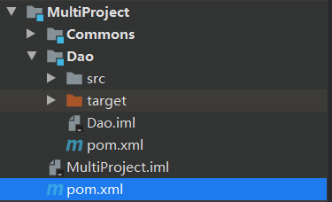 


5. 删掉相应文件(不需要启动类)

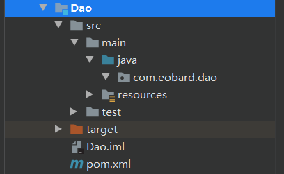 


6. 创建一个数据库访问类

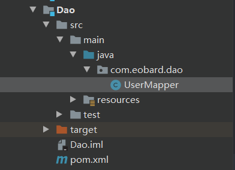 

```java
@Repository
public class UserMapper {

    @Resource
    private DateTimeUtils utils;

    public String getOne(){
        System.err.println("Dao模块执行了");
        return utils.getTime();
    }
}
```


### 1.4 搭建Service层模块

==注意：为了统一，模块里面的包名以com.eobard.xxx开头，便于启动类对包的扫描==

1. 在父项目下新建一个模块，并新建一个Springboot项目

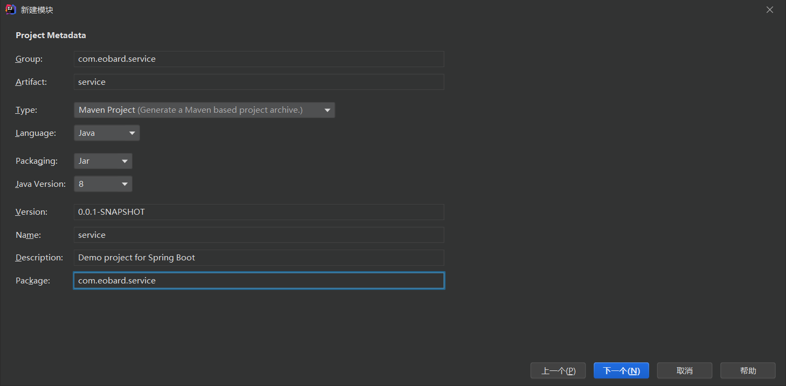

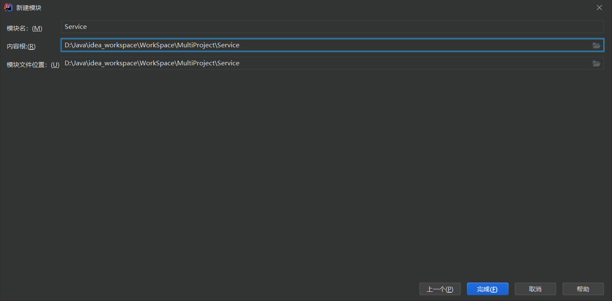


2. 修改pom依赖

```xml
<?xml version="1.0" encoding="UTF-8"?>
<project xmlns="http://maven.apache.org/POM/4.0.0" xmlns:xsi="http://www.w3.org/2001/XMLSchema-instance"
         xsi:schemaLocation="http://maven.apache.org/POM/4.0.0 https://maven.apache.org/xsd/maven-4.0.0.xsd">
    <modelVersion>4.0.0</modelVersion>


    <!--引入父模块-->
    <parent>
        <groupId>com.eobard.parent</groupId>
        <artifactId>MultiProject</artifactId>
        <version>0.0.1-SNAPSHOT</version>
    </parent>

 	<!--Service层需要引用Dao层依赖-->
    <dependencies>
        <dependency>
            <groupId>com.eobard.dao</groupId>
            <artifactId>dao</artifactId>
            <version>0.0.1-SNAPSHOT</version>
        </dependency>
    </dependencies>
    
    <groupId>com.eobard.service</groupId>
    <artifactId>service</artifactId>
    <version>0.0.1-SNAPSHOT</version>
    
</project>
```


3. 修改父maven项目的依赖

```xml
    <!--以pom文件打包-->
    <packaging>pom</packaging>

    <!--引入子模块-->
    <modules>
        <module>Commons</module>
        <module>Dao</module>
        <module>Service</module>
    </modules>
```


4. 创建效果

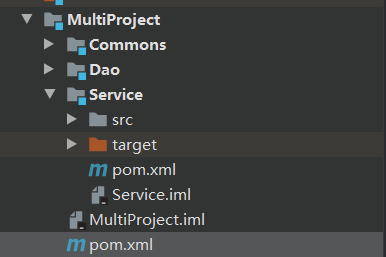 


5. 删掉相应文件(不需要启动类)

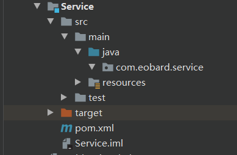 


6. 创建业务类

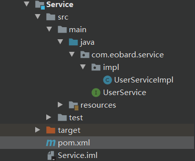 

```java
public interface UserService {

    public String getOne();
}

@Service
public class UserServiceImpl implements UserService {

    @Resource
    private UserMapper userMapper;

    public String getOne() {
        System.err.println("Service模块执行了");
        return userMapper.getOne();
    }
}
```


### 1.5 搭建API层模块

==注意：为了统一，模块里面的包名以com.eobard.xxx开头，便于启动类对包的扫描==

1. 在父项目下新建一个模块，并新建一个Springboot项目

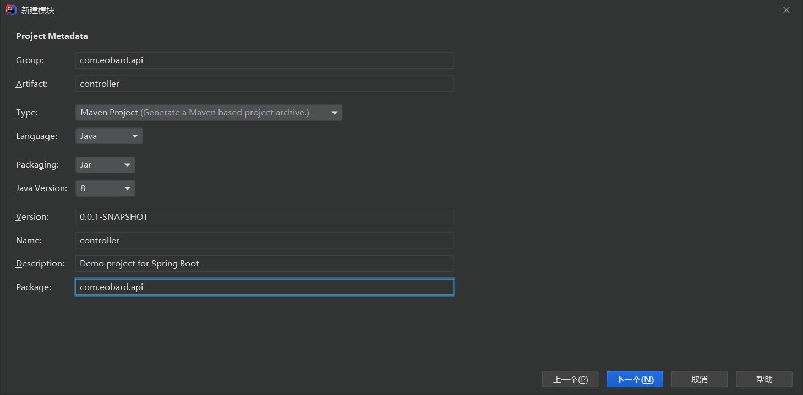


2. 修改pom依赖

```xml
<?xml version="1.0" encoding="UTF-8"?>
<project xmlns="http://maven.apache.org/POM/4.0.0" xmlns:xsi="http://www.w3.org/2001/XMLSchema-instance"
         xsi:schemaLocation="http://maven.apache.org/POM/4.0.0 https://maven.apache.org/xsd/maven-4.0.0.xsd">
    <modelVersion>4.0.0</modelVersion>

    <!--引入父模块-->
    <parent>
        <groupId>com.eobard.parent</groupId>
        <artifactId>MultiProject</artifactId>
        <version>0.0.1-SNAPSHOT</version>
    </parent>

    <!--指定打包为jar包-->
    <packaging>jar</packaging>
    
    <!--Api层需要引用Service层依赖-->
    <dependencies>
        <dependency>
            <groupId>com.eobard.service</groupId>
            <artifactId>service</artifactId>
            <version>0.0.1-SNAPSHOT</version>
        </dependency>
    </dependencies>


    <groupId>com.eobard.api</groupId>
    <artifactId>controller</artifactId>
    <version>0.0.1-SNAPSHOT</version>

    <!--这里需要引用打包插件：需要将web层打包进行访问-->
    <build>
        <plugins>
            <plugin>
                <groupId>org.springframework.boot</groupId>
                <artifactId>spring-boot-maven-plugin</artifactId>
            </plugin>
        </plugins>
    </build>

</project>
```


3. 修改父maven项目的依赖

```xml
 <!--以pom文件打包-->
    <packaging>pom</packaging>

    <!--引入子模块-->
    <modules>
        <module>Commons</module>
        <module>Dao</module>
        <module>Service</module>
        <module>Api</module>
    </modules>
```


4. 创建效果

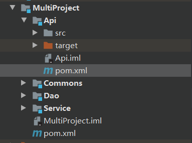 


5. 修配启动类和全局配置文件

```properties
#需要哪些配置文件
spring.profiles.active=Api,Commons,Dao,Service
```

```java
@SpringBootApplication
//因为四个模块的groupId全是com.eobard开头,因此这里设置一个就可以;如果各个模块的groupId不同，则这里要写成数组的形式
//{"com.xx.service", "com.xx.dao"}
@ComponentScan(value = "com.eobard")
public class ControllerApplication {

    public static void main(String[] args) {
        SpringApplication.run(ControllerApplication.class, args);
    }

}
```


6. 创建控制器类

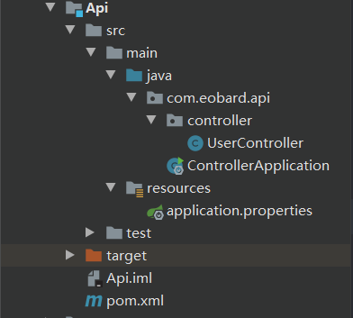 

```java
@Controller
public class UserController {

    @Resource
    private UserService userService;

    @ResponseBody
    @GetMapping("get")
    public String get(){
        System.err.println("Api模块执行了");
        return userService.getOne();
    }

}
```


### 1.6 运行结果


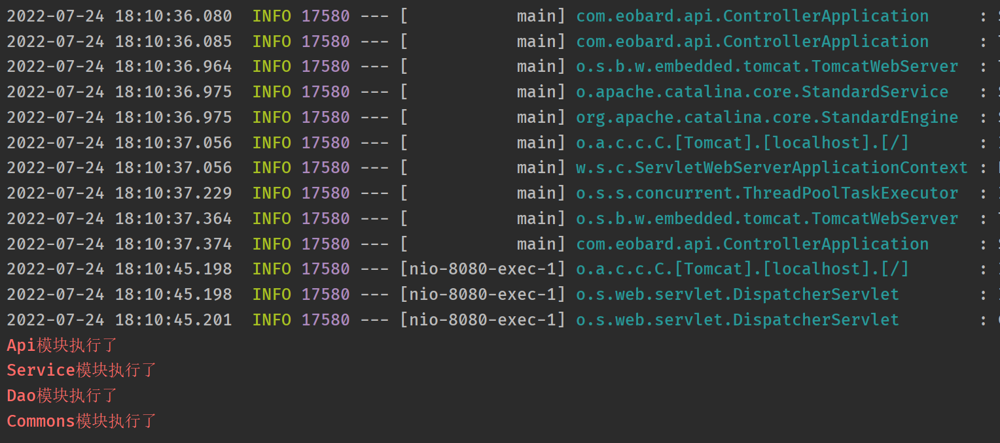


## 二. 加入数据库

1. 在父项目的依赖中加入mysql和MBP依赖

```xml
 	<!-- MyBatis Plus -->
        <dependency>
            <groupId>com.baomidou</groupId>
            <artifactId>mybatis-plus-boot-starter</artifactId>
            <version>3.4.1</version>
        </dependency>
        <!-- mysql -->
        <dependency>
            <groupId>mysql</groupId>
            <artifactId>mysql-connector-java</artifactId>
            <version>5.1.37</version>
        </dependency>
```


2. 在API层模块依赖配置连接信息

```properties
#数据库连接信息
spring.datasource.driver-class-name=com.mysql.jdbc.Driver
spring.datasource.url=jdbc:mysql://localhost:3306/test
spring.datasource.username=root
spring.datasource.password=123456
#打印sql语句
mybatis-plus.configuration.log-impl=org.apache.ibatis.logging.stdout.StdOutImpl
#加载对应的mapper映射文件
mybatis-plus.mapper-locations=classpath:mapper/*.xml
```


3. 在Commons模块添加实体类

```java
@TableName("employee")
public class Employee {

    @TableId(value = "id",type = IdType.AUTO)
    private Integer id;
    private String employeeName;

	//省略getter、setter、toString()
   
}
```

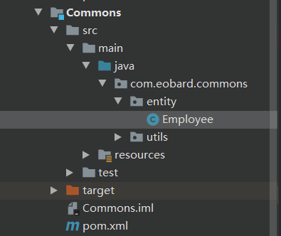 


4. 在Dao层模块创建mapper接口、在resources文件夹创建mapper映射文件

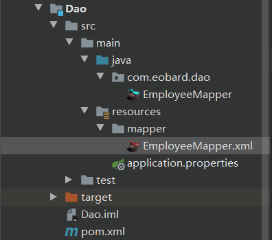 

```java
public interface EmployeeMapper extends BaseMapper<Employee> {

//    @Resource
//    private DateTimeUtils utils;
//
    
    //自定义方法
     Employee getOne();
}
```

```xml
<?xml version="1.0" encoding="UTF-8"?>
<!DOCTYPE mapper PUBLIC "-//mybatis.org//DTD Mapper 3.0//EN"
        "http://mybatis.org/dtd/mybatis-3-mapper.dtd">
<mapper namespace="com.eobard.dao.EmployeeMapper">

    <select id="getOne" resultType="com.eobard.commons.entity.Employee">
        select * from Employee where id=2
    </select>

</mapper>
```


5. 在Service层模块注入并调用Dao层接口

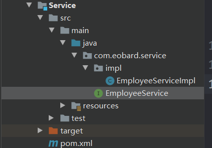 

```java
public interface EmployeeService {

    public String getOne();
}
```

```java
@Service
public class EmployeeServiceImpl implements EmployeeService {

    @Resource
    private EmployeeMapper userMapper;

    public String getOne() {
        System.err.println("Service模块执行了");
        QueryWrapper<Employee> wrapper=new QueryWrapper();
        wrapper.eq("id",1);
        String emp1 = userMapper.selectOne(wrapper).toString();
        String emp2 = userMapper.getOne().toString();
        return emp1+"=="+emp2;
    }
}
```


6. 在API层模块调用

```java
@Controller
public class EmployeeController {

    @Resource
    private EmployeeService userService;

    @ResponseBody
    @GetMapping("get")
    public String get(){
        System.err.println("Api模块执行了");
        return userService.getOne();
    }

}
```


7. 修改API层启动器

```java
@SpringBootApplication
//因为四个模块的groupId全是com.eobard开头,因此这里设置一个就可以;如果各个模块的groupId不同，则这里要写成数组的形式
//{"com.xx.service", "com.xx.dao"}
@ComponentScan(value = "com.eobard")
//扫描包名为com.eobard.dao的接口:即扫描Dao层模块对应包下的接口
@MapperScan("com.eobard.dao")
public class ControllerApplication {

    public static void main(String[] args) {
        SpringApplication.run(ControllerApplication.class, args);
    }

}
```


8. 运行结果


## 三. 打包文件

> **注意：打包的时候一定是按照被依赖的先打包，依赖别人的后打包**

1. 首先将Commons模块、Dao层模块、Service模块的pom文件一起添加以下配置

```xml
 <build>
        <plugins>
            <plugin>
                <groupId>org.springframework.boot</groupId>
                <artifactId>spring-boot-maven-plugin</artifactId>
                <!--没有启动类,为了支持打包,需要配置-->
                <configuration>
                    <skip>true</skip>
                </configuration>
            </plugin>
        </plugins>
    </build>
```


2. 先将父项目install

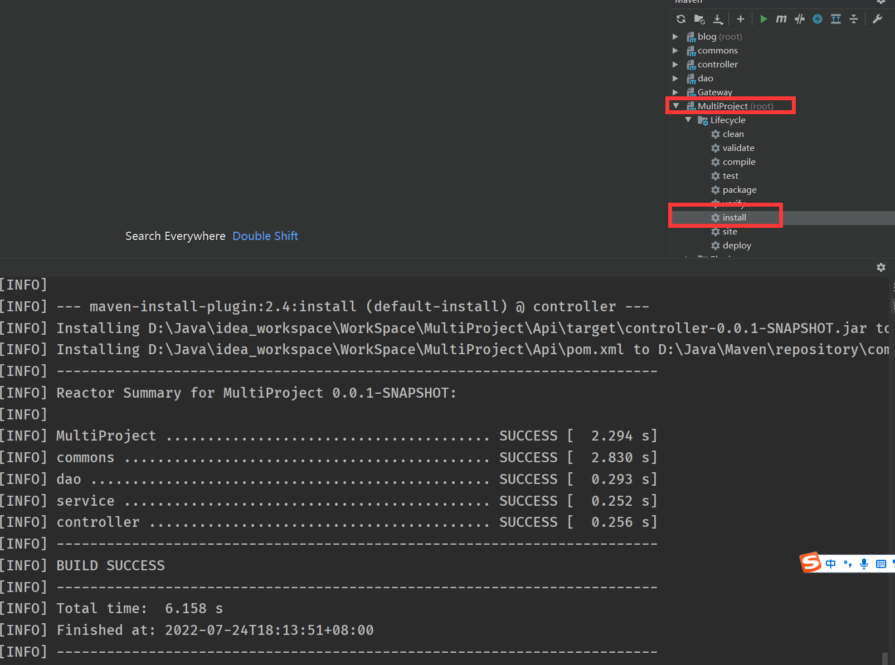


3. 打包Commons

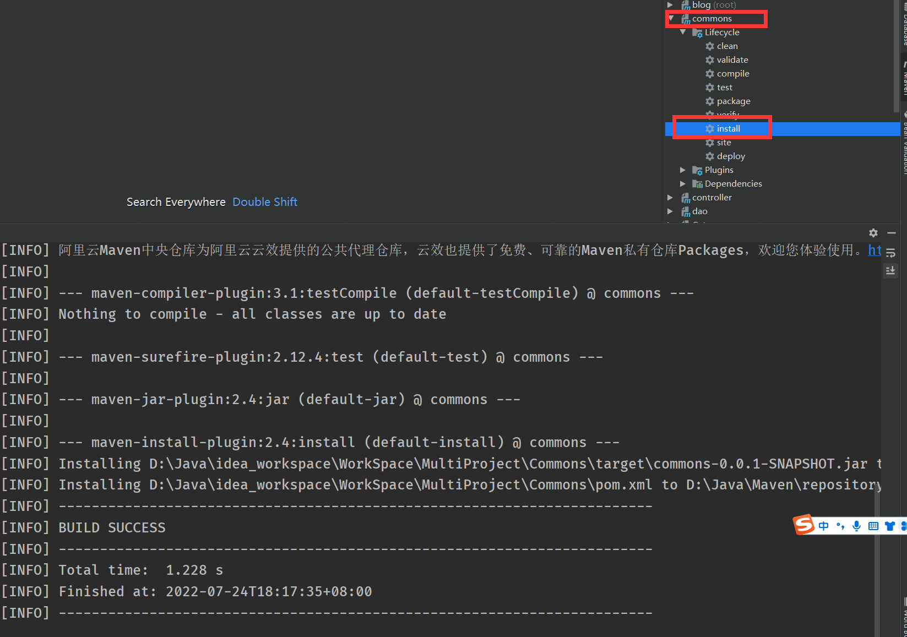


4. 打包Dao层

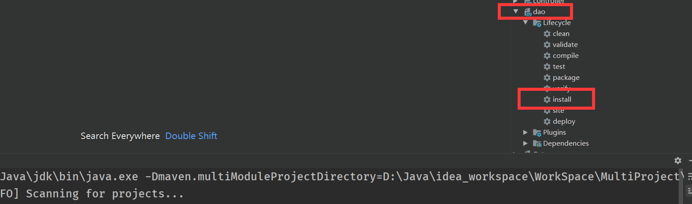


5. 打包Service层

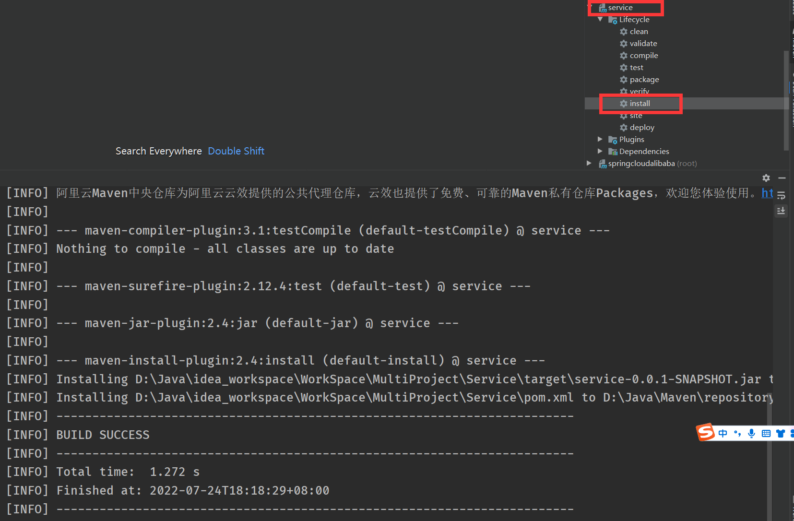


6. 打包Api层

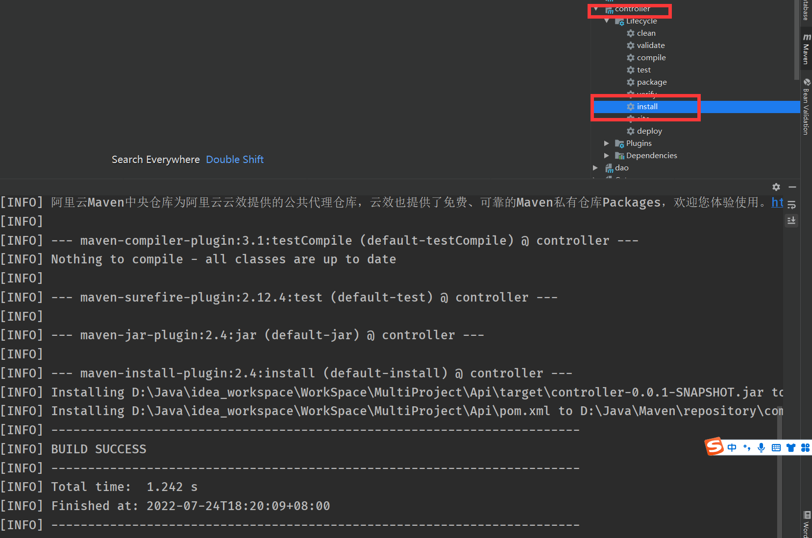


7. 找到打包好的jar，并运行

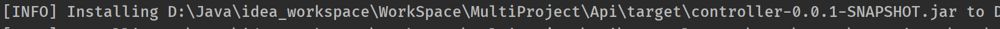


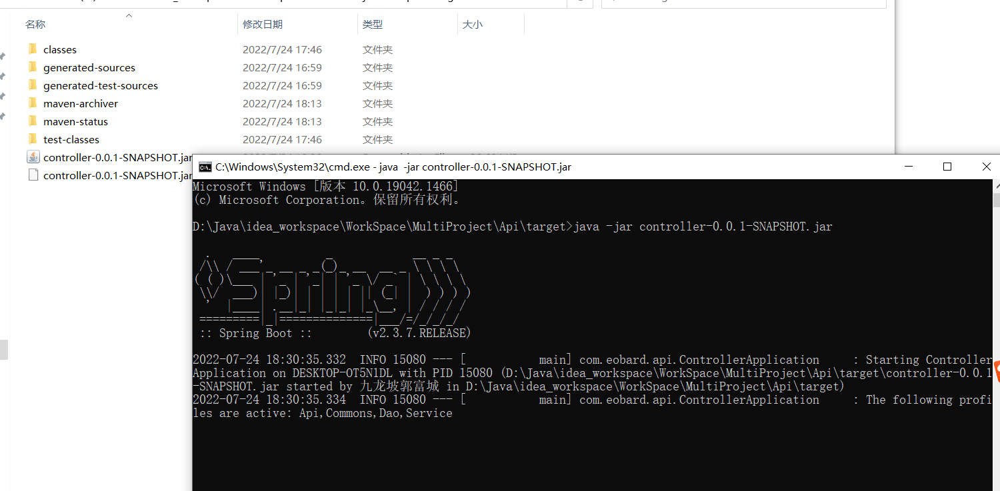


 


###  注意事项

​		若运行jar文件，出现`controller-0.0.1-SNAPSHOT.jar`中没有主清单属性，则需要在Api层修改pom文件

```xml
 <!--这里需要引用打包插件：需要将web层打包进行访问-->
    <build>
        <plugins>
            <plugin>
                <groupId>org.springframework.boot</groupId>
                <artifactId>spring-boot-maven-plugin</artifactId>
                <!--启动类入口-->
                <configuration>
                    <mainClass>com.eobard.api.ControllerApplication</mainClass>
                </configuration>
                
                <executions>
                    <execution>
                        <goals>
                            <goal>repackage</goal>
                        </goals>
                    </execution>
                </executions>
                
            </plugin>
        </plugins>
    </build>
```

