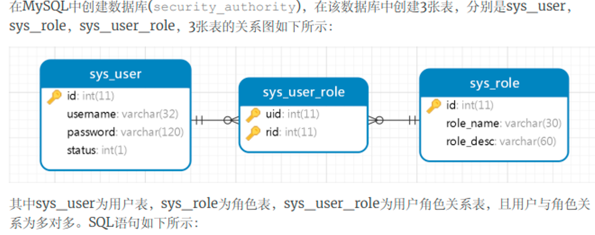

# Spring Security

> * Spring Security是spring采用AOP思想，基于servlet过滤器实现的安全框架。它提供了完善的认证 机制和方法级的授权功能，是一款非常优秀的权限管理框架。
> * Spring Security的安全管理有两个重要概念，分别是Authentication（认证）和Authorization（授 权）。其中认证即确认用户是否登录，并对用户进行管控；授权即确定用户所拥有的功能权限，并对用户权限进行管控。


## 基础阶段

### 一.  入门案例

`1.创建Maven的Web项目,导入依赖`

```xml-dtd
    <!-- spring-security-config -->
    <dependency>
      <groupId>org.springframework.security</groupId>
      <artifactId>spring-security-config</artifactId>
      <version>5.3.5.RELEASE</version>
    </dependency>
    <!-- spring-security-taglibs -->
    <dependency>
      <groupId>org.springframework.security</groupId>
      <artifactId>spring-security-taglibs</artifactId>
      <version>5.3.5.RELEASE</version>
    </dependency>
```


`2.配置web.xml`

```xml-dtd
<!--监听spring上下文-->
    <context-param>
        <param-name>contextConfigLocation</param-name>
        <param-value>classpath:spring-security.xml</param-value>
    </context-param>
    <listener>
        <listener-class>org.springframework.web.context.ContextLoaderListener</listener-class>
    </listener>

    <!--Spring Security过滤器链，注意过滤器名称必须叫springSecurityFilterChain-->
  <filter>
    <filter-name>springSecurityFilterChain</filter-name>
    <filter-class>org.springframework.web.filter.DelegatingFilterProxy</filter-class>
  </filter>
  <filter-mapping>
    <filter-name>springSecurityFilterChain</filter-name>
    <url-pattern>/*</url-pattern>
  </filter-mapping>
```


`3.创建spring-security.xml`

>  access：拦截方式
>                 	   isFullyAuthenticated( ) :   该资源需要认证才可以访问
>  				 	  isAuthenticated( ):			该资源需要认证才可以访问
>  				 	  isAnonymous( )  :      	匿名用户(未登录)才可以访问，已经登录的无法访问
>  					   permitAll( ):						所有用户（不管是否登录）都可以访问
>  					   hasRole( ):    					拥有指定角色才可以访问
>  				 	  hasAnyRole( ): 				拥有给出角色就可以访问

==`isAuthenticated()` 如果用户不是匿名用户则返回true；`isFullyAuthenticated()` 如果用户不是匿名或记住我用户，则返回 true==

```xml-dtd
<?xml version="1.0" encoding="UTF-8"?>
<beans xmlns="http://www.springframework.org/schema/beans"
       xmlns:security="http://www.springframework.org/schema/security"
       xmlns:xsi="http://www.w3.org/2001/XMLSchema-instance"
       xsi:schemaLocation="http://www.springframework.org/schema/beans
http://www.springframework.org/schema/beans/spring-beans.xsd
http://www.springframework.org/schema/security
http://www.springframework.org/schema/security/spring-security.xsd">
    <!--
        auto-config:是否自动加载spring security的配置文件
        use-expressions:是否使用SpEL表达式来配置spring security
    -->
    <security:http auto-config="true" use-expressions="true">
        <!-- 定义过滤规则
                pattern:对哪些url进行权限控制
                access:在请求对应的url时需要什么角色或权限
         -->
        <security:intercept-url pattern="/admin/**"  access="hasRole('ROLE_ADMIN')"/>
        <security:intercept-url pattern="/user/**"  access="hasRole('ROLE_USER')"/>
        <security:intercept-url pattern="/**"  access="hasAnyRole('ROLE_USER','ROLE_ADMIN')"/>
    </security:http>

    <!-- 设置Spring Security认证用户信息的来源 -->
    <security:authentication-manager>
        <security:authentication-provider>
            <security:user-service>
                <!-- 定义用户
                    用户名为marry,密码为123456,{noop}表示密码不进行加密处理
                    且角色为ROLE_USER
                -->
                <security:user name="marry" password="{noop}123456" authorities="ROLE_USER"/>
                <security:user name="admin" password="{noop}123456" authorities="ROLE_ADMIN"/>
            </security:user-service>
        </security:authentication-provider>
    </security:authentication-manager>
</beans>
```

==注意：**角色名只能以`ROLE_`开头**，eg：ROLE_MANAGER==


`4.测试`

> ​			访问 /admin/index 		=》   http://localhost:8080/login
>
> ​			访问/user/index			 =》    http://localhost:8080/login
>
> ​			登录自定义admin身份并访问/user/index   =》`HTTP Status 403 – 被禁止,权限不足`
>
> ​			登录自定义user身份并访问/admin/index   =》`HTTP Status 403 – 被禁止,权限不足`


### 二. 自定义登录页面

> Spring-Security默认使用的是Bootstrap的登录页面，若需要改变可以自定义

`1.创建自定义登录页面、错误页面`

`2.spring-security.xml文件增加配置`

```xml-dtd
  <!--直接释放无需经过SpringSecurity过滤器的静态资源-->
    <security:http pattern="/statics/**" security="none"/>
    <security:http pattern="/favicon.ico" security="none"/>

  <security:http auto-config="true" use-expressions="true">
        <!--让自定义登录页面可以匿名访问-->
<security:intercept-url pattern="/login.jsp" access="permitAll()"/>
<security:intercept-url pattern="/**"  access="hasAnyRole('ROLE_USER','ROLE_ADMIN')"/>

        <!--配置自定义认证信息-->
<security:form-login 
			login-page="/login.jsp"			 		<!--自定义登录页面的位置-->
			login-processing-url="/login"	 		<!--登录请求交给spring-security处理-->
            default-target-url="/index.jsp"   		<!--自定义登录成功的位置-->
            authentication-failure-url="/error.jsp"  <!--自定义登录失败的位置-->
            username-parameter="username"		 <!--自定义登录页面的用户名的name值-->
            password-parameter="password"/> 	 <!--自定义登录页面的密码的name值-->

        <!--CSRF:测试自定义登录页面时可以关闭,真正的项目为了安全,不建议关闭 -->
        <security:csrf disabled="true"/>

    </security:http>
```


### 三. CSRF防护机制

#### 3.1 概念

* 跨站请求伪造（Cross-site request forgery），通常缩写为 CSRF 或者 XSRF， 是一种挟制用 户在当前已登录的Web应用程序上执行非本意的操作的攻击方法。跟跨网站脚本（XSS）相比，XSS 利用的是用户对指定网站的信任，CSRF 利用的是网站对用户网页浏览器的信任。 
* 跨站请求攻击，简单地说，是攻击者通过一些技术手段欺骗用户的浏览器去访问一个自己曾经认证过的网站并运行一些操作（如发邮件，发消息，甚至财产操作如转账和购买商品）。由于浏览器曾经认证过，所以被访问的网站会认为是真正的用户操作而去运行。这利用了web中用户身份验证的一 个漏洞：简单的身份验证只能保证请求发自某个用户的浏览器，却不能保证请求本身是用户自愿发的。


#### 3.2  JSP页面携带Token令牌

`1.spring-security.xml取消禁用CSRF`

```xml-dtd
 <security:csrf disabled="false"/>
```

==**注意：Spring Security默认开启了CSRF，所以不用手动设置disabled="false"，直接将上面那句话删除即可**==


`2.JSP携带令牌`

```jsp
<!--导入标签-->
<%@ taglib prefix="security" uri="http://www.springframework.org/security/tags" %>

<!--form表单中携带token令牌-->
    <form action="/login" method="post">
        <security:csrfInput/>
        用户名：<input type="text" name="username" /><br/>
        密码：<input type="password" name="password" /><br/>
        <input type="submit" value="登录" />
    </form>
```

==注意：该方式只能适用于JSP页面，不适用于HTML==

`3.注意`

​				如果不携带令牌直接提交的话，会直接出现403 Forbidden拒绝访问！


#### 3.2 Thymeleaf携带令牌

```HTML
<form action="/login" method="post">
    <!--隐藏域,通过EL表达式保存Spring Security提供的Token信息-->
 	<input type="hidden" th:name="${_csrf.parameterName}" th:value="${_csrf.token}" />
    账号：<input type="text" name="username"> <br>
    密码：<input type="text" name="password"> <br>
    <label>
        <input type="checkbox" name="remember-me" value="true"/>记住我
    </label>
        <input type="submit" value="login">
</form>
```

==注意：原生的HTML5页面不支持EL表达式，Thymeleaf或者Vue模板是支持的==


#### 3.3 Ajax方式携带令牌

`1.创建控制器测试方法`

```JAVA
    //该方法仅是为了测试
    @RequestMapping("/sys/user/add")
    @ResponseBody
    public Map<String,Object> add(String userName,String password){
        Map<String,Object> map = new HashMap<String,Object>();
        map.put("success",true);
        map.put("message","添加成功");
        return map;
    }
```


`2.前台代码`

```HTML
<html>
<head>
    <!-- 获取CSRF Token -->
    <meta name="_csrf" content="${_csrf.token}"/>
    <!-- 获取CSRF头，默认为X-CSRF-TOKEN -->
    <meta name="_csrf_header" content="${_csrf.headerName}"/>

    <script src="https://apps.bdimg.com/libs/jquery/2.1.4/jquery.min.js"></script>
</head>
<body>
        <form id="myform">
            <div>
                <label>用户名：</label>
                <input type="text" name="userName">
            </div>
            <div>
                <label>密码：</label>
                <input type="password" name="password">
            </div>
            <div>
                <input type="button" id="btn" value="提交">
            </div>
        </form>
</body>
</html>
<script>
    //获取<meta>标签中封装的CSRF Token
    var token = $("meta[name='_csrf']").attr("content");
    var header = $("meta[name='_csrf_header']").attr("content");
    //将头中的CSRF Token信息进行发送
    $(document).ajaxSend(function (e,xhr,options) {
        xhr.setRequestHeader(header,token);
    });
    
    $(function () {
        $("#btn").click(function () {
            $.post("/sys/user/add",$("#myform").serialize(),function(result){
                console.log(result);
            },"json");
        });
    })
</script>
```

> web开发中，经常要进行表单提交，有时候表单有大量的数据，如果一个个元素获取值，效率太低，所以jQuery提供了一个函数，可以一次性提交整个表单：
>
> ​					**$("#myForm").serialize()		//userName=eobard&password=123**


### 四. 数据库认证

#### 4.1 环境准备

​					本章以后，开发环境为SSM

`1.DB`



```sql
CREATE DATABASE security_authority;
use security_authority;

drop table if exists `sys_role`;
create table `sys_role` (
 `id` int(11) not null auto_increment comment '编号',
 `role_name` varchar(30) default null comment '角色名称',
 `role_desc` varchar(60) default null comment '角色描述',
 primary key (`id`) using btree,
 key `id` (`id`)
) engine=innodb default charset=utf8;
insert into `sys_role`(`id`,`role_name`,`role_desc`) values
(1,'ROLE_USER','普通用户'),(2,'ROLE_ADMIN','管理员'),
(3,'ROLE_PRODUCT','产品管理员'),(4,'ROLE_ORDER','订单管理员');
drop table if exists `sys_user`;
create table `sys_user` (
 `id` int(11) not null auto_increment,
 `username` varchar(32) not null comment '用户名称',
 `password` varchar(120) not null comment '密码',
 `status` int(1) default '1' comment '1开启0关闭',
 primary key (`id`)
) engine=innodb default charset=utf8;
insert into `sys_user`(`id`,`username`,`password`,`status`) values
(1,'tom','$2a$10$nDbBLveNnpBSIELMIHFRKOJ8wGtAKYOcPsAgZ6kXVlvtddlDNdQMy',1),
(2,'admin','$2a$10$nDbBLveNnpBSIELMIHFRKOJ8wGtAKYOcPsAgZ6kXVlvtddlDNdQMy',1
),
(3,'jerry','$2a$10$nDbBLveNnpBSIELMIHFRKOJ8wGtAKYOcPsAgZ6kXVlvtddlDNdQMy',1
);
drop table if exists `sys_user_role`;
create table `sys_user_role` (
 `uid` int(11) not null comment '用户编号',
 `rid` int(11) not null comment '角色编号',
 primary key (`uid`,`rid`) using btree,
 key `FK_Reference_10` (`rid`),
 constraint `FK_Reference_10` foreign key (`RID`) references `sys_role`
(`ID`),
 constraint `FK_Reference_9` foreign key (`UID`) references `sys_user`
(`id`)
) engine=innodb default charset=utf8;
insert into `sys_user_role`(`uid`,`rid`) values (1,1),(2,1),(3,1),(2,2),
(1,3),(2,3),(2,4),(3,4);
```

> 密码都为123456


`2.创建SSM-Maven项目`


#### 4.2 基于数据库认证

`1.将spring-security.xml文件复制到resource文件夹下,并修改配置`

```xml-dtd
 <!-- 切换成数据库中的用户名和密码 -->
    <security:authentication-manager>
        <security:authentication-provider user-service-ref="sysUserServiceImpl">
        </security:authentication-provider>
    </security:authentication-manager>
```

==注意：这里的`sysUserServiceImpl`是Service层实现类bean的ID==


`2.增加web.xml配置`

```XML
<!-- SpringSecurity过滤器链 -->
  <filter>
    <filter-name>springSecurityFilterChain</filter-name>
    <filter-class>org.springframework.web.filter.DelegatingFilterProxy</filter-class>
  </filter>
  <filter-mapping>
    <filter-name>springSecurityFilterChain</filter-name>
    <url-pattern>/*</url-pattern>
  </filter-mapping>

  <!-- 加载spring配置文件 -->
  <listener>
    <listener-class>org.springframework.web.context.ContextLoaderListener</listener-class>
  </listener>
  <!-- 上下文参数配置 -->
  <context-param>
    <param-name>contextConfigLocation</param-name>
    <!-- 使用*号通配符，通配符前面的字符要一致 -->
    <param-value>
      classpath:applicationContext*.xml
      classpath:spring-security.xml
    </param-value>
  </context-param>
<!--省略其它-->
```


`3.Entity层代码`


 

 


`4.Dao层代码`

```JAVA
public interface SysUserMapper {
    SysUser findUserByUserName(String userName);
}
```


==**注意：这里通过懒加载，可以避免直接三表查询从而提高性能。**==


```JAVA
public interface SysRoleMapper {
    List<SysRole> findRoleListByUserId(Integer userId);
}
```


==**注意：这里只需要查询SysUser和SysRole之间的中间表和SysRole表既可，不需要三表查询**==


`5.Service层代码`

```JAVA
//接口: 需要继承Spring security的认证类,来实现自定义认证
public interface SysUserService extends UserDetailsService {
    
}

//实现类
@Service
@Transactional
public class SysUserServiceImpl implements SysUserService {
    @Resource
    private SysUserMapper sysUserMapper;


    @Override
    public UserDetails loadUserByUsername(String userName) throws UsernameNotFoundException {
        List<SimpleGrantedAuthority> authorities = new ArrayList<SimpleGrantedAuthority>();
        //调用根据用户名查询用户信息的方法
        SysUser sysUser = sysUserMapper.findUserByUserName(userName);
        //循环当前用户的角色列表并添加到权限中
        sysUser.getRoleList()
                .forEach( role ->
                        authorities.add(
                                new SimpleGrantedAuthority(role.getRoleName())
                        )
                );


        //创建认证用户对象
        //参数1：用户名
        //参数2：密码，其中{noop}表示不进行密码加密处理
        //参数3：角色列表
        User user = new User(sysUser.getUserName(),"{noop}"+sysUser.getPassword(),authorities);
        //返回认证用户对象
        return user;
    }
}

```

==**注意：这里的SysUserServiceImpl实现类的id默认为sysUserServiceImpl对应步骤1的user-service-ref**==


`6.login.jsp`

```JSP
<form action="/login" method="post">
    <%-- 携带token请求 --%>
  <security:csrfInput/>
    账号：<input type="text" name="username"> <br>
    密码：<input type="text" name="password"> <br>
        <input type="submit" value="login">
</form>
```


`7.注意事项`

1. **使用了Spring Security 认证，就不需要在controller创建一个Login的方法，业务层已经实现了**
2. **login.jsp页面需要携带token令牌**


#### 4.3 密码加密

​				使用了Spring Security的密码加密，如果密码都是相同的，每次生成的字符都是不同的，但是Spring Security的解密却可以识别出原始的密码，不同于Shiro的加密方式。


`1.修改spring-security.xml`

```xml-dtd
<!-- 配置加密类 -->
    <bean id="passwordEncoder" class="org.springframework.security.crypto.bcrypt.BCryptPasswordEncoder"/>

    <!-- 切换成数据库中的用户名和密码 -->
    <security:authentication-manager>
        <security:authentication-provider user-service-ref="sysUserServiceImpl">
            <!-- 引用加密类 -->
            <security:password-encoder ref="passwordEncoder"/>
        </security:authentication-provider>
    </security:authentication-manager>
```


`2.修改Service层的实现类`

```JAVA
//需要继承Spring Security的实体类
public interface SysUserService extends UserDetailsService {

}
```

```JAVA
@Service
@Transactional
public class SysUserServiceImpl implements SysUserService {
    @Resource
    private SysUserMapper sysUserMapper;


    @Override
    public UserDetails loadUserByUsername(String userName) throws UsernameNotFoundException {
        List<SimpleGrantedAuthority> authorities = new ArrayList<SimpleGrantedAuthority>();
        SysUser sysUser = sysUserMapper.findUserByUserName(userName);
        sysUser.getRoleList()
                .forEach( role ->
                        authorities.add(
                                new SimpleGrantedAuthority(role.getRoleName())
                        )
                );
        //替换掉原来的不加密
        User user = new User(sysUser.getUserName(),sysUser.getPassword(),authorities);
        return user;
    }
}
```


`3.可选的密码加密工具类`

```JAVA
public class PasswordUtils {
    /**
     * 密码加密
     * @param password
     * @return
     */
    public static String encode(String password){
        return new BCryptPasswordEncoder().encode(password);
    }
    
}
```


#### 4.4 用户状态

​					在实际开发中，用户表中一般会有用户状态字段(status)，该字段用于标识用户是否能够正常使用，比如用户注销或管理员删除该用户后，该用户不能直接从数据库中删除，而是让他不能登录系统。

 


`修改登录的Service层`

```JAVA
@Service
@Transactional
public class SysUserServiceImpl implements SysUserService {
    @Resource
    private SysUserMapper sysUserMapper;


    @Override
    public UserDetails loadUserByUsername(String userName) throws UsernameNotFoundException {
        List<SimpleGrantedAuthority> authorities = new ArrayList<SimpleGrantedAuthority>();
        //调用根据用户名查询用户信息的方法
        SysUser sysUser = sysUserMapper.findUserByUserName(userName);
        //循环遍历角色列表
        sysUser.getRoleList()
                .forEach( role ->
                        authorities.add(
                                new SimpleGrantedAuthority(role.getRoleName())
                        )
                );

        //返回认证用户对象
        User user=new User(sysUser.getUserName(),
                            sysUser.getPassword(),
                            sysUser.getStatus()==1,//判断该用户是否启用
                            true,
                            true,
                            true,
                            authorities
                );
        return user;
    }
}
```

> Spring Security自带的两个认证登录类：
>
> * public User(String username, String password, Collection authorities)：参数依次是：用户名、密码、角色列表
> * public User (String username, String password, boolean enabled, boolean accountNonExpired, boolean credentialsNonExpired,boolean accountNonLocked, Collection authorities)：参数依次是：用户名、密码、账户是否可用、账户是否失效、密码是否过 期、账户是否锁定、角色列表

* boolean enabled：账号是否可用(true：可用，false：不可用) 
* boolean accountNonExpired：账号是否失效(true：未失效，false：已失效) 
* boolean credentialsNonExpired：密码是否过期(true：未过期，false：已过期)
*  boolean accountNonLocked：账号是否被锁定(true：未锁定，false：已锁定)

==注意：以上4个boolean类型的数值必须同时为true，才能够认证通过！==


### 五. 记住我功能

​						在实际项目开发中，为了用户登录方便，会提供记住我(Remember-Me)功能。如果用户勾选了记住我选项，那么在一段时间内，会默认自动登录。

​						Spring Security针对记住我功能提供了两种实现方式：一种是简单地使用加密来保证基于Cookie中Token安全；另一种是通过数据库或者持久化机制来保存生成的Token。


#### 5.1 基于Cookie

`1.登录页面`

```HTML
<form action="/login" method="post">
    <%-- 携带token请求 --%>
    <security:csrfInput/>
    账号：<input type="text" name="username"> <br>
    密码：<input type="text" name="password"> <br>
        
    <label>
        <input type="checkbox" name="remember-me" value="true"/>记住我
    </label>
        <input type="submit" value="login">
</form>
```

* name属性值必须是remember-me
* value属性值必须是true，on，yes，1其中一个


`2.修改spring-security.xml`

```xml-dtd
 <security:http auto-config="true" use-expressions="true">

        <!--开启remember me过滤器，设置token存储时间为60秒-->
        <security:remember-me token-validity-seconds="60"/>

  		<security:intercept-url pattern="/**"  access="isAuthenticated()"/>

		<!--省略其它-->
</security:http>
```


`3.使用IE浏览器测试`

​			使用IE浏览器测试可以直观的看出效果，如果使用其它浏览器(如Edge)会出现Cookie过期了还是可以登录成功(需要在系统中加入注销功能来使Cookie失效)


#### 5.2 remember me安全性分析

​				基于Cookie毕竟是保存在客户端的， 很容易盗取，而且cookie的值还与用户名、密码这些敏感数据相关，虽然加密了，但是将敏感信息存在客户端，还是不太安全。

​				Spring Security还提供了remember me的另一种相对**更安全的实现机制** :在客户端的 cookie中，仅保存一个无意义的加密串（与用户名、密码等敏感数据无关），然后在数据库中保存该加密串-用户信息的对应关系，自动登录时，用cookie中的加密串，到数据库中验证，如果通过，自动登录才算通过。


#### 5.3 持久化token信息(推荐)

​			在数据库中创建一个存储Cookie信息的持续登录用户表`persistent_logins`，需要注意的是，**该表的名称和字段名称都是固定的,不能修改。**

`1.创建表`

```sql
use security_authority;
CREATE TABLE `persistent_logins` (
`username` varchar(64) NOT NULL,
`series` varchar(64) NOT NULL,
`token` varchar(64) NOT NULL,
`last_used` timestamp NOT NULL,
PRIMARY KEY (`series`)
) ENGINE=InnoDB DEFAULT CHARSET=utf8;
```


`2.修改spring-security.xml`

```xml-dtd
 <security:http auto-config="true" use-expressions="true">

   <!--
         开启remember me过滤器，
         data-source-ref="dataSource" 指定数据库连接池
         token-validity-seconds="60" 设置token存储时间为60秒 可省略
    -->
     <security:remember-me data-source-ref="dataSource" token-validity-seconds="60"/>


		<!--省略其它-->
</security:http>  
```


`3.测试`

​			使用IE浏览器登录后发现，`persistent_logins`表多了一行数据

 


### 六. 显示用户名和退出登录

#### 6.1 显示用户名

`JSP页面中使用`

```JSP
<%@ page contentType="text/html;charset=UTF-8" language="java" %>
<!--导入标签-->
<%@ taglib prefix="security"
           uri="http://www.springframework.org/security/tags" %>
<html>
<head>
</head>
<body>


<h1>
    <!--方式1:-->
    <security:authentication property="principal.username" />
    <br>
    <!--方式2:-->
    <security:authentication property="name" />
</h1>

</body>
</html>
```

==注意：其中property中的**principal.username**和**name**为固定写法，不可变==


#### 6.2 自带的退出登录

`1.JSP页面`

```JSP
<%@ page contentType="text/html;charset=UTF-8" language="java" %>
<%@ taglib prefix="security"
           uri="http://www.springframework.org/security/tags" %>
<html>
<head>
</head>
<body>

<h1>
    <security:authentication property="principal.username" />
    <br>
    <security:authentication property="name" />
    <!--自带的退出登录必须是post提交且还要携带令牌-->
    <form action="/logout" method="post">
        <security:csrfInput/>
        <input type="submit" />
    </form>

</h1>

</body>
</html>


```


`2.spring-security.xml配置`

```xml-dtd
 <security:http auto-config="true" use-expressions="true">
		<!--省略其它-->
 		<security:logout logout-success-url="/login.jsp" invalidate-session="true" logout-url="/logout" />
    </security:http>
```

> 需要注意的是: 如果Spring Security中的CSRF是开启状态，则注销请求必须是POST请求，否则无法正常使用注销功能。


#### 6.3 自定义退出登录(推荐)

`1.spring-security.xml配置`

​			将<security:logout logout-success-url="/login.jsp" invalidate-session="true" logout-url="/logout" />  删除


`2.控制器自定义退出功能`

```JAVA
    @RequestMapping("logout")
    public String logout(HttpSession session){
        session.invalidate();
        return "redirect:/login.jsp";
    }
```


`3.JSP页面使用`

```JSP
    <a href="/logout">注销</a>
```


### 七.  Spring Security授权

#### 7.1 动态显示菜单

`JSP页面中`

```jsp
    	<security:authorize access="hasAnyRole('ROLE_ADMIN','ROLE_ORDER')">
            <li><a href="#">订单管理</a></li>
        </security:authorize>

        <security:authorize access="hasAnyRole('ROLE_PRODUCT','ROLE_ADMIN')">
            <li><a href="#">产品管理</a></li>
        </security:authorize>

		<security:authorize access="hasRole('ROLE_ADMIN')">
            <li><a href="#">系统管理</a></li>
        </security:authorize>
        
		<security:authorize access="hasAnyRole('ROLE_ADMIN','ROLE_USER')">
            <li><a href="#">客户管理</a></li>
        </security:authorize>
```

> 使用tom、admin、jerry登录

 

   

#### 7.2 注解实现授权

* @Secured：该注解是Spring Security内部的权限注解，需要启用secured-annotations配置。
* @PreAuthorize：该注解是Spring EL表达式提供的权限注解，需要启用pre-post-annotations配置。
* @RolesAllowed：该注解是JSR250权限注解，需要启用jsr250-annotations配置。


`1.修改springmvc.xml文件`

```xml-dtd
<!--
    开启AOP注解支持,proxy-target-class="true"表示使用cglib代理
--> 
<aop:aspectj-autoproxy proxy-target-class="true"/>
```


`2.spring-security.xml添加注解支持`

```xml-dtd
    <security:global-method-security  pre-post-annotations="enabled"  secured-annotations="enabled" jsr250-annotations="enabled" />
```


`3.pom.xml添加依赖`

```XML
   <dependency>
      <groupId>javax.annotation</groupId>
      <artifactId>jsr250-api</artifactId>
      <version>1.0</version>
    </dependency>
```


`4.修改jsp页面`

```JSP
<ul>
        <security:authorize access="hasAnyRole('ROLE_ADMIN','ROLE_ORDER')">
            <li><a href="/order/index">订单管理</a></li>
        </security:authorize>
    
        <security:authorize access="hasAnyRole('ROLE_PRODUCT','ROLE_ADMIN')">
            <li><a href="/product/index">产品管理</a></li>
        </security:authorize>
    
        <security:authorize access="hasRole('ROLE_ADMIN')">
            <li><a href="sys/index">系统管理</a></li>
        </security:authorize>
    
        <security:authorize access="hasAnyRole('ROLE_ADMIN','ROLE_USER')">
            <li><a href="#">客户管理</a></li>
        </security:authorize>
</ul>
```


`5.创建控制器并添加注解支持`

```JAVA
//订单管理控制器
@Controller
@PreAuthorize("hasAnyRole('ROLE_ADMIN','ROLE_ORDER')")
@RequestMapping("order")
public class Order {

    @ResponseBody
    @GetMapping("/index")
    public String index(){
        return "order";
    }
}
```

```java
//产品管理控制器
@Controller
@RequestMapping("product")
@PreAuthorize("hasAnyRole('ROLE_ADMIN','ROLE_PRODUCT')")
public class Product {

    @ResponseBody
    @GetMapping("/index")
    public String index(){
        return "product";
    }
}
```

```JAVA
//系统管理控制器
@Controller
@RequestMapping("sys")
@PreAuthorize("hasAnyRole('ROLE_ADMIN')")
public class Sys {

    @ResponseBody
    @GetMapping("/index")
    public String index(){
        return "sys";
    }
}
```


#### 7.3 注解

##### 7.3.1 JSR-250注解

* @PermitAll   //表示允许所有的角色进行访问，也就是说不进行权限控制
* @DenyAll   //表示无论什么角色都不能访问
* @RolesAllowed({"USER", "ADMIN"})  //只要具有"USER", "ADMIN"任意一种角色就可以访问。这里可以省略前缀ROLE_ 实际的权限是ROLE_ADMIN


##### 7.3.2 @Secured注解

* @Secured({"ROLE_ADMIN","ROLE_SHOW"})  //该方法只要具有ROLE_ADMIN角色就可以访问


##### 7.3.3 @PreAuthorize(推荐使用)

* @PreAuthorize("hasRole('ROLE_ADMIN') and hasRole('ROLE_PRODUCT')")	//该方法要同时拥有ROLE_ADMIN和ROLE_PRODUCT才能访问
* @PreAuthorize("hasRole('ROLE_ADMIN') or hasRole('ROLE_PRODUCT')")	   //该方法拥有ROLE_ADMIN或ROLE_PRODUCT才可以访问
* @PreAuthorize("hasAnyRole('ROLE_ADMIN','ROLE_SHOW')")       //hasAnyRole同时设置多个


### 八. 自定义错误页面

#### 8.1 方式1

`在spring-security.xml文件中配置`

```xml-dtd
<security:http pattern="/403.jsp" security="none"/>

<security:http auto-config="true" use-expressions="true">
 <!--省略其它配置-->
     <!--403异常处理-->
     <security:access-denied-handler error-page="/403.jsp"/>
</security:http>

```

> 适用于非微服务开发


#### 8.2 方式2

`在web.xml文件中配置`

```xml-dtd
<error-page>
 <!-- 错误编码 -->
 <error-code>403</error-code>
 <!-- 错误页 -->
 <location>/403.jsp</location>
</error-page>
```

> 适用于非微服务开发


#### 8.3 方式3(推荐)

`1.编写异常类`

```JAVA
package com.eobard.exception;

@ControllerAdvice
public class ControllerExceptionAdvice {
     //只有出现AccessDeniedException异常才跳转403.jsp页面
     @ExceptionHandler(AccessDeniedException.class)
     public String exceptionAdvice(){
     return "forward:/403.jsp";
     }
}
```


`2.applicationContext.xml扫描注解`

```xml-dtd
<context:component-scan base-package="com.eobard.dao,com.eobard.service,com.eobard.utils,com.eobard.exception"/>
```

> 适用于后期微服务


## 提高阶段

### 一. 前后端分离

#### 1.1 实现步骤

1. 自定UserDetails类：当实体对象字段不满足时需要自定义UserDetails，一般都要自定义UserDetails。
2. 自定义UserDetailsService类，主要用于从数据库查询用户信息。
3. 创建登录认证成功处理器，认证成功后需要返回JSON数据，菜单权限等。
4. 创建登录认证失败处理器，认证失败需要返回JSON数据，给前端判断。
5. 创建匿名用户访问无权限资源时处理器，匿名用户访问时，需要提示JSON。
6. 创建认证过的用户访问无权限资源时的处理器，无权限访问时，需要提示JSON。
7. 配置Spring Security配置类，把上面自定义的处理器交给Spring Security。


#### 1.2 具体实现

1. 省略SpringBoot、MybatisPlus、SpringSecurity配置信息


2. 导入相关依赖

```xml
 		<!-- web -->
        <dependency>
            <groupId>org.springframework.boot</groupId>
            <artifactId>spring-boot-starter-web</artifactId>
        </dependency>
        <!--spring security-->
        <dependency>
            <groupId>org.springframework.boot</groupId>
            <artifactId>spring-boot-starter-security</artifactId>
        </dependency>
        <!-- mysql -->
        <dependency>
            <groupId>mysql</groupId>
            <artifactId>mysql-connector-java</artifactId>
            <scope>runtime</scope>
        </dependency>
        <!-- mybatis plus -->
        <dependency>
            <groupId>com.baomidou</groupId>
            <artifactId>mybatis-plus-boot-starter</artifactId>
            <version>${mybatis-plus.version}</version>
        </dependency>
        <!-- lombok -->
        <dependency>
            <groupId>org.projectlombok</groupId>
            <artifactId>lombok</artifactId>
            <optional>true</optional>
        </dependency>
        <!-- fast json -->
        <dependency>
            <groupId>com.alibaba</groupId>
            <artifactId>fastjson</artifactId>
            <version>${fastjson.version}</version>
        </dependency>
        <!-- jwt -->
        <dependency>
            <groupId>io.jsonwebtoken</groupId>
            <artifactId>jjwt</artifactId>
            <version>${jwt.version}</version>
        </dependency>
```


2. User实体类

​					User实体类实现UserDetails，且至少包含以下字段，对应数据库字段同样如此

```java
/* 数据库至少要有以下字段:	
* username，password，isAccountNonExpired，isAccountNonLocked，isCredentialsNonExpired，
* isEnabled
*/
@Data
@TableName("sys_user")
public class User implements UserDetails {

    /**
     * 用户编号
     */
    @TableId(value = "id", type = IdType.AUTO)
    private Long id;

    /**
     * 登录名称(用户名)
     */
    private String username;

    /**
     * 登录密码
     */
    private String password;

    /**
     * 帐户是否过期(1-未过期，0-已过期)
     */
    private boolean isAccountNonExpired=true;

    /**
     * 帐户是否被锁定(1-未过期，0-已过期)
     */
    private boolean isAccountNonLocked=true;

    /**
     * 密码是否过期(1-未过期，0-已过期)
     */
    private boolean isCredentialsNonExpired=true;

    /**
     * 帐户是否可用(1-可用，0-禁用)
     */
    private boolean isEnabled=true;

    /**
     * 权限列表
     */
    @TableField(exist = false)
    Collection<? extends GrantedAuthority> authorities;

    /**
     * 查询用户权限列表
     */
    @TableField(exist = false)
    private List<Permission> permissionList;
}

```


```java
//返回结果工具类
@Data
public class Result<T> {

    private Boolean success;//是否成功
    private Integer code;//状态码
    private String message;//返回消息
    private T data;         //返回数据

    /**
     * 私有化构造方法，禁止在其它类创建对象
     */
    private Result() {
    }

    /**
     * 成功执行，不返回数据
     */
    public static <T> Result<T> ok() {
        Result<T> result = new Result<T>();
        result.setSuccess(true);
        result.setCode(ResultCode.SUCCESS);
        result.setMessage("执行成功");
        return result;
    }

    /**
     * 成功执行，并返回数据
     */
    public static <T> Result<T> ok(T data) {
        Result<T> result = new Result<T>();
        result.setSuccess(true);
        result.setCode(ResultCode.SUCCESS);
        result.setMessage("执行成功");
        result.setData(data);
        return result;
    }

    /**
     * 失败
     */
    public static <T> Result<T> error() {
        Result<T> result = new Result<T>();
        result.setSuccess(false);
        result.setCode(ResultCode.ERROR);
        result.setMessage("执行失败");
        return result;
    }


    /**
     * 设置是否成功
     */
    public Result<T> success(Boolean success) {
        this.setSuccess(success);
        return this;
    }

    /**
     * 设置状态码
     */
    public Result<T> code(Integer code) {
        this.setCode(code);
        return this;
    }

    /**
     * 设置返回消息
     */
    public Result<T> message(String message) {
        this.setMessage(message);
        return this;
    }

    /**
     * 是否存在
     */
    public static <T> Result<T> exist() {
        Result<T> result = new Result<T>();
        result.setSuccess(true);
        result.setCode(ResultCode.SUCCESS);
        result.setMessage("执行成功");
        return result;
    }
}
```


```java
//返回结果代码
public interface ResultCode {

    //成功代码
    public static int SUCCESS=200;

    //失败代码
    public static int ERROR=500;

    //没登陆代码
    public static int NO_LOGIN=600;

    //没有权限代码
    public static int NO_AUTH=700;
}
```


3. 业务层

```java
//UserService层
public interface UserService extends IService<User> {

    /**
     * 根据用户名查询用户
     * @param userName
     */
    User findUserByUsername(String userName);
}


//具体实现
@Transactional
@Service
public class UserServiceImpl extends ServiceImpl<UserMapper, User> implements UserService {

    /**
     * 根据用户名查询用户
     * @param userName
     */
    @Override
    public User findUserByUsername(String userName) {
        QueryWrapper<User> wrapper=new QueryWrapper<>();
        wrapper.lambda().eq(User::getUsername,userName);
        return baseMapper.selectOne(wrapper);
    }
}
```


4. 自定义UserDetailsService

```java
@Component
public class CustomUserDetailsService implements UserDetailsService {

    @Resource
    private UserService userService;

    @Override
    public UserDetails loadUserByUsername(String username) throws UsernameNotFoundException {
        //根据用户名查询用户信息
        User user = userService.findUserByUsername(username);
        if(null == user){
            throw new UsernameNotFoundException("用户名或密码错误！");
        }
        return user;
    }
}
```


5. 登录成功处理器类

```java
/**
 * 登录成功处理器类
 */
@Component
public class LoginSuccessHandler implements AuthenticationSuccessHandler {

    /**
     * 当登录成功时,将登录成功的对象通过JSON返回给前端
     */
    @Override
    public void onAuthenticationSuccess(HttpServletRequest request, HttpServletResponse response, Authentication authentication) throws IOException, ServletException {
        //设置响应编码格式
        response.setContentType("application/json;charset=utf-8");
        //获取当前登录对象
        User user= (User) authentication.getPrincipal();
        //将对象转为JSON,消除循环依赖
        String result = JSON.toJSONString(user, SerializerFeature.DisableCircularReferenceDetect);
        //获取输出流,并返回前端JSON数据
        ServletOutputStream outputStream = response.getOutputStream();
        outputStream.write(result.getBytes(StandardCharsets.UTF_8));
        outputStream.flush();
        outputStream.close();
    }
}
```


6. 登录失败处理器类

```java
/**
 * 登录失败处理器类
 */
@Component
public class LoginFailureHandler implements AuthenticationFailureHandler {

    /**
     * 当登录失败时,将登陆失败的原因通过JSON返回给前端
     */
    @Override
    public void onAuthenticationFailure(HttpServletRequest request, HttpServletResponse response, AuthenticationException exception) throws IOException, ServletException {
        //设置响应编码格式
        response.setContentType("application/json;charset=utf-8");
        //获取输出流,并返回前端JSON数据
        ServletOutputStream outputStream = response.getOutputStream();

        String message = null;
        //判断用户登录失败的异常类型
        if(exception instanceof AccountExpiredException){
            message="账户过期,登陆失败";
        }else if(exception instanceof BadCredentialsException){
            message="用户名或密码错误,登陆失败";
        }else if(exception instanceof CredentialsExpiredException){
            message="密码过期,登陆失败";
        }else if(exception instanceof DisabledException){
            message="账户被禁用,登陆失败";
        }else if(exception instanceof LockedException){
            message="账户被锁,登陆失败";
        }else if(exception instanceof InternalAuthenticationServiceException){
            message="账户不存在,登陆失败";
        }else {
            message="登录失败";
        }

        //返回登陆失败原因
        String result=JSON.toJSONString(Result.error().message(message), SerializerFeature.DisableCircularReferenceDetect);
        outputStream.write(result.getBytes(StandardCharsets.UTF_8));
        outputStream.flush();
        outputStream.close();
    }
}
```


7. 认证用户无权限处理器类

```java
/**
 * 认证用户无权限处理器类
 */
@Component
public class AuthAccessDeniedHandler implements AccessDeniedHandler {

    /**
     * 认证用户无权限访问:用户存在但未分配权限
     */
    @Override
    public void handle(HttpServletRequest request, HttpServletResponse response, AccessDeniedException accessDeniedException) throws IOException, ServletException {
        //设置响应编码格式
        response.setContentType("application/json;charset=utf-8");
        //返回登陆失败原因
        String result=JSON.toJSONString(Result.error().code(ResultCode.NO_AUTH).message("无权限访问,请联系管理员！"), SerializerFeature.DisableCircularReferenceDetect);
        //获取输出流,并返回前端JSON数据
        ServletOutputStream outputStream = response.getOutputStream();
        outputStream.write(result.getBytes(StandardCharsets.UTF_8));
        outputStream.flush();
        outputStream.close();
    }
}
```


8. 匿名用户处理器类

```java
/**
 * 匿名用户处理器类
 */
@Component
public class AnonymousAuthenticationHandler implements AuthenticationEntryPoint {

    /**
     *  匿名用户无权限访问
     */
    @Override
    public void commence(HttpServletRequest request, HttpServletResponse response, AuthenticationException authException) throws IOException, ServletException {
        //设置响应编码格式
        response.setContentType("application/json;charset=utf-8");
        //返回登陆失败原因
        String result= JSON.toJSONString(Result.error().code(ResultCode.NO_LOGIN).message("匿名用户无权限访问！"), SerializerFeature.DisableCircularReferenceDetect);
        //获取输出流,并返回前端JSON数据
        ServletOutputStream outputStream = response.getOutputStream();
        outputStream.write(result.getBytes(StandardCharsets.UTF_8));
        outputStream.flush();
        outputStream.close();
    }
}
```


9. SpringSecurityConfig配置文件

```JAVA
@Configuration
@EnableWebSecurity
public class SpringSecurityConfig extends WebSecurityConfigurerAdapter {

    @Resource
    private LoginSuccessHandler loginSuccessHandler;

    @Resource
    private LoginFailureHandler failureHandler;

    @Resource
    private AuthAccessDeniedHandler authAccessDeniedHandler;

    @Resource
    private AnonymousAuthenticationHandler anonymousAuthenticationHandler;

    @Resource
    private CustomUserDetailsService userDetailsService;


    /**
     *  处理登录认证(前后端分离):
     *      不需要session、不需要具体的登录成功、登陆失败、匿名访问、无权限访问路径,只需要让对应的处理器去完成逻辑即可
     */
    @Override
    protected void configure(HttpSecurity http) throws Exception {
        http.formLogin()
                .usernameParameter("username")            //设置前端页面登录用户名的name属性值
                .passwordParameter("password")            //设置前端页面登录密码的name属性值
                .loginProcessingUrl("/api/user/login")                      //登录请求url地址
                .successHandler(loginSuccessHandler)                        //认证成功处理器
                .failureHandler(failureHandler)                             //认证失败处理器
                .and()
                .csrf().disable()
                .sessionManagement()
                .sessionCreationPolicy(SessionCreationPolicy.STATELESS) //不创建session
                .and()
                .authorizeRequests()                                  //设置需要拦截的请求路径
                .antMatchers("api/user/login/").permitAll()      //过滤登录路径
                .anyRequest().authenticated()                    //其它路径必须要认证才能访问
                .and()
                .exceptionHandling()
                .accessDeniedHandler(authAccessDeniedHandler)        //认证用户无权限处理器
           		 //匿名用户无权限处理器
                .authenticationEntryPoint(anonymousAuthenticationHandler)
                .and()
                .cors()                                                     //开启跨域请求
                ;
    }


    /**
     * 配置认证处理器
     */
    @Override
    protected void configure(AuthenticationManagerBuilder auth) throws Exception {
        auth.userDetailsService(userDetailsService).passwordEncoder(bCryptPasswordEncoder());
    }


    //注入加密类
    @Bean
    public BCryptPasswordEncoder bCryptPasswordEncoder(){
        return new BCryptPasswordEncoder();
    }
}
```


10. 测试访问


