# ElasticSerach总结

## 一.简介

### 1.1 概念

​		ElaticSearch，简称为es， es是一个开源的高扩展的`分布式全文检索引擎`，它可以**近乎实时的存储、检索数据**；本身扩展性很好，可以扩展到上百台服务器，处理PB级别的数据。 es也使用Java开发并使用Lucene作为其核心来实现所有索引和搜索的功能，但是它的目的是通过简单的RESTful API来隐藏Lucene的复杂性，从而让全文搜索变得简单。

> **ES对英文分词不友好，需要完整输入英文才可以查询出来，es对英文默认按照英文单词分词**

### 1.2 ElasticSearch使用案例

* 维基百科用ES为基础的核心搜索架构
* 新浪使用ES分析处理32亿条实时日志
* 博客网站可以使用ES来查询成千上万的博客信息
* 商城网站可以使用ES来查询成千上万的商品信息


### 1.3 使用ElasticSearch前提

1. JDK版本最低要求在1.8+
2. ElasticSearch版本要与Java的核心jar对应
3. ElasticSearch客户端、界面工具、插件版本必须一致


### 1.4 ElasticSearch三大工具

​					解压`ElasticSearch软件工具7.6.2.zip`，会存在以下软件工具

1. elasticsearch-7.6.2 ---->` ES核心:启动ES服务`
2. elasticsearch-head-master ----> `ES插件:用于创建、删除索引库、查看索引库的信息`
3. kibana ---->` ES的数据操作的图形界面工具，用于增删改查索引库中的数据`


### 1.5 ElasticSearch数据类型

* 字符串类型
  * text：分词，语句可拆开重新组词
  * keyword：不分词，语句原样输出
* 数值类型
  * Long
  * Integer
  * short
  * byte
  * double
  * float
* 日期类型（date）
* 布尔类型（boolean）
* 二进制类型（binary）


## 二.环境准备

### 2.1 windows安装ElasticSearch

​				下载地址：https://www.elastic.co/cn/downloads/elasticsearch，本机使用7.6.2版本

> 注意：ES相关的软件安装位置不得出现中文、空格、特殊字符

1. 解压`ElasticSearch软件工具7.6.2.zip`，找到`elasticsearch-7.6.2-windows-x86_64.zip`，并解压到没有中文、空格、特殊字符的任意位置。

   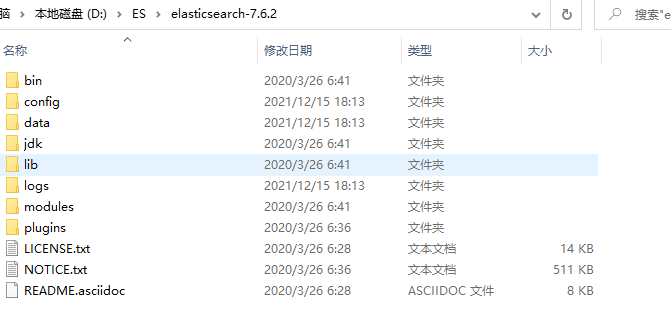 

* <font color="red">bin：存放可执行的二进制文件 </font>
* <font color="red">config：存放ES相关的配置信息</font>
* lib：存放与ES相关的jar文件 
* logs：存放日志信息
* modules：存放模块信息 
* <font color="red">plugins：插件安装目录</font>


2. 启动ES服务

   ​		进入bin目录，找到`elasticsearch.bat`，双击执行，会运行很久，直到出现下列即成功

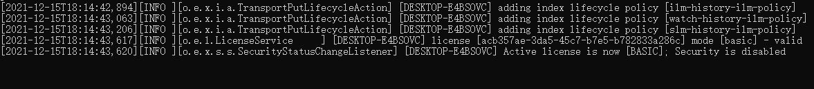

> 注意：9300是tcp通讯端口，集群和TCPClient都执行该端口，9200是http协议的RESTful接口。


3. 访问ElasticSearch服务器

   ​	 打开浏览器，输入[localhost:9200](http://localhost:9200/)，出现下列即成功

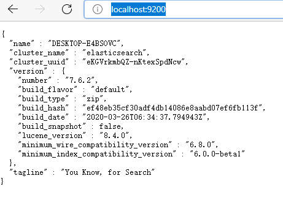 

> 注意：ElasticSearch是使用java开发的，且本版本的es需要的jdk版本要是1.8以上，所以安 装ElasticSearch之前保证JDK1.8+安装完毕，并正确的配置好JDK环境变量，否则启动 ElasticSearch失败。


### 2.2 安装ES图形化界面插件

1. 安装node.js

​					下载地址：https://nodejs.org/en/download/，根据系统下载对应版本，本机使用`node-v12.16.2-x64.msi`

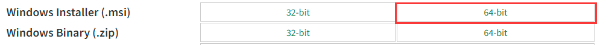


> 注意：node.js安装一直按“下一步”即可，安装完成后，可以通过cmd控制台输入：`node -v `出现版本号即成功

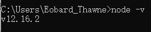


> **可选：如果出现node不是内部或外部命令程序，则需要配置环境变量，如图**

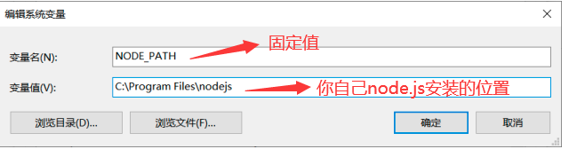 

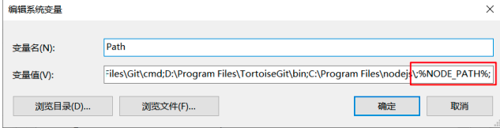 

> 在Path系统环境变量后追加:   `%NODE_PATH%;`   如果第一个`%`前面没有`;`，则自己手动添加`;`


2. 在`ElasticSearch软件工具7.6.2.zip`解压后的文件中，找到`elasticsearch-head-master.zip`，并解压

 


3. 进入解压后的`elasticsearch-head-master`文件，打开`index.html`，即可进入ES图形化界面

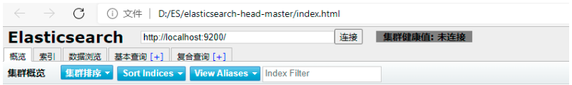


4. 修改ElasticSearch的config目录下的配置文件：`elasticsearch.yml`，在末尾添加下列两行代码

* 第一步：打开`elasticsearch.yml`文件

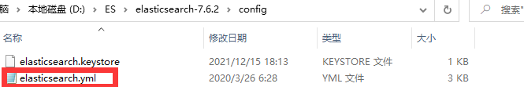 


* 第二步：复制下列代码到`elasticsearch.yml`文件中

<font color="green">**代码如下：**</font>

```yaml
http.cors.enabled: true
http.cors.allow-origin: "*"
```


* 第三步：修改后，回到bin目录，找到`elasticsearch.bat`重启ES服务

<font color="green">**`elasticsearch.yml`修改后的图片：**</font>

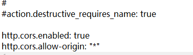 

> 注意：修改配置后需要重启ES服务

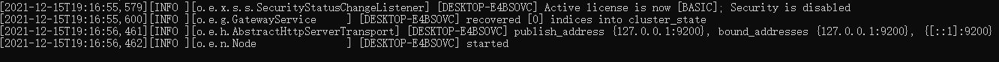 


* 第四步：再次点击连接

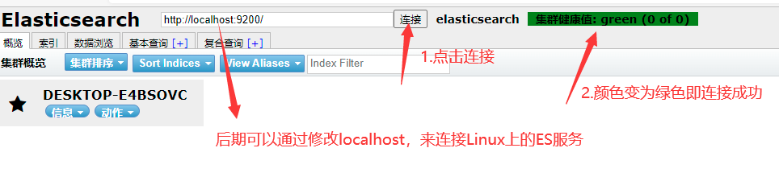 

## 三. Kibana

### 3.1 简介

1. Logstash是一个完全开源的工具，它可以对你的日志进行收集、过滤，并将其存储供以后使用(如搜索)。
2. Kibana 也是一个开源和免费的工具，它可以为 Logstash 和 ElasticSearch 提供日志分析友好的 Web 界面，可以帮助您汇总、分析和搜索重要数据日志

> 该图形化界面比`2.2小节`的图形化界面更好用，但是启动速度会很慢


### 3.2 安装Kibana

1. 在`ElasticSearch软件工具7.6.2.zip`解压后的文件中，找到`kibana-7.6.2-windows-x86_64.zip`，并解压


> 注意：kibana版本必须与ES版本一致!


2. 进入Kibana解压后的文件

   ​			进入解压后文件，进入bin目录

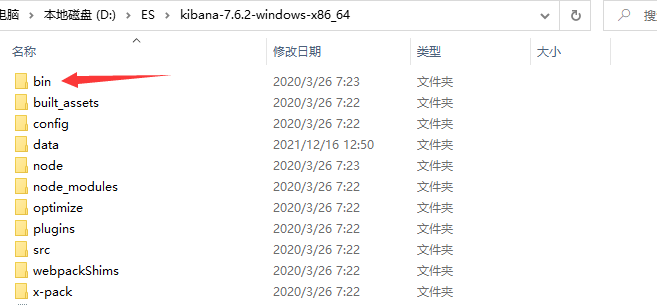


3. 双击运行kibana.bat

   ​		第一次运行会十分就，慢慢等待即可！


>  **注意：启动kibana之前，必须先启动ES服务,如果ES没有启动，kibana是无法连接**


4. 访问kibana


>  在浏览器中输入http://localhost:5601/，即可看到以下页面表示安装成功

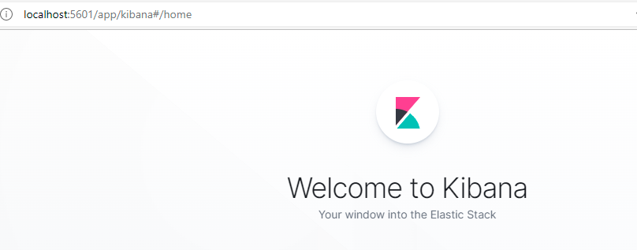

### 3.3  汉化Kibana

1. 进入解压后的Kibana文件夹，修改`config/kibana.yml`配置文件即可

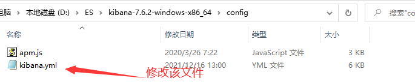


2. 在`kibana.yml`文件后追加内容，如图


3. 再次重启ES和Kibana即可看到汉化页面

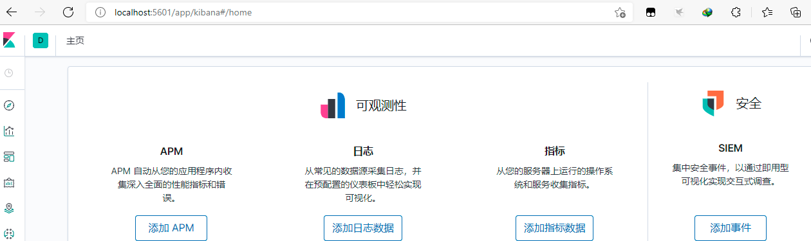


## 四.相关概念

### 4.1 核心概念

| ElasticSearch    | MySQL              |
| ---------------- | ------------------ |
| 索引（index）    | 数据库（database） |
| 类型（type）     | 表（table）        |
| 文档（document） | 行（row）          |

#### 索引index

* 一个索引就是一个拥有几分相似特征的文档的集合
*  **一个index类似MySQL数据库中的一个数据库**


#### 类型type 

​		 **相当于数据库的表**，每个索引都可以有一个或多个类型type，类型是索引的一个逻辑上的分类。

> 注意：类型在ES7已过时、ES8版本已被弃用，`所以在使用的时候可以不用加上类型,直接 /索引/文档 即可`


#### 文档document

* 一个文档是一个可被索引的基础信息单元
* 文档以JSON（Javascript Object Notation）格式来表示，而JSON是一个到处存在的互联网数 据交互格式
* **文档：类似于数据库中的一行数据**


#### 字段Field

​		**相当于是数据表的字段(列)**，对文档数据根据不同属性进行的分类标识

> ElasticSearch中可以包含多个索引(数据库)，每个索引中可以包含多个类型(表)，每个类型下又包含多个文档(行)，每个文档中又包含多个字段(列)


### 4.2 倒排索引与正向索引

* 正向索引：通过key找value，如 通过已背古诗的诗名能快速获取到古诗全内容

* 倒排索引(反向索引)：通过value找key，如 各种搜索引擎

  * eg：通过博客标签查询文章

    | 倒排索引 |
    | :------: |

    |  标签  | 博客ID  |
    | :----: | :-----: |
    | python | 1，3，4 |
    | 大数据 | 3，4，5 |

    > 如果要搜索含有 `python `标签的文章，那相对于查找所有原始数据而言，查找倒排索引后 的数据将会快的多。只需要查看标签这一栏，然后获取相关的文章ID即可。可以完全过滤 掉无关的所有数据，从而提高效率。


## 五. IK分词插件

### 5.1 安装IK分词插件

1. 在`ElasticSearch软件工具7.6.2.zip`解压后的文件中，找到`elasticsearch-analysis-ik-7.6.2.zip`，并解压

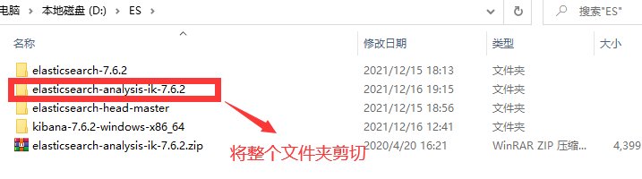

2. 将解压后的文件全选，剪切到ES安装文件夹下的`plugins`里面

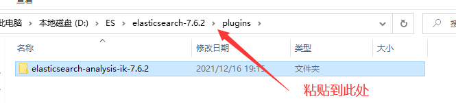

3. 重启ES和Kibana服务，可看见分词插件生效

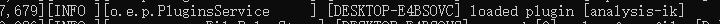


### 5.2 Kibana界面测试分词效果

​		 IK提供了两个分词算法ik_smart 和 ik_max_word 

* ik_smart 为最少切分，切分次数可能很少
*  ik_max_word为最细粒度划分，切分次数会相对较多


`1.打开Kibana开发界面`

​			找到左下角的		图标


`2.测试最少切分效果`

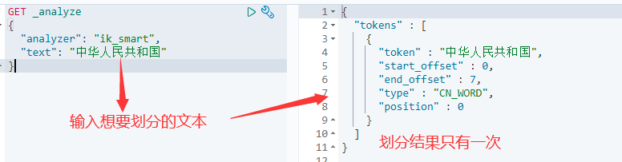

> 只切分了一次


`3.测试最细粒度切分`


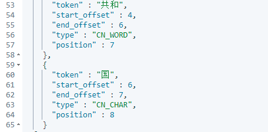 

> 切分了9次


### 5.3 自定义分词词汇

> 问题：当我们搜寻冷门词汇的时候，文字会被一个一个拆分

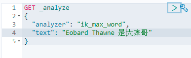

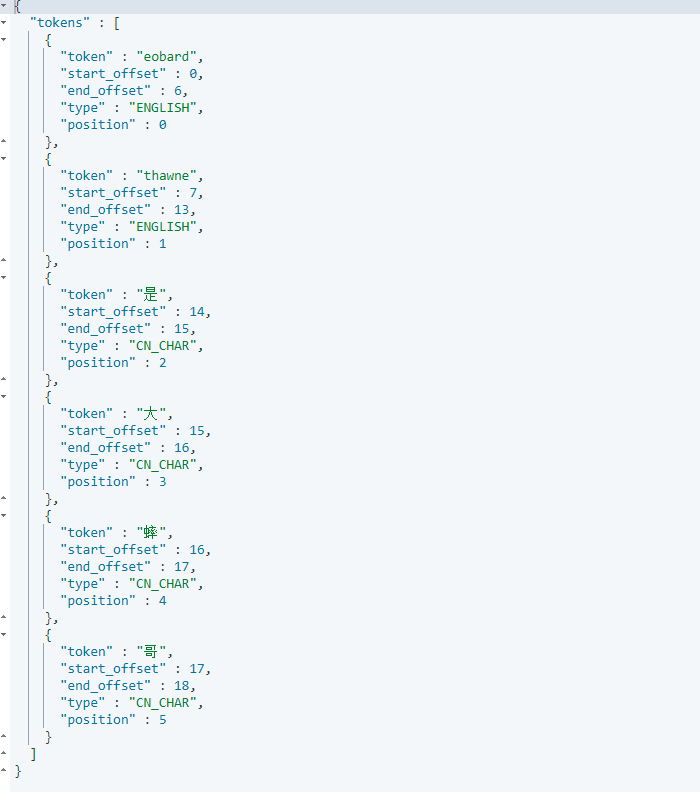


==<FONT COLOR="GREEN">**解决办法：自定义词汇，将词汇添加到分词器字典中**</FONT>==

* 第一步：在ES安装文件夹下的`plugins`里面创建自定义词汇

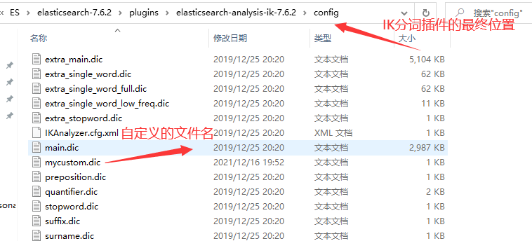

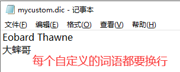


* 第二步：添加自定义的词汇

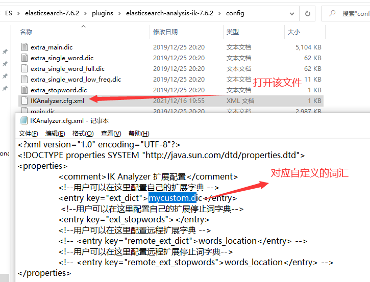


* 第三步：重启ES和Kibana再测试

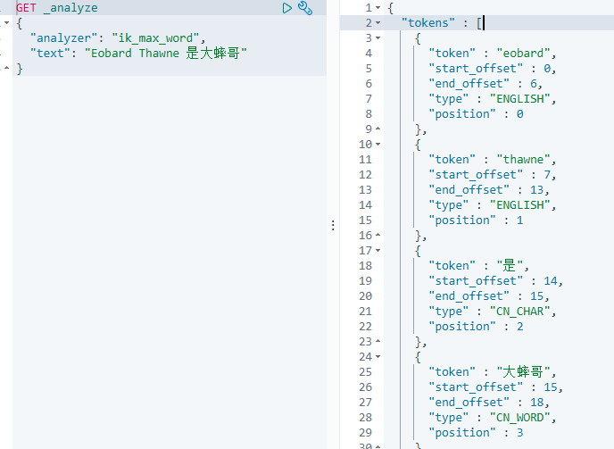 


### 5.4 停用词汇

> 如果不想要在搜索的文本中显示非法的字符，如 他妈的、妈的、Fuck、Shit等敏感词，可以自定义停用词汇，方法同上面步骤，然后添加到`ext_stopwords`中

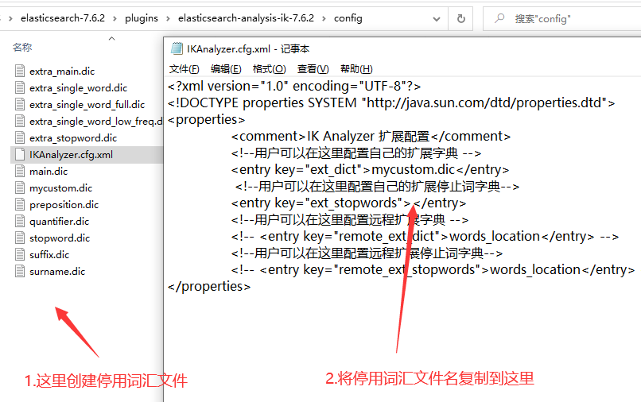


## 六. 索引、文档操作

### 6.1 基于Rest风格

| method     | url                                                  | 解析                        |
| ---------- | ---------------------------------------------------- | --------------------------- |
| **PUT**    | **localhost:9200/索引名称/类型名称/文档id**          | **创建文档（指定文档 id）** |
| **PUT**    | **localhost:9200/索引名称**                          | **创建索引**                |
| **POST**   | **localhost:9200/索引名称/类型名称/文档 id/_update** | **根据文档id，修改文档**    |
| **DELETE** | **localhost:9200/索引名称/类型名称/文档id**          | **根据文档id，删除文档**    |
| **GET**    | **localhost:9200/索引名称/类型名称/文档id**          | **根据文档id，查询文档**    |
| **GET**    | **localhost:9200/索引名称/类型名称/_search**         | **查询所有数据**            |


### 6.2 创建文档

```
PUT /索引名称/类型名称/文档ID
{
	请求体 
}
```

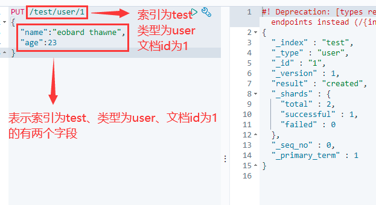 

> 创建成功，图形化界面查看值

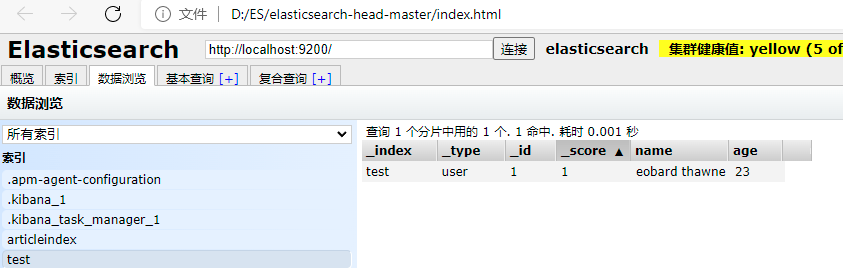


### 6.3 查看索引

```
GET /索引名称
```

 


### 6.4 查看具体文档

```
GET /索引名称/类型名称/文档ID
```

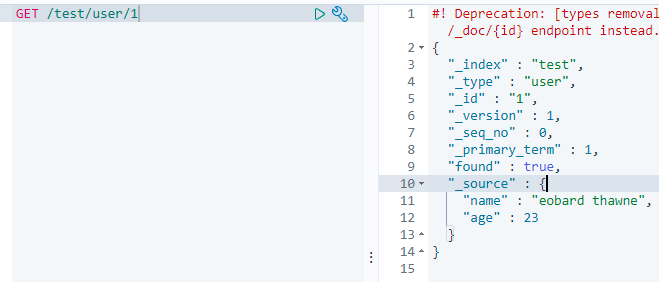 


### 6.5 修改文档

```json
POST /索引名称/类型名称/文档ID/_update
{
	"doc":{
		"字段名":"更改的值"
	}
}
```

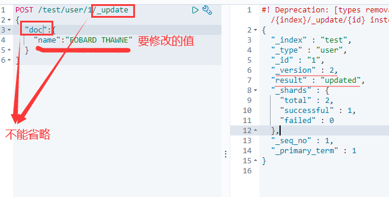 

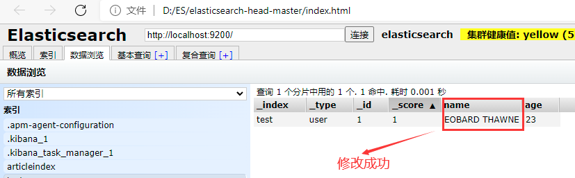 


### 6.6 删除索引

```
DELETE /索引名称
```

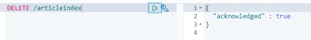 


### 6.7 简单查询文档

`1.创建两个文档数据`

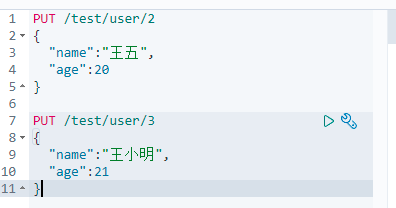 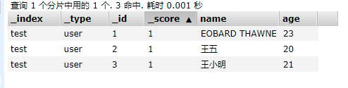


`2.查询王五的数据`

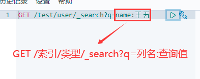 

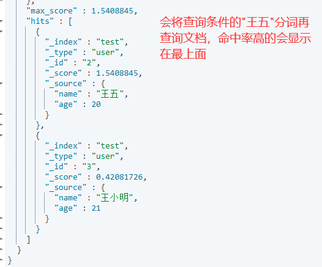 


### 6.8 筛选查询字段

> 该操作类似于SQL语句：`select 列名1,列名2... from 表 ...`

```JSON
GET /索引名/类型名/_search
{
  "query": {
    "match": {
      "列名": "值"
    }
  },
  "_source": ["列名1","列名2"]
}
```

==注意：如果筛选的列名只有一个，可以直接写为` "_source": "列名"`==

 


### 6.9  排序

> 该操作类似于SQL语句：`......  order by 列名 desc`

```JSON
GET /索引名/类型名/_search
{
  "query": {
    "match": {
      "列名": "值"
    }
  },
  "_source": ["列名1","列名2"],
   "sort": [
    {
      "列名": {
        "order": "desc"
      }
    }
  ]
}
```

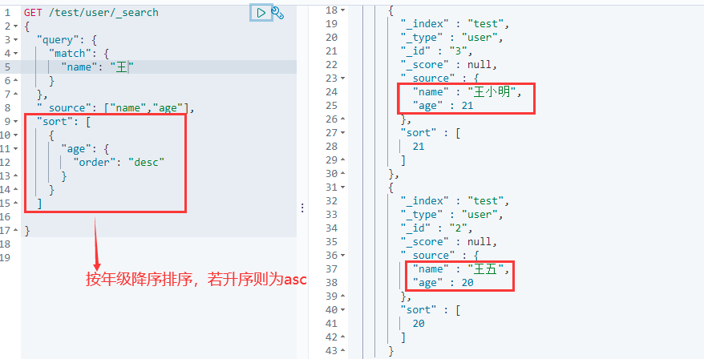


### 6.10 分页查询

> 该操作类似于SQL语句：`..... limit n,m`

```JSON
GET /索引名/类型名/_search
{
  "query": {
    "match": {
      "列名": "值"
    }
  },
  "from": 从指定下标索引开始读取,
  "size": 取多少条数据
}
```

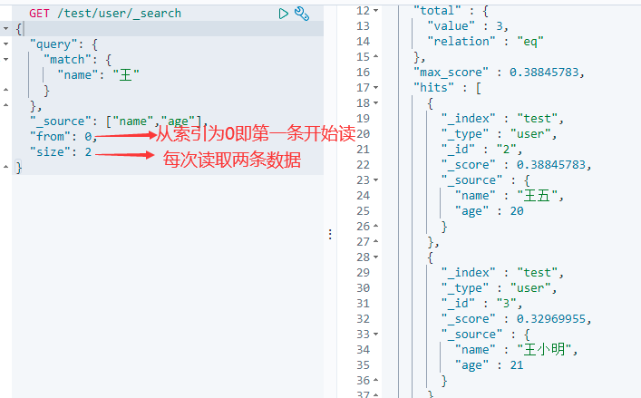 


### 6.11 布尔值查询

* must：并且，与mysql中的(and)一致，查询所有条件同时满足的数据

> 该操作类似于SQL语句：`.....  where name=王五 and age=20 `

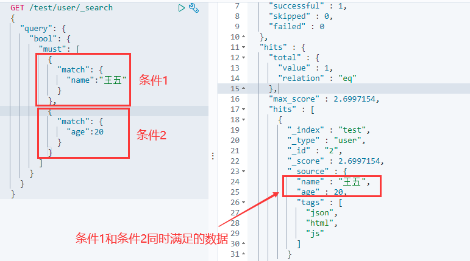


* should：或者，与mysql中的(or)一致，查询满足其中一个条件的数据

> 该操作类似于SQL语句：`.....  where name like 王 or name like 五 or age=20 `

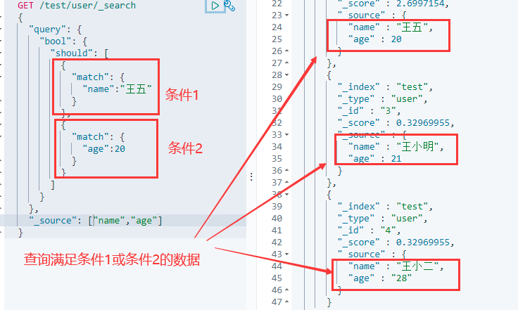

==**注意：这里查询name为王五的时候会将值分词，分成王和五两个字，所以会查询出最后两个**==


* must_not：取反，与mysql中的(not)一致。查询满足条件相反的数据

> 该操作类似于SQL语句：`.....  where name not like 王五 `

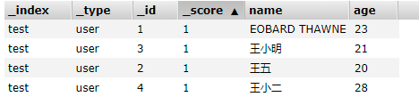 

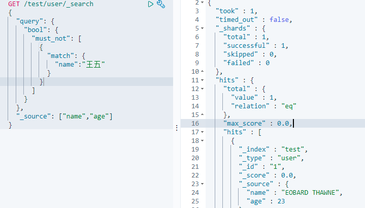 

==**注意：这里同样会将王五分词，分成王和五两个字，查询出不包含这两个字的数据**==


### 6.12 过滤器filter

* gt：大于 
* gte：大于等于  
* lt：小于  
* lte：小于等于

```JSON
  GET /索引/类型/_search
  {
    "query": {
      "bool": {
        "filter": [
          {
            "range": {
              "列名": {
                "gte": 值,
                "lte": 值
              }
            }
          }
        ]
      }
    }
  }
```

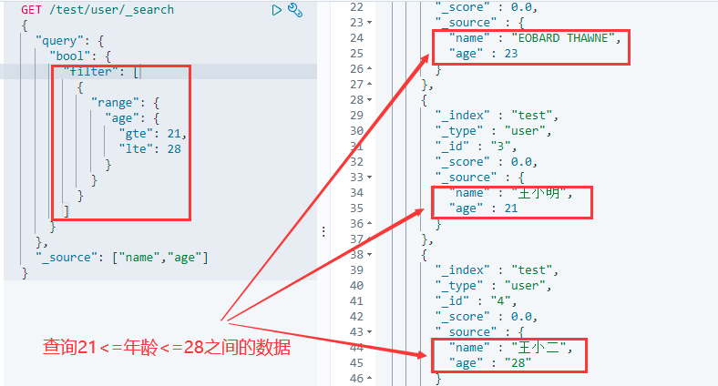 


### 6.13 精确查询

​	在ElasticSearch查询中，分为两种查询，分别是term查询和match查询。

*  term查询：直接通过倒排索引指定的词条进行精确找 

* match查询：**会使用分词器进行分词(先对文档进行分词，在通过分词后的文档进行查询)**

`使用term精准查询`

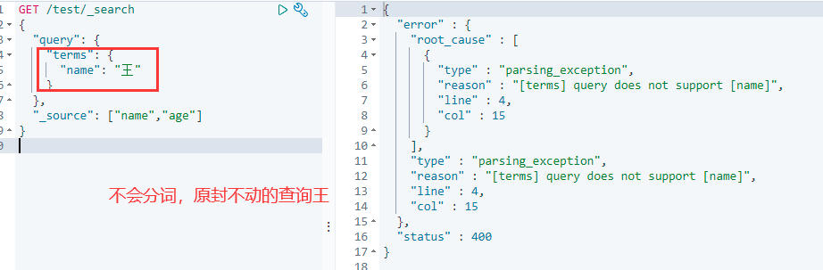


`使用match分词查询`

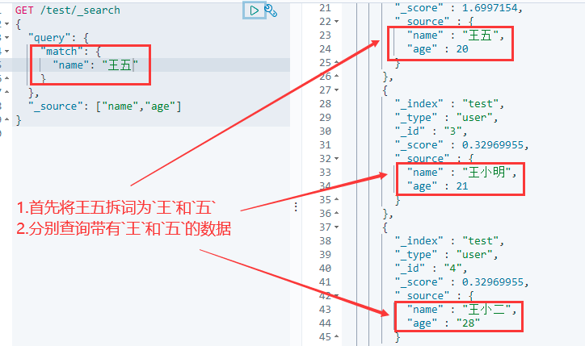 


### 6.14 高亮显示查询结果

​		ElasticSearch默认的高亮显示为斜体，为了更明显显示查询结果，我们可以自定义高亮格式

```JSON
GET /索引/_search
{
  "query": {
    "match": {
      "列名": "值"
    }
  },
  "highlight": {
    "pre_tags": "开始标签",
    "post_tags": "结束标签",
    "fields": {
      "列名": {}
    }
  }, 
  "_source": ["列名1","列名2"]
}
```

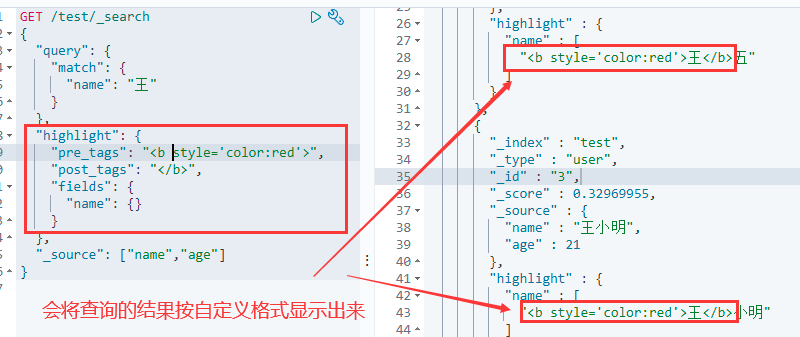 


## 七. SpringBoot使用ES

### 7.1 环境搭建

`1.环境要求`

| Spring Data Elasticsearch | Elasticsearch | Elasticsearch | Spring Boot |
| ------------------------- | ------------- | ------------- | ----------- |
| 4.0.x                     | 7.6.2         | 5.2.12        | 2.3.x       |
| 4.1.x                     | 7.9.3         | 5.3.2         | 2.4.x       |
| 4.2.1                     | 7.12.1        | 5.3.7         | 2.5.x       |

> 使用SpringBoot整合ES的时候，对于版本要求特别严格，详情版本见官方网站[Spring Data Elasticsearch - Reference Documentation](https://docs.spring.io/spring-data/elasticsearch/docs/current/reference/html/#preface.versions)


`2.修改pom.xml`

```xml-dtd
<!--修改版本为2.3.4-->
<parent>
        <groupId>org.springframework.boot</groupId>
        <artifactId>spring-boot-starter-parent</artifactId>
		<!--方式1：更改springboot版本-->
        <version>2.3.4.RELEASE</version>	
</parent> 	

		<!--方式2：若不指定spring boot的版本,则可以自定义es的版本,保证和本地一致-->
<!--
    <properties>
        <elasticsearch.version>7.6.2</elasticsearch.version>
    </properties>
-->


<!--ES依赖-->
        <dependency>
            <groupId>org.springframework.boot</groupId>
            <artifactId>spring-boot-starter-data-elasticsearch</artifactId>
        </dependency>

<!--fast json-->
        <dependency>
            <groupId>com.alibaba</groupId>
            <artifactId>fastjson</artifactId>
            <version>1.2.76</version>
        </dependency>
```

> 全局配置文件

```properties
#设置ElasticSearch连接地址,若为本机则可以忽略不写,如果为linux上,则要写
spring.elasticsearch.rest.uris=http://127.0.0.1:9200
```


`3.创建配置类`

```java
import org.apache.http.HttpHost;
import org.elasticsearch.client.RestClient;
import org.elasticsearch.client.RestHighLevelClient;
import org.springframework.context.annotation.Bean;
import org.springframework.context.annotation.Configuration;

@Configuration
public class ElasticSearchConfig {

    @Bean
    public RestHighLevelClient restHighLevelClient(){
        //创建RestHighLevelClient对象
        RestHighLevelClient restHighLevelClient = new RestHighLevelClient(
                /**
                 * 这里可以配置多个集群地址(builder()为可变参数)
                 *  参数1:主机IP地址
                 *  参数2:端口号
                 *  参数3:协议类型
                 */
                RestClient.builder(new HttpHost("127.0.0.1",9200,"http"))
        );
        return restHighLevelClient;
    }
}
```


`4.测试创建索引`

```JAVA
import org.elasticsearch.client.RequestOptions;
import org.elasticsearch.client.RestHighLevelClient;
import org.elasticsearch.client.indices.CreateIndexRequest;
import org.elasticsearch.client.indices.CreateIndexResponse;
import org.junit.jupiter.api.Test;
import org.springframework.boot.test.context.SpringBootTest;

import javax.annotation.Resource;

@SpringBootTest
public class ESTest {

    @Resource
    private RestHighLevelClient restHighLevelClient;

    @Test
    public void test() throws Exception{
        System.out.println("restHighLevelClient = " + restHighLevelClient);
        //1.创建请求对象,并创建索引库对象
        CreateIndexRequest createIndexRequest = new CreateIndexRequest("eobard-index2");
        //2.创建CreateIndexResponse对象
        CreateIndexResponse response = restHighLevelClient.indices().create(createIndexRequest, RequestOptions.DEFAULT);
        System.out.println("response = " + response);
        restHighLevelClient.close();
    }
}
```

> 注意：3和4要严格区分包名，否则会出现空指针异常；**执行API的时候，ES服务必须打开**


`5.查看新增索引库`

​			打开`elasticsearch-head-master/index.html`

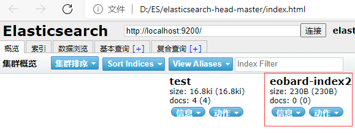


### 7.2 索引库API

#### 7.2.1 新增索引库

```JAVA
   @Resource
    private RestHighLevelClient restHighLevelClient;

    @Test
    public void test() throws Exception{     
        //1.创建请求对象,并创建索引库对象
        CreateIndexRequest createIndexRequest = new CreateIndexRequest("eobard-index2");
        //2.创建CreateIndexResponse对象
        CreateIndexResponse response = restHighLevelClient.indices().create(createIndexRequest, RequestOptions.DEFAULT);
        System.out.println("response = " + response);
        restHighLevelClient.close();
    }
```

> 指定Elasticsearch索引库的名称时，**必须使用英文且全部小写**


#### 7.2.2 删除索引库

```JAVA
    @Resource
    private RestHighLevelClient restHighLevelClient;

	@Test
    public void testDel() throws Exception{
        //1.创建删除索引库对象,并指定删除的索引库名称
        DeleteIndexRequest request=new DeleteIndexRequest("eobard-index2");
        //2.创建响应对象
        AcknowledgedResponse response = restHighLevelClient.indices().delete(request, RequestOptions.DEFAULT);
        //3.判断是否删除成功
        System.out.println("response.isAcknowledged() = " + response.isAcknowledged());
        restHighLevelClient.close();
    }
```


#### 7.2.3 查询索引库是否存在

```JAVA
	@Resource
    private RestHighLevelClient restHighLevelClient;

	@Test
    public void testExist() throws Exception{
        //1.创建获取索引库对象
        GetIndexRequest request=new GetIndexRequest("test");
        //2.判断是否存在索引库
        boolean exists = restHighLevelClient.indices().exists(request, RequestOptions.DEFAULT);
        System.out.println("exists = " + exists);
        restHighLevelClient.close();
    }
```


#### 7.2.4 获取指定索引库

```JAVA
	@Resource
    private RestHighLevelClient restHighLevelClient;

	@Test
    public void testGet() throws Exception{
        //1.创建获取索引库对象
        GetIndexRequest request=new GetIndexRequest("test");
        //2.获取索引库
        GetIndexResponse response = restHighLevelClient.indices().get(request, RequestOptions.DEFAULT);
        System.out.println("response = " + response);
        restHighLevelClient.close();
    }
```


### 7.3 文档API

#### 7.3.1 新增文档

`1.编写实体类`

```JAVA
public class Article {
    private Integer id;
    private String author;
    private String title;
    private String content;

    //省略getter、setter
}
```


`2.新增文档数据`

```JAVA
  	@Resource
    private RestHighLevelClient restHighLevelClient;

    @Test
    public void testAddDoc() throws Exception{
        //1.创建文档的数据
        Article article=new Article();
        article.setId(1);
        article.setAuthor("Eobard Thawne");
        article.setTitle("how to wirte the best code");
        article.setContent("it requires your mind,there is a motto called think twice code once");

        //2.创建IndexRequest请求,并指定索引库的名称
        IndexRequest request = new IndexRequest("testdb");
        //设置文档ID,如果不设置ID,那么ElasticSearch会生成一个随机ID,一般该ID与数据的ID一致
        request.id(article.getId().toString());
        //设置文档数据
        request.source(JSON.toJSONString(article), XContentType.JSON);
        
        //3.创建IndexResponse对象
        IndexResponse response = restHighLevelClient.index(request, RequestOptions.DEFAULT);
        System.out.println("response = " + response);
        restHighLevelClient.close();
    }
```


`3.查看新增文档`

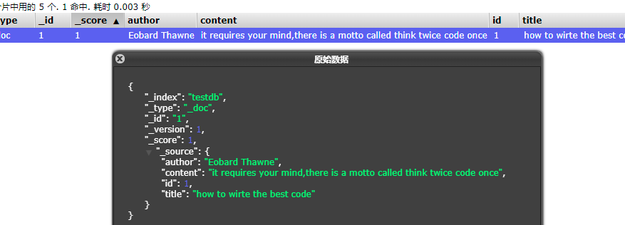


#### 7.3.2 修改文档

`1.原始数据,将修改id=2的文档`


`2.修改文档数据`

```JAVA
	@Resource
    private RestHighLevelClient restHighLevelClient;	

	@Test
    public void testUpdate() throws Exception{
        //修改id=2的文档数据
        Article article=new Article();
        article.setId(2);
        article.setAuthor("Eobard Thawne");
        article.setTitle("spring boot");
        article.setContent("springboot框架是一个十分快速上手搭建的框架");

        //创建UpdateRequest,并指定索引库的名称和文档id
        UpdateRequest request=new UpdateRequest("testdb",article.getId().toString());
        //设置文档数据
        request.doc(JSON.toJSONString(article),XContentType.JSON);
        //创建UpdateResponse对象
        UpdateResponse response=restHighLevelClient.update(request,RequestOptions.DEFAULT);
        System.out.println("response = " + response);
        restHighLevelClient.close();
    }
```


`3.查看修改文档`


#### 7.3.3 删除文档

`1.原始数据,将删除id=3的文档`


`2.删除文档数据`

```JAVA
	@Resource
    private RestHighLevelClient restHighLevelClient;	
  
	@Test
   public void testDel() throws Exception{
     //创建DeleteRequest对象,并指定索引库名称和删除文档ID
     DeleteRequest request=new DeleteRequest("testdb","3");
     //创建DeleteResponse对象
     DeleteResponse response = restHighLevelClient.delete(request, RequestOptions.DEFAULT);
     System.out.println("response = " + response);
     restHighLevelClient.close();
   }
```


`3.查看结果`


#### 7.3.4 查询文档是否存在

```JAVA
  	@Resource
    private RestHighLevelClient restHighLevelClient;	

    @Test
    public void testExist() throws Exception{
        //创建GetRequest对象,并指定索引库名称和文档ID
        GetRequest request=new GetRequest("testdb","1");
        boolean flag = restHighLevelClient.exists(request, RequestOptions.DEFAULT);
        System.out.println("flag = " + flag);
        restHighLevelClient.close();
    }
```


#### 7.3.5 查询指定文档

`1.查询指定文档数据`

```JAVA
	@Resource
    private RestHighLevelClient restHighLevelClient;	

	@Test
    public void testGet() throws Exception{
        //创建GetRequest对象,并指定索引库名称和查询文档ID
        GetRequest request=new GetRequest("testdb","1");
        //创建GetResponse对象
        GetResponse response = restHighLevelClient.get(request, RequestOptions.DEFAULT);
        //将获取到的数据变为String类型输出
        System.out.println(response.getSourceAsString());
        restHighLevelClient.close();
    }
```


`2.结果`

```
{"author":"Eobard Thawne","content":"it requires your mind,there is a motto called think twice code once","id":1,"title":"how to wirte the best code"}
```


#### 7.3.6 批量添加文档

`1.批量添加文档`

```JAVA
 	@Resource
    private RestHighLevelClient restHighLevelClient;	
	
	@Test
    public void testBatch() throws Exception {
        List<Article> articles = new ArrayList();
        articles.add(new Article(4, "Java 企业级技术1", "企业级技术1", "张三"));
        articles.add(new Article(5, "Java 企业级技术2", "企业级技术2", "张三"));
        articles.add(new Article(6, "Java 企业级技术3", "企业级技术3", "张三"));
        articles.add(new Article(7, "Java 企业级技术4", "企业级技术4", "张三"));
        articles.add(new Article(8, "Java 企业级技术5", "企业级技术5", "张三"));

        //创建BulkRequest批处理请求
        BulkRequest request = new BulkRequest();
            //循环遍历添加文档数据
            articles.forEach(article -> {
                request.add(
                        new IndexRequest("testdb")//指定索引库
                                .id(article.getId().toString())//指定文档id
                                .source(JSON.toJSONString(article),XContentType.JSON)
                );
            });
        //创建BulkResponse对象，执行批处理请求
        BulkResponse response = restHighLevelClient.bulk(request, RequestOptions.DEFAULT);
        //判断批处理增加文档是否有错:有错误返回true、正确执行则返回false
        System.out.println("response.hasFailures() = " + response.hasFailures());
        restHighLevelClient.close();
    }
```


`2.查看批量添加文档数据`


#### 7.3.7 查询所有数据

`1.查询所有数据`

```java
 	@Resource
    private RestHighLevelClient restHighLevelClient;	

    @Test
    public void testQueryAll() throws Exception{
        //创建查询对象
        SearchRequest request = new SearchRequest("testdb");
        //创建查询条件
        SearchSourceBuilder builder = new SearchSourceBuilder();
        //条件:查询所有
        builder.query(QueryBuilders.matchAllQuery());
        //将条件放入request中
        request.source(builder);
        //发送查询请求
        SearchResponse response = restHighLevelClient.search(request, RequestOptions.DEFAULT);
        //遍历循环结果集
        for (SearchHit hit : response.getHits().getHits()) {
            System.out.println(hit.getSourceAsString());
        }
        restHighLevelClient.close();
    }
```


`2.查询结果`


#### 7.3.8 精确查询

```JAVA
 	@Resource
    private RestHighLevelClient restHighLevelClient;	

	@Test
    public void testTerm() throws Exception {
        //创建查询对象
        SearchRequest request = new SearchRequest("testdb");
        //创建查询条件
        SearchSourceBuilder builder = new SearchSourceBuilder();
        //条件: 精确查询author为eobard且title为spring的数据
        builder.query(QueryBuilders.termQuery("author","eobard"));
        builder.query(QueryBuilders.termQuery("title","spring"));
        //将条件放入request中
        request.source(builder);
        //发送查询请求
        SearchResponse response = restHighLevelClient.search(request, RequestOptions.DEFAULT);
        //遍历循环结果集
        for (SearchHit hit : response.getHits().getHits()) {
            System.out.println(hit.getSourceAsString());
        }
        restHighLevelClient.close();
    }
```

> 注意：不管文档里是否为大写，查询条件的值必须都是小写


#### 7.3.9 模糊查询(分词查询)

`1.原始数据`


`2.模糊查询并分词`

```JAVA
	@Resource
    private RestHighLevelClient restHighLevelClient;	

	@Test
    public void testIk() throws Exception {
        //创建查询对象
        SearchRequest request = new SearchRequest("testdb");
        //创建查询条件
        SearchSourceBuilder builder = new SearchSourceBuilder();
         //条件: 分词查询有java和微服务的内容
        builder.query(QueryBuilders.matchQuery("content","java微服务"));
        //将条件放入request中
        request.source(builder);
        //发送查询请求
        SearchResponse response = restHighLevelClient.search(request, RequestOptions.DEFAULT);
        //遍历循环结果集
        for (SearchHit hit : response.getHits().getHits()) {
            System.out.println(hit.getSourceAsString());
        }
        restHighLevelClient.close();
    }
```


`3.结果`


#### 7.3.10 分页查询

`1.分页查询`

```JAVA
	@Resource
    private RestHighLevelClient restHighLevelClient;	
 
	@Test
    public void testPage() throws Exception {
        //创建查询对象
        SearchRequest request = new SearchRequest("testdb");
        //创建查询条件
        SearchSourceBuilder builder = new SearchSourceBuilder();
        //条件: 分词查询有java和微服务的内容
        builder.query(QueryBuilders.matchQuery("content","java微服务"));
        builder.from(0);//从第几条数据开始,若要分页,分页公式: (当前页数-1)*size
        builder.size(3);//一次读取几条数据
        //将条件放入request中
        request.source(builder);
        //发送查询请求
        SearchResponse response = restHighLevelClient.search(request, RequestOptions.DEFAULT);
        //遍历循环结果集
        for (SearchHit hit : response.getHits().getHits()) {
            System.out.println(hit.getSourceAsString());
        }
        restHighLevelClient.close();
    }
```


`2.结果`


> **如果想要获取总页码，可以根据总页数/显示页码**

```java
//省略其它
SearchHits hits = response.getHits();
long total= response.getHits().getTotalHits().value;	//获取总数
System.out.println("hits.getTotalHits() = " +total);
```


#### 7.3.11 排序查询

​	两种排序方式：

* ScoreSortBuilder() :该类是按分数值排序，即最佳匹配度

* FieldSortBuilder() :该类是按自定义字段排序

```JAVA
	@Resource
    private RestHighLevelClient restHighLevelClient;	

	@Test
    public void testOrder() throws Exception {
        //创建查询对象
        SearchRequest request = new SearchRequest("testdb");
        //创建查询条件
        SearchSourceBuilder builder = new SearchSourceBuilder();
        //条件: 分词查询有java和微服务的内容
        builder.query(QueryBuilders.matchQuery("content","java微服务"));
        
        //表示按照最佳匹配数据降序显示
        builder.sort(new ScoreSortBuilder().order(SortOrder.DESC));
        //按照自定义字段升序显示
//        builder.sort(new FieldSortBuilder("_id").order(SortOrder.ASC));
        
        //将条件放入request中
        request.source(builder);
        //发送查询请求
        SearchResponse response = restHighLevelClient.search(request, RequestOptions.DEFAULT);
        //遍历循环结果集
        for (SearchHit hit : response.getHits().getHits()) {
            System.out.println(hit.getSourceAsString());
        }
        restHighLevelClient.close();
    }
```


#### 7.3.12 筛选查询字段

`1.查询筛选字段`

```JAVA
	@Resource
    private RestHighLevelClient restHighLevelClient;	

	@Test
    public void testFetchSource() throws Exception {
        //创建查询对象
        SearchRequest request = new SearchRequest("testdb");
        //创建查询条件
        SearchSourceBuilder builder = new SearchSourceBuilder();

        //包含字段
        String [] includeFields = {"title","author"};//只查询标题和作者
        //排除字段
        String [] excludeFields = {"content"};//排除内容字段

        //筛选字段
        builder.fetchSource(includeFields,excludeFields);

        //条件: 分词查询有java和微服务的内容
        builder.query(QueryBuilders.matchQuery("content","java微服务"));
        //将条件放入request中
        request.source(builder);
        //发送查询请求
        SearchResponse response = restHighLevelClient.search(request, RequestOptions.DEFAULT);
        //遍历循环结果集
        for (SearchHit hit : response.getHits().getHits()) {
            System.out.println(hit.getSourceAsString());
        }
        restHighLevelClient.close();
    }
```


`2.筛选结果`


#### 7.3.13 高亮显示

> 高亮显示在页面中可以看出效果，控制台输出没有效果，详细使用见`8.3.5`

```java
	@Resource
    private RestHighLevelClient restHighLevelClient;

	@Test
    public void testHighLight() throws Exception {
        //创建查询对象
        SearchRequest request = new SearchRequest("testdb");
        //创建查询条件
        SearchSourceBuilder builder = new SearchSourceBuilder();

        //包含字段
        String [] includeFields = {"title","author"};//只查询标题和作者
        //排除字段
        String [] excludeFields = {"content"};//排除内容字段

        //筛选字段
        builder.fetchSource(includeFields,excludeFields);

        //创建高亮显示对象
        HighlightBuilder highlightBuilder = new HighlightBuilder();
        
        //创建高亮字段对象:给标题设置高亮
        HighlightBuilder.Field highLightTitle = new HighlightBuilder.Field("title");
        highLightTitle.highlighterType("unified");//设置高亮类型
        highlightBuilder.field(highLightTitle);//设置高亮字段
        
        //将高亮显示配置放到查询条件中
        builder.highlighter(highlightBuilder);

        //条件: 分词查询有java和微服务的内容
        builder.query(QueryBuilders.matchQuery("content","java微服务"));
        //将条件放入request中
        request.source(builder);
        //发送查询请求
        SearchResponse response = restHighLevelClient.search(request, RequestOptions.DEFAULT);
        //遍历循环结果集
        for (SearchHit hit : response.getHits().getHits()) {
            System.out.println(hit.getSourceAsString());
        }
        restHighLevelClient.close();
    }
```


#### 7.3.14 总结

##### 1. 查询多个字段or关系

```JAVA
        //创建查询对象
        SearchRequest request = new SearchRequest("test");
        //创建查询条件
        SearchSourceBuilder builder = new SearchSourceBuilder();
        //条件: 分词查询标题有王或者内容有王的
        builder.query(QueryBuilders.boolQuery()
                               .should(QueryBuilders.matchQuery("title","王"))
                               .should(QueryBuilders.matchQuery("content","王"))
        );

        //将条件放入request中
        request.source(builder);
        //发送查询请求
        SearchResponse response = restHighLevelClient.search(request, RequestOptions.DEFAULT);
        //遍历循环结果集
        for (SearchHit hit : response.getHits().getHits()) {
            System.out.println(hit.getSourceAsString());
        }
        restHighLevelClient.close();
```


##### 2.查询多个字段and关系

```java
  
  //创建查询对象
        SearchRequest request = new SearchRequest("test");
        //创建查询条件
        SearchSourceBuilder builder = new SearchSourceBuilder();
         //条件: 分词查询标题有王并且内容有王的
        builder.query(QueryBuilders.boolQuery()
                .must(QueryBuilders.matchQuery("title","王"))
                .must(QueryBuilders.matchQuery("content","王"))
        );

        //将条件放入request中
        request.source(builder);
        //发送查询请求
        SearchResponse response = restHighLevelClient.search(request, RequestOptions.DEFAULT);
        //遍历循环结果集
        for (SearchHit hit : response.getHits().getHits()) {
            System.out.println(hit.getSourceAsString());
        }
        restHighLevelClient.close();
```
​       

##### 3. 开发自定义工具类

> Blogs.BLOG_INDEX：索引库常量名

```JAVA
public class ESUtils {

    //创建获取索引库对象
    private static GetIndexRequest request = new GetIndexRequest(Blogs.BLOG_INDEX);

    //创建基本文档对象
    private static IndexRequest indexRequest = new IndexRequest(Blogs.BLOG_INDEX);

    //创建删除文档对象
    private static DeleteRequest deleteRequest = new DeleteRequest(Blogs.BLOG_INDEX);

    //创建修改文档对象
    private static UpdateRequest updateRequest = new UpdateRequest();

    //创建查询文档对象
    private static GetRequest getRequest = new GetRequest(Blogs.BLOG_INDEX);

    //创建查询文档对象
    private static SearchRequest searchRequest = new SearchRequest(Blogs.BLOG_INDEX);

    //创建查询条件
    private static SearchSourceBuilder builder = new SearchSourceBuilder();

    //获取查询条件对象
    public static  SearchSourceBuilder getBuilder(){
        return builder;
    }

    //获取查询文档对象
    public static SearchRequest getSearchRequest() {
        return searchRequest;
    }

    //获取基本文档索引库对象
    public static IndexRequest getIndexRequest() {
        return indexRequest;
    }

    //根据id删除文档
    public static void deleteDocumentById(RestHighLevelClient client, String id) throws Exception {
        //指定删除文档id
        deleteRequest.id(id);
        //删除文档
        client.delete(deleteRequest, RequestOptions.DEFAULT);
    }

    //根据id修改文档
    public static void updateDocumentById(RestHighLevelClient client, Article article) throws Exception {
        //指定索引库名称
        updateRequest.index(Blogs.BLOG_INDEX);
        //指定修改的id
        updateRequest.id(article.getId().toString());
        //设置文档数据
        updateRequest.doc(JSON.toJSONString(article), XContentType.JSON);
        client.update(updateRequest, RequestOptions.DEFAULT);
    }

    //根据id查询文档
    public static Article findDocumentById(RestHighLevelClient client, String id) throws Exception {
        //指定查询文档id
        getRequest.id(id);
        //创建GetResponse对象
        GetResponse response = client.get(getRequest, RequestOptions.DEFAULT);
        //将JSON转为对象
        Article article = JSON.parseObject(response.getSourceAsString(), Article.class);
        return article;
    }


    /**
     * 判断ES是否存在文档库索引
     * @param client 连接工具
     */
    public static void isExistEsDB(RestHighLevelClient client) throws Exception {
        //判断是否存在索引库
        boolean exists = client.indices().exists(request, RequestOptions.DEFAULT);
        //不存在就创建
        if (!exists) {
            createEsDB(client);
        }
    }


    /**
     * 创建ES文档库索引
     * @param client 连接工具
     */
    private static void createEsDB(RestHighLevelClient client) throws Exception {
        CreateIndexRequest createIndexRequest = new CreateIndexRequest(Blogs.BLOG_INDEX);
        client.indices().create(createIndexRequest, RequestOptions.DEFAULT);
    }


    /**
     * 获取查询总数
     * @param keyWord              关键词
     * @param restHighLevelClient 连接工具
     */
    public static long getDataCount(String keyWord, RestHighLevelClient restHighLevelClient) throws Exception{
        //获取查询对象
        SearchRequest request = getSearchRequest();
        //条件: 分词查询标题或内容带有关键词的文章
        builder.query(QueryBuilders.boolQuery()
                .should(QueryBuilders.matchQuery("title", keyWord))
                .should(QueryBuilders.matchQuery("simpleContent", keyWord))
        );
        //将条件放入request中
        request.source(builder);
        //发送查询请求
        SearchResponse response = restHighLevelClient.search(request, RequestOptions.DEFAULT);
        //获取总数
       return response.getHits().getTotalHits().value;
    }


    /**
     * 获取分页的高亮数据(有多个高亮字段)
     * @param currentPage         当前页码
     * @param pageSize            页码显示大小
     * @param keyWord             关键词
     * @param restHighLevelClient 连接工具
     */
    public static List<Map<String,Object>> getPageableHighLightData(int currentPage, int pageSize, String keyWord, RestHighLevelClient restHighLevelClient) throws Exception {
        //商品数据结果集
        List<Map<String, Object>> list = new ArrayList();

        //获取查询对象
        SearchRequest request = getSearchRequest();
        //条件: 分词查询标题或内容带有关键词的文章
        builder.query(QueryBuilders.boolQuery()
                .should(QueryBuilders.matchQuery("title", keyWord))
                .should(QueryBuilders.matchQuery("simpleContent", keyWord))
        );

        //分页
        builder.from((currentPage - 1) * pageSize);
        builder.size(pageSize);


        /**
         * 设置关键字高亮开始
         */
        //创建高亮显示对象
        HighlightBuilder highlightBuilder = new HighlightBuilder();
        //设置高亮显示字段
        highlightBuilder.field("title") //高亮字段1
                .field("simpleContent") //高亮字段2
                .preTags("<font  color='red'>") //自定义高亮字段显示开始标签
                .postTags("</font>");           //自定义高亮字段显示结束标签
        //将高亮显示对象添加到查询条件builder对象中
        builder.highlighter(highlightBuilder);
        /**
         * 设置关键字高亮结束
         */

        //将条件放入request中
        request.source(builder);

        //发送查询请求
        SearchResponse response = restHighLevelClient.search(request, RequestOptions.DEFAULT);

        //遍历循环结果集
        for (SearchHit hit : response.getHits().getHits()) {
            /**
             * 设置关键字高亮开始
             */
            //获取结果中所有的高亮显示字段
            Map<String, HighlightField> highlightFields = hit.getHighlightFields();

            //根据字段名获取高亮显示商品名称
            HighlightField title = highlightFields.get("title");
            HighlightField simpleContent = highlightFields.get("simpleContent");

            //将数据转换成map结果
            Map<String, Object> sourceAsMap = hit.getSourceAsMap();
            //判断标题是否为空
            if (!ObjectUtils.isEmpty(title)) {
                //获取高亮显示格式
                Text[] fragments = title.getFragments();
                //定义变量接收高亮显示的商品名称
                String hTitle = "";
                for (Text text : fragments) {
                    //将高亮字段拼接格式
                    hTitle += text;
                }
                //将原有的标题替换成被高亮显示的标题
                sourceAsMap.put("title", hTitle);
            }
            //判断内容是否为空
            if (!ObjectUtils.isEmpty(simpleContent)) {
                //获取高亮显示格式
                Text[] fragments = simpleContent.getFragments();
                //定义变量接收高亮显示的商品名称
                String hSimpleContent = "";
                for (Text text : fragments) {
                    //将高亮字段拼接格式
                    hSimpleContent += text;
                }
                //将原有的内容替换成被高亮显示的内容
                sourceAsMap.put("simpleContent", hSimpleContent);
            }
            //将其添加到list集合中
            list.add(sourceAsMap);
        }
        return list;
    }

}
```


### 7.4 使用注解开发（重点）

1. 引入依赖

```xml
  		 <!--lombox-->
        <dependency>
            <groupId>org.projectlombok</groupId>
            <artifactId>lombok</artifactId>
            <version>1.18.20</version>
        </dependency>

        <!--引入ES依赖-->
        <dependency>
            <groupId>org.springframework.boot</groupId>
            <artifactId>spring-boot-starter-data-elasticsearch</artifactId>
        </dependency>
```


2. 全局配置文件

```yaml
spring:
  main:
    elasticsearch:
      rest:
        uris: http://localhost:9200
```


3. 创建索引库实体类

```java
@Data
//indexName索引库的名称,必须小写
@Document(indexName = "product_es")
public class ProductEs {

    @Id                     //标志为商品主键字段
    private Long id;

    @Field(type = FieldType.Text)
    private String categoryName;

    @Field(type = FieldType.Text,analyzer = "ik_max_word")  //使用ik分词器进行分词，细粒度划分
    private String productName;

    @Field(type = FieldType.Double)
    private Double price;

    @Field(type = FieldType.Integer, index = false)
    private Integer stock;

    // 开发中可以加入一个商品的热度:当点击商品详情时,从ES中获取该商品,并让热度+1保存到缓存中,当热度达到一定数量时,更新ES中的数据,后期可以根据热度降序排序商品
    @Field(type = FieldType.Long)
    private Long hotScore = 0L;

}
```


4. Spring Data Repository类

```java
//ElasticsearchRepository<T,ID>:T代表索引库的实体类,ID代表索引库的主键类型
public interface ProductRepository extends ElasticsearchRepository<ProductEs,Long> {

 	//命名规则参考Spring Data JPA的自定义方法命名,方法名称必须要遵循驼峰式命名规则
    
     ProductEs findByProductName(String productName);
    
     List<ProductEs> findByOrderByIdDesc(Pageable pageable);
}
```


5. 使用

```java
    @Resource
    private ProductRepository productRepository;
    
    @PostMapping("add")
    public void add(@RequestBody ProductEs productEs){
        productRepository.save(productEs);
    }

    @GetMapping("list")
    public List<ProductEs> list(){
        //获取第一页(索引为0)的10条记录
        Pageable pageable = PageRequest.of(0, 10);
        return productRepository.findAll(pageable).getContent();
    }

   	@GetMapping("get/{productName}")
    public  ProductEs productEs(@PathVariable String productName){
        return productRepository.findByProductName(productName);
    }

	@GetMapping("orderById")
    public  List<ProductEs> orderById(){
        //获取第一页(索引为0)的10条记录
        Pageable pageable = PageRequest.of(0, 10);
        return productRepository.findByOrderByIdDesc(pageable);
    }
```


6. 运行效果


## 八.Jsoup爬虫+ElasticSearch

### 8.1 爬虫简介

​		jsoup 是一款 Java 的 HTML 解析器，可直接解析某个 URL 地址、HTML 文本内容。它提供了一套非常省力的 API，可通过 DOM、CSS 以及类似于 JQuery的操作方法来取出和操作数据。

> ###  **常用API**
>
> * **getElementById(String id)**：通过ID查找元素
> * **getElementsByClass(String className)**：通过class查找元素
> * **getElementsByTag(String tagName)** ：通过指定名称查找元素，并递归地查找这些元素。
> * getAllElements()：在此元素下找到所有元素。
>
> - **html()**：检索元素的内部HTML。
> - **text()**： 获取此元素及其所有子元素的组合文本。
> - **last()：获取该元素的最后一个元素**
> - **first()：获取该元素的第一个元素**
> - **attr(String attrName)：获取元素的某个属性值**
> - **children()：获取该元素的子元素**


### 8.2 爬虫入门案例

`1.导入依赖`

```xml-dtd
 <!-- jsoup-->
        <dependency>
            <groupId>org.jsoup</groupId>
            <artifactId>jsoup</artifactId>
            <version>1.12.2</version>
        </dependency>
```


`2.编写爬虫类,爬取网页数据`

```java
	//爬取网页路径
    private String url="https://www.hifini.com/search-_E5_91_A8_E6_9D_B0_E4_BC_A6.htm";

    @Test
    public void test() throws Exception {
        //根据URL地址解析HTML代码,并对中文解码
        Document document = Jsoup.parse(new URL(URLDecoder.decode(url, "UTF-8")), 30000);
        //根据class选择器获取数据根节点
        Element element = document.getElementsByClass("card-body").last();
        //获取每个数据所在的li区域
        Elements elements = element.getElementsByTag("li");
        //循环遍历每个li
        for (Element el : elements) {
            //获取图片路径
            String photoUrl = el.getElementsByTag("img").attr("src");
            System.out.println("photoUrl = " + photoUrl);
            //获取歌手名称
            String singerName = el.getElementsByClass("text-danger").first().text();
            System.out.println("singerName = " + singerName);

            //获取歌曲路径
            String url = el.getElementsByClass("media").attr("data-href");
            System.out.println("url = " + url);
            //获取歌曲日期
            String date = el.getElementsByClass("date").first().text();
            System.out.println("date = " + date);
            //获取回复数量
            String replyNumber = el.getElementsByClass("reply").first().text();
            System.out.println("replyNumber = " + replyNumber);
            System.out.println("\n===============================================\n");

        }
    }
```


`3.显示结果`


### 8.3 折800商城官网案例

#### 8.3.1 抓取官网数据

`1.环境准备`

* 采用折800商城进行爬虫：[【折800官网】-折800,折八百,800折,折800官网首页,折800天天特价_爱折800网、800折 (aizhe800.cn)](https://www.aizhe800.cn/)  ，根据自己的搜索爬取响应的数据

* 导入依赖：**利用JPA快速开发**

  ```xml-dtd
      <!-- MySQL -->
      <dependency>
          <groupId>mysql</groupId>
          <artifactId>mysql-connector-java</artifactId>
          <scope>runtime</scope>
      </dependency>
      <!-- Spring Data JPA -->
      <dependency>
          <groupId>org.springframework.boot</groupId>
          <artifactId>spring-boot-starter-data-jpa</artifactId>
      </dependency>
  <!-- lombok -->
      <dependency>
          <groupId>org.projectlombok</groupId>
          <artifactId>lombok</artifactId>
          <optional>true</optional>
      </dependency>
  ```

* 全局配置文件

  ```properties
  #数据库配置:
  spring.datasource.driverClassName=com.mysql.cj.jdbc.Driver
  spring.datasource.url=jdbc:mysql://localhost:3306/test?useUnicode=true&characterEncoding=UTF-8&serverTimezone=Asia/Shanghai
  spring.datasource.username=root
  spring.datasource.password=123456
  
  #JPA配置:
  spring.jpa.hibernate.ddl-auto=update
  spring.jpa.show-sql=true
  ```

  

`2.编写商品实体类`

```JAVA
@Data
@NoArgsConstructor
@AllArgsConstructor
@Entity		//映射表
public class Product {

    @Id
    @GeneratedValue(strategy = GenerationType.IDENTITY)//主键自增
    private Long id;//商品ID
    private String productName;//商品名称
    private Double price;//商品价格
    private Long saleCount;//销售量
    private String productPicture;//商品图片
    private Date createDate;//创建时间
    private Date modifyDate;//修改时间

    public Product(String productName, Double price, Long saleCount, String productPicture) {
        this.productName = productName;
        this.price = price;
        this.saleCount = saleCount;
        this.productPicture = productPicture;
    }
}

```


`3.创建爬虫工具类`

```JAVA
public class HtmlParseUtils {

    public static List parseData(String keyWord) throws Exception{
        //结果集
        List<Product> list=new ArrayList();
        //解析地址
        String url = "https://www.aizhe800.cn/search/"+keyWord+".html";
        //根据URL地址解析HTML代码
        Document document = Jsoup.parse(new URL(URLDecoder.decode(url, "UTF-8")), 30000);
        //根据class选择器获取根节点
        Element element = document.getElementsByClass("goods-list").first();
        //获取每个商品所在的li区域
        Elements elements = element.getElementsByTag("li");
        //循环遍历每个li
        for (Element el : elements) {
            //获取图片
            String photo = el.getElementsByTag("img").attr("data-original");
            //获取商品名称
       		String goodsName = el.getElementsByClass("good-title").first().text();
            //获取价格
       		String old = el.getElementsByClass("price-current").first().text().replace(",", "");
            String price=old.substring(1,old.length());
            //获取销售数量
            String soldNumber = el.getElementsByClass("sold").first().getElementsByTag("em").text();

            //封装数据
            Product product=new Product(goodsName,Double.parseDouble(price),Long.valueOf(soldNumber),photo);
            list.add(product);
        }
        return list;
    }
}

```


`4.dao层`

```JAVA
public interface ProductRepository extends JpaRepository<Product,Long> {

}
```


`5.service层`

```JAVA
public interface ProductService {
     /**
     * 解析数据并将数据保存到数据库中
     * @param keyWord
     */
    boolean parseData(String keyWord) throws Exception;
}
```

```JAVA
@Transactional
@Service
public class ProductRepositoryImpl  implements ProductService {

    @Resource
    private ProductRepository productRepository;

    @Resource
    private RestHighLevelClient restHighLevelClient;

    @Override
    public boolean parseData(String keyWord) throws Exception{
        //根据关键词,获取爬虫数据
        List list = HtmlParseUtils.parseData(keyWord);
        //将数据保存到数据库中
        productRepository.saveAll(list);
        //再次获取保存到数据库的数据
        List<Product> productList = productRepository.findAll();

        //创建BulkRequest批处理请求
        BulkRequest request=new BulkRequest();
        //批处理数据时间最多3分钟
        request.timeout(TimeValue.timeValueMinutes(3));
        //循环遍历添加文档数据
        productList.forEach(product -> {
            request.add(
                    new IndexRequest("product_list")    //指定索引库名称
                            .id(product.getId().toString())//指定id与实体类id对应
                            .source(JSON.toJSONString(product), XContentType.JSON)
                );
        });
        //发送批量请求
        BulkResponse response = restHighLevelClient.bulk(request,RequestOptions.DEFAULT);
        //没有错误返回false,将false取反则表示成功
        return !response.hasFailures();
    }
}

```


`6.测试`

* 首先在ElasticSearch中添加`product_list`的索引库

* 在控制器或测试去请求`service`层

  ```JAVA
  //eg：这里以测试类测试	
  	@Resource
      private ProductService productService;
  
      @Test
      public void test3() throws Exception{
          System.out.println(productService.parseData("笔记本"));
      }
  ```

* 结果

> Mysql中查询结果


> ElasticSearch中查询结果


`7.注意`

​		如果想要查询指定页数的数据，只需要更改`HtmlParseUtils`工具类的url地址即可，也可以通过传入指定页数的参数来动态指定第几页

```JAVA

   	public static List parseDataPage(String keyWord,Integer pageNo){
        //省略其它
        String url = "https://www.aizhe800.cn/search/"+keyWord+"/"+pageNo+".html";
        //省略其它
    }
```


#### 8.3.2 实现商品数据查询

`1.service层`

```JAVA
 	/**
     * 搜索商品
     * @param keyWord:关键词
     * @param pageNo: 当前页码
     * @param pageSize:显示数量
     * @return
     */
 List<Map<String,Object>> searchByPage(String keyWord, Integer pageNo, Integer pageSize);
```


`2.service实现类`

```java
	
	@Override
    public List<Map<String,Object>> searchByPage(String keyWord, Integer pageNo, Integer pageSize) {
        //商品数据结果集
        List<Map<String,Object>> list = new ArrayList();
        //防止输入负数页码
        pageNo=pageNo< 1 ? 1: pageNo;
        try {
            //创建查询对象
            SearchRequest request = new SearchRequest("product_list");
            //创建查询条件
            SearchSourceBuilder builder = new SearchSourceBuilder();
            //条件: 分词查询有java和微服务的内容
            builder.query(QueryBuilders.matchQuery("productName",keyWord));
            builder.from((pageNo-1)*pageSize);//分页公式: (当前页数-1)*size
            builder.size(pageSize);//一次读取几条数据
            //设置超时时间:1分钟
             builder.timeout(TimeValue.timeValueMinutes(1));
            //将条件放入request中
            request.source(builder);
            //发送查询请求
            SearchResponse response = restHighLevelClient.search(request, RequestOptions.DEFAULT);
            //遍历循环结果集
            for (SearchHit hit : response.getHits().getHits()) {
               list.add(hit.getSourceAsMap());	//将结果变为Map
            }
        } catch (IOException e) {
            e.printStackTrace();
        }
        return list;
    }
```


`3.控制器`

```JAVA
@RestController
public class ProductController {

    @Resource
    private ProductService productService;

    @GetMapping("/{keyWord}/{pageNo}")
    public List<Map<String,Object>> searchByPage(
        			@PathVariable String keyWord,		//关键词
                    @PathVariable Integer pageNo,		//当前页码
        			//默认显示50条数据
                    @RequestParam(defaultValue = "50",required = false) Integer pageSize) 
    {
        return productService.searchByPage(keyWord,pageNo,pageSize);
    }
}
```

> 若要更改默认显示数据，则直接传参`?pageSize=20`


`4.查询iphone的数据`


`5.注意`

​		该功能并不是通过查询数据库实现的，而是直接查询ElasticSearch索引库中的数据


#### 8.3.3 仿京东查询

`1.将`<font color="green">搜索页面</font>`里面的数据放入SpringBoot项目对应文件中`

 


`2.全局文件更改静态资源路径放行`

```properties
spring.mvc.static-path-pattern=/static/**
```


`3.更改index.html`


`4.访问页面`


`5.index.html更改代码`

* 更改输入框

 


* 绑定搜索按钮


* 编写Vue代码

```html
<!--导入vue和axios-->
<script th:src="@{/static/js/vue.js}"></script>
<script th:src="@{/static/js/axios.js}"></script>

<script>
    new Vue({
        el:".page",		//绑定元素
        data:{
            keyWord:"iphone",    //绑定v-model搜索关键词,默认显示关键词为ihone
            productList:[]      //接收返回的ES数据
        },
        methods:{
            
            //通过axios 获取ES数据
            getKeyWordList(){
                
                let _this=this; //获取Vue对象

                //这里获取全局属性的关键词,要加this关键字
               axios.get("/"+this.keyWord+"/1").then(function (response) {
                   //将返回的数据赋值给Vue中全局变量中的productList
                   _this.productList=response.data;
               })
            }
        },
        //生命周期函数(钩子函数)：页面初始化立即加载
        created(){
            //页面加载完成即查询iphone的ES数据
            this.getKeyWordList();
        }
    })
</script>
```


* 循环ES数据

 


* 页面显示结果

 

 


#### 8.3.4 仿京东查询注意事项

> **注意：axios里面不能直接用this.productList赋值得到的ES数据，因为它获取的是window对象，不是Vue对象**


 


==**解决办法**==

​			将axios的回调函数参数换成lambda表达式即可获取相同的对象

```javascript
    console.log(this)
    axios.get("/"+this.keyWord+"/1").then(response=>{
        console.log(this)
    })
```

 


#### 8.3.5 仿京东查询高亮显示(重点)

`1.更改ProductRepositoryImpl实体类`

```JAVA
@Override
    public List<Map<String,Object>> searchByPage(String keyWord, Integer pageNo, Integer pageSize) {
        //商品数据结果集
        List<Map<String,Object>> list = new ArrayList();
        //防止输入负数页码
        pageNo=pageNo< 1 ? 1: pageNo;
        try {
            //创建查询对象
            SearchRequest request = new SearchRequest("product_list");
            //创建查询条件
            SearchSourceBuilder builder = new SearchSourceBuilder();
            //条件: 分词查询有java和微服务的内容
            builder.query(QueryBuilders.matchQuery("productName",keyWord));
            builder.from((pageNo-1)*pageSize);
            builder.size(pageSize);//一次读取几条数据
            builder.timeout(TimeValue.timeValueMinutes(1));

            /**
             * 设置关键字高亮开始
             */
            //创建高亮显示对象
            HighlightBuilder highlightBuilder = new HighlightBuilder();
            //设置高亮显示字段名称
            highlightBuilder.field("productName");
            //设置开始标签
            highlightBuilder.preTags("<font  color='red'>");
            //设置闭合标签
            highlightBuilder.postTags("</font>");
            //将高亮显示对象添加到查询条件builder对象中
            builder.highlighter(highlightBuilder);
            /**
             * 设置关键字高亮结束
             */


            //将条件放入request中
            request.source(builder);
            //发送查询请求
            SearchResponse response = restHighLevelClient.search(request, RequestOptions.DEFAULT);
            //遍历循环结果集
            for (SearchHit hit : response.getHits().getHits()) {
                
                /**
                 * 设置关键字高亮开始
                 */            
                //获取结果中所有的高亮显示字段
                Map<String, HighlightField> highlightFields =hit.getHighlightFields();
                //根据字段名获取高亮显示商品名称
                HighlightField productName = highlightFields.get("productName");
                //将数据转换成map结果
                Map<String, Object> sourceAsMap = hit.getSourceAsMap();
                //判断商品名称是否为空
                if(!ObjectUtils.isEmpty(productName)){
                //获取高亮显示格式
                    Text[] fragments = productName.getFragments();
                //定义变量接收高亮显示的商品名称
                    String hProductName = "";
                    for (Text text : fragments) {
                //将高亮字段拼接格式
                        hProductName +=text;
                    }
                //将原有的商品名称替换成被高亮显示的商品名称
                    sourceAsMap.put("productName",hProductName);
                }
                //将其添加到list集合中
                list.add(sourceAsMap);
                /**
                 * 设置关键字高亮结束
                 */
                
            }
        } catch (IOException e) {
            e.printStackTrace();
        }
        return list;
    }
```


`2.更改index.html`

 


`3.显示结果`

> **会将查询关键词分词并高亮**

 


#### 8.3.6 案例总结

​		对于开发的时候，首先应该从ElasticSearch中查询数据，如果查询不到或者超时，有些数据可以选择在缓存中查询，如果都查询不到，最后选择在数据库中查询


## 九. 基于Linux系统安装ElasticSearch

### 9.1 环境准备

#### `1.修改进程限制`

```nginx
vi /etc/security/limits.conf


#在limits.conf文件最后添加以下代码
* soft nofile 65536
* hard nofile 131072
* soft nproc 4096
* hard nproc 4096
```

> 注意：`*`号不能少 ，linux系统修改进程限制后，需要重启linux系统。

 


#### `2.修改系统变量最大值`

```nginx
vi /etc/sysctl.conf

#在sysctl.conf文件最后添加以下代码并保存
vm.max_map_count = 655360
```

> 保存该配置文件后，需要执行 sysctl -p 命令

 


#### `3.上传文件到linux中`

​						将`Linux文件夹`的ES相关文件上传到`/usr/local/mysoft`目录下【注意：mysoft目录需要自 行创建】，上传的文件分别是： 

* elasticsearch-7.6.2-linux-x86_64.tar.gz 
* elasticsearch-analysis-ik-master.zip 
* kibana-7.6.2-linux-x86_64.tar.gz

 


#### `4.解压文件`

```nginx
#解压elasticsearch-7.6.2-linux-x86_64.tar.gz
tar -zxf elasticsearch-7.6.2-linux-x86_64.tar.gz
```

 


> **将windows的ik分词文件夹上传到解压后elasticsearch-7.6.2的plugin文件夹中**


```nginx
#解压kibana-7.6.2-linux-x86_64.tar.gz
tar -zxf kibana-7.6.2-linux-x86_64.tar.gz
```


#### `4.更改ES权限`

> 注意：elasticsearch不允许root用户进行操作，需要普通用户进行操作 
>
> 使用root用户对elasticsearch-7.6.2文件夹修改权限，修改成普通用户 (若没有普通用户，则自己新建即可)

```nginx
chown 用户名:用户组 -R  ./elasticsearch-7.6.2
```


#### `5.更改kibana权限`

```nginx
chown 用户名:用户组 -R ./kibana-7.6.2-linux-x86_64
```


#### `6.修改ES配置`

```nginx
#切换出自己的普通用户
su eobard
#进入elasticsearch-7.6.2文件夹
cd elasticsearch-7.6.2/
#创建data文件夹
mkdir data

#修改配置文件
cd config/
#修改elasticsearch-7.6.2/config/elasticsearch.yml
vi elasticsearch.yml
```

> 数据目录位置：path.data: /usr/local/mysoft/elasticsearch-7.6.2/data 
>
> 日志文件位置：path.logs: /usr/local/mysoft/elasticsearch-7.6.2/logs
>
>  ES绑定地址：network.host: 0.0.0.0 
>
> 节点名称绑定：node.name: node-1 
>
> 集群节点绑定：cluster.initial_master_nodes: ["node-1"]

 

 

 


```nginx
#修改完上面的配置后,还要添加跨域配置
http.cors.enabled: true
http.cors.allow-origin: "*"
```


> **可选：如果Linux系统分配内存小于2G，则要配置下列**

```nginx
#编辑elasticsearch-7.6.2/config/jvm.options
vi jvm.options
```

 


#### `7.启动ES服务`

> **注意：是启动elasticsearch-7.6.2/bin/elasticsearch，启动ES服务不能用root管理员权限启动，否则会出现以下错误**

 

```nginx
#进入elasticsearch-7.6.2/bin目录
cd bin/
#启动服务(类似于windows中运行)
./elasticsearch
```

> 若想要后台启动，则执行以下命令

```nginx
#后台启动
./elasticsearch -d
```


#### `8.开放9200端口`

```nginx
#切换权限
su root
#开放9200端口号
firewall-cmd --zone=public --add-port=9200/tcp --permanent 
firewall-cmd --reload 
```

 


### 9.2 使用windows的head插件访问


