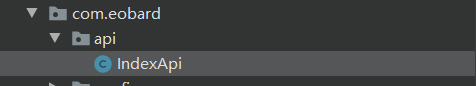
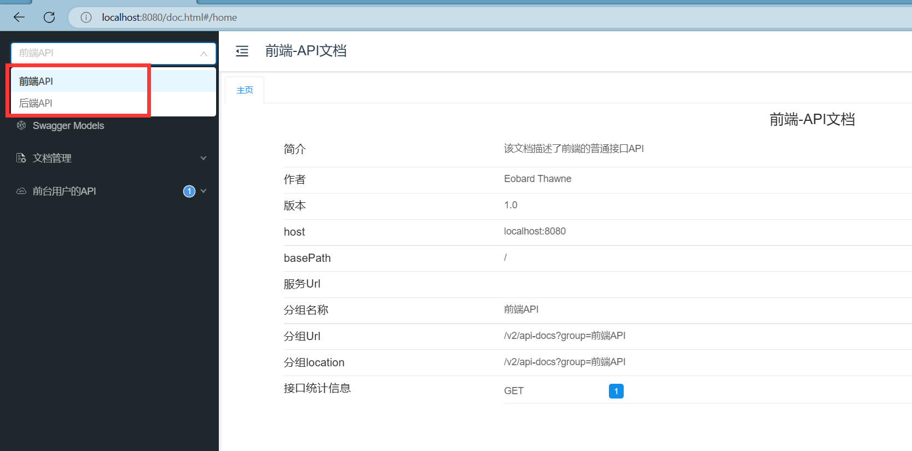
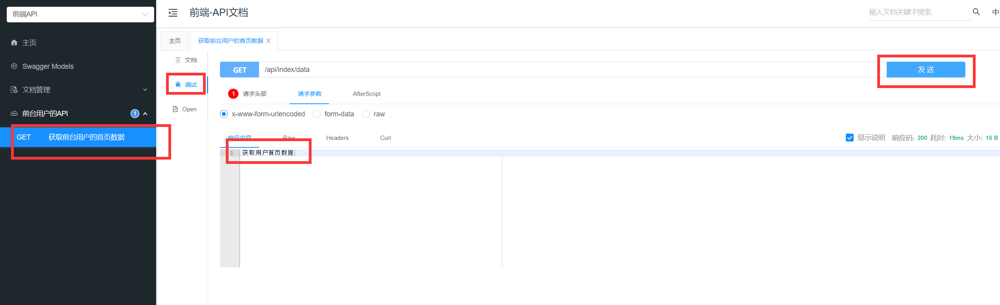
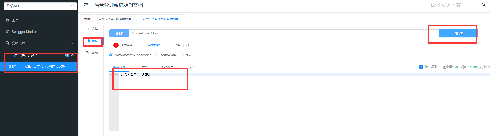

# swagger2与knife4j

## 导入依赖

```xml
   <dependency>
            <groupId>com.github.xiaoymin</groupId>
            <artifactId>knife4j-spring-boot-starter</artifactId>
            <version>2.0.8</version>
        </dependency>
```


## 编写配置类

```java
@Configuration
@EnableSwagger2WebMvc
public class Swagger2Config {

    //配置普通用户角色的接口配置
    @Bean
    public Docket webApiConfig(){
        List<Parameter> pars = new ArrayList<>();
        ParameterBuilder tokenPar = new ParameterBuilder();
        tokenPar.name("userId")
                .description("用户token")
                //.defaultValue(JwtHelper.createToken(1L, "admin"))
                .defaultValue("1")
                .modelRef(new ModelRef("string"))
                .parameterType("header")
                .required(false)
                .build();
        pars.add(tokenPar.build());

        Docket webApi = new Docket(DocumentationType.SWAGGER_2)
                //设置右上角下拉框的组名
                .groupName("前端API")
                .apiInfo(webApiInfo())
                .select()
                //指定扫描接口的包
                .apis(RequestHandlerSelectors.basePackage("com.eobard.api"))
                //根据url路径设置哪些请求加入文档
                .paths(PathSelectors.regex("/api/.*"))
                .build()
                .globalOperationParameters(pars);
        return webApi;
    }


    //配置普通用户角色的接口信息
    private ApiInfo webApiInfo(){
        //作者信息
        Contact contact = new Contact("Eobard Thawne", "", "2209473452@qq.com");
        return new ApiInfoBuilder()
                .title("前端-API文档")
                .description("该文档描述了前端的普通接口API")
                .version("1.0")
                .contact(contact)
                .build();
    }


    //配置管理员角色的接口信息
    private ApiInfo adminApiInfo(){
        //作者信息
        Contact contact = new Contact("Eobard Thawne", "", "2209473452@qq.com");
        return new ApiInfoBuilder()
                .title("后台管理系统-API文档")
                .description("该文档描述了后端的管理员接口API")
                .version("1.0")
                .contact(contact)
                .build();
    }

    //配置管理员角色的接口配置
    @Bean
    public Docket adminApiConfig(){
        List<Parameter> pars = new ArrayList<>();
        ParameterBuilder tokenPar = new ParameterBuilder();
        tokenPar.name("adminId")
                .description("用户token")
                .defaultValue("1")
                .modelRef(new ModelRef("string"))
                .parameterType("header")
                .required(false)
                .build();
        pars.add(tokenPar.build());

        Docket adminApi = new Docket(DocumentationType.SWAGGER_2)
                .groupName("后端API")
                .apiInfo(adminApiInfo())
                .select()
                .apis(RequestHandlerSelectors.basePackage("com.eobard.controller"))
                //只显示admin路径下的页面
                .paths(PathSelectors.regex("/admin/.*"))
                .build()
                .globalOperationParameters(pars);
        return adminApi;
    }
}
```


## 编写前台用户接口

```JAVA
package com.eobard.api;

import io.swagger.annotations.Api;
import io.swagger.annotations.ApiOperation;
import org.springframework.web.bind.annotation.GetMapping;
import org.springframework.web.bind.annotation.RequestMapping;
import org.springframework.web.bind.annotation.RestController;

@Api(tags = "前台用户的API")
@RestController
@RequestMapping("/api/index")
public class IndexApi {

    @ApiOperation("获取前台用户的首页数据")
    @GetMapping("/data")
    public String data(){
        return "获取用户首页数据";
    }
}
```

 


## 编写管理员接口

```java
package com.eobard.controller;

import io.swagger.annotations.Api;
import io.swagger.annotations.ApiOperation;
import org.springframework.web.bind.annotation.GetMapping;
import org.springframework.web.bind.annotation.RequestMapping;
import org.springframework.web.bind.annotation.RestController;

@Api(tags = "后台管理员的API")
@RestController
@RequestMapping("admin/index")
public class IndexController {

    @ApiOperation("获取后台管理员的首页数据")
    @GetMapping("/data")
    public String data(){
        return "获取管理员首页数据";
    }
}
```

 


## 运行效果

> 输入`ip地址:端口号/doc.html`









## 常用注解

* **@ApiModel("xxx实体类") ：用于实体类的类上面**
* **@ApiModelProperty("xxx属性")：用于实体类的属性上面**
* **@Api(tags = "XXXController")：用于控制器的实体类上面**
* **@ApiOperation("查询用户方法")：用于控制器的方法上面**
* **@ApiIgnore：//忽略类，接口，方法，参数生成swagger文档**		