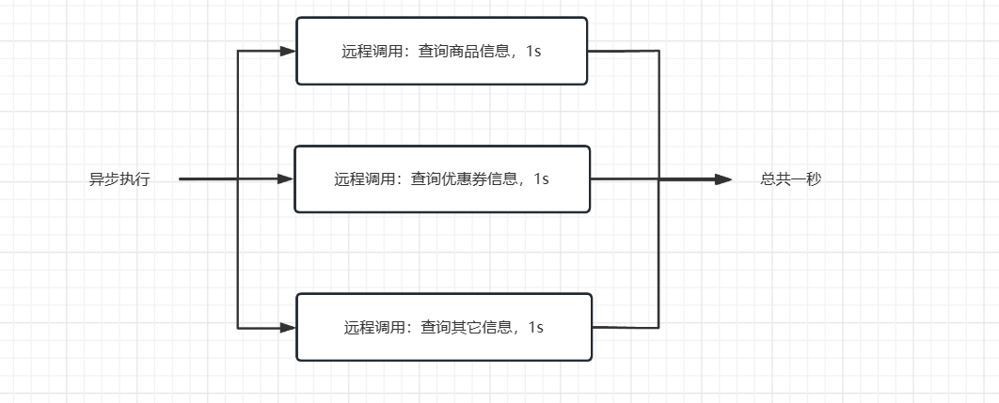
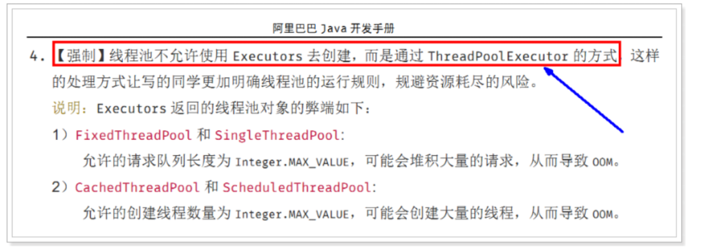
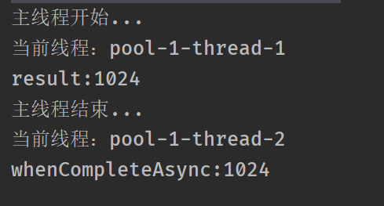
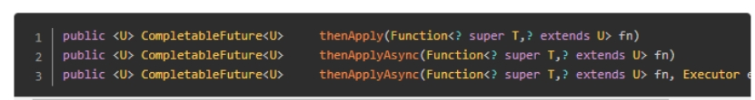
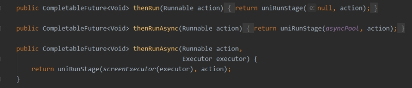
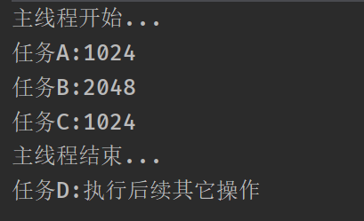
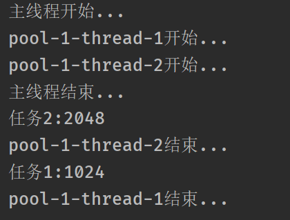
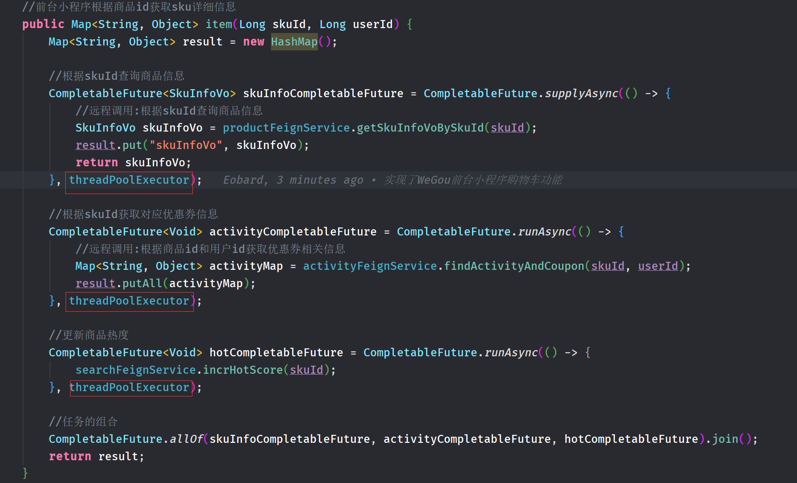

# CompletableFuture异步编排

## 问题引入

用户查询商品详情页时，可能需要远程调用多个服务的数据，如果同步执行每个远程调用方法，等待的时间很长；如果有多个线程同时完成远程调用的操作，可以极大缩短响应时间。

  




## 线程复习

### **创建线程的方式**

* 继承Thread类

* 实现Runnable接口

* 使用Callable接口

* 使用线程池




### **线程池的重要参数**


## CompletableFuture

### runAsync

> **runAsync不支持任务执行后的返回值**

```java
public class CompletableFutureDemo1 {
    public static void main(String[] args) throws Exception {
        //创建线程池:包含3个线程(仅供测试使用,实际开发中禁止)
        ExecutorService pool = Executors.newFixedThreadPool(3);

        System.out.println("主线程开始...");

        //创建CompletableFuture异步对象:runAsync不支持返回值
        CompletableFuture<Void> completableFuture = CompletableFuture.runAsync(() -> {
            System.out.println("当前线程：" + Thread.currentThread().getName());
            int result = 1024;
            System.out.println("result:" + result);
        }, pool);

        System.out.println("主线程结束...");
    }
}
```

 


### supplyAsync

> **supplyAsync支持任务执行后的返回值**

```java
public class CompletableFutureDemo2 {
    public static void main(String[] args) throws Exception {
        //创建线程池:包含3个线程(仅供测试使用,实际开发中禁止)
        ExecutorService pool = Executors.newFixedThreadPool(3);

        System.out.println("主线程开始...");

        //创建CompletableFuture异步对象:supplyAsync支持返回值
        CompletableFuture<Integer> completableFuture = CompletableFuture.supplyAsync(() -> {
            System.out.println("当前线程：" + Thread.currentThread().getName());
            int result = 1024;
            return result;
        }, pool);

        //获取返回值
        System.out.println(completableFuture.get());


        System.out.println("主线程结束...");
    }

}
```

 


### 计算完成时回调方法

```JAVA
public CompletableFuture<T> whenComplete(BiConsumer<? super T, ? super Throwable> action)
    
public CompletableFuture<T> whenCompleteAsync(BiConsumer<? super T, ? super Throwable> action)
    
public CompletableFuture<T> whenCompleteAsync(BiConsumer<? super T, ? super Throwable> action,Executor executor)
   
public CompletableFuture<T> exceptionally(Function<Throwable, ? extends T> fn) 
```

* **whenComplete：将当前线程执行完后，继续由当前线程执行 whenComplete 的任务。**

* **whenCompleteAsync：将当前线程执行完后，将whenComplete 的任务提交给线程池（若不提供线程池，会由`ForkJoinPool.commonPool()` ）来进行执行。**

* **exceptionally：处理异常情况，可以定义处理业务**


#### whenComplete

```java
public class CompletableFutureDemo3 {
    public static void main(String[] args) throws Exception {
        //创建线程池:包含3个线程(仅供测试使用,实际开发中禁止)
        ExecutorService pool = Executors.newFixedThreadPool(3);

        System.out.println("主线程开始...");

        //创建CompletableFuture异步对象
        CompletableFuture<Integer> future = CompletableFuture.supplyAsync(() -> {
            System.out.println("当前线程：" + Thread.currentThread().getName());
            int result = 1024;
            System.out.println("result:" + result);
            return result;
        }, pool)
      //当上一步线程完成结果后继续由上一个线程执行下一步操作:result为上一步的最终返回结果,throwable为异常结果信息
                .whenComplete((result, throwable) -> {
                    System.out.println("whenComplete:"+result);
        });       
        
        	System.out.println("主线程结束...");
    }
}
```

 


#### whenCompleteAsync

```java
public class CompletableFutureDemo3 {
    public static void main(String[] args) throws Exception {
        //创建线程池:包含3个线程(仅供测试使用,实际开发中禁止)
        ExecutorService pool = Executors.newFixedThreadPool(3);

        System.out.println("主线程开始...");

        //创建CompletableFuture异步对象
        CompletableFuture<Integer> future = CompletableFuture.supplyAsync(() -> {
            System.out.println("当前线程：" + Thread.currentThread().getName());
            int result = 1024;
            System.out.println("result:" + result);
            return result;
        }, pool)
    //当上一步线程完成结果后交给线程池去执行下一步操作:result为上一步的最终返回结果,throwable为异常结果信息
                .whenCompleteAsync((result, throwable) -> {
                    System.out.println("当前线程：" +Thread.currentThread().getName());
                    System.out.println("whenCompleteAsync:"+result);
        },pool);


        System.out.println("主线程结束...");
    }

}

```

 


### 线程串行化

> **带有Async的方法不在当前线程内执行，交给线程池执行（若不提供线程池，会由`ForkJoinPool.commonPool()`处理）。**


#### thenApply 

>  **当一个线程依赖另一个线程时，获取上一个任务返回的结果，并返回当前任务的返回值。**




#### thenAccept

>  **接收并消费上一个线程的处理结果，无返回结果。**


#### **thenRun**

> **只要上一个线程处理完成就开始执行thenRun，只是处理完任务后，执行 thenRun的后续操作**




```java
public class CompletableFutureDemo4 {
    public static void main(String[] args) throws Exception {
        //创建线程池:包含3个线程(仅供测试使用,实际开发中禁止)
        ExecutorService pool = Executors.newFixedThreadPool(3);

        System.out.println("主线程开始...");

        //线程串行化

        //任务A
        CompletableFuture<Integer> futureA = CompletableFuture.supplyAsync(() -> {
            int result = 1024;
            System.out.println("任务1:" + result);
            return result;
        }, pool);


        //任务B依赖于任务A,并且返回新值
        CompletableFuture<Integer> futureB = futureA.thenApplyAsync(res -> {
            int result=res+1024;
            System.out.println("任务2:" + result);
            return result;
        }, pool);


        //任务C接收任务A的结果,不返回结果
        CompletableFuture<Void> futureC = futureA.thenAcceptAsync((res) -> {
            System.out.println("任务3:"+res);
        }, pool);


        //任务D等待任务A完任务后,执行后续操作
        CompletableFuture<Void> futureD = futureA.thenRunAsync(() -> {
            System.out.println("任务4:执行后续其它操作");
        }, pool);

        System.out.println("主线程结束...");
    }

}
```

 


### 多任务组合

```java
public static CompletableFuture<Void> allOf(CompletableFuture<?>... cfs);

public static CompletableFuture<Object> anyOf(CompletableFuture<?>... cfs);
```

* 等待所有任务完成
* 只要有一个任务完成


```java
public class CompletableFutureDemo5 {
    public static void main(String[] args) throws Exception {
        //创建线程池:包含3个线程(仅供测试使用,实际开发中禁止)
        ExecutorService pool = Executors.newFixedThreadPool(3);

        System.out.println("主线程开始...");

		//线程1
        CompletableFuture<Integer> futureA = CompletableFuture.supplyAsync(() -> {
            System.out.println(Thread.currentThread().getName()+"开始...");
            int result = 1024;
            
            //模拟慢请求
            try {
                Thread.sleep(2000);
            } catch (InterruptedException e) {
                e.printStackTrace();
            }
            
            System.out.println("任务1:" + result);
            System.out.println(Thread.currentThread().getName()+"结束...");
            return result;
        }, pool);

		//线程2
        CompletableFuture<Integer> futureB = CompletableFuture.supplyAsync(() -> {
            System.out.println(Thread.currentThread().getName()+"开始...");
            int result = 2048;
            System.out.println("任务2:" + result);
            System.out.println(Thread.currentThread().getName()+"结束...");
            return result;
        }, pool);

        //任务合并: join或get方法。get要手动抛出异常,join不会
        CompletableFuture.allOf(futureA, futureB).join();

        System.out.println("主线程结束...");
    }

}
```

 


## 自定义线程池

### 配置

```java
@Configuration
public class ThreadPoolConfig {
    
    @Bean
    public ThreadPoolExecutor threadPoolExecutor(){
        return new ThreadPoolExecutor(
                2,
                5,
                2,
                TimeUnit.SECONDS,
                new ArrayBlockingQueue<>(3),
                Executors.defaultThreadFactory(),
// ThreadPoolExecutor自带的拒绝策略如下：
//   1. AbortPolicy(默认)：直接抛出RejectedExecutionException异常阻止系统正常运行
//   2. CallerRunsPolicy：“调用者运行”一种调节机制，该策略既不会抛弃任务，也不会抛出异常，而是将某些任务回退到调用者，从而降低新任务的流量。
//   3. DiscardOldestPolicy：抛弃队列中等待最久的任务，然后把当前任务加人队列中 尝试再次提交当前任务。
//   4. DiscardPolicy：该策略默默地丢弃无法处理的任务，不予任何处理也不抛出异常。 如果允许任务丢失，这是最好的一种策略。
                new ThreadPoolExecutor.AbortPolicy()
        );
    }
}
```


### 注入使用

```java
@Resource
private ThreadPoolExecutor threadPoolExecutor;
```




