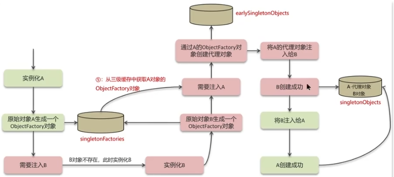
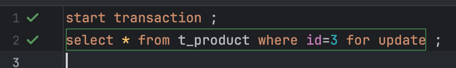

# Java面试八股文

## 课程简介

课程视频：https://www.bilibili.com/video/BV1yT411H7YK?spm_id_from=333.788.videopod.episodes&vd_source=6ce2a6eb6cbcb840f00c1778af71ce3c

还没观看的：48-68（springcloud、rabbitmq、kafka）、95-105（锁底层）、116-134（JVM）


## Java基础篇

### 基础

#### 参数传递

> **Java永远都是`值传递`，永远是把实参的值拷贝一份传给形参**

* 传基本类型：传的就是值本身，拷贝一份给形参，形参改动不会影响原对象

* **传引用类型：传的就是本身对象的值地址（内存地址，即每次sout时打印的值就是内存地址），拷贝一份内存地址给形参，两者指向的都是同一个地方，所以修改会有影响**

  * **如果形参内部又重新new了一次，那么指向的就是不同的地址，形参改动不会影响原对象**

  ```java
  public static void show(StringBuffer a) { //首先拷贝sb的内存值地址给a，指向同一个地方
      a = new StringBuffer("world");//a指向新地址，sb的地址还是旧地址，两者指向不一样
  }
  
  StringBuffer sb=new StringBuffer("hello");
  System.out.println("pre:"+sb);
  show(sb);
  System.out.println("next:"+sb);
  //pre:hello
  //next:hello
  ```

  

#### 数据类型

> **Java分为基本数据类型和引用数据类型**

* 基本数据类型：

  * boolean：1位；取值范围：true～false

  * byte：1个字节，8位；取值范围：-128～127

  * char：2个字节，16位；取值范围：0～65535（因为是字符，所以不会有负数）

  * short：2个字节，16位；取值范围：-32768～32767

  * int：4个字节，32位；取值范围：-2^31^ ~ 2^31^-1

  * long：8个字节，64位；取值范围：-2^63^ ~ 2^63^-1

  * float：4个字节，32位；取值范围：单精度浮点数，有效位数约 6 - 7 位

  * double：8个字节，64位；取值范围：双精度浮点数，有效位数约 15 位

    > **byte、char、short参与运算会自动转为int类型，boolean不参与类型转换；表达式运算会自动提升为操作数据中最大的类型**

* 引用数据类型：

  * 类、接口

  * 数组

  * 集合等等

    > **对对象的引用，存储的是对象在内存中的地址**


#### 装箱拆箱

* 自动装箱：编译器自动将基本数据类型转换为对应的包装类型

  ```java
  List<Integer> list = new ArrayList<>();
  list.add(1);  	// int 自动装箱为 Integer
  ```

* 自动拆箱：编译器自动将包装类型转换为对应的基本数据类型

  ```java
  void bar(int y) { ... }
  bar(new Integer(30));  // 自动拆箱为 int
  
  Integer i = null;
  int x = i;  // ❌ NullPointerException，因为要拆箱
  ```

  > **若引用类型为空，拆箱转为基本类型时会NPE**


#### ==和equals

* ==：对于基本类型，比较的是它们的值；对于对象时，比较的是内存地址，是否指向同一个实例
* equals：属于Object类中方法，默认比较内存地址；但许多类（如String、Integer等）重写了此方法，提供基于内容的比较


#### 修饰符范围

* public：任何范围都能访问
* private：只在当前类可访问
* protected：同一个包下可以访问、不同包中的子类可访问（通过继承来的）
* 无修饰符：同一个包下可以访问（包级私有）


#### final关键字

> **final关键字可以用来修饰类、方法、变量**

* 修饰类：**被final修饰的类可以被实例化但不能被继承**（eg：String、System），**可以继承非final类**。

  * 设计意图：保证类的不可变性和安全性（如String类防止子类破坏字符串内容、System类防止核心API被篡改）

* 修饰方法：被final修饰的方法不能被子类重写，但可以被子类继承使用；**不能修饰构造方法、抽象方法、接口方法**

  * 设计意图：防止核心逻辑被修改

* 修饰变量：被final修饰的变量为常量，不能被更改

  * 修饰成员变量：可在定义时初始化值、构造方法中初始化值、代码块中初始化值

  * 修饰静态常量：可在定义时初始化值、静态代码块中初始化值

  * **修饰局部变量：如果未被使用，可以不赋值，如果使用了必须赋值**

  * **修饰形参变量：如果是基本类型数据，则只能被访问，不能被修改值；如果是包装类型则可以修改内容，不能被重新赋值（因为指向的是不变的内存地址）**

    ```java
    public void test(final int x, final List<String> list) {
        final int a;		
        // System.out.println(a);						// ❌ 不允许
    
        // x = 10; 										// ❌ 不允许
        
        // list = new ArrayList<>();  				// ❌ 不允许重新赋值
      	list.add("A"); 								// ✅ 允许修改对象的内容
    }
    ```
    
    

#### 缓存机制

> **JVM中的缓存机制是将相同对象中缓存中的值复用， 提高性能、减少内存占用、避免重复创建对象（`下面复用缓存的值不是利用new的方式，因为那是创建对象了，地址会发生改变，及时使用缓存的值也不是同一个对象`）**

* 包装类型
  * Boolean：true、false两个常量
  * Byte：-128~127
  * **Character：0~127的ASCII字符**
  * Short：-128~127
  * Integer：-128~127
  * Long：-128 ~ 127
  * String：字符串常量
* 枚举类型（枚举值在JVM中是单例）
* 等等

```java
Boolean bool1 = true;  // Boolean.TRUE
Boolean bool2 = true;  // Boolean.TRUE  同一个对象
System.out.println(bool1 == bool2); // true

Byte b1 = 127;     // 缓存  
Byte b2 = 127;     // 同一个对象
System.out.println(b1 == b2); // true

Character c1 = 'A';    // 缓存
Character c2 = 'A';    // 同一个对象
System.out.println(c1 == c2); // true

Short s1 = 127;    // 缓存
Short s2 = 127;    // 同一个对象
System.out.println(s1 == s2); // true

Integer i1 = 127;  // 缓存
Integer i2 = 127;  // 同一个对象
System.out.println(i1 == i2); // true

Long l1 = 127L;    // 缓存
Long l2 = 127L;    // 同一个对象
System.out.println(l1 == l2); // true

// 字面量 - 自动入池
String s1 = "hello";           // 常量池
String s2 = "hello";           // 常量池 - 同一个对象
System.out.println(s1 == s2); // true

// new String - 不入池
String s3 = new String("hello"); // 堆中新对象
String s4 = new String("hello"); // 堆中新对象
System.out.println(s3 == s4); // false


enum Color { RED, GREEN, BLUE }  // 枚举值在JVM中是单例
Color red1 = Color.RED;   // 缓存
Color red2 = Color.RED;   // 缓存 - 同一个对象
System.out.println(red1 == red2); // true
```


#### String类为什么是不可变的

* 类声明是final类型，不能被继承修改；内部没有提供修改内容的地方；**存储内容的地方是`private final byte[] value`，只能被赋值一次，不能被修改**

* **对String进行修改时，都会创建一个新的对象，而原有的字符串对象保持不变**

* 线程安全，因为值不能被修改，多个线程共享同一个String对象，同时也保证了数据的安全性

* **优化常量池性能，当创建多个相同内容的String时，JVM会使用同一个对象而不会创建新的**

  ```java
  String s1="ZO_OM";
  String s2="ZO_OM";
  s1==s2;	//true
  
  String s1="hello";
  String s2="world";
  String s3="hello world";//编译时放进常量池的
  String s4=s1+" "+s2;		//运行时拼接
  s3==s4;//false 
  ```

* hashCode缓存优化，第一次计算时会被缓存下来，由于String不可变的特点，相同的字符串内容、引用或**哈希key都会复用存在的hashCode**

  ```java
  String s1="ZO_OM";
  String s2="ZO_OM";
  int i1 = s1.hashCode();//85564200
  int i2 = s1.hashCode(); //85564200
  int i3 = s2.hashCode();//85564200
  ```

* 性能考虑，频繁修改字符串的时候都会创建新的对象，为了优化性能，可以使用可变的StringBuilder、StringBuffer


#### String 、StringBuffer、String Builder区别

| 类            | 是否可变                       | 线程安全性                                 | 性能     | 适用场景                             |
| ------------- | ------------------------------ | ------------------------------------------ | -------- | ------------------------------------ |
| String        | 不可变，final byte[] value存值 | **线程安全，共享同一个对象**               | 性能较低 | 字符串不变时，常量池等使用           |
| StringBuffer  | 可变，byte[] value存值         | **线程安全，内部方法用synchronized锁修饰** | 性能较低 | **多线程环境**下需要修改字符串时使用 |
| StringBuilder | 可变，byte[] value;存值        | **不安全**                                 | 性能较高 | **单线程环境**下频繁修改字符串时使用 |


#### 静态变量与实例变量

* **实例范围：静态变量在类加载就只实例一次，所有对象共享一份数据（改一个，全部都受影响）；实例变量每个对象都有自己独立一份（每个对象互不影响，改一个不会影响其它对象）**
* **内存位置：静态变量在方法区的静态存储区；实例变量在堆内存中，随对象创建而存在**
* 生命周期：静态变量类加载时创建，销毁时销毁；实例变量在对象创建时存在，回收时销毁
* 访问方式：静态变量可通过类名或对象名调用；实例变量只能通过对象名访问

> **静态方法只能访问静态变量、调用静态方法，无法访问实例变量或实例方法**


#### 异常处理机制

* 编写可能出现异常的代码时，可放入try代码块中
* try后可以有一个或多个catch块来捕捉，catch中子类异常顺序在父类异常前（eg：先捕获ClassCastException，再捕获Exception）
* 可选地加入finally块执行清理代码
* 方法声明时使用throws 抛出；方法体使用throw new 抛出


### 面向对象

#### 方法重载与方法覆盖

> 多态包含了方法重载与方法覆盖

* 方法重载：

  * 同一个类中多个方法名相同，参数不同
  * 返回类型可以不同，但不作为重载的依据

* 方法覆盖：

  * 子类重写父类的方法，方法名相同，参数相同

  * 返回类型必须相同、返回子类类型（减少类型转换）

    ```java
    public abstract class UTjfjxvg3 {
        public abstract UTjfjxvg3 show();
    }
    
    public  class UTmmag extends UTjfjxvg3 {
        @Override
        public UTmmag show() {
            return null;
        }
    }
    ```

    

#### 抽象类与接口

> **抽象类通常是作为子类的基类，`描述的是子类共有的属性和行为，但某些行为需要子类去实现`；接口通常是描述一组类共同遵循的某种行为规范，`但它们本身可能不存在继承关系`**

* 成员变量：**抽象类可以有任何修饰符的变量**；**接口必须且默认是public static final的常量，且定义时必须初始化**
* 成员方法：抽象类有抽象方法和普通方法，**抽象方法不能用private、static、final修饰**；接口默认抽象方法，Java8后可以有默认方法、静态方法、私有方法
* 构造方法：**抽象类可以有构造方法；接口不允许**
* 实例化：两者都不能被实例化
* 继承关系：抽象类单继承；接口多实现
* **选择性：抽象类可以作为模版方法，定义了类的骨架；接口更倾向于添加新功能或兼容性问题，不适合作为骨架**


### IO流

> **所有数据读写操作在Java中都抽象为流，输入流：从数据源读取到程序中(内存中)；输出流：把数据从程序(内存)写出到目标**

* 字节流：以1个字节为单位传输数据，适合处理二进制数据，如图片、音视频
* 字符流：以字符(16位Unicode)为单位传输数据，适合处理文本数据


#### 为什么需要缓冲流

* 不管是字节流还是字符流，每次读写时，都会直接和底层设备（文件、磁盘、网络）交互，但是磁盘和网络IO非常慢，如果一次只读写几个字节就会频繁调用，性能很差
  * eg：读取8192个字符，字符流需要8192次，缓冲流假设为1024的大小，需要8次
* **缓冲流在内存中维护了一个缓冲区（byte[ ] ）**
  * **读操作：一次性从底层设备读取一大块数据放到缓冲区，再从缓冲区返回给用户程序，避免了程序的磁盘读取。**
  * **写操作：先将数据写入到缓冲区，等缓冲区满了或手动flush()时，再一次性写入到底层设备，减少了系统调用次数**

> 在处理字符数据时，BufferedReader通常比BufferedInputStream更快，因为它专为字符流优化，减少了不必要的数据转换开销；在处理字节数据时，BufferedInputStream更为合适和高效。


#### IO模型

* BIO（Blocking IO，阻塞IO）：读取或写入数据时，线程会一直等待（eg：Java的传统IO操作），直到数据准备就绪或写入完成，但在高并发下存在性能问题（因为线程会等待IO操作时阻塞，无法执行其它任务）
* NIO（Non- Blocking IO，非阻塞IO）：线程执行一个IO时不会一直等待，而是继续执行其它任务，**需要通过轮询或者回调函数等机制检查IO操作是否完成，能更好的支持并发，但会导致CPU资源浪费（因为会不停的调用判断数据处理好了没）**
* AIO（Asynchronous IO，异步IO）：线程执行IO时允许执行其它任务，不需要等待IO操作完成，**操作系统完成后会自动通过回调通知，不需要轮询**
* IO多路复用：使用操作系统Selector机制（eg：Java的Selector类），通过选择器，**一个线程可以监听多个通道上的IO事件，从而在单线程中处理多个连接（socket）**


#### 序列化与反序列化

* 序列化：把Java对象转为字节的过程，这些字节序列可以保存在磁盘上、网络中传输，并允许程序将这些字节序列再次恢复成原来的对象
* 反序列化：把字节序列还原成 Java 对象的过程


注意：

1. **其中需要序列化的类需要实现Serializable接口**
2. `transient` 修饰的字段不会被序列化
3. **`serialVersionUID` 很重要**，类修改后如果 ID 不匹配，反序列化会失败
   * 如果该对象类没有指定默认的版本号，JVM会根据类结构自动生成版本号，当类的结构改变时，版本号也会变化，当旧的序列化数据反序列化时会报错，因为两者的版本号已经变化
   * 如果该对象类指定了默认的版本号，那么旧的序列化数据反序列化时，会认为版本兼容，新增字段在旧序列化数据会变成对应类型的默认值


### 集合

#### List

##### Vector和ArrayList区别

* 两者都是动态数组结构
* 线程安全和效率：**ArrayList非线程安全，效率更高**；**Vector线程安全**，效率低，**所有方法都用synchronized加锁**
* 扩容机制：ArrayList默认扩容为原来的1.5倍；Vector扩容为原来的2倍


##### ArrayList实现原理

###### 底层数据结构

> **用连续内存空间存储相同数据类型的线性数据结构**


**数组索引为什么从0开始？从1开始不行吗？**

在数组索引获取元素的时候，会用索引和寻址公式来计算内存所对应的数据，寻址公式：`数组首地址+索引×数据类型大小`；如果索引从1开始，则寻址公式会变为：`数组首地址+（索引-1）×数据类型大小`，对于CPU来说，会额外增加一次减法的指令，相对于从0开始，性能不高


**时间复杂度**

* 查找
  * 索引查找：O(1)
  * 无序、按元素查找：O(n)
  * 有序、按元素查找：二分查找，O(logn)
* 插入、删除
  * 数组末尾：O(1)
  * 其余位置：O(n)


###### **源码分析**

  

   


**eg：使用无参构造**

```java
List<Integer> list = new ArrayList<>();
list.add(1);    //第一次添加，size=0，需要扩容,扩容后数组大小默认为10
for (int i = 2; i <= 10; i++) {
    list.add(i);
}
list.add(11);   //扩容
```

* **执行第一次添加**


* **执行2~10次的添加**


* **执行第11次添加**


**eg：使用有参构造**

```java
List<Integer> list = new ArrayList<>(11);
for (int i = 1; i <= 11; i++) { //不会扩容
    list.add(i);
}
list.add(12);   //扩容
```

* **第1~11次都不会扩容，第12次需要扩容**


###### 实现原理

==**无参构造的方式**==

* 底层使用动态的数组实现的，ArrayList初始容量为0，**当第一次添加数据的时候会初始化并扩容数组，容量为10**
* 当再次添加数据时，确保当前数组的size+1没有超过默认容量10的时候，会直接添加到数组中
* **如果当前数组的size+1超过了默认容量，则会调用grow方法区扩容，扩容比例为原来的1.5倍（使用的是算术运算符的右移1位操作），并且每次扩容都需要拷贝数组**


==**有参构造的方式**==

> **`List<Integer> list = new ArrayList<>(11)`扩容了几次？**
>
> **答：未扩容，==因为初始化的时候就已经创建了对应的数组（无参构造里数组是没创建的==），只有当添加元素超过了11次后，才会扩容**


###### 数组与List互转

* **数组转List：使用Arrays.asList**
* **List转数组：使用对象.toArray**


**如果数组转为List后，修改原数组，List会受影响吗？如果List转数组，修改List，数组会受影响吗？**

**答：数组转List，修改原数组，List会受影响，因为底层方法使用的内部类来构建List集合，在这个构造器中，会把传入的集合进行包装而已，指向的还是数组的地址；而List转数组则不会受影响，因为底层使用的是数组的拷贝，跟原来的元素没关系了**


##### ArrayList与LinkedList的区别

1. **底层数据结构**

   前者使用动态数组的数据结构；后者使用**双向链表**的数据结构

2. **操作效率**

   * 前者可以通过下标查询，O(1)的时间复杂度；后者不支持
   * 按元素查找，两者都为O(n)的时间复杂度
   * 新增和删除，前者在尾部操作是O(1)的时间复杂度，其余位置O(n)的时间复杂度，需要移动位置；后者在头尾节点操作是O(1)的时间复杂度，其余位置O(n)的时间复杂度

3. **内存占用**

   前者底层是数组，内存连续的，节省内存；后者是双向链表，需要存储数据+两个额外指针，内存不连续

4. **线程安全问题**

   **两者都不是线程安全的**，如果想要保证线程安全：

   * 在方法内作为局部变量使用（每个线程都有一份，不存在线程安全问题）

   * 使用线程安全的ArrayList与LinkedList（底层加入了synchronized同步锁，性能会有所影响）

     ```java
      Collection<Object> array = Collections.synchronizedCollection(new ArrayList<>());
      Collection<Object> link  = Collections.synchronizedCollection(new LinkedList<>());
     ```


#### Set

##### List接口和Set接口区别

* 元素重复：List接口允许元素重复，Set接口不允许元素重复
* 元素插入顺序：List接口元素按照插入顺序排列，有固定位置；Set接口大部分实现类是无序的
* 元素位置访问：List接口提供了访问元素的方法，如get方法；Set接口没有提供这样的方法


##### HashSet是如何保证元素不重复的？

* 基于哈希表实现

  HashSet构造函数中是通过HashMap来存储元素，其中Key为本身新增的元素，Value为HashSet为内部固定的静态Object对象(私有Present)

  ```java
  private transient HashMap<E,Object> map;
  private static final Object PRESENT = new Object();
  
  public HashSet() {
      map = new HashMap<>();
  }
  
  public boolean add(E e) {
    	return map.put(e, PRESENT)==null;
  }
  ```

* 使用hashCode和equals方法

  * 当向HashSet添加元素时，首先调用hashCode方法计算在哈希表中的存储位置
  * 在确定位置后，HashSet会检查该位置是否存在相同哈希值的元素，如果存在，利用hash值和equals方法判断两个元素是否相等，如果相同，认为元素存在，不能添加；否则添加到哈希表中
  * **通过以上两个方法，HashSet可以快速检测和防止重复元素的添加，确保每个元素在Set中唯一的，HashSet 本质就是“只有 Key 的HashMap”**


##### HashSet和HashMap的区别

> 如果需要存储一堆不重复的东西，用 `HashSet`；如果需要给这些东西关联额外的信息，用 `HashMap`。

* HashSet存储的不重复的单个元素，用于快速检查某个元素key是否存在；HashMap存储k-v对

* HashSet基于HashMap，当HashSet添加相同key时会判断是否存在旧value，存在就直接失败；HashMap则会覆盖旧value

  ```java
  //省略HashSet其它代码
  public boolean add(E e) {
    	return map.put(e, PRESENT)==null;
  }
  ```

  


#### Map

##### HashMap实现原理

###### 底层数据结构

**红黑树**

> **`一种自平衡的二叉搜索树BST，所有的规则都是为了保证红黑树平衡，红黑树的查找、新增、删除的时间复杂度都为O(logn)（普通的BST极端情况下，退化成链表形式即单侧树，复杂度为O(n)`**


**散列表**

> **根据Key访问Value的数据结构，由数组演化而来，利用其按下标进行随机访问的特点；当多个Key通过hash函数映射到同一个数组下标位置时被称为哈希冲突，可以利用链表法（拉链法）去解决，每个数组下标位置（被称为桶或者槽）会对应一条链表，当hash冲突后的元素会放到相同槽位对应的链表或红黑树中**

  

* 插入操作通过hash函数计算对应的槽位，时间复杂度为O(1)
* 查找、删除平均情况下（不存在hash冲突）时间复杂度为O(1)；若为链表存储，最坏时间复杂度为O(n)；若为红黑树，时间复杂度为O(logn)


**按位与和取模运算**

> **a%b=a&(b-1)，其中b必须为2的n次幂，但在计算机的计算中，&的效率比%更高，因为取模会消耗更多的CPU指令**

```
97%16=1
97&(16-1)=1

99%32=3
99&(32-1)=3
(32-1)&99=3
```


###### 实现原理

底层使用hash表数据结构，即数组+链表或红黑树

1. 往HashMap中put元素时，利用key的hashCode重新计算hash值计算对应的元素在数组的下标
2. 若出现相同hash值、相同的key，则覆盖原始值；若key不相同，则将当前的key-value放入链表或红黑树中
3. 获取值时，根据hash值获取下标，然后进一步判断key是否相同，从而找到对应值


###### JDK 1.7与1.8的区别

* 1.7：当hash冲突时采用拉链法，将链表和数组结合，将hash冲突的值追加到链表；**使用头插法，并发扩容时，容易造成环形链表引起死循环**
* 1.8：当hash冲突时，**链表的长度大于阈值（默认8）并且数组长度达到64时，链表会转换成红黑树来减少搜索时间；扩容resize( )时，红黑树的树节点数≤临界值6时会退化成链表；使用尾插法，解决了扩容时环形链表的问题**


###### put方法源码分析

> **方法返回值，`HashMap.put()` 返回的是旧值，如果没有旧值（首次插入），返回 null**

```java
HashMap<String, String> map = new HashMap<>();
System.out.println(map.put("a", "1")); // null，因为 "a" 第一次插入
System.out.println(map.put("a", "2")); // 1，返回旧值 "1"
System.out.println(map.put("a", "3")); // 2，返回旧值 "2"
```


> **整体流程**


1. **put新增判断数组是否为空，若为空，说明需要进行resize()扩容初始化**
2. **根据key计算hash值对应的数组索引，若为空，说明没有遇到哈希冲突，直接新建节点添加**
3. **若不为空，说明遇到了哈希冲突**
   * **判断当前链表或者红黑树的头节点的hash值、key和新数据的hash值、key是否一致，若相同则修改value即可**
   * **若不相同，需要判断当前节点是否为红黑树，如果是红黑树，则执行红黑树的插入操作**
   * **若不是红黑树，遍历链表并在尾部插入数据，然后判断链表长度是否大于8（并且数组长度>64），大于则转为红黑树执行插入，遍历过程需判断其余节点的hash值和新数据的hash值是否一致，若相同则修改value即可**

4. **插入成功后，需判断当前数组大小是否超过了最大容量（数组默认长度16×默认比例因子0.75），超过需resize()扩容**


> **源码分析**


```java
//无参构造方法：懒惰加载，只设置了默认的数组初始容量并没有初始化数组
public HashMap() {
    this.loadFactor = DEFAULT_LOAD_FACTOR; 
}

//当添加值的时候才会真正初始化数组
public V put(K key, V value) {
    return putVal(hash(key), key, value, false, true);
}


final V putVal(int hash, K key, V value, boolean onlyIfAbsent,boolean evict) {
    Node<K,V>[] tab; Node<K,V> p; int n, i;
    
    //判断数组是否初始化
    if ((tab = table) == null || (n = tab.length) == 0)
        //如果未初始化，调用resize方法进行初始化
        n = (tab = resize()).length;
    
    //将当前数组的总索引 &运算 K的hash值 判断该K的下标位置是否有数据
    if ((p = tab[i = (n - 1) & hash]) == null)
        //如果没有数据，直接将该数据放在下标位置
        tab[i] = newNode(hash, key, value, null);
    
    //当数组下标存在数据的情况（说明是哈希冲突的情况）
    else {
        Node<K,V> e; K k;
        
        //判断 当前链表或者红黑树 的头节点p的hash、key值和新数据的hash、key是否一致
        if (p.hash == hash &&((k = p.key) == key || (key != null && key.equals(k))))
            //说明是相同的，只需要覆盖即可
            e = p;
        
        //如果不一样，判断是否为红黑树，执行红黑树的增加逻辑
        else if (p instanceof TreeNode)
            e = ((TreeNode<K,V>)p).putTreeVal(this, tab, hash, key, value);
        
        //说明hash冲突链表的长度还没有超过阈值，还不是红黑树的形式，是链表的形式
        else {
            //遍历链表
            for (int binCount = 0; ; ++binCount) {
                //如果链表不存在相同hash、key的元素，那么找到链表最后一个节点位置，插入数据
               if ((e = p.next) == null) {
                    p.next = newNode(hash, key, value, null);
                   
                   //插入新的数据后，判断现在的链表长度是否超过阈值，超过了就要转为红黑树
                    if (binCount >= TREEIFY_THRESHOLD - 1) // -1 for 1st
                        treeifyBin(tab, hash);
                    break;
                }
                //判断链表其余位置的hash值和新传进来的是否一致，如果一样说明是修改操作
               if (e.hash == hash && ((k = e.key) == key||(key != null && key.equals(k))))
                    break;
                
                //把下一个节点赋值给当前节点，节点往后跳
                p = e;
            }
        }
    }
    ++modCount;
    //判断当前的数组大小是否超过临界值12（默认数组大小16*0.75）
    if (++size > threshold)
        resize();
    afterNodeInsertion(evict);
    return null;
}
```


###### resize扩容方法

> **整体流程**


1. **第一次put元素时调用resize方法进行扩容，默认初始化数组大小为16，扩容阈值12（数组默认长度16×默认比例因子0.75）**

2. **当达到阈值后，每次扩容数组大小、阈值变为原来的两倍，并将旧数组的数据复制到新数组中**

3. **如果当前节点的下一个节点为空，说明没有遇到hash冲突，直接复制即可**

4. **若不为空，说明遇到了哈希冲突**
   * **判断当前节点是否为红黑树，如果是，则执行红黑树的添加逻辑**
   * **如果不是，则说明为链表，遍历当前节点的链表，判断是否需要挪动里面的数据索引（e.hash & oldCap来判断是否为0，这里并没有减1），要么停留在原始索引位置，要么移动到原始位置+旧数组大小 索引位置上**
   
   

> **源码分析**

```java
final Node<K,V>[] resize() {
    Node<K,V>[] oldTab = table;
    
    //获取当前数组容量和阈值
    int oldCap = (oldTab == null) ? 0 : oldTab.length;
    int oldThr = threshold;
    
    //默认设置新的数组容量和阈值
    int newCap, newThr = 0;
    
    //说明当前数组已经初始化过了
    if (oldCap > 0) {
        //if...安全检查
        
        //将旧数组的容量左移1位（即x2）并且安全校验它不能超过最大的容量
        else if ((newCap = oldCap << 1) < MAXIMUM_CAPACITY &&
                 oldCap >= DEFAULT_INITIAL_CAPACITY)
            newThr = oldThr << 1; // 新的阈值也x2
    }
    else if (oldThr > 0) // initial capacity was placed in threshold
        newCap = oldThr;
    
    //说明是第一次put数据，需要扩容，数组未初始化的情况
    else {               // zero initial threshold signifies using defaults
        //新的数组大小默认为16
        newCap = DEFAULT_INITIAL_CAPACITY;
        //新的数组阈值默认为16*0.75=12
        newThr = (int)(DEFAULT_LOAD_FACTOR * DEFAULT_INITIAL_CAPACITY);
    }
      
    threshold = newThr;	//计算得到的阈值
    //根据上面的计算得出容量来创建新的数组
    @SuppressWarnings({"rawtypes","unchecked"})
    Node<K,V>[] newTab = (Node<K,V>[])new Node[newCap];
    table = newTab;
    
    //如果旧数组不为空，遍历旧数组
    if (oldTab != null) {
        for (int j = 0; j < oldCap; ++j) {
            Node<K,V> e;
            
            //判断当前数组下标的数据不为空，赋值给当前节点e，并把旧数据的当前下标数据清空
            if ((e = oldTab[j]) != null) {
                oldTab[j] = null;
                
                //如果当前节点没有下一个节点（没有遇到哈希冲突）
                if (e.next == null)
                   //将当前节点的hash取模当前数组总下标大小（eg：hash%（32-1）=5）放入新数组中
                    newTab[e.hash & (newCap - 1)] = e;
                
                //遇到了哈希冲突，并且是红黑树
                else if (e instanceof TreeNode)
                    //进行红黑树的操作
                    ((TreeNode<K,V>)e).split(this, newTab, j, oldCap);
                
                //遇到了哈希冲突，是链表
                else { // preserve order
                    //新建低位头、低位尾链表
                    Node<K,V> loHead = null, loTail = null;
                    //新建高位头、高位尾链表
                    Node<K,V> hiHead = null, hiTail = null;
                    //当前节点的下一个节点
                    Node<K,V> next;
                    
                    do {
                        //链表节点后移，防止死循环
                        next = e.next;
                                
           /**
             * 判断当前元素是否需要重新分配位置
             * eg：原来的两个元素在put时计算索引的时候是 e.hash & (oldCap-1)
             *  5 & (16-1)=00101 & 01111=5的索引位置
             *  21& (16-1)=10101 & 01111=5的索引位置
             *  但是扩容后需要重新分配里面的元素索引
             *  5 & 16 =00101 & 10000=0     如果等于0说明就保留在原位置
             *  21& 16 =10101 & 10000=16    如果不等于0说明需要移动位置：原本的位置+新扩容的大小
             */
                        if ((e.hash & oldCap) == 0) {
                            //声明头和尾节点，利用尾插法，每次更新尾节点，保持头节点不动
             //eg:head、tail->e1 然后下一个e2： tail->e2, tail变成e2就是head->e1->e2<-tail
                            if (loTail == null)
                                loHead = e;
                            else
                                loTail.next = e;
                            loTail = e;
                        }
                        //说明需要分配新的位置
                        else {
                          	//同样是尾插法
                            if (hiTail == null)
                                hiHead = e;
                            else
                                hiTail.next = e;
                            hiTail = e;
                        }
                    } while ((e = next) != null);
                    
                    
                    //将不需要重新分配位置的低位链表放在对应的下标位置
                    if (loTail != null) {
                        loTail.next = null;	//链表末尾置空
                        newTab[j] = loHead;
                    }
                    //需要重新分配位置的高位链表放在对应的 下标位置+旧的容量
                    if (hiTail != null) {
                        hiTail.next = null;//链表末尾置空
                        newTab[j + oldCap] = hiHead;
                    }
                }
            }
        }
    }
    return newTab;
}
```


###### 寻址算法

```java
static final int hash(Object key) {
    int h;
    return (key == null) ? 0 : (h = key.hashCode()) ^ (h >>> 16);
}
```

* 计算key的hashCode值
* 调用hash方法进行扰动，**让hashCode值右移16位再异或运算（扰动函数，减少哈希碰撞，让哈希分布更均匀**
* 最后put方法时通过`（容量-1）& hash` 操作得到数组索引，取代了取模操作，提升了效率


###### 数组长度为什么是2的n次幂

* 当put时，计算效率更高，因为2的n次幂可以使用按位与运算代替取模，提升效率
* 当扩容时，对于哈希冲突时，遍历链表数据复制到新数组的时候利用hash & oldCap==0效率更高，这样让旧元素留在原位置，新的移动到旧位置+oldCap上


##### HashMap和HashTable的区别

* **底层结构：HashMap为数组+链表或红黑树；HashTable是数组+链表**

* **效率：HashMap效率高，因为没有锁开销；HashTable大部分方法有synchronized同步锁**

* **线程安全：HashMap非线程安全（如果需要线程安全，推荐使用`ConcurrentHashMap`）；HashTable线程安全**

* 扩容机制：HashMap默认16，扩容x2；HashTable默认11，扩容x2+1

* **null值：HashMap允许一个null key和多个null value；HashTable不允许null key和value**

  ```java
  //省略HashTable其它代码
  public synchronized V put(K key, V value) {
          if (value == null) {
              throw new NullPointerException();
          }
          int hash = key.hashCode(); //如果key为空，这里也会空指针
   }
  ```

  


##### HashMap和TreeMap的区别

* **底层结构：HashMap基于哈希表实现的，通过hash值确定存储位置；TreeMap基于红黑树实现的，是一种`自平衡二叉查找树`**
* **key值顺序：HashMap默认情况下，不保证元素的存储顺序；TreeMap能够保证key的有序性，总是按照key的自然顺序创建或者自定义Comparator进行排序**
* key为null：**HashMap最多允许1个null key和多个null value**（所有null key会被映射到数组下标0的位置，并且会覆盖之前的null key）；**TreeMap 不允许 null key，允许 null value**（因为是拿key作为树节点，BST树节点为空就不能查找了）
* **复杂度：HashMap的查找、插入、删除平均复杂度为O(1)；TreeMap的查找、插入、删除的时间复杂度为O(logn)**


### 并发编程相关

#### 进程和线程的区别

* 程序：由指令和数据组成，当一个程序被运行，从磁盘读取到内存中，就开启了一个进程；我们可以打开多个edge浏览器但只能打开一个企业微信，前者称为多个实例进程，后者称为单实例进程
* 线程：一个线程就是一个指令流，将指令流的指令按顺序交给CPU执行


**区别：**

1. 进程是正在运行程序的实例，**进程包含了多个线程**，每个线程执行不同的任务
2. **不同进程使用不同的内存空间**（ideal占用1G，vscode占用0.5G），**当前进程下的所有线程可以共享内存空间，即共享数据**
3. **线程更轻量，线程上下文切换成本比进程上下文切换低**（上下文切换指一个线程切换到另一个线程）


#### 并行和并发

* 并行：同一时间做多件事情的能力，**4核CPU同时执行4个线程**（多核CPU，真正同时执行）
* 并发：同一时间应对多件事情的能力，**多个线程轮流交替使用一个CPU（单核CPU，看似同时，实际串行，时间片轮转）**

 


#### 线程的状态

1. 从操作系统的层面分为5种状态：


> **注意：这里的就绪状态虽然线程启动了start方法，但是这时候还没有拿到CPU的时间片或被其它线程抢走了CPU执行权，还没有真正执行，只有拿到了CPU时间片后才会变到运行状态，否则都会变成就绪状态**


2. 从java层面分为6种状态：


 

* NEW：Thread对象被创建出来了，但是还没执行start方法

* RUNNABLE：Thread对象调用了start方法（不管CPU调度/没有调度，只要start了就是这个状态）

* BLOCKED：当前线程没有拿到synchronized同步锁，被阻塞的情况（eg：多个线程一起执行，只有一个拿到同步锁，其它的都是阻塞状态）

  *  

    > **主线程先拿到同步锁，此时t1线程开启了，但是主线程还在休眠并没释放同步锁，这时候的t1就是阻塞状态**

* WAITING：调用wait方法后，需要手动notify唤醒

* TIMED_WAITING：**调用sleep方法或者join方法，会自动唤醒，不需要手动唤醒**

* TERMINATED：run方法执行完毕后，线程生命周期到头


```java
Thread thread = new Thread(() -> {});
System.out.println(thread.getState());		//NEW
thread.start();			
System.out.println(thread.getState());		//RUNNABLE
Thread.sleep(1000);
System.out.println(thread.getState());		//TERMINATED
```


##### wait和sleep的区别

* sleep属于Thread类的static方法；**wait属于Object类的方法**
* sleep属于TIMED_WAITING，自动被唤醒；**wait属于WAITING，需要手动唤醒**
* **在持有锁时执行，sleep不会释放锁资源；wait会释放锁资源**
* sleep可以在持有锁、没有锁下执行；**wait必须在有锁（同步锁）下执行**

> **注意：`wait(long timeoutMillis)`方法与`wait()`类似会在等待期间释放锁也可以被提前唤醒，但是当等待时间一到之后会继续执行后续代码（与`sleep()`类似）**

```java
static final Object lock = new Object();	//对象锁

Thread t1 = new Thread(() -> {
    synchronized (lock) {
        System.out.println("t1 running before");
        try {
          //等待两秒,等待期间会释放锁资源进入阻塞状态，当等待时间到之后会继续执行后续代码
            lock.wait(2000);    
        } catch (InterruptedException e) {
            throw new RuntimeException(e);
        }
        System.out.println("t1 running after");
    }
}, "t1");

t1.start();

Thread.sleep(100);
synchronized (lock) {
    System.out.println("main running");
    //lock.notify();	//提前唤醒
}
```

 


##### notify和notifyAll的区别

* **notify：只随机唤醒一个wait线程**
* **notifyAll：唤醒所有wait线程**

```java
Thread t1= new Thread(()->{
    System.out.println(Thread.currentThread().getName()+" waiting...");
    synchronized (lock){
        try {
            lock.wait();			//会释放锁资源，此时处于阻塞状态，直到唤醒
        } catch (InterruptedException e) {
            e.printStackTrace();
        }
    }
    System.out.println(Thread.currentThread().getName()+" 被唤醒了...");
},"t1");

Thread t2=new Thread(()->{
    System.out.println(Thread.currentThread().getName()+" waiting...");
    synchronized (lock){
        try {
            lock.wait();		//会释放锁资源，此时处于阻塞状态，直到唤醒
        } catch (InterruptedException e) {
            e.printStackTrace();
        }
    }
    System.out.println(Thread.currentThread().getName()+" 被唤醒了...");
},"t2");

t1.start();
t2.start();

Thread.sleep(2000);
synchronized (lock){
    lock.notify();
    //           lock.notifyAll();
}
```


#### 线程的创建方式

1. 继承Thread类 或使用匿名内部类、lambda表达式方式

```java
class MyThread extends Thread {
    @Override
    public void run() {
        // 线程执行的代码
        System.out.println("线程运行中...");
    }
}

// 使用方式
MyThread thread = new MyThread();
thread.start();

//匿名内部类
Thread thread = new Thread(new Runnable() {
    @Override
    public void run() {
        System.out.println(1);
    }
});
//lambda表达式
Thread thread = new Thread(() -> System.out.println(1));
```


2. 实现Runnable接口，重写run方法

```java
class MyRunnable implements Runnable {
    @Override
    public void run() {
        // 线程执行的代码
        System.out.println("线程运行中...");
    }
}

// 使用方式
Thread thread = new Thread(new MyRunnable());
thread.start();
```


3. 实现Callable接口，重写call方法，配合FutureTask（带返回值）

> **Callable一般用于有返回结果的非阻塞执行方法**

```java
import java.util.concurrent.Callable;
import java.util.concurrent.FutureTask;

class MyCallable implements Callable<String> {
    @Override
    public String call() throws Exception {
        // 线程执行的代码
        return "线程执行结果";
    }
}

// 使用方式
FutureTask<String> futureTask = new FutureTask<>(new MyCallable());
Thread thread = new Thread(futureTask);
thread.start();
String result = futureTask.get(); // 获取返回值
```


4. 使用线程池（Executor框架）创建

```java
import java.util.concurrent.ExecutorService;
import java.util.concurrent.Executors;

// 创建线程池
ExecutorService executor = Executors.newFixedThreadPool(5);

// 提交任务
executor.execute(new Runnable() {
    @Override
    public void run() {
        System.out.println("线程运行中...");
    }
});

// 关闭线程池
executor.shutdown();
```


##### 总结

**以上四种方式底层都是实现Runnable接口**

1. 继承Thread类同样也是实现的Runnable接口
   

2. 通过Callable方式需要交给FutureTask处理，而FutureTask也是实现的Runnable接口

   

   

3. ThreadPoolExecutor线程池每次构建的工作线程都是内部的Worker，而每次构建的工作线程都是从里面的thread进行start
   

   


##### Runnable接口和Callable接口有什么区别

* **Runnable接口中run方法没有返回值；Callable接口call方法有返回值，可配合FutureTask的get拿到结果**

* **Runnable接口中run方法的异常只能内部try-catch，不能抛出（因为Runnable接口定义run方法时没有抛出异常，所以重写的时候不能抛出）；Callable接口call方法可以throw出去**

  ```java
  @FunctionalInterface
  public interface Runnable {
      public abstract void run();
  }
  
  @FunctionalInterface
  public interface Callable<V> {
      V call() throws Exception;
  }


##### 线程调用run方法和start方法有什么区别

* **直接调用run方法会被视为该类的普通方法，可以调用多次**
* **start方法用来启动线程，会执行run方法的逻辑，一个线程实例只能被调用一次，若调用多次会报错**


##### 多个线程按顺序执行

> **t.join：阻塞当前线程进入TIMED_WAITING状态，直到t线程执行完毕后，当前线程继续执行，`还可以使用线程池中的单例线程池`**

```java
Thread t1 = new Thread(() -> {
    System.out.println(Thread.currentThread().getName() + " running...");
}, "t1");

Thread t2 = new Thread(() -> {
    try {
        t1.join();  //当前t2线程进入TIMED_WAITING阻塞状态，等待t1执行完才会继续执行
    } catch (InterruptedException e) {
        e.printStackTrace();
    }
    System.out.println(Thread.currentThread().getName() + " running...");
}, "t2");

Thread t3 = new Thread(() -> {
    try {
        t2.join();  //当前t3线程进入TIMED_WAITING阻塞状态，等待t2执行完才会继续执行
    } catch (InterruptedException e) {
        e.printStackTrace();
    }
    System.out.println(Thread.currentThread().getName() + " running...");
}, "t3");

//不管启动顺序如何，t2需要等待t1，t3需要等待t2，TIMED_WAITING会自动唤醒，无需手动唤醒
t3.start();
t2.start();
t1.start();
```


#### 线程结束方式

1. stop方法（已过时）：无论执行什么任务，强制终止线程

2. 共享变量：

   ```java
   class MyThread extends Thread {
       private volatile boolean running = true;	//volatile修饰运行状态
       public void stopRunning() {
           running = false;
       }
       
       @Override
       public void run() {
           while(running) {
               // 执行任务
               System.out.println("线程运行中...");
               try {
                   Thread.sleep(1000);
               } catch (InterruptedException e) {
                   Thread.currentThread().interrupt();
               }
           }
           System.out.println("线程结束");
       }
   }
   
   // 使用
   MyThread thread = new MyThread();
   thread.start();
   
   // 3秒后停止线程
   Thread.sleep(3000);
   thread.stopRunning();
   ```

3. interrupt方法（推荐）：类似于共享变量的方式，**当使用interrupt()方式后，线程的中断标记位会变为true（默认为false），线程继续运行直到检查到标志位为true时才会停止，`所以使用该方法不会立即停止线程，需要等待检查到标记位的方法后才停止`**

   * **若打断阻塞中（sleep、wait、join）的线程，线程会抛出InterruptedException异常**
   * 打断正常线程，会根据标记位来判断是否退出
   
   ```java
    //默认情况下,interrupt标记位是false
   System.out.println(Thread.currentThread().isInterrupted());
   Thread.currentThread().interrupt();
   //当经过中断方法后,interrupt标记位位true
   System.out.println(Thread.currentThread().isInterrupted());
   ```
   


#### synchronized同步锁

> **同步锁（对象锁）是Java中实现线程同步的基本机制，它用于控制多个线程对共享资源的访问，防止数据不一致的问题；`重量级锁`**

* **互斥性**：同一时刻只有一个线程能持有锁，其它线程想要获取同步锁会被阻塞住
* **可见性**：获得锁的线程能看到前一个线程释放锁前的所有修改
* **可重入性**：同一个线程可以重复获取已经持有的锁


##### 锁的不同区域

> **static修饰的字段或方法，在内存中只有一份，存放于静态区中，不管创建多少个类实例，都是共享的**

###### 锁住方法区域

```java
//静态方法:类级别锁,锁住的是类Class对象,多个线程在任意该类实例下都只能有一个线程访问
private synchronized static String getSeq() {}

//非静态方法:实例级别锁,锁住的是this对象,多个线程只有在同一个类实例下才能互斥; 多个线程在多个类实例下不互斥,因为多个实例的this对象不同
private synchronized String getSeq() {}
```


###### 锁住代码块

```JAVA
//代码块锁住当前实例:锁住的this对象,多个线程在同一个类实例才才能互斥;多个实例存在线程安全问题
public void getSeq() {
    synchronized (this) {
    }
}

//代码块锁住类对象锁:锁住的是类Class对象,多个线程多个实例都只有一个线程访问
public void getSeq() {
    synchronized (Class.class) {
    }
}
```


###### 锁成员变量

```JAVA
private static final Object obj = new Object(); //类级别,类似于Class.class
private final Object obj = new Object();        //实例级别,类似于this

//代码块锁住成员变量
public void getSeq() {
    synchronized (obj) {
    }
}
```


##### **底层原理**

> **通过`javap -v xx.class`查看汇编源码时可以知道底层是`Monitor`结构** 


> **注意：EntryList中的线程并不存在顺序问题，谁先抢到Owner谁就拿到了锁，所以同步锁是非公平锁，不存在线程先后顺序**


#### CountDownLatch

> 闭锁/倒计时锁，用来进行线程同步协作，等待所有线程完成倒计时**（让一个或多个线程等待其他多个线程完成操作后再继续执行后续业务逻辑）**

```java
//初始化整数count：表示要等待的事件数量
CountDownLatch latch = new CountDownLatch(3);

// 启动三个线程
for (int i = 1; i <= 3; i++) {
    int threadId = i;
    new Thread(() -> {
        try {
            System.out.println("线程 " + threadId + " 正在执行任务...");
            Thread.sleep(1000); // 模拟耗时任务
            System.out.println("线程 " + threadId + " 执行完毕");
        } catch (InterruptedException e) {
            e.printStackTrace();
        } finally {
            // 每完成一个任务，计数减1
            latch.countDown();
        }
    }).start();
}

System.out.println("主线程等待子线程执行业务逻辑...");
// 当计数减到0时,主线程等待的线程将被唤醒
latch.await();
System.out.println("所有子线程执行完毕，主线程继续执行后续逻辑");
```


#### 线程池

##### 核心参数与执行流程

```java
public ThreadPoolExecutor(int corePoolSize,		
                          int maximumPoolSize,
                          long keepAliveTime,
                          TimeUnit unit,
                          BlockingQueue<Runnable> workQueue,
                          ThreadFactory threadFactory,
                          RejectedExecutionHandler handler)
```

* **corePoolSize：核心线程数目（主要执行任务的数量）**
* **maximumPoolSize：最大线程数目=核心线程+救急（临时）线程的最大数目**
* **keepAliveTime：生存时间，救急线程的生存时间，当创建好了救急线程，若在生存时间内没有新任务，救急线程资源会释放**
* unit：时间单位
* **workQueue：当没有空余的核心线程时，新来的任务会加入到队列中，队列满时会创建救急线程执行任务**
* threadFactory：线程工厂，可指定对象的创建、设置线程名字、是否为守护线程
* **handler：拒绝策略，当所有线程都繁忙时，任务队列也存满时，新来的任务会触发对应的拒绝策略**
  * **ThreadPoolExecutor.AbortPolicy：直接抛出异常，默认策略**
  * **ThreadPoolExecutor.CallerRunsPolicy：使用主线程执行任务**
  * **ThreadPoolExecutor.DiscardOldestPolicy：丢弃阻塞队列最前面的任务，执行当前任务**
  * **ThreadPoolExecutor.DiscardPolicy：直接丢弃新的任务**


###### 如何确定CPU核心线程数

> **Runtime.getRuntime().availableProcessors()可获取运行的CPU核数**

* 高并发、任务执行时间短：**CPU的核数+1**
* 低并发、任务执行时间长：
  * IO密集型任务（文件读写、DB读写、网络请求）：线程大部分时间在等待IO，**CPU的核数×2+1**
  * CPU密集型任务（复杂加密计算型代码、Bitmap转换、Gson转换）：主要消耗CPU的计算，**CPU的核数+1**


###### **执行流程**


**eg：**


1. 接收两个任务（假设每个任务执行2小时）：a、b
   * 核心线程1执行任务a
   * 核心线程2执行任务b
   * 阻塞队列：null
   * 救急线程：null

2. 在执行a、b任务的同时，又来了两个任务c、d
   * 核心线程1执行任务a
   * 核心线程2执行任务b
   * 阻塞队列：【c、d】
   * 救急线程：null（因为阻塞队列刚好两个，没有溢出）

3. 在执行a、b任务的同时，阻塞队列有c、d两个任务等待，又来了一个任务e（假设执行1小时）
   * 核心线程1执行任务a
   * 核心线程2执行任务b
   * 救急线程：1
   * 救急线程会先执行任务e，此时阻塞队列为【c、d】；当e执行完后，然后执行任务c，最后执行任务d，最后阻塞队列为null

4. 在执行a、b任务的同时，阻塞队列有c、d两个任务等待，当救急线程执行任务e的时候（假设执行1小时）又来了一个任务f
   * 核心线程1执行任务a
   * 核心线程2执行任务b
   * 救急线程：1
   * 救急线程会先执行任务e（1小时），此时阻塞队列为【c、d】；当任务f来的时候
     * AbortPolicy（默认拒绝策略）直接报错
     * CallerRunsPolicy会使用main线程执行任务f
     * DiscardOldestPolicy将任务c丢弃，此时阻塞队列变为【d，f】
     * DiscardPolicy将任务f直接丢弃不管


###### 为什么不推荐Executors去创建线程，而是使用ThreadPoolExecutor？

1. newFixedThreadPool和newSingleThreadExecutor的阻塞队列长度默认是Integer.MAX_VALUE，可能会堆积大量请求，导致OOM
2. newCachedThreadPool可能会创建的线程数量是Integer.MAX_VALUE，也会导致OOM
3. 自定义通过ThreadPoolExecutor构造方法创建能根据机器的配置去创建对应的线程池，规避资源耗尽的风险


##### 阻塞队列对比

|               LinkedBlockingQueue（推荐使用）                | ArrayBlockingQueue |
| :----------------------------------------------------------: | :----------------: |
| **可固定大小或无限大小（默认大小为Integer.MAX_VALUE，最好指定大小）** |      固定大小      |
|                        底层是单向链表                        |     底层是数组     |
|                **入队才会创建节点并添加数据**                |   提前初始化数组   |
|                          **两把锁**                          |       一把锁       |

> **put(E e)：生产者操作，把一个任务放进队列中，如果队列满了会阻塞等待，直到有空间为止；take()：消费者操作，从队列中取出一个任务，如果队列为空也会阻塞等待，直到有新任务进来**

* 一把锁：所有操作都“抢”一个锁，put 和 take 互斥，不能同时进行
* 两把锁：put 和 take 各自有锁，可并发，能同时进行，提高效率。


##### 线程池的种类有哪些

* **使用固定线程数的线程池**：没有救急线程，阻塞队列为LinkedBlockingQueue，**超出线程数量的任务会在队列中等待，`适用于任务量已知，相对耗时的任务`**

  ```java
  Executors.newFixedThreadPool(int nThreads);
      
  public static ExecutorService newFixedThreadPool(int nThreads) {
      return new ThreadPoolExecutor(nThreads, nThreads,
                                    0L, TimeUnit.MILLISECONDS,
                                    new LinkedBlockingQueue<Runnable>());
  }
  ```

* **单线程化的线程池：**使用唯一的工作线程来执行任务，保证所有任务都按顺序FIFO执行，**`适用于任务串行执行的场景`**

  ```java
  Executors.newSingleThreadExecutor();
  
  public static ExecutorService newSingleThreadExecutor() {
      return new FinalizableDelegatedExecutorService
          (new ThreadPoolExecutor(1, 1,
                                  0L, TimeUnit.MILLISECONDS,
                                  new LinkedBlockingQueue<Runnable>()));
  }
  ```

* **可缓存线程池：**当新任务来之后会判断是否有存货的救急线程，如果没有则每次都会创建新的线程去执行任务，**`适用于短时间内任务或高并发瞬时爆发场景`**

  ```java
  Executors.newCachedThreadPool();
  
  public static ExecutorService newCachedThreadPool() {
      return new ThreadPoolExecutor(0, Integer.MAX_VALUE,
                                    60L, TimeUnit.SECONDS,
          //阻塞队列不存储元素，每个插入必须等待一个移出操作，任务直接交给线程，不排队
                                    new SynchronousQueue<Runnable>());
  }
  ```

* **可延迟执行线程池：`适用于执行延迟任务、定时及周期性的任务执行`**

  ```java
  Executors.newScheduledThreadPool(int corePoolSize);
  
  public ScheduledThreadPoolExecutor(int corePoolSize) {
      super(corePoolSize, Integer.MAX_VALUE, 0, NANOSECONDS,new DelayedWorkQueue());
  }
  ```

  

##### 线程池使用场景

###### 批量导入/导出数据

> **假设有20w条数据需要导入到ES索引库或导出到Excel中，如果直接一条一条加载则会OOM，这时候需要使用多线程处理**

```java
//假设总共20w条数据，如果将全部数据批量加载或导出会导致OOM,这时候需要多线程处理
int total = 200000;
//每个线程处理1000条数据
int batchSize = 1000;
//总共两百个任务（即创建200个线程）,一个任务（线程）处理1000条数据
int taskCount = total / batchSize;//200

// 模拟20w数据
List<String> data = new ArrayList<>(total);
for (int i = 0; i < total; i++) {
    data.add("User_" + i);
}

// CountDownLatch 初始化为任务总数
CountDownLatch latch = new CountDownLatch(taskCount);

// 创建线程池（IO密集型：core=CPU核心*2+1）
System.out.println("核心线程数："+Runtime.getRuntime().availableProcessors());
int core = Runtime.getRuntime().availableProcessors() * 2 + 1;

long startTime = System.currentTimeMillis();

//创建线程池
ExecutorService executor = new ThreadPoolExecutor(
    core,
    core * 2,
    60L,
    TimeUnit.SECONDS,
    new LinkedBlockingQueue<>(1000),
    //多出的新任务使用主线程执行任务,但是这里不会触发,因为手动只提交了1000个任务没有超过阻塞队列大小
    new ThreadPoolExecutor.CallerRunsPolicy()
);

// 提交任务
for (int i = 0; i < taskCount; i++) {
    int start = i * batchSize;
    int end = Math.min(start + batchSize, total);
    //模拟数据库的分页
    List<String> batch = data.subList(start, end);

    executor.submit(() -> {
        try {
            for (String user : batch) {
                // 假设每条数据1ms
                Thread.sleep(1);
                // 省略实际业务逻辑
            }
        } catch (InterruptedException e) {
            Thread.currentThread().interrupt();
        } finally {
            latch.countDown(); // 执行完毕，计数器减一
        }
    });
}

// 等待所有任务执行完成，省略主线程后续操作
latch.await();
System.out.println("✅ 所有数据处理完成");

// 关闭线程池
executor.shutdown();

long endTime = System.currentTimeMillis();
System.out.println("总计用时时间："+(endTime-startTime)/1000+"秒");
```

 


###### 数据汇总（报表汇总）

> **在微服务架构中，假设用户购买商品下单后，需要查询：订单信息（耗时60s）、商品信息（耗时30s）、物流信息（耗时40s）三个数据，它们处于不同的微服务中实现，如果使用串行同步调用，则需要2分10s，使用多线程异步完成这个功能进行数据汇总最多只需要60s**

* **串行方式**

```java
long startTime = System.currentTimeMillis();

//模拟调用用户服务
Thread.sleep(1000);
//模拟调用商品服务
Thread.sleep(2000);
//模拟调用优惠券服务
Thread.sleep(3000);

long endTime = System.currentTimeMillis();
System.out.println("总计用时时间：" + (endTime - startTime) / 1000 + "秒");
```

 


* **多线程**

```java
ExecutorService executor = Executors.newFixedThreadPool(3);
long startTime = System.currentTimeMillis();

// 提交三个任务
Future<String> userFuture = executor.submit(() -> {
    Thread.sleep(1000);
    return "用户信息";
});

Future<String> productFuture = executor.submit(() -> {
    Thread.sleep(2000);

    return "商品信息";
});

Future<String> couponFuture = executor.submit(() -> {
    Thread.sleep(3000);
    return "优惠券信息";
});

executor.shutdown();

// 输出结果
System.out.println(userFuture.get() + " " + productFuture.get() + " " + couponFuture.get());

long duration = (System.currentTimeMillis() - startTime) / 1000;
System.out.println("并发调用总耗时: " + duration + " 秒");
```

 


##### 控制接口并发访问数量

> `Semaphore`**（信号量）控制同时访问某个资源的线程数量，超过的线程必须等别人释放通行证后才能进入，eg：限流控制、控制访问共享资源的并发数量**
>
> 其它方式：Ratelimiter、**Nginx限流、Gateway网关限流、Sentinel降级限流、MQ对接口削峰处理（将请求放入MQ中，多个消费者处理结果）**

```java
// 创建一个 Semaphore，最多允许3个线程同时访问下载方法
private static final Semaphore semaphore = new Semaphore(3);

// 模拟的下载方法
public static void downloadFile(int taskId) {
    try {
        // 获取许可，如果没有就阻塞等待
        semaphore.acquire();
      
        System.out.println("线程 " + taskId + " 开始下载...");
        // 模拟下载时间
        Thread.sleep(2000);
        System.out.println("线程 " + taskId + " 下载完成");
    } catch (InterruptedException e) {
        e.printStackTrace();
    } finally {
        // 释放许可
        semaphore.release();
    }
}


public static void main(String[] args) throws Exception {
    // 模拟10个线程来请求下载
    for (int i = 1; i <= 4; i++) {
        final int id = i;
        new Thread(() -> downloadFile(id)).start();
    }
}
```

 


#### 谈谈对ThreadLocal的理解

> **为每个线程都创建`独立的变量副本`从而解决了变量并发访问冲突的问题，互不干扰（每个线程操作的是自己的部分，不会影响别的线程数据），适合在多线程环境中隔离共享数据，防止线程安全问题。eg：使用JDBC连接数据库时，每个线程的Connection放入各自的ThreadLocal中，保证每个线程都在自己的Connection上进行DB操作，避免了线程A关闭了线程B的连接**


**实现原理&源码解析**

1. ThreadLocal内部有ThreadLocalMap内部类用来存储资源对象
2. 当某个线程调用set方法，将ThreadLocal自己作为key，然后对应的资源数据作为value放入ThreadLocalMap集合中
3. 当调用get方法，同样也是以ThreadLocal自己作为key到当前线程中查找关联的资源数据
4. 当调用remove方法，以ThreadLocal自己作为key，移除当前线程关联的资源值


**内存泄漏问题**

> **ThreadLocalMap中的key是弱引用，值为强引用；当内存不够时，GC会把Key释放内存，但是value的内存不会释放，`所以当我们使用ThreadLocal的时候主动remove释放key、value`**


## 设计模式

#### 工厂模式

##### 简单工厂模式

* 抽象产品：定义产品的规范，包括产品的主要特性、功能
* 具体产品：实现或继承抽象产品的子类
* 具体工厂：提供创建产品的方法，通过该方法来获取产品

> **缺点：1. 违反开闭原则（每增加一个品种，都要修改工厂类，工厂类的职责过重，代码臃肿）；2.违反了单一职责原则（工厂类不仅创建对象，还承担了产品选择的逻辑，职责过多）**

```java
//抽象产品
public interface Coffee {
    public String getName();

    public void addSugar();
}


//具体产品1
public class AmericanCoffe implements Coffee {
    @Override
    public String getName() {
        return "美式咖啡";
    }

    @Override
    public void addSugar() {
        System.out.println("美式加糖");
    }
}


//具体产品2
public class LatteCoffee implements Coffee {
    @Override
    public String getName() {
        return "拿铁咖啡";
    }

    @Override
    public void addSugar() {
        System.out.println("拿铁加糖");
    }
}

//具体工厂
public class CoffeeFactory {
    public static Coffee createCoffee(String type) {
        Coffee coffee = null;
        if ("american".equals(type)) {
            coffee = new AmericanCoffe();
        } else if ("latte".equals(type)) {
            coffee = new LatteCoffee();
        }
        return coffee;
    }
}


Coffee latte = CoffeeFactory.createCoffee("latte");
System.out.println(latte.getName());
latte.addSugar();
```

 


##### 工厂方法模式

* 抽象产品：定义产品的规范，包括产品的主要特性、功能
* 具体产品：实现或继承抽象产品的子类
* 抽象工厂：提供创建产品的接口，通过访问具体的工厂方法来创建产品
* 具体工厂：实现抽象工厂中的抽象方法，完成具体产品的创建

> **解决了简单工厂模式的单一职责原则和开闭原则，每个产品对应一个工厂类，增加了系统复杂度**

```java
//抽象产品
public interface Coffee {
    public String getName();

    public void addSugar();
}


//具体产品1
public class AmericanCoffe implements Coffee {
    @Override
    public String getName() {
        return "美式咖啡";
    }

    @Override
    public void addSugar() {
        System.out.println("美式加糖");
    }
}


//具体产品2
public class LatteCoffee implements Coffee {
    @Override
    public String getName() {
        return "拿铁咖啡";
    }

    @Override
    public void addSugar() {
        System.out.println("拿铁加糖");
    }
}

//抽象工厂
public interface CoffeeFactory {
    public Coffee createCoffee();
}

//具体工厂1
public class AmericanCoffeeFactory implements CoffeeFactory {
    @Override
    public Coffee createCoffee() {
        return new AmericanCoffe();
    }
}

//具体工厂2
public class LatteCoffeeFactory implements CoffeeFactory {
    @Override
    public Coffee createCoffee() {
        return new LatteCoffee();
    }
}


CoffeeFactory americanCoffeeFactory = new AmericanCoffeeFactory();
Coffee americanCoffee = americanCoffeeFactory.createCoffee();
System.out.println(americanCoffee.getName());
americanCoffee.addSugar();
```


#### 策略模式

##### 简单策略模式

* 策略接口：定义所有策略的共同行为
* 具体策略类：实现策略接口，封装具体的行为或算法
* 上下文类：持有策略接口的引用，面向接口编程，动态使用不同策略

```java
//策略接口
public interface PayStrategy {
    void pay(int amount);
}

//具体策略接口1
public class AliPay implements PayStrategy {
    @Override
    public void pay(int amount) {
        System.out.println("使用支付宝支付：" + amount + "元");
    }
}

//具体策略接口2
public class WeChatPay implements PayStrategy {
    @Override
    public void pay(int amount) {
        System.out.println("使用微信支付：" + amount + "元");
    }
}

//上下文类
public class PayContext {
    private PayStrategy payStrategy;

    public PayContext(PayStrategy payStrategy) {
        this.payStrategy = payStrategy;
    }

    public void executePay(int amount) {
        payStrategy.pay(amount);
    }
}

//使用
PayContext context = new PayContext(new AliPay());
context.executePay(100);
```


##### 策略模式+工厂模式

> **解决实际项目中多类型if-else、switch判断的业务，eg：多种登录方式（微信登录、邮箱登录、账号密码登录）、支付方式（微信支付、支付宝支付、信用卡支付）等**

```java
//支付方式枚举
public enum PayTypeEnum {
    ALI_PAY(0, "阿里pay"),
    WECHAT_PAY(1, "微信pay"),
    CREDITCARD_PAY(2, "信用卡pay");

    public static PayTypeEnum getPayEnum(int code) {
        //遍历所有的枚举字段
        for (PayTypeEnum payType : values()) {
            if (payType.code == code) {
                return payType;
            }
        }
        throw new IllegalArgumentException("不支持的支付类型: " + code + "，支持的类型有: " +
                Arrays.stream(PayTypeEnum.values())
                        .map(e -> e.name + "(" + e.code + ")")
                        .collect(Collectors.joining(", ")));
    }

    private int code;
    private String name;

    PayTypeEnum(int code, String name) {
        this.code = code;
        this.name = name;
    }

}


//策略接口
public interface PayStrategy {
    PayTypeEnum getPayTypeEnum();

    public void pay(int count);
}

//具体策略接口1
@Component
public class WechatPay implements PayStrategy {
    @Override
    public PayTypeEnum getPayTypeEnum() {
        return PayTypeEnum.WECHAT_PAY;
    }

    @Override
    public void pay(int count) {
        System.out.println("wechat pay");
    }
}

//具体策略接口2
@Component
public class AliPay implements PayStrategy {
    @Override
    public PayTypeEnum getPayTypeEnum() {
        return PayTypeEnum.ALI_PAY;
    }

    @Override
    public void pay(int count) {
        System.out.println("阿里pay");
    }
}

//具体策略接口3
@Component
public class CreditCardPay implements PayStrategy {
    @Override
    public PayTypeEnum getPayTypeEnum() {
        return PayTypeEnum.CREDITCARD_PAY;
    }

    @Override
    public void pay(int count) {
        System.out.println("信用卡pay");
    }
}


//工厂类
@Component
public class PayFactory {

    @Resource
    private List<PayStrategy> payStrategyList;

    private final Map<PayTypeEnum, PayStrategy> payStrategyMap = new HashMap();


    public PayStrategy getPayStrategy(int payType) {
        PayTypeEnum payEnum = PayTypeEnum.getPayEnum(payType);
        return payStrategyMap.get(payEnum);
    }

    @PostConstruct
    public void setPayStrategyList() {
        payStrategyList.forEach(item -> payStrategyMap.put(item.getPayTypeEnum(), item));
    }
}


//调用
@Resource
private PayFactory payFactory;


@Test
public void test1() {
    PayStrategy payStrategy = payFactory.getPayStrategy(4);
    payStrategy.pay(10);
}
```

 


## Java框架篇

### Spring

#### @Autowired和@Resource区别

* @Autowired是Spring提供的注解；@Resource是JDK提供的注解
* **@Autowired是只能按类型注入；@Resource先按名称注入，找不到再按类型注入**
* @Autowired可以和@Qualifier一起使用按名称注入；@Resource可以配置name属性或type属性来指定方式注入


#### Spring使用到的设计模式

* **工厂设计模式**：Spring使用工厂模式通过BeanFactory、ApplicationContext 创建 bean 对象。
* **代理设计模式**：Spring AOP功能实现（JDK动态代理、CGLIB动态代理）
* **单例设计模式**：Spring 中的 Bean 默认都是单例的、并且是饿汉式模式(启动容器就生成实例，懒汉式：第一次请求才会创建)
* **模版方法设计模式**：Spring 中 jdbcTemplate、hibernateTemplate 等以 Template 结尾的对数据库操作
* 适配器模式：Spring AOP 的增强或通知、Spring MVC都用到了适配器模式


#### 单例bean是线程安全的吗？

> **Spring Bean的不可变状态：比如service类、dao类，它们被IOC容器初始化后是不会对其类作修改操作的，所以某种程度上也可以说Spring的单例是线程安全的**

**答：不是线程安全的，单例Bean在Spring容器中只有一个实例，用户的所有请求（多个线程）都执行这个实例的业务逻辑，如果该业务逻辑包含可变状态（成员变量属性）则必须考虑线程同步问题。**

<font color="red">**注：最简单的办法就是将singleton改为prototype，每次请求都会创建全新的Bean实例，每个线程操作的都是自己独立的Bean实例，但是频繁创建销毁对象会有额外开销；或者使用`synchronized`锁、`AtomicInteger`等线程安全类**</font>


#### Spring AOP相关面试题

> **什么是AOP？**

**面向切面编程，用于把与业务无关、但对多个对象产生影响的公共行为和逻辑代码抽取为公共模块复用，降低耦合度**


> **AOP在spring中有两种实现方式：JDK动态代理、CGLIB动态代理**

* **JDK动态代理**（默认情况，eg：常用开发中service、service.impl）：**目标类实现了某个接口**，运行时生成代理类实现接口的方法
* **CGLIB动态代理**（eg：没有实现接口就会切换为CGLIB或者强制配置Spring使用）：**`目标类和方法不能声明为final`**（因为是通过继承的方式，所以不能是final），**运行时通过继承的方式为目标类生成一个子类**，覆盖其中的所有方法


> **AOP的使用场景？**

记录操作日志、Spring中声明式事务的处理

核心：使用AOP的环绕通知+切点表达式，通过环绕通知获取请求方法参数（方法名、请求方式等），然后执行公共的业务逻辑


Spring声明式事务的实现本质是通过AOP功能，对方法前后进行拦截，在执行方法之前开启事务（首先需要根据注解获取增强类和方法信息），在执行完方法后根据情况提交事务或回滚事务


#### 事务传播机制

> 前提条件：**在一个事务方法中调用了另一个事务方法**，也就是“外层事务包含了内层事务的执行”，eg：事务A代码块里面调用了事务B的代码块方法

```java
@Service
public class ServiceA {
    @Autowired
    private ServiceB serviceB;

    @Transactional(propagation = Propagation.REQUIRED） //设置级别，默认REQUIRED
    public void methodA() {
        System.out.println("A start");
        serviceB.methodB();		//事务A中包含事务B
        System.out.println("A end");
    }
}

@Service
public class ServiceB {
    @Transactional(propagation = Propagation.xxx） //自定义设置级别，下面任意几个之一
    public void methodB() {
        System.out.println("B running");
        throw new RuntimeException("B出错了");
    }
}
```

==注意：下面说的外层内层事务，默认将外层设为REQUIRED级别，内层自定义设为下面几种之一，方便理解==

* **REQUIRED（默认）**：如果外层存在事务，内层则加入当前事务；如果外层没有事务，则内层方法会新建一个事务（**eg：A和B要么同时提交，要么同时回滚）**

* **REQUIRES_NEW**：**内层总是新建一个事务，保证自己独立提交或回滚**，原来的外层事务挂起**（eg：B回滚，A不受影响）**

* **SUPPORTS**：如果外层有事务，内层则加入当前事务；如果外层没有事务，内层不管有无事务都是以普通方法执行（**eg：外层有，内层加入；外层没有，内层普通方法执行**）

* **NOT_SUPPORTED**：如果外层有事务，就把外层事务挂起，内层当成普通方法处理（**外层有，外层挂起，内层当普通方法执行**，eg：内层代码抛出异常，内层的DB操作还是会成功，但是外层的代码会回滚，因为捕获到了内层抛出的异常）

* **NEVER**：不支持事务，如果存在事务，就抛异常（**只要内层处于外层事务中就抛异常**）

* **MANDATORY**：必须运行在事务中，没事务就抛异常（**只要外层没事务就抛异常**）

* NESTED：如果外层有事务，内层事务会在外层嵌套一个事务保存点，如果内层回滚不会影响外层；如果没有事务，则新建一个事务（**内层事务依赖外层事务，属于外层事务的嵌套保存点**）

  


#### Spring事务失效的场景

> **1.异常捕获处理：自己处理异常但没抛出**


> **2.抛出了检查异常**

**非检查异常（也称运行时异常）：在业务运行时可能出现的，继承自`java.lang.RuntimeException`，即预期之外的，Idea编译期间不会爆红，不要求处理**

* `NullPointerException` (空指针异常)
* `IllegalArgumentException` (非法参数异常)
* `ArrayIndexOutOfBoundsException` (数组越界异常)
* `ClassCastException` (类型转换异常)
* `ArithmeticException` (算术异常)

**检查异常：继承自`java.lang.Exception`但不继承`RuntimeException`的异常，Idea工具会用红色波浪线提醒，要么手动try-catch要么抛出**

* `IOException`（输入输出异常）
* `ClassNotFoundException`（类未找到异常）
* `InterruptedException`（线程中断异常）
* `FileNotFoundException`（文件未找到异常）


> **3.非public方法导致的事务失效**


#### Spring bean的生命周期

> **IOC容器初始化：会创建所有非懒加载的bean，`@Lazy=true`的bean会在第一次被调用时初始化；原型作用域的bean每次调用会创建新实例，不会在启动时初始化；`@Conditional`的bean只有满足条件才会初始化**


* **通过BeanDefinition获取bean的定义信息**
* **通过构造函数实例化bean**
* **依赖注入属性值**
* **处理Aware接口（BeanNameAware、BeanFactoryAware、ApplicationContextAware）**
* **Bean的后置处理器-前置方法**
* **初始化方法（`@PostConstruct的自定义方法`、InitializingBean接口）**
* **Bean的后置处理器-后置方法**
* **销毁Bean**

```JAVA
public class User implements BeanNameAware, BeanFactoryAware, ApplicationContextAware, InitializingBean {

    public User() {
        System.out.println("构造方法先被执行");
    }

    private String name;

    @Value("eobard thwane")
    public void setName(String name) {
        this.name = name;
        System.out.println("依赖注入被执行");
    }

	//此时这个阶段bean相关属性值已经拿到了，可以执行资源的初始化（缓存、连接池、配置校验、后台定时任务、数据库创建库、表等）
    @PostConstruct 
    public void init() {
        System.out.println("@PostConstruct方法被执行");
    }

    @Override
    public void setBeanFactory(BeanFactory beanFactory) throws BeansException {
        System.out.println("Aware接口设置Bean工厂被执行");
    }

    @Override
    public void setBeanName(String name) {
        System.out.println("Aware接口设置Bean名称被执行");
    }

    @Override
    public void setApplicationContext(ApplicationContext applicationContext) throws BeansException {
        System.out.println("Aware接口设置ApplicationContext被执行");
    }

    @Override
    public void afterPropertiesSet() throws Exception {
        System.out.println("实现InitializingBean的接口被执行");
    }
}
```

```java
@Configuration
public class SpringConfig {

    @Bean
    public User user() {
        return new User();
    }

    @Bean
    public static BeanPostProcessor myBeanPostProcessor() {
        return new BeanPostProcessor() {
            @Override
            public Object postProcessBeforeInitialization(Object bean, String beanName) {
                if (bean instanceof User) {
                    System.out.println("BeanPostProcessor的前置处理 " + beanName);
                }
                return bean;
            }

             @Override
            public Object postProcessAfterInitialization(Object bean, String beanName) {
                // 只对特定Bean进行代理
                if (bean instanceof User) {
                    System.out.println("BeanPostProcessor的后置处理 " + beanName);
                    
                    //cglib代理对象
                    //Enhancer enhancer = new Enhancer();
                    //设置增强的类
                    //enhancer.setSuperclass(bean.getClass());
                    //执行回调方法,增强方法
                    //enhancer.setCallback((InvocationHandler) (proxy, method, args) -> method.invoke(method, args)
                    //);
                    //return enhancer.create();
                }
                return bean;
            }
        };
    }
}
```

```java
@SpringBootTest
class TestApplicationTests {

    @Test
    void contextLoads() {
        AnnotationConfigApplicationContext context = new AnnotationConfigApplicationContext(SpringConfig.class);
        User user = (User) context.getBean("user");
        System.out.println(user);
    }

}
```

 


#### Spring 循环依赖

> **循环依赖指的是两个或多个 Bean 相互依赖，形成闭环引用，比如A依赖于B，B依赖于A**

##### 属性注入循环依赖问题

Spring 通过**三级缓存**机制解决部分`单例作用域、属性注入`的循环依赖问题，**三个缓存均是线程安全的**，底层依赖`ConcurrentHashMap`实现并发安全控制

* **一级缓存**（`singletonObjects`）：缓存已经经历了完整生命周期的Bean（ 完全初始化好的单例 Bean）
* **二级缓存**（`earlySingletonObjects`）：缓存早期的Bean对象（已通过构造方法实例化但未完成属性赋值、增强等操作）
* **三级缓存**（`singletonFactories`）：缓冲ObjectFactory对象工厂，用来创建某个对象



```java
//1.构造器初始化A，将A的对象工厂放入三级缓存中
//2.属性注入B时，发现需要对象B，构造器初始化B，将B的对象工厂放入三级缓存中
//3.属性注入A时，发现需要对象A，从三级缓存中创建A的早期对象(未完全初始化)，并注入到B中，B创建成功，放入一级缓存中
//4.A获得完全初始化的B，完成对象创建，放入一级缓存中

// 模拟三级缓存操作
Map<String, Object> singletonObjects = new ConcurrentHashMap<>(); // 一级缓存
Map<String, Object> earlySingletonObjects = new ConcurrentHashMap<>(); // 二级缓存
Map<String, ObjectFactory<?>> singletonFactories = new ConcurrentHashMap<>(); // 三级缓存

// 1. 创建 A 的实例
A a = new A(); // 构造器实例化
singletonFactories.put("a", () -> a); // 放入三级缓存

// 2. 填充 A.b 时需要 B
B b = new B(); // 构造器实例化
singletonFactories.put("b", () -> b); // 放入三级缓存

// 3. 填充 B.a 时需要 A
ObjectFactory<?> aFactory = singletonFactories.get("a");
A earlyA = (A) aFactory.getObject(); // 从三级缓存获取早期引用
b.setA(earlyA); // 注入未完全初始化的 A

// 4. 完成 B 的初始化
singletonObjects.put("b", b); // B 放入一级缓存

// 5. 完成 A 的初始化
a.setB(b); // 注入完全初始化的 B
singletonObjects.put("a", a); // A 放入一级缓存
```


##### 构造器注入循环依赖问题

> **构造方法循环依赖怎么解决？比如A的构造方法注入了B，B的构造方法注入了A**

```java
public A(@Lazy B b) {}  	// 接受 B 的代理
public B(A a) {}        	// 注入已初始化的真实 A
```


**注：IOC容器在初始化阶段会把所有扫描到的非懒加载单例bean初始化，由于bean的生命周期构造函数是第一个执行，spring框架不能解决构造函数的依赖注入，使用@Lazy注解进行懒加载，什么时候需要另一个对象再进行bean对象的创建（`这里与属性注入不同，构造器懒加载注入的是代理对象，不同于属性注入的是早期对象`）**


##### 对比

 


#### BeanFactory接口和FactoryBean接口区别

> **BeanFactory（Bean工厂） 是 Spring 的工厂，FactoryBean（工厂Bean）是自定义功能的特殊Bean**

*  **`BeanFactory是Spring最核心的IOC接口，用来管理Bean的生命周期，提供getBean()等方法`**
   * **BeanFactory**和**ApplicationContext**是**spring**框架的两个**IOC**容器，现在一般使用 **ApplicationnContext**（eg：最常见的子类ClassPathXmlApplicationContext类路径加载xml、AnnotationConfigApplicationContext注解加载等，都是**ApplicationContext**的子类，而ApplicationContext间接实现了BeanFactory）
*  **`FactoryBean是Spring提供的特殊接口，用来定制Bean的创建逻辑`**（eg：返回代理对象、复杂对象、第三方类）
   * 某些特殊情况下，实例化Bean需要复杂逻辑，如果按照传统xml方式则会配置大量信息，此时就可以实现这个接口来定制化


### Spring MVC执行流程


* 用户发送请求到前端控制器DispatcherServlet
* DispatcherServlet收到请求会调用HandlerMapping（处理器映射器）去找到Controller中某一个方法，生成处理器对象以及拦截器（如果有），再一起返回DispatcherServlet
* DispatcherServlet会调用HandlerAdaptor（处理器适配器）去找到Controller中某一个方法并执行
* **如果方法上或类上加入了@ResponseBody，则会通过HttpMessageConverter将结果转为JSON并交给DispatcherServlet响应给用户**


**如果是老旧版本的JSP、Thymeleaf引擎，则第四步变为**

* 将Controller执行完成后返回ModeAndView对象，通过 处理器适配器 返回给DispatcherServlet
* DispatcherServlet将ModeAndView对象交给ViewResolver（视图解析器）解析成具体的View（视图）
* DispatcherServlet根据View（视图）渲染，将里面的EL表达式、JSTL标签进行数据填充并返回给用户


#### http和https区别

* **http无加密，明文传输；https基于SSL机密**（对称+非对称机密结合）
* **http默认端口80；https默认端口443**
* **http数据无校验，可能被篡改；https通过mac校验防止数据篡改**
* http无加密开销，速度更快；https需要加解密，性能略低


### MyBatis

#### 执行流程

1. 读取MyBatis配置文件：mybatis-config.xml加载运行环境和Mapper映射环境

2. 构造会话工厂SqlSessionFactory对象（全局一个，生产SqlSession）

3. 会话工厂创建SqlSession对象（包含了执行sql语句的所有方法，每次操作一次会话，有多个）

4. 真正操作数据库的接口，Executor执行器，也负责查询缓存的操作

5. Executor接口的执行方法中有MappedStatement类型的参数，它定义了标签中的信息（封装了Mapper.xml和Mapper.java的映射信息、SQL语句占位符等）

   

6. 真正执行DB操作和结果返回时需要对输入参数和输出结果进行转换

   


#### MyBatis延迟加载及原理

> **在用到数据时才进行加载，不需要数据时不加载数据**


**MyBatis支持一对一、一对多关联集合对象的延迟加载；在MyBatis配置文件中，可以使用`lazyLoadingEnabled=true/false`来决定是否启用全局延迟加载，或者可以在Mapper.xml文件中使用`fetchType=eager/lazy`来决定当前查询方法是否使用延迟加载**


**底层原理**


1. **使用CGLIB（一般实体类没有实现某个接口）**创建目标对象的代理对象
2. 当调用对应查询方法时，进入代理对象的invoke方法判断对应的数据是否为空来决定是否执行sql或者属性赋值


#### 一、二级缓存

* **一级缓存：基于PerpetualCache的`HashMap本地缓存`，作用域为SqlSession级别，当其进行flush或close之后，一级缓存的值就会清空，默认打开一级缓存**

* **二级缓存：基于namespace和mapper作用域，不依赖于SqlSession级别，默认也是`HashMap本地缓存`，需要单独在配置文件中设置`cacheEnabled=true`和Mapper.xml文件中配置`<cache />`**

  


> **二级缓存什么时候清理缓存中的数据？**

**当一级缓存、二级缓存进行了新增、修改、删除操作后，默认作用域下的select缓存将被清理；二级缓存需要entity实体类实现序列化接口；SqlSession会话提交或者关闭后，一级缓存的数据会转移到二级缓存**


### SpringBoot装配原理

1. Spring Boot项目的启动类存在@SpringBootApplication注解，这个注解对三个注解进行了封装，分别是：
   * **@SpringBootConfiguration（标记这是一个配置类）**
   * **@EnableAutoConfiguration**
   * @ComponentScan（扫描指定包及其子包下的组件，注入到IOC容器中）
2. 其中**@EnableAutoConfiguration是实现自动配置的核心注解**，该注解通过@Import注解导入对应的配置选择类，**内部就是读取该项目及其引用Jar包classpath路径下的META-INF/spring.factories文件中的所配置的全类名，**这些配置类所定义的Bean会根据条件注解或 指定exclude排除项来决定是否加载到IOC容器中，**这就是约定大于配置的核心**
3. 条件判断像@ConditionalOnClass、@ConditionalOnMissingBean这样的注解，来判断似乎否有对应的class文件，如果有则加载所对应的自动装配类


### 框架常见注解

#### Spring

| 注解                                           | 说明                                       |
| :--------------------------------------------- | :----------------------------------------- |
| @Component、@Controller、@Service、@Repository | 组件、控制层、服务层、数据访问层Bean       |
| @Autowired                                     | 根据类型依赖注入                           |
| @Qualifier                                     | 结合@Autowired一起使用，根据名称依赖注入   |
| @Scope                                         | bean的作用范围                             |
| @Configuration                                 | 配置类声明                                 |
| @Bean                                          | 声明一个bean                               |
| @Aspect、@Pointcut、@Before、@After、@Around   | 切面类、切点、前置通知、后置通知、环绕通知 |
| @Transactional                                 | 声明事务                                   |


#### Spring MVC

| 注解                                                         | 说明                                      |
| :----------------------------------------------------------- | :---------------------------------------- |
| @RequestMapping、@GetMapping、@PostMapping、@PutMapping、@DeleteMapping | 通用请求映射、CRUD映射                    |
| @RequestParam、@PathVariable、@RequestBody、@RequestHeader   | 请求参数、Restful路径变量、请求体、请求头 |
| @ResponseBody、@RestController                               | Json返回格式、Restful返回风格             |


#### SpringBoot

| 注解                                                         | 说明         |
| :----------------------------------------------------------- | :----------- |
| @SpringBootApplication                                       | 主启动类注解 |
| @EnableAutoConfiguration                                     | 启用自动配置 |
| @ConfigurationProperties                                     | 配置属性绑定 |
| @ConditionalOnClass、@ConditionalOnMissingBean、@ConditionalOnProperty | 条件配置注解 |
| @ComponentScan                                               | 组件扫描     |


## 企业场景篇

### 单点登录

> **SSO，Single-Sign-On，只需登录一次，就可以访问所有信任的应用系统，eg：JWT，Oauth2、Sa-Token等**


* **用户访问其它服务，会在网关判断携带的token是否有效**
* **如果token无效则返回404，认证失败，让前端跳转到登录页面进行登录，后端返回一个token，前端将token保存到cookie中**
* **如果token有效，访问其它服务的时候都需要携带token，由网关统一验证后路由到目标服务**


### 如何解决负责项目中棘手的问题（重点）

从四个方面回答

1. 运用到的设计模式：工厂、策略等
2. 线上bug解决
3. 调优：慢接口、慢SQL、缓存方案
4. 组件封装：分布式锁、接口幂等、分布式事务、支付通用


> **实战问题1（梯控项目）：在我参与梯控物联网项目的时候，需要使用MQTT协议去监听电梯设备的信息，包括电梯的在线状态、二维码乘坐电梯的校验、平台发送指令控制电梯到指定楼层等等；这些消息会发布到不同的主题上，起初采用的是统一的方法去监听所有的主题，然后利用if-else或者switch去判断不同主题的逻辑（刚开始接触这个MQTT的时候我以为会和rabbitmq一样的做法，通过注解就可以监听指定主题，但是它好像不支持），刚开始主题不多的情况下还算可以实用，但是随着主题和业务逻辑增多，代码变的很臃肿、难以解耦**

解决1：我采用的是基于自定义注解和反射机制来实现MQTT多主题解耦监听的机制，首先我创建了一个自定义注解去在方法上去指定需要监听的主题名，然后我创建了MqttMessageProcessor消息的处理器在Spring Boot项目启动的时候去扫描使用了这个注解的类并拿到它使用注解的方法，我把它放入到一个map中，K就是主题名称，V就是方法的签名这里用的是反射技术；然后我在这个类中创建一个通过反射调用消息处理的方法去执行对应主题的业务逻辑，就是先根据刚刚的map去拿到方法签名，然后利用IOC容器去把这个方法的类找到并执行对应的方法，然后我在MQTT配置类中把这个消息处理器注入进来，然后在MQTT配置类监听消息的方法上直接调用刚刚的方法，并把主题名和消息message传进去即可


> **实战问题2（梯控项目）：在完成上面这个功能的时候遇到了循环依赖的问题，首先是MQTT配置类注入了MqttMessageProcessor消息的处理器，而这个消息处理器在Spring Boot启动时会在容器中寻找我们自定义的注解类，然后这个具体的消息处理类里面存在接受到消息处理后需要发送消息到电梯中，它也依赖于MQTT配置类的一个Bean，就导致了循环依赖的问题**

解决2：一个很简单有效的办法就是，我在MQTT配置类中注入MqttMessageProcessor消息处理器的时候加上了@Lazy注解，不让它立即初始化，而是注入一个代理的对象，等真正执行消息监听的时候调用这个对象再去初始化它，避免了循环依赖的问题


> **实战问题3（物业管理PMS）：当时在管理端的页面中存在两个报表打印的功能：用户物业费单据打印、车位费单据打印，大致的功能就是将用户的信息去请求用户模块、文件上传模块、导出Word模块然后整理到word模版中并生成PDF然后上传到服务器，然后返回上传后的地址给用户下载或者打印，但是会存在一个问题，就是这个过程会等很久，我每次点击单据打印的时候，都会等5秒左右它才会下载这个pdf**

解决3：我们将这个同步请求服务器的过程改成了异步处理，引入了ActiveMQ，它是一个比较轻量级的消息中间件，也是属于Spring message里面的部分；我们将用户的id发送到这个消息队列中，然后监听这个队列，收到消息之后就去执行对应的流程：请求表数据→将数据填充到word模版中→生成PDF→上传到OSS→返回地址，整个过后比之前快了2-3秒，但是实际上其实还可以优化的，比如说加入CompletableFuture异步编程，创建多个线程去执行不同的逻辑，但是我们没有继续去优化了


> **实战问题4（支付相关）：我参与的三个项目都是真实的小程序项目，里面有些功能涉及到用户的支付，在我之前平时开发的时候，对支付这块并没有太注重，就觉得肯定会成功，不会出什么问题，但是实际开发中用户发起支付的时候会往用户支付状态表中填数据，设置它的支付状态，然后在回调函数中就会修改支付状态然后执行后续逻辑**

解决4：在金额处理的过程中，会出现数字精度的问题，我们处理的方式就是，就前端传过来的所有金额数据全部乘上100入库，然后再返回数据的时候要么是我们后端除以100要么是前端自己除以100，但是大部分是我们后端利用BigDecimal去除以的100返回的数据


> **实战问题5（支付相关）：如何保证支付的安全性（用户重复付款）、幂等性**

解决5: 在用户支付成功后，我们会将订单信息、订单状态保存到订单表，支付成功后的交易流水号、订单号、回调状态（默认为false，表示没回调）等信息保存到新的交易流水表，假设用户支付成功后，调用回调函数时因为网络原因导致失败时，我们可以通过定时任务或者MQ扫描流水表，将这些没有触发回调的记录去调用回调函数更改里面的支付状态；

如果是正常执行，在回调函数中，我们首先要做幂等性检查，根据订单支付的状态、交易流水表的回调状态来判断是否支付成功、是否已经回调了，避免重复更新；如果没成功，那么通过传入的交易流水号查询交易流水表中是否存在这条记录（这一步是为了防伪操作），然后通过相关业务操作最终更改里面的回调状态（true，表示已触发）和订单支付表的状态

```tex
												 回调
支付成功 -> 交易流水表（保存交易流水、订单号、回调状态）→ 订单表（幂等：验证订单状态、是否回调）
																↓ 补偿机制
									定时任务+ MQ扫交易流水表，将回调状态为false的补偿触发回调	
```


### 日志查询命令

* 实时监控：

  ```bash
  tail -f xx.log
  
  # 实时监控查询最后100行
  tail -n 100 -f xx.log
  ```

* 按照行号查询：

  ```bash
  # 查看日志头部100行
  head -n 100 xx.log
  
  # 查询某个日志行号区间（查询100行到200行的日志）
  cat -n xx.log | tail -n +100 | head -n 100
  ```

* 按照关键字查询

  ```bash
  cat -n xx.log |grep “debug”
  
  # 筛选过滤的文件输出到新文件
  cat -n xx.log |grep “debug”>debug.txt
  ```

  


## Redis篇

### 缓存穿透

> **查询`不存在的key`，导致每次请求都会穿过缓存直接访问数据库，给数据库造成不必要的压力。**


==eg：知道后台某个API地址，恶意使用其它根本不存在的ID去查询，当请求积累到一定量就会击垮DB==


**※解决方案**

1. 缓存空数据：DB查询的结果为空，则把这个空数据进行缓存
   * 优点：简单
   * 缺点：消耗内存、缓存不一致问题（假设未来DB存在了这个数据，但缓存并没有）

2. **布隆过滤器**
   * 优点：内存占用率小，没有多余key
   * 缺点：存在误判率（但是可以在redisson或者guava相关实现进行控制，eg：5%）


布隆过滤器实现步骤：

* 假设有一批热点数据，将它们批量添加到缓存和布隆过滤器中
* 初始化一个大的数组（里面由0和1构成，默认全0），当一个id来的时候，**通过多个hash运算将对应位置标为1**
* 在查找的时候，通过多个相同的hash运算获取对应位置是否为1，不为1则说明数据不存在


### 缓存击穿

> **给某个`热点key`设置了过期时间，当热点key突然过期时，恰好这个时间有大量请求访问这个key，这些并发最终会把DB压垮**


**※解决方案**

1. **互斥锁：保证数据的强一致性，性能差**

 


具体思路：

* 当缓存失效时，不立即去DB查询，可以开启一个互斥锁（比如redis的setnx操作），在这个过程中可以重建缓存，直到成功过后释放锁

* 其它高并发的请求此时也会获取互斥锁，这时候会拿不到互斥锁，就让它们一直重试get缓存


2. 逻辑过期：高可用，性能优，不能保证数据绝对一致

 

 


具体思路：

* 在设置key的时候，不给过期时间并且多设置一个过期时间存入缓存

* 查询的时候，从redis取出数据判断是否过期，如果过期了，开启新的进程进行缓存重建，当前线程返回过期数据


### 缓存雪崩

> **`大量缓存数据`在同一时间大面积失效或者`Redis宕机`，导致所有请求直接打到DB造成崩溃的现象。**

**※解决方案**

1. 给不同Key的过期时间添加随机值、多级缓存
2. 给Redis做集群、或者给缓存业务添加降级限流（nginx、spring cloud gateway）


#### 混淆点

**<font color="red">缓存击穿和缓存穿透概念容易混淆，简记：击穿类似于打一个铁板，突然就击穿了；穿透类似于直接渗透了，直接打到其它地方</font>**


### 双写一致性

>  **mysql的数据如何与redis缓存进行同步呢？**


**※解决方案**

1. 延迟双删（不保证强一致性）

   在高并发下，不管是先删缓存后改DB还是先改DB后删缓存，都会出现脏数据（DB与缓存不一致的情况）

   

​					延时：因为有些DB是主从模式，需要延时一会儿，目的是为了将数据从主节点同步到从节点

​					**解释：当更新数DB数据的时候，先把缓存的数据删除，然后更新数据库，最后再延时（具体延时时间不好确定）删除缓存的数据，这种方式降低了脏数据出现的风险，但是在延时过程中还是可能会出现脏数据。**


2. 异步通知（延时一致性，符合大部分业务）

   **解释：利用MQ消息中间件，当更新数据时，可以发送消息到MQ中，在缓存服务中监听消息并更新缓存数据，中间存在一定的延迟性。**

   

3. **Redisson读写锁**（性能稍低，强一致性：DB与缓存高度一致）

   

   **解释：在读的时候添加共享锁，可以保证读读不互斥、读写互斥；在写的时候添加排他锁（底层是setnx，保证了同时只有一个线程操作锁住的方法），它是读写、读读都互斥，这样就保证了在更新数据的同时不会让其它线程读数据，避免了脏数据；这里读和写操作需要使用同一把锁**


代码示例：


### 缓存持久化

> **redis作为缓存，数据的持久化是怎么做到的**


**※解决方案**

1. RDB快照文件（Redis数据备份文件）：**将某一时刻内存中的所有数据记录到磁盘中**，当Redis故障重启后，从磁盘读取快照文件恢复数据

   ```shell
   # 在redis-cli中使用save命令，由redis主进程执行RDB，会阻塞其它所有命令
   save
   # 使用子进程执行RDB，避免主进程受到影响(推荐使用)
   bgsave
   ```

   


2. AOF（追加文件）：Redis将每一个写命令记录在AOF文件中，可以看作是命令日志文件，当redis宕机后会从这个文件再次执行一遍命令来恢复数据

   


#### **RDB与AOF比较**

**RDB是二进制文件，在保存的时候体积也比较小（`保存的是某一时刻内存数据`），恢复的比较快，但是可能会丢数据；AOF恢复速度慢一些（`记录的是每次写操作`），但是它丢数据的风险要小很多**，可以设置AOF的刷盘策略，以每秒批量写入命令


### 数据过期策略

> **假如redis的key过期之后，会立即删除吗？**

* **惰性删除**

当设置key过期时间后，Redis不会立即删除它，Key仍存在内存中，只有当访问该Key时，Redis才会检查是否过期，如果过期则删除它


* **定期删除**
  
  **redis会每隔一段时间（默认100ms）随机抽样一些设置了过期时间的key，如果过期了就删除**
  
  * SLOW模式：定时任务，执行频率默认10hz，每次不超过25ms，可以修改这个配置项
  * FAST模式：两次间隔不低于2ms，每次执行不超过1ms，执行频率不固定


**Redis的过期删除策略：惰性删除+定期删除两种策略配合使用**


### 数据淘汰策略

> **假如缓存过多，内存有限，内存被占满了怎么办？**


**当Redis内存用完了，使用默认配置，会直接报错**


**※解决方案**

1. **业务有明显的冷热数据区分、1000万数据，Redis只能缓存20万，如果保障都是热点数据？**

   使用allkeys-lru策略，留下的都是经常访问的热点数据（如果是LFU，新保存的热点Key需要重新计数，假设内存满了，这时候这个热点Key可能会面临淘汰的风险）

2. **业务的访问频率差别不大，没有冷热数据区分**

   使用allkeys-random随机淘汰策略


### 分布式锁

#### 使用场景

> **针对分布式部署集群中类似于抢券功能**

 


**<font color="red">注意：如果是单体项目，我们可以加入synchronized锁住当前方法，这样针对高并发的请求可以保证库存数据的正常，但是如果是将当前服务集群化部署，就会存在一个问题：高并发的用户通过负载均衡请求到不同的端口号，每个端口对应的服务是可以获取正常数据，但是不能保证不同端口下的数据同步问题，因为synchronized针对的是当前JVM里面的锁，也会出现超卖的情况</font>**


#### 实现原理

> **Redis分布式锁主要利用setnx命令（set if not exists）或者Redisson框架**

* 获取锁：SET key value NX EX time（NX是互斥，EX是超时时间）；**如果不设置超时时间，假设高并发情况下，某个线程拿到锁了，此时服务宕机或业务超时，释放不了锁，就会导致死锁，其它线程一直拿不到锁**
* 释放锁：DEL key

**<font color="red">注意：使用redis命令不好控制分布式锁的有效时长</font>**


##### **Redisson分布式锁问题**

1. **分布式锁时如何实现的？**

   利用Redisson实现分布式锁，底层是setnx和lua脚本（保证了原子性）

2. **Redisson如何合理的控制分布式锁的有效时长？**

   Redisson分布式锁中，a. 提供了一个WatchDog（看门狗）机制，当一个线程获取锁成功后，看门狗会给持有锁的线程续期（**默认10秒一次**）目的是为了保证业务逻辑的执行完成；b.在高并发下，多个线程请求业务代码的时候不会立马拒绝其它线程获取锁，它会在一定时间内不断尝试获取锁

   

3. **Redisson的分布式锁可以重入吗？**

   可以重入，重入需要判断是否是相同的当前线程，**在redis中利用hash结构来存储线程信息和重入次数**，如果是相同的当前线程，则会将重入次数加1，释放锁就会减1

    

4. **Redisson的分布式锁能解决Redis的主从一致吗？（Redis主节点负责改、增、删并同步到从节点，从节点负责读）**

   不能，比如当线程1加锁成功后，主节点宕机了还没有把数据同步到从节点，此时redis的哨兵模式让从节点作为新的主节点，新来的线程还是可以加锁成功，但是**可以利用Redisson提供的红锁（不能只在一个redis实例上创建，应该在 n/2+1个实例上创建锁**）来解决，但是性能低、运维繁琐，如果要**保证数据强一致性，可以使用zookeeper**

    


##### 简单的分布式互斥锁

>  **基于redisson的互斥锁实现多线程操作数字自增**

* **lock.tryLock(long waitTime, long leaseTime, TimeUnit unit)：表示你可以自己预估业务代码的执行时间，将不会使用WatchDog续期**
* **lock.tryLock(long waitTime, TimeUnit unit)：使用WatchDog机制，给业务代码续期**

```java
 		final String LOCK_KEY = "counter_lock";
        final String COUNTER_KEY = "counter";
        final int THREAD_COUNT = 10;

        // 1. 配置Redisson客户端
        Config config = new Config();
        config.useSingleServer().setAddress("redis://127.0.0.1:6379");

        // 2. 创建Redisson客户端
        RedissonClient redisson = Redisson.create(config);

        try {
            // 3. 获取原子长整型计数器
            RAtomicLong counter = redisson.getAtomicLong(COUNTER_KEY);
            counter.set(0); // 初始化计数器

            // 4. 创建线程池
            ExecutorService executor = Executors.newFixedThreadPool(THREAD_COUNT);
            CountDownLatch latch = new CountDownLatch(THREAD_COUNT);

            // 5. 启动多个线程
            for (int i = 0; i < THREAD_COUNT; i++) {
                executor.execute(() -> {
        // 创建分布式 互斥锁（排他锁）实例：在setnx命令上改进的，同一时刻只有一个线程能持有该锁
                    RLock lock = redisson.getLock(LOCK_KEY);

                    try {
  		// 非阻塞方式:尝试加锁,其它线程while循环最多等待200ms,锁有效期30s后会自动释放资源
                        if (lock.tryLock(200, 30000, java.util.concurrent.TimeUnit.MILLISECONDS)) {
                            try {
                                // 执行原子自增
                                long current = counter.incrementAndGet();
    //休眠50ms,当第一个线程进来后,其它9个线程在200ms之内获取锁,只有4个线程等到了,其它线程没等到锁,执行加锁方法以外的逻辑(lock.tryLock里面的为加锁方法)
                                Thread.sleep(50);
                                System.out.println(Thread.currentThread().getName() +
                                        " 获取锁，当前计数器值: " + current);
                            } finally {
                                lock.unlock();
                            }
                        }
                    } catch (InterruptedException e) {
                        Thread.currentThread().interrupt();
                    } finally {
                        latch.countDown();
                    }
                });
            }

            // 6. 等待所有线程完成
            latch.await();
            System.out.println("最终计数器值: " + counter.get());
            // 7. 关闭线程池
            executor.shutdown();
        } finally {
            // 8. 关闭Redisson客户端
            redisson.shutdown();
        }
```


##### Redisson的分布式锁api对比

* lock()：**阻塞式**，如果拿不到锁就一直等待，不返回（**类似于while True**）
* tryLock()：**非阻塞式**，尝试拿锁，拿不到就直接返回（**类似于敲门一次没听到动静就直接走**）
* tryLock(waitTime)：**限时阻塞**，尝试拿锁并等待waitTime的时间，如果超出时间就返回（**类似于敲门等待一段时间，没动静再走**）


### 集群方案

#### 高并发：主从复制

> **单节点的Redis并发能力存在上限，要进一步提高并发能力，搭建主从集群，实现读写分离，一般是一主多从**


```
从节点启动
  │
  ├─ 首次连接? ──是─→ 全量同步
  │
  └─ 否
      │
      ├─ replication id 匹配? ──否─→ 全量同步
      │
      └─ 是
          │
          ├─ 偏移量在缓冲区内? ──否─→ 全量同步
          │
          └─ 是 ──→ 增量同步
```


**※解决方案**

1. **全量同步**

   首先从节点请求主节点同步数据，携带自己的replication id和offset偏移量，主节点判断是否为相同的replication id，如果不是证明为第一次同步，则吧主节点的replication id和offset偏移量发送到从节点，同时主节点执行bgsave生成rdb文件发送到从节点执行，从节点先清空自己的数据再执行。如果生成rdb文件期间有新的数据保存到主节点，主节点会把命令记录到缓冲区，最后把这个缓冲区日志文件发送到从节点，最终实现全量同步

2. **增量同步**

   当从节点重启后，数据不一致，会请求主节点同步数据，如果不是第一次就会获取offset值，然后主节点从命令日志中获取offset值之后的数据，发送给从节点实现数据同步


#### 高可用：哨兵模式

**问题**

1. **如何保证Redis的高并发、高可用？**

   首先可以搭建主从集群，再加上redis的哨兵模式。哨兵模式可以实现主从集群的自动故障恢复，如果主节点故障，会将一个从节点提升为主节点，当故障恢复后，会将新的主节点为主。同时Sentinel（哨兵）也充当Redis客户端的服务发现来源（类似于Nacos的微服务注册中心），当集群发生故障时，将最新信息推送给Redis客户端

2. **Redis集群脑裂，如何解决？**

   主要是由于主节点和从节点处于不同的网络分区，当由于网络波动，Sentinel没有感知到主节点，通过选举方式让从节点提升为了主节点，这样就存在了两个主节点，客户端还是往旧的主节点写数据，当网络恢复后，将旧的主节点降为从节点，然后从新的主节点同步数据，导致旧的主节点丢失大量数据。可以设置redis配置中最少的从节点个数（比如至少有一个才能同步）；**可以设置主从数据复制和同步的延迟时间，达不到就拒绝请求，避免大量数据丢失。**


#### 海量存储：分片集群

**问题**

1. **Redis分片集群有什么作用？**

   可以解决海量数据存储问题，集群中有多个master，每个master保存不同的数据，并且可以给每个master设置多个slave节点，就可以增大集群的高并发能力；每个master之间通过ping监控彼此状态类似于哨兵模式，客户端可以访问集群任意节点

2. **Redis分片集群怎么实现存储与读取？**

   Redis集群引入了哈希槽的概念，有16384个哈希槽，将集群中每个master节点绑定一定的范围，**当要存储的时候会对key或者key的有效部分通过CRC16校验后对16384取模后来决定放入哪个槽，然后通过槽路由到对应的节点进行存储，读取也是同样的逻辑**


### Redis为什么快？

> **1.采用单线程，避免了不必要的上下文切换可竞争条件；2.完全基于内存，C语言编写；3.采用多路I/O复用模型，`非阻塞IO`，eg：bgsave会使用子进程执行RDB文件，不会产生阻塞**


#### 什么是I/O多路复用模型？

1. 利用单个线程监听多个Socket，在某个Socket可读、可写时得到通知，避免无效的等待

2. Redis的网络模型结合了I/O多路复用结合事件的处理器来应对多个Socket请求，比如

   * 连接应答处理器（处理新连接建立事件）

   * 命令回复器（将命令执行结果写回客户端）：在Redis6之后，采用多线程处理回复事件，提升性能

   * 命令请求处理器（处理客户端发送的命令请求）：在Redis6之后，使用多线程提升命令转换速度

     > **命令执行的时候，依然是单线程**


## MySQL篇

### 数据库三范式

* **1NF：原子化，字段不能再拆分，拆到最小**；
* **2NF：完全依赖主键，非主键字段必须依赖整个主键；**
* **3NF：非主键之间不依赖其它非主键字段**；


### 定位与分析慢查询

> **如何定位Mysql中的慢查询？**

1. 使用开源工具：Arthas、Prometheus、**SkyWalking链路追踪** ，如Skywalking就可以定位具体的接口响应时间或者SQL执行时间

2. 配置MySQL慢日志查询功能：将SQL执行时间超过2秒的记录到日志文件中，在日志文件中找到慢的SQL；**在生产阶段需要关闭，因为会记录所有查询，影响MySQL的性能**

   


> **如何分析一个SQL语句执行很慢？**

1. 使用MySQL的**explain**去查看执行情况：
   * **通过key来检查是否命中了索引**，如果本身使用了索引可以判断索引是否失效的情况
   * **通过type字段来查看sql**是否有进一步的优化空间，**是否存在全盘扫描或全索引扫描**
   * **通过extra来判断是否出现回表的情况**，如果出现了可以尝试添加索引或修改返回字段


### 存储引擎区别

**InnoDB 和 MyISAM**

* **锁定机制上**：InnoDB采用行级锁，只锁定需要修改的行，减少锁冲突，提高并发性能；MyISAM采用表级锁，在写操作时会锁整个表，导致其它操作必须等待
* 高并发场景：InnoDB行级锁允许多个事务同时修改表的不同行，互不影响，提高了并行处理能力；MyISAM只能串形化


### 索引及其底层数据结构

> **什么是索引？**

1. 定义：帮助MySQL高效获取数据的数据结构（有序）
2. **降低IO成本：提高数据检索效率，不需要全表扫描**（如果不使用索引查询，则需要逐行遍历每行，时间复杂度为O(n)），降低数据库IO成本
3. **降低排序成本：通过索引列对数据排序，降低排序数据成本**


> **索引的底层数据结构是什么？**

1. MySQL默认存储引擎InnoDB采用**B+树来存储索引**，是一个矮胖树，路径短、阶数多，每个节点都是16KB大小的页
2. B+树磁盘读写代价更低，非叶子节点只存储指针，叶子节点存储数据
3. B+树**叶子节点是双向链表便于扫库和区间查询**


**普通的树：**

> **假设有1000万条数据，全部使用普通二叉树来存储，则查询效率低，因为每个节点最多也只有两个分支，最终导致的结果就是二叉树层数堆叠十分高，需要查很多的层级才能找到（eg：极端情况左左、右右的BST）**


**B树与B+树**

> **B树与BST树类似，左边的节点比当前节点小，右边的节点比当前节点大；每个节点都有指针，指向子节点的数据；由于分叉多，查找的层级比较短，效率高**
>
> **B+树在B树上进一步优化，非叶子结点只存储指针，叶子结点存储数据，节省储存空间；查询数据B树需要遍历对应层级的数据，而B+树只需要遍历叶子节点的链表即可**


### 聚簇&非聚簇索引&回表查询&覆盖索引

>  聚簇索引（聚集索引）：将数据与索引放在一块，**`B+树的叶子节点保存了整行数据，有且只有一个聚集索引`**

**聚簇选取规则：**

* 如果表中存在主键，主键就是聚集索引
* 如果表中不存在主键，将使用第一个唯一（UNIQUE）索引（对应索引列的值必须唯一）作为聚集索引
* 如果表中不存在主键，也没有合适的唯一索引，InnoDB会自动生成一个rowid作为隐藏的聚集索引

**`注意：B+树的节点K为聚集索引，V为当前行数据`**


> 非聚簇索引（二级索引）：**数据与索引分开存储，B+树的叶子节点保存对应的聚簇索引**，可以有多个二级索引；一般我们自定义的索引都是二级索引

**`注意：B+树的节点K为所有的二级索引组合，V为对应的主键`**


> **回表查询：通过二级索引找到对应的主键值，然后通过主键值找到聚集索引中所对应的整行数据**


> **覆盖索引：查询使用了索引，并且在返回的列中能够在该索引中全部找到（简单来说：不需要回表查询，直接就在索引K对应的V找到）**


**问题**

1. 平时开发中为什么最好避免使用select * 查询？

   **eg：select * from tb_user where name='Arm'; 这行就通过二级索引回表操作了，效率低下，就不属于覆盖索引了**

2. MySQL超大分页处理？（表数据比较大的时候，如果使用limit分页，越往后，分页效率越低，怎么解决？）

   

   **通过覆盖索引+子查询的方式进行优化**

   


### 索引创建原则

* 数据量较大且查询比较频繁的表
* 常作为查询条件、排序、分组的字段（目的是为了利用回表查询或覆盖索引来避免全表查询，全表查询时间复杂度为O(n)）
* 尽量使用复合索引（即B+树的K为多个二级索引字段的组合），减少单列索引（目的是为了走覆盖索引方式）
* 控制索引的数量（因为增删改也需要维护索引的内容）


### 索引失效

> **可以通过explain执行计划来分析索引是否失效**

1. **使用复合索引的时候**，违反了左匹配法则或者范围查询右边的列会失效
2. 模糊查询，%号在前面会导致失效
3. 在where表达式中对索引的字段上进行了运算操作或者类型转换也会导致失效

```
eg： name(varchar)、status(varchar)、address(varchar) 为复合索引

...where status='1'  				   //索引失效,因为没有匹配name索引,全表查询

...where status='0' and address='xx'  //索引失效,因为没有匹配name索引,全表查询

...where name='xx' and address='xx'   //只有name索引生效,因为跳过了status索引

...where name='xx' and status>'1'  and address='xx' //只有name和status索引生效

...where name='%xx'  					//索引失效、全表查询
...where name like '%xx%'  				//索引失效、全表查询
...where name='xx%'  					//索引生效


...where substring(name,3,2)='科技'	 	//索引失效,全表查询
...where name=‘xx’ and status=1	 		//只有name索引生效,将status字符串类型转换为数字类型
```


#### 索引顺序优化

```tex
//以下查询索引都不会失效，查询优化器会重新排序条件 

... where status='1' and name='zs'   				 // name='zs' AND  status='1'
... where status='1' and address='xx' and name='zs'  // name='zs' AND  status='1' and address='xx'
```

> **条件语句中只要包含复合索引的最左列，无论字段顺序如何，复合索引都会生效**


### SQL优化

* 对索引优化（即索引的创建原则）
* SQL语句的编写（避免使用select * 、索引失效的写法、**关联查询尽量使用内连接，因为它会对两个表优化，将小表放在外面，大表放里面，而左右连接则不会**）
* 读写分离、数据量大考虑分库分表


### 事务特性

* 原子性（**A**tomicity）：事务是不可分割的最小操作单元，要么全成功，要么全失败
* 一致性（**C**onsistency）：事务完成时，当前事务下所有操作的数据要保持一致
* 隔离性（**I**solation）：保证事务不能被外部并发操作影响下运行
* 持久性（**D**urability）：事务一旦提交或回滚，对DB的改变就是永久的

eg：转账操作，A向B转账200元，原子性体现在要么转账成功，要么失败；转账成功时，一致性体现在A必须减少200，B必须增加200；在转账过程中，隔离性体现在A向B转账不能被其它事务干扰；当事务提交后，持久性就体现在数据持久化到DB了


### 并发事务

* 脏读：一个事务对数据进行了修改，但是还没有提交到数据库，另一个事务读取了未提交的数据（脏数据），根据这个脏数据所做的操作都是不正确的（**因为第一个事务可能会回滚，第二个事务操作就是脏数据**）
* 不可重复读：在一个事务内先后读取同一条数据，当这个事务还未结束时，另一个事务在这个中间修改并提交了数据，那么第一个事务两次读取的数据不一致
* 幻读：与不可重复读类似，当一个事务读取的时候没有对应的数据行(id=1)，另一个事务提交了插入了对应的数据行(id=1)，第一个事务再次执行插入的时候就会报错(id已存在了)


**解决方案：对事务进行隔离，MySQL提供了4种隔离界别**

未提交读：解决不了上述问题

读已提交：解决了脏读的问题

**可重复读（默认隔离级别）：解决了脏读和不可重复读**

串行化：解决所有问题，但是会让事务时串行执行，抛弃了并行事务，性能较低


### undo log、redo log区别

> **redo log记录的是事务完成后的数据状态，是更新之后的值；undo log记录事务开始前的数据状态，是更新之前的值**

* **redo  log（重做日志，属于innoDB层）：记录的是数据页的物理变化，服务宕机可用来同步数据，保证了事务的持久性**

  * 缓冲池：**内存中的数据，缓存磁盘经常操作的真实数据，执行CRUD时，先操作缓冲池（若没有，则从磁盘加载并缓存），以一定频率刷新到磁盘，减少磁盘IO**
  * redo log buffer（重做日志缓冲）：存在内存中，会将缓冲池的数据页同步给它，事务提交后会把所有修改都存到redo log file（**重做日志文件，存在磁盘中**），当前面缓冲池刷新到磁盘宕机时，可以通过这种方式进行数据恢复

  


* **undo log（回滚日志）：记录的是数据修改前的状态（逻辑日志），当事务回滚的时候，通过逆操作恢复原来的数据，保证了事务的原子性和一致性**，每一次更新操作产生的undo log格式都有一个roll_pointer指针，将undo log串成一个版本链表和一个事务id来记录是哪个事务修改的

   

  **eg：执行insert，InnoDB会记录delete；执行delete，InnoDB会记录insert；执行update，InnoDB会记录相反的update**


### MVCC

> **事务中的隔离性是如何保证的？（解释一下MVCC）**

事务中的隔离性由锁和MVCC实现的，其中**MVCC是多版本并发控制**，**来维护一个数据的多个版本，使读写操作没有冲突**。底层由三个部分构成：隐藏字段、undo log日志、readView读视图

* **MVCC主要依赖的隐藏字段：每个表都设置了隐藏字段，即事务id（记录每一次操作事务的id，自增的）、回滚指针（指向上一个版本的事务版本记录地址）**

* undo log：记录老版本数据，内部会形成一个版本链，在多个事务并行操作某一行的时候，记录不同事务修改数据的版本，通过回滚指针形成一个链表

  

* **readView（一致性视图，快照）：事务在执行时，会根据当前事务的readView视图判断哪些版本可见**，解决事务查询选择版本的问题，内部定义了匹配规则和当前事务id判断该访问哪个版本的数据，不同的配置最终访问的结果是不一样的。


#### 快照读、当前读

* 普通的select查询语句（不加锁）就是快照读，**通过MVCC的方式读取当前事务可见的版本**

  | 时间线 | 操作                                                         | 说明                                      |
  | ------ | ------------------------------------------------------------ | ----------------------------------------- |
  | **T1** | 事务 A 开始 (`BEGIN`)                                        | A 拍下此刻数据库的“照片”（快照）          |
  | **T2** | 事务 A 执行：`SELECT * FROM user WHERE id=1;`                | 读到 **旧值**（比如 name='Tom'）          |
  | **T3** | 事务 B 开始 (`BEGIN`)                                        | —                                         |
  | **T4** | 事务 B 执行：`UPDATE user SET name='Jerry' WHERE id=1;COMMIT;` | B 提交修改                                |
  | **T5** | 事务 A 再执行：`SELECT * FROM user WHERE id=1;commit;`       | 仍然读到 **旧值**（Tom）,commit后快照销毁 |
  | **T6** | 事务A重新开启查询：`SELECT * FROM user WHERE id=1;commit;`   | 看到Jerry                                 |

  > **事务A在开启事务时，MYSQL会创建当前的一个快照版本，在A的整个事务中（只要没有commit）都只会读取到快照版本的历史数据，虽然中间B已经更改了数据，但是A故意没看到，这是可重复读隔离级别的关键机制**

* 要么修改数据、要么select显示加锁，属于当前读


### 主从同步原理

> **MySQL主从同步的核心是binlog（二进制日志，属于server层），记录了所有的DDL语句（数据定义语言，create table、drop table、alter table）和DML语句（数据操纵语句，insert into、update、delete）**


* **主库在事务提交时，会把数据变化记录在binlog中**
* 从库读取主库的binlog，写入到从库的中继日志relay log
* 从库执行中继日志的事件，改变自己的数据


### 两阶段提交

> **redo log是InnoDB层管理，binlog是MySQL Server层管理，它们写入是分开执行的，当一个事务提交时，有可能redo log写入成功，binlog还没写；或者binlog写入成功，redo log还没写**

* **先写入binlog，redo log还没写**：mysql崩溃后重启时，binlog有新的这条事务操作，从库会同步最新的数据，但是redo log没有记录，主库恢复时会丢失这条新的事务操作，最终结果就是主从不一致
* **先写入redo log，binlog还没写**：mysql崩溃后重启时，redo log有新的这条事务操作，主库恢复数据，binlog 同步时从库丢失这条数据，最终结果就是主从不一致


**解决方案**

> **两阶段提交，要么redo log和binlod都成功，要么都失败，保证原子性**

* prepare阶段一：当客户端commit或自动提交后，**mysql内部开启一个事务，分两阶段执行**，先将事务写入redo log中，将其状态设为prepare，然后持久化到磁盘中
* commit阶段二：将事务写入binlog中，然后持久化到磁盘后将redo log状态改为commit


### 悲观锁、乐观锁

#### 对比

* 实现方式：悲观锁依赖数据库锁机制；乐观锁使用版本控制字段
* 并发性能：悲观锁性能低，锁竞争高；乐观锁无锁，性能高
* 冲突处理：悲观锁阻塞等待；乐观锁失败重试


#### **悲观锁**

> 访问数据前，先加锁，别人就不能同时修改，MySQL默认支持行级锁

* **更新、删除、插入自动加入排他锁（独占锁，不允许其他事务读写）**
* 查询
  * select ... for update：加排他锁
  * select ... lock in share mode ：加共享锁（读锁，允许其他事务读，但不能写）


**为什么悲观锁要加在索引列上**

* 如果当前sql语句无where、where条件后的是无索引列，悲观锁无法精确定位到哪一行，只能锁全表，即全表锁
* 查询条件where后是主键索引、二级索引，悲观锁锁住的是具体的行，即行锁



> **如果控制台1一直没有手动commit，控制台2会一直等待下去，直到控制台1 手动commit后才会更新这行，因为锁住的是id=3的这条行锁，更新其它行不会影响**


#### **乐观锁**

> **不加锁，操作完后通过检查版本号是否冲突**

```sql
update ... set ... version=version+1 where ... and version=3
```


### 分库分表

* 垂直分库：根据业务将不同表拆分到不同库中（eg：微服务架构）

  

* **垂直分表：以字段为依据，根据字段属性将不同字段拆分到不同表中（eg：电商商品表的热数据和冷数据分离）**

  

* 水平分库：将一个库的数据拆分到多个库中，解决海量数据存储和高并发的问题（eg：订单表的数据拆分到多个库中，每个库的数据都是不同的，每个库的总和就是订单表的总数居）

  

  