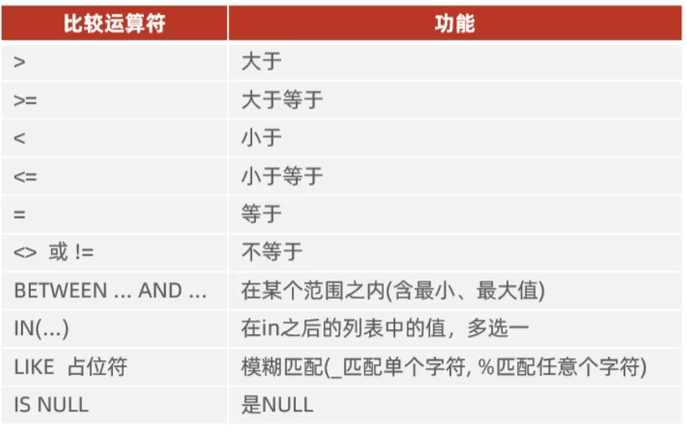
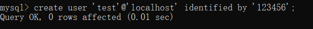
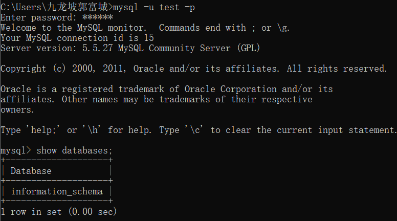

# MySQL

* 语法
  * SQL语句以分号结束，可以单行或多行书写
  * MySQL数据库SQL语句不区分大小写，关键字建议使用大写
  * 单行注释：`--`或`#`；多行注释：`/* 注释内容 */`
* SQL分类
  * DDL（Data Definition Language）：数据定义语言，定义数据库、表、字段
  * DML（Data Manipulation Language）：数据操作语言，对表中数据进行增删改操作
  * DQL（Data Query Language）：数据查询语言，查询表中数据
  * DCL（Data Control Language）：数据控制语言，创建数据库用户、控制数据库访问权限


## 数据库操作

> `[...]`中括号里面的命令代表的是可选参数，非强制要求

### 查询所有数据库

```mysql
show databases;
```


### 使用指定数据库

```mysql
use 数据库名;
```


### 创建数据库

```mysql
create database [if not exists] 数据库名;
```


### 删除数据库

```mysql
drop database [if exists] 数据库名
```


### 查询当前使用的数据库

```mysql
select database();
```


## 表操作

### 查询所有表

```MYSQL
show tables;
```


### 查询表结构

```mysql
desc 表名
```


### 查询当前表的创建语句

```mysql
show create table 表名
```


### 创建表

> **如果不指定符号位，默认创建时为有符号位**

| 数据类型 |  大小   | signed（有符号范围） | unsigned（无符号范围） |                             描述                             |
| :------: | :-----: | :------------------: | :--------------------: | :----------------------------------------------------------: |
| tinyint  | 1个字节 |       -128~127       |         0~255          |         类似于Java的Byte，<br />eg：tinyint unsigned         |
|   int    | 4个字节 |  -2^31^ ~ 2^31^ -1   |      0 ~ 2^32^ -1      |                     类似于Java的Integer                      |
|  bigint  | 8个字节 |  -2^63^ ~ 2^63^ -1   |      0 ~ 2^64^ -1      |                       类似于Java的Long                       |
|  float   | 4个字节 |         ....         |          ....          |                      类似于Java的Float                       |
|  double  | 8个字节 |         ....         |          ....          | 类似于Java的Double；<br />eg：score  double(4,1) 表示分数最共4位，<br />即小数点前3位数字，小数点后保留一位数字 |
| decimal  |         |  依赖于M精度和D标度  |   依赖于M精度和D标度   |                     类似于Java的Decimal                      |

| 数据类型 | 大小          | 描述                                                         |
| -------- | ------------- | ------------------------------------------------------------ |
| char     | 0-255 bytes   | **定长字符串，性能好；eg：char(10)如果字符串长度不足10位，则会以空格填充** |
| varchar  | 0-65535 bytes | 变长字符串，性能较差，会根据内容自动计算存储长度             |

| 数据类型  | 格式                     | 描述     |
| --------- | ------------------------ | -------- |
| date      | YYYY-MM-DD               | 日期值   |
| time      | HH:MM:SS                 | 时间值   |
| year      | YYYY                     | 年份值   |
| datetime  | YYYY-MM-DD HH:MM:SS      | 具体时间 |
| timestamp | 年月日时分秒构成的时间戳 | 时间戳   |

```mysql
create table 表名(
	字段1  类型 		  		[comment “注释信息”],
    字段2  类型 符号位 		  [comment “注释信息”],
	....
    字段n  类型(长度) 		   [comment “注释信息”]
) [comment “注释信息”];
```


### 删除表

```mysql
drop table [if exists] 表名;
```


### 清空表数据

```mysql
truncate table 表名
```


### 重命名表

```mysql
alter table 旧表名 rename to 新表名;
```


### 字段操作

#### 添加字段

```mysql
alter table 表名 add 字段名 类型(长度) [comment "注释信息"];
```


#### 修改字段

```mysql
-- 修改字段类型
alter table 表名 modify 字段名  新数据类型(长度);


-- 重命名字段名
alter table 表名 change 旧字段名 新字段名  类型(长度);
```


#### 删除字段

```mysql
alter table 表名 drop 字段名;
```


## CRUD

### 插入数据

> **字符串和日期型数据使用引号保存**

```mysql
-- 插入一条或多条数据(values里面的值顺序一一对应表中定义字段的顺序)
insert into 表名 values(值1,值2....), (值1,...);

-- 插入指定字段的一条或多条数据
insert into 表名(字段名1,字段名2,...) values(值1,值2....), (值1,...);
```


### 修改数据

```mysql
update 表名 set 字段1=值1,字段2=值2 [where 条件]
```


### 删除数据

```mysql
delete from 表名 [where 条件]
```


### 查询数据

* **查询模版的编写顺序**

```mysql
select 
	字段列表 
from 
	表名 
where 
	分组前的条件
group by 
	分组字段
having 
	分组后的过滤条件
order by 
	排序字段列表
limit 
	分页参数
```

* **SQL语句的执行顺序**

```tex
1. from 表名
2. where 分组前的条件
3. group by 分组字段 having 分组后的过滤条件
4. select 字段列表
5. order by 排序字段
6. limit 分页参数
```


#### 基本查询

```mysql
-- 查询全部记录
select * from 表名 [别名];

-- 查询指定字段记录
select 字段1 [as '别名'],.... from 表名;

-- 条件查询
select 字段列表 from 表名 where 条件;
```

 

 

**注意：`between 最小值 and 最大值`不能交换最小值和最大值的顺序，否则查询不到**


##### 去重处理

```mysql
-- 去除完全重复的行
select distinct 字段列表 from 表名;

-- 去除指定字段的重复
select 字段列表 from 表名 group by 指定字段
```

eg：

```tex
1.去掉完全重复的行 → 用 DISTINCT
    id  name
    1   张三
    1   张三
    2   李四
SELECT DISTINCT id, name FROM 表;


2.去掉指定字段的重复 → 用 GROUP BY 指定字段
    id  name
    1   张三
    1   张三丰
SELECT id, name FROM 表 GROUP BY id;
```


#### 分组查询

> * **执行顺序：where>聚合函数>having**
> * **where语句是分组之前进行过滤，不满足where条件，不参与分组；而having是分组之后对结果过滤**
> * **where不能对聚合函数判断；而having可以**
> * 分组之后，查询的字段一般为聚合函数、分组字段，查询其它字段无意义

```mysql
select 字段列表 from 表名 [where 分组前的条件] group by 分组字段名 [having  分组后的条件]
```


##### 聚合函数

> **将一列数据作为一个整体，进行纵向计算，其中某列的null值不参与聚合函数运算**

 


#### 排序

> **如果是多字段排序，当第一个字段值相同时，才会根据第二个字段进行排序，以此类推。**
>
> * **asc（默认值，可省略不写）：升序**
> * **desc：降序**

```mysql
select 字段列表 from 表名 order by 字段1 排序方式,字段2 排序方式....
```


#### 分页查询

> * **起始索引从0开始，`起始索引=(页码-1)*每页显示记录数`**
> * **如果查询第一页数据，起始索引可以省略，简写为`limit 每页显示记录数`**

```mysql
select 字段列表 from 表名 limit  起始索引,每页显示记录数;
```


## 用户、权限管理

### 用户管理

#### 查询mysql系统用户

```mysql
use mysql;
select * from user;
```


#### 创建用户

> **主机名中可以设置当前主机访问或任意主机访问该数据库，`新创建的用户没有任何操作权限`**
>
> * **localhost：当前主机下可以访问该数据库**
> * **%：任意主机下都可以访问该数据库**

```mysql
create user '用户名'@'主机名' identified by '密码';
```


eg：

 


 


#### 修改用户密码

```mysql
alter user '用户名'@'主机名' identified with mysql_native_password by '新密码';
```


#### 删除用户

```mysql
drop user '用户名'@'主机名';
```


### 权限管理

> **授权时，数据库名和表名可以使用`*`进行通配，代表所有**


#### 查询权限

```mysql
show grants for '用户名'@'主机名';
```


#### 授予权限


```mysql
grant 权限列表1,权限列表2,... on 指定数据库名.指定表名 to '用户名'@'主机名';
```


#### 撤销权限

```mysql
revoke 权限列表1,.... on 指定数据库名.指定表名 from '用户名'@'主机名';
```


[27. 基础-函数-字符串函数_哔哩哔哩_bilibili](https://www.bilibili.com/video/BV1Kr4y1i7ru?spm_id_from=333.788.player.switch&vd_source=6ce2a6eb6cbcb840f00c1778af71ce3c&p=27)
