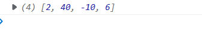

# ES6新特性

>  打开VSCODE，创建html，通过`shift+!`快捷键可快速生成html5代码


## VScode代码提示插件

* Vue 2 snippets
* VueHelper
* Vue 3 Snippets


## let 和var

```js
    <script>
        {
            var a=1; 	//var声明的为全局作用域
            let b=1;	//let声明的为局部作用域
        }
        console.log(a);
        console.log(b);//会出现跨域错误: Uncaught ReferenceError: b is not defined
    </script>
```


## const常量声明

```js
<script>
        const PI=3.14;
        PI=1; //对常量再次赋值会报错
</script>
```

 


##  解构表达式

> 对于之前获取数组的每个下标，需要通过arr[0]，arr[1]来获取，ES6提供了更简便的方法

```js
 <script>
        let arr=["eobard","thawne"];
		//ES6之前：let a=arr[0],let b=arr[1]
		
        let [a,b]=arr;//ES6特性
        console.log(a,b);
    </script>
```

 


```js
 <script>     
	const person = {
        name: "jack",
        age: 21,
        language: ["java", "js", "css"]
      };
      
	//之前的用法：
    //   const name = person.name;
    //   const age = person.age;
    //   const language = person.language;


//对象解构:
    //将person对象的name解构出来赋值给abc变量
    //将person对象的age解构出来赋值给age变量
    //将person对象的language解构出来赋值给language变量
       const { name: abc, age, language } = person;
       console.log(abc, age, language)

</script>
```

 


## 字符串(重点)

> 通过`${变量名或方法}`即可获取之前的值，前提是字符串是` `` `

```js
<script>   
    function fun() {
        return "这是一个函数";
    }

    let name="eobard"
    let age=20
    
    let info = `我是${name}，今年${age + 10}了, 我想说： ${fun()}`;
    console.log(info);

</script>
```

 

## lambda表达式

> **lambda表达式写的方法不能获取到this指代的值，可用`对象.属性`获取到**

```JS
<script>
    //声明一个方法
    var output=params=>console.log(params);
    //调用方法
    output("hello world")

    //声明一个方法
    var sum=(a,b)=>{
        return a+b
    };
    //调用方法
    console.log(sum(10,20));

</script>
```

 


### lambda+解构表达式(重点)

```js
<script>		
		//lambda表达式+解构
        //将传入的对象解构出name属性并输出
        var output = ({name}) => console.log("hello," +name);
        output(person);
</script>
```

 


## 对象优化

###  声明对象

```js
// 声明对象简写
const age = 23
const name = "张三"

//若对象的属性k和对应的v的变量名一样,则可以省略k:v形式,直接输入v
const person2 = { age, name }//声明对象简写
console.log(person2);
```

 

###  深拷贝：复制对象

```js
const target = { a: 1 };
const source1 = { b: 2 };
const source2 = { c: 3 };

//将source1和source2的对象信息复制给target对象
Object.assign(target, source1, source2);//{a:1,b:2,c:3}


//  拷贝对象（深拷贝）
let p1 = { name: "Amy", age: 15 }
let someone = { ...p1 }
console.log(someone)  	//{name: "Amy", age: 15}
```

 

 

### 对象的函数定义

```js
let person3 = {
    name: "jack",
    //lambda表达式函数中this不能使用，只能用对象.属性
    eat2: food => console.log(person3.name + "在吃" + food),

    //函数的简单定义（重点）
    eat3(food) {
        console.log(this.name + "在吃" + food);
    }
};
person3.eat2("b");
person3.eat3("c");
```

 


## map、reduce

```JS
let arr = ['1', '20', '-5', '3'];

//将arr的每个数据都*2
arr=arr.map(item=>item*2);//map中可传入lambda表达式
console.log(arr);
```

 


```js
    /**
    *   reduce形参
            1、previousValue （上一次调用回调返回的值，或者是提供的初始值（initialValue））
            2、currentValue （数组中当前被处理的元素）
            3、index （当前元素在数组中的索引）
            4、array （调用 reduce 的数组）
    */
   
   let res=arr.reduce((pre,curr)=>{
        console.log("上一次处理后："+pre);
        console.log("当前正在处理："+curr);
        return pre + curr;
   })

   console.log(res);
```

 


## promise异步编排

```js
 //Ajax中成功使用resolve(data)，交给then处理;失败使用reject(err)，交给catch处理p.then().catch()
        let p=new Promise((resolve,reject)=>{
            $.get({
                url:"data/user.json",
                success:function(data){
                    let {id,name}=data;
                    console.log("用户信息"+id+" "+name);
                    //将data传入then后续处理
                    resolve(data)
                },
                error:function(err){
                    reject(err)
                }
            })
        }).then((data)=>{
                $.get({
                    url:`data/addr${data.id}.json`,
                    success:function(data){
                        let {code,addr}=data;
                        console.log("地址信息"+code+" "+addr);
                    },
                    error:function(err){
                        console.log(err);
                    }
                })
        }).catch(()=>{
            console.log("ajax出现错误了");
        })
```

 

### 无限套娃(重点)

> **`在then()方法中可以继续new Promise来无线套娃.then()往下掉方法`**

```js
let p = new Promise((resolve, reject) => { 
            $.ajax({
                url: "mock/user.json",
                success: function (data) {
                    resolve(data);
                },
                error: function (err) {
                    reject(err);
                }
            });
        }).then((obj) => { 
            //继续new Promise往下无限套娃
            return new Promise((resolve, reject) => {
                $.ajax({
                    url: `mock/user_corse_${obj.id}.json`,
                    success: function (data) {
                        resolve(data);
                    },
                    error: function (err) {
                        reject(err)
                    }
                });
            })
        }).then((data) => { 
            $.ajax({
                url: `mock/corse_score_${data.id}.json`,
                success: function (data) {
                    console.log("查询课程得分成功:", data)
                },
                error: function (err) {
                }
            });
        }).catch((err)=>{	//出问题交给catch处理
            console.log(err)
        })
```


### 轻微封装ajax请求

```js
 function get(url, data) { 
            return new Promise((resolve, reject) => {
                $.ajax({
                    url: url,
                    data: data,
                    success: function (data) {
                        resolve(data);
                    },
                    error: function (err) {
                        reject(err)
                    }
                })
            });
        }


	get("mock/user.json")
            .then((data) => {
                console.log("用户查询成功~~~:", data)
                return get(`mock/user_corse_${data.id}.json`);
            })
            .then((data) => {
                console.log("课程查询成功~~~:", data)
                return get(`mock/corse_score_${data.id}.json`);
            })
            .then((data)=>{
                console.log("课程成绩查询成功~~~:", data)
            })
            .catch((err)=>{ //失败的话catch
                console.log("出现异常",err)
            });
```


## export、import模块化(重点)

> **在一个模块中export、import可以有多个（export 可以导出多个命名模块），export default仅有一个**
>
> * **输出多个值，使用export**
> * **输出单个值，使用export default**
> * **export default与普通的export最好不要同时使用**

<font color=red>类似于java的导包功能</font>

`user.js`

```js
var name = "eobard"
var age = 22
var add = (a, b) => a + b

//export不仅可以导出对象，一切JS变量都可以导出。比如：基本类型变量、函数、数组、对象。
export {name,age,add}
```


`fun.js`

```js
//导出utils的对象,里面包含一个方法
export const utils = {
    ouput(params) { 
        console.log("hello",params);
    }

}

//导出一个对象,导入的时候可以自定义名字
export default {
    printf(params) { 
        console.log("hello2",params);
    }
}
```


`main.js`

```js
//导入user.js的name,age和add方法
import {name,age,add} from './user.js'

//导入fun.js的utils对象
import utils from './fun.js'

//导入fun.js的对象并起名为print
import print from './fun.js'

console.log(name + " " + age);
console.log(add(1, 3));
console.log(utils.ouput("eobard"));
console.log(print.printf("thawne"));
```

> **`注意:如果导出的时候没有用default关键字，则导入的时候必须和导出的变量名对应;只有用了default关键字，则导入的时候可以自定义名字`**


# Vue2基础

## 环境搭建

### 简单方式

`1.导入vue.js`

> 可在 `Vue_images\vue依赖js`文件夹找到

```javascript
	<!-- 引入vue.js -->
<script src="js/vue.js" type="text/javascript" ></script>
```


`2.编写html代码`

```html
<!DOCTYPE html>
<html>
	<head>
		<meta charset="utf-8" />
		<title></title>
		<!-- 引入vue.js -->
		<script src="js/vue.js" type="text/javascript" ></script>
	</head>
	<body>
		
		<div id="app">
			<!--插值表达式输出-->
			{{message}} <br>	
		</div>
		
	</body>
</html>
<script type="text/javascript">
	//创建Vue对象
	new Vue({
		el:"#app",	//绑定元素(被Vue管理的区域元素),输出变量必须在该元素内部
		
		//data属性声明的变量为Vue全局变量
		data:{
			message:"hello world"	//全局属性1
		}
	})
</script>
```


`3.页面显示`

 

> **注意：在Vue对象里面调用全局变量属性时(如钩子函数、自定义函数)，都要用`this.全局属性名`来引用**


### npm方式

1. 在vscode 创建英文名文件夹
2. 通过终端初始化项目

> 使用cls可清除终端，alt+shift+F可整理代码

```npm
npm init -y
npm install vue@2
```


3. 创建index.html并引入vue

```html
<script src="./node_modules/vue/dist/vue.js"></script>
```


4. 测试

```html
   <div id="app">
         {{name}}
    </div>


    <script src="./node_modules/vue/dist/vue.js"></script>
    <script>
        let vm=new Vue({
            el:"#app",
            data:{
                name:"eobard thawne"
            }
        })
    
    </script>
```

 


## 输出表达式

### {{xx}} 插值表达式输出

> **插值表达式只能用于标签体里面，不能用于标签的属性值里面**

`1.页面代码`

```html
<!DOCTYPE html>
<html>
	<head>
		<meta charset="utf-8" />
		<!-- 引入vue.js -->
		<script src="js/vue.js" type="text/javascript" ></script>
	</head>
	<body>
		
		<div id="app">
			<!-- 插值表达式输出全局属性:
					如果是数字类型可以进行四则运算
					如果是字符类型可以进行追加操作
			-->
			{{message}} <br>
			{{age+10}}    <br>
			{{list}}  
			
		</div>
		
	</body>
</html>
<script type="text/javascript">
	//创建Vue对象
	new Vue({
		el:"#app",	//绑定元素(被Vue管理的区域元素),输出变量必须在该元素内部
		
		//data属性声明的变量为Vue全局变量
		data:{
			message:"hello world",		//全局属性1
			age:21,						//全局属性2
			list:["zs","ls","ww"]		//全局属性3	
		}
	})
</script>
```

> **注意：插值表达式不需要借助任何标签输出，类似于Themeleaf的`[[xxx]]`输出**


`2.页面显示`

 


### v-text输出纯文本

`1.页面代码`

```html
<!DOCTYPE html>
<html>
	<head>
		<meta charset="utf-8" />
		<!-- 引入vue.js -->
		<script src="js/vue.js" type="text/javascript" ></script>
	</head>
	<body>
		
		<div id="app">
			<!-- 
				通过命令输出全局属性（类似于thymeleaf模板,必须要有标签）
					v-html="变量名"
					v-text="变量名"
					区别：一个输出带标签样式的文本，一个输出整个文本
			 -->
			<span v-text="font"></span>
	
		</div>
		
	</body>
</html>
<script type="text/javascript">
	//创建Vue对象
	new Vue({
		el:"#app",	//绑定元素(被Vue管理的区域元素),输出变量必须在该元素内部
		
		//data属性声明的变量为Vue全局变量
		data:{
			font:"<font color='red'>Eobard Thawne</font>"	//全局属性
		}
		
	})
</script>
```


`2.页面显示`

 


### v-html输出标签

`1.页面代码`

```HTML
<!DOCTYPE html>
<html>
	<head>
		<meta charset="utf-8" />
		<!-- 引入vue.js -->
		<script src="js/vue.js" type="text/javascript" ></script>
	</head>
	<body>
		
		<div id="app">
			<!-- 
				通过命令输出全局属性（类似于thymeleaf模板,必须要有标签）
					v-html="变量名"
					v-text="变量名"
					区别：一个输出带标签样式的文本，一个输出整个文本
			 -->
			<span v-html="font"></span> <br>
	
		</div>
		
	</body>
</html>
<script type="text/javascript">
	//创建Vue对象
	new Vue({
		el:"#app",	//绑定元素(被Vue管理的区域元素),输出变量必须在该元素内部
		
		//data属性声明的变量为Vue全局变量
		data:{
			font:"<font color='red'>Eobard Thawne</font>"	//全局属性
		}
		
	})
</script>
```


`2.页面显示`

 


### v-show元素显示与隐藏

> **v-show只是改变了元素的display**

```vue
设置h1标题不显示
<h1 v-show="flag">qweqw</h1>


<script type="text/javascript">
	//创建Vue对象
	new Vue({
		el:"#app",	//绑定元素(被Vue管理的区域元素),输出变量必须在该元素内部
		
		//data属性声明的变量为Vue全局变量
		data:{
			flag:false
		}
		
	})
</script>
```


### v-bind 或 :属性名 绑定属性

#### 简单绑定属性值

`1.页面代码`

```html
	<body>
		<div id="app">
			<!-- 
				属性输出   
					:属性名="全局变量名"			(推荐使用)
					v-bind:属性名="全局变量名"
			 -->
			<span id="font"  :style="stylesheet">hello word</span>  <br>
			<span id="font2" v-bind:style="stylesheet">hello word</span>
		</div>
	</body>
</html>
<!-- 引入vue.js -->
<script src="js/vue.js" type="text/javascript"></script>
<script type="text/javascript">
	new Vue({
		el:"#app",
		data:{
			stylesheet:"color:blue;"
		}
	})
</script>
```


`2.页面显示`

 


#### 动态绑定属性值

`1.页面代码`

```html
 <div id="app">
      <!--
		对style动态赋属性值
		isActive为true时,class有active类;isDanger为true时,有text-danger类
	   -->
        <span :style="{'color':clr,'font-size':size}"  
              :class="{'active':isActive,'text-danger':isDanger}">21</span>
     
     <!--
		给span添加.span1和.span2的两个样式
	-->
     	<span :class="['span1','span2']">123</span>
    </div>

  <script src="./node_modules/vue/dist/vue.js"></script>
    <script>
        new Vue({
            el:"#app",
            data:{
                clr:'red',
                size:'21px',
                isActive:true,
                isDanger:true
            }
        })
    
    </script>
```


`2.页面显示`

 


##### 属性叠加（重要）

> **当元素默认有属性值的时候，可以通过绑定属性值进行属性值的追加**

`1.vue3的代码代码`

```vue
<template>

	 <!--
		span默认有border的样式,还可以动态属性赋值进行属性叠加
	   -->
  <span class="border"  :class="{'check':isCheck,'red':isRed}">这个是span</span>
</template>

<script setup>
import { ref } from "vue";
import HelloWorld from "./components/HelloWorld.vue";


    const isCheck=false
    const isRed=true

</script>


<style scoped>
.border{
  color: white;
}
</style>
```


`2.页面显示`

* 当isCheck=false， isRed=true时


* 当isCheck=true， isRed=false时


## 循环遍历

### 遍历数组

`1.页面代码`

```HTML
    <div id="app">			
                <!-- 循环遍历数组：
                        v-for="形参 in  数组"
						v-for="(形参,index) in 数组"  //可获取到当前索引下标
                 -->
            <ul>
                <li v-for="name in list">{{name}}</li>
            </ul>
    </div>

<script type="text/javascript">
	//创建Vue对象
	new Vue({
		el:"#app",	//绑定元素(被Vue管理的区域元素),输出变量必须在该元素内部
		
		//data属性声明的变量为Vue全局变量
		data:{
			list:["zs","ls","ww"]		//全局属性
		}
	})
</script>
```


`2.页面显示`

 


###  遍历对象数组集合

`1.页面代码`

```HTML
   <div id="app">			
                <!-- 循环遍历数组：
                        v-for="形参 in  数组"
                 -->
       
        <table border="1">
			<tr>
				<td>id</td>
				<td>name</td>
				<td>sex</td>
			</tr>
			<tr v-for="user in userList">
				<td>{{user.id}}</td>
				<td>{{user.name}}</td>
				<td>
					<span v-if="user.sex==0">男</span>
					<span v-else>女</span>
				</td>
			</tr>
		</table>
    </div>

<script type="text/javascript">
	//创建Vue对象
	new Vue({
		el:"#app",	//绑定元素(被Vue管理的区域元素),输出变量必须在该元素内部
		
		//data属性声明的变量为Vue全局变量
		data:{
			userList:[
				{id:1,name:"zs",sex:0},
				{id:2,name:"ww",sex:1},
				{id:3,name:"ls",sex:0}
			]						//全局属性
		}
	})
</script>
```


`2.页面结果`

 


### 提高Vue渲染效率(重点)

```html
<!--	在for遍历的时候可以加上:key=“唯一属性值”来提高Vue渲染效率
			如果是对象数组可以用对象的id
			如果是数组可以用索引下标
-->

 <div id="app">
        <ul>
            <!--如果是对象数组则: v-for="user in users" :key="user.id"     -->
            <li v-for="(num,index) in nums" :key="index">{{num}}</li>
        </ul>
    </div>
    <script src="../node_modules/vue/dist/vue.js"></script>
    <script>         
        let app = new Vue({
            el: "#app",
            data: {
                nums: [1,2,3,4,4]
            },
        })
    </script>
```


## 判断条件

### if、else

> **v-if是直接判断是否显示元素在页面中，与v-show不同，v-show改变的是display属性**

`1.页面代码`

```HTML
 <div id="app">	
 		<!-- 判断条件
				v-if="属性值条件"			成立则输出该标签内部
				v-else-if=“属性值条件”
				v-else 						若if条件不成立则输出该标签内部
		 -->
			<span v-if="age>20">年龄大于20</span>
			<span v-else>年龄小于20</span>	  
 </div> 

<script type="text/javascript">
	//创建Vue对象
	new Vue({
		el:"#app",	//绑定元素(被Vue管理的区域元素),输出变量必须在该元素内部
		
		//data属性声明的变量为Vue全局变量
		data:{
				age:21			//全局属性
		}
	})
</script>
```


`2.页面显示`

 


## v-model双向模型绑定

### 输入框

`1.页面代码`

```HTML
 <div id="app">	
 <!-- 获取输入框值  v-model="全局变量名",通过该命令进行绑定 -->
			<p>
				<input type="text" v-model="userName" /><br>
				同步获取输入的值：{{userName}}
			</p>
 </div> 
<script type="text/javascript">
	//创建Vue对象
	new Vue({
		el:"#app",	//绑定元素(被Vue管理的区域元素),输出变量必须在该元素内部
		
		//data属性声明的变量为Vue全局变量
		data:{
			userName:""			//全局属性：对应绑定v-model形参,表示输入框显示值默认为空
		}
	})
</script>
```

> 注意：`data`里面的`userName`声明为`""`，表示input输入框的值也为空，如果userName声明的值不为空，那么输入框的值默认也不会显示空


`2.页面显示`

 


### 多选框

`1.页面代码`

```html
 <div id="app">
            精通的语言：
     			<!--为同一组数据,所以v-model都为language-->
            <input type="checkbox" v-model="language" value="Java"> java<br/>
            <input type="checkbox" v-model="language" value="PHP"> PHP<br/>
            <input type="checkbox" v-model="language" value="Python"> Python<br/>
     	
     <!--language是一个数组，调用join方法可以转化为字符串-->
        选中了 {{language.join(',')}}

    </div>


    <script src="./node_modules/vue/dist/vue.js"></script>
    <script>
        let vm=new Vue({
            el:"#app",
            data:{
                language:[] 
            }
        })
    
    </script>
```

`2.页面显示`


## 事件处理

### v-on 或 @事件 绑定事件

`1.页面代码`

```HTML
 <div id="app">	
     
     	<input type="text" v-model="userName" /><br>
     
 		<!-- 函数调用(如果方法没有形参，括号可以省略不写)
					方式1：v-on:click="方法名()"
					方式2(推荐)：@click="方法名"			
			 -->
			<button v-on:click="getUserName()">获取输入值</button>
     
			<button  @click="getUserName">获取输入值(简写)</button>
 </div> 

<script type="text/javascript">
	//创建Vue对象
	new Vue({
		el:"#app",	//绑定元素(被Vue管理的区域元素),输出变量必须在该元素内部
		
		//data属性声明的变量为Vue全局变量
		data:{
			userName:""			//全局属性：对应绑定v-model形参
		},
		
		//定义方法
		methods:{
			
			//获取绑定的v-model的属性值
			getUserName(){
				alert(this.userName)
			}
		}
	})
</script>
```

> **注意：若需要设置其它onXXXX事件，则可以简写为@mouseover、@blur等等**


`2.页面显示`

 


` 3.注意：通过v-xxx指令可以直接操作data的属性的全局变量`

```html
	 <div id="app">
         {{name}}
			<button v-on:click="name='哈哈哈哈'">设置属性值</button>
    </div>
 <script>
        new Vue({
            el:"#app",
            data:{
                name:"eobard thawne"
            }
        })
    
    </script>
```

 


### 钩子函数

​				生命周期函数(钩子函数)：页面初始化立即加载

`1.页面代码`

```html
<!-- 引入vue.js -->
<script src="js/vue.js" type="text/javascript"></script>
<script type="text/javascript">
	new Vue({
		el:"#app",
		data:{
			stylesheet:"color:blue;"
		},
		//生命周期函数(钩子函数)：页面初始化立即加载
		created(){
			alert(1)
		}
	})
</script>
```


`2.页面显示`

 


> 注意：如果要在钩子函数调用自定义函数，需要加上`this`关键字

eg：初始化时调用其它函数

 


### computed计算属性

> **某些数据变化时需要去做一些逻辑操作，用于类似于购物车数量增加的总价问题**

`1.页面代码`

```html
 <div id="app">
        <ul>
            <li>西游记； 价格：{{xyjPrice}}，数量：<input type="number" v-model="xyjNum"> </li>
            <li>水浒传； 价格：{{shzPrice}}，数量：<input type="number" v-model="shzNum"> </li> 
            <li>总价：{{sum}}</li>
        </ul>
    </div>

    <script src="../node_modules/vue/dist/vue.js"></script>
    <script>         
        let app = new Vue({
            el: "#app",
            data: {
                xyjPrice: 100,
                shzPrice: 200,
                xyjNum: 1,
                shzNum: 1,
            },
            //某些结果是基于之前数据实时计算出来的，我们可以利用计算属性来完成 
            computed: {
                sum(){
                    return this.xyjPrice*this.xyjNum + this.shzPrice*this.shzNum 
                }
            },
        })
    </script>
```


`2.页面结果`

 

 


### watch监听器

> **用于类似于购物车商品数量不能小于1需求**

`1.页面代码`

```html
 <div id="app">
        <ul>
            <li>西游记； 价格：{{xyjPrice}}，数量：<input type="number" v-model="xyjNum"> </li>
            <li>水浒传； 价格：{{shzPrice}}，数量：<input type="number" v-model="shzNum"> </li> 
            <li>总价：{{sum}}</li>
            {{msg}}
        </ul>
    </div>


    <script src="../node_modules/vue/dist/vue.js"></script>
    <script>         
        let app = new Vue({
            el: "#app",
            data: {
                xyjPrice: 100,
                shzPrice: 200,
                xyjNum: 1,
                shzNum: 1,
                msg:""
            },
            //计算属性
            computed: {
                sum(){
                    return this.xyjPrice*this.xyjNum + this.shzPrice*this.shzNum 
                }
            },
            //监听器
            watch:{
                //监听xyjNum变量
                xyjNum(newNums,oldNums){
                    if(newNums<=1){
                        this.msg="西游记数量最少为1";
                        this.xyjNum=1;
                    }
                    else{
                        this.msg=""
                    }
                },
                //监听shzNum变量
                shzNum(newNums,oldNums){
                    if(newNums<=1){
                        this.msg="水浒传数量最少为1";
                        this.shzNum=1;
                    }
                    else{
                        this.msg=""
                    }
                }

            }
        })
    </script>
```


`2.页面结果`

 

 

 


### axios无刷新调用

#### get请求

> **axios.get( url路径 ).then( response => {    //回调函数，请求成功后具体代码实现     }   )**

`1.页面代码`

```javascript
<script src="js/vue.js" type="text/javascript" charset="utf-8"></script>
<script src="js/axios.js" type="text/javascript" charset="utf-8"></script>
<script type="text/javascript">
	
	new Vue({
		created(){
            //get请求
			axios.get("user.json").then(response =>{
				console.log(response.data)
			})
		}
	})
</script>
```

`2.页面结果`

 


## 使用Vue脚手架进行开发

###  环境准备

```bash
#全局安装webpack
npm install webpack -g
#全局安装vue脚手架
npm install -g @vue/cli-init
#找到自己node.js的位置,找到npm_global\node_modules\@vue\cli-init\node_modules\.bin路径,
#复制该路径的完整地址,在环境变量的Path中添加复制的地址 D:\node.js\npm_global\node_modules\@vue\cli-init\node_modules\.bin
#在cmd输出命令
vue -V
#在对应位置的文件夹下使用cmd：vue脚手架使用webpack模板初始化一个项目
vue init webpack 项目名
```


### 信息填写


### 运行项目

1. 进入对应的文件夹
2. 运行项目

```bash
npm run dev
```

3. 运行效果

 

 


### 自定义路由组件

1. 编写.vue文件

```html
<!--
    自定义组件三部曲:
            1.编写template模板文件信息
            2.编写script文件
            3.编写模板文件样式
-->
<template>
    <h1>{{name}},这是我自定义组件，{{age}}</h1>    
</template>

<script>
//固定写法
export default {
    //data是方法
    data() {
        //返回一个自定义对象
        return {
            name:"eobard",
            age:20
        }
    },
}
</script>

<style>
    h1{
        color: red
    }
</style>
```


2. 导入组件

> 在src中的router/index.js中导入自定义组件，并编写自定义路由信息

```js
import Vue from 'vue'
import Router from 'vue-router'
import HelloWorld from '@/components/HelloWorld'
//导入components文件夹下的custom.vue文件,并取名为custom
import custom from '@/components/custom'

Vue.use(Router)

export default new Router({
  routes: [
    {
      path: '/',
      name: 'HelloWorld',
      component: HelloWorld
    },
    //添加一个新的路由信息
    {
      //路径为/eobard
      path: "/eobard",
      //名称为custom
      name: "custom",
      //组件是导入的自定义组件custom
      component:custom
    }
  ]
})
```


3. 运行项目测试

  


4. 注意

```html
<!--可以跳转到具体的路由页面--> 
<router-link to="/eobard">去eobard</router-link>
```


### 自定义组件（重点）

1. 编写抽取组件的公共部分.vue

   ```VUE
   <template>
       <h1>{{name}},这是我自定义组件，{{age}}</h1>    
   </template>
   
   <script>
   //固定写法
   export default {
       //data是方法
       data() {
           //返回一个自定义对象
           return {
               name:"eobard",
               age:20
           }
       },
   }
   </script>
   
   <style>
       h1{
           color: red
       }
   </style>
   ```

   

2. 引入公共组件、注册、使用

   ```VUE
   <template>
   			<!--使用自定义组件-->
              <my></my>
   </template>
   
   <script>
   //引入对应文件夹的组件:@/表示根路径
   import category from '../common/my'
   export default {
       //注册组件
      components:{my},
      data(){
          return {
   
          }
      } 
   }
   </script>
   ```

   


## 整合ElementUI

### 环境准备

```bash
npm i element-ui
```

```js
//在main.js中导入

//导入ElementUI
import ElementUI from 'element-ui';
//导入ElementUI css文件
import 'element-ui/lib/theme-chalk/index.css';
//使用ElementUI
Vue.use(ElementUI);
```


###  使用

```html
<template>
  <div>
    <h1>{{name}},这是我自定义组件，{{age}}</h1>
    <el-button>默认按钮</el-button>
    <el-radio v-model="radio" label="1">备选项</el-radio>
    <el-radio v-model="radio" label="2">备选项</el-radio>
  </div>
</template>

<script>
//固定写法
export default {
  //data是方法
  data() {
    //返回一个自定义对象
    return {
      name: "eobard",
      age: 20,
      radio:"1"
    };
  }
};
</script>
```

 


## 常用知识

### 导入其它项目

1. 首先将别人的项目复制到对应的工作区
2. 删除里面的node_modules文件夹
3. 在终端中输入命令npm install 重新安装即可
4. 安装完成后直接运行


###  动态获取后端请求地址

> **在前端项目中，通常需要请求后端网关地址跳转不同的微服务中，而有些页面需要拿到请求后端的地址，我们如果在页面中写死url，网关地址一变，就需要把写死的url跟着变，所以可以在对应页面中，动态获取前端请求后端的url**


>  **使用`process.env.VUE_APP_BASE_API`即可动态获取请求路径**


### Vue项目打包

1. 首先需要更改生产环境中的后端请求路径


2. 执行打包

> **dist就是打包后的文件，后期可以直接将该文件夹放入nginx的html文件夹中，启动nginx就可以访问**

```bash
 npm run build:prod
```


# VUE3

## 在线vue项目编写

https://vite.new/vue


## 使用vite+vue3创建项目

> **首先全局安装pnpm**

```bash
npm i pnpm -g
```


> **用vite构建vue3**

```bash
pnpm create vite
```


### 项目文件介绍

 

* **node_modules：第三方依赖的一个文件夹**
* **public：公共资源**
* **src：工程开发目录**
* **src\assets：静态资源**
* **src\components：公共小组件**
* **app.vue：顶级根组件**
* **main.js：全局入口文件**
* **style.css：全局CSS**
* **package.json：包描述文件**
* **pnpm-lock.yaml：版本锁,等后面安装这个项目的时候会锁住对应的版本**
* **vite.config.js：Vite项目的配置文件，运行vite项目会自动解析项目根目录下 vite.config.js 的文件**


#### 端口号、文件映射路径配置

> **修改vite.config.js配置**

```js
import { defineConfig } from 'vite'
import vue from '@vitejs/plugin-vue'
// 解构path模块的resolve方法
import {resolve} from "path"


export default defineConfig({
  plugins: [vue()],
  resolve:{
    //项目使用@符号就映射为src的绝对路径下
    alias:{
      "@":resolve(__dirname,"src"),
    }
  },
  //服务器相关配置
  server:{
    //端口号默认是5167
    port:5000
  }
})
```


#### 快捷键

在vscode中直接使用v3p即可创建基本的结构

 


## Options API、CompositionAPI

### 选项式API

> 选项式 API 是 Vue 2 中的默认方式，将组件的数据、计算属性、方法、生命周期钩子等功能按照选项的形式进行组织，例如 `data`、`methods`、`computed`、`watch` 等。每个选项都有其特定的职责，把组件的逻辑分散在不同的选项中。

```vue
<template>
  <div>
    <p>{{ message }}</p>
    <button @click="updateMessage">Update Message</button>
  </div>
</template>

<script>
    //vue2的写法
export default {
    
    //数据区域
  data() {
    return {
      message: 'Hello, Vue!'
    };
  },
    //方法区域
  methods: {
    updateMessage() {
      this.message = 'Hello, World!';
    }
  },
    //计算属性区域
  computed: {
    reversedMessage() {
      return this.message.split('').reverse().join('');
    }
  },
    //数据监听区域
  watch: {
    message(newVal, oldVal) {
      console.log(`Message changed from "${oldVal}" to "${newVal}"`);
    }
  },
    //声明周期区域
  mounted() {
    console.log('Component mounted');
  }
};
</script>
```

==问题：如果每个区域的代码都有几百行的情况，请debug它 或者 改动某个需求，就需要分别修改：`data`、`methods`、`computed`，不便于维护和复用==


### 组合式API

> 组合式API是 Vue.js 3.x 中引入的新特性，旨在解决选项式API在复杂组件中难以维护的问题。组合式API允许将组件的逻辑按照功能相关性进行组织，而不是按照选项分散组织（`将相关代码写在一起，不同于选项式API那种拆开的方式`）
>
> ==`setup 代替了之前版本中的 data、computed、methods 等选项，用于设置组件的初始状态和逻辑`==


#### vue 3.0的写法

```vue
<template>
  <h1>user页面</h1>
  <p>Count: {{ count }}</p>
  {{ getMsg() }}
</template>

<script>
import {ref} from 'vue';

export default {
    //setup函数里面写组合式API代码
  setup() {
    const count = ref(123213);
    function getMsg(){
        return "这是vue 3.0的写法："+count.value
    }

    //暴露出去的方法和变量能被当前模板使用
    return {
      count,
      getMsg
    }
  },
};
</script>
```


##### 注意

> **需要被模板使用的数据和方法，需要return出去，如果不return出去却在模板上使用了，会在控制台报错**


#### vue 3.2的写法(重点)

> **在vue3.2中直接使用语法糖`<script setup>`即可，自动会被模板解包，不需要手动return**

```vue
<template>
  <div>
    <p>{{ message }}</p>
    <button @click="updateMessage">Update Message</button>
  </div>
</template>

<script setup>
    // vue 3.2+的写法
 
    import { ref, watch, computed, onMounted } from 'vue';

    const message = ref('Hello, Vue!');

    const updateMessage = () => {
      message.value = 'Hello, World!';
    };

    const reversedMessage = computed(() => {
      return message.value.split('').reverse().join('');
    });

    watch(message, (newVal, oldVal) => {
      console.log(`Message changed from "${oldVal}" to "${newVal}"`);
    });

    onMounted(() => {
      console.log('Component mounted');
    });
</script>
```

**<font color="red">注意：`<script setup>`表示里面的属性或方法都是在setup生命周期中</font>**


### 不使用setup语法糖模版（重点）

```vue
<script>
export default {
    name: "",						//自定义名称
    components: {},     //如果有组件导入,需要手动注册子组件
    props: {            //接收父组件过来的值
        属性值: {
            type: String,
            default: ""
        }
    },
    setup(props, { emit, slots, attrs, expose }) {
        // console.log(props);  //属性传递,接收父组件的属性值并在setup里面使用
        // console.log(emit);   //用来触发自定义事件,子传父事件
        // console.log(slots);  //对组件插槽的访问
        // console.log(attrs);  //父组件给子组件传递class和style,但这些属性并没有在props中显式定义,它们将被包含在attrs中,使用v-bind="attrs"即可
        // console.log(expose); //显式地将子组件的方法或属性暴露给父组件

      
       //暴露本组件的值或方法给其它组件
        expose({
           值或方法...
        })

        //在setup()中定义的数据和方法，都需要使用return 返回才能被调用
        return {
         		值或方法...
        };
    }
}
</script>
```

> **1.setup的形参：setup(props,context)或解包写法setup(props, { emit, slots, attrs, expose })，第一种方式使用`context.属性值`即可访问其它变量**
>
> **2. return和expose需要注意：如果本组件使用到属性或值是需要return出去；如果只提供给父组件使用而自己不用只用expose；如果父子组件都使用到了,则需要return+expose**


### setup语法糖的define方法

* **defineProps：用于接收父组件传来的 props属性，等同于不使用语法糖的props属性**
* **defineEmits：用于子组件触发事件并告知父组件，等同于不使用语法糖的context.emit属性**
* **defineExpose：用于子组件暴露内部属性/方法给父组件访问，等同于不使用语法糖的context.expose属性**

​	

#### defineProps

```vue
<!--父组件-->
<template>
  <div style="border: 0.1px solid black;">
    <span>props的使用:</span>
    <button @click="msg='parent to son11'">convey</button>
    <Props :msg="msg" />
  </div>
</template>
<script setup>
  import { ref} from 'vue';
  import Props from './components/props.vue';
  
  // props
  const msg = ref('');
</script>

<!--子组件-->
<template></template>
<script setup>
import { watch } from 'vue';
	// 使用defineProps方式接收父传子数据
  const props = defineProps({
    msg: {
      type: String,
      default:null
    },
  });

  watch(()=>props.msg, (newValue, oldValue) => {
    console.log(newValue+"<="+oldValue);
  })
</script>
```


#### defineEmits

```VUE
<!--父组件-->
<template>
  <div style="border: 0.1px solid black;">
   	<span>emits的使用:</span>
    <Emitss @returnAdd="handleAdd" @returnSub="handleAdd" />
    <hr />
  </div>
</template>
<script setup>
  import { ref} from 'vue';
  import Emitss from './components/emits.vue';
  // emits
  const handleAdd = (msg) => {
    console.log(msg)
  }
</script>

<!--子组件-->
<template>
    <button @click="add">returnAdd</button>
    <button @click="sub">returnSub</button>
</template>
<script setup>
import { ref ,defineEmits} from 'vue';
//  使用defineEmits方式创建名称
const $emits = defineEmits(["returnAdd","returnSub"])

const add = () => {
    // 指定returnAdd返回指定数据
   $emits("returnAdd", "use add")
}
const sub = () => {
   $emits("returnSub", "use sub")
}
</script>
```


#### defineExpose

```vue
<!--父组件-->
<template>
  <div style="border: 0.1px solid black;">
    <span>expose的使用:</span>
    <button @click="handleExpose">expose</button>
    <Exposes ref="exp" />
  </div>
</template>
<script setup>
  import { ref} from 'vue';
  import Exposes from './components/expose.vue';
  
  // expose
  const exp = ref(null)
  const handleExpose = () => {
    // 这里也需要等到子组件的dom挂载完成后才能访问,可以放到onMounted中
    // 需要获取子组件的响应式对象,然后才能调用对应的子组件数据
    console.log(exp.value);
    console.log(exp.value.sonData);
    exp.value.sonMethod();
  }
</script>

<!--子组件-->
<template></template>
<script setup>
  import { ref } from 'vue';
  const sonData = ref("son data")
  const sonMethod = () => {
      console.log("this is a son method");
  }
  //将组件中的属性暴露出去，这样父组件可以获取
  defineExpose({
      sonData, sonMethod
  })
</script>
```


## 路由基本配置

> **安装路由依赖**

```bash
pnpm install vue-router
```


### 视图创建

1. 在src下创建views文件夹并创建对应页面文件


### 路由入口文件配置

2. 在src下创建router文件夹并创建路由入口文件index.js

```javascript
// createWebHashHistory:地址上有#号,eg: localhost:5000/#/api/user/list
import { createRouter, createWebHashHistory } from "vue-router"


//静态引入自定义布局文件
import Layout from "@/layout/Layout.vue"

// 配置和导出路由项：配置路由和路由组件一一对应关系
export const routes = [
    { path: "/", redirect: "/user" },//当默认打开页面访问localhost:5000/#/的时候,重定向跳转到/user路径显示对应的组件
    {
        path: "/user",      //配置路由的地址
        component: Layout,  //配置路由对应显示的组件
        children: [         //children里面渲染二级路由
            {
                path: "",      //将当前的路径添加到上面的path后,变成/user
                component: () => import("@/views/user/index.vue")   //路由懒加载,只有输入路由地址才会加载
            }
        ]
    },
    {
        path: "/product",
        component: Layout,
        children: [
            {
                path: "",      //将当前的路径添加到上面的path后,变成/product
                component: () => import("@/views/product/index.vue")
            }
        ]
    },
]

// 创建路由实例
const router = createRouter({
    routes, //路由配置项
    history: createWebHashHistory(), //hash模式
})


// 导出路由实例
export default router
```


### Layout布局文件

3. 在src中创建layout文件夹并创建全局布局文件Layout.vue

```vue
<template>
    <h1>自定义全局布局页面</h1>


        <!-- 根据路由信息,创建对应的路由超链接，
                :to="item.path"必填,为对应跳转的路由地址 
                routes.filter(v=>v.path !=='/')筛选出路由路径不为 / 的
         -->
        <router-link v-for="item in routes.filter(v=>v.path !=='/')" :to="item.path" :key="item.path" style="display:block">{{item.path}}</router-link>


    <!-- 
        将 其它页面引入当前Layout布局页面渲染,当访问对应页面的时候,将其引入Layout布局页面渲染
    -->
      <router-view></router-view>
</template>

<script setup >
import { ref } from 'vue'
//引入路由项
import {routes} from "../router"

    console.log(routes)
</script>
```


### 根组件渲染Layout布局

4. 在顶级根组件App.vue中渲染布局页面

```vue
<template>

    <!-- 
        渲染匹配的视图。当一个路径被访问时，Vue Router 会找到与该路径对应的组件，并将其渲染到 <router-view> 组件中
        这里使用是为了将Layout布局页面引入进来渲染,当什么都不访问的时候,默认显示布局页面的内容
        套娃：当访问的时候将其他页面渲染到布局页面-> 顶级根组件默认显示布局页面
    -->
  <router-view></router-view>
</template>

<script setup>
import { ref } from "vue";
import HelloWorld from "./components/HelloWorld.vue";

</script>


<style scoped>
.border{
  color: white;
}
</style>
```


### 路由引入

5. 在全局入口文件main.js中导入路由

```javascript
//全局入口文件

//导入createApp函数用于创建app实例
import { createApp } from 'vue'
import './style.css'

// 导入顶级根组件
import App from './App.vue'

// 创建实例
const app = createApp(App)

//导入自定义的路由并使用
import router from "./router"
app.use(router)

// 挂载实例在index.html中id为app元素上
app.mount('#app')
```


> **默认显示用户页面**


## 响应式数据

### ref基本类型

> **1. ref创建基本数据类型，ref创建的数据改变时会同步渲染视图，但简单数据不会（简单数据只能通过双向绑定v-model才可同步渲染视图）；2. 在模板中会自动解包ref的value属性，而不需要在模板中手动调用value属性；3. ref也可以创建引用类型的数据，它会自动解包成reactive类型**

```vue
<template>
  <h1>{{ num}}</h1>
  <br>
  <button @click="add">add</button>
  <hr>
  <h1>{{numRef}}</h1>
<button @click="numRef++">RefAdd</button>
</template>

<script setup>
    import { ref } from "vue";

     //创建基本数据类型
    let num = 0;
    function add() {
      num++;
      console.log(num);
    }

    //创建响应式数据类型
	const numRef = ref(0);
</script>
```

 


#### ref获取dom

> **ref获取dom元素一定要等到页面挂载后才能拿到**

```vue
<template>

	<!--为div元素创建了一个引用，并将其存储在名为divRef的变量中-->
  <div ref="divRef">123</div>
</template>

<script setup>

import { ref,onMounted } from "vue";

//获取dom的元素,这里的变量名要和元素的ref中声明的变量一致
const divRef=ref(null)

//setup在dom挂载前就被执行了,所以拿不到dom元素
console.log("setup执行：",divRef.value);

//当dom元素挂在完成后可以拿到dom元素
onMounted(()=>{
  console.log("页面挂载后：",divRef.value);
  
})
</script>
```

 


#### ref使用父调子组件方法

```vue
<template>
  <Child ref="childElement"/>
</template>

<script setup>
import Child from "./info/index.vue";
import { ref, onMounted } from "vue";

// 为子组件创建引用
const childElement = ref(null);

onMounted(() => {
  // 调用子组件暴露出来的方法
  console.log(childElement.value.getList());
});
</script>
```

```vue
<template>
  <span>child</span>
</template>
<script setup>
import { ref,defineExpose } from "vue";
const getList=()=>{
  return [1, 2, 3, 4];
};

// defineExpose 暴露getList方法,不然父组件不能调用
defineExpose({
  getList
});
</script>
```

 


### reactive引用类型

> **1. reactive创建引用类型的响应式数据，如对象、数组等，访问时直接使用对象.属性即可；2. 与vue2不同，当直接修改、删除reactive对象属性的时候模板也会更新；3. 当创建基本数据类型时控制台会有警告**

```vue
<template>
  <h1>{{person}}</h1>
  <h1>{{arr}}</h1>

    <button @click="person.id=2">修改属性</button>
    <button  @click="person.age=24">添加属性</button>
    <button  @click="delete person.p1">删除属性</button> 

    <button @click="arr.push(6)">添加元素</button>   
</template>

<script setup>
import { reactive } from "vue";

//创建对象的响应式数据
const person = reactive({
  id: 1,
  name: "eobard",
  p1:{
        p2:"thawne"
  }
});

//创建数组的响应式数据
const arr = reactive([1, 2, 3, 4, 5]);

//通过reactive创建基本数据
const num=reactive(1)
</script>
```


### reactive转为ref

> **转换为ref响应式的数据和原数据具备响应式链条（当reactive改变，ref也会改变；ref改变，reactive也改变）**

* toRef(T，props)：将对象的某个属性解构出来转为ref类型
* toRefs(T)：将对象的所有属性解构出来转为ref类型

```vue
<template>
  <span>{{person}}</span>
  <hr>
  <span>{{name}}</span>
  <br>
  <button @click="person.name=999;person.id=2">修改reactive的值</button>
  <button @click="name='thawne'">修改name的值</button>
</template>

<script setup>

import { ref, onMounted, watch, reactive, toRef,toRefs } from "vue";

const person = reactive({
  id: 1,
  name: "eobard"
});

// 将person响应式对象的name解构出来，转换为ref响应式, 
const name = toRef(person, "name");

const {id}=toRefs(person)
console.log(id.value+" "+name.value);


</script>
```


 

 

 


### reactive转为原始对象

```vue
<template>
</template>
<script setup>
import {reactive,toRaw} from "vue";
const person=reactive({
  id:1,
  age:24,
  c1:{
    c2:"cq"
  }
})

const p=toRaw(person)
console.log(p);

</script>
```

 


## 计算属性computed

> **当数据未发生变化时，计算属性会具备缓存功能，即后面再次访问相同的数据还是第一次经过计算属性得到的结果**

```vue
<template>
  <h1>num:{{num}}</h1>
  <button @click="num++">num自增</button>

  <h1>newNum:{{newNum}}</h1>
  <h1>newNum:{{newNum}}</h1>

  <h2>{{doubleNum()}}</h2>
  <h2>{{doubleNum()}}</h2>
</template>

<script setup lang="ts">
import { ref, computed } from "vue";

const num = ref(1);
// 计算属性：并且newNum也是响应式的数据,只读不能修改
const newNum = computed(() => {
  console.log("执行计算属性");
  return num.value * 2;
});

    //普通方法
function doubleNum() {
  console.log("执行普通方法");
  return num.value * 2;
}
</script>
```

 

 


## watch监听器

> **watch监听到数据变化，立马执行回调函数里面的逻辑；watch监听的如果是响应式对象，内部会自动解包.value；即监听的数据要么是ref类型、要么是reactive类型、要么是 ()=>返回的类型（即非响应式对象(eg:props)则需要提供getter(eg:()=>... )）**


### 监听单个值

```vue
<template>
  <h1>{{num}}</h1>
  <h1>{{person}}</h1>

  <button @click="num++">num++</button>
  <br>
  <button @click="person.id++">id++</button>
</template>

<script setup>
import { watch, reactive, ref } from "vue";
const num = ref(10);
const person = reactive({
  id: 1,
  name: "eobard"
});

//监听单个值
watch(num, (newVal, oldVal) => {
  console.log("监听num:",newVal, oldVal);
});

//这里如果直接监听person.id会报错,因为person.id是简单数据类型,要通过()=>这种形式监听
watch(person, (newVal, oldVal) => {
  console.log("监听person：",newVal, oldVal);
});

//使用箭头函数监听reactive里面的属性
watch(
  () => person.id,
  (newVal, oldVal) => {
    console.log("监听person.id",newVal, oldVal);
  }
);

</script>
```


### 监听多个值

```vue
<template>
  <h1>{{num}}</h1>
  <h1>{{person}}</h1>

  <button @click="num++">num++</button>
  <br>
  <button @click="person.id++">id++</button>
</template>


<script setup>
import { watch, reactive, ref } from "vue";
const num = ref(10);
const person = reactive({
  id: 1,
  name: "eobard"
});

//观察多个数据变化
watch([num, () => person.id], (newVal, oldVal) => {
  console.log("监听多个数据：",newVal, oldVal);
});

</script>
```


### 立即执行监听

> **当立即执行监听的时候，num在生命周期开始时是undefined，但是当执行到const num = ref(10)时就发生了改变，所以执行了监听回调函数逻辑**

```vue
<template>
  <h1>{{num}}</h1>
  <h1>{{person}}</h1>

  <button @click="num++">num++</button>
  <br>
  <button @click="person.id++">id++</button>
</template>


<script setup>
import { watch, reactive, ref } from "vue";
const num = ref(10);
const person = reactive({
  id: 1,
  name: "eobard"
});

//初始化就执行一次回调函数的逻辑
watch(
  num,
  (newVal, oldVal) => {
    console.log("initializing");
    console.log(newVal, oldVal);
  },
  {
    immediate: true     //初始化就执行一次回调函数,如果没有这行则不会执行console的功能
  }
);
</script>
```


### watchEffect副作用监听器

> **副作用监听器在初始化的时候就会执行回调函数里面的代码，如果回调函数里面有响应式数据发生变化，同样会再次执行监听，`与watch中的immediate立即执行一致`**

```vue
<template>
    <h1>{{num}}</h1>
</template>

<script setup>
import { ref,watchEffect } from "vue";

const num =ref(0)

watchEffect(()=>{
    console.log(num.value)
})
</script>
```


## 生命周期

### **选项式API的写法（了解）**

```vue
<template>
</template>

<script>
export default {
    beforeCreate () {
        console.log("beforeCrate");
    },
    setup() {
        console.log("setup")
    },
    mounted () {
        console.log("mounted")
    },
    beforeMount () {
        console.log("beforeMount")
    },
    beforeUpdate() {
        console.log("beforeUpdate")
    },
    updated() {
         console.log("updated")
    },   
}
</script>
```


### **组合式API的写法（重点）**

> **组合式API的生命周期在选项式API前加了on，即onXxx（）命名**

```vue
<template>
    <h1 ref="h1">life,{{num}}</h1>

    <button @click="num++">更新</button>
</template>

<script setup>
import {ref,onMounted,onBeforeUpdate,onUpdated} from 'vue'

const num=ref(10)

// 获取dom元素
const h1=ref(null)

// 默认setup周期，初始化相关信息，如使用ajax请求等
console.log("默认为setup生命周期,开始获取dom:",h1.value);


//挂载完之后可以操作dom元素
onMounted(() => {
    console.log("挂载后,操作dom元素：",h1.value);
})

//获取更新前dom的信息
onBeforeUpdate(() => {
    console.log("更新前：",h1.value.textContent);
})

//获取更新后dom的信息
onUpdated(() => {
    console.log("更新后：",h1.value.textContent);
})

</script>
```

 


## 组件传值

> **vue3默认引入defineEmits和defineProps，所以不用在页面import**

* 父传子的数据是单向绑定的，而且是同步的，父组件的值更改，子组件的值也会同时更改
* 子组件不能更改父组件传来的值，因为它是只读的。只能通过子传父，自定义事件会自动触发，在这个事件里更改父组件的值
* ts代码中，数据回传时需要注意数据类型，父子组件的数据类型不一致会报错


### 父传子

#### 示例1：全使用语法糖

**父组件**

```vue
<template>
  <HelloWorld :message="msg" />
</template>

<script setup>
    import { ref } from "vue";
    // 导入子组件
    import HelloWorld from "./components/HelloWorld.vue";

    // 使用ref引用,修改里面的值并传递给子组件
    const msg = ref("msg");
    msg.value = "这是父传子的值哦";

</script>
```


**子组件**

> **这里defineProps定义的值一定要和父组件中`:`后面的值一致**

```vue
<template>
  <h1>{{ message }}</h1>

</template>

<script setup >
import { ref } from 'vue'

    //父传子通过defineProps接收传入的message参数,这里的message需要和父组件中:message一致
    const props=defineProps({
      message: String,
    })

    console.log(props.message)
</script>
```


#### 示例2：子组件不使用语法糖

```vue
<!--父组件:使用setup语法糖简略-->
<template>
    <span>不使用语法糖:</span>
    <button @click="data = 'other version'">传统写法</button>
    <Tra  :data="data"  />
</template>
<script setup>
  import Tra from "./components/traditional_vue3/parent.vue";
  const data = ref("")
</script>

<!--子组件:传统写法,不使用语法糖-->
<template>
    <span>
        {{ msg }}
    </span>
</template>
<script>
import { ref, watch } from "vue";
export default {
    name: "parent",
    props: {            //接收父组件过来的值
        data: {
            type: String,
            default: ""
        }
    },
    setup(props) {
        //props
        const msg = ref()
        watch(() => props.data, (newValue, oldValue) => {
            console.log(newValue + "<=" + oldValue)
            msg.value = newValue
        })
        //返回本页面需要的值或方法
        return {
            msg,
        };
    }
}
</script>
```


#### 局部组件传值

以下是vue2的写法


 


 


 


### 子传父

#### 示例1：全使用语法糖

**子组件**

```vue
<template>

  <div class="card">
    <button type="button" @click="btn">count is {{ count }}</button>
  </div>

</template>

<script setup >
import { ref } from 'vue'

//声明点击次数默认为0
const count = ref(0)

// 定义子传父的事件defineEmits([自定义名称])
const emit = defineEmits(['son2Father'])


//按钮点击事件
const btn=()=>{
  count.value++
  // 通过emit形式回传父，son2Father为自定义事件名称，count.value为回传的值
   emit('son2Father', count.value ) 
}


</script>
```


**父组件**

```vue

<template>

  	<!-- 通过@子组件中的事件名来接收子组件传过来的数据,
			getCount为自定义处理函数,
			方法的形参是传回来的值
	-->
	<HelloWorld @son2Father="getCount"/>

  	<h1 v-if="count!=0">子传父一共点击了：{{count}}</h1>
</template>

<script setup>
import { ref } from "vue";
import HelloWorld from "./components/HelloWorld.vue";


const count=ref(0);

//const 任意方法名=(value)=>{} 自带value形参表示传回来的值
const getCount=(value)=>{
  count.value=value
}

</script>
```


#### 示例2：子组件不使用语法糖

```vue
<!--父组件:使用setup语法糖简略-->
<template>
    <span>不使用语法糖:</span>
    <button @click="data = 'other version'">传统写法</button>
    <Tra  :data="data"  @returnDefault="defaultVue3Setup" />
</template>
<script setup>
  import Tra from "./components/traditional_vue3/parent.vue";
  const data = ref("")
  
  const defaultVue3Setup = (str) => {
  	console.log(str);
	}
</script>


<!--子组件:传统写法,不使用语法糖-->
<template>
    <span>
        {{ msg }}
    </span>
		<button @click="returnDefault">returnDefault</button>
</template>
<script>
import { ref, watch } from "vue";
export default {
    name: "parent",
    props: {            //接收父组件过来的值
        data: {
            type: String,
            default: ""
        }
    },
    setup(props,{ emit, slots, attrs, expose }) {
        //props
        const msg = ref()
        watch(() => props.data, (newValue, oldValue) => {
            console.log(newValue + "<=" + oldValue)
            msg.value = newValue
        })
      
        // emit
        const returnDefault = () => {
            emit("returnDefault", "default vue3 setup return")
        }
        
        //返回本页面需要的值或方法
        return {
            msg,
            returnDefault,
        };
    }
}
</script>
```


### expose和attrs

```vue
<!--父组件:使用setup语法糖简略-->
<template>
    <span>不使用语法糖:</span>
    <button @click="data = 'other version'">传统写法</button>
    <Tra ref="tra" style="color: red;" :data="data"  @returnDefault="defaultVue3Setup" />
</template>
<script setup>
  import { ref,onMounted } from 'vue';
  import Tra from "./components/traditional_vue3/parent.vue";
  
  const data = ref("")
  
  const defaultVue3Setup = (str) => {
  	console.log(str);
	}
  
  //获取子组件ref
  const tra = ref(null)
  //调用暴露的子方法和值
  onMounted(() => {
    tra.value.privateCall(tra.value.privateData)
  })
</script>


<!--子组件:传统写法,不使用语法糖-->
<template>
		<!--绑定父传子的样式-->
    <span v-bind="attrs">
        {{ msg }}
    </span>
		<button @click="returnDefault">returnDefault</button>
</template>
<script>
import { ref, watch } from "vue";
export default {
    name: "parent",
    props: {            //接收父组件过来的值
        data: {
            type: String,
            default: ""
        }
    },
    setup(props,{ emit, slots, attrs, expose }) {
        //props
        const msg = ref()
        watch(() => props.data, (newValue, oldValue) => {
            console.log(newValue + "<=" + oldValue)
            msg.value = newValue
        })
      
        // emit
        const returnDefault = () => {
            emit("returnDefault", "default vue3 setup return")
        }
        
        //expose
        const privateData = ref("1111")
        const privateCall = (res) => {
            console.log("this is vue3 default setup", res);
        }
        expose({
            privateData,
            privateCall
        })
        
        //返回本页面需要的值或方法
        return {
            msg,
            returnDefault,
          	attrs  
        };
    }
}
</script>
```


### v-model父子组件双向绑定


#### modelValue和update:modelValue（了解）

**父组件**

```vue
<template>
  <h3>父组件</h3>
    <p>{{msg}}</p>

    <!-- 
        父传子必须叫modelValue,子传父接收的方法必须叫update:modelValue
                组件的$event表示接收子组件传递的数据,这里表示将传过来的值赋值给msg
         -->
  <child :modelValue="msg" @update:modelValue="msg=$event" />
</template>

<script setup>
import child from "./child.vue";
import { ref } from "vue";

const msg = ref("eobard");
</script>
```


**子组件**

```vue
<template>
  <h3>子组件</h3>
  <p>{{modelValue}}</p>

  <button @click="changeMsg">子组件button</button>
</template>
<script setup>
// 子组件只能使用modelValue接收
defineProps({
  modelValue: String
});

// 子传父的方法必须叫update:modelValue
const emit=defineEmits(["update:modelValue"])

function changeMsg(){
    emit("update:modelValue","thwane")
}
</script>
```

 

> **上面这种方式不够灵活，命名固定不可修改**


#### 自定义v-model 属性名

**父组件**

```vue
<template>
  <h3>父组件</h3>
    <p>{{msg}}</p>

	<!-- 通过 v-model:自定义名  实现双向绑定 -->
  <child v-model:my="msg" />
</template>

<script setup>
import child from "./child.vue";
import { ref } from "vue";
const msg = ref("eobard");
</script>
```


**子组件**

```vue
<template>
  <h3>子组件</h3>
  <p>{{my}}</p>

  <button @click="changeMsg">子组件button</button>
</template>
<script setup>
// 子组件用父组件的 自定义名 接收
defineProps({
  my: String
});

// 子传父的方法叫update:自定义名
const emit=defineEmits(["update:my"])

function changeMsg(){
    emit("update:my","eobard thawne")
}
</script>
```


### TODO:

目前看到了：[23-实现选项卡_哔哩哔哩_bilibili](https://www.bilibili.com/video/BV1bh4y1b7hq?spm_id_from=333.788.videopod.sections&vd_source=6ce2a6eb6cbcb840f00c1778af71ce3c)
