# Docker容器化技术

## 一. Docker概念

Docker 包括三个基本概念:

- **镜像（Image）**：Docker 镜像（Image），就相当于是一个 root 文件系统。**是一个只读模板，含创建Docker容器的说明**，它与操作系统的安装光盘有点像。比如官方镜像 ubuntu:16.04 就包含了完整的一套 Ubuntu16.04 最小系统的 root 文件系统。
- **容器（Container）**：**容器是完全使用沙箱机制，相互之间不会有任何接口**。镜像（Image）和容器（Container）的关系，就像是面向对象程序设计中的类和实例一样，镜像是静态的定义，容器是镜像运行时的实体。容器可以被创建、启动、停止、删除、暂停等。
- **仓库（Repository）**：仓库可看成一个代码控制中心，用来保存镜像。

* **宿主机**：在linux系统中承载其它软件的主机，也是当前的虚拟机；docker寄生在宿主机上的容器
* **挂载**：指的就是将设备文件中的顶级目录连接到 Linux 根目录下的某一目录（最好是空目录），访问此目录就等同于访问设备文件。


## 二. Docker安装

### 2.1 安装

```nginx
#先将enforcing改为disabled 
vi /etc/sysconfig/selinux  
reboot

#1.将yum包更新,需要等待一段时间
yum update

#2.安装所需的安装包
yum install -y yum-utils device-mapper-persistent-data lvm2

#3.设置yum源
yum-config-manager --add-repo https://download.docker.com/linux/centos/docker-ce.repo

#4.卸载 podman,依据CentOS版本来是否执行该语句
yum erase podman buildah

#5.安装docker，出现的界面都按y
yum install -y docker-ce

#6.查看docker版本,出现以下内容表示安装成功 Docker version 20.10.12, build e91ed57
docker -v
```

> CentOS8.x版本默认使用podman，需要卸载；如果是CentOS7.x版本则可以忽略


### 2.2 配置容器镜像加速器

​			国内从 DockerHub 拉取镜像有时会遇到困难，此时可以配置镜像加速器。Docker 官方和国内很多云服务商都提供了国内加速器服务

* 科大镜像：**https://docker.mirrors.ustc.edu.cn/**
* 网易：**https://hub-mirror.c.163.com/**
* 阿里云：**https://<你的ID>.mirror.aliyuncs.com**
* 七牛云加速器：**https://reg-mirror.qiniu.com**

>  阿里云镜像获取地址：https://cr.console.aliyun.com/cn-hangzhou/instances/mirrors，登陆后，左侧菜单选中镜像加速器就可以看到你的专属地址了（每个人的地址都不一样）


1. 打开网站，查看专属地址

   ```bash
   sudo mkdir -p /etc/docker
   sudo tee /etc/docker/daemon.json <<-'EOF'
   {
     "registry-mirrors": ["https://n70u9c3d.mirror.aliyuncs.com"]
   }
   EOF
   sudo systemctl daemon-reload
   sudo systemctl restart docker
   ```

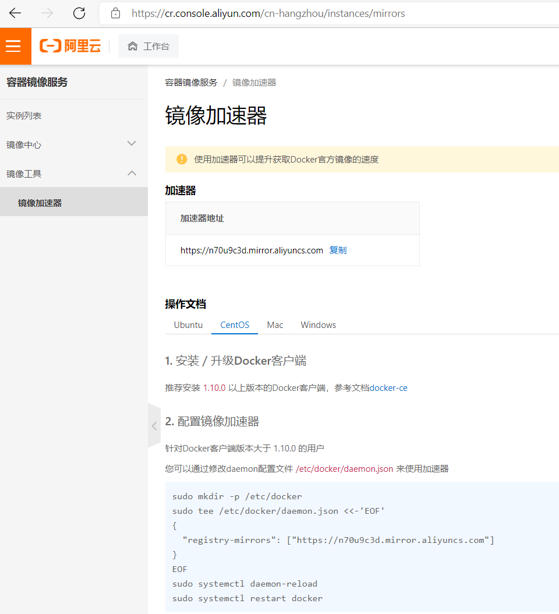


2. 选择操作文档中的CentOS，复制里面的代码到Linux终端中执行并回车

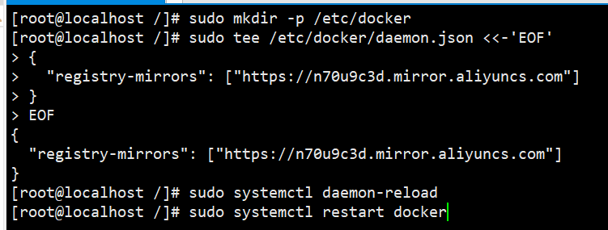


3. 再次查看是否存在地址

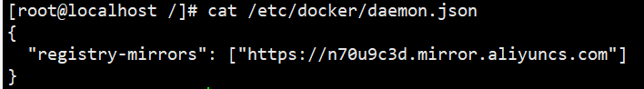


## 三.Docker命令

### 3.1 进程相关命令

#### 3.1.1 启动Docker

```nginx
systemctl start docker
```


#### 3.1.2 停止Docker

```nginx
systemctl stop docker
```


#### 3.1.3 重启Docker

```nginx
systemctl restart docker
```


#### 3.1.4 查看Docker服务状态

```nginx
systemctl status docker
```


#### 3.1.5 开机启动Docker服务

```nginx
systemctl enable docker
```


### 3.2 镜像相关命令

#### 3.2.1 查看镜像信息

```nginx
docker images
docker images -q #查看所用镜像id
```


#### 3.2.2 搜索镜像

```nginx
docker search 镜像名称
```


#### 3.2.3 拉取镜像

​			从Docker仓库下载镜像到本地，可以在[Docker Hub Container Image Library | App Containerization](https://hub.docker.com/)搜索对应镜像（类似于maven仓库），可以通过`名称:版本号`指定下载版本

```nginx
docker pull 镜像名称
docker pull redis		#没有指定版本，下载最新版本
docker pull redis:5.0  	#指定下载版本
```


#### 3.2.4 删除镜像

```nginx
docker rmi  镜像id/镜像名					  #通过镜像id或镜像名删除指定本地镜像
docker rmi `docker images -q` 			      #删除所有本地镜像
```


### 3.3 容器相关命令

#### 3.3.1 查看容器

```nginx
docker ps  			#查看正在运行的容器
docker ps -a		#查看所有容器信息
```


#### 3.3.2 创建并运行容器

```nginx
docker run -it/id --name=自定义容器名 REPOSITORY(镜像名):TAG(版本名)
#可以通过docker images查看
```

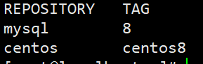 

* -it：`交互式容器`；保持容器运行，容器创建后自动加入容器中，退出容器后，容器自动关闭
* -id：`守护式容器`；**后台模式运行容器**，创建一个容器后，**需要通过命令进入容器；退出容器后，容器不会关闭**
* **/bin/bash**：放在镜像名后的是命令，这里我们希望有个交互式 Shell，因此用的是 /bin/bash。


`eg：以centos8系统为例`

```nginx
#创建交互式容器
docker run -it --name=c1 centos:centos8 

#创建守护式容器
docker run -id --name=c2 centos:centos8
docker exec -it c2 /bin/bash  #进入linux系统默认的目录
```


#### 3.3.3 进入容器

```nginx
docker exec -it  自定义容器名 /bin/bash  #退出容器，容器不会关闭
```


#### 3.3.4 停止容器

```nginx
docker stop 自定义容器名
```


#### 3.3.5 启动容器

```nginx
docker start 自定义容器名
```


#### 3.3.6 开机自启动容器

```bash
docker update --restart=always 容器名称或容器id
```

**参数说明：**

* no ：容器退出时，不重启容器；
* on-failure ： 只有在非0状态退出时才从新启动容器；
* always ：无论退出状态是如何，都重启容器；


#### 3.3.6 删除容器

```nginx
docker rm 自定义容器名
```

> **如果容器是运行状态则删除失败，需要停止容器才可以删除**


#### 3.3.7 查看容器信息

```nginx
docker inspect 自定义容器名
```

> 该命令可以查看容器挂载数据卷配置

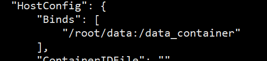 


#### 3.3.8 容器运行日志

```nginx
docker logs 容器名称/id
```


### 3.4 容器中安装vim

```bash
#1.首先进入对应的容器
docker exec -it 容器名 /bin/bash

#更新镜像
apt-get update

#2.安装vim
apt-get install -y vim
```


## 四. Docker数据卷

​			当我们在使用docker容器的时候，会产生一系列的数据文件，这些数据文件在我们关闭docker容器时是会消失的，但是其中产生的部分内容我们是希望能够把它给保存起来另作用途的，Docker将应用与运行环境打包成容器发布，我们希望在运行过程中产生的部分数据是可以持久化的，而且容器之间我们希望能够实现数据共享。


### 4.1 Docker数据卷特点

>  **数据卷是一个可供容器使用的特殊目录，它将主机操作系统目录直接映射进容器，类似于Linux中的mount操作**

* 数据卷可以在容器间共享或重用数据

* 容器数据持久化

* 外部机器和容器间接通信

* 数据卷中的更改可以直接生效

* 数据卷的更改不会包含在镜像的更新中

  


### 4.2 配置数据卷并挂载

```nginx
docker run -it -v /宿主机绝对路径目录:/容器内目录 --name=自定义容器名 镜像名称 
```

> 注意：宿主机目录和容器内目录都必须是绝对路径！`数据卷目录是配置的宿主机目录！`


`eg：以centos8系统为例`

1. ```nginx
   #配置数据卷
   docker run -it -v /root/data:/data_container centos:centos8 /bin/bash  
   ```

   

2. 开启新的一个会话，查看目录

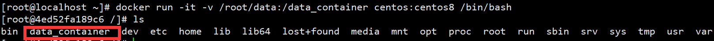

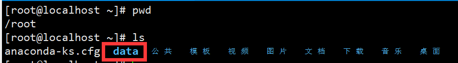


3. 验证数据是否同步

   * 在linux系统创建

   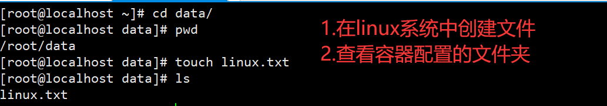

   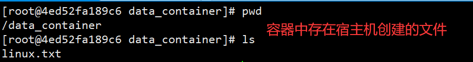

   * 在容器中创建

   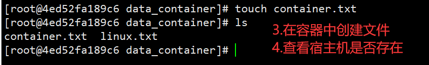

   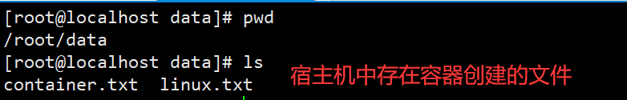

   

> 注意：容器停止后，宿主机修改数据，容器内还是会更新


### 4.3 配置数据卷容器

​				如果用户需要在多个容器之间共享一些持续更新的数据，最简单的方式是使用数据卷容器。数据卷容器也是一个容器，但是它的目的是专门用来提供数据卷供其他容器挂载

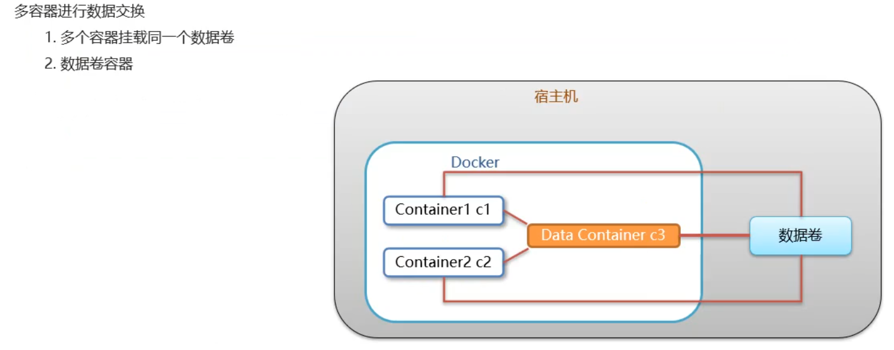

```nginx
docker run -it --name=自定义数据卷容器名 -v /容器内绝对路径目录  镜像名称
```


`eg：以centos8为例`

1. 容器内彼此关联

```nginx
#1.创建并启动data_container数据卷容器
docker run -it --name=data_container -v /volumn centos:centos8 /bin/bash

#2.创建c1、c2两个容器，并设置数据卷
docker run -it --name=c1 --volumes-from data_container centos:centos8 /bin/bash
docker run -it --name=c2 --volumes-from data_container centos:centos8 /bin/bash
```

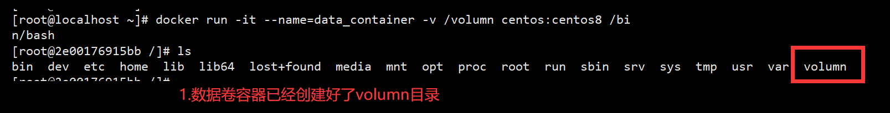

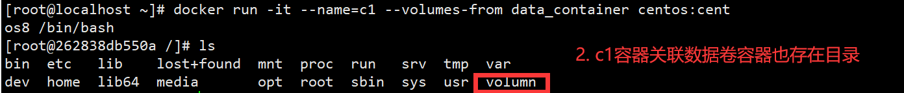

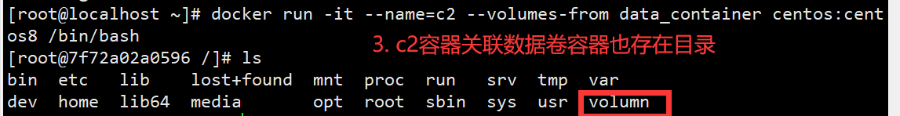


2. 将宿主机数据卷目录挂载到数据卷容器目录

```nginx
docker run -it -v /data2:/volumn --name=c0 centos:centos8 /bin/bash
```


## 五.Docker应用部署

### 5.1 安装Mysql

（1.）拉取mysql镜像

```nginx
docker pull mysql:5.6
```


（2.）在root目录下创建文件夹，用于存储mysql数据信息

> 后期部署服务，基本都在`/usr`文件夹中存放，这里为了方便起见，就在root目录下

```nginx
mkdir ~/mysql
cd ~/mysql
```


（3.）创建容器、设置端口映射、目录映射

```nginx
docker run -id \
-p 3306:3306 \
--name=docker_mysql \
-v $PWD/conf:/etc/mysql/conf.d \
-v $PWD/logs:/logs \
-v $PWD/data:/var/lib/mysql \
-e MYSQL_ROOT_PASSWORD=123456 \
mysql:5.6
```

**参数说明：**

* `-p 3307:3306`：将容器的3306端口映射到宿主机的3307端口上，**防止宿主机的端口冲突！**
* `-v $PWD/conf:/etc/mysql/conf.d`：将宿主机当前conf目录挂载到容器的etc/mysql目录
* `-v $PWD/logs:/logs`：将宿主机当前logs目录挂载到容器的logs目录
* `-v $PWD/data:/var/lib/mysql`：将宿主机当前data目录挂载到容器的mysql目录
* `-e MYSQL_ROOT_PASSWORD=123456`：初始化root密码


（4.）进入容器，操作mysql

```nginx
docker exec -it docker_mysql /bin/bash
```


（5.）开放端口，GUI访问

```nginx
#防火墙未开启,需要先开防火墙再对外开放端口
#systemctl status firewalld  
#systemctl start firewalld  
firewall-cmd --add-port=3306/tcp --permanent
firewall-cmd --reload
```

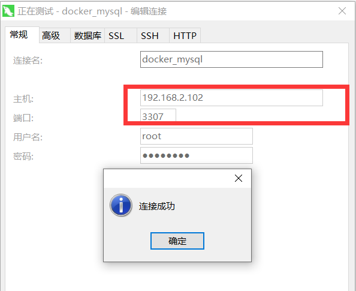 


#### 5.1.1 安装Mysql 8.0

```sh
docker pull mysql:8.0.29

docker run -p 3308:3306 --name mysql_8 -e MYSQL_ROOT_PASSWORD=123456 -d mysql:8.0.29

docker exec -it mysql_8 /bin/bash 

mysql -uroot -p

use mysql; 

#将root用户密码加密方式改为mysql_native_password
alter user 'root'@'%' identified with mysql_native_password by '123456';

flush privileges;


#将用户root密码设置为永不过期
alter user 'root'@'%' identified by '123456' password expire never;

#将root用户设置为所有地址可登录，原来是localhost表示只用本机可登录
update user set host='%' where user='root';

flush privileges;
```


### 5.2 安装Tomcat

（1.）拉取Tomcat镜像

```bash
docker pull tomcat
```


（2.）在root目录下创建文件夹，用于存储Tomcat数据信息

```bash
mkdir ~/tomcat
cd ~/tomcat
```


（3.）创建容器、设置端口映射、目录映射

```bash
#启动tomcat时,最好重启下docker,防止出现问题
systemctl restart docker

docker run -id --name=docker_tomcat \
-p 8888:8080 \
-v $PWD:/usr/local/tomcat/webapps \ 
tomcat


docker run -id --name=docker_tomcat2 \
-p 8080:8080 \
-v $PWD:/usr/local/tomcat/webapps \ 
```


（4.）开放端口，windows访问

```bash
firewall-cmd --add-port=8888/tcp --permanent
firewall-cmd --reload
```

> 因为tomcat中没有任何网页，访问会出现404页面，我们可以在宿主机自己创建页面来访问

```nginx
mkdir ~/tomcat/test
cd test
vi index.html
```

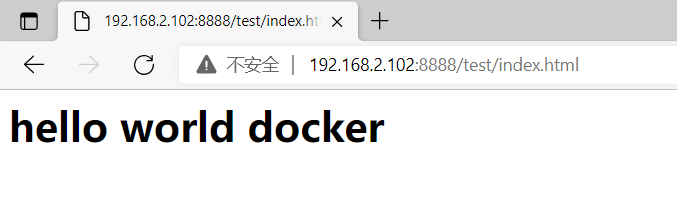 


### 5.3 安装Nginx

（1.）拉取Nginx镜像

```bash
docker pull nginx
```


（2.）在root目录下创建文件夹，用于存储Nginx数据信息

```bash
mkdir ~/nginx
cd ~/nginx
mkdir conf
cd conf

#创建nginx.conf配置文件,粘贴下面代码
vim nginx.conf
```

```
user nginx;
worker_processes  1;

error_log /var/log/nginx/error.log warn;
pid		  /var/run/nginx.pid;


  events {
      worker_connections  1024;
  }
 
 
  http {
     include       /etc/nginx/mime.types;
     default_type  application/octet-stream;
  


   sendfile        on;
   keepalive_timeout  65;

	include /etc/nginx/conf.d/*.conf;

}
```


（3.）创建容器、设置端口映射、目录映射

```BASH
#在nginx目录执行命令
cd /root/nginx

docker run -id --name=docker_nginx \
-p 80:80 \
-v $PWD/conf/nginx.conf:/etc/nginx/nginx.conf \
-v $PWD/logs:/var/log/nginx \
-v $PWD/html:/usr/share/nginx/html \
nginx
```


（4.）创建自定义页面供windows访问

```BASH
cd /html
vi index.html

#随意编辑一些内容保存后在windows访问
<h1>hello nginx-docker</h1>
```

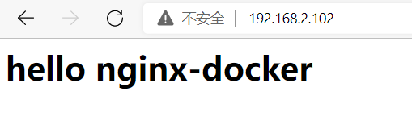 

### 5.4 安装Redis

（1.）拉取Redis 5.0版本镜像

```bash
cd ~
docker pull redis:5.0
```


（2.）创建容器、设置端口映射

```bash
docker run -id --name=docker_redis -p 6379:6379 redis:5.0
```


（3.）开放端口，通过Windows Redis GUI访问

```bash
#防火墙未开启,需要先开防火墙再对外开放端口
#systemctl status firewalld  
#systemctl start firewalld  

firewall-cmd --add-port=6379/tcp --permanent
firewall-cmd --reload
```

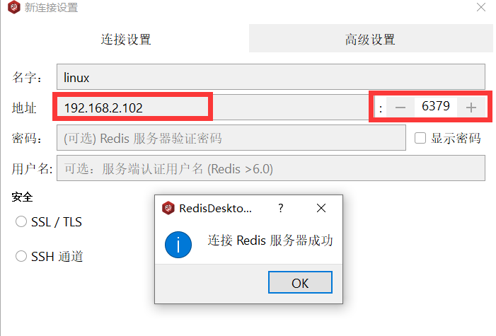 

> 若不存在GUI，可以通过命令行去访问

* 找到windows中安装redis的位置

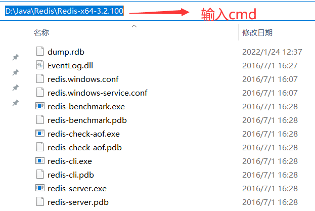


* 输入以下命令

```cmd
redis-cli.exe -h 192.168.2.102  -p 6379
```

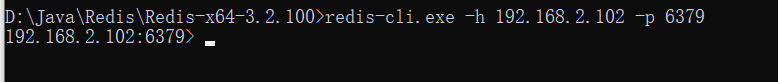


#### 5.4.1 设置Redis访问密码

* 进入redis的容器 docker exec -it 容器ID bash
* 进入redis目录 /usr/local/bin 
* 运行命令：redis-cli
* 查看现有的redis密码：config get requirepass
* 设置redis密码config set requirepass  123456


### 5.5 安装nacos

```bash
# 第一步：拉取镜像
docker pull nacos/nacos-server

# 第二步：启动
docker run --env MODE=standalone --name docker_nacos --restart=always -d -p 8848:8848 -e JVM_XMS=128m -e JVM_XMX=128m nacos/nacos-server
```


## 六. Docker镜像

### 6.1 Docker镜像制作

​			将容器转为镜像，使用以下命令

```bash
#将容器转换为镜像
docker commit 容器id  自定义的镜像名称:版本号

#压缩镜像文件,压缩好的文件放在当前宿主机目录下
docker save -o 压缩文件名称 自定义的镜像名称:版本号

#将压缩文件解压变成镜像
docker load -i 压缩文件名称

#再次查看生成好的镜像,后期可以启动该镜像
docker images
```


## 七. Dockerfile

### 7.1 Dockerfile概述

​		Dockerfile是用来**`构建镜像的文本文件`**，文本内容**`包含了一条条构建镜像所需的指令和说明`**。相当于是一个脚本，可以在这个脚本文件里使用一些特定的命令(关键字)完成一些自动化任务。**Dockerfile由四部分构成：基础镜像信息、维护者信息、镜像操作指令、容器启动时指令。**

```BASH
#指定父镜像,若没有版本号,则可省略版本号
FROM 镜像名称:版本号

#定义维护者信息
MAINTAINER 自定义作者名 <xxxx@email.com>

#一些镜像操作指令
RUN 指令

#容器启动执行的指令
CMD /bin/bash

#构建镜像,若没有版本号,则可省略版本号
docker build -f Dockerfile名称 -t 镜像名称:版本号 .
```

**参数讲解：**

- **`FROM`**： 指定父镜像，由那个image构建

- **`MAINTAINER`**： 作者信息，标明当前dockerfile谁写的

- **`RUN`**：构建镜像执行的命令

- **`CMD`**： 容器启动时的命令
- **`EXPOSE`**：暴露端口

- VOLUME：定义外部可以挂载的数据卷，如果没有定义则使用默认

- USER：指定后续执行的用户组和用户

- WORKDIR：指定容器内部的工作目录；如果没有则自动创建，如果指定为/就使用绝对地址否则使用相对地址

- ENV：环境变量属性值，容器内部也会起作用

- ADD：添加文件，将主机的文件复制到镜像中；如果是压缩文件也解压

- COPY：复制文件

- ENTRYPOINT：容器进入时执行的命令


`eg:创建Centos8镜像,进入容器后默认访问/usr目录,并且新建一个index.html的文件`

```bash
mkdir docker_files
cd docker_files
vim centos_dockerfile

#输入以下内容并保存
FROM centos:centos8
MAINTAINER Eobard_Thawne <2209473452@qq.com>
RUN touch index.html
WORKDIR /usr
CMD /bin/bash

docker build -f ./centos_dockerfile -t centos:centos8 .
```

> 注意：`./centos_dockerfile` 表示通过相对目录指定名称；最后的`.`不能省略；`-f`指定Dockerfile名称；`-t`指定镜像名称


### 7.2 部署SpringBoot项目

（1.）将SpringBoot项目打包成jar包，上传到docker_files文件夹

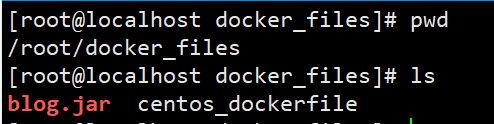 


（2.）创建并编写Dockerfile文件

```bash
vim springboot_dockerfile

FROM java:8
MAINTAINER Eobard_Thawne <2209473452@qq.com>
#将宿主机的blog.jar复制到镜像中并重命名为docker_blog.jar
ADD blog.jar docker_blog.jar
#容器启动就执行命令
CMD java -jar docker_blog.jar
```


（3.）构建镜像

```bash
#指定镜像名称为my_docker_blog 
docker build -f docker_blog.jar -t my_docker_blog .
```


（4.）运行容器

```bash
docker run -it -p 9090:8080 my_docker_blog
```

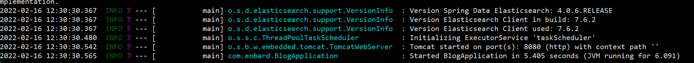


## 八. 服务编排

​			微服务架构的应用系统中一般包含若干个微服务，每个微服务一般都会部署多个实例，如果每个微服务都要手动启停，维护的工作量会很大。**`服务编排：按照一定的业务规则批量管理容器`**


### 8.1 安装Docker Compose

​			**Docker Compose是一个编排多 容器分布式部署的工具，提供命令集管理容器化应用的完整开发周期，包括服务构建，启动和停止。**

```bash
#进入根目录
cd ~

#二进制包方式安装(任意一个地址下载即可)

	#地址1：github可能会下载不了
curl -L https://github.com/docker/compose/releases/download/1.22.0/docker-compose-`uname -s`-`uname -m` -o /usr/local/bin/docker-compose
	#地址2：国内
curl -L https://get.daocloud.io/docker/compose/releases/download/1.22.0/docker-compose-`uname -s`-`uname -m` -o /usr/local/bin/docker-compose

#设置文件可执行权限
chmod +x /usr/local/bin/docker-compose

#查看版本信息
docker-compose -version

#卸载docker-compose
# rm /usr/local/bin/docker-compose

```

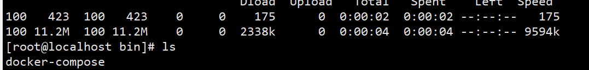

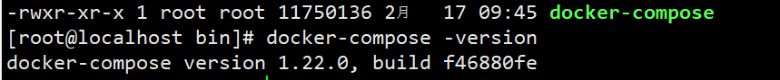


### 8.2 部署SpringBoot+Nginx

​		在`7.2节`的基础上，使用Docker Compose部署SringBoot、Nginx

（1.）创建docker compose目录

```bash
mkdir ~/docker-compose
cd ~/docker-compose
touch docker-compose.yml
```

（2.）编写docker-compose.yml文件

```yaml
version: '3'
services:
  nginx:
   image: nginx
   ports:
    - 80:80
   links:
    - myblog
   volumes:
    - ./nginx/conf.d:/etc/nginx/conf.d
  myblog: 
   image: myblog
   ports: 
    - 9090:8080
```

（3.）创建目录

```bash
mkdir -p ./nginx/conf.d
```

（4.）编写nginx.conf文件

```bash
cd nginx/conf.d
vim nginx.conf
#编写以下内容
server {
	listen 80;
	access_log off;
	
	location / {
		proxy_pass http://myblog:8080;
	}

}
```

（5.）使用docker-compose启动容器之前**`需要将之前的nginx容器关闭`**

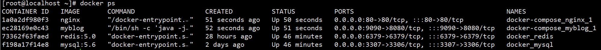

```bash
#需要在 ~/docker-compose目录下
cd  ~/docker-compose
docker-compose up

#-d表示后台启动
#docker-compose up -d
```

（6.）windows访问


## 九.Docker私有仓库

​				Docker官方的Docker hub (https://hub.docker.com) 是一个用于管理公共镜像的仓库，我们可以从上面拉取镜像到本地，也可以把我们自己的镜像推送上去。但是，有时候我们的服务器无法访问互联网，或者你不希望将自己的镜像放到公网当中，那么我们就需要搭建自己的私有仓库来存储和管理自己的镜像。

### 9.1搭建私有仓库

```bash
#1.拉取私有仓库镜像
docker pull registry

#2.启动私有仓库
docker run -id --name=registry -p 5000:5000 registry

#3.打开浏览器输入以下地址,看到{“repositories”}表示私有仓库搭建成功
http://linux的ip地址:5000/v2/_catalog

#4.修改daemon文件
vim /etc/docker/daemon.json
```

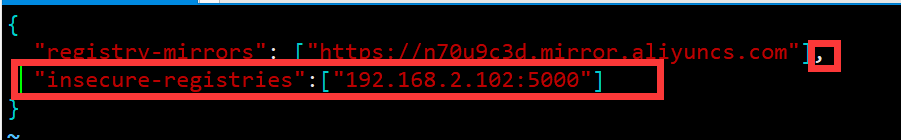

```bash
#5.重启docker服务
systemctl restart docker
docker start registry
```


### 9.2 上传镜像到私有仓库

```bash
docker tag 镜像名称:版本名称 linux本机ip地址:5000/自定义镜像名称:版本名称
docker push  linux本机ip地址:5000/自定义镜像名称:版本名称
```


### 9.3 从私有仓库拉取镜像

```bash
docker pull  linux本机ip地址:5000/自定义镜像名称:版本名称
```

