# Minio文件存储

## Minio安装

1. 创建文件夹和data目录

```bash
#这里以/usr/local/software这个位置为例
cd /usr/local/software
mkdir minio
cd minio/
```

 


2. linux命令行安装

```bash
wget https://dl.min.io/server/minio/release/linux-amd64/minio
```

> 注意：如果linux下载速度慢，可以在windows中使用科学上网工具下载，然后用xftp上传到linux系统中


3. 给minio二进制文件赋权限，否则无法执行

````bash
#如果是科学上网下载的minio,将文件上传到minio中去
chmod +x minio
mkdir data
````

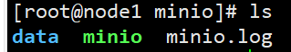 


4. **运行**

> 注意：这里的address和console-address 填linux的ip地址

* nohup：后台启动
*    ./minio server：启动命令
* /usr/local/software/minio/data：指定存储目录
*  /home/minio/minio.log 2>&1 ：控制台日志目录
* &：后台运行

```bash
nohup ./minio server  --address 192.168.2.103:9090 --console-address 192.168.2.103:9000 /usr/local/software/minio/data > /usr/local/software/minio/minio.log 2>&1
```


5. 开放端口，windows访问

```bash
firewall-cmd --zone=public --add-port=9090/tcp --permanent
firewall-cmd --zone=public --add-port=9000/tcp --permanent
firewall-cmd --reload
```

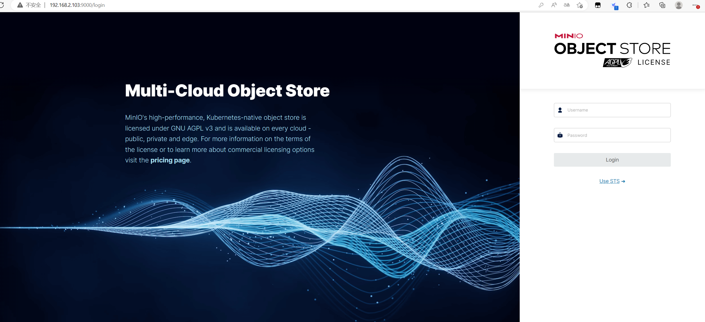

> 注意：账号密码都是minioadmin


## Minio配置

### 创建桶

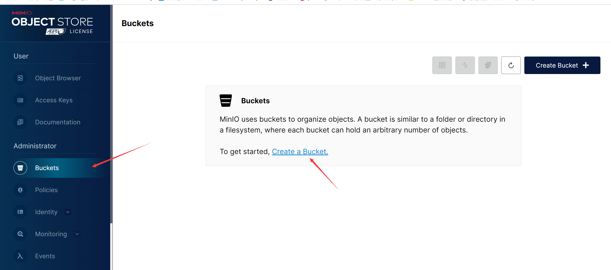

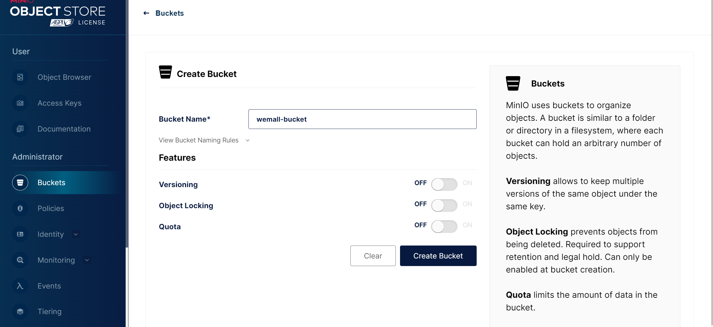

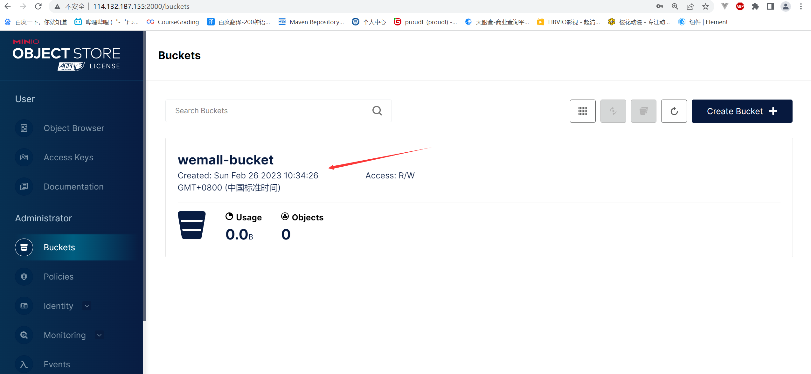

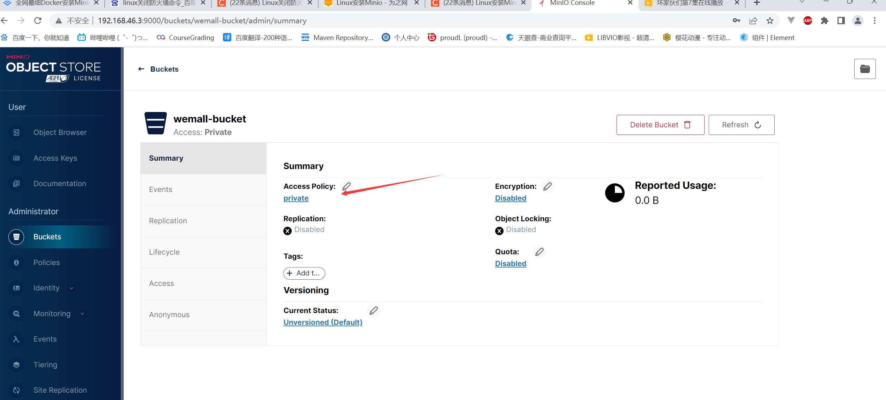

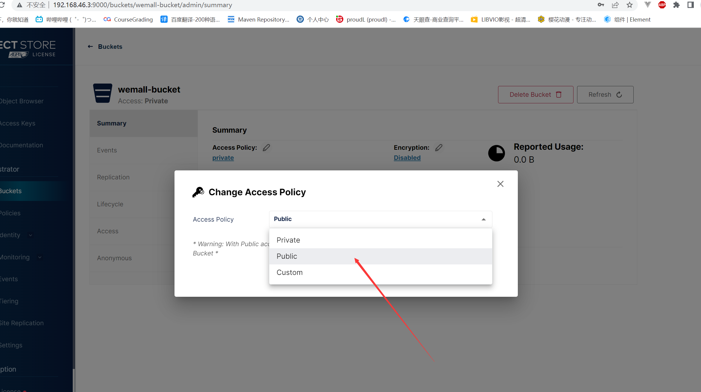

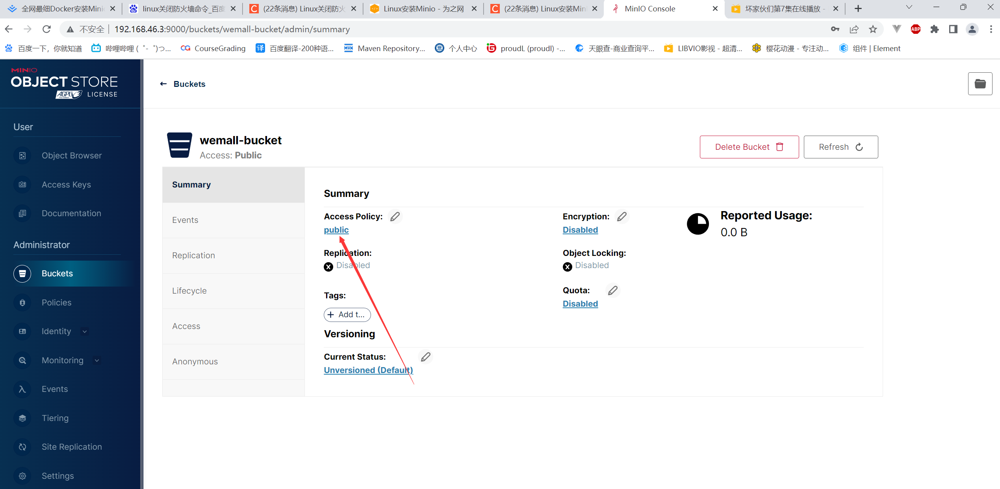


### 配置linux系统时间

注意：如果linux时间和windows的时间不一致，在java实现上传图片时，会出现以下错误

```
error occurred
ErrorResponse(code = RequestTimeTooSkewed, message = The difference between the request time and the server's time is too large., bucketName = null, objectName = null, resource = /XXXX/XXX.html, requestId = null, hostId = 824ba5a7-59e8-4182-b844-56a173f96fe9)
request={method=PUT, url=http://XXXXXX:9000/XXXX/XXX.html, headers=Content-Type: text/html
Host: XXXX:9000
Accept-Encoding: identity
User-Agent: MinIO (x86_64; x86_64) minio-java/2.7.0
Content-MD5: g8XCbC4lnQpwJ491ubTKDQ==
x-amz-content-sha256: 92080d103ab8baf9b27960904655a527a8938f588d080475b9fbd2dd516c0a67
x-amz-date: 20220513T104832Z
Authorization: AWS4-HMAC-SHA256 Credential=*REDACTED*/20220513/us-east-1/s3/aws4_request, SignedHeaders=accept-encoding;content-md5;host;x-amz-content-sha256;x-amz-date, Signature=*REDACTED*
}
response={code=403, headers=Accept-Ranges: bytes
Content-Length: 301
Content-Type: application/xml
Server: MinIO
Vary: Origin
Date: Fri, 13 May 2022 12:12:12 GMT
}
```


1. linux中查看系统当前时间

```bash
date
```

2. 如果系统时间和windows不一样，则手动修改

```bash
hwclock --show
hwclock --set --date "2022-7-11 18:20:30"
hwclock --hctosys
clock -w
```


### 配置开机自动启动服务

1. 进入minio所在的位置，创建脚本文件

```bash
cd /usr/local/software/minio/
vim minio.sh

#脚本内容如下
nohup ./minio server  --address 192.168.2.103:9090 --console-address 192.168.2.103:9000 /usr/local/software/minio/data > /usr/local/software/minio/minio.log 2>&1
```


2. 赋予minio.sh权限

```bash
chmod +x minio.sh
```


3. 编辑开机运行

```bash
vim /etc/rc.d/rc.local
#在最下面编写以下代码
cd /usr/local/software/minio/
./minio.sh minio
```

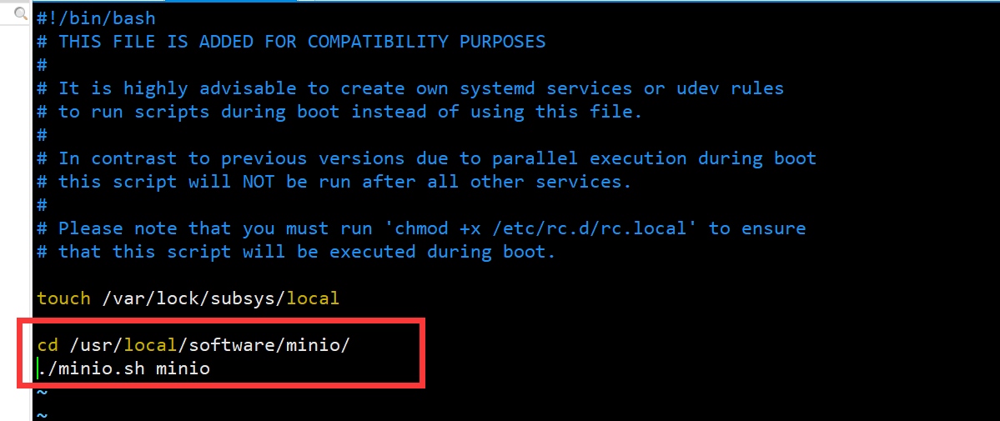


4. 赋予rc.local可执行权限

```bash
chmod +x /etc/rc.local 
```


5. 重启服务器查看

```bash
reboot
ps -ef | grep minio
```

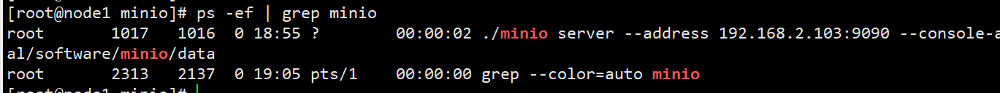


## Java实现上传/下载

1. 创建springboot项目，导入依赖

```xml
 <!--web启动器-->
        <dependency>
            <groupId>org.springframework.boot</groupId>
            <artifactId>spring-boot-starter-web</artifactId>
        </dependency>
        <!--文件上传组件-->
        <dependency>
            <groupId>commons-io</groupId>
            <artifactId>commons-io</artifactId>
            <version>2.6</version>
        </dependency>
        <!--minio依赖-->
        <dependency>
            <groupId>io.minio</groupId>
            <artifactId>minio</artifactId>
            <version>8.3.0</version>
        </dependency>
        <dependency>
            <groupId>me.tongfei</groupId>
            <artifactId>progressbar</artifactId>
            <version>0.5.3</version>
        </dependency>
        <dependency>
            <groupId>com.squareup.okhttp3</groupId>
            <artifactId>okhttp</artifactId>
            <version>4.8.1</version>
        </dependency>
        <!--将对象转化为JSON格式-->
        <dependency>
            <groupId>com.alibaba</groupId>
            <artifactId>fastjson</artifactId>
            <version>1.2.33</version>
        </dependency>
        <dependency>
            <groupId>com.fasterxml.jackson.datatype</groupId>
            <artifactId>jackson-datatype-jsr310</artifactId>
        </dependency>
        <!--lombok-->
        <dependency>
            <groupId>org.projectlombok</groupId>
            <artifactId>lombok</artifactId>
            <optional>true</optional>
        </dependency>
```


2. 全局配置文件

```properties
#minio客户端地址
minio.endpoint=http://192.168.2.103:9090
#minio控制台账号
minio.accesskey=minioadmin
#minio控制台密码
minio.secretkey=minioadmin
#minio对应的桶名
minio.bucketName=mybucket
spring.jackson.serialization.fail-on-empty-beans=false
#这是控制限制文件大小的配置,限制文件上传大小
spring.servlet.multipart.max-file-size=10MB
spring.servlet.multipart.max-request-size=10MB
```


3. 在config包下创建配置文件

 

```java
@Configuration
public class MinioConfig {

    @Resource
    private MinioProperties minioProperties;

   @Bean
    public MinioClient minioClient() {
        MinioClient minioClient = MinioClient.builder()
                .endpoint(minioProperties.getEndPoint())
                .credentials(minioProperties.getAccessKey(), minioProperties.getSecretKey()).build();
        return minioClient;

    }
}
```

```java
@Data
@Component
@ConfigurationProperties(prefix = "minio")
public class MinioProperties {
    private String endPoint;
    private String accessKey;
    private String secretKey;

}
```


4. 在utils包下创建工具类

 

```java
@Component
public class MinioUtilS {

    @Resource
    private MinioClient minioClient;

    @Value("${minio.bucketName}")
    private String bucketName;

    /**
     * description: 判断bucket是否存在，不存在则创建
     */
    public void existBucket(String name) {
        try {
            boolean exists = minioClient.bucketExists(BucketExistsArgs.builder().bucket(name).build());
            if (!exists) {
                minioClient.makeBucket(MakeBucketArgs.builder().bucket(name).build());
            }
        } catch (Exception e) {
            e.printStackTrace();
        }
    }

    /**
     * 创建存储bucket
     *
     * @param bucketName 存储bucket名称
     */
    public Boolean makeBucket(String bucketName) {
        try {
            minioClient.makeBucket(MakeBucketArgs.builder()
                    .bucket(bucketName)
                    .build());
        } catch (Exception e) {
            e.printStackTrace();
            return false;
        }
        return true;
    }

    /**
     * 删除存储bucket
     *
     * @param bucketName 存储bucket名称
     */
    public Boolean removeBucket(String bucketName) {
        try {
            minioClient.removeBucket(RemoveBucketArgs.builder()
                    .bucket(bucketName)
                    .build());
        } catch (Exception e) {
            e.printStackTrace();
            return false;
        }
        return true;
    }

    /**
     * description: 上传文件
     */
    public List<String> upload(MultipartFile[] multipartFile) {
        List<String> names = new ArrayList<>(multipartFile.length);
        for (MultipartFile file : multipartFile) {
            String fileName = file.getOriginalFilename();
            String[] split = fileName.split("\\.");
            if (split.length > 1) {
                fileName = split[0] + "_" + System.currentTimeMillis() + "." + split[1];
            } else {
                fileName = fileName + System.currentTimeMillis();
            }
            InputStream in = null;
            try {
                in = file.getInputStream();
                minioClient.putObject(PutObjectArgs.builder()
                        .bucket(bucketName)
                        .object(fileName)
                        .stream(in, in.available(), -1)
                        .contentType(file.getContentType())
                        .build()
                );
            } catch (Exception e) {
                e.printStackTrace();
            } finally {
                if (in != null) {
                    try {
                        in.close();
                    } catch (IOException e) {
                        e.printStackTrace();
                    }
                }
            }
            names.add(fileName);
        }
        return names;
    }

    /**
     * description: 下载文件
     */
    public ResponseEntity<byte[]> download(String fileName) {
        ResponseEntity<byte[]> responseEntity = null;
        InputStream in = null;
        ByteArrayOutputStream out = null;
        try {
            in = minioClient.getObject(GetObjectArgs.builder().bucket(bucketName).object(fileName).build());
            out = new ByteArrayOutputStream();
            IOUtils.copy(in, out);
            //封装返回值
            byte[] bytes = out.toByteArray();
            HttpHeaders headers = new HttpHeaders();
            try {
                headers.add("Content-Disposition", "attachment;filename=" + URLEncoder.encode(fileName, "UTF-8"));
            } catch (UnsupportedEncodingException e) {
                e.printStackTrace();
            }
            headers.setContentLength(bytes.length);
            headers.setContentType(MediaType.APPLICATION_OCTET_STREAM);
            headers.setAccessControlExposeHeaders(Arrays.asList("*"));
            responseEntity = new ResponseEntity<byte[]>(bytes, headers, HttpStatus.OK);
        } catch (Exception e) {
            e.printStackTrace();
        } finally {
            try {
                if (in != null) {
                    try {
                        in.close();
                    } catch (IOException e) {
                        e.printStackTrace();
                    }
                }
                if (out != null) {
                    out.close();
                }
            } catch (IOException e) {
                e.printStackTrace();
            }
        }
        return responseEntity;
    }

    /**
     * 查看文件对象
     *
     * @param bucketName 存储bucket名称
     */
    public List<ObjectItem> listObjects(String bucketName) {
        Iterable<Result<Item>> results = minioClient.listObjects(
                ListObjectsArgs.builder().bucket(bucketName).build());
        List<ObjectItem> objectItems = new ArrayList<>();
        try {
            for (Result<Item> result : results) {
                Item item = result.get();
                ObjectItem objectItem = new ObjectItem();
                objectItem.setObjectName(item.objectName());
                objectItem.setSize(item.size());
                objectItems.add(objectItem);
            }
        } catch (Exception e) {
            e.printStackTrace();
            return null;
        }
        return objectItems;
    }

    /**
     * 批量删除文件对象
     */
    public Iterable<Result<DeleteError>> removeObjects(String bucketName, List<String> objects) {
        List<DeleteObject> dos = objects.stream().map(e -> new DeleteObject(e)).collect(Collectors.toList());
        Iterable<Result<DeleteError>> results = minioClient.removeObjects(RemoveObjectsArgs.builder().bucket(bucketName).objects(dos).build());
        return results;
    }


    /**
     * 下载文件
     * @param originalName 文件路径
     */
    public InputStream downloadFile(String bucketName, String originalName, HttpServletResponse response) {
        try {
            InputStream file = minioClient.getObject(GetObjectArgs.builder().bucket(bucketName).object(originalName).build());
            String filename = new String(originalName.getBytes("ISO8859-1"), StandardCharsets.UTF_8);
            if (!StringUtils.isEmpty(originalName)) {
                filename = originalName;
            }
            response.setHeader("Content-Disposition", "attachment;filename=" + filename);
            ServletOutputStream servletOutputStream = response.getOutputStream();
            int len;
            byte[] buffer = new byte[1024];
            while ((len = file.read(buffer)) > 0) {
                servletOutputStream.write(buffer, 0, len);
            }
            servletOutputStream.flush();
            file.close();
            servletOutputStream.close();
            return file;
        } catch (Exception e) {
            e.printStackTrace();
            return null;
        }
    }

}
```


5. 在vo包下创建实体类

 

```java
@Data
public class DownloadFileVo {
    public InputStream inputStream;
    private String fileName;
}
```

```java
@Data
public class ObjectItem {
    private String objectName;
    private Long size;
}
```


6. 在controller包下创建控制器

 

```java
@Controller
@Slf4j
@RequestMapping("minio")
public class MinioController {

    @Resource
    private MinioClient minioClient;

    @Resource
    private MinioUtilS minioUtilS;

    @Value("${minio.bucketName}")
    private String bucketName;

    @Value("${minio.endpoint}")
    private String endpoint;


    //上传单文件
    @ResponseBody
    @PostMapping(value = "/upload", consumes = "multipart/form-data")
    public Object upload(MultipartFile file) {
        List<String> upload = minioUtilS.upload(new MultipartFile[]{file});
        log.info("upload: {}", upload);
        return endpoint + "/" + bucketName + "/" + upload.get(0);
    }

    //上传多文件
    @ResponseBody
    @PostMapping(value = "/upload1", consumes = "multipart/form-data")
    public Object uploadMore(MultipartFile[] files) {
        List<String> upload = minioUtilS.upload(files);
       Map<String,Object> map=new HashMap();
       map.put("data",endpoint + "/" + bucketName + "/" + upload);
        return map;
    }

    /**
     * 下载图片
     */
    @ResponseBody
    @GetMapping(value = "/downloadFile")
    public DownloadFileVo download(String fileName, HttpServletResponse response) {
        InputStream inputStream = minioUtilS.downloadFile(bucketName, fileName, response);
        DownloadFileVo downloadFileVo = new DownloadFileVo();
        downloadFileVo.setFileName(fileName);
        downloadFileVo.setInputStream(inputStream);
        return downloadFileVo;
    }

}
```


7. postman测试

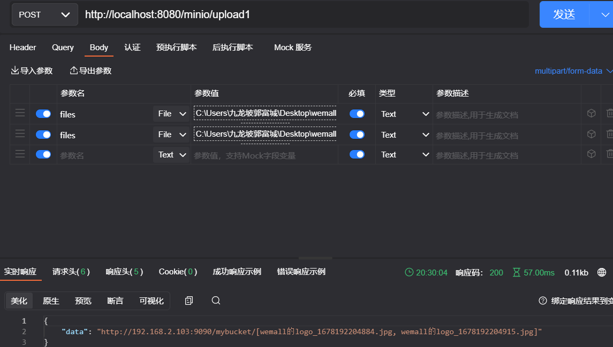

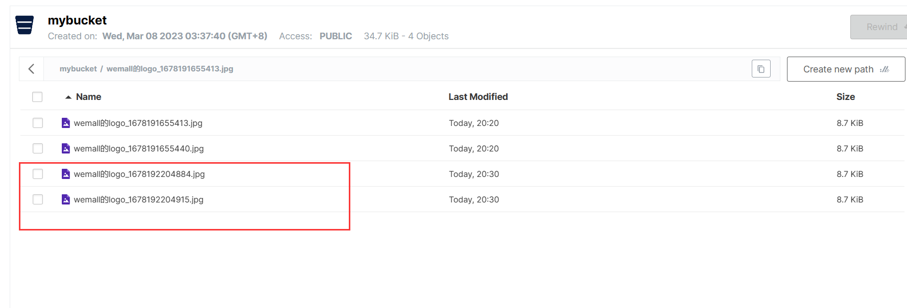


## 官方API文档

[Java Client API Reference — MinIO Object Storage for Linux](https://min.io/docs/minio/linux/developers/java/API.html?ref=docs-redirect)
