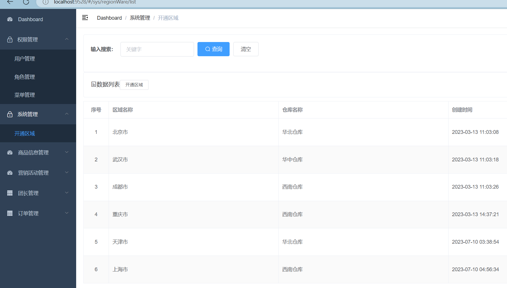
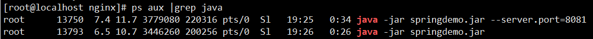

# Nginx使用

## 一 windows安装

* 打开网址[nginx: download](https://nginx.org/en/download.html)，找到windows版本进行下载


* **下载windows版本的nginx，解压到`一个没有中文、没有英文的目录！！！！`**


* **运行nginx**


* **查看运行效果**


* **关闭nginx**


 


## 二 Linux系统环境准备

>  1. 安装gcc的环境

```nginx
yum -y install gcc-c++
```


>  2. 安装PCRE环境

```nginx
yum  install -y pcre pcre-devel 
```


>  3.安装zlib

```nginx
yum install -y zlib zlib-devel
```


> 4.安装OpenSSL

```nginx
yum install -y openssl openssl-devel
```


> 5.root权限进入/usr/local目录

```nginx
cd /usr/local
```


> 6.使用XFTP将`nginx-1.16.1.tar.gz`文件上传至该路径

 


> 7.该目录下创建文件夹 software

```nginx
mkdir software
```

 


> 8.解压文件到software中

```nginx
tar -zxf nginx-1.16.1.tar.gz -C ./software/
```


> 9.进入software目录，再次创建nginx文件夹

```nginx
cd software/
ll
mkdir nginx
```

 


> 10.进入解压后的文件路径，执行命令

```nginx
cd nginx-1.16.1/
./configure  --prefix=/usr/local/software/nginx
make
make install
```

==**注意：如果执行make命令报错，说明缺少依赖，继续执行下列命令后再次执行make即可**==

```nginx
yum -y install gcc automake autoconf libtool make 
```


> 11.进入nginx文件夹，出现以下四个文件夹则说明安装成功

```nginx
cd ..
cd nginx
ll
```

**conf  html  logs  sbin**

 


## 三 启动、关闭、重启

### 2.1 启动

`1.启动`

```nginx
#进入安装成功的目录
cd /usr/local/software/nginx/sbin
#启动:默认以后台启动
./nginx
#查看进程
ps aux|grep nginx
```


`2.linux系统访问`

​			打开火狐，输入localhost即可看到welcome to nginx		

 

`3.Windows系统访问`

* 在Linux系统开放80端口

```nginx
firewall-cmd --zone=public --add-port=80/tcp --permanent
firewall-cmd --reload 
```

* 打开Windows浏览器，输入Linux系统**IP地址:80**( `本机：192.168.2.102:80`)即可看到welcome to nginx		


### 2.2 关闭

```nginx
#正常关闭
./nginx -s quit
#强制关闭
./nginx -s stop
```


### 2.3 重启

​			修改了配置文件一定要重启nginx

```nginx
#再刷新启动
./nginx -s reload
```


### 2.4 注意

>  无论是启动、关闭、重启nginx都要来到`/usr/local/software/nginx/sbin`这个路径再执行


## 四 部署静态网站

`1.将自己的静态文件夹(如前端页面)上传到/usr/local/software/nginx/路径下`

> 注意：这里为什么要把静态文件夹放在这个路径下进行部署，是因为在nginx配置文件中，优先查询在nginx这个相对路径目录下的文件，比如它默认跳转的是html文件夹，它也是在nginx路径下的


`2.进入/usr/local/software/nginx/conf路径,修改访问地址的值`

```nginx
#修改里面的配置文件
vi nginx.conf
```

```nginx
	#服务配置
    server {
        listen       80;   		     #端口号,默认是80
        server_name  localhost;		 #服务器名称,默认是localhost

	   #访问地址
        location / {			# / 表示根目录
            root   前端页面;	 # root表示访问的文件夹,默认是html,可以根据自己的文件夹名称修改
            index  index.html index.htm;	#默认访问页面为index.html,可以根据自己默认页面修改
        }
    
    
    
    #如果要部署多个静态项目,则使用下面
        location /second {			# /second 表示访问目录为: ip/second
            alias   静态页面2;	 	 # 访问的文件夹是 静态页面2,这里只能用alias
            index  login.html;		#默认访问页面为login.html
        }
    
    
    

	#错误页面的配置
        error_page   500 502 503 504  /50x.html;
        location = /50x.html {
            root   html;
        }
}
```

==**注意：我们只需要改访问地址那一栏的root和index值即可**==


`3.修改了配置文件,重启服务并访问`

```nginx
./nginx -s reload
```


`4.配合花生壳实现内网穿透`


`5.其它`

​		如果要配置多个静态项目部署，则配置多个location或多个server( 端口不要冲突了且要开放对应端口)

```nginx
	#服务配置1
    server {
        listen       80;   		    
        server_name  localhost;		 

	   #访问地址
        location / {			
            root   前端页面;	
            index  index.html index.htm;	
        }

	#错误页面的配置
        error_page   500 502 503 504  /50x.html;
        location = /50x.html {
            root   html;
        }
}
	#服务配置2
    server {
        listen       81;   		    
        server_name  localhost;		 

	   #访问地址
        location / {			
            root   前端页面;	
            index  index.html index.htm;	
        }

	#错误页面的配置
        error_page   500 502 503 504  /50x.html;
        location = /50x.html {
            root   html;
        }
}
```


## 五 location 优先级匹配

* ` = /xxx`最高优先级，全等匹配

  ```nginx
  eg:  
  location = /user {			
             #省略其它
          }
  ```

  > 输入/user即可跳转到这个location下


* `^~ /xxx`次高优先级，半匹配

  ```nginx
  eg:  
  location ^~ /user {			
             #省略其它
          }
  ```

  > 输入/user/a即可跳转到这个location下


* `~ /正则表达式`低优先级，正则表达式匹配

  ```nginx
  eg:  正则表达式,表示开头为字母、数字、下划线
  location ~ /\w {			
             #省略其它
          }
  ```

  > 输入/user、/1user、/_user 即可跳转到这个location下


* `/`最低优先级

  ```nginx
  eg:  
  location / {			
             #省略其它
          }
  ```

  > 随意输入路径即可跳转到这个location下


## 六 负载均衡

### 5.1 概念

​			随着用户的增多，业务流量越来越大并且业务逻辑也跟着越来越复杂，单台服务器的性能及单点故障问题就凸显出来了，因此需要多台服务器进行性能的水平扩展及避免单点故障出现。那么如何将不同用户的请求流量分发到不同的服务器上呢？使用多台WEB服务器组成集群，**`前端使用Nginx负载均衡，将请求分散到我们的后端服务器集群中，实现负载的分发。那么会大大提升系统的吞吐率、请求性能、高容灾`**。


### 5.2 使用

​			进入/usr/local/software/nginx/conf路径,修改配置文件的值

```nginx
#修改里面的配置文件
vi nginx.conf
```

```nginx
   #自定义负载均衡两个服务器地址
	upstream group{
    	#地址1,可以设置权重来重点请求某个路径
        server 192.168.2.102:8080 weight=5;
    	#地址2
        server 192.168.2.102:8081 weight=2;
        }

    server {
        listen  80;
        server_name  localhost;

        location /fzjh {
        		#使用下列路径来实现负载均衡
                proxy_pass http://group/;	
          }

        }
```


## 七 正向代理和反向代理

### 6.1 正向代理

> 通俗来讲，就是代理客户端

​			当客户端无法访问外部资源（比如Google、Twitter），可以通过一个正向代理（VPN代理）去间接地访问，因为客户端知道服务器的IP地址，客户端只需要配置代理服务器的IP，即可访问。**`客户端和正向代理服务器处在同一个局域网。`**


正向代理的用途：

- 访问原来无法访问的资源，如Google、Twitter
- 可以做缓存，加速访问资源
- 对客户端访问授权，上网进行认证
- 代理可以记录用户访问记录（上网行为管理），对外隐藏用户信息


### 6.2 反向代理

> 通俗来讲，就是代理服务器

​			客户端无法感知代理服务器的存在，通过代理服务器来接受internet上的连接请求，然后将请求转发给内部网络上的服务器，并将从服务器上得到的结果返回给internet上请求连接的客户端。（比如百度，我们永远访问的都是百度的域名，百度的服务器不可能仅有一台，它后期可以动态扩容对于我们完全没有影响。）**`通常为保证内网的安全，可以用一个公网IP给代理服务器作为访问地址，代理服务器负载均衡将请求转发给内部真正服务器，反向代理服务器和内部网络上的服务器在同一个LAN。`**


反向代理的作用：

* 保证内网的安全，可以使用反向代理提供WAF功能，阻止web攻击；大型网站，通常将反向代理作为公网访问地址，Web服务器是内网。

* 负载均衡，通过反向代理服务器来优化网站的负载


### 6.3 区别

* 正向代理中，服务器并不知道真正的客户端到底是谁，只知道正向代理服务器是谁；

  反向代理中，客户端不知道真正的服务器是谁，只知道反向代理服务器是谁。

* 正向代理主要是用来解决访问限制的问题，帮助能够访问；

  反向代理则是更多的考虑负载均衡、安全防护等问题.

 


## 八 反向代理+负载均衡实战

### 8.1 前后端分离反向代理

> **需求：以windows的nginx为例，客户端统一访问9001端口，根据请求路径中的参数来跳转后端对应的服务端口路径**


**`1.编写配置文件`**


**`2.修改前端Vue的统一请求路径`**


**`3.启动前后端微服、nginx服务,查看效果`**

 

 




### 8.2 反向代理+负载均衡

`1.将SpringBoot项目打包上传到Linux中`

​			该项目存在两个简单的访问路径

 

 


`2.后台分别启动两个服务:一个8080服务、一个8081服务`

 

 


`3.查看后台是否启动了两个端口的服务`

 

> 后台启动默认会在当前路径下创建一个 `nohup.out`的日志，我们可以查看这个日志来追踪程序运行情况


`4.配置负载均衡、反向代理`

​				更改配置文件并保存

 

 

> 这里一定要在`/fzjh`后多加一个`/`，不然会匹配不到springboot项目中的`/get`请求，只会匹配到`/`请求，**后期部署完整项目的时候，location结尾一定要多加`/`**


`5.重新运行nginx服务`

 


`6.运行三次访问,查看日志打印`

​			运行三次访问之前，将日志文件先清空，便于查看效果

 

 

 

