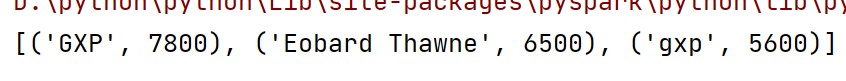

# Python基础

## 一 开始

###  **环境配置**

[第一阶段-第一章-03-Python环境安装(Windows)_哔哩哔哩_bilibili](https://www.bilibili.com/video/BV1qW4y1a7fU?p=4&vd_source=6ce2a6eb6cbcb840f00c1778af71ce3c)


### **安装pycharm2022.1破解**

jetbrains全家桶2022版-jetbra打开，运行里面的script中的install-current-user.vbs，然后打开pycharm输入激活码即可


###  **单独运行文件**


 


### **创建pycharm项目**


### 快捷键

* **`alt+shift+上/下:上下移动当前代码`**
* **ctrl+-或=：收起、展开当前方法**
* **`ctrl+alt+t:将一段代码包围try-catch`**
* **`ctrl+alt+l:格式化代码`**
* **`ctrl+alt+v:接收返回变量`**
* **ctrl+p：提示函数或方法需要配置的参数**


## 二 基础语法

### 注释

```python
# 单行注释

"""
    多行注释,用三个"组成
"""
```

**注意：当在函数里使用多行注释，会自动填充形参、返回值的相关信息**


### 输入输出

* **print(内容1,内容2,...,...)**：逗号隔开

```python
print(1, "2", 3.0, '4')
```

 

**注意：若想要输出不换行，则需要在末尾加入`end=''`即可**

```python
print("hello",end='')
print("eobard",end='')
```


* **input(提示信息)**：提示信息可为空，**注意input默认返回str类型，有时需要强转**

```python
name=input("输入你的名字:")
print(f"我知道了,你是{name}")
```


### 数据类型

* **type(values)**：输入values的类型
* **isinstance(val，type)**：判断val是否为type类型
* **None**：表示空值，**等同于False**

```python
print(type(1.3))
```


```python
number=13
flag=isinstance(number,int) # 判断number是否为int类型
print(flag)
```

 


#### 数据转换

* **str(values)**：将values转为String类型
* **int(values)**：将values转为int类型
* **float(values)**：将values转为float类型

```python
# 将数字类型转化为字符串
num=str(23)
print(num,type(num))

# 将字符串转化为数字
num=int("23")
print(num,type(num))

# 将字符串转化为浮点类型
num=float("23.0")
print(num,type(num))

# 整数转浮点数
num=float(11)
print(num,type(num))

# 浮点数转整数:会丢失精度
num=int(12.3)
print(num,type(num))
```


### 运算操作

* **/**：（数学）真除法，将结果转为float类型
* **//**：整除
* **%**：取余
* ******：指数
* **not**：逻辑非，等同于取反（!）运算符
* **and：逻辑与**
* **or：逻辑或**
* **pass：表示什么也不执行语句，占位用**
* **in：可用于循环或`判断某个变量是否在数据容器中(in操作对于列表或元组的效率极低)`**

```python
print(11/2)		#会将结果转为float类型
print(11//2)
print(4%3)
print(2**3)
```


**注意：python中不存在`变量++`或`++变量`操作**


### 字符串

> **注意：字符串不能与int、float直接拼接**


#### 格式化字符串

**方式1：通过 `"%占位符" %(变量名或表达式)`  **

* %s	输出字符串
* %d   输出整形
* %f    输出浮点数
* %.nd或f  表示输出小数点后n位数字，会四舍五入

```python
name="eobard"
age=23
salary=20000.0
message="姓名:%s,年龄:%d,薪水：%f" %(name,age,salary)
print(message)
```


**方式2： 通过`f"{变量名或表达式}"`**

```python
name="eobard"
age=23
salary=2000.721
res=f"{name},{age},{salary}"
print(message)
```


#### 字符串api


### 判断条件

#### if-else语句

> **`if 判断条件:`**
>
> ​			**`其它操作`**
>
> **`else:`**
>
> ​			**`其它操作`**

```python
accout=input("input your name:")
if accout == "admin":
    print("success")	#注意print前有4个空格,表示该语句隶属于if条件表达式中
else:
    print("error")		#注意print前有4个空格,表示该语句隶属于else条件表达式中
```

 

 

**注意：1.判断条件后的冒号不要省略**

​				**2.if-else条件里面的语句，需要缩进4个空格**


#### if-elif语句

> **`if 判断条件1:`**
>
> ​			**`其它操作`**
>
> **`elif 判断条件2:`**
>
> ​			**`其它操作`**
>
> **`else:`**
>
> ​			**`其它操作`**


### 循环

#### while

> **`while 判断条件:`**
>
> ​				**`其他操作`**

**eg：99乘法表**

```python
i=1
while i<10:
    j = 1
    while j<=i:
        print(f"{j}*{i}={i*j}",end=' ')  #表示不换行
        j+=1
    print()
    i+=1
```


​	


#### for

> **`for  临时变量  in  待处理数据集：`**
>
> ​				**`其他操作`**

#### break与continue

> **`循环`**
>
> ​			**`其它操作`**
>
> ​			**`break或continue`**
>
> ​			**`其它操作`**


### range

* **`range(num):生成[0，num）的左闭右开区间值,步长默认为1`**
* **`range(start,end):生成[start，end）的左闭右开区间值,步长默认为1`**
* **`range(start,end,step):生成[start，end）的左闭右开区间值,步长为step`**，eg：range(9,0,-2) 为9,7,5,3,1


eg：99乘法表

```python
for i in range(1,10):
    for j in range(1,i+1):
        print(f"{j}*{i}={j*i}\t",end='')
    print()
```


**`注意：通常可用range来控制循环次数，递增循环5次：range(5)；递减循环6次：range(6,0,-1)`**


### 序列解包

> **多个变量同时赋值，减少代码输入量，提高可读性**
>
> **`变量1，变量2，变量3...=值1，值2，值3...`**

```python
# 交换a和b的值
a,b=b,a
```


## 三 函数

### 函数定义

> **`def 函数名(形参...):`**
>
> ​				**`函数逻辑`**
>
> ​				**`return 返回值或None`**					**#若无需返回值，则可省略该行代码**


### global关键字

> **`python实参到形参是引用传递`，并不是值传递，即如果是单一变量传参，在方法中改变值，并不会影响方法外的值**

 


**注意：当需要对全局变量在函数中对其修改时，则需要在函数内用global关键字声明一样的全局变量名**

​				**若函数外没有声明全局变量，在函数中用global声明后，会创建对应新的全局变量**


### 函数多返回值

> **若想要在一个函数中返回多个不同类型函数值，则可使用函数多返回值**

```python
def return_more_data():
    # 其它业务逻辑
    return 1,2,3


x,y,z = return_more_data()
print(x, y, z)
```


### 参数传递

#### 缺省参数

> **`也叫默认参数`，调用函数时可不传默认参数的值(默认参数不管定义或调用函数必须写在最后)**

```python
# 默认让sex为男
def get_user_info(name,sex="男"):
    print(name,":",sex)

# 不传sex参数表示启用默认值
get_user_info("eobard")
# 手动传递sex参数
get_user_info("gxp","女")
```


**<font color="red">注意：应避免列表、字典、集合或其它可变序列作为缺省参数</font>**


#### 关键字传参

<font color="red">**当调用函数想自定义传入顺序或调用python库不想传入所有参数时，可使用关键字传参**</font>

**eg1：**

```python
#python库中的文件open操作
"""
def open(file, mode='r', buffering=None, encoding=None, errors=None, newline=None, closefd=True)
"""
#前面两个对应python库中的file和mode,而第三个参数不想自己添加,则可以使用关键字传参
open("1.txt","r",encoding="utf-8")
```

**eg2：**

```python
def test(name,age):
    # 其它业务逻辑
    print(name,age)

# 关键字传参可以自定义传入顺序
test(age=12,name="gxp")
```


#### 可变参数

* 位置传递：用`*args`接收，将形参装入元组中
* 关键字传递：用`**kwargs`接收，调用函数时的形参必须是**`自定义k=v`**形式，将形参装入字典中

```python
# 位置形参不定长
def test_indefinite_variable(*args):
    print("args的数据是:",args)
    print("args的类型是:",type(args))
    # 其它业务逻辑

# 关键字形参不定长
def test_keywords_variable(**kwargs):
    print("kwargs的数据是:",kwargs)
    print("kwargs的类型是:",type(kwargs))
    # 其它业务逻辑


test_indefinite_variable(1,2,3)
# 自定义k
test_keywords_variable(name="eobard",age=23)
```


### 匿名函数

<font color="red">**当自定义函数中的形参为方法而非数据时，在调用自定义函数可用匿名函数自定义逻辑传入**</font>

> **`lambda 参数:函数体(只能写一行代码)`**

```python
# compute为形参方法,调用时直接自定义lambda表达式即可
def test_four_operations(compute,x,y):
    return compute(x,y)

print("lambda的加法运算：",test_four_operations(lambda a, b: a + b, 1,2))
print("lambda的减法运算：",test_four_operations(lambda a, b: a - b, 1,2))
print("lambda的乘法运算：",test_four_operations(lambda a, b: a * b, 1,2))
print("lambda的除法运算：",test_four_operations(lambda a, b: a / b, 5,2))


f=lambda x,y:x**y
print(f(2, 3))
```


 


### 类型注解

**通过该方式可以在调用函数时快速传入形参类型，获取返回值类型，`用作提示效果`**

> **`def 方法名(形参名:类型...) -> 类型:`** 		

 


## 四 数据容器

### 列表（类似数组）

> **`变量名=[...]`**
>
> **`变量名=list()`**  **：定义空列表**

```python
data_array=["eobard",23,True,[1,2,3]]
print(data_array)
print(data_array[3][2])
print(data_array[-1])   # 索引从右往左从-1开始
```


**注意：1. 列表里的元素可以为不同类型**

​				**2. 列表索引从左往右是0开始，`从右往左是-1开始`**


#### 列表api

* **index(value)：获取value在列表中的下标值，`不存在则报错`**
* **insert(index,value)：在指定index下标插入value值**
* **append(value)：在列表末尾追加value值**
* **extend(其它数据容器)：将其它数据容器的内容取出，依次追加到列表末尾**
* **删除元素**
  * **del  列表变量[index]：删除列表变量指定index下标元素**
  * **pop(index)：删除列表指定index下标元素，`可返回删除元素`**
* **remove(value)：删除列表第一个值为value的元素**
* **clear()：清空列表元素**
* **count(value)：统计列表中值为value的数量**
* **len()：统计列表全部元素数量**
* **in操作：判断一个元素是否在列表中**
* **reverse()：反转列表**
* **列表a+列表b：将两个列表合并为一个列表并返回新列表**


#### 列表推导式

> **`列表推导式:[逻辑代码 for 临时变量 in 迭代对象 if 临时变量]`**
>
> **步骤：首先遍历for循环，如果满足if条件，则执行逻辑代码，并将逻辑代码放入列表中**

```python
# 遍历0-9的元素,当i大于0的时候,将i平方后放入列表中
result=[i*i for i in range(10) if i>0]
print(result)

vec=[[1,2,3],[4,5,6]]
# 首先遍历外层循环[1,2,3]和[4,5,6],然后分别遍历内层循环,并将其放入列表中
result=[j for i in vec for j in i]
print(result)
```


**注意：其它容器同样也有推导式写法，只需要修改容器对应的定界符即可**


#### 列表排序

当列表中还有列表且需要对其排序时

```python
list=[["gxp",23],["GXP",76],["eobard",60]]
"""
:key 代表排序的规则 ->填写自定义函数名或lambda表达式
:element 代表列表的当前元素->因为这是列表里还有列表,所以这里列表的当前元素还是为一个个列表,这里按照当前列表中下标为1的值排序
:reverse 代表是否反转-> True代表从大到小,False从小到大
"""
list.sort(key=lambda element:element[1],reverse=True)
print(list)
```


### 元组

> **元组一旦被定义，就不可修改，当我们需要封装内部数据时又不希望被修改，则使用元组**
>
> **`变量名=(...)`**
>
> **`变量名=tuple()`** **：定义空元组**

```python
t1=("eobard",)  #定义单个元组,需要加,
t2=()           # 定义空元组
t3=("eobard",True,("thawne",),["gxp","GXP"])    #定义嵌套元组
print(f"修改前；{t3}")
t3[-1][0]="GXP"
t3[-1][1]="gxp"
print(f"修改后:{t3}")
```


**注意：1.元组里的数据可以为不同类型**

​				**2.若元组只有一个数据，则需要在数据后加`,`**

​				**3.元组同样支持下标取值**

​				**4.若元组内部嵌套有list容器，则只能修改list容器内部数据**


#### 元组api


### 集合（类似set集合）

> **`变量名={...}`**
>
> **`变量名=set()`**	**：定义空集合只能用这种方式**

```python
my_set={1,2,3,1,2,3}
print("my_set元素有：",len(my_set),"个")
for x in my_set:
    print(x)

set1={1,2,3}
set2={1,4,5}
# 求差集(集合1-集合2):获取集合1在集合2中没有的数据
set3=set1.difference(set2)
print("difference操作:",set3)
```

 

**注意：集合里的数据乱序、不重复、不支持索引访问、支持多类型**


#### 集合api


* **集合a & 集合b：得到一个新集合，返回两集合的交集**


### 字典（类似map集合）

> **`dic={xx:xx,...}`**
>
> **`dic=dict()`**	**：定义空字典**

```python
my_info = {"name": "eobard_thawne", "age": 23}
# 定义嵌套字典
stu_score = {"eobard":
                 {"java": 99, "c": 98},
             "gxp":
                 {"java": 88, "c": 66}}

print(f"name:{my_info['name']},age:{my_info['age']}")
print("获取eobard的java成绩:", stu_score["eobard"]["java"], "\t获取gxp的c语言成绩：", stu_score["gxp"]["c"])
```


**注意：1.字典的K不能重复、不支持下标索引、支持多类型**

​				**2.对字典进行for遍历，每次得到的是字典key值，可通过该key获取value**


#### 字典api


* **`get(key):根据key获取字典的value`**
* **`values():获取字典的所有value`**
* **items()：获取字典的键:值对形式，并保存为(键，值)元组**


### 切片（取子列）


```python
my_list = []
for i in range(7):
    my_list.append(i)

print(f"初始化：{my_list}")

# 步长默认为1,跳过0个元素取,即挨着取
print("my_list正向切片：", my_list[0:4:], ":", type(my_list[0:4:])) 
# 反向切片索引范围∈[右索引,左索引),从右往左操作,步长为-1,跳过0个元素取,即挨着取
print("my_list反向切片：", my_list[4:0:-1], ":", type(my_list[4:0:-1]))  

my_tuple = (0, 1, 2, 3, 4, 5, 6)
# 开始索引和结束索引不写表示从头到尾,步长为2,即跳过1个元素取
print("my_tuple切片：", my_tuple[::2], ":", type(my_tuple[::2]))  

str = "eobard thawne"
# 开始索引和结束索引不写表示从头到尾，步长为-1,反向取,即字符串反转操作
print("str切片:", str[::-1], ":", type(str[::-1])) 

#取出str的draboe字符,可写多个切片
print(f"取出{str}的draboe字符:",str[0:6:][::-1])
```


**注意： 1. 切片不会影响序列本身，而是得到一个新序列，`切片索引下标范围是一个左闭右开[开始索引,结束索引) 区间`**

​				**2.切片可在一个操作中写多个，如上面取draboe操作**


### 枚举与zip

#### 枚举

> **多用于在for循环中得到计数，`利用它可以同时获得索引和值,多用于列表或元组中`，即需要index和value值的时候可以使用**

```python
list=["a","b",True,3]
tuple=("c","d",False,4)

for index,value in enumerate(list):
    print(f"当前列表的索引为：{index}，当前值为{value}")
print()
for index, value in enumerate(tuple):
    print(f"当前元组的索引为：{index}，当前值为{value}")
```

 


#### zip

> **将多个数据容器的所有元素左对齐，像拉链一样往右拉，`将相同位置上的元素放入元组中，如果各个迭代器的元素个数不一致，则返回列表长度与最短的数据容器相同`**

```python
data_list=[1,2,3,4]
str="gxp"
data_tuple=("gxp","GXP")

res=zip(data_list,str)
# curr为一个个的元组
for curr in res:
    print(curr)

res2=zip(data_list,str,data_tuple)
# 通过序列解包方式同时赋值
for number,character,name in res2:
    print(number,character,name)
```

 


### 容器多重赋值

> **变量x，变量y，变量z=容器xx，xx，xx** 				

```python
# 将列表的对应下标数据依次赋值给list_a,b,c
list_a,list_b,list_c=[1,2,3]
print("多重赋值list：",list_a,list_b,list_c)
# 将元组的对应下标数据依次赋值给tuple_a,b,c
tuple_a,tuple_b,tuple_c=(1,2,3)
print("多重赋值tuple：",tuple_a,tuple_b,tuple_c)
# 将集合的对应下标数据依次赋值给set_a,b,c
set_a,set_b,set_c={1,2,3}
print("多重赋值set：",set_a,set_b,set_c)

# 将集合的对应下标K值依次赋值给dict_a,b,c
dict_a,dict_b,dict_c={"a":1,"b":2,"c":3}
print("多重赋值dict，只能获取到key：",dict_a,dict_b,dict_c)
```

 

**注意：容器内有多少个变量，多重赋值就要用多少个去接收**


### 数据容器通用api


* **del 数据容器名：删除整个数据容器**


### 函数式编程

#### map

> **map(lambda映射规则或函数名,数据集):返回的是可迭代的map对象,`需要继续强转为对应的类型`**

```python
# 将arr的每个元素+1 *2
arr=[1,2,3]
result = map(lambda x: (x + 1) * 2, arr)
print(list(result))

# 将str列表的每个元素中有空格的按空格分隔
str=["eobard thawne gxp","www baidu com","qweqw"]
result=map(lambda word:word.split(" "),str)
print(list(result))
```


#### reduce

> **计算一个可迭代对象中的结果集进行使用，返回计算结果**

```python
# 导入reduce依赖
from functools import reduce

# 生成0-100的元素,并放入list中
arr=list(range(101))
# 计算0-100的数字总和
total = reduce(lambda x, y: x + y, arr)
print(total)
```

 


#### filter

> **筛选满足lambda映射规则或函数名的元素，返回的是可迭代的map对象,`需要继续强转为对应的类型`**

```python
# 计算0-100的数字总和
arr=list(range(101))
# 筛选0-100中为偶数的元素
result= filter(lambda x:x%2==0, arr)
print(list(result))
```


## 五 文件IO

### 通用api

* **open(filePath，mode，encoding)**

  * **filePath：文件的具体路径**
  * **mode：设置打开文件的模式**

   

  * **encoding：编码格式(推荐使用utf-8)**

* **with-open语法：自动释放资源**

```python
with open("1.txt", "r", encoding="utf-8") as f:
    # 其它操作
```

* **close()：关闭文件对象，释放资源，`内置flush操作`**

* **os.listdir(path)：列出path路径下的所有文件信息，返回列表**
* **os.path.isdir(path)：判断path路径是否是文件夹**
* **os.path.exists(path)：判断是否存在path文件信息**


### 读

* **read(size)：读取文件中的前size字节数据`返回字符串`，`若size为空，默认读取全部`**

* **readline()：一次读取一行内容**

* **readlines()：按照一行的方式读取并将该行数据作为一个元素`存入列表`**

* **通过for循环**

  * ```python
    with open("1.txt", "r", encoding="utf-8") as f:
        # 通过for循环拿到的是每行数据
        for line in f:
            # line是字符串类型
            print(type(line))
            # 移除首尾换行符
            line=line.strip()
            print(line)
    ```

**<font color="red">注意：读取文件时，不管调用了哪种读取方法，下一次读取方法都会续接上一次读取结尾的地方</font>**


### 写

* **write(values)：将values写入缓存区**
* **flush()：内容刷新，真正写入文件**


### 空格问题

```python
with open("1.txt", "r", encoding="utf-8") as f:
    # 通过for循环拿到的是每行数据
    for line in f:
        # 可去除首尾空格
        line=line.strip()
        print(line)
```

 


### 递归获取磁盘文件信息

```python
# 导入os模块
import os

# 递归获取path路径下的文件信息
def get_file_info(path):
    # 遍历循环当前路径文件信息
    for file in os.listdir(path):
        # 如果当前file是文件夹,则递归获取下一层信息
        if os.path.isdir(path+"\\"+file):
            get_file_info(path+"\\"+file)
        else:
            print(path+"\\"+file)

get_file_info("D:\python\workspace")
```


## 六 异常、模块、包管理

### 异常

> **`try:`**
>
> ​		**`可能发生错误的代码`**
>
> **`except:`**
>
> ​		**`发生错误，需要解决的代码`**
>
> **`else:`**												    **# 可选操作**
>
> ​		**`没有异常时执行的代码`**		   **# 可选操作**
>
> **`finally:`**											**# 可选操作**
>
> ​		**`最终都要执行的代码`**				**# 可选操作**

```python
try:
    # 当找不到文件时会出现异常
    f = open("11.txt", "r", encoding="utf-8")
except:
    # 执行异常的代码
    f = open("11.txt", "w", encoding="utf-8")
    print("出现异常了,并且成功创建了文件")

try:
    i=1/0
except ZeroDivisionError as e:
    # 捕获指定异常并取别名为e
    print(e)
```


### 模块


```python
# 导入time模块
import time
# 睡眠两秒
time.sleep(2)
```

**注意：	1. 若不同模块存在相同函数名，后导入的模块会覆盖先导入的模块，即当我们调用同名函数会是后导入的模块里面的**

​					**`2.  模块名指的就是文件名`**


#### 自定义模块

```python
# my_module.py文件
def custom_module(functional,a,b):
    return functional(a,b)
```

```python
# 其它文件调用

# 导入自定义模块
import my_module as c
# 调用方法
print(c.custom_module(lambda x, y: x ** y, 3, 3))
```


#### _ __ main_ _ _变量

当.py文件被直接运行时，`if __name__ == '__main__'`之下的代码块将被运行；当.py文件以模块形式被导入时，`if __name__ == '__main__'`之下的代码块不被运行。

> **通常可把作为模块的.py文件在main方法中执行功能测试**

 


### 包管理

**包就是一个文件夹，类似JAVA中的package，但该包下必须包含一个`__init__.py`文件。若没有该文件则为一个普通的文件夹**

> **`import  包名.模块名`**
>
> **`from 包名 import 模块名`**


### 安装第三方包

 

* 清华：https://pypi.tuna.tsinghua.edu.cn/simple
* 阿里云：http://mirrors.aliyun.com/pypi/simple/
* 中国科技大学 https://pypi.mirrors.ustc.edu.cn/simple/
* 华中理工大学：http://pypi.hustunique.com/
* 山东理工大学：http://pypi.sdutlinux.org/
* 豆瓣：https://pypi.douban.com/simple

> **`pip install -i  镜像源地址  包名称`**			**#在cmd窗口或控制台输入**


#### **设置第三方库安装位置**

打开python安装路径里面的`Lib`文件夹，找到`site.py`，修改以下两个值

```python
USER_SITE = "实际自己python安装位置\Lib\site-packages"
USER_BASE = "实际自己python安装位置\Scripts"
```


打开cmd运行结果`python -m site`


#### 查看包安装位置

>  在cmd窗口运行pip list可查看全部已下载包


> 通过pip show 包名可查看指定包安装路径


#### **pycharm安装**

pycharm配置镜像


pycharm搜索第三方模块


## 七 OOP

### 类

> **`class  类名:`**
>
> ​			**`属性`**
>
> ​			
>
> ​			**`def __init__(self,形参):`**		**# 构造方法，只能这样定义**
>
> ​						**`方法体`**
>
>   
>
> ​			**`def __str__(self):`**					 **#  str魔术方法：等同于JAVA中重写toString()方法**
>
> ​						**`return f"{self.class}：{self.形参}"`**
>
> 
>
> 
>
> ​			**`def  成员方法名(self,形参...):`**
>
> ​						**`方法体`**

**注意：1. 成员方法形参中必须包含self，类似于JAVA的this**

​				**2. 成员方法内部想要调用成员变量，用self引用**

​				**3.  调用成员方法传参时，self是透明的，不用管它，正常传参顺序即可**

​				**4. 构造方法不支持重载**


### 封装

<font color="red">定义私有变量或方法只需在变量名或方法名前加`两个下划线`</font>

* __变量名：定义私有变量名
* __方法名：定义私有方法


### 继承

<font color="red">**python支持多继承**</font>

> **`class  类名(父类名1,父类名2....):`**
>
> ​				**`内容体`**

**注意：1. 无论多继承还是单继承，若出现同名变量或同名方法时，子类继承到的按照继承顺序最左边的优先**

​				**2. 若父类有自定义构造方法，则new 子类时，同样需要同父类的构造方法去new，同Java继承**

​				**3. 子类同样可以override父类属性值或方法，同Java一样**

   			 4. **子类想要调用原父类属性或方法，通过以下方式：**

* **父类名.成员变量					`super().成员变量`**
* **父类名.成员方法(self)        `super().成员方法()`**


### 多态与抽象类


**eg：**

```python
# 传入父类的对象,调用父类的抽象方法
def make_noise(animal:Animal):
    animal.speak()

dog=Dog()	# new Dog
cat=Cat()   # new Cat
make_noise(dog)	#传入子类dog,输出汪汪汪
make_noise(cat)	#传入子类cat,输出喵喵喵
```


## 八 数据库操作

### 使用

通过pip或pycharm安装


```python
# 导入mysql库
from pymysql import Connection

# 建立连接
conn = Connection(
    host="127.0.0.1",  # 数据库ip地址
    port=3306,  # 端口号
    user="root",  # 用户名
    password="123456"  # 密码
)
# 获取连接信息
print(conn.get_server_info())
# 选择数据库
conn.select_db("xxx")
# 获取游标对象
cursor = conn.cursor()

"""
执行增、删、改操作
"""
# 执行sql语句,返回受影响行数
i = cursor.execute("sql语句")
# 提交事务
conn.commit()

"""
执行查询操作
"""
cursor.execute("select * from xxx")
# 获取查询结果,返回元组
results = cursor.fetchall()
print(results)

# 关闭连接
conn.close()
```


### 自定义连接工具类

```python
# 导入mysql库
from pymysql import Connection


# 自定义Mysql工具类
class MysqlDbUtils:
    # 连接对象
    __conn = None
    # 游标对象
    __cursor = None

    # 构造函数
    def __init__(self, db:str, host: str = "127.0.0.1", port: int = 3306, user: str = "root", password: str = "123456"):
        self.db = db
        self.host = host
        self.port = port
        self.user = user
        self.password = password
        try:
            # 建立连接
            self.__conn = Connection(host=self.host, port=self.port,user= self.user,password= self.password)
            # 选择数据库
            self.__conn.select_db(db)
            # 获取游标对象
            self.__cursor = self.__conn.cursor()
            print("连接成功,当前mysql版本为:", self.__conn.get_server_info())
        except Exception as e:
            print(f"数据库连接有误,错误信息:{e}")

    # 查询
    def query(self, sql: str) -> tuple:
        self.__cursor.execute(sql)
        return self.__cursor.fetchall()

    # 增、删、改
    def create_update_delete(self, sql: str) -> int:
        i = self.__cursor.execute(sql)
        # 提交事务
        self.__conn.commit()
        return i

    # 关闭连接
    def close(self):
        self.__conn.close()

# 创建单例模式
mysqlUtils=MysqlDbUtils()
```


## 九 高阶技巧

### 闭包函数

> **一个函数包含内部函数，内部函数可以访问到外部函数的变量，`防止其它py文件因篡改全局变量而引起的问题`**

> **`def  outer(outer_variable):`**
>
> ​				**`def inner(inner_variable):`**
>
> ​							**`自定义逻辑`**
>
> ​				**`return inner		# 返回内部函数`**
>
> 
>
> **# 调用**
>
> **`inner_func=outer(xxx)  # 获取到内部函数`**
>
> **`inner_func(xxx)				# 再次调用内部函数`**

#### nonlocal关键字

```python
def outer(outer_num):
    def inner(inner_num):
        # 用nonlocal修饰外层函数变量,可以修改外层函数变量值
        nonlocal outer_num
        outer_num+=inner_num
        print(outer_num)
    return inner

# 初始值outer_num=0
inner_func = outer(0)

# 此时outer_num=0+10,还可直接简单写成outer(0)(10)
inner_func(10)			
# 此时outer_num=0+10+20,还可直接简单写成outer(0)(20)
inner_func(20)
```

 


#### 优缺点

**`eg：ATM案例`**


 


### 装饰器

> **装饰器就是创建一个闭包函数，在闭包函数内调用目标函数。可以达到不改动目标函数的同时，增加额外的功能**

```python
# 装饰器本质上是一个闭包,只是形参为函数名称
def outer(func):
    def inner():
        print(f"{func}运行之前的逻辑")
        func()          # 用形参的函数名称调用函数
        print(f"{func}运行之后的逻辑")
    return inner

# 语法糖:用@装饰器方法名,调用时等同于outer(custom_func)()
@outer
def custom_func():
    print("custom_func")

 
custom_func()
```


### 单例模式

```python
# 需要单例模式的类
class SingletonCustomClass:
    pass

# 实例化单例模式的类
singleton_class=SingletonCustomClass()
```

```python
# 导入单例模式的实例化类
from Singleton import  singleton_class
s1=singleton_class
s2=singleton_class
print(s1)
print(s2)
```


### 工厂模式

```python
class Person:
    pass

class Student(Person):
    def __init__(self):
        print("student")
    pass

class Teacher(Person):
    def __init__(self):
        print("teacher")
    pass

# 工厂类
class PersonFactory():
    def create_person(self,person_type:str):
        if person_type=="s":
            return Student()
        else:
            return Teacher()
        
person = PersonFactory().create_person("s")
teacher = PersonFactory().create_person("t")
```


### 多线程编程


```PYTHON
# 导入线程
import threading
import time


def func1(data):
    while True:
        time.sleep(1)
        print(data)

def func2(msg,age):
    while True:
        time.sleep(1)
        print(msg,"_",age)

if __name__ == '__main__':
    # target填写方法名称,args只能传入一个元素的元组,kwargs可传入多个元素的字典,字典的K等于方法上的形参名
    thread1 = threading.Thread(target=func1, args=("eobard thawne",))
    thread2 = threading.Thread(target=func2, kwargs={"msg":"hello","age":23})

    thread1.start()
    thread2.start()
```

 


#### 线程同步

**生产者消费者模型**

```python
# 导入线程相关包
import threading
from threading import Thread, Lock
import time

# 全局变量：100元钱
money = 100
# money的锁
money_lock = Lock()


# 生产者模型
def produce():
    # 修改全局变量：生产
    global money
    while True:
        # 上锁
        money_lock.acquire()
        # 生产10元钱
        money+=10
        print(f"生产10元,目前：{money}元")
        # 释放锁
        money_lock.release()
        # 休眠一秒
        time.sleep(1)

# 消费者模型
def consume():
    # 修改全局变量：消费
    global money
    while True:
        # 上锁
        money_lock.acquire()
        # 消费10元
        money -= 10
        print(f"消费10元,目前：{money}元")
        # 释放锁
        money_lock.release()
        # 休眠一秒
        time.sleep(1)

if __name__ == '__main__':
    producer = threading.Thread(target=produce)
    consumer = threading.Thread(target=consume)
    producer.start()
    consumer.start()
```


### Socket编程

#### 服务端

```python
# 导入socket包
import socket

# 创建socket对象
socket_server = socket.socket()
# 绑定连接信息二元元祖:(ip地址,端口)
socket_server.bind(("localhost", 8888))
# 监听端口:接收连接的数量为1
socket_server.listen(1)
# 等待客户端连接(线程阻塞),返回二元元祖(本次连接对象,客户端地址信息)
conn, address = socket_server.accept()
print(f"收到客户端连接,连接地址：{address}")

# 持续接收客户端消息,当输入exit时退出本次连接
while True:
    # 通过UTF-8接收客户端信息,缓冲区大小为1024byte
    data = conn.recv(1024).decode("UTF-8")
    print(f"客户端说:{data}")
    reply = input("请输入你想回复客户端的消息：")
    if reply=="exit":
        break
    # 客户端回复消息
    conn.send(reply.encode("UTF-8"))

# 关闭本次和客户端连接
conn.close()

# 关闭socket:若不关,则还可以接收下一个客户端信息
socket_server.close()
```


#### 客户端

```python
# 导入socket包
import socket

# 创建socket对象
socket_client = socket.socket()
# 配置连接服务端二元元祖:(ip地址,端口)
socket_client.connect(("localhost",8888))

# 持续发送消息,当输入exit时退出本次连接
while True:
    # 发送消息
    msg=input("请输入你发送给服务端的信息:")
    if msg=="exit":
        break
    socket_client.send(msg.encode("UTF-8"))
    # 通过UTF-8接收服务端信息,缓冲区大小为1024byte
    data = socket_client.recv(1024).decode("UTF-8")
    print(f"服务端说:{data}")

# 关闭本次与服务端连接
socket_client.close()
```


#### 运行效果

 


**注意：首先运行服务端文件，再运行客户端文件**


### 正则表达式

#### 搜索全部匹配

```python
# 导入正则表达式包
import re

str="qweqw gxq gxpq wwgxq gxp"
# 搜索全部匹配gxp的放入列表中
result = re.findall("gxp", str)
print(result)
```

 


#### 正则表达式


 


```python
# 匹配账号开头到结尾只能是字母和数字组成,6-10位
regx1="^[a-zA-Z0-9]{6,10}$"

# 匹配QQ号纯数字,不能以0开头,5-11位
regx2="^[1-9][0-9]{4,10}$"

# 匹配邮箱xxx.xxx.xxx@xxx.xxx:只允许163、qq、gmail的邮箱
regx3=r"^\w+(\.\w+)*@(qq|163|gmail)(\.\w+)+$"
# 若正则表达式用了()要用match匹配
print(re.match(regx3,"12.qwqqw.111@qq.com"))
```


## 十 数据计算PySpark

### 使用

通过pip或pycharm安装


```python
# 导入pyspark相关包
from pyspark import SparkConf, SparkContext

import os
# 设置pyspark对应python解释器位置
os.environ['PYSPARK_PYTHON']="D:\python\python\python.exe"

# 创建sparkconf对象
conf = SparkConf() \
    .setMaster("local[*]") \
    .setAppName("my_app")       # 自定义名称
    
# 创建sparkcontext对象
sc = SparkContext(conf=conf)

# 打印spark运行版本
print(sc.version)

# 停止PySpark程序
sc.stop()
```


#### 下载其它配置

* 下载Hadoop：[Index of /dist/hadoop/common/hadoop-3.0.0 (apache.org)](http://archive.apache.org/dist/hadoop/common/hadoop-3.0.0/)，将下载文件解压


* 下载winutils.exe：[raw.githubusercontent.com](https://raw.githubusercontent.com/steveloughran/winutils/master/hadoop-3.0.0/bin/winutils.exe)，并放入Hadoop解压文件的bin目录内
* 下载Hadoop.dll：https://raw.githubusercontent.com/steveloughran/winutils/master/hadoop-3.0.0/bin/，并放入C:/Windows/System32文件夹内


#### 数据容器转RDD


#### 读取文件转RDD


#### 输出RDD数据为列表

* collect()：将RDD数据收集成列表对象


#### 输出RDD数据到文件

* saveAsTextFile("x://文件夹名")：将RDD数据写入到指定路径的文件夹中，**`运行项目之前该文件夹不能存在`**


##### 全局设置分区并行度

```python
# 通过对SparkConf()的对象设置
conf.set("spark.default.parallelism", "1")
```


##### 局部设置分区并行度

```python
# 创建RDD时,传入numSlices=1
rdd=sc.parallelize([1,2,3,4,5],numSlices=1)
```


#### 自定义工具类

```python
# 导入pyspark相关包
import random
from pyspark import SparkConf, SparkContext
# 导入os
import os

class PySparkUtils:
    sc=None
    
    def __init__(self,master:str="local[*]",appName:str="my_app",parallelism_num:str=None):
        # 设置启动环境变量
        os.environ['PYSPARK_PYTHON'] = "D:\python\python\python.exe"
        # 设置Hadoop的顶层目录
        os.environ['HADOOP_HOME']="D:\Hadoop\hadoop-3.0.0"
        # 创建sparkconf对象
        conf = SparkConf() \
            .setMaster(master) \
            .setAppName(appName)  # 自定义名称
            
         # 设置全局分区数
        if parallelism_num:
            conf.set("spark.default.parallelism", parallelism_num)
            
        # 创建sparkcontext对象
        self.sc = SparkContext(conf=conf)
        # 打印spark运行版本
        print("当前pysaprk版本:",self.sc.version)


    def close_spark(self):
        self.sc.stop()
        
 # 创建单例模式
 utils=PySparkUtils()
```


### 算子

<font  color="red">所有的算子返回都是新的RDD对象，所以不同算子可以链式调用</font>


#### map(func)

> **将RDD数据一个一个按照func函数逻辑处理生成，并返回新的RDD，`func(T)为一个形参`**

```python
# 导入pyspark相关包
import random

# 导入自定义工具类
from SparkUtils import  utils


rdd = utils.sc.parallelize([1, 2, 3, 4, 5])
# lambda表达式将每个元素*10+1
r = rdd.map(lambda x: x * 10+1)
print("lambda表达式的rdd结果:",r.collect())

# 复杂逻辑
def add(x):
    # 生成0-10的随机数
    num = random.randint(0,10)
    return x+num

rdd = utils.sc.parallelize([1, 2, 3, 4, 5])
r2 = rdd.map(add)
print("自定义函数的rdd结果:",r2.collect())
```


**注意：func可使用lambda表达式来解决处理的逻辑，如果lambda表达式不能满足对应需求，则填写具体函数名**


#### flatmap(func)

>  **将RDD数据按照func函数一条条处理，返回新的RDD，`并解除嵌套,func(T)为一个形参`**

```python
rdd=utils.sc.parallelize(["eobard gxp GXP","java python c++"])
# 将rdd的每个单词提取出来
res1 = rdd.map(lambda word: word.split(" "))
res2=rdd.flatMap(lambda word:word.split(" "))
print("用map处理的结果:",res1.collect())
print("用flatmap处理的结果:",res2.collect())
```


#### reduceByKey(func)

> **针对（K，V）（即二元元祖）型的RDD，`func(a,b)为两个形参`**

**内部步骤：1. 首先按照二元元祖的key分组，将key相同的value规约成新的键值对（K，(val1，val2，val3...)）**

​						 **2. 然后将val1赋值给a，val2赋值给b，将a和b按照func逻辑的结果作为新的a，将val3作为新的b，再次相加，以此类推将(val1，val2，val3...) 依次进行处理**


```python
# 统计男、女生分别的总分
rdd = utils.sc.parallelize([("男", 65), ("女", 85), ("男", 78), ("女", 75)])
"""
    1.首先将二元组(K,V)按照K分组,这里按照男和女分组并生成新的键值对: ('男',(65,78))和('女',(85,75))
    2.然后按照func逻辑进行处理,让K为'男'的 65赋值给a,78赋值给b,两者相加,让K为‘女’的 85赋值给a,75赋值给b,两者相加
"""

res = rdd.reduceByKey(lambda a, b: a + b).collect()
print(res)
```

 


#### reduce(func)

> **对RDD数据按照func逻辑进行聚合，`func(a,b)为两个形参,返回值等同于计算函数的返回值`**

 


```python
rdd=sc.parallelize([1,2,3,4,5])
res = rdd.reduce(lambda a, b: a + b)
print(res)
```

 


##### 注意

* **map针对于对一个一个的数据进行处理**
* **reduce针对每个数据按照func函数进行叠加聚合处理**
* **reducebykey先按k分组，再对分组后的数据按照func函数进行叠加聚合处理**


#### filter(func)

> **将RDD数据按照func逻辑进行过滤处理，`func(T)为一个形参`**

```python
rdd = utils.sc.parallelize([1, 2, 3, 4, 5, 6])
# 将数据中为偶数的筛选出来
rdd = rdd.filter(lambda num: num % 2 == 0)

print(rdd.collect())
```

 


#### distinct()

> **对RDD数据进行去重**

```python
rdd = utils.sc.parallelize([1, 2, 3, 4, 5, 6,6])
rdd=rdd.distinct()
print(rdd.collect())
```

 


#### sortBy(func，ascending=True，numPartitions=1)

> **对RDD数据按照func逻辑进行排序，ascending默认升序，numPartitions用多少分区排序，`func(T)为一个形参`**

```python
# 准备一个三元元祖RDD(姓名,月薪)
rdd = sc.parallelize([("gxp", 5600), ("GXP", 7800), ("Eobard Thawne", 6500)])
# 按照月薪降序排序,即根据当前元组下标索引为1来降序排序
res=rdd.sortBy(lambda element:element[1],ascending=False,numPartitions=1)
print(res.collect())
```




#### take(number)

> **取出RDD中前number个数据，返回list**


#### count()

> **计算RDD中有多少个数据，返回int**


#### 案例：统计单词数量

words.txt

```tex
itheima itheima itcast itheima
spark python spark python itheima
itheima itcast itcast itheima pyspark
python python spark pyspark pyspark
itheima python pyspark itcast spark
```

```python
from SparkUtils import PySparkUtils

utils = PySparkUtils()

# 统计words.txt单词出现的次数
rdd = utils.sc.textFile("res/words.txt")

# 将rdd按照空格分割且解除嵌套,将新的RDD映射为二元元祖,最后将二元元祖的K进行统计
rdd=rdd.flatMap(lambda str:str.split(" "))\
        .map(lambda word:(word,1))\
        .reduceByKey(lambda a,b:a+b)

print(rdd.collect())
utils.close_spark()
```


## 十一 数据可视化

### JSON api

```python
# 导入json模块
import json

# data={"name":"刘德华","age":23}
data=[{"name":"刘德华","age":23},{"name":"张学友","age":22}]

# 将python数据转为json数据,并设置不将中文转为ASCII码
json_str=json.dumps(data,ensure_ascii=False)
print(json_str,type(json_str))

# 将json数据转为python数据
# result=json.loads('{"name": "刘德华", "age": 23}')

result=json.loads(json_str)
print(result,type(result))
```


**注意：json数据转为python数据时，loads外面用单引号，里面的K用双引号，否则会报错**


### pyecharts使用

[官方网站(pyecharts.org)](https://gallery.pyecharts.org/#/README)

```python
pip install pyecharts # 或在pycharm中直接搜索
```


#### 入门使用

**<font color="red">render("xxxx.html")：可设置生成的页面名称</font>**

##### 折线图

```python
# 导入echarts的折线图包
from pyecharts.charts import Line
# 导入标题相关包
from pyecharts.options import TitleOpts, LegendOpts, ToolboxOpts, VisualMapOpts,InitOpts

# 得到折线图对象并设置大小
line = Line(init_opts=InitOpts(width="100%"))
# 添加x轴数据
line.add_xaxis(["java","python","c"])
# 添加y轴数据
line.add_yaxis("工资",[20000,10000,15000,])
# 设置全局配置项
line.set_global_opts(
    # 设置标题内容和位置
    title_opts=TitleOpts(title="工资展示",
                         pos_left="center",
                         pos_bottom="1%"),
    # 图表最上面的图例是否显示
    legend_opts=LegendOpts(is_show=True),
    # 设置工具箱是否显示
    toolbox_opts=ToolboxOpts(is_show=True),
    # 设置显示视觉映射
    visualmap_opts=VisualMapOpts(is_show=True)
)
# 生成图表,打开当前项目下的render.html即可
line.render()
```


##### 地图

```python
# 导入echarts的包
from pyecharts.charts import Map
# 导入标题相关包
from pyecharts.options import VisualMapOpts

# 准备地图对象
map = Map()
# 准备数据：这里的地点末尾一定要加上市或省
data=[("北京市",99),("上海市",199),("湖南市",299),("重庆市",399),("广东市",499)]
# 添加数据,默认为中国地图,还可以设置某个地区的地图，如直接填重庆
map.add("测试地图",data,"china")

# 设置全局属性
map.set_global_opts(
    visualmap_opts=VisualMapOpts(is_show=True,
    # 允许手动校准范围
    is_piecewise=True,
    # 设置数据颜色的范围
    pieces=[
         {"min":10,"max":99,"label":"10-99","color":"#FF6666"},
         {"min":100,"max":299,"label":"100-299","color":"#CCFFFF"},
         {"min":399,"max":500,"label":"399-500","color":"#990033"},
            ])
)
map.render()
```


##### 柱状图

```python
# 导入echarts的包
from pyecharts.charts import Bar,Timeline
# 导入标题相关包
from pyecharts.globals import ThemeType
from pyecharts.options import *
# 添加时间线并设置时间线主题
timeline = Timeline({"theme":ThemeType.LIGHT})

# 添加柱状图对象1
bar = Bar()
# 添加x轴数据
bar.add_xaxis(["中国","美国","日本"])
# 添加y轴数据,并将数值变到右侧显示
bar.add_yaxis("GDP",[30,20,10],label_opts=LabelOpts(position="right"))
# 反转xy轴
bar.reversal_axis()

# 添加柱状图对象2
bar1 = Bar()
# 添加x轴数据
bar1.add_xaxis(["中国","美国","日本"])
# 添加y轴数据,并将数值变到右侧显示
bar1.add_yaxis("GDP",[40,10,5],label_opts=LabelOpts(position="right"))
# 反转xy轴
bar1.reversal_axis()

# 添加时间线数据
timeline.add(bar,"2000年GDP")
timeline.add(bar1,"2001年GDP")
# 自动播放设置
timeline.add_schema(
    play_interval=1000, # 自动播放间隔:ms
    is_timeline_show=True,# 是否在自动播放的时候显示时间线
    is_auto_play=True,  #是否自动播放
    is_loop_play=True)  # 是否循环播放

timeline.render("基础柱状图.html")
```


#### 案例一

##### **美国.txt**

```tex
{"status":0,"msg":"success","data":[{"name":"美国","trend":{"updateDate":["2.22","2.23","2.24","2.25","2.26","2.27","2.28","2.29","3.1","3.2","3.3","3.4","3.5","3.6","3.7","3.8","3.9","3.10","3.11","3.12","3.13","3.14","3.15","3.16","3.17","3.18","3.19","3.20","3.21","3.22","3.23","3.24","3.25","3.26","3.27","3.28","3.29","3.30","3.31","4.1","4.2","4.3","4.4","4.5","4.6","4.7","4.8","4.9","4.10","4.11","4.12","4.13","4.14","4.15","4.16","4.17","4.18","4.19","4.20","4.21","4.22","4.23","4.24","4.25","4.26","4.27","4.28","4.29","4.30","5.1","5.2","5.3","5.4","5.5","5.6","5.7","5.8","5.9","5.10","5.11","5.12","5.13","5.14","5.15","5.16","5.17","5.18","5.19","5.20","5.21","5.22","5.23","5.24","5.25","5.26","5.27","5.28","5.29","5.30","5.31","6.1","6.2","6.3","6.4","6.5","6.6","6.7","6.8","6.9","6.10","6.11","6.12","6.13","6.14","6.15","6.16","6.17","6.18","6.19","6.20","6.21","6.22","6.23","6.24","6.25","6.26","6.27","6.28","6.29","6.30","7.1","7.2","7.3","7.4","7.5","7.6","7.7","7.8","7.9","7.10","7.11","7.12","7.13","7.14","7.15","7.16","7.17","7.18","7.19","7.20","7.21","7.22","7.23","7.24","7.25","7.26","7.27","7.28","7.29","7.30","7.31","8.1","8.2","8.3","8.4","8.5","8.6","8.7","8.8","8.9","8.10","8.11","8.12","8.13","8.14","8.15","8.16","8.17","8.18","8.19","8.20","8.21","8.22","8.23","8.24","8.25","8.26","8.27","8.28","8.29","8.30","8.31","9.1","9.2","9.3","9.4","9.5","9.6","9.7","9.8","9.9","9.10","9.11","9.12","9.13","9.14","9.15","9.16","9.17","9.18","9.19","9.20","9.21","9.22","9.23","9.24","9.25","9.26","9.27","9.28","9.29","9.30","10.1","10.2","10.3","10.4","10.5","10.6","10.7","10.8","10.9","10.10","10.11","10.12","10.13","10.14","10.15","10.16","10.17","10.18","10.19","10.20","10.21","10.22","10.23","10.24","10.25","10.26","10.27","10.28","10.29","10.30","10.31","11.1","11.2","11.3","11.4","11.5","11.6","11.7","11.8","11.9","11.10","11.11","11.12","11.13","11.14","11.15","11.16","11.17","11.18","11.19","11.20","11.21","11.22","11.23","11.24","11.25","11.26","11.27","11.28","11.29","11.30","12.1","12.2","12.3","12.4","12.5","12.6","12.7","12.8","12.9","12.10","12.11","12.12","12.13","12.14","12.15","12.16","12.17","12.18","12.19","12.20","12.21","12.22","12.23","12.24","12.25","12.26","12.27","12.28","12.29","12.30","12.31","1.1","1.2","1.3","1.4","1.5","1.6","1.7","1.8","1.9","1.10","1.11","1.12","1.13","1.14","1.15","1.16","1.17","1.18","1.19","1.20","1.21","1.22","1.23","1.24","1.25","1.26","1.27","1.28","1.29","1.30","1.31","2.1","2.2","2.3","2.4","2.5","2.6","2.7","2.8","2.9","2.10","2.11","2.12","2.13","2.14","2.15","2.16","2.17","2.18","2.19","2.20","2.21","2.22","2.23","2.24","2.25","2.26","2.27","2.28","3.1","3.2","3.3","3.4","3.5","3.6","3.7","3.8","3.9","3.10","3.11","3.12","3.13","3.14","3.15","3.16","3.17","3.18","3.19","3.20","3.21","3.22","3.23","3.24","3.25","3.26","3.27","3.28","3.29","3.30","3.31","4.1","4.2","4.3","4.4","4.5","4.6","4.7","4.8","4.9","4.10","4.11","4.12","4.13","4.14","4.15","4.16","4.17","4.18","4.19","4.20","4.21","4.22","4.23","4.24","4.25","4.26","4.27","4.28","4.29","4.30","5.1","5.2","5.3","5.4","5.5","5.6","5.7","5.8","5.9","5.10","5.11","5.12","5.13","5.14","5.15","5.16","5.17","5.18","5.19","5.20","5.21","5.22","5.23","5.24","5.25","5.26","5.27","5.28","5.29","5.30","5.31","6.1","6.2","6.3","6.4","6.5","6.6","6.7","6.8","6.9","6.10","6.11","6.12","6.13","6.14","6.15","6.16","6.17","6.18","6.19","6.20","6.21","6.22","6.23","6.24","6.25","6.26","6.27","6.28","6.29","6.30","7.1","7.2","7.3","7.4","7.5","7.6","7.7","7.8","7.9","7.10","7.11","7.12","7.13","7.14","7.15","7.16","7.17","7.18","7.19","7.20","7.21","7.22","7.23","7.24","7.25","7.26","7.27","7.28","7.29","7.30","7.31","8.1","8.2","8.3","8.4","8.5","8.6","8.7","8.8","8.9","8.10","8.11","8.12","8.13","8.14","8.15","8.16","8.17","8.18"],"list":[{"name":"确诊","data":[34,34,34,53,57,60,60,64,69,89,106,125,161,233,345,445,572,717,1010,1322,1264,1678,3499,4629,5894,9345,14250,19624,22043,32717,46332,53268,65285,83507,101657,121117,139675,161367,184183,206207,236339,270473,312076,334125,363349,394182,425828,463433,498674,530384,559245,586941,610632,641397,674829,710021,738697,762496,789383,825306,844992,877497,916348,955488,985060,1004942,1029878,1056646,1092656,1125305,1156744,1185167,1209702,1234592,1256639,1289028,1318686,1342723,1365308,1381665,1406519,1427587,1453381,1480975,1503684,1526134,1532861,1555133,1573778,1597130,1627409,1650677,1672527,1689727,1711569,1730595,1750377,1772643,1797949,1822117,1842243,1862879,1887708,1907840,1928026,1973883,1995854,2012001,2030323,2052816,2072274,2094368,2123102,2150245,2166685,2188198,2215580,2242914,2275218,2303692,2342597,2363825,2396101,2426500,2474962,2511784,2571448,2615417,2649774,2695685,2744570,2797737,2855961,2909123,2948587,2996027,3055548,3116430,3174924,3242086,3311844,3381274,3436152,3490706,3565476,3642907,3719446,3790373,3854368,3901026,3979579,4046552,4118684,4197515,4273303,4333464,4384069,4451396,4515787,4570103,4655611,4729242,4778177,4821556,4873925,4925454,4988431,5041384,5108144,5164221,5212499,5263777,5321984,5365527,5427637,5478009,5539841,5573475,5614889,5663371,5710773,5757944,5809339,5848860,5886045,5923582,5967010,6013451,6059951,6103820,6141778,6177207,6214690,6260881,6302203,6341126,6400670,6434850,6466100,6490632,6521356,6559509,6594419,6645500,6684292,6718969,6753195,6797153,6838556,6880182,6932328,6972440,7011038,7053783,7106699,7148986,7196972,7251328,7294643,7325115,7365427,7413600,7457857,7507524,7564910,7607545,7644713,7687269,7730931,7787879,7842831,7909037,7957615,8000852,8049854,8106263,8165007,8230184,8306024,8351444,8393773,8468223,8528732,8595023,8675199,8769097,8839609,8898410,8976435,9053778,9136784,9226558,9336073,9414641,9487088,9574004,9702484,9806960,9937271,10071095,10191335,10297867,10433356,10579938,10725002,10888324,11078662,11235666,11381956,11545530,11699233,11896039,12094052,12293770,12463498,12598889,12786174,12978833,13150740,13466984,13612512,13750608,13920038,13933653,14131866,14333241,14568192,14784825,14995863,15169648,15383380,15609610,15845642,16073829,16308192,16563650,16752408,16958845,17159794,17414880,17654984,17899267,18086215,18285335,18494265,18691742,18937716,19117212,19217816,19573847,19781624,19803605,19990823,20237964,20462501,20619032,20918061,21118056,21365185,21610422,21869885,22166149,22492589,22714728,22935771,23155164,23386010,23632112,23870669,24110448,24315314,24488739,24632518,24818518,25023343,25211649,25397214,25579523,25713893,25870814,26030906,26192314,26359244,26518148,26663198,26771042,26916617,27036145,27162000,27278671,27412193,27527512,27616951,27704111,27806679,27906565,28010156,28111899,28203185,28262656,28320708,28386112,28455519,28529053,28606256,28708395,28769345,28833194,28903679,28981169,29059531,29139466,29203913,29259111,29317873,29375702,29458725,29529369,29599380,29656182,29698316,29746358,29802437,29864187,29929048,29994880,30046127,30084925,30141986,30235739,30301478,30365645,30430839,30485146,30525546,30584133,30642156,30712693,30780446,30858924,30924489,30971471,31038713,31105552,31171824,31254320,31319713,31385250,31425966,31505372,31564041,31648458,31729532,31805293,31872934,31924090,32004871,32081119,32159704,32229561,32311824,32367532,32410664,32482069,32545506,32608235,32674864,32738575,32791704,32826166,32877124,32929328,32989068,33045026,33111880,33147944,33182584,33235845,33279375,33326362,33372079,33423238,33456075,33479348,33519192,33552055,33589578,33628266,33669344,33697379,33718260,33747850,33776970,33804454,33835634,33862888,33882787,33898195,33924707,33949445,33974288,33999993,34022949,34036447,34043227,34114420,34137548,34154767,34176367,34192759,34204478,34211228,34228382,34243135,34266374,34276819,34306726,34316178,34321723,34335515,34353097,34366709,34378217,34393372,34402047,34406337,34420165,34435231,34449692,34465568,34482925,34490231,34495082,34512206,34527963,34541123,34561470,34580470,34588360,34592415,34600300,34622850,34647863,34677466,34711770,34726259,34733644,34766952,34808130,34849074,34888864,34930095,34953937,34964151,35019526,35082335,35147918,35149096,35212393,35251453,35287269,35288544,35355430,35491609,35588314,35689184,35745024,35771553,35900045,36056093,36189636,36305074,36449535,36519801,36543924,36780842,36896358,37067806,37210382,37365716,37435835,37468530,37739987,37909829]},{"name":"治愈","data":[0,0,3,0,0,0,0,0,0,0,3,3,8,8,10,10,10,10,10,15,41,56,56,56,56,106,121,147,147,178,178,178,378,680,869,961,2661,5595,6043,8434,8861,9445,14997,16848,19313,21571,23292,25139,27744,29444,32091,36948,38562,48105,57256,60510,68269,69956,72015,82973,83910,85021,93275,116167,118735,137591,140138,145320,151774,160173,161782,178219,184354,199151,205268,215580,222008,232869,240853,260188,280509,307755,316244,321348,337563,344805,347225,359137,361419,371077,383099,403315,447211,451749,467962,480321,490262,499768,519736,536234,600150,615719,646614,689282,712437,738998,752848,761736,773696,788969,808556,817337,842329,854659,870080,891068,903176,919108,931355,956316,974746,980836,1003322,1020499,1040711,1052529,1069342,1081793,1093951,1122678,1143923,1168436,1191892,1237767,1260695,1291315,1326669,1355898,1393363,1426645,1461374,1501866,1518254,1551021,1601508,1646933,1681060,1751902,1775491,1802550,1851157,1889285,1943698,1982124,2035976,2061879,2090298,2139817,2190356,2246212,2286492,2331327,2363229,2381407,2449120,2483903,2541859,2579191,2618203,2639927,2667649,2717642,2758382,2813845,2844525,2876080,2904440,2924268,2974788,3012244,3063412,3097040,3127665,3148165,3168960,3219333,3257748,3315120,3350304,3376815,3409063,3425925,3458244,3498209,3548122,3575866,3637002,3707191,3726119,3759134,3797941,3856749,3882295,3919169,3950648,3981346,4029477,4069609,4120577,4156472,4192963,4223996,4251943,4301523,4360093,4400872,4440485,4483950,4524760,4571265,4611282,4651017,4711997,4750176,4779402,4828654,4862023,4906808,4950141,4997380,5026952,5066257,5092941,5138374,5197125,5238565,5290510,5329151,5402456,5438389,5463410,5513584,5549360,5612505,5662998,5704352,5742963,5781451,5842665,5885393,5940558,5986309,6030186,6066893,6109683,6173165,6237659,6294444,6342279,6392425,6442590,6484054,6554526,6603478,6651545,6729527,6790898,6891461,6939835,7023230,7090336,7171883,7248771,7320373,7405265,7453661,7553556,7641913,7809461,7945585,8041239,8107270,8223391,8230001,8345995,8468702,8570636,8663942,8790495,8859465,8994191,9095080,9235316,9340223,9511911,9645924,9727555,9879331,10015012,10176485,10296261,10399339,10546751,10623101,10807172,10949574,11104857,11219489,11260932,11495875,11696727,11701029,11848630,12004898,12129680,12179238,12364189,12438638,12740254,12867806,13027453,13149021,13262863,13395752,13485260,13686114,13822268,13989184,14116779,14232377,14345507,14429670,14554257,14789811,14971903,15102060,15222909,15332896,15410579,15621586,15769146,15946080,16073346,16205134,16331248,16404678,16632859,16754190,16910071,17034751,17155139,17270463,17355083,17531152,17643640,17829681,17932117,18042270,18153841,18225135,18360050,18482067,18598301,18705426,18803870,18899383,18973605,19123743,19213237,19351989,19437119,19534420,19632572,19694344,19817630,19906113,20003419,20094343,20183964,20273917,20337124,20449894,20549683,20640748,20791322,22031315,22108944,22169286,22286801,22359523,22448224,22524157,22610516,22683821,22754337,22849905,23040302,23133605,23196688,23275549,23348808,23412337,23512386,23587883,23674274,23755003,23826158,23894933,23946970,24061534,24122758,24207348,24273615,24352334,24423693,24483025,24564313,24627180,24697102,24771510,24836442,24912339,24963753,25043528,25106084,25177498,25237089,25296330,25339994,25379860,25477692,25522166,25585578,25642151,25713185,25777927,25823932,25912151,25967231,26035399,26105941,26325307,26405895,26440056,26508144,26558229,26620848,26667224,26713260,27098665,27137693,27202318,27253889,27299310,27358685,27399429,27471314,27502275,27564594,27606705,27662791,27701879,27767062,27819783,27840884,27864919,27942476,27986542,28026136,28055012,28103496,28122741,28179158,28221041,28254425,28278647,28346340,28381635,28400648,28438183,28579129,28616860,28641443,28675967,28695025,28711321,28768408,28817445,28846409,28871917,28897490,28913044,28927336,28963939,29007495,29026760,29052212,29072893,29087424,29096816,29111901,29145393,29168406,29203311,29222972,29234930,29244103,29274450,29304606,29324310,29342095,29358531,29369181,29376745,29407667,29435550,29458707,29478193,29497875,29507123,29511917,29548607,29571650,29604525,29626891,29652042,29666117,29673543,29720758,29756608,29787468,29805593,29834481,29851804,29859073,29923320,29966351,30050065,30097898,30130093,30144609,30153948,30227303,30290005]},{"name":"死亡","data":[0,0,0,0,0,0,0,0,1,2,6,9,11,14,17,19,22,26,31,38,36,41,62,90,97,150,205,260,278,409,552,696,926,1201,1581,2010,2436,2956,3606,4542,5648,6889,8496,9458,10755,12716,14604,16504,18509,20513,22036,23640,25856,28394,34475,37158,39011,40478,42303,45343,47430,49729,51742,54120,55357,56527,58640,61180,63765,65540,67228,68495,69476,72054,74121,76791,78498,79926,80717,81552,83262,85029,86770,88309,89454,90931,91092,92198,93707,95118,96683,97800,98792,99381,99987,100825,102293,103452,104634,105680,106302,107135,108291,109271,110331,111599,112187,112596,113267,114379,115291,116138,116952,117587,117902,118487,119269,120079,120844,121520,122067,122292,122764,123521,124422,126911,127803,128233,128503,129031,130345,130984,131666,132174,132374,132664,133268,134163,135189,136024,136949,137577,137863,138459,139447,140460,141432,142400,143012,143321,144220,145271,146500,147676,148848,149541,149945,151478,152729,153887,155746,157184,158039,158457,159386,160502,161895,162975,164377,165235,165766,166707,168253,169225,170734,171568,172762,173187,173804,175429,176628,177652,179489,180295,180720,181479,182817,183931,185160,186179,186883,187248,187839,188975,190300,191221,192308,192887,193283,193648,194381,195590,196412,197629,198189,198643,199216,200667,201631,202306,203274,203881,204165,204801,205864,206895,207794,208625,209238,209502,209922,211098,211988,212912,213684,214341,214697,215221,216064,217081,217857,218855,219341,219797,220281,221147,222092,222973,223885,224389,224824,225451,226360,227516,228577,229551,230126,230556,231308,232305,233340,234405,235453,236154,236564,237068,238746,239894,241126,242339,243316,243807,244589,246034,247537,248686,250105,251285,251965,252792,254329,256609,258655,260479,261885,262757,263899,266285,268439,271038,272253,273077,274332,274743,277396,280210,283300,285786,287894,288984,291016,293739,297173,300272,302904,305144,306529,308335,311316,314991,318413,321025,323466,324915,327171,330921,334415,337081,338324,341138,343182,343593,346955,351127,354381,356450,358745,360151,362538,366252,370151,374624,378559,381557,383461,385534,390126,394308,398370,401980,405351,407256,408687,411657,416435,420719,424275,427713,429560,431818,436130,440257,444127,447558,450478,452332,454323,458341,462236,467109,470824,473586,475017,476553,479897,483487,487171,492663,496099,497177,498258,500159,502586,505474,507795,509916,511320,513051,515333,518803,520980,523142,524690,525795,527553,529307,531682,533680,535765,537214,537854,538711,540574,542230,543756,545555,546661,547300,548091,549484,550761,552564,554158,554899,555339,556070,556969,558497,559897,561199,562083,562582,563271,564336,565308,566733,567697,568524,568834,569425,570306,573016,573988,574893,575610,575853,576489,577273,578223,579053,580041,580823,581086,581665,582599,583427,584310,585115,585909,586177,586650,587441,588412,589222,590153,590733,591088,591610,592511,593244,594059,594981,595612,595845,596265,596989,597845,598574,599317,599937,600174,600548,601398,602009,602656,603446,603896,604113,604478,605278,606257,607732,608968,609442,609551,609777,610489,611037,611667,612265,612209,612378,612759,613084,613542,614054,614755,614972,615061,615247,615770,616174,616461,616924,617109,617174,617514,617893,618321,618694,619162,619347,619433,619619,619992,620267,620648,621172,621257,621295,621371,621563,621926,622219,622715,622825,622848,623044,623450,623867,624240,624612,624715,624746,624998,625403,625852,626187,626664,626713,626769,627048,627370,628131,628513,629072,629315,629387,629913,630532,631355,631899,632647,632995,633120,633799,634688,635257,636345,637170,637439,637567,638830,640181]},{"name":"新增确诊","data":[23,0,0,19,4,3,0,4,5,12,17,19,36,72,112,100,127,145,293,312,277,414,255,860,826,2769,5892,5374,5374,6670,10497,10054,12017,14886,19253,20400,18500,21692,21371,22741,25508,28048,32467,22768,26676,27178,25493,28506,30108,26272,24751,23570,23691,27511,26826,22566,28962,23704,24747,23577,26248,27457,38958,30256,24409,19882,24936,26768,36010,30282,25714,19299,21580,21757,19006,25936,26063,20938,17999,14027,20685,18951,23033,23382,19399,18361,6727,22272,18645,23352,30279,23268,21850,17200,21842,19026,19782,22266,25306,24168,20126,20636,24829,20132,20186,45857,21971,16147,18322,22493,19458,22094,28734,27143,16440,21513,27382,27334,32304,28474,38905,21228,32276,30399,48462,36822,59664,43969,34357,45911,48885,53167,58224,53162,39464,47440,59521,60882,58494,67162,69758,69430,54878,54554,74770,77431,76539,70927,63995,46658,78553,66973,72132,78831,75788,60161,50605,67327,64391,54316,85508,73631,48935,43379,52369,51529,62977,52953,66760,56077,48278,51278,58207,43543,62110,50372,61832,33634,41414,48482,47402,47171,51395,39521,37185,37537,43428,46441,46500,43869,37958,35429,37483,46191,41322,38923,59544,34180,31250,24532,30724,38153,34910,51081,38792,34677,34226,43958,41403,41626,52146,40112,38598,42745,52916,42287,47986,54356,43315,30472,40312,48173,44257,49667,57386,42635,37168,42556,43662,56948,54952,66206,48578,43237,49002,56409,58744,65177,75840,45420,42329,74450,60509,66291,80176,93898,70512,58801,78025,77343,83006,89774,109515,78568,72447,86916,128480,104476,130311,133824,120240,106532,135489,146582,145064,163322,190338,157004,146290,163574,153703,196806,198013,199718,169728,135391,187285,192659,171907,46567,145528,138096,138370,13615,198213,201375,234951,216633,211038,173785,213732,226230,236032,228187,234363,255458,188758,206437,200949,255086,240104,244283,186948,199120,208930,197477,245974,179496,100604,356031,207777,21981,187218,247141,224537,156531,299029,199995,247129,245237,259463,296264,326440,222139,221043,219393,230846,246102,238557,239779,204866,173425,143779,186000,204825,188306,185565,182309,134370,156921,160092,161408,166930,158904,145050,107844,145575,119528,125855,116671,133522,115319,89439,87160,102568,99886,103591,101743,91286,59471,58052,65404,69407,73534,77203,102139,60950,63849,70485,77490,78362,79935,64447,55198,58762,57829,83023,70644,70011,56802,42134,48042,56079,61750,64861,65832,51247,38798,57061,93753,65739,64167,65194,54307,40400,58587,58023,70537,67753,78478,65565,46982,67242,66839,66272,82496,65393,65537,40716,79406,58669,84417,81074,75761,67641,51156,80781,76248,78585,69857,82263,55708,43132,71405,63437,62729,66629,63711,53129,34462,50958,52204,59740,55958,66854,36064,34640,53261,43530,46987,45717,51159,32837,23273,39844,32863,37523,38688,41078,28035,20881,29590,29120,27484,31180,27254,19899,15408,26512,24738,24843,25705,22956,13498,6780,71193,23128,17219,21600,16392,11719,6750,17154,14753,23239,10445,29907,9452,5545,13792,17582,13612,11508,15155,8675,4290,13828,15066,14461,15876,17357,7306,4851,17124,15757,13160,20347,19000,7890,4055,7885,22550,25013,29603,34304,14489,7385,33308,41178,40944,39790,41231,23842,10214,55375,62809,65583,69382,63297,39060,35816,1275,66886,136179,96705,100870,55840,26529,128492,156048,133543,115438,144461,70266,24123,236918,115516,171448,142576,155334,70119,32695,271457,169842]}]}}]}
```


##### 日本.txt

```tex
{"status":0,"msg":"success","data":[{"name":"日本","trend":{"updateDate":["2.21","2.22","2.23","2.24","2.25","2.26","2.27","2.28","2.29","3.1","3.2","3.3","3.4","3.5","3.6","3.7","3.8","3.9","3.10","3.11","3.12","3.13","3.14","3.15","3.16","3.17","3.18","3.19","3.20","3.21","3.22","3.23","3.24","3.25","3.26","3.27","3.28","3.29","3.30","3.31","4.1","4.2","4.3","4.4","4.5","4.6","4.7","4.8","4.9","4.10","4.11","4.12","4.13","4.14","4.15","4.16","4.17","4.18","4.19","4.20","4.21","4.22","4.23","4.24","4.25","4.26","4.27","4.28","4.29","4.30","5.1","5.2","5.3","5.4","5.5","5.6","5.7","5.8","5.9","5.10","5.11","5.12","5.13","5.14","5.15","5.16","5.17","5.18","5.19","5.20","5.21","5.22","5.23","5.24","5.25","5.26","5.27","5.28","5.29","5.30","5.31","6.1","6.2","6.3","6.4","6.5","6.6","6.7","6.8","6.9","6.10","6.11","6.12","6.13","6.14","6.15","6.16","6.17","6.18","6.19","6.20","6.21","6.22","6.23","6.24","6.25","6.26","6.27","6.28","6.29","6.30","7.1","7.2","7.3","7.4","7.5","7.6","7.7","7.8","7.9","7.10","7.11","7.12","7.13","7.14","7.15","7.16","7.17","7.18","7.19","7.20","7.21","7.22","7.23","7.24","7.25","7.26","7.27","7.28","7.29","7.30","7.31","8.1","8.2","8.3","8.4","8.5","8.6","8.7","8.8","8.9","8.10","8.11","8.12","8.13","8.14","8.15","8.16","8.17","8.18","8.19","8.20","8.21","8.22","8.23","8.24","8.25","8.26","8.27","8.28","8.29","8.30","8.31","9.1","9.2","9.3","9.4","9.5","9.6","9.7","9.8","9.9","9.10","9.11","9.12","9.13","9.14","9.15","9.16","9.17","9.18","9.19","9.20","9.21","9.22","9.23","9.24","9.25","9.26","9.27","9.28","9.29","9.30","10.1","10.2","10.3","10.4","10.5","10.6","10.7","10.8","10.9","10.10","10.11","10.12","10.13","10.14","10.15","10.16","10.17","10.18","10.19","10.20","10.21","10.22","10.23","10.24","10.25","10.26","10.27","10.28","10.29","10.30","10.31","11.1","11.2","11.3","11.4","11.5","11.6","11.7","11.8","11.9","11.10","11.11","11.12","11.13","11.14","11.15","11.16","11.17","11.18","11.19","11.20","11.21","11.22","11.23","11.24","11.25","11.26","11.27","11.28","11.29","11.30","12.1","12.2","12.3","12.4","12.5","12.6","12.7","12.8","12.9","12.10","12.11","12.12","12.13","12.14","12.15","12.16","12.17","12.18","12.19","12.20","12.21","12.22","12.23","12.24","12.25","12.26","12.27","12.28","12.29","12.30","12.31","1.1","1.2","1.3","1.4","1.5","1.6","1.7","1.8","1.9","1.10","1.11","1.12","1.13","1.14","1.15","1.16","1.17","1.18","1.19","1.20","1.21","1.22","1.23","1.24","1.25","1.26","1.27","1.28","1.29","1.30","1.31","2.1","2.2","2.3","2.4","2.5","2.6","2.7","2.8","2.9","2.10","2.11","2.12","2.13","2.14","2.15","2.16","2.17","2.18","2.19","2.20","2.21","2.22","2.23","2.24","2.25","2.26","2.27","2.28","3.1","3.2","3.3","3.4","3.5","3.6","3.7","3.8","3.9","3.10","3.11","3.12","3.13","3.14","3.15","3.16","3.17","3.18","3.19","3.20","3.21","3.22","3.23","3.24","3.25","3.26","3.27","3.28","3.29","3.30","3.31","4.1","4.2","4.3","4.4","4.5","4.6","4.7","4.8","4.9","4.10","4.11","4.12","4.13","4.14","4.15","4.16","4.17","4.18","4.19","4.20","4.21","4.22","4.23","4.24","4.25","4.26","4.27","4.28","4.29","4.30","5.1","5.2","5.3","5.4","5.5","5.6","5.7","5.8","5.9","5.10","5.11","5.12","5.13","5.14","5.15","5.16","5.17","5.18","5.19","5.20","5.21","5.22","5.23","5.24","5.25","5.26","5.27","5.28","5.29","5.30","5.31","6.1","6.2","6.3","6.4","6.5","6.6","6.7","6.8","6.9","6.10","6.11","6.12","6.13","6.14","6.15","6.16","6.17","6.18","6.19","6.20","6.21","6.22","6.23","6.24","6.25","6.26","6.27","6.28","6.29","6.30","7.1","7.2","7.3","7.4","7.5","7.6","7.7","7.8","7.9","7.10","7.11","7.12","7.13","7.14","7.15","7.16","7.17","7.18","7.19","7.20","7.21","7.22","7.23","7.24","7.25","7.26","7.27","7.28","7.29","7.30","7.31","8.1","8.2","8.3","8.4","8.5","8.6","8.7","8.8","8.9","8.10","8.11","8.12","8.13","8.14","8.15","8.16","8.17","8.18"],"list":[{"name":"确诊","data":[93,105,132,144,156,164,186,210,230,239,254,268,284,317,348,407,454,522,582,640,690,726,787,818,835,880,923,962,1016,1054,1101,1140,1212,1313,1401,1525,1724,1894,1999,2233,2524,2793,3142,3506,3865,4092,4472,4979,5553,6188,6926,7423,7693,8191,8723,9297,9849,10434,10810,11157,11581,12023,12480,12868,13238,13441,13614,13895,14119,14305,14571,14877,15079,15253,15374,15477,15575,15663,15777,15847,15968,16049,16120,16203,16253,16310,16337,16367,16394,16433,16518,16543,16569,16611,16632,16662,16696,16759,16833,16877,16912,16949,17000,17031,17078,17118,17164,17202,17223,17268,17306,17347,17404,17454,17529,17601,17645,17689,17759,17816,17881,17937,17982,18034,18130,18212,18317,18409,18522,18631,18769,18895,19090,19329,19602,19822,19998,20209,20413,20767,21179,21581,21991,22252,22583,23008,23645,24235,24916,25425,25844,26476,27270,28200,28984,29782,30656,31249,32244,33474,34809,36366,37925,39255,40212,41455,42804,44286,45889,47464,48817,49746,50444,51425,52602,53961,55193,56214,56854,57761,58848,60033,61066,62046,62790,63283,64000,64897,65763,66638,67488,68088,68516,69151,69743,70405,70994,71585,72037,72321,72833,73337,74026,74688,75334,75774,76039,76571,77121,77650,78182,78782,79260,79571,79902,80116,80592,81169,81806,82285,82583,83115,83689,84335,84874,85451,85851,86135,86635,87145,87762,88374,89054,89491,89769,90269,90818,91526,92167,92787,93219,93533,94015,94634,95248,95995,96720,97218,97617,98262,98995,99804,100577,101453,102068,102548,103413,104036,105082,106221,107557,108503,109280,110616,112164,113808,115518,117261,118702,119652,121336,123544,125932,128348,130941,133117,134635,135846,137786,140288,142818,145502,147568,149002,151018,153456,155964,158411,160917,162942,164462,166618,169431,172416,175207,178242,180630,182305,184732,187718,190935,193757,196746,199248,201048,203717,206984,210723,214553,218430,223766,223771,227375,231223,235751,238999,242052,245212,248531,253432,259438,267004,274883,282662,288751,293637,298168,304040,310627,317772,324785,330544,335465,340780,346309,351976,357021,361733,365723,368485,372332,376300,380427,383958,387303,389975,391763,394087,396716,399289,401661,403938,405562,406775,408345,410231,411921,413219,414582,415945,417746,419050,420497,422035,423336,424568,425600,426375,427457,428376,429453,430509,431722,432720,433417,434304,435547,436717,437862,438916,439981,440580,441706,443018,444297,445606,446923,447912,448606,449739,451272,452771,454232,455747,456865,457686,459176,461101,463015,465040,467112,468896,470233,472325,475168,477774,480532,483305,485775,487346,489986,493448,496890,500422,504113,506895,508994,512703,517013,521586,526117,530903,534996,537898,542248,547544,553037,558145,563748,568353,571672,576626,582411,588308,593002,598988,604885,609353,613552,617622,621981,628034,635281,641761,646698,652935,659986,666851,673109,679530,684790,688464,693686,699504,705221,710471,715510,719556,722226,726117,730646,734784,738488,742080,744956,746745,749386,752419,755244,757839,760490,762511,763785,765668,767906,769949,771878,773821,773821,776139,777557,779262,780814,782432,783950,785257,786125,787536,789313,790983,792690,794321,795603,796603,797981,799801,801553,803324,805205,806690,807719,809385,811575,813821,816097,818553,820584,822088,824473,827667,831080,834511,838397,841499,843827,847585,852528,857921,862143,865717,870737,875427,883054,892628,903324,914065,926405,936581,944970,956986,971192,986451,1002093,1017842,1032249,1044320,1054890,1070698,1089548,1109912,1130059,1147889,1162736,1182686,1206597]},{"name":"治愈","data":[23,24,24,26,27,32,40,41,42,42,43,46,48,48,69,76,80,101,102,118,123,135,144,144,144,144,215,215,215,215,215,285,301,310,359,372,372,372,424,424,472,505,514,514,575,575,622,632,685,714,714,762,799,853,901,918,1012,1069,1069,1239,1356,1424,2408,2536,2536,2536,2905,3187,3187,3466,3981,3981,3981,4496,4587,4918,5146,5906,8127,8293,8531,8920,9868,10338,10809,11153,11415,11564,11884,12286,12672,13005,13244,13244,13612,13810,13973,14147,14254,14406,14459,14502,14650,14771,14869,14972,14972,14972,15148,15213,15298,15383,15493,15580,15643,15686,15701,15850,15930,16008,16077,16108,16133,16212,16263,16320,16392,16452,16506,16557,16631,16731,16772,16866,16959,17050,17124,17197,17331,17466,17652,17849,18003,18103,18282,18545,18814,19096,19366,19576,19757,20155,20651,21035,21328,21567,21762,22116,22811,23507,24179,24929,25506,25906,26487,27197,28028,28877,30153,31307,32312,33058,33975,34888,36134,37479,38945,40080,41196,42284,43835,45266,46467,47622,48550,49340,50431,51688,52823,53995,55341,56164,56802,57823,58428,59524,60417,61445,62076,62536,63282,64100,64835,65590,66280,66899,67242,67831,68532,69253,69899,70495,71030,71404,71648,71981,72538,73490,74151,74607,74990,75459,76025,76590,77219,77807,78315,78609,79071,79676,80227,80733,81356,81824,82113,82621,83158,83837,84451,85030,85485,85941,86513,87107,87666,88245,88787,89282,89709,90148,90807,91322,91890,92475,92960,93383,93855,94295,95113,95756,96461,97197,97654,98274,99108,100005,101018,101989,102837,103674,104637,105697,106954,108423,109892,111163,112269,113340,114725,116378,118135,120259,121891,123445,125470,127304,129241,131176,133443,135277,136903,138994,140622,143006,145014,147524,149286,150947,153519,155547,158287,160786,163308,165333,167513,169342,172115,174879,177793,180188,184662,184662,186946,189466,191451,193714,196420,198486,200676,203421,207039,210451,213737,217369,220536,222963,225396,229073,233665,238467,243973,248488,252787,257719,264987,273187,279214,285522,290542,295426,301540,308164,314434,320248,325592,330465,334125,339377,344137,349332,354473,358872,362231,365238,368813,372535,375454,378024,380569,382886,385097,387740,391208,393494,395492,397293,398921,400250,401809,403381,405257,406584,408020,409319,410604,412115,413334,414774,416024,417292,418261,419229,420260,421421,422542,423619,424685,425663,426686,427582,428783,429898,430927,432128,433149,434274,435361,436463,437702,438879,440200,441237,442369,443640,445024,446416,447715,449091,450624,452155,454055,455382,457050,458840,460993,463725,465916,468770,471007,473570,475574,478378,480793,483052,486076,488944,491661,494882,498242,501609,504738,508388,512069,515560,519047,523227,527233,531069,534836,538946,542569,546042,551293,555401,559553,564128,568558,573913,579446,584770,590044,595177,602356,609086,615324,621608,628522,634103,639887,645157,650111,655222,659732,666942,671772,675877,680621,685365,690623,695010,699741,703525,706644,710216,713807,717882,721260,724804,724804,730446,733316,736941,740213,742848,746431,748631,750430,752427,754334,756293,758173,760243,761912,763364,764913,766616,768328,770008,771784,773480,775042,776646,778492,780011,781613,783429,784992,786581,788131,789905,791751,793643,795388,797208,799062,801337,803681,806202,808413,810884,814024,816875,820138,823901,827372,831087,834967,839246,842780,847873,852607,858461,864775,873519,881608,889912,899124,909741,920862,930799,943260,955251,968380,982640,997295]},{"name":"死亡","data":[1,1,1,1,1,1,3,4,5,5,6,6,6,6,6,6,6,9,12,15,19,21,22,24,28,29,32,33,35,36,41,42,43,45,47,52,55,56,59,66,71,73,78,83,93,97,98,105,108,120,132,138,146,162,179,190,207,224,238,265,283,299,328,345,360,372,394,413,435,455,481,517,536,556,566,577,590,607,624,633,657,678,697,713,729,748,756,768,773,784,799,814,825,839,851,860,869,882,889,894,897,898,901,905,910,914,916,916,919,920,922,922,925,927,927,929,934,935,937,954,954,955,956,965,969,971,971,972,972,972,972,976,977,977,977,977,978,979,982,982,982,983,983,984,984,984,985,985,986,986,988,989,989,992,994,996,998,998,1002,1004,1007,1010,1013,1013,1017,1022,1028,1035,1040,1042,1047,1053,1058,1066,1073,1085,1093,1103,1119,1135,1149,1159,1175,1181,1190,1203,1217,1228,1241,1251,1285,1286,1298,1313,1327,1334,1352,1361,1366,1380,1397,1412,1416,1428,1441,1447,1455,1468,1481,1490,1499,1503,1507,1513,1519,1525,1537,1544,1547,1550,1561,1568,1574,1583,1594,1600,1600,1604,1611,1616,1619,1625,1628,1630,1634,1638,1646,1650,1665,1671,1675,1677,1680,1687,1698,1710,1714,1720,1728,1733,1738,1748,1756,1770,1776,1788,1795,1799,1806,1812,1817,1824,1836,1851,1863,1871,1885,1888,1895,1903,1920,1933,1953,1965,1981,1988,1996,2015,2036,2065,2096,2110,2126,2152,2193,2225,2252,2306,2319,2359,2398,2445,2478,2513,2554,2575,2601,2649,2702,2755,2791,2840,2878,2917,2965,3012,3069,3122,3186,3234,3325,3325,3383,3442,3492,3541,3572,3621,3680,3756,3821,3886,3963,4021,4067,4115,4179,4276,4340,4420,4476,4525,4583,4687,4779,4873,4981,5064,5120,5194,5298,5388,5501,5597,5688,5753,5833,5952,6072,6176,6282,6376,6428,6511,6605,6726,6804,6866,6932,6970,7042,7144,7223,7299,7365,7443,7493,7549,7603,7672,7746,7826,7867,7897,7948,8013,8076,8143,8198,8238,8263,8308,8366,8419,8461,8522,8573,8594,8632,8689,8725,8764,8798,8817,8836,8869,8923,8944,8971,9004,9035,9065,9082,9127,9176,9194,9216,9223,9236,9255,9277,9313,9338,9365,9391,9409,9433,9477,9511,9546,9592,9631,9649,9679,9718,9773,9815,9872,9926,9977,10012,10075,10125,10204,10243,10325,10387,10436,10487,10547,10612,10760,10845,10906,10981,11095,11199,11302,11383,11476,11524,11640,11862,11957,12065,12173,12261,12322,12407,12512,12627,12738,12840,12931,12980,13060,13161,13273,13385,13471,13527,13585,13660,13759,13855,13926,13990,14042,14042,14137,14204,14282,14331,14378,14406,14426,14461,14504,14563,14605,14636,14665,14675,14713,14743,14784,14808,14833,14842,14847,14867,14889,14903,14920,14940,14951,14957,14960,14978,14998,15020,15029,15046,15049,15062,15082,15102,15108,15116,15124,15128,15140,15152,15161,15175,15184,15193,15198,15209,15219,15233,15241,15261,15275,15284,15296,15315,15335,15359,15384,15401,15411,15439,15486,15515]},{"name":"新增确诊","data":[9,12,27,12,12,8,22,24,20,9,15,14,16,33,31,59,47,30,59,56,53,36,62,62,17,45,41,39,52,39,46,38,72,101,94,123,199,169,105,234,277,283,346,367,360,360,366,508,574,638,738,502,290,498,532,574,554,585,373,347,425,442,449,391,370,210,172,282,224,188,266,266,328,202,121,103,96,88,114,70,45,81,72,83,50,57,27,30,27,39,85,25,26,42,21,30,34,63,74,44,35,37,51,31,47,40,46,38,21,45,38,41,57,50,75,72,44,44,70,57,65,56,45,52,96,82,105,92,113,109,138,126,195,239,273,220,176,211,204,354,412,402,410,261,331,425,637,590,681,509,419,632,794,930,784,798,874,593,995,1230,1335,1557,1559,1330,957,1243,1349,1482,1603,1575,1353,929,698,981,1177,1359,1232,1021,640,907,1087,1185,1033,980,744,493,717,897,866,875,850,600,428,635,592,662,589,591,452,284,512,504,689,662,646,440,265,532,550,529,532,600,478,311,331,214,476,577,637,479,298,532,574,646,539,577,400,284,500,510,617,612,680,437,278,500,549,708,641,620,432,314,482,619,614,747,725,498,399,645,733,809,773,876,615,480,865,623,1046,1139,1336,946,777,1336,1548,1644,1710,1743,1441,950,1684,2208,2388,2416,2593,2176,1518,1211,1940,2502,2530,2684,2066,1434,2016,2438,2508,2447,2506,2025,1520,2156,2813,2985,2791,3035,2388,1675,2427,2986,3217,2822,2989,2502,1800,2669,3267,3739,3830,3877,5336,5,3604,3848,4528,3248,3053,3160,3319,4901,6006,7566,7879,7779,6089,4886,4531,5872,6587,7145,7013,5759,4921,5315,5529,5667,5045,4712,3990,2762,3847,3968,4127,3531,3345,2672,1788,2324,2629,2573,2372,2277,1624,1213,1570,1886,1690,1298,1363,1363,1801,1304,1447,1538,1301,1232,1032,775,1082,919,1077,1056,1213,998,697,887,1243,1170,1145,1054,1065,599,1126,1312,1279,1309,1317,989,694,1133,1533,1499,1461,1515,1118,821,1490,1925,1914,2025,2072,1784,1337,2092,2843,2606,2758,2773,2470,1571,2640,3462,3442,3532,3691,2782,2099,3709,4310,4573,4531,4786,4093,2902,4350,5296,5493,5108,5603,4605,3319,4954,5785,5897,4694,5986,5897,4468,4199,4070,4359,6053,7247,6480,4937,6237,7051,6865,6258,6421,5260,3674,5222,5818,5717,5250,5039,4046,2670,3891,4529,4138,3704,3592,2876,1789,2641,3033,2825,2595,2651,2021,1274,1883,2238,2043,1929,1943,0,2318,1418,1705,1552,1618,1518,1307,868,1411,1777,1670,1707,1631,1282,1000,1378,1820,1752,1771,1881,1485,1029,1666,2190,2246,2276,2456,2031,1504,2385,3194,3413,3431,3886,3102,2328,3758,4943,5393,4222,3574,5020,4690,7627,9574,10696,10741,12340,10176,8389,12016,14206,15259,15642,15749,14407,12071,10570,15808,18850,20364,20147,17830,14847,19950,23911]}]}}]}
```


##### 印度.txt

```TEX
{"status":0,"msg":"success","data":[{"name":"印度","trend":{"updateDate":["4.7","4.8","4.9","4.10","4.11","4.12","4.13","4.14","4.15","4.16","4.17","4.18","4.19","4.20","4.21","4.22","4.23","4.24","4.25","4.26","4.27","4.28","4.29","4.30","5.1","5.2","5.3","5.4","5.5","5.6","5.7","5.8","5.9","5.10","5.11","5.12","5.13","5.14","5.15","5.16","5.17","5.18","5.19","5.20","5.21","5.22","5.23","5.24","5.25","5.26","5.27","5.28","5.29","5.30","5.31","6.1","6.2","6.3","6.4","6.5","6.6","6.7","6.8","6.9","6.10","6.11","6.12","6.13","6.14","6.15","6.16","6.17","6.18","6.19","6.20","6.21","6.22","6.23","6.24","6.25","6.26","6.27","6.28","6.29","6.30","7.1","7.2","7.3","7.4","7.5","7.6","7.7","7.8","7.9","7.10","7.11","7.12","7.13","7.14","7.15","7.16","7.17","7.18","7.19","7.20","7.21","7.22","7.23","7.24","7.25","7.26","7.27","7.28","7.29","7.30","7.31","8.1","8.2","8.3","8.4","8.5","8.6","8.7","8.8","8.9","8.10","8.11","8.12","8.13","8.14","8.15","8.16","8.17","8.18","8.19","8.20","8.21","8.22","8.23","8.24","8.25","8.26","8.27","8.28","8.29","8.30","8.31","9.1","9.2","9.3","9.4","9.5","9.6","9.7","9.8","9.9","9.10","9.11","9.12","9.13","9.14","9.15","9.16","9.17","9.18","9.19","9.20","9.21","9.22","9.23","9.24","9.25","9.26","9.27","9.28","9.29","9.30","10.1","10.2","10.3","10.4","10.5","10.6","10.7","10.8","10.9","10.10","10.11","10.12","10.13","10.14","10.15","10.16","10.17","10.18","10.19","10.20","10.21","10.22","10.23","10.24","10.25","10.26","10.27","10.28","10.29","10.30","10.31","11.1","11.2","11.3","11.4","11.5","11.6","11.7","11.8","11.9","11.10","11.11","11.12","11.13","11.14","11.15","11.16","11.17","11.18","11.19","11.20","11.21","11.22","11.23","11.24","11.25","11.26","11.27","11.28","11.29","11.30","12.1","12.2","12.3","12.4","12.5","12.6","12.7","12.8","12.9","12.10","12.11","12.12","12.13","12.14","12.15","12.16","12.17","12.18","12.19","12.20","12.21","12.22","12.23","12.24","12.25","12.26","12.27","12.28","12.29","12.30","12.31","1.1","1.2","1.3","1.4","1.5","1.6","1.7","1.8","1.9","1.10","1.11","1.12","1.13","1.14","1.15","1.16","1.17","1.18","1.19","1.20","1.21","1.22","1.23","1.24","1.25","1.26","1.27","1.28","1.29","1.30","1.31","2.1","2.2","2.3","2.4","2.5","2.6","2.7","2.8","2.9","2.10","2.11","2.12","2.13","2.14","2.15","2.16","2.17","2.18","2.19","2.20","2.21","2.22","2.23","2.24","2.25","2.26","2.27","2.28","3.1","3.2","3.3","3.4","3.5","3.6","3.7","3.8","3.9","3.10","3.11","3.12","3.13","3.14","3.15","3.16","3.17","3.18","3.19","3.20","3.21","3.22","3.23","3.24","3.25","3.26","3.27","3.28","3.29","3.30","3.31","4.1","4.2","4.3","4.4","4.5","4.6","4.7","4.8","4.9","4.10","4.11","4.12","4.13","4.14","4.15","4.16","4.17","4.18","4.19","4.20","4.21","4.22","4.23","4.24","4.25","4.26","4.27","4.28","4.29","4.30","5.1","5.2","5.3","5.4","5.5","5.6","5.7","5.8","5.9","5.10","5.11","5.12","5.13","5.14","5.15","5.16","5.17","5.18","5.19","5.20","5.21","5.22","5.23","5.24","5.25","5.26","5.27","5.28","5.29","5.30","5.31","6.1","6.2","6.3","6.4","6.5","6.6","6.7","6.8","6.9","6.10","6.11","6.12","6.13","6.14","6.15","6.16","6.17","6.18","6.19","6.20","6.21","6.22","6.23","6.24","6.25","6.26","6.27","6.28","6.29","6.30","7.1","7.2","7.3","7.4","7.5","7.6","7.7","7.8","7.9","7.10","7.11","7.12","7.13","7.14","7.15","7.16","7.17","7.18","7.19","7.20","7.21","7.22","7.23","7.24","7.25","7.26","7.27","7.28","7.29","7.30","7.31","8.1","8.2","8.3","8.4","8.5","8.6","8.7","8.8","8.9","8.10","8.11","8.12","8.13","8.14","8.15","8.16","8.17","8.18"],"list":[{"name":"确诊","data":[5480,5916,6725,7600,8446,9205,10453,11487,12322,13430,14352,15722,17615,18539,20080,21370,23039,24447,26283,27890,29451,31332,33062,34862,37257,39699,42505,46437,49400,52987,56351,59693,62808,67161,70768,74243,78055,81997,85784,90648,95698,100161,103292,107819,114478,124073,130506,137608,141228,150313,154820,163120,172359,180621,189765,194837,202860,214664,224215,233576,243733,254340,264143,273443,284754,297001,305951,317368,324482,336185,347821,359506,371734,385276,400724,421765,430708,449613,465553,481179,501864,527738,548154,562457,574926,593703,612486,633381,664488,687760,712920,739646,760761,790649,818647,847575,871499,898680,933450,959993,1001863,1036497,1055932,1106135,1127281,1171446,1220433,1263336,1323471,1383172,1424202,1466059,1529653,1579240,1601070,1690546,1749771,1780268,1830949,1901334,1958592,2021407,2057816,2129154,2199101,2244435,2322755,2372318,2431558,2506247,2530943,2634256,2684314,2732218,2814157,2873173,2925337,3038013,3079925,3149759,3211848,3286512,3377908,3454513,3477250,3583807,3649639,3715931,3810625,3904508,3993412,4092550,4160493,4236961,4313129,4417550,4494389,4606149,4688470,4788593,4878042,4963097,5060818,5141905,5228478,5323907,5417274,5517601,5580286,5669610,5765744,5843349,5915753,6041638,6087454,6156722,6245404,6323247,6438968,6509916,6573678,6650456,6724380,6764710,6841813,6946598,6997852,7063955,7160805,7205923,7275588,7349290,7416538,7475572,7536769,7574167,7644979,7701365,7727289,7781746,7829226,7873664,7918102,7974963,8006340,8070589,8094636,8178645,8208774,8250951,8305267,8352518,8380734,8439389,8478689,8531420,8576689,8601937,8659513,8690621,8751254,8790760,8837037,8867857,8886987,8925467,8974910,9021020,9065301,9129003,9170825,9193982,9245108,9291068,9308751,9393039,9432075,9463254,9484506,9523678,9556881,9593688,9625289,9667084,9689302,9714308,9756610,9780486,9814064,9844322,9881357,9902262,9925062,9933997,9966966,9987949,10015973,10047131,10067196,10094801,10111256,10141215,10157903,10178592,10208725,10224797,10237117,10260618,10282624,10293028,10310778,10337069,10345118,10369514,10388018,10405097,10426407,10448134,10460179,10473696,10485420,10497470,10525452,10540365,10556184,10566720,10572672,10582647,10606215,10619603,10634414,10645580,10661138,10672035,10689202,10690279,10702730,10720971,10740309,10750224,10764177,10768991,10788136,10799024,10805790,10816147,10831279,10846028,10848045,10859057,10878758,10880794,10894638,10910589,10919616,10931492,10942948,10956182,10969230,10989668,10997821,11008665,11028114,11043925,11056933,11077957,11094249,11102946,11121186,11136452,11152127,11171166,11190651,11204179,11228288,11241990,11260750,11266216,11287543,11327129,11353712,11382610,11404279,11410769,11473015,11509345,11551980,11590373,11607548,11682440,11726364,11780157,11794407,11860672,11965931,11990353,12089876,12110693,12203953,12229790,12319836,12476468,12508609,12625146,12732968,12847674,12978132,13164235,13261376,13444844,13564561,13714419,13960574,14268441,14465797,14732074,15040130,15239230,15609004,15924806,16257309,16519812,16869825,17116637,17519369,17867648,18368096,18754984,19157094,19549656,19919715,20275543,20658234,21070852,21485285,21886611,22295911,22662410,22991927,23340426,23702832,24046120,24372243,24683065,24964925,25227970,25495144,25771405,26030674,26285069,26528846,26751681,26947496,27156382,27367935,27547705,27719431,27893472,28046957,28173655,28306883,28440988,28572359,28693835,28808372,28909604,28996949,29088176,29182072,29273338,29358033,29424006,29507438,29570035,29632261,29699555,29761964,29822764,29881352,29934361,29973457,30027850,30082169,30133417,30182469,30232320,30278963,30316000,30361699,30410577,30453937,30501189,30544485,30584872,30618939,30662896,30708570,30743013,30794756,30836231,30873907,30904734,30944949,30986803,31025875,31063987,31105270,31141669,31153392,31209914,31219374,31289115,31297122,31341507,31396300,31417313,31470893,31490153,31528114,31579651,31619573,31693625,31708870,31732703,31809049,31815756,31884819,31902422,31944077,31981869,31998158,32052127,32077706,32117826,32190846,32205973,32249573,32279653,32295224]},{"name":"治愈","data":[468,506,620,774,969,1080,1181,1359,1432,1768,2041,2463,2854,3273,3975,4370,5012,5496,5939,6523,7137,7796,8437,9068,10007,10819,11775,12847,14142,15331,16776,17887,19301,20696,22549,24420,26400,27969,30234,34224,36795,38909,40458,43070,46002,50857,53947,54865,58727,63536,65944,69534,81606,84759,91016,93343,98113,103641,107419,112189,117404,122738,127991,131775,140033,146074,152395,159597,164803,172313,184243,190755,196894,208169,216730,235078,240289,254204,264542,277765,292626,308928,321178,329728,340225,353333,366027,383936,404351,417509,435441,454858,470144,483348,513503,532532,546379,566664,590219,609831,620194,651308,664461,693450,707523,737808,772488,800158,841424,883977,910298,936171,987174,1017204,1029069,1091018,1144277,1165442,1200303,1278084,1298528,1374420,1402076,1461772,1506413,1560800,1633356,1673885,1725834,1770682,1810079,1904612,1939454,2005215,2075836,2129764,2175492,2273973,2310922,2355823,2445975,2506724,2577990,2640121,2658419,2744887,2800671,2856147,2931005,3014685,3086545,3162305,3219750,3278999,3352316,3433604,3490908,3586216,3648534,3730949,3809549,3887371,3976413,4039986,4125742,4221471,4313402,4432630,4509924,4609704,4700625,4779658,4852313,4981099,5025815,5109584,5206044,5280204,5393737,5466344,5527934,5621193,5703607,5750403,5836826,5946371,6003244,6087588,6203130,6255622,6343270,6425716,6505179,6571659,6642698,6693491,6784742,6867988,6903365,6965699,7030903,7085242,7141966,7234749,7273649,7348147,7376961,7481951,7511472,7570044,7644926,7697460,7733477,7791363,7837061,7891991,7941094,7969954,8037467,8070817,8138948,8180967,8233765,8279822,8303358,8346331,8400113,8443553,8491462,8550931,8592303,8618445,8661421,8700681,8716566,8801161,8846313,8889585,8915158,8958524,8998066,9042308,9079888,9126233,9156423,9189704,9238188,9268492,9309031,9343056,9383735,9415086,9444229,9456552,9507421,9530530,9564162,9595711,9621683,9656883,9674090,9709469,9728747,9750670,9782669,9806767,9821119,9850394,9876557,9889946,9910982,9939466,9952548,9986904,10009404,10026751,10048922,10072016,10084011,10100053,10114980,10130451,10157879,10173747,10192158,10204340,10211342,10228753,10256410,10273553,10291077,10306666,10321966,10334850,10356476,10359305,10373649,10394352,10415080,10424619,10442137,10449858,10475872,10487650,10497654,10510807,10525343,10544069,10547201,10560593,10579622,10589230,10600905,10613072,10624838,10637743,10648633,10658469,10672253,10686299,10694193,10703460,10723130,10734328,10741483,10760379,10771400,10779954,10794590,10807877,10818721,10836798,10851094,10860512,10880059,10893442,10916916,10923264,10938146,10966735,10982516,11003784,11018816,11027543,11060390,11079697,11103681,11124465,11134333,11176854,11198515,11226705,11232919,11270831,11320418,11332289,11387270,11401824,11462934,11475836,11532137,11625318,11639575,11698657,11753169,11809277,11867486,11964985,12008162,12109473,12165126,12263113,12362012,12530565,12633314,12774046,12930733,13052362,13221039,13312271,13593113,13804309,14018818,14150962,14468946,14695983,14923460,15305026,15498680,15885993,16240047,16455477,16875349,17000610,17407470,17719749,18234220,18591134,18970018,19328365,19611259,19844129,20281508,20679456,21039370,21492926,21754130,22277260,22665206,23022025,23383307,23693992,23948435,24278735,24604894,24693493,25037378,25227740,25647332,25917521,25994295,26198172,26428307,26724010,26916989,27008777,27282022,27479472,27629621,27756262,27865723,27957446,28105369,28231022,28345261,28454938,28558214,28627998,28725030,28830037,28911454,28950726,29034224,29064502,29132853,29238048,29293497,29317068,29416815,29456404,29519131,29548302,29632032,29682688,29723553,29769484,29799534,29863463,29901927,29957090,30000214,30050975,30063720,30129597,30157396,30191151,30239521,30297377,30313050,30374508,30390687,30454757,30468079,30504747,30555315,30579106,30634202,30663147,30701612,30743972,30781263,30846509,30869454,30896354,30965030,30974748,31037245,31055861,31102724,31148536,31180968,31230332,31260050,31302345,31365316,31381493,31440221,31470067,31492285]},{"name":"死亡","data":[164,178,226,249,288,331,358,393,405,448,486,521,559,592,645,681,721,780,825,882,939,1008,1079,1154,1223,1323,1391,1566,1693,1785,1889,1985,2101,2212,2294,2415,2551,2649,2753,2871,3025,3144,3179,3317,3465,3707,3850,4004,4057,4334,4406,4653,4956,5144,5390,5577,5679,6028,6301,6440,6845,7117,7449,7558,7996,8473,8718,9109,9247,9590,10015,12029,12360,12677,13035,13502,13780,14162,14634,15042,15487,16088,16466,16797,17038,17521,17996,18320,18953,19568,20073,20618,21072,21586,22122,22659,23078,23569,24281,24865,25589,26267,26508,27428,27628,28488,29531,30122,31112,32082,32656,33129,34223,34948,35134,36497,37390,37690,38485,39787,40722,41627,42026,43144,44048,44855,46062,46717,47527,48888,49171,50845,51685,52280,53701,54438,55174,56792,57258,58317,59305,60267,61646,62669,62837,64062,64951,65725,66871,68059,69214,70519,71120,72033,73105,74367,75328,76744,77768,78931,80026,81168,82504,83433,84505,85731,86909,88231,89117,90282,91435,92587,93461,94971,95678,96468,97761,98822,100323,101211,101997,103005,104032,104651,105632,106925,107568,108412,109667,110118,110966,111726,112862,113578,114511,114902,115879,116585,117011,117474,118236,118621,119148,119823,120179,120899,121211,122099,122424,122848,123454,123955,124552,125263,125895,126370,126864,127170,127810,128204,128894,129357,129969,130391,130670,131130,131770,132310,132872,133589,134088,134383,134989,135533,135734,136733,137177,137659,137933,138467,138946,139473,139962,140481,140782,141078,141668,141977,142417,142841,143352,143667,143985,144144,144662,144914,145322,145669,146025,146414,146562,147029,147241,147521,147940,148190,148329,148660,148950,149095,149305,149603,149721,150028,150272,150470,150752,151000,151149,151265,151389,151578,151910,152068,152272,152369,152456,152593,152802,152947,153104,153316,153462,153525,153722,153751,153895,154047,154202,154358,154472,154547,154690,154782,154884,154966,155078,155158,155196,155286,155443,155489,155609,155734,155789,155883,155977,156090,156181,156325,156376,156457,156581,156713,156820,156947,157060,157125,157242,157360,157447,157562,157689,157750,157875,157949,158075,158123,158236,158418,158596,158750,158836,158902,159246,159387,159578,159728,159834,160181,160427,160642,160761,161049,161562,161730,162110,162237,162818,162993,163485,164610,164745,165293,165851,166426,167105,168203,168690,169651,170377,171205,172461,174171,175238,176745,178557,179795,181870,183088,186184,188630,191281,193055,196609,199388,202281,207215,209581,213997,218124,220571,225037,226720,231419,235189,242029,245057,249183,253470,256940,259479,264124,268521,273038,276947,279919,286063,290795,295047,298761,303355,305848,310416,314908,315869,320264,322982,328871,331607,332644,335489,338400,342280,346055,347259,350631,353246,355374,361010,364113,367577,371271,375185,377061,379601,382785,384275,385815,388096,389258,389661,391385,392123,393508,395715,396631,396972,398456,398913,399872,400434,401538,402359,403085,403700,404341,405425,406200,407537,408763,409267,409338,411928,412204,412720,413305,414113,414338,414657,418623,419471,419613,420196,420758,421117,421712,422175,422695,423403,423965,424777,425082,425388,426294,426434,427149,427565,428072,428577,428715,429564,429702,430285,431240,431558,432110,432421,432834]},{"name":"新增确诊","data":[533,565,809,875,846,759,1248,1034,835,1060,922,1370,1250,924,1541,1290,1669,1408,1836,1607,1561,1873,1738,1800,2394,2442,2806,3932,2963,3587,3364,3342,3113,4353,3607,3475,3763,3942,3787,4864,5050,4463,3131,4527,6659,9595,6433,7102,3620,9085,4507,8300,9239,8262,9144,5072,8023,11804,9551,9361,10157,10607,9803,9300,11311,12247,8950,11417,7114,11703,11636,11685,12228,13542,15448,21041,8943,18905,15940,15626,20685,25874,20416,14303,12469,18777,18783,20895,31107,23272,25160,26726,21115,29888,27998,28928,23924,27181,34770,26543,41870,34634,37407,50203,36810,44165,48987,42903,60135,59701,41030,41857,63594,49587,54966,57704,59225,52783,50681,70385,57258,62815,61455,71338,69947,45334,78320,49563,59240,74689,24696,103313,50058,47904,81939,59016,52164,112676,41912,69834,62089,74664,91396,76605,22737,106557,65832,66292,94694,93883,88904,99138,67943,76468,76168,104421,76839,111760,82321,100123,89449,85055,97721,81087,86573,95429,93367,100327,62685,89324,96134,77605,72404,125885,45816,69268,88682,77843,115721,70948,63762,76778,73924,40330,77103,104785,51254,66103,96850,45118,69665,73702,67248,59034,61197,37398,70812,56386,25924,54457,47480,44438,44438,56861,31377,64249,24047,84009,30129,42177,54316,47251,28216,58655,39300,52731,45269,25248,57576,31108,60633,39506,46277,30820,19130,38480,49443,46110,44281,63702,41822,23157,51126,45960,17683,84288,39036,42098,21252,39172,33203,36807,31601,41795,22218,25006,42302,23876,33578,30258,37035,20905,22800,8935,32969,20983,28024,31158,20065,27605,16455,29959,16688,20689,30133,16072,12320,23501,22006,10404,17750,26291,8049,24396,18504,17079,21310,21727,12045,13517,11724,12050,27982,14913,15819,10536,5952,9975,23568,13388,14811,11166,15558,10897,17167,1077,12451,18241,19338,9915,13953,4814,19145,10888,6766,10357,15132,14749,2017,11012,19701,2036,13844,15951,9027,11876,11456,13234,13048,20438,8153,10844,19449,15811,13008,21024,16292,8697,18240,15266,15675,19039,19485,13528,24109,13702,18760,5466,21327,39586,26583,28898,21669,6490,62246,36330,42635,38393,17175,74892,43924,53793,14250,66265,105259,24422,99523,20817,93260,25837,90046,156632,32141,116537,107822,114706,130458,186103,97141,183468,119717,149858,246155,307867,197356,266277,308056,199100,288956,315802,332503,326769,350013,246812,402732,348279,307219,386888,402110,392562,370059,355828,382691,412618,414433,401326,409300,366499,329517,348499,362406,343288,326123,310822,281860,263045,267174,276261,259269,254395,243777,222835,195815,208886,211553,179770,171726,174041,153485,126698,133228,134105,131371,121476,114537,101232,87345,91227,93896,91266,84695,65973,68400,62597,62226,67294,62409,60800,58588,53009,39096,54393,54319,51248,49052,49851,46643,37037,45699,48878,43360,47252,43296,40387,34067,43957,45674,34443,42648,41475,37676,30827,40215,67344,39072,38112,41283,36399,11723,56522,9460,69741,8007,44385,54793,21013,53580,19260,37961,51537,39922,74052,15245,23833,76346,6707,69063,17603,41655,37792,16289,53969,25579,40120,73020,15127,43600,30080,15571]}]}}]}
```


##### 生成折线图

```python
import json
from pyecharts.charts import Line

# 打开美国的数据
from pyecharts.options import TitleOpts, LabelOpts

f_us = open("美国.txt", "r", encoding="utf-8")
# 读取美国数据
us_data = f_us.read()

# 打开日本的数据
f_jp = open("日本.txt", "r", encoding="utf-8")
# 读取日本数据
jp_data = f_jp.read()

# 打开印度的数据
f_india = open("印度.txt", "r", encoding="utf-8")
# 读取印度数据
india_data = f_india.read()

# 将json转为python字典
# {'status': 0, 'msg': 'success', 'data': [{'name': 'xx', 'trend': {'updateDate': ['2.22'.....
us_dict = json.loads(us_data)
jp_dict = json.loads(jp_data)
india_dict = json.loads(india_data)

# 获取字典data里面的trend值     {'updateDate': ['2.22', '2....],'list':[....]}
us_trend_data = us_dict["data"][0]["trend"]
jp_trend_data = jp_dict["data"][0]["trend"]
india_trend_data = india_dict["data"][0]["trend"]

# 获取日期数据,取2020年的(下标314之前都是2020年的,后面是2021年之后的)
us_x_axis_data = us_trend_data["updateDate"][:314]
jp_x_axis_data = jp_trend_data["updateDate"][:314]
india_x_axis_data = india_trend_data["updateDate"][:314]

# 获取确诊数据，取2020年(下标314之前都是2020年的,后面是2021年之后的)
us_y_axis_data = us_trend_data["list"][0]["data"][:314]
jp_y_axis_data = jp_trend_data["list"][0]["data"][:314]
india_y_axis_data = india_trend_data["list"][0]["data"][:314]

# 生成图表
line = Line()
# 添加x轴数据:只用加一个即可,因为日期是共用的
line.add_xaxis(us_x_axis_data)
# 添加y轴数据,并设置不显示y轴上的每一条详细数据
line.add_yaxis("美国确诊人数", us_y_axis_data, label_opts=LabelOpts(is_show=False))
line.add_yaxis("日本确诊人数", jp_y_axis_data, label_opts=LabelOpts(is_show=False))
line.add_yaxis("印度确诊人数", india_y_axis_data, label_opts=LabelOpts(is_show=False))
line.set_global_opts(
    # 设置标题
    title_opts=TitleOpts(title="2020年美日印三国新冠疫情确诊人数对比折线图", pos_left="center", pos_bottom="1%")
)

# 生成图表
line.render()
# 关闭文件流
f_us.close()
f_jp.close()
f_india.close()
```


#### 案例二

##### 疫情.txt

```tex
{"lastUpdateTime":"2021-08-18 10:53:30","chinaTotal":{"confirm":122482,"heal":112984,"dead":5669,"nowConfirm":3829,"suspect":1,"nowSevere":62,"importedCase":7970,"noInfect":500,"showLocalConfirm":1,"showlocalinfeciton":1,"localConfirm":1134,"noInfectH5":100,"localConfirmH5":1134,"local_acc_confirm":94500},"chinaAdd":{"confirm":49,"heal":91,"dead":0,"nowConfirm":-42,"suspect":0,"nowSevere":-5,"importedCase":22,"noInfect":17,"localConfirm":-32,"noInfectH5":0,"localConfirmH5":6},"isShowAdd":true,"showAddSwitch":{"all":true,"confirm":true,"suspect":true,"dead":true,"heal":true,"nowConfirm":true,"nowSevere":true,"importedCase":true,"noInfect":true,"localConfirm":true,"localinfeciton":true},
"areaTree":[{"name":"中国","today":{"confirm":49,"isUpdated":true},"total":{"nowConfirm":3829,"confirm":122482,"suspect":1,"dead":5669,"deadRate":"4.63","showRate":false,"heal":112984,"healRate":"92.25","showHeal":true,"wzz":0},"children":[{"name":"台湾","today":{"confirm":18,"confirmCuts":0,"isUpdated":true,"tip":"","wzz_add":0},"total":{"nowConfirm":1864,"confirm":15880,"suspect":0,"dead":821,"deadRate":"5.17","showRate":false,"heal":13195,"healRate":"83.09","showHeal":true,"wzz":0},"children":[{"name":"地区待确认","today":{"confirm":18,"confirmCuts":0,"isUpdated":true},"total":{"nowConfirm":1864,"confirm":15880,"suspect":0,"dead":821,"deadRate":"5.17","showRate":false,"heal":13195,"healRate":"83.09","showHeal":true,"wzz":0}}]},{"name":"江苏","today":{"confirm":6,"confirmCuts":0,"isUpdated":true,"tip":"","wzz_add":0},"total":{"nowConfirm":711,"confirm":1576,"suspect":0,"dead":0,"deadRate":"0.00","showRate":false,"heal":865,"healRate":"54.89","showHeal":true,"wzz":1},"children":[{"name":"扬州","today":{"confirm":6,"confirmCuts":0,"isUpdated":true},"total":{"nowConfirm":541,"confirm":584,"suspect":0,"dead":0,"deadRate":"0.00","showRate":false,"heal":43,"healRate":"7.36","showHeal":true,"grade":"部分中高风险","wzz":0}},{"name":"南京","today":{"confirm":0,"confirmCuts":0,"isUpdated":true},"total":{"nowConfirm":160,"confirm":329,"suspect":0,"dead":0,"deadRate":"0.00","showRate":false,"heal":169,"healRate":"51.37","showHeal":true,"grade":"部分中风险","wzz":0}},{"name":"境外输入","today":{"confirm":0,"confirmCuts":0,"isUpdated":true},"total":{"nowConfirm":13,"confirm":133,"suspect":0,"dead":0,"deadRate":"0.00","showRate":false,"heal":120,"healRate":"90.23","showHeal":true,"wzz":0}},{"name":"淮安","today":{"confirm":0,"confirmCuts":0,"isUpdated":false},"total":{"nowConfirm":12,"confirm":78,"suspect":0,"dead":0,"deadRate":"0.00","showRate":false,"heal":66,"healRate":"84.62","showHeal":true,"grade":"全部低风险","wzz":0}},{"name":"宿迁","today":{"confirm":0,"confirmCuts":0,"isUpdated":false},"total":{"nowConfirm":3,"confirm":16,"suspect":0,"dead":0,"deadRate":"0.00","showRate":false,"heal":13,"healRate":"81.25","showHeal":true,"grade":"全部低风险","wzz":0}},{"name":"南通","today":{"confirm":0,"confirmCuts":0,"isUpdated":false},"total":{"nowConfirm":0,"confirm":40,"suspect":0,"dead":0,"deadRate":"0.00","showRate":false,"heal":40,"healRate":"100.00","showHeal":true,"wzz":0}},{"name":"盐城","today":{"confirm":0,"confirmCuts":0,"isUpdated":false},"total":{"nowConfirm":0,"confirm":27,"suspect":0,"dead":0,"deadRate":"0.00","showRate":false,"heal":27,"healRate":"100.00","showHeal":true,"wzz":0}},{"name":"常州","today":{"confirm":0,"confirmCuts":0,"isUpdated":false},"total":{"nowConfirm":0,"confirm":51,"suspect":0,"dead":0,"deadRate":"0.00","showRate":false,"heal":51,"healRate":"100.00","showHeal":true,"wzz":0}},{"name":"苏州","today":{"confirm":0,"confirmCuts":0,"isUpdated":false},"total":{"nowConfirm":0,"confirm":87,"suspect":0,"dead":0,"deadRate":"0.00","showRate":false,"heal":87,"healRate":"100.00","showHeal":true,"wzz":0}},{"name":"无锡","today":{"confirm":0,"confirmCuts":0,"isUpdated":false},"total":{"nowConfirm":0,"confirm":55,"suspect":0,"dead":0,"deadRate":"0.00","showRate":false,"heal":55,"healRate":"100.00","showHeal":true,"wzz":0}},{"name":"徐州","today":{"confirm":0,"confirmCuts":0,"isUpdated":false},"total":{"nowConfirm":0,"confirm":79,"suspect":0,"dead":0,"deadRate":"0.00","showRate":false,"heal":79,"healRate":"100.00","showHeal":true,"wzz":0}},{"name":"连云港","today":{"confirm":0,"confirmCuts":0,"isUpdated":false},"total":{"nowConfirm":0,"confirm":48,"suspect":0,"dead":0,"deadRate":"0.00","showRate":false,"heal":48,"healRate":"100.00","showHeal":true,"wzz":0}},{"name":"镇江","today":{"confirm":0,"confirmCuts":0,"isUpdated":false},"total":{"nowConfirm":0,"confirm":12,"suspect":0,"dead":0,"deadRate":"0.00","showRate":false,"heal":12,"healRate":"100.00","showHeal":true,"wzz":0}},{"name":"泰州","today":{"confirm":0,"confirmCuts":0,"isUpdated":false},"total":{"nowConfirm":0,"confirm":37,"suspect":0,"dead":0,"deadRate":"0.00","showRate":false,"heal":37,"healRate":"100.00","showHeal":true,"wzz":0}},{"name":"地区待确认","today":{"confirm":0,"confirmCuts":0,"isUpdated":true},"total":{"nowConfirm":-18,"confirm":0,"suspect":0,"dead":0,"deadRate":"0.00","showRate":false,"heal":18,"healRate":"0.00","showHeal":true,"wzz":0}}]},{"name":"云南","today":{"confirm":8,"confirmCuts":0,"isUpdated":true,"tip":"","wzz_add":0},"total":{"nowConfirm":331,"confirm":982,"suspect":0,"dead":2,"deadRate":"0.20","showRate":false,"heal":649,"healRate":"66.09","showHeal":true,"wzz":0},"children":[{"name":"境外输入","today":{"confirm":8,"confirmCuts":0,"isUpdated":true},"total":{"nowConfirm":288,"confirm":600,"suspect":0,"dead":0,"deadRate":"0.00","showRate":false,"heal":312,"healRate":"52.00","showHeal":true,"wzz":0}},{"name":"德宏州","today":{"confirm":0,"confirmCuts":0,"isUpdated":true},"total":{"nowConfirm":43,"confirm":213,"suspect":0,"dead":0,"deadRate":"0.00","showRate":false,"heal":170,"healRate":"79.81","showHeal":true,"grade":"部分中高风险","wzz":0}},{"name":"昭通市","today":{"confirm":0,"confirmCuts":0,"isUpdated":false},"total":{"nowConfirm":0,"confirm":25,"suspect":0,"dead":0,"deadRate":"0.00","showRate":false,"heal":25,"healRate":"100.00","showHeal":true,"wzz":0}},{"name":"昆明","today":{"confirm":0,"confirmCuts":0,"isUpdated":false},"total":{"nowConfirm":0,"confirm":53,"suspect":0,"dead":0,"deadRate":"0.00","showRate":false,"heal":53,"healRate":"100.00","showHeal":true,"wzz":0}},{"name":"保山市","today":{"confirm":0,"confirmCuts":0,"isUpdated":false},"total":{"nowConfirm":0,"confirm":9,"suspect":0,"dead":0,"deadRate":"0.00","showRate":false,"heal":9,"healRate":"100.00","showHeal":true,"wzz":0}},{"name":"玉溪","today":{"confirm":0,"confirmCuts":0,"isUpdated":false},"total":{"nowConfirm":0,"confirm":14,"suspect":0,"dead":1,"deadRate":"7.14","showRate":false,"heal":13,"healRate":"92.86","showHeal":true,"wzz":0}},{"name":"红河","today":{"confirm":0,"confirmCuts":0,"isUpdated":false},"total":{"nowConfirm":0,"confirm":9,"suspect":0,"dead":0,"deadRate":"0.00","showRate":false,"heal":9,"healRate":"100.00","showHeal":true,"wzz":0}},{"name":"曲靖","today":{"confirm":0,"confirmCuts":0,"isUpdated":false},"total":{"nowConfirm":0,"confirm":13,"suspect":0,"dead":0,"deadRate":"0.00","showRate":false,"heal":13,"healRate":"100.00","showHeal":true,"wzz":0}},{"name":"大理","today":{"confirm":0,"confirmCuts":0,"isUpdated":false},"total":{"nowConfirm":0,"confirm":13,"suspect":0,"dead":0,"deadRate":"0.00","showRate":false,"heal":13,"healRate":"100.00","showHeal":true,"wzz":0}},{"name":"西双版纳州","today":{"confirm":0,"confirmCuts":0,"isUpdated":false},"total":{"nowConfirm":0,"confirm":15,"suspect":0,"dead":1,"deadRate":"6.67","showRate":false,"heal":14,"healRate":"93.33","showHeal":true,"wzz":0}},{"name":"文山州","today":{"confirm":0,"confirmCuts":0,"isUpdated":false},"total":{"nowConfirm":0,"confirm":2,"suspect":0,"dead":0,"deadRate":"0.00","showRate":false,"heal":2,"healRate":"100.00","showHeal":true,"wzz":0}},{"name":"普洱","today":{"confirm":0,"confirmCuts":0,"isUpdated":false},"total":{"nowConfirm":0,"confirm":4,"suspect":0,"dead":0,"deadRate":"0.00","showRate":false,"heal":4,"healRate":"100.00","showHeal":true,"wzz":0}},{"name":"楚雄州","today":{"confirm":0,"confirmCuts":0,"isUpdated":false},"total":{"nowConfirm":0,"confirm":4,"suspect":0,"dead":0,"deadRate":"0.00","showRate":false,"heal":4,"healRate":"100.00","showHeal":true,"wzz":0}},{"name":"丽江市","today":{"confirm":0,"confirmCuts":0,"isUpdated":false},"total":{"nowConfirm":0,"confirm":7,"suspect":0,"dead":0,"deadRate":"0.00","showRate":false,"heal":7,"healRate":"100.00","showHeal":true,"wzz":0}},{"name":"临沧","today":{"confirm":0,"confirmCuts":0,"isUpdated":false},"total":{"nowConfirm":0,"confirm":1,"suspect":0,"dead":0,"deadRate":"0.00","showRate":false,"heal":1,"healRate":"100.00","showHeal":true,"wzz":0}}]},{"name":"河南","today":{"confirm":0,"confirmCuts":0,"isUpdated":true,"tip":"","wzz_add":0},"total":{"nowConfirm":191,"confirm":1518,"suspect":0,"dead":22,"deadRate":"1.45","showRate":false,"heal":1305,"healRate":"85.97","showHeal":true,"wzz":1},"children":[{"name":"郑州","today":{"confirm":0,"confirmCuts":0,"isUpdated":true},"total":{"nowConfirm":135,"confirm":295,"suspect":0,"dead":5,"deadRate":"1.69","showRate":false,"heal":155,"healRate":"52.54","showHeal":true,"grade":"部分中高风险","wzz":0}},{"name":"境外输入","today":{"confirm":0,"confirmCuts":0,"isUpdated":true},"total":{"nowConfirm":32,"confirm":79,"suspect":0,"dead":0,"deadRate":"0.00","showRate":false,"heal":47,"healRate":"59.49","showHeal":true,"wzz":0}},{"name":"商丘","today":{"confirm":0,"confirmCuts":0,"isUpdated":true},"total":{"nowConfirm":15,"confirm":106,"suspect":0,"dead":3,"deadRate":"2.83","showRate":false,"heal":88,"healRate":"83.02","showHeal":true,"grade":"部分中高风险","wzz":0}},{"name":"开封","today":{"confirm":0,"confirmCuts":0,"isUpdated":false},"total":{"nowConfirm":7,"confirm":33,"suspect":0,"dead":0,"deadRate":"0.00","showRate":false,"heal":26,"healRate":"78.79","showHeal":true,"grade":"部分中高风险","wzz":0}},{"name":"驻马店","today":{"confirm":0,"confirmCuts":0,"isUpdated":false},"total":{"nowConfirm":4,"confirm":143,"suspect":0,"dead":0,"deadRate":"0.00","showRate":false,"heal":139,"healRate":"97.20","showHeal":true,"grade":"部分中高风险","wzz":0}},{"name":"安阳","today":{"confirm":0,"confirmCuts":0,"isUpdated":false},"total":{"nowConfirm":1,"confirm":54,"suspect":0,"dead":0,"deadRate":"0.00","showRate":false,"heal":53,"healRate":"98.15","showHeal":true,"grade":"全部低风险","wzz":0}},{"name":"许昌","today":{"confirm":0,"confirmCuts":0,"isUpdated":false},"total":{"nowConfirm":1,"confirm":40,"suspect":0,"dead":1,"deadRate":"2.50","showRate":false,"heal":38,"healRate":"95.00","showHeal":true,"grade":"部分中风险","wzz":0}},{"name":"三门峡","today":{"confirm":0,"confirmCuts":0,"isUpdated":false},"total":{"nowConfirm":0,"confirm":7,"suspect":0,"dead":1,"deadRate":"14.29","showRate":false,"heal":6,"healRate":"85.71","showHeal":true,"wzz":0}},{"name":"漯河","today":{"confirm":0,"confirmCuts":0,"isUpdated":false},"total":{"nowConfirm":0,"confirm":36,"suspect":0,"dead":0,"deadRate":"0.00","showRate":false,"heal":36,"healRate":"100.00","showHeal":true,"wzz":0}},{"name":"周口","today":{"confirm":0,"confirmCuts":0,"isUpdated":false},"total":{"nowConfirm":0,"confirm":76,"suspect":0,"dead":1,"deadRate":"1.32","showRate":false,"heal":75,"healRate":"98.68","showHeal":true,"wzz":0}},{"name":"南阳","today":{"confirm":0,"confirmCuts":0,"isUpdated":false},"total":{"nowConfirm":0,"confirm":156,"suspect":0,"dead":3,"deadRate":"1.92","showRate":false,"heal":153,"healRate":"98.08","showHeal":true,"wzz":0}},{"name":"信阳","today":{"confirm":0,"confirmCuts":0,"isUpdated":false},"total":{"nowConfirm":0,"confirm":274,"suspect":0,"dead":2,"deadRate":"0.73","showRate":false,"heal":272,"healRate":"99.27","showHeal":true,"wzz":0}},{"name":"济源示范区","today":{"confirm":0,"confirmCuts":0,"isUpdated":false},"total":{"nowConfirm":0,"confirm":5,"suspect":0,"dead":0,"deadRate":"0.00","showRate":false,"heal":5,"healRate":"100.00","showHeal":true,"wzz":0}},{"name":"新乡","today":{"confirm":0,"confirmCuts":0,"isUpdated":false},"total":{"nowConfirm":0,"confirm":57,"suspect":0,"dead":3,"deadRate":"5.26","showRate":false,"heal":54,"healRate":"94.74","showHeal":true,"wzz":0}},{"name":"焦作","today":{"confirm":0,"confirmCuts":0,"isUpdated":false},"total":{"nowConfirm":0,"confirm":32,"suspect":0,"dead":1,"deadRate":"3.12","showRate":false,"heal":31,"healRate":"96.88","showHeal":true,"wzz":0}},{"name":"平顶山","today":{"confirm":0,"confirmCuts":0,"isUpdated":false},"total":{"nowConfirm":0,"confirm":58,"suspect":0,"dead":1,"deadRate":"1.72","showRate":false,"heal":57,"healRate":"98.28","showHeal":true,"wzz":0}},{"name":"洛阳","today":{"confirm":0,"confirmCuts":0,"isUpdated":false},"total":{"nowConfirm":0,"confirm":31,"suspect":0,"dead":1,"deadRate":"3.23","showRate":false,"heal":30,"healRate":"96.77","showHeal":true,"wzz":0}},{"name":"濮阳","today":{"confirm":0,"confirmCuts":0,"isUpdated":false},"total":{"nowConfirm":0,"confirm":17,"suspect":0,"dead":0,"deadRate":"0.00","showRate":false,"heal":17,"healRate":"100.00","showHeal":true,"wzz":0}},{"name":"鹤壁","today":{"confirm":0,"confirmCuts":0,"isUpdated":false},"total":{"nowConfirm":0,"confirm":19,"suspect":0,"dead":0,"deadRate":"0.00","showRate":false,"heal":19,"healRate":"100.00","showHeal":true,"wzz":0}},{"name":"地区待确认","today":{"confirm":0,"confirmCuts":0,"isUpdated":true},"total":{"nowConfirm":-4,"confirm":0,"suspect":0,"dead":0,"deadRate":"0.00","showRate":false,"heal":4,"healRate":"0.00","showHeal":true,"wzz":0}}]},{"name":"上海","today":{"confirm":5,"confirmCuts":0,"isUpdated":true,"tip":"","wzz_add":0},"total":{"nowConfirm":107,"confirm":2408,"suspect":0,"dead":7,"deadRate":"0.29","showRate":false,"heal":2294,"healRate":"95.27","showHeal":true,"wzz":0},"children":[{"name":"境外输入","today":{"confirm":5,"confirmCuts":0,"isUpdated":true},"total":{"nowConfirm":106,"confirm":2036,"suspect":0,"dead":0,"deadRate":"0.00","showRate":false,"heal":1930,"healRate":"94.79","showHeal":true,"wzz":0}},{"name":"浦东","today":{"confirm":0,"confirmCuts":0,"isUpdated":false},"total":{"nowConfirm":1,"confirm":70,"suspect":0,"dead":0,"deadRate":"0.00","showRate":false,"heal":69,"healRate":"98.57","showHeal":true,"grade":"全部低风险","wzz":0}},{"name":"静安","today":{"confirm":0,"confirmCuts":0,"isUpdated":false},"total":{"nowConfirm":0,"confirm":16,"suspect":0,"dead":1,"deadRate":"6.25","showRate":false,"heal":15,"healRate":"93.75","showHeal":true,"wzz":0}},{"name":"黄浦","today":{"confirm":0,"confirmCuts":0,"isUpdated":false},"total":{"nowConfirm":0,"confirm":22,"suspect":0,"dead":1,"deadRate":"4.55","showRate":false,"heal":21,"healRate":"95.45","showHeal":true,"grade":"全部低风险","wzz":0}},{"name":"地区待确认","today":{"confirm":0,"confirmCuts":0,"isUpdated":false},"total":{"nowConfirm":0,"confirm":0,"suspect":0,"dead":0,"deadRate":"0.00","showRate":false,"heal":0,"healRate":"0.00","showHeal":true,"wzz":0}},{"name":"长宁","today":{"confirm":0,"confirmCuts":0,"isUpdated":false},"total":{"nowConfirm":0,"confirm":14,"suspect":0,"dead":0,"deadRate":"0.00","showRate":false,"heal":14,"healRate":"100.00","showHeal":true,"grade":"全部低风险","wzz":0}},{"name":"境外来沪","today":{"confirm":0,"confirmCuts":0,"isUpdated":false},"total":{"nowConfirm":0,"confirm":1,"suspect":0,"dead":0,"deadRate":"0.00","showRate":false,"heal":1,"healRate":"100.00","showHeal":true,"wzz":0}},{"name":"外地来沪","today":{"confirm":0,"confirmCuts":0,"isUpdated":false},"total":{"nowConfirm":0,"confirm":113,"suspect":0,"dead":1,"deadRate":"0.88","showRate":false,"heal":112,"healRate":"99.12","showHeal":true,"wzz":0}},{"name":"嘉定","today":{"confirm":0,"confirmCuts":0,"isUpdated":false},"total":{"nowConfirm":0,"confirm":9,"suspect":0,"dead":2,"deadRate":"22.22","showRate":false,"heal":7,"healRate":"77.78","showHeal":true,"wzz":0}},{"name":"徐汇","today":{"confirm":0,"confirmCuts":0,"isUpdated":false},"total":{"nowConfirm":0,"confirm":18,"suspect":0,"dead":1,"deadRate":"5.56","showRate":false,"heal":17,"healRate":"94.44","showHeal":true,"wzz":0}},{"name":"宝山","today":{"confirm":0,"confirmCuts":0,"isUpdated":false},"total":{"nowConfirm":0,"confirm":26,"suspect":0,"dead":1,"deadRate":"3.85","showRate":false,"heal":25,"healRate":"96.15","showHeal":true,"wzz":0}},{"name":"青浦","today":{"confirm":0,"confirmCuts":0,"isUpdated":false},"total":{"nowConfirm":0,"confirm":6,"suspect":0,"dead":0,"deadRate":"0.00","showRate":false,"heal":6,"healRate":"100.00","showHeal":true,"wzz":0}},{"name":"虹口","today":{"confirm":0,"confirmCuts":0,"isUpdated":false},"total":{"nowConfirm":0,"confirm":7,"suspect":0,"dead":0,"deadRate":"0.00","showRate":false,"heal":7,"healRate":"100.00","showHeal":true,"wzz":0}},{"name":"奉贤","today":{"confirm":0,"confirmCuts":0,"isUpdated":false},"total":{"nowConfirm":0,"confirm":9,"suspect":0,"dead":0,"deadRate":"0.00","showRate":false,"heal":9,"healRate":"100.00","showHeal":true,"wzz":0}},{"name":"杨浦","today":{"confirm":0,"confirmCuts":0,"isUpdated":false},"total":{"nowConfirm":0,"confirm":9,"suspect":0,"dead":0,"deadRate":"0.00","showRate":false,"heal":9,"healRate":"100.00","showHeal":true,"wzz":0}},{"name":"普陀","today":{"confirm":0,"confirmCuts":0,"isUpdated":false},"total":{"nowConfirm":0,"confirm":11,"suspect":0,"dead":0,"deadRate":"0.00","showRate":false,"heal":11,"healRate":"100.00","showHeal":true,"wzz":0}},{"name":"松江","today":{"confirm":0,"confirmCuts":0,"isUpdated":false},"total":{"nowConfirm":0,"confirm":14,"suspect":0,"dead":0,"deadRate":"0.00","showRate":false,"heal":14,"healRate":"100.00","showHeal":true,"wzz":0}},{"name":"闵行","today":{"confirm":0,"confirmCuts":0,"isUpdated":false},"total":{"nowConfirm":0,"confirm":19,"suspect":0,"dead":0,"deadRate":"0.00","showRate":false,"heal":19,"healRate":"100.00","showHeal":true,"wzz":0}},{"name":"金山","today":{"confirm":0,"confirmCuts":0,"isUpdated":false},"total":{"nowConfirm":0,"confirm":4,"suspect":0,"dead":0,"deadRate":"0.00","showRate":false,"heal":4,"healRate":"100.00","showHeal":true,"wzz":0}},{"name":"崇明","today":{"confirm":0,"confirmCuts":0,"isUpdated":false},"total":{"nowConfirm":0,"confirm":4,"suspect":0,"dead":0,"deadRate":"0.00","showRate":false,"heal":4,"healRate":"100.00","showHeal":true,"wzz":0}}]},{"name":"湖南","today":{"confirm":0,"confirmCuts":0,"isUpdated":true,"tip":"","wzz_add":0},"total":{"nowConfirm":106,"confirm":1181,"suspect":0,"dead":4,"deadRate":"0.34","showRate":false,"heal":1071,"healRate":"90.69","showHeal":true,"wzz":18},"children":[{"name":"张家界","today":{"confirm":0,"confirmCuts":0,"isUpdated":false},"total":{"nowConfirm":70,"confirm":77,"suspect":0,"dead":0,"deadRate":"0.00","showRate":false,"heal":7,"healRate":"9.09","showHeal":true,"grade":"部分中高风险","wzz":0}},{"name":"株洲","today":{"confirm":0,"confirmCuts":0,"isUpdated":false},"total":{"nowConfirm":29,"confirm":109,"suspect":0,"dead":0,"deadRate":"0.00","showRate":false,"heal":80,"healRate":"73.39","showHeal":true,"grade":"全部低风险","wzz":0}},{"name":"益阳","today":{"confirm":0,"confirmCuts":0,"isUpdated":false},"total":{"nowConfirm":3,"confirm":63,"suspect":0,"dead":0,"deadRate":"0.00","showRate":false,"heal":60,"healRate":"95.24","showHeal":true,"grade":"全部低风险","wzz":0}},{"name":"湘西自治州","today":{"confirm":0,"confirmCuts":0,"isUpdated":false},"total":{"nowConfirm":2,"confirm":10,"suspect":0,"dead":0,"deadRate":"0.00","showRate":false,"heal":8,"healRate":"80.00","showHeal":true,"grade":"全部低风险","wzz":0}},{"name":"湘潭","today":{"confirm":0,"confirmCuts":0,"isUpdated":false},"total":{"nowConfirm":2,"confirm":38,"suspect":0,"dead":0,"deadRate":"0.00","showRate":false,"heal":36,"healRate":"94.74","showHeal":true,"grade":"全部低风险","wzz":0}},{"name":"长沙","today":{"confirm":0,"confirmCuts":0,"isUpdated":false},"total":{"nowConfirm":2,"confirm":244,"suspect":0,"dead":2,"deadRate":"0.82","showRate":false,"heal":240,"healRate":"98.36","showHeal":true,"grade":"全部低风险","wzz":0}},{"name":"境外输入","today":{"confirm":0,"confirmCuts":0,"isUpdated":false},"total":{"nowConfirm":1,"confirm":53,"suspect":0,"dead":0,"deadRate":"0.00","showRate":false,"heal":52,"healRate":"98.11","showHeal":true,"wzz":0}},{"name":"娄底","today":{"confirm":0,"confirmCuts":0,"isUpdated":false},"total":{"nowConfirm":0,"confirm":76,"suspect":0,"dead":0,"deadRate":"0.00","showRate":false,"heal":76,"healRate":"100.00","showHeal":true,"wzz":0}},{"name":"怀化","today":{"confirm":0,"confirmCuts":0,"isUpdated":false},"total":{"nowConfirm":0,"confirm":40,"suspect":0,"dead":0,"deadRate":"0.00","showRate":false,"heal":40,"healRate":"100.00","showHeal":true,"wzz":0}},{"name":"永州","today":{"confirm":0,"confirmCuts":0,"isUpdated":false},"total":{"nowConfirm":0,"confirm":44,"suspect":0,"dead":0,"deadRate":"0.00","showRate":false,"heal":44,"healRate":"100.00","showHeal":true,"wzz":0}},{"name":"郴州","today":{"confirm":0,"confirmCuts":0,"isUpdated":false},"total":{"nowConfirm":0,"confirm":39,"suspect":0,"dead":0,"deadRate":"0.00","showRate":false,"heal":39,"healRate":"100.00","showHeal":true,"wzz":0}},{"name":"常德","today":{"confirm":0,"confirmCuts":0,"isUpdated":false},"total":{"nowConfirm":0,"confirm":82,"suspect":0,"dead":0,"deadRate":"0.00","showRate":false,"heal":82,"healRate":"100.00","showHeal":true,"wzz":0}},{"name":"岳阳","today":{"confirm":0,"confirmCuts":0,"isUpdated":false},"total":{"nowConfirm":0,"confirm":156,"suspect":0,"dead":1,"deadRate":"0.64","showRate":false,"heal":155,"healRate":"99.36","showHeal":true,"wzz":0}},{"name":"邵阳","today":{"confirm":0,"confirmCuts":0,"isUpdated":false},"total":{"nowConfirm":0,"confirm":102,"suspect":0,"dead":1,"deadRate":"0.98","showRate":false,"heal":101,"healRate":"99.02","showHeal":true,"wzz":0}},{"name":"衡阳","today":{"confirm":0,"confirmCuts":0,"isUpdated":false},"total":{"nowConfirm":0,"confirm":48,"suspect":0,"dead":0,"deadRate":"0.00","showRate":false,"heal":48,"healRate":"100.00","showHeal":true,"wzz":0}},{"name":"地区待确认","today":{"confirm":0,"confirmCuts":0,"isUpdated":true},"total":{"nowConfirm":-3,"confirm":0,"suspect":0,"dead":0,"deadRate":"0.00","showRate":false,"heal":3,"healRate":"0.00","showHeal":true,"wzz":0}}]},{"name":"湖北","today":{"confirm":1,"confirmCuts":0,"isUpdated":true,"tip":"","wzz_add":0},"total":{"nowConfirm":93,"confirm":68286,"suspect":0,"dead":4512,"deadRate":"6.61","showRate":false,"heal":63681,"healRate":"93.26","showHeal":true,"wzz":67},"children":[{"name":"荆门","today":{"confirm":0,"confirmCuts":0,"isUpdated":false},"total":{"nowConfirm":42,"confirm":970,"suspect":0,"dead":41,"deadRate":"4.23","showRate":false,"heal":887,"healRate":"91.44","showHeal":true,"grade":"部分中风险","wzz":0}},{"name":"武汉","today":{"confirm":0,"confirmCuts":0,"isUpdated":true},"total":{"nowConfirm":36,"confirm":50380,"suspect":0,"dead":3869,"deadRate":"7.68","showRate":false,"heal":46475,"healRate":"92.25","showHeal":true,"grade":"部分中风险","wzz":0}},{"name":"境外输入","today":{"confirm":1,"confirmCuts":0,"isUpdated":true},"total":{"nowConfirm":7,"confirm":61,"suspect":0,"dead":0,"deadRate":"0.00","showRate":false,"heal":54,"healRate":"88.52","showHeal":true,"wzz":0}},{"name":"黄冈","today":{"confirm":0,"confirmCuts":0,"isUpdated":false},"total":{"nowConfirm":5,"confirm":2912,"suspect":0,"dead":125,"deadRate":"4.29","showRate":false,"heal":2782,"healRate":"95.54","showHeal":true,"grade":"部分中风险","wzz":0}},{"name":"荆州","today":{"confirm":0,"confirmCuts":0,"isUpdated":false},"total":{"nowConfirm":2,"confirm":1582,"suspect":0,"dead":52,"deadRate":"3.29","showRate":false,"heal":1528,"healRate":"96.59","showHeal":true,"grade":"全部低风险","wzz":0}},{"name":"鄂州","today":{"confirm":0,"confirmCuts":0,"isUpdated":false},"total":{"nowConfirm":1,"confirm":1395,"suspect":0,"dead":59,"deadRate":"4.23","showRate":false,"heal":1335,"healRate":"95.70","showHeal":true,"grade":"全部低风险","wzz":0}},{"name":"襄阳","today":{"confirm":0,"confirmCuts":0,"isUpdated":false},"total":{"nowConfirm":0,"confirm":1175,"suspect":0,"dead":40,"deadRate":"3.40","showRate":false,"heal":1135,"healRate":"96.60","showHeal":true,"wzz":0}},{"name":"孝感","today":{"confirm":0,"confirmCuts":0,"isUpdated":false},"total":{"nowConfirm":0,"confirm":3518,"suspect":0,"dead":129,"deadRate":"3.67","showRate":false,"heal":3389,"healRate":"96.33","showHeal":true,"wzz":0}},{"name":"仙桃","today":{"confirm":0,"confirmCuts":0,"isUpdated":false},"total":{"nowConfirm":0,"confirm":575,"suspect":0,"dead":22,"deadRate":"3.83","showRate":false,"heal":553,"healRate":"96.17","showHeal":true,"wzz":0}},{"name":"宜昌","today":{"confirm":0,"confirmCuts":0,"isUpdated":false},"total":{"nowConfirm":0,"confirm":931,"suspect":0,"dead":37,"deadRate":"3.97","showRate":false,"heal":894,"healRate":"96.03","showHeal":true,"wzz":0}},{"name":"天门","today":{"confirm":0,"confirmCuts":0,"isUpdated":false},"total":{"nowConfirm":0,"confirm":496,"suspect":0,"dead":15,"deadRate":"3.02","showRate":false,"heal":481,"healRate":"96.98","showHeal":true,"wzz":0}},{"name":"潜江","today":{"confirm":0,"confirmCuts":0,"isUpdated":false},"total":{"nowConfirm":0,"confirm":198,"suspect":0,"dead":9,"deadRate":"4.55","showRate":false,"heal":189,"healRate":"95.45","showHeal":true,"wzz":0}},{"name":"十堰","today":{"confirm":0,"confirmCuts":0,"isUpdated":false},"total":{"nowConfirm":0,"confirm":672,"suspect":0,"dead":8,"deadRate":"1.19","showRate":false,"heal":664,"healRate":"98.81","showHeal":true,"wzz":0}},{"name":"神农架","today":{"confirm":0,"confirmCuts":0,"isUpdated":false},"total":{"nowConfirm":0,"confirm":11,"suspect":0,"dead":0,"deadRate":"0.00","showRate":false,"heal":11,"healRate":"100.00","showHeal":true,"wzz":0}},{"name":"随州","today":{"confirm":0,"confirmCuts":0,"isUpdated":false},"total":{"nowConfirm":0,"confirm":1307,"suspect":0,"dead":45,"deadRate":"3.44","showRate":false,"heal":1262,"healRate":"96.56","showHeal":true,"wzz":0}},{"name":"咸宁","today":{"confirm":0,"confirmCuts":0,"isUpdated":false},"total":{"nowConfirm":0,"confirm":836,"suspect":0,"dead":15,"deadRate":"1.79","showRate":false,"heal":821,"healRate":"98.21","showHeal":true,"wzz":0}},{"name":"黄石","today":{"confirm":0,"confirmCuts":0,"isUpdated":false},"total":{"nowConfirm":0,"confirm":1015,"suspect":0,"dead":39,"deadRate":"3.84","showRate":false,"heal":976,"healRate":"96.16","showHeal":true,"wzz":0}},{"name":"恩施州","today":{"confirm":0,"confirmCuts":0,"isUpdated":false},"total":{"nowConfirm":0,"confirm":252,"suspect":0,"dead":7,"deadRate":"2.78","showRate":false,"heal":245,"healRate":"97.22","showHeal":true,"wzz":0}}]},{"name":"广东","today":{"confirm":1,"confirmCuts":0,"isUpdated":true,"tip":"","wzz_add":0},"total":{"nowConfirm":88,"confirm":2978,"suspect":0,"dead":8,"deadRate":"0.27","showRate":false,"heal":2882,"healRate":"96.78","showHeal":true,"wzz":6},"children":[{"name":"境外输入","today":{"confirm":1,"confirmCuts":0,"isUpdated":true},"total":{"nowConfirm":87,"confirm":1411,"suspect":0,"dead":0,"deadRate":"0.00","showRate":false,"heal":1324,"healRate":"93.83","showHeal":true,"wzz":0}},{"name":"中山","today":{"confirm":0,"confirmCuts":0,"isUpdated":false},"total":{"nowConfirm":1,"confirm":68,"suspect":0,"dead":0,"deadRate":"0.00","showRate":false,"heal":67,"healRate":"98.53","showHeal":true,"grade":"全部低风险","wzz":0}},{"name":"珠海","today":{"confirm":0,"confirmCuts":0,"isUpdated":false},"total":{"nowConfirm":0,"confirm":98,"suspect":0,"dead":1,"deadRate":"1.02","showRate":false,"heal":97,"healRate":"98.98","showHeal":true,"wzz":0}},{"name":"东莞","today":{"confirm":0,"confirmCuts":0,"isUpdated":false},"total":{"nowConfirm":0,"confirm":102,"suspect":0,"dead":1,"deadRate":"0.98","showRate":false,"heal":101,"healRate":"99.02","showHeal":true,"grade":"全部低风险","wzz":0}},{"name":"深圳","today":{"confirm":0,"confirmCuts":0,"isUpdated":false},"total":{"nowConfirm":0,"confirm":431,"suspect":0,"dead":3,"deadRate":"0.70","showRate":false,"heal":428,"healRate":"99.30","showHeal":true,"grade":"全部低风险","wzz":0}},{"name":"佛山","today":{"confirm":0,"confirmCuts":0,"isUpdated":false},"total":{"nowConfirm":0,"confirm":101,"suspect":0,"dead":0,"deadRate":"0.00","showRate":false,"heal":101,"healRate":"100.00","showHeal":true,"grade":"全部低风险","wzz":0}},{"name":"广州","today":{"confirm":0,"confirmCuts":0,"isUpdated":false},"total":{"nowConfirm":0,"confirm":523,"suspect":0,"dead":1,"deadRate":"0.19","showRate":false,"heal":522,"healRate":"99.81","showHeal":true,"grade":"全部低风险","wzz":0}},{"name":"湛江","today":{"confirm":0,"confirmCuts":0,"isUpdated":false},"total":{"nowConfirm":0,"confirm":23,"suspect":0,"dead":0,"deadRate":"0.00","showRate":false,"heal":23,"healRate":"100.00","showHeal":true,"grade":"全部低风险","wzz":0}},{"name":"汕尾","today":{"confirm":0,"confirmCuts":0,"isUpdated":false},"total":{"nowConfirm":0,"confirm":6,"suspect":0,"dead":0,"deadRate":"0.00","showRate":false,"heal":6,"healRate":"100.00","showHeal":true,"wzz":0}},{"name":"肇庆","today":{"confirm":0,"confirmCuts":0,"isUpdated":false},"total":{"nowConfirm":0,"confirm":19,"suspect":0,"dead":1,"deadRate":"5.26","showRate":false,"heal":18,"healRate":"94.74","showHeal":true,"wzz":0}},{"name":"河源","today":{"confirm":0,"confirmCuts":0,"isUpdated":false},"total":{"nowConfirm":0,"confirm":5,"suspect":0,"dead":0,"deadRate":"0.00","showRate":false,"heal":5,"healRate":"100.00","showHeal":true,"wzz":0}},{"name":"地区待确认","today":{"confirm":0,"confirmCuts":0,"isUpdated":false},"total":{"nowConfirm":0,"confirm":0,"suspect":0,"dead":0,"deadRate":"0.00","showRate":false,"heal":0,"healRate":"0.00","showHeal":true,"wzz":0}},{"name":"汕头","today":{"confirm":0,"confirmCuts":0,"isUpdated":false},"total":{"nowConfirm":0,"confirm":25,"suspect":0,"dead":0,"deadRate":"0.00","showRate":false,"heal":25,"healRate":"100.00","showHeal":true,"wzz":0}},{"name":"揭阳","today":{"confirm":0,"confirmCuts":0,"isUpdated":false},"total":{"nowConfirm":0,"confirm":10,"suspect":0,"dead":0,"deadRate":"0.00","showRate":false,"heal":10,"healRate":"100.00","showHeal":true,"wzz":0}},{"name":"江门","today":{"confirm":0,"confirmCuts":0,"isUpdated":false},"total":{"nowConfirm":0,"confirm":23,"suspect":0,"dead":0,"deadRate":"0.00","showRate":false,"heal":23,"healRate":"100.00","showHeal":true,"wzz":0}},{"name":"梅州","today":{"confirm":0,"confirmCuts":0,"isUpdated":false},"total":{"nowConfirm":0,"confirm":16,"suspect":0,"dead":0,"deadRate":"0.00","showRate":false,"heal":16,"healRate":"100.00","showHeal":true,"wzz":0}},{"name":"阳江","today":{"confirm":0,"confirmCuts":0,"isUpdated":false},"total":{"nowConfirm":0,"confirm":14,"suspect":0,"dead":0,"deadRate":"0.00","showRate":false,"heal":14,"healRate":"100.00","showHeal":true,"wzz":0}},{"name":"惠州","today":{"confirm":0,"confirmCuts":0,"isUpdated":false},"total":{"nowConfirm":0,"confirm":62,"suspect":0,"dead":0,"deadRate":"0.00","showRate":false,"heal":62,"healRate":"100.00","showHeal":true,"wzz":0}},{"name":"茂名","today":{"confirm":0,"confirmCuts":0,"isUpdated":false},"total":{"nowConfirm":0,"confirm":14,"suspect":0,"dead":0,"deadRate":"0.00","showRate":false,"heal":14,"healRate":"100.00","showHeal":true,"wzz":0}},{"name":"韶关","today":{"confirm":0,"confirmCuts":0,"isUpdated":false},"total":{"nowConfirm":0,"confirm":10,"suspect":0,"dead":1,"deadRate":"10.00","showRate":false,"heal":9,"healRate":"90.00","showHeal":true,"wzz":0}},{"name":"清远","today":{"confirm":0,"confirmCuts":0,"isUpdated":false},"total":{"nowConfirm":0,"confirm":12,"suspect":0,"dead":0,"deadRate":"0.00","showRate":false,"heal":12,"healRate":"100.00","showHeal":true,"wzz":0}},{"name":"潮州","today":{"confirm":0,"confirmCuts":0,"isUpdated":false},"total":{"nowConfirm":0,"confirm":5,"suspect":0,"dead":0,"deadRate":"0.00","showRate":false,"heal":5,"healRate":"100.00","showHeal":true,"wzz":0}}]},{"name":"香港","today":{"confirm":3,"confirmCuts":0,"isUpdated":true,"tip":"","wzz_add":0},"total":{"nowConfirm":74,"confirm":12039,"suspect":0,"dead":212,"deadRate":"1.76","showRate":false,"heal":11753,"healRate":"97.62","showHeal":true,"wzz":0},"children":[{"name":"地区待确认","today":{"confirm":3,"confirmCuts":0,"isUpdated":true},"total":{"nowConfirm":74,"confirm":12039,"suspect":0,"dead":212,"deadRate":"1.76","showRate":false,"heal":11753,"healRate":"97.62","showHeal":true,"wzz":0}}]},{"name":"福建","today":{"confirm":2,"confirmCuts":0,"isUpdated":true,"tip":"","wzz_add":0},"total":{"nowConfirm":42,"confirm":773,"suspect":0,"dead":1,"deadRate":"0.13","showRate":false,"heal":730,"healRate":"94.44","showHeal":true,"wzz":1},"children":[{"name":"境外输入","today":{"confirm":2,"confirmCuts":0,"isUpdated":true},"total":{"nowConfirm":38,"confirm":473,"suspect":0,"dead":0,"deadRate":"0.00","showRate":false,"heal":435,"healRate":"91.97","showHeal":true,"wzz":0}},{"name":"厦门","today":{"confirm":0,"confirmCuts":0,"isUpdated":false},"total":{"nowConfirm":4,"confirm":39,"suspect":0,"dead":0,"deadRate":"0.00","showRate":false,"heal":35,"healRate":"89.74","showHeal":true,"grade":"全部低风险","wzz":0}},{"name":"莆田","today":{"confirm":0,"confirmCuts":0,"isUpdated":false},"total":{"nowConfirm":0,"confirm":56,"suspect":0,"dead":0,"deadRate":"0.00","showRate":false,"heal":56,"healRate":"100.00","showHeal":true,"wzz":0}},{"name":"漳州","today":{"confirm":0,"confirmCuts":0,"isUpdated":false},"total":{"nowConfirm":0,"confirm":20,"suspect":0,"dead":0,"deadRate":"0.00","showRate":false,"heal":20,"healRate":"100.00","showHeal":true,"wzz":0}},{"name":"地区待确认","today":{"confirm":0,"confirmCuts":0,"isUpdated":false},"total":{"nowConfirm":0,"confirm":0,"suspect":0,"dead":0,"deadRate":"0.00","showRate":false,"heal":0,"healRate":"0.00","showHeal":true,"wzz":0}},{"name":"宁德","today":{"confirm":0,"confirmCuts":0,"isUpdated":false},"total":{"nowConfirm":0,"confirm":26,"suspect":0,"dead":0,"deadRate":"0.00","showRate":false,"heal":26,"healRate":"100.00","showHeal":true,"wzz":0}},{"name":"龙岩","today":{"confirm":0,"confirmCuts":0,"isUpdated":false},"total":{"nowConfirm":0,"confirm":6,"suspect":0,"dead":0,"deadRate":"0.00","showRate":false,"heal":6,"healRate":"100.00","showHeal":true,"wzz":0}},{"name":"南平","today":{"confirm":0,"confirmCuts":0,"isUpdated":false},"total":{"nowConfirm":0,"confirm":20,"suspect":0,"dead":0,"deadRate":"0.00","showRate":false,"heal":20,"healRate":"100.00","showHeal":true,"wzz":0}},{"name":"三明","today":{"confirm":0,"confirmCuts":0,"isUpdated":false},"total":{"nowConfirm":0,"confirm":14,"suspect":0,"dead":0,"deadRate":"0.00","showRate":false,"heal":14,"healRate":"100.00","showHeal":true,"wzz":0}},{"name":"泉州","today":{"confirm":0,"confirmCuts":0,"isUpdated":false},"total":{"nowConfirm":0,"confirm":47,"suspect":0,"dead":0,"deadRate":"0.00","showRate":false,"heal":47,"healRate":"100.00","showHeal":true,"wzz":0}},{"name":"福州","today":{"confirm":0,"confirmCuts":0,"isUpdated":false},"total":{"nowConfirm":0,"confirm":72,"suspect":0,"dead":1,"deadRate":"1.39","showRate":false,"heal":71,"healRate":"98.61","showHeal":true,"wzz":0}}]},{"name":"浙江","today":{"confirm":0,"confirmCuts":0,"isUpdated":true,"tip":"","wzz_add":3},"total":{"nowConfirm":39,"confirm":1417,"suspect":0,"dead":1,"deadRate":"0.07","showRate":false,"heal":1377,"healRate":"97.18","showHeal":true,"wzz":3},"children":[{"name":"境外输入","today":{"confirm":0,"confirmCuts":0,"isUpdated":false},"total":{"nowConfirm":39,"confirm":198,"suspect":0,"dead":0,"deadRate":"0.00","showRate":false,"heal":159,"healRate":"80.30","showHeal":true,"wzz":0}},{"name":"金华","today":{"confirm":0,"confirmCuts":0,"isUpdated":false},"total":{"nowConfirm":0,"confirm":55,"suspect":0,"dead":0,"deadRate":"0.00","showRate":false,"heal":55,"healRate":"100.00","showHeal":true,"wzz":0}},{"name":"省十里丰监狱","today":{"confirm":0,"confirmCuts":0,"isUpdated":false},"total":{"nowConfirm":0,"confirm":36,"suspect":0,"dead":0,"deadRate":"0.00","showRate":false,"heal":36,"healRate":"100.00","showHeal":true,"wzz":0}},{"name":"丽水","today":{"confirm":0,"confirmCuts":0,"isUpdated":false},"total":{"nowConfirm":0,"confirm":17,"suspect":0,"dead":0,"deadRate":"0.00","showRate":false,"heal":17,"healRate":"100.00","showHeal":true,"wzz":0}},{"name":"舟山","today":{"confirm":0,"confirmCuts":0,"isUpdated":false},"total":{"nowConfirm":0,"confirm":10,"suspect":0,"dead":0,"deadRate":"0.00","showRate":false,"heal":10,"healRate":"100.00","showHeal":true,"wzz":0}},{"name":"衢州","today":{"confirm":0,"confirmCuts":0,"isUpdated":false},"total":{"nowConfirm":0,"confirm":14,"suspect":0,"dead":0,"deadRate":"0.00","showRate":false,"heal":14,"healRate":"100.00","showHeal":true,"wzz":0}},{"name":"台州","today":{"confirm":0,"confirmCuts":0,"isUpdated":false},"total":{"nowConfirm":0,"confirm":147,"suspect":0,"dead":0,"deadRate":"0.00","showRate":false,"heal":147,"healRate":"100.00","showHeal":true,"wzz":0}},{"name":"绍兴","today":{"confirm":0,"confirmCuts":0,"isUpdated":false},"total":{"nowConfirm":0,"confirm":42,"suspect":0,"dead":0,"deadRate":"0.00","showRate":false,"heal":42,"healRate":"100.00","showHeal":true,"wzz":0}},{"name":"嘉兴","today":{"confirm":0,"confirmCuts":0,"isUpdated":false},"total":{"nowConfirm":0,"confirm":46,"suspect":0,"dead":0,"deadRate":"0.00","showRate":false,"heal":46,"healRate":"100.00","showHeal":true,"wzz":0}},{"name":"湖州","today":{"confirm":0,"confirmCuts":0,"isUpdated":false},"total":{"nowConfirm":0,"confirm":10,"suspect":0,"dead":0,"deadRate":"0.00","showRate":false,"heal":10,"healRate":"100.00","showHeal":true,"wzz":0}},{"name":"温州","today":{"confirm":0,"confirmCuts":0,"isUpdated":false},"total":{"nowConfirm":0,"confirm":504,"suspect":0,"dead":1,"deadRate":"0.20","showRate":false,"heal":503,"healRate":"99.80","showHeal":true,"wzz":0}},{"name":"宁波","today":{"confirm":0,"confirmCuts":0,"isUpdated":false},"total":{"nowConfirm":0,"confirm":157,"suspect":0,"dead":0,"deadRate":"0.00","showRate":false,"heal":157,"healRate":"100.00","showHeal":true,"wzz":0}},{"name":"杭州","today":{"confirm":0,"confirmCuts":0,"isUpdated":false},"total":{"nowConfirm":0,"confirm":181,"suspect":0,"dead":0,"deadRate":"0.00","showRate":false,"heal":181,"healRate":"100.00","showHeal":true,"wzz":0}}]},{"name":"山东","today":{"confirm":0,"confirmCuts":0,"isUpdated":true,"tip":"","wzz_add":0},"total":{"nowConfirm":39,"confirm":923,"suspect":0,"dead":7,"deadRate":"0.76","showRate":false,"heal":877,"healRate":"95.02","showHeal":true,"wzz":2},"children":[{"name":"境外输入","today":{"confirm":0,"confirmCuts":0,"isUpdated":false},"total":{"nowConfirm":28,"confirm":134,"suspect":0,"dead":0,"deadRate":"0.00","showRate":false,"heal":106,"healRate":"79.10","showHeal":true,"wzz":0}},{"name":"烟台","today":{"confirm":0,"confirmCuts":0,"isUpdated":false},"total":{"nowConfirm":11,"confirm":58,"suspect":0,"dead":0,"deadRate":"0.00","showRate":false,"heal":47,"healRate":"81.03","showHeal":true,"grade":"部分中风险","wzz":0}},{"name":"潍坊","today":{"confirm":0,"confirmCuts":0,"isUpdated":false},"total":{"nowConfirm":0,"confirm":44,"suspect":0,"dead":0,"deadRate":"0.00","showRate":false,"heal":44,"healRate":"100.00","showHeal":true,"wzz":0}},{"name":"济宁","today":{"confirm":0,"confirmCuts":0,"isUpdated":false},"total":{"nowConfirm":0,"confirm":260,"suspect":0,"dead":0,"deadRate":"0.00","showRate":false,"heal":260,"healRate":"100.00","showHeal":true,"wzz":0}},{"name":"济南","today":{"confirm":0,"confirmCuts":0,"isUpdated":false},"total":{"nowConfirm":0,"confirm":47,"suspect":0,"dead":0,"deadRate":"0.00","showRate":false,"heal":47,"healRate":"100.00","showHeal":true,"wzz":0}},{"name":"菏泽","today":{"confirm":0,"confirmCuts":0,"isUpdated":false},"total":{"nowConfirm":0,"confirm":18,"suspect":0,"dead":0,"deadRate":"0.00","showRate":false,"heal":18,"healRate":"100.00","showHeal":true,"wzz":0}},{"name":"淄博","today":{"confirm":0,"confirmCuts":0,"isUpdated":false},"total":{"nowConfirm":0,"confirm":30,"suspect":0,"dead":1,"deadRate":"3.33","showRate":false,"heal":29,"healRate":"96.67","showHeal":true,"wzz":0}},{"name":"枣庄","today":{"confirm":0,"confirmCuts":0,"isUpdated":false},"total":{"nowConfirm":0,"confirm":24,"suspect":0,"dead":0,"deadRate":"0.00","showRate":false,"heal":24,"healRate":"100.00","showHeal":true,"wzz":0}},{"name":"青岛","today":{"confirm":0,"confirmCuts":0,"isUpdated":false},"total":{"nowConfirm":0,"confirm":80,"suspect":0,"dead":1,"deadRate":"1.25","showRate":false,"heal":79,"healRate":"98.75","showHeal":true,"wzz":0}},{"name":"泰安","today":{"confirm":0,"confirmCuts":0,"isUpdated":false},"total":{"nowConfirm":0,"confirm":35,"suspect":0,"dead":2,"deadRate":"5.71","showRate":false,"heal":33,"healRate":"94.29","showHeal":true,"wzz":0}},{"name":"威海","today":{"confirm":0,"confirmCuts":0,"isUpdated":false},"total":{"nowConfirm":0,"confirm":38,"suspect":0,"dead":1,"deadRate":"2.63","showRate":false,"heal":37,"healRate":"97.37","showHeal":true,"wzz":0}},{"name":"日照","today":{"confirm":0,"confirmCuts":0,"isUpdated":false},"total":{"nowConfirm":0,"confirm":16,"suspect":0,"dead":0,"deadRate":"0.00","showRate":false,"heal":16,"healRate":"100.00","showHeal":true,"wzz":0}},{"name":"临沂","today":{"confirm":0,"confirmCuts":0,"isUpdated":false},"total":{"nowConfirm":0,"confirm":49,"suspect":0,"dead":0,"deadRate":"0.00","showRate":false,"heal":49,"healRate":"100.00","showHeal":true,"wzz":0}},{"name":"德州","today":{"confirm":0,"confirmCuts":0,"isUpdated":false},"total":{"nowConfirm":0,"confirm":37,"suspect":0,"dead":2,"deadRate":"5.41","showRate":false,"heal":35,"healRate":"94.59","showHeal":true,"wzz":0}},{"name":"聊城","today":{"confirm":0,"confirmCuts":0,"isUpdated":false},"total":{"nowConfirm":0,"confirm":38,"suspect":0,"dead":0,"deadRate":"0.00","showRate":false,"heal":38,"healRate":"100.00","showHeal":true,"wzz":0}},{"name":"滨州","today":{"confirm":0,"confirmCuts":0,"isUpdated":false},"total":{"nowConfirm":0,"confirm":15,"suspect":0,"dead":0,"deadRate":"0.00","showRate":false,"heal":15,"healRate":"100.00","showHeal":true,"wzz":0}}]},{"name":"四川","today":{"confirm":0,"confirmCuts":0,"isUpdated":true,"tip":"","wzz_add":0},"total":{"nowConfirm":35,"confirm":1179,"suspect":0,"dead":3,"deadRate":"0.25","showRate":false,"heal":1141,"healRate":"96.78","showHeal":true,"wzz":0},"children":[{"name":"境外输入","today":{"confirm":0,"confirmCuts":0,"isUpdated":false},"total":{"nowConfirm":44,"confirm":617,"suspect":0,"dead":0,"deadRate":"0.00","showRate":false,"heal":573,"healRate":"92.87","showHeal":true,"wzz":0}},{"name":"成都","today":{"confirm":0,"confirmCuts":0,"isUpdated":false},"total":{"nowConfirm":4,"confirm":163,"suspect":0,"dead":3,"deadRate":"1.84","showRate":false,"heal":156,"healRate":"95.71","showHeal":true,"grade":"全部低风险","wzz":0}},{"name":"宜宾","today":{"confirm":0,"confirmCuts":0,"isUpdated":false},"total":{"nowConfirm":1,"confirm":13,"suspect":0,"dead":0,"deadRate":"0.00","showRate":false,"heal":12,"healRate":"92.31","showHeal":true,"grade":"全部低风险","wzz":0}},{"name":"泸州","today":{"confirm":0,"confirmCuts":0,"isUpdated":false},"total":{"nowConfirm":1,"confirm":25,"suspect":0,"dead":0,"deadRate":"0.00","showRate":false,"heal":24,"healRate":"96.00","showHeal":true,"grade":"全部低风险","wzz":0}},{"name":"广元","today":{"confirm":0,"confirmCuts":0,"isUpdated":false},"total":{"nowConfirm":0,"confirm":6,"suspect":0,"dead":0,"deadRate":"0.00","showRate":false,"heal":6,"healRate":"100.00","showHeal":true,"wzz":0}},{"name":"绵阳","today":{"confirm":0,"confirmCuts":0,"isUpdated":false},"total":{"nowConfirm":0,"confirm":23,"suspect":0,"dead":0,"deadRate":"0.00","showRate":false,"heal":23,"healRate":"100.00","showHeal":true,"grade":"全部低风险","wzz":0}},{"name":"雅安","today":{"confirm":0,"confirmCuts":0,"isUpdated":false},"total":{"nowConfirm":0,"confirm":8,"suspect":0,"dead":0,"deadRate":"0.00","showRate":false,"heal":8,"healRate":"100.00","showHeal":true,"wzz":0}},{"name":"自贡","today":{"confirm":0,"confirmCuts":0,"isUpdated":false},"total":{"nowConfirm":0,"confirm":9,"suspect":0,"dead":0,"deadRate":"0.00","showRate":false,"heal":9,"healRate":"100.00","showHeal":true,"wzz":0}},{"name":"攀枝花","today":{"confirm":0,"confirmCuts":0,"isUpdated":false},"total":{"nowConfirm":0,"confirm":16,"suspect":0,"dead":0,"deadRate":"0.00","showRate":false,"heal":16,"healRate":"100.00","showHeal":true,"wzz":0}},{"name":"德阳","today":{"confirm":0,"confirmCuts":0,"isUpdated":false},"total":{"nowConfirm":0,"confirm":18,"suspect":0,"dead":0,"deadRate":"0.00","showRate":false,"heal":18,"healRate":"100.00","showHeal":true,"wzz":0}},{"name":"凉山","today":{"confirm":0,"confirmCuts":0,"isUpdated":false},"total":{"nowConfirm":0,"confirm":13,"suspect":0,"dead":0,"deadRate":"0.00","showRate":false,"heal":13,"healRate":"100.00","showHeal":true,"wzz":0}},{"name":"甘孜","today":{"confirm":0,"confirmCuts":0,"isUpdated":false},"total":{"nowConfirm":0,"confirm":78,"suspect":0,"dead":0,"deadRate":"0.00","showRate":false,"heal":78,"healRate":"100.00","showHeal":true,"wzz":0}},{"name":"阿坝","today":{"confirm":0,"confirmCuts":0,"isUpdated":false},"total":{"nowConfirm":0,"confirm":1,"suspect":0,"dead":0,"deadRate":"0.00","showRate":false,"heal":1,"healRate":"100.00","showHeal":true,"wzz":0}},{"name":"资阳","today":{"confirm":0,"confirmCuts":0,"isUpdated":false},"total":{"nowConfirm":0,"confirm":4,"suspect":0,"dead":0,"deadRate":"0.00","showRate":false,"heal":4,"healRate":"100.00","showHeal":true,"wzz":0}},{"name":"眉山","today":{"confirm":0,"confirmCuts":0,"isUpdated":false},"total":{"nowConfirm":0,"confirm":8,"suspect":0,"dead":0,"deadRate":"0.00","showRate":false,"heal":8,"healRate":"100.00","showHeal":true,"wzz":0}},{"name":"巴中","today":{"confirm":0,"confirmCuts":0,"isUpdated":false},"total":{"nowConfirm":0,"confirm":24,"suspect":0,"dead":0,"deadRate":"0.00","showRate":false,"heal":24,"healRate":"100.00","showHeal":true,"wzz":0}},{"name":"达州","today":{"confirm":0,"confirmCuts":0,"isUpdated":false},"total":{"nowConfirm":0,"confirm":42,"suspect":0,"dead":0,"deadRate":"0.00","showRate":false,"heal":42,"healRate":"100.00","showHeal":true,"wzz":0}},{"name":"广安","today":{"confirm":0,"confirmCuts":0,"isUpdated":false},"total":{"nowConfirm":0,"confirm":30,"suspect":0,"dead":0,"deadRate":"0.00","showRate":false,"heal":30,"healRate":"100.00","showHeal":true,"wzz":0}},{"name":"南充","today":{"confirm":0,"confirmCuts":0,"isUpdated":false},"total":{"nowConfirm":0,"confirm":39,"suspect":0,"dead":0,"deadRate":"0.00","showRate":false,"heal":39,"healRate":"100.00","showHeal":true,"wzz":0}},{"name":"乐山","today":{"confirm":0,"confirmCuts":0,"isUpdated":false},"total":{"nowConfirm":0,"confirm":3,"suspect":0,"dead":0,"deadRate":"0.00","showRate":false,"heal":3,"healRate":"100.00","showHeal":true,"wzz":0}},{"name":"内江","today":{"confirm":0,"confirmCuts":0,"isUpdated":false},"total":{"nowConfirm":0,"confirm":22,"suspect":0,"dead":0,"deadRate":"0.00","showRate":false,"heal":22,"healRate":"100.00","showHeal":true,"wzz":0}},{"name":"遂宁","today":{"confirm":0,"confirmCuts":0,"isUpdated":false},"total":{"nowConfirm":0,"confirm":17,"suspect":0,"dead":0,"deadRate":"0.00","showRate":false,"heal":17,"healRate":"100.00","showHeal":true,"wzz":0}},{"name":"地区待确认","today":{"confirm":0,"confirmCuts":0,"isUpdated":true},"total":{"nowConfirm":-15,"confirm":0,"suspect":0,"dead":0,"deadRate":"0.00","showRate":false,"heal":15,"healRate":"0.00","showHeal":true,"wzz":0}}]},{"name":"天津","today":{"confirm":3,"confirmCuts":0,"isUpdated":true,"tip":"","wzz_add":0},"total":{"nowConfirm":30,"confirm":445,"suspect":0,"dead":3,"deadRate":"0.67","showRate":false,"heal":412,"healRate":"92.58","showHeal":true,"wzz":0},"children":[{"name":"境外输入","today":{"confirm":3,"confirmCuts":0,"isUpdated":true},"total":{"nowConfirm":30,"confirm":298,"suspect":0,"dead":0,"deadRate":"0.00","showRate":false,"heal":268,"healRate":"89.93","showHeal":true,"wzz":0}},{"name":"宁河区","today":{"confirm":0,"confirmCuts":0,"isUpdated":false},"total":{"nowConfirm":0,"confirm":4,"suspect":0,"dead":0,"deadRate":"0.00","showRate":false,"heal":4,"healRate":"100.00","showHeal":true,"wzz":0}},{"name":"北辰区","today":{"confirm":0,"confirmCuts":0,"isUpdated":false},"total":{"nowConfirm":0,"confirm":7,"suspect":0,"dead":0,"deadRate":"0.00","showRate":false,"heal":7,"healRate":"100.00","showHeal":true,"wzz":0}},{"name":"宝坻区","today":{"confirm":0,"confirmCuts":0,"isUpdated":false},"total":{"nowConfirm":0,"confirm":60,"suspect":0,"dead":2,"deadRate":"3.33","showRate":false,"heal":58,"healRate":"96.67","showHeal":true,"wzz":0}},{"name":"河北区","today":{"confirm":0,"confirmCuts":0,"isUpdated":false},"total":{"nowConfirm":0,"confirm":12,"suspect":0,"dead":0,"deadRate":"0.00","showRate":false,"heal":12,"healRate":"100.00","showHeal":true,"wzz":0}},{"name":"津南区","today":{"confirm":0,"confirmCuts":0,"isUpdated":false},"total":{"nowConfirm":0,"confirm":2,"suspect":0,"dead":0,"deadRate":"0.00","showRate":false,"heal":2,"healRate":"100.00","showHeal":true,"wzz":0}},{"name":"南开区","today":{"confirm":0,"confirmCuts":0,"isUpdated":false},"total":{"nowConfirm":0,"confirm":6,"suspect":0,"dead":0,"deadRate":"0.00","showRate":false,"heal":6,"healRate":"100.00","showHeal":true,"wzz":0}},{"name":"河东区","today":{"confirm":0,"confirmCuts":0,"isUpdated":false},"total":{"nowConfirm":0,"confirm":15,"suspect":0,"dead":1,"deadRate":"6.67","showRate":false,"heal":14,"healRate":"93.33","showHeal":true,"wzz":0}},{"name":"滨海新区","today":{"confirm":0,"confirmCuts":0,"isUpdated":false},"total":{"nowConfirm":0,"confirm":13,"suspect":0,"dead":0,"deadRate":"0.00","showRate":false,"heal":13,"healRate":"100.00","showHeal":true,"grade":"全部低风险","wzz":0}},{"name":"和平区","today":{"confirm":0,"confirmCuts":0,"isUpdated":false},"total":{"nowConfirm":0,"confirm":6,"suspect":0,"dead":0,"deadRate":"0.00","showRate":false,"heal":6,"healRate":"100.00","showHeal":true,"wzz":0}},{"name":"外地来津","today":{"confirm":0,"confirmCuts":0,"isUpdated":false},"total":{"nowConfirm":0,"confirm":6,"suspect":0,"dead":0,"deadRate":"0.00","showRate":false,"heal":6,"healRate":"100.00","showHeal":true,"wzz":0}},{"name":"武清区","today":{"confirm":0,"confirmCuts":0,"isUpdated":false},"total":{"nowConfirm":0,"confirm":2,"suspect":0,"dead":0,"deadRate":"0.00","showRate":false,"heal":2,"healRate":"100.00","showHeal":true,"wzz":0}},{"name":"东丽区","today":{"confirm":0,"confirmCuts":0,"isUpdated":false},"total":{"nowConfirm":0,"confirm":4,"suspect":0,"dead":0,"deadRate":"0.00","showRate":false,"heal":4,"healRate":"100.00","showHeal":true,"wzz":0}},{"name":"河西区","today":{"confirm":0,"confirmCuts":0,"isUpdated":false},"total":{"nowConfirm":0,"confirm":4,"suspect":0,"dead":0,"deadRate":"0.00","showRate":false,"heal":4,"healRate":"100.00","showHeal":true,"wzz":0}},{"name":"西青区","today":{"confirm":0,"confirmCuts":0,"isUpdated":false},"total":{"nowConfirm":0,"confirm":4,"suspect":0,"dead":0,"deadRate":"0.00","showRate":false,"heal":4,"healRate":"100.00","showHeal":true,"wzz":0}},{"name":"红桥区","today":{"confirm":0,"confirmCuts":0,"isUpdated":false},"total":{"nowConfirm":0,"confirm":2,"suspect":0,"dead":0,"deadRate":"0.00","showRate":false,"heal":2,"healRate":"100.00","showHeal":true,"wzz":0}}]},{"name":"北京","today":{"confirm":2,"confirmCuts":0,"isUpdated":true,"tip":"","wzz_add":0},"total":{"nowConfirm":25,"confirm":1107,"suspect":0,"dead":9,"deadRate":"0.81","showRate":false,"heal":1073,"healRate":"96.93","showHeal":true,"wzz":0},"children":[{"name":"境外输入","today":{"confirm":2,"confirmCuts":0,"isUpdated":true},"total":{"nowConfirm":19,"confirm":270,"suspect":0,"dead":0,"deadRate":"0.00","showRate":false,"heal":251,"healRate":"92.96","showHeal":true,"wzz":0}},{"name":"房山","today":{"confirm":0,"confirmCuts":0,"isUpdated":false},"total":{"nowConfirm":5,"confirm":25,"suspect":0,"dead":0,"deadRate":"0.00","showRate":false,"heal":20,"healRate":"80.00","showHeal":false,"grade":"部分中风险","wzz":0}},{"name":"昌平","today":{"confirm":0,"confirmCuts":0,"isUpdated":false},"total":{"nowConfirm":2,"confirm":32,"suspect":0,"dead":0,"deadRate":"0.00","showRate":false,"heal":30,"healRate":"93.75","showHeal":false,"grade":"部分中风险","wzz":0}},{"name":"朝阳","today":{"confirm":0,"confirmCuts":0,"isUpdated":false},"total":{"nowConfirm":1,"confirm":81,"suspect":0,"dead":0,"deadRate":"0.00","showRate":false,"heal":80,"healRate":"98.77","showHeal":false,"grade":"全部低风险","wzz":0}},{"name":"海淀","today":{"confirm":0,"confirmCuts":0,"isUpdated":false},"total":{"nowConfirm":1,"confirm":83,"suspect":0,"dead":0,"deadRate":"0.00","showRate":false,"heal":82,"healRate":"98.80","showHeal":false,"grade":"全部低风险","wzz":0}},{"name":"延庆","today":{"confirm":0,"confirmCuts":0,"isUpdated":false},"total":{"nowConfirm":0,"confirm":1,"suspect":0,"dead":0,"deadRate":"0.00","showRate":false,"heal":1,"healRate":"100.00","showHeal":false,"wzz":0}},{"name":"顺义","today":{"confirm":0,"confirmCuts":0,"isUpdated":false},"total":{"nowConfirm":0,"confirm":45,"suspect":0,"dead":0,"deadRate":"0.00","showRate":false,"heal":45,"healRate":"100.00","showHeal":false,"grade":"全部低风险","wzz":0}},{"name":"大兴","today":{"confirm":0,"confirmCuts":0,"isUpdated":false},"total":{"nowConfirm":0,"confirm":134,"suspect":0,"dead":0,"deadRate":"0.00","showRate":false,"heal":134,"healRate":"100.00","showHeal":false,"grade":"全部低风险","wzz":0}},{"name":"怀柔","today":{"confirm":0,"confirmCuts":0,"isUpdated":false},"total":{"nowConfirm":0,"confirm":8,"suspect":0,"dead":0,"deadRate":"0.00","showRate":false,"heal":8,"healRate":"100.00","showHeal":false,"grade":"全部低风险","wzz":0}},{"name":"西城","today":{"confirm":0,"confirmCuts":0,"isUpdated":false},"total":{"nowConfirm":0,"confirm":59,"suspect":0,"dead":0,"deadRate":"0.00","showRate":false,"heal":59,"healRate":"100.00","showHeal":false,"wzz":0}},{"name":"密云","today":{"confirm":0,"confirmCuts":0,"isUpdated":false},"total":{"nowConfirm":0,"confirm":7,"suspect":0,"dead":0,"deadRate":"0.00","showRate":false,"heal":7,"healRate":"100.00","showHeal":false,"wzz":0}},{"name":"外地来京","today":{"confirm":0,"confirmCuts":0,"isUpdated":false},"total":{"nowConfirm":0,"confirm":25,"suspect":0,"dead":0,"deadRate":"0.00","showRate":false,"heal":25,"healRate":"100.00","showHeal":false,"wzz":0}},{"name":"门头沟","today":{"confirm":0,"confirmCuts":0,"isUpdated":false},"total":{"nowConfirm":0,"confirm":5,"suspect":0,"dead":0,"deadRate":"0.00","showRate":false,"heal":5,"healRate":"100.00","showHeal":false,"wzz":0}},{"name":"石景山","today":{"confirm":0,"confirmCuts":0,"isUpdated":false},"total":{"nowConfirm":0,"confirm":15,"suspect":0,"dead":0,"deadRate":"0.00","showRate":false,"heal":15,"healRate":"100.00","showHeal":false,"wzz":0}},{"name":"东城","today":{"confirm":0,"confirmCuts":0,"isUpdated":false},"total":{"nowConfirm":0,"confirm":19,"suspect":0,"dead":0,"deadRate":"0.00","showRate":false,"heal":19,"healRate":"100.00","showHeal":false,"wzz":0}},{"name":"通州","today":{"confirm":0,"confirmCuts":0,"isUpdated":false},"total":{"nowConfirm":0,"confirm":20,"suspect":0,"dead":9,"deadRate":"45.00","showRate":false,"heal":11,"healRate":"55.00","showHeal":false,"wzz":0}},{"name":"丰台","today":{"confirm":0,"confirmCuts":0,"isUpdated":false},"total":{"nowConfirm":0,"confirm":273,"suspect":0,"dead":0,"deadRate":"0.00","showRate":false,"heal":273,"healRate":"100.00","showHeal":false,"wzz":0}},{"name":"地区待确认","today":{"confirm":0,"confirmCuts":0,"isUpdated":false},"total":{"nowConfirm":-3,"confirm":5,"suspect":0,"dead":0,"deadRate":"0.00","showRate":false,"heal":8,"healRate":"160.00","showHeal":false,"wzz":0}}]},{"name":"陕西","today":{"confirm":0,"confirmCuts":0,"isUpdated":true,"tip":"","wzz_add":0},"total":{"nowConfirm":19,"confirm":668,"suspect":0,"dead":3,"deadRate":"0.45","showRate":false,"heal":646,"healRate":"96.71","showHeal":true,"wzz":0},"children":[{"name":"境外输入","today":{"confirm":0,"confirmCuts":0,"isUpdated":true},"total":{"nowConfirm":19,"confirm":420,"suspect":0,"dead":0,"deadRate":"0.00","showRate":false,"heal":401,"healRate":"95.48","showHeal":true,"wzz":0}},{"name":"韩城","today":{"confirm":0,"confirmCuts":0,"isUpdated":false},"total":{"nowConfirm":0,"confirm":1,"suspect":0,"dead":0,"deadRate":"0.00","showRate":false,"heal":1,"healRate":"100.00","showHeal":true,"wzz":0}},{"name":"渭南","today":{"confirm":0,"confirmCuts":0,"isUpdated":false},"total":{"nowConfirm":0,"confirm":17,"suspect":0,"dead":0,"deadRate":"0.00","showRate":false,"heal":17,"healRate":"100.00","showHeal":true,"grade":"全部低风险","wzz":0}},{"name":"地区待确认","today":{"confirm":0,"confirmCuts":0,"isUpdated":false},"total":{"nowConfirm":0,"confirm":0,"suspect":0,"dead":0,"deadRate":"0.00","showRate":false,"heal":0,"healRate":"0.00","showHeal":true,"wzz":0}},{"name":"咸阳","today":{"confirm":0,"confirmCuts":0,"isUpdated":false},"total":{"nowConfirm":0,"confirm":17,"suspect":0,"dead":0,"deadRate":"0.00","showRate":false,"heal":17,"healRate":"100.00","showHeal":true,"wzz":0}},{"name":"汉中","today":{"confirm":0,"confirmCuts":0,"isUpdated":false},"total":{"nowConfirm":0,"confirm":26,"suspect":0,"dead":0,"deadRate":"0.00","showRate":false,"heal":26,"healRate":"100.00","showHeal":true,"wzz":0}},{"name":"杨凌","today":{"confirm":0,"confirmCuts":0,"isUpdated":false},"total":{"nowConfirm":0,"confirm":1,"suspect":0,"dead":0,"deadRate":"0.00","showRate":false,"heal":1,"healRate":"100.00","showHeal":true,"wzz":0}},{"name":"西安","today":{"confirm":0,"confirmCuts":0,"isUpdated":false},"total":{"nowConfirm":0,"confirm":121,"suspect":0,"dead":3,"deadRate":"2.48","showRate":false,"heal":118,"healRate":"97.52","showHeal":true,"grade":"全部低风险","wzz":0}},{"name":"榆林","today":{"confirm":0,"confirmCuts":0,"isUpdated":false},"total":{"nowConfirm":0,"confirm":3,"suspect":0,"dead":0,"deadRate":"0.00","showRate":false,"heal":3,"healRate":"100.00","showHeal":true,"wzz":0}},{"name":"商洛","today":{"confirm":0,"confirmCuts":0,"isUpdated":false},"total":{"nowConfirm":0,"confirm":7,"suspect":0,"dead":0,"deadRate":"0.00","showRate":false,"heal":7,"healRate":"100.00","showHeal":true,"wzz":0}},{"name":"铜川","today":{"confirm":0,"confirmCuts":0,"isUpdated":false},"total":{"nowConfirm":0,"confirm":8,"suspect":0,"dead":0,"deadRate":"0.00","showRate":false,"heal":8,"healRate":"100.00","showHeal":true,"wzz":0}},{"name":"延安","today":{"confirm":0,"confirmCuts":0,"isUpdated":false},"total":{"nowConfirm":0,"confirm":8,"suspect":0,"dead":0,"deadRate":"0.00","showRate":false,"heal":8,"healRate":"100.00","showHeal":true,"wzz":0}},{"name":"宝鸡","today":{"confirm":0,"confirmCuts":0,"isUpdated":false},"total":{"nowConfirm":0,"confirm":13,"suspect":0,"dead":0,"deadRate":"0.00","showRate":false,"heal":13,"healRate":"100.00","showHeal":true,"wzz":0}},{"name":"安康","today":{"confirm":0,"confirmCuts":0,"isUpdated":false},"total":{"nowConfirm":0,"confirm":26,"suspect":0,"dead":0,"deadRate":"0.00","showRate":false,"heal":26,"healRate":"100.00","showHeal":true,"wzz":0}}]},{"name":"广西","today":{"confirm":0,"confirmCuts":0,"isUpdated":true,"tip":"","wzz_add":0},"total":{"nowConfirm":14,"confirm":289,"suspect":0,"dead":2,"deadRate":"0.69","showRate":false,"heal":273,"healRate":"94.46","showHeal":true,"wzz":0},"children":[{"name":"境外输入","today":{"confirm":0,"confirmCuts":0,"isUpdated":false},"total":{"nowConfirm":14,"confirm":36,"suspect":0,"dead":0,"deadRate":"0.00","showRate":false,"heal":22,"healRate":"61.11","showHeal":true,"wzz":0}},{"name":"桂林","today":{"confirm":0,"confirmCuts":0,"isUpdated":false},"total":{"nowConfirm":0,"confirm":32,"suspect":0,"dead":0,"deadRate":"0.00","showRate":false,"heal":32,"healRate":"100.00","showHeal":true,"wzz":0}},{"name":"北海","today":{"confirm":0,"confirmCuts":0,"isUpdated":false},"total":{"nowConfirm":0,"confirm":44,"suspect":0,"dead":1,"deadRate":"2.27","showRate":false,"heal":43,"healRate":"97.73","showHeal":true,"wzz":0}},{"name":"防城港","today":{"confirm":0,"confirmCuts":0,"isUpdated":false},"total":{"nowConfirm":0,"confirm":19,"suspect":0,"dead":0,"deadRate":"0.00","showRate":false,"heal":19,"healRate":"100.00","showHeal":true,"wzz":0}},{"name":"来宾","today":{"confirm":0,"confirmCuts":0,"isUpdated":false},"total":{"nowConfirm":0,"confirm":11,"suspect":0,"dead":0,"deadRate":"0.00","showRate":false,"heal":11,"healRate":"100.00","showHeal":true,"wzz":0}},{"name":"柳州","today":{"confirm":0,"confirmCuts":0,"isUpdated":false},"total":{"nowConfirm":0,"confirm":24,"suspect":0,"dead":0,"deadRate":"0.00","showRate":false,"heal":24,"healRate":"100.00","showHeal":true,"wzz":0}},{"name":"河池","today":{"confirm":0,"confirmCuts":0,"isUpdated":false},"total":{"nowConfirm":0,"confirm":28,"suspect":0,"dead":1,"deadRate":"3.57","showRate":false,"heal":27,"healRate":"96.43","showHeal":true,"wzz":0}},{"name":"南宁","today":{"confirm":0,"confirmCuts":0,"isUpdated":false},"total":{"nowConfirm":0,"confirm":56,"suspect":0,"dead":0,"deadRate":"0.00","showRate":false,"heal":56,"healRate":"100.00","showHeal":true,"grade":"全部低风险","wzz":0}},{"name":"玉林","today":{"confirm":0,"confirmCuts":0,"isUpdated":false},"total":{"nowConfirm":0,"confirm":11,"suspect":0,"dead":0,"deadRate":"0.00","showRate":false,"heal":11,"healRate":"100.00","showHeal":true,"wzz":0}},{"name":"钦州","today":{"confirm":0,"confirmCuts":0,"isUpdated":false},"total":{"nowConfirm":0,"confirm":8,"suspect":0,"dead":0,"deadRate":"0.00","showRate":false,"heal":8,"healRate":"100.00","showHeal":true,"wzz":0}},{"name":"贵港","today":{"confirm":0,"confirmCuts":0,"isUpdated":false},"total":{"nowConfirm":0,"confirm":8,"suspect":0,"dead":0,"deadRate":"0.00","showRate":false,"heal":8,"healRate":"100.00","showHeal":true,"wzz":0}},{"name":"梧州","today":{"confirm":0,"confirmCuts":0,"isUpdated":false},"total":{"nowConfirm":0,"confirm":5,"suspect":0,"dead":0,"deadRate":"0.00","showRate":false,"heal":5,"healRate":"100.00","showHeal":true,"wzz":0}},{"name":"百色","today":{"confirm":0,"confirmCuts":0,"isUpdated":false},"total":{"nowConfirm":0,"confirm":3,"suspect":0,"dead":0,"deadRate":"0.00","showRate":false,"heal":3,"healRate":"100.00","showHeal":true,"wzz":0}},{"name":"贺州","today":{"confirm":0,"confirmCuts":0,"isUpdated":false},"total":{"nowConfirm":0,"confirm":4,"suspect":0,"dead":0,"deadRate":"0.00","showRate":false,"heal":4,"healRate":"100.00","showHeal":true,"wzz":0}}]},{"name":"辽宁","today":{"confirm":0,"confirmCuts":0,"isUpdated":true,"tip":"","wzz_add":0},"total":{"nowConfirm":11,"confirm":441,"suspect":0,"dead":2,"deadRate":"0.45","showRate":false,"heal":428,"healRate":"97.05","showHeal":true,"wzz":1},"children":[{"name":"境外输入","today":{"confirm":0,"confirmCuts":0,"isUpdated":false},"total":{"nowConfirm":6,"confirm":111,"suspect":0,"dead":0,"deadRate":"0.00","showRate":false,"heal":105,"healRate":"94.59","showHeal":true,"wzz":0}},{"name":"沈阳","today":{"confirm":0,"confirmCuts":0,"isUpdated":false},"total":{"nowConfirm":4,"confirm":78,"suspect":0,"dead":0,"deadRate":"0.00","showRate":false,"heal":74,"healRate":"94.87","showHeal":true,"grade":"全部低风险","wzz":0}},{"name":"大连","today":{"confirm":0,"confirmCuts":0,"isUpdated":false},"total":{"nowConfirm":1,"confirm":162,"suspect":0,"dead":0,"deadRate":"0.00","showRate":false,"heal":161,"healRate":"99.38","showHeal":true,"grade":"全部低风险","wzz":0}},{"name":"丹东","today":{"confirm":0,"confirmCuts":0,"isUpdated":false},"total":{"nowConfirm":0,"confirm":11,"suspect":0,"dead":0,"deadRate":"0.00","showRate":false,"heal":11,"healRate":"100.00","showHeal":true,"wzz":0}},{"name":"地区待确认","today":{"confirm":0,"confirmCuts":0,"isUpdated":false},"total":{"nowConfirm":0,"confirm":0,"suspect":0,"dead":0,"deadRate":"0.00","showRate":false,"heal":0,"healRate":"0.00","showHeal":true,"wzz":0}},{"name":"铁岭","today":{"confirm":0,"confirmCuts":0,"isUpdated":false},"total":{"nowConfirm":0,"confirm":8,"suspect":0,"dead":0,"deadRate":"0.00","showRate":false,"heal":8,"healRate":"100.00","showHeal":true,"wzz":0}},{"name":"抚顺","today":{"confirm":0,"confirmCuts":0,"isUpdated":false},"total":{"nowConfirm":0,"confirm":1,"suspect":0,"dead":0,"deadRate":"0.00","showRate":false,"heal":1,"healRate":"100.00","showHeal":true,"wzz":0}},{"name":"朝阳市","today":{"confirm":0,"confirmCuts":0,"isUpdated":false},"total":{"nowConfirm":0,"confirm":6,"suspect":0,"dead":1,"deadRate":"16.67","showRate":false,"heal":5,"healRate":"83.33","showHeal":true,"wzz":0}},{"name":"营口","today":{"confirm":0,"confirmCuts":0,"isUpdated":false},"total":{"nowConfirm":0,"confirm":11,"suspect":0,"dead":0,"deadRate":"0.00","showRate":false,"heal":11,"healRate":"100.00","showHeal":true,"grade":"全部低风险","wzz":0}},{"name":"葫芦岛","today":{"confirm":0,"confirmCuts":0,"isUpdated":false},"total":{"nowConfirm":0,"confirm":12,"suspect":0,"dead":1,"deadRate":"8.33","showRate":false,"heal":11,"healRate":"91.67","showHeal":true,"wzz":0}},{"name":"鞍山","today":{"confirm":0,"confirmCuts":0,"isUpdated":false},"total":{"nowConfirm":0,"confirm":4,"suspect":0,"dead":0,"deadRate":"0.00","showRate":false,"heal":4,"healRate":"100.00","showHeal":true,"wzz":0}},{"name":"锦州","today":{"confirm":0,"confirmCuts":0,"isUpdated":false},"total":{"nowConfirm":0,"confirm":12,"suspect":0,"dead":0,"deadRate":"0.00","showRate":false,"heal":12,"healRate":"100.00","showHeal":true,"wzz":0}},{"name":"盘锦","today":{"confirm":0,"confirmCuts":0,"isUpdated":false},"total":{"nowConfirm":0,"confirm":11,"suspect":0,"dead":0,"deadRate":"0.00","showRate":false,"heal":11,"healRate":"100.00","showHeal":true,"wzz":0}},{"name":"阜新","today":{"confirm":0,"confirmCuts":0,"isUpdated":false},"total":{"nowConfirm":0,"confirm":8,"suspect":0,"dead":0,"deadRate":"0.00","showRate":false,"heal":8,"healRate":"100.00","showHeal":true,"wzz":0}},{"name":"本溪","today":{"confirm":0,"confirmCuts":0,"isUpdated":false},"total":{"nowConfirm":0,"confirm":3,"suspect":0,"dead":0,"deadRate":"0.00","showRate":false,"heal":3,"healRate":"100.00","showHeal":true,"wzz":0}},{"name":"辽阳","today":{"confirm":0,"confirmCuts":0,"isUpdated":false},"total":{"nowConfirm":0,"confirm":3,"suspect":0,"dead":0,"deadRate":"0.00","showRate":false,"heal":3,"healRate":"100.00","showHeal":true,"wzz":0}}]},{"name":"重庆","today":{"confirm":0,"confirmCuts":0,"isUpdated":true,"tip":"","wzz_add":0},"total":{"nowConfirm":4,"confirm":603,"suspect":0,"dead":6,"deadRate":"1.00","showRate":false,"heal":593,"healRate":"98.34","showHeal":true,"wzz":1},"children":[{"name":"江津区","today":{"confirm":0,"confirmCuts":0,"isUpdated":false},"total":{"nowConfirm":2,"confirm":6,"suspect":0,"dead":0,"deadRate":"0.00","showRate":false,"heal":4,"healRate":"66.67","showHeal":true,"grade":"全部低风险","wzz":0}},{"name":"境外输入","today":{"confirm":0,"confirmCuts":0,"isUpdated":false},"total":{"nowConfirm":2,"confirm":25,"suspect":0,"dead":0,"deadRate":"0.00","showRate":false,"heal":23,"healRate":"92.00","showHeal":true,"wzz":0}},{"name":"石柱县","today":{"confirm":0,"confirmCuts":0,"isUpdated":false},"total":{"nowConfirm":0,"confirm":15,"suspect":0,"dead":0,"deadRate":"0.00","showRate":false,"heal":15,"healRate":"100.00","showHeal":true,"wzz":0}},{"name":"綦江区","today":{"confirm":0,"confirmCuts":0,"isUpdated":false},"total":{"nowConfirm":0,"confirm":23,"suspect":0,"dead":0,"deadRate":"0.00","showRate":false,"heal":23,"healRate":"100.00","showHeal":true,"wzz":0}},{"name":"大足区","today":{"confirm":0,"confirmCuts":0,"isUpdated":false},"total":{"nowConfirm":0,"confirm":14,"suspect":0,"dead":0,"deadRate":"0.00","showRate":false,"heal":14,"healRate":"100.00","showHeal":true,"wzz":0}},{"name":"荣昌区","today":{"confirm":0,"confirmCuts":0,"isUpdated":false},"total":{"nowConfirm":0,"confirm":9,"suspect":0,"dead":0,"deadRate":"0.00","showRate":false,"heal":9,"healRate":"100.00","showHeal":true,"wzz":0}},{"name":"丰都县","today":{"confirm":0,"confirmCuts":0,"isUpdated":false},"total":{"nowConfirm":0,"confirm":10,"suspect":0,"dead":0,"deadRate":"0.00","showRate":false,"heal":10,"healRate":"100.00","showHeal":true,"wzz":0}},{"name":"潼南区","today":{"confirm":0,"confirmCuts":0,"isUpdated":false},"total":{"nowConfirm":0,"confirm":18,"suspect":0,"dead":0,"deadRate":"0.00","showRate":false,"heal":18,"healRate":"100.00","showHeal":true,"wzz":0}},{"name":"铜梁区","today":{"confirm":0,"confirmCuts":0,"isUpdated":false},"total":{"nowConfirm":0,"confirm":10,"suspect":0,"dead":0,"deadRate":"0.00","showRate":false,"heal":10,"healRate":"100.00","showHeal":true,"wzz":0}},{"name":"南岸区","today":{"confirm":0,"confirmCuts":0,"isUpdated":false},"total":{"nowConfirm":0,"confirm":15,"suspect":0,"dead":0,"deadRate":"0.00","showRate":false,"heal":15,"healRate":"100.00","showHeal":true,"wzz":0}},{"name":"九龙坡区","today":{"confirm":0,"confirmCuts":0,"isUpdated":false},"total":{"nowConfirm":0,"confirm":21,"suspect":0,"dead":1,"deadRate":"4.76","showRate":false,"heal":20,"healRate":"95.24","showHeal":true,"wzz":0}},{"name":"沙坪坝区","today":{"confirm":0,"confirmCuts":0,"isUpdated":false},"total":{"nowConfirm":0,"confirm":9,"suspect":0,"dead":0,"deadRate":"0.00","showRate":false,"heal":9,"healRate":"100.00","showHeal":true,"wzz":0}},{"name":"江北区","today":{"confirm":0,"confirmCuts":0,"isUpdated":false},"total":{"nowConfirm":0,"confirm":28,"suspect":0,"dead":0,"deadRate":"0.00","showRate":false,"heal":28,"healRate":"100.00","showHeal":true,"wzz":0}},{"name":"两江新区","today":{"confirm":0,"confirmCuts":0,"isUpdated":false},"total":{"nowConfirm":0,"confirm":17,"suspect":0,"dead":0,"deadRate":"0.00","showRate":false,"heal":17,"healRate":"100.00","showHeal":true,"wzz":0}},{"name":"万州区","today":{"confirm":0,"confirmCuts":0,"isUpdated":false},"total":{"nowConfirm":0,"confirm":118,"suspect":0,"dead":4,"deadRate":"3.39","showRate":false,"heal":114,"healRate":"96.61","showHeal":true,"wzz":0}},{"name":"巴南区","today":{"confirm":0,"confirmCuts":0,"isUpdated":false},"total":{"nowConfirm":0,"confirm":6,"suspect":0,"dead":0,"deadRate":"0.00","showRate":false,"heal":6,"healRate":"100.00","showHeal":true,"wzz":0}},{"name":"渝中区","today":{"confirm":0,"confirmCuts":0,"isUpdated":false},"total":{"nowConfirm":0,"confirm":20,"suspect":0,"dead":0,"deadRate":"0.00","showRate":false,"heal":20,"healRate":"100.00","showHeal":true,"wzz":0}},{"name":"垫江县","today":{"confirm":0,"confirmCuts":0,"isUpdated":false},"total":{"nowConfirm":0,"confirm":20,"suspect":0,"dead":0,"deadRate":"0.00","showRate":false,"heal":20,"healRate":"100.00","showHeal":true,"wzz":0}},{"name":"云阳县","today":{"confirm":0,"confirmCuts":0,"isUpdated":false},"total":{"nowConfirm":0,"confirm":25,"suspect":0,"dead":0,"deadRate":"0.00","showRate":false,"heal":25,"healRate":"100.00","showHeal":true,"wzz":0}},{"name":"奉节县","today":{"confirm":0,"confirmCuts":0,"isUpdated":false},"total":{"nowConfirm":0,"confirm":22,"suspect":0,"dead":0,"deadRate":"0.00","showRate":false,"heal":22,"healRate":"100.00","showHeal":true,"wzz":0}},{"name":"长寿区","today":{"confirm":0,"confirmCuts":0,"isUpdated":false},"total":{"nowConfirm":0,"confirm":22,"suspect":0,"dead":0,"deadRate":"0.00","showRate":false,"heal":22,"healRate":"100.00","showHeal":true,"wzz":0}},{"name":"涪陵区","today":{"confirm":0,"confirmCuts":0,"isUpdated":false},"total":{"nowConfirm":0,"confirm":5,"suspect":0,"dead":0,"deadRate":"0.00","showRate":false,"heal":5,"healRate":"100.00","showHeal":true,"wzz":0}},{"name":"渝北区","today":{"confirm":0,"confirmCuts":0,"isUpdated":false},"total":{"nowConfirm":0,"confirm":17,"suspect":0,"dead":0,"deadRate":"0.00","showRate":false,"heal":17,"healRate":"100.00","showHeal":true,"wzz":0}},{"name":"彭水县","today":{"confirm":0,"confirmCuts":0,"isUpdated":false},"total":{"nowConfirm":0,"confirm":2,"suspect":0,"dead":0,"deadRate":"0.00","showRate":false,"heal":2,"healRate":"100.00","showHeal":true,"wzz":0}},{"name":"忠县","today":{"confirm":0,"confirmCuts":0,"isUpdated":false},"total":{"nowConfirm":0,"confirm":21,"suspect":0,"dead":0,"deadRate":"0.00","showRate":false,"heal":21,"healRate":"100.00","showHeal":true,"wzz":0}},{"name":"开州区","today":{"confirm":0,"confirmCuts":0,"isUpdated":false},"total":{"nowConfirm":0,"confirm":21,"suspect":0,"dead":1,"deadRate":"4.76","showRate":false,"heal":20,"healRate":"95.24","showHeal":true,"wzz":0}},{"name":"合川区","today":{"confirm":0,"confirmCuts":0,"isUpdated":false},"total":{"nowConfirm":0,"confirm":23,"suspect":0,"dead":0,"deadRate":"0.00","showRate":false,"heal":23,"healRate":"100.00","showHeal":true,"wzz":0}},{"name":"巫溪县","today":{"confirm":0,"confirmCuts":0,"isUpdated":false},"total":{"nowConfirm":0,"confirm":14,"suspect":0,"dead":0,"deadRate":"0.00","showRate":false,"heal":14,"healRate":"100.00","showHeal":true,"wzz":0}},{"name":"大渡口区","today":{"confirm":0,"confirmCuts":0,"isUpdated":false},"total":{"nowConfirm":0,"confirm":7,"suspect":0,"dead":0,"deadRate":"0.00","showRate":false,"heal":7,"healRate":"100.00","showHeal":true,"wzz":0}},{"name":"巫山县","today":{"confirm":0,"confirmCuts":0,"isUpdated":false},"total":{"nowConfirm":0,"confirm":10,"suspect":0,"dead":0,"deadRate":"0.00","showRate":false,"heal":10,"healRate":"100.00","showHeal":true,"wzz":0}},{"name":"万盛经开区","today":{"confirm":0,"confirmCuts":0,"isUpdated":false},"total":{"nowConfirm":0,"confirm":1,"suspect":0,"dead":0,"deadRate":"0.00","showRate":false,"heal":1,"healRate":"100.00","showHeal":true,"wzz":0}},{"name":"酉阳县","today":{"confirm":0,"confirmCuts":0,"isUpdated":false},"total":{"nowConfirm":0,"confirm":1,"suspect":0,"dead":0,"deadRate":"0.00","showRate":false,"heal":1,"healRate":"100.00","showHeal":true,"wzz":0}},{"name":"璧山区","today":{"confirm":0,"confirmCuts":0,"isUpdated":false},"total":{"nowConfirm":0,"confirm":9,"suspect":0,"dead":0,"deadRate":"0.00","showRate":false,"heal":9,"healRate":"100.00","showHeal":true,"wzz":0}},{"name":"高新区","today":{"confirm":0,"confirmCuts":0,"isUpdated":false},"total":{"nowConfirm":0,"confirm":4,"suspect":0,"dead":0,"deadRate":"0.00","showRate":false,"heal":4,"healRate":"100.00","showHeal":true,"wzz":0}},{"name":"永川区","today":{"confirm":0,"confirmCuts":0,"isUpdated":false},"total":{"nowConfirm":0,"confirm":5,"suspect":0,"dead":0,"deadRate":"0.00","showRate":false,"heal":5,"healRate":"100.00","showHeal":true,"wzz":0}},{"name":"武隆区","today":{"confirm":0,"confirmCuts":0,"isUpdated":false},"total":{"nowConfirm":0,"confirm":1,"suspect":0,"dead":0,"deadRate":"0.00","showRate":false,"heal":1,"healRate":"100.00","showHeal":true,"wzz":0}},{"name":"梁平区","today":{"confirm":0,"confirmCuts":0,"isUpdated":false},"total":{"nowConfirm":0,"confirm":4,"suspect":0,"dead":0,"deadRate":"0.00","showRate":false,"heal":4,"healRate":"100.00","showHeal":true,"wzz":0}},{"name":"城口县","today":{"confirm":0,"confirmCuts":0,"isUpdated":false},"total":{"nowConfirm":0,"confirm":2,"suspect":0,"dead":0,"deadRate":"0.00","showRate":false,"heal":2,"healRate":"100.00","showHeal":true,"wzz":0}},{"name":"黔江区","today":{"confirm":0,"confirmCuts":0,"isUpdated":false},"total":{"nowConfirm":0,"confirm":2,"suspect":0,"dead":0,"deadRate":"0.00","showRate":false,"heal":2,"healRate":"100.00","showHeal":true,"wzz":0}},{"name":"秀山县","today":{"confirm":0,"confirmCuts":0,"isUpdated":false},"total":{"nowConfirm":0,"confirm":1,"suspect":0,"dead":0,"deadRate":"0.00","showRate":false,"heal":1,"healRate":"100.00","showHeal":true,"wzz":0}}]},{"name":"澳门","today":{"confirm":0,"confirmCuts":0,"isUpdated":true,"tip":"","wzz_add":0},"total":{"nowConfirm":4,"confirm":63,"suspect":0,"dead":0,"deadRate":"0.00","showRate":false,"heal":59,"healRate":"93.65","showHeal":true,"wzz":0},"children":[{"name":"地区待确认","today":{"confirm":0,"confirmCuts":0,"isUpdated":true},"total":{"nowConfirm":4,"confirm":63,"suspect":0,"dead":0,"deadRate":"0.00","showRate":false,"heal":59,"healRate":"93.65","showHeal":true,"wzz":0}}]},{"name":"甘肃","today":{"confirm":0,"confirmCuts":0,"isUpdated":true,"tip":"","wzz_add":0},"total":{"nowConfirm":2,"confirm":199,"suspect":0,"dead":2,"deadRate":"1.01","showRate":false,"heal":195,"healRate":"97.99","showHeal":true,"wzz":0},"children":[{"name":"境外输入","today":{"confirm":0,"confirmCuts":0,"isUpdated":false},"total":{"nowConfirm":2,"confirm":107,"suspect":0,"dead":0,"deadRate":"0.00","showRate":false,"heal":105,"healRate":"98.13","showHeal":true,"wzz":0}},{"name":"白银","today":{"confirm":0,"confirmCuts":0,"isUpdated":false},"total":{"nowConfirm":0,"confirm":4,"suspect":0,"dead":0,"deadRate":"0.00","showRate":false,"heal":4,"healRate":"100.00","showHeal":true,"wzz":0}},{"name":"定西","today":{"confirm":0,"confirmCuts":0,"isUpdated":false},"total":{"nowConfirm":0,"confirm":9,"suspect":0,"dead":0,"deadRate":"0.00","showRate":false,"heal":9,"healRate":"100.00","showHeal":true,"wzz":0}},{"name":"地区待确认","today":{"confirm":0,"confirmCuts":0,"isUpdated":false},"total":{"nowConfirm":0,"confirm":0,"suspect":0,"dead":0,"deadRate":"0.00","showRate":false,"heal":0,"healRate":"0.00","showHeal":true,"wzz":0}},{"name":"平凉","today":{"confirm":0,"confirmCuts":0,"isUpdated":false},"total":{"nowConfirm":0,"confirm":9,"suspect":0,"dead":0,"deadRate":"0.00","showRate":false,"heal":9,"healRate":"100.00","showHeal":true,"wzz":0}},{"name":"庆阳","today":{"confirm":0,"confirmCuts":0,"isUpdated":false},"total":{"nowConfirm":0,"confirm":3,"suspect":0,"dead":0,"deadRate":"0.00","showRate":false,"heal":3,"healRate":"100.00","showHeal":true,"wzz":0}},{"name":"兰州","today":{"confirm":0,"confirmCuts":0,"isUpdated":false},"total":{"nowConfirm":0,"confirm":37,"suspect":0,"dead":2,"deadRate":"5.41","showRate":false,"heal":35,"healRate":"94.59","showHeal":true,"wzz":0}},{"name":"甘南州","today":{"confirm":0,"confirmCuts":0,"isUpdated":false},"total":{"nowConfirm":0,"confirm":8,"suspect":0,"dead":0,"deadRate":"0.00","showRate":false,"heal":8,"healRate":"100.00","showHeal":true,"wzz":0}},{"name":"天水","today":{"confirm":0,"confirmCuts":0,"isUpdated":false},"total":{"nowConfirm":0,"confirm":12,"suspect":0,"dead":0,"deadRate":"0.00","showRate":false,"heal":12,"healRate":"100.00","showHeal":true,"wzz":0}},{"name":"陇南","today":{"confirm":0,"confirmCuts":0,"isUpdated":false},"total":{"nowConfirm":0,"confirm":4,"suspect":0,"dead":0,"deadRate":"0.00","showRate":false,"heal":4,"healRate":"100.00","showHeal":true,"wzz":0}},{"name":"临夏","today":{"confirm":0,"confirmCuts":0,"isUpdated":false},"total":{"nowConfirm":0,"confirm":3,"suspect":0,"dead":0,"deadRate":"0.00","showRate":false,"heal":3,"healRate":"100.00","showHeal":true,"wzz":0}},{"name":"张掖","today":{"confirm":0,"confirmCuts":0,"isUpdated":false},"total":{"nowConfirm":0,"confirm":2,"suspect":0,"dead":0,"deadRate":"0.00","showRate":false,"heal":2,"healRate":"100.00","showHeal":true,"wzz":0}},{"name":"金昌","today":{"confirm":0,"confirmCuts":0,"isUpdated":false},"total":{"nowConfirm":0,"confirm":1,"suspect":0,"dead":0,"deadRate":"0.00","showRate":false,"heal":1,"healRate":"100.00","showHeal":true,"wzz":0}}]},{"name":"山西","today":{"confirm":0,"confirmCuts":0,"isUpdated":true,"tip":"","wzz_add":0},"total":{"nowConfirm":2,"confirm":255,"suspect":0,"dead":0,"deadRate":"0.00","showRate":false,"heal":253,"healRate":"99.22","showHeal":true,"wzz":0},"children":[{"name":"境外输入","today":{"confirm":0,"confirmCuts":0,"isUpdated":false},"total":{"nowConfirm":2,"confirm":117,"suspect":0,"dead":0,"deadRate":"0.00","showRate":false,"heal":115,"healRate":"98.29","showHeal":true,"wzz":0}},{"name":"晋中","today":{"confirm":0,"confirmCuts":0,"isUpdated":false},"total":{"nowConfirm":0,"confirm":41,"suspect":0,"dead":0,"deadRate":"0.00","showRate":false,"heal":41,"healRate":"100.00","showHeal":true,"grade":"全部低风险","wzz":0}},{"name":"太原","today":{"confirm":0,"confirmCuts":0,"isUpdated":false},"total":{"nowConfirm":0,"confirm":21,"suspect":0,"dead":0,"deadRate":"0.00","showRate":false,"heal":21,"healRate":"100.00","showHeal":true,"wzz":0}},{"name":"大同","today":{"confirm":0,"confirmCuts":0,"isUpdated":false},"total":{"nowConfirm":0,"confirm":12,"suspect":0,"dead":0,"deadRate":"0.00","showRate":false,"heal":12,"healRate":"100.00","showHeal":true,"wzz":0}},{"name":"运城","today":{"confirm":0,"confirmCuts":0,"isUpdated":false},"total":{"nowConfirm":0,"confirm":19,"suspect":0,"dead":0,"deadRate":"0.00","showRate":false,"heal":19,"healRate":"100.00","showHeal":true,"wzz":0}},{"name":"忻州","today":{"confirm":0,"confirmCuts":0,"isUpdated":false},"total":{"nowConfirm":0,"confirm":7,"suspect":0,"dead":0,"deadRate":"0.00","showRate":false,"heal":7,"healRate":"100.00","showHeal":true,"wzz":0}},{"name":"晋城","today":{"confirm":0,"confirmCuts":0,"isUpdated":false},"total":{"nowConfirm":0,"confirm":10,"suspect":0,"dead":0,"deadRate":"0.00","showRate":false,"heal":10,"healRate":"100.00","showHeal":true,"wzz":0}},{"name":"长治","today":{"confirm":0,"confirmCuts":0,"isUpdated":false},"total":{"nowConfirm":0,"confirm":8,"suspect":0,"dead":0,"deadRate":"0.00","showRate":false,"heal":8,"healRate":"100.00","showHeal":true,"wzz":0}},{"name":"朔州","today":{"confirm":0,"confirmCuts":0,"isUpdated":false},"total":{"nowConfirm":0,"confirm":8,"suspect":0,"dead":0,"deadRate":"0.00","showRate":false,"heal":8,"healRate":"100.00","showHeal":true,"wzz":0}},{"name":"临汾","today":{"confirm":0,"confirmCuts":0,"isUpdated":false},"total":{"nowConfirm":0,"confirm":2,"suspect":0,"dead":0,"deadRate":"0.00","showRate":false,"heal":2,"healRate":"100.00","showHeal":true,"wzz":0}},{"name":"阳泉","today":{"confirm":0,"confirmCuts":0,"isUpdated":false},"total":{"nowConfirm":0,"confirm":4,"suspect":0,"dead":0,"deadRate":"0.00","showRate":false,"heal":4,"healRate":"100.00","showHeal":true,"wzz":0}},{"name":"吕梁","today":{"confirm":0,"confirmCuts":0,"isUpdated":false},"total":{"nowConfirm":0,"confirm":6,"suspect":0,"dead":0,"deadRate":"0.00","showRate":false,"heal":6,"healRate":"100.00","showHeal":true,"wzz":0}}]},{"name":"海南","today":{"confirm":0,"confirmCuts":0,"isUpdated":true,"tip":"","wzz_add":0},"total":{"nowConfirm":2,"confirm":190,"suspect":0,"dead":6,"deadRate":"3.16","showRate":false,"heal":182,"healRate":"95.79","showHeal":true,"wzz":0},"children":[{"name":"海口","today":{"confirm":0,"confirmCuts":0,"isUpdated":false},"total":{"nowConfirm":2,"confirm":41,"suspect":0,"dead":0,"deadRate":"0.00","showRate":false,"heal":39,"healRate":"95.12","showHeal":true,"grade":"部分中风险","wzz":0}},{"name":"保亭","today":{"confirm":0,"confirmCuts":0,"isUpdated":false},"total":{"nowConfirm":0,"confirm":3,"suspect":0,"dead":0,"deadRate":"0.00","showRate":false,"heal":3,"healRate":"100.00","showHeal":true,"wzz":0}},{"name":"三亚","today":{"confirm":0,"confirmCuts":0,"isUpdated":false},"total":{"nowConfirm":0,"confirm":55,"suspect":0,"dead":1,"deadRate":"1.82","showRate":false,"heal":54,"healRate":"98.18","showHeal":true,"wzz":0}},{"name":"儋州","today":{"confirm":0,"confirmCuts":0,"isUpdated":false},"total":{"nowConfirm":0,"confirm":15,"suspect":0,"dead":1,"deadRate":"6.67","showRate":false,"heal":14,"healRate":"93.33","showHeal":true,"wzz":0}},{"name":"东方","today":{"confirm":0,"confirmCuts":0,"isUpdated":false},"total":{"nowConfirm":0,"confirm":3,"suspect":0,"dead":1,"deadRate":"33.33","showRate":false,"heal":2,"healRate":"66.67","showHeal":true,"wzz":0}},{"name":"万宁","today":{"confirm":0,"confirmCuts":0,"isUpdated":false},"total":{"nowConfirm":0,"confirm":13,"suspect":0,"dead":0,"deadRate":"0.00","showRate":false,"heal":13,"healRate":"100.00","showHeal":true,"wzz":0}},{"name":"澄迈县","today":{"confirm":0,"confirmCuts":0,"isUpdated":false},"total":{"nowConfirm":0,"confirm":9,"suspect":0,"dead":1,"deadRate":"11.11","showRate":false,"heal":8,"healRate":"88.89","showHeal":true,"wzz":0}},{"name":"昌江县","today":{"confirm":0,"confirmCuts":0,"isUpdated":false},"total":{"nowConfirm":0,"confirm":7,"suspect":0,"dead":0,"deadRate":"0.00","showRate":false,"heal":7,"healRate":"100.00","showHeal":true,"wzz":0}},{"name":"境外输入","today":{"confirm":0,"confirmCuts":0,"isUpdated":false},"total":{"nowConfirm":0,"confirm":19,"suspect":0,"dead":0,"deadRate":"0.00","showRate":false,"heal":19,"healRate":"100.00","showHeal":true,"wzz":0}},{"name":"琼海","today":{"confirm":0,"confirmCuts":0,"isUpdated":false},"total":{"nowConfirm":0,"confirm":6,"suspect":0,"dead":1,"deadRate":"16.67","showRate":false,"heal":5,"healRate":"83.33","showHeal":true,"wzz":0}},{"name":"临高县","today":{"confirm":0,"confirmCuts":0,"isUpdated":false},"total":{"nowConfirm":0,"confirm":6,"suspect":0,"dead":0,"deadRate":"0.00","showRate":false,"heal":6,"healRate":"100.00","showHeal":true,"wzz":0}},{"name":"陵水县","today":{"confirm":0,"confirmCuts":0,"isUpdated":false},"total":{"nowConfirm":0,"confirm":4,"suspect":0,"dead":0,"deadRate":"0.00","showRate":false,"heal":4,"healRate":"100.00","showHeal":true,"wzz":0}},{"name":"乐东","today":{"confirm":0,"confirmCuts":0,"isUpdated":false},"total":{"nowConfirm":0,"confirm":2,"suspect":0,"dead":0,"deadRate":"0.00","showRate":false,"heal":2,"healRate":"100.00","showHeal":true,"wzz":0}},{"name":"文昌","today":{"confirm":0,"confirmCuts":0,"isUpdated":false},"total":{"nowConfirm":0,"confirm":3,"suspect":0,"dead":0,"deadRate":"0.00","showRate":false,"heal":3,"healRate":"100.00","showHeal":true,"wzz":0}},{"name":"定安县","today":{"confirm":0,"confirmCuts":0,"isUpdated":false},"total":{"nowConfirm":0,"confirm":3,"suspect":0,"dead":1,"deadRate":"33.33","showRate":false,"heal":2,"healRate":"66.67","showHeal":true,"wzz":0}},{"name":"琼中县","today":{"confirm":0,"confirmCuts":0,"isUpdated":false},"total":{"nowConfirm":0,"confirm":1,"suspect":0,"dead":0,"deadRate":"0.00","showRate":false,"heal":1,"healRate":"100.00","showHeal":true,"wzz":0}}]},{"name":"内蒙古","today":{"confirm":0,"confirmCuts":0,"isUpdated":true,"tip":"","wzz_add":0},"total":{"nowConfirm":2,"confirm":410,"suspect":0,"dead":1,"deadRate":"0.24","showRate":false,"heal":407,"healRate":"99.27","showHeal":true,"wzz":0},"children":[{"name":"呼伦贝尔","today":{"confirm":0,"confirmCuts":0,"isUpdated":true},"total":{"nowConfirm":1,"confirm":38,"suspect":0,"dead":0,"deadRate":"0.00","showRate":false,"heal":37,"healRate":"97.37","showHeal":true,"grade":"部分中风险","wzz":0}},{"name":"境外输入","today":{"confirm":0,"confirmCuts":0,"isUpdated":false},"total":{"nowConfirm":1,"confirm":304,"suspect":0,"dead":0,"deadRate":"0.00","showRate":false,"heal":303,"healRate":"99.67","showHeal":true,"wzz":0}},{"name":"包头","today":{"confirm":0,"confirmCuts":0,"isUpdated":false},"total":{"nowConfirm":0,"confirm":11,"suspect":0,"dead":0,"deadRate":"0.00","showRate":false,"heal":11,"healRate":"100.00","showHeal":true,"wzz":0}},{"name":"呼和浩特","today":{"confirm":0,"confirmCuts":0,"isUpdated":false},"total":{"nowConfirm":0,"confirm":7,"suspect":0,"dead":0,"deadRate":"0.00","showRate":false,"heal":7,"healRate":"100.00","showHeal":true,"wzz":0}},{"name":"乌兰察布","today":{"confirm":0,"confirmCuts":0,"isUpdated":false},"total":{"nowConfirm":0,"confirm":3,"suspect":0,"dead":0,"deadRate":"0.00","showRate":false,"heal":3,"healRate":"100.00","showHeal":true,"wzz":0}},{"name":"锡林郭勒","today":{"confirm":0,"confirmCuts":0,"isUpdated":false},"total":{"nowConfirm":0,"confirm":9,"suspect":0,"dead":0,"deadRate":"0.00","showRate":false,"heal":9,"healRate":"100.00","showHeal":true,"wzz":0}},{"name":"赤峰","today":{"confirm":0,"confirmCuts":0,"isUpdated":false},"total":{"nowConfirm":0,"confirm":9,"suspect":0,"dead":0,"deadRate":"0.00","showRate":false,"heal":9,"healRate":"100.00","showHeal":true,"wzz":0}},{"name":"通辽","today":{"confirm":0,"confirmCuts":0,"isUpdated":false},"total":{"nowConfirm":0,"confirm":7,"suspect":0,"dead":0,"deadRate":"0.00","showRate":false,"heal":7,"healRate":"100.00","showHeal":true,"wzz":0}},{"name":"鄂尔多斯","today":{"confirm":0,"confirmCuts":0,"isUpdated":false},"total":{"nowConfirm":0,"confirm":11,"suspect":0,"dead":0,"deadRate":"0.00","showRate":false,"heal":11,"healRate":"100.00","showHeal":true,"wzz":0}},{"name":"巴彦淖尔","today":{"confirm":0,"confirmCuts":0,"isUpdated":false},"total":{"nowConfirm":0,"confirm":8,"suspect":0,"dead":1,"deadRate":"12.50","showRate":false,"heal":7,"healRate":"87.50","showHeal":true,"wzz":0}},{"name":"兴安盟","today":{"confirm":0,"confirmCuts":0,"isUpdated":false},"total":{"nowConfirm":0,"confirm":1,"suspect":0,"dead":0,"deadRate":"0.00","showRate":false,"heal":1,"healRate":"100.00","showHeal":true,"wzz":0}},{"name":"乌海","today":{"confirm":0,"confirmCuts":0,"isUpdated":false},"total":{"nowConfirm":0,"confirm":2,"suspect":0,"dead":0,"deadRate":"0.00","showRate":false,"heal":2,"healRate":"100.00","showHeal":true,"wzz":0}}]},{"name":"吉林","today":{"confirm":0,"confirmCuts":0,"isUpdated":true,"tip":"","wzz_add":0},"total":{"nowConfirm":1,"confirm":574,"suspect":0,"dead":3,"deadRate":"0.52","showRate":false,"heal":570,"healRate":"99.30","showHeal":true,"wzz":0},"children":[{"name":"境外输入","today":{"confirm":0,"confirmCuts":0,"isUpdated":false},"total":{"nowConfirm":1,"confirm":20,"suspect":0,"dead":0,"deadRate":"0.00","showRate":false,"heal":19,"healRate":"95.00","showHeal":true,"wzz":0}},{"name":"通化","today":{"confirm":0,"confirmCuts":0,"isUpdated":false},"total":{"nowConfirm":0,"confirm":313,"suspect":0,"dead":1,"deadRate":"0.32","showRate":false,"heal":312,"healRate":"99.68","showHeal":true,"grade":"全部低风险","wzz":0}},{"name":"长春","today":{"confirm":0,"confirmCuts":0,"isUpdated":false},"total":{"nowConfirm":0,"confirm":150,"suspect":0,"dead":0,"deadRate":"0.00","showRate":false,"heal":150,"healRate":"100.00","showHeal":true,"grade":"全部低风险","wzz":0}},{"name":"松原","today":{"confirm":0,"confirmCuts":0,"isUpdated":false},"total":{"nowConfirm":0,"confirm":6,"suspect":0,"dead":0,"deadRate":"0.00","showRate":false,"heal":6,"healRate":"100.00","showHeal":true,"grade":"全部低风险","wzz":0}},{"name":"四平","today":{"confirm":0,"confirmCuts":0,"isUpdated":false},"total":{"nowConfirm":0,"confirm":17,"suspect":0,"dead":1,"deadRate":"5.88","showRate":false,"heal":16,"healRate":"94.12","showHeal":true,"wzz":0}},{"name":"吉林","today":{"confirm":0,"confirmCuts":0,"isUpdated":false},"total":{"nowConfirm":0,"confirm":48,"suspect":0,"dead":1,"deadRate":"2.08","showRate":false,"heal":47,"healRate":"97.92","showHeal":true,"wzz":0}},{"name":"白城","today":{"confirm":0,"confirmCuts":0,"isUpdated":false},"total":{"nowConfirm":0,"confirm":1,"suspect":0,"dead":0,"deadRate":"0.00","showRate":false,"heal":1,"healRate":"100.00","showHeal":true,"wzz":0}},{"name":"公主岭","today":{"confirm":0,"confirmCuts":0,"isUpdated":false},"total":{"nowConfirm":0,"confirm":6,"suspect":0,"dead":0,"deadRate":"0.00","showRate":false,"heal":6,"healRate":"100.00","showHeal":true,"wzz":0}},{"name":"辽源","today":{"confirm":0,"confirmCuts":0,"isUpdated":false},"total":{"nowConfirm":0,"confirm":7,"suspect":0,"dead":0,"deadRate":"0.00","showRate":false,"heal":7,"healRate":"100.00","showHeal":true,"wzz":0}},{"name":"延边","today":{"confirm":0,"confirmCuts":0,"isUpdated":false},"total":{"nowConfirm":0,"confirm":5,"suspect":0,"dead":0,"deadRate":"0.00","showRate":false,"heal":5,"healRate":"100.00","showHeal":true,"wzz":0}},{"name":"梅河口市","today":{"confirm":0,"confirmCuts":0,"isUpdated":false},"total":{"nowConfirm":0,"confirm":1,"suspect":0,"dead":0,"deadRate":"0.00","showRate":false,"heal":1,"healRate":"100.00","showHeal":true,"wzz":0}}]},{"name":"黑龙江","today":{"confirm":0,"confirmCuts":0,"isUpdated":true,"tip":"","wzz_add":0},"total":{"nowConfirm":1,"confirm":1613,"suspect":0,"dead":13,"deadRate":"0.81","showRate":false,"heal":1599,"healRate":"99.13","showHeal":true,"wzz":0},"children":[{"name":"境外输入","today":{"confirm":0,"confirmCuts":0,"isUpdated":false},"total":{"nowConfirm":1,"confirm":393,"suspect":0,"dead":0,"deadRate":"0.00","showRate":false,"heal":392,"healRate":"99.75","showHeal":true,"wzz":0}},{"name":"牡丹江","today":{"confirm":0,"confirmCuts":0,"isUpdated":false},"total":{"nowConfirm":0,"confirm":36,"suspect":0,"dead":0,"deadRate":"0.00","showRate":false,"heal":36,"healRate":"100.00","showHeal":true,"grade":"全部低风险","wzz":0}},{"name":"绥化","today":{"confirm":0,"confirmCuts":0,"isUpdated":false},"total":{"nowConfirm":0,"confirm":536,"suspect":0,"dead":4,"deadRate":"0.75","showRate":false,"heal":532,"healRate":"99.25","showHeal":true,"grade":"全部低风险","wzz":0}},{"name":"地区待确认","today":{"confirm":0,"confirmCuts":0,"isUpdated":false},"total":{"nowConfirm":0,"confirm":2,"suspect":0,"dead":0,"deadRate":"0.00","showRate":false,"heal":2,"healRate":"100.00","showHeal":true,"wzz":0}},{"name":"齐齐哈尔","today":{"confirm":0,"confirmCuts":0,"isUpdated":false},"total":{"nowConfirm":0,"confirm":44,"suspect":0,"dead":1,"deadRate":"2.27","showRate":false,"heal":43,"healRate":"97.73","showHeal":true,"grade":"全部低风险","wzz":0}},{"name":"大庆","today":{"confirm":0,"confirmCuts":0,"isUpdated":false},"total":{"nowConfirm":0,"confirm":29,"suspect":0,"dead":1,"deadRate":"3.45","showRate":false,"heal":28,"healRate":"96.55","showHeal":true,"grade":"全部低风险","wzz":0}},{"name":"黑河","today":{"confirm":0,"confirmCuts":0,"isUpdated":false},"total":{"nowConfirm":0,"confirm":24,"suspect":0,"dead":0,"deadRate":"0.00","showRate":false,"heal":24,"healRate":"100.00","showHeal":true,"grade":"全部低风险","wzz":0}},{"name":"哈尔滨","today":{"confirm":0,"confirmCuts":0,"isUpdated":false},"total":{"nowConfirm":0,"confirm":410,"suspect":0,"dead":4,"deadRate":"0.98","showRate":false,"heal":406,"healRate":"99.02","showHeal":true,"grade":"全部低风险","wzz":0}},{"name":"大兴安岭","today":{"confirm":0,"confirmCuts":0,"isUpdated":false},"total":{"nowConfirm":0,"confirm":3,"suspect":0,"dead":0,"deadRate":"0.00","showRate":false,"heal":3,"healRate":"100.00","showHeal":true,"wzz":0}},{"name":"双鸭山","today":{"confirm":0,"confirmCuts":0,"isUpdated":false},"total":{"nowConfirm":0,"confirm":52,"suspect":0,"dead":3,"deadRate":"5.77","showRate":false,"heal":49,"healRate":"94.23","showHeal":true,"wzz":0}},{"name":"鸡西","today":{"confirm":0,"confirmCuts":0,"isUpdated":false},"total":{"nowConfirm":0,"confirm":46,"suspect":0,"dead":0,"deadRate":"0.00","showRate":false,"heal":46,"healRate":"100.00","showHeal":true,"wzz":0}},{"name":"七台河","today":{"confirm":0,"confirmCuts":0,"isUpdated":false},"total":{"nowConfirm":0,"confirm":17,"suspect":0,"dead":0,"deadRate":"0.00","showRate":false,"heal":17,"healRate":"100.00","showHeal":true,"wzz":0}},{"name":"鹤岗","today":{"confirm":0,"confirmCuts":0,"isUpdated":false},"total":{"nowConfirm":0,"confirm":5,"suspect":0,"dead":0,"deadRate":"0.00","showRate":false,"heal":5,"healRate":"100.00","showHeal":true,"wzz":0}},{"name":"伊春","today":{"confirm":0,"confirmCuts":0,"isUpdated":false},"total":{"nowConfirm":0,"confirm":1,"suspect":0,"dead":0,"deadRate":"0.00","showRate":false,"heal":1,"healRate":"100.00","showHeal":true,"wzz":0}},{"name":"佳木斯","today":{"confirm":0,"confirmCuts":0,"isUpdated":false},"total":{"nowConfirm":0,"confirm":15,"suspect":0,"dead":0,"deadRate":"0.00","showRate":false,"heal":15,"healRate":"100.00","showHeal":true,"wzz":0}}]},{"name":"宁夏","today":{"confirm":0,"confirmCuts":0,"isUpdated":false,"tip":"","wzz_add":0},"total":{"nowConfirm":1,"confirm":77,"suspect":0,"dead":0,"deadRate":"0.00","showRate":false,"heal":76,"healRate":"98.70","showHeal":true,"wzz":0},"children":[{"name":"银川","today":{"confirm":0,"confirmCuts":0,"isUpdated":false},"total":{"nowConfirm":1,"confirm":35,"suspect":0,"dead":0,"deadRate":"0.00","showRate":false,"heal":34,"healRate":"97.14","showHeal":true,"grade":"全部低风险","wzz":0}},{"name":"境外输入","today":{"confirm":0,"confirmCuts":0,"isUpdated":false},"total":{"nowConfirm":0,"confirm":4,"suspect":0,"dead":0,"deadRate":"0.00","showRate":false,"heal":4,"healRate":"100.00","showHeal":true,"wzz":0}},{"name":"吴忠","today":{"confirm":0,"confirmCuts":0,"isUpdated":false},"total":{"nowConfirm":0,"confirm":28,"suspect":0,"dead":0,"deadRate":"0.00","showRate":false,"heal":28,"healRate":"100.00","showHeal":true,"wzz":0}},{"name":"固原","today":{"confirm":0,"confirmCuts":0,"isUpdated":false},"total":{"nowConfirm":0,"confirm":5,"suspect":0,"dead":0,"deadRate":"0.00","showRate":false,"heal":5,"healRate":"100.00","showHeal":true,"wzz":0}},{"name":"中卫","today":{"confirm":0,"confirmCuts":0,"isUpdated":false},"total":{"nowConfirm":0,"confirm":3,"suspect":0,"dead":0,"deadRate":"0.00","showRate":false,"heal":3,"healRate":"100.00","showHeal":true,"wzz":0}},{"name":"石嘴山","today":{"confirm":0,"confirmCuts":0,"isUpdated":false},"total":{"nowConfirm":0,"confirm":1,"suspect":0,"dead":0,"deadRate":"0.00","showRate":false,"heal":1,"healRate":"100.00","showHeal":true,"wzz":0}},{"name":"宁东管委会","today":{"confirm":0,"confirmCuts":0,"isUpdated":false},"total":{"nowConfirm":0,"confirm":1,"suspect":0,"dead":0,"deadRate":"0.00","showRate":false,"heal":1,"healRate":"100.00","showHeal":true,"wzz":0}}]},{"name":"青海","today":{"confirm":0,"confirmCuts":0,"isUpdated":true,"tip":"","wzz_add":0},"total":{"nowConfirm":0,"confirm":18,"suspect":0,"dead":0,"deadRate":"0.00","showRate":false,"heal":18,"healRate":"100.00","showHeal":true,"wzz":0},"children":[{"name":"海北州","today":{"confirm":0,"confirmCuts":0,"isUpdated":false},"total":{"nowConfirm":0,"confirm":3,"suspect":0,"dead":0,"deadRate":"0.00","showRate":false,"heal":3,"healRate":"100.00","showHeal":true,"wzz":0}},{"name":"西宁","today":{"confirm":0,"confirmCuts":0,"isUpdated":false},"total":{"nowConfirm":0,"confirm":15,"suspect":0,"dead":0,"deadRate":"0.00","showRate":false,"heal":15,"healRate":"100.00","showHeal":true,"wzz":0}}]},{"name":"江西","today":{"confirm":0,"confirmCuts":0,"isUpdated":true,"tip":"","wzz_add":0},"total":{"nowConfirm":0,"confirm":937,"suspect":0,"dead":1,"deadRate":"0.11","showRate":false,"heal":936,"healRate":"99.89","showHeal":true,"wzz":0},"children":[{"name":"境外输入","today":{"confirm":0,"confirmCuts":0,"isUpdated":false},"total":{"nowConfirm":0,"confirm":6,"suspect":0,"dead":0,"deadRate":"0.00","showRate":false,"heal":6,"healRate":"100.00","showHeal":true,"wzz":0}},{"name":"南昌","today":{"confirm":0,"confirmCuts":0,"isUpdated":false},"total":{"nowConfirm":0,"confirm":231,"suspect":0,"dead":0,"deadRate":"0.00","showRate":false,"heal":231,"healRate":"100.00","showHeal":true,"wzz":0}},{"name":"新余","today":{"confirm":0,"confirmCuts":0,"isUpdated":false},"total":{"nowConfirm":0,"confirm":129,"suspect":0,"dead":0,"deadRate":"0.00","showRate":false,"heal":129,"healRate":"100.00","showHeal":true,"wzz":0}},{"name":"赣州","today":{"confirm":0,"confirmCuts":0,"isUpdated":false},"total":{"nowConfirm":0,"confirm":74,"suspect":0,"dead":1,"deadRate":"1.35","showRate":false,"heal":73,"healRate":"98.65","showHeal":true,"wzz":0}},{"name":"九江","today":{"confirm":0,"confirmCuts":0,"isUpdated":false},"total":{"nowConfirm":0,"confirm":116,"suspect":0,"dead":0,"deadRate":"0.00","showRate":false,"heal":116,"healRate":"100.00","showHeal":true,"wzz":0}},{"name":"上饶","today":{"confirm":0,"confirmCuts":0,"isUpdated":false},"total":{"nowConfirm":0,"confirm":123,"suspect":0,"dead":0,"deadRate":"0.00","showRate":false,"heal":123,"healRate":"100.00","showHeal":true,"wzz":0}},{"name":"抚州","today":{"confirm":0,"confirmCuts":0,"isUpdated":false},"total":{"nowConfirm":0,"confirm":72,"suspect":0,"dead":0,"deadRate":"0.00","showRate":false,"heal":72,"healRate":"100.00","showHeal":true,"wzz":0}},{"name":"吉安","today":{"confirm":0,"confirmCuts":0,"isUpdated":false},"total":{"nowConfirm":0,"confirm":22,"suspect":0,"dead":0,"deadRate":"0.00","showRate":false,"heal":22,"healRate":"100.00","showHeal":true,"wzz":0}},{"name":"萍乡","today":{"confirm":0,"confirmCuts":0,"isUpdated":false},"total":{"nowConfirm":0,"confirm":33,"suspect":0,"dead":0,"deadRate":"0.00","showRate":false,"heal":33,"healRate":"100.00","showHeal":true,"wzz":0}},{"name":"宜春","today":{"confirm":0,"confirmCuts":0,"isUpdated":false},"total":{"nowConfirm":0,"confirm":106,"suspect":0,"dead":0,"deadRate":"0.00","showRate":false,"heal":106,"healRate":"100.00","showHeal":true,"wzz":0}},{"name":"鹰潭","today":{"confirm":0,"confirmCuts":0,"isUpdated":false},"total":{"nowConfirm":0,"confirm":18,"suspect":0,"dead":0,"deadRate":"0.00","showRate":false,"heal":18,"healRate":"100.00","showHeal":true,"wzz":0}},{"name":"景德镇","today":{"confirm":0,"confirmCuts":0,"isUpdated":false},"total":{"nowConfirm":0,"confirm":6,"suspect":0,"dead":0,"deadRate":"0.00","showRate":false,"heal":6,"healRate":"100.00","showHeal":true,"wzz":0}},{"name":"赣江新区","today":{"confirm":0,"confirmCuts":0,"isUpdated":false},"total":{"nowConfirm":0,"confirm":1,"suspect":0,"dead":0,"deadRate":"0.00","showRate":false,"heal":1,"healRate":"100.00","showHeal":true,"wzz":0}}]},{"name":"贵州","today":{"confirm":0,"confirmCuts":0,"isUpdated":true,"tip":"","wzz_add":0},"total":{"nowConfirm":0,"confirm":147,"suspect":0,"dead":2,"deadRate":"1.36","showRate":false,"heal":145,"healRate":"98.64","showHeal":true,"wzz":0},"children":[{"name":"境外输入","today":{"confirm":0,"confirmCuts":0,"isUpdated":false},"total":{"nowConfirm":0,"confirm":1,"suspect":0,"dead":0,"deadRate":"0.00","showRate":false,"heal":1,"healRate":"100.00","showHeal":true,"wzz":0}},{"name":"贵阳","today":{"confirm":0,"confirmCuts":0,"isUpdated":false},"total":{"nowConfirm":0,"confirm":36,"suspect":0,"dead":1,"deadRate":"2.78","showRate":false,"heal":35,"healRate":"97.22","showHeal":true,"wzz":0}},{"name":"遵义","today":{"confirm":0,"confirmCuts":0,"isUpdated":false},"total":{"nowConfirm":0,"confirm":32,"suspect":0,"dead":0,"deadRate":"0.00","showRate":false,"heal":32,"healRate":"100.00","showHeal":true,"wzz":0}},{"name":"六盘水","today":{"confirm":0,"confirmCuts":0,"isUpdated":false},"total":{"nowConfirm":0,"confirm":10,"suspect":0,"dead":1,"deadRate":"10.00","showRate":false,"heal":9,"healRate":"90.00","showHeal":true,"wzz":0}},{"name":"毕节","today":{"confirm":0,"confirmCuts":0,"isUpdated":false},"total":{"nowConfirm":0,"confirm":23,"suspect":0,"dead":0,"deadRate":"0.00","showRate":false,"heal":23,"healRate":"100.00","showHeal":true,"wzz":0}},{"name":"黔南州","today":{"confirm":0,"confirmCuts":0,"isUpdated":false},"total":{"nowConfirm":0,"confirm":17,"suspect":0,"dead":0,"deadRate":"0.00","showRate":false,"heal":17,"healRate":"100.00","showHeal":true,"wzz":0}},{"name":"安顺","today":{"confirm":0,"confirmCuts":0,"isUpdated":false},"total":{"nowConfirm":0,"confirm":4,"suspect":0,"dead":0,"deadRate":"0.00","showRate":false,"heal":4,"healRate":"100.00","showHeal":true,"wzz":0}},{"name":"黔东南州","today":{"confirm":0,"confirmCuts":0,"isUpdated":false},"total":{"nowConfirm":0,"confirm":10,"suspect":0,"dead":0,"deadRate":"0.00","showRate":false,"heal":10,"healRate":"100.00","showHeal":true,"wzz":0}},{"name":"铜仁","today":{"confirm":0,"confirmCuts":0,"isUpdated":false},"total":{"nowConfirm":0,"confirm":10,"suspect":0,"dead":0,"deadRate":"0.00","showRate":false,"heal":10,"healRate":"100.00","showHeal":true,"wzz":0}},{"name":"黔西南州","today":{"confirm":0,"confirmCuts":0,"isUpdated":false},"total":{"nowConfirm":0,"confirm":4,"suspect":0,"dead":0,"deadRate":"0.00","showRate":false,"heal":4,"healRate":"100.00","showHeal":true,"wzz":0}}]},{"name":"西藏","today":{"confirm":0,"confirmCuts":0,"isUpdated":true,"tip":"","wzz_add":0},"total":{"nowConfirm":0,"confirm":1,"suspect":0,"dead":0,"deadRate":"0.00","showRate":false,"heal":1,"healRate":"100.00","showHeal":true,"wzz":0},"children":[{"name":"拉萨","today":{"confirm":0,"confirmCuts":0,"isUpdated":false},"total":{"nowConfirm":0,"confirm":1,"suspect":0,"dead":0,"deadRate":"0.00","showRate":false,"heal":1,"healRate":"100.00","showHeal":true,"wzz":0}}]},{"name":"安徽","today":{"confirm":0,"confirmCuts":0,"isUpdated":true,"tip":"","wzz_add":0},"total":{"nowConfirm":0,"confirm":1008,"suspect":0,"dead":6,"deadRate":"0.60","showRate":false,"heal":1002,"healRate":"99.40","showHeal":true,"wzz":0},"children":[{"name":"境外输入","today":{"confirm":0,"confirmCuts":0,"isUpdated":false},"total":{"nowConfirm":0,"confirm":7,"suspect":0,"dead":0,"deadRate":"0.00","showRate":false,"heal":7,"healRate":"100.00","showHeal":true,"wzz":0}},{"name":"六安","today":{"confirm":0,"confirmCuts":0,"isUpdated":false},"total":{"nowConfirm":0,"confirm":77,"suspect":0,"dead":0,"deadRate":"0.00","showRate":false,"heal":77,"healRate":"100.00","showHeal":true,"grade":"部分中风险","wzz":0}},{"name":"合肥","today":{"confirm":0,"confirmCuts":0,"isUpdated":false},"total":{"nowConfirm":0,"confirm":176,"suspect":0,"dead":1,"deadRate":"0.57","showRate":false,"heal":175,"healRate":"99.43","showHeal":true,"grade":"部分中风险","wzz":0}},{"name":"阜阳","today":{"confirm":0,"confirmCuts":0,"isUpdated":false},"total":{"nowConfirm":0,"confirm":156,"suspect":0,"dead":0,"deadRate":"0.00","showRate":false,"heal":156,"healRate":"100.00","showHeal":true,"grade":"全部低风险","wzz":0}},{"name":"宣城","today":{"confirm":0,"confirmCuts":0,"isUpdated":false},"total":{"nowConfirm":0,"confirm":6,"suspect":0,"dead":0,"deadRate":"0.00","showRate":false,"heal":6,"healRate":"100.00","showHeal":true,"wzz":0}},{"name":"池州","today":{"confirm":0,"confirmCuts":0,"isUpdated":false},"total":{"nowConfirm":0,"confirm":17,"suspect":0,"dead":0,"deadRate":"0.00","showRate":false,"heal":17,"healRate":"100.00","showHeal":true,"wzz":0}},{"name":"亳州","today":{"confirm":0,"confirmCuts":0,"isUpdated":false},"total":{"nowConfirm":0,"confirm":108,"suspect":0,"dead":0,"deadRate":"0.00","showRate":false,"heal":108,"healRate":"100.00","showHeal":true,"wzz":0}},{"name":"宿州","today":{"confirm":0,"confirmCuts":0,"isUpdated":false},"total":{"nowConfirm":0,"confirm":41,"suspect":0,"dead":0,"deadRate":"0.00","showRate":false,"heal":41,"healRate":"100.00","showHeal":true,"wzz":0}},{"name":"黄山","today":{"confirm":0,"confirmCuts":0,"isUpdated":false},"total":{"nowConfirm":0,"confirm":9,"suspect":0,"dead":0,"deadRate":"0.00","showRate":false,"heal":9,"healRate":"100.00","showHeal":true,"wzz":0}},{"name":"安庆","today":{"confirm":0,"confirmCuts":0,"isUpdated":false},"total":{"nowConfirm":0,"confirm":83,"suspect":0,"dead":0,"deadRate":"0.00","showRate":false,"heal":83,"healRate":"100.00","showHeal":true,"wzz":0}},{"name":"铜陵","today":{"confirm":0,"confirmCuts":0,"isUpdated":false},"total":{"nowConfirm":0,"confirm":29,"suspect":0,"dead":0,"deadRate":"0.00","showRate":false,"heal":29,"healRate":"100.00","showHeal":true,"wzz":0}},{"name":"淮北","today":{"confirm":0,"confirmCuts":0,"isUpdated":false},"total":{"nowConfirm":0,"confirm":27,"suspect":0,"dead":0,"deadRate":"0.00","showRate":false,"heal":27,"healRate":"100.00","showHeal":true,"wzz":0}},{"name":"马鞍山","today":{"confirm":0,"confirmCuts":0,"isUpdated":false},"total":{"nowConfirm":0,"confirm":38,"suspect":0,"dead":0,"deadRate":"0.00","showRate":false,"heal":38,"healRate":"100.00","showHeal":true,"wzz":0}},{"name":"淮南","today":{"confirm":0,"confirmCuts":0,"isUpdated":false},"total":{"nowConfirm":0,"confirm":27,"suspect":0,"dead":0,"deadRate":"0.00","showRate":false,"heal":27,"healRate":"100.00","showHeal":true,"wzz":0}},{"name":"蚌埠","today":{"confirm":0,"confirmCuts":0,"isUpdated":false},"total":{"nowConfirm":0,"confirm":160,"suspect":0,"dead":5,"deadRate":"3.12","showRate":false,"heal":155,"healRate":"96.88","showHeal":true,"wzz":0}},{"name":"芜湖","today":{"confirm":0,"confirmCuts":0,"isUpdated":false},"total":{"nowConfirm":0,"confirm":34,"suspect":0,"dead":0,"deadRate":"0.00","showRate":false,"heal":34,"healRate":"100.00","showHeal":true,"wzz":0}},{"name":"滁州","today":{"confirm":0,"confirmCuts":0,"isUpdated":false},"total":{"nowConfirm":0,"confirm":13,"suspect":0,"dead":0,"deadRate":"0.00","showRate":false,"heal":13,"healRate":"100.00","showHeal":true,"wzz":0}}]},{"name":"河北","today":{"confirm":0,"confirmCuts":0,"isUpdated":true,"tip":"","wzz_add":0},"total":{"nowConfirm":0,"confirm":1317,"suspect":0,"dead":7,"deadRate":"0.53","showRate":false,"heal":1310,"healRate":"99.47","showHeal":true,"wzz":0},"children":[{"name":"石家庄","today":{"confirm":0,"confirmCuts":0,"isUpdated":false},"total":{"nowConfirm":0,"confirm":898,"suspect":0,"dead":1,"deadRate":"0.11","showRate":false,"heal":897,"healRate":"99.89","showHeal":true,"grade":"全部低风险","wzz":0}},{"name":"邢台","today":{"confirm":0,"confirmCuts":0,"isUpdated":false},"total":{"nowConfirm":0,"confirm":94,"suspect":0,"dead":1,"deadRate":"1.06","showRate":false,"heal":93,"healRate":"98.94","showHeal":true,"grade":"全部低风险","wzz":0}},{"name":"保定","today":{"confirm":0,"confirmCuts":0,"isUpdated":false},"total":{"nowConfirm":0,"confirm":49,"suspect":0,"dead":0,"deadRate":"0.00","showRate":false,"heal":49,"healRate":"100.00","showHeal":true,"grade":"全部低风险","wzz":0}},{"name":"地区待确认","today":{"confirm":0,"confirmCuts":0,"isUpdated":false},"total":{"nowConfirm":0,"confirm":0,"suspect":0,"dead":0,"deadRate":"0.00","showRate":false,"heal":0,"healRate":"0.00","showHeal":true,"wzz":0}},{"name":"廊坊","today":{"confirm":0,"confirmCuts":0,"isUpdated":false},"total":{"nowConfirm":0,"confirm":33,"suspect":0,"dead":0,"deadRate":"0.00","showRate":false,"heal":33,"healRate":"100.00","showHeal":true,"grade":"全部低风险","wzz":0}},{"name":"境外输入","today":{"confirm":0,"confirmCuts":0,"isUpdated":false},"total":{"nowConfirm":0,"confirm":36,"suspect":0,"dead":0,"deadRate":"0.00","showRate":false,"heal":36,"healRate":"100.00","showHeal":true,"wzz":0}},{"name":"沧州","today":{"confirm":0,"confirmCuts":0,"isUpdated":false},"total":{"nowConfirm":0,"confirm":49,"suspect":0,"dead":3,"deadRate":"6.12","showRate":false,"heal":46,"healRate":"93.88","showHeal":true,"wzz":0}},{"name":"张家口","today":{"confirm":0,"confirmCuts":0,"isUpdated":false},"total":{"nowConfirm":0,"confirm":43,"suspect":0,"dead":0,"deadRate":"0.00","showRate":false,"heal":43,"healRate":"100.00","showHeal":true,"wzz":0}},{"name":"唐山","today":{"confirm":0,"confirmCuts":0,"isUpdated":false},"total":{"nowConfirm":0,"confirm":58,"suspect":0,"dead":1,"deadRate":"1.72","showRate":false,"heal":57,"healRate":"98.28","showHeal":true,"wzz":0}},{"name":"邯郸","today":{"confirm":0,"confirmCuts":0,"isUpdated":false},"total":{"nowConfirm":0,"confirm":32,"suspect":0,"dead":0,"deadRate":"0.00","showRate":false,"heal":32,"healRate":"100.00","showHeal":true,"wzz":0}},{"name":"承德","today":{"confirm":0,"confirmCuts":0,"isUpdated":false},"total":{"nowConfirm":0,"confirm":7,"suspect":0,"dead":0,"deadRate":"0.00","showRate":false,"heal":7,"healRate":"100.00","showHeal":true,"wzz":0}},{"name":"衡水","today":{"confirm":0,"confirmCuts":0,"isUpdated":false},"total":{"nowConfirm":0,"confirm":8,"suspect":0,"dead":0,"deadRate":"0.00","showRate":false,"heal":8,"healRate":"100.00","showHeal":true,"wzz":0}},{"name":"秦皇岛","today":{"confirm":0,"confirmCuts":0,"isUpdated":false},"total":{"nowConfirm":0,"confirm":10,"suspect":0,"dead":1,"deadRate":"10.00","showRate":false,"heal":9,"healRate":"90.00","showHeal":true,"wzz":0}}]},{"name":"新疆","today":{"confirm":0,"confirmCuts":0,"isUpdated":true,"tip":"","wzz_add":0},"total":{"nowConfirm":0,"confirm":980,"suspect":0,"dead":3,"deadRate":"0.31","showRate":false,"heal":977,"healRate":"99.69","showHeal":true,"wzz":0},"children":[{"name":"喀什","today":{"confirm":0,"confirmCuts":0,"isUpdated":false},"total":{"nowConfirm":0,"confirm":80,"suspect":0,"dead":0,"deadRate":"0.00","showRate":false,"heal":80,"healRate":"100.00","showHeal":true,"grade":"低风险","wzz":0}},{"name":"乌鲁木齐","today":{"confirm":0,"confirmCuts":0,"isUpdated":false},"total":{"nowConfirm":0,"confirm":845,"suspect":0,"dead":0,"deadRate":"0.00","showRate":false,"heal":845,"healRate":"100.00","showHeal":true,"wzz":0}},{"name":"地区待确认","today":{"confirm":0,"confirmCuts":0,"isUpdated":false},"total":{"nowConfirm":0,"confirm":1,"suspect":0,"dead":0,"deadRate":"0.00","showRate":false,"heal":1,"healRate":"100.00","showHeal":true,"wzz":0}},{"name":"昌吉州","today":{"confirm":0,"confirmCuts":0,"isUpdated":false},"total":{"nowConfirm":0,"confirm":5,"suspect":0,"dead":0,"deadRate":"0.00","showRate":false,"heal":5,"healRate":"100.00","showHeal":true,"wzz":0}},{"name":"兵团第九师","today":{"confirm":0,"confirmCuts":0,"isUpdated":false},"total":{"nowConfirm":0,"confirm":4,"suspect":0,"dead":1,"deadRate":"25.00","showRate":false,"heal":3,"healRate":"75.00","showHeal":true,"wzz":0}},{"name":"吐鲁番","today":{"confirm":0,"confirmCuts":0,"isUpdated":false},"total":{"nowConfirm":0,"confirm":3,"suspect":0,"dead":0,"deadRate":"0.00","showRate":false,"heal":3,"healRate":"100.00","showHeal":true,"wzz":0}},{"name":"第八师石河子","today":{"confirm":0,"confirmCuts":0,"isUpdated":false},"total":{"nowConfirm":0,"confirm":4,"suspect":0,"dead":1,"deadRate":"25.00","showRate":false,"heal":3,"healRate":"75.00","showHeal":true,"wzz":0}},{"name":"兵团第四师","today":{"confirm":0,"confirmCuts":0,"isUpdated":false},"total":{"nowConfirm":0,"confirm":10,"suspect":0,"dead":1,"deadRate":"10.00","showRate":false,"heal":9,"healRate":"90.00","showHeal":true,"wzz":0}},{"name":"伊犁州","today":{"confirm":0,"confirmCuts":0,"isUpdated":false},"total":{"nowConfirm":0,"confirm":18,"suspect":0,"dead":0,"deadRate":"0.00","showRate":false,"heal":18,"healRate":"100.00","showHeal":true,"wzz":0}},{"name":"六师五家渠","today":{"confirm":0,"confirmCuts":0,"isUpdated":false},"total":{"nowConfirm":0,"confirm":2,"suspect":0,"dead":0,"deadRate":"0.00","showRate":false,"heal":2,"healRate":"100.00","showHeal":true,"wzz":0}},{"name":"兵团第十二师","today":{"confirm":0,"confirmCuts":0,"isUpdated":false},"total":{"nowConfirm":0,"confirm":3,"suspect":0,"dead":0,"deadRate":"0.00","showRate":false,"heal":3,"healRate":"100.00","showHeal":true,"wzz":0}},{"name":"巴州","today":{"confirm":0,"confirmCuts":0,"isUpdated":false},"total":{"nowConfirm":0,"confirm":3,"suspect":0,"dead":0,"deadRate":"0.00","showRate":false,"heal":3,"healRate":"100.00","showHeal":true,"wzz":0}},{"name":"第七师","today":{"confirm":0,"confirmCuts":0,"isUpdated":false},"total":{"nowConfirm":0,"confirm":1,"suspect":0,"dead":0,"deadRate":"0.00","showRate":false,"heal":1,"healRate":"100.00","showHeal":true,"wzz":0}},{"name":"阿克苏","today":{"confirm":0,"confirmCuts":0,"isUpdated":false},"total":{"nowConfirm":0,"confirm":1,"suspect":0,"dead":0,"deadRate":"0.00","showRate":false,"heal":1,"healRate":"100.00","showHeal":true,"wzz":0}}]}]}]}
```


##### 生成地图

```python
# 读取数据
import json

from pyecharts.charts import Map
from pyecharts.options import TitleOpts, VisualMapOpts, InitOpts

f = open("疫情.txt", "r", encoding="utf-8")
data = f.read()
f.close()

# 将json数据转为python字典
data_dict = json.loads(data)
# 获取省份数据
province_data_list = data_dict["areaTree"][0]["children"]

# 封装每个省确诊人数和省名的列表
province_info = []
# 获取各个省的省名和确诊人数
for province in province_data_list:
    name=province["name"]
    # 对各个省份的名字处理,不然数据不会正常显示在图表上
    if name=="内蒙古" or name=="西藏":
        name+="自治区"
    elif name=="新疆":
        name+="维吾尔自治区"
    elif name=="宁夏":
        name+="回族自治区"
    elif name=="重庆" or name=="北京":
        name+="市"
    elif name=="广西":
        name="广西壮族自治区"
    elif name=="香港":
        name="香港特别行政区"
    else:
        name+="省"

    # 这里一定要用元组接收,因为pyecharts的地图需要元组形式的列表
    province_tuple = (name, province["total"]["confirm"])
    province_info.append(province_tuple)
print(province_info)

# 创建地图对象:并设置大小
map = Map(init_opts=InitOpts(width="100%"))
# 添加数据
map.add("各省份确诊人数", province_info)
# 设置全局配置
map.set_global_opts(
    title_opts=TitleOpts(title="全国疫情地图", pos_left="center", pos_bottom="1%"),
    visualmap_opts=VisualMapOpts(
        is_show=True,  # 是否显示
        is_piecewise=True,  # 是否分段
        pieces=[
            {"min": 1, "max": 99, "label": "1-99", "color": "#CCFFFF"},
            {"min": 100, "max": 999, "label": "100-999", "color": "#FFFF99"},
            {"min": 1000, "max": 4999, "label": "1000-4999", "color": "#FF9966"},
            {"min": 5000, "max": 9999, "label": "5000-9999", "color": "#FF6666"},
            {"min": 10000, "max": 99999, "label": "10000-99999", "color": "#CC3333"},
            {"min": 100000, "label": "100000以上", "color": "#990033"},
        ]
    )
)

# 设置生成的页面名称
map.render("全国疫情地图.html")
```


#### 案例三

> **同样借用案例二的数据**

```python
import json

from pyecharts.charts import Map
from pyecharts.options import InitOpts, TitleOpts, VisualMapOpts

f = open("疫情.txt", "r", encoding="utf-8")
json_data = f.read()
f.close()

data_dict = json.loads(json_data)
# 获取到重庆市的数据
cq_data_list = data_dict["areaTree"][0]["children"][18]["children"]
# 封装每个市确诊人数和省名的列表
cq_info=[]
for curr in cq_data_list:
    name=curr["name"]
    # 对各个市的名字处理,不然数据不会正常显示在图表上
    if name=="梁平区":
        name="梁平县"
    if name=="石柱县":
        name="石柱土家族自治县"
    if name == "武隆区":
        name = "武隆县"
    if name == "彭水县":
        name = "彭水苗族土家族自治县"
    if name == "酉阳县":
        name = "酉阳土家族苗族自治县"
    if name == "秀山县":
        name = "秀山土家族苗族自治县"
    curr_tuple=(name, curr["total"]["confirm"])
    cq_info.append(curr_tuple)

cq_info.append(("北碚区",2))
cq_info.append(("南川区",3))
print(cq_info)

map = Map(init_opts=InitOpts(width="100%"))
# 设置地图为重庆的地图
map.add("重庆市疫情地图",cq_info,"重庆")
# 设置全局配置
map.set_global_opts(
    title_opts=TitleOpts(title="重庆市疫情地图", pos_left="center", pos_bottom="1%"),
    visualmap_opts=VisualMapOpts(
        is_show=True,  # 是否显示
        is_piecewise=True,  # 是否分段
        pieces=[
            {"min": 1, "max": 9, "label": "1-9", "color": "#CCFFFF"},
            {"min": 10, "max": 20, "label": "10-20", "color": "#FFFF99"},
            {"min": 21, "max": 50, "label": "21-50", "color": "#FF9966"},
            {"min": 51, "max": 80, "label": "51-80", "color": "#FF6666"},
            {"min": 81, "max": 110, "label": "81-110", "color": "#CC3333"},
            {"min": 111, "label": "111以上", "color": "#990033"},
        ]
    )
)
map.render("重庆市疫情地图.html")
```


#### 案例四

##### 1960-2019gdp数据

```csv
year,GDP,rate
1960,美国,5.433E+11
1960,英国,73233967692
1960,法国,62225478000
1960,中国,59716467625
1960,日本,44307342950
1960,加拿大,40461721692
1960,意大利,40385288344
1960,印度,37029883875
1960,澳大利亚,18577668271
1960,瑞典,15822585033
1960,巴西,15165569912
1960,土耳其,13995067817
1960,墨西哥,13040000000
1960,荷兰,12276734172
1960,西班牙,12072126075
1960,比利时,11658722590
1960,瑞士,9522746719
1960,委内瑞拉,7779090909
1960,南非,7575396972
1960,菲律宾,6684568805
1960,奥地利,6592693841
1960,丹麦,6248946880
1960,新西兰,5485854791
1960,芬兰,5224102195
1960,挪威,5163271598
1960,希腊,4335186016
1960,孟加拉,4274893913
1960,伊朗,4199134390
1960,尼日利亚,4196092258
1960,智利,4110000000
1960,哥伦比亚,4031152976
1960,韩国,3958190758
1960,巴基斯坦,3749265014
1960,刚果（金）,3359404117
1960,葡萄牙,3193200404
1960,泰国,2760747471
1960,阿尔及利亚,2723648551
1960,以色列,2598500000
1960,秘鲁,2571908062
1960,摩洛哥,2037150716
1960,爱尔兰,1939329775
1960,马来西亚,1916241996
1960,波多黎各,1691900000
1960,伊拉克,1684121534
1960,斯里兰卡,1409873949
1960,香港,1320796651
1960,苏丹,1307333333
1960,乌拉圭,1242289239
1960,加纳,1217230038
1960,津巴布韦,1052990400
1960,危地马拉,1043599900
1960,厄瓜多尔,1010325138
1960,叙利亚,857704431
1960,塞内加尔,792824707
1960,肯尼亚,791265458
1960,赞比亚,713000000
1960,新加坡,704756304
1960,卢森堡,703925705
1960,牙买加,699050678
1960,马达加斯加,673081724
1960,多米尼加,672399700
1960,柬埔寨,637142865
1960,喀麦隆,618740988
1960,玻利维亚,563110051
1960,科特迪瓦,546203561
1960,阿富汗,537777811
1960,巴拿马,537147100
1960,特立尼达和多巴哥,535670127
1960,尼泊尔,508334413
1960,哥斯达黎加,507513829
1960,尼日尔,449526872
1960,乌干达,423008385
1960,洪都拉斯,335650000
1960,布基纳法索,330442817
1960,塞拉利昂,322009471
1960,乍得,313582727
1960,海地,273187200
1960,冰岛,248434096
1960,巴布亚新几内亚,230496032
1960,贝宁,226195579
1960,尼加拉瓜,223854666
1960,布隆迪,195999990
1960,利比里亚,190495600
1960,索马里,180459936
1960,圭亚那,170215248
1960,巴哈马,169803921
1960,马拉维,162956740
1960,加蓬,141468977
1960,刚果（布）,131731862
1960,多哥,121128073
1960,卢旺达,119000024
1960,斐济群岛,112328422
1960,中非,112155598
1960,苏里南,99650000
1960,毛里塔尼亚,92609243
1960,百慕大,84466654
1960,斯威士兰,35076158
1960,莱索托,34579308
1960,博茨瓦纳,30412308
1960,伯利兹,28071888
1960,圣文森特和格林纳丁斯,13066557
1960,圣基茨和尼维斯,12366563
1960,塞舌尔,12012025
1961,美国,5.633E+11
1961,英国,77741965703
1961,法国,67461644222
1961,日本,53508617739
1961,中国,50056868957
1961,意大利,44842760293
1961,加拿大,40934952063
1961,印度,39232435784
1961,澳大利亚,19652816664
1961,瑞典,17212686614
1961,巴西,15236854859
1961,墨西哥,14160000000
1961,西班牙,13834300571
1961,荷兰,13493833739
1961,比利时,12400145221
1961,瑞士,10712712465
1961,委内瑞拉,8189090909
1961,土耳其,7988888888
1961,南非,7972996813
1961,奥地利,7311749633
1961,菲律宾,7256966966
1961,丹麦,6933842098
1961,芬兰,5921659485
1961,新西兰,5670064168
1961,挪威,5632460936
1961,希腊,4961400439
1961,孟加拉,4817580183
1961,智利,4609727272
1961,哥伦比亚,4540447761
1961,尼日利亚,4467200335
1961,伊朗,4426949094
1961,巴基斯坦,4118647627
1961,葡萄牙,3417516639
1961,以色列,3138500000
1961,刚果（金）,3086746857
1961,泰国,3034043574
1961,秘鲁,2899654840
1961,阿尔及利亚,2434776645
1961,韩国,2417558289
1961,爱尔兰,2088012282
1961,摩洛哥,2025689536
1961,马来西亚,1901868548
1961,波多黎各,1865100000
1961,伊拉克,1831700364
1961,乌拉圭,1547388781
1961,斯里兰卡,1444327731
1961,苏丹,1419333333
1961,香港,1383681651
1961,加纳,1302674264
1961,津巴布韦,1096646600
1961,危地马拉,1076699900
1961,厄瓜多尔,979108806
1961,叙利亚,945244992
1961,塞内加尔,836493109
1961,肯尼亚,792959472
1961,新加坡,764634783
1961,牙买加,748028839
1961,卢森堡,704145671
1961,马达加斯加,699161943
1961,赞比亚,696285714
1961,喀麦隆,657597382
1961,多米尼加,654100200
1961,柬埔寨,642857134
1961,科特迪瓦,618245639
1961,玻利维亚,612518906
1961,巴拿马,599026300
1961,特立尼达和多巴哥,584961208
1961,阿富汗,548888895
1961,尼泊尔,531959561
1961,哥斯达黎加,490325181
1961,尼日尔,485785234
1961,乌干达,441524109
1961,洪都拉斯,356200000
1961,布基纳法索,350247237
1961,乍得,333975336
1961,塞拉利昂,327834680
1961,海地,271066000
1961,冰岛,253885656
1961,巴布亚新几内亚,244832035
1961,尼加拉瓜,240524723
1961,贝宁,235668222
1961,布隆迪,202999992
1961,索马里,191659914
1961,巴哈马,190098039
1961,圭亚那,185848451
1961,利比里亚,183920900
1961,马拉维,174576508
1961,加蓬,167637907
1961,刚果（布）,151675739
1961,多哥,126396469
1961,中非,123134584
1961,卢旺达,122000016
1961,斐济群岛,116987784
1961,毛里塔尼亚,107726205
1961,苏里南,107700000
1961,百慕大,89249986
1961,斯威士兰,43025199
1961,莱索托,35699286
1961,博茨瓦纳,32902336
1961,伯利兹,29964370
1961,圣文森特和格林纳丁斯,13999883
1961,圣基茨和尼维斯,12483229
1961,塞舌尔,11592024
1962,美国,6.051E+11
1962,英国,81247564156
1962,法国,75607529809
1962,日本,60723018683
1962,意大利,50383891898
1962,中国,47209359005
1962,加拿大,42227447631
1962,印度,42161481858
1962,阿根廷,24450604877
1962,巴西,19926293839
1962,澳大利亚,19892485160
1962,瑞典,18667251380
1962,西班牙,16138545209
1962,墨西哥,15200000000
1962,荷兰,14647057370
1962,比利时,13264015675
1962,瑞士,11879982758
1962,委内瑞拉,8946969696
1962,土耳其,8922222222
1962,南非,8497996604
1962,丹麦,7812968114
1962,奥地利,7756110210
1962,芬兰,6340580854
1962,新西兰,6077496267
1962,挪威,6066976682
1962,智利,5416272727
1962,希腊,5213047711
1962,孟加拉,5081413339
1962,哥伦比亚,4955543963
1962,尼日利亚,4909302953
1962,伊朗,4693566416
1962,菲律宾,4399827767
1962,巴基斯坦,4310163796
1962,刚果（金）,3779841428
1962,葡萄牙,3668222357
1962,泰国,3308912796
1962,秘鲁,3286773187
1962,韩国,2814318516
1962,以色列,2510000000
1962,摩洛哥,2379606422
1962,爱尔兰,2260349684
1962,波多黎各,2094400000
1962,马来西亚,2001502678
1962,阿尔及利亚,2001468867
1962,伊拉克,1954634836
1962,乌拉圭,1710004407
1962,香港,1612346412
1962,苏丹,1541666666
1962,斯里兰卡,1434156378
1962,加纳,1382515590
1962,危地马拉,1143600000
1962,津巴布韦,1117601600
1962,叙利亚,1110565863
1962,厄瓜多尔,958598195
1962,肯尼亚,868111400
1962,塞内加尔,857425916
1962,新加坡,826244609
1962,多米尼加,824100000
1962,牙买加,777712445
1962,卢森堡,741509480
1962,马达加斯加,739286906
1962,喀麦隆,699373701
1962,赞比亚,693142857
1962,玻利维亚,669722541
1962,柬埔寨,660000008
1962,巴拿马,652120900
1962,科特迪瓦,645284344
1962,特立尼达和多巴哥,619319197
1962,尼泊尔,574091101
1962,阿富汗,546666677
1962,尼日尔,531736492
1962,哥斯达黎加,479180824
1962,乌干达,449012578
1962,洪都拉斯,387750000
1962,布基纳法索,379567178
1962,乍得,357635713
1962,塞拉利昂,342721579
1962,冰岛,284916516
1962,海地,281896800
1962,尼加拉瓜,265291588
1962,巴布亚新几内亚,261184037
1962,贝宁,236434906
1962,布隆迪,213500006
1962,巴哈马,212254901
1962,索马里,203531927
1962,圭亚那,194948375
1962,利比里亚,191861800
1962,马拉维,183116337
1962,加蓬,182796536
1962,刚果（布）,166521239
1962,多哥,132237441
1962,卢旺达,125000008
1962,中非,124482748
1962,斐济群岛,122906434
1962,苏里南,116150000
1962,毛里塔尼亚,111148610
1962,百慕大,94149985
1962,斯威士兰,45927061
1962,莱索托,41859162
1962,博茨瓦纳,35643207
1962,伯利兹,31856922
1962,圣文森特和格林纳丁斯,14524878
1962,塞舌尔,12642026
1962,圣基茨和尼维斯,12541562
1962,赤道几内亚,9122751
1963,美国,6.386E+11
1963,英国,86561961812
1963,法国,84759195105
1963,日本,69498131797
1963,意大利,57710743059
1963,中国,50706799902
1963,印度,48421923458
1963,加拿大,45029988561
1963,巴西,23021477292
1963,澳大利亚,21507447642
1963,瑞典,20204870629
1963,西班牙,19074913947
1963,阿根廷,18272123664
1963,墨西哥,16960000000
1963,荷兰,15891241386
1963,比利时,14260017387
1963,瑞士,13063643795
1963,土耳其,10355555555
1963,委内瑞拉,9753333333
1963,南非,9423396234
1963,奥地利,8374175257
1963,丹麦,8316692385
1963,芬兰,6885920328
1963,新西兰,6638937283
1963,挪威,6510239502
1963,刚果（金）,6213185742
1963,希腊,5895278024
1963,智利,5668187500
1963,孟加拉,5319458351
1963,尼日利亚,5165489010
1963,伊朗,4928628018
1963,菲律宾,4875309866
1963,哥伦比亚,4836166666
1963,巴基斯坦,4630827383
1963,韩国,3988784572
1963,葡萄牙,3905734459
1963,秘鲁,3600957771
1963,泰国,3540403456
1963,以色列,2992333333
1963,阿尔及利亚,2703014867
1963,摩洛哥,2657247327
1963,马来西亚,2510126747
1963,爱尔兰,2430843768
1963,波多黎各,2333600000
1963,伊拉克,1978437692
1963,香港,1935298266
1963,苏丹,1568333333
1963,加纳,1540797516
1963,乌拉圭,1539681490
1963,危地马拉,1262800000
1963,斯里兰卡,1240672268
1963,叙利亚,1200447429
1963,津巴布韦,1159511700
1963,厄瓜多尔,1038389642
1963,多米尼加,940799900
1963,肯尼亚,926589348
1963,新加坡,917614007
1963,塞内加尔,886387156
1963,牙买加,826690466
1963,卢森堡,791140595
1963,科特迪瓦,761047045
1963,马达加斯加,759345862
1963,阿富汗,751111191
1963,柬埔寨,728571437
1963,喀麦隆,723624365
1963,巴拿马,722784500
1963,玻利维亚,721142957
1963,赞比亚,718714285
1963,特立尼达和多巴哥,678235373
1963,尼日尔,586294761
1963,乌干达,516147798
1963,哥斯达黎加,511902136
1963,尼泊尔,496947904
1963,洪都拉斯,410200000
1963,布基纳法索,394040749
1963,乍得,371767002
1963,塞拉利昂,348546952
1963,冰岛,340061650
1963,海地,294883400
1963,尼加拉瓜,292916241
1963,巴布亚新几内亚,275968039
1963,贝宁,253927646
1963,巴哈马,237745098
1963,布隆迪,232749998
1963,索马里,216145935
1963,利比里亚,200229600
1963,马拉维,190816183
1963,圭亚那,175756868
1963,刚果（布）,172233430
1963,加蓬,154480244
1963,多哥,143255784
1963,斐济群岛,129454728
1963,中非,129379097
1963,卢旺达,128000000
1963,苏里南,125950000
1963,毛里塔尼亚,113797382
1963,百慕大,96366652
1963,斯威士兰,54128377
1963,莱索托,47039059
1963,博茨瓦纳,38091150
1963,伯利兹,33749405
1963,塞舌尔,13923029
1963,圣文森特和格林纳丁斯,13708219
1963,圣基茨和尼维斯,12833226
1963,赤道几内亚,10840095
1964,美国,6.858E+11
1964,英国,94407558351
1964,法国,94007851047
1964,日本,81749006381
1964,意大利,63175417019
1964,中国,59708343488
1964,印度,56480289940
1964,加拿大,49377522896
1964,阿根廷,25605249381
1964,澳大利亚,23764139321
1964,瑞典,22532416750
1964,西班牙,21343844643
1964,巴西,21211892259
1964,墨西哥,20080000000
1964,荷兰,18699380731
1964,比利时,15960106680
1964,瑞士,14480556571
1964,土耳其,11177777777
1964,南非,10373995854
1964,丹麦,9506678762
1964,奥地利,9169983885
1964,委内瑞拉,8099318181
1964,芬兰,7766655085
1964,新西兰,7274144350
1964,挪威,7159202706
1964,希腊,6669673257
1964,智利,5982347826
1964,哥伦比亚,5973366666
1964,尼日利亚,5552822483
1964,孟加拉,5386054619
1964,伊朗,5379845647
1964,菲律宾,5271404668
1964,巴基斯坦,5204955900
1964,秘鲁,4356913870
1964,葡萄牙,4235608177
1964,泰国,3889129942
1964,韩国,3458939357
1964,以色列,3405333333
1964,阿尔及利亚,2909351792
1964,刚果（金）,2881545272
1964,摩洛哥,2798339768
1964,爱尔兰,2766608945
1964,马来西亚,2674441395
1964,波多黎各,2570500000
1964,伊拉克,2340521142
1964,香港,2206466461
1964,乌拉圭,1975701816
1964,加纳,1731296118
1964,苏丹,1611333333
1964,叙利亚,1339494290
1964,斯里兰卡,1309747899
1964,危地马拉,1299099900
1964,津巴布韦,1217138000
1964,厄瓜多尔,1156150890
1964,多米尼加,1025599900
1964,肯尼亚,998759333
1964,塞内加尔,939145851
1964,科特迪瓦,921063266
1964,卢森堡,903158753
1964,牙买加,897931401
1964,新加坡,894159153
1964,赞比亚,839428571
1964,玻利维亚,812543072
1964,马达加斯加,802482182
1964,阿富汗,800000044
1964,柬埔寨,782857128
1964,喀麦隆,782384527
1964,巴拿马,776137500
1964,特立尼达和多巴哥,711893367
1964,乌干达,589056603
1964,尼日尔,582816358
1964,哥斯达黎加,542578367
1964,尼泊尔,496098775
1964,洪都拉斯,457000000
1964,冰岛,434267936
1964,布基纳法索,410321785
1964,乍得,392247517
1964,塞拉利昂,371848114
1964,尼加拉瓜,341973758
1964,海地,325281200
1964,巴布亚新几内亚,305312043
1964,贝宁,269818988
1964,巴哈马,266666666
1964,布隆迪,260750008
1964,索马里,229529912
1964,利比里亚,218929100
1964,加蓬,215679855
1964,圭亚那,194773376
1964,马拉维,194736105
1964,刚果（布）,185693724
1964,多哥,166104067
1964,毛里塔尼亚,151897202
1964,中非,142025069
1964,斐济群岛,140032741
1964,苏里南,134400000
1964,卢旺达,129999994
1964,百慕大,107566650
1964,斯威士兰,64979280
1964,莱索托,51938961
1964,博茨瓦纳,41613969
1964,伯利兹,36193826
1964,塞舌尔,15393032
1964,圣文森特和格林纳丁斯,14758210
1964,圣基茨和尼维斯,13416554
1964,赤道几内亚,12712471
1965,美国,7.437E+11
1965,英国,1.01825E+11
1965,法国,1.01537E+11
1965,日本,90950278257
1965,中国,70436266146
1965,意大利,67978153850
1965,印度,59554854574
1965,加拿大,54515179580
1965,阿根廷,28344705966
1965,澳大利亚,25936835031
1965,瑞典,24795499685
1965,西班牙,24756958694
1965,墨西哥,21840000000
1965,巴西,21790035117
1965,荷兰,21000586933
1965,比利时,17371457607
1965,瑞士,15346741669
1965,土耳其,11966666666
1965,南非,11334395470
1965,丹麦,10678897387
1965,奥地利,9994070615
1965,芬兰,8589340019
1965,委内瑞拉,8427777777
1965,挪威,8058681060
1965,希腊,7689154053
1965,伊朗,6197319929
1965,智利,6026593750
1965,巴基斯坦,5929231415
1965,孟加拉,5906636557
1965,尼日利亚,5874422511
1965,菲律宾,5784398976
1965,哥伦比亚,5760761904
1965,新西兰,5654463586
1965,秘鲁,5166861068
1965,埃及,4948667540
1965,葡萄牙,4687464054
1965,泰国,4388937649
1965,刚果（金）,4043901818
1965,以色列,3663333333
1965,阿尔及利亚,3136258896
1965,韩国,3120833333
1965,马来西亚,2956356984
1965,摩洛哥,2948325264
1965,爱尔兰,2945704142
1965,波多黎各,2881500000
1965,香港,2435078534
1965,厄瓜多尔,2387048255
1965,科威特,2097451694
1965,加纳,2053462872
1965,乌拉圭,1890769326
1965,斯里兰卡,1698319327
1965,苏丹,1679333333
1965,叙利亚,1472036550
1965,危地马拉,1331399900
1965,津巴布韦,1311435800
1965,赞比亚,1082857142
1965,阿富汗,1006666637
1965,肯尼亚,997919319
1965,突尼斯,991047619
1965,新加坡,974650463
1965,牙买加,972140557
1965,塞内加尔,955834893
1965,卢森堡,921600736
1965,科特迪瓦,919771356
1965,玻利维亚,908874537
1965,多米尼加,888100000
1965,乌干达,884873949
1965,萨尔瓦多,877720000
1965,柬埔寨,868571428
1965,巴拿马,852485300
1965,马达加斯加,833563472
1965,喀麦隆,814139855
1965,特立尼达和多巴哥,736568861
1965,尼泊尔,735267082
1965,尼日尔,673383604
1965,约旦,599831979
1965,哥斯达黎加,592981162
1965,尼加拉瓜,566542872
1965,冰岛,523694949
1965,洪都拉斯,508650000
1965,巴拉圭,443587301
1965,布基纳法索,422916848
1965,乍得,416926302
1965,塞拉利昂,359379856
1965,海地,353251800
1965,巴布亚新几内亚,344159480
1965,巴哈马,300392156
1965,贝宁,289908720
1965,索马里,243724533
1965,马拉维,229455410
1965,利比里亚,229260800
1965,加蓬,226474285
1965,圭亚那,213235294
1965,刚果（布）,198318063
1965,多哥,187300336
1965,法属波利尼西亚,176534589
1965,毛里塔尼亚,172767212
1965,新喀里多尼亚,159594493
1965,布隆迪,158994962
1965,苏里南,154150000
1965,中非,150574816
1965,卢旺达,148799980
1965,斐济群岛,147084750
1965,百慕大,114339048
1965,文莱,114040245
1965,斯威士兰,70278594
1965,赤道几内亚,64748333
1965,阿曼,63287594
1965,莱索托,54878902
1965,博茨瓦纳,45790869
1965,伯利兹,40069930
1965,塞舌尔,15603032
1965,圣文森特和格林纳丁斯,15108207
1965,圣基茨和尼维斯,13593932
1966,美国,8.15E+11
1966,法国,1.10046E+11
1966,英国,1.08573E+11
1966,日本,1.05628E+11
1966,中国,76720285969
1966,意大利,73654870011
1966,加拿大,61088384036
1966,印度,45865462033
1966,西班牙,28721062242
1966,阿根廷,28630474727
1966,澳大利亚,27268451114
1966,巴西,27062716577
1966,瑞典,26971486546
1966,墨西哥,24320000000
1966,荷兰,22867203317
1966,比利时,18651883472
1966,瑞士,16480058704
1966,土耳其,14100000000
1966,南非,12354995062
1966,丹麦,11931739858
1966,奥地利,10887682273
1966,芬兰,9208524504
1966,委内瑞拉,8781333333
1966,挪威,8696460205
1966,希腊,8591517943
1966,智利,7072641025
1966,伊朗,6789938673
1966,巴基斯坦,6561108777
1966,孟加拉,6439687598
1966,菲律宾,6371459304
1966,尼日利亚,6366792664
1966,秘鲁,6113607728
1966,新西兰,5863733230
1966,哥伦比亚,5428518518
1966,泰国,5279230817
1966,埃及,5278005611
1966,葡萄牙,5135387845
1966,刚果（金）,4532660181
1966,以色列,3980000000
1966,韩国,3928908380
1966,波多黎各,3170500000
1966,马来西亚,3143538481
1966,爱尔兰,3104034393
1966,阿尔及利亚,3039834558
1966,摩洛哥,2876395613
1966,香港,2489845016
1966,厄瓜多尔,2429309513
1966,科威特,2391486978
1966,加纳,2126300573
1966,乌拉圭,1809183974
1966,斯里兰卡,1751470588
1966,苏丹,1723000000
1966,阿富汗,1399999966
1966,危地马拉,1390700000
1966,叙利亚,1342287556
1966,津巴布韦,1281749500
1966,赞比亚,1264285714
1966,肯尼亚,1164519673
1966,牙买加,1096738065
1966,新加坡,1096432771
1966,突尼斯,1040952380
1966,科特迪瓦,1024103034
1966,玻利维亚,994044553
1966,塞内加尔,984942988
1966,多米尼加,983900000
1966,卢森堡,968440149
1966,萨尔瓦多,929520000
1966,巴拿马,928833000
1966,乌干达,925770308
1966,柬埔寨,914285714
1966,尼泊尔,906811943
1966,马达加斯加,900264583
1966,喀麦隆,853268771
1966,特立尼达和多巴哥,723735635
1966,尼日尔,702296184
1966,约旦,658078969
1966,哥斯达黎加,647305630
1966,冰岛,628893310
1966,尼加拉瓜,606671444
1966,洪都拉斯,549950000
1966,巴拉圭,465888888
1966,布基纳法索,433889831
1966,乍得,432794922
1966,巴布亚新几内亚,390973233
1966,塞拉利昂,375479849
1966,海地,368948600
1966,巴哈马,340000000
1966,贝宁,302925280
1966,马拉维,260394792
1966,索马里,257374455
1966,加蓬,245849781
1966,利比里亚,244459500
1966,圭亚那,228705882
1966,刚果（布）,220613582
1966,多哥,216136263
1966,法属波利尼西亚,215659455
1966,苏里南,190350000
1966,毛里塔尼亚,180340652
1966,布隆迪,165444571
1966,新喀里多尼亚,164206537
1966,中非,157930041
1966,斐济群岛,150603925
1966,百慕大,134173373
1966,文莱,132758395
1966,卢旺达,124525702
1966,斯威士兰,76858462
1966,赤道几内亚,69110000
1966,阿曼,67768132
1966,莱索托,56698866
1966,博茨瓦纳,51464435
1966,伯利兹,44405594
1966,冈比亚,44212353
1966,塞舌尔,16443034
1966,圣文森特和格林纳丁斯,16099865
1966,圣基茨和尼维斯,14469078
1967,美国,8.617E+11
1967,日本,1.23782E+11
1967,法国,1.18973E+11
1967,英国,1.13117E+11
1967,意大利,81133120065
1967,中国,72881631326
1967,加拿大,65668655501
1967,印度,50134942203
1967,西班牙,31647119228
1967,巴西,30591834053
1967,澳大利亚,30397580916
1967,瑞典,29275995674
1967,墨西哥,26560000000
1967,荷兰,25087562181
1967,阿根廷,24256667553
1967,比利时,19992040788
1967,瑞士,17740013179
1967,土耳其,15644444444
1967,南非,13777394494
1967,丹麦,13059064374
1967,奥地利,11579431668
1967,挪威,9514496703
1967,芬兰,9368954010
1967,希腊,9275600800
1967,委内瑞拉,9250000000
1967,伊朗,7555383689
1967,巴基斯坦,7464510709
1967,孟加拉,7253575399
1967,智利,7013196078
1967,菲律宾,6809134235
1967,秘鲁,6204253758
1967,新西兰,5961418093
1967,哥伦比亚,5825170438
1967,葡萄牙,5740241165
1967,印尼,5667756644
1967,泰国,5638461442
1967,埃及,5605484298
1967,尼日利亚,5203135937
1967,韩国,4855907141
1967,以色列,4030000000
1967,波多黎各,3532700000
1967,刚果（金）,3384063371
1967,阿尔及利亚,3370843065
1967,爱尔兰,3343636773
1967,马来西亚,3188945511
1967,摩洛哥,3046339294
1967,香港,2692474989
1967,厄瓜多尔,2553596091
1967,科威特,2441893027
1967,苏丹,1865666666
1967,斯里兰卡,1859465020
1967,加纳,1747187539
1967,阿富汗,1673333417
1967,乌拉圭,1597721080
1967,叙利亚,1580229795
1967,危地马拉,1453500000
1967,津巴布韦,1397002000
1967,赞比亚,1368000000
1967,新加坡,1238043904
1967,肯尼亚,1232559505
1967,牙买加,1148025407
1967,突尼斯,1085714285
1967,玻利维亚,1084059814
1967,科特迪瓦,1082922892
1967,多米尼加,1034800000
1967,巴拿马,1034376400
1967,塞内加尔,984605369
1967,萨尔瓦多,976200000
1967,卢森堡,974721762
1967,乌干达,967647058
1967,柬埔寨,962857134
1967,马达加斯加,956436931
1967,喀麦隆,934079050
1967,尼泊尔,841974025
1967,特立尼达和多巴哥,761981474
1967,哥斯达黎加,699456618
1967,尼日尔,665586975
1967,尼加拉瓜,657171436
1967,约旦,631755810
1967,冰岛,621225962
1967,洪都拉斯,598100000
1967,巴拉圭,492674603
1967,布基纳法索,450753993
1967,乍得,449826322
1967,巴布亚新几内亚,441706910
1967,巴哈马,390196078
1967,海地,369124200
1967,塞拉利昂,348795303
1967,贝宁,306222000
1967,马里,275494520
1967,索马里,271780364
1967,加蓬,271543680
1967,马拉维,269814968
1967,利比里亚,261024300
1967,圭亚那,250176470
1967,刚果（布）,237397428
1967,多哥,231706475
1967,法属波利尼西亚,220984369
1967,苏里南,220700000
1967,毛里塔尼亚,191221776
1967,新喀里多尼亚,180036768
1967,布隆迪,178297142
1967,中非,163820538
1967,斐济群岛,162625885
1967,卢旺达,159560018
1967,百慕大,155102984
1967,文莱,139030445
1967,阿曼,107152720
1967,斯威士兰,74758504
1967,赤道几内亚,72317446
1967,莱索托,59260814
1967,博茨瓦纳,58646443
1967,伯利兹,47379310
1967,冈比亚,46695363
1967,所罗门群岛,25203524
1967,圣基茨和尼维斯,16742338
1967,塞舌尔,16632032
1967,圣文森特和格林纳丁斯,15835177
1968,美国,9.425E+11
1968,日本,1.46601E+11
1968,法国,1.29785E+11
1968,英国,1.0776E+11
1968,意大利,87942231678
1968,加拿大,71829810519
1968,中国,70846535055
1968,印度,53085455870
1968,巴西,33875881876
1968,澳大利亚,32665472057
1968,西班牙,31475548481
1968,瑞典,31066819929
1968,墨西哥,29360000000
1968,荷兰,27817605743
1968,阿根廷,26436857247
1968,比利时,21376353113
1968,瑞士,18942729779
1968,土耳其,17500000000
1968,南非,14894594048
1968,丹麦,13505573866
1968,奥地利,12440625312
1968,挪威,10159934136
1968,希腊,10090675902
1968,委内瑞拉,10034444444
1968,芬兰,8823033880
1968,伊朗,8623172959
1968,巴基斯坦,8041999160
1968,菲律宾,7591603053
1968,孟加拉,7483685473
1968,智利,7167086956
1968,印尼,7076465295
1968,葡萄牙,6354262628
1968,韩国,6119284294
1968,泰国,6081009427
1968,哥伦比亚,5960212869
1968,埃及,5932242990
1968,秘鲁,5736083835
1968,尼日利亚,5200895982
1968,新西兰,5180597620
1968,以色列,4619000000
1968,沙特阿拉伯,4187777711
1968,波多黎各,3941700000
1968,刚果（金）,3909780538
1968,阿尔及利亚,3852115816
1968,马来西亚,3330393309
1968,爱尔兰,3278584478
1968,摩洛哥,3271415867
1968,伊拉克,2896947633
1968,香港,2716964388
1968,科威特,2663119574
1968,厄瓜多尔,2582180794
1968,苏丹,1947333333
1968,斯里兰卡,1801344537
1968,叙利亚,1753746369
1968,加纳,1666910166
1968,危地马拉,1610500000
1968,赞比亚,1605857142
1968,乌拉圭,1593675330
1968,津巴布韦,1479599900
1968,新加坡,1425715405
1968,阿富汗,1373333366
1968,肯尼亚,1353295457
1968,科特迪瓦,1281281245
1968,突尼斯,1214666666
1968,巴拿马,1112791100
1968,牙买加,1083883355
1968,多米尼加,1079100000
1968,卢森堡,1066447130
1968,柬埔寨,1065714248
1968,喀麦隆,1053077155
1968,乌干达,1037815126
1968,塞内加尔,1034293645
1968,马达加斯加,1031669636
1968,萨尔瓦多,1009760100
1968,玻利维亚,857912457
1968,哥斯达黎加,773841494
1968,尼泊尔,772228643
1968,特立尼达和多巴哥,758899950
1968,尼加拉瓜,695899980
1968,洪都拉斯,646800000
1968,尼日尔,641214210
1968,约旦,561187342
1968,巴拉圭,517650793
1968,巴布亚新几内亚,485160824
1968,冰岛,474399471
1968,布基纳法索,460442864
1968,乍得,453980096
1968,巴哈马,444901960
1968,海地,367968800
1968,马里,343771964
1968,塞拉利昂,329860091
1968,贝宁,326323097
1968,加蓬,294468564
1968,索马里,286718279
1968,利比里亚,276820700
1968,法属波利尼西亚,259590076
1968,刚果（布）,251247458
1968,马拉维,245169806
1968,多哥,241956910
1968,苏里南,241350000
1968,圭亚那,229750000
1968,新喀里多尼亚,215507164
1968,毛里塔尼亚,210695182
1968,中非,191767436
1968,阿曼,188864890
1968,布隆迪,183200000
1968,卢旺达,172200018
1968,斐济群岛,166952937
1968,文莱,160819286
1968,百慕大,150000000
1968,斯威士兰,79798404
1968,赤道几内亚,67514285
1968,博茨瓦纳,66248256
1968,莱索托,61444771
1968,伯利兹,44910179
1968,冈比亚,41160658
1968,所罗门群岛,28084252
1968,塞舌尔,16074027
1968,圣文森特和格林纳丁斯,15350000
1968,圣基茨和尼维斯,14600000
1969,美国,1.0199E+12
1969,日本,1.72204E+11
1969,法国,1.41903E+11
1969,英国,1.16465E+11
1969,意大利,97085082807
1969,中国,79705906247
1969,加拿大,79148411661
1969,印度,58447995016
1969,巴西,37458898243
1969,澳大利亚,36628961809
1969,西班牙,36038711599
1969,荷兰,34035946604
1969,瑞典,33738102482
1969,墨西哥,32480000000
1969,阿根廷,31256284543
1969,比利时,23710735894
1969,瑞士,20524886616
1969,土耳其,19466666666
1969,南非,16780393294
1969,丹麦,15414902266
1969,奥地利,13582798556
1969,希腊,11615657031
1969,挪威,11063065083
1969,委内瑞拉,10285111111
1969,芬兰,10070766720
1969,伊朗,9743089606
1969,巴基斯坦,8683116337
1969,孟加拉,8471006100
1969,菲律宾,8408229699
1969,智利,8377093023
1969,印尼,8337423312
1969,韩国,7678581343
1969,葡萄牙,6969025825
1969,泰国,6695336567
1969,尼日利亚,6634187316
1969,埃及,6524455205
1969,哥伦比亚,6450175213
1969,秘鲁,6420909789
1969,新西兰,5761588761
1969,以色列,5329333333
1969,刚果（金）,5032434970
1969,沙特阿拉伯,4485777644
1969,波多黎各,4460700000
1969,阿尔及利亚,4257218772
1969,爱尔兰,3787077343
1969,马来西亚,3664575983
1969,摩洛哥,3651615453
1969,香港,3189740055
1969,厄瓜多尔,3112166848
1969,伊拉克,3008120974
1969,科威特,2769532343
1969,叙利亚,2245011571
1969,苏丹,2144333333
1969,乌拉圭,2004435483
1969,赞比亚,1965714285
1969,斯里兰卡,1965546218
1969,加纳,1962051319
1969,津巴布韦,1747998800
1969,危地马拉,1715399900
1969,新加坡,1659904612
1969,肯尼亚,1458379415
1969,阿富汗,1408888922
1969,科特迪瓦,1361360157
1969,突尼斯,1289904761
1969,卢森堡,1234878980
1969,多米尼加,1230500000
1969,巴拿马,1221305700
1969,牙买加,1191287651
1969,乌干达,1169047619
1969,喀麦隆,1152418514
1969,马达加斯加,1056391054
1969,萨尔瓦多,1049400000
1969,塞内加尔,983621024
1969,柬埔寨,978873232
1969,玻利维亚,929629629
1969,哥斯达黎加,853630203
1969,尼泊尔,788641965
1969,特立尼达和多巴哥,779200000
1969,尼加拉瓜,747971449
1969,约旦,698963875
1969,洪都拉斯,668000050
1969,尼日尔,625867922
1969,巴拉圭,556293650
1969,巴布亚新几内亚,551237316
1969,巴哈马,528137254
1969,布基纳法索,478298781
1969,乍得,471635620
1969,冰岛,414709311
1969,塞拉利昂,408690163
1969,海地,391820400
1969,马里,339913833
1969,贝宁,330748211
1969,加蓬,318124701
1969,利比里亚,306961800
1969,索马里,306357284
1969,多哥,267732446
1969,马拉维,265810632
1969,刚果（布）,265040036
1969,新喀里多尼亚,263108834
1969,苏里南,259650000
1969,圭亚那,249300000
1969,法属波利尼西亚,242943776
1969,阿曼,239980801
1969,毛里塔尼亚,199643447
1969,布隆迪,190205714
1969,卢旺达,188700037
1969,中非,188039191
1969,斐济群岛,182182067
1969,百慕大,164900000
1969,文莱,161211289
1969,斯威士兰,105417891
1969,博茨瓦纳,77356914
1969,赤道几内亚,67225714
1969,莱索托,65966680
1969,伯利兹,47305389
1969,冈比亚,45168722
1969,所罗门群岛,28606411
1969,圣文森特和格林纳丁斯,16650000
1969,塞舌尔,16452027
1969,圣基茨和尼维斯,15850000
1970,美国,1.0733E+12
1970,德国,2.15838E+11
1970,日本,2.12609E+11
1970,法国,1.48456E+11
1970,英国,1.30672E+11
1970,意大利,1.13395E+11
1970,中国,92602973434
1970,加拿大,87896095320
1970,印度,62422483054
1970,巴西,42327600098
1970,澳大利亚,41271138985
1970,西班牙,40992995008
1970,荷兰,38164716625
1970,瑞典,38092452060
1970,墨西哥,35520000000
1970,阿根廷,31584210365
1970,比利时,26706196046
1970,瑞士,24274075005
1970,南非,18418392640
1970,土耳其,17086956521
1970,丹麦,17075457600
1970,奥地利,15373005557
1970,希腊,13139863636
1970,挪威,12814123115
1970,尼日利亚,12545849083
1970,委内瑞拉,11561111111
1970,芬兰,11357516987
1970,伊朗,10976245154
1970,巴基斯坦,10027509449
1970,印尼,9150684931
1970,智利,9126309734
1970,韩国,9005023183
1970,孟加拉,8992721809
1970,葡萄牙,8108235704
1970,埃及,8042200452
1970,秘鲁,7432223176
1970,哥伦比亚,7198360460
1970,泰国,7086538437
1970,以色列,7073333333
1970,菲律宾,6687204834
1970,新西兰,6623527830
1970,古巴,5693005200
1970,沙特阿拉伯,5377268848
1970,波多黎各,5034700000
1970,刚果（金）,4877684910
1970,阿尔及利亚,4863487492
1970,爱尔兰,4401258741
1970,摩洛哥,3956328426
1970,马来西亚,3864170913
1970,香港,3800766535
1970,伊拉克,3281713805
1970,科威特,2873984878
1970,厄瓜多尔,2862504169
1970,苏丹,2437666666
1970,斯里兰卡,2296470588
1970,加纳,2215029450
1970,叙利亚,2140383695
1970,乌拉圭,2137096774
1970,新加坡,1920586698
1970,危地马拉,1904000000
1970,津巴布韦,1884206300
1970,赞比亚,1825285714
1970,阿富汗,1748886595
1970,肯尼亚,1603447357
1970,卢森堡,1509155304
1970,多米尼加,1485500000
1970,科特迪瓦,1455482990
1970,突尼斯,1439238095
1970,牙买加,1404776071
1970,巴拿马,1351006400
1970,乌干达,1260084033
1970,喀麦隆,1160002260
1970,萨尔瓦多,1132920000
1970,马达加斯加,1111859569
1970,塞内加尔,1024832915
1970,玻利维亚,1017003367
1970,哥斯达黎加,984830158
1970,尼泊尔,865975308
1970,特立尼达和多巴哥,821850000
1970,尼加拉瓜,776585681
1970,洪都拉斯,723000000
1970,柬埔寨,718401157
1970,尼日尔,649916708
1970,巴布亚新几内亚,645537126
1970,约旦,639596751
1970,巴拉圭,594611111
1970,巴哈马,538423153
1970,冰岛,527496590
1970,乍得,469266736
1970,布基纳法索,458404330
1970,塞拉利昂,434410373
1970,马里,359772363
1970,新喀里多尼亚,358815681
1970,贝宁,333627758
1970,海地,331200000
1970,加蓬,323802475
1970,利比里亚,323099700
1970,索马里,322600009
1970,卡塔尔,301791301
1970,摩纳哥,293073868
1970,马拉维,290531621
1970,刚果（布）,274960699
1970,苏里南,274900000
1970,圭亚那,267800000
1970,阿曼,256299496
1970,法属波利尼西亚,254035999
1970,多哥,253976626
1970,马耳他,250721821
1970,布隆迪,242732571
1970,卢旺达,219900006
1970,斐济群岛,219878482
1970,毛里塔尼亚,209348256
1970,中非,189106554
1970,百慕大,186300000
1970,文莱,179080099
1970,斯威士兰,112137757
1970,博茨瓦纳,96245114
1970,列支敦士登,90098330
1970,几内亚比绍,78733594
1970,安道尔,78619206
1970,格陵兰,69520026
1970,莱索托,68738625
1970,赤道几内亚,66331428
1970,伯利兹,53233532
1970,冈比亚,52296836
1970,圣文森特和格林纳丁斯,18450000
1970,塞舌尔,18432031
1970,圣基茨和尼维斯,16300000
1970,基里巴斯,14295279
1971,美国,1.16485E+12
1971,德国,2.49985E+11
1971,日本,2.40152E+11
1971,法国,1.65967E+11
1971,英国,1.48114E+11
1971,意大利,1.24672E+11
1971,中国,99800958648
1971,加拿大,99271961774
1971,印度,67350988020
1971,巴西,49204456700
1971,西班牙,46619420359
1971,澳大利亚,45149512823
1971,荷兰,44579122807
1971,瑞典,41566412922
1971,墨西哥,39200000000
1971,阿根廷,33293199095
1971,比利时,29821661869
1971,瑞士,29170150947
1971,南非,20333691315
1971,丹麦,19085731252
1971,奥地利,17858486066
1971,土耳其,16256619963
1971,希腊,14591750000
1971,挪威,14583114840
1971,伊朗,13731801564
1971,委内瑞拉,12986590909
1971,芬兰,12527405512
1971,智利,10884114754
1971,巴基斯坦,10665896682
1971,韩国,9903499927
1971,印尼,9333536359
1971,葡萄牙,9201604240
1971,尼日利亚,9181769911
1971,孟加拉,8751842839
1971,埃及,8609283346
1971,秘鲁,8289582883
1971,新西兰,7911136757
1971,哥伦比亚,7820380970
1971,菲律宾,7408305735
1971,泰国,7375000024
1971,沙特阿拉伯,7184863276
1971,古巴,6914658400
1971,以色列,6735000000
1971,波多黎各,5646800000
1971,刚果（金）,5594770359
1971,爱尔兰,5104356075
1971,阿尔及利亚,5077222366
1971,香港,4476001946
1971,摩洛哥,4356633663
1971,马来西亚,4244340333
1971,科威特,3880370401
1971,伊拉克,3865346534
1971,乌拉圭,2807258064
1971,厄瓜多尔,2754220263
1971,苏丹,2656000000
1971,叙利亚,2589851693
1971,加纳,2417107708
1971,斯里兰卡,2369308600
1971,新加坡,2263785443
1971,津巴布韦,2178716300
1971,危地马拉,1984800000
1971,阿富汗,1831108971
1971,肯尼亚,1778391289
1971,赞比亚,1687000000
1971,突尼斯,1685217058
1971,多米尼加,1666500000
1971,科特迪瓦,1584128262
1971,卢森堡,1572311184
1971,牙买加,1539865513
1971,巴拿马,1523917200
1971,乌干达,1417787114
1971,喀麦隆,1233991075
1971,马达加斯加,1199507629
1971,萨尔瓦多,1186120000
1971,玻利维亚,1095622895
1971,哥斯达黎加,1077152902
1971,塞内加尔,1058120427
1971,柬埔寨,969911421
1971,特立尼达和多巴哥,896754316
1971,尼泊尔,882765471
1971,尼加拉瓜,826571413
1971,洪都拉斯,731000000
1971,巴布亚新几内亚,717716130
1971,尼日尔,693573595
1971,约旦,678241388
1971,冰岛,671259090
1971,巴拉圭,664571428
1971,巴哈马,573400000
1971,乍得,501866730
1971,布基纳法索,482411278
1971,马里,430096738
1971,塞拉利昂,419549425
1971,新喀里多尼亚,413634335
1971,卡塔尔,387700084
1971,加蓬,381687073
1971,马拉维,365386929
1971,海地,362800000
1971,利比里亚,341543100
1971,贝宁,335072975
1971,索马里,331102742
1971,摩纳哥,327651487
1971,刚果（布）,322128019
1971,阿曼,301010587
1971,苏里南,301000000
1971,法属波利尼西亚,296613496
1971,多哥,286537524
1971,圭亚那,282050000
1971,马耳他,264579879
1971,布隆迪,252842285
1971,斐济群岛,247749327
1971,毛里塔尼亚,227051055
1971,卢旺达,222952578
1971,百慕大,211100000
1971,中非,201450768
1971,文莱,197523179
1971,斯威士兰,136465324
1971,博茨瓦纳,126957494
1971,列支敦士登,104888628
1971,安道尔,89409820
1971,格陵兰,88570952
1971,几内亚比绍,78540057
1971,莱索托,76482102
1971,赤道几内亚,64946954
1971,伯利兹,59207317
1971,冈比亚,55728608
1971,所罗门群岛,50056882
1971,塞舌尔,21965951
1971,圣文森特和格林纳丁斯,20051648
1971,圣基茨和尼维斯,19624746
1971,基里巴斯,15278632
1972,美国,1.27911E+12
1972,日本,3.18031E+11
1972,德国,2.99802E+11
1972,法国,2.03494E+11
1972,英国,1.69965E+11
1972,意大利,1.4526E+11
1972,中国,1.13688E+11
1972,加拿大,1.13083E+11
1972,印度,71463193830
1972,西班牙,59132415221
1972,巴西,58539008786
1972,荷兰,54706557264
1972,澳大利亚,51967289719
1972,瑞典,48954145808
1972,墨西哥,45200000000
1972,比利时,37209418018
1972,瑞士,35777236928
1972,阿根廷,34733000536
1972,丹麦,23232379951
1972,奥地利,22059612476
1972,南非,21357435928
1972,土耳其,20431095406
1972,挪威,17358610849
1972,伊朗,17153463263
1972,希腊,16885511363
1972,芬兰,14743186119
1972,委内瑞拉,13977727272
1972,尼日利亚,12274416017
1972,智利,11853817307
1972,葡萄牙,11239117865
1972,印尼,10997590361
1972,韩国,10862327878
1972,沙特阿拉伯,9664067929
1972,新西兰,9567331064
1972,巴基斯坦,9415016359
1972,埃及,9299638055
1972,秘鲁,9189413409
1972,以色列,8805000000
1972,哥伦比亚,8671358732
1972,泰国,8177884552
1972,古巴,8135150891
1972,菲律宾,8017468688
1972,阿尔及利亚,6761786386
1972,波多黎各,6328900000
1972,爱尔兰,6325627458
1972,孟加拉,6288245866
1972,刚果（金）,6173712814
1972,香港,5710107420
1972,摩洛哥,5074117544
1972,马来西亚,5043268548
1972,科威特,4451200972
1972,伊拉克,4113848002
1972,厄瓜多尔,3185987234
1972,叙利亚,3059682162
1972,苏丹,2882000000
1972,新加坡,2721440980
1972,津巴布韦,2677729400
1972,斯里兰卡,2553936348
1972,突尼斯,2237476420
1972,乌拉圭,2189418001
1972,加纳,2112292944
1972,肯尼亚,2107279157
1972,危地马拉,2101300000
1972,多米尼加,1987400000
1972,卢森堡,1968733388
1972,赞比亚,1910714285
1972,牙买加,1875048859
1972,科特迪瓦,1849400599
1972,巴拿马,1673411700
1972,阿富汗,1595555475
1972,乌干达,1491596638
1972,喀麦隆,1430951331
1972,马达加斯加,1341590681
1972,塞内加尔,1280328245
1972,萨尔瓦多,1263720000
1972,玻利维亚,1257615644
1972,哥斯达黎加,1238251695
1972,特立尼达和多巴哥,1083381044
1972,尼泊尔,1024098804
1972,尼加拉瓜,880842890
1972,巴布亚新几内亚,858802035
1972,冰岛,840914343
1972,洪都拉斯,802999950
1972,约旦,788574628
1972,巴拉圭,769039682
1972,尼日尔,742779740
1972,巴哈马,590900000
1972,乍得,585427545
1972,布基纳法索,578595583
1972,卡塔尔,510259940
1972,新喀里多尼亚,505892512
1972,柬埔寨,505549441
1972,马里,486617332
1972,塞拉利昂,465381089
1972,加蓬,430508357
1972,索马里,416942436
1972,刚果（布）,410669262
1972,贝宁,410331900
1972,马拉维,406062874
1972,摩纳哥,402460333
1972,海地,372000000
1972,利比里亚,368098000
1972,阿曼,366857738
1972,多哥,335677636
1972,法属波利尼西亚,325843254
1972,斐济群岛,316650508
1972,苏里南,311950000
1972,马耳他,295118249
1972,圭亚那,285380952
1972,文莱,270818555
1972,毛里塔尼亚,265009396
1972,布隆迪,246804571
1972,卢旺达,246457838
1972,百慕大,235400000
1972,中非,230317908
1972,博茨瓦纳,165258093
1972,斯威士兰,146741251
1972,列支敦士登,124941925
1972,安道尔,113408231
1972,格陵兰,106101175
1972,几内亚比绍,87702828
1972,莱索托,80915831
1972,伯利兹,66062500
1972,赤道几内亚,65429198
1972,冈比亚,59161544
1972,所罗门群岛,40606712
1972,塞舌尔,30645121
1972,圣文森特和格林纳丁斯,27585488
1972,圣基茨和尼维斯,22944849
1972,基里巴斯,18936526
1973,美国,1.42538E+12
1973,日本,4.32083E+11
1973,德国,3.98374E+11
1973,法国,2.6443E+11
1973,英国,1.92538E+11
1973,意大利,1.75492E+11
1973,中国,1.38544E+11
1973,加拿大,1.31322E+11
1973,印度,85515269585
1973,巴西,79279057730
1973,西班牙,78639525985
1973,荷兰,71840909664
1973,澳大利亚,63737347853
1973,瑞典,59404966684
1973,墨西哥,55280000000
1973,阿根廷,52544000116
1973,瑞士,48114943440
1973,比利时,47743801490
1973,丹麦,30730626663
1973,奥地利,29515467706
1973,南非,29295674713
1973,伊朗,27081698249
1973,土耳其,25724381625
1973,挪威,22534253702
1973,希腊,22347848101
1973,芬兰,19472363466
1973,委内瑞拉,17035581395
1973,智利,16836261173
1973,印尼,16273253012
1973,尼日利亚,15162871287
1973,葡萄牙,15090564186
1973,沙特阿拉伯,14947491056
1973,韩国,13876531432
1973,新西兰,12802281897
1973,以色列,11365000000
1973,秘鲁,10994381894
1973,泰国,10838587357
1973,哥伦比亚,10315760000
1973,埃及,10098534613
1973,菲律宾,10082885603
1973,古巴,9987709650
1973,阿尔及利亚,8715105930
1973,孟加拉,8086725729
1973,香港,8030117555
1973,刚果（金）,7870239461
1973,马来西亚,7662996766
1973,爱尔兰,7490133127
1973,波多黎各,7002400000
1973,巴基斯坦,6383429490
1973,摩洛哥,6242177798
1973,科威特,5408293998
1973,伊拉克,5134367778
1973,乌拉圭,3964295672
1973,厄瓜多尔,3891755551
1973,新加坡,3696213333
1973,苏丹,3571666666
1973,津巴布韦,3309353600
1973,叙利亚,3239488104
1973,斯里兰卡,2875625000
1973,突尼斯,2730787476
1973,卢森堡,2701874353
1973,危地马拉,2569200100
1973,科特迪瓦,2508421234
1973,肯尼亚,2502142444
1973,加纳,2465492957
1973,多米尼加,2344800000
1973,赞比亚,2268714285
1973,巴拿马,1913793400
1973,牙买加,1905917553
1973,喀麦隆,1758727395
1973,阿富汗,1733333264
1973,乌干达,1702521008
1973,马达加斯加,1653062347
1973,哥斯达黎加,1528916185
1973,塞内加尔,1471913473
1973,萨尔瓦多,1442320000
1973,特立尼达和多巴哥,1308799458
1973,巴布亚新几内亚,1299105240
1973,玻利维亚,1262968515
1973,冰岛,1156175524
1973,尼加拉瓜,1093571441
1973,巴拉圭,995531746
1973,尼泊尔,972101724
1973,尼日尔,946385033
1973,约旦,943700547
1973,洪都拉斯,912499950
1973,卡塔尔,793884368
1973,加蓬,722780701
1973,柬埔寨,702899155
1973,布基纳法索,674773821
1973,巴哈马,670900000
1973,乍得,647199482
1973,塞拉利昂,575230234
1973,马里,563683660
1973,新喀里多尼亚,542294864
1973,刚果（布）,541973362
1973,摩纳哥,523552815
1973,索马里,507028428
1973,贝宁,504376035
1973,阿曼,483033932
1973,海地,466800000
1973,马拉维,444281703
1973,文莱,433092003
1973,法属波利尼西亚,431254103
1973,斐济群岛,425963359
1973,多哥,406479906
1973,利比里亚,386968300
1973,马耳他,345602025
1973,苏里南,339450000
1973,毛里塔尼亚,333731886
1973,圭亚那,307047619
1973,布隆迪,304339839
1973,卢旺达,290746157
1973,中非,271183061
1973,百慕大,269500000
1973,博茨瓦纳,244129088
1973,斯威士兰,221902017
1973,列支敦士登,165930611
1973,安道尔,150820102
1973,格陵兰,140153748
1973,莱索托,121181556
1973,几内亚比绍,89374237
1973,赤道几内亚,81203226
1973,伯利兹,78343558
1973,冈比亚,75187969
1973,所罗门群岛,55272108
1973,塞舌尔,36896278
1973,基里巴斯,31710657
1973,圣文森特和格林纳丁斯,30165373
1973,圣基茨和尼维斯,24196018
1974,美国,1.54524E+12
1974,日本,4.79626E+11
1974,德国,4.45303E+11
1974,法国,2.85552E+11
1974,英国,2.06131E+11
1974,意大利,1.99564E+11
1974,加拿大,1.60409E+11
1974,中国,1.44182E+11
1974,巴西,1.05136E+11
1974,印度,99525899115
1974,西班牙,97274006345
1974,澳大利亚,88831245394
1974,荷兰,87243413394
1974,阿根廷,72436777342
1974,墨西哥,72000000000
1974,瑞典,66013338964
1974,比利时,56033077879
1974,瑞士,55449199140
1974,伊朗,46209092072
1974,沙特阿拉伯,45412971909
1974,南非,36807721039
1974,土耳其,35599913836
1974,奥地利,35189299911
1974,丹麦,34160444798
1974,挪威,27145693810
1974,委内瑞拉,26100930232
1974,印尼,25802409638
1974,希腊,25351306818
1974,芬兰,24848821490
1974,尼日利亚,24846641318
1974,韩国,19544094741
1974,葡萄牙,17512391475
1974,以色列,16397500000
1974,智利,16210404183
1974,新西兰,13940981798
1974,秘鲁,13858441211
1974,菲律宾,13781139969
1974,泰国,13703000530
1974,阿尔及利亚,13209713643
1974,科威特,13004774556
1974,孟加拉,12512460519
1974,哥伦比亚,12370029583
1974,伊拉克,11516762614
1974,古巴,11405957317
1974,刚果（金）,9596960179
1974,马来西亚,9496074114
1974,香港,9388663645
1974,埃及,9228963224
1974,巴基斯坦,8899191919
1974,爱尔兰,7906317436
1974,波多黎各,7684800000
1974,摩洛哥,7675408485
1974,厄瓜多尔,6599259420
1974,新加坡,5221534955
1974,叙利亚,5159557176
1974,苏丹,4595000000
1974,乌拉圭,4090209681
1974,津巴布韦,3982161400
1974,斯里兰卡,3574586466
1974,突尼斯,3545933562
1974,卢森堡,3295860604
1974,危地马拉,3161499900
1974,赞比亚,3121833333
1974,科特迪瓦,3070151901
1974,肯尼亚,2973309272
1974,多米尼加,2925700000
1974,加纳,2894409937
1974,卡塔尔,2401403227
1974,牙买加,2375096249
1974,喀麦隆,2255496995
1974,巴拿马,2188307600
1974,阿富汗,2155555497
1974,玻利维亚,2100249875
1974,乌干达,2100142653
1974,特立尼达和多巴哥,2042031901
1974,马达加斯加,1917508190
1974,哥斯达黎加,1666544754
1974,萨尔瓦多,1665880000
1974,塞内加尔,1658273721
1974,阿曼,1645917776
1974,加蓬,1544216003
1974,尼加拉瓜,1520900045
1974,冰岛,1517467733
1974,巴布亚新几内亚,1467346059
1974,巴拉圭,1333475396
1974,尼泊尔,1217953546
1974,约旦,1197454206
1974,文莱,1073577085
1974,洪都拉斯,1034500000
1974,尼日尔,1026136974
1974,布基纳法索,751133642
1974,乍得,652532796
1974,塞拉利昂,648590642
1974,新喀里多尼亚,637400199
1974,巴哈马,632400000
1974,柬埔寨,588443893
1974,刚果（布）,585364635
1974,海地,565400000
1974,摩纳哥,563939670
1974,多哥,560437742
1974,斐济群岛,558589870
1974,法属波利尼西亚,555337985
1974,贝宁,554654786
1974,马拉维,548621017
1974,马里,538747268
1974,利比里亚,486955000
1974,索马里,467577432
1974,巴巴多斯,441595558
1974,圭亚那,433954545
1974,毛里塔尼亚,414772366
1974,苏里南,409850000
1974,马耳他,376094108
1974,布隆迪,345263492
1974,百慕大,312600000
1974,卢旺达,308458423
1974,博茨瓦纳,306033848
1974,中非,281398668
1974,斯威士兰,264311994
1974,列支敦士登,193983720
1974,安道尔,186558696
1974,格陵兰,169918948
1974,莱索托,150846210
1974,伯利兹,103216374
1974,几内亚比绍,98775328
1974,冈比亚,95797533
1974,赤道几内亚,94159862
1974,基里巴斯,85637174
1974,所罗门群岛,84539332
1974,塞舌尔,43134498
1974,圣文森特和格林纳丁斯,32924215
1974,圣基茨和尼维斯,31514856
1975,美国,1.6849E+12
1975,日本,5.21542E+11
1975,德国,4.90637E+11
1975,法国,3.60832E+11
1975,英国,2.41757E+11
1975,意大利,2.27696E+11
1975,加拿大,1.73834E+11
1975,中国,1.63432E+11
1975,巴西,1.23709E+11
1975,西班牙,1.14777E+11
1975,荷兰,1.0025E+11
1975,印度,98472796457
1975,澳大利亚,97171924074
1975,墨西哥,88000000000
1975,瑞典,82885397620
1975,比利时,65678189097
1975,瑞士,63570059272
1975,阿根廷,52438647921
1975,伊朗,51776222349
1975,沙特阿拉伯,46773303720
1975,土耳其,44633707242
1975,丹麦,40474406216
1975,奥地利,40059206763
1975,南非,38114542813
1975,挪威,32877805200
1975,印尼,30463855421
1975,芬兰,29472623242
1975,希腊,28525876726
1975,尼日利亚,27778934624
1975,委内瑞拉,27464651162
1975,韩国,21784297520
1975,孟加拉,19448348073
1975,葡萄牙,19347607843
1975,秘鲁,16877163792
1975,阿尔及利亚,15557934268
1975,以色列,15413333333
1975,菲律宾,14893969287
1975,泰国,14882747955
1975,阿联酋,14720672506
1975,伊拉克,13458516762
1975,哥伦比亚,13098633901
1975,古巴,13027415243
1975,新西兰,12861983284
1975,科威特,12024138275
1975,埃及,11632178868
1975,巴基斯坦,11230606060
1975,刚果（金）,10237343173
1975,香港,10048022369
1975,爱尔兰,9495165505
1975,马来西亚,9298800799
1975,摩洛哥,8984824182
1975,波多黎各,8198300000
1975,厄瓜多尔,7731677256
1975,智利,7622217352
1975,叙利亚,6826980766
1975,新加坡,5633673929
1975,苏丹,5598000000
1975,津巴布韦,4371300700
1975,突尼斯,4328610489
1975,科特迪瓦,3893839190
1975,斯里兰卡,3791298145
1975,危地马拉,3645900000
1975,多米尼加,3599200000
1975,乌拉圭,3538283322
1975,肯尼亚,3259344935
1975,卢森堡,3233432050
1975,牙买加,2860411285
1975,加纳,2810106382
1975,喀麦隆,2752771043
1975,赞比亚,2618666666
1975,卡塔尔,2512784033
1975,特立尼达和多巴哥,2442667573
1975,巴拿马,2435304100
1975,玻利维亚,2404697651
1975,阿富汗,2366666615
1975,乌干达,2359555555
1975,马达加斯加,2283049233
1975,塞内加尔,2235746644
1975,加蓬,2157592936
1975,阿曼,2096699189
1975,哥斯达黎加,1960863465
1975,萨尔瓦多,1884120100
1975,尼加拉瓜,1590428522
1975,尼泊尔,1575789254
1975,巴拉圭,1511420634
1975,冰岛,1408989590
1975,约旦,1363039399
1975,巴布亚新几内亚,1356591176
1975,文莱,1168304305
1975,洪都拉斯,1124000000
1975,尼日尔,1048690933
1975,布基纳法索,939972703
1975,乍得,864602103
1975,马里,830710615
1975,新喀里多尼亚,816647865
1975,刚果（布）,767102679
1975,摩纳哥,711922994
1975,索马里,710850226
1975,法属波利尼西亚,690319754
1975,斐济群岛,684268280
1975,海地,681400000
1975,塞拉利昂,679335901
1975,贝宁,676870140
1975,多哥,617321669
1975,马拉维,613220652
1975,巴哈马,596200000
1975,利比里亚,577549300
1975,卢旺达,571863295
1975,圭亚那,494791666
1975,塞浦路斯,489914760
1975,毛里塔尼亚,475916497
1975,马耳他,474620439
1975,苏里南,465500000
1975,布隆迪,420986666
1975,巴巴多斯,402178605
1975,中非,378660016
1975,博茨瓦纳,355172413
1975,百慕大,345000000
1975,斯威士兰,288302907
1975,列支敦士登,246387479
1975,安道尔,220127246
1975,格陵兰,211194305
1975,莱索托,149560513
1975,伯利兹,118066298
1975,冈比亚,115182522
1975,几内亚比绍,108985740
1975,赤道几内亚,104295643
1975,所罗门群岛,74617096
1975,基里巴斯,55081816
1975,塞舌尔,47803145
1975,圣基茨和尼维斯,33364055
1975,圣文森特和格林纳丁斯,33237164
1975,汤加,32506741
1976,美国,1.87341E+12
1976,日本,5.86162E+11
1976,德国,5.19754E+11
1976,法国,3.72319E+11
1976,英国,2.32615E+11
1976,意大利,2.24717E+11
1976,加拿大,2.06576E+11
1976,中国,1.5394E+11
1976,巴西,1.52678E+11
1976,西班牙,1.18507E+11
1976,荷兰,1.09169E+11
1976,澳大利亚,1.04921E+11
1976,印度,1.02717E+11
1976,瑞典,89362071672
1976,墨西哥,89025974025
1976,比利时,71113882967
1976,伊朗,68055295080
1976,瑞士,66493313730
1976,沙特阿拉伯,64005623870
1976,土耳其,51280134554
1976,阿根廷,51169499890
1976,丹麦,44575892473
1976,奥地利,42959976221
1976,印尼,37269156626
1976,南非,36603349968
1976,尼日利亚,36308883248
1976,挪威,35942270686
1976,芬兰,31849513771
1976,委内瑞拉,31419534883
1976,希腊,31152835820
1976,韩国,29902479338
1976,葡萄牙,20332831564
1976,阿联酋,19213022691
1976,伊拉克,17754825601
1976,阿尔及利亚,17728347374
1976,菲律宾,17097563270
1976,泰国,16985211146
1976,秘鲁,15947709379
1976,哥伦比亚,15341403660
1976,以色列,15236250000
1976,古巴,13789579902
1976,新西兰,13604832424
1976,埃及,13315988083
1976,巴基斯坦,13168080808
1976,科威特,13131668946
1976,香港,12876366008
1976,马来西亚,11050125904
1976,智利,10341925249
1976,孟加拉,10117113333
1976,刚果（金）,9648583224
1976,摩洛哥,9584323309
1976,爱尔兰,9465077837
1976,厄瓜多尔,9091924304
1976,波多黎各,8968600000
1976,叙利亚,7633528920
1976,苏丹,6979333333
1976,新加坡,6327077974
1976,科特迪瓦,4662053707
1976,突尼斯,4507929104
1976,危地马拉,4365300200
1976,津巴布韦,4318372000
1976,多米尼加,3951500000
1976,乌拉圭,3667161241
1976,斯里兰卡,3591319857
1976,卢森堡,3544268547
1976,肯尼亚,3474542392
1976,卡塔尔,3284301332
1976,喀麦隆,3076592431
1976,加蓬,3009409970
1976,牙买加,2966010229
1976,加纳,2765254237
1976,赞比亚,2746714285
1976,玻利维亚,2731984007
1976,巴拿马,2588106000
1976,阿曼,2560220034
1976,阿富汗,2555555566
1976,特立尼达和多巴哥,2500410583
1976,乌干达,2447300000
1976,哥斯达黎加,2412555425
1976,萨尔瓦多,2328280100
1976,塞内加尔,2266860655
1976,马达加斯加,2181844193
1976,尼加拉瓜,1847871371
1976,约旦,1708734939
1976,巴拉圭,1698960317
1976,冰岛,1671998133
1976,巴布亚新几内亚,1511856584
1976,尼泊尔,1452792989
1976,文莱,1423061356
1976,洪都拉斯,1347999950
1976,尼日尔,1064517574
1976,布基纳法索,976547572
1976,马里,939227993
1976,海地,879000000
1976,乍得,866044961
1976,索马里,807275808
1976,新喀里多尼亚,798310509
1976,刚果（布）,754549600
1976,摩纳哥,735339911
1976,法属波利尼西亚,732286143
1976,毛里求斯,704033525
1976,贝宁,698408244
1976,斐济群岛,694552411
1976,马拉维,670317634
1976,巴哈马,642100000
1976,卢旺达,637754162
1976,多哥,619375134
1976,利比里亚,596675700
1976,塞拉利昂,594895672
1976,塞浦路斯,576090073
1976,马耳他,527936988
1976,毛里塔尼亚,524407949
1976,苏里南,505500000
1976,圭亚那,454440000
1976,中非,451152449
1976,布隆迪,448412753
1976,巴巴多斯,435911268
1976,百慕大,386300000
1976,博茨瓦纳,372010119
1976,斯威士兰,272539098
1976,列支敦士登,272493879
1976,格陵兰,240780413
1976,安道尔,227281024
1976,莱索托,147654093
1976,几内亚比绍,112386489
1976,冈比亚,112189468
1976,赤道几内亚,103653049
1976,伯利兹,96905829
1976,所罗门群岛,83099107
1976,塞舌尔,49278979
1976,基里巴斯,41109617
1976,圣文森特和格林纳丁斯,32792480
1976,圣基茨和尼维斯,30095602
1976,汤加,30036416
1977,美国,2.08183E+12
1977,日本,7.21412E+11
1977,德国,6.00498E+11
1977,法国,4.10279E+11
1977,英国,2.63066E+11
1977,意大利,2.57596E+11
1977,加拿大,2.11612E+11
1977,巴西,1.76171E+11
1977,中国,1.74938E+11
1977,西班牙,1.32449E+11
1977,荷兰,1.27017E+11
1977,印度,1.21487E+11
1977,澳大利亚,1.10202E+11
1977,瑞典,94468740851
1977,比利时,82839905458
1977,墨西哥,81814159292
1977,伊朗,80600122701
1977,沙特阿拉伯,74188363505
1977,瑞士,71017619305
1977,土耳其,58676813687
1977,阿根廷,56781000100
1977,奥地利,51545758887
1977,丹麦,49784338519
1977,印尼,45808915662
1977,挪威,41508030431
1977,南非,40651349964
1977,韩国,38446487603
1977,委内瑞拉,36210697674
1977,希腊,36176234967
1977,尼日利亚,36035407725
1977,芬兰,33499799321
1977,阿联酋,24871775164
1977,葡萄牙,21439523310
1977,阿尔及利亚,20971901273
1977,伊拉克,19838130714
1977,泰国,19779315170
1977,菲律宾,19648106122
1977,哥伦比亚,19470960619
1977,以色列,17433000000
1977,香港,15719433719
1977,新西兰,15446825318
1977,巴基斯坦,15126060606
1977,秘鲁,14620386673
1977,埃及,14400806875
1977,古巴,14206158674
1977,科威特,14135729588
1977,智利,13962893421
1977,马来西亚,13139397879
1977,刚果（金）,12344424763
1977,爱尔兰,11261810688
1977,摩洛哥,11049896742
1977,厄瓜多尔,11026346589
1977,波多黎各,9910900000
1977,孟加拉,9651149301
1977,苏丹,8704000000
1977,叙利亚,7696011359
1977,新加坡,6618585073
1977,科特迪瓦,6265067857
1977,危地马拉,5480500200
1977,突尼斯,5109324009
1977,多米尼加,4587100000
1977,肯尼亚,4494378855
1977,津巴布韦,4364382100
1977,乌拉圭,4114667062
1977,斯里兰卡,4104509582
1977,卢森堡,3922895891
1977,卡塔尔,3617580171
1977,喀麦隆,3366368664
1977,牙买加,3249697393
1977,玻利维亚,3227436281
1977,加纳,3189428571
1977,特立尼达和多巴哥,3138666666
1977,哥斯达黎加,3072427012
1977,阿富汗,2953333417
1977,萨尔瓦多,2941640100
1977,乌干达,2936470588
1977,加蓬,2809349074
1977,阿曼,2741169947
1977,巴拿马,2738261900
1977,赞比亚,2483000000
1977,马达加斯加,2358930406
1977,塞内加尔,2320786490
1977,尼加拉瓜,2239857060
1977,冰岛,2211828832
1977,约旦,2096568478
1977,巴拉圭,2092158730
1977,文莱,1732721160
1977,洪都拉斯,1669499950
1977,巴布亚新几内亚,1640763204
1977,尼泊尔,1382400000
1977,尼日尔,1291457973
1977,布基纳法索,1131225278
1977,马里,1049838492
1977,海地,947000000
1977,乍得,935360466
1977,新喀里多尼亚,837616756
1977,毛里求斯,823634464
1977,摩纳哥,811250927
1977,马拉维,806290840
1977,法属波利尼西亚,793193187
1977,多哥,777435020
1977,刚果（布）,765224030
1977,贝宁,750049739
1977,卢旺达,746650558
1977,塞浦路斯,734887973
1977,斐济群岛,719533137
1977,巴哈马,713000000
1977,塞拉利昂,691777758
1977,利比里亚,673010600
1977,苏里南,641500000
1977,马耳他,625573345
1977,布隆迪,547535555
1977,毛里塔尼亚,540635401
1977,中非,507298120
1977,索马里,498550873
1977,巴巴多斯,495097667
1977,博茨瓦纳,451603325
1977,圭亚那,449880000
1977,百慕大,447000000
1977,斯威士兰,304047838
1977,列支敦士登,303496276
1977,格陵兰,282269373
1977,安道尔,254020153
1977,莱索托,193307267
1977,冈比亚,138094243
1977,伯利兹,117650000
1977,几内亚比绍,114971207
1977,赤道几内亚,103987520
1977,所罗门群岛,93147039
1977,圣卢西亚,92546835
1977,安提瓜和巴布达,77496753
1977,格林纳达,71494495
1977,塞舌尔,64526398
1977,圣文森特和格林纳丁斯,49353161
1977,圣基茨和尼维斯,44496296
1977,基里巴斯,38748059
1977,多米尼克,36370370
1977,汤加,34139387
1978,美国,2.3516E+12
1978,日本,1.01361E+12
1978,德国,7.4047E+11
1978,法国,5.06708E+11
1978,英国,3.35883E+11
1978,意大利,3.15058E+11
1978,加拿大,2.18633E+11
1978,巴西,2.00801E+11
1978,西班牙,1.606E+11
1978,荷兰,1.5586E+11
1978,中国,1.49541E+11
1978,印度,1.373E+11
1978,澳大利亚,1.18339E+11
1978,瑞典,1.04442E+11
1978,墨西哥,1.025E+11
1978,比利时,1.01247E+11
1978,瑞士,99318234340
1978,沙特阿拉伯,80265732292
1978,伊朗,77994316621
1978,土耳其,65147022485
1978,奥地利,62052259073
1978,丹麦,60362931853
1978,阿根廷,58082870156
1978,韩国,51972107438
1978,印尼,51455719099
1978,南非,46739449959
1978,挪威,46523091009
1978,希腊,44270204081
1978,委内瑞拉,39316279069
1978,尼日利亚,36527862208
1978,芬兰,36256160288
1978,阿尔及利亚,26364491313
1978,泰国,24006570178
1978,阿联酋,23775831783
1978,伊拉克,23762275651
1978,葡萄牙,23487614051
1978,哥伦比亚,23263511958
1978,菲律宾,22706155475
1978,新西兰,18530518394
1978,香港,18315007365
1978,古巴,17844705324
1978,巴基斯坦,17811515151
1978,以色列,16901764705
1978,马来西亚,16358376511
1978,智利,15989933708
1978,科威特,15500908760
1978,刚果（金）,15372608002
1978,埃及,14811704063
1978,爱尔兰,14665537601
1978,孟加拉,13281767142
1978,摩洛哥,13236854105
1978,秘鲁,12495779622
1978,厄瓜多尔,11922502170
1978,波多黎各,11165000000
1978,叙利亚,9275203105
1978,科特迪瓦,7900524897
1978,苏丹,7670500000
1978,新加坡,7517176354
1978,危地马拉,6070600200
1978,突尼斯,5968044209
1978,肯尼亚,5303734882
1978,乌拉圭,4910257282
1978,卢森堡,4884868707
1978,多米尼加,4734400000
1978,喀麦隆,4409920643
1978,津巴布韦,4351600500
1978,卡塔尔,4052000412
1978,玻利维亚,3758220889
1978,加纳,3662478184
1978,特立尼达和多巴哥,3562333458
1978,哥斯达黎加,3523208809
1978,阿富汗,3300000108
1978,巴拿马,3244558600
1978,萨尔瓦多,3127960000
1978,赞比亚,2813375000
1978,阿曼,2740301389
1978,斯里兰卡,2733183856
1978,马达加斯加,2669755115
1978,牙买加,2644449232
1978,约旦,2602748691
1978,塞内加尔,2591178368
1978,巴拉圭,2559857142
1978,冰岛,2515601785
1978,乌干达,2420260869
1978,加蓬,2389479269
1978,尼加拉瓜,2142128603
1978,巴布亚新几内亚,1947947524
1978,文莱,1941600703
1978,洪都拉斯,1929499950
1978,尼日尔,1774365275
1978,尼泊尔,1604162497
1978,布基纳法索,1475584037
1978,马里,1222702356
1978,乍得,1113920122
1978,毛里求斯,1015365145
1978,法属波利尼西亚,1005573294
1978,摩纳哥,1000535735
1978,海地,974200000
1978,塞浦路斯,964026512
1978,塞拉利昂,960728338
1978,马拉维,949034016
1978,贝宁,928843304
1978,卢旺达,905709147
1978,刚果（布）,878771771
1978,新喀里多尼亚,846007597
1978,巴哈马,832400000
1978,斐济群岛,829239489
1978,多哥,824263841
1978,马耳他,793675169
1978,苏里南,735500000
1978,利比里亚,717240400
1978,中非,610578523
1978,布隆迪,610225555
1978,博茨瓦纳,590376720
1978,索马里,564986059
1978,巴巴多斯,552883707
1978,毛里塔尼亚,544424587
1978,圭亚那,507080000
1978,百慕大,475800000
1978,列支敦士登,436918176
1978,格陵兰,355989047
1978,斯威士兰,340616375
1978,安道尔,308008897
1978,莱索托,266559337
1978,冈比亚,171836793
1978,伯利兹,136300000
1978,几内亚比绍,122666858
1978,所罗门群岛,111022089
1978,圣卢西亚,107827737
1978,格林纳达,88322386
1978,安提瓜和巴布达,87879341
1978,塞舌尔,85552369
1978,圣文森特和格林纳丁斯,60844771
1978,圣基茨和尼维斯,49433333
1978,基里巴斯,45210026
1978,多米尼克,45170370
1978,汤加,41567471
1979,美国,2.62733E+12
1979,日本,1.05501E+12
1979,德国,8.81345E+11
1979,法国,6.13953E+11
1979,英国,4.38994E+11
1979,意大利,3.93677E+11
1979,加拿大,2.43072E+11
1979,巴西,2.24969E+11
1979,西班牙,2.14602E+11
1979,荷兰,1.79669E+11
1979,中国,1.78281E+11
1979,印度,1.52992E+11
1979,澳大利亚,1.34712E+11
1979,墨西哥,1.34561E+11
1979,瑞典,1.23386E+11
1979,比利时,1.16315E+11
1979,沙特阿拉伯,1.1186E+11
1979,瑞士,1.1164E+11
1979,伊朗,90391877324
1979,土耳其,89394085658
1979,奥地利,73937296963
1979,丹麦,70366241969
1979,阿根廷,69252328953
1979,韩国,66946900826
1979,南非,57645721015
1979,希腊,54481876724
1979,挪威,53132244623
1979,印尼,51400186379
1979,委内瑞拉,48310930232
1979,尼日利亚,47259911894
1979,芬兰,44465255686
1979,伊拉克,37816457839
1979,阿尔及利亚,33243422157
1979,阿联酋,31225463217
1979,哥伦比亚,27940411250
1979,菲律宾,27502168726
1979,泰国,27371699082
1979,葡萄牙,26622819672
1979,科威特,24746019536
1979,香港,22526035940
1979,智利,21803696985
1979,以色列,21589200000
1979,马来西亚,21213672089
1979,新西兰,20731243113
1979,巴基斯坦,19688383838
1979,古巴,19584443287
1979,爱尔兰,18341273372
1979,埃及,18020571428
1979,秘鲁,15962459447
1979,摩洛哥,15912133569
1979,孟加拉,15565480321
1979,刚果（金）,15068422236
1979,厄瓜多尔,14175166007
1979,波多黎各,12750000000
1979,叙利亚,9929682184
1979,新加坡,9296921723
1979,科特迪瓦,9142935857
1979,苏丹,9032250000
1979,突尼斯,7188191881
1979,乌拉圭,7181185277
1979,危地马拉,6902600200
1979,肯尼亚,6234390975
1979,喀麦隆,5811444660
1979,卢森堡,5711458447
1979,卡塔尔,5633000318
1979,多米尼加,5498800000
1979,津巴布韦,5177459400
1979,特立尼达和多巴哥,4602416625
1979,玻利维亚,4421343606
1979,哥斯达黎加,4035519323
1979,加纳,4020227920
1979,阿曼,3733352634
1979,巴拿马,3704551600
1979,阿富汗,3697940409
1979,萨尔瓦多,3463639900
1979,马达加斯加,3463565881
1979,巴拉圭,3416777777
1979,斯里兰卡,3364611432
1979,赞比亚,3325500000
1979,约旦,3271728271
1979,塞内加尔,3226678628
1979,加蓬,3030251116
1979,冰岛,2857724333
1979,文莱,2803780005
1979,牙买加,2425033998
1979,巴布亚新几内亚,2293621944
1979,洪都拉斯,2251499950
1979,乌干达,2139025000
1979,尼日尔,2109278101
1979,尼泊尔,1851250008
1979,布基纳法索,1748480982
1979,马里,1595423285
1979,尼加拉瓜,1527852635
1979,塞浦路斯,1288715209
1979,法属波利尼西亚,1215031775
1979,毛里求斯,1211141231
1979,摩纳哥,1209898293
1979,刚果（布）,1198749665
1979,贝宁,1186231265
1979,巴哈马,1139800100
1979,塞拉利昂,1109374722
1979,卢旺达,1109346220
1979,海地,1080600000
1979,马拉维,1058269065
1979,新喀里多尼亚,1047225130
1979,斐济群岛,1019743927
1979,乍得,1004316495
1979,马耳他,1001300838
1979,多哥,891775906
1979,博茨瓦纳,819877300
1979,利比里亚,814067900
1979,苏里南,782500000
1979,布隆迪,782496666
1979,中非,700764892
1979,巴巴多斯,670362452
1979,毛里塔尼亚,644070390
1979,索马里,590419855
1979,圭亚那,530440000
1979,百慕大,517200000
1979,列支敦士登,503180669
1979,格陵兰,420642463
1979,斯威士兰,412093133
1979,安道尔,411578334
1979,莱索托,290142517
1979,冈比亚,207114382
1979,伯利兹,151800000
1979,所罗门群岛,151270207
1979,圣卢西亚,130475734
1979,塞舌尔,127261099
1979,瓦努阿图,119258835
1979,几内亚比绍,118537875
1979,安提瓜和巴布达,109079978
1979,格林纳达,102244362
1979,圣文森特和格林纳丁斯,71096359
1979,圣基茨和尼维斯,58840740
1979,多米尼克,55017758
1979,汤加,44667002
1979,基里巴斯,42620165
1980,美国,2.85731E+12
1980,日本,1.10539E+12
1980,德国,9.50291E+11
1980,法国,7.01288E+11
1980,英国,5.64948E+11
1980,意大利,4.77257E+11
1980,加拿大,2.73854E+11
1980,巴西,2.35025E+11
1980,西班牙,2.32767E+11
1980,墨西哥,2.05139E+11
1980,荷兰,1.95152E+11
1980,中国,1.91149E+11
1980,印度,1.86325E+11
1980,沙特阿拉伯,1.64542E+11
1980,澳大利亚,1.49776E+11
1980,瑞典,1.42092E+11
1980,比利时,1.26829E+11
1980,瑞士,1.19008E+11
1980,伊朗,94362275579
1980,南非,82980483390
1980,奥地利,82058912997
1980,阿根廷,76961923741
1980,印尼,72482337370
1980,丹麦,71127528699
1980,土耳其,68789289565
1980,韩国,65398646757
1980,挪威,64439382896
1980,尼日利亚,64201788122
1980,委内瑞拉,59116511627
1980,希腊,56829664268
1980,芬兰,53645202422
1980,伊拉克,53405689129
1980,阿联酋,43598748449
1980,阿尔及利亚,42345277342
1980,哥伦比亚,33400735644
1980,葡萄牙,32896519823
1980,菲律宾,32450541843
1980,泰国,32353440726
1980,智利,29036709871
1980,香港,28861759209
1980,科威特,28638550499
1980,马来西亚,24488033442
1980,以色列,24248823529
1980,巴基斯坦,23654444444
1980,新西兰,23244547384
1980,爱尔兰,21773901925
1980,摩洛哥,21728770055
1980,埃及,21669908177
1980,古巴,19912889861
1980,保加利亚,19839230769
1980,孟加拉,18138049095
1980,秘鲁,18134029179
1980,厄瓜多尔,17881514682
1980,波多黎各,14436100000
1980,刚果（金）,14394927494
1980,叙利亚,13062421024
1980,新加坡,11896256782
1980,科特迪瓦,10175615441
1980,乌拉圭,10163020115
1980,突尼斯,8744134354
1980,危地马拉,7878700000
1980,卡塔尔,7829094613
1980,苏丹,7459833333
1980,肯尼亚,7265315331
1980,多米尼加,6761300000
1980,喀麦隆,6740756568
1980,津巴布韦,6678868200
1980,特立尼达和多巴哥,6235833333
1980,卢森堡,6232005793
1980,阿曼,5981760277
1980,安哥拉,5930503400
1980,文莱,4928824957
1980,哥斯达黎加,4831447001
1980,巴拿马,4614086400
1980,玻利维亚,4526916802
1980,巴拉圭,4448087301
1980,加纳,4445228215
1980,加蓬,4279637933
1980,马达加斯加,4042139901
1980,斯里兰卡,4024621899
1980,约旦,3910036925
1980,赞比亚,3829500000
1980,阿富汗,3641723321
1980,萨尔瓦多,3573959900
1980,莫桑比克,3526287037
1980,塞内加尔,3503282102
1980,冰岛,3386502001
1980,巴林,3072698328
1980,牙买加,2679409453
1980,洪都拉斯,2566000050
1980,巴布亚新几内亚,2545983007
1980,尼日尔,2508524186
1980,纳米比亚,2422096074
1980,尼加拉瓜,2189347367
1980,塞浦路斯,2154311276
1980,尼泊尔,1945916583
1980,布基纳法索,1928720390
1980,马里,1759690811
1980,刚果（布）,1705796849
1980,贝宁,1405251547
1980,海地,1383800000
1980,摩纳哥,1378130995
1980,法属波利尼西亚,1362151523
1980,巴哈马,1335300000
1980,卢旺达,1254765349
1980,马耳他,1250242107
1980,乌干达,1244610000
1980,马拉维,1237655461
1980,斐济群岛,1202567359
1980,新喀里多尼亚,1182457142
1980,多哥,1136408814
1980,毛里求斯,1131788191
1980,塞拉利昂,1100685844
1980,博茨瓦纳,1060923829
1980,乍得,1033002401
1980,巴巴多斯,1012280614
1980,布隆迪,919726666
1980,利比里亚,854711500
1980,中非,797048028
1980,苏里南,795000000
1980,毛里塔尼亚,709041462
1980,百慕大,613299968
1980,索马里,603592656
1980,圭亚那,603200000
1980,斯威士兰,542000513
1980,列支敦士登,534701915
1980,格陵兰,476055288
1980,安道尔,446416105
1980,莱索托,431561376
1980,冈比亚,241080708
1980,伯利兹,197938222
1980,所罗门群岛,177151120
1980,圣卢西亚,170370370
1980,塞舌尔,147357222
1980,佛得角,142246875
1980,不丹,135653295
1980,安提瓜和巴布达,131431026
1980,科摩罗,123505640
1980,瓦努阿图,121185497
1980,格林纳达,110900457
1980,几内亚比绍,110653830
1980,圣文森特和格林纳丁斯,82340339
1980,多米尼克,72804653
1980,圣基茨和尼维斯,68459259
1980,汤加,53260077
1980,赤道几内亚,50642880
1980,马尔代夫,42463576
1980,基里巴斯,38715554
1981,美国,3.20704E+12
1981,日本,1.21899E+12
1981,德国,8.00472E+11
1981,法国,6.15552E+11
1981,英国,5.40766E+11
1981,意大利,4.30703E+11
1981,加拿大,3.06215E+11
1981,墨西哥,2.63959E+11
1981,巴西,2.63561E+11
1981,西班牙,2.02808E+11
1981,中国,1.95866E+11
1981,印度,1.93491E+11
1981,沙特阿拉伯,1.84292E+11
1981,澳大利亚,1.76642E+11
1981,荷兰,1.64134E+11
1981,瑞典,1.29687E+11
1981,瑞士,1.08994E+11
1981,比利时,1.0473E+11
1981,伊朗,1.00499E+11
1981,印尼,85518233450
1981,南非,85454420504
1981,阿根廷,78676842366
1981,韩国,72933350953
1981,土耳其,71040020140
1981,奥地利,71034228443
1981,委内瑞拉,66327441860
1981,挪威,63596654760
1981,丹麦,61877813965
1981,尼日利亚,61076493506
1981,芬兰,52448332874
1981,希腊,52346506765
1981,阿联酋,49333424135
1981,阿尔及利亚,44348672667
1981,伊拉克,38424991534
1981,哥伦比亚,36388366869
1981,菲律宾,35646416952
1981,泰国,34846107862
1981,智利,34509878043
1981,葡萄牙,31977276872
1981,香港,31055409443
1981,巴基斯坦,28100606060
1981,以色列,25668421052
1981,科威特,25056672166
1981,马来西亚,25004557093
1981,新西兰,24417617184
1981,埃及,22136081081
1981,厄瓜多尔,21810767209
1981,秘鲁,21649137620
1981,爱尔兰,20694943592
1981,孟加拉,20249694002
1981,古巴,20150254096
1981,保加利亚,19870000000
1981,摩洛哥,17788171722
1981,波多黎各,15955700000
1981,叙利亚,15518199247
1981,新加坡,14175228843
1981,刚果（金）,12537821038
1981,乌拉圭,11048335541
1981,苏丹,10016500000
1981,卡塔尔,8661263763
1981,危地马拉,8607500300
1981,科特迪瓦,8432588483
1981,突尼斯,8428513568
1981,津巴布韦,8011373800
1981,喀麦隆,7636345827
1981,多米尼加,7561300000
1981,埃塞俄比亚,7324903188
1981,阿曼,7259120150
1981,特立尼达和多巴哥,6992083333
1981,肯尼亚,6854491453
1981,玻利维亚,5872756933
1981,巴拉圭,5624515873
1981,安哥拉,5550483035
1981,卢森堡,5231808996
1981,巴拿马,5222421500
1981,斯里兰卡,4415844155
1981,约旦,4384685230
1981,文莱,4366213849
1981,加纳,4222441614
1981,赞比亚,3872666666
1981,加蓬,3862269126
1981,马达加斯加,3594868208
1981,莫桑比克,3537099150
1981,冰岛,3498247418
1981,阿富汗,3478787909
1981,巴林,3467819148
1981,萨尔瓦多,3437200200
1981,塞内加尔,3176771103
1981,牙买加,2979061412
1981,洪都拉斯,2819500000
1981,哥斯达黎加,2623807074
1981,巴布亚新几内亚,2498068350
1981,尼加拉瓜,2448290109
1981,蒙古,2310099100
1981,尼泊尔,2275583316
1981,纳米比亚,2246757386
1981,尼日尔,2170893038
1981,塞浦路斯,2087496373
1981,刚果（布）,1993512325
1981,布基纳法索,1775842679
1981,马里,1538972158
1981,海地,1479400000
1981,巴哈马,1426500000
1981,卢旺达,1407062607
1981,乌干达,1337300000
1981,贝宁,1291119965
1981,法属波利尼西亚,1279972866
1981,马耳他,1243469360
1981,马拉维,1237685691
1981,斐济群岛,1235899836
1981,摩纳哥,1205166025
1981,毛里求斯,1142393554
1981,塞拉利昂,1114830471
1981,巴巴多斯,1114204743
1981,博茨瓦纳,1073861599
1981,新喀里多尼亚,972563810
1981,布隆迪,969046666
1981,多哥,962347000
1981,苏里南,889000000
1981,乍得,876937559
1981,利比里亚,846514500
1981,毛里塔尼亚,747994670
1981,百慕大,739100032
1981,索马里,699112266
1981,中非,694803502
1981,斯威士兰,571542674
1981,圭亚那,570357107
1981,列支敦士登,511658690
1981,格陵兰,435746974
1981,莱索托,434188034
1981,安道尔,388958731
1981,冈比亚,218764445
1981,伯利兹,196089854
1981,圣卢西亚,194444444
1981,所罗门群岛,187313261
1981,塞舌尔,154902869
1981,几内亚比绍,154731969
1981,安提瓜和巴布达,147841734
1981,不丹,146391639
1981,佛得角,139468114
1981,格林纳达,115651918
1981,科摩罗,114271897
1981,瓦努阿图,113781795
1981,圣文森特和格林纳丁斯,102086539
1981,多米尼克,82107391
1981,圣基茨和尼维斯,80888888
1981,汤加,62242013
1981,马尔代夫,44781456
1981,基里巴斯,41369800
1981,赤道几内亚,36731422
1981,马绍尔群岛,31020000
1982,美国,3.34379E+12
1982,日本,1.13452E+12
1982,德国,7.76576E+11
1982,法国,5.84878E+11
1982,英国,5.15049E+11
1982,意大利,4.27273E+11
1982,加拿大,3.13507E+11
1982,巴西,2.81682E+11
1982,中国,2.0509E+11
1982,印度,2.00715E+11
1982,西班牙,1.95997E+11
1982,澳大利亚,1.9377E+11
1982,墨西哥,1.84609E+11
1982,荷兰,1.5848E+11
1982,沙特阿拉伯,1.53239E+11
1982,伊朗,1.25949E+11
1982,瑞典,1.14381E+11
1982,瑞士,1.11711E+11
1982,比利时,92095926187
1982,印尼,90158449307
1982,阿根廷,84307486836
1982,南非,78423059791
1982,韩国,78358866334
1982,奥地利,71275287569
1982,委内瑞拉,67736744186
1982,土耳其,64546332580
1982,挪威,62647195537
1982,丹麦,60412844678
1982,希腊,54617989795
1982,芬兰,52797582336
1982,尼日利亚,51397461685
1982,阿联酋,46622718605
1982,阿尔及利亚,45207088715
1982,伊拉克,42595309882
1982,哥伦比亚,38968039721
1982,菲律宾,37140163934
1982,泰国,36589797857
1982,香港,32291306281
1982,巴基斯坦,30725971563
1982,葡萄牙,30527754793
1982,以色列,27934609053
1982,埃及,27655172413
1982,马来西亚,26804401815
1982,智利,25325893205
1982,新西兰,24164603058
1982,秘鲁,21793496819
1982,科威特,21577977770
1982,爱尔兰,21500471719
1982,古巴,20953510235
1982,厄瓜多尔,19929853574
1982,保加利亚,19342000000
1982,孟加拉,18525399201
1982,摩洛哥,17692341358
1982,波多黎各,16764200000
1982,叙利亚,16298905397
1982,新加坡,16084252378
1982,刚果（金）,13651667371
1982,苏丹,9240000000
1982,乌拉圭,9178802162
1982,危地马拉,8716999700
1982,津巴布韦,8539700700
1982,多米尼加,8267400000
1982,特立尼达和多巴哥,8140416666
1982,突尼斯,8133401049
1982,埃塞俄比亚,7707678019
1982,卡塔尔,7596703214
1982,科特迪瓦,7567109766
1982,阿曼,7554719455
1982,喀麦隆,7322914570
1982,肯尼亚,6431579357
1982,巴拿马,5769767900
1982,玻利维亚,5587490264
1982,安哥拉,5550483035
1982,巴拉圭,5419411764
1982,斯里兰卡,4768765016
1982,卢森堡,4764549708
1982,约旦,4680567375
1982,文莱,4264252336
1982,加纳,4035994397
1982,赞比亚,3994777777
1982,巴林,3645744680
1982,加蓬,3618007844
1982,莫桑比克,3612171957
1982,马达加斯加,3526198070
1982,萨尔瓦多,3399189100
1982,牙买加,3293533288
1982,冰岛,3211446625
1982,塞内加尔,3109677455
1982,洪都拉斯,2903500050
1982,哥斯达黎加,2606621255
1982,蒙古,2552401933
1982,尼加拉瓜,2465165179
1982,尼泊尔,2395429852
1982,巴布亚新几内亚,2368584969
1982,乌干达,2177500000
1982,刚果（布）,2160640566
1982,塞浦路斯,2159242416
1982,纳米比亚,2116069373
1982,尼日尔,2017611927
1982,布基纳法索,1754450379
1982,巴哈马,1578300000
1982,海地,1474200000
1982,卢旺达,1407242640
1982,马里,1333754034
1982,塞拉利昂,1295361885
1982,法属波利尼西亚,1286462642
1982,贝宁,1267778489
1982,马耳他,1234518125
1982,斐济群岛,1194015444
1982,马拉维,1180104216
1982,巴巴多斯,1163923830
1982,摩纳哥,1143229071
1982,澳门,1130457130
1982,毛里求斯,1078408829
1982,博茨瓦纳,1014907254
1982,布隆迪,1013222222
1982,苏里南,915000000
1982,新喀里多尼亚,904619629
1982,利比里亚,863933200
1982,乍得,834369860
1982,多哥,821651918
1982,百慕大,785500032
1982,索马里,774419569
1982,毛里塔尼亚,750214401
1982,中非,748312283
1982,斯威士兰,537575980
1982,列支敦士登,522090331
1982,圭亚那,482000000
1982,格陵兰,402405069
1982,安道尔,375895956
1982,莱索托,348746822
1982,冈比亚,216051495
1982,所罗门群岛,186386571
1982,圣卢西亚,183333333
1982,伯利兹,182206326
1982,几内亚比绍,165523634
1982,安提瓜和巴布达,164369278
1982,不丹,148934334
1982,塞舌尔,147912069
1982,佛得角,140630758
1982,格林纳达,125435590
1982,萨摩亚,121221651
1982,瓦努阿图,114501912
1982,圣文森特和格林纳丁斯,113759203
1982,科摩罗,107089552
1982,多米尼克,89527576
1982,圣基茨和尼维斯,86022222
1982,汤加,62068161
1982,马尔代夫,47935843
1982,赤道几内亚,44294647
1982,基里巴斯,40572066
1982,马绍尔群岛,34918000
1983,美国,3.63404E+12
1983,日本,1.24332E+12
1983,德国,7.70684E+11
1983,法国,5.59869E+11
1983,英国,4.89618E+11
1983,意大利,4.43042E+11
1983,加拿大,3.40548E+11
1983,中国,2.30687E+11
1983,印度,2.18262E+11
1983,巴西,2.03305E+11
1983,澳大利亚,1.7703E+11
1983,西班牙,1.70951E+11
1983,伊朗,1.56365E+11
1983,墨西哥,1.56159E+11
1983,荷兰,1.53445E+11
1983,沙特阿拉伯,1.29172E+11
1983,瑞士,1.11314E+11
1983,瑞典,1.05014E+11
1983,阿根廷,1.03979E+11
1983,韩国,87760360941
1983,南非,87415851379
1983,比利时,87184239053
1983,印尼,81052283404
1983,奥地利,72121016546
1983,委内瑞拉,67556279069
1983,土耳其,61678280115
1983,挪威,61627240831
1983,丹麦,60644782176
1983,芬兰,50973526900
1983,希腊,49428873839
1983,阿尔及利亚,48801369800
1983,阿联酋,42803323345
1983,伊拉克,40595046638
1983,泰国,40042826244
1983,哥伦比亚,38729822781
1983,尼日利亚,35451565749
1983,菲律宾,33212180658
1983,以色列,31200693950
1983,埃及,30966239813
1983,马来西亚,30346788437
1983,香港,29907091339
1983,巴基斯坦,28691889763
1983,葡萄牙,27239650741
1983,新西兰,24309279705
1983,古巴,22204940512
1983,科威特,20869434305
1983,爱尔兰,20790917098
1983,智利,20355959237
1983,新加坡,17784112149
1983,孟加拉,17609048821
1983,叙利亚,17589184556
1983,秘鲁,17345624453
1983,波多黎各,17276600000
1983,厄瓜多尔,17152483214
1983,保加利亚,16563666666
1983,摩洛哥,16251460689
1983,刚果（金）,11006712650
1983,多米尼加,9220600000
1983,危地马拉,9050000400
1983,埃塞俄比亚,8567890821
1983,突尼斯,8350176782
1983,苏丹,8230153846
1983,阿曼,7932541690
1983,津巴布韦,7764067000
1983,特立尼达和多巴哥,7763750000
1983,喀麦隆,7381854746
1983,科特迪瓦,6838185418
1983,卡塔尔,6467582307
1983,肯尼亚,5979198463
1983,巴拿马,5923755900
1983,安哥拉,5784341596
1983,巴拉圭,5673248726
1983,玻利维亚,5422440961
1983,斯里兰卡,5167913302
1983,乌拉圭,5102281255
1983,约旦,4920407601
1983,卢森堡,4683697830
1983,加纳,4057275042
1983,文莱,3844723142
1983,巴林,3735106382
1983,牙买加,3619294120
1983,马达加斯加,3511573991
1983,萨尔瓦多,3506347800
1983,加蓬,3391275731
1983,莫桑比克,3236430348
1983,赞比亚,3216307692
1983,哥斯达黎加,3146770103
1983,洪都拉斯,3076999950
1983,塞内加尔,2774199193
1983,冰岛,2770107918
1983,尼加拉瓜,2743341724
1983,蒙古,2725736633
1983,巴布亚新几内亚,2562492524
1983,尼泊尔,2447174803
1983,纳米比亚,2293990996
1983,乌干达,2240333333
1983,塞浦路斯,2160364071
1983,刚果（布）,2097274289
1983,尼日尔,1803099731
1983,巴哈马,1732800000
1983,海地,1623600000
1983,布基纳法索,1600278756
1983,卢旺达,1479688125
1983,法属波利尼西亚,1335895286
1983,马里,1297765448
1983,巴巴多斯,1236016506
1983,马拉维,1223186840
1983,博茨瓦纳,1172258182
1983,马耳他,1165771369
1983,斐济群岛,1123107276
1983,澳门,1121486562
1983,贝宁,1095348302
1983,摩纳哥,1092551781
1983,毛里求斯,1090276947
1983,布隆迪,1082926304
1983,塞拉利昂,995104305
1983,百慕大,889400000
1983,苏里南,883500000
1983,乍得,832415805
1983,新喀里多尼亚,823832940
1983,利比里亚,823374900
1983,毛里塔尼亚,788371840
1983,多哥,765746590
1983,索马里,733901365
1983,中非,658679394
1983,斯威士兰,555336145
1983,列支敦士登,524034109
1983,圭亚那,489333333
1983,格陵兰,416183706
1983,莱索托,386699308
1983,安道尔,327861832
1983,冈比亚,213446562
1983,圣卢西亚,197037037
1983,伯利兹,192103185
1983,安提瓜和巴布达,182144092
1983,所罗门群岛,175866271
1983,不丹,165585940
1983,几内亚比绍,163577538
1983,塞舌尔,146712850
1983,佛得角,138476239
1983,格林纳达,131803552
1983,圣文森特和格林纳丁斯,122255349
1983,瓦努阿图,117389554
1983,萨摩亚,111862823
1983,科摩罗,111519676
1983,密克罗尼西亚联邦,106500000
1983,多米尼克,98665191
1983,圣基茨和尼维斯,86874074
1983,汤加,60863963
1983,马尔代夫,57829787
1983,赤道几内亚,44442456
1983,马绍尔群岛,41749000
1983,基里巴斯,37837837
1984,美国,4.03761E+12
1984,日本,1.31838E+12
1984,德国,7.25111E+11
1984,法国,5.30684E+11
1984,英国,4.61487E+11
1984,意大利,4.37888E+11
1984,加拿大,3.55373E+11
1984,中国,2.59947E+11
1984,印度,2.12158E+11
1984,巴西,2.09024E+11
1984,澳大利亚,1.93242E+11
1984,墨西哥,1.84261E+11
1984,西班牙,1.72103E+11
1984,伊朗,1.62277E+11
1984,荷兰,1.43913E+11
1984,沙特阿拉伯,1.19625E+11
1984,瑞典,1.09201E+11
1984,瑞士,1.06285E+11
1984,韩国,97510235986
1984,印尼,84853699994
1984,比利时,83349530159
1984,阿根廷,79092001998
1984,南非,77344092904
1984,奥地利,67985344886
1984,挪威,62057955032
1984,委内瑞拉,60010285714
1984,土耳其,59989909457
1984,丹麦,59105236853
1984,阿尔及利亚,53698278905
1984,芬兰,52888800949
1984,希腊,48020024183
1984,伊拉克,46802508845
1984,阿联酋,41807954235
1984,泰国,41797592963
1984,哥伦比亚,38253120737
1984,埃及,33971188991
1984,马来西亚,33943505717
1984,香港,33511383985
1984,菲律宾,31408492876
1984,巴基斯坦,31151825467
1984,以色列,29262189631
1984,尼日利亚,28500815241
1984,葡萄牙,25217969049
1984,古巴,24039383608
1984,科威特,21697297872
1984,新西兰,21665975318
1984,爱尔兰,20130728188
1984,新加坡,19749361097
1984,智利,19622527479
1984,波多黎各,19162600000
1984,孟加拉,18920840000
1984,秘鲁,17599660054
1984,保加利亚,17594944444
1984,叙利亚,17503082982
1984,厄瓜多尔,16912515183
1984,摩洛哥,14824728528
1984,多米尼加,11594000000
1984,苏丹,9701357142
1984,危地马拉,9470000100
1984,阿曼,8821366531
1984,突尼斯,8254891864
1984,埃塞俄比亚,8096302367
1984,刚果（金）,7857729193
1984,喀麦隆,7801858825
1984,特立尼达和多巴哥,7757083333
1984,科特迪瓦,6841638714
1984,卡塔尔,6704395824
1984,津巴布韦,6352125900
1984,肯尼亚,6191437070
1984,巴拿马,6183387100
1984,玻利维亚,6169501037
1984,安哥拉,6131475065
1984,斯里兰卡,6043474842
1984,约旦,4966710013
1984,乌拉圭,4850241442
1984,卢森堡,4594891790
1984,巴拉圭,4502462807
1984,加纳,4412279843
1984,巴林,3905585106
1984,文莱,3782523088
1984,萨尔瓦多,3661683400
1984,哥斯达黎加,3660476458
1984,乌干达,3615647477
1984,加蓬,3561451562
1984,莫桑比克,3376172169
1984,洪都拉斯,3319000000
1984,尼加拉瓜,3105517091
1984,马达加斯加,2939485471
1984,冰岛,2868747038
1984,赞比亚,2739444444
1984,塞内加尔,2705535756
1984,尼泊尔,2581207387
1984,巴布亚新几内亚,2552526263
1984,牙买加,2373566957
1984,塞浦路斯,2278248953
1984,刚果（布）,2193581366
1984,蒙古,2098734600
1984,巴哈马,2041100000
1984,纳米比亚,1947967886
1984,阿尔巴尼亚,1857338011
1984,海地,1816200000
1984,老挝,1757142805
1984,卢旺达,1587412957
1984,尼日尔,1461243212
1984,布基纳法索,1459880352
1984,法属波利尼西亚,1378991403
1984,巴巴多斯,1346890071
1984,澳门,1292281653
1984,博茨瓦纳,1240796364
1984,马里,1232932008
1984,马拉维,1208008985
1984,斐济群岛,1177997413
1984,马耳他,1101828568
1984,塞拉利昂,1087471861
1984,贝宁,1051133927
1984,毛里求斯,1040557089
1984,摩纳哥,1037314956
1984,布隆迪,987143931
1984,百慕大,985699968
1984,乍得,919103735
1984,苏里南,864000000
1984,利比里亚,848478300
1984,新喀里多尼亚,796018978
1984,索马里,788307213
1984,毛里塔尼亚,726937308
1984,多哥,718148959
1984,中非,637820620
1984,列支敦士登,502617355
1984,斯威士兰,494475699
1984,圭亚那,437631605
1984,格陵兰,379371608
1984,莱索托,333158476
1984,安道尔,330070689
1984,所罗门群岛,252806783
1984,圣卢西亚,251481481
1984,伯利兹,214381949
1984,安提瓜和巴布达,208372846
1984,冈比亚,177338801
1984,不丹,169264991
1984,塞舌尔,151313241
1984,格林纳达,145533310
1984,瓦努阿图,144482515
1984,几内亚比绍,138478900
1984,圣文森特和格林纳丁斯,135024987
1984,佛得角,132019065
1984,马尔代夫,109503546
1984,萨摩亚,109200934
1984,多米尼克,109157070
1984,科摩罗,107489822
1984,圣基茨和尼维斯,98603703
1984,汤加,64248354
1984,赤道几内亚,50320914
1984,马绍尔群岛,45144000
1984,基里巴斯,41246160
1985,美国,4.33898E+12
1985,日本,1.39889E+12
1985,德国,7.32535E+11
1985,法国,5.53138E+11
1985,英国,4.89285E+11
1985,意大利,4.52217E+11
1985,加拿大,3.64756E+11
1985,中国,3.09488E+11
1985,印度,2.32512E+11
1985,巴西,2.22943E+11
1985,墨西哥,1.9522E+11
1985,西班牙,1.80793E+11
1985,澳大利亚,1.80235E+11
1985,伊朗,1.80184E+11
1985,荷兰,1.43846E+11
1985,瑞典,1.14124E+11
1985,瑞士,1.07766E+11
1985,沙特阿拉伯,1.03898E+11
1985,韩国,1.01296E+11
1985,阿根廷,88416668900
1985,比利时,86268264148
1985,印尼,85289491750
1985,奥地利,69386774408
1985,土耳其,67234948264
1985,挪威,65416879914
1985,丹麦,62658568287
1985,委内瑞拉,61965466666
1985,南非,59082638803
1985,阿尔及利亚,57937868670
1985,芬兰,55875863392
1985,伊拉克,48284979092
1985,希腊,47820851221
1985,阿联酋,40603650231
1985,埃及,39053502251
1985,泰国,38900692712
1985,香港,35699543050
1985,哥伦比亚,34894411351
1985,马来西亚,31200161095
1985,巴基斯坦,31144920844
1985,菲律宾,30734335448
1985,尼日利亚,28873977228
1985,以色列,27600861820
1985,葡萄牙,27115807742
1985,新西兰,24679795396
1985,古巴,22920490774
1985,孟加拉,22278423076
1985,科威特,21442619680
1985,爱尔兰,21295485966
1985,波多黎各,20289200000
1985,新加坡,19156532745
1985,智利,17702885393
1985,保加利亚,17155421052
1985,厄瓜多尔,17149094589
1985,秘鲁,16548827018
1985,叙利亚,16403544510
1985,摩洛哥,14991283215
1985,越南,14094687820
1985,苏丹,12403733333
1985,阿曼,10005500579
1985,危地马拉,9721652086
1985,埃塞俄比亚,9480840483
1985,突尼斯,8410185739
1985,喀麦隆,8148223603
1985,安哥拉,7553560459
1985,特立尼达和多巴哥,7375918367
1985,刚果（金）,7195042616
1985,科特迪瓦,6977650069
1985,巴拿马,6541517100
1985,卡塔尔,6153296456
1985,肯尼亚,6135034338
1985,斯里兰卡,5978460972
1985,津巴布韦,5637259300
1985,玻利维亚,5377277406
1985,多米尼加,5044592944
1985,约旦,4993829194
1985,卢森堡,4738559684
1985,乌拉圭,4732017873
1985,加纳,4504342149
1985,莫桑比克,4456240740
1985,哥斯达黎加,3919203960
1985,萨尔瓦多,3800368600
1985,巴林,3651861702
1985,洪都拉斯,3639499950
1985,文莱,3523612563
1985,乌干达,3519666338
1985,加蓬,3339914759
1985,巴拉圭,3282449235
1985,冰岛,2988537813
1985,塞内加尔,2962199835
1985,马达加斯加,2857889712
1985,尼加拉瓜,2683816288
1985,尼泊尔,2619913955
1985,塞浦路斯,2430411900
1985,巴布亚新几内亚,2423373088
1985,老挝,2366666615
1985,巴哈马,2320699900
1985,赞比亚,2281258064
1985,蒙古,2186505475
1985,刚果（布）,2160872541
1985,牙买加,2100223149
1985,海地,2009400000
1985,阿尔巴尼亚,1897050133
1985,卢旺达,1715625839
1985,纳米比亚,1605911706
1985,布基纳法索,1552493413
1985,法属波利尼西亚,1507230778
1985,尼日尔,1440581533
1985,巴巴多斯,1409536120
1985,马里,1392195933
1985,澳门,1348827324
1985,布隆迪,1149979285
1985,斐济群岛,1141210124
1985,马拉维,1131347798
1985,马耳他,1117835285
1985,博茨瓦纳,1114764007
1985,摩纳哥,1082851076
1985,毛里求斯,1076121094
1985,贝宁,1045712703
1985,百慕大,1039500032
1985,乍得,1033069709
1985,索马里,876404617
1985,苏里南,873000000
1985,中非,864849765
1985,塞拉利昂,856890498
1985,新喀里多尼亚,854823821
1985,利比里亚,851296100
1985,多哥,762359722
1985,毛里塔尼亚,683193876
1985,列支敦士登,529078995
1985,圭亚那,453488372
1985,格陵兰,412876071
1985,斯威士兰,361014890
1985,安道尔,346737964
1985,吉布提,340989527
1985,圣卢西亚,284444444
1985,莱索托,268626912
1985,安提瓜和巴布达,240923924
1985,所罗门群岛,232306861
1985,冈比亚,225724851
1985,伯利兹,212643742
1985,不丹,172217502
1985,塞舌尔,168887539
1985,格林纳达,167728455
1985,圣文森特和格林纳丁斯,145641705
1985,几内亚比绍,143856253
1985,佛得角,137728155
1985,瓦努阿图,131856420
1985,马尔代夫,127154929
1985,多米尼克,119491932
1985,科摩罗,114490697
1985,圣基茨和尼维斯,111007407
1985,萨摩亚,95572172
1985,赤道几内亚,62118564
1985,汤加,60058663
1985,马绍尔群岛,43879000
1985,基里巴斯,32125148
1986,美国,4.57963E+12
1986,日本,2.07895E+12
1986,德国,1.04626E+12
1986,法国,7.71471E+11
1986,意大利,6.40386E+11
1986,英国,6.01453E+11
1986,加拿大,3.77438E+11
1986,中国,3.00758E+11
1986,巴西,2.68137E+11
1986,西班牙,2.51321E+11
1986,印度,2.48986E+11
1986,伊朗,2.09095E+11
1986,荷兰,2.00862E+11
1986,澳大利亚,1.82037E+11
1986,瑞士,1.54482E+11
1986,瑞典,1.50498E+11
1986,墨西哥,1.3455E+11
1986,比利时,1.20019E+11
1986,韩国,1.16837E+11
1986,阿根廷,1.10934E+11
1986,奥地利,99036164939
1986,丹麦,88078760103
1986,沙特阿拉伯,86962013010
1986,印尼,79954072569
1986,挪威,78693253275
1986,土耳其,75728009962
1986,芬兰,73531550551
1986,南非,67521602552
1986,阿尔及利亚,63696301892
1986,委内瑞拉,60391604938
1986,希腊,56379593476
1986,伊拉克,47127693792
1986,泰国,43096746122
1986,埃及,41253507951
1986,香港,41075570591
1986,葡萄牙,38745901353
1986,哥伦比亚,34942489683
1986,以色列,34216514316
1986,阿联酋,33943612094
1986,巴基斯坦,31899070055
1986,新西兰,30604668356
1986,菲律宾,29868339080
1986,爱尔兰,28748959304
1986,马来西亚,27734562640
1986,越南,26336616250
1986,古巴,24226574634
1986,波多黎各,22009300000
1986,孟加拉,21774033333
1986,尼日利亚,20721499308
1986,保加利亚,20249294117
1986,摩洛哥,19462175321
1986,智利,18891048818
1986,新加坡,18586746056
1986,科威特,17903681693
1986,苏丹,15769062500
1986,厄瓜多尔,15314143988
1986,秘鲁,15244232957
1986,叙利亚,13293209270
1986,喀麦隆,10621158532
1986,埃塞俄比亚,9848600869
1986,科特迪瓦,9158302205
1986,突尼斯,9018136020
1986,刚果（金）,8095367168
1986,阿曼,7323822251
1986,肯尼亚,7239126716
1986,危地马拉,7231963515
1986,安哥拉,7072063345
1986,卢森堡,6921264222
1986,巴拿马,6797834200
1986,斯里兰卡,6405210563
1986,约旦,6401380000
1986,津巴布韦,6217523700
1986,多米尼加,6122198120
1986,乌拉圭,5880112788
1986,加纳,5727602644
1986,莫桑比克,5247193069
1986,卡塔尔,5053021950
1986,特立尼达和多巴哥,4794444444
1986,哥斯达黎加,4418983870
1986,塞内加尔,4189860416
1986,冰岛,3995619693
1986,玻利维亚,3958338883
1986,乌干达,3923232122
1986,洪都拉斯,3808500050
1986,萨尔瓦多,3771663200
1986,巴拉圭,3723993942
1986,加蓬,3403638193
1986,马达加斯加,3258288890
1986,塞浦路斯,3090734463
1986,巴林,3052393617
1986,蒙古,2896178866
1986,尼加拉瓜,2885710608
1986,尼泊尔,2850784523
1986,牙买加,2754566176
1986,巴布亚新几内亚,2648033765
1986,巴哈马,2472500000
1986,文莱,2358592817
1986,海地,2318000000
1986,法属波利尼西亚,2301514717
1986,阿尔巴尼亚,2097326250
1986,布基纳法索,2036303381
1986,卢旺达,1944711061
1986,几内亚,1922600899
1986,尼日尔,1904097020
1986,马里,1852163474
1986,刚果（布）,1849268214
1986,纳米比亚,1806223061
1986,老挝,1776842041
1986,赞比亚,1661948717
1986,巴巴多斯,1547755183
1986,澳门,1517496131
1986,摩纳哥,1515209588
1986,毛里求斯,1462900255
1986,马耳他,1435079200
1986,博茨瓦纳,1392634771
1986,贝宁,1336102040
1986,斐济群岛,1290228616
1986,布隆迪,1201725497
1986,新喀里多尼亚,1201262517
1986,马拉维,1183654827
1986,百慕大,1173500032
1986,中非,1122265026
1986,乍得,1067828247
1986,多哥,1060911735
1986,索马里,930318705
1986,苏里南,891000000
1986,利比里亚,840964400
1986,毛里塔尼亚,802890746
1986,列支敦士登,779365167
1986,格陵兰,603015696
1986,圭亚那,504651139
1986,塞拉利昂,490181456
1986,安道尔,482000594
1986,斯威士兰,449146608
1986,阿鲁巴,405463417
1986,圣卢西亚,340000000
1986,莱索托,318862888
1986,安提瓜和巴布达,290440140
1986,伯利兹,231638320
1986,所罗门群岛,210737869
1986,塞舌尔,207850623
1986,不丹,201375725
1986,佛得角,190651207
1986,格林纳达,187589522
1986,冈比亚,185646209
1986,科摩罗,162487763
1986,圣文森特和格林纳丁斯,160846656
1986,马尔代夫,141902097
1986,多米尼克,135161958
1986,圣基茨和尼维斯,130685185
1986,几内亚比绍,130225018
1986,瓦努阿图,126498935
1986,密克罗尼西亚联邦,112210000
1986,萨摩亚,100947848
1986,赤道几内亚,76407396
1986,汤加,68195855
1986,马绍尔群岛,55989000
1986,基里巴斯,32085561
1987,美国,4.85522E+12
1987,日本,2.53281E+12
1987,德国,1.29818E+12
1987,法国,9.34173E+11
1987,意大利,8.05713E+11
1987,英国,7.45163E+11
1987,加拿大,4.31317E+11
1987,西班牙,3.18748E+11
1987,巴西,2.94084E+11
1987,印度,2.79034E+11
1987,中国,2.72973E+11
1987,荷兰,2.45046E+11
1987,瑞士,1.93466E+11
1987,澳大利亚,1.89062E+11
1987,瑞典,1.8301E+11
1987,比利时,1.49394E+11
1987,韩国,1.47948E+11
1987,墨西哥,1.47541E+11
1987,伊朗,1.3401E+11
1987,奥地利,1.24168E+11
1987,阿根廷,1.11106E+11
1987,丹麦,1.09414E+11
1987,挪威,94230055658
1987,芬兰,91594751792
1987,南非,88573697221
1987,土耳其,87172789528
1987,沙特阿拉伯,85695941760
1987,印尼,75929617576
1987,阿尔及利亚,66742267773
1987,希腊,65652750377
1987,乌克兰,64087694038
1987,伊拉克,56609842393
1987,香港,50622571586
1987,泰国,50535438696
1987,葡萄牙,48182925857
1987,委内瑞拉,48029034482
1987,以色列,41106183368
1987,埃及,40455616653
1987,新西兰,40376354069
1987,罗马尼亚,38413636363
1987,越南,36658108850
1987,阿联酋,36384908744
1987,哥伦比亚,36373307085
1987,爱尔兰,33961141151
1987,巴基斯坦,33351529274
1987,菲律宾,33195933429
1987,马来西亚,32181695507
1987,保加利亚,28101000000
1987,古巴,25213935012
1987,孟加拉,24298032258
1987,尼日利亚,24093203444
1987,波多黎各,24025800000
1987,科威特,22365734481
1987,智利,22255407684
1987,摩洛哥,21765261041
1987,新加坡,20919215578
1987,秘鲁,20702298396
1987,苏丹,20155555555
1987,厄瓜多尔,13945431882
1987,喀麦隆,12302471429
1987,叙利亚,11356215712
1987,埃塞俄比亚,10527338647
1987,科特迪瓦,10087653189
1987,突尼斯,9696271268
1987,卢森堡,8614215018
1987,安哥拉,8083872012
1987,肯尼亚,7970820530
1987,阿曼,7811183094
1987,刚果（金）,7661625472
1987,乌拉圭,7367494080
1987,危地马拉,7084399840
1987,巴拿马,6827665300
1987,约旦,6755599113
1987,津巴布韦,6741215100
1987,斯里兰卡,6682167119
1987,乌干达,6269511614
1987,多米尼加,5826987099
1987,冰岛,5528616187
1987,卡塔尔,5446428681
1987,加纳,5074829931
1987,塞内加尔,5040708115
1987,特立尼达和多巴哥,4797777777
1987,哥斯达黎加,4532952047
1987,玻利维亚,4323623622
1987,洪都拉斯,4152499950
1987,巴拉圭,3971044723
1987,萨尔瓦多,3958045800
1987,尼加拉瓜,3851213727
1987,塞浦路斯,3704813885
1987,巴林,3392021010
1987,牙买加,3286987551
1987,加蓬,3281797038
1987,巴布亚新几内亚,3143848331
1987,蒙古,3020611600
1987,尼泊尔,2957255379
1987,文莱,2754463437
1987,巴哈马,2713999900
1987,马达加斯加,2565634382
1987,法属波利尼西亚,2543199148
1987,布基纳法索,2369835438
1987,莫桑比克,2354117303
1987,土库曼斯坦,2331358819
1987,刚果（布）,2297753649
1987,纳米比亚,2296378834
1987,赞比亚,2269894736
1987,尼日尔,2233005822
1987,卢旺达,2157434025
1987,马里,2090629722
1987,阿尔巴尼亚,2080796250
1987,海地,2047200000
1987,几内亚,2041538057
1987,博茨瓦纳,1965274882
1987,澳门,1941246972
1987,毛里求斯,1880852914
1987,摩纳哥,1839095595
1987,马耳他,1751247763
1987,巴巴多斯,1704370307
1987,贝宁,1562412030
1987,新喀里多尼亚,1488113532
1987,百慕大,1296499968
1987,多哥,1249099130
1987,中非,1200991825
1987,马拉维,1183094127
1987,斐济群岛,1177908191
1987,乍得,1163426850
1987,布隆迪,1131466494
1987,老挝,1087273103
1987,列支敦士登,1052843347
1987,索马里,1009792724
1987,苏里南,980000000
1987,利比里亚,972800000
1987,毛里塔尼亚,909820596
1987,格陵兰,787392365
1987,塞拉利昂,701307602
1987,安道尔,611316399
1987,斯威士兰,584135559
1987,阿鲁巴,487602457
1987,莱索托,402774852
1987,圣卢西亚,375555555
1987,吉布提,373371738
1987,圭亚那,354591846
1987,安提瓜和巴布达,337174861
1987,伯利兹,281082558
1987,不丹,253182453
1987,塞舌尔,249267039
1987,所罗门群岛,238606299
1987,佛得角,235253171
1987,冈比亚,220626484
1987,格林纳达,215009569
1987,科摩罗,196433684
1987,圣文森特和格林纳丁斯,175580647
1987,几内亚比绍,173836362
1987,多米尼克,151868754
1987,圣基茨和尼维斯,147748148
1987,马尔代夫,141268980
1987,瓦努阿图,139464173
1987,密克罗尼西亚联邦,116700000
1987,萨摩亚,111713922
1987,赤道几内亚,93345847
1987,汤加,81667133
1987,马绍尔群岛,62983000
1987,基里巴斯,33608738
1988,美国,5.23644E+12
1988,日本,3.07168E+12
1988,德国,1.40123E+12
1988,法国,1.01885E+12
1988,英国,9.10123E+11
1988,意大利,8.91609E+11
1988,俄罗斯,5.54713E+11
1988,加拿大,5.07354E+11
1988,西班牙,3.7616E+11
1988,巴西,3.30397E+11
1988,中国,3.12354E+11
1988,印度,2.96589E+11
1988,荷兰,2.61911E+11
1988,澳大利亚,2.35658E+11
1988,瑞士,2.09298E+11
1988,瑞典,2.06987E+11
1988,韩国,1.99591E+11
1988,墨西哥,1.81612E+11
1988,比利时,1.62299E+11
1988,奥地利,1.33339E+11
1988,阿根廷,1.26207E+11
1988,伊朗,1.23058E+11
1988,丹麦,1.15553E+11
1988,芬兰,1.09059E+11
1988,挪威,1.019E+11
1988,南非,95176640968
1988,土耳其,90852814004
1988,沙特阿拉伯,88256162068
1988,印尼,84300174477
1988,希腊,76261277924
1988,乌克兰,74703517902
1988,伊拉克,62503055644
1988,泰国,61667199834
1988,委内瑞拉,60226413793
1988,香港,59707404560
1988,阿尔及利亚,59089067187
1988,葡萄牙,56347250696
1988,以色列,50274157858
1988,新西兰,45176811594
1988,罗马尼亚,40809523809
1988,哥伦比亚,39212550050
1988,巴基斯坦,38472742808
1988,菲律宾,37885440418
1988,爱尔兰,37818133173
1988,阿联酋,36275674203
1988,马来西亚,35271880250
1988,埃及,34980124929
1988,古巴,27458999472
1988,孟加拉,26579005760
1988,波多黎各,26385800000
1988,智利,26040229793
1988,摩洛哥,25705296183
1988,越南,25423812648
1988,新加坡,25371462488
1988,尼日利亚,23272161396
1988,保加利亚,22555941176
1988,科威特,20692472759
1988,秘鲁,15439408447
1988,苏丹,15399166666
1988,厄瓜多尔,13051886552
1988,喀麦隆,12493286761
1988,埃塞俄比亚,10908935748
1988,叙利亚,10577042354
1988,科特迪瓦,10255170459
1988,突尼斯,10096292842
1988,卢森堡,9750161272
1988,刚果（金）,8861299976
1988,安哥拉,8769250549
1988,阿曼,8386215864
1988,肯尼亚,8355380879
1988,乌拉圭,8213515458
1988,危地马拉,7841602824
1988,津巴布韦,7814784100
1988,斯里兰卡,6978371581
1988,乌干达,6508931651
1988,约旦,6277197435
1988,冰岛,6115814943
1988,卡塔尔,6038187032
1988,巴拿马,5902783400
1988,多米尼加,5374314928
1988,加纳,5197840979
1988,坦桑尼亚,5100405772
1988,塞内加尔,4985153202
1988,哥斯达黎加,4614629898
1988,玻利维亚,4597615562
1988,特立尼达和多巴哥,4496852073
1988,塞浦路斯,4278792597
1988,巴拉圭,4255683528
1988,萨尔瓦多,4189880000
1988,洪都拉斯,3970386266
1988,加蓬,3834503378
1988,牙买加,3828310734
1988,赞比亚,3713614457
1988,巴林,3702393617
1988,巴布亚新几内亚,3655979702
1988,尼泊尔,3487009748
1988,黎巴嫩,3313540067
1988,蒙古,3204461566
1988,土库曼斯坦,3010982414
1988,巴哈马,2817900000
1988,文莱,2690717551
1988,法属波利尼西亚,2687472829
1988,博茨瓦纳,2644536804
1988,尼加拉瓜,2630904261
1988,布基纳法索,2616040645
1988,海地,2613926800
1988,纳米比亚,2491412335
1988,马达加斯加,2442507588
1988,卢旺达,2395493877
1988,几内亚,2384295763
1988,尼日尔,2280356338
1988,澳门,2269233639
1988,刚果（布）,2212536313
1988,马里,2169040741
1988,毛里求斯,2134517067
1988,莫桑比克,2093571673
1988,新喀里多尼亚,2072735787
1988,阿尔巴尼亚,2051236250
1988,马耳他,2019474244
1988,摩纳哥,2000674667
1988,巴巴多斯,1812757917
1988,贝宁,1620246187
1988,乍得,1482597298
1988,百慕大,1415100032
1988,马拉维,1379924257
1988,多哥,1378847487
1988,中非,1264899368
1988,列支敦士登,1161757671
1988,苏里南,1161000000
1988,斐济群岛,1109976927
1988,布隆迪,1082403219
1988,塞拉利昂,1055083945
1988,利比里亚,1038300000
1988,索马里,1038291284
1988,毛里塔尼亚,957377548
1988,格陵兰,898611007
1988,安道尔,721425939
1988,斯威士兰,692016714
1988,老挝,598961269
1988,阿鲁巴,596423607
1988,莱索托,470389179
1988,圣卢西亚,429629629
1988,圭亚那,413799990
1988,安提瓜和巴布达,398637727
1988,吉布提,395794538
1988,伯利兹,320093360
1988,所罗门群岛,310684273
1988,不丹,283855833
1988,塞舌尔,283828769
1988,冈比亚,266673126
1988,佛得角,264308140
1988,格林纳达,236357523
1988,科摩罗,207476554
1988,圣文森特和格林纳丁斯,200726712
1988,圣基茨和尼维斯,172692592
1988,多米尼克,171106184
1988,马尔代夫,168610478
1988,几内亚比绍,164458120
1988,瓦努阿图,158351368
1988,萨摩亚,133016065
1988,密克罗尼西亚联邦,124700000
1988,汤加,106657267
1988,赤道几内亚,100534663
1988,马绍尔群岛,70688000
1988,基里巴斯,42972107
1989,美国,5.64158E+12
1989,日本,3.05491E+12
1989,德国,1.39897E+12
1989,法国,1.02521E+12
1989,意大利,9.28661E+11
1989,英国,9.26885E+11
1989,加拿大,5.65056E+11
1989,俄罗斯,5.065E+11
1989,巴西,4.25595E+11
1989,西班牙,4.14757E+11
1989,中国,3.47768E+11
1989,澳大利亚,2.99272E+11
1989,印度,2.96042E+11
1989,荷兰,2.58337E+11
1989,韩国,2.46927E+11
1989,墨西哥,2.21401E+11
1989,瑞典,2.17948E+11
1989,瑞士,2.02079E+11
1989,比利时,1.64221E+11
1989,奥地利,1.33106E+11
1989,伊朗,1.20496E+11
1989,芬兰,1.19012E+11
1989,丹麦,1.12409E+11
1989,土耳其,1.07143E+11
1989,挪威,1.02634E+11
1989,南非,99030856824
1989,沙特阿拉伯,95344352823
1989,印尼,94451427898
1989,乌克兰,82709161099
1989,希腊,79169043222
1989,阿根廷,76636898036
1989,泰国,72250877410
1989,香港,68790369107
1989,伊拉克,65641363782
1989,葡萄牙,60594092182
1989,阿尔及利亚,55631489801
1989,以色列,50076054059
1989,新西兰,43920222524
1989,委内瑞拉,43526253602
1989,菲律宾,42575183905
1989,罗马尼亚,42105263157
1989,阿联酋,41464995913
1989,巴基斯坦,40171018229
1989,埃及,39756299049
1989,哥伦比亚,39540080200
1989,爱尔兰,39285384529
1989,马来西亚,38848567631
1989,新加坡,30465364738
1989,智利,29885685142
1989,孟加拉,28781714763
1989,波多黎各,28161200000
1989,古巴,27023468665
1989,摩洛哥,26314220188
1989,科威特,24312117767
1989,尼日利亚,24231168858
1989,秘鲁,22499559086
1989,保加利亚,21988444444
1989,苏丹,15291507936
1989,厄瓜多尔,13890828707
1989,埃塞俄比亚,11476584879
1989,喀麦隆,11140055364
1989,卢森堡,10391504914
1989,安哥拉,10201099039
1989,突尼斯,10102075213
1989,叙利亚,9853396225
1989,科特迪瓦,9757410614
1989,阿曼,9372171651
1989,刚果（金）,9021862775
1989,乌拉圭,8438951476
1989,危地马拉,8410724360
1989,津巴布韦,8286322700
1989,肯尼亚,8283114648
1989,斯里兰卡,6987267683
1989,多米尼加,6686593059
1989,卡塔尔,6487912087
1989,越南,6293304974
1989,巴拿马,5918469800
1989,冰岛,5681096090
1989,乌干达,5276480985
1989,加纳,5251764264
1989,哥斯达黎加,5251025767
1989,塞内加尔,4913065110
1989,巴拉圭,4757732199
1989,玻利维亚,4715978868
1989,塞浦路斯,4563482603
1989,坦桑尼亚,4420168102
1989,牙买加,4404970058
1989,萨尔瓦多,4372215300
1989,特立尼达和多巴哥,4323058823
1989,约旦,4220945005
1989,加蓬,4186411457
1989,赞比亚,3998637681
1989,巴林,3863563829
1989,蒙古,3576966800
1989,洪都拉斯,3563448310
1989,巴布亚新几内亚,3546460176
1989,尼泊尔,3525228153
1989,博茨瓦纳,3083800684
1989,巴哈马,3062000000
1989,土库曼斯坦,3006988216
1989,文莱,2985467979
1989,海地,2736243800
1989,黎巴嫩,2717998687
1989,澳门,2683254708
1989,法属波利尼西亚,2636461517
1989,布基纳法索,2615588545
1989,纳米比亚,2531519951
1989,马达加斯加,2498059014
1989,几内亚,2432029380
1989,卢旺达,2405021932
1989,刚果（布）,2389593021
1989,莫桑比克,2314159887
1989,阿尔巴尼亚,2253090000
1989,新喀里多尼亚,2185072798
1989,毛里求斯,2181930254
1989,马里,2181821902
1989,尼日尔,2179567107
1989,马耳他,2118574772
1989,摩纳哥,2010116851
1989,巴巴多斯,2006165166
1989,马拉维,1590215582
1989,贝宁,1502294411
1989,百慕大,1501500032
1989,乍得,1433686309
1989,多哥,1352949662
1989,中非,1233930277
1989,斐济群岛,1182686577
1989,列支敦士登,1120000916
1989,布隆迪,1113924130
1989,索马里,1092392963
1989,尼加拉瓜,1013184745
1989,毛里塔尼亚,981529430
1989,塞拉利昂,932974411
1989,格陵兰,929796722
1989,安道尔,795449332
1989,利比里亚,786300000
1989,老挝,714046821
1989,斯威士兰,696915430
1989,阿鲁巴,695304363
1989,苏里南,542600000
1989,莱索托,495404888
1989,圣卢西亚,486666666
1989,安提瓜和巴布达,438794788
1989,吉布提,409220087
1989,圭亚那,379779389
1989,伯利兹,369133890
1989,所罗门群岛,332286760
1989,塞舌尔,304832867
1989,冈比亚,284119692
1989,不丹,275949889
1989,佛得角,267448513
1989,格林纳达,267327642
1989,圣文森特和格林纳丁斯,214745002
1989,几内亚比绍,213143016
1989,科摩罗,198733185
1989,圣基茨和尼维斯,192518518
1989,马尔代夫,189535398
1989,多米尼克,185137242
1989,瓦努阿图,154013202
1989,密克罗尼西亚联邦,135200000
1989,萨摩亚,122888609
1989,汤加,106344854
1989,赤道几内亚,88265974
1989,马绍尔群岛,72798000
1989,基里巴斯,41119721
1990,美国,5.96314E+12
1990,日本,3.13282E+12
1990,德国,1.77167E+12
1990,法国,1.26918E+12
1990,意大利,1.18122E+12
1990,英国,1.09317E+12
1990,加拿大,5.9393E+11
1990,西班牙,5.36559E+11
1990,俄罗斯,5.16814E+11
1990,巴西,4.61952E+11
1990,中国,3.60858E+11
1990,印度,3.20979E+11
1990,荷兰,3.18331E+11
1990,澳大利亚,3.10781E+11
1990,韩国,2.83368E+11
1990,瑞典,2.61846E+11
1990,墨西哥,2.61254E+11
1990,瑞士,2.58067E+11
1990,比利时,2.05332E+11
1990,伊拉克,1.79886E+11
1990,奥地利,1.66463E+11
1990,土耳其,1.50676E+11
1990,芬兰,1.41438E+11
1990,阿根廷,1.41352E+11
1990,丹麦,1.38247E+11
1990,伊朗,1.24813E+11
1990,挪威,1.19792E+11
1990,沙特阿拉伯,1.1763E+11
1990,南非,1.15552E+11
1990,印尼,1.06141E+11
1990,希腊,97891092003
1990,泰国,85343063965
1990,乌克兰,81456918678
1990,葡萄牙,78713860216
1990,香港,76928290841
1990,波兰,65977749036
1990,阿尔及利亚,62045099642
1990,以色列,59217144628
1990,阿联酋,50701443748
1990,爱尔兰,49364680213
1990,委内瑞拉,48598315565
1990,哥伦比亚,47844090709
1990,新西兰,45495129385
1990,菲律宾,44311593755
1990,马来西亚,44024178343
1990,埃及,42978914311
1990,捷克,40728950704
1990,巴基斯坦,40010423970
1990,罗马尼亚,38995454545
1990,新加坡,36144336768
1990,智利,33113887817
1990,孟加拉,31598341233
1990,尼日利亚,30757075595
1990,波多黎各,30603919000
1990,摩洛哥,30180108561
1990,利比亚,28901836158
1990,古巴,28645436569
1990,哈萨克斯坦,26932728898
1990,秘鲁,26410386669
1990,白俄罗斯,21650000000
1990,保加利亚,20632090909
1990,科威特,18427777777
1990,斯洛文尼亚,18198199152
1990,厄瓜多尔,15239278100
1990,乌兹别克斯坦,13360607917
1990,卢森堡,13229247947
1990,斯洛伐克,12747380650
1990,苏丹,12408647540
1990,叙利亚,12308624283
1990,突尼斯,12290568181
1990,埃塞俄比亚,12175166763
1990,阿曼,11685045513
1990,安哥拉,11228764963
1990,喀麦隆,11151578050
1990,科特迪瓦,10795850106
1990,刚果（金）,9349764580
1990,乌拉圭,9298839655
1990,阿塞拜疆,8858006035
1990,津巴布韦,8783816700
1990,肯尼亚,8572359162
1990,斯里兰卡,8032551173
1990,格鲁吉亚,7753501867
1990,危地马拉,7650125217
1990,卡塔尔,7360439423
1990,多米尼加,7073675544
1990,冰岛,6478459743
1990,越南,6471740805
1990,巴拿马,6433967000
1990,加蓬,5952293765
1990,加纳,5889174825
1990,巴拉圭,5812114523
1990,塞内加尔,5716644272
1990,哥斯达黎加,5711687786
1990,也门,5647119229
1990,塞浦路斯,5591130217
1990,特立尼达和多巴哥,5068000000
1990,玻利维亚,4867582620
1990,萨尔瓦多,4817542204
1990,马其顿,4699646643
1990,牙买加,4592224067
1990,乌干达,4304398865
1990,坦桑尼亚,4258743262
1990,巴林,4229787234
1990,约旦,4160003917
1990,博茨瓦纳,3790567051
1990,尼泊尔,3627562402
1990,摩尔多瓦,3592856080
1990,文莱,3520551724
1990,赞比亚,3285217391
1990,澳门,3220920084
1990,巴布亚新几内亚,3219730364
1990,土库曼斯坦,3189539641
1990,法属波利尼西亚,3181206304
1990,巴哈马,3166000000
1990,布基纳法索,3101301780
1990,海地,3096289800
1990,马达加斯加,3081479800
1990,洪都拉斯,3048881322
1990,黎巴嫩,2838485353
1990,刚果（布）,2798746050
1990,纳米比亚,2785764518
1990,马里,2681912030
1990,吉尔吉斯斯坦,2675000000
1990,几内亚,2666616176
1990,毛里求斯,2653480001
1990,塔吉克斯坦,2629395066
1990,蒙古,2560785660
1990,卢旺达,2550185618
1990,马耳他,2547163582
1990,新喀里多尼亚,2529310103
1990,莫桑比克,2512079324
1990,摩纳哥,2481316053
1990,尼日尔,2480673194
1990,亚美尼亚,2256838858
1990,阿尔巴尼亚,2028553750
1990,巴巴多斯,2012131457
1990,贝宁,1959965243
1990,马拉维,1880771556
1990,乍得,1738605558
1990,多哥,1628427515
1990,百慕大,1592400000
1990,中非,1440711395
1990,列支敦士登,1421466239
1990,斐济群岛,1337024782
1990,布隆迪,1132101252
1990,斯威士兰,1114703088
1990,安道尔,1029048481
1990,毛里塔尼亚,1019600785
1990,格陵兰,1018970364
1990,尼加拉瓜,1009455483
1990,索马里,917044228
1990,老挝,865559856
1990,阿鲁巴,764887117
1990,塞拉利昂,649644826
1990,莱索托,596415104
1990,圣卢西亚,579629629
1990,安提瓜和巴布达,459470370
1990,吉布提,452328087
1990,伯利兹,412086445
1990,圭亚那,396582263
1990,苏里南,388400000
1990,利比里亚,384400000
1990,塞舌尔,368584758
1990,冈比亚,317083373
1990,佛得角,306891107
1990,所罗门群岛,302515026
1990,不丹,299787275
1990,格林纳达,278098762
1990,科摩罗,250030760
1990,几内亚比绍,243961995
1990,圣文森特和格林纳丁斯,240365262
1990,圣基茨和尼维斯,217259259
1990,马尔代夫,215089005
1990,多米尼克,201428730
1990,瓦努阿图,168879207
1990,密克罗尼西亚联邦,147200000
1990,萨摩亚,125766269
1990,汤加,113563821
1990,赤道几内亚,112119406
1990,马绍尔群岛,78476000
1990,帕劳,76888000
1990,基里巴斯,39809538
1990,图瓦卢,8824447
1991,美国,6.15813E+12
1991,日本,3.58442E+12
1991,德国,1.86895E+12
1991,法国,1.26928E+12
1991,意大利,1.24622E+12
1991,英国,1.1428E+12
1991,加拿大,6.10328E+11
1991,巴西,6.0286E+11
1991,西班牙,5.77166E+11
1991,俄罗斯,5.17963E+11
1991,中国,3.83373E+11
1991,韩国,3.30649E+11
1991,荷兰,3.275E+11
1991,澳大利亚,3.25316E+11
1991,墨西哥,3.13143E+11
1991,瑞典,2.74229E+11
1991,印度,2.70105E+11
1991,瑞士,2.61114E+11
1991,比利时,2.10511E+11
1991,阿根廷,1.8972E+11
1991,奥地利,1.73794E+11
1991,土耳其,1.50028E+11
1991,丹麦,1.39225E+11
1991,沙特阿拉伯,1.32223E+11
1991,芬兰,1.27774E+11
1991,南非,1.23943E+11
1991,挪威,1.21872E+11
1991,印尼,1.16622E+11
1991,希腊,1.05143E+11
1991,泰国,98234695722
1991,葡萄牙,89233599278
1991,香港,88959620135
1991,波兰,85500935934
1991,乌克兰,77464561149
1991,以色列,67793699706
1991,委内瑞拉,53476971830
1991,阿联酋,51552165622
1991,爱尔兰,49847127646
1991,哥伦比亚,49175565911
1991,马来西亚,49143148094
1991,阿尔及利亚,45715367087
1991,巴基斯坦,45625234697
1991,新加坡,45466164978
1991,菲律宾,45417561302
1991,新西兰,42745329732
1991,智利,37834793730
1991,埃及,37387836490
1991,匈牙利,34753569692
1991,秘鲁,34341465998
1991,波多黎各,32287031000
1991,摩洛哥,32285388165
1991,利比亚,31995012468
1991,孟加拉,30957483949
1991,捷克,29859921158
1991,罗马尼亚,28998684210
1991,尼日利亚,27392886872
1991,哈萨克斯坦,24881135586
1991,古巴,24316556025
1991,白俄罗斯,18000000000
1991,厄瓜多尔,16988535267
1991,卢森堡,14321878322
1991,斯洛伐克,14272201755
1991,乌兹别克斯坦,13677622222
1991,埃塞俄比亚,13463868357
1991,斯洛文尼亚,13263686956
1991,突尼斯,13074782608
1991,叙利亚,12981833333
1991,喀麦隆,12434370004
1991,苏丹,11379222222
1991,阿曼,11341482444
1991,乌拉圭,11205971155
1991,科威特,11008793176
1991,保加利亚,10943548387
1991,安哥拉,10603784541
1991,科特迪瓦,10492628915
1991,多米尼加,9734321854
1991,刚果（金）,9625436872
1991,越南,9613369520
1991,危地马拉,9406097735
1991,斯里兰卡,9000362581
1991,阿塞拜疆,8792365810
1991,津巴布韦,8641481700
1991,肯尼亚,8151479004
1991,哥斯达黎加,7168999670
1991,巴拿马,7074675500
1991,巴拉圭,6984367762
1991,冰岛,6920116566
1991,卡塔尔,6883516483
1991,加纳,6596546195
1991,格鲁吉亚,6357615894
1991,也门,5930370370
1991,塞浦路斯,5770197348
1991,塞内加尔,5617236032
1991,加蓬,5402919956
1991,玻利维亚,5343274311
1991,特立尼达和多巴哥,5307905882
1991,萨尔瓦多,5252342400
1991,坦桑尼亚,4956588278
1991,马其顿,4938775510
1991,黎巴嫩,4690415092
1991,巴林,4616223404
1991,约旦,4344250257
1991,牙买加,4071219198
1991,博茨瓦纳,3942792837
1991,尼泊尔,3921476084
1991,巴布亚新几内亚,3787394957
1991,澳门,3735117374
1991,文莱,3701667052
1991,莫桑比克,3633406064
1991,海地,3473540601
1991,赞比亚,3378882352
1991,乌干达,3321729057
1991,法属波利尼西亚,3267367609
1991,马达加斯加,3254713056
1991,土库曼斯坦,3208098919
1991,布基纳法索,3135045684
1991,巴哈马,3111160000
1991,摩尔多瓦,3083333333
1991,洪都拉斯,3068444711
1991,几内亚,3014890569
1991,纳米比亚,2992650454
1991,毛里求斯,2856890680
1991,马耳他,2750041434
1991,刚果（布）,2724853592
1991,马里,2724131545
1991,新喀里多尼亚,2653781596
1991,吉尔吉斯斯坦,2569444444
1991,塔吉克斯坦,2534720480
1991,摩纳哥,2480497538
1991,蒙古,2379018326
1991,尼日尔,2327986215
1991,马拉维,2203545856
1991,亚美尼亚,2068526521
1991,巴巴多斯,2020583702
1991,贝宁,1986437859
1991,卢旺达,1911600969
1991,乍得,1877138041
1991,百慕大,1634900000
1991,多哥,1602299862
1991,尼加拉瓜,1488804123
1991,列支敦士登,1484152022
1991,毛里塔尼亚,1443688865
1991,斐济群岛,1383843860
1991,中非,1377375030
1991,布隆迪,1167398478
1991,斯威士兰,1156141998
1991,安道尔,1106928582
1991,阿尔巴尼亚,1099559027
1991,老挝,1028087972
1991,格陵兰,1016493394
1991,阿鲁巴,872138715
1991,塞拉利昂,779981458
1991,莱索托,704329192
1991,冈比亚,690314321
1991,圣卢西亚,613703703
1991,安提瓜和巴布达,481707407
1991,吉布提,462421998
1991,苏里南,448100000
1991,伯利兹,444720750
1991,塞舌尔,374359556
1991,圭亚那,348533094
1991,利比里亚,348000000
1991,所罗门群岛,320355090
1991,佛得角,319827058
1991,格林纳达,300757888
1991,几内亚比绍,257150374
1991,圣文森特和格林纳丁斯,254829629
1991,不丹,250045839
1991,科摩罗,246823428
1991,马尔代夫,244468292
1991,圣基茨和尼维斯,220540740
1991,多米尼克,219763222
1991,瓦努阿图,201334169
1991,密克罗尼西亚联邦,166200000
1991,汤加,132201141
1991,萨摩亚,125597205
1991,赤道几内亚,110906032
1991,帕劳,83855000
1991,马绍尔群岛,82507000
1991,基里巴斯,47515189
1991,图瓦卢,9365165
1992,美国,6.52033E+12
1992,日本,3.90881E+12
1992,德国,2.13157E+12
1992,法国,1.40147E+12
1992,意大利,1.32016E+12
1992,英国,1.17966E+12
1992,西班牙,6.30916E+11
1992,加拿大,5.92388E+11
1992,俄罗斯,4.60291E+11
1992,中国,4.26916E+11
1992,巴西,4.00599E+11
1992,墨西哥,3.63158E+11
1992,荷兰,3.62963E+11
1992,韩国,3.55525E+11
1992,澳大利亚,3.24884E+11
1992,印度,2.88208E+11
1992,瑞典,2.84321E+11
1992,瑞士,2.71814E+11
1992,比利时,2.34782E+11
1992,阿根廷,2.28789E+11
1992,奥地利,1.95078E+11
1992,土耳其,1.58459E+11
1992,丹麦,1.52916E+11
1992,沙特阿拉伯,1.37088E+11
1992,南非,1.34545E+11
1992,挪威,1.30838E+11
1992,印尼,1.28027E+11
1992,希腊,1.16225E+11
1992,芬兰,1.12533E+11
1992,泰国,1.11453E+11
1992,葡萄牙,1.07592E+11
1992,香港,1.04272E+11
1992,波兰,94337050693
1992,以色列,75870773860
1992,乌克兰,73942235330
1992,委内瑞拉,60401798245
1992,马来西亚,59167550162
1992,哥伦比亚,58418985443
1992,爱尔兰,55985504488
1992,阿联酋,54239171887
1992,菲律宾,52976344928
1992,新加坡,52130263965
1992,巴基斯坦,48884606848
1992,阿尔及利亚,48003298223
1992,智利,45964327558
1992,埃及,41855986519
1992,新西兰,41649829859
1992,匈牙利,38730585922
1992,秘鲁,35966302303
1992,捷克,34805013229
1992,波多黎各,34630430000
1992,利比亚,33881392045
1992,摩洛哥,33711069430
1992,孟加拉,31708874594
1992,尼日利亚,29300903643
1992,罗马尼亚,25121666666
1992,哈萨克斯坦,24906939560
1992,古巴,22085858243
1992,科威特,19858555214
1992,厄瓜多尔,18094238119
1992,白俄罗斯,17037037037
1992,卢森堡,16065740276
1992,突尼斯,15497286295
1992,斯洛伐克,15495514296
1992,叙利亚,13253565898
1992,斯洛文尼亚,13101055424
1992,乌兹别克斯坦,12941297376
1992,乌拉圭,12878199880
1992,阿曼,12452275682
1992,喀麦隆,11396310990
1992,多米尼加,11356271338
1992,科特迪瓦,11152971316
1992,埃塞俄比亚,10492993077
1992,危地马拉,10440842165
1992,保加利亚,10350515463
1992,越南,9866990236
1992,斯里兰卡,9703011635
1992,哥斯达黎加,8528593420
1992,安哥拉,8307810973
1992,刚果（金）,8227343907
1992,肯尼亚,8209129171
1992,巴拿马,8042337700
1992,卡塔尔,7646153983
1992,巴拉圭,7157424031
1992,冰岛,7091625415
1992,苏丹,7034219712
1992,塞浦路斯,6912150456
1992,津巴布韦,6751472200
1992,也门,6463649985
1992,加纳,6413901601
1992,塞内加尔,6004885321
1992,黎巴嫩,5843579160
1992,萨尔瓦多,5813399300
1992,玻利维亚,5643893347
1992,加蓬,5592390848
1992,特立尼达和多巴哥,5439552941
1992,约旦,5311329067
1992,阿塞拜疆,4991350457
1992,澳门,4879018601
1992,巴林,4751063829
1992,坦桑尼亚,4601413263
1992,巴布亚新几内亚,4377980510
1992,文莱,4183548189
1992,博茨瓦纳,4146513722
1992,马达加斯加,3714967007
1992,格鲁吉亚,3690328963
1992,法属波利尼西亚,3558215110
1992,牙买加,3530892749
1992,纳米比亚,3424733520
1992,洪都拉斯,3419487440
1992,尼泊尔,3401211581
1992,几内亚,3284625277
1992,毛里求斯,3224267547
1992,土库曼斯坦,3200539816
1992,赞比亚,3181921787
1992,巴哈马,3109000000
1992,马耳他,3021910216
1992,刚果（布）,2933222714
1992,新喀里多尼亚,2923764926
1992,乌干达,2857457860
1992,马里,2830673388
1992,摩纳哥,2737067001
1992,莫桑比克,2588625092
1992,马其顿,2436849341
1992,尼日尔,2344987614
1992,摩尔多瓦,2320435308
1992,吉尔吉斯斯坦,2316562500
1992,海地,2257121668
1992,布基纳法索,2240264711
1992,卢旺达,2029026704
1992,巴巴多斯,1957000000
1992,塔吉克斯坦,1909246640
1992,乍得,1881847676
1992,马拉维,1799517081
1992,尼加拉瓜,1792800000
1992,贝宁,1695315305
1992,多哥,1692959110
1992,百慕大,1679900000
1992,列支敦士登,1631197909
1992,斐济群岛,1531803060
1992,毛里塔尼亚,1464392418
1992,中非,1411917558
1992,蒙古,1317611863
1992,斯威士兰,1284766234
1992,亚美尼亚,1272577456
1992,安道尔,1210013651
1992,老挝,1127806944
1992,布隆迪,1083037670
1992,格陵兰,1037921836
1992,阿鲁巴,958463184
1992,莱索托,831033941
1992,冈比亚,714255460
1992,塞拉利昂,679997997
1992,圣卢西亚,674074074
1992,阿尔巴尼亚,652174990
1992,伯利兹,518239100
1992,安提瓜和巴布达,499281481
1992,吉布提,478058304
1992,厄立特里亚,477101651
1992,塞舌尔,433667193
1992,苏里南,404600000
1992,所罗门群岛,378778047
1992,圭亚那,373573141
1992,佛得角,357160985
1992,格林纳达,310160444
1992,马尔代夫,284853358
1992,圣文森特和格林纳丁斯,277954111
1992,科摩罗,266191040
1992,不丹,250794359
1992,圣基茨和尼维斯,242137037
1992,多米尼克,234058259
1992,几内亚比绍,226313443
1992,利比里亚,223500000
1992,瓦努阿图,209088824
1992,密克罗尼西亚联邦,178100000
1992,汤加,137066290
1992,赤道几内亚,134707184
1992,萨摩亚,132303041
1992,马绍尔群岛,91063000
1992,帕劳,82451000
1992,基里巴斯,47737955
1992,图瓦卢,9742949
1993,美国,6.85856E+12
1993,日本,4.45414E+12
1993,德国,2.07132E+12
1993,法国,1.32282E+12
1993,意大利,1.06496E+12
1993,英国,1.06139E+12
1993,加拿大,5.77171E+11
1993,西班牙,5.25076E+11
1993,墨西哥,5.00736E+11
1993,中国,4.44731E+11
1993,巴西,4.37799E+11
1993,俄罗斯,4.35084E+11
1993,韩国,3.92666E+11
1993,荷兰,3.5355E+11
1993,澳大利亚,3.11549E+11
1993,印度,2.79296E+11
1993,瑞士,2.64353E+11
1993,阿根廷,2.36742E+11
1993,比利时,2.24722E+11
1993,瑞典,2.12953E+11
1993,奥地利,1.9038E+11
1993,土耳其,1.8017E+11
1993,印尼,1.58007E+11
1993,丹麦,1.43196E+11
1993,南非,1.34308E+11
1993,沙特阿拉伯,1.32968E+11
1993,泰国,1.28889E+11
1993,挪威,1.20579E+11
1993,香港,1.20354E+11
1993,希腊,1.08809E+11
1993,波兰,96045645026
1993,葡萄牙,95009751901
1993,芬兰,89214114708
1993,以色列,76250990071
1993,马来西亚,66894837030
1993,哥伦比亚,66446804802
1993,乌克兰,65648559903
1993,伊朗,63743623232
1993,新加坡,60603478153
1993,委内瑞拉,60065011013
1993,阿联酋,55625170253
1993,菲律宾,54368083953
1993,爱尔兰,52480251191
1993,巴基斯坦,51809949334
1993,阿尔及利亚,49946455210
1993,智利,49297773130
1993,新西兰,46775620817
1993,埃及,46578631452
1993,捷克,40866748705
1993,匈牙利,40124916940
1993,波多黎各,36922456000
1993,秘鲁,34832077220
1993,孟加拉,33166519417
1993,摩洛哥,31655473663
1993,利比亚,30657030223
1993,罗马尼亚,26362894736
1993,科威特,23941391390
1993,哈萨克斯坦,23409027475
1993,古巴,22367254864
1993,厄瓜多尔,18938717358
1993,斯洛伐克,16520676973
1993,卢森堡,16486900652
1993,白俄罗斯,16280991735
1993,尼日利亚,15789003752
1993,喀麦隆,15498179313
1993,乌拉圭,15002106518
1993,突尼斯,14608946896
1993,叙利亚,13695962019
1993,斯洛文尼亚,13258920634
1993,越南,13180953598
1993,乌兹别克斯坦,13099013835
1993,多米尼加,13081042396
1993,阿曼,12493107932
1993,危地马拉,11399942453
1993,科特迪瓦,11045759468
1993,保加利亚,10829710144
1993,刚果（金）,10706259936
1993,斯里兰卡,10338679635
1993,哥斯达黎加,9537297723
1993,苏丹,8881785938
1993,埃塞俄比亚,8830712713
1993,巴拿马,8782585400
1993,黎巴嫩,7941744492
1993,巴拉圭,7249533620
1993,卡塔尔,7156593653
1993,萨尔瓦多,6680269200
1993,塞浦路斯,6590291048
1993,津巴布韦,6563813300
1993,冰岛,6227928899
1993,加纳,5966255778
1993,安哥拉,5768720421
1993,肯尼亚,5751789915
1993,玻利维亚,5734676560
1993,塞内加尔,5678827998
1993,澳门,5625533410
1993,约旦,5605841535
1993,牙买加,5405097570
1993,也门,5368270614
1993,巴林,5200265957
1993,巴布亚新几内亚,4974550286
1993,特立尼达和多巴哥,4669488516
1993,加蓬,4378645081
1993,坦桑尼亚,4257702196
1993,博茨瓦纳,4160086253
1993,文莱,4105706151
1993,马达加斯加,4063298919
1993,爱沙尼亚,4006983328
1993,阿塞拜疆,3970953395
1993,法属波利尼西亚,3694600399
1993,尼泊尔,3660041666
1993,洪都拉斯,3481990761
1993,几内亚,3279063317
1993,赞比亚,3273237853
1993,毛里求斯,3263368410
1993,乌干达,3220439044
1993,纳米比亚,3218475900
1993,土库曼斯坦,3179225948
1993,巴哈马,3092000000
1993,新喀里多尼亚,3070161471
1993,马里,2818280876
1993,马耳他,2709178326
1993,格鲁吉亚,2701181331
1993,马其顿,2682456896
1993,莫桑比克,2676425527
1993,摩纳哥,2574440022
1993,柬埔寨,2533727592
1993,摩尔多瓦,2371711383
1993,布基纳法索,2332018010
1993,贝宁,2274557914
1993,马拉维,2070636935
1993,巴巴多斯,2063342117
1993,吉尔吉斯斯坦,2028295454
1993,卢旺达,1971525998
1993,刚果（布）,1918970032
1993,海地,1878248741
1993,百慕大,1820359900
1993,尼加拉瓜,1756454248
1993,列支敦士登,1673104493
1993,塔吉克斯坦,1646693642
1993,斐济群岛,1635426125
1993,尼日尔,1606581743
1993,乍得,1463251055
1993,斯威士兰,1357206995
1993,老挝,1327748654
1993,中非,1278781166
1993,毛里塔尼亚,1249945002
1993,多哥,1233496846
1993,亚美尼亚,1201313201
1993,阿尔巴尼亚,1185315468
1993,阿鲁巴,1082979720
1993,安道尔,1007025755
1993,布隆迪,938632612
1993,格陵兰,927219728
1993,莱索托,835592802
1993,塞拉利昂,768812334
1993,蒙古,768401634
1993,冈比亚,755042548
1993,圣卢西亚,684814814
1993,伯利兹,559858250
1993,安提瓜和巴布达,535174074
1993,佛得角,490417389
1993,塞舌尔,473916819
1993,厄立特里亚,467872714
1993,吉布提,466048469
1993,圭亚那,454101382
1993,苏里南,428764705
1993,所罗门群岛,410923236
1993,马尔代夫,322326642
1993,格林纳达,309812185
1993,圣文森特和格林纳丁斯,286307814
1993,圣基茨和尼维斯,263755555
1993,科摩罗,263568114
1993,多米尼克,245527592
1993,几内亚比绍,236880821
1993,不丹,235239570
1993,瓦努阿图,200491853
1993,密克罗尼西亚联邦,198400000
1993,利比里亚,160400000
1993,汤加,138489884
1993,赤道几内亚,136047896
1993,萨摩亚,133122897
1993,马绍尔群岛,99461000
1993,帕劳,75907000
1993,基里巴斯,46919624
1993,图瓦卢,9630762
1994,美国,7.28724E+12
1994,日本,4.90704E+12
1994,德国,2.20507E+12
1994,法国,1.39398E+12
1994,英国,1.14049E+12
1994,意大利,1.09922E+12
1994,加拿大,5.78139E+11
1994,中国,5.64325E+11
1994,巴西,5.58112E+11
1994,西班牙,5.30563E+11
1994,墨西哥,5.27813E+11
1994,韩国,4.63617E+11
1994,俄罗斯,3.95077E+11
1994,荷兰,3.7913E+11
1994,印度,3.27276E+11
1994,澳大利亚,3.22214E+11
1994,瑞士,2.92647E+11
1994,阿根廷,2.5744E+11
1994,比利时,2.44884E+11
1994,瑞典,2.29034E+11
1994,奥地利,2.03535E+11
1994,印尼,1.76892E+11
1994,丹麦,1.56162E+11
1994,泰国,1.46683E+11
1994,南非,1.39753E+11
1994,香港,1.35812E+11
1994,沙特阿拉伯,1.35175E+11
1994,土耳其,1.3069E+11
1994,挪威,1.27131E+11
1994,希腊,1.16602E+11
1994,波兰,1.10803E+11
1994,芬兰,1.033E+11
1994,葡萄牙,99688641304
1994,以色列,86643876656
1994,哥伦比亚,81703500846
1994,马来西亚,74478356957
1994,新加坡,73690847191
1994,伊朗,71841461172
1994,菲律宾,64084460124
1994,阿联酋,59305093979
1994,委内瑞拉,58418666666
1994,爱尔兰,57166035335
1994,智利,57008425295
1994,新西兰,55314732279
1994,乌克兰,52549555149
1994,巴基斯坦,52293456906
1994,埃及,51897983392
1994,捷克,47850203856
1994,秘鲁,44882079766
1994,匈牙利,43166678735
1994,阿尔及利亚,42542571305
1994,波多黎各,39690630000
1994,摩洛哥,35604137422
1994,孟加拉,33768660882
1994,罗马尼亚,30074440483
1994,利比亚,28607921928
1994,古巴,28448326756
1994,科威特,24848483838
1994,厄瓜多尔,22708673336
1994,哈萨克斯坦,21250839258
1994,斯洛伐克,20162936291
1994,卢森堡,18325790933
1994,尼日利亚,18086400535
1994,乌拉圭,17474647792
1994,越南,16286433533
1994,突尼斯,15632463424
1994,斯洛文尼亚,15049620465
1994,白俄罗斯,14932024169
1994,多米尼加,14664237669
1994,危地马拉,12983235568
1994,阿曼,12918855656
1994,乌兹别克斯坦,12899156990
1994,苏丹,12794192334
1994,斯里兰卡,11717604208
1994,喀麦隆,10600157683
1994,哥斯达黎加,10432619325
1994,叙利亚,10122020000
1994,保加利亚,9697416974
1994,黎巴嫩,9599127049
1994,巴拿马,9365289800
1994,科特迪瓦,8313557450
1994,巴拉圭,7870982004
1994,萨尔瓦多,7679384000
1994,塞浦路斯,7425703928
1994,卡塔尔,7374450769
1994,肯尼亚,7148145375
1994,埃塞俄比亚,6927950564
1994,津巴布韦,6890675000
1994,冰岛,6399064571
1994,澳门,6265844252
1994,约旦,6237739516
1994,玻利维亚,5981244886
1994,刚果（金）,5820382248
1994,巴林,5567553457
1994,巴布亚新几内亚,5502786069
1994,加纳,5444560669
1994,牙买加,5419134875
1994,特立尼达和多巴哥,4947205860
1994,坦桑尼亚,4510846967
1994,安哥拉,4438321017
1994,博茨瓦纳,4259330999
1994,加蓬,4190819314
1994,也门,4167356037
1994,爱沙尼亚,4116734613
1994,文莱,4087337959
1994,尼泊尔,4066775510
1994,乌干达,3990430446
1994,塞内加尔,3877196914
1994,尼加拉瓜,3863185119
1994,赞比亚,3656647744
1994,纳米比亚,3636645995
1994,毛里求斯,3558137040
1994,马其顿,3556581986
1994,法属波利尼西亚,3522272321
1994,马达加斯加,3522226902
1994,洪都拉斯,3432356578
1994,几内亚,3383218922
1994,阿塞拜疆,3313939553
1994,巴哈马,3259000000
1994,新喀里多尼亚,3038727617
1994,马耳他,2998570146
1994,巴勒斯坦,2843300000
1994,柬埔寨,2791435272
1994,莫桑比克,2742148398
1994,摩纳哥,2720297793
1994,土库曼斯坦,2561118608
1994,格鲁吉亚,2513870586
1994,海地,2167564194
1994,巴巴多斯,2151344901
1994,马里,2081846482
1994,列支敦士登,1948118227
1994,尼日尔,1938058161
1994,布基纳法索,1895290964
1994,阿尔巴尼亚,1880951520
1994,百慕大,1867160100
1994,斐济群岛,1825285158
1994,刚果（布）,1769365425
1994,摩尔多瓦,1702292855
1994,吉尔吉斯斯坦,1681006993
1994,贝宁,1598075932
1994,老挝,1543606345
1994,塔吉克斯坦,1522018435
1994,斯威士兰,1419293454
1994,毛里塔尼亚,1315932648
1994,亚美尼亚,1315158670
1994,波黑,1255802469
1994,阿鲁巴,1245688268
1994,马拉维,1181802596
1994,乍得,1179837954
1994,安道尔,1017549124
1994,格陵兰,1005879948
1994,多哥,982624324
1994,蒙古,925817092
1994,布隆迪,925030590
1994,塞拉利昂,911915970
1994,莱索托,878250450
1994,中非,851174350
1994,卢旺达,753636370
1994,冈比亚,746491692
1994,圣卢西亚,713703703
1994,苏里南,605492537
1994,安提瓜和巴布达,589429629
1994,伯利兹,580863700
1994,圭亚那,540874934
1994,厄立特里亚,531688311
1994,吉布提,491689220
1994,塞舌尔,486451204
1994,佛得角,406580652
1994,所罗门群岛,390107553
1994,马尔代夫,355884383
1994,格林纳达,325111814
1994,圣基茨和尼维斯,295159259
1994,圣文森特和格林纳丁斯,289438481
1994,不丹,270801565
1994,多米尼克,264375666
1994,几内亚比绍,235620043
1994,瓦努阿图,233701301
1994,萨摩亚,221098106
1994,密克罗尼西亚联邦,202500000
1994,汤加,195990966
1994,科摩罗,185761822
1994,利比里亚,132200000
1994,马绍尔群岛,108071000
1994,赤道几内亚,100807001
1994,帕劳,83527000
1994,基里巴斯,54832577
1994,图瓦卢,10886825
1995,美国,7.63975E+12
1995,日本,5.44912E+12
1995,德国,2.58579E+12
1995,法国,1.60109E+12
1995,英国,1.34158E+12
1995,意大利,1.17466E+12
1995,巴西,7.69305E+11
1995,中国,7.34548E+11
1995,西班牙,6.14609E+11
1995,加拿大,6.04032E+11
1995,韩国,5.66583E+11
1995,荷兰,4.52302E+11
1995,俄罗斯,3.95537E+11
1995,澳大利亚,3.67216E+11
1995,印度,3.60282E+11
1995,墨西哥,3.60074E+11
1995,瑞士,3.42617E+11
1995,比利时,2.88026E+11
1995,瑞典,2.67306E+11
1995,阿根廷,2.58032E+11
1995,奥地利,2.41038E+11
1995,印尼,2.02132E+11
1995,丹麦,1.85007E+11
1995,土耳其,1.69486E+11
1995,泰国,1.69279E+11
1995,南非,1.55461E+11
1995,挪威,1.5203E+11
1995,香港,1.44653E+11
1995,沙特阿拉伯,1.43343E+11
1995,波兰,1.42293E+11
1995,希腊,1.36878E+11
1995,芬兰,1.3419E+11
1995,葡萄牙,1.18122E+11
1995,以色列,1.00385E+11
1995,伊朗,96419225743
1995,哥伦比亚,92507279383
1995,马来西亚,88705342902
1995,新加坡,87810991957
1995,委内瑞拉,77407726244
1995,菲律宾,74119987244
1995,智利,73447063319
1995,爱尔兰,69222625000
1995,阿联酋,65743666575
1995,新西兰,63918703506
1995,巴基斯坦,60636022422
1995,埃及,60159245060
1995,捷克,60147174076
1995,秘鲁,53312793687
1995,乌克兰,48213868178
1995,匈牙利,46425677734
1995,波多黎各,42647331000
1995,阿尔及利亚,41764052457
1995,摩洛哥,39030285468
1995,孟加拉,37939748768
1995,罗马尼亚,37435317265
1995,古巴,30429803651
1995,尼日利亚,28546958641
1995,科威特,27191353887
1995,斯洛伐克,25840146405
1995,利比亚,25544128198
1995,厄瓜多尔,24432884442
1995,克罗地亚,22534323220
1995,卢森堡,21588170498
1995,斯洛文尼亚,21352224019
1995,越南,20736164458
1995,哈萨克斯坦,20374307047
1995,乌拉圭,19297663096
1995,突尼斯,18030876599
1995,塞尔维亚,16832598870
1995,多米尼加,16598679275
1995,危地马拉,14655404433
1995,白俄罗斯,13972676840
1995,苏丹,13829744878
1995,阿曼,13802600780
1995,乌兹别克斯坦,13350468917
1995,保加利亚,13063422619
1995,斯里兰卡,13029697560
1995,黎巴嫩,11718795528
1995,哥斯达黎加,11513472785
1995,叙利亚,11396706586
1995,科特迪瓦,11000146839
1995,塞浦路斯,9933133247
1995,喀麦隆,9643953174
1995,巴拿马,9573813700
1995,巴拉圭,9062131475
1995,肯尼亚,9046326059
1995,萨尔瓦多,8921947100
1995,卡塔尔,8137911978
1995,立陶宛,7867140395
1995,埃塞俄比亚,7663984567
1995,冰岛,7134341221
1995,津巴布韦,7111270700
1995,澳门,6996034036
1995,约旦,6727446632
1995,玻利维亚,6715220507
1995,牙买加,6538840169
1995,加纳,6465137614
1995,巴林,5849467819
1995,拉脱维亚,5785775812
1995,乌干达,5755818947
1995,刚果（金）,5643439376
1995,安哥拉,5538749259
1995,特立尼达和多巴哥,5329214163
1995,坦桑尼亚,5255221424
1995,加蓬,4958845906
1995,塞内加尔,4878719133
1995,文莱,4734020036
1995,博茨瓦纳,4730611067
1995,马其顿,4680078740
1995,巴布亚新几内亚,4636057476
1995,爱沙尼亚,4497823760
1995,尼泊尔,4401104417
1995,也门,4258788725
1995,尼加拉瓜,4140470000
1995,毛里求斯,4040345933
1995,法属波利尼西亚,3982374845
1995,纳米比亚,3942478205
1995,洪都拉斯,3911053180
1995,马达加斯加,3838101052
1995,赞比亚,3807067121
1995,马耳他,3720400496
1995,几内亚,3693753379
1995,新喀里多尼亚,3628440274
1995,柬埔寨,3441205692
1995,巴哈马,3429000000
1995,巴勒斯坦,3282800000
1995,摩纳哥,3130270895
1995,阿塞拜疆,3052467522
1995,莫桑比克,2843489764
1995,海地,2813313278
1995,马里,2706425298
1995,格鲁吉亚,2693731865
1995,土库曼斯坦,2482228439
1995,列支敦士登,2428461395
1995,阿尔巴尼亚,2392764853
1995,布基纳法索,2379518099
1995,尼日尔,2302537682
1995,巴巴多斯,2216974096
1995,贝宁,2169627250
1995,刚果（布）,2116003977
1995,百慕大,2030750000
1995,斐济群岛,1970347720
1995,波黑,1866572953
1995,老挝,1763536304
1995,摩尔多瓦,1752979926
1995,斯威士兰,1698982437
1995,吉尔吉斯斯坦,1661018518
1995,亚美尼亚,1468317350
1995,蒙古,1452165005
1995,乍得,1445919969
1995,毛里塔尼亚,1415296706
1995,马拉维,1397457932
1995,阿鲁巴,1320474860
1995,多哥,1309382885
1995,卢旺达,1293535010
1995,塔吉克斯坦,1231567145
1995,格陵兰,1208946165
1995,安道尔,1178738991
1995,中非,1115389731
1995,莱索托,1001889856
1995,布隆迪,1000428393
1995,马恩岛,914727080
1995,塞拉利昂,870758739
1995,冈比亚,785996982
1995,圣卢西亚,762962962
1995,苏里南,691590497
1995,圭亚那,621626785
1995,伯利兹,620140400
1995,厄立特里亚,578015625
1995,安提瓜和巴布达,577281481
1995,塞舌尔,508221508
1995,吉布提,497723960
1995,佛得角,487148993
1995,所罗门群岛,458322323
1995,马尔代夫,398988954
1995,格林纳达,342172518
1995,圣文森特和格林纳丁斯,316008481
1995,圣基茨和尼维斯,313485185
1995,不丹,303053462
1995,多米尼克,274522148
1995,几内亚比绍,253966922
1995,瓦努阿图,249333250
1995,科摩罗,231896229
1995,萨摩亚,224865731
1995,密克罗尼西亚联邦,221575300
1995,汤加,208871687
1995,赤道几内亚,141853368
1995,利比里亚,134800000
1995,马绍尔群岛,120230000
1995,帕劳,95237000
1995,基里巴斯,56338028
1995,图瓦卢,11025945
1996,美国,8.07312E+12
1996,日本,4.83371E+12
1996,德国,2.49724E+12
1996,法国,1.60568E+12
1996,英国,1.41536E+12
1996,意大利,1.31243E+12
1996,中国,8.63747E+11
1996,巴西,8.50426E+11
1996,西班牙,6.42589E+11
1996,加拿大,6.28546E+11
1996,韩国,6.1017E+11
1996,荷兰,4.5049E+11
1996,墨西哥,4.10976E+11
1996,澳大利亚,4.00303E+11
1996,印度,3.92897E+11
1996,俄罗斯,3.91725E+11
1996,瑞士,3.30092E+11
1996,瑞典,2.91744E+11
1996,比利时,2.79201E+11
1996,阿根廷,2.7215E+11
1996,奥地利,2.37251E+11
1996,印尼,2.2737E+11
1996,丹麦,1.87632E+11
1996,泰国,1.83035E+11
1996,土耳其,1.81476E+11
1996,挪威,1.6352E+11
1996,波兰,1.60193E+11
1996,香港,1.59717E+11
1996,沙特阿拉伯,1.58662E+11
1996,南非,1.47606E+11
1996,希腊,1.45862E+11
1996,芬兰,1.32129E+11
1996,葡萄牙,1.2263E+11
1996,伊朗,1.20404E+11
1996,以色列,1.09996E+11
1996,马来西亚,1.00855E+11
1996,哥伦比亚,97160109277
1996,新加坡,96295886524
1996,菲律宾,82848140618
1996,智利,78039572221
1996,爱尔兰,75880630040
1996,阿联酋,73571233996
1996,委内瑞拉,70543211119
1996,新西兰,70140835299
1996,埃及,67629716981
1996,捷克,67387788632
1996,巴基斯坦,63320122807
1996,秘鲁,55252414130
1996,阿尔及利亚,46941496779
1996,匈牙利,46658755151
1996,孟加拉,46438484107
1996,波多黎各,45340835000
1996,乌克兰,44558077827
1996,摩洛哥,43161452678
1996,罗马尼亚,36937074278
1996,尼日利亚,34987951375
1996,科威特,31493319973
1996,斯洛伐克,27925036755
1996,利比亚,27884615384
1996,厄瓜多尔,25226393196
1996,古巴,25017368700
1996,越南,24657470574
1996,克罗地亚,23846442648
1996,塞尔维亚,21818007448
1996,卢森堡,21776609771
1996,斯洛文尼亚,21507232648
1996,哈萨克斯坦,21035357832
1996,乌拉圭,20515543039
1996,突尼斯,19587322786
1996,多米尼加,18241691854
1996,危地马拉,15674835615
1996,阿曼,15277763328
1996,白俄罗斯,14756846153
1996,乌兹别克斯坦,13948892215
1996,斯里兰卡,13897738375
1996,叙利亚,13789560878
1996,黎巴嫩,13690217333
1996,保加利亚,12294221472
1996,科特迪瓦,12139234938
1996,肯尼亚,12045858436
1996,哥斯达黎加,11618286652
1996,喀麦隆,10513387441
1996,塞浦路斯,10011918444
1996,巴拿马,9870494000
1996,巴拉圭,9788391780
1996,萨尔瓦多,9586327800
1996,卡塔尔,9059340384
1996,苏丹,9018243044
1996,津巴布韦,8553146600
1996,埃塞俄比亚,8547939730
1996,立陶宛,8382519637
1996,安哥拉,7526446605
1996,冰岛,7438183248
1996,玻利维亚,7396966657
1996,牙买加,7368000000
1996,澳门,7122539666
1996,加纳,6934984709
1996,约旦,6928359238
1996,坦桑尼亚,6496195450
1996,巴林,6101861436
1996,乌干达,6044585326
1996,拉脱维亚,5969114344
1996,也门,5785685310
1996,刚果（金）,5771454939
1996,特立尼达和多巴哥,5759537726
1996,加蓬,5694040336
1996,巴布亚新几内亚,5155311077
1996,文莱,5115602836
1996,塞内加尔,5065830414
1996,马达加斯加,4931861239
1996,博茨瓦纳,4847752842
1996,爱沙尼亚,4780170373
1996,马其顿,4651453634
1996,尼泊尔,4521580381
1996,毛里求斯,4421943910
1996,尼加拉瓜,4308351902
1996,洪都拉斯,4034037162
1996,法属波利尼西亚,3954696873
1996,纳米比亚,3945340776
1996,几内亚,3869032270
1996,莫桑比克,3856799844
1996,马耳他,3822882839
1996,巴哈马,3609000000
1996,新喀里多尼亚,3606968433
1996,赞比亚,3597220962
1996,柬埔寨,3506695719
1996,巴勒斯坦,3409600000
1996,阿尔巴尼亚,3199642579
1996,阿塞拜疆,3176703092
1996,摩纳哥,3137848801
1996,格鲁吉亚,3094935186
1996,海地,2907514522
1996,波黑,2786045321
1996,马里,2780422212
1996,百慕大,2695390000
1996,布基纳法索,2586550747
1996,刚果（布）,2540697688
1996,列支敦士登,2504033252
1996,尼日尔,2405687081
1996,土库曼斯坦,2378759975
1996,巴巴多斯,2363645403
1996,贝宁,2361116587
1996,马拉维,2281034131
1996,斐济群岛,2129266728
1996,老挝,1873671550
1996,吉尔吉斯斯坦,1827570586
1996,摩尔多瓦,1695122173
1996,乍得,1607345450
1996,斯威士兰,1602760100
1996,亚美尼亚,1596968913
1996,多哥,1465448290
1996,毛里塔尼亚,1442598431
1996,卢旺达,1382334879
1996,阿鲁巴,1379960893
1996,蒙古,1345719472
1996,安道尔,1223945356
1996,格陵兰,1197509786
1996,塔吉克斯坦,1043654822
1996,马恩岛,1023086918
1996,开曼群岛,1012444074
1996,中非,1007791186
1996,莱索托,946123275
1996,塞拉利昂,941742152
1996,布隆迪,869033856
1996,苏里南,861411471
1996,冈比亚,848237108
1996,圣卢西亚,788888888
1996,圭亚那,705406001
1996,厄立特里亚,693535954
1996,伯利兹,641383800
1996,安提瓜和巴布达,633729629
1996,所罗门群岛,505832211
1996,塞舌尔,503068472
1996,佛得角,501979069
1996,吉布提,494004647
1996,马尔代夫,450382327
1996,格林纳达,366911444
1996,圣基茨和尼维斯,333944444
1996,圣文森特和格林纳丁斯,331489703
1996,不丹,316420860
1996,多米尼克,292286000
1996,几内亚比绍,270419779
1996,瓦努阿图,261370044
1996,萨摩亚,249908970
1996,赤道几内亚,232463036
1996,科摩罗,230495751
1996,汤加,222100545
1996,密克罗尼西亚联邦,218534700
1996,利比里亚,159400000
1996,马绍尔群岛,110858000
1996,帕劳,108203000
1996,基里巴斯,66515376
1996,图瓦卢,12334846
1997,美国,8.57755E+12
1997,日本,4.41473E+12
1997,德国,2.21199E+12
1997,英国,1.55908E+12
1997,法国,1.45288E+12
1997,意大利,1.24188E+12
1997,中国,9.61604E+11
1997,巴西,8.832E+11
1997,加拿大,6.52824E+11
1997,西班牙,5.90077E+11
1997,韩国,5.69755E+11
1997,墨西哥,5.00413E+11
1997,澳大利亚,4.34568E+11
1997,荷兰,4.16813E+11
1997,印度,4.15868E+11
1997,俄罗斯,4.04929E+11
1997,阿根廷,2.92859E+11
1997,瑞士,2.86519E+11
1997,瑞典,2.68146E+11
1997,比利时,2.52708E+11
1997,印尼,2.15749E+11
1997,奥地利,2.1279E+11
1997,土耳其,1.89835E+11
1997,香港,1.77353E+11
1997,丹麦,1.73538E+11
1997,沙特阿拉伯,1.65964E+11
1997,挪威,1.61357E+11
1997,波兰,1.59358E+11
1997,南非,1.52587E+11
1997,泰国,1.50181E+11
1997,希腊,1.43158E+11
1997,芬兰,1.26912E+11
1997,葡萄牙,1.17017E+11
1997,以色列,1.14693E+11
1997,伊朗,1.13919E+11
1997,哥伦比亚,1.0666E+11
1997,新加坡,1.00124E+11
1997,马来西亚,1.00005E+11
1997,委内瑞拉,85843534588
1997,智利,84952360922
1997,爱尔兰,82826141356
1997,菲律宾,82344260570
1997,阿联酋,78839008444
1997,埃及,78436578171
1997,新西兰,66075143415
1997,巴基斯坦,62433300338
1997,捷克,62180159376
1997,秘鲁,58147522522
1997,乌克兰,50150399791
1997,孟加拉,48244309133
1997,波多黎各,48187039000
1997,阿尔及利亚,48177862501
1997,匈牙利,47296952928
1997,摩洛哥,39147844526
1997,尼日利亚,35822342617
1997,罗马尼亚,35574916294
1997,利比亚,30698633109
1997,科威特,30355093966
1997,厄瓜多尔,28162053026
1997,斯洛伐克,27706028095
1997,越南,26843700441
1997,塞尔维亚,25676487999
1997,古巴,25365908100
1997,乌拉圭,23969823008
1997,克罗地亚,23869243597
1997,哈萨克斯坦,22165932062
1997,斯洛文尼亚,20763101740
1997,突尼斯,20746360430
1997,多米尼加,20017908832
1997,卢森堡,19731912494
1997,危地马拉,17790026221
1997,阿曼,15837451235
1997,黎巴嫩,15751867489
1997,斯里兰卡,15091913883
1997,乌兹别克斯坦,14744603773
1997,叙利亚,14505233968
1997,白俄罗斯,14128408565
1997,肯尼亚,13115773737
1997,哥斯达黎加,12552071487
1997,科特迪瓦,11722142706
1997,苏丹,11681494637
1997,保加利亚,11315986087
1997,卡塔尔,11297802115
1997,喀麦隆,10833497457
1997,巴拿马,10677286100
1997,萨尔瓦多,10221705900
1997,立陶宛,10118631851
1997,巴拉圭,9965225678
1997,塞浦路斯,9547818700
1997,埃塞俄比亚,8589211390
1997,津巴布韦,8529571600
1997,牙买加,8375077442
1997,玻利维亚,7925673448
1997,坦桑尼亚,7683852496
1997,安哥拉,7648377412
1997,冰岛,7580988980
1997,约旦,7246188575
1997,澳门,7211264780
1997,加纳,6891308593
1997,也门,6838557384
1997,拉脱维亚,6521609000
1997,巴林,6349202393
1997,巴哈马,6332360000
1997,乌干达,6269333313
1997,刚果（金）,6090840548
1997,特立尼达和多巴哥,5737751331
1997,洪都拉斯,5737099650
1997,加蓬,5326816858
1997,文莱,5197332974
1997,爱沙尼亚,5147710775
1997,博茨瓦纳,5020214747
1997,巴布亚新几内亚,4936615298
1997,尼泊尔,4918691916
1997,塞内加尔,4672503920
1997,莫桑比克,4648832184
1997,尼加拉瓜,4389965590
1997,赞比亚,4303281932
1997,马达加斯加,4262965281
1997,毛里求斯,4187367601
1997,纳米比亚,4102648719
1997,阿塞拜疆,3962735257
1997,马其顿,3928975903
1997,马耳他,3793418472
1997,几内亚,3783788551
1997,巴勒斯坦,3759800000
1997,波黑,3671816504
1997,法属波利尼西亚,3567062511
1997,格鲁吉亚,3510520231
1997,柬埔寨,3443413388
1997,海地,3338938830
1997,新喀里多尼亚,3291489840
1997,百慕大,2932827000
1997,摩纳哥,2840182220
1997,马里,2697105694
1997,马拉维,2663234933
1997,巴巴多斯,2498384129
1997,土库曼斯坦,2450349634
1997,布基纳法索,2447669403
1997,刚果（布）,2322718991
1997,列支敦士登,2298410390
1997,尼日尔,2290318800
1997,贝宁,2268301537
1997,阿尔巴尼亚,2258515610
1997,斐济群岛,2093994597
1997,摩尔多瓦,1930081168
1997,卢旺达,1851558301
1997,吉尔吉斯斯坦,1767864035
1997,老挝,1747011857
1997,斯威士兰,1716699913
1997,亚美尼亚,1639492424
1997,乍得,1544689502
1997,阿鲁巴,1531944134
1997,多哥,1498950899
1997,毛里塔尼亚,1401946856
1997,蒙古,1180934202
1997,马恩岛,1180919719
1997,安道尔,1180597272
1997,格陵兰,1072147778
1997,莱索托,997996028
1997,布隆迪,972896267
1997,中非,937741468
1997,苏里南,926422500
1997,塔吉克斯坦,921572114
1997,塞拉利昂,850218033
1997,圣卢西亚,805925925
1997,冈比亚,803630742
1997,圭亚那,749138009
1997,厄立特里亚,686490090
1997,安提瓜和巴布达,680618518
1997,伯利兹,654314350
1997,塞舌尔,562958836
1997,所罗门群岛,529204444
1997,马尔代夫,508223602
1997,吉布提,502675542
1997,佛得角,490608657
1997,赤道几内亚,442337849
1997,格林纳达,392190592
1997,圣基茨和尼维斯,374641307
1997,不丹,365964500
1997,圣文森特和格林纳丁斯,347770000
1997,多米尼克,302989185
1997,利比里亚,295900000
1997,萨摩亚,285475591
1997,瓦努阿图,272771209
1997,几内亚比绍,268550998
1997,汤加,214991477
1997,科摩罗,212099634
1997,密克罗尼西亚联邦,206626300
1997,帕劳,113213000
1997,马绍尔群岛,110705600
1997,基里巴斯,67537479
1997,图瓦卢,12700905
1998,美国,9.06282E+12
1998,日本,4.03251E+12
1998,德国,2.23899E+12
1998,英国,1.65017E+12
1998,法国,1.50311E+12
1998,意大利,1.27005E+12
1998,中国,1.02904E+12
1998,巴西,8.63723E+11
1998,加拿大,6.31813E+11
1998,西班牙,6.19215E+11
1998,墨西哥,5.26502E+11
1998,荷兰,4.38008E+11
1998,印度,4.21351E+11
1998,澳大利亚,3.98899E+11
1998,韩国,3.83331E+11
1998,阿根廷,2.98948E+11
1998,瑞士,2.95045E+11
1998,土耳其,2.75967E+11
1998,俄罗斯,2.70955E+11
1998,瑞典,2.70809E+11
1998,比利时,2.58528E+11
1998,奥地利,2.1826E+11
1998,丹麦,1.76992E+11
1998,波兰,1.74686E+11
1998,香港,1.68886E+11
1998,挪威,1.54163E+11
1998,沙特阿拉伯,1.46775E+11
1998,希腊,1.44428E+11
1998,南非,1.37775E+11
1998,芬兰,1.34039E+11
1998,葡萄牙,1.23946E+11
1998,以色列,1.15933E+11
1998,泰国,1.13676E+11
1998,伊朗,1.10277E+11
1998,哥伦比亚,98443739941
1998,印尼,95445547872
1998,委内瑞拉,91331203433
1998,爱尔兰,90082052259
1998,新加坡,85728310229
1998,埃及,84828807556
1998,智利,81577430181
1998,阿联酋,75674336283
1998,菲律宾,72207028767
1998,马来西亚,72167498980
1998,捷克,66807429711
1998,巴基斯坦,62191955814
1998,新西兰,56227169851
1998,秘鲁,55501467877
1998,波多黎各,54086400000
1998,孟加拉,49984559471
1998,匈牙利,48706787306
1998,阿尔及利亚,48187747528
1998,乌克兰,41883241471
1998,摩洛哥,41806219378
1998,罗马尼亚,41694118972
1998,尼日利亚,32004613750
1998,斯洛伐克,29856000671
1998,厄瓜多尔,27981896948
1998,利比亚,27249786142
1998,越南,27209602050
1998,科威特,25939960629
1998,古巴,25736331200
1998,克罗地亚,25562674678
1998,乌拉圭,25385928193
1998,斯洛文尼亚,22146231967
1998,哈萨克斯坦,22135245413
1998,突尼斯,21803372266
1998,多米尼加,21672526559
1998,卢森堡,20209122027
1998,塞尔维亚,19457979423
1998,危地马拉,19395491992
1998,黎巴嫩,17247179005
1998,斯里兰卡,15794972847
1998,白俄罗斯,15222012660
1998,叙利亚,15200846138
1998,保加利亚,15030695296
1998,乌兹别克斯坦,14988971210
1998,肯尼亚,14093998843
1998,阿曼,13996914596
1998,哥斯达黎加,13617405297
1998,科特迪瓦,12612033728
1998,巴拿马,11575486400
1998,苏丹,11250327988
1998,立陶宛,11239547690
1998,萨尔瓦多,10936669900
1998,喀麦隆,10612847429
1998,卡塔尔,10255495027
1998,塞浦路斯,10248617647
1998,坦桑尼亚,9345174219
1998,巴拉圭,9260481572
1998,牙买加,8763219645
1998,玻利维亚,8497545598
1998,冰岛,8494094897
1998,约旦,7912327362
1998,埃塞俄比亚,7818224905
1998,加纳,7480968858
1998,拉脱维亚,7159169546
1998,巴哈马,6833220000
1998,澳门,6742367273
1998,乌干达,6584815846
1998,安哥拉,6506229607
1998,津巴布韦,6401968200
1998,洪都拉斯,6366340265
1998,也门,6325141675
1998,刚果（金）,6215591269
1998,巴林,6183776595
1998,特立尼达和多巴哥,6043694330
1998,爱沙尼亚,5665917232
1998,莫桑比克,5263877520
1998,塞内加尔,5030344074
1998,尼泊尔,4856255044
1998,博茨瓦纳,4790458837
1998,尼加拉瓜,4635267224
1998,加蓬,4483417119
1998,阿塞拜疆,4446370371
1998,马达加斯加,4401967499
1998,毛里求斯,4169664285
1998,波黑,4116699437
1998,巴勒斯坦,4067800000
1998,文莱,4051147227
1998,马耳他,4010571271
1998,纳米比亚,3826527630
1998,巴布亚新几内亚,3789443014
1998,法属波利尼西亚,3775160797
1998,马其顿,3756208791
1998,海地,3723909226
1998,格鲁吉亚,3613498174
1998,几内亚,3588376057
1998,赞比亚,3537683046
1998,新喀里多尼亚,3158806480
1998,百慕大,3130748000
1998,柬埔寨,3120425502
1998,摩纳哥,2934578821
1998,马里,2920358586
1998,巴巴多斯,2817083478
1998,布基纳法索,2804902723
1998,土库曼斯坦,2605688065
1998,阿尔巴尼亚,2545967253
1998,列支敦士登,2479721340
1998,贝宁,2455092582
1998,尼日尔,2076737356
1998,卢旺达,1989343495
1998,刚果（布）,1949481296
1998,亚美尼亚,1893726437
1998,马拉维,1750584265
1998,乍得,1744794457
1998,摩尔多瓦,1698717504
1998,阿鲁巴,1665100558
1998,斐济群岛,1656784779
1998,吉尔吉斯斯坦,1645963749
1998,多哥,1587345950
1998,斯威士兰,1576904292
1998,马恩岛,1382548249
1998,毛里塔尼亚,1375115531
1998,塔吉克斯坦,1320242080
1998,老挝,1280177838
1998,安道尔,1211932397
1998,格陵兰,1149862702
1998,蒙古,1124440248
1998,苏里南,1110850000
1998,法罗群岛,1107882640
1998,中非,967338348
1998,莱索托,928458205
1998,布隆迪,893770806
1998,圣卢西亚,877407407
1998,冈比亚,840285264
1998,厄立特里亚,745526154
1998,安提瓜和巴布达,727859259
1998,圭亚那,717530683
1998,伯利兹,688992450
1998,塞拉利昂,672375927
1998,塞舌尔,608369282
1998,马尔代夫,540096397
1998,佛得角,521910560
1998,吉布提,514267869
1998,所罗门群岛,458717501
1998,格林纳达,445903592
1998,圣基茨和尼维斯,383257331
1998,不丹,376955087
1998,圣文森特和格林纳丁斯,373619851
1998,赤道几内亚,370687618
1998,利比里亚,359600000
1998,多米尼克,322409851
1998,萨摩亚,269481523
1998,瓦努阿图,262293410
1998,密克罗尼西亚联邦,218873100
1998,科摩罗,215394066
1998,几内亚比绍,206457544
1998,汤加,191504899
1998,帕劳,117320000
1998,马绍尔群岛,112279400
1998,基里巴斯,65334841
1998,图瓦卢,12757632
1999,美国,9.63066E+12
1999,日本,4.56208E+12
1999,德国,2.1942E+12
1999,英国,1.6824E+12
1999,法国,1.49265E+12
1999,意大利,1.25202E+12
1999,中国,1.094E+12
1999,加拿大,6.76084E+11
1999,西班牙,6.34693E+11
1999,墨西哥,6.00233E+11
1999,巴西,5.99389E+11
1999,韩国,4.97513E+11
1999,印度,4.5882E+11
1999,荷兰,4.46899E+11
1999,澳大利亚,3.88608E+11
1999,瑞士,2.89912E+11
1999,阿根廷,2.83523E+11
1999,瑞典,2.74072E+11
1999,比利时,2.58159E+11
1999,土耳其,2.56386E+11
1999,奥地利,2.17186E+11
1999,俄罗斯,1.95907E+11
1999,丹麦,1.77965E+11
1999,波兰,1.70031E+11
1999,香港,1.65768E+11
1999,挪威,1.62284E+11
1999,沙特阿拉伯,1.61717E+11
1999,希腊,1.42541E+11
1999,印尼,1.40001E+11
1999,南非,1.36632E+11
1999,芬兰,1.35218E+11
1999,葡萄牙,1.27427E+11
1999,泰国,1.26669E+11
1999,以色列,1.17112E+11
1999,伊朗,1.13848E+11
1999,爱尔兰,98692079693
1999,委内瑞拉,97976886247
1999,埃及,90710704806
1999,新加坡,86284660766
1999,哥伦比亚,86186158684
1999,阿联酋,84445473110
1999,菲律宾,82995145792
1999,马来西亚,79148421052
1999,智利,75173794497
1999,捷克,65173130995
1999,巴基斯坦,62973855718
1999,新西兰,58762260625
1999,波多黎各,57841000000
1999,孟加拉,51270569883
1999,秘鲁,50187324567
1999,匈牙利,49073380173
1999,阿尔及利亚,48640580406
1999,摩洛哥,41632027599
1999,利比亚,35976714100
1999,罗马尼亚,35952781582
1999,尼日利亚,35870792987
1999,乌克兰,31580639045
1999,斯洛伐克,30453383763
1999,科威特,30123850197
1999,越南,28683659006
1999,古巴,28364615200
1999,乌拉圭,23983945187
1999,克罗地亚,23457038980
1999,突尼斯,22943685719
1999,斯洛文尼亚,22711384311
1999,卢森堡,22235929043
1999,多米尼加,22137599984
1999,厄瓜多尔,19645272636
1999,塞尔维亚,19388663551
1999,危地马拉,18318412251
1999,黎巴嫩,17391056369
1999,乌兹别克斯坦,17078465982
1999,哈萨克斯坦,16870817134
1999,叙利亚,15873875968
1999,斯里兰卡,15656327859
1999,阿曼,15593456122
1999,哥斯达黎加,14195623342
1999,保加利亚,13627323284
1999,肯尼亚,12896013576
1999,卡塔尔,12393131868
1999,科特迪瓦,12376639822
1999,白俄罗斯,12138486532
1999,巴拿马,12130252200
1999,萨尔瓦多,11284197000
1999,喀麦隆,11198378749
1999,立陶宛,10971583944
1999,苏丹,10682045258
1999,塞浦路斯,10497908306
1999,坦桑尼亚,9697847263
1999,冰岛,8971608730
1999,牙买加,8851581632
1999,巴拉圭,8837070235
1999,玻利维亚,8285075872
1999,约旦,8149106064
1999,加纳,7719354838
1999,埃塞俄比亚,7700833482
1999,巴哈马,7683870000
1999,也门,7641102523
1999,拉脱维亚,7525408359
1999,津巴布韦,6858013100
1999,特立尼达和多巴哥,6808982520
1999,巴林,6621010372
1999,澳门,6490571703
1999,洪都拉斯,6414520529
1999,安哥拉,6152922942
1999,乌干达,5998563257
1999,莫桑比克,5976408043
1999,爱沙尼亚,5762048551
1999,博茨瓦纳,5484257417
1999,塞内加尔,5144045359
1999,尼泊尔,5033642384
1999,尼加拉瓜,4855717874
1999,刚果（金）,4711259427
1999,波黑,4685733115
1999,加蓬,4662992036
1999,文莱,4600000000
1999,阿塞拜疆,4581246713
1999,毛里求斯,4343710332
1999,马达加斯加,4277903780
1999,巴勒斯坦,4271200000
1999,海地,4153736347
1999,马耳他,4121350758
1999,马其顿,3863743409
1999,纳米比亚,3818954447
1999,法属波利尼西亚,3797016068
1999,柬埔寨,3517242477
1999,巴布亚新几内亚,3477038204
1999,几内亚,3461282293
1999,马里,3439463140
1999,赞比亚,3404311976
1999,布基纳法索,3364819316
1999,百慕大,3324433000
1999,阿尔巴尼亚,3212119044
1999,新喀里多尼亚,3056999988
1999,巴巴多斯,2951822204
1999,摩纳哥,2906009307
1999,格鲁吉亚,2800026339
1999,贝宁,2689787917
1999,列支敦士登,2664026095
1999,尼日尔,2536859319
1999,土库曼斯坦,2450564467
1999,刚果（布）,2353909563
1999,卢旺达,2157288438
1999,斐济群岛,1942170999
1999,亚美尼亚,1845482181
1999,马拉维,1775921718
1999,阿鲁巴,1722798882
1999,多哥,1576094566
1999,马恩岛,1567465656
1999,斯威士兰,1547884442
1999,乍得,1534673583
1999,老挝,1454430642
1999,毛里塔尼亚,1405662876
1999,吉尔吉斯斯坦,1249061487
1999,安道尔,1239876305
1999,摩尔多瓦,1170782957
1999,格陵兰,1131561595
1999,法罗群岛,1120280381
1999,圣马力诺,1109098657
1999,塔吉克斯坦,1086605267
1999,蒙古,1057408588
1999,中非,999477510
1999,圣卢西亚,921851851
1999,莱索托,912771290
1999,苏里南,886290697
1999,冈比亚,814723460
1999,布隆迪,808077223
1999,安提瓜和巴布达,766200000
1999,伯利兹,732750000
1999,圭亚那,694754988
1999,厄立特里亚,688921325
1999,塞拉利昂,669384768
1999,塞舌尔,622985493
1999,赤道几内亚,621117885
1999,佛得角,592416703
1999,马尔代夫,589239753
1999,吉布提,536080148
1999,所罗门群岛,495442425
1999,格林纳达,482009370
1999,利比里亚,441800000
1999,不丹,419035810
1999,圣基茨和尼维斯,406595484
1999,圣文森特和格林纳丁斯,390719148
1999,多米尼克,331759000
1999,瓦努阿图,268006972
1999,萨摩亚,258833766
1999,几内亚比绍,224446663
1999,科摩罗,222580453
1999,密克罗尼西亚联邦,220140500
1999,汤加,199214621
1999,马绍尔群岛,114326300
1999,帕劳,113485000
1999,基里巴斯,69032258
1999,图瓦卢,13687141
2000,美国,1.02523E+13
2000,日本,4.88752E+12
2000,德国,1.94315E+12
2000,英国,1.65782E+12
2000,法国,1.36225E+12
2000,中国,1.21135E+12
2000,意大利,1.14383E+12
2000,加拿大,7.42295E+11
2000,墨西哥,7.07907E+11
2000,巴西,6.55421E+11
2000,西班牙,5.96878E+11
2000,韩国,5.76178E+11
2000,印度,4.68395E+11
2000,荷兰,4.16443E+11
2000,澳大利亚,4.15223E+11
2000,阿根廷,2.84204E+11
2000,土耳其,2.74303E+11
2000,瑞士,2.72055E+11
2000,瑞典,2.62835E+11
2000,俄罗斯,2.5971E+11
2000,比利时,2.36205E+11
2000,奥地利,1.968E+11
2000,沙特阿拉伯,1.89515E+11
2000,波兰,1.72219E+11
2000,香港,1.71668E+11
2000,挪威,1.71247E+11
2000,印尼,1.65021E+11
2000,丹麦,1.64159E+11
2000,南非,1.36361E+11
2000,以色列,1.32343E+11
2000,希腊,1.30134E+11
2000,泰国,1.26392E+11
2000,芬兰,1.25707E+11
2000,葡萄牙,1.18311E+11
2000,委内瑞拉,1.17141E+11
2000,伊朗,1.09592E+11
2000,阿联酋,1.04337E+11
2000,哥伦比亚,99886577330
2000,爱尔兰,99852958356
2000,埃及,99838543960
2000,新加坡,96074477958
2000,马来西亚,93789736842
2000,菲律宾,83670261708
2000,巴基斯坦,82017743416
2000,智利,77860932151
2000,尼日利亚,69448756932
2000,捷克,61828166496
2000,波多黎各,61701800000
2000,阿尔及利亚,54790233855
2000,孟加拉,53369787318
2000,新西兰,52623281956
2000,秘鲁,51744749133
2000,匈牙利,47218405892
2000,摩洛哥,38857251336
2000,利比亚,38270206950
2000,科威特,37712842242
2000,罗马尼亚,37253259016
2000,乌克兰,31261527363
2000,越南,31172518403
2000,古巴,30565400000
2000,斯洛伐克,29169953012
2000,多米尼加,24305116729
2000,乌拉圭,22823255803
2000,克罗地亚,21633671680
2000,突尼斯,21473188881
2000,卢森堡,21263514833
2000,斯洛文尼亚,20289627636
2000,阿曼,19507452508
2000,叙利亚,19325894913
2000,危地马拉,19288827158
2000,刚果（金）,19088046305
2000,厄瓜多尔,18327764882
2000,哈萨克斯坦,18291990619
2000,卡塔尔,17759890109
2000,黎巴嫩,17260364842
2000,斯里兰卡,16330814179
2000,哥斯达黎加,14949514493
2000,乌兹别克斯坦,13760513969
2000,坦桑尼亚,13375976353
2000,保加利亚,13245833843
2000,白俄罗斯,12736856827
2000,肯尼亚,12705357103
2000,巴拿马,12304115000
2000,苏丹,12257418326
2000,萨尔瓦多,11784927700
2000,立陶宛,11524776866
2000,科特迪瓦,10717022462
2000,喀麦隆,10083937740
2000,塞浦路斯,9985844486
2000,也门,9652436179
2000,安哥拉,9129594818
2000,巴林,9062898936
2000,冰岛,9003639602
2000,牙买加,8985352831
2000,缅甸,8905066163
2000,巴拉圭,8855705139
2000,约旦,8460424400
2000,玻利维亚,8397912509
2000,埃塞俄比亚,8242392103
2000,特立尼达和多巴哥,8154338232
2000,巴哈马,8076470000
2000,拉脱维亚,7949253765
2000,洪都拉斯,7103507989
2000,塞尔维亚,6875845986
2000,澳门,6720492405
2000,津巴布韦,6689957600
2000,乌干达,6193246837
2000,文莱,6001153306
2000,塞内加尔,5924239700
2000,博茨瓦纳,5788329609
2000,爱沙尼亚,5694069842
2000,莫桑比克,5656473652
2000,波黑,5505887894
2000,尼泊尔,5494252207
2000,阿塞拜疆,5272617196
2000,尼加拉瓜,5107329007
2000,加蓬,5067865320
2000,加纳,4983024408
2000,毛里求斯,4663313620
2000,马达加斯加,4629247090
2000,巴勒斯坦,4313600000
2000,马耳他,4069515556
2000,海地,3953846310
2000,纳米比亚,3833993702
2000,马其顿,3772851420
2000,柬埔寨,3677897739
2000,赞比亚,3600683039
2000,巴布亚新几内亚,3521339699
2000,阿尔巴尼亚,3480355188
2000,百慕大,3480219000
2000,法属波利尼西亚,3447543137
2000,刚果（布）,3219910550
2000,巴巴多斯,3059500000
2000,格鲁吉亚,3057475288
2000,几内亚,2995360969
2000,布基纳法索,2956746304
2000,马里,2954129565
2000,土库曼斯坦,2904662604
2000,新喀里多尼亚,2682347064
2000,摩纳哥,2647883815
2000,贝宁,2569186642
2000,列支敦士登,2483953102
2000,尼日尔,2236185389
2000,卢旺达,2068929591
2000,亚美尼亚,1911563665
2000,阿鲁巴,1873452513
2000,马拉维,1743506531
2000,斯威士兰,1738100853
2000,老挝,1731198022
2000,斐济群岛,1684109743
2000,马恩岛,1563667799
2000,多哥,1488185772
2000,安道尔,1429049198
2000,乍得,1385058161
2000,吉尔吉斯斯坦,1369688498
2000,毛里塔尼亚,1293654176
2000,摩尔多瓦,1288429391
2000,蒙古,1136896123
2000,格陵兰,1068030829
2000,法罗群岛,1058702725
2000,赤道几内亚,1045998496
2000,圣马力诺,1005159388
2000,黑山,984297589
2000,苏里南,947671969
2000,圣卢西亚,932592592
2000,中非,914500299
2000,莱索托,887295267
2000,利比里亚,874000000
2000,布隆迪,870486065
2000,塔吉克斯坦,860521119
2000,伯利兹,832050000
2000,安提瓜和巴布达,826370370
2000,冈比亚,782915402
2000,圭亚那,712667896
2000,厄立特里亚,706370815
2000,塞拉利昂,635874002
2000,马尔代夫,624337145
2000,塞舌尔,614879764
2000,吉布提,551230861
2000,佛得角,539227277
2000,格林纳达,520044370
2000,所罗门群岛,429169368
2000,不丹,424464089
2000,圣基茨和尼维斯,421473325
2000,圣文森特和格林纳丁斯,396261370
2000,几内亚比绍,370173838
2000,东帝汶,367087900
2000,科摩罗,350264287
2000,多米尼克,333468888
2000,瓦努阿图,272014693
2000,萨摩亚,269019710
2000,密克罗尼西亚联邦,233271800
2000,汤加,204849594
2000,帕劳,146297500
2000,马绍尔群岛,115347500
2000,基里巴斯,67254174
2000,图瓦卢,13742057
2001,美国,1.05818E+13
2001,日本,4.30354E+12
2001,德国,1.94411E+12
2001,英国,1.64025E+12
2001,法国,1.37647E+12
2001,中国,1.3394E+12
2001,意大利,1.16701E+12
2001,墨西哥,7.56706E+11
2001,加拿大,7.3638E+11
2001,西班牙,6.27287E+11
2001,巴西,5.59372E+11
2001,韩国,5.47658E+11
2001,印度,4.85441E+11
2001,荷兰,4.31213E+11
2001,澳大利亚,3.78376E+11
2001,俄罗斯,3.06602E+11
2001,瑞士,2.78631E+11
2001,阿根廷,2.68697E+11
2001,瑞典,2.42396E+11
2001,比利时,2.36541E+11
2001,土耳其,2.01753E+11
2001,奥地利,1.97338E+11
2001,波兰,1.90905E+11
2001,沙特阿拉伯,1.84137E+11
2001,挪威,1.73972E+11
2001,香港,1.69403E+11
2001,丹麦,1.64791E+11
2001,印尼,1.60447E+11
2001,希腊,1.36191E+11
2001,以色列,1.30756E+11
2001,芬兰,1.29421E+11
2001,伊朗,1.26879E+11
2001,委内瑞拉,1.22904E+11
2001,南非,1.21515E+11
2001,葡萄牙,1.21499E+11
2001,泰国,1.20296E+11
2001,爱尔兰,1.09135E+11
2001,阿联酋,1.03312E+11
2001,哥伦比亚,98211749595
2001,埃及,96684636118
2001,马来西亚,92783947368
2001,新加坡,89794943349
2001,巴基斯坦,79484403984
2001,菲律宾,78921071498
2001,尼日利亚,74030364472
2001,智利,70979923960
2001,波多黎各,69208400000
2001,捷克,67808032979
2001,阿尔及利亚,54744725765
2001,孟加拉,53991289844
2001,新西兰,53872425916
2001,匈牙利,53749989092
2001,秘鲁,52030158775
2001,罗马尼亚,40394824679
2001,摩洛哥,39459581217
2001,乌克兰,37972301334
2001,科威特,34887512226
2001,利比亚,34110064452
2001,越南,32685198735
2001,古巴,31682400000
2001,斯洛伐克,30752150335
2001,多米尼加,25601765403
2001,厄瓜多尔,24468324000
2001,克罗地亚,23054778851
2001,哈萨克斯坦,22152694161
2001,突尼斯,22066101341
2001,卢森堡,21272418791
2001,叙利亚,21099833783
2001,乌拉圭,20898788417
2001,斯洛文尼亚,20876309970
2001,阿曼,19452000475
2001,危地马拉,18702802522
2001,黎巴嫩,17649751243
2001,卡塔尔,17538461538
2001,哥斯达黎加,15913363440
2001,斯里兰卡,15749753804
2001,保加利亚,14183497963
2001,坦桑尼亚,13581644245
2001,苏丹,13182979783
2001,肯尼亚,12986007425
2001,塞尔维亚,12960538723
2001,巴拿马,12502013400
2001,白俄罗斯,12354820143
2001,萨尔瓦多,12282533600
2001,立陶宛,12237388001
2001,乌兹别克斯坦,11401421329
2001,科特迪瓦,11202353584
2001,塞浦路斯,10397897085
2001,喀麦隆,10371327756
2001,也门,9861560094
2001,牙买加,9194717835
2001,巴林,8976196808
2001,约旦,8975689844
2001,安哥拉,8936063723
2001,特立尼达和多巴哥,8824873259
2001,巴拉圭,8495806432
2001,拉脱维亚,8351415939
2001,巴哈马,8317830000
2001,埃塞俄比亚,8231326016
2001,冰岛,8205357404
2001,玻利维亚,8141537937
2001,洪都拉斯,7651174661
2001,刚果（金）,7438189100
2001,澳门,6811227982
2001,津巴布韦,6777384700
2001,缅甸,6477790688
2001,爱沙尼亚,6259257899
2001,塞内加尔,6174898370
2001,尼泊尔,6007055042
2001,乌干达,5840503868
2001,波黑,5748993411
2001,阿塞拜疆,5707720390
2001,文莱,5601090584
2001,博茨瓦纳,5489608299
2001,马达加斯加,5438332738
2001,莫桑比克,5398568543
2001,尼加拉瓜,5323146565
2001,加纳,5314909953
2001,加蓬,5023265365
2001,毛里求斯,4613630622
2001,赞比亚,4094480988
2001,马耳他,4088368961
2001,巴勒斯坦,4003700000
2001,柬埔寨,3984000517
2001,阿尔巴尼亚,3922099470
2001,马其顿,3709637829
2001,百慕大,3680483000
2001,海地,3596443004
2001,土库曼斯坦,3534803921
2001,纳米比亚,3476452446
2001,马里,3465305993
2001,格鲁吉亚,3219488663
2001,布基纳法索,3190371050
2001,巴布亚新几内亚,3081024212
2001,巴巴多斯,3054500000
2001,几内亚,2829435956
2001,刚果（布）,2796704577
2001,摩纳哥,2718868306
2001,贝宁,2680213931
2001,列支敦士登,2491822706
2001,阿富汗,2461665937
2001,亚美尼亚,2118467913
2001,卢旺达,1966668013
2001,尼日尔,1945327564
2001,阿鲁巴,1920111731
2001,老挝,1768619058
2001,马拉维,1716502862
2001,乍得,1710843360
2001,斐济群岛,1660102345
2001,马恩岛,1659131243
2001,安道尔,1546926174
2001,斯威士兰,1542477355
2001,吉尔吉斯斯坦,1525116370
2001,多哥,1481141849
2001,摩尔多瓦,1480673594
2001,赤道几内亚,1461139022
2001,毛里塔尼亚,1295539954
2001,蒙古,1267997934
2001,黑山,1159869245
2001,法罗群岛,1147654635
2001,塞拉利昂,1090467712
2001,格陵兰,1086172922
2001,塔吉克斯坦,1080768906
2001,圣马力诺,1077413479
2001,中非,931833302
2001,利比里亚,906000000
2001,圣卢西亚,892592592
2001,布隆迪,876794723
2001,马尔代夫,870179738
2001,伯利兹,868350000
2001,苏里南,834279357
2001,莱索托,825706961
2001,安提瓜和巴布达,800481481
2001,厄立特里亚,752368495
2001,圭亚那,712167575
2001,冈比亚,687408804
2001,塞舌尔,622262057
2001,吉布提,572417440
2001,佛得角,563024383
2001,格林纳达,520444185
2001,东帝汶,477457500
2001,不丹,461444513
2001,圣基茨和尼维斯,458643829
2001,圣文森特和格林纳丁斯,430039296
2001,所罗门群岛,424403183
2001,几内亚比绍,392621385
2001,科摩罗,378512003
2001,特克斯和凯科斯群岛,358744800
2001,多米尼克,340205074
2001,萨摩亚,273088357
2001,瓦努阿图,257926881
2001,密克罗尼西亚联邦,240970900
2001,汤加,181116944
2001,帕劳,156907900
2001,马绍尔群岛,122824000
2001,圣多美和普林西比,75951210
2001,基里巴斯,63101272
2001,图瓦卢,13196544
2002,美国,1.09364E+13
2002,日本,4.11512E+12
2002,德国,2.06862E+12
2002,英国,1.78447E+12
2002,法国,1.49429E+12
2002,中国,1.47055E+12
2002,意大利,1.27071E+12
2002,墨西哥,7.72106E+11
2002,加拿大,7.57951E+11
2002,西班牙,7.05394E+11
2002,韩国,6.27246E+11
2002,印度,5.14938E+11
2002,巴西,5.07962E+11
2002,荷兰,4.71614E+11
2002,澳大利亚,3.94649E+11
2002,俄罗斯,3.4547E+11
2002,瑞士,3.01417E+11
2002,瑞典,2.66849E+11
2002,比利时,2.57158E+11
2002,土耳其,2.40249E+11
2002,奥地利,2.13378E+11
2002,波兰,1.99072E+11
2002,印尼,1.95661E+11
2002,挪威,1.95524E+11
2002,沙特阿拉伯,1.89606E+11
2002,丹麦,1.78635E+11
2002,香港,1.66349E+11
2002,希腊,1.53831E+11
2002,芬兰,1.39738E+11
2002,泰国,1.34301E+11
2002,葡萄牙,1.34156E+11
2002,伊朗,1.28627E+11
2002,爱尔兰,1.2795E+11
2002,以色列,1.21124E+11
2002,南非,1.15482E+11
2002,阿联酋,1.09816E+11
2002,马来西亚,1.00846E+11
2002,哥伦比亚,97963003804
2002,阿根廷,97724004251
2002,尼日利亚,95385819320
2002,委内瑞拉,92893587733
2002,新加坡,92537752708
2002,埃及,85146067415
2002,菲律宾,84307369867
2002,捷克,82196001050
2002,巴基斯坦,79904985384
2002,波多黎各,71623500000
2002,智利,69736811435
2002,匈牙利,67608919144
2002,新西兰,66627729311
2002,阿尔及利亚,56760246981
2002,秘鲁,54777553515
2002,孟加拉,54724081490
2002,罗马尼亚,46066101951
2002,乌克兰,42351593887
2002,摩洛哥,42236836820
2002,科威特,38137545245
2002,斯洛伐克,35130340673
2002,越南,35064105500
2002,古巴,33590500000
2002,厄瓜多尔,28548945000
2002,多米尼加,27137508655
2002,克罗地亚,26813968850
2002,哈萨克斯坦,24636593223
2002,卢森堡,23616328816
2002,斯洛文尼亚,23489890274
2002,突尼斯,23142294436
2002,叙利亚,21582248881
2002,危地马拉,20776403774
2002,利比亚,20481889763
2002,阿曼,20142756174
2002,卡塔尔,19363736263
2002,黎巴嫩,19152238805
2002,塞尔维亚,17120906918
2002,斯里兰卡,16536535647
2002,哥斯达黎加,16504795592
2002,保加利亚,16402846413
2002,安哥拉,15285594828
2002,苏丹,14803189092
2002,白俄罗斯,14594249022
2002,立陶宛,14259781159
2002,坦桑尼亚,14142035080
2002,乌拉圭,13606494597
2002,肯尼亚,13147743910
2002,巴拿马,12994310400
2002,萨尔瓦多,12664190300
2002,科特迪瓦,12405208665
2002,喀麦隆,11579343088
2002,塞浦路斯,11420227884
2002,也门,10694628091
2002,牙买加,9719017925
2002,乌兹别克斯坦,9687788512
2002,巴林,9593510638
2002,约旦,9582453032
2002,拉脱维亚,9545172805
2002,冰岛,9294652008
2002,特立尼达和多巴哥,9008273720
2002,巴哈马,8881160000
2002,刚果（金）,8728038525
2002,玻利维亚,7905485216
2002,洪都拉斯,7858235333
2002,埃塞俄比亚,7850809498
2002,爱沙尼亚,7372457379
2002,澳门,7322677820
2002,巴拉圭,7196260656
2002,缅甸,6777632512
2002,塞内加尔,6752510282
2002,波黑,6651106833
2002,津巴布韦,6342116400
2002,阿塞拜疆,6235856819
2002,乌干达,6178563590
2002,加纳,6166330136
2002,尼泊尔,6050875806
2002,文莱,5843329107
2002,莫桑比克,5677003239
2002,博茨瓦纳,5438857106
2002,马达加斯加,5351701534
2002,加蓬,5335451307
2002,尼加拉瓜,5224213017
2002,毛里求斯,4841310239
2002,马耳他,4470446352
2002,土库曼斯坦,4461978498
2002,阿尔巴尼亚,4348070165
2002,柬埔寨,4284028482
2002,赞比亚,4193845678
2002,阿富汗,4055179566
2002,马其顿,4018365247
2002,百慕大,3937228000
2002,马里,3889758023
2002,布基纳法索,3622350203
2002,巴勒斯坦,3555800000
2002,马拉维,3495748397
2002,海地,3472191962
2002,格鲁吉亚,3395728013
2002,关岛,3385000000
2002,纳米比亚,3275669889
2002,巴巴多斯,3106500000
2002,贝宁,3054571081
2002,刚果（布）,3034251042
2002,巴布亚新几内亚,2999511040
2002,摩纳哥,2968987019
2002,几内亚,2950198648
2002,列支敦士登,2688630822
2002,亚美尼亚,2376335048
2002,尼日尔,2170481508
2002,乍得,1997005786
2002,卢旺达,1965903267
2002,马恩岛,1947332921
2002,阿鲁巴,1941340782
2002,斐济群岛,1842691481
2002,赤道几内亚,1806742742
2002,老挝,1758176653
2002,安道尔,1755910031
2002,多哥,1698678686
2002,摩尔多瓦,1661818168
2002,吉尔吉斯斯坦,1605643104
2002,斯威士兰,1432228172
2002,蒙古,1396555719
2002,毛里塔尼亚,1324427093
2002,黑山,1284685050
2002,北马里亚纳群岛,1284000000
2002,法罗群岛,1262669892
2002,塞拉利昂,1253340519
2002,塔吉克斯坦,1221120798
2002,格陵兰,1169138789
2002,圣马力诺,1168269230
2002,苏里南,1093574468
2002,中非,991387870
2002,利比里亚,927000000
2002,伯利兹,925050000
2002,圣卢西亚,900000000
2002,马尔代夫,897031250
2002,布隆迪,825394490
2002,安提瓜和巴布达,814381481
2002,莱索托,775780697
2002,厄立特里亚,729321366
2002,圭亚那,726131434
2002,塞舌尔,697518248
2002,佛得角,620974660
2002,吉布提,591122039
2002,冈比亚,578236035
2002,格林纳达,540336925
2002,不丹,520849551
2002,美属萨摩亚,514000000
2002,圣基茨和尼维斯,481077373
2002,东帝汶,469461100
2002,圣文森特和格林纳丁斯,461883444
2002,科摩罗,425964697
2002,几内亚比绍,417806667
2002,特克斯和凯科斯群岛,366707900
2002,所罗门群岛,356507823
2002,多米尼克,333195185
2002,萨摩亚,288078881
2002,瓦努阿图,262596597
2002,密克罗尼西亚联邦,242517200
2002,汤加,182763673
2002,帕劳,163184900
2002,马绍尔群岛,131738200
2002,圣多美和普林西比,85171308
2002,基里巴斯,72196457
2002,图瓦卢,15450994
2003,美国,1.14582E+13
2003,日本,4.44566E+12
2003,德国,2.49613E+12
2003,英国,2.05302E+12
2003,法国,1.84048E+12
2003,中国,1.66029E+12
2003,意大利,1.57415E+12
2003,西班牙,9.05492E+11
2003,加拿大,8.92382E+11
2003,墨西哥,7.29336E+11
2003,韩国,7.02717E+11
2003,印度,6.07699E+11
2003,荷兰,5.78792E+11
2003,巴西,5.5832E+11
2003,澳大利亚,4.66488E+11
2003,俄罗斯,4.30348E+11
2003,瑞士,3.52915E+11
2003,瑞典,3.34337E+11
2003,比利时,3.17382E+11
2003,土耳其,3.14595E+11
2003,奥地利,2.61696E+11
2003,印尼,2.34772E+11
2003,挪威,2.28859E+11
2003,丹麦,2.18096E+11
2003,波兰,2.17827E+11
2003,沙特阿拉伯,2.15808E+11
2003,希腊,2.01924E+11
2003,南非,1.75257E+11
2003,芬兰,1.71274E+11
2003,葡萄牙,1.64862E+11
2003,爱尔兰,1.64285E+11
2003,香港,1.61385E+11
2003,伊朗,1.53545E+11
2003,泰国,1.52281E+11
2003,阿根廷,1.27587E+11
2003,以色列,1.26966E+11
2003,阿联酋,1.24346E+11
2003,马来西亚,1.10202E+11
2003,尼日利亚,1.04912E+11
2003,捷克,1.0009E+11
2003,新加坡,97645448283
2003,哥伦比亚,94641378693
2003,巴基斯坦,91760542940
2003,新西兰,88250885550
2003,菲律宾,87039145965
2003,匈牙利,85302003908
2003,委内瑞拉,83620628582
2003,埃及,80288461538
2003,智利,75643459839
2003,波多黎各,74827400000
2003,阿尔及利亚,67863841333
2003,孟加拉,60158929188
2003,秘鲁,58731030121
2003,罗马尼亚,57806506024
2003,摩洛哥,52064058833
2003,乌克兰,50084197498
2003,科威特,47876510067
2003,斯洛伐克,46816589164
2003,越南,39552513316
2003,古巴,35901200000
2003,克罗地亚,34682900712
2003,厄瓜多尔,32432858000
2003,哈萨克斯坦,30833699702
2003,斯洛文尼亚,29634713641
2003,卢森堡,29557325056
2003,突尼斯,27453084982
2003,利比亚,26265625000
2003,卡塔尔,23533791208
2003,塞尔维亚,22482365321
2003,危地马拉,21917430694
2003,叙利亚,21828144686
2003,阿曼,21633708220
2003,多米尼加,21403167849
2003,保加利亚,21144983551
2003,黎巴嫩,20082918739
2003,斯里兰卡,18881765437
2003,立陶宛,18781721376
2003,白俄罗斯,17827791321
2003,安哥拉,17812705294
2003,苏丹,17646503525
2003,哥斯达黎加,17196009811
2003,科特迪瓦,15340993079
2003,坦桑尼亚,15224257698
2003,肯尼亚,14904517649
2003,喀麦隆,14548845764
2003,塞浦路斯,14547325028
2003,巴拿马,13693981200
2003,萨尔瓦多,13243892200
2003,乌拉圭,12045631091
2003,也门,11777966673
2003,拉脱维亚,11749456401
2003,冰岛,11414055065
2003,特立尼达和多巴哥,11305459802
2003,巴林,11074813829
2003,缅甸,10467109977
2003,约旦,10195660789
2003,乌兹别克斯坦,10134453435
2003,爱沙尼亚,9877636630
2003,牙买加,9430230564
2003,刚果（金）,8937567059
2003,巴哈马,8870090000
2003,塞内加尔,8683229268
2003,埃塞俄比亚,8623691300
2003,波黑,8369878822
2003,洪都拉斯,8230387552
2003,澳门,8195033162
2003,玻利维亚,8082364868
2003,巴拉圭,7691367471
2003,加纳,7632406552
2003,博茨瓦纳,7511582173
2003,阿塞拜疆,7276013031
2003,乌干达,6606884390
2003,文莱,6557333084
2003,加蓬,6511903657
2003,马达加斯加,6372498719
2003,尼泊尔,6330473096
2003,莫桑比克,6303391143
2003,土库曼斯坦,5977560877
2003,毛里求斯,5816553826
2003,津巴布韦,5727591800
2003,阿尔巴尼亚,5611492282
2003,马耳他,5448415539
2003,尼加拉瓜,5322454925
2003,马其顿,4946292774
2003,赞比亚,4901839731
2003,纳米比亚,4811994024
2003,布基纳法索,4740768355
2003,马里,4703504466
2003,柬埔寨,4658246918
2003,阿富汗,4515558808
2003,百慕大,4186525000
2003,格鲁吉亚,3991284895
2003,巴勒斯坦,3968000000
2003,贝宁,3905366187
2003,摩纳哥,3601321064
2003,关岛,3560000000
2003,巴布亚新几内亚,3536411824
2003,刚果（布）,3503723244
2003,几内亚,3446441698
2003,尼日尔,3394084884
2003,巴巴多斯,3209500000
2003,马拉维,3208837077
2003,列支敦士登,3070691319
2003,海地,2960306120
2003,亚美尼亚,2807061008
2003,乍得,2742815194
2003,赤道几内亚,2484745935
2003,安道尔,2361726862
2003,马恩岛,2328658227
2003,斐济群岛,2315935752
2003,斯威士兰,2197612767
2003,卢旺达,2138244785
2003,多哥,2111093197
2003,老挝,2023324407
2003,阿鲁巴,2021229050
2003,摩尔多瓦,1980907434
2003,吉尔吉斯斯坦,1919008090
2003,黑山,1707710053
2003,蒙古,1595297355
2003,毛里塔尼亚,1563074858
2003,格陵兰,1558753434
2003,塔吉克斯坦,1555301496
2003,法罗群岛,1494011567
2003,圣马力诺,1464326160
2003,塞拉利昂,1385810072
2003,苏里南,1274190311
2003,北马里亚纳群岛,1239000000
2003,莱索托,1157832934
2003,中非,1139754799
2003,马尔代夫,1052121054
2003,圣卢西亚,987407407
2003,伯利兹,983500000
2003,厄立特里亚,870247703
2003,安提瓜和巴布达,856396296
2003,佛得角,813963830
2003,布隆迪,784654423
2003,利比里亚,748000000
2003,圭亚那,743064076
2003,塞舌尔,705704816
2003,吉布提,622044665
2003,不丹,604041957
2003,格林纳达,591018407
2003,科摩罗,546885184
2003,美属萨摩亚,527000000
2003,东帝汶,490400300
2003,冈比亚,487038821
2003,圣文森特和格林纳丁斯,481806296
2003,几内亚比绍,477458598
2003,圣基茨和尼维斯,469869869
2003,特克斯和凯科斯群岛,409753600
2003,所罗门群岛,352522682
2003,多米尼克,343310666
2003,萨摩亚,338838639
2003,瓦努阿图,314471328
2003,密克罗尼西亚联邦,245432900
2003,汤加,202246980
2003,帕劳,153963200
2003,马绍尔群岛,131398500
2003,圣多美和普林西比,102085583
2003,基里巴斯,90231856
2003,图瓦卢,18231078
2004,美国,1.22137E+13
2004,日本,4.81515E+12
2004,德国,2.80919E+12
2004,英国,2.41693E+12
2004,法国,2.11574E+12
2004,中国,1.95535E+12
2004,意大利,1.80323E+12
2004,西班牙,1.06709E+12
2004,加拿大,1.0232E+12
2004,韩国,7.93175E+11
2004,墨西哥,7.82241E+11
2004,印度,7.09149E+11
2004,巴西,6.69317E+11
2004,荷兰,6.57172E+11
2004,澳大利亚,6.1249E+11
2004,俄罗斯,5.91017E+11
2004,土耳其,4.08865E+11
2004,瑞士,3.94164E+11
2004,瑞典,3.85118E+11
2004,比利时,3.68537E+11
2004,奥地利,3.00904E+11
2004,挪威,2.64512E+11
2004,沙特阿拉伯,2.58742E+11
2004,印尼,2.56837E+11
2004,波兰,2.5511E+11
2004,丹麦,2.51373E+11
2004,希腊,2.40521E+11
2004,南非,2.2859E+11
2004,芬兰,1.97117E+11
2004,爱尔兰,1.93871E+11
2004,伊朗,1.90043E+11
2004,葡萄牙,1.89035E+11
2004,泰国,1.72896E+11
2004,香港,1.691E+11
2004,阿根廷,1.64658E+11
2004,阿联酋,1.47824E+11
2004,尼日利亚,1.36386E+11
2004,以色列,1.35477E+11
2004,马来西亚,1.24749E+11
2004,捷克,1.19814E+11
2004,哥伦比亚,1.17082E+11
2004,新加坡,1.15035E+11
2004,委内瑞拉,1.12453E+11
2004,巴基斯坦,1.0776E+11
2004,匈牙利,1.0396E+11
2004,新西兰,1.03905E+11
2004,智利,99210392857
2004,菲律宾,95001994599
2004,阿尔及利亚,85325003122
2004,波多黎各,80322313000
2004,埃及,78782467532
2004,罗马尼亚,74972669056
2004,秘鲁,66768703497
2004,孟加拉,65108544250
2004,乌克兰,64819702951
2004,摩洛哥,59626020162
2004,科威特,59439090600
2004,斯洛伐克,57332015147
2004,越南,45427854693
2004,哈萨克斯坦,43151647002
2004,克罗地亚,41587470546
2004,古巴,38203000000
2004,伊拉克,36627901762
2004,厄瓜多尔,36591661000
2004,卢森堡,34685281847
2004,斯洛文尼亚,34414784504
2004,利比亚,33122307692
2004,卡塔尔,31734065934
2004,突尼斯,31183139301
2004,保加利亚,26157894736
2004,塞尔维亚,26141968161
2004,叙利亚,25086930693
2004,阿曼,24763713000
2004,危地马拉,23965275794
2004,安哥拉,23552052407
2004,白俄罗斯,23144351851
2004,立陶宛,22627507451
2004,多米尼加,22322395369
2004,苏丹,21457470202
2004,黎巴嫩,21159827992
2004,斯里兰卡,20662525941
2004,哥斯达黎加,18528955524
2004,喀麦隆,17430933517
2004,塞浦路斯,17320552500
2004,坦桑尼亚,16675948414
2004,科特迪瓦,16584164236
2004,肯尼亚,16095337093
2004,巴拿马,15013381700
2004,拉脱维亚,14401882398
2004,也门,13872791658
2004,冰岛,13834750404
2004,萨尔瓦多,13724810900
2004,乌拉圭,13686329889
2004,特立尼达和多巴哥,13280275123
2004,巴林,13150159574
2004,爱沙尼亚,12144397515
2004,乌兹别克斯坦,12030023547
2004,约旦,11411390409
2004,波黑,10596205714
2004,澳门,10585624890
2004,缅甸,10567354056
2004,刚果（金）,10297483481
2004,牙买加,10174664853
2004,塞内加尔,10167441854
2004,埃塞俄比亚,10131187261
2004,巴拉圭,9624440836
2004,巴哈马,9055290000
2004,博茨瓦纳,8957467706
2004,加纳,8881368538
2004,洪都拉斯,8869311410
2004,玻利维亚,8773451738
2004,阿塞拜疆,8680370408
2004,乌干达,7939487473
2004,文莱,7872333215
2004,加蓬,7770219479
2004,莫桑比克,7631120533
2004,尼泊尔,7273938314
2004,阿尔巴尼亚,7184681398
2004,土库曼斯坦,6838351088
2004,毛里求斯,6578844486
2004,纳米比亚,6480441754
2004,赞比亚,6221077674
2004,马耳他,6098092511
2004,津巴布韦,5805598400
2004,尼加拉瓜,5795568204
2004,马其顿,5682719260
2004,布基纳法索,5451688868
2004,马里,5444474268
2004,柬埔寨,5337833248
2004,阿富汗,5226778808
2004,格鲁吉亚,5125365191
2004,马达加斯加,5064732715
2004,刚果（布）,4656975222
2004,巴勒斯坦,4603100000
2004,贝宁,4521424807
2004,百慕大,4484703000
2004,乍得,4422855929
2004,赤道几内亚,4410764338
2004,摩纳哥,4137913500
2004,巴布亚新几内亚,3927157866
2004,关岛,3857000000
2004,尼日尔,3760443965
2004,几内亚,3635458132
2004,亚美尼亚,3576615240
2004,海地,3537720277
2004,马拉维,3476094498
2004,列支敦士登,3454362685
2004,巴巴多斯,3444500000
2004,安道尔,2894921777
2004,马恩岛,2822358473
2004,斯威士兰,2770082822
2004,斐济群岛,2727507212
2004,摩尔多瓦,2598249555
2004,卢旺达,2376384754
2004,老挝,2366398119
2004,多哥,2255942249
2004,阿鲁巴,2228491620
2004,吉尔吉斯斯坦,2211534585
2004,塔吉克斯坦,2076182460
2004,黑山,2073234417
2004,蒙古,1992066808
2004,毛里塔尼亚,1833444739
2004,格陵兰,1822486688
2004,圣马力诺,1723750000
2004,法罗群岛,1688237552
2004,莱索托,1511236655
2004,苏里南,1484092538
2004,塞拉利昂,1448536630
2004,中非,1270080250
2004,马尔代夫,1226829562
2004,北马里亚纳群岛,1210000000
2004,厄立特里亚,1109054005
2004,东帝汶,1078373700
2004,圣卢西亚,1066666666
2004,伯利兹,1051350000
2004,佛得角,924318490
2004,安提瓜和巴布达,919729629
2004,布隆迪,915257323
2004,利比里亚,897000000
2004,塞舌尔,839319927
2004,圭亚那,787814379
2004,不丹,682523857
2004,吉布提,666072101
2004,科摩罗,633706149
2004,格林纳达,599118592
2004,冈比亚,578785951
2004,几内亚比绍,532062927
2004,圣文森特和格林纳丁斯,521975111
2004,美属萨摩亚,512000000
2004,圣基茨和尼维斯,506900000
2004,特克斯和凯科斯群岛,485598800
2004,萨摩亚,420320176
2004,所罗门群岛,397611126
2004,多米尼克,367199111
2004,瓦努阿图,364996869
2004,密克罗尼西亚联邦,240236000
2004,汤加,230657956
2004,帕劳,165186200
2004,马绍尔群岛,133806400
2004,圣多美和普林西比,114582561
2004,基里巴斯,102367039
2004,图瓦卢,21534931
2005,美国,1.30366E+13
2005,日本,4.75541E+12
2005,德国,2.8458E+12
2005,英国,2.53868E+12
2005,中国,2.28597E+12
2005,法国,2.19613E+12
2005,意大利,1.85752E+12
2005,加拿大,1.16936E+12
2005,西班牙,1.15329E+12
2005,韩国,9.34901E+11
2005,巴西,8.9163E+11
2005,墨西哥,8.77476E+11
2005,印度,8.20382E+11
2005,俄罗斯,7.64017E+11
2005,澳大利亚,6.93408E+11
2005,荷兰,6.85093E+11
2005,土耳其,5.06315E+11
2005,瑞士,4.08689E+11
2005,瑞典,3.92218E+11
2005,比利时,3.85571E+11
2005,沙特阿拉伯,3.2846E+11
2005,奥地利,3.15974E+11
2005,挪威,3.08884E+11
2005,波兰,3.06144E+11
2005,印尼,2.85869E+11
2005,丹麦,2.64467E+11
2005,南非,2.57773E+11
2005,希腊,2.47783E+11
2005,伊朗,2.26452E+11
2005,爱尔兰,2.11649E+11
2005,芬兰,2.04809E+11
2005,阿根廷,1.98737E+11
2005,葡萄牙,1.9718E+11
2005,泰国,1.89319E+11
2005,香港,1.8157E+11
2005,阿联酋,1.80617E+11
2005,尼日利亚,1.76134E+11
2005,哥伦比亚,1.45619E+11
2005,委内瑞拉,1.4551E+11
2005,马来西亚,1.43534E+11
2005,以色列,1.42529E+11
2005,捷克,1.37143E+11
2005,新加坡,1.27808E+11
2005,智利,1.22965E+11
2005,巴基斯坦,1.20055E+11
2005,新西兰,1.1472E+11
2005,匈牙利,1.12981E+11
2005,菲律宾,1.0742E+11
2005,阿尔及利亚,1.03198E+11
2005,罗马尼亚,98452791982
2005,埃及,89600665557
2005,乌克兰,86057915585
2005,波多黎各,83914521300
2005,科威特,80798630136
2005,秘鲁,76060606060
2005,孟加拉,69442943089
2005,斯洛伐克,62785305310
2005,摩洛哥,62343022650
2005,越南,57633255618
2005,哈萨克斯坦,57123671733
2005,伊拉克,49954890353
2005,利比亚,47334148578
2005,克罗地亚,45376744001
2005,卡塔尔,44530494505
2005,古巴,42643836100
2005,厄瓜多尔,41507085000
2005,卢森堡,37347394602
2005,安哥拉,36970918699
2005,斯洛文尼亚,36206395970
2005,多米尼加,35777570134
2005,突尼斯,32273007553
2005,阿曼,31081991724
2005,白俄罗斯,30207567316
2005,保加利亚,29869283400
2005,叙利亚,28858965517
2005,塞尔维亚,27683225959
2005,危地马拉,27211377107
2005,苏丹,26524538565
2005,立陶宛,26097677571
2005,斯里兰卡,24405791044
2005,黎巴嫩,21497336498
2005,哥斯达黎加,19948261084
2005,肯尼亚,18737897744
2005,塞浦路斯,18433411267
2005,坦桑尼亚,18399046025
2005,喀麦隆,17944084201
2005,乌拉圭,17362857684
2005,科特迪瓦,17091723906
2005,拉脱维亚,16959313005
2005,冰岛,16812530830
2005,也门,16746344766
2005,巴拿马,16374393900
2005,特立尼达和多巴哥,15982282462
2005,巴林,15968723404
2005,萨尔瓦多,14698001400
2005,乌兹别克斯坦,14307509838
2005,爱沙尼亚,14098326078
2005,阿塞拜疆,13245716099
2005,约旦,12588665303
2005,埃塞俄比亚,12401139453
2005,澳门,12092222041
2005,缅甸,11986972418
2005,刚果（金）,11964484667
2005,牙买加,11243868485
2005,波黑,11222953519
2005,塞内加尔,11022821631
2005,加纳,10744675209
2005,巴拉圭,10737500188
2005,博茨瓦纳,9918907108
2005,巴哈马,9836200000
2005,洪都拉斯,9757034456
2005,加蓬,9582783318
2005,玻利维亚,9549077869
2005,文莱,9531402847
2005,乌干达,9239221858
2005,莫桑比克,8542070109
2005,赞比亚,8331870169
2005,赤道几内亚,8217369092
2005,尼泊尔,8130258041
2005,土库曼斯坦,8103901996
2005,阿尔巴尼亚,8052075642
2005,纳米比亚,7101514450
2005,刚果（布）,6650001213
2005,乍得,6649307057
2005,毛里求斯,6488750452
2005,马耳他,6416184235
2005,格鲁吉亚,6410823633
2005,尼加拉瓜,6321335612
2005,柬埔寨,6293046161
2005,马其顿,6258600713
2005,马里,6247496491
2005,阿富汗,6209137624
2005,布基纳法索,6146352742
2005,马达加斯加,5859269849
2005,津巴布韦,5755215200
2005,巴勒斯坦,5125700000
2005,亚美尼亚,4900469950
2005,百慕大,4868136000
2005,巴布亚新几内亚,4865892972
2005,贝宁,4803702821
2005,海地,4310358095
2005,摩纳哥,4203084193
2005,关岛,4197000000
2005,巴巴多斯,3819500000
2005,列支敦士登,3659251525
2005,马拉维,3655909664
2005,尼日尔,3405134831
2005,斯威士兰,3178126554
2005,安道尔,3159905484
2005,马恩岛,3032400000
2005,斐济群岛,3006725014
2005,摩尔多瓦,2988348836
2005,几内亚,2937071767
2005,卢旺达,2933282014
2005,老挝,2735558726
2005,蒙古,2523471532
2005,吉尔吉斯斯坦,2460248026
2005,阿鲁巴,2330726256
2005,开曼群岛,2315972638
2005,塔吉克斯坦,2312327536
2005,多哥,2280575830
2005,黑山,2257174480
2005,毛里塔尼亚,2184447591
2005,格陵兰,1849805732
2005,东帝汶,1813708100
2005,苏里南,1793388732
2005,圣马力诺,1785847531
2005,法罗群岛,1727792692
2005,莱索托,1682350934
2005,塞拉利昂,1650494366
2005,中非,1337362392
2005,马尔代夫,1163362437
2005,圣卢西亚,1135555555
2005,布隆迪,1117113045
2005,伯利兹,1102050000
2005,厄立特里亚,1098425900
2005,北马里亚纳群岛,1061000000
2005,安提瓜和巴布达,1022962962
2005,佛得角,971977088
2005,利比里亚,949000000
2005,塞舌尔,919103254
2005,圭亚那,824880550
2005,不丹,796938120
2005,吉布提,708633194
2005,格林纳达,695555555
2005,科摩罗,653845122
2005,冈比亚,624173239
2005,几内亚比绍,587029054
2005,特克斯和凯科斯群岛,578645800
2005,圣文森特和格林纳丁斯,550728666
2005,圣基茨和尼维斯,547203703
2005,美属萨摩亚,503000000
2005,所罗门群岛,476898763
2005,萨摩亚,465568018
2005,瓦努阿图,394962552
2005,多米尼克,364255074
2005,汤加,261797595
2005,密克罗尼西亚联邦,250281900
2005,帕劳,190452900
2005,马绍尔群岛,141922500
2005,圣多美和普林西比,136450274
2005,基里巴斯,112133944
2005,图瓦卢,21839098
2006,美国,1.38146E+13
2006,日本,4.53038E+12
2006,德国,2.9922E+12
2006,中国,2.75213E+12
2006,英国,2.71375E+12
2006,法国,2.31859E+12
2006,意大利,1.94792E+12
2006,加拿大,1.31542E+12
2006,西班牙,1.25934E+12
2006,巴西,1.10764E+12
2006,韩国,1.05322E+12
2006,俄罗斯,9.89931E+11
2006,墨西哥,9.75387E+11
2006,印度,9.4026E+11
2006,澳大利亚,7.46054E+11
2006,荷兰,7.33341E+11
2006,土耳其,5.57076E+11
2006,瑞士,4.30921E+11
2006,瑞典,4.23093E+11
2006,比利时,4.07918E+11
2006,沙特阿拉伯,3.769E+11
2006,印尼,3.64571E+11
2006,挪威,3.45581E+11
2006,波兰,3.44622E+11
2006,奥地利,3.35999E+11
2006,丹麦,2.82885E+11
2006,希腊,2.73318E+11
2006,南非,2.71638E+11
2006,伊朗,2.66299E+11
2006,尼日利亚,2.36104E+11
2006,阿根廷,2.32557E+11
2006,爱尔兰,2.32083E+11
2006,阿联酋,2.22117E+11
2006,泰国,2.21758E+11
2006,芬兰,2.16908E+11
2006,葡萄牙,2.08582E+11
2006,香港,1.93536E+11
2006,委内瑞拉,1.83478E+11
2006,马来西亚,1.62691E+11
2006,哥伦比亚,1.61619E+11
2006,捷克,1.56264E+11
2006,智利,1.54788E+11
2006,以色列,1.54034E+11
2006,新加坡,1.4863E+11
2006,巴基斯坦,1.37264E+11
2006,菲律宾,1.27653E+11
2006,罗马尼亚,1.22023E+11
2006,阿尔及利亚,1.17027E+11
2006,匈牙利,1.15577E+11
2006,新西兰,1.11609E+11
2006,乌克兰,1.07648E+11
2006,埃及,1.07426E+11
2006,科威特,1.01549E+11
2006,秘鲁,88643193061
2006,波多黎各,87276164400
2006,哈萨克斯坦,81003884545
2006,孟加拉,71819083683
2006,斯洛伐克,70708098105
2006,摩洛哥,68640825480
2006,越南,66371664817
2006,伊拉克,65140293687
2006,卡塔尔,60882142857
2006,利比亚,54961936662
2006,古巴,52742800000
2006,安哥拉,52381006892
2006,克罗地亚,50423077102
2006,厄瓜多尔,46802044000
2006,卢森堡,42414308116
2006,斯洛文尼亚,39481045038
2006,多米尼加,37879869898
2006,阿曼,37215779655
2006,白俄罗斯,36954312354
2006,苏丹,35822408611
2006,保加利亚,34379808888
2006,突尼斯,34378437265
2006,叙利亚,33332844574
2006,塞尔维亚,32482070360
2006,危地马拉,30231249625
2006,立陶宛,30183575103
2006,斯里兰卡,28279814924
2006,肯尼亚,25825524820
2006,哥斯达黎加,22602721765
2006,黎巴嫩,22022709851
2006,拉脱维亚,21517445447
2006,阿塞拜疆,20982986344
2006,加纳,20440893017
2006,塞浦路斯,20072786350
2006,乌拉圭,19579457964
2006,喀麦隆,19356046327
2006,也门,19061978586
2006,坦桑尼亚,18649590248
2006,巴林,18504760638
2006,特立尼达和多巴哥,18369361094
2006,巴拿马,18141666300
2006,科特迪瓦,17816714954
2006,乌兹别克斯坦,17330833852
2006,冰岛,17216420304
2006,爱沙尼亚,17012322167
2006,萨尔瓦多,15999886400
2006,埃塞俄比亚,15280861834
2006,约旦,15056929760
2006,澳门,14789661809
2006,缅甸,14502553709
2006,刚果（金）,14451902467
2006,巴拉圭,13429430050
2006,波黑,12864610993
2006,赞比亚,12756858899
2006,牙买加,11930171468
2006,塞内加尔,11847848224
2006,文莱,11470703002
2006,玻利维亚,11451869164
2006,洪都拉斯,10917481688
2006,加蓬,10327598800
2006,土库曼斯坦,10276674364
2006,巴哈马,10167250000
2006,博茨瓦纳,10137883299
2006,赤道几内亚,10086528698
2006,乌干达,9977647644
2006,莫桑比克,9176889070
2006,尼泊尔,9043715355
2006,阿尔巴尼亚,8896073938
2006,巴布亚新几内亚,8355006711
2006,刚果（布）,8072305415
2006,纳米比亚,7840138005
2006,格鲁吉亚,7745394293
2006,乍得,7428701809
2006,柬埔寨,7274595706
2006,毛里求斯,7028803365
2006,阿富汗,6971285594
2006,马里,6905876385
2006,马其顿,6861222331
2006,马耳他,6778324087
2006,尼加拉瓜,6763361732
2006,布基纳法索,6547420133
2006,马达加斯加,6395712392
2006,亚美尼亚,6384451606
2006,百慕大,6144000000
2006,津巴布韦,5443896500
2006,巴勒斯坦,5348300000
2006,贝宁,5142380779
2006,海地,4756204069
2006,摩纳哥,4582988332
2006,几内亚,4220019242
2006,巴巴多斯,4217500000
2006,关岛,4213000000
2006,开曼群岛,4200439498
2006,列支敦士登,4000239272
2006,马拉维,3998020176
2006,尼日尔,3646728060
2006,安道尔,3456442102
2006,老挝,3452882514
2006,马恩岛,3422651333
2006,蒙古,3414055566
2006,摩尔多瓦,3408244549
2006,卢旺达,3319198499
2006,斯威士兰,3291353806
2006,斐济群岛,3102741451
2006,毛里塔尼亚,3040716679
2006,吉尔吉斯斯坦,2834168889
2006,塔吉克斯坦,2830220713
2006,黑山,2721903148
2006,东帝汶,2657842700
2006,苏里南,2626380435
2006,阿鲁巴,2424581005
2006,多哥,2349495620
2006,格陵兰,2013099482
2006,法罗群岛,1984445416
2006,圣马力诺,1908167105
2006,塞拉利昂,1885112201
2006,莱索托,1800105589
2006,马尔代夫,1575200390
2006,中非,1460561215
2006,圭亚那,1458453715
2006,布隆迪,1273375020
2006,圣卢西亚,1268319185
2006,厄立特里亚,1211161879
2006,伯利兹,1210150000
2006,安提瓜和巴布达,1157662962
2006,利比里亚,1119000000
2006,佛得角,1107891063
2006,塞舌尔,1016418229
2006,北马里亚纳群岛,990000000
2006,不丹,874989895
2006,吉布提,768873684
2006,特克斯和凯科斯群岛,721891500
2006,格林纳达,698700666
2006,科摩罗,698431827
2006,冈比亚,655070067
2006,圣基茨和尼维斯,644411111
2006,圣文森特和格林纳丁斯,610930037
2006,几内亚比绍,592365688
2006,所罗门群岛,538668769
2006,萨摩亚,505832439
2006,美属萨摩亚,496000000
2006,瓦努阿图,439376794
2006,多米尼克,390250148
2006,汤加,292232126
2006,密克罗尼西亚联邦,253541900
2006,帕劳,192382400
2006,马绍尔群岛,145474100
2006,圣多美和普林西比,142775597
2006,基里巴斯,110234939
2006,图瓦卢,22902861
2007,美国,1.44519E+13
2007,日本,4.51526E+12
2007,中国,3.55034E+12
2007,德国,3.42123E+12
2007,英国,3.10088E+12
2007,法国,2.65721E+12
2007,意大利,2.21029E+12
2007,西班牙,1.47213E+12
2007,加拿大,1.46498E+12
2007,巴西,1.39708E+12
2007,俄罗斯,1.29971E+12
2007,印度,1.21674E+12
2007,韩国,1.17261E+12
2007,墨西哥,1.0527E+12
2007,澳大利亚,8.531E+11
2007,荷兰,8.47482E+11
2007,土耳其,6.81321E+11
2007,瑞典,4.91253E+11
2007,瑞士,4.79913E+11
2007,比利时,4.70324E+11
2007,印尼,4.32217E+11
2007,波兰,4.29029E+11
2007,沙特阿拉伯,4.15965E+11
2007,挪威,4.00937E+11
2007,奥地利,3.88691E+11
2007,伊朗,3.49882E+11
2007,丹麦,3.19423E+11
2007,希腊,3.18498E+11
2007,南非,2.99416E+11
2007,阿根廷,2.87531E+11
2007,尼日利亚,2.75626E+11
2007,爱尔兰,2.69918E+11
2007,泰国,2.62942E+11
2007,阿联酋,2.57916E+11
2007,芬兰,2.56053E+11
2007,葡萄牙,2.40191E+11
2007,委内瑞拉,2.30364E+11
2007,香港,2.11597E+11
2007,哥伦比亚,2.06182E+11
2007,马来西亚,1.93548E+11
2007,捷克,1.90184E+11
2007,新加坡,1.80942E+11
2007,以色列,1.78959E+11
2007,罗马尼亚,1.74585E+11
2007,智利,1.73606E+11
2007,菲律宾,1.5598E+11
2007,巴基斯坦,1.52386E+11
2007,乌克兰,1.4258E+11
2007,匈牙利,1.39966E+11
2007,新西兰,1.3732E+11
2007,阿尔及利亚,1.34846E+11
2007,埃及,1.30438E+11
2007,科威特,1.1464E+11
2007,哈萨克斯坦,1.0485E+11
2007,秘鲁,1.02171E+11
2007,波多黎各,89524131600
2007,伊拉克,88840050497
2007,斯洛伐克,86454081576
2007,卡塔尔,79712087912
2007,孟加拉,79611888213
2007,摩洛哥,79041294874
2007,越南,77414425532
2007,利比亚,67516236337
2007,安哥拉,65266452081
2007,克罗地亚,60073426976
2007,古巴,58603900000
2007,厄瓜多尔,51007777000
2007,卢森堡,50888134410
2007,斯洛文尼亚,48006372844
2007,苏丹,45898948564
2007,白俄罗斯,45277399813
2007,保加利亚,44405101469
2007,多米尼加,43965420071
2007,塞尔维亚,43170990616
2007,阿曼,42085379489
2007,叙利亚,40405006007
2007,立陶宛,39697891351
2007,突尼斯,38908069299
2007,危地马拉,34113107372
2007,阿塞拜疆,33050343782
2007,斯里兰卡,32350248410
2007,肯尼亚,31958195182
2007,拉脱维亚,31004884420
2007,哥斯达黎加,26743972564
2007,加纳,24827844949
2007,黎巴嫩,24827355014
2007,塞浦路斯,23968764029
2007,乌拉圭,23410572633
2007,爱沙尼亚,22445583082
2007,喀麦隆,22365265025
2007,乌兹别克斯坦,22311393927
2007,坦桑尼亚,21843529024
2007,巴林,21730000000
2007,也门,21650532264
2007,特立尼达和多巴哥,21641620049
2007,冰岛,21514962938
2007,巴拿马,21295984200
2007,科特迪瓦,20370544322
2007,缅甸,20182477480
2007,埃塞俄比亚,19707616772
2007,澳门,18340447242
2007,巴拉圭,17856270473
2007,约旦,17110587447
2007,萨尔瓦多,17011750900
2007,刚果（金）,16737071816
2007,波黑,15778767669
2007,塞内加尔,14285970085
2007,赞比亚,14056957976
2007,玻利维亚,13120183156
2007,赤道几内亚,13071718758
2007,牙买加,12799593017
2007,土库曼斯坦,12664165103
2007,加蓬,12455410055
2007,洪都拉斯,12361257680
2007,文莱,12247694247
2007,乌干达,11902564401
2007,博茨瓦纳,10939053365
2007,阿尔巴尼亚,10677321490
2007,巴哈马,10618340000
2007,莫桑比克,10450843291
2007,尼泊尔,10325618017
2007,格鲁吉亚,10172882370
2007,阿富汗,9747879531
2007,巴布亚新几内亚,9545177004
2007,亚美尼亚,9206301700
2007,刚果（布）,8782703766
2007,纳米比亚,8729714008
2007,乍得,8650138068
2007,柬埔寨,8639235842
2007,马达加斯加,8524620739
2007,马其顿,8336478142
2007,毛里求斯,8150138757
2007,马里,8145694631
2007,马耳他,7925371458
2007,布基纳法索,7625723123
2007,尼加拉瓜,7423367753
2007,百慕大,6767000000
2007,几内亚,6281917655
2007,贝宁,5969535131
2007,海地,5885325589
2007,摩纳哥,5867916780
2007,巴勒斯坦,5815700000
2007,津巴布韦,5291950100
2007,巴巴多斯,4674000000
2007,列支敦士登,4601299566
2007,开曼群岛,4466438823
2007,马恩岛,4466100440
2007,马拉维,4432937045
2007,摩尔多瓦,4401189466
2007,关岛,4375000000
2007,尼日尔,4291363390
2007,蒙古,4234999823
2007,老挝,4222962987
2007,卢旺达,4069636441
2007,安道尔,3952600602
2007,吉尔吉斯斯坦,3802566170
2007,塔吉克斯坦,3719506172
2007,黑山,3680711743
2007,斯威士兰,3469363925
2007,斐济群岛,3405050611
2007,毛里塔尼亚,3356753170
2007,苏里南,2936612021
2007,东帝汶,2881040200
2007,多哥,2659095101
2007,阿鲁巴,2615083798
2007,法罗群岛,2290133548
2007,格陵兰,2249811708
2007,圣马力诺,2185874623
2007,塞拉利昂,2158496872
2007,马尔代夫,1868383460
2007,圭亚那,1740180444
2007,莱索托,1716262753
2007,中非,1697565948
2007,佛得角,1513933983
2007,利比里亚,1373000000
2007,布隆迪,1356199364
2007,圣卢西亚,1336088814
2007,厄立特里亚,1317974491
2007,安提瓜和巴布达,1312759259
2007,伯利兹,1271600000
2007,不丹,1168308516
2007,塞舌尔,1033561654
2007,北马里亚纳群岛,938000000
2007,吉布提,847918929
2007,冈比亚,798885556
2007,科摩罗,795673128
2007,特克斯和凯科斯群岛,773489700
2007,格林纳达,758683592
2007,几内亚比绍,696910810
2007,圣基茨和尼维斯,689285185
2007,圣文森特和格林纳丁斯,684446259
2007,所罗门群岛,620230005
2007,萨摩亚,570469196
2007,瓦努阿图,526428309
2007,美属萨摩亚,520000000
2007,多米尼克,421375851
2007,汤加,298513956
2007,密克罗尼西亚联邦,256787200
2007,帕劳,198897700
2007,马绍尔群岛,153884600
2007,圣多美和普林西比,149146423
2007,基里巴斯,132671742
2007,图瓦卢,27030374
2007,瑙鲁,20439158
2008,美国,1.47128E+13
2008,日本,5.03791E+12
2008,中国,4.59431E+12
2008,德国,3.73003E+12
2008,英国,2.92267E+12
2008,法国,2.91838E+12
2008,意大利,2.39886E+12
2008,巴西,1.69582E+12
2008,俄罗斯,1.66085E+12
2008,西班牙,1.62522E+12
2008,加拿大,1.54913E+12
2008,印度,1.1989E+12
2008,墨西哥,1.10999E+12
2008,澳大利亚,1.054E+12
2008,韩国,1.04734E+12
2008,荷兰,9.47998E+11
2008,土耳其,7.70449E+11
2008,瑞士,5.54363E+11
2008,波兰,5.33609E+11
2008,沙特阿拉伯,5.19797E+11
2008,瑞典,5.17706E+11
2008,比利时,5.15224E+11
2008,印尼,5.10229E+11
2008,挪威,4.6225E+11
2008,奥地利,4.30294E+11
2008,伊朗,4.12336E+11
2008,阿根廷,3.61558E+11
2008,希腊,3.54461E+11
2008,丹麦,3.53361E+11
2008,尼日利亚,3.37036E+11
2008,委内瑞拉,3.15953E+11
2008,阿联酋,3.15475E+11
2008,泰国,2.91383E+11
2008,南非,2.8677E+11
2008,芬兰,2.84554E+11
2008,爱尔兰,2.75039E+11
2008,葡萄牙,2.62345E+11
2008,哥伦比亚,2.42187E+11
2008,捷克,2.36816E+11
2008,马来西亚,2.30814E+11
2008,香港,2.1928E+11
2008,以色列,2.16105E+11
2008,罗马尼亚,2.14314E+11
2008,新加坡,1.93612E+11
2008,菲律宾,1.81007E+11
2008,乌克兰,1.79817E+11
2008,智利,1.79638E+11
2008,阿尔及利亚,1.71008E+11
2008,巴基斯坦,1.70078E+11
2008,埃及,1.62818E+11
2008,匈牙利,1.58136E+11
2008,科威特,1.47395E+11
2008,哈萨克斯坦,1.33442E+11
2008,新西兰,1.3329E+11
2008,伊拉克,1.31614E+11
2008,秘鲁,1.20551E+11
2008,卡塔尔,1.1527E+11
2008,斯洛伐克,1.0047E+11
2008,越南,99130304099
2008,波多黎各,93639300000
2008,摩洛哥,92507257783
2008,孟加拉,91631278239
2008,安哥拉,88538611205
2008,利比亚,87140405361
2008,克罗地亚,70234425974
2008,厄瓜多尔,61762635000
2008,阿曼,60905452457
2008,古巴,60806300000
2008,白俄罗斯,60763483146
2008,卢森堡,55849686538
2008,斯洛文尼亚,55552509154
2008,苏丹,54526580231
2008,保加利亚,54438966419
2008,塞尔维亚,52194221468
2008,阿塞拜疆,48852482960
2008,多米尼加,48122547176
2008,立陶宛,47797551587
2008,突尼斯,44856586316
2008,斯里兰卡,40713812309
2008,危地马拉,39136436613
2008,肯尼亚,35895153327
2008,拉脱维亚,35756225697
2008,缅甸,31862554101
2008,哥斯达黎加,30612927059
2008,乌拉圭,30366213118
2008,乌兹别克斯坦,29549438883
2008,黎巴嫩,29118916105
2008,加纳,28678701891
2008,坦桑尼亚,27941177434
2008,特立尼达和多巴哥,27871587349
2008,塞浦路斯,27844698989
2008,埃塞俄比亚,27066912635
2008,也门,26910851361
2008,喀麦隆,26409781215
2008,巴林,25710904255
2008,巴拿马,25155888600
2008,巴拉圭,24578067861
2008,爱沙尼亚,24371299252
2008,科特迪瓦,24322959641
2008,约旦,22657662394
2008,澳门,20917444919
2008,刚果（金）,19788515873
2008,赤道几内亚,19749893536
2008,土库曼斯坦,19271523178
2008,波黑,19112739664
2008,萨尔瓦多,17986890000
2008,赞比亚,17910858637
2008,冰岛,17905251722
2008,塞内加尔,16949789464
2008,玻利维亚,16674324634
2008,加蓬,15571349775
2008,南苏丹,14586253383
2008,乌干达,14440404021
2008,文莱,14393099068
2008,洪都拉斯,13881701033
2008,牙买加,13709402085
2008,阿尔巴尼亚,12881354103
2008,格鲁吉亚,12795076469
2008,莫桑比克,12556195188
2008,尼泊尔,12545438605
2008,巴布亚新几内亚,11670840924
2008,亚美尼亚,11662040713
2008,刚果（布）,11649858744
2008,博茨瓦纳,10945070441
2008,马达加斯加,10725137477
2008,巴哈马,10526000000
2008,乍得,10393834720
2008,柬埔寨,10351914093
2008,阿富汗,10109225813
2008,毛里求斯,9990370016
2008,马其顿,9909548410
2008,马里,9798741073
2008,布基纳法索,9451436358
2008,马耳他,9090406749
2008,尼加拉瓜,8496946608
2008,纳米比亚,8496492492
2008,巴勒斯坦,7310400000
2008,贝宁,7132787396
2008,百慕大,6980000000
2008,几内亚,6964179193
2008,海地,6548530572
2008,摩纳哥,6476490405
2008,摩尔多瓦,6054849884
2008,马恩岛,5928420955
2008,蒙古,5623216448
2008,老挝,5443915120
2008,尼日尔,5379299887
2008,马拉维,5321012192
2008,卢旺达,5179108956
2008,塔吉克斯坦,5161337336
2008,吉尔吉斯斯坦,5139957784
2008,列支敦士登,5081432924
2008,巴巴多斯,4785000000
2008,关岛,4621000000
2008,开曼群岛,4586114070
2008,黑山,4545674527
2008,津巴布韦,4415702800
2008,东帝汶,4391368100
2008,安道尔,4085630584
2008,毛里塔尼亚,4031053345
2008,苏里南,3532969034
2008,斐济群岛,3523185919
2008,多哥,3310277926
2008,斯威士兰,3294093364
2008,阿鲁巴,2745251396
2008,塞拉利昂,2505458705
2008,格陵兰,2499107510
2008,法罗群岛,2432415998
2008,圣马力诺,2393437820
2008,马尔代夫,2271646187
2008,中非,1985240986
2008,圭亚那,1916994911
2008,佛得角,1789333748
2008,莱索托,1758534994
2008,利比里亚,1726000000
2008,布隆迪,1611835901
2008,圣卢西亚,1437731111
2008,厄立特里亚,1380188800
2008,安提瓜和巴布达,1370070370
2008,伯利兹,1351350000
2008,不丹,1227808790
2008,吉布提,999105339
2008,塞舌尔,967199593
2008,冈比亚,965781078
2008,北马里亚纳群岛,939000000
2008,科摩罗,915659192
2008,几内亚比绍,868154708
2008,特克斯和凯科斯群岛,862683600
2008,格林纳达,825976037
2008,圣基茨和尼维斯,751233333
2008,所罗门群岛,699157190
2008,圣文森特和格林纳丁斯,695428851
2008,萨摩亚,619260721
2008,瓦努阿图,607958616
2008,美属萨摩亚,563000000
2008,多米尼克,458190185
2008,汤加,344428609
2008,密克罗尼西亚联邦,263145100
2008,帕劳,198283900
2008,圣多美和普林西比,188021190
2008,马绍尔群岛,153135800
2008,基里巴斯,141042610
2008,瑙鲁,39291316
2008,图瓦卢,30290219
2009,美国,1.44489E+13
2009,日本,5.23138E+12
2009,中国,5.1017E+12
2009,德国,3.39779E+12
2009,法国,2.69022E+12
2009,英国,2.41091E+12
2009,意大利,2.19124E+12
2009,巴西,1.66702E+12
2009,西班牙,1.48558E+12
2009,加拿大,1.37115E+12
2009,印度,1.34189E+12
2009,俄罗斯,1.22264E+12
2009,韩国,9.43942E+11
2009,澳大利亚,9.27805E+11
2009,墨西哥,9.00045E+11
2009,荷兰,8.68077E+11
2009,土耳其,6.49289E+11
2009,瑞士,5.41507E+11
2009,印尼,5.3958E+11
2009,比利时,4.81346E+11
2009,波兰,4.39738E+11
2009,瑞典,4.36537E+11
2009,沙特阿拉伯,4.29098E+11
2009,伊朗,4.16397E+11
2009,奥地利,4.00172E+11
2009,挪威,3.8619E+11
2009,阿根廷,3.32976E+11
2009,希腊,3.3E+11
2009,委内瑞拉,3.29788E+11
2009,丹麦,3.21241E+11
2009,南非,2.95936E+11
2009,尼日利亚,2.9188E+11
2009,泰国,2.8171E+11
2009,阿联酋,2.53547E+11
2009,芬兰,2.52497E+11
2009,葡萄牙,2.43702E+11
2009,爱尔兰,2.36316E+11
2009,哥伦比亚,2.32398E+11
2009,香港,2.14046E+11
2009,以色列,2.07468E+11
2009,捷克,2.07434E+11
2009,马来西亚,2.02258E+11
2009,新加坡,1.94152E+11
2009,埃及,1.89147E+11
2009,菲律宾,1.76132E+11
2009,罗马尼亚,1.74104E+11
2009,智利,1.72389E+11
2009,巴基斯坦,1.68153E+11
2009,阿尔及利亚,1.37206E+11
2009,匈牙利,1.3076E+11
2009,新西兰,1.21358E+11
2009,秘鲁,1.20823E+11
2009,乌克兰,1.17113E+11
2009,哈萨克斯坦,1.15309E+11
2009,伊拉克,1.11661E+11
2009,越南,1.06015E+11
2009,科威特,1.05963E+11
2009,孟加拉,1.02478E+11
2009,卡塔尔,97798351648
2009,波多黎各,96385600000
2009,摩洛哥,92897320375
2009,斯洛伐克,89046289247
2009,安哥拉,70307163678
2009,利比亚,63028320702
2009,克罗地亚,62600093958
2009,厄瓜多尔,62519686000
2009,古巴,62080000000
2009,保加利亚,52023504656
2009,卢森堡,51370543206
2009,白俄罗斯,50874078052
2009,斯洛文尼亚,50368056404
2009,苏丹,49957202646
2009,阿曼,48388363516
2009,多米尼加,48261033297
2009,塞尔维亚,45162894380
2009,阿塞拜疆,44291490420
2009,突尼斯,43454935940
2009,斯里兰卡,42066217871
2009,危地马拉,37733609794
2009,立陶宛,37388122046
2009,肯尼亚,37021512048
2009,缅甸,36906181380
2009,黎巴嫩,35399582928
2009,乌兹别克斯坦,33689223673
2009,埃塞俄比亚,32437389116
2009,乌拉圭,31660911278
2009,哥斯达黎加,30562361123
2009,坦桑尼亚,29081425282
2009,巴拿马,27116635600
2009,拉脱维亚,26317286627
2009,加纳,26048108185
2009,喀麦隆,26017925551
2009,塞浦路斯,25945391775
2009,也门,25130274124
2009,约旦,24537876123
2009,科特迪瓦,24375209177
2009,巴林,22938218085
2009,巴拉圭,22341754513
2009,澳门,21475520709
2009,土库曼斯坦,20214385964
2009,爱沙尼亚,19744110864
2009,特立尼达和多巴哥,19172165225
2009,刚果（金）,18648373312
2009,乌干达,18168902153
2009,波黑,17613836209
2009,萨尔瓦多,17601620000
2009,玻利维亚,17339992165
2009,塞内加尔,16248212852
2009,赞比亚,15328342303
2009,赤道几内亚,15027795173
2009,洪都拉斯,14587496229
2009,冰岛,13164652470
2009,尼泊尔,12854985464
2009,阿富汗,12439087076
2009,南苏丹,12231264525
2009,牙买加,12120460872
2009,加蓬,12113699660
2009,阿尔巴尼亚,12044223352
2009,莫桑比克,11914471497
2009,巴布亚新几内亚,11619637815
2009,格鲁吉亚,10766836276
2009,文莱,10732366286
2009,柬埔寨,10401851850
2009,博茨瓦纳,10267133177
2009,马里,10190945007
2009,巴哈马,9981960000
2009,刚果（布）,9723300390
2009,津巴布韦,9665793300
2009,马达加斯加,9616879920
2009,布基纳法索,9450697335
2009,马其顿,9401731495
2009,乍得,9290728773
2009,毛里求斯,9128843109
2009,纳米比亚,8825055228
2009,马耳他,8696366868
2009,亚美尼亚,8647936747
2009,尼加拉瓜,8298729073
2009,巴勒斯坦,8085700000
2009,贝宁,7097198711
2009,几内亚,6716904568
2009,百慕大,6656000000
2009,海地,6584649419
2009,马拉维,6191127665
2009,老挝,5832915387
2009,卢旺达,5673410333
2009,马恩岛,5487083657
2009,摩纳哥,5451653237
2009,摩尔多瓦,5439422031
2009,尼日尔,5373097440
2009,塔吉克斯坦,4979481980
2009,关岛,4781000000
2009,吉尔吉斯斯坦,4690062255
2009,蒙古,4583850367
2009,列支敦士登,4504549214
2009,巴巴多斯,4465500000
2009,开曼群岛,4281868765
2009,黑山,4159330369
2009,苏里南,3875409836
2009,安道尔,3674409558
2009,毛里塔尼亚,3662279342
2009,斯威士兰,3580417161
2009,多哥,3365711796
2009,东帝汶,3199666700
2009,斐济群岛,2870624635
2009,格陵兰,2529948329
2009,阿鲁巴,2498882681
2009,塞拉利昂,2453899846
2009,马尔代夫,2345294875
2009,法罗群岛,2268387770
2009,圭亚那,2061323853
2009,中非,2059094048
2009,圣马力诺,2056126701
2009,厄立特里亚,1856695551
2009,布隆迪,1781455092
2009,莱索托,1773199523
2009,利比里亚,1768000000
2009,佛得角,1711817181
2009,圣卢西亚,1401507888
2009,伯利兹,1317300000
2009,不丹,1234014291
2009,安提瓜和巴布达,1228329629
2009,吉布提,1049110684
2009,科摩罗,905341090
2009,冈比亚,900639534
2009,塞舌尔,847397850
2009,几内亚比绍,830126469
2009,北马里亚纳群岛,795000000
2009,格林纳达,771275555
2009,圣基茨和尼维斯,747862962
2009,所罗门群岛,735940409
2009,特克斯和凯科斯群岛,703175800
2009,美属萨摩亚,678000000
2009,圣文森特和格林纳丁斯,674922481
2009,瓦努阿图,610066628
2009,萨摩亚,584706020
2009,多米尼克,489074333
2009,汤加,312377379
2009,密克罗尼西亚联邦,280284600
2009,圣多美和普林西比,187820464
2009,帕劳,187522800
2009,马绍尔群岛,151772600
2009,基里巴斯,132420059
2009,瑙鲁,44294212
2009,图瓦卢,27101076
2010,美国,1.49921E+13
2010,中国,6.08716E+12
2010,日本,5.7001E+12
2010,德国,3.39635E+12
2010,法国,2.64261E+12
2010,英国,2.47524E+12
2010,巴西,2.20887E+12
2010,意大利,2.13402E+12
2010,印度,1.67562E+12
2010,加拿大,1.61346E+12
2010,俄罗斯,1.52492E+12
2010,西班牙,1.42072E+12
2010,澳大利亚,1.14614E+12
2010,韩国,1.14407E+12
2010,墨西哥,1.0578E+12
2010,荷兰,8.46555E+11
2010,土耳其,7.76968E+11
2010,印尼,7.55094E+11
2010,瑞士,5.83783E+11
2010,沙特阿拉伯,5.28207E+11
2010,瑞典,4.95813E+11
2010,伊朗,4.86808E+11
2010,比利时,4.80952E+11
2010,波兰,4.79834E+11
2010,挪威,4.28757E+11
2010,阿根廷,4.23627E+11
2010,委内瑞拉,3.93192E+11
2010,奥地利,3.91893E+11
2010,南非,3.75349E+11
2010,尼日利亚,3.61457E+11
2010,泰国,3.41105E+11
2010,丹麦,3.21995E+11
2010,希腊,2.99362E+11
2010,阿联酋,2.89787E+11
2010,哥伦比亚,2.86563E+11
2010,马来西亚,2.55017E+11
2010,芬兰,2.49181E+11
2010,新加坡,2.39809E+11
2010,葡萄牙,2.37881E+11
2010,以色列,2.33996E+11
2010,香港,2.28638E+11
2010,爱尔兰,2.22149E+11
2010,埃及,2.18984E+11
2010,智利,2.18538E+11
2010,捷克,2.0907E+11
2010,菲律宾,2.08369E+11
2010,巴基斯坦,1.77166E+11
2010,罗马尼亚,1.66309E+11
2010,阿尔及利亚,1.61155E+11
2010,哈萨克斯坦,1.48047E+11
2010,秘鲁,1.47529E+11
2010,新西兰,1.46619E+11
2010,伊拉克,1.38462E+11
2010,乌克兰,1.36013E+11
2010,匈牙利,1.31917E+11
2010,卡塔尔,1.25122E+11
2010,越南,1.15932E+11
2010,科威特,1.15419E+11
2010,孟加拉,1.15279E+11
2010,波多黎各,98381300000
2010,摩洛哥,93216746661
2010,斯洛伐克,90310718349
2010,安哥拉,83799496611
2010,利比亚,74773444900
2010,厄瓜多尔,69555367000
2010,古巴,64328000000
2010,克罗地亚,59918313669
2010,苏丹,58167563412
2010,白俄罗斯,57222490768
2010,阿曼,56913065779
2010,斯里兰卡,56725749221
2010,多米尼加,53860175556
2010,卢森堡,53212476812
2010,阿塞拜疆,52902703376
2010,保加利亚,50381825504
2010,缅甸,49540813342
2010,斯洛文尼亚,48161250405
2010,乌兹别克斯坦,46679875793
2010,突尼斯,44050929160
2010,塞尔维亚,41819468691
2010,危地马拉,41338008612
2010,乌拉圭,40284481653
2010,肯尼亚,40000088346
2010,黎巴嫩,38443907042
2010,哥斯达黎加,37268614024
2010,立陶宛,37138464732
2010,加纳,32197272797
2010,坦桑尼亚,32014249841
2010,也门,30906749533
2010,埃塞俄比亚,29933790334
2010,巴拿马,29440300000
2010,澳门,28123640998
2010,巴拉圭,27215968615
2010,约旦,27133804244
2010,喀麦隆,26169323292
2010,塞浦路斯,25732432719
2010,巴林,25713271276
2010,科特迪瓦,24908781285
2010,拉脱维亚,23877564355
2010,土库曼斯坦,22583157894
2010,特立尼达和多巴哥,22157948396
2010,刚果（金）,21565720044
2010,赞比亚,20265559483
2010,乌干达,20186496527
2010,爱沙尼亚,19693608289
2010,玻利维亚,19649631314
2010,萨尔瓦多,18447920000
2010,波黑,17176781336
2010,赤道几内亚,16314442183
2010,塞内加尔,16230887978
2010,尼泊尔,16002656434
2010,阿富汗,15856574731
2010,洪都拉斯,15839344591
2010,南苏丹,14602072410
2010,加蓬,14372591916
2010,巴布亚新几内亚,14250755221
2010,文莱,13707370737
2010,冰岛,13683689692
2010,牙买加,13220556882
2010,刚果（布）,13148395201
2010,博茨瓦纳,12786654498
2010,格鲁吉亚,12243505582
2010,津巴布韦,12041655200
2010,阿尔巴尼亚,11926928505
2010,纳米比亚,11268186636
2010,柬埔寨,11242275198
2010,莫桑比克,11104648673
2010,马里,10689167195
2010,乍得,10668102734
2010,布基纳法索,10109618964
2010,巴哈马,10095760000
2010,毛里求斯,10003670690
2010,马达加斯加,9982711030
2010,巴勒斯坦,9681500000
2010,马其顿,9407168702
2010,亚美尼亚,9260284937
2010,马耳他,9035932177
2010,尼加拉瓜,8758639096
2010,蒙古,7189481824
2010,老挝,7127792629
2010,贝宁,6977040762
2010,摩尔多瓦,6974960345
2010,马拉维,6959655570
2010,几内亚,6853467857
2010,百慕大,6634526000
2010,海地,6622541528
2010,卢旺达,6124120673
2010,马恩岛,5920177688
2010,尼日尔,5718664504
2010,塔吉克斯坦,5642178579
2010,摩纳哥,5367625613
2010,列支敦士登,5082366478
2010,关岛,4895000000
2010,吉尔吉斯斯坦,4794357795
2010,巴巴多斯,4530000000
2010,斯威士兰,4438778547
2010,苏里南,4368398047
2010,毛里塔尼亚,4337794152
2010,开曼群岛,4156990816
2010,黑山,4142931812
2010,东帝汶,3998961300
2010,安道尔,3449966856
2010,多哥,3429461495
2010,斐济群岛,3140508835
2010,马尔代夫,2588176054
2010,塞拉利昂,2578026297
2010,格陵兰,2503156060
2010,阿鲁巴,2390502793
2010,法罗群岛,2320424601
2010,圭亚那,2273225041
2010,莱索托,2269525779
2010,中非,2142591375
2010,布隆迪,2032135246
2010,利比里亚,1998000000
2010,圣马力诺,1881214370
2010,佛得角,1664310769
2010,厄立特里亚,1589515447
2010,不丹,1547991317
2010,圣卢西亚,1486758037
2010,伯利兹,1377200000
2010,安提瓜和巴布达,1148700000
2010,吉布提,1128611700
2010,塞舌尔,969936525
2010,冈比亚,951806368
2010,科摩罗,907978723
2010,几内亚比绍,849878424
2010,所罗门群岛,846797693
2010,北马里亚纳群岛,799000000
2010,格林纳达,771013259
2010,圣基茨和尼维斯,760170370
2010,瓦努阿图,700804286
2010,特克斯和凯科斯群岛,686787800
2010,圣文森特和格林纳丁斯,681225925
2010,萨摩亚,663161517
2010,美属萨摩亚,576000000
2010,多米尼克,493825925
2010,汤加,366840012
2010,密克罗尼西亚联邦,296944100
2010,圣多美和普林西比,196652166
2010,帕劳,185943000
2010,马绍尔群岛,162164700
2010,基里巴斯,156120895
2010,瑙鲁,47564520
2010,图瓦卢,31823518
2011,美国,1.55426E+13
2011,中国,7.5515E+12
2011,日本,6.15746E+12
2011,德国,3.74441E+12
2011,法国,2.86141E+12
2011,英国,2.65931E+12
2011,巴西,2.6162E+12
2011,意大利,2.29199E+12
2011,俄罗斯,2.04593E+12
2011,印度,1.82305E+12
2011,加拿大,1.78865E+12
2011,西班牙,1.47877E+12
2011,澳大利亚,1.39665E+12
2011,韩国,1.25322E+12
2011,墨西哥,1.18049E+12
2011,荷兰,9.04086E+11
2011,印尼,8.92969E+11
2011,土耳其,8.38786E+11
2011,瑞士,6.9958E+11
2011,沙特阿拉伯,6.71239E+11
2011,伊朗,5.80765E+11
2011,瑞典,5.74094E+11
2011,阿根廷,5.30163E+11
2011,波兰,5.28301E+11
2011,比利时,5.22646E+11
2011,挪威,4.98283E+11
2011,奥地利,4.3112E+11
2011,南非,4.16419E+11
2011,尼日利亚,4.04994E+11
2011,泰国,3.70819E+11
2011,阿联酋,3.50666E+11
2011,丹麦,3.44003E+11
2011,哥伦比亚,3.34944E+11
2011,委内瑞拉,3.16482E+11
2011,马来西亚,2.97952E+11
2011,希腊,2.87798E+11
2011,新加坡,2.79351E+11
2011,芬兰,2.75244E+11
2011,以色列,2.61469E+11
2011,智利,2.52252E+11
2011,香港,2.48514E+11
2011,葡萄牙,2.44797E+11
2011,爱尔兰,2.37472E+11
2011,埃及,2.3599E+11
2011,菲律宾,2.34217E+11
2011,捷克,2.29563E+11
2011,巴基斯坦,2.13587E+11
2011,阿尔及利亚,2.00254E+11
2011,哈萨克斯坦,1.92627E+11
2011,伊拉克,1.8547E+11
2011,罗马尼亚,1.83327E+11
2011,秘鲁,1.71762E+11
2011,新西兰,1.6851E+11
2011,卡塔尔,1.67775E+11
2011,乌克兰,1.6316E+11
2011,科威特,1.54068E+11
2011,匈牙利,1.4176E+11
2011,越南,1.35539E+11
2011,孟加拉,1.28638E+11
2011,安哥拉,1.1179E+11
2011,摩洛哥,1.0137E+11
2011,波多黎各,1.00352E+11
2011,斯洛伐克,99122802874
2011,厄瓜多尔,79276664000
2011,古巴,68990000000
2011,阿曼,67872692582
2011,阿塞拜疆,65951627200
2011,斯里兰卡,65292753005
2011,克罗地亚,62537851352
2011,白俄罗斯,61757788944
2011,卢森堡,60004630234
2011,缅甸,59977326085
2011,多米尼加,58029750744
2011,保加利亚,57386216850
2011,苏丹,57060450038
2011,乌兹别克斯坦,56516280748
2011,斯洛文尼亚,51516366654
2011,塞尔维亚,49258136128
2011,乌拉圭,47962439302
2011,危地马拉,47654783851
2011,突尼斯,45810626509
2011,立陶宛,43582248869
2011,哥斯达黎加,42262697840
2011,肯尼亚,41953433591
2011,黎巴嫩,39927125961
2011,加纳,39337314809
2011,澳门,36709860068
2011,利比亚,34699395523
2011,巴拿马,34686200000
2011,坦桑尼亚,34657139495
2011,巴拉圭,33715524703
2011,也门,32726417212
2011,埃塞俄比亚,31952763089
2011,约旦,29524149164
2011,喀麦隆,29375448542
2011,土库曼斯坦,29233333333
2011,巴林,28776595744
2011,拉脱维亚,28619991391
2011,塞浦路斯,27565469097
2011,刚果（金）,25839749198
2011,特立尼达和多巴哥,25433011405
2011,科特迪瓦,25414875503
2011,玻利维亚,23963033430
2011,赞比亚,23459515275
2011,爱沙尼亚,23391530006
2011,赤道几内亚,21357344847
2011,萨尔瓦多,20283790000
2011,乌干达,20176025256
2011,尼泊尔,18913574370
2011,波黑,18644723860
2011,文莱,18525319977
2011,加蓬,18210308748
2011,巴布亚新几内亚,17984910495
2011,塞内加尔,17902207621
2011,阿富汗,17804292964
2011,洪都拉斯,17710315005
2011,刚果（布）,15655384440
2011,博茨瓦纳,15351972361
2011,冰岛,15158548262
2011,格鲁吉亚,15107441446
2011,南苏丹,14907308932
2011,牙买加,14444655299
2011,莫桑比克,14381552432
2011,津巴布韦,14101920300
2011,马里,12995074801
2011,阿尔巴尼亚,12890765324
2011,柬埔寨,12829541141
2011,纳米比亚,12343501808
2011,乍得,12172309522
2011,布基纳法索,12080296644
2011,马达加斯加,11551821062
2011,毛里求斯,11518393367
2011,巴勒斯坦,11186100000
2011,马其顿,10494632699
2011,蒙古,10409797649
2011,亚美尼亚,10142111334
2011,巴哈马,10070450000
2011,尼加拉瓜,9774262741
2011,马耳他,9638916472
2011,老挝,8749241114
2011,摩尔多瓦,8414360656
2011,马拉维,8004000737
2011,贝宁,7824320326
2011,海地,7516834160
2011,卢旺达,6884889635
2011,几内亚,6785137172
2011,马恩岛,6566098381
2011,塔吉克斯坦,6522732202
2011,尼日尔,6409184724
2011,百慕大,6312691000
2011,吉尔吉斯斯坦,6197766118
2011,摩纳哥,6088808463
2011,列支敦士登,5739977477
2011,东帝汶,5672048700
2011,毛里塔尼亚,5166346516
2011,关岛,4928000000
2011,斯威士兰,4820499497
2011,巴巴多斯,4657500000
2011,黑山,4544575151
2011,苏里南,4422276621
2011,开曼群岛,4186223864
2011,多哥,3872459249
2011,斐济群岛,3774530615
2011,安道尔,3629203786
2011,库拉索,3038699608
2011,塞拉利昂,2942546781
2011,马尔代夫,2774351760
2011,格陵兰,2684467375
2011,莱索托,2622336147
2011,圭亚那,2576024115
2011,阿鲁巴,2549720670
2011,法罗群岛,2490807830
2011,中非,2437982839
2011,利比里亚,2398000000
2011,布隆迪,2235820867
2011,厄立特里亚,2065001626
2011,佛得角,1865915544
2011,圣马力诺,1813752783
2011,不丹,1777101316
2011,圣卢西亚,1576988407
2011,伯利兹,1460800000
2011,吉布提,1239144501
2011,安提瓜和巴布达,1137637037
2011,几内亚比绍,1099818651
2011,塞舌尔,1065826669
2011,所罗门群岛,1049952233
2011,科摩罗,1023086183
2011,荷属圣马丁,936089385
2011,冈比亚,898290989
2011,圣基茨和尼维斯,817759259
2011,瓦努阿图,792149700
2011,格林纳达,778655925
2011,萨摩亚,737401692
2011,北马里亚纳群岛,733000000
2011,特克斯和凯科斯群岛,728789600
2011,圣文森特和格林纳丁斯,676129629
2011,美属萨摩亚,574000000
2011,多米尼克,501025925
2011,汤加,414523388
2011,密克罗尼西亚联邦,311301600
2011,圣多美和普林西比,231488665
2011,帕劳,196911100
2011,基里巴斯,181705002
2011,马绍尔群岛,174332100
2011,瑙鲁,66055407
2011,图瓦卢,38711810
2012,美国,1.6197E+13
2012,中国,8.53223E+12
2012,日本,6.20321E+12
2012,德国,3.52734E+12
2012,英国,2.70489E+12
2012,法国,2.68383E+12
2012,巴西,2.46519E+12
2012,俄罗斯,2.2083E+12
2012,意大利,2.08708E+12
2012,加拿大,1.82869E+12
2012,印度,1.82764E+12
2012,澳大利亚,1.54615E+12
2012,西班牙,1.32482E+12
2012,韩国,1.27843E+12
2012,墨西哥,1.20109E+12
2012,印尼,9.1787E+11
2012,土耳其,8.80556E+11
2012,荷兰,8.38971E+11
2012,沙特阿拉伯,7.35975E+11
2012,瑞士,6.68044E+11
2012,伊朗,5.98868E+11
2012,瑞典,5.52484E+11
2012,阿根廷,5.45982E+11
2012,挪威,5.09506E+11
2012,波兰,4.98524E+11
2012,比利时,4.96181E+11
2012,尼日利亚,4.55502E+11
2012,奥地利,4.09425E+11
2012,泰国,3.97558E+11
2012,南非,3.96333E+11
2012,委内瑞拉,3.81286E+11
2012,阿联酋,3.74591E+11
2012,哥伦比亚,3.70921E+11
2012,丹麦,3.27149E+11
2012,马来西亚,3.14443E+11
2012,新加坡,2.95087E+11
2012,埃及,2.79117E+11
2012,智利,2.67122E+11
2012,香港,2.62629E+11
2012,菲律宾,2.61921E+11
2012,芬兰,2.58305E+11
2012,以色列,2.5718E+11
2012,希腊,2.45671E+11
2012,爱尔兰,2.24999E+11
2012,巴基斯坦,2.24384E+11
2012,伊拉克,2.17808E+11
2012,葡萄牙,2.16237E+11
2012,阿尔及利亚,2.09021E+11
2012,捷克,2.08858E+11
2012,哈萨克斯坦,2.07999E+11
2012,秘鲁,1.92649E+11
2012,卡塔尔,1.86834E+11
2012,新西兰,1.76248E+11
2012,乌克兰,1.75781E+11
2012,科威特,1.7407E+11
2012,罗马尼亚,1.70636E+11
2012,越南,1.5582E+11
2012,孟加拉,1.33356E+11
2012,匈牙利,1.28475E+11
2012,安哥拉,1.28053E+11
2012,波多黎各,1.01565E+11
2012,摩洛哥,98266306615
2012,斯洛伐克,94534730680
2012,厄瓜多尔,87924544000
2012,利比亚,81873662518
2012,阿曼,76511059935
2012,古巴,73141000000
2012,阿塞拜疆,69683935845
2012,斯里兰卡,68434409315
2012,白俄罗斯,65685102554
2012,乌兹别克斯坦,63628854498
2012,多米尼加,60681537194
2012,缅甸,59937797559
2012,卢森堡,56677961787
2012,克罗地亚,56580819623
2012,保加利亚,54033250328
2012,苏丹,52766746152
2012,乌拉圭,51264390114
2012,肯尼亚,50412754861
2012,危地马拉,50388460924
2012,斯洛文尼亚,46580457470
2012,哥斯达黎加,46473128285
2012,突尼斯,45044112939
2012,黎巴嫩,44035991745
2012,埃塞俄比亚,43310721414
2012,塞尔维亚,43309252921
2012,澳门,43031577366
2012,立陶宛,42943442157
2012,加纳,41270954737
2012,巴拿马,40429700000
2012,坦桑尼亚,39650530214
2012,也门,35401341663
2012,土库曼斯坦,35164210526
2012,巴拉圭,33283228891
2012,约旦,31634561670
2012,巴林,30749308510
2012,刚果（金）,29306235826
2012,喀麦隆,29102772799
2012,拉脱维亚,28330632928
2012,乌干达,27188666946
2012,玻利维亚,27084497482
2012,科特迪瓦,26789047554
2012,特立尼达和多巴哥,25763220107
2012,赞比亚,25503060420
2012,塞浦路斯,24978513426
2012,爱沙尼亚,23192708981
2012,赤道几内亚,22388345810
2012,萨尔瓦多,21386140000
2012,巴布亚新几内亚,21295659249
2012,阿富汗,20001598505
2012,文莱,19047940300
2012,尼泊尔,18851513891
2012,洪都拉斯,18528601901
2012,塞内加尔,17824398468
2012,波黑,17226849297
2012,加蓬,17170465294
2012,津巴布韦,17114849900
2012,格鲁吉亚,16488403076
2012,莫桑比克,16350804543
2012,牙买加,14807086889
2012,冰岛,14724078148
2012,博茨瓦纳,14380004175
2012,柬埔寨,14054443213
2012,刚果（布）,13677147848
2012,纳米比亚,13041886316
2012,布基纳法索,12561016091
2012,马里,12441946098
2012,乍得,12367363677
2012,阿尔巴尼亚,12319830252
2012,蒙古,12292770631
2012,巴勒斯坦,12208400000
2012,南苏丹,11931472169
2012,毛里求斯,11668685524
2012,马达加斯加,11578978052
2012,巴哈马,10720500000
2012,亚美尼亚,10619320048
2012,尼加拉瓜,10532049076
2012,老挝,10191350119
2012,马其顿,9745251126
2012,马耳他,9462238256
2012,摩尔多瓦,8709165249
2012,贝宁,8152088222
2012,海地,7890647021
2012,卢旺达,7655138385
2012,几内亚,7638045254
2012,塔吉克斯坦,7633049792
2012,尼日尔,6942258305
2012,马恩岛,6690725118
2012,东帝汶,6661664600
2012,吉尔吉斯斯坦,6605139933
2012,百慕大,6378188000
2012,马拉维,6028487928
2012,摩纳哥,5743029680
2012,列支敦士登,5456009384
2012,毛里塔尼亚,5231255478
2012,关岛,5199000000
2012,苏里南,4980000000
2012,斯威士兰,4886658806
2012,巴巴多斯,4610000000
2012,开曼群岛,4291158967
2012,黑山,4087561649
2012,斐济群岛,3972012570
2012,多哥,3873308389
2012,塞拉利昂,3801862611
2012,安道尔,3188808942
2012,库拉索,3131096089
2012,马尔代夫,2886170571
2012,圭亚那,2861562265
2012,利比里亚,2721000000
2012,格陵兰,2609667673
2012,阿鲁巴,2534636871
2012,莱索托,2526185314
2012,中非,2510126699
2012,法罗群岛,2366301251
2012,布隆迪,2333308099
2012,不丹,1781281281
2012,佛得角,1741809808
2012,圣卢西亚,1605146777
2012,圣马力诺,1604779647
2012,伯利兹,1522900000
2012,吉布提,1353632941
2012,安提瓜和巴布达,1199948148
2012,所罗门群岛,1190994126
2012,塞舌尔,1060226125
2012,科摩罗,1015843368
2012,几内亚比绍,989271229
2012,荷属圣马丁,985865921
2012,冈比亚,910026155
2012,圣基茨和尼维斯,800414814
2012,格林纳达,799882259
2012,瓦努阿图,781702874
2012,萨摩亚,760549587
2012,北马里亚纳群岛,751000000
2012,特克斯和凯科斯群岛,727161000
2012,圣文森特和格林纳丁斯,692933333
2012,美属萨摩亚,644000000
2012,多米尼克,485996296
2012,汤加,470714083
2012,密克罗尼西亚联邦,327248700
2012,圣多美和普林西比,250680453
2012,帕劳,212397800
2012,基里巴斯,190243321
2012,马绍尔群岛,182874800
2012,瑙鲁,96927201
2012,图瓦卢,37671774
2013,美国,1.67848E+13
2013,中国,9.57041E+12
2013,日本,5.15572E+12
2013,德国,3.73274E+12
2013,法国,2.81108E+12
2013,英国,2.78602E+12
2013,巴西,2.47281E+12
2013,俄罗斯,2.29247E+12
2013,意大利,2.14132E+12
2013,印度,1.85672E+12
2013,加拿大,1.84721E+12
2013,澳大利亚,1.57618E+12
2013,韩国,1.3708E+12
2013,西班牙,1.35476E+12
2013,墨西哥,1.27444E+12
2013,土耳其,9.57799E+11
2013,印尼,9.12524E+11
2013,荷兰,8.76924E+11
2013,沙特阿拉伯,7.46647E+11
2013,瑞士,6.88504E+11
2013,瑞典,5.86842E+11
2013,阿根廷,5.52025E+11
2013,挪威,5.22762E+11
2013,比利时,5.21643E+11
2013,波兰,5.21016E+11
2013,尼日利亚,5.08693E+11
2013,伊朗,4.60293E+11
2013,奥地利,4.30069E+11
2013,泰国,4.20333E+11
2013,阿联酋,3.90108E+11
2013,哥伦比亚,3.82116E+11
2013,委内瑞拉,3.71005E+11
2013,南非,3.66829E+11
2013,丹麦,3.43584E+11
2013,马来西亚,3.23277E+11
2013,新加坡,3.07576E+11
2013,以色列,2.92636E+11
2013,埃及,2.88434E+11
2013,菲律宾,2.83903E+11
2013,智利,2.78384E+11
2013,香港,2.75697E+11
2013,芬兰,2.71285E+11
2013,希腊,2.39862E+11
2013,爱尔兰,2.38544E+11
2013,哈萨克斯坦,2.36635E+11
2013,伊拉克,2.34648E+11
2013,巴基斯坦,2.31219E+11
2013,葡萄牙,2.2637E+11
2013,捷克,2.11686E+11
2013,阿尔及利亚,2.09724E+11
2013,秘鲁,2.01175E+11
2013,卡塔尔,1.98728E+11
2013,新西兰,1.90846E+11
2013,罗马尼亚,1.90801E+11
2013,乌克兰,1.8331E+11
2013,科威特,1.74161E+11
2013,越南,1.71222E+11
2013,孟加拉,1.4999E+11
2013,安哥拉,1.3671E+11
2013,匈牙利,1.35412E+11
2013,摩洛哥,1.06826E+11
2013,波多黎各,1.0245E+11
2013,斯洛伐克,98848641554
2013,厄瓜多尔,95129659000
2013,阿曼,78555637365
2013,古巴,77148000000
2013,白俄罗斯,75527984234
2013,斯里兰卡,74317806538
2013,阿塞拜疆,74164435946
2013,乌兹别克斯坦,68997168337
2013,利比亚,65502870173
2013,多米尼加,62682163837
2013,加纳,62405374785
2013,卢森堡,61739352212
2013,缅甸,60269734044
2013,克罗地亚,58194069434
2013,苏丹,57730380599
2013,乌拉圭,57531233351
2013,保加利亚,55615397665
2013,肯尼亚,55096728047
2013,危地马拉,52996540576
2013,澳门,51552075901
2013,哥斯达黎加,49745088111
2013,斯洛文尼亚,48401896808
2013,塞尔维亚,48394239474
2013,埃塞俄比亚,47648211133
2013,黎巴嫩,46909335135
2013,立陶宛,46514471181
2013,突尼斯,46251061734
2013,坦桑尼亚,45680532613
2013,巴拿马,45600000000
2013,也门,40415235701
2013,土库曼斯坦,39197543859
2013,巴拉圭,38585317742
2013,约旦,34454440180
2013,刚果（金）,32679745297
2013,巴林,32539468085
2013,喀麦隆,32357345500
2013,科特迪瓦,31273074527
2013,玻利维亚,30659338880
2013,拉脱维亚,30432796305
2013,乌干达,28791625559
2013,赞比亚,28045553105
2013,特立尼达和多巴哥,27268478564
2013,爱沙尼亚,25271406707
2013,塞浦路斯,23900872625
2013,萨尔瓦多,21990970000
2013,赤道几内亚,21948835350
2013,巴布亚新几内亚,21261432774
2013,阿富汗,20561069558
2013,尼泊尔,19271168018
2013,津巴布韦,19091020000
2013,塞内加尔,18965572150
2013,洪都拉斯,18499710127
2013,波黑,18178503835
2013,文莱,18093829923
2013,加蓬,17595745653
2013,格鲁吉亚,17189551520
2013,莫桑比克,16974320551
2013,冰岛,16033517403
2013,柬埔寨,15227991395
2013,博茨瓦纳,14901750991
2013,牙买加,14262589157
2013,刚果（布）,14089855509
2013,巴勒斯坦,13515500000
2013,布基纳法索,13444301139
2013,南苏丹,13257627118
2013,马里,13242680704
2013,乍得,12953535495
2013,阿尔巴尼亚,12776217194
2013,蒙古,12582122604
2013,马达加斯加,12423557906
2013,毛里求斯,12129642296
2013,纳米比亚,12011207741
2013,老挝,11942230508
2013,亚美尼亚,11121465767
2013,尼加拉瓜,10982938825
2013,马其顿,10817712138
2013,巴哈马,10568400000
2013,马耳他,10551661220
2013,摩尔多瓦,9496684701
2013,贝宁,9159958825
2013,海地,8485077205
2013,塔吉克斯坦,8448469837
2013,几内亚,8376613843
2013,卢旺达,7819538349
2013,尼日尔,7667952566
2013,吉尔吉斯斯坦,7335027591
2013,马恩岛,7000748788
2013,摩纳哥,6555983530
2013,索马里,6480989791
2013,百慕大,6465756000
2013,列支敦士登,6391735893
2013,毛里塔尼亚,5639818811
2013,东帝汶,5637671700
2013,马拉维,5518880768
2013,关岛,5336000000
2013,苏里南,5145757575
2013,塞拉利昂,4920343194
2013,巴巴多斯,4677000000
2013,斯威士兰,4597702903
2013,黑山,4464502433
2013,开曼群岛,4405954696
2013,多哥,4321655656
2013,斐济群岛,4190143206
2013,马尔代夫,3295011381
2013,安道尔,3193704343
2013,库拉索,3147616201
2013,利比里亚,3067000000
2013,圭亚那,2987684170
2013,阿鲁巴,2701675977
2013,格陵兰,2684952726
2013,法罗群岛,2627049837
2013,布隆迪,2451625332
2013,莱索托,2421470018
2013,佛得角,1850470042
2013,不丹,1756215665
2013,中非,1691544192
2013,圣马力诺,1678841811
2013,圣卢西亚,1664816740
2013,伯利兹,1579400000
2013,冈比亚,1375608956
2013,塞舌尔,1328157608
2013,吉布提,1324733711
2013,所罗门群岛,1284698922
2013,安提瓜和巴布达,1181448148
2013,科摩罗,1116224161
2013,几内亚比绍,1046087417
2013,荷属圣马丁,1022905027
2013,格林纳达,842620111
2013,圣基茨和尼维斯,839774074
2013,瓦努阿图,801787555
2013,北马里亚纳群岛,782000000
2013,萨摩亚,770021663
2013,特克斯和凯科斯群岛,754238000
2013,圣文森特和格林纳丁斯,721207407
2013,美属萨摩亚,641000000
2013,多米尼克,498296296
2013,汤加,450643615
2013,密克罗尼西亚联邦,317214400
2013,圣多美和普林西比,300553785
2013,帕劳,221117200
2013,马绍尔群岛,187707400
2013,基里巴斯,185113921
2013,瑙鲁,98491843
2013,图瓦卢,37509075
2014,美国,1.75272E+13
2014,中国,1.04757E+13
2014,日本,4.85041E+12
2014,德国,3.88392E+12
2014,英国,3.0638E+12
2014,法国,2.85217E+12
2014,巴西,2.45599E+12
2014,意大利,2.15913E+12
2014,俄罗斯,2.05924E+12
2014,印度,2.03913E+12
2014,加拿大,1.80353E+12
2014,韩国,1.48432E+12
2014,澳大利亚,1.46748E+12
2014,西班牙,1.3694E+12
2014,墨西哥,1.31535E+12
2014,土耳其,9.38934E+11
2014,荷兰,8.90981E+11
2014,印尼,8.90815E+11
2014,沙特阿拉伯,7.5635E+11
2014,瑞士,7.09183E+11
2014,瑞典,5.81964E+11
2014,尼日利亚,5.46676E+11
2014,波兰,5.42477E+11
2014,比利时,5.34678E+11
2014,阿根廷,5.2632E+11
2014,挪威,4.9841E+11
2014,委内瑞拉,4.82359E+11
2014,奥地利,4.41996E+11
2014,伊朗,4.32687E+11
2014,泰国,4.07339E+11
2014,阿联酋,4.03137E+11
2014,哥伦比亚,3.81112E+11
2014,丹麦,3.52994E+11
2014,南非,3.50905E+11
2014,马来西亚,3.38062E+11
2014,新加坡,3.14851E+11
2014,以色列,3.09558E+11
2014,埃及,3.05595E+11
2014,菲律宾,2.97484E+11
2014,香港,2.91459E+11
2014,芬兰,2.74497E+11
2014,智利,2.60542E+11
2014,爱尔兰,2.58472E+11
2014,巴基斯坦,2.44361E+11
2014,希腊,2.3703E+11
2014,伊拉克,2.34648E+11
2014,葡萄牙,2.29596E+11
2014,哈萨克斯坦,2.21416E+11
2014,阿尔及利亚,2.1386E+11
2014,捷克,2.09359E+11
2014,卡塔尔,2.06225E+11
2014,新西兰,2.00922E+11
2014,秘鲁,2.00789E+11
2014,罗马尼亚,1.99959E+11
2014,越南,1.86205E+11
2014,孟加拉,1.72885E+11
2014,科威特,1.62631E+11
2014,安哥拉,1.45712E+11
2014,匈牙利,1.40765E+11
2014,乌克兰,1.33503E+11
2014,摩洛哥,1.10081E+11
2014,波多黎各,1.02446E+11
2014,厄瓜多尔,1.01726E+11
2014,斯洛伐克,1.0119E+11
2014,阿曼,80686854742
2014,古巴,80656000000
2014,斯里兰卡,79356449840
2014,白俄罗斯,78813839984
2014,乌兹别克斯坦,76658542757
2014,阿塞拜疆,75244294275
2014,多米尼加,67179914026
2014,卢森堡,66103853236
2014,缅甸,65446199787
2014,苏丹,64941713057
2014,肯尼亚,61448046801
2014,危地马拉,57852399705
2014,克罗地亚,57639588805
2014,乌拉圭,57236013087
2014,保加利亚,56901994980
2014,埃塞俄比亚,55612228233
2014,澳门,55347998647
2014,加纳,53660342159
2014,哥斯达黎加,50577769837
2014,坦桑尼亚,49964788814
2014,斯洛文尼亚,49930685013
2014,巴拿马,49921500000
2014,立陶宛,48574531941
2014,黎巴嫩,48134486624
2014,突尼斯,47632326088
2014,塞尔维亚,47062206677
2014,土库曼斯坦,43524210526
2014,也门,43206469767
2014,利比亚,41142722414
2014,巴拉圭,40276532540
2014,约旦,36847643587
2014,刚果（金）,35909040265
2014,科特迪瓦,35363533865
2014,喀麦隆,34989493826
2014,巴林,33387712765
2014,玻利维亚,32996188012
2014,乌干达,32472363451
2014,拉脱维亚,31329367172
2014,特立尼达和多巴哥,27615843098
2014,赞比亚,27150728123
2014,爱沙尼亚,26773473625
2014,巴布亚新几内亚,23210682536
2014,塞浦路斯,23156850006
2014,萨尔瓦多,22593480000
2014,赤道几内亚,21765454404
2014,阿富汗,20484885119
2014,尼泊尔,20002968837
2014,塞内加尔,19797254643
2014,洪都拉斯,19756494434
2014,津巴布韦,19495519600
2014,波黑,18558343508
2014,加蓬,18203968001
2014,冰岛,17758050015
2014,莫桑比克,17716084107
2014,格鲁吉亚,17627003454
2014,文莱,17098342541
2014,柬埔寨,16702610842
2014,博茨瓦纳,16250781586
2014,马里,14364859445
2014,刚果（布）,14196322768
2014,巴勒斯坦,13989700000
2014,南苏丹,13962212847
2014,布基纳法索,13943016923
2014,乍得,13940768065
2014,牙买加,13897804560
2014,老挝,13268458231
2014,阿尔巴尼亚,13228144008
2014,毛里求斯,12803445933
2014,马达加斯加,12522959157
2014,纳米比亚,12356482988
2014,蒙古,12226514722
2014,尼加拉瓜,11880434070
2014,马耳他,11626281449
2014,亚美尼亚,11609512939
2014,马其顿,11362272837
2014,巴哈马,11111600000
2014,贝宁,9720362615
2014,摩尔多瓦,9510219299
2014,塔吉克斯坦,9112544556
2014,几内亚,8778473614
2014,海地,8775444941
2014,卢旺达,8246166341
2014,尼日尔,8229731383
2014,马恩岛,7708834951
2014,吉尔吉斯斯坦,7468096566
2014,摩纳哥,7069616048
2014,列支敦士登,6657170923
2014,毛里塔尼亚,6592537781
2014,索马里,6562208806
2014,百慕大,6413988000
2014,马拉维,6047813437
2014,关岛,5538000000
2014,苏里南,5240606060
2014,塞拉利昂,5015157815
2014,斐济群岛,4856963251
2014,巴巴多斯,4696500000
2014,黑山,4587741791
2014,多哥,4574986536
2014,开曼群岛,4563017851
2014,斯威士兰,4422304974
2014,东帝汶,4041637000
2014,马尔代夫,3697351594
2014,安道尔,3271808157
2014,库拉索,3158406033
2014,利比里亚,3144000000
2014,圭亚那,3077643313
2014,法罗群岛,2850743875
2014,格陵兰,2842048997
2014,阿鲁巴,2765363128
2014,布隆迪,2705783272
2014,莱索托,2499803984
2014,不丹,1907090813
2014,中非,1894813504
2014,佛得角,1859898513
2014,圣卢西亚,1755130814
2014,圣马力诺,1673973694
2014,伯利兹,1662800000
2014,吉布提,1455035088
2014,塞舌尔,1343007845
2014,所罗门群岛,1335538893
2014,安提瓜和巴布达,1249733333
2014,荷属圣马丁,1245251396
2014,冈比亚,1229460601
2014,科摩罗,1149587651
2014,几内亚比绍,1054915645
2014,圣基茨和尼维斯,916566666
2014,格林纳达,911497407
2014,北马里亚纳群岛,845000000
2014,特克斯和凯科斯群岛,841070000
2014,瓦努阿图,814954306
2014,萨摩亚,756919917
2014,圣文森特和格林纳丁斯,727714814
2014,美属萨摩亚,642000000
2014,多米尼克,520207407
2014,汤加,439878828
2014,圣多美和普林西比,346527949
2014,密克罗尼西亚联邦,319271200
2014,帕劳,241669800
2014,马绍尔群岛,184689500
2014,基里巴斯,179703443
2014,瑙鲁,104654365
2014,图瓦卢,37290607
2015,美国,1.82247E+13
2015,中国,1.10616E+13
2015,日本,4.38948E+12
2015,德国,3.35624E+12
2015,英国,2.92859E+12
2015,法国,2.43821E+12
2015,印度,2.10359E+12
2015,意大利,1.8359E+12
2015,巴西,1.80221E+12
2015,加拿大,1.55613E+12
2015,韩国,1.46577E+12
2015,俄罗斯,1.36348E+12
2015,澳大利亚,1.35169E+12
2015,西班牙,1.19512E+12
2015,墨西哥,1.17187E+12
2015,土耳其,8.64314E+11
2015,印尼,8.60854E+11
2015,荷兰,7.65265E+11
2015,瑞士,6.79832E+11
2015,沙特阿拉伯,6.5427E+11
2015,阿根廷,5.94749E+11
2015,瑞典,5.05104E+11
2015,尼日利亚,4.86803E+11
2015,波兰,4.77812E+11
2015,比利时,4.6215E+11
2015,泰国,4.01296E+11
2015,挪威,3.85802E+11
2015,伊朗,3.84951E+11
2015,奥地利,3.81818E+11
2015,阿联酋,3.58135E+11
2015,埃及,3.29367E+11
2015,南非,3.17621E+11
2015,香港,3.09384E+11
2015,新加坡,3.08004E+11
2015,菲律宾,3.06446E+11
2015,丹麦,3.02673E+11
2015,马来西亚,3.01355E+11
2015,以色列,2.99813E+11
2015,哥伦比亚,2.93482E+11
2015,爱尔兰,2.915E+11
2015,巴基斯坦,2.70556E+11
2015,智利,2.43919E+11
2015,芬兰,2.3444E+11
2015,葡萄牙,1.99314E+11
2015,希腊,1.96591E+11
2015,孟加拉,1.95079E+11
2015,越南,1.93241E+11
2015,秘鲁,1.89805E+11
2015,捷克,1.88033E+11
2015,哈萨克斯坦,1.84388E+11
2015,罗马尼亚,1.77729E+11
2015,伊拉克,1.77499E+11
2015,新西兰,1.77468E+11
2015,阿尔及利亚,1.66361E+11
2015,卡塔尔,1.6174E+11
2015,匈牙利,1.25074E+11
2015,安哥拉,1.16194E+11
2015,科威特,1.14567E+11
2015,波多黎各,1.03376E+11
2015,摩洛哥,1.0118E+11
2015,厄瓜多尔,99290381000
2015,乌克兰,91030959454
2015,斯洛伐克,88467555243
2015,古巴,87133000000
2015,乌兹别克斯坦,81847410181
2015,斯里兰卡,80604080688
2015,苏丹,74294508239
2015,多米尼加,71164825257
2015,阿曼,68399663321
2015,缅甸,67822772707
2015,埃塞俄比亚,64589334978
2015,肯尼亚,64007750169
2015,危地马拉,62186186575
2015,卢森堡,57744457954
2015,白俄罗斯,56454734396
2015,哥斯达黎加,54775994478
2015,巴拿马,54091700000
2015,乌拉圭,53274304222
2015,阿塞拜疆,53074370486
2015,保加利亚,50647442756
2015,黎巴嫩,49939374832
2015,克罗地亚,49525747503
2015,加纳,48564863888
2015,坦桑尼亚,47378599025
2015,澳门,45361678146
2015,突尼斯,43173480831
2015,斯洛文尼亚,43090173394
2015,也门,42450620875
2015,立陶宛,41418872976
2015,塞尔维亚,39655958842
2015,约旦,38587017944
2015,刚果（金）,37917704900
2015,巴拉圭,36164068797
2015,土库曼斯坦,35799714285
2015,科特迪瓦,33131114321
2015,玻利维亚,33000198248
2015,乌干达,32248116583
2015,巴林,31050638297
2015,喀麦隆,30928653813
2015,利比亚,27842131479
2015,拉脱维亚,27239653843
2015,特立尼达和多巴哥,25062893969
2015,萨尔瓦多,23438240000
2015,爱沙尼亚,23048864242
2015,巴布亚新几内亚,21723531182
2015,尼泊尔,21410840908
2015,赞比亚,21243339048
2015,洪都拉斯,20979767785
2015,津巴布韦,19963120600
2015,阿富汗,19907111418
2015,塞浦路斯,19842404304
2015,柬埔寨,18049954289
2015,塞内加尔,17774766636
2015,冰岛,17389101639
2015,波黑,16211541820
2015,莫桑比克,15950969018
2015,格鲁吉亚,14953950557
2015,博茨瓦纳,14420593484
2015,老挝,14390442307
2015,加蓬,14383107714
2015,牙买加,14187696311
2015,巴勒斯坦,13972400000
2015,赤道几内亚,13185496836
2015,马里,13104802016
2015,文莱,12930394937
2015,尼加拉瓜,12756706583
2015,南苏丹,11997800760
2015,布基纳法索,11832159275
2015,蒙古,11749620619
2015,巴哈马,11710800000
2015,毛里求斯,11692287066
2015,阿尔巴尼亚,11386846319
2015,马达加斯加,11323023786
2015,纳米比亚,11272143472
2015,马耳他,11091434435
2015,乍得,10950392219
2015,亚美尼亚,10553337672
2015,马其顿,10064515432
2015,几内亚,8794202443
2015,海地,8724656126
2015,刚果（布）,8556594871
2015,卢旺达,8545441361
2015,贝宁,8294490789
2015,塔吉克斯坦,7854602391
2015,摩尔多瓦,7745231660
2015,尼日尔,7217667780
2015,马恩岛,7085288006
2015,吉尔吉斯斯坦,6678178340
2015,索马里,6669000749
2015,百慕大,6654541000
2015,马拉维,6373212640
2015,列支敦士登,6268391521
2015,摩纳哥,6261622101
2015,关岛,5710000000
2015,毛里塔尼亚,4828858024
2015,苏里南,4787367928
2015,巴巴多斯,4715000000
2015,开曼群岛,4708336756
2015,斐济群岛,4682546881
2015,塞拉利昂,4218723875
2015,多哥,4180866177
2015,马尔代夫,4109447297
2015,斯威士兰,4062660889
2015,黑山,4053097851
2015,圭亚那,3197220338
2015,利比里亚,3177000000
2015,库拉索,3151910782
2015,布隆迪,3104394858
2015,东帝汶,3092624800
2015,阿鲁巴,2919553072
2015,安道尔,2789870187
2015,法罗群岛,2518096285
2015,格陵兰,2499115623
2015,莱索托,2372280102
2015,不丹,2003598212
2015,圣卢西亚,1808079888
2015,伯利兹,1723800000
2015,中非,1695825708
2015,吉布提,1633741922
2015,佛得角,1596800287
2015,圣马力诺,1419394771
2015,冈比亚,1378176868
2015,塞舌尔,1377495054
2015,安提瓜和巴布达,1336692592
2015,所罗门群岛,1307061543
2015,荷属圣马丁,1253072625
2015,几内亚比绍,1048229629
2015,格林纳达,997007925
2015,科摩罗,966029542
2015,特克斯和凯科斯群岛,942070000
2015,北马里亚纳群岛,931000000
2015,圣基茨和尼维斯,923155555
2015,萨摩亚,788307330
2015,瓦努阿图,759689950
2015,圣文森特和格林纳丁斯,755400000
2015,美属萨摩亚,661000000
2015,多米尼克,540737037
2015,汤加,437006227
2015,密克罗尼西亚联邦,316489900
2015,圣多美和普林西比,316065369
2015,帕劳,280457700
2015,马绍尔群岛,184599600
2015,基里巴斯,171117872
2015,瑙鲁,86779266
2015,图瓦卢,35492074
2016,美国,1.8715E+13
2016,中国,1.12333E+13
2016,日本,4.92254E+12
2016,德国,3.4675E+12
2016,英国,2.69428E+12
2016,法国,2.47129E+12
2016,印度,2.2948E+12
2016,意大利,1.8758E+12
2016,巴西,1.7957E+12
2016,加拿大,1.52824E+12
2016,韩国,1.50011E+12
2016,俄罗斯,1.27679E+12
2016,西班牙,1.23208E+12
2016,澳大利亚,1.20885E+12
2016,墨西哥,1.07849E+12
2016,印尼,9.31877E+11
2016,土耳其,8.69683E+11
2016,荷兰,7.83528E+11
2016,瑞士,6.71309E+11
2016,沙特阿拉伯,6.44936E+11
2016,阿根廷,5.57531E+11
2016,瑞典,5.15655E+11
2016,比利时,4.7574E+11
2016,波兰,4.7263E+11
2016,伊朗,4.17984E+11
2016,泰国,4.1343E+11
2016,尼日利亚,4.0465E+11
2016,奥地利,3.95569E+11
2016,挪威,3.6882E+11
2016,阿联酋,3.57045E+11
2016,埃及,3.32442E+11
2016,香港,3.20838E+11
2016,以色列,3.18951E+11
2016,新加坡,3.18652E+11
2016,菲律宾,3.18627E+11
2016,丹麦,3.13116E+11
2016,马来西亚,3.01255E+11
2016,爱尔兰,3.00523E+11
2016,南非,2.96357E+11
2016,哥伦比亚,2.82825E+11
2016,巴基斯坦,2.78655E+11
2016,智利,2.5044E+11
2016,芬兰,2.40608E+11
2016,孟加拉,2.21415E+11
2016,葡萄牙,2.06286E+11
2016,越南,2.05276E+11
2016,捷克,1.96272E+11
2016,希腊,1.95222E+11
2016,秘鲁,1.91896E+11
2016,新西兰,1.88224E+11
2016,罗马尼亚,1.88129E+11
2016,伊拉克,1.74896E+11
2016,阿尔及利亚,1.59995E+11
2016,卡塔尔,1.51732E+11
2016,哈萨克斯坦,1.37278E+11
2016,匈牙利,1.28471E+11
2016,科威特,1.0942E+11
2016,波多黎各,1.04337E+11
2016,摩洛哥,1.03312E+11
2016,安哥拉,1.01124E+11
2016,厄瓜多尔,99937696000
2016,苏丹,95558220776
2016,乌克兰,93355993628
2016,古巴,91370000000
2016,斯洛伐克,89655253976
2016,斯里兰卡,82401038709
2016,乌兹别克斯坦,81779012350
2016,多米尼加,75704720189
2016,埃塞俄比亚,74296618481
2016,肯尼亚,69188755364
2016,缅甸,67184236746
2016,危地马拉,66053725049
2016,阿曼,65480507170
2016,卢森堡,60691483443
2016,巴拿马,57907700000
2016,哥斯达黎加,57157992434
2016,加纳,55009730600
2016,保加利亚,53806894796
2016,乌拉圭,52687612262
2016,克罗地亚,51601147665
2016,黎巴嫩,51205122503
2016,坦桑尼亚,49774021003
2016,白俄罗斯,47722657820
2016,澳门,45387299721
2016,斯洛文尼亚,44736333522
2016,立陶宛,43018087237
2016,突尼斯,41801210428
2016,塞尔维亚,40692643373
2016,约旦,39892551148
2016,阿塞拜疆,37867518957
2016,刚果（金）,37134799974
2016,土库曼斯坦,36180000000
2016,巴拉圭,36054281572
2016,科特迪瓦,35296977343
2016,玻利维亚,33941126200
2016,喀麦隆,32643697595
2016,巴林,32234973404
2016,也门,30935978723
2016,乌干达,29078719933
2016,拉脱维亚,28052325862
2016,利比亚,26197143268
2016,爱沙尼亚,24259552888
2016,萨尔瓦多,24191440000
2016,特立尼达和多巴哥,22284780326
2016,洪都拉斯,21717622071
2016,尼泊尔,21185922407
2016,赞比亚,20954754378
2016,塞浦路斯,20953442550
2016,巴布亚新几内亚,20759069104
2016,冰岛,20618363251
2016,津巴布韦,20548678100
2016,柬埔寨,20016747754
2016,塞内加尔,19040312815
2016,阿富汗,18017749073
2016,波黑,16913330693
2016,老挝,15805692545
2016,博茨瓦纳,15646354089
2016,巴勒斯坦,15405400000
2016,格鲁吉亚,15141758566
2016,牙买加,14075894320
2016,马里,14025944550
2016,加蓬,14023890620
2016,尼加拉瓜,13286083644
2016,布基纳法索,12833363370
2016,毛里求斯,12232463655
2016,莫桑比克,11936999283
2016,巴哈马,11928500000
2016,阿尔巴尼亚,11861200797
2016,马达加斯加,11848615018
2016,马耳他,11665231192
2016,文莱,11400854267
2016,赤道几内亚,11240809132
2016,蒙古,11186734674
2016,马其顿,10672471860
2016,纳米比亚,10665634688
2016,亚美尼亚,10546135160
2016,刚果（布）,10335424288
2016,乍得,10097778353
2016,卢旺达,8697268915
2016,几内亚,8595955581
2016,贝宁,8578984066
2016,摩尔多瓦,8071480540
2016,海地,7970649131
2016,尼日尔,7528285443
2016,塔吉克斯坦,6952678127
2016,百慕大,6899911000
2016,马恩岛,6846691871
2016,索马里,6839998517
2016,吉尔吉斯斯坦,6813092065
2016,摩纳哥,6472990923
2016,列支敦士登,6237264055
2016,关岛,5795000000
2016,马拉维,5433040159
2016,斐济群岛,4930204219
2016,开曼群岛,4909498942
2016,巴巴多斯,4830000000
2016,毛里塔尼亚,4679346590
2016,多哥,4486979198
2016,马尔代夫,4379115587
2016,黑山,4373958353
2016,斯威士兰,3816018484
2016,塞拉利昂,3674794530
2016,圭亚那,3504024213
2016,利比里亚,3277826000
2016,苏里南,3128953536
2016,库拉索,3122287932
2016,南苏丹,3070885014
2016,阿鲁巴,2965921787
2016,布隆迪,2959640987
2016,安道尔,2896679211
2016,法罗群岛,2738832687
2016,格陵兰,2707146783
2016,东帝汶,2503532100
2016,莱索托,2165408359
2016,不丹,2158972129
2016,圣卢西亚,1865375222
2016,中非,1825018190
2016,伯利兹,1775100000
2016,吉布提,1764268468
2016,佛得角,1662998678
2016,冈比亚,1484579844
2016,圣马力诺,1468377272
2016,安提瓜和巴布达,1436585185
2016,塞舌尔,1426651768
2016,所罗门群岛,1378551118
2016,荷属圣马丁,1263687150
2016,北马里亚纳群岛,1250000000
2016,几内亚比绍,1179004941
2016,格林纳达,1061631222
2016,特克斯和凯科斯群岛,1032452000
2016,科摩罗,1012835518
2016,圣基茨和尼维斯,971166666
2016,瓦努阿图,804332795
2016,萨摩亚,799376439
2016,圣文森特和格林纳丁斯,774429629
2016,美属萨摩亚,652000000
2016,多米尼克,576229629
2016,汤加,420540178
2016,圣多美和普林西比,345495358
2016,密克罗尼西亚联邦,332265200
2016,帕劳,295065400
2016,马绍尔群岛,200558400
2016,基里巴斯,178328873
2016,瑙鲁,100087348
2016,图瓦卢,36547799
2017,美国,1.95194E+13
2017,中国,1.23104E+13
2017,日本,4.86686E+12
2017,德国,3.6826E+12
2017,英国,2.66623E+12
2017,印度,2.65275E+12
2017,法国,2.59515E+12
2017,巴西,2.06283E+12
2017,意大利,1.9618E+12
2017,加拿大,1.64988E+12
2017,韩国,1.6239E+12
2017,俄罗斯,1.5742E+12
2017,澳大利亚,1.32919E+12
2017,西班牙,1.31254E+12
2017,墨西哥,1.15891E+12
2017,印尼,1.01562E+12
2017,土耳其,8.58989E+11
2017,荷兰,8.3387E+11
2017,沙特阿拉伯,6.88586E+11
2017,瑞士,6.7995E+11
2017,阿根廷,6.43629E+11
2017,瑞典,5.41019E+11
2017,波兰,5.26509E+11
2017,比利时,5.02698E+11
2017,泰国,4.56295E+11
2017,伊朗,4.45345E+11
2017,奥地利,4.17238E+11
2017,挪威,3.98394E+11
2017,阿联酋,3.85606E+11
2017,尼日利亚,3.75746E+11
2017,以色列,3.53253E+11
2017,南非,3.49554E+11
2017,新加坡,3.41863E+11
2017,香港,3.41244E+11
2017,爱尔兰,3.35663E+11
2017,丹麦,3.32121E+11
2017,菲律宾,3.28481E+11
2017,马来西亚,3.19112E+11
2017,哥伦比亚,3.11884E+11
2017,巴基斯坦,3.04567E+11
2017,智利,2.77045E+11
2017,芬兰,2.55232E+11
2017,孟加拉,2.49711E+11
2017,埃及,2.35734E+11
2017,越南,2.2378E+11
2017,葡萄牙,2.21358E+11
2017,捷克,2.18629E+11
2017,罗马尼亚,2.11695E+11
2017,秘鲁,2.11007E+11
2017,新西兰,2.05416E+11
2017,希腊,2.03588E+11
2017,伊拉克,1.95473E+11
2017,阿尔及利亚,1.70163E+11
2017,哈萨克斯坦,1.66806E+11
2017,卡塔尔,1.61099E+11
2017,匈牙利,1.42962E+11
2017,苏丹,1.23053E+11
2017,安哥拉,1.22124E+11
2017,科威特,1.20707E+11
2017,乌克兰,1.1219E+11
2017,摩洛哥,1.09683E+11
2017,厄瓜多尔,1.04296E+11
2017,波多黎各,1.03446E+11
2017,古巴,96851000000
2017,斯洛伐克,95494424978
2017,斯里兰卡,87428125557
2017,埃塞俄比亚,81770791970
2017,多米尼加,79997975622
2017,肯尼亚,78965004656
2017,危地马拉,71612352644
2017,阿曼,70598026282
2017,缅甸,68945867477
2017,卢森堡,64181944722
2017,巴拿马,62219000000
2017,乌拉圭,59530088537
2017,乌兹别克斯坦,59159945320
2017,加纳,58998132329
2017,保加利亚,58971520599
2017,哥斯达黎加,58481858042
2017,克罗地亚,55481644098
2017,白俄罗斯,54726595249
2017,坦桑尼亚,53320625958
2017,黎巴嫩,53140638269
2017,澳门,50751059058
2017,斯洛文尼亚,48586603447
2017,立陶宛,47758736931
2017,塞尔维亚,44179055279
2017,约旦,41408960786
2017,阿塞拜疆,40865558912
2017,突尼斯,39802430354
2017,巴拉圭,39008900331
2017,科特迪瓦,38053606750
2017,刚果（金）,38019265625
2017,土库曼斯坦,37926285714
2017,利比亚,37883243650
2017,玻利维亚,37508642165
2017,巴林,35473776595
2017,喀麦隆,35009262788
2017,乌干达,30756466548
2017,拉脱维亚,30458763245
2017,爱沙尼亚,26951648828
2017,也门,26736139802
2017,赞比亚,25868165344
2017,尼泊尔,25180583770
2017,萨尔瓦多,24979200000
2017,冰岛,24488176540
2017,洪都拉斯,23136232229
2017,巴布亚新几内亚,22742613549
2017,塞浦路斯,22729184365
2017,特立尼达和多巴哥,22474828527
2017,柬埔寨,22177200511
2017,津巴布韦,22040902300
2017,塞内加尔,20996564751
2017,阿富汗,18869945677
2017,波黑,18080118128
2017,博茨瓦纳,17405588070
2017,老挝,16853087485
2017,格鲁吉亚,16242916915
2017,巴勒斯坦,16128000000
2017,马里,15365627045
2017,加蓬,14929488770
2017,牙买加,14806340821
2017,布基纳法索,14106956830
2017,尼加拉瓜,13785909906
2017,毛里求斯,13259351418
2017,莫桑比克,13219084261
2017,马达加斯加,13176313233
2017,马耳他,13146963159
2017,阿尔巴尼亚,13019693450
2017,纳米比亚,12741746523
2017,巴哈马,12490700000
2017,赤道几内亚,12200914929
2017,文莱,12128104859
2017,亚美尼亚,11527458565
2017,蒙古,11425755279
2017,马其顿,11307058382
2017,刚果（布）,11198674674
2017,几内亚,10324668266
2017,乍得,10000395242
2017,摩尔多瓦,9669759987
2017,贝宁,9269594834
2017,卢旺达,9253098954
2017,海地,8409497402
2017,尼日尔,8119710126
2017,吉尔吉斯斯坦,7702934800
2017,塔吉克斯坦,7157865188
2017,百慕大,7142316000
2017,索马里,7128000000
2017,马恩岛,6979581724
2017,列支敦士登,6552858738
2017,摩纳哥,6431314957
2017,马拉维,6303292264
2017,关岛,5851000000
2017,斐济群岛,5353404418
2017,巴巴多斯,4978000000
2017,毛里塔尼亚,4905893854
2017,黑山,4844606145
2017,多哥,4819949975
2017,马尔代夫,4754352301
2017,斯威士兰,4402972999
2017,塞拉利昂,3739577973
2017,开曼群岛,3570575151
2017,圭亚那,3555205811
2017,利比里亚,3285455000
2017,苏里南,3216207914
2017,布隆迪,3172292379
2017,库拉索,3116610111
2017,阿鲁巴,3056424581
2017,安道尔,3000180750
2017,法罗群岛,2905102303
2017,格陵兰,2826651925
2017,东帝汶,2487269400
2017,不丹,2450364928
2017,莱索托,2405289384
2017,中非,2072350151
2017,圣卢西亚,1999090407
2017,吉布提,1844674434
2017,伯利兹,1836600000
2017,佛得角,1769787215
2017,北马里亚纳群岛,1601000000
2017,圣马力诺,1528630707
2017,塞舌尔,1524486800
2017,冈比亚,1504909753
2017,所罗门群岛,1483758906
2017,安提瓜和巴布达,1467977777
2017,几内亚比绍,1350177127
2017,荷属圣马丁,1191620111
2017,格林纳达,1125685185
2017,科摩罗,1077439662
2017,特克斯和凯科斯群岛,1022365000
2017,圣基茨和尼维斯,996944444
2017,瓦努阿图,880043553
2017,萨摩亚,832153612
2017,圣文森特和格林纳丁斯,792177777
2017,美属萨摩亚,602000000
2017,多米尼克,519837037
2017,汤加,460379144
2017,圣多美和普林西比,375614556
2017,密克罗尼西亚联邦,366666800
2017,帕劳,286106800
2017,马绍尔群岛,212881000
2017,基里巴斯,187276210
2017,瑙鲁,109585941
2017,图瓦卢,40619251
2018,美国,2.05802E+13
2018,中国,1.38948E+13
2018,日本,4.95481E+12
2018,德国,3.96377E+12
2018,英国,2.86067E+12
2018,法国,2.78786E+12
2018,印度,2.71317E+12
2018,意大利,2.09154E+12
2018,巴西,1.88548E+12
2018,韩国,1.72485E+12
2018,加拿大,1.71626E+12
2018,俄罗斯,1.66958E+12
2018,澳大利亚,1.43288E+12
2018,西班牙,1.42215E+12
2018,墨西哥,1.22235E+12
2018,印尼,1.04224E+12
2018,荷兰,9.14043E+11
2018,沙特阿拉伯,7.86522E+11
2018,土耳其,7.78382E+11
2018,瑞士,7.05141E+11
2018,波兰,5.87412E+11
2018,瑞典,5.55455E+11
2018,比利时,5.43734E+11
2018,阿根廷,5.17627E+11
2018,泰国,5.06514E+11
2018,奥地利,4.55095E+11
2018,伊朗,4.53996E+11
2018,挪威,4.34167E+11
2018,阿联酋,4.22215E+11
2018,尼日利亚,3.9719E+11
2018,爱尔兰,3.82674E+11
2018,新加坡,3.73217E+11
2018,以色列,3.70588E+11
2018,南非,3.68289E+11
2018,香港,3.61697E+11
2018,马来西亚,3.58715E+11
2018,丹麦,3.56879E+11
2018,菲律宾,3.46842E+11
2018,哥伦比亚,3.33569E+11
2018,巴基斯坦,3.14568E+11
2018,智利,2.98258E+11
2018,芬兰,2.75947E+11
2018,孟加拉,2.74039E+11
2018,埃及,2.49713E+11
2018,捷克,2.48909E+11
2018,越南,2.45214E+11
2018,葡萄牙,2.42313E+11
2018,罗马尼亚,2.41457E+11
2018,伊拉克,2.24228E+11
2018,秘鲁,2.22045E+11
2018,希腊,2.18138E+11
2018,新西兰,2.07921E+11
2018,卡塔尔,1.83335E+11
2018,哈萨克斯坦,1.7934E+11
2018,阿尔及利亚,1.75406E+11
2018,匈牙利,1.60419E+11
2018,科威特,1.40645E+11
2018,乌克兰,1.30902E+11
2018,摩洛哥,1.18096E+11
2018,厄瓜多尔,1.07562E+11
2018,斯洛伐克,1.05702E+11
2018,安哥拉,1.01353E+11
2018,波多黎各,1.0098E+11
2018,古巴,1.00023E+11
2018,斯里兰卡,88425889592
2018,肯尼亚,87778582964
2018,多米尼加,85555378043
2018,埃塞俄比亚,84269348327
2018,阿曼,79788768968
2018,缅甸,76168043981
2018,危地马拉,73118147941
2018,卢森堡,70919958015
2018,保加利亚,66230155099
2018,加纳,65556464048
2018,巴拿马,65128200000
2018,克罗地亚,61375222347
2018,哥斯达黎加,60553901420
2018,白俄罗斯,60031262269
2018,乌拉圭,59596885024
2018,坦桑尼亚,58001200572
2018,澳门,55084050789
2018,黎巴嫩,54961275741
2018,斯洛文尼亚,54161636034
2018,立陶宛,53722883091
2018,利比亚,52607888717
2018,塞尔维亚,50640650221
2018,乌兹别克斯坦,50392607758
2018,阿塞拜疆,47112941176
2018,刚果（金）,46831342212
2018,科特迪瓦,43007047821
2018,约旦,42932112676
2018,土库曼斯坦,40761142857
2018,巴拉圭,40384691790
2018,玻利维亚,40287647930
2018,突尼斯,39770297328
2018,喀麦隆,38694156862
2018,巴林,37652500000
2018,拉脱维亚,34416012859
2018,苏丹,33128480498
2018,乌干达,32916147253
2018,爱沙尼亚,30631142226
2018,尼泊尔,29173513475
2018,赞比亚,26312140828
2018,萨尔瓦多,26117400000
2018,冰岛,25737594324
2018,塞浦路斯,25309818138
2018,柬埔寨,24571753583
2018,津巴布韦,24311560500
2018,巴布亚新几内亚,24109509856
2018,洪都拉斯,24024189735
2018,特立尼达和多巴哥,23808146747
2018,也门,23486270352
2018,塞内加尔,23236007428
2018,波黑,20183510561
2018,博茨瓦纳,18663265549
2018,阿富汗,18353881129
2018,老挝,17953786416
2018,格鲁吉亚,17599700090
2018,马里,17070758732
2018,加蓬,16862282413
2018,巴勒斯坦,16276600000
2018,布基纳法索,16059910870
2018,牙买加,15713908816
2018,阿尔巴尼亚,15147020535
2018,莫桑比克,14845870050
2018,马耳他,14750790658
2018,毛里求斯,14181951058
2018,马达加斯加,13853433947
2018,文莱,13567351175
2018,刚果（布）,13518403446
2018,纳米比亚,13454211343
2018,赤道几内亚,13278488567
2018,蒙古,13108769495
2018,尼加拉瓜,13063904770
2018,巴哈马,13022100000
2018,马其顿,12683073866
2018,亚美尼亚,12457941907
2018,摩尔多瓦,11456717193
2018,乍得,11239167048
2018,几内亚,10907214993
2018,贝宁,10354274634
2018,海地,9658721169
2018,卢旺达,9635951159
2018,尼日尔,9290938457
2018,吉尔吉斯斯坦,8271108638
2018,塔吉克斯坦,7522947810
2018,马恩岛,7491969312
2018,索马里,7484000000
2018,百慕大,7224329000
2018,摩纳哥,7188238072
2018,马拉维,6917301908
2018,列支敦士登,6876981286
2018,关岛,5920000000
2018,斐济群岛,5581393120
2018,开曼群岛,5517361237
2018,黑山,5504255213
2018,多哥,5364369025
2018,马尔代夫,5299773145
2018,毛里塔尼亚,5234817927
2018,巴巴多斯,5086500000
2018,圭亚那,4787635821
2018,斯威士兰,4665424249
2018,塞拉利昂,4085114794
2018,苏里南,3464656616
2018,利比里亚,3264000000
2018,安道尔,3218316013
2018,库拉索,3127908044
2018,法罗群岛,3116887847
2018,格陵兰,3051626389
2018,布隆迪,3036931818
2018,东帝汶,2581000000
2018,莱索托,2575892261
2018,不丹,2446866404
2018,中非,2220978978
2018,圣卢西亚,2065875074
2018,佛得角,1966983316
2018,吉布提,1965982321
2018,伯利兹,1871200000
2018,冈比亚,1670670668
2018,圣马力诺,1655300872
2018,安提瓜和巴布达,1605351851
2018,所罗门群岛,1593964162
2018,塞舌尔,1586008999
2018,几内亚比绍,1458868241
2018,北马里亚纳群岛,1323000000
2018,荷属圣马丁,1185474860
2018,科摩罗,1178530757
2018,格林纳达,1168696296
2018,特克斯和凯科斯群岛,1113178000
2018,圣基茨和尼维斯,1010822222
2018,瓦努阿图,914700508
2018,萨摩亚,821496064
2018,圣文森特和格林纳丁斯,811300000
2018,美属萨摩亚,636000000
2018,多米尼克,551074074
2018,汤加,489235527
2018,圣多美和普林西比,412261829
2018,密克罗尼西亚联邦,401932300
2018,帕劳,280435700
2018,马绍尔群岛,221278000
2018,基里巴斯,196737895
2018,瑙鲁,124021393
2018,图瓦卢,42588164
2019,美国,2.14332E+13
2019,中国,1.42799E+13
2019,日本,5.08177E+12
2019,德国,3.86112E+12
2019,印度,2.86893E+12
2019,英国,2.82911E+12
2019,法国,2.71552E+12
2019,意大利,2.00358E+12
2019,巴西,1.83976E+12
2019,加拿大,1.73643E+12
2019,俄罗斯,1.69988E+12
2019,韩国,1.64674E+12
2019,澳大利亚,1.39657E+12
2019,西班牙,1.39349E+12
2019,墨西哥,1.26887E+12
2019,印尼,1.11919E+12
2019,荷兰,9.07051E+11
2019,沙特阿拉伯,7.92967E+11
2019,土耳其,7.61425E+11
2019,瑞士,7.03082E+11
2019,波兰,5.95858E+11
2019,泰国,5.43549E+11
2019,比利时,5.33097E+11
2019,瑞典,5.30884E+11
2019,尼日利亚,4.4812E+11
2019,阿根廷,4.45445E+11
2019,奥地利,4.45075E+11
2019,阿联酋,4.21142E+11
2019,挪威,4.03336E+11
2019,以色列,3.94652E+11
2019,爱尔兰,3.88699E+11
2019,菲律宾,3.76796E+11
2019,新加坡,3.72063E+11
2019,香港,3.65712E+11
2019,马来西亚,3.64681E+11
2019,南非,3.51432E+11
2019,丹麦,3.50104E+11
2019,哥伦比亚,3.23616E+11
2019,埃及,3.03092E+11
2019,孟加拉,3.02571E+11
2019,智利,2.82318E+11
2019,巴基斯坦,2.78222E+11
2019,芬兰,2.69296E+11
2019,越南,2.61921E+11
2019,捷克,2.50681E+11
2019,罗马尼亚,2.50077E+11
2019,葡萄牙,2.38785E+11
2019,伊拉克,2.34094E+11
2019,秘鲁,2.26848E+11
2019,希腊,2.09853E+11
2019,新西兰,2.06929E+11
2019,哈萨克斯坦,1.81666E+11
2019,卡塔尔,1.75838E+11
2019,阿尔及利亚,1.71091E+11
2019,匈牙利,1.63469E+11
2019,乌克兰,1.53781E+11
2019,科威特,1.34629E+11
2019,摩洛哥,1.197E+11
2019,厄瓜多尔,1.07436E+11
2019,斯洛伐克,1.0508E+11
2019,波多黎各,1.04989E+11
2019,埃塞俄比亚,95912590628
2019,肯尼亚,95503088538
2019,多米尼加,88941299734
2019,安哥拉,88815697793
2019,斯里兰卡,84008783756
2019,危地马拉,76710355347
2019,阿曼,76331518668
2019,缅甸,76085852617
2019,卢森堡,71104919108
2019,保加利亚,68558815111
2019,加纳,66983634223
2019,巴拿马,66800800000
2019,坦桑尼亚,63177068174
2019,白俄罗斯,63080457022
2019,哥斯达黎加,61801385049
2019,克罗地亚,60752588976
2019,科特迪瓦,58539424929
2019,乌兹别克斯坦,57921286440
2019,乌拉圭,56045912952
2019,立陶宛,54627411860
2019,斯洛文尼亚,54174227308
2019,澳门,53859116535
2019,利比亚,52091152228
2019,黎巴嫩,51991634491
2019,塞尔维亚,51475016532
2019,刚果（金）,50400746171
2019,阿塞拜疆,48047647058
2019,约旦,44502895861
2019,玻利维亚,40895322843
2019,喀麦隆,39007354359
2019,突尼斯,38796687568
2019,巴林,38574069148
2019,巴拉圭,38145288939
2019,乌干达,35165157016
2019,拉脱维亚,34102913582
2019,爱沙尼亚,31471100656
2019,尼泊尔,30641380603
2019,柬埔寨,27089389786
2019,萨尔瓦多,27022640000
2019,洪都拉斯,25095395475
2019,塞浦路斯,24948935408
2019,巴布亚新几内亚,24829107011
2019,特立尼达和多巴哥,24269714809
2019,冰岛,24188038473
2019,塞内加尔,23578084052
2019,赞比亚,23309773922
2019,也门,22581081993
2019,津巴布韦,21440758800
2019,波黑,20164193806
2019,阿富汗,19291104007
2019,苏丹,18902284475
2019,博茨瓦纳,18340480936
2019,老挝,18173839147
2019,格鲁吉亚,17477255545
2019,马里,17279566718
2019,加蓬,16874450215
2019,牙买加,16458071067
2019,布基纳法索,15990803569
2019,莫桑比克,15291448211
2019,阿尔巴尼亚,15279183289
2019,马耳他,14989415684
2019,贝宁,14390709094
2019,马达加斯加,14114631280
2019,毛里求斯,14048430518
2019,蒙古,13996719329
2019,亚美尼亚,13672802157
2019,巴哈马,13578800000
2019,文莱,13469422958
2019,尼日尔,12911689659
2019,马其顿,12547040498
2019,尼加拉瓜,12520915291
2019,纳米比亚,12366528259
2019,几内亚,12296665331
2019,刚果（布）,12267392146
2019,摩尔多瓦,11968713370
2019,乍得,11314951342
2019,赤道几内亚,11026774945
2019,卢旺达,10354417725
2019,海地,8498981820
2019,吉尔吉斯斯坦,8454619607
2019,塔吉克斯坦,8116626794
2019,马拉维,7666704427
2019,毛里塔尼亚,7600656943
2019,百慕大,7484113000
2019,马尔代夫,5642179170
2019,黑山,5542577964
2019,斐济群岛,5496250694
2019,多哥,5490272413
2019,巴巴多斯,5209000000
2019,圭亚那,5173759527
2019,斯威士兰,4471598726
2019,塞拉利昂,4121733705
2019,苏里南,3697371949
2019,吉布提,3324634256
2019,安道尔,3154057987
2019,库拉索,3101787709
2019,利比里亚,3070518100
2019,布隆迪,3012334881
2019,不丹,2530547157
2019,莱索托,2376328637
2019,中非,2220307368
2019,圣卢西亚,2122450629
2019,东帝汶,2017924900
2019,佛得角,1981845740
2019,伯利兹,1879613600
2019,冈比亚,1826073739
2019,塞舌尔,1703387387
2019,安提瓜和巴布达,1661962962
2019,所罗门群岛,1589913622
2019,几内亚比绍,1339449165
2019,格林纳达,1210603703
2019,特克斯和凯科斯群岛,1197415000
2019,科摩罗,1165839927
2019,圣基茨和尼维斯,1053244444
2019,瓦努阿图,934239973
2019,萨摩亚,852250190
2019,圣文森特和格林纳丁斯,824718518
2019,多米尼克,582403703
2019,汤加,512350059
2019,圣多美和普林西比,418637388
2019,帕劳,268354919
2019,基里巴斯,194647201
2019,瑙鲁,118223430
2019,图瓦卢,47271463
```


##### 生成动态柱状图

```python
from pyecharts.charts import Bar,Timeline
from pyecharts.globals import ThemeType
from pyecharts.options import LabelOpts, TitleOpts

f = open("res/1960-2019全球GDP数据.csv", "r", encoding="GB2312")
data_lines = f.readlines()
# 删除第一行提示数据
data_lines.pop(0)
f.close()

# 封装数据：{年份1:[[国家1，GDP]，....],年份2:[[国家1，gdp]，....]}
data_dict={}

for curr in data_lines:
    # 去除首尾空格
    curr=curr.strip()
    # 将curr按,分割获取年份
    year=curr.split(",")[0]
    # 获取国家
    country=curr.split(",")[1]
    # 获取GDP总值
    money=float(curr.split(",")[-1])
    # 封装国家、gdp列表数据
    country_money_list = [country, money]
    # 方法1
    try:
        # 若data_dict[year]存在，则添加
        data_dict[year].append(country_money_list)
    except KeyError as e:
        # 不存在则新建
        data_dict[year]=[country_money_list]

    # #  方法2
    # if  data_dict.get(year):
    #     data_dict[year].append(country_money_list)
    # else:
    #     data_dict[year] = [country_money_list]


# 并设置时间线主题
timeline=Timeline({"theme":ThemeType.LIGHT})

# 获取年份,从小到大
for curr_year in sorted(data_dict.keys()):
    # 将data_dict中的对应year按照从大到小排序好
    data_dict[curr_year].sort(key=lambda element:element[1],reverse=True)
    # 取出data_dict中year的top8国家
    year_data=data_dict[curr_year][0:8]

    # x轴数据
    x_data=[]
    # y轴数据
    y_data=[]
    for curr_gdp in year_data:
        x_data.append(curr_gdp[0])
        y_data.append(curr_gdp[1]/100000000)
    # 构建柱状图
    bar=Bar()
    # 添加x轴数据
    x_data.reverse()
    bar.add_xaxis(x_data)
    # 添加y轴数据,并将数值变到右侧显示
    y_data.reverse()
    bar.add_yaxis("GDP(亿)",y_data,label_opts=LabelOpts(position="right"))
    #  反转xy轴
    bar.reversal_axis()
    # 设置每一年图表标题
    bar.set_global_opts(
        title_opts=TitleOpts(title=f"{curr_year}年全球前8GDP数据",pos_left="center",pos_top="6%")
    )
    timeline.add(bar,str(year))

timeline.add_schema(
    play_interval=2000, # 自动播放间隔:ms
    is_timeline_show=True,  # 是否在自动播放的时候显示时间线
    is_auto_play=True,  #是否自动播放
    is_loop_play=False  # 是否循环播放
)

timeline.render("1960-2019年全球GDP前8国家.html")
```


