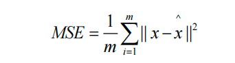

# AutoEncoder

## 概念

> **AutoEncoder（自动编码器）是一种无监督学习算法，`常用于数据降维和特征提取。它由两个主要部分组成：编码器（encoder）和解码器（decoder）`，AutoEncoder的目标是尽可能地重构输入数据。训练过程中，AutoEncoder通过最小化重构误差来学习如何有效地编码和解码数据。这可以`促使模型学习到数据的有用特征，进而实现数据降维和特征提取的功能。`**


### 编码器

> **编码器将输入数据映射到一个潜在表示空间（latent space）或代码的低维表示形式。这种潜在空间通常称为嵌入（Embedding），旨在保留尽可能多的信息，允许解码器以高精度重建数据。如果我们将输入数据表示为x ，将编码器表示为 E，则输出潜在空间s表示为s=E(x) 。**


### 解码器

> **解码器通过接受潜在空间表示s来重建原始输入数据。如果我们将解码器函数表示为D ，将解码器的输出表示为o ，那么我们可以将解码器表示为 o=D(s)。**


### Bottleneck

> **瓶颈层是连接编码器和解码器的中间层，其维度通常比输入和输出的维度要低。这种设计可以强制模型学习到输入数据的更紧凑的表示，提取数据中最关键的特征。因此，瓶颈层起到了降维和抽象的作用，有助于提高模型的表示能力和泛化能力。**
>
> **瓶颈层的存在也可能导致信息丢失或损失，因为它限制了模型对输入数据的表达能力。因此，在设计模型时需要权衡瓶颈层的维度选择，以平衡降维和信息保留之间的关系。**


### AutoEncoder实现MNIST

#### 模型

```python
import torch
from torch import nn
from torchsummary import summary

class AutoEncoder(nn.Module):
    def __init__(self,in_features,lantent_dim=128):
        super(AutoEncoder, self).__init__()

        # encoder: in_features->512->256->lantent_dim
        self.encoder = torch.nn.Sequential(
            torch.nn.Linear(in_features=in_features, out_features=512),
            torch.nn.ReLU(),
            torch.nn.Linear(in_features=512, out_features=256),
            torch.nn.ReLU(),
            torch.nn.Linear(in_features=256, out_features=lantent_dim),
        )
        # decoder: lantent_dim->256->512->in_features
        self.decoder = torch.nn.Sequential(
            torch.nn.Linear(in_features=lantent_dim, out_features=256),
            torch.nn.ReLU(),
            torch.nn.Linear(in_features=256, out_features=512),
            torch.nn.ReLU(),
            torch.nn.Linear(in_features=512, out_features=in_features)
        )

    def forward(self,x):
        # 扁平化为784个神经元
        x = x.view(-1, 784)
        # encoder部分
        x_e = self.encoder(x)
        # decoder部分
        x_d = self.decoder(x_e)
        # 还原为28*28的灰色图像
        return x_d.view(-1,28,28)

if __name__ == '__main__':
    print(summary(AutoEncoder(in_features=784),(28,28),device="cpu"))
```


#### 训练

```python
import time
from argparse import ArgumentParser
import torch
import torchvision
from matplotlib import pyplot as plt
from torch.utils.data import DataLoader
from torchvision.transforms import transforms
from models import AutoEncoder

# 训练
def train(args):
    device = 'cuda' if torch.cuda.is_available() else 'cpu'
    # 预处理
    transform = transforms.Compose([
        transforms.Resize(size=(28, 28)),
        transforms.ToTensor(),
        transforms.Normalize(mean=[0.5], std=[0.5]),
    ])

    # 下载数据集
    train_dataset = torchvision.datasets.FashionMNIST(root=args.TRAIN_DATA, train=True,
                                                     transform=transform, download=True)
    val_dataset = torchvision.datasets.FashionMNIST(root=args.VAL_DATA, train=False,
                                                   transform=transform, download=True)
    # 加载数据集
    train_loader = DataLoader(dataset=train_dataset,batch_size=args.BATCH_SIZE,shuffle=True,num_workers=args.NUM_WORKERS)
    val_loader = DataLoader(dataset=val_dataset,batch_size=args.BATCH_SIZE,shuffle=True,num_workers=args.NUM_WORKERS)

    # 加载模型
    auto_encoder = AutoEncoder(in_features=784).to(device)

    # 定义损失函数和优化器
    loss_fn = torch.nn.MSELoss()
    optimizer= torch.optim.Adam(auto_encoder.parameters(), lr=args.LEARNING_RATE, betas=args.BEATAS)
    # 训练集总loss列表
    train_loss_all = []
    # 验证集总loss列表
    val_loss_all = []
    # 迭代epoch
    for epoch in range(args.NUM_EPOCHS):
        # 保存开始时间
        start = time.time()
        print(f"epoch {epoch}/{args.NUM_EPOCHS - 1}")
        print("-" * 10)
        # 初始化训练集的loss
        train_loss = 0.0
        # 初始化验证集的loss
        val_loss = 0.0
        # 训练过程
        for step, (imgs, _) in enumerate(train_loader):
            # 放入GPU中
            img, _ = imgs.to(device), _.to(device)
            # 将模型设置为训练模式
            auto_encoder.train()
            # 前向传播
            output = auto_encoder(img)
            # 计算损失值
            loss = loss_fn(output, img)
            optimizer.zero_grad()
            loss.backward()
            optimizer.step()
            # 对损失函数累加loss值
            train_loss += loss.item()
        # 验证过程
        for step, (imgs, _) in enumerate(val_loader):
            img, _ = imgs.to(device), _.to(device)
            # 设置模型为评估模式
            auto_encoder.eval()
            # 前向传播
            output = auto_encoder(img)
            # 计算损失值
            loss = loss_fn(output, img)
            # 对损失函数累加loss值
            val_loss += loss.item()

        # 保存每一次epoch迭代的训练集、验证集的loss值、准确率
        train_loss_all.append(train_loss/len(train_loader))
        val_loss_all.append(val_loss/len(val_loader))

        end=time.time()

        # 打印每个epoch列表叠加后的最后一次值
        print("{} Train Loss: {:.4f},use:{:.1f} minutes".format(epoch, train_loss_all[-1],(end-start)/60))
        print("{} Val Loss: {:.4f},use:{:.1f} minutes".format(epoch, val_loss_all[-1],(end-start)/60))

    plt.plot(range(1, args.NUM_EPOCHS+1), train_loss_all, label='train_loss',color="red")
    plt.legend()
    plt.plot(range(1, args.NUM_EPOCHS + 1), val_loss_all, label='val_loss',color="blue")
    plt.legend()
    plt.title('AE-LOSS')
    plt.show()


if __name__ == '__main__':
    parser = ArgumentParser()
    # 形参名以--xx开头
    parser.add_argument("--BATCH_SIZE", default=128)
    parser.add_argument("--LEARNING_RATE",default=0.001)
    parser.add_argument("--NUM_EPOCHS",default=20)
    parser.add_argument("--BEATAS",default=(0.5,0.999))
    parser.add_argument("--TRAIN_DATA",default="./data")
    parser.add_argument("--VAL_DATA",default="./data")
    parser.add_argument("--NUM_WORKERS",default=8)
    # 解析命令行参数
    args, _ = parser.parse_known_args()
    # 训练
    train(args)
```


#### 20轮效果


## Denoising AutoEncoder

> **去噪自动编码器：在输入数据上添加一个高斯噪声，使模型重构原始的数据，学习数据真正的分布，而目标仍然是原始的、未损坏的数据。自动编码器学习从噪声输入中重建干净的数据，使其可用于图像去噪和数据预处理任务。**


### 实现

> **同AutoEncoder的代码，只是在训练和验证阶段需要将原始图片加上高斯噪声后传入模型中**


## Dropout AutoEncoder

> **在传统的自编码器中，编码器将输入数据映射到一个较低维度的隐藏表示，然后解码器将隐藏表示映射回重构的输入数据。而在Dropout AutoEncoder中，我们在编码器和解码器的过程中应用dropout操作。**


### 实现

> **同AutoEncoder的代码，只是在encoder和decoder中加入了dropout操作**


## Variational AutoEncoder

> **VAE的核心思想：编码器将输入数据映射到潜在空间Z中，并且通常将这个潜在空间建模为一个高斯分布N(μ, σ^2)。这个分布的均值μ和方差σ是由编码器输出的，通过 z = μ + σ ∗ ε 将一个标准正态分布的噪声ε通过线性变换和非线性变换映射到了高斯分布 N(μ, σ^2) 上 ，然后从潜在空间中采样多个 z，并通过解码器将其映射为重构输出 x'，我们可以得到一组重构样本，从而近似地反映出输入数据 x 的分布特征。**


### 后验分布

> **在VAE中，后验分布是通过编码器网络（Encoder）计算得到的。它将输入数据映射到潜在空间的均值和方差参数，从而定义了一个多元正态分布。这个多元正态分布描述了给定观测数据后，潜在变量的不确定性。**


### 如何采样

> **正态分布的线性性质：如果 X ~ N(μ~1~, σ~1~^2^) ， Y ~ N(μ~2~, σ~2~^2^)，则 aX + bY ~ N(aμ~1~ + bμ~2~ ,  a^2^σ~1~^2^ + b^2^ σ~2~^2^)，其中 a 和 b 是常数**

* μ：后验分布得到的均值
* σ：后验分布得到的方差
* n：先验分布得到的标准正态分布

```python
# 省略上面部分：获取encoder中的均值与方差
μ, σ = torch.split(stats, self.out_channels, dim=1)
# 先验分布：标准正态分布，生成了一个N(0, 1)的正态分布
n=torch.randn_like(μ)

# 重参数化采样技巧: 得到(μ, σ^2)的正态分布
 z = μ + n *σ
```

**注意：这里`n*σ`得到的是`N(0, σ^2)` 的标准正态分布（其中`σ~N(0,σ^2) ，n~N(0,1)`），最后加上 `μ`得到的张量就是 `N(μ,σ^2) `的正态分布** 


### 重参数化


* 在 VAE 中，Encoder生成的潜在表示是一个概率分布，然后再从这个概率分布中进行随机采样，通过Decoder生成数据，这个随机采样操作本身是不可导的，也就不能进行反向传播和梯度下降等优化方法来更新参数。
* **为了解决这个问题，重参数化技术被引入，具体来说，对于VAE模型，编码器网络会输出两个参数，一个表示均值μ ，另一个表示标准差σ 。然后从标准正态分布中随机采样一个噪声值 ε 。然后通过 z = μ + σ ∗ ε  将采样操作转为了一个可微的函数，这样也就使得从潜在分布中采样的过程成为可导的操作，允许梯度通过这个操作传播回编码器，进而进行模型参数的优化。**


### 损失函数

#### KL loss

> **KL损失促使潜在分布接近预设的先验分布（即标准正态分布）**


```
如果复杂分布P(x)是一个具有均值μ和方差σ²的分布，而高斯分布Q(x)的均值为μ₀和方差为σ₀²
则KL(P || Q) = -0.5 * (1 + log(σ₀² / σ²) - (μ - μ₀)² / σ₀² + σ² / σ₀²)
```


#### Reconstruction loss 

> **让 decoder 的输出X_hat 和输入X 尽可能相似**




#### 总损失ELBO

