# Flow

## 概念

### 行列式在向量中的意义

* **二维：若存在向量(a，b)，(c，d)则它们的行列式的值代表二维空间中的面积**
* **三维：若存在向量(a1，a2，a3)，(a4，a5，a6)，（a7，a8，a9）则它们的行列式的值代表构成的三维空间的体积**

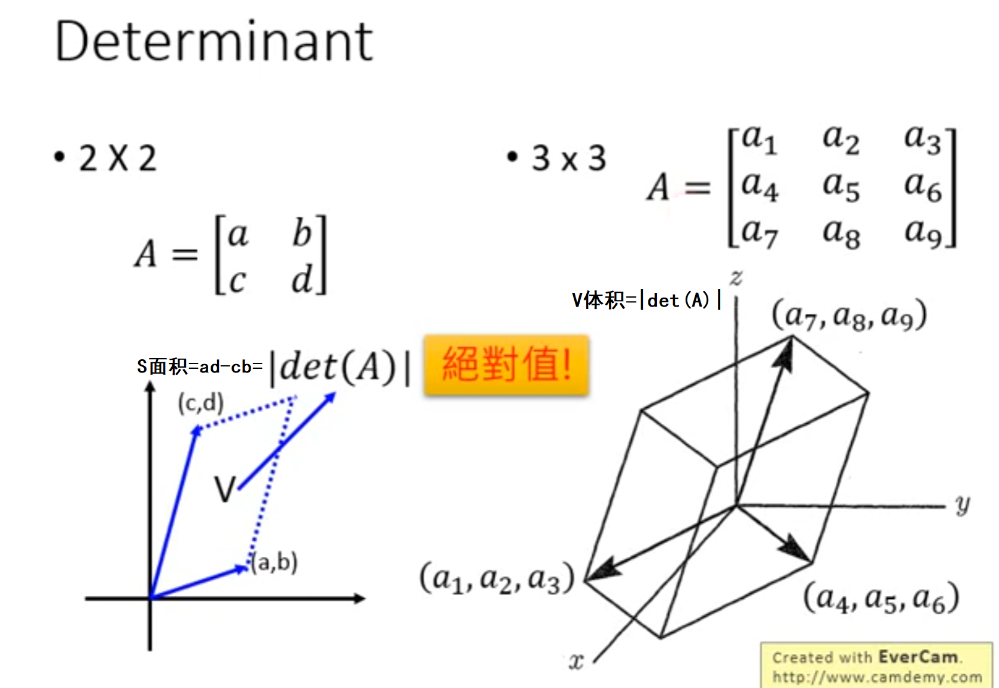


### 建模思想

> ​		**给定两组数据z和x，其中z服从已知的简单先验分布π(z)（通常是高斯分布），x服从复杂的分布p(x)（即训练数据代表的分布），现在需要找到一个变换函数f，它能建立一种z到x的映射f。**
>
> ​		**如果这个变换函数能找到的话，那么就实现了一个生成模型的构造。如果想要有新的生成，只需要从π(z)中随机采样一个点，然后通过映射f，就可以得到新的样本点x。**


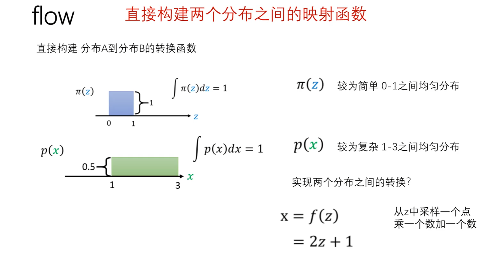


### 复杂分布

> **要将蓝色方块分布转换为绿色方块分布，前提必须保证蓝色方块和绿色方块面积一样**

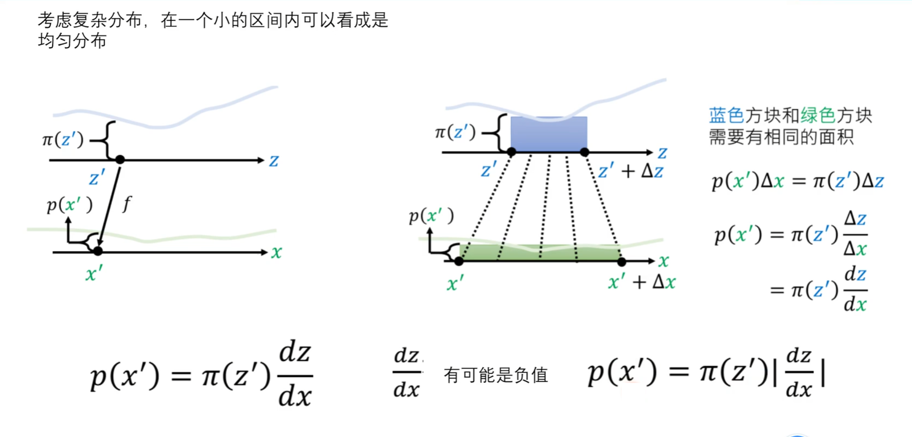


### 在高维下的转换

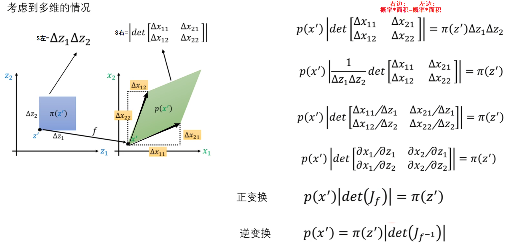


> **即 P(x')|Jf|=π(z')是从z'分布映射到x'分布**


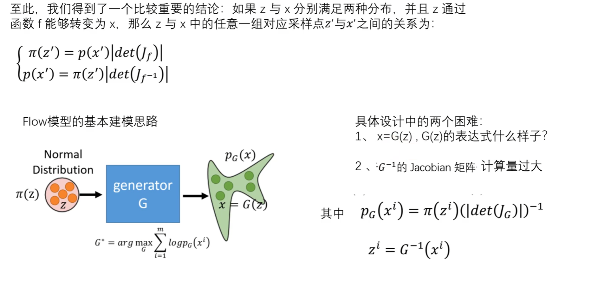


### 训练过程

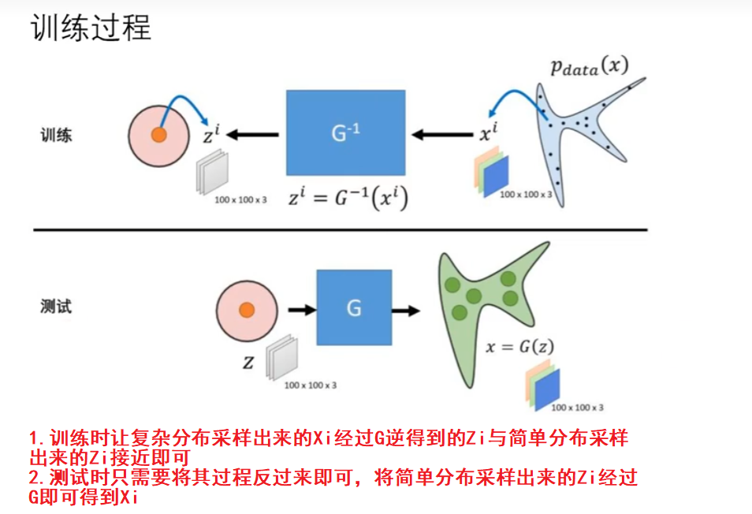


### 内部结构

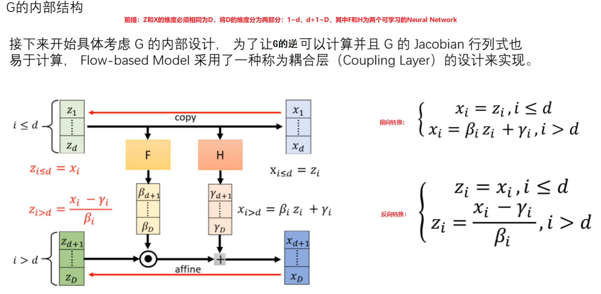


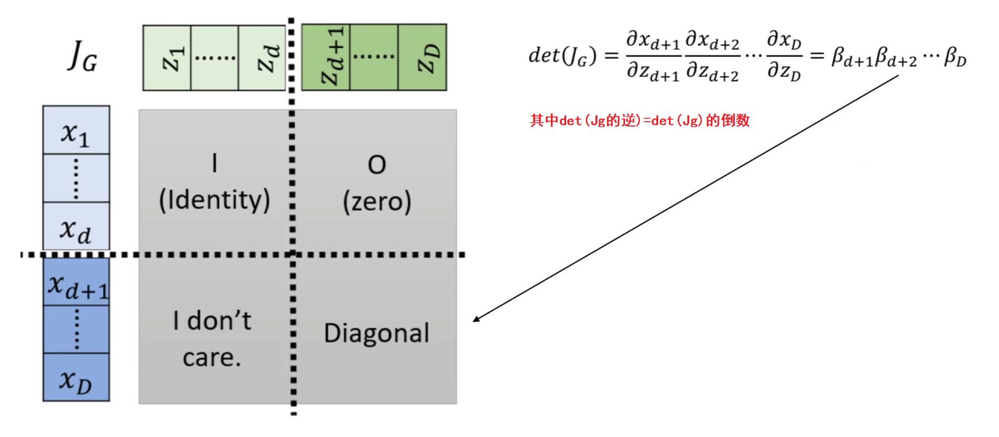


### 最终结构（重点）

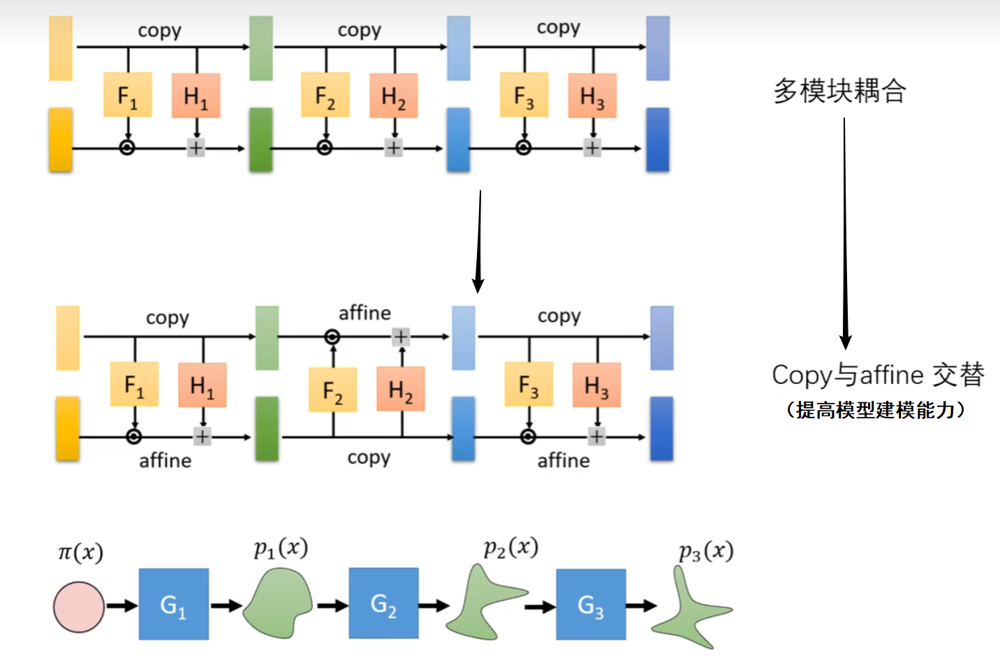


## Coupling Layers

> **Coupling Layers 是流式模型中的一种变换层，是 RealNVP 和 Glow中广泛使用的结构，用于实现可逆变换和复杂数据分布的建模，用于对输入数据进行仿射变换。**
>
> **基本思想是将输入数据分成两部分，一部分保持不变，另一部分则在前一部分的条件下进行变换。这种设计确保了变换的可逆性，即可以从输出数据精确地恢复原始输入数据。**


### Coupling Layer的两个组成部分

==**前提要求：归一化流模型需要保持变换的可逆性，以便能够从变换后的数据中恢复原始数据。这要求每个变换都具有明确的反向变换。**==

* 分割：将输入数据分成两部分（如X1和X2），其中一部分决定如何变换另一部分，**通过这种分割，可以对数据进行局部化处理，使得模型能够学习到更细致的数据特征和变化。**
* 条件变换：使用一部分数据（如 X1）来生成变换参数（如 shift 和 scale），然后对另一部分数据（如 X2）进行变换。**这使得变换过程是可逆的。我们可以从变换后的数据中恢复出原始数据，这对生成模型和密度估计尤其重要。**


### 正向变换

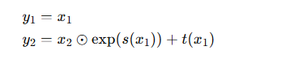 


### 反向变换

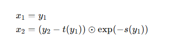 

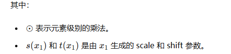 

> **注意：其中的s( · )和t( · )可以采用复杂的neural network来增加转换的复杂性，使得模型能够学习复杂的数据分布并保持变换的可逆性。**


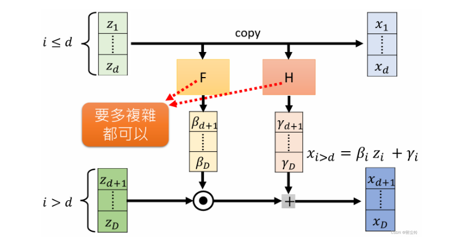


### Coupling Layer生成Mnist

#### 仿射变换层

> **logs_flow等同于F后得到的参数， m_flow等同于H后得到的参数，只是这里F和H是同一个Neural Network（代码中 self.enc + self.post的部分，这里为了方便起见，将它们写在一起 ）并不是两个复杂的Neural Network**

```PYTHON
import torch
import torch.nn as nn
import torch.optim as optim
import torchvision
import torchvision.transforms as transforms
import torchvision.utils as vutils
import os

class CouplingLayer(nn.Module):
    def __init__(self, channels, hidden_channels):
        super().__init__()
        self.pre = nn.Linear(channels // 2, hidden_channels)
        
        self.enc = nn.Sequential(
            nn.Linear(hidden_channels, hidden_channels),
            nn.ReLU(),
            nn.Linear(hidden_channels, hidden_channels)
        )
        self.post = nn.Linear(hidden_channels, channels)

    def forward(self, x, reverse=False):
        # 将输入维度channels=128分成两半,第一半是X0,第二半是X1
        x0, x1 = torch.split(x, x.size(1) // 2, dim=1)
        if not reverse:
            # 将前一半维度64投影到256的维度
            h = self.pre(x0)
            # 编码操作,维度不变
            h = self.enc(h)
            # 将维度从256将为128
            stats = self.post(h)
            # 将128投影回原始通道数64
            # m_flow、logs_flow是由X0决定的,可以通过训练来学习这些变换参数。可以让模型能够根据输入数据的不同自动调整变换方式。
            m_flow, logs_flow = torch.chunk(stats, 2, dim=1)
            # 利用X0的结果对x1进行仿射变换,flow的数学公式
            x1 = m_flow + x1 * torch.exp(logs_flow)
        # 推理的时候
        else:
            h = self.pre(x0)
            h = self.enc(h)
            stats = self.post(h)
            m_flow, logs_flow = torch.chunk(stats, 2, dim=1)
            # 同样的仿射变换逆变换
            x1 = (x1 - m_flow) * torch.exp(-logs_flow)
        x = torch.cat([x0, x1], dim=1)
        return x
```


#### Flow模型结构

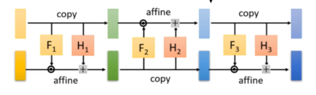

```python
class Flip(nn.Module):
    def forward(self, x,reverse=False):
        # 将维度的前一半和后一半进行交换,组成couping affine
        x0, x1 = torch.split(x, x.size(1) // 2, dim=1)
        x = torch.cat([x1, x0], dim=1)
        return x

class Flow(nn.Module):
    def __init__(self, channels, hidden_channels, n_flows=4):
        super().__init__()
        self.flows = nn.ModuleList()
        for i in range(n_flows):
            self.flows.append(CouplingLayer(channels, hidden_channels))
            self.flows.append(Flip())

    def forward(self, x, reverse=False):
        if reverse:
            for flow in reversed(self.flows):
                x = flow(x, reverse=reverse)
        else:
            for flow in self.flows:
                x = flow(x, reverse=reverse)
        return x
```


#### 整体模型

```python
class Autoencoder(nn.Module):
    def __init__(self):
        super(Autoencoder, self).__init__()
        self.encoder = nn.Sequential(
            nn.Conv2d(1, 32, kernel_size=4, stride=2, padding=1),  #  32x14x14
            nn.ReLU(),
            nn.Conv2d(32, 64, kernel_size=4, stride=2, padding=1),  #  64x7x7
            nn.ReLU(),
            nn.Flatten(),
            nn.Linear(64 * 7 * 7, 128),  # Latent vector
            nn.ReLU()
        )
        
        self.flow = Flow(channels=128, hidden_channels=256,n_flows=4)
        
        self.decoder = nn.Sequential(
            nn.Linear(128, 64 * 7 * 7),
            nn.ReLU(),
            nn.Unflatten(1, (64, 7, 7)),
            nn.ConvTranspose2d(64, 32, kernel_size=4, stride=2, padding=1),  #  32x14x14
            nn.ReLU(),
            nn.ConvTranspose2d(32, 1, kernel_size=4, stride=2, padding=1),  #   1x28x28
            nn.Sigmoid()
        )

    def forward(self, x):
        x = self.encoder(x)
        x = self.flow(x)
        x = self.decoder(x)
        return x
```


#### 训练代码

```python
def train_autoencoder(model, dataloader, num_epochs=10, lr=1e-3):
    criterion = nn.MSELoss()
    optimizer = optim.Adam(model.parameters(), lr=lr)
    model.train()
    for epoch in range(num_epochs):
        for data in dataloader:
            inputs, _ = data
            optimizer.zero_grad()
            outputs = model(inputs)
            loss = criterion(outputs, inputs)
            loss.backward()
            optimizer.step()

        print(f'Epoch [{epoch + 1}/{num_epochs}], Loss: {loss.item():.4f}')
        evaluate_autoencoder(model, dataloader, output_dir='output_images', epoch=epoch)

def evaluate_autoencoder(model, dataloader, output_dir='output_images', epoch=None):
    if not os.path.exists(output_dir):
        os.makedirs(output_dir)

    model.eval()
    with torch.no_grad():
        for i, (inputs, _) in enumerate(dataloader):
            outputs = model(inputs)
            if i == 0:
                input_grid = vutils.make_grid(inputs, nrow=8, normalize=True)
                output_grid = vutils.make_grid(outputs, nrow=8, normalize=True)

                if epoch is not None:
                    vutils.save_image(input_grid, os.path.join(output_dir, f'inputs_epoch_{epoch + 1}.png'))
                    vutils.save_image(output_grid, os.path.join(output_dir, f'reconstructions_epoch_{epoch + 1}.png'))
                else:
                    vutils.save_image(input_grid, os.path.join(output_dir, 'inputs.png'))
                    vutils.save_image(output_grid, os.path.join(output_dir, 'reconstructions.png'))
                break

transform = transforms.Compose([transforms.ToTensor()])
mnist_dataset = torchvision.datasets.MNIST(root='mnist_data', train=True, download=True, transform=transform)
dataloader = torch.utils.data.DataLoader(mnist_dataset, batch_size=64, shuffle=True)

model = Autoencoder()
train_autoencoder(model, dataloader, num_epochs=10)
```


#### 生成效果

> **上为真实图片，下为生成的效果**

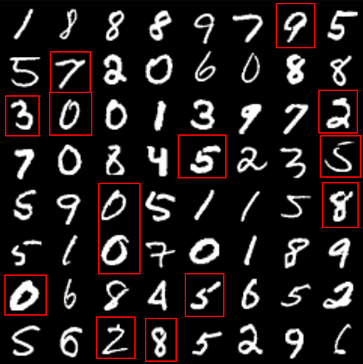 

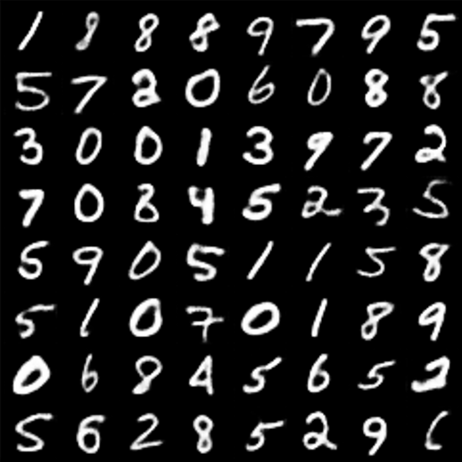 