# CNN卷积神经网络

## 激活函数

> **为什么要加入激活函数？**

​			因为神经网络每一层都是由多个神经元构成的。这些神经元通过计算输入与权重的乘积之和得到一个输出值，然后将其传递给下一层或作为输出。如果没有激活函数，无论构造神经网络多么复杂，最后的输出都是输入的线性组合，即输入和输出之间的关系是简单的比例关系，纯粹的线性组合并不能够解决更为复杂的问题。

​			引入激活函数（非线性的）可以将神经元的输出进行非线性变换，使其具有更好的表达能力，神经元的输出不再是简单的线性函数，而是一种非线性函数，可以更好地拟合复杂的输入与输出之间的映射关系，提高神经网络的表达能力和学习效果，使得神经网络应用到更多非线性模型中。


### Sigmoid

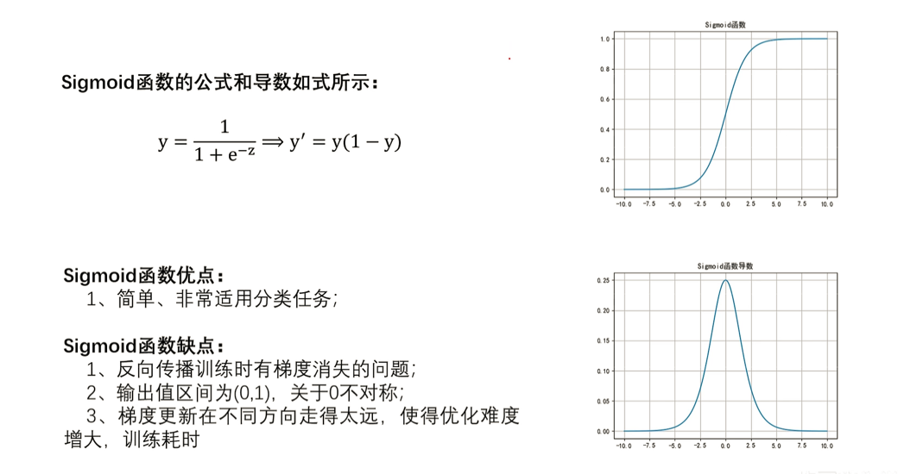


### Tanh

> **输出值在[-1，1]之间**

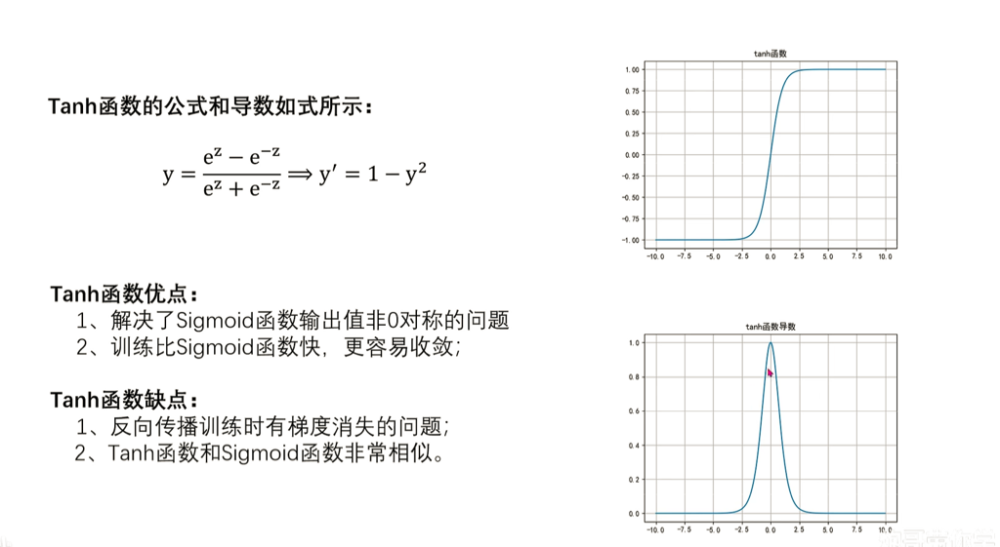


### Relu

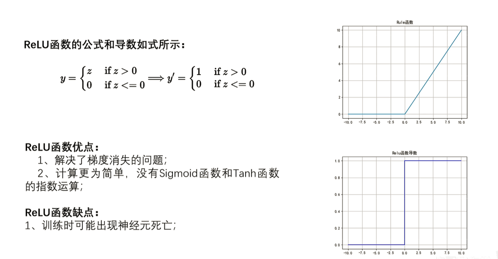


### Leaky Relu

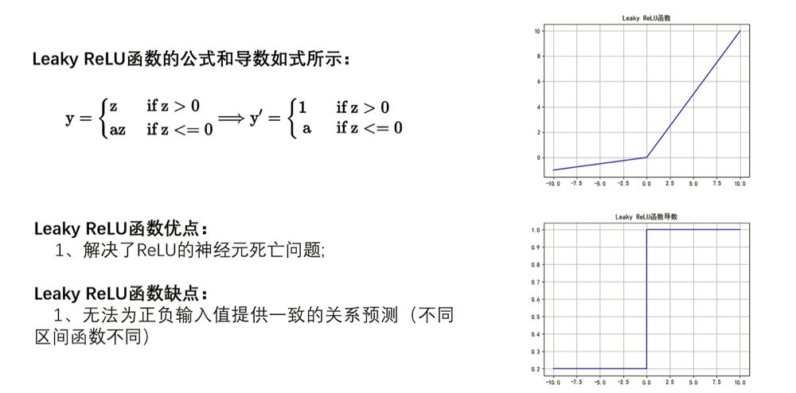


### PReLU

> **不同在于系数 a 是需要学习的参数，负责控制负半轴的斜率。若学得的 a=0 ，那么 PReLU 退化为 ReLU；若学得的 a是一个很小的固定值(如 a=0.01 )，则 PReLU退化为 Leaky ReLU。**

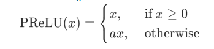 

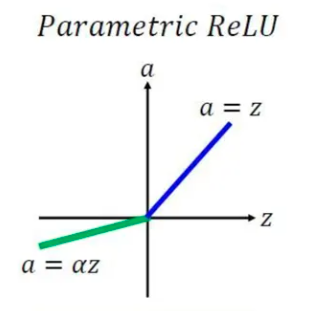 


## 前向传播

> **从输入层到输出层的信号传递过程。在这个过程中，神经网络接收输入数据，对输入数据进行多次加权求和、激活函数处理，并将处理得到的结果传递给下一层，最终得到神经网络的输出。在训练神经网络时，前向传播是计算损失函数的必要步骤，而反向传播则是根据损失函数来更新网络参数**

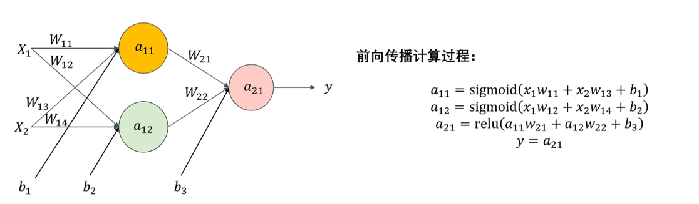

**注意：前向传播的输出层所使用的激活函数根据具体情况来决定：回归问题可以采用恒等函数进行输出，二分类问题采用sigmoid函数进行输出，多分类问题采用softmax函数进行输出**


## Batch Normalization

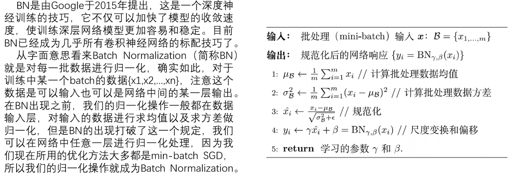

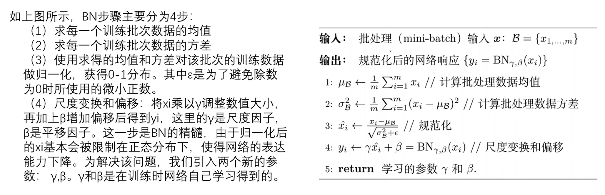

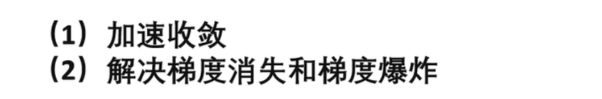


### 详解

* **BN层的作用是把一个mini-batch内的所有数据，从不规范的分布拉到正态分布。这样做的好处是使得数据能够分布在激活函数的梯度较大的区域，因此也提高了泛化能力，可以在一定程度上解决梯度消失的问题，同时可以减少dropout的使用。**
* **BN层还可以理解为对不同数据的每个同一特征（同一维度）下计算均值与方差。在BN层中，对于每个特征通道，会计算出该批次中所有样本在该特征通道上的均值和方差。然后，将均值和方差应用于该批次中的每个样本，将其标准化为零均值和单位方差。**

>  **eg：假设有128批次的图片，经过一个conv后变为5x64x64，即有5个通道（5个特征图，每个特征图大小为64x64），那么128个批次对应为128x5x64x64，经过bn层，将这128个批次的图片的分别在每个特征图下计算均值与方差**


## Dropout

> **网络在训练期间按一定的概率随机关闭神经元（失活），减少过拟合，提高模型泛化能力**

（1）首先随机（临时）删掉网络中一半的隐藏神经元，输入输出神经元保持不变

（2） 然后把输入x通过修改后的网络前向传播，然后把得到的损失结果通过修改的网络反向传播。一小批训练样本执行完这个过程后，在没有被删除的神经元上按照随机梯度下降法更新对应的参数（w，b）。

（3）重复这一过程。

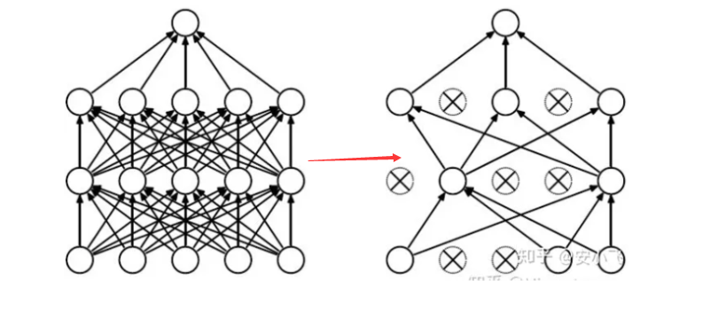

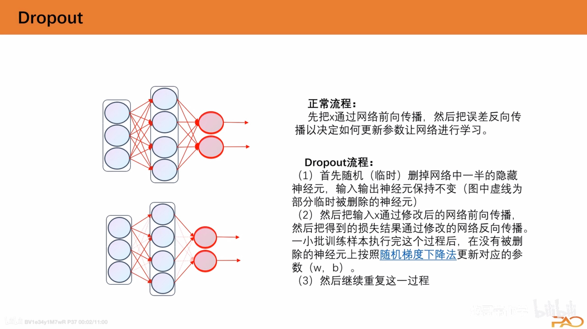

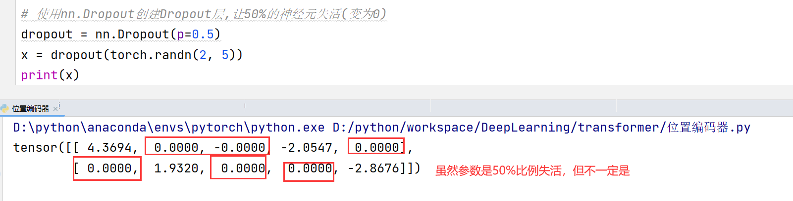


## 损失函数

> **`衡量模型预测结果(正向传播)与真实结果(目标值)之间的误差,损失函数的目标是最小化这个误差。`**

​			**通过定义损失函数，可以使用优化算法来反向传播更新模型的参数，使其损失达到最小化。**

* **对于分类问题，常用的损失函数包括交叉熵损失函数（cross-entropy loss）**
* **对于回归问题，常见的损失函数包括均方误差损失函数（mean squared error）等。**


### L1损失

> **L1 损失是通过计算预测值与真实值之间的绝对差来衡量预测误差。**

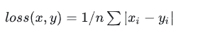


### L2损失：均方误差

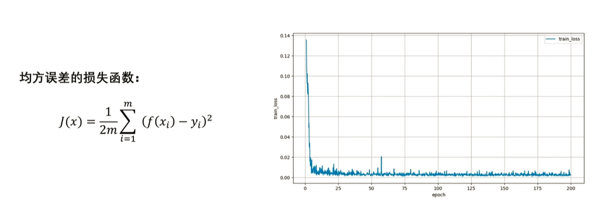

**注意：前面的二分之一是为了抵消求导之后的系数，也可以不要，回归问题中使用均方误差作为评价指标是非常常见的**


### **交叉熵损失函数**

> **它主要刻画的是实际输出（概率）与期望输出（概率）的距离，适用于分类问题。它衡量了模型预测结果与真实标签之间的差异。**

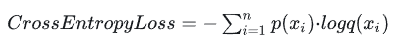


## 反向传播

### 梯度下降法

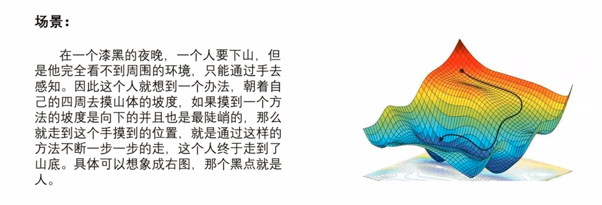


**eg：以均方误差损失函数为例**

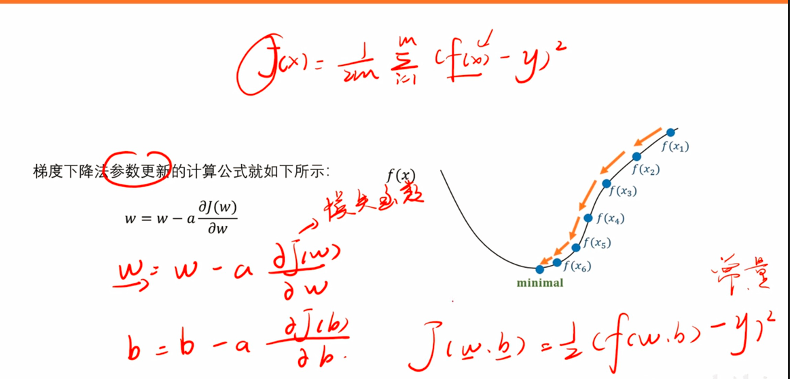


### 反向传播案例

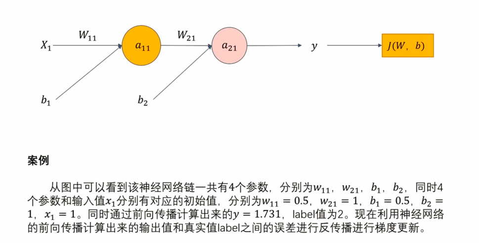

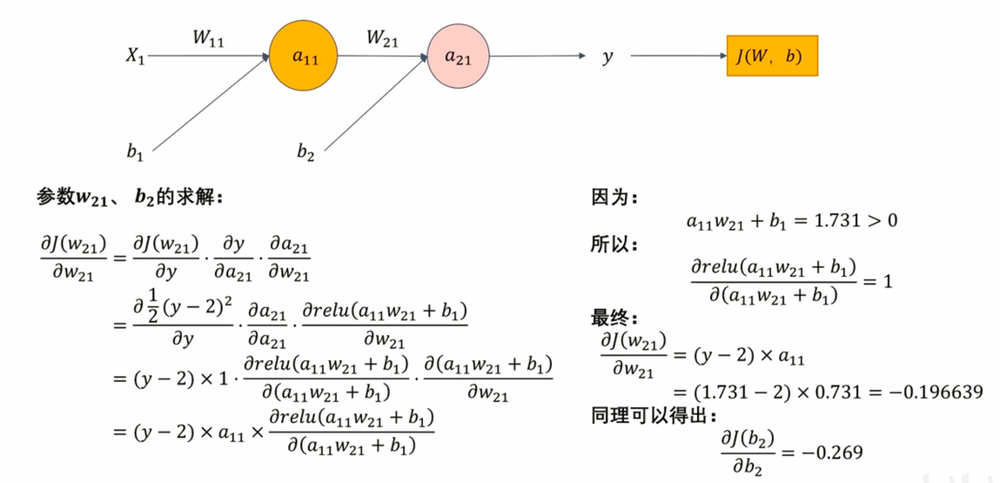

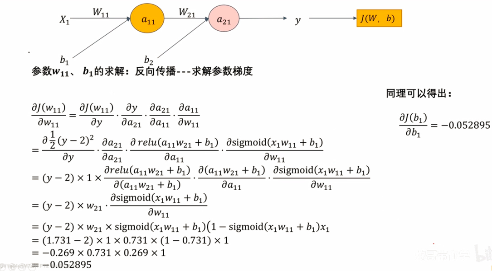

> **注意：详细激活函数见`前向传播`章节的图片**


#### **具体细节**

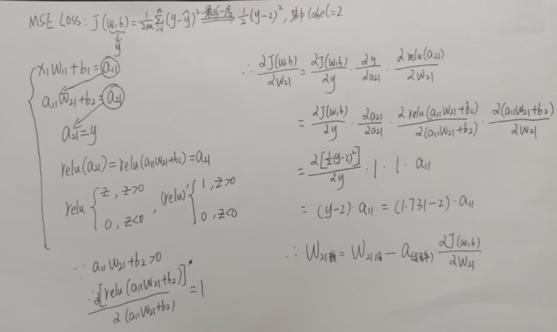


## **训练整体过程**

> **前向传播→计算误差→反向传播，更新W和B**


## Convolutions

### 概念

kernel=filter：卷积核、过滤器，**也被称为权重（weights），通常表示为w**。**提取图像的局部特征，生成一个个神经元**；卷积核越大，感受野越大，看到的图片信息越多，所获得的全局特征越好，但计算性能降低。

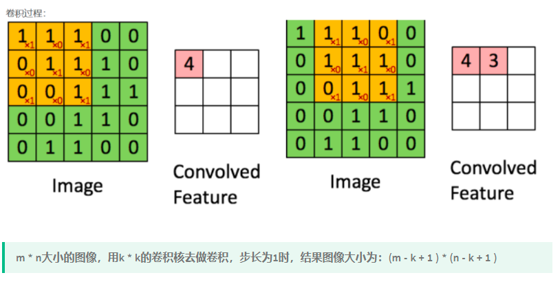


### 垂直边缘检测理解

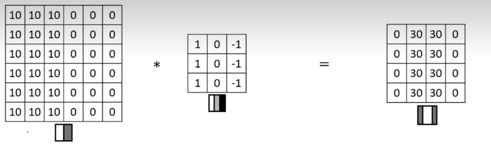

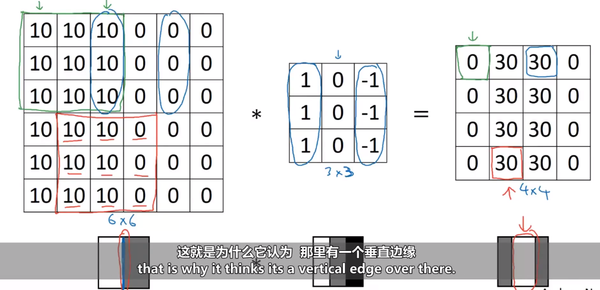


>  **给出3×3卷积核，试图找出中间的垂直边缘，卷积核左边列对应是6×6的亮像素部分，右边列对应暗像素部分，不需要关注中间有什么，卷积的最终结果就可以找到图像的垂直边缘**


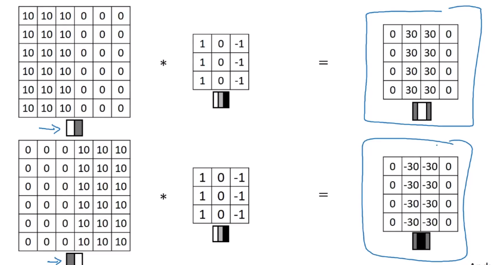

> **若用相同的kernel对左右亮度交换后的6×6图像进行垂直边缘探测，探测出来的垂直边缘结果会比之前的更暗**


```
推广：

	若想要找到它的水平边缘，则可以采用以下卷积核
	[[1,1,1]
	 [0,0,0]
	 [-1,-1,-1]]

将检测垂直边缘的kernel转置可以检测出水平边缘
```


### kernel值的选择

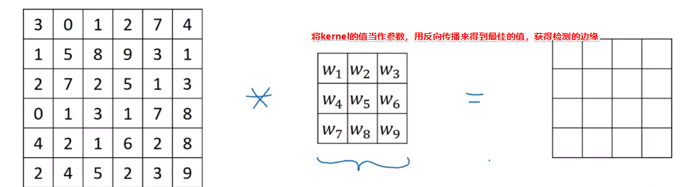

> **为了更好的得到优良的边界探测器，可以通过反向传播的方式，从数据中自动学习得到最佳的值**


### padding

**<font color="red">注意：卷积是有缺陷的：1.每次卷积图像都会缩小为( n − f + 1 ) × ( n − f + 1 ) 的尺寸；2.卷积对于图像边角像素的利用不够，丢失了图像边缘的信息</font>**

> **假设需要卷积多次，则最终图像的尺寸将会很小，为了解决上诉问题，可以在卷积操作之前填充边界，在原图片矩阵的周围填充元素0，卷积后的尺寸和原尺寸保持一致**


* **Valid  convolutions：不进行填充，卷积后图片尺寸变为（n-f+1）*（n-f+1）**

* **Same convolution：`填充p=(f-1)/2（f为卷积核维数，潜在要求就是f是奇数）`，卷积后图片尺寸和原来一样变为（n+2p-f+1）*（n+2p-f+1）**

  ```
  eg：6*6图像用3*3的kernel卷积
  	p=（3-1）/2=1，即在6*6图像外增加一圈0变为8*8的图像
  	最后输出图像大小为（6+2*1-3+1）*（6+2*1-3+1）=6*6
  ```

  


### Strided Convolutions

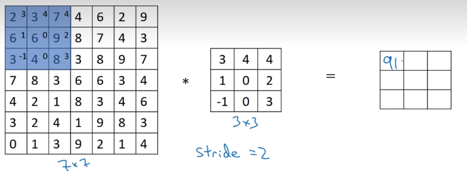 

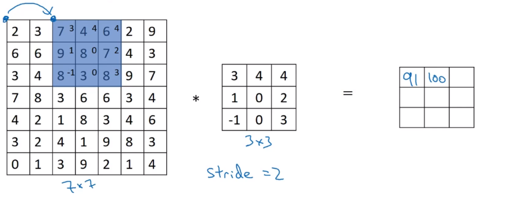 

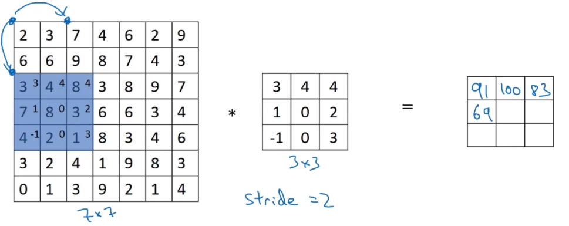 

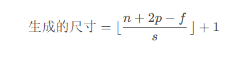

**注意：其中s代表步长，并向下取整**


### 3D Convolution

> **3D*3D=2D，即最后卷积后的结果为2D；kernel的通道（channel）要与其所过滤的图片通道在数量上保持一致**

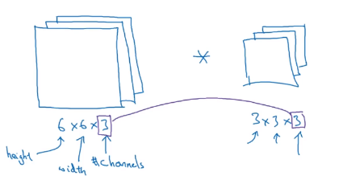 

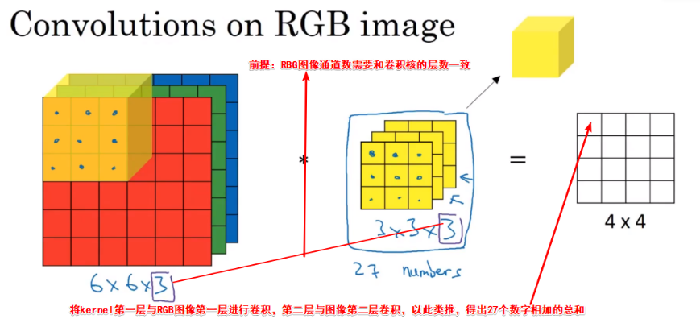

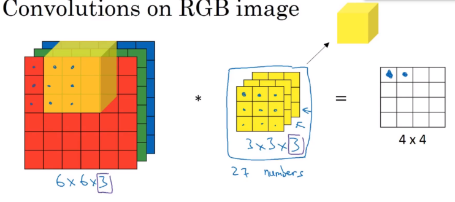


**注意：如果想要获取红色通道的边缘，则可以在第一层的kernel设置对应的值，绿色、蓝色通道的kernel值全为0；相反，如果想获取RGB三通道的所有边缘，则可以将这三层的kernel值都设为对应的边缘检测值，如下所示**

```
只检测红色通道边缘的kernel:
	[[1,0,-1]	[[0,0,0]	[[0,0,0]
	[1,0,-1]	[0,0,0]		[0,0,0]
	[1,0,-1]]	[0,0,0]]	[0,0,0]]

检测RGB边缘的kernel:
	[[1,0,-1]	[[1,0,-1]	[[1,0,-1]
	[1,0,-1]	[1,0,-1]	[1,0,-1]
	[1,0,-1]]	[1,0,-1]]	[1,0,-1]]
```


### 膨胀(空洞)卷积

> **`在卷积核中间插入0，然后扩大卷积核`，保持参数个数不变的情况下`增大了卷积核的感受野，让每个卷积输出都包含较大范围的信息；同时它可以保证输出的特征映射（feature map）的大小保持不变`。一个扩张率为2的3×3卷积核，感受野与5×5的卷积核相同，但参数数量仅为9个，是5×5卷积参数数量的36%。**

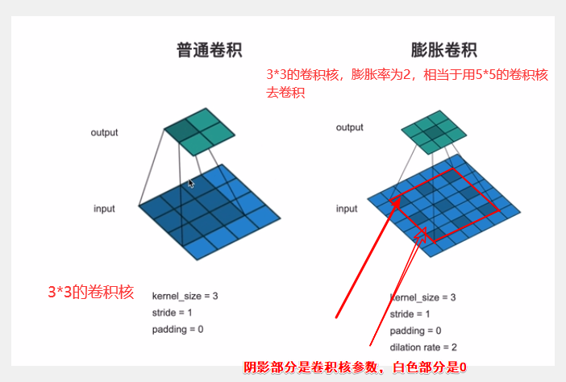

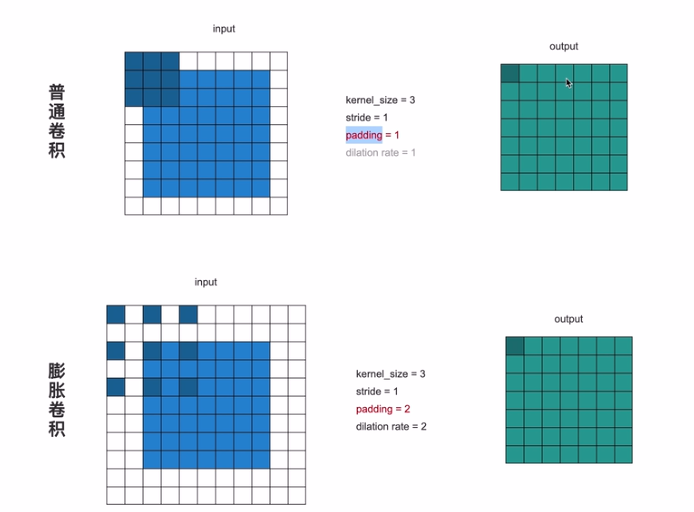


**感受野：d\*f + (d-1)**

**(a) 普通卷积：1-dilated convolution，卷积核的感受野为3×3=9，1*3+0**

**(b) 膨胀卷积：2-dilated convolution，卷积核的感受野为7×7=49，2*3+1**

**`输出大小 = （输入大小 + 2 * padding - dilation * (kernel_size - 1) - 1）/ stride + 1`**


#### 缺点：网格效应

> **由于膨胀卷积是一种稀疏的采样方式，当多个膨胀卷积叠加使用后，有些像素点根本没有被利用到，会损失信息的连续性和相关性，进而影响分割、检测等要求较高的任务**

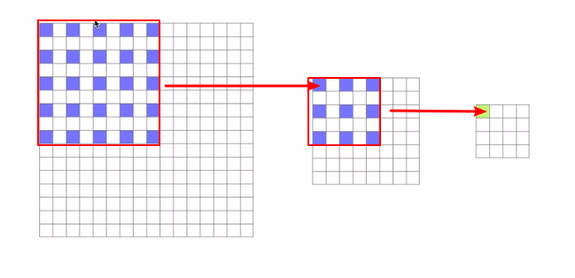


#### 膨胀卷积与padding

> **如果想要输出大小与原图像一样，则需要通过下面代码获取padding值**

```python
def get_padding(kernel_size, dilation=1):
    return int((kernel_size*dilation - dilation)/2)
```


### 转置卷积

> **一种上采样upsampling过程，可以还原图像的大小形状，但是不能够完全恢复原来的像素值**


#### 计算公式

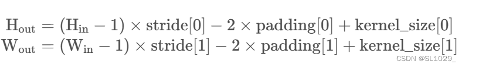


### Multiple Filters

> **可以有N个过滤器进行过滤，最后将结果整合到一起输出N维的结果**

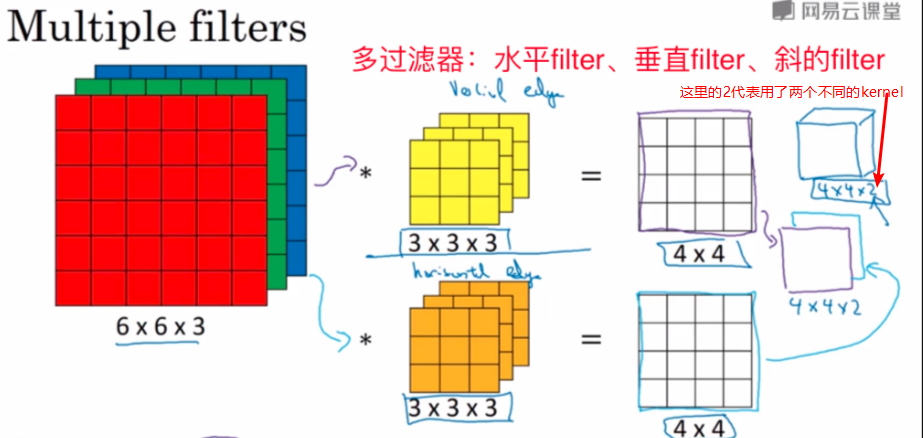


**最终生成结果：**

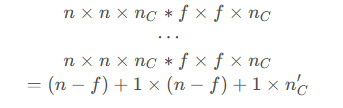

其中：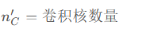 

> **这里使用了两个卷积核分别提取垂直边缘和水平边缘的特征**


### 单层卷积网络

> **神经网络：由多个层次组成的，其中包括卷积层（conv）、池化层（pool）、全连接层（FC）等。卷积层是神经网络的核心部分，它使用多个卷积核来提取输入数据的不同特征。这些卷积核通过卷积操作对输入进行滤波，从而得到不同的特征图。整个网络的输出是由这些特征图经过一系列层次处理后得到的**

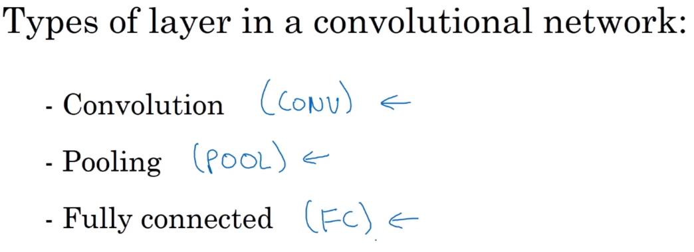


#### **单层卷积示例**

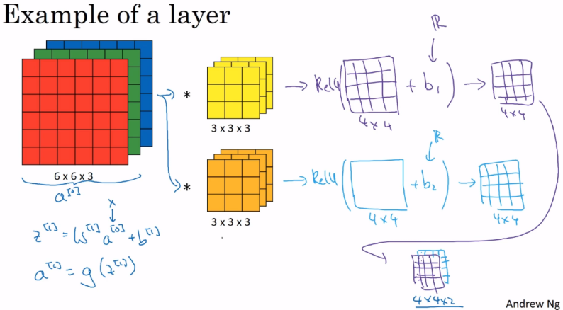

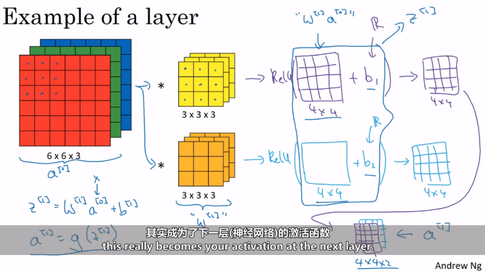

**a[0]到a[1]的步骤**

1. 整张图片的输入（**a[0]**）与kernel（**w[1]**）进行线性计算再进行卷积，得到第一个输出结果4×4（**w[1]*a[0]**）
2. 再添加偏差**b1**，得到**z[1]**
3. 通过非线性转换ReLU操作，得到第二个输出结果4×4；
4. 将两个4×4矩阵放在一起得到4×4×2**（a[1]）**，成为下一层神经网络的激活函数


#### 单层卷积网络

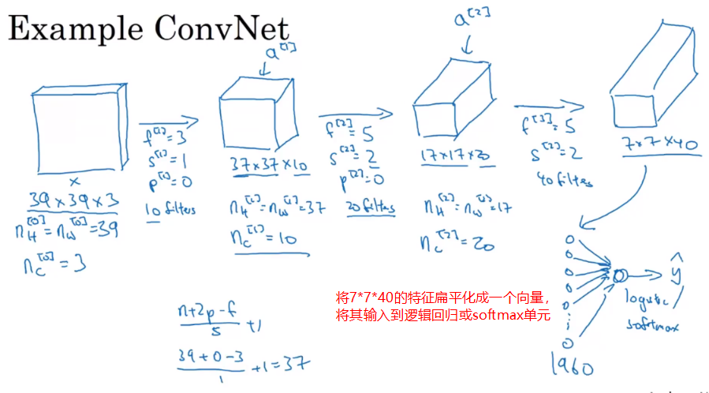


### 标记符号

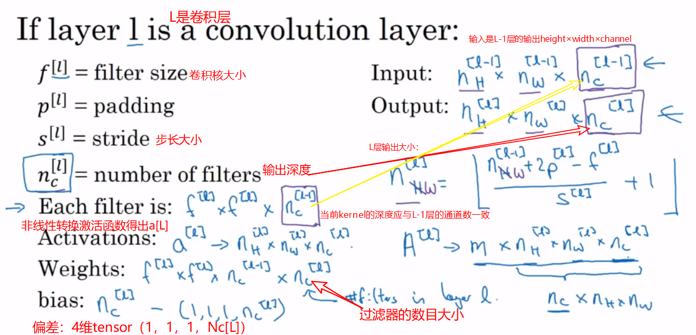


### Conv1d与Conv2D的区别

1. **维度：`Conv1d` 是一维卷积层，用于处理一维输入数据，例如文本序列；而 `Conv2d` 是二维卷积层，用于处理二维输入数据，例如图像。**
2. **输入形状：`Conv1d` 的输入张量形状为 `(batch_size, in_channels, input_length)`，而 `Conv2d` 的输入张量形状为 `(batch_size, in_channels, height, width)`**
3. 卷积核形状：在 `Conv1d` 中，卷积核是一维的，形状为 `(out_channels, in_channels, kernel_size)`，在 `Conv2d` 中，卷积核是二维的，形状为 `(out_channels, in_channels, kernel_height, kernel_width)`
4. **输出形状：`Conv1d` 的输出张量形状为 `(batch_size, out_channels, output_length)`，其中 `output_length` 取决于输入序列的长度、卷积核大小和填充方式。`Conv2d` 的输出张量形状为 `(batch_size, out_channels, output_height, output_width)`，其中 `output_height` 和 `output_width` 取决于输入图像的大小、卷积核大小和填充方式。**


#### Conv1D计算公式

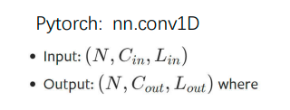 

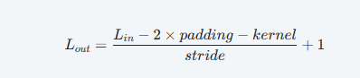


## Pooling

> **ConvNets通常还用池化层来减少展示量（宽度、高度），提高计算速度，并使一些特征的检测功能更强大**

**超参数：没有可以学习的参数，超参数只需设置一次**

1. **f和s，常用的是<2,2>，`效果是缩小一半尺寸`，以及<3,2>**
2. **很少用p，因为本来就是缩小尺寸的**
3. **池化方式，比如max-pooling和average-pooling**


### **Max-Pooling（常用）**

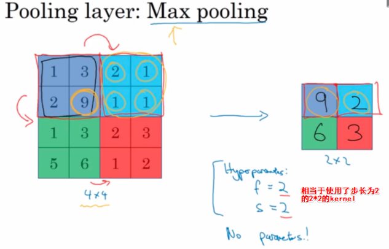

**原理：检测所有地方的特征，将四个特征中大的特征保留到max pooling的输出中，如果没有提取到某个特征，那么其中的最大值也还是很小**


### **Average-Pooling**

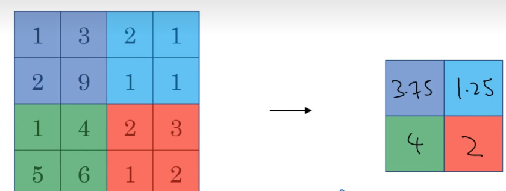

**原理：检测所有地方的特征，将四个特征中的平均值保留到输出中，`多用于深卷积层网络`**


## Fully Connected

> **官方术语：全连接层是把卷积层学到的特征空间映射到样本标记空间，全连接层的参数也是最多的。**

> **通俗术语：指的是每一个结点都与上一层的所有结点相连（示意图如下图所示），用来把前面几层提取到的特征综合起来，`可以完成特征的进一步融合。使得神经网络最终看到的特征是个全局特征`**

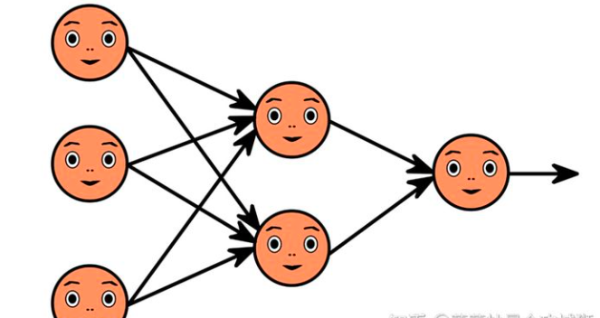

### 理解

​		**卷积是完成图像的局部特征提取，还是无法根据提取的一堆特征来完成图像的识别。因为卷积层提取出来的特征太多了；而全连接就是把以前的局部特征重新通过权值组装成完整的图使得神经网络看到特征的融合集合之后，可以区分图像，因为用到了所有局部特征，所以叫全连接**


### 多个隐层

> **对输入特征多层次的抽象，最终的目的就是为了更好的线性划分不同类型的数据**

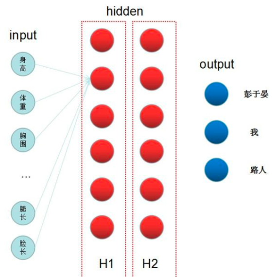

1. 我们的输入特征是:身高、体重、胸围、腿长、脸长等等一些外貌特征，输出是三个类:帅气如彭于晏，帅气如我，路人。
2. 隐藏层H1中，身高体重腿长这些特征，在H1中表达的特征就是身材匀称程度，胸围，腰围，臀围这些可能表达的特征是身材如何，脸长和其他的一些长表达的特征就是五官协调程度
3. 把这些特征，再输入到H2中，H2中的神经元可能就是在划分帅气程度，身材好坏了，然后根据这些结果，分出了三个类。

**注意：层数越多，参数会爆炸式增多，到了一定层数，再往深了加隐藏层，分类效果的增强会越来越不明显**


## 完整CNN例子

**卷积两种分类：**

1. **一个卷积层和一个池化层共同作为一个layer**
2. 卷积层单独作为一个layer，池化层单独作为一个layer


==假设识别0-9数字的案例==

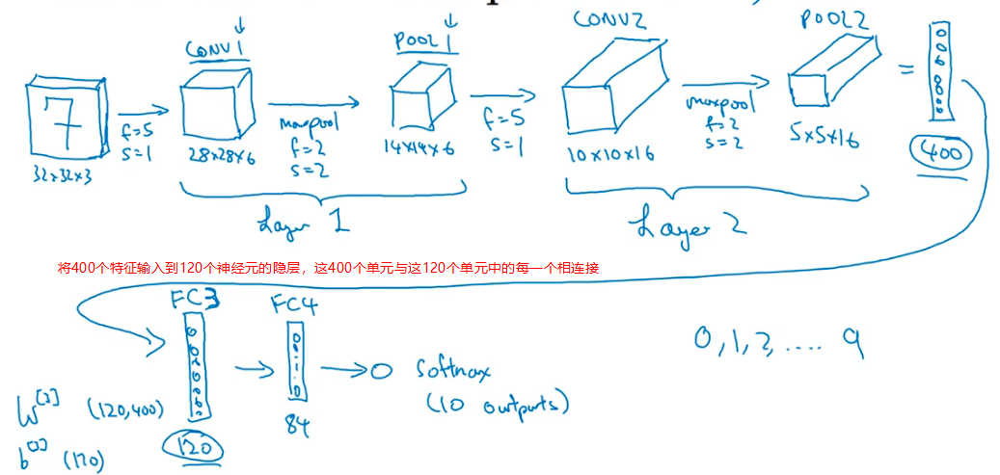

**<font color="red">Andrew Ng：尽量不要自己设置参数，参考一下文献，看别人的模型设置可能也适合于你的模型</font>**


## 经典网络

### 模版代码

#### 训练模板

> **学习率可以从0.01 0.001开始; 批大小常用量32 64 128**

```python
import torch
import torch.nn as nn
import numpy as np
import torch.utils.data as Data
import matplotlib.pyplot as plt
from torchvision import datasets,transforms
import pandas as pd
import time
import copy


# 处理训练集
def data_process():
    # 下载xxx训练集到当前data目录下
    train_dataset=datasets.xxx(root="./data",
                                        train=True,
                                        transform=transforms.Compose([ 
                                            transforms.Resize(size=224),# 将大小变为224*224
                                            transforms.ToTensor()]),
                                        download=True)
    
    # 划分数据集:将训练集划分80%的训练集和20%的验证集
    train_data,val_data=Data.random_split(train_dataset,[round(0.8*len(train_dataset)),round(0.2*len(train_dataset))])
    
    # 每次批处理数量为64个;num_workers:使用4个子进程进行数据加载,适当调整获得最佳的性能和资源利用率
    train_dataloader=Data.DataLoader(dataset=train_data,batch_size=32,shuffle=True,num_workers=4)
    validation_dataloader=Data.DataLoader(dataset=val_data,batch_size=32,shuffle=True,num_workers=4)
    return train_dataloader,validation_dataloader
   
   
# 处理测试集
def data_process():
    # 下载xxx测试集到当前data目录下
    test_dataset = datasets.xxx(root="./data",
                                          train=False,
                                          transform=transforms.Compose([
                                              transforms.Resize(size=224),  # 将大小变为224*224
                                              transforms.ToTensor()]),
                                          download=True)
    # DataLoader默认的批处理大小为1,将每个样本作为一个独立的批次进行处理,使用4个子进程进行数据加载
    test_dataloader = Data.DataLoader(dataset=test_dataset, batch_size=32, shuffle=True,num_workers=4)
    return test_dataloader

    
# 训练数据
def train_model_process(model, train_loader, val_loader, epochs):

    device ="cuda" if torch.cuda.is_available else "cpu"
    # 将模型送往GPU
    model = model.to(device)
    
    # 使用Adam优化器,学习率为0.001
    optimizer = torch.optim.Adam(model.parameters(), lr=0.001)

    # 定义一个损失函数:交叉熵损失,通常用于分类问题，特别是多类别分类问题
    loss_fn = nn.CrossEntropyLoss()


    # 复制当前模型的参数
    best_model_wts = copy.deepcopy(model.state_dict())

    # 最高准确度
    best_acc = 0.0
    # 训练集总loss列表
    train_loss_all = []
    # 验证集总loss列表
    val_loss_all = []

    # 训练集准确度列表
    train_acc_all = []
    # 验证集准确度列表
    val_acc_all = []

    # 保存开始时间
    since = time.time()

    # 迭代epoch
    for epoch in range(epochs):
        print(f"epoch {epoch}/{epochs - 1}")
        print("-" * 10)

        # 初始化训练集的loss
        train_loss = 0.0
        # 初始化训练集的准确度
        train_corrects = 0
        # 初始化验证集的loss
        val_loss = 0.0
        # 初始化验证集的准确度
        val_corrects = 0

        # 训练集样本数量
        train_num = 0
        # 验证集样本数量
        val_num = 0

        # 训练过程
        for step, (b_x, b_y) in enumerate(train_loader):
            # 将特征与标签放入GPU中
            b_x, b_y = b_x.to(device), b_y.to(device)
            # 将模型设置为训练模式
            model.train()
            # 前向传播，输入一个batch，输出对应的预测值
            output = model(b_x)
            # 输出output一行中的最大的概率值
            pre_label = torch.argmax(output, dim=1)
            # 计算损失值
            loss = loss_fn(output, b_y)
            
            # 将梯度置为0
            optimizer.zero_grad()
            # 反向传播计算
            loss.backward()
            # 根据网络反向传播的梯度信息来更新网络参数
            optimizer.step()

            # 对损失函数累加loss值
            train_loss += loss.item() * b_x.size(0)
            # 对预测正确的准确度叠加
            train_corrects += torch.sum(pre_label == b_y.data)
            
            train_num += b_x.size(0)
        
        # 验证过程
        for step, (b_x, b_y) in enumerate(val_loader):
            b_x, b_y = b_x.to(device), b_y.to(device)
            # 设置模型为评估模式
            model.eval()
            # 前向传播，输入一个batch，输出对应的预测值
            output = model(b_x)
            # 输出output一行中的最大的概率值
            pre_label = torch.argmax(output, dim=1)
            # 计算损失值
            loss = loss_fn(output, b_y)
            
            # 对损失函数累加loss值
            val_loss += loss.item() * b_x.size(0)
            # 对预测正确的准确度叠加
            val_corrects += torch.sum(pre_label == b_y.data)
            
            val_num += b_x.size(0)
        
        # 保存每一次epoch迭代的训练集、验证集的loss值、准确率
        train_loss_all.append(train_loss / train_num)
        train_acc_all.append(train_corrects.double().item() / train_num)
        val_loss_all.append(val_loss / val_num)
        val_acc_all.append(val_corrects.double().item() / val_num)

        # 打印每个epoch列表叠加后的最后一次值
        print("{} Train Loss: {:.4f} Train Acc: {:.4f}".format(epoch, train_loss_all[-1], train_acc_all[-1]))
        print("{} Val Loss: {:.4f} Val Acc: {:.4f}".format(epoch, val_loss_all[-1], val_acc_all[-1]))

        # 寻找验证集的最高的准确度(最新的一个)
        if val_acc_all[-1] > best_acc:
            # 更新准确度
            best_acc = val_acc_all[-1]
            # 保存当前的最高准确度模型
            best_model_wts = copy.deepcopy(model.state_dict())

        # 训练总耗时时间
        time_use = time.time() - since
        print("训练耗费时间：{:.0f}m:{:.0f}s".format(time_use // 60, time_use % 60))

    
    # 将最高准确率下的模型参数保存到路径下
    torch.save(best_model_wts, "url.pth")

    # 保存相关信息
    train_process = pd.DataFrame(data={
        "epoch": range(epochs),
        "train_loss_all": train_loss_all,
        "val_loss_all": val_loss_all,
        "train_acc_all": train_acc_all,
        "val_acc_all": val_acc_all
    })

    return train_process

# 画loss、acc图    
def draw_acc_loss(train_process):
    # 创建一个大小为 12x4 的图形窗口
    plt.figure(figsize=(12,4)) 
    # subplot(num_rows, num_cols, plot_number):将图形窗口划分为 1 行 2 列的布局,并选择第一个位置作为当前子图
    plt.subplot(1,2,1)
    # x轴数据为train_process["epoch"],y轴数据为train_process.train_loss_all,"ro-"设置线条颜色和样式，label="train loss"设置图例标签
    plt.plot(train_process["epoch"],train_process.train_loss_all,"ro-",label="train loss")  
    # x轴数据为train_process["epoch"],y轴数据为train_process.val_loss_all,"bs-"设置线条颜色和样式，label="val loss"设置图例标签
    plt.plot(train_process["epoch"],train_process.val_loss_all,"bs-",label="val loss")    
    # 用于显示图例
    plt.legend()
    # 设置 x 轴标签为 "epoch"
    plt.xlabel("epoch")
    # 设置 y 轴标签为 "loss"
    plt.ylabel("loss")
    
    plt.subplot(1,2,2)
    plt.plot(train_process["epoch"],train_process.train_acc_all,"ro-",label="train acc")    
    plt.plot(train_process["epoch"],train_process.val_acc_all,"bs-",label="val acc")    
    plt.legend()
    plt.xlabel("epoch")
    plt.ylabel("acc")
    plt.legend()
    plt.show()
```


#### 测试模板

```python
import torch
import torch.nn as nn
import numpy as np
import torch.utils.data as Data
import matplotlib.pyplot as plt
from torchvision import datasets,transforms
import pandas as pd
import time
import copy

# 测试模型,输出正确率
def test_model_process(model, test_loader):
    # 将模型送往GPU
    device = torch.device("cuda" if torch.cuda.is_available else "cpu")
    model = model.to(device)

    # 测试集精度
    test_corrects=0.0
    # 测试集数量
    test_num=0

    # 只进行前向传播,不进行梯度计算、反向传播
    with torch.no_grad():
        for x_test, y_test in test_loader:
            # 将测试集送往GPU
            x_test, y_test = x_test.to(device), y_test.to(device)
            # 设置模型为评估模式
            model.eval()
            
            # 调用模型进行预测
            output = model(x_test)
            # 返回预测结果中每行的最大值
            pre_label = torch.argmax(output, dim=1)
            
            test_corrects += torch.sum(pre_label == y_test.data)
            test_num += x_test.size(0)

    # 计算准确率
    test_acc=test_corrects.double().item() / test_num
    print("测试的准确率：",test_acc)


# 测试集推理(可选,适用于分类问题)
def test_tuili(model,test_dataloader):
    device = torch.device("cuda" if torch.cuda.is_available else "cpu")
    model = model.to(device)
    
    # 目标值对应下来的类别数组(按照顺序写)
    classes=["xxx","xxx"...]
    
    # 只进行前向传播,不进行梯度计算、反向传播
    with torch.no_grad():
        i=0        # 计时器,只打印一轮的信息
        
        for x_test, y_test in test_dataloader:
            x_test, y_test = x_test.to(device), y_test.to(device)
            # 设置模型为评估模式
            model.eval()
            # 调用模型进行预测
            output = model(x_test)
            
            # 返回预测结果中每行的最大值
            pre_label = torch.argmax(output, dim=1)
            
           
            # 如果batch_size为1个批次,则使用下面四行代码
#             result=pre_label.item()
#             label=y_test.item()
#             print("预测值：",result," 真实值：",label)
#             print("预测值类别：",classes[result]," 真实值类别：",classes[label])
            
            
            
            i=i+1
            
            if i<2:
                # batch_size>1的情况
                for result,label in zip(pre_label,y_test):
                    # 这里的result和label是预测值、真实值,并不是索引
                    print("预测值：",result.item()," 真实值：",label.item())
                    print("预测值类别：",classes[result.item()]," 真实值类别：",classes[label.item()])
   
            else:
                break
```


#### 截取数据集

```python
import os
import shutil

# 源文件
source_folder = r''
# 目标文件夹
destination_folder = r''
file_list = os.listdir(source_folder)

# 截取前4990个图片文件并保存到目标文件夹
count = 0
for file in file_list:
    if file.endswith(('.jpg', '.jpeg', '.png')):
        source_file_path = os.path.join(source_folder, file)
        destination_file_path = os.path.join(destination_folder, file)
        shutil.copy2(source_file_path, destination_file_path)
        count += 1
        if count >= 4990:
            break

print("图片复制完成")
print(len(os.listdir(destination_folder)))
```


#### 划分自己的数据集

```python
import os.path
import random
from shutil import copy


def mkfile(file):
    if not os.path.exists(file):
        os.makedirs(file)

# 获取文件夹下的所有文件夹名
file_path=""
classes=[cla for cla in os.listdir(file_path)]

# 创建文件夹，由类名在其目录下创建子目录
mkfile('data/train')
for cla in classes:
    mkfile("data/train/"+cla)

# 创建 验证集val 文件夹，并由类名在其目录下创建子目录
mkfile("data/test")
for cla in classes:
    mkfile("data/test"+cla)

# 划分比例:训练集：测试集=8:2
split_rate=0.2

# 遍历所有类别的全部图像并按比例分成训练集和验证集
for cla in classes:
    # 某一类别的子目录
    cla_path=file_path+"/"+cla+"/"
    # 列表存储了该目录下所有图像的名称
    images=os.listdir(cla_path)
    num=len(images)
    # 从images列表中随机抽取k个图像名称
    eval_index=random.sample(images,k=int(num*split_rate))
    for index,image in enumerate(images):
        # eval_index中保存验证集val的图像名称
        if image in eval_index:
            image_path=cla_path+image
            new_path="data/test/"+cla
            # 将选中的图像复制到新路径
            copy(image_path,new_path)

        # 其余图像保存到训练集train中
        else:
            image_path=cla_path+image
            new_path="data/train/"+cla
            copy(image_path,new_path)
        print("\r[{}] processing [{}/{}]".format(cla,index+1,num),end="")
    print()

print("processing done")
```

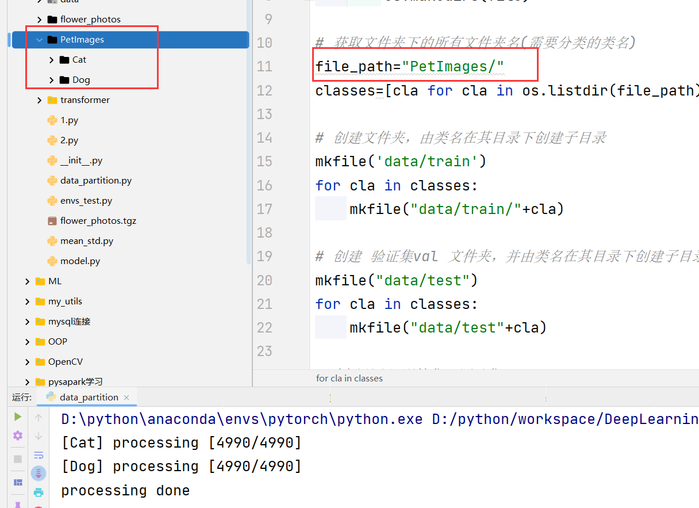

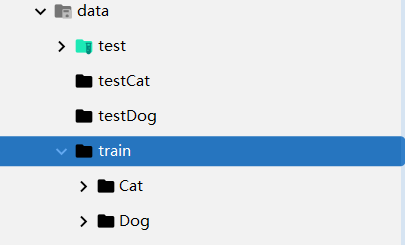 


#### 求出RGB图像的均值、方差

```python
import os
import numpy as np
from PIL import Image

# 文件夹根路径，包括所有图片文件
folder_path=""

# 初始化累计变量
total_pixels=0
# 如果是RGB图像，需要三个通道的均值和方差
sum_normalized_pixel_values=np.zeros(3)

# 遍历文件夹的图片文件
for root,dirs,files in os.walk(folder_path):
    for filename in files:
        if filename.endswith((".jpg",".jpeg",".png",".bmp")):
            image_path=os.path.join(root,filename)
            image=Image.open(image_path)
            image_array=np.array(image)
            # 归一化像素值到0-1之间
            normalized_image_array=image_array/255.0
            # 累计归一化后的像素值和像素数量
            total_pixels+=normalized_image_array.size
            sum_normalized_pixel_values+=np.sum(normalized_image_array,axis=(0,1))

# 计算均值和方差
mean=sum_normalized_pixel_values/total_pixels

sum_squared_diff=np.zeros(3)

for root,dirs,files in os.walk(folder_path):
    for filename in files:
        if filename.endswith((".jpg",".jpeg",".png",".bmp")):
            image_path=os.path.join(root,filename)
            image=Image.open(image_path)
            image_array=np.array(image)
            # 归一化像素值到0-1之间
            normalized_image_array=image_array/255.0
            # 累计归一化后的像素值和像素数量
            total_pixels+=normalized_image_array.size

            try:
                diff=(normalized_image_array-mean)**2
                sum_squared_diff+=np.sum(diff,axis=(0,1))
            except:
                print("捕获到自定义异常")
variance=sum_squared_diff /total_pixels

print("Mean:",mean)
print("Variance:",variance)
```

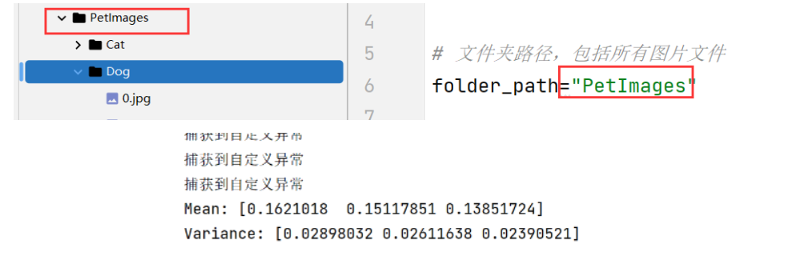

 


### LeNet-5

==eg：识别手写0-9的数字==

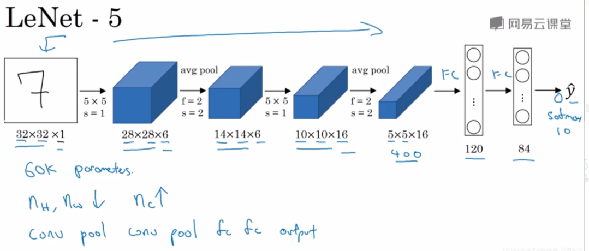

* **针对灰度图像训练**
* **LeNet-5用别的分类器做输出层**
* **高度、尺寸会下降，但通道数会增加，从1-6-16**
* **架构：Conv-Pool-Conv-Pool-FC-FC-Output**
* **使用sigmoid、tanh函数而不是ReLu非线性函数**
* **池化后有sigmoid非线性处理**


#### 搭建模型

 

```python
import torch
# 导入神经网络的层
from torch import nn


# 定义一个网络模型
class LeNet5(nn.Module):
    # 初始化网络
    def __init__(self):
        super(LeNet5,self).__init__()
        
        # 定义第一个卷积层:
        #     in_channel：输入通道为1,对应灰度图像
        #     out_channel：输出通道为6,对应6个filters
        #     kernel_size：采用5*5的卷积核
        #     padding：p=(f-1)/2,即(5-1)/2=2
        #     注意：数据集的图片大小为28*28并不是论文中的32*32
        self.c1=nn.Conv2d(in_channels=1,out_channels=6,kernel_size=5,padding=2)    # 卷积:此时变为28*28*6

        # 定义一个sigmoid激活函数
        self.Sigmoid=nn.Sigmoid()

      
        # 定义第一个池化层,采用avg pooling,即超参数f和s都为2，缩小一半尺寸
        self.s2=nn.AvgPool2d(kernel_size=2,stride=2)              # pooling:此时变为14*14*6
        
        # 定义第二个卷积层:
        #     in_channel：输入通道为6
        #     out_channel：输出通道为16,对应16个filters
        #     kernel_size：采用5*5的卷积核
        self.c3=nn.Conv2d(in_channels=6,out_channels=16,kernel_size=5)            # 卷积:此时变为10*10*16
        
        # 定义第二个池化层,采用avg pooling,即超参数f和s都为2，缩小一半尺寸
        self.s4=nn.AvgPool2d(kernel_size=2,stride=2)           # pooling:此时变为5*5*16
        
        # 扁平化向量
        self.flatten=nn.Flatten()        # 将5*5*16=400个特征扁平化为一个向量
        
        # 全连接层：
        #     fc1输入：将扁平化的400个特征进行线性变换，输出：映射到120个神经元上
        #     fc2输入：将fc1的120个输出作为输入，       输出：84个
        #     output输入：将fc2的84个输出作为输入       输出：0-9的特征
        self.fc1=nn.Linear(5*5*16,120)
        self.fc2=nn.Linear(120,84)
        self.output=nn.Linear(84,10)
        
        
    # 前向传播网络
    def forward(self,x):
        
        # 将x用第一层卷积,对结果采用sigmoid激活
        x=self.Sigmoid(self.c1(x))
       
        # 通过池化层
        x=self.s2(x)
        
        # 将x用第三层卷积,对结果采用sigmoid激活
        x=self.Sigmoid(self.c3(x))
        
        # 再通过池化层
        x=self.s4(x)
        
        # 扁平化400个特征
        x=self.flatten(x)
        
        # 全连接层
        x=self.fc1(x)
        x=self.fc2(x)
        x=self.output(x)
        # 返回10个特征
        return x
```

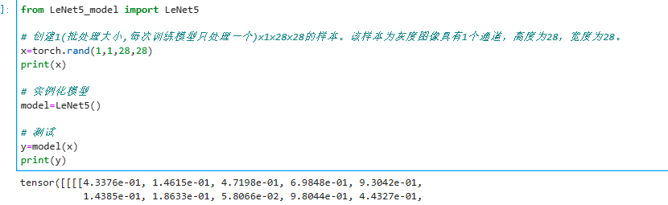

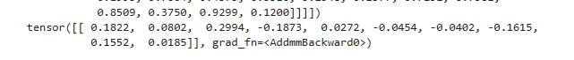 


#### 模型训练

```python
import torch
from torch import nn
# 导入模型
from LeNet5_model import LeNet5
# 导入学习率调度器模块
from torch.optim import lr_scheduler
# 导入数据集、数据集的图像转换操
from torchvision import datasets,transforms


# 数据转换为tensor格式,且归一化
data_transform=transforms.Compose([
    transforms.ToTensor()
])


"""
MNIST数据集
         下载训练数据集:
             root根目录为"./data",数据集将相对于当前工作目录进行存储
             train:用于指定是否加载训练集,如果设置为True，则加载MNIST的训练集;如果设置为False，则加载MNIST的测试集。
             transform:指定对数据集样本进行的转换操作
             download:是否自动下载数据集,如果设置为True，则会自动从互联网上下载数据集到指定的root目录中。如果数据集已经存在，则不会再次下载
"""
train_dataset=datasets.MNIST(root="./data",train=True,transform=data_transform,download=True)
# 下载测试集
test_dataset=datasets.MNIST(root="./data",train=False,transform=data_transform,download=True)

# DataLoader返回四个数据：batch_size当前批次大小、图像通道数、图片大小
    # 加载train_dataset数据集,每次批处理数量为64个,对数据打乱
train_dataloader=torch.utils.data.DataLoader(dataset=train_dataset,batch_size=64,shuffle=True)
    # 加载test_dataset数据集,每次批处理数量为64个,对数据打乱
test_dataloader=torch.utils.data.DataLoader(dataset=test_dataset,batch_size=64,shuffle=True)

# 将模型转到GPU上去
device = "cuda" if torch.cuda.is_available() else "cpu"
model=LeNet5().to(device)

# 定义一个损失函数:交叉熵损失,通常用于分类问题，特别是多类别分类问题
loss_fn=nn.CrossEntropyLoss()


"""
    定义优化器(随机梯度下降法)
        params(iterable)：要训练的参数，一般传入的是model.parameters()，优化器将会更新模型中的所有可学习参数
        lr(float)：learning_rate学习率，也就是步长，控制每次参数更新的步幅大小
        momentum(float, 可选)：动量因子（默认：0），矫正优化率,增加优化的稳定性并加快训练速度，使得参数在当前方向上的更新幅度取决于之前的更新方向
"""
optimizer = torch.optim.SGD(model.parameters(),lr=0.01,momentum=0.9)


# 调整优化器的学习率:学习率每隔10个epoch,变为原来的0.1
lr_scheduler=lr_scheduler.StepLR(optimizer,step_size=10,gamma=0.1)


# 定义训练函数
def train(dataloader,model,loss_fn,optimizer):
    # 总损失、总准确率、总次数
    loss,current,n=0.0, 0.0 ,0
    
    # dataloader为传入数据（数据包括：训练数据和标签）
    for batch,(X,y) in enumerate(dataloader):
        # 将输入数据、标签送往GPU中
        X,y=X.to(device),y.to(device)
        # 前向传播：送入神经网络中训练,返回预测值
        output=model(X)
        
        # 计算损失函数：将输出值与真实标签进行交叉熵计算
        cur_loss=loss_fn(output,y)
        
        # 输出output在每行的最大值，并返回最大值所在的索引：_表示用于接收最大值,pred最大值所在的索引
        """
            torch.max(input, dim)函数: 返回两个tensor，第一个tensor是每行的最大值；第二个tensor是每行最大值的索引
                input:具体的tensor
                dim:max函数索引的维度，0是每列的最大值，1是每行的最大值输出
        """
        _,pred=torch.max(output,1)
        
        # 计算当前批次的准确率
        curr_auc=torch.sum(y==pred)/output.shape[0]
        
        # 下一次迭代时,将优化器的梯度清零
        optimizer.zero_grad()
        # 计算当前损失函数对模型参数的梯度，并进行反向传播
        cur_loss.backward()
        # 梯度计算完成后使用这些梯度来更新模型的参数，以使损失最小化
        optimizer.step()
        
        # 取出cur_loss的值，并叠加loss值
        loss+=cur_loss.item()
        
        # 将所有的准确率叠加在一起
        current+=curr_auc.item()
        
        n=n+1
        
    print("计算训练的错误率 train_loss:",loss/n,"\n")
    print("计算训练的准确率 train_acc:",current/n,"\n")


# 模型验证
def validate(dataloader,model,loss_fn):
    # 将模型设为评估模式
    model.eval()
    
    # 总损失、总准确率、总次数
    loss,current,n=0.0,0.0,0
    
    # torch.no_grad将不会计算梯度, 也不会进行反向传播
    with torch.no_grad():
        for batch,(X,y) in enumerate(dataloader):
            # 将输入数据、标签送往GPU中
            X,y=X.to(device),y.to(device)
            # 前向传播：送入神经网络中训练,返回预测值
            output=model(X)
            # 计算损失函数：将输出值与真实标签进行交叉熵计算
            cur_loss=loss_fn(output,y)

            # 输出output在每行的最大值，并返回最大值所在的索引：_表示用于接收最大值,pred最大值所在的索引
            _,pred=torch.max(output,1)
            
            # 计算当前批次的准确率
            curr_auc=torch.sum(y==pred)/output.shape[0]
            
            # 取出cur_loss的值，并叠加loss值
            loss+=cur_loss.item()

            # 将所有的准确率叠加在一起
            current+=curr_auc.item()

            n=n+1
            
        print("计算验证的错误率 validate_loss:",loss/n,"\n")
        print("计算验证的准确率 validate_acc:",current/n,"\n")
        # 返回模型准确率
        return current/n

        
# 开始训练：50轮
epoch=50
min_acc=0

folder="/_yucheng/gxp/LeNet5/"

for t in range(epoch):
    print(f"epoch{t+1}\n---------------")
    # 训练模型
    train(train_dataloader,model,loss_fn,optimizer)
    # 验证模型
    acc=validate(test_dataloader,model,loss_fn)
    
    # 保存最好的模型权重
    if acc>min_acc:
        torch.save(model.state_dict(),"/_yucheng/gxp/LeNet5/model/lenet5_model_64.pth")

print("done")
```

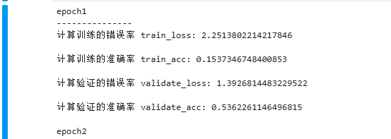 

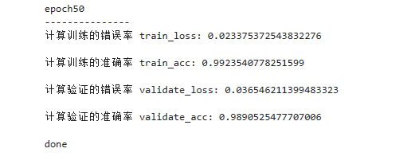  


#### 模型验证

```python
import torch
from LeNet5_model import LeNet5
from torchvision import datasets,transforms
# 将tensor转换为 PIL（Python Imaging Library）图像对象
from torchvision.transforms import ToPILImage,ToTensor


# 数据转换为tensor格式,且归一化
data_transform=transforms.Compose([
    transforms.ToTensor()
])


# 下载测试集
test_dataset=datasets.MNIST(root="./data",train=False,transform=data_transform,download=True)

# 加载test_dataset数据集,每次批处理数量为64个,对数据打乱
test_dataloader=torch.utils.data.DataLoader(dataset=test_dataset,batch_size=64,shuffle=True)

# 将模型转到GPU上去
device = "cuda" if torch.cuda.is_available() else "cpu"
model=LeNet5().to(device)

# 加载保存的模型
model.load_state_dict(torch.load("/_yucheng/gxp/LeNet5/model/lenet5_model_64.pth"))

# 声明0-9的标签列表
classes=[
    "0",
    "1",
    "2",
    "3",
    "4",
    "5",
    "6",
    "7",
    "8",
    "9",
]

# 将tensor转为图片,方便可视化
to_pil_image =ToPILImage()

# 进入验证100张图
# for i in range(len(test_dataset)):
for i in range(100):
    # 返回第一个为图片,第二个为标签
    X,y=test_dataset[i][0],test_dataset[i][1]

    # 将图片展现出来
    to_pil_image(X).show()
    
    """
        torch.unsqueeze(X,dim=0):将X的维度扩展,在第0维度(即最外层)上添加一个额外的维度,将单个样本的数据转换为批次的数据
             torch.Size([1, 28, 28])  ➡  torch.Size([1, 1, 28, 28])
             因为DataLoader返回[batch_size,channle,w,h]会增加一个batch维度,我们预测时,只需要放一张图片即可,
             但是当进行预测时,模型的输入需要batch维度,就可以通过升维的方式实现
             
        然后转为FloatTensor类型的tensor,并移动到GPU
    """
    X=torch.unsqueeze(X,dim=0).float().to(device)

    # torch.no_grad将不会计算梯度, 也不会进行反向传播
    with torch.no_grad():
        # 调用模型进行预测,返回[[v1,v2,v3,v4......]]
        pred=model(X)
   
    
        """
            pred: 返回前向传播的tensor:[[v1,v2,v3,v4......]]
            pred[0]:获取中的[v1,v2,v3,v4......]
            torch.argmax(pred[0],0):返回每列预测概率最高的索引
            classes[torch.argmax(pred[0])]:根据索引找到值
            y:返回标签值,即真实值0~9(是真实值,不是索引)
            classes[y]: 因为classes也是按照0~9排列的,所以可以对应
            
        """
      
        predicted,actual=classes[torch.argmax(pred[0],0)],classes[y]
                                 
        print(f'预测值:{predicted},实际值:{actual}')
```

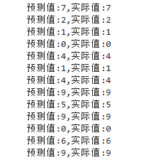 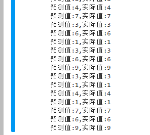 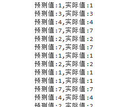


### **AlexNet**

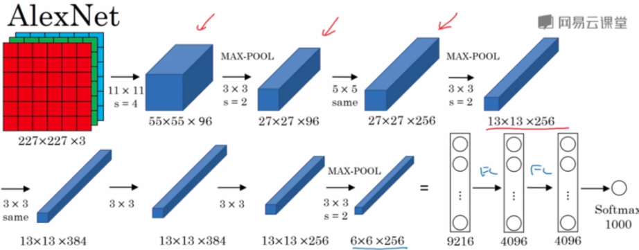


* **采用ReLu函数**
* **架构：Conv-MaxPool-Same Conv（padding）-MaxPool-Same Conv（padding）-MaxPool-FC-Softmax**


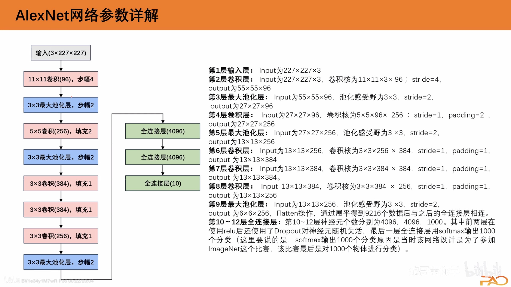


#### 搭建模型

```python
import torch
from torch import nn
from torchsummary import summary
import torch.nn.functional as F

# 以十分类的（1，227，227）数据集为例
class MyAlexNet(nn.Module):
    def __init__(self):
        super(MyAlexNet,self).__init__()
        
        # 定义relu激活函数
        self.ReLU=nn.ReLU()
        
        #  卷积层:
        #     in_channel：输入通道为1,对应灰度图像
        #     out_channel：输出通道为96,对应96个filters
        #     kernel_size：采用11*11的卷积核
        #     stride：步长为4
        self.c1=nn.Conv2d(in_channels=1,out_channels=96,kernel_size=11,stride=4) # 55*55*96
        
        # 最大池化：步长2，卷积核大小3*3
        self.s2=nn.MaxPool2d(kernel_size=3,stride=2)			# 27*27*96
        
        # 27*27*256 
        self.c3=nn.Conv2d(in_channels=96,out_channels=256,kernel_size=5,padding=2)
       
    	# 13*13*256
        self.s4=nn.MaxPool2d(kernel_size=3,stride=2)
        
        # 13*13*384
        self.c5=nn.Conv2d(in_channels=256,out_channels=384,kernel_size=3,padding=1)
       
        # 13*13*384
        self.c6=nn.Conv2d(in_channels=384,out_channels=384,kernel_size=3,padding=1)        
        
        # 13*13*256
        self.c7=nn.Conv2d(in_channels=384,out_channels=256,kernel_size=3,padding=1)
        
        # 6*6*384
        self.s8=nn.MaxPool2d(kernel_size=3,stride=2)
        
        # 扁平化
        self.flatten=nn.Flatten()
        
        # 三层全连接层
        self.f1=nn.Linear(6*6*256,4096)
        self.f2=nn.Linear(4096,4096)
        
        # 输出10分类任务
        self.f3=nn.Linear(4096,10)
        
    
    def forward(self,x):
        # 卷积之后用relu激活
        x=self.ReLU(self.c1(x))
        # 最大池化
        x=self.s2(x)

        x=self.ReLU(self.c3(x))
        x=self.s4(x)
        
        x=self.ReLU(self.c5(x))
        x=self.ReLU(self.c6(x))
        x=self.ReLU(self.c7(x))
        
        x=self.s8(x)
        
        x=self.flatten(x)
        
        x=self.ReLU(self.f1(x))
        
        # 50%的神经元失活
        x=F.dropout(x,0.5)
        
        x=self.ReLU(self.f2(x))
        x=F.dropout(x,0.5)
        
        x=self.f3(x)
        return x


device=torch.device("cuda" if torch.cuda.is_available() else "cpu")
model=MyAlexNet().to(device)
print(summary(model,(1,227,227)))
```

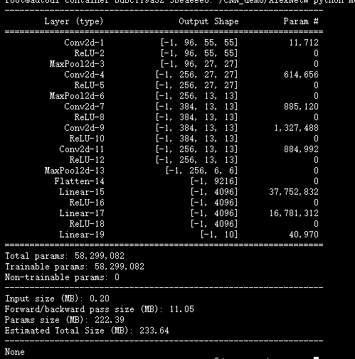 


#### 模型训练

```python
import torch
import torch.nn as nn
import numpy as np
import torch.utils.data as Data
import matplotlib.pyplot as plt
from torchvision import datasets,transforms
import pandas as pd
import time
import copy
# 导入自己的模型
from model import MyAlexNet

# 处理训练集
def data_process():
    # 下载FashionMNIST训练集到当前data目录下
    train_dataset=datasets.FashionMNIST(root="./data",
                                        train=True,
                                        transform=transforms.Compose([ 
                                            transforms.Resize(size=227),# 将大小变为227*227
                                            transforms.ToTensor()]),
                                        download=True)
    
    # 划分数据集:将训练集划分80%的训练集和20%的验证集
    train_data,val_data=Data.random_split(train_dataset,[round(0.8*len(train_dataset)),round(0.2*len(train_dataset))])
    
    # 每次批处理数量为64个;num_workers:使用4个子进程进行数据加载,适当调整获得最佳的性能和资源利用率
    train_dataloader=Data.DataLoader(dataset=train_data,batch_size=64,shuffle=True,num_workers=4)
    validation_dataloader=Data.DataLoader(dataset=val_data,batch_size=64,shuffle=True,num_workers=4)
    return train_dataloader,validation_dataloader

# 训练数据
def train_model_process(model, train_loader, val_loader, epochs):
    device ="cuda" if torch.cuda.is_available else "cpu"
    # 将模型送往GPU
    model = model.to(device)
    
    # 使用Adam优化器,学习率为0.001
    optimizer = torch.optim.Adam(model.parameters(), lr=0.001)

    # 定义一个损失函数:交叉熵损失,通常用于分类问题，特别是多类别分类问题
    loss_fn = nn.CrossEntropyLoss()


    # 复制当前模型的参数
    best_model_wts = copy.deepcopy(model.state_dict())

    # 最高准确度
    best_acc = 0.0
    # 训练集总loss列表
    train_loss_all = []
    # 验证集总loss列表
    val_loss_all = []

    # 训练集准确度列表
    train_acc_all = []
    # 验证集准确度列表
    val_acc_all = []

    # 保存开始时间
    since = time.time()

    # 迭代epoch
    for epoch in range(epochs):
        print(f"epoch {epoch}/{epochs - 1}")
        print("-" * 10)

        # 初始化训练集的loss
        train_loss = 0.0
        # 初始化训练集的准确度
        train_corrects = 0
        # 初始化验证集的loss
        val_loss = 0.0
        # 初始化验证集的准确度
        val_corrects = 0

        # 训练集样本数量
        train_num = 0
        # 验证集样本数量
        val_num = 0

        # 训练过程
        for step, (b_x, b_y) in enumerate(train_loader):
            # 将特征与标签放入GPU中
            b_x, b_y = b_x.to(device), b_y.to(device)
            # 将模型设置为训练模式
            model.train()
            # 前向传播，输入一个batch，输出对应的预测值
            output = model(b_x)
            # 输出output一行中的最大的概率值: pre_label: tensor([8, 5, 9, 2, 9, 5, 7, 1, 4, 1, 2, 1, 3, 1, 9, 7, 5, 5, 7, 4, 4, 6, 5, 5,8, 2, 7, 8, 2, 7, 9, 1], device='cuda:0') torch.Size([32])
            pre_label = torch.argmax(output, dim=1)
            # 计算损失值
            loss = loss_fn(output, b_y)
            
            # 将梯度置为0
            optimizer.zero_grad()
            # 反向传播计算
            loss.backward()
            # 根据网络反向传播的梯度信息来更新网络参数
            optimizer.step()

            # 对损失函数累加loss值
            train_loss += loss.item() * b_x.size(0)
            # 对预测正确的准确度叠加
            train_corrects += torch.sum(pre_label == b_y.data)
            
            train_num += b_x.size(0)
        
        # 验证过程
        for step, (b_x, b_y) in enumerate(val_loader):
            b_x, b_y = b_x.to(device), b_y.to(device)
            # 设置模型为评估模式
            model.eval()
            # 前向传播，输入一个batch，输出对应的预测值
            output = model(b_x)
            # 输出output一行中的最大的概率值
            pre_label = torch.argmax(output, dim=1)
            # 计算损失值
            loss = loss_fn(output, b_y)
            
            # 对损失函数累加loss值
            val_loss += loss.item() * b_x.size(0)
            # 对预测正确的准确度叠加
            val_corrects += torch.sum(pre_label == b_y.data)
            
            val_num += b_x.size(0)
        
        # 保存每一次epoch迭代的训练集、验证集的loss值、准确率
        train_loss_all.append(train_loss / train_num)
        train_acc_all.append(train_corrects.double().item() / train_num)
        val_loss_all.append(val_loss / val_num)
        val_acc_all.append(val_corrects.double().item() / val_num)

        # 打印每个epoch列表叠加后的最后一次值
        print("{} Train Loss: {:.4f} Train Acc: {:.4f}".format(epoch, train_loss_all[-1], train_acc_all[-1]))
        print("{} Val Loss: {:.4f} Val Acc: {:.4f}".format(epoch, val_loss_all[-1], val_acc_all[-1]))

        # 寻找验证集的最高的准确度(最新的一个)
        if val_acc_all[-1] > best_acc:
            # 更新准确度
            best_acc = val_acc_all[-1]
            # 保存当前的最高准确度模型
            best_model_wts = copy.deepcopy(model.state_dict())

        # 训练总耗时时间
        time_use = time.time() - since
        print("训练耗费时间：{:.0f}m:{:.0f}s".format(time_use // 60, time_use % 60))

    
    # 将最高准确率下的模型参数保存到路径下
    torch.save(best_model_wts, "/CNN_demo/AlexNet/AlexNet.pth")

    # 保存相关信息
    train_process = pd.DataFrame(data={
        "epoch": range(epochs),
        "train_loss_all": train_loss_all,
        "val_loss_all": val_loss_all,
        "train_acc_all": train_acc_all,
        "val_acc_all": val_acc_all
    })

    return train_process


# 画loss、acc图    
def draw_acc_loss(train_process):
    # 创建一个大小为 12x4 的图形窗口
    plt.figure(figsize=(12,4)) 
    # subplot(num_rows, num_cols, plot_number):将图形窗口划分为 1 行 2 列的布局,并选择第一个位置作为当前子图
    plt.subplot(1,2,1)
    # x轴数据为train_process["epoch"],y轴数据为train_process.train_loss_all,"ro-"设置线条颜色和样式，label="train loss"设置图例标签
    plt.plot(train_process["epoch"],train_process.train_loss_all,"ro-",label="train loss")  
    # x轴数据为train_process["epoch"],y轴数据为train_process.val_loss_all,"bs-"设置线条颜色和样式，label="val loss"设置图例标签
    plt.plot(train_process["epoch"],train_process.val_loss_all,"bs-",label="val loss")    
    # 用于显示图例
    plt.legend()
    # 设置 x 轴标签为 "epoch"
    plt.xlabel("epoch")
    # 设置 y 轴标签为 "loss"
    plt.ylabel("loss")
    
    plt.subplot(1,2,2)
    plt.plot(train_process["epoch"],train_process.train_acc_all,"ro-",label="train acc")    
    plt.plot(train_process["epoch"],train_process.val_acc_all,"bs-",label="val acc")    
    plt.legend()
    plt.xlabel("epoch")
    plt.ylabel("acc")
    plt.legend()
    plt.show()

    
# 开始训练

# 实例化模型
AlexNet=MyAlexNet()

# 20轮epoch
epochs=20


# 处理数据
train_dataloader,validation_dataloader=data_process()
# 开始训练
train_process=train_model_process(AlexNet,train_dataloader,validation_dataloader,epochs)
# 画图
draw_acc_loss(train_process)
print("done")
```

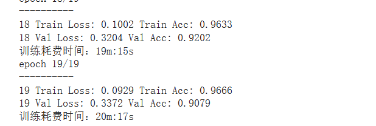 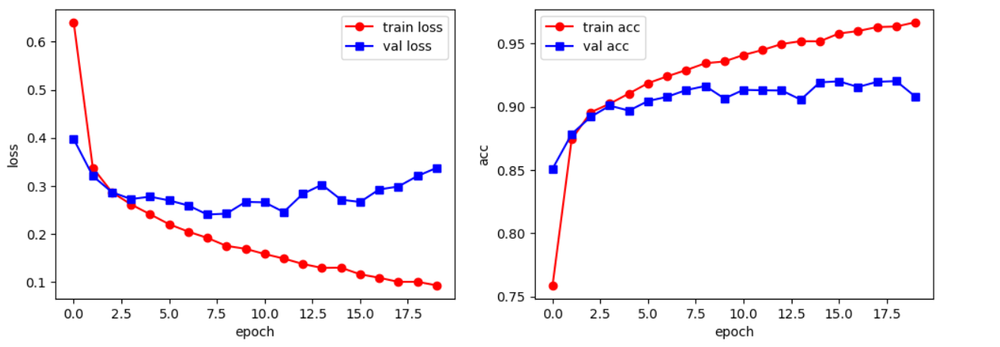

> **`注意：从loss曲线可以看出,在11轮过后,模型开始出现过拟合的现象`**


#### 模型验证

```python
import torch
import torch.nn as nn
import torch.utils.data as Data
import numpy as np
from torchvision import datasets,transforms
import time
import copy
import pandas as pd
import matplotlib.pyplot as plt
# 导入自己的模型
from model import MyAlexNet


# 处理测试集
def data_process():
    # 下载FashionMNIST测试集
    test_dataset = datasets.FashionMNIST(root="./data",
                                          train=False,
                                          transform=transforms.Compose([
                                              transforms.Resize(size=227),  # 将大小变为227*227
                                              transforms.ToTensor()]),
                                          download=True)
    # DataLoader默认的批处理大小为1,将每个样本作为一个独立的批次进行处理,使用4个子进程进行数据加载
    test_dataloader = Data.DataLoader(dataset=test_dataset, batch_size=32, shuffle=True,num_workers=4)
    return test_dataloader


# 测试模型,输出正确率
def test_model_process(model, test_loader):
    # 将模型送往GPU
    device = torch.device("cuda" if torch.cuda.is_available else "cpu")
    model = model.to(device)

    # 测试集精度
    test_corrects=0.0
    # 测试集数量
    test_num=0

    # 只进行前向传播,不进行梯度计算、反向传播
    with torch.no_grad():
        for x_test, y_test in test_loader:
            # 将测试集送往GPU
            x_test, y_test = x_test.to(device), y_test.to(device)
            # 设置模型为评估模式
            model.eval()
            
            # 调用模型进行预测
            output = model(x_test)
            # 返回预测结果中每行的最大值
            pre_label = torch.argmax(output, dim=1)
            """
              pre_label:  tensor([8, 5, 9, 2, 9, 5, 7, 1, 4, 1, 2, 1, 3, 1, 9, 7, 5, 5, 7, 4, 4, 6, 5, 5,8, 2, 7, 8, 2, 7, 9, 1], device='cuda:0') torch.Size([32])
              y_test:     tensor([8, 5, 9, 2, 9, 5, 7, 1, 2, 1, 4, 1, 3, 1, 9, 5, 5, 5, 7, 6, 4, 6, 5, 5,8, 2, 7, 8, 2, 7, 9, 1], device='cuda:0') torch.Size([32])
            """
            
            test_corrects += torch.sum(pre_label == y_test.data)
            test_num += x_test.size(0)

    # 计算准确率
    test_acc=test_corrects.double().item() / test_num
    print("测试的准确率：",test_acc)

    
# 测试集推理
def test_tuili(model,test_dataloader):
    device = torch.device("cuda" if torch.cuda.is_available else "cpu")
    model = model.to(device)
    
    # 目标值为0-9的对应下来的类别为
    classes=["T-shirt/top","Trouser","Pullover","Dress","Coat","Sandal","Shirt","Sneaker","Bag","Ankle boot"]
    
    # 只进行前向传播,不进行梯度计算、反向传播
    with torch.no_grad():
        i=0
        for x_test, y_test in test_dataloader:
            x_test, y_test = x_test.to(device), y_test.to(device)
            # 设置模型为评估模式
            model.eval()
            # 调用模型进行预测
            output = model(x_test)
            
            # 返回预测结果中每行的最大值
            pre_label = torch.argmax(output, dim=1)
            
            """
              pre_label:  tensor([8, 5, 9, 2, 9, 5, 7, 1, 4, 1, 2, 1, 3, 1, 9, 7, 5, 5, 7, 4, 4, 6, 5, 5,8, 2, 7, 8, 2, 7, 9, 1], device='cuda:0') torch.Size([32])
              y_test:     tensor([8, 5, 9, 2, 9, 5, 7, 1, 2, 1, 4, 1, 3, 1, 9, 5, 5, 5, 7, 6, 4, 6, 5, 5,8, 2, 7, 8, 2, 7, 9, 1], device='cuda:0') torch.Size([32])
            """
            
            # 如果batch_size为1个批次,则使用下面四行代码
#             result=pre_label.item()
#             label=y_test.item()
#             print("预测值：",result," 真实值：",label)
#             print("预测值类别：",classes[result]," 真实值类别：",classes[label])
            
               
            i=i+1
            if i<2:
                # batch_size>1的情况
                for result,label in zip(pre_label,y_test):
                    # 这里的result和label是预测值、真实值,并不是索引
                    print("预测值：",result.item()," 真实值：",label.item())
                    print("预测值类别：",classes[result.item()]," 真实值类别：",classes[label.item()])
   
            else:
                break
    
model=MyAlexNet()
model.load_state_dict(torch.load("/CNN_demo/AlexNet/AlexNet.pth"))
test_dataloader = data_process()

test_model_process(model,test_dataloader)
# test_tuili(model,test_dataloader)
```

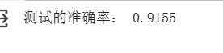 

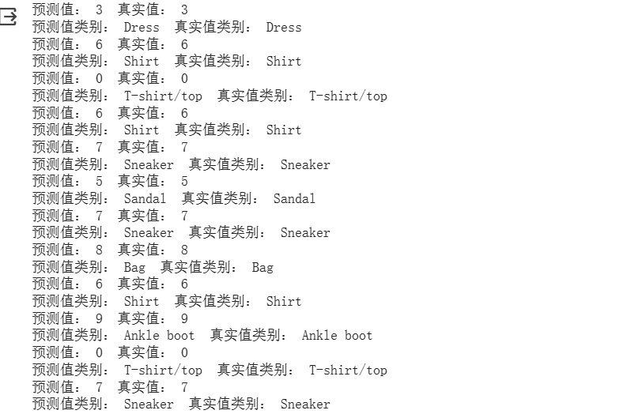


### VGG-16

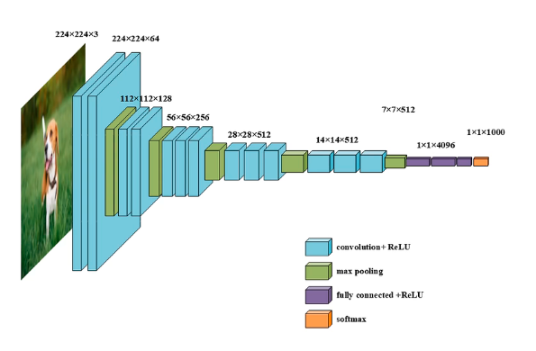

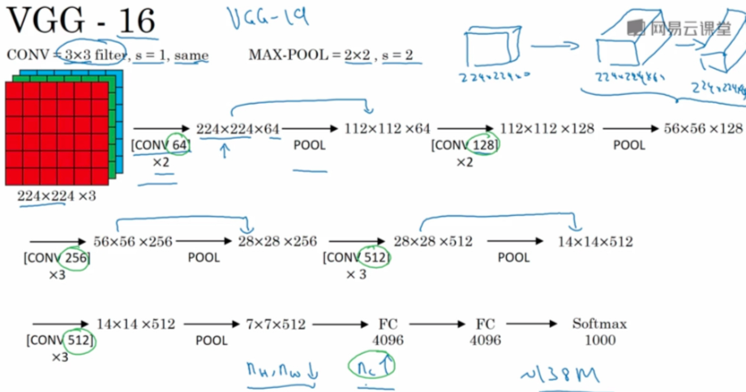

* **更关注卷积层，且是same conv（padding），但是参数多**
* **16指有16层带权重的层，VGG-19也是类似**
* **架构：Same Conv[n=64]× 2 - MaxPool - SameConv[n=128] ×2 - MaxPool - SameConv[n=256] × 3 - MaxPool - SameConv[n=512] × 3 - MaxPool - SameConv[n=512] × 3 - MaxPool - FC - FC - SoftMax**
* **随着卷积深入，尺寸缩小，信道增加至512**


#### 搭建模型

> **`结构`**

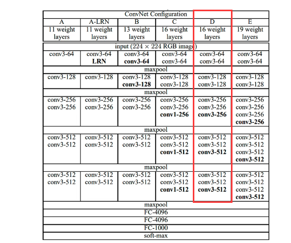 


**注意：如图可以发现，VGG中卷积层是通过block块状形式相连的，block内的卷积层结构相同，`所以编写网络结构时`；block外通过max pool连接。图中一个vgg-block块：**

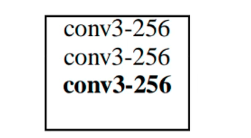 

```python
import torch
from torch import nn
import torch.nn as nn

# 这里实际输入的图片为224*224*1的灰度图像FashionMNIST去训练,输出10个特征

class VGG16(nn.Module):
    def __init__(self):
        super(VGG16,self).__init__()
        
        # nn.Sequential():按照顺序将卷积、激活等一系列操作组合在一起
        
        # 第一块
        self.block1=nn.Sequential(
            # 卷积,运用填充 
            nn.Conv2d(in_channels=1,out_channels=64,kernel_size=3,padding=1),  # 224*224*64
            # Relu激活
            nn.ReLU(),
            # 卷积,运用填充 
            nn.Conv2d(in_channels=64,out_channels=64,kernel_size=3,padding=1), # 224*224*64
            # Relu激活
            nn.ReLU(),
            # 最大池化
            nn.MaxPool2d(kernel_size=2,stride=2)   # 112*112*64
        )

        # 第二块
        self.block2=nn.Sequential(
            # 卷积,运用填充 
            nn.Conv2d(in_channels=64,out_channels=128,kernel_size=3,padding=1),  # 112*112*128
            # Relu激活
            nn.ReLU(),
            # 卷积,运用填充 
            nn.Conv2d(in_channels=128,out_channels=128,kernel_size=3,padding=1), # 112*112*128
            # Relu激活
            nn.ReLU(),
            # 最大池化
            nn.MaxPool2d(kernel_size=2,stride=2)   # 56*56*128
        )
        
        # 第三块
        self.block3=nn.Sequential(
            # 卷积,运用填充 
            nn.Conv2d(in_channels=128,out_channels=256,kernel_size=3,padding=1),  # 56*56*256
            # Relu激活
            nn.ReLU(),
            # 卷积,运用填充 
            nn.Conv2d(in_channels=256,out_channels=256,kernel_size=3,padding=1), # 56*56*256
            # Relu激活
            nn.ReLU(),
            # 卷积,运用填充 
            nn.Conv2d(in_channels=256,out_channels=256,kernel_size=3,padding=1), # 56*56*256
            # Relu激活
            nn.ReLU(),
            # 最大池化
            nn.MaxPool2d(kernel_size=2,stride=2)   # 28*28*256
        )
        
        # 第四块
        self.block4=nn.Sequential(
            # 卷积,运用填充 
            nn.Conv2d(in_channels=256,out_channels=512,kernel_size=3,padding=1), # 28*28*512
            # Relu激活
            nn.ReLU(),
            # 卷积,运用填充 
            nn.Conv2d(in_channels=512,out_channels=512,kernel_size=3,padding=1), # 28*28*512
            # Relu激活
            nn.ReLU(),
            # 卷积,运用填充 
            nn.Conv2d(in_channels=512,out_channels=512,kernel_size=3,padding=1), # 28*28*512
            # Relu激活
            nn.ReLU(),
            # 最大池化
            nn.MaxPool2d(kernel_size=2,stride=2)   # 14*14*512
        )     
       
        # 第五块
        self.block5=nn.Sequential(
            # 卷积,运用填充 
            nn.Conv2d(in_channels=512,out_channels=512,kernel_size=3,padding=1),  # 14*14*512
            # Relu激活
            nn.ReLU(),
            # 卷积,运用填充 
            nn.Conv2d(in_channels=512,out_channels=512,kernel_size=3,padding=1), # 14*14*512
            # Relu激活
            nn.ReLU(),
            # 卷积,运用填充 
            nn.Conv2d(in_channels=512,out_channels=512,kernel_size=3,padding=1), # 14*14*512
            # Relu激活
            nn.ReLU(),
            # 最大池化
            nn.MaxPool2d(kernel_size=2,stride=2)   # 7*7*512
        )     
        
        # 第六块
        self.block6=nn.Sequential(
           # 将7*7*512扁平化向量:平展操作,在FC前
           nn.Flatten(),
           # fc1:输出4096个神经元 
           nn.Linear(7*7*512,4096),
           # Relu激活
           nn.ReLU(),
           # fc2:输出4096个神经元 
           nn.Linear(4096,4096),
           # Relu激活
           nn.ReLU(),
           # fc3:输出1000
#          nn.Linear(4096,1000)
            
           nn.Linear(4096,10)
        )    
        
        
        """
            对于VGG16,GoogleNet这类深层次的网络，权重不初始化、batch_size不合适都会导致训练几十轮之后不收敛，并且loss值和acc值效果不好。
           	如果针对于显存小的GPU,对FashionMNIST进行训练,可以适当更改fc中的全连接层的神经元: 7*7*512-256 ,256-128 ,128-10,此时就可以提高batch_size的数量:32或者64
        """
        
        # 遍历网络中的每个模块的参数
        for m in self.modules():
            
            # 如果是卷积层的实例
            if isinstance(m,nn.Conv2d):
                # 对该卷积层的权重进行初始化,并使用relu作为非线性函数,使其更快的在训练过程中收敛
                nn.init.kaiming_normal_(m.weight,nonlinearity="relu")
                # 并对其偏置设为0
                if m.bias is not None:
                     nn.init.constant_(m.bias,0)
                
            # 如果是fc的实例
            elif isinstance(m,nn.Linear):
                # 对全连接层的权重按照均值为0，标准差为0.01的正态分布进行初始化
                nn.init.normal_(m.weight,0,0.01)
                
                # 并对其偏置设为0
                if m.bias is not None:
                     nn.init.constant_(m.bias,0)
                    
        
        
        
    # 定义前向传播
    def forward(self,x):
        x=self.block1(x)
        x=self.block2(x)
        x=self.block3(x)
        x=self.block4(x)
        x=self.block5(x)
        x=self.block6(x)
        return x
```

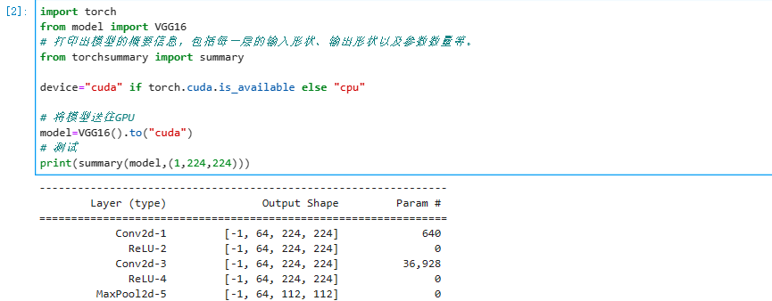

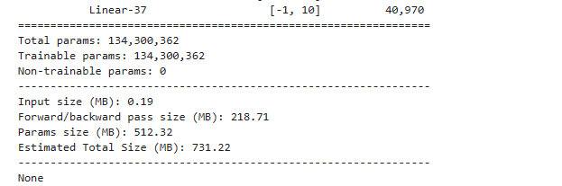


#### 模型训练

```python
import torch
import torch.nn as nn
import numpy as np
import torch.utils.data as Data
import matplotlib.pyplot as plt
from torchvision import datasets,transforms
import pandas as pd
import time
import copy
# 导入自己的模型
from model import VGG16

# 处理训练集
def data_process():
    # 下载FashionMNIST训练集到当前data目录下
    train_dataset=datasets.FashionMNIST(root="./data",
                                        train=True,
                                        transform=transforms.Compose([ 
                                            transforms.Resize(size=224),# 将大小变为224*224
                                            transforms.ToTensor()]),
                                        download=True)
    
    # 划分数据集:将训练集划分80%的训练集和20%的验证集
    train_data,val_data=Data.random_split(train_dataset,[round(0.8*len(train_dataset)),round(0.2*len(train_dataset))])
    
    # 每次批处理数量为32个;num_workers:使用4个子进程进行数据加载,适当调整获得最佳的性能和资源利用率
    train_dataloader=Data.DataLoader(dataset=train_data,batch_size=32,shuffle=True,num_workers=4)
    validation_dataloader=Data.DataLoader(dataset=val_data,batch_size=32,shuffle=True,num_workers=4)
    return train_dataloader,validation_dataloader

# 训练数据
def train_model_process(model, train_loader, val_loader, epochs):
    device ="cuda" if torch.cuda.is_available else "cpu"
    # 将模型送往GPU
    model = model.to(device)
    
    # 使用Adam优化器,学习率为0.001
    optimizer = torch.optim.Adam(model.parameters(), lr=0.001)

    # 定义一个损失函数:交叉熵损失,通常用于分类问题，特别是多类别分类问题
    loss_fn = nn.CrossEntropyLoss()


    # 复制当前模型的参数
    best_model_wts = copy.deepcopy(model.state_dict())

    # 最高准确度
    best_acc = 0.0
    # 训练集总loss列表
    train_loss_all = []
    # 验证集总loss列表
    val_loss_all = []

    # 训练集准确度列表
    train_acc_all = []
    # 验证集准确度列表
    val_acc_all = []

    # 保存开始时间
    since = time.time()

    # 迭代epoch
    for epoch in range(epochs):
        print(f"epoch {epoch}/{epochs - 1}")
        print("-" * 10)

        # 初始化训练集的loss
        train_loss = 0.0
        # 初始化训练集的准确度
        train_corrects = 0
        # 初始化验证集的loss
        val_loss = 0.0
        # 初始化验证集的准确度
        val_corrects = 0

        # 训练集样本数量
        train_num = 0
        # 验证集样本数量
        val_num = 0

        # 训练过程
        for step, (b_x, b_y) in enumerate(train_loader):
            # 将特征与标签放入GPU中
            b_x, b_y = b_x.to(device), b_y.to(device)
            # 将模型设置为训练模式
            model.train()
            # 前向传播，输入一个batch，输出对应的预测值
            output = model(b_x)
            # 输出output一行中的最大的概率值: pre_label: tensor([8, 5, 9, 2, 9, 5, 7, 1, 4, 1, 2, 1, 3, 1, 9, 7, 5, 5, 7, 4, 4, 6, 5, 5,8, 2, 7, 8, 2, 7, 9, 1], device='cuda:0') torch.Size([32])
            pre_label = torch.argmax(output, dim=1)
            # 计算损失值
            loss = loss_fn(output, b_y)
            
            # 将梯度置为0
            optimizer.zero_grad()
            # 反向传播计算
            loss.backward()
            # 根据网络反向传播的梯度信息来更新网络参数
            optimizer.step()

            # 对损失函数累加loss值
            train_loss += loss.item() * b_x.size(0)
            # 对预测正确的准确度叠加
            train_corrects += torch.sum(pre_label == b_y.data)
            
            train_num += b_x.size(0)
        
        # 验证过程
        for step, (b_x, b_y) in enumerate(val_loader):
            b_x, b_y = b_x.to(device), b_y.to(device)
            # 设置模型为评估模式
            model.eval()
            # 前向传播，输入一个batch，输出对应的预测值
            output = model(b_x)
            # 输出output一行中的最大的概率值
            pre_label = torch.argmax(output, dim=1)
            # 计算损失值
            loss = loss_fn(output, b_y)
            
            # 对损失函数累加loss值
            val_loss += loss.item() * b_x.size(0)
            # 对预测正确的准确度叠加
            val_corrects += torch.sum(pre_label == b_y.data)
            
            val_num += b_x.size(0)
        
        # 保存每一次epoch迭代的训练集、验证集的loss值、准确率
        train_loss_all.append(train_loss / train_num)
        train_acc_all.append(train_corrects.double().item() / train_num)
        val_loss_all.append(val_loss / val_num)
        val_acc_all.append(val_corrects.double().item() / val_num)

        # 打印每个epoch列表叠加后的最后一次值
        print("{} Train Loss: {:.4f} Train Acc: {:.4f}".format(epoch, train_loss_all[-1], train_acc_all[-1]))
        print("{} Val Loss: {:.4f} Val Acc: {:.4f}".format(epoch, val_loss_all[-1], val_acc_all[-1]))

        # 寻找验证集的最高的准确度(最新的一个)
        if val_acc_all[-1] > best_acc:
            # 更新准确度
            best_acc = val_acc_all[-1]
            # 保存当前的最高准确度模型
            best_model_wts = copy.deepcopy(model.state_dict())

        # 训练总耗时时间
        time_use = time.time() - since
        print("训练耗费时间：{:.0f}m:{:.0f}s".format(time_use // 60, time_use % 60))

    
    # 将最高准确率下的模型参数保存到路径下
    torch.save(best_model_wts, "/_yucheng/gxp/VGG16/model/vgg16.pth")

    # 保存相关信息
    train_process = pd.DataFrame(data={
        "epoch": range(epochs),
        "train_loss_all": train_loss_all,
        "val_loss_all": val_loss_all,
        "train_acc_all": train_acc_all,
        "val_acc_all": val_acc_all
    })

    return train_process


# 画loss、acc图    
def draw_acc_loss(train_process):
    # 创建一个大小为 12x4 的图形窗口
    plt.figure(figsize=(12,4)) 
    # subplot(num_rows, num_cols, plot_number):将图形窗口划分为 1 行 2 列的布局,并选择第一个位置作为当前子图
    plt.subplot(1,2,1)
    # x轴数据为train_process["epoch"],y轴数据为train_process.train_loss_all,"ro-"设置线条颜色和样式，label="train loss"设置图例标签
    plt.plot(train_process["epoch"],train_process.train_loss_all,"ro-",label="train loss")  
    # x轴数据为train_process["epoch"],y轴数据为train_process.val_loss_all,"bs-"设置线条颜色和样式，label="val loss"设置图例标签
    plt.plot(train_process["epoch"],train_process.val_loss_all,"bs-",label="val loss")    
    # 用于显示图例
    plt.legend()
    # 设置 x 轴标签为 "epoch"
    plt.xlabel("epoch")
    # 设置 y 轴标签为 "loss"
    plt.ylabel("loss")
    
    plt.subplot(1,2,2)
    plt.plot(train_process["epoch"],train_process.train_acc_all,"ro-",label="train acc")    
    plt.plot(train_process["epoch"],train_process.val_acc_all,"bs-",label="val acc")    
    plt.legend()
    plt.xlabel("epoch")
    plt.ylabel("acc")
    plt.legend()
    plt.show()

    
# 开始训练

# 实例化模型
vgg=VGG16()

# 20轮epoch
epochs=20


# 处理数据
train_dataloader,validation_dataloader=data_process()
# 开始训练
train_process=train_model_process(vgg,train_dataloader,validation_dataloader,epochs)
# 画图
draw_acc_loss(train_process)
print("done")
```

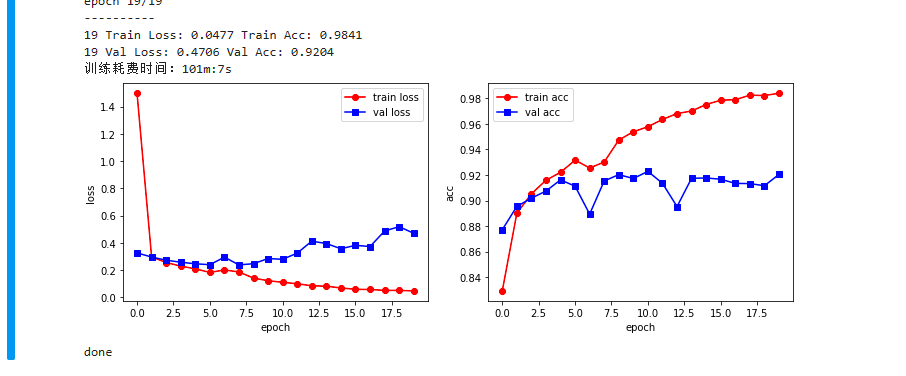

> **`注意：从loss曲线可以看出,在7.5轮过后,模型开始出现过拟合的现象`**


#### 模型验证

```python
import torch
import torch.nn as nn
import torch.utils.data as Data
import numpy as np
from torchvision import datasets,transforms
from model import VGG16
import time
import copy
import pandas as pd
import matplotlib.pyplot as plt


# 处理测试集
def data_process():
    # 下载FashionMNIST测试集
    test_dataset = datasets.FashionMNIST(root="./data",
                                          train=False,
                                          transform=transforms.Compose([
                                              transforms.Resize(size=224),  # 将大小变为224*224
                                              transforms.ToTensor()]),
                                          download=True)
    # DataLoader默认的批处理大小为1,将每个样本作为一个独立的批次进行处理,使用4个子进程进行数据加载
    test_dataloader = Data.DataLoader(dataset=test_dataset, batch_size=32, shuffle=True,num_workers=4)
    return test_dataloader


# 测试模型,输出正确率
def test_model_process(model, test_loader):
    # 将模型送往GPU
    device = torch.device("cuda" if torch.cuda.is_available else "cpu")
    model = model.to(device)

    # 测试集精度
    test_corrects=0.0
    # 测试集数量
    test_num=0

    # 只进行前向传播,不进行梯度计算、反向传播
    with torch.no_grad():
        for x_test, y_test in test_loader:
            # 将测试集送往GPU
            x_test, y_test = x_test.to(device), y_test.to(device)
            # 设置模型为评估模式
            model.eval()
            
            # 调用模型进行预测
            output = model(x_test)
            # 返回预测结果中每行的最大值
            pre_label = torch.argmax(output, dim=1)
            """
              pre_label:  tensor([8, 5, 9, 2, 9, 5, 7, 1, 4, 1, 2, 1, 3, 1, 9, 7, 5, 5, 7, 4, 4, 6, 5, 5,8, 2, 7, 8, 2, 7, 9, 1], device='cuda:0') torch.Size([32])
              y_test:     tensor([8, 5, 9, 2, 9, 5, 7, 1, 2, 1, 4, 1, 3, 1, 9, 5, 5, 5, 7, 6, 4, 6, 5, 5,8, 2, 7, 8, 2, 7, 9, 1], device='cuda:0') torch.Size([32])
            """
            
            test_corrects += torch.sum(pre_label == y_test.data)
            test_num += x_test.size(0)

    # 计算准确率
    test_acc=test_corrects.double().item() / test_num
    print("测试的准确率：",test_acc)

    
# 测试集推理
def test_tuili(model,test_dataloader):
    device = torch.device("cuda" if torch.cuda.is_available else "cpu")
    model = model.to(device)
    
    # 目标值为0-9的对应下来的类别为
    classes=["T-shirt/top","Trouser","Pullover","Dress","Coat","Sandal","Shirt","Sneaker","Bag","Ankle boot"]
    
    # 只进行前向传播,不进行梯度计算、反向传播
    with torch.no_grad():
        i=0
        for x_test, y_test in test_dataloader:
            x_test, y_test = x_test.to(device), y_test.to(device)
            # 设置模型为评估模式
            model.eval()
            # 调用模型进行预测
            output = model(x_test)
            
            # 返回预测结果中每行的最大值
            pre_label = torch.argmax(output, dim=1)
            
            """
              pre_label:  tensor([8, 5, 9, 2, 9, 5, 7, 1, 4, 1, 2, 1, 3, 1, 9, 7, 5, 5, 7, 4, 4, 6, 5, 5,8, 2, 7, 8, 2, 7, 9, 1], device='cuda:0') torch.Size([32])
              y_test:     tensor([8, 5, 9, 2, 9, 5, 7, 1, 2, 1, 4, 1, 3, 1, 9, 5, 5, 5, 7, 6, 4, 6, 5, 5,8, 2, 7, 8, 2, 7, 9, 1], device='cuda:0') torch.Size([32])
            """
            
            # 如果batch_size为1个批次,则使用下面四行代码
#             result=pre_label.item()
#             label=y_test.item()
#             print("预测值：",result," 真实值：",label)
#             print("预测值类别：",classes[result]," 真实值类别：",classes[label])
            
               
            i=i+1
            if i<2:
                # batch_size>1的情况
                for result,label in zip(pre_label,y_test):
                    # 这里的result和label是预测值、真实值,并不是索引
                    print("预测值：",result.item()," 真实值：",label.item())
                    print("预测值类别：",classes[result.item()]," 真实值类别：",classes[label.item()])
   
            else:
                break
    
model=VGG16()
model.load_state_dict(torch.load("/_yucheng/gxp/VGG16/model/vgg16.pth"))
test_dataloader = data_process()

test_model_process(model,test_dataloader)
# test_tuili(model,test_dataloader)
```

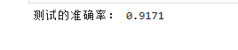 


### ResNets-Residual Networks（重点）

> **残差网络：深层网络难以训练的原因之一就是梯度爆炸和梯度消失，残差网络可以有效解决这种问题，随着深度加深，一般的神经网络的效果会呈现一个v型变化，但是ResNet可以适应更深的网络**

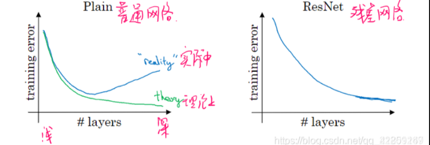

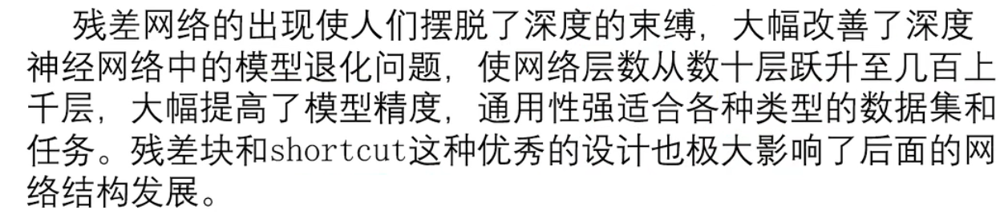


**理解**

​		想象你在玩电话传话游戏，每个人都需要向下一个人传递消息，这里的消息就是梯度，每个人则代表神经网络的一层。传递过程中，信息可能出现微小变化，导致最后的信息与原始信息大相径庭。在深层网络中，初次的梯度在每层都可能减弱，使得后续层缺少调整依据，这称为“梯度消失”。相反，梯度爆炸是指梯度异常增强，导致网络学习失控。

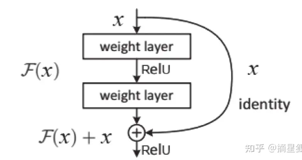

* 假设需要得到的输出结果是H(x)，那么在ResNet的设计中并不直接拟合出这个函数，而是改为H(x) = F(x) + x

* 以上图为例，H(x) = W2（σ（W1*x）），其中，σ表示的是ReLU。而x则通过捷径连接(Shortcut Connection)直连到下面的ReLU。换句话说，真正需要学习的函数是F(x)=H(x)-x。理论上来讲，通过深度神经网络来拟合F(x)和H(x)的难度应该是一样的。但ResNet的大量实验却推翻了这种假设：F(x)比H(x)更容易学习得到！


#### 残差块

* **经典传播过程**

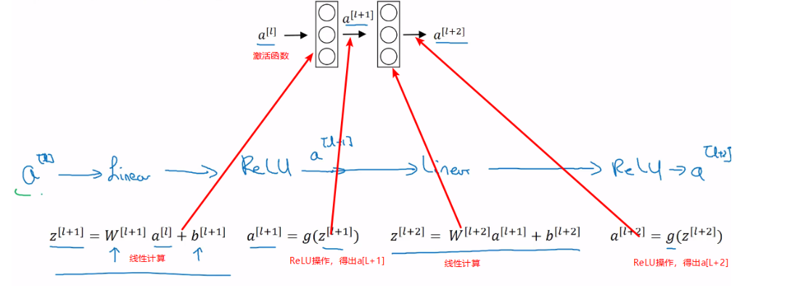


* **残差块**

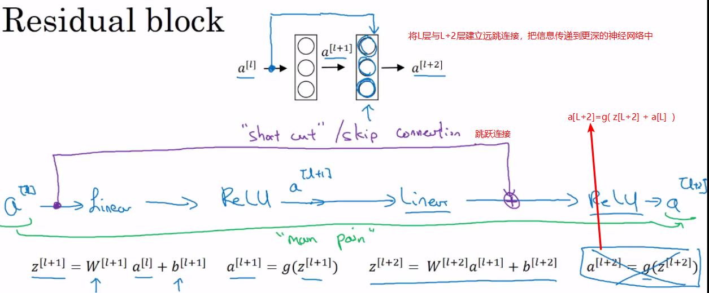


> **建立ResNet的方法：通过大量的残差块并堆叠起来，形成一个深层网络**


##### 具体流程

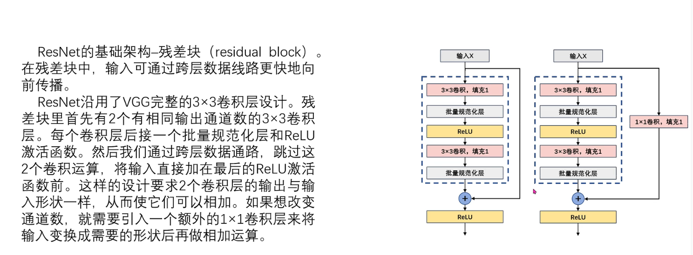


> **普通的残差结构`先通过1x1卷积进行`降维，`最后通过1x1卷积`升维**

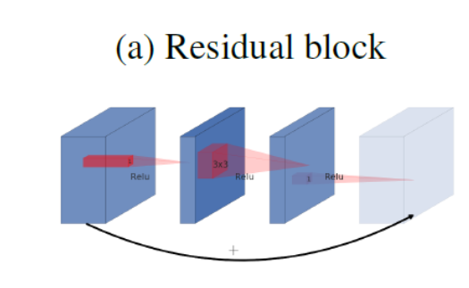


* **Residual block先用1x1卷积核降低通道再用ReLU**
* **然后用3x3卷积过ReLU**
* **最后再用1x1卷积过ReLU恢复通道，并和输入相加**
* **之所以要1*1卷积降通道，是为了减少计算量，不然中间的3x3卷积计算量太大。所以Residual block是中间窄两头宽。**


##### 例子

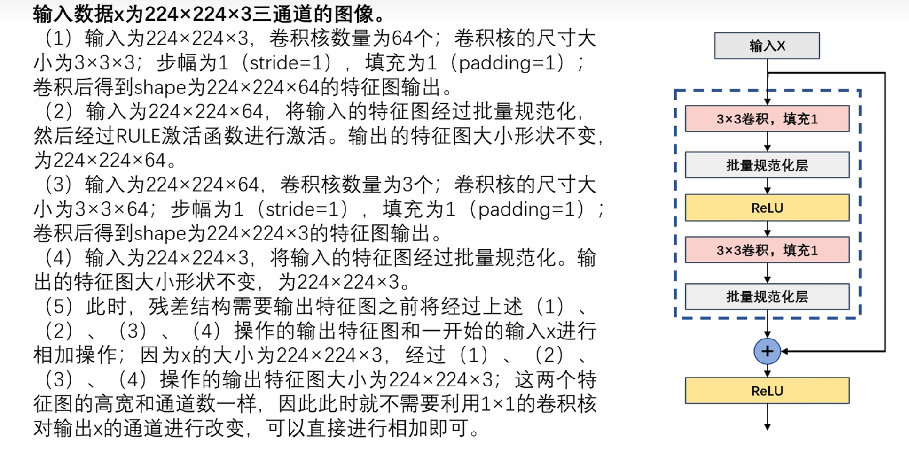


#### 残差网络

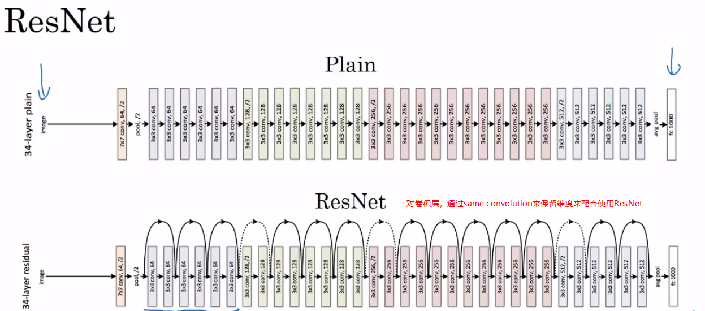

>**使用ReLU，所有的激活a≥0**


##### **ResNet-18**

​                                      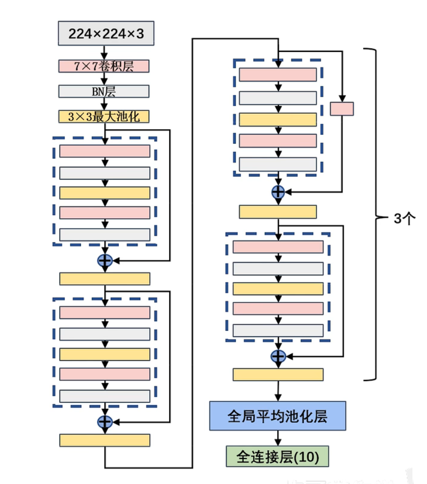 

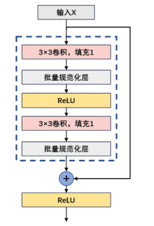                                         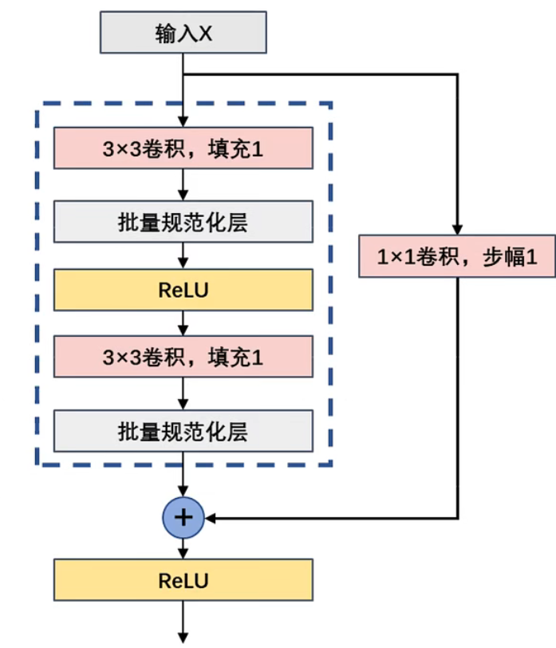


#### 搭建模型

> **以ResNet-18为例**

```python
import torch
from torch import nn
from torchsummary import summary

# 残差块
class Residual(nn.Module):
    def __init__(self,in_channels,out_channels,strides=1,has_1_conv=False):
        super(Residual, self).__init__()

        # 卷积
        self.conv1=nn.Conv2d(in_channels=in_channels,out_channels=out_channels,kernel_size=3,padding=1,stride=strides)
        self.conv2 = nn.Conv2d(in_channels=out_channels,out_channels=out_channels,kernel_size=3,padding=1)

        # BN:根据通道进行批量归一化
        self.bn1=nn.BatchNorm2d(out_channels)
        self.bn2 = nn.BatchNorm2d(out_channels)

        # 1*1卷积
        if has_1_conv:
            self.conv3=nn.Conv2d(in_channels=in_channels,out_channels=out_channels,kernel_size=1,stride=strides)
        else:
            self.conv3=None

        # ReLU激活函数
        self.ReLU=nn.ReLU()

    # 前向传播
    def forward(self,x):
        # 卷积 → 批量规范化 → 激活函数
        y = self.ReLU(self.bn1(self.conv1(x)))
        y = self.ReLU(self.bn2(self.conv2(y)))

        # 如果1*1卷积存在
        if self.conv3:
            x=self.conv3(x)

        return self.ReLU(y+x)

# 残差网络: 输入为1*224*224
class ResNet18(nn.Module):
    def __init__(self,Residual):
        super(ResNet18, self).__init__()

        self.b1=nn.Sequential(
            nn.Conv2d(in_channels=1,out_channels=64,kernel_size=7,padding=3,stride=2),
            nn.ReLU(),
            nn.BatchNorm2d(64),
            nn.MaxPool2d(kernel_size=3,padding=1,stride=2)
        )

        self.b2=nn.Sequential(
            Residual(in_channels=64,out_channels=64,strides=1,has_1_conv=False),
            Residual(in_channels=64,out_channels=64,strides=1,has_1_conv=False)
        )

        self.b3=nn.Sequential(
            Residual(in_channels=64, out_channels=128, strides=2, has_1_conv=True),
            Residual(in_channels=128, out_channels=128, strides=1, has_1_conv=False)
        )

        self.b4 = nn.Sequential(
            Residual(in_channels=128, out_channels=256, strides=2, has_1_conv=True),
            Residual(in_channels=256, out_channels=256, strides=1, has_1_conv=False)
        )

        self.b5 = nn.Sequential(
            Residual(in_channels=256, out_channels=512, strides=2, has_1_conv=True),
            Residual(in_channels=512, out_channels=512, strides=1, has_1_conv=False)
        )

        self.b6=nn.Sequential(
            # GAP全局平均池化层
            nn.AdaptiveAvgPool2d((1,1)),
            # 扁平化
            nn.Flatten(),
            # 全连接层: 这里为10分类
            nn.Linear(512,10)
        )

    # 前向传播
    def forward(self,x):
        x = self.b1(x)
        x = self.b2(x)
        x = self.b3(x)
        x = self.b4(x)
        x = self.b5(x)
        return  self.b6(x)


if __name__ == '__main__':
    device=torch.device("cuda" if torch.cuda.is_available() else "cpu")
    model=ResNet18(Residual).to(device)
    print(summary(model,input_size=(1,224,224)))
```

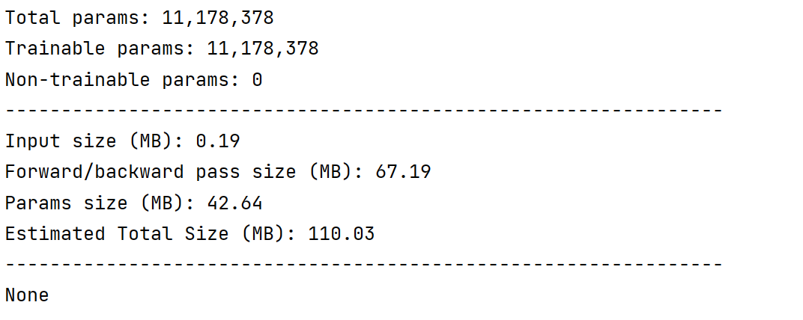


#### 模型训练

```python
import torch
import torch.nn as nn
import torch.utils.data as Data
import matplotlib.pyplot as plt
from torchvision import datasets, transforms
import pandas as pd
import time
import copy
# 导入自己的模型
from model import Residual,ResNet18


# 处理训练集
def data_process():
    # 下载FashionMNIST训练集到当前data目录下
    train_dataset = datasets.FashionMNIST(root="./data",
                                          train=True,
                                          transform=transforms.Compose([
                                              transforms.Resize(size=224),  # 将大小变为224*224
                                              transforms.ToTensor()]),
                                          download=True)

    # 划分数据集:将训练集划分80%的训练集和20%的验证集
    train_data, val_data = Data.random_split(train_dataset,
                                             [round(0.8 * len(train_dataset)), round(0.2 * len(train_dataset))])

    # 每次批处理数量为256个;num_workers:使用4个子进程进行数据加载,适当调整获得最佳的性能和资源利用率
    train_dataloader = Data.DataLoader(dataset=train_data, batch_size=256, shuffle=True, num_workers=4)
    validation_dataloader = Data.DataLoader(dataset=val_data, batch_size=256, shuffle=True, num_workers=4)
    return train_dataloader, validation_dataloader


# 训练数据
def train_model_process(model, train_loader, val_loader, epochs):
    device = "cuda" if torch.cuda.is_available else "cpu"
    # 将模型送往GPU
    model = model.to(device)

    # 使用Adam优化器,学习率为0.001
    optimizer = torch.optim.Adam(model.parameters(), lr=0.001)

    # 定义一个损失函数:交叉熵损失,通常用于分类问题，特别是多类别分类问题
    loss_fn = nn.CrossEntropyLoss()

    # 复制当前模型的参数
    best_model_wts = copy.deepcopy(model.state_dict())

    # 最高准确度
    best_acc = 0.0
    # 训练集总loss列表
    train_loss_all = []
    # 验证集总loss列表
    val_loss_all = []

    # 训练集准确度列表
    train_acc_all = []
    # 验证集准确度列表
    val_acc_all = []

    # 保存开始时间
    since = time.time()

    # 迭代epoch
    for epoch in range(epochs):
        print(f"epoch {epoch}/{epochs - 1}")
        print("-" * 10)

        # 初始化训练集的loss
        train_loss = 0.0
        # 初始化训练集的准确度
        train_corrects = 0
        # 初始化验证集的loss
        val_loss = 0.0
        # 初始化验证集的准确度
        val_corrects = 0

        # 训练集样本数量
        train_num = 0
        # 验证集样本数量
        val_num = 0

        # 训练过程
        for step, (b_x, b_y) in enumerate(train_loader):
            # 将特征与标签放入GPU中
            b_x, b_y = b_x.to(device), b_y.to(device)
            # 将模型设置为训练模式
            model.train()
            # 前向传播，输入一个batch，输出对应的预测值
            output = model(b_x)
            # 输出output一行中的最大的概率值: pre_label: tensor([8, 5, 9, 2, 9, 5, 7, 1, 4, 1, 2, 1, 3, 1, 9, 7, 5, 5, 7, 4, 4, 6, 5, 5,8, 2, 7, 8, 2, 7, 9, 1], device='cuda:0') torch.Size([32])
            pre_label = torch.argmax(output, dim=1)
            # 计算损失值
            loss = loss_fn(output, b_y)

            # 将梯度置为0
            optimizer.zero_grad()
            # 反向传播计算
            loss.backward()
            # 根据网络反向传播的梯度信息来更新网络参数
            optimizer.step()

            # 对损失函数累加loss值
            train_loss += loss.item() * b_x.size(0)
            # 对预测正确的准确度叠加
            train_corrects += torch.sum(pre_label == b_y.data)

            train_num += b_x.size(0)

        # 验证过程
        for step, (b_x, b_y) in enumerate(val_loader):
            b_x, b_y = b_x.to(device), b_y.to(device)
            # 设置模型为评估模式
            model.eval()
            # 前向传播，输入一个batch，输出对应的预测值
            output = model(b_x)
            # 输出output一行中的最大的概率值
            pre_label = torch.argmax(output, dim=1)
            # 计算损失值
            loss = loss_fn(output, b_y)

            # 对损失函数累加loss值
            val_loss += loss.item() * b_x.size(0)
            # 对预测正确的准确度叠加
            val_corrects += torch.sum(pre_label == b_y.data)

            val_num += b_x.size(0)

        # 保存每一次epoch迭代的训练集、验证集的loss值、准确率
        train_loss_all.append(train_loss / train_num)
        train_acc_all.append(train_corrects.double().item() / train_num)
        val_loss_all.append(val_loss / val_num)
        val_acc_all.append(val_corrects.double().item() / val_num)

        # 打印每个epoch列表叠加后的最后一次值
        print("{} Train Loss: {:.4f} Train Acc: {:.4f}".format(epoch, train_loss_all[-1], train_acc_all[-1]))
        print("{} Val Loss: {:.4f} Val Acc: {:.4f}".format(epoch, val_loss_all[-1], val_acc_all[-1]))

        # 寻找验证集的最高的准确度(最新的一个)
        if val_acc_all[-1] > best_acc:
            # 更新准确度
            best_acc = val_acc_all[-1]
            # 保存当前的最高准确度模型
            best_model_wts = copy.deepcopy(model.state_dict())

        # 训练总耗时时间
        time_use = time.time() - since
        print("训练耗费时间：{:.0f}m:{:.0f}s".format(time_use // 60, time_use % 60))

    # 将最高准确率下的模型参数保存到路径下
    torch.save(best_model_wts, "/content/drive/MyDrive/Colab Notebooks/model_results/ResNet18.pth")

    # 保存相关信息
    train_process = pd.DataFrame(data={
        "epoch": range(epochs),
        "train_loss_all": train_loss_all,
        "val_loss_all": val_loss_all,
        "train_acc_all": train_acc_all,
        "val_acc_all": val_acc_all
    })

    return train_process


# 画loss、acc图
def draw_acc_loss(train_process):
    # 创建一个大小为 12x4 的图形窗口
    plt.figure(figsize=(12, 4))
    # subplot(num_rows, num_cols, plot_number):将图形窗口划分为 1 行 2 列的布局,并选择第一个位置作为当前子图
    plt.subplot(1, 2, 1)
    # x轴数据为train_process["epoch"],y轴数据为train_process.train_loss_all,"ro-"设置线条颜色和样式，label="train loss"设置图例标签
    plt.plot(train_process["epoch"], train_process.train_loss_all, "ro-", label="train loss")
    # x轴数据为train_process["epoch"],y轴数据为train_process.val_loss_all,"bs-"设置线条颜色和样式，label="val loss"设置图例标签
    plt.plot(train_process["epoch"], train_process.val_loss_all, "bs-", label="val loss")
    # 用于显示图例
    plt.legend()
    # 设置 x 轴标签为 "epoch"
    plt.xlabel("epoch")
    # 设置 y 轴标签为 "loss"
    plt.ylabel("loss")

    plt.subplot(1, 2, 2)
    plt.plot(train_process["epoch"], train_process.train_acc_all, "ro-", label="train acc")
    plt.plot(train_process["epoch"], train_process.val_acc_all, "bs-", label="val acc")
    plt.legend()
    plt.xlabel("epoch")
    plt.ylabel("acc")
    plt.legend()
    plt.show()


# 开始训练
if __name__ == '__main__':
    # 实例化模型
    model = ResNet18(Residual)

    # 20轮epoch
    epochs = 20

    # 处理数据
    train_dataloader, validation_dataloader = data_process()
    # 开始训练
    train_process = train_model_process(model, train_dataloader, validation_dataloader, epochs)
    # 画图
    draw_acc_loss(train_process)
    print("done")
```

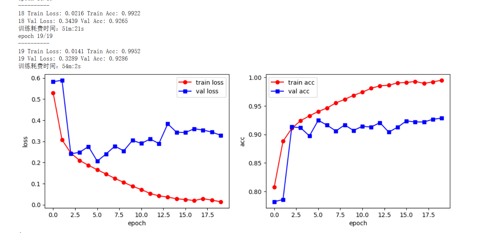


#### 模型验证

```python
import torch
import torch.utils.data as Data
from torchvision import datasets, transforms
# 导入自己的模型
from model import ResNet18,Residual


# 处理测试集
def data_process():
    # 下载FashionMNIST测试集
    test_dataset = datasets.FashionMNIST(root="./data",
                                         train=False,
                                         transform=transforms.Compose([
                                             transforms.Resize(size=224),  # 将大小变为224*224
                                             transforms.ToTensor()]),
                                         download=True)
    # DataLoader默认的批处理大小为1,将每个样本作为一个独立的批次进行处理,使用4个子进程进行数据加载
    test_dataloader = Data.DataLoader(dataset=test_dataset, batch_size=256, shuffle=True, num_workers=4)
    return test_dataloader


# 测试模型,输出正确率
def test_model_process(model, test_loader):
    # 将模型送往GPU
    device = torch.device("cuda" if torch.cuda.is_available else "cpu")
    model = model.to(device)

    # 测试集精度
    test_corrects = 0.0
    # 测试集数量
    test_num = 0

    # 只进行前向传播,不进行梯度计算、反向传播
    with torch.no_grad():
        for x_test, y_test in test_loader:
            # 将测试集送往GPU
            x_test, y_test = x_test.to(device), y_test.to(device)
            # 设置模型为评估模式
            model.eval()

            # 调用模型进行预测
            output = model(x_test)
            # 返回预测结果中每行的最大值
            pre_label = torch.argmax(output, dim=1)
            """
              pre_label:  tensor([8, 5, 9, 2, 9, 5, 7, 1, 4, 1, 2, 1, 3, 1, 9, 7, 5, 5, 7, 4, 4, 6, 5, 5,8, 2, 7, 8, 2, 7, 9, 1], device='cuda:0') torch.Size([32])
              y_test:     tensor([8, 5, 9, 2, 9, 5, 7, 1, 2, 1, 4, 1, 3, 1, 9, 5, 5, 5, 7, 6, 4, 6, 5, 5,8, 2, 7, 8, 2, 7, 9, 1], device='cuda:0') torch.Size([32])
            """

            test_corrects += torch.sum(pre_label == y_test.data)
            test_num += x_test.size(0)

    # 计算准确率
    test_acc = test_corrects.double().item() / test_num
    print("测试的准确率：", test_acc)


# 测试集推理
def test_tuili(model, test_dataloader):
    device = torch.device("cuda" if torch.cuda.is_available else "cpu")
    model = model.to(device)

    # 目标值为0-9的对应下来的类别为
    classes = ["T-shirt/top", "Trouser", "Pullover", "Dress", "Coat", "Sandal", "Shirt", "Sneaker", "Bag", "Ankle boot"]

    # 只进行前向传播,不进行梯度计算、反向传播
    with torch.no_grad():
        i = 0
        for x_test, y_test in test_dataloader:
            x_test, y_test = x_test.to(device), y_test.to(device)
            # 设置模型为评估模式
            model.eval()
            # 调用模型进行预测
            output = model(x_test)

            # 返回预测结果中每行的最大值
            pre_label = torch.argmax(output, dim=1)

            """
              pre_label:  tensor([8, 5, 9, 2, 9, 5, 7, 1, 4, 1, 2, 1, 3, 1, 9, 7, 5, 5, 7, 4, 4, 6, 5, 5,8, 2, 7, 8, 2, 7, 9, 1], device='cuda:0') torch.Size([32])
              y_test:     tensor([8, 5, 9, 2, 9, 5, 7, 1, 2, 1, 4, 1, 3, 1, 9, 5, 5, 5, 7, 6, 4, 6, 5, 5,8, 2, 7, 8, 2, 7, 9, 1], device='cuda:0') torch.Size([32])
            """

            # 如果batch_size为1个批次,则使用下面四行代码
            #             result=pre_label.item()
            #             label=y_test.item()
            #             print("预测值：",result," 真实值：",label)
            #             print("预测值类别：",classes[result]," 真实值类别：",classes[label])

            i = i + 1
            if i < 2:
                # batch_size>1的情况
                for result, label in zip(pre_label, y_test):
                    # 这里的result和label是预测值、真实值,并不是索引
                    print("预测值：", result.item(), " 真实值：", label.item())
                    print("预测值类别：", classes[result.item()], " 真实值类别：", classes[label.item()])

            else:
                break

if __name__ == '__main__':
    model = ResNet18(Residual)
    model.load_state_dict(torch.load("/content/drive/MyDrive/Colab Notebooks/model_results/ResNet18.pth"))
    test_dataloader = data_process()

    test_model_process(model, test_dataloader)
    print("===")
    test_tuili(model,test_dataloader)
```

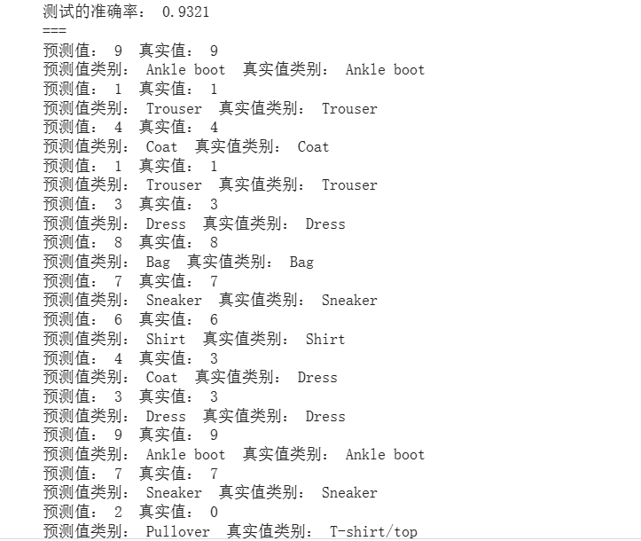


### Inception Network (GoogLeNet)

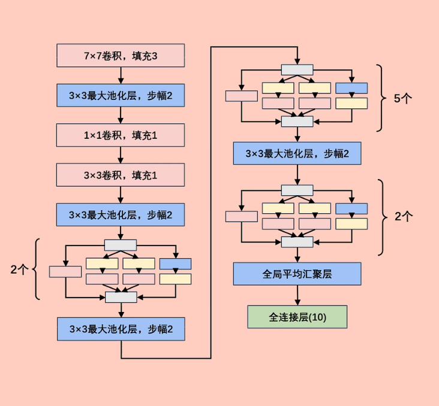


#### 1x1 卷积核

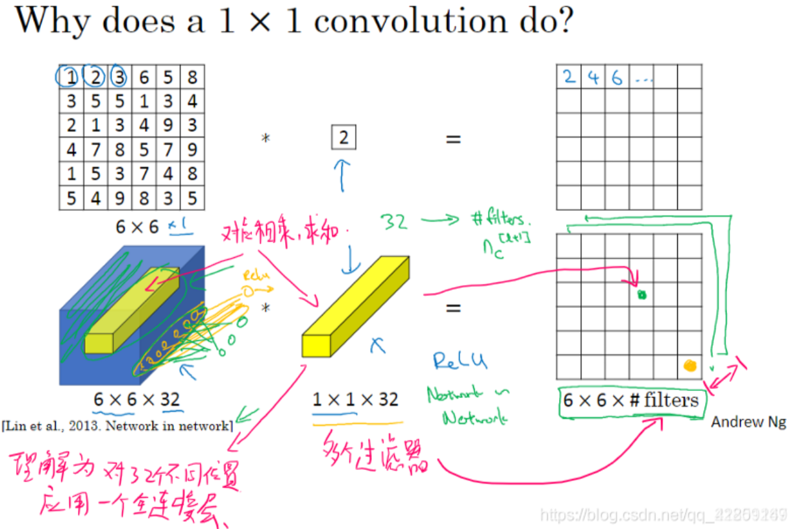

* **1x1卷积核本质上是一个full connected的神经网络，逐一作用这36个不同的位置，然后运用ReLU非线性函数**


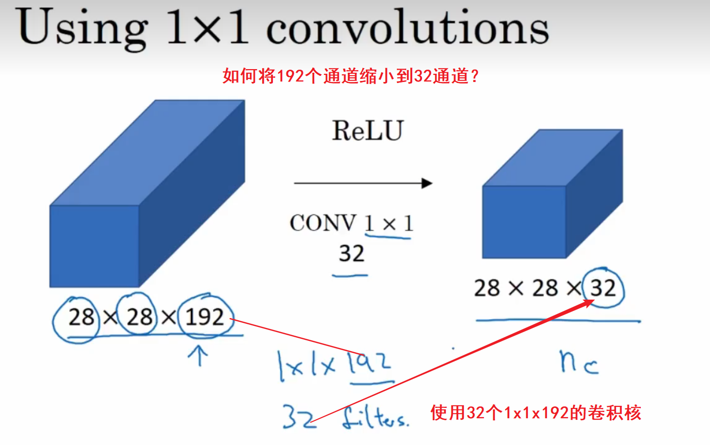

* **`可以缩小或保持通道数量`**


##### 计算成本对比

==**普通卷积计算成本**==

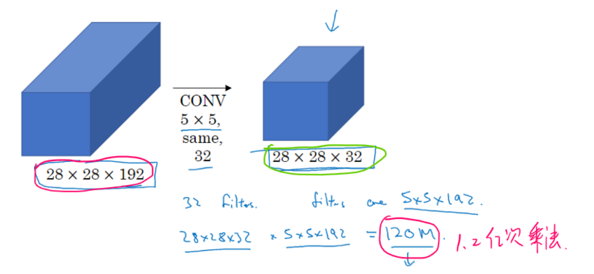

==**使用1x1卷积核**==

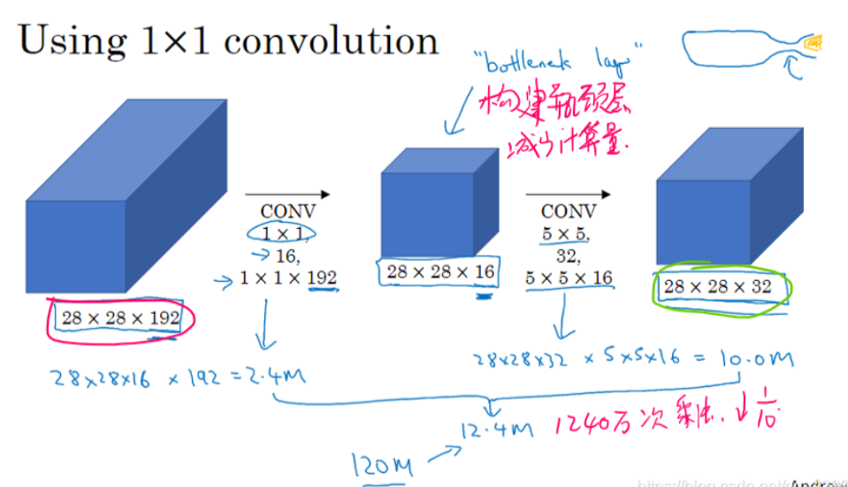

> **通过使用1×1卷积核来构建瓶颈层，从而大大降低计算成本。`事实证明，只要合理构建瓶颈层，既可以显著缩小表示层规模，又不会降低网络性能，从而节省了计算`**


#### 全局平均池化层GAP

> **GAP将每个通道的图像（任意w*h的图片）做平均池化输出一个神经元，`n个通道的图像最终会变成n个神经元，即w*h*channel → 1*1*channel`**

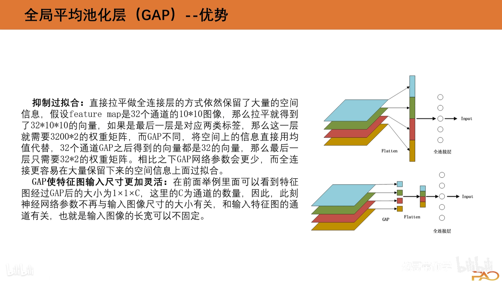

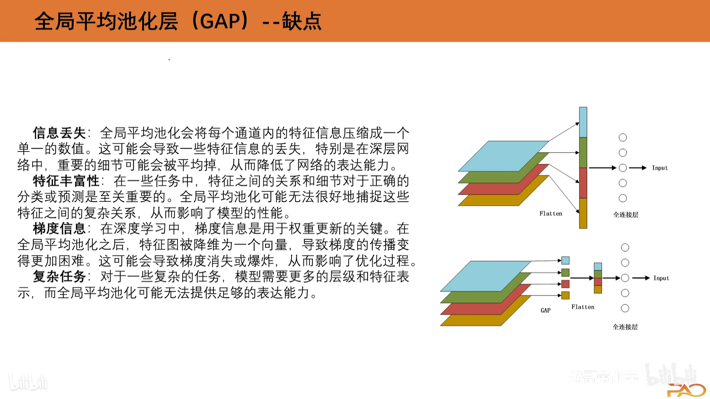


#### Inception层

> **如果你在建立一个卷积网络层，并且你不想决定到底使用1x1、3x3、还是5x5的卷积核或者是否使用pooling，那么就是用Inception模型，它会做所有的工作，并会将所有的结果都连接起来**

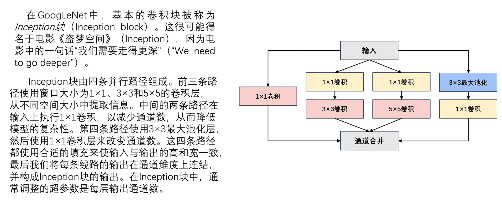

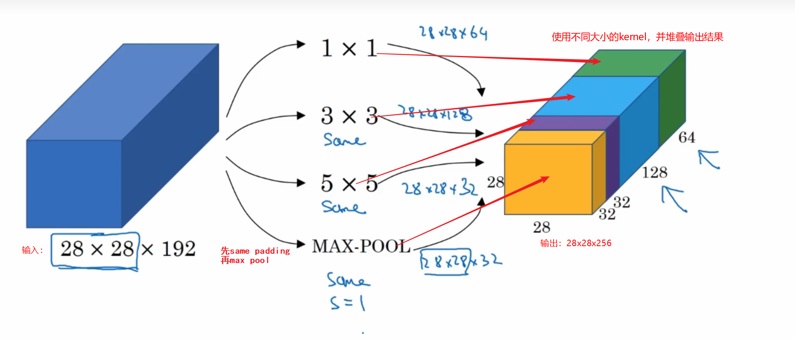


#### Inception Network

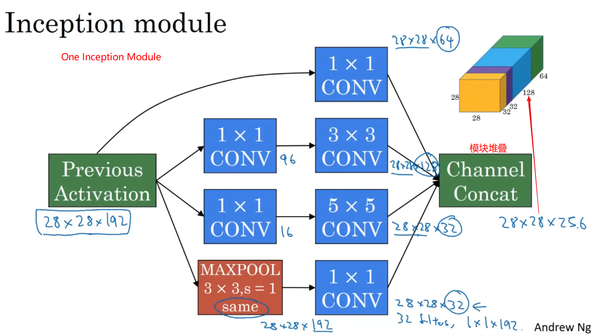

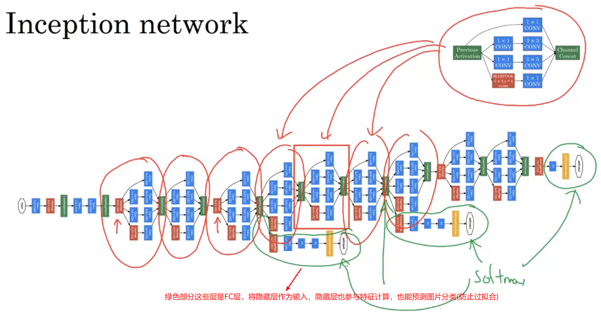

>  **总结：Inception 网络不需要人为决定使用哪个过滤器、是否池化，而是由网络自行确定这些参数，你可以给网络添加这些参数的所有可能值，然后把这些输出堆叠起来，让网络自己学习它需要什么样的参数，采用哪些过滤器组合，虽然网络架构变得更加复杂，但网络表现却非常好**


#### 搭建模型

```python
import torch
from torch import nn
from torchsummary import summary

# Inception层
class Inception(nn.Module):
    """
        in_channels:输入通道
        p1_filters:输出通道
        p2_filters(第一步卷积核数量,第二步卷积核数量):输出通道
        p3_filters(第一步卷积核数量,第二步卷积核数量):输出通道
        p4_filters:输出通道
    """
    def __init__(self,in_channels,p1_filters,p2_filters,p3_filters,p4_filters):
        super(Inception, self).__init__()
        # 路线1: 1*1卷积
        self.p1_1=nn.Conv2d(in_channels=in_channels,out_channels=p1_filters,kernel_size=1)

        # 路线2: 1*1卷积 -> 3*3卷积
        self.p2_1=nn.Conv2d(in_channels=in_channels,out_channels=p2_filters[0],kernel_size=1)
        self.p2_2 = nn.Conv2d(in_channels=p2_filters[0], out_channels=p2_filters[1], kernel_size=3,padding=1)

        # 路线3: 1*1卷积 -> 5*5卷积
        self.p3_1 = nn.Conv2d(in_channels=in_channels, out_channels=p3_filters[0], kernel_size=1)
        self.p3_2 = nn.Conv2d(in_channels=p3_filters[0], out_channels=p3_filters[1], kernel_size=5, padding=2)

        # 路线4: 3*3最大池化 -> 1*1卷积
        self.p4_1 = nn.MaxPool2d(kernel_size=3,padding=1,stride=1)
        self.p4_2 = nn.Conv2d(in_channels=in_channels, out_channels=p4_filters, kernel_size=1)

        self.ReLU=nn.ReLU()

    # 前向传播
    def forward(self,x):
        # 计算路径1
        p1 = self.ReLU(self.p1_1(x))
        # 计算路径2
        p2 = self.ReLU(self.p2_2(self.ReLU(self.p2_1(x))))
        # 计算路径3
        p3 = self.ReLU(self.p3_2(self.ReLU(self.p3_1(x))))
        # 计算路径4
        p4 = self.ReLU(self.p4_2(self.p4_1(x)))

        # 按通道融合
        # p1~p4都是(batch_size,不同的通道数,w,h)的tensor,只是通道数不同,按dim=1即通道数融合
        return torch.cat(tensors=(p1,p2,p3,p4),dim=1)


# 输入224*224*1的图像
class MyGoogLeNet(nn.Module):
    def __init__(self,Inception):
        super(MyGoogLeNet, self).__init__()

        self.b1=nn.Sequential(
            #  [-1, 64, 112, 112]
            nn.Conv2d(in_channels=1,out_channels=64,kernel_size=7,stride=2,padding=3),
            nn.ReLU(),
            #  [-1, 64, 56, 56]
            nn.MaxPool2d(kernel_size=3,stride=2,padding=1)
        )

        self.b2=nn.Sequential(
            #  [-1, 64, 56, 56]
            nn.Conv2d(in_channels=64, out_channels=64, kernel_size=1),
            nn.ReLU(),
            #  [-1, 192, 56, 56]
            nn.Conv2d(in_channels=64, out_channels=192, kernel_size=3,padding=1),
            nn.ReLU(),
            # [-1, 192, 28, 28]
            nn.MaxPool2d(kernel_size=3, stride=2, padding=1)
        )

        self.b3=nn.Sequential(
            Inception(192,64,(96,128),(16,32),32),
            Inception(256,128,(128,192),(32,96),64),
            nn.MaxPool2d(kernel_size=3, stride=2, padding=1)
        )

        self.b4=nn.Sequential(
            Inception(480,192,(96,208),(16,48),64),
            Inception(512,160,(112,224),(24,64),64),
            Inception(512, 128, (128, 256), (24, 64), 64),
            Inception(512, 112, (128, 288), (32, 64), 64),
            Inception(528, 256, (160, 320), (32, 128), 128),
            nn.MaxPool2d(kernel_size=3, stride=2, padding=1)
        )

        self.b5 = nn.Sequential(
            Inception(832, 256, (160, 320), (32, 128), 128),
            Inception(832, 384, (192, 384), (48, 128), 128),
            # 全局平均池化层：将(batch_size,channels,w,h)的张量变为(batch_size,channels,1,1)
            # [-1, 1024, 1, 1]
            nn.AdaptiveAvgPool2d((1,1)),
            # 扁平化：[-1, 1024]
            nn.Flatten(),
            # 输出10分类任务
            nn.Linear(1024,10)
        )

        """
            对于VGG16,GoogleNet这类深层次的网络，权重不初始化、batch_size不合适
            都会导致训练几十轮之后不收敛，并且loss值和acc值效果不好。
        """
        # 遍历网络中的每个模块的参数
        for m in self.modules():
            # 如果是卷积层的实例
            if isinstance(m, nn.Conv2d):
                # 对该卷积层的权重进行初始化,使用输出连接数来调整权重的标准差,使用relu作为非线性函数,使其更快的在训练过程中收敛
                nn.init.kaiming_normal_(m.weight,mode="fan_out", nonlinearity="relu")
                # 并对其偏置设为0
                if m.bias is not None:
                    nn.init.constant_(m.bias, 0)

            # 如果是fc的实例
            elif isinstance(m, nn.Linear):
                # 对全连接层的权重按照均值为0，标准差为0.01的正态分布进行初始化
                nn.init.normal_(m.weight, 0, 0.01)
                # 并对其偏置设为0
                if m.bias is not None:
                    nn.init.constant_(m.bias, 0)

    # 前向传播
    def forward(self,x):
        x=self.b1(x)
        x=self.b2(x)
        x=self.b3(x)
        x=self.b4(x)
        x=self.b5(x)
        return x

if __name__ == '__main__':
    device=torch.device("cuda" if torch.cuda.is_available() else "cpu")
    model=MyGoogLeNet(Inception).to(device)
    summary(model,(1,224,224))
```

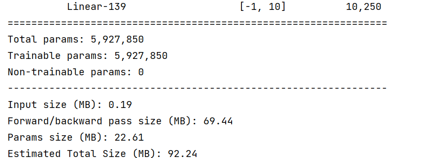 


#### 模型训练

```python
import torch
import torch.nn as nn
import numpy as np
import torch.utils.data as Data
import matplotlib.pyplot as plt
from torchvision import datasets, transforms
import pandas as pd
import time
import copy
# 导入自己的模型
from model import MyGoogLeNet, Inception


# 处理训练集
def data_process():
    # 下载FashionMNIST训练集到当前data目录下
    train_dataset = datasets.FashionMNIST(root="./data",
                                          train=True,
                                          transform=transforms.Compose([
                                              transforms.Resize(size=224),  # 将大小变为224*224
                                              transforms.ToTensor()]),
                                          download=True)

    # 划分数据集:将训练集划分80%的训练集和20%的验证集
    train_data, val_data = Data.random_split(train_dataset,
                                             [round(0.8 * len(train_dataset)), round(0.2 * len(train_dataset))])

    # 每次批处理数量为128个;num_workers:使用4个子进程进行数据加载,适当调整获得最佳的性能和资源利用率
    train_dataloader = Data.DataLoader(dataset=train_data, batch_size=128, shuffle=True, num_workers=4)
    validation_dataloader = Data.DataLoader(dataset=val_data, batch_size=128, shuffle=True, num_workers=4)
    return train_dataloader, validation_dataloader


# 训练数据
def train_model_process(model, train_loader, val_loader, epochs):
    device = "cuda" if torch.cuda.is_available else "cpu"
    # 将模型送往GPU
    model = model.to(device)

    # 使用Adam优化器,学习率为0.001
    optimizer = torch.optim.Adam(model.parameters(), lr=0.001)

    # 定义一个损失函数:交叉熵损失,通常用于分类问题，特别是多类别分类问题
    loss_fn = nn.CrossEntropyLoss()

    # 复制当前模型的参数
    best_model_wts = copy.deepcopy(model.state_dict())

    # 最高准确度
    best_acc = 0.0
    # 训练集总loss列表
    train_loss_all = []
    # 验证集总loss列表
    val_loss_all = []

    # 训练集准确度列表
    train_acc_all = []
    # 验证集准确度列表
    val_acc_all = []

    # 保存开始时间
    since = time.time()

    # 迭代epoch
    for epoch in range(epochs):
        print(f"epoch {epoch}/{epochs - 1}")
        print("-" * 10)

        # 初始化训练集的loss
        train_loss = 0.0
        # 初始化训练集的准确度
        train_corrects = 0
        # 初始化验证集的loss
        val_loss = 0.0
        # 初始化验证集的准确度
        val_corrects = 0

        # 训练集样本数量
        train_num = 0
        # 验证集样本数量
        val_num = 0

        # 训练过程
        for step, (b_x, b_y) in enumerate(train_loader):
            # 将特征与标签放入GPU中
            b_x, b_y = b_x.to(device), b_y.to(device)
            # 将模型设置为训练模式
            model.train()
            # 前向传播，输入一个batch，输出对应的预测值
            output = model(b_x)
            # 输出output一行中的最大的概率值: pre_label: tensor([8, 5, 9, 2, 9, 5, 7, 1, 4, 1, 2, 1, 3, 1, 9, 7, 5, 5, 7, 4, 4, 6, 5, 5,8, 2, 7, 8, 2, 7, 9, 1], device='cuda:0') torch.Size([32])
            pre_label = torch.argmax(output, dim=1)
            # 计算损失值
            loss = loss_fn(output, b_y)

            # 将梯度置为0
            optimizer.zero_grad()
            # 反向传播计算
            loss.backward()
            # 根据网络反向传播的梯度信息来更新网络参数
            optimizer.step()

            # 对损失函数累加loss值
            train_loss += loss.item() * b_x.size(0)
            # 对预测正确的准确度叠加
            train_corrects += torch.sum(pre_label == b_y.data)

            train_num += b_x.size(0)

        # 验证过程
        for step, (b_x, b_y) in enumerate(val_loader):
            b_x, b_y = b_x.to(device), b_y.to(device)
            # 设置模型为评估模式
            model.eval()
            # 前向传播，输入一个batch，输出对应的预测值
            output = model(b_x)
            # 输出output一行中的最大的概率值
            pre_label = torch.argmax(output, dim=1)
            # 计算损失值
            loss = loss_fn(output, b_y)

            # 对损失函数累加loss值
            val_loss += loss.item() * b_x.size(0)
            # 对预测正确的准确度叠加
            val_corrects += torch.sum(pre_label == b_y.data)

            val_num += b_x.size(0)

        # 保存每一次epoch迭代的训练集、验证集的loss值、准确率
        train_loss_all.append(train_loss / train_num)
        train_acc_all.append(train_corrects.double().item() / train_num)
        val_loss_all.append(val_loss / val_num)
        val_acc_all.append(val_corrects.double().item() / val_num)

        # 打印每个epoch列表叠加后的最后一次值
        print("{} Train Loss: {:.4f} Train Acc: {:.4f}".format(epoch, train_loss_all[-1], train_acc_all[-1]))
        print("{} Val Loss: {:.4f} Val Acc: {:.4f}".format(epoch, val_loss_all[-1], val_acc_all[-1]))

        # 寻找验证集的最高的准确度(最新的一个)
        if val_acc_all[-1] > best_acc:
            # 更新准确度
            best_acc = val_acc_all[-1]
            # 保存当前的最高准确度模型
            best_model_wts = copy.deepcopy(model.state_dict())

        # 训练总耗时时间
        time_use = time.time() - since
        print("训练耗费时间：{:.0f}m:{:.0f}s".format(time_use // 60, time_use % 60))

    # 将最高准确率下的模型参数保存到路径下
    torch.save(best_model_wts, "/content/drive/MyDrive/Colab Notebooks/model_results/googlenet.pth")

    # 保存相关信息
    train_process = pd.DataFrame(data={
        "epoch": range(epochs),
        "train_loss_all": train_loss_all,
        "val_loss_all": val_loss_all,
        "train_acc_all": train_acc_all,
        "val_acc_all": val_acc_all
    })

    return train_process


# 画loss、acc图
def draw_acc_loss(train_process):
    # 创建一个大小为 12x4 的图形窗口
    plt.figure(figsize=(12, 4))
    # subplot(num_rows, num_cols, plot_number):将图形窗口划分为 1 行 2 列的布局,并选择第一个位置作为当前子图
    plt.subplot(1, 2, 1)
    # x轴数据为train_process["epoch"],y轴数据为train_process.train_loss_all,"ro-"设置线条颜色和样式，label="train loss"设置图例标签
    plt.plot(train_process["epoch"], train_process.train_loss_all, "ro-", label="train loss")
    # x轴数据为train_process["epoch"],y轴数据为train_process.val_loss_all,"bs-"设置线条颜色和样式，label="val loss"设置图例标签
    plt.plot(train_process["epoch"], train_process.val_loss_all, "bs-", label="val loss")
    # 用于显示图例
    plt.legend()
    # 设置 x 轴标签为 "epoch"
    plt.xlabel("epoch")
    # 设置 y 轴标签为 "loss"
    plt.ylabel("loss")

    plt.subplot(1, 2, 2)
    plt.plot(train_process["epoch"], train_process.train_acc_all, "ro-", label="train acc")
    plt.plot(train_process["epoch"], train_process.val_acc_all, "bs-", label="val acc")
    plt.legend()
    plt.xlabel("epoch")
    plt.ylabel("acc")
    plt.legend()
    plt.show()


# 开始训练
if __name__ == '__main__':
    # 实例化模型
    GooLeNet= MyGoogLeNet(Inception)

    # 20轮epoch
    epochs = 20

    # 处理数据
    train_dataloader, validation_dataloader = data_process()
    # 开始训练
    train_process = train_model_process(GooLeNet, train_dataloader, validation_dataloader, epochs)
    # 画图
    draw_acc_loss(train_process)
    print("done")
```

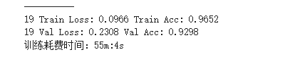 

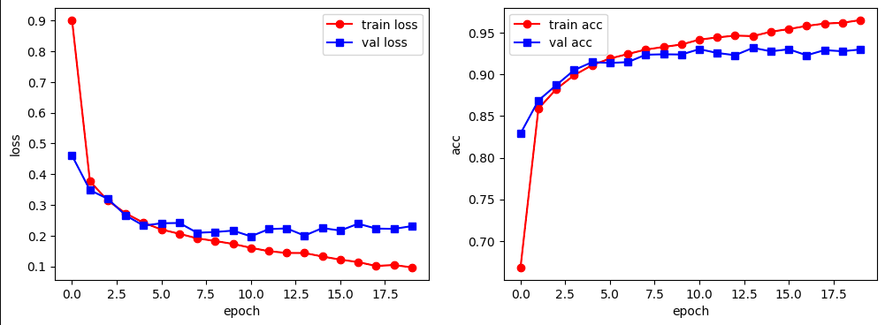

> **`注意：从loss曲线可以看出,在10轮过后,模型开始出现过拟合的现象`**


#### 模型验证

```python
import torch
import torch.utils.data as Data
from torchvision import datasets, transforms
from model import MyGoogLeNet,Inception


# 处理测试集
def data_process():
    # 下载FashionMNIST测试集
    test_dataset = datasets.FashionMNIST(root="./data",
                                         train=False,
                                         transform=transforms.Compose([
                                             transforms.Resize(size=224),  # 将大小变为224*224
                                             transforms.ToTensor()]),
                                         download=True)
    # DataLoader默认的批处理大小为1,将每个样本作为一个独立的批次进行处理,使用4个子进程进行数据加载
    test_dataloader = Data.DataLoader(dataset=test_dataset, batch_size=128, shuffle=True, num_workers=4)
    return test_dataloader


# 测试模型,输出正确率
def test_model_process(model, test_loader):
    # 将模型送往GPU
    device = torch.device("cuda" if torch.cuda.is_available else "cpu")
    model = model.to(device)

    # 测试集精度
    test_corrects = 0.0
    # 测试集数量
    test_num = 0

    # 只进行前向传播,不进行梯度计算、反向传播
    with torch.no_grad():
        for x_test, y_test in test_loader:
            # 将测试集送往GPU
            x_test, y_test = x_test.to(device), y_test.to(device)
            # 设置模型为评估模式
            model.eval()

            # 调用模型进行预测
            output = model(x_test)
            # 返回预测结果中每行的最大值
            pre_label = torch.argmax(output, dim=1)
            """
              pre_label:  tensor([8, 5, 9, 2, 9, 5, 7, 1, 4, 1, 2, 1, 3, 1, 9, 7, 5, 5, 7, 4, 4, 6, 5, 5,8, 2, 7, 8, 2, 7, 9, 1], device='cuda:0') torch.Size([32])
              y_test:     tensor([8, 5, 9, 2, 9, 5, 7, 1, 2, 1, 4, 1, 3, 1, 9, 5, 5, 5, 7, 6, 4, 6, 5, 5,8, 2, 7, 8, 2, 7, 9, 1], device='cuda:0') torch.Size([32])
            """

            test_corrects += torch.sum(pre_label == y_test.data)
            test_num += x_test.size(0)

    # 计算准确率
    test_acc = test_corrects.double().item() / test_num
    print("测试的准确率：", test_acc)


# 测试集推理
def test_tuili(model, test_dataloader):
    device = torch.device("cuda" if torch.cuda.is_available else "cpu")
    model = model.to(device)

    # 目标值为0-9的对应下来的类别为
    classes = ["T-shirt/top", "Trouser", "Pullover", "Dress", "Coat", "Sandal", "Shirt", "Sneaker", "Bag", "Ankle boot"]

    # 只进行前向传播,不进行梯度计算、反向传播
    with torch.no_grad():
        i = 0
        for x_test, y_test in test_dataloader:
            x_test, y_test = x_test.to(device), y_test.to(device)
            # 设置模型为评估模式
            model.eval()
            # 调用模型进行预测
            output = model(x_test)

            # 返回预测结果中每行的最大值
            pre_label = torch.argmax(output, dim=1)

            """
              pre_label:  tensor([8, 5, 9, 2, 9, 5, 7, 1, 4, 1, 2, 1, 3, 1, 9, 7, 5, 5, 7, 4, 4, 6, 5, 5,8, 2, 7, 8, 2, 7, 9, 1], device='cuda:0') torch.Size([32])
              y_test:     tensor([8, 5, 9, 2, 9, 5, 7, 1, 2, 1, 4, 1, 3, 1, 9, 5, 5, 5, 7, 6, 4, 6, 5, 5,8, 2, 7, 8, 2, 7, 9, 1], device='cuda:0') torch.Size([32])
            """

            # 如果batch_size为1个批次,则使用下面四行代码
            #             result=pre_label.item()
            #             label=y_test.item()
            #             print("预测值：",result," 真实值：",label)
            #             print("预测值类别：",classes[result]," 真实值类别：",classes[label])

            i = i + 1
            if i < 2:
                # batch_size>1的情况
                for result, label in zip(pre_label, y_test):
                    # 这里的result和label是预测值、真实值,并不是索引
                    print("预测值：", result.item(), " 真实值：", label.item())
                    print("预测值类别：", classes[result.item()], " 真实值类别：", classes[label.item()])

            else:
                break

if __name__ == '__main__':
    model = MyGoogLeNet(Inception)
    model.load_state_dict(torch.load("/content/drive/MyDrive/Colab Notebooks/model_results/googlenet.pth"))
    test_dataloader = data_process()

    test_model_process(model, test_dataloader)
    test_tuili(model,test_dataloader)
```

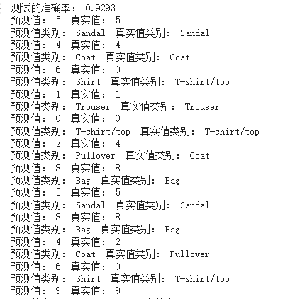 


### Mobile Net

>  **相比常规的卷积操作，其参数数量和运算成本比较低，适用于低配置机器**


#### 深度卷积

> **一个卷积核负责一个通道，一个通道只被一个卷积核卷积**

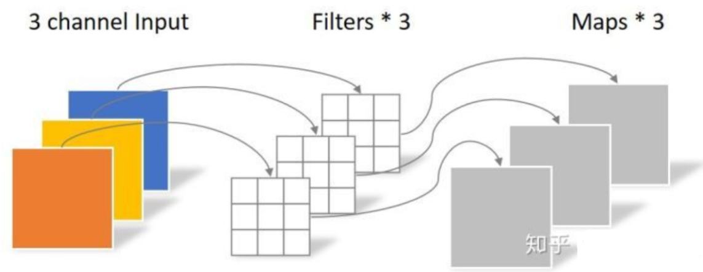


==**eg：以6x6x3的图片为例，输出4x4x3**==

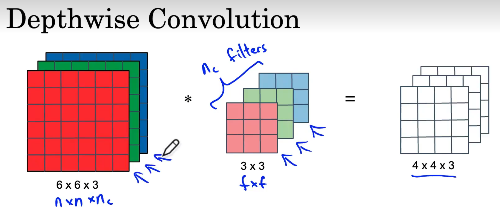 

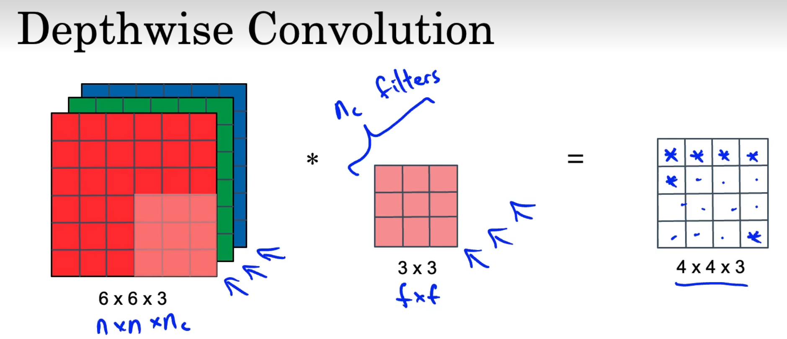 

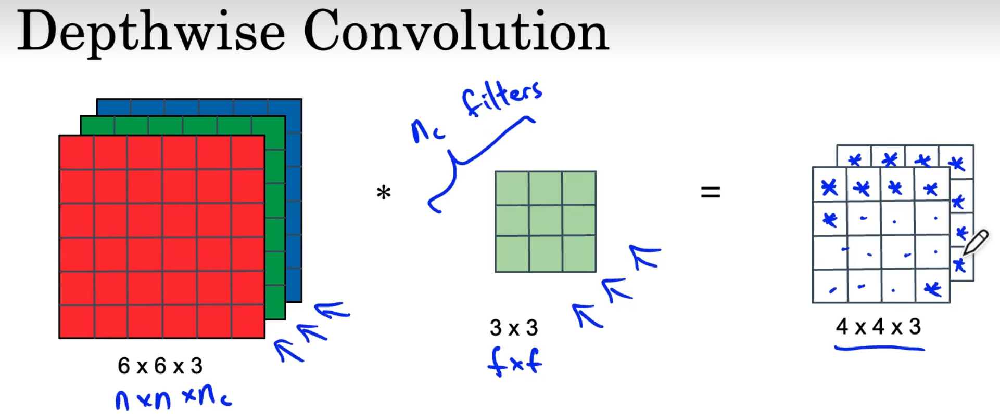 

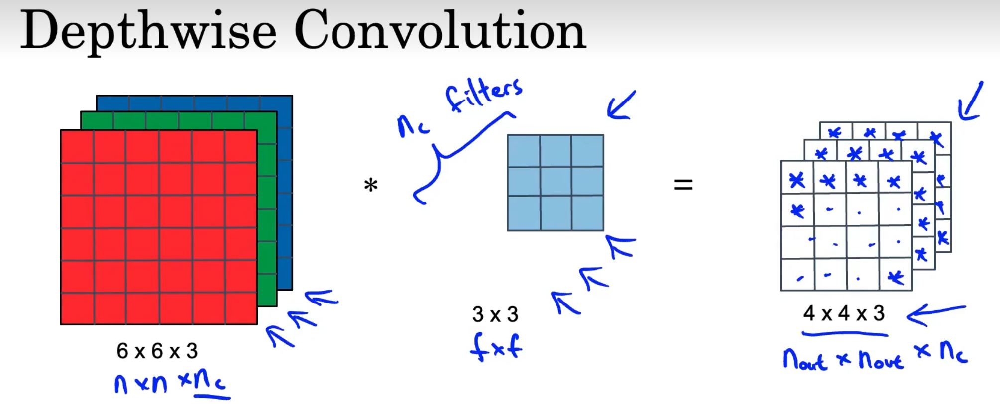 


#### 逐点卷积

> **逐点卷积会将上一步逐通道卷积在深度方向的特征图进行加权组合，生成新的特征图**

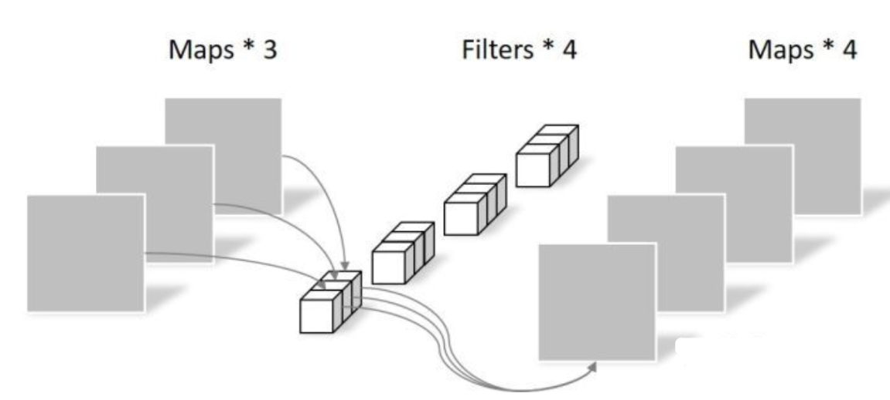

==**eg：以深度卷积的输出结果4x4x3为例，经过5个1x1x3的kernel输出4x4x5**==

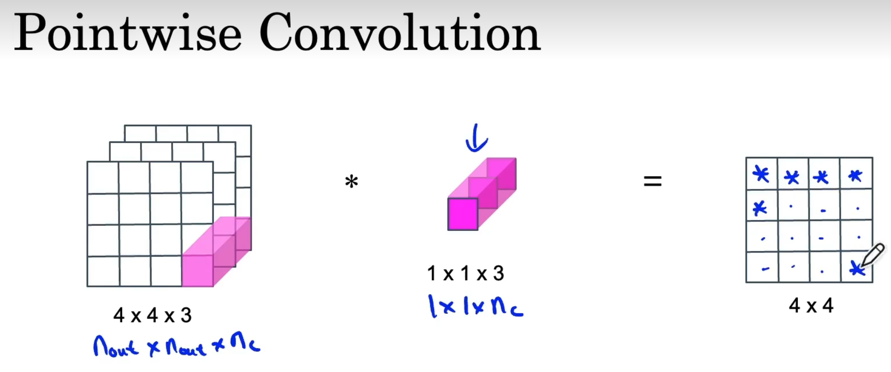 

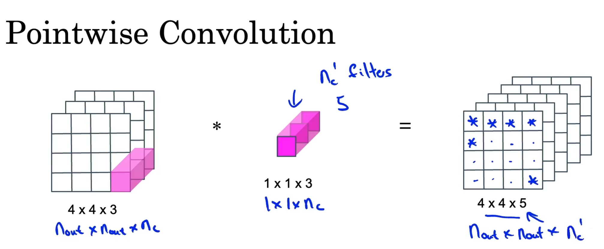 


#### 逆残差

> **首先通过1x1卷积进行`升维`，最后通过1x1卷积进行`降维`**

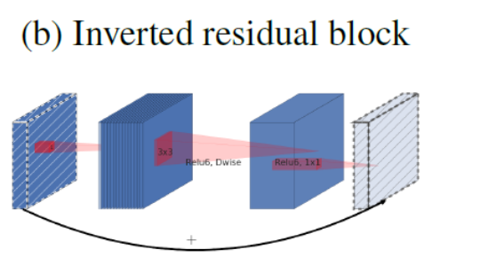

* **通过1x1卷积先提升通道数**
* **然后通过3x3的深度卷积处理**
* **最后通过1x1的卷积核进行降维**
* **所以Inverted residual block是中间宽两头窄**


## 项目实战

### 猫狗大战

> **以GoogleNet为例**


#### 预处理

* 下载数据集：[Download Kaggle Cats and Dogs Dataset from Official Microsoft Download Center](https://www.microsoft.com/en-us/download/details.aspx?id=54765)

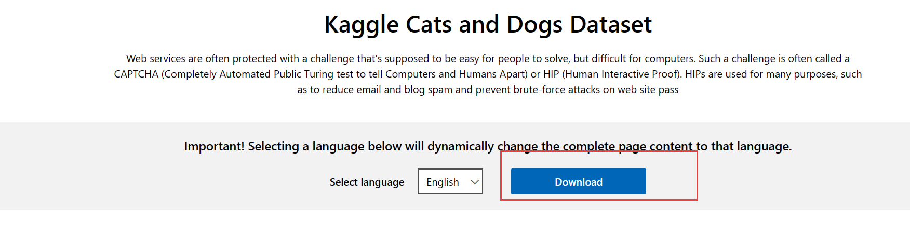


* 解压下载的文件夹：**`将里面的dog和cat文件里的图片检查一遍，删除不能打开的图片`**


* 将解压下的文件，重新截取数据集前4990个文件便于快速训练，见**`经典网络/模版代码`**章节下的代码

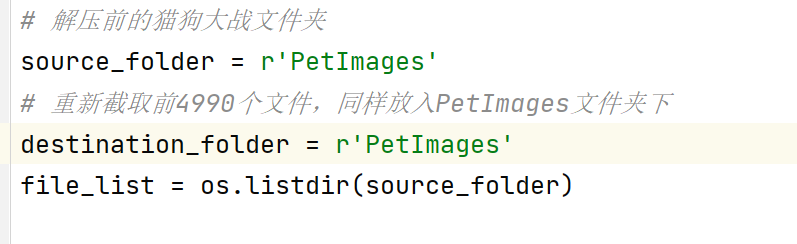

 


* 划分数据集，见**`经典网络/模版代码`**章节下的代码

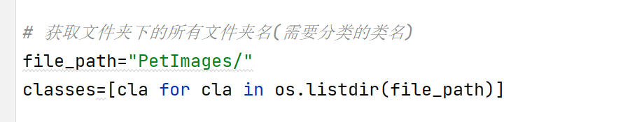

 


* 求出均值与方差并保存下来，见**`经典网络/模版代码`**章节下的代码

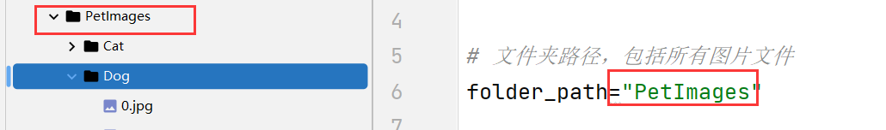

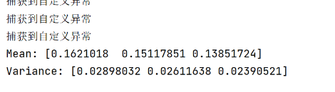


##### 注意

​			<font color="red">**一定要先检查PetImages下的Cat和Dog文件夹下的图片能够正常显示，否则程序会报错**</font>


#### 修改模型

* 将原本224x224x1的图片改为224x224x3的图像
* 修改全连接的输出

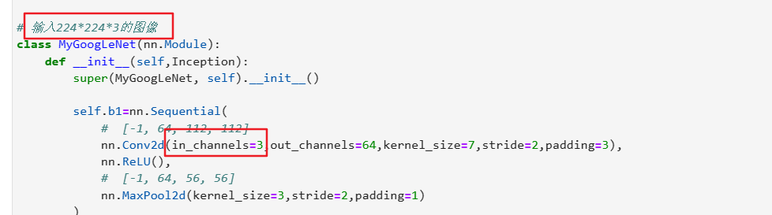 

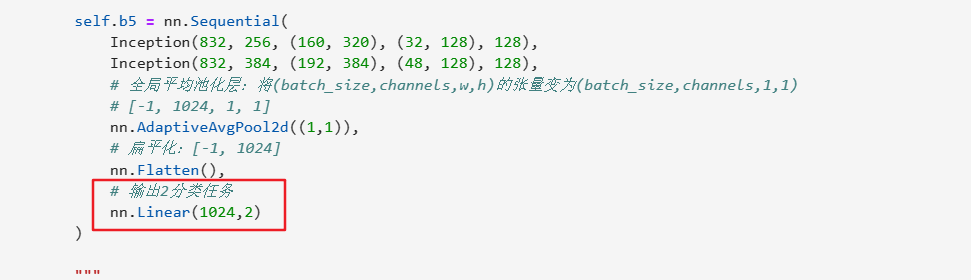  

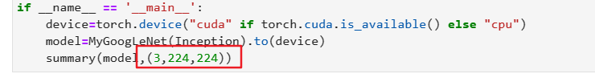 


#### 修改训练代码

* 加载划分数据集后的train文件夹（这里我放在服务器上）、设置预处理算出来的均值与方差
* 适当修改批大小
* 修改模型保存的名字与路径（可选）
* 修改训练轮数

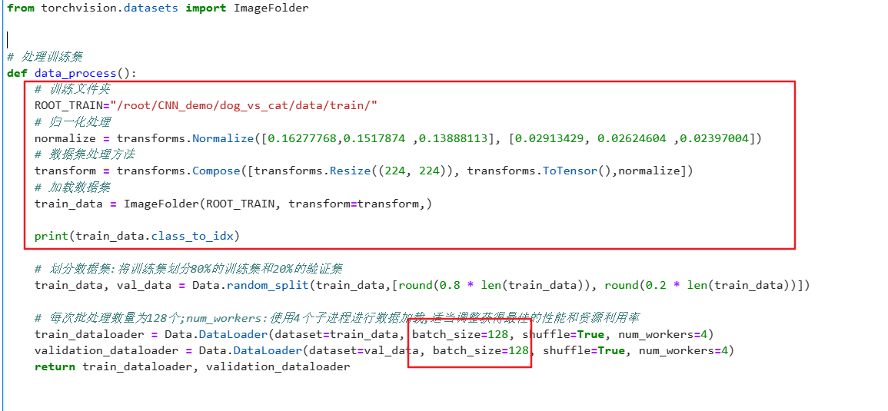

> **注意：这里的标签中0为猫，1为狗**


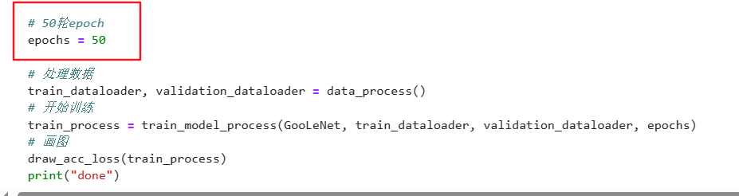

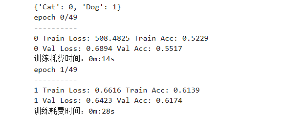 

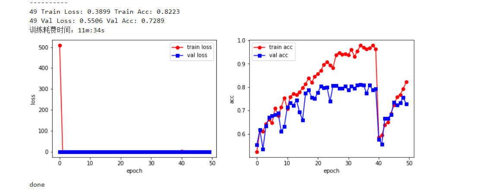


#### 修改测试代码

* 加载路径、设置均值与方差
* 设置目标值对应的类别

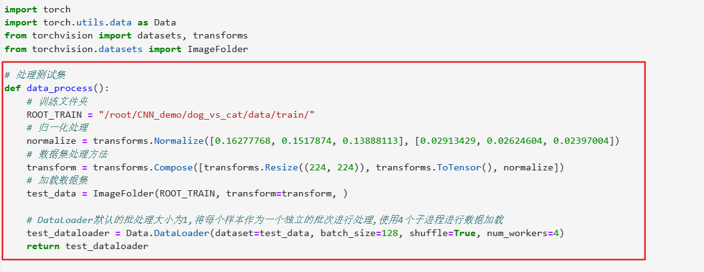

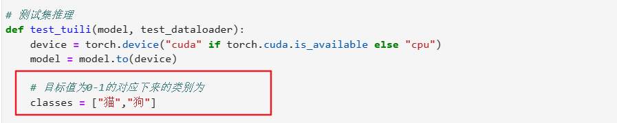

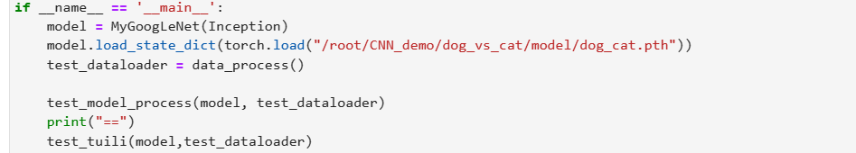

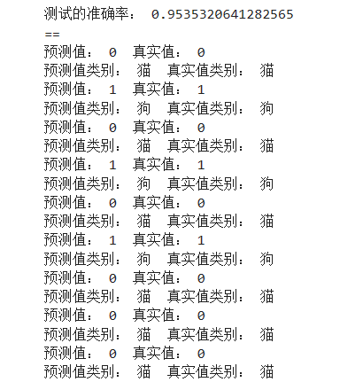 


#### 测试模型

* 预测猫

```python
import torch
from PIL import Image
from torchvision import transforms
# 导入自己的模型
from model import MyGoogLeNet,Inception


if __name__ == '__main__':
    model = MyGoogLeNet(Inception)
    model.load_state_dict(torch.load("dog_cat.pth"))

    classes=["猫","狗"]
    
    # 随意网上找的图片并保存
    img = Image.open("1.jpg")

    # 归一化处理：均值与方差和预处理的保持一致
    normalize = transforms.Normalize([0.16277768, 0.1517874, 0.13888113], [0.02913429, 0.02624604, 0.02397004])
    # 数据集处理方法
    transform = transforms.Compose([transforms.Resize((224, 224)), transforms.ToTensor(), normalize])
    # 应用到图片
    img=transform(img)
    # 添加批次:[1,3,224,224]
    img = img.unsqueeze(0)

    with torch.no_grad():
        model.eval()
        output=model(img)
        pre_lab=torch.argmax(output,dim=1)
        item = pre_lab.item()
        print(f"预测该图片为：{classes[item]}")

```


 

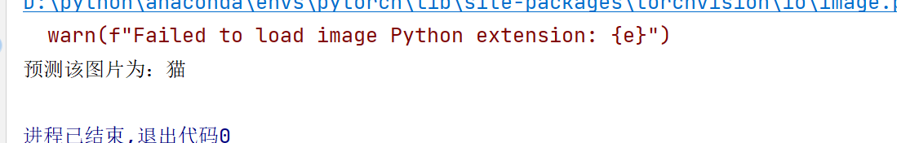


* 预测狗

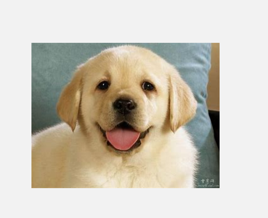 

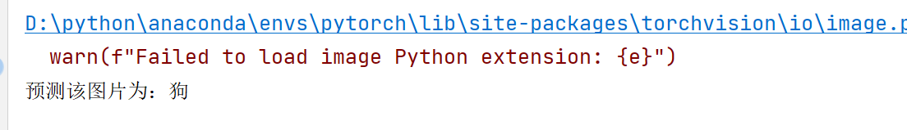


### 佩戴口罩识别

> **以ResNet-18为例**


#### 预处理

* 下载数据集：[【口罩检测数据集】-计算机视觉数据集-极市开发者平台 (cvmart.net)](https://www.cvmart.net/dataSets/detail/807)


* 创建data文件夹，将解压后的with_mask和withou_mask文件夹放进去：**`将里面的with_mask和without_mask文件夹的图片检查一遍，删除不能打开的图片`**

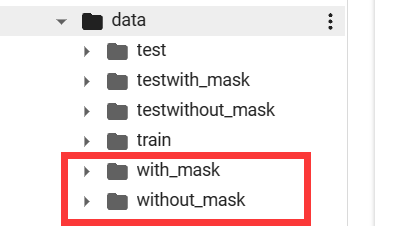 


* 计算均值与方差并保存，见**`经典网络/模版代码`**章节下的代码

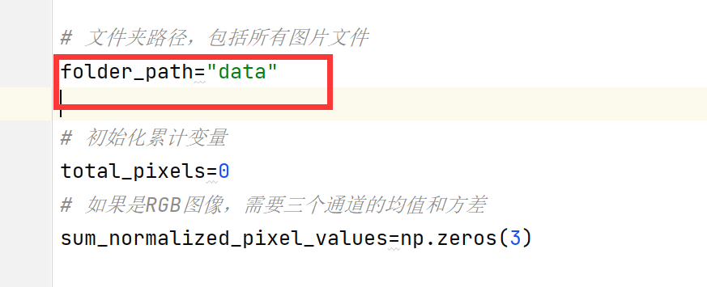

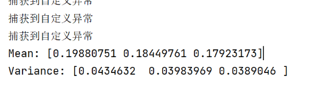 


* 划分数据集，见**`经典网络/模版代码`**章节下的代码


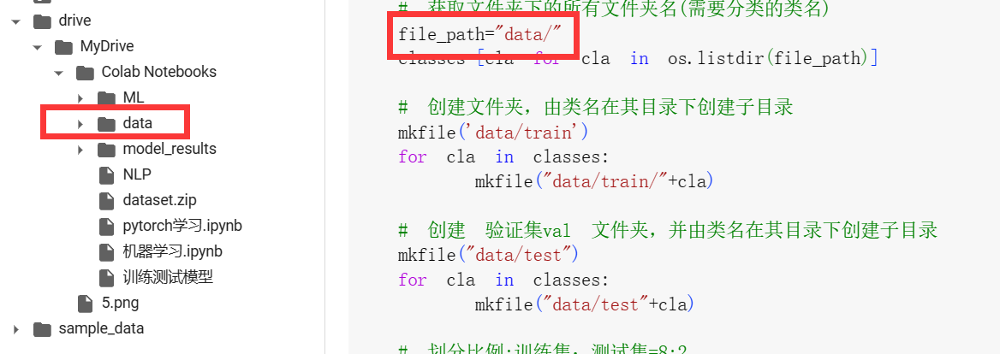

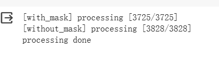 

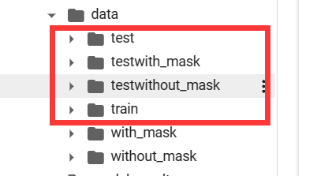 


##### 注意

​			<font color="red">**一定要先检查data下的with_mask和without_mask文件夹下的图片能够正常显示，否则程序会报错**</font>


#### 修改模型

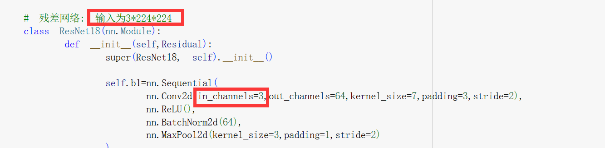


 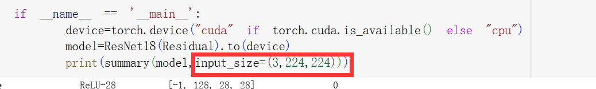

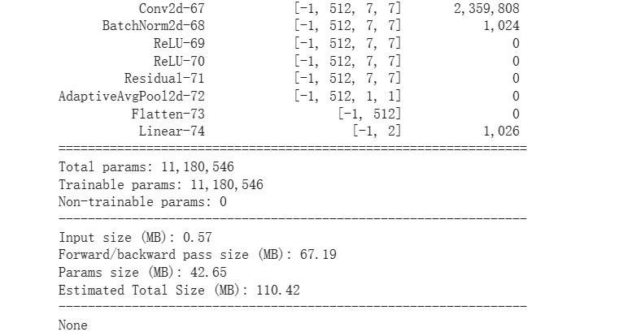


#### 修改训练代码

* 加载划分数据集后的train文件夹（这里我放在服务器上）、设置预处理算出来的均值与方差
* 适当修改批大小
* 修改模型保存的名字与路径（可选）
* 修改训练轮数

```python
from torchvision.datasets import ImageFolder
	
    
    # 训练文件夹
    root_train="/content/drive/MyDrive/Colab Notebooks/data/train"
    # 归一化处理
    normalize=transforms.Normalize([0.19880751, 0.18449761 ,0.17923173],[0.0434632 , 0.03983969, 0.0389046 ])
    # 数据集处理方法
    transform=transforms.Compose([transforms.Resize((224,224)),transforms.ToTensor(),normalize])
    # 加载数据集
    train_data=ImageFolder(root_train,transform=transform)

    # 打印对应的标签：0为戴了口罩，1为没戴口罩
    print(train_data.class_to_idx)

    # 划分数据集:将训练集划分80%的训练集和20%的验证集
    train_data, val_data = Data.random_split(train_data,[round(0.8 * len(train_data)), round(0.2 * len(train_data))])
```

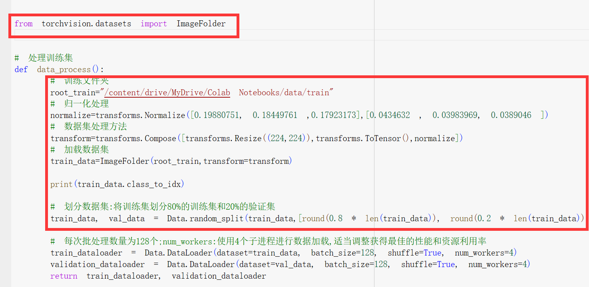

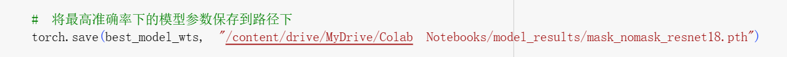

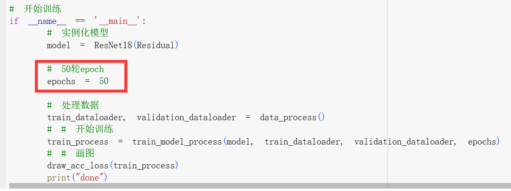

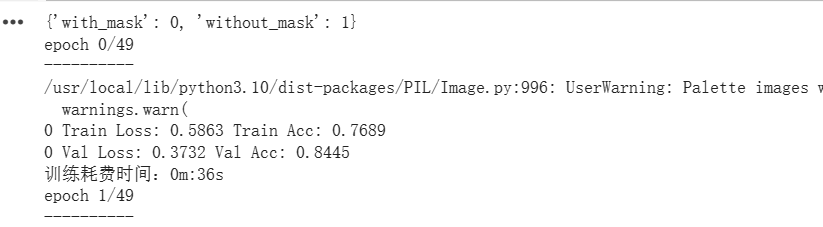

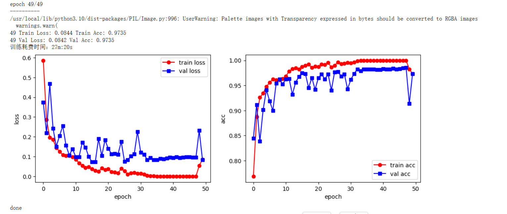


#### 修改测试代码

* 加载路径、设置均值与方差
* 设置目标值对应的类别

```python
from torchvision.datasets import ImageFolder

   # 训练文件夹
    root_train="/content/drive/MyDrive/Colab Notebooks/data/train"
    # 归一化处理
    normalize=transforms.Normalize([0.19880751, 0.18449761 ,0.17923173],[0.0434632 , 0.03983969, 0.0389046 ])
    # 数据集处理方法
    transform=transforms.Compose([transforms.Resize((224,224)),transforms.ToTensor(),normalize])
    # 加载数据集
    train_data=ImageFolder(root_train,transform=transform)

    # DataLoader默认的批处理大小为1,将每个样本作为一个独立的批次进行处理,使用4个子进程进行数据加载
    test_dataloader = Data.DataLoader(dataset=train_data, batch_size=128, shuffle=True, num_workers=4)
```


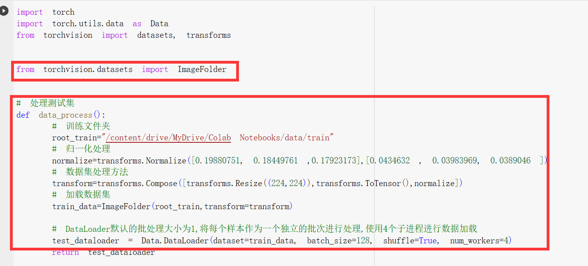

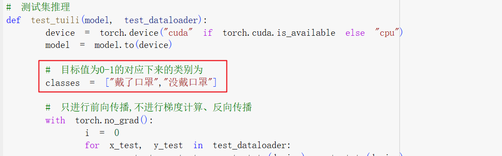

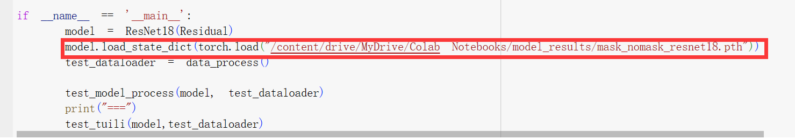

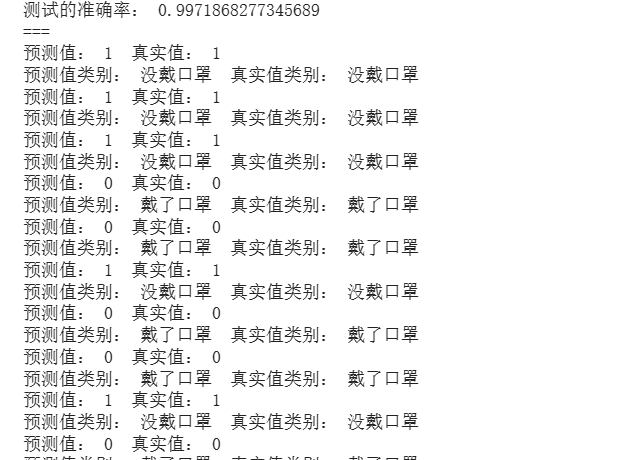 


#### 测试模型

* 预测戴口罩

```python
import torch
from PIL import Image
from torchvision import transforms

# 导入自己的模型
from model import Residual,ResNet18


if __name__ == '__main__':
    model = ResNet18(Residual)
    model.load_state_dict(torch.load("mask_nomask_resnet18.pth"))

    classes=["戴了口罩","没戴口罩"]
    img = Image.open("1.jpg")

    # 归一化处理
    normalize = transforms.Normalize([0.19880751, 0.18449761 ,0.17923173],[0.0434632 , 0.03983969, 0.0389046 ])
    # 数据集处理方法
    transform = transforms.Compose([transforms.Resize((224, 224)), transforms.ToTensor(), normalize])
    # 应用到图片
    img=transform(img)
    # 添加批次
    img = img.unsqueeze(0)

    with torch.no_grad():
        model.eval()
        output=model(img)
        pre_lab=torch.argmax(output,dim=1)
        item = pre_lab.item()
        print(f"预测该图片为：{classes[item]}")
```


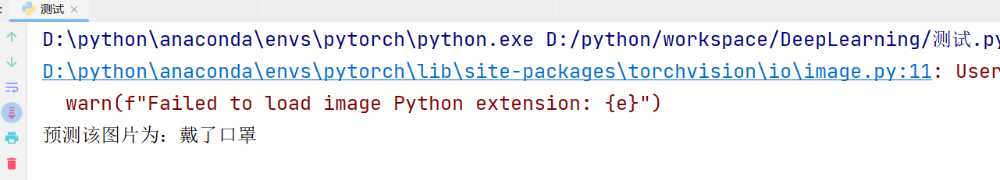


* 预测没戴口罩


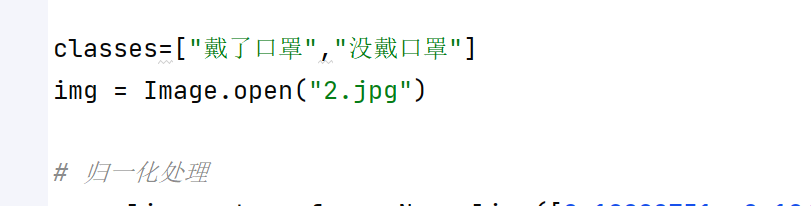


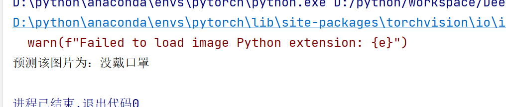


