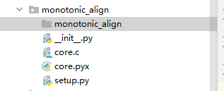
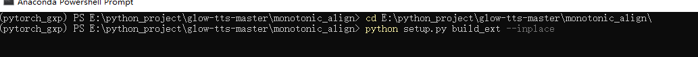
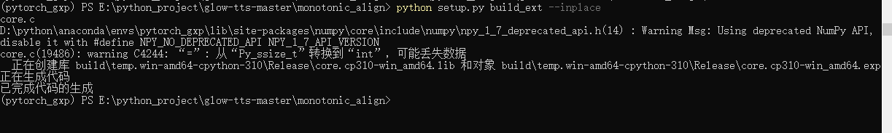
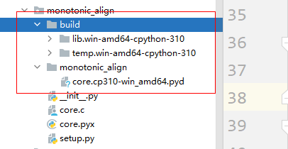
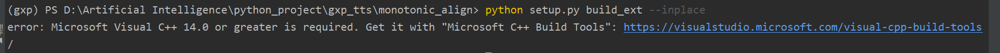
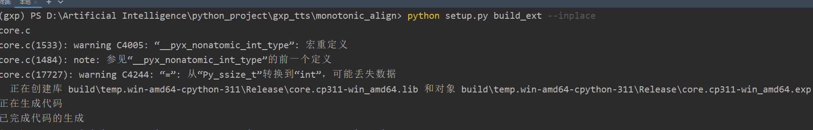

# monotonic_align_search安装

## 安装

1. 在monotonic_align文件夹下新建一个monotonic_align文件夹

 

 


2. 在终端中或者conda环境中进入该目录位置


3. 在终端中或者conda环境中运行以下命令

```python
python setup.py build_ext --inplace
```





 


## 环境配置(若安装出现问题)

> **如果出现以下错误，说明缺少C++依赖，则去下载工具**




工具地址：[Microsoft C++ 生成工具 - Visual Studio](https://visualstudio.microsoft.com/zh-hans/visual-cpp-build-tools/)


> **根据提供的网址，下载对应的依赖**


> **再次执行，即可**

