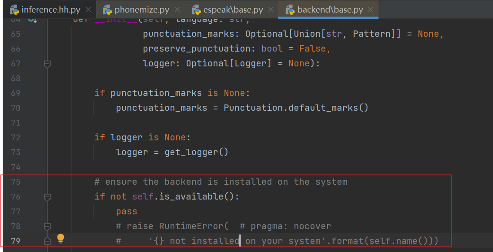
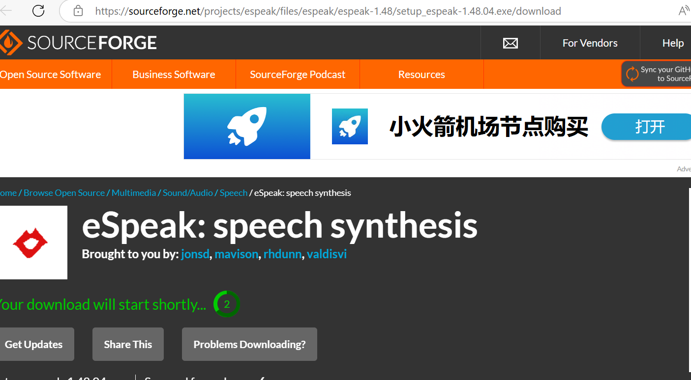
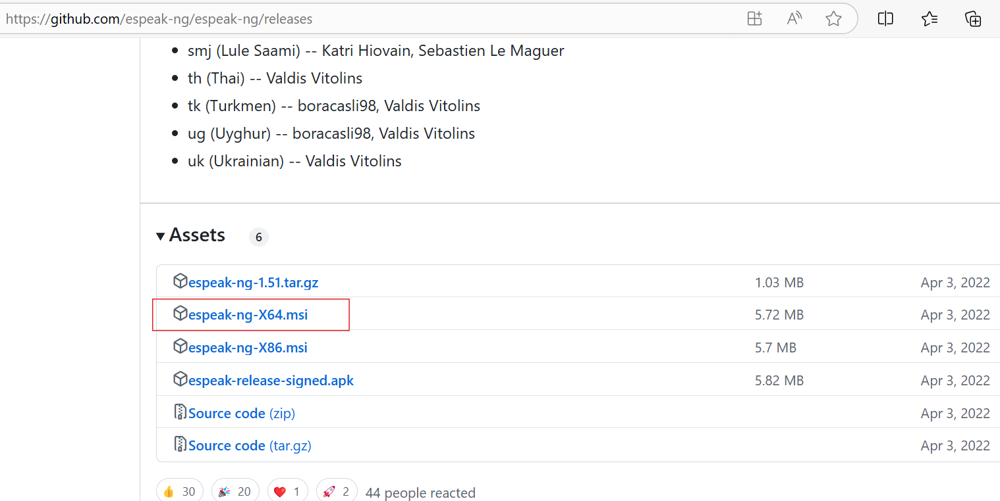
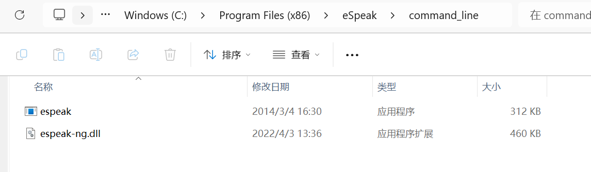
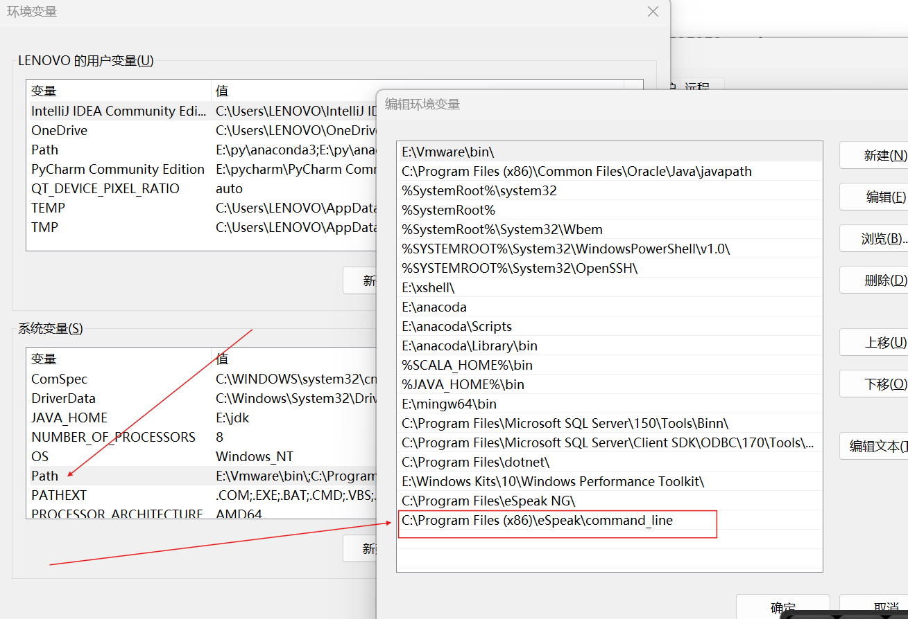
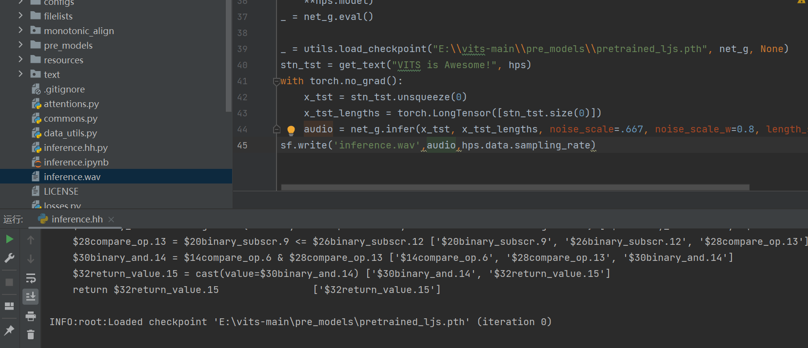
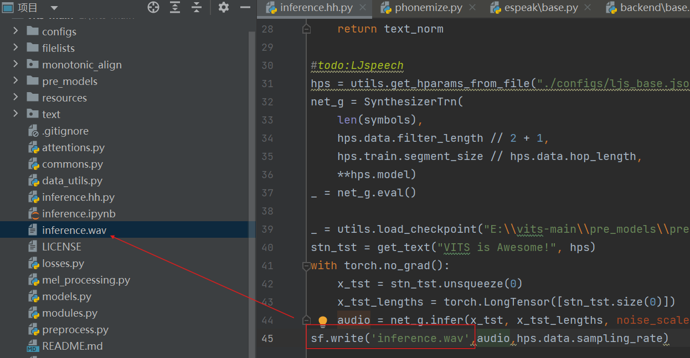
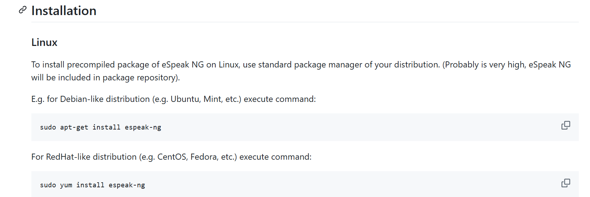

# espeak 环境配置

> ==如果出现No espeak backend found. Install espeak-ng or espeak to your system.错误，则按照下列顺序依次进行配置==


## 1.内部代码修改

> 如果使用vits之类的TTS系统使用到了espeak这个工具则，如果在python代码中报错了，则修改内部代码

根据控制台报错的路径，找到并注释掉  xxx....\site-packages\phonemizer\backend\espeak\base.py 



**将里面的78-79行代码注释掉，直接使用pass替代即可**


## 2.下载espeak所需软件

* 软件1：https://sourceforge.net/projects/espeak/files/espeak/espeak-1.48/setup_espeak-1.48.04.exe/download 

* 软件2：https://github.com/espeak-ng/espeak-ng/releases 



 


## 3.安装注意事项

> ==把以上两个软件保持默认安装位置，即C盘下面，最好不要动它们的路径，并没有多大内存，14MB左右==

* C:\Program Files\eSpeak NG 
* C:\Program Files (x86)\eSpeak 


## 4.移动dll文件

> 复制 espeak-ng目录下的dll文件 ，将==C:\Program Files\eSpeak NG\libespeak-ng.dll 移动到 C:\Program Files (x86)\eSpeak\command_line下，并重命名为 espeak-ng.dll==





## 5.添加环境变量

> ==添加 C:\Program Files (x86)\eSpeak\command_line 到环境变量 Path然后一直确定即可==





## 6.最后一步

>  ==一定要关闭vscosde或pycharm软件，重新打开并运行 VITS等的程序即可==






## 7. 其他问题解决办法

* [RuntimeError: espeak not installed on your system · Issue #44 · bootphon/phonemizer · GitHub](https://github.com/bootphon/phonemizer/issues/44)
* [Exception: [!\] No espeak backend found. Install espeak-ng or espeak to your system. · coqui-ai/TTS · Discussion #1973 · GitHub](https://github.com/coqui-ai/TTS/discussions/1973?sort=new)

* [RuntimeError: espeak not installed on your system【已解决】 - 哔哩哔哩 (bilibili.com)](https://www.bilibili.com/read/cv19743844/)


# Linux版本安装espeak



```bash
# ubuntu等
sudo apt-get install espeak-ng

# centos等
sudo yum install espeak-ng
```

