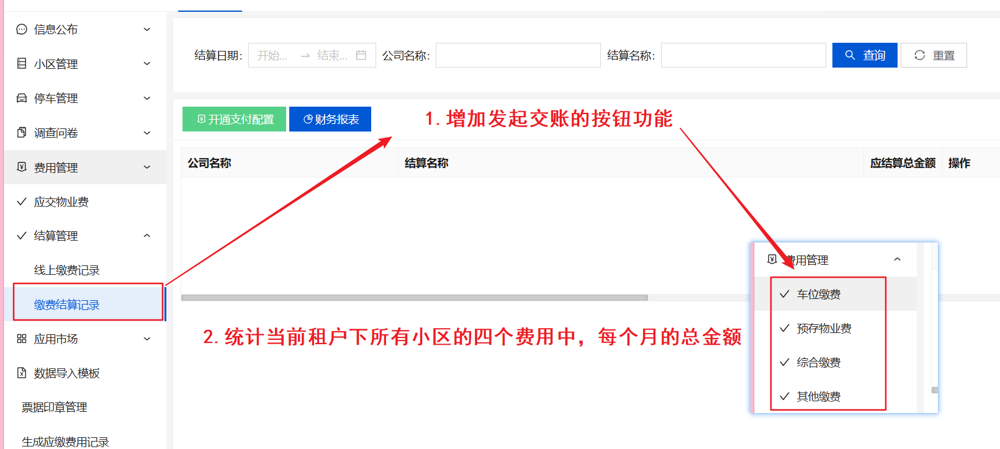
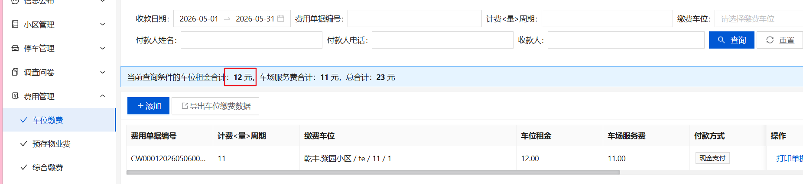
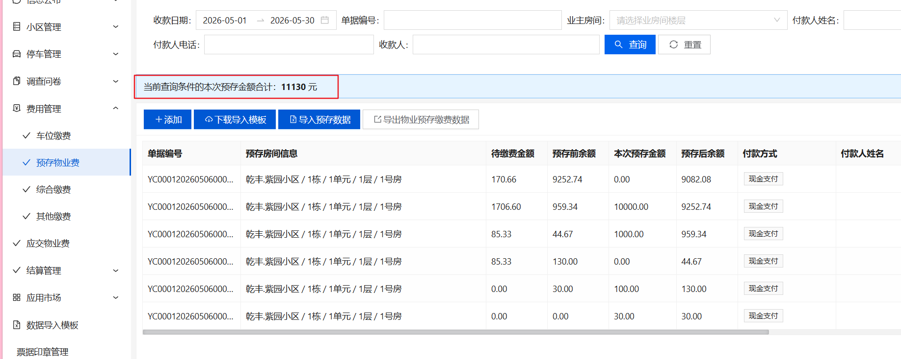
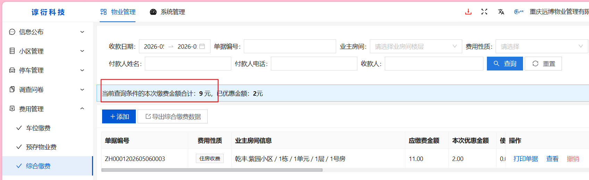
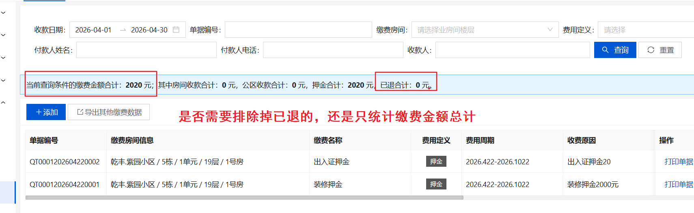
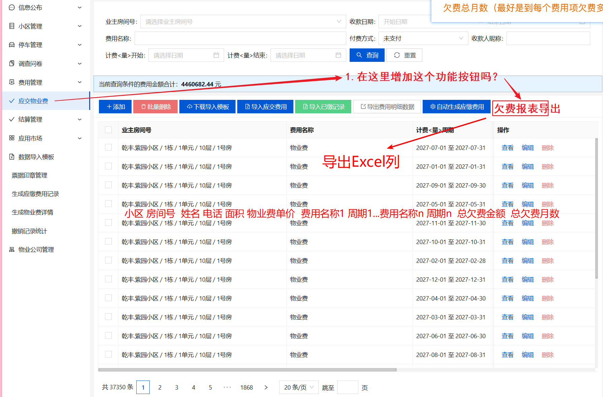
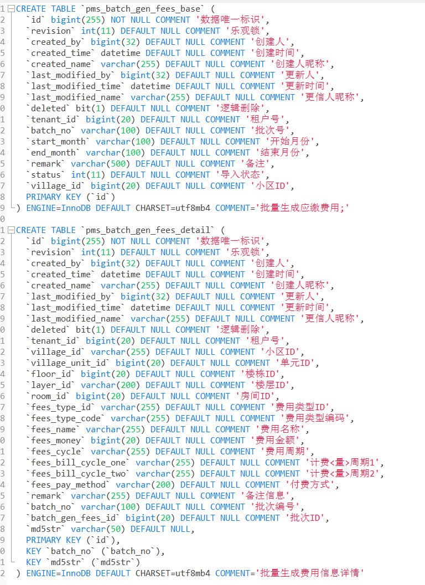
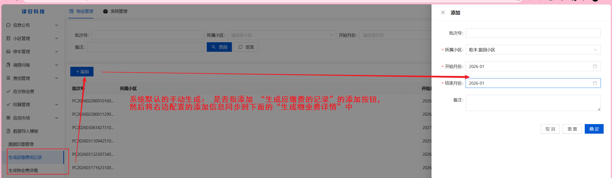

# 1

## 描述

1、在结算记录中，增加一个财务交账功能，该功能主要是收费员将某个收费周期内收的钱交给公司财务，公司财务进行审核确认收到了交账的钱的功能，数据来源四个收费功能中的数据；

日期到月，周期内四个板块的费用，发起交账。统计费用总额是否匹配。

需要审核通过。

需要有一个交账记录，每个记录有一个审核与未审核。

发起交账，审核交账。 主要用于审核费用是否全部到账公司。

转账的也需要统计。（第 6 项里面查看）


## 调整



1. 统计当前租户下的所有小区 的 车位缴费中某月的车位租金合计

   

2. 统计当前租户下的所有小区 的 预存物业费中某月的预存总金额

   

3. 统计当前租户下的所有小区 的 综合缴费 中某月的缴费金额合计

   

4. 统计当前租户下的所有小区 的 其它缴费 中 某月的缴费金额总计（**是否需要排除掉押金合计？**）

   

5. 转账也需要统计（不区分付款方式，只管金额）


## 问题

1. 这里的财务交账功能UI界面需要怎样的样式（eg：弹出的表格居中？）
2. 打开这个交账功能UI界面的逻辑是什么？（eg：手动选择周期，然后将对应周期的数据保存到   “交账记录表（新增表）”中，基本字段：租户、周期（比如三月份）、总金额、审核状态是否通过）
3. 每行的数据代表当前租户的所有小区的某月的总金额（eg：3月的总金额），右边操作按钮  “审核交账” 只是一个审核状态的变更吗


# 4

## 报表2

### 描述

第二个是增加一个欠费报表生成导出，截止到某年某月《默认某月最后一天》的欠费；导出记录字段（一房间一条记录）：小区名称、房间号、业主姓名、联系电话、建筑面积、物业费单价、费用名称 1、金额合计、费用周期，费用名称 2、金额合计、费用周期、、、总欠费金额、欠费总月数；

以费用周期为维度来进行查询。 列出各项费用的欠费金额。

欠费总月数（最好是到每个费用项欠费多少月），最后加个汇总（欠费总额，欠费总月）


### 调整




### 问题

1. 欠费总月数是 group by 费用名称 吗，看它这个名称未支付的总数是多少吗？假设每个费用项有多个名称，欠费总月数是累加嘛（eg：某个用户的物业费有3个月没交、物业管理费有5个月没交）

2. 如果需要将每个费用名称、周期都导出到报表中，可能会存在每行数据的列数不同

   ```
   eg：
   
   xx小区 101 张三 154xxxx  1.1  物业费  
   ```

   


# 5

## 定时任务1

### 描述

第一个定时任务，在费用信息中，由物业公司根据小区配置是否自动生成每月物业费，选择 “自动生成” 就代表每月 1 号零时生成当月的物业费（建面 * 单价），系统默认为 “手动生成”，要注意的是，一旦全面开用，基本上所有物业公司正常情况都会用这个功能，后台会涉及到起超级大的生成量；

给一个配置开关，物业只需要设置开启和关闭，

在当月最后一天生产下个月的【物业费】用。


### 调整

每月开始的1号的0点执行任务：  根据小区配置







1.物业公司根据小区配置来判断是否生成物业费，这个小区配置的页面在哪呢？还是说直接读取pms_setting_info这张表呢
2.系统默认“手动生成的”物业费用是不是就是`生成应缴费用记录`页面配置的


