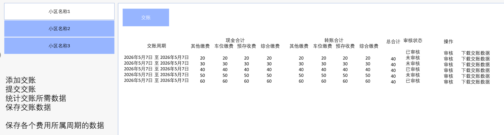
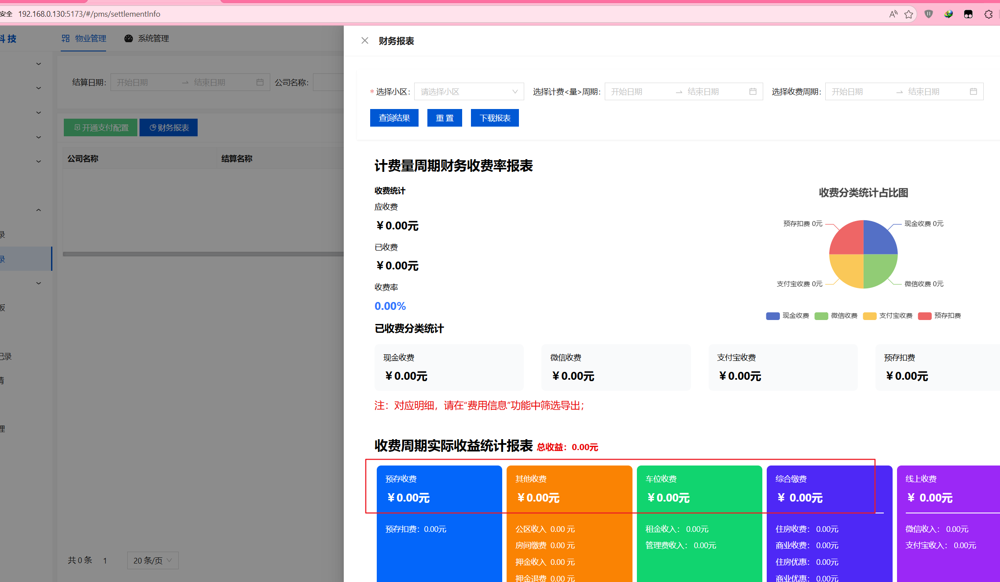
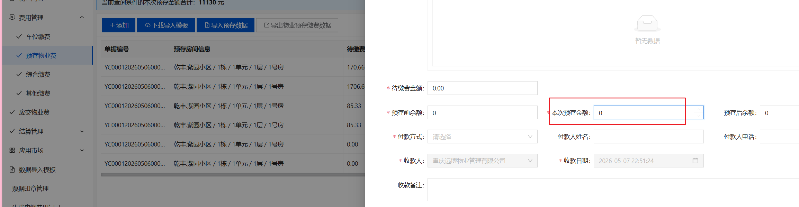
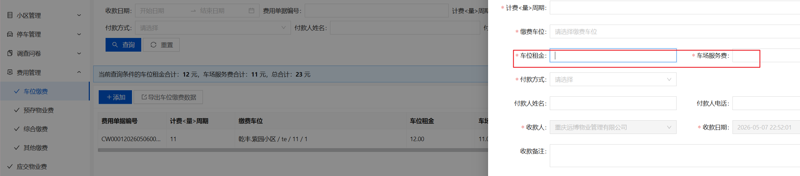
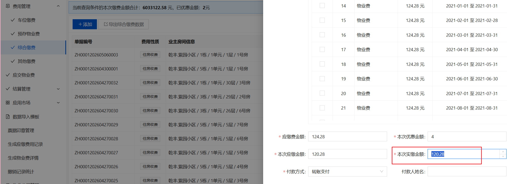
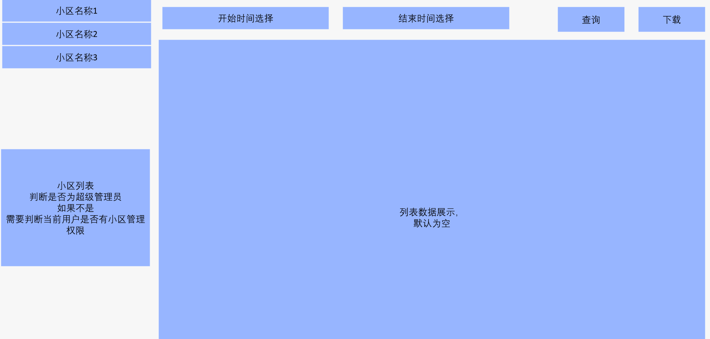
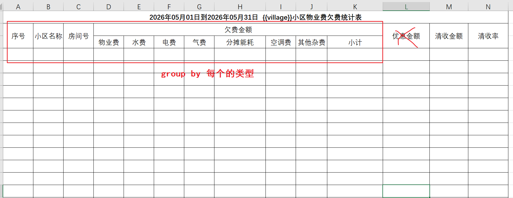
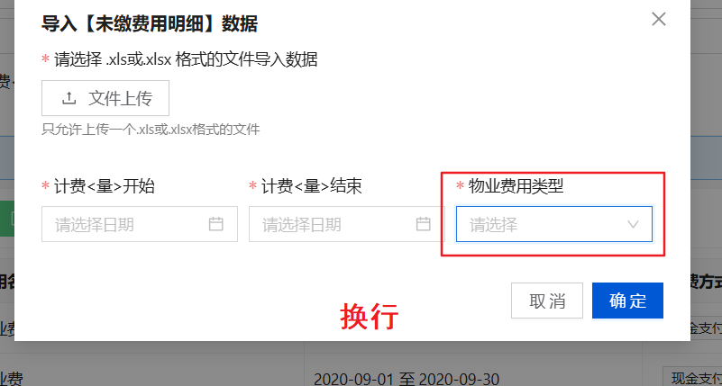

# 1

## 描述

1、在结算记录中，增加一个财务交账功能，该功能主要是收费员将某个收费周期内收的钱交给公司财务，公司财务进行审核确认收到了交账的钱的功能，数据来源四个收费功能中的数据；

**是选某年某月某日至某年某月某日的收费日期**，周期内四个板块的费用，发起交账。统计费用总额是否匹配。

需要审核通过。

需要有一个交账记录，每个记录有一个审核与未审核。

发起交账，审核交账。 主要用于审核费用是否全部到账公司。

转账的也需要统计。（第 6 项里面查看）


## 调整

页面UI：将该页面放在结算管理下、左右结构；左边是当前租户下的小区（判断逻辑：是否为超管，如果不是需要判断当前用户是否有小区管理权限），右边上面一个交账按钮，下面是总的交账列表数据，默认是空的，审核按钮需要权限控制



 

这里是弹出右侧抽屉框，当选择了具体的时间后会统计数据然后保存一条记录到上面的列表+8条hand_over中去


这里的统计规则：根据每个费用表里面的付款方式（新加的三种字典方式）来统计的，每个数据可以参考下面的SQL语句










```
DB表：总的交账列表数据、四张费用表_hand_over、 四张费用表_detail_hand_over
	备注：其中八张hand_over表的结构和原本四张费用表一致,新增四个字段：交账开始时间、结束时间、总的交账表记录ID、审核状态
```


# 4

## 报表2

### 描述

第二个是增加一个欠费报表生成导出，截止到某年某月《默认某月最后一天》的欠费；导出记录字段（一房间一条记录）：小区名称、房间号、业主姓名、联系电话、建筑面积、物业费单价、费用名称 1、金额合计、费用周期，费用名称 2、金额合计、费用周期、、、总欠费金额、欠费总月数；

以费用周期为维度来进行查询。 列出各项费用的欠费金额。

欠费总月数（最好是到每个费用项欠费多少月），最后加个汇总（欠费总额，欠费总月）


新增报表1：1.新增一个页面，查看清收率的数据汇总


### 调整

新增一个页面，该页面保存到结算管理 中



列表数据展示的字段：




# 5

## 定时任务1

### 描述

第一个定时任务，在费用信息中，由物业公司根据小区配置是否自动生成每月物业费，选择 “自动生成” 就代表每月 1 号零时生成当月的物业费（建面 * 单价），系统默认为 “手动生成”，要注意的是，一旦全面开用，基本上所有物业公司正常情况都会用这个功能，后台会涉及到起超级大的生成量；

给一个配置开关，物业只需要设置开启和关闭，

在当月最后一天生产下个月的【物业费】用。


### 调整

每月开始的1号的0点执行任务：  根据小区配置


1.物业公司根据小区配置来判断是否生成物业费，这个小区配置的页面在哪呢？还是说直接读取pms_setting_info这张表呢
2.系统默认“手动生成的”物业费用是不是就是`生成应缴费用记录`页面配置的


# 6

1.费用管理中：新增数据时，默认将付款方式设置为现金支付

2.PMS_FEES_TYPE 字典类型 value调整为数字

3.样式调整




